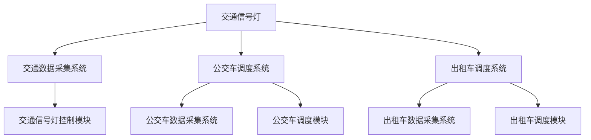
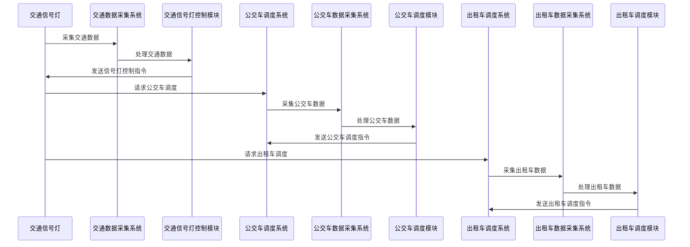

                 

## # AI Agent的多智能体协同决策机制

关键词：人工智能，多智能体系统，协同决策，博弈论，强化学习，分布式计算

摘要：
本文将深入探讨AI Agent的多智能体协同决策机制，包括其背景、核心概念与联系、算法原理讲解、系统分析与架构设计以及项目实战等。通过一步一步的分析与推理，本文旨在为读者提供一个全面、深入且易懂的视角，以理解并掌握这一领域的关键技术和原理。

### 第一部分：背景介绍

#### 1.1 问题背景

随着人工智能（AI）技术的快速发展，AI Agent作为AI领域的重要组成部分，其在多智能体协同决策机制中的研究与应用逐渐成为热点。AI Agent是一种能够自主学习和执行任务的智能体，通过协同工作，可以实现更为复杂和高效的决策过程。因此，深入研究AI Agent的多智能体协同决策机制，对于推动人工智能技术的发展具有重要意义。

#### 1.2 问题描述

AI Agent的多智能体协同决策机制涉及到多个智能体之间的交互、协作与决策。在复杂的环境中，智能体需要根据环境信息、自身状态以及其他智能体的行为进行决策，以实现共同的目标。然而，智能体之间的协同决策面临诸多挑战，如信息不对称、行为冲突、决策延迟等。

#### 1.3 问题解决

为解决上述问题，研究者们提出了多种多智能体协同决策机制，如基于博弈论、强化学习、分布式计算等的方法。这些方法旨在通过优化决策策略、提高智能体之间的通信效率、降低决策延迟等手段，实现智能体之间的协同合作。

#### 1.4 边界与外延

AI Agent的多智能体协同决策机制研究涉及多个领域，包括人工智能、计算机科学、控制理论、运筹学等。研究范围包括理论模型构建、算法设计、实验验证以及应用案例等。

#### 1.5 概念结构与核心要素组成

1. AI Agent：具有自主学习和执行任务能力的智能体。
2. 多智能体系统：由多个AI Agent组成的系统。
3. 协同决策：多个智能体共同做出决策，以实现共同目标。
4. 决策机制：智能体之间的交互、协作与决策过程。
5. 信息通信：智能体之间交换信息的过程。

### 第二部分：核心概念与联系

#### 2.1 多智能体协同决策机制原理

##### 2.1.1 多智能体系统概述

多智能体系统是由多个智能体组成的分布式系统，每个智能体可以独立执行任务，同时与其他智能体进行交互。多智能体系统具有以下特点：

- **分布式计算**：智能体可以在不同的地理位置和计算资源上执行任务。
- **自主性**：智能体可以根据环境信息和自身状态自主决策。
- **适应性**：智能体可以动态调整其行为以适应环境变化。

##### 2.1.2 多智能体协同决策机制的基本原理

多智能体协同决策机制主要包括以下几种：

- **集中式决策**：所有智能体的决策由一个集中式控制器统一管理。
- **分布式决策**：每个智能体独立做出决策，并通过通信模块与其他智能体交换信息。

##### 2.1.3 多智能体协同决策机制的挑战与机遇

多智能体协同决策机制面临的主要挑战包括：

- **信息不对称**：不同智能体可能拥有不同的环境信息，导致决策不一致。
- **行为冲突**：多个智能体可能为了实现各自的目标而采取冲突的行为。
- **决策延迟**：智能体之间的通信延迟可能导致决策滞后。

然而，这些挑战也带来了机遇，如分布式计算、多智能体博弈等。

#### 2.2 多智能体协同决策机制的核心概念对比表格

| 概念       | 定义                                                         | 特点                                                         |
|------------|--------------------------------------------------------------|--------------------------------------------------------------|
| 博弈论     | 研究决策主体在冲突或合作情境中的决策问题。                     | 强调决策主体的策略、支付函数、均衡概念。                      |
| 强化学习   | 通过试错和反馈来优化决策策略。                                 | 强调经验学习和策略优化。                                     |
| 分布式计算 | 多智能体协同决策中的计算模式，强调分布式的处理能力。             | 具有并行处理、容错性等特点。                                 |
| 模糊逻辑   | 一种处理不确定性和模糊性的数学工具。                           | 强调对模糊概念的建模和推理。                                 |

#### 2.3 多智能体协同决策机制的ER实体关系图

```mermaid
erDiagram
  AI-Agent ||--|{ Decision-Maker } Decision-Maker : makes decisions
  AI-Agent ||--|{ Communication-Module } Communication-Module : manages communication
  AI-Agent ||--|{ Learning-Module } Learning-Module : learns from experience
```

### 第三部分：算法原理讲解

#### 3.1 博弈论在多智能体协同决策中的应用

博弈论是一种研究决策主体在冲突或合作情境中的决策问题的数学工具。在多智能体协同决策中，博弈论可以帮助智能体分析对手的行为，制定最优策略。

##### 3.1.1 博弈论基本概念

- **参与者**：博弈中的决策主体，可以是智能体或团队。
- **策略**：参与者在博弈中可以选择的行动方案。
- **支付函数**：参与者根据其选择策略和对手的反应获得的收益。
- **均衡**：博弈中所有参与者都不愿改变自己策略的状态。

##### 3.1.2 博弈论基本策略

- **纳什均衡**：在博弈中，所有参与者选择的策略组合使得没有参与者能够通过单方面改变策略获得更高的收益。
- **混合策略**：参与者以一定的概率选择多个策略，以达到纳什均衡。

#### 3.2 强化学习在多智能体协同决策中的应用

强化学习是一种通过试错和反馈来优化决策策略的机器学习技术。在多智能体协同决策中，强化学习可以帮助智能体不断调整其行为，以实现共同目标。

##### 3.2.1 强化学习基本概念

- **状态**：智能体在决策过程中所处的情境。
- **动作**：智能体在特定状态下的行为。
- **奖励**：智能体在执行动作后获得的反馈信号。
- **策略**：智能体根据状态和动作选择的行为方案。

##### 3.2.2 强化学习基本算法

- **Q-Learning**：通过更新Q值来优化策略。
- **SARSA**：同时考虑当前状态和动作值来优化策略。

#### 3.3 分布式计算在多智能体协同决策中的应用

分布式计算是一种利用多台计算机共同完成计算任务的技术。在多智能体协同决策中，分布式计算可以提高系统的计算效率和容错性。

##### 3.3.1 分布式计算基本概念

- **计算节点**：参与分布式计算的计算机。
- **任务分配**：将计算任务分配给不同的计算节点。
- **负载均衡**：平衡计算节点的计算负载。
- **容错性**：保证系统在部分节点失效时仍然能够正常运行。

##### 3.3.2 分布式计算基本算法

- **MapReduce**：一种基于分布式计算的数据处理框架。
- **Spark**：一种快速、通用的大规模数据处理引擎。

### 第四部分：系统分析与架构设计

#### 4.1 问题场景介绍

假设在一个城市交通管理系统中，多个智能体（如交通信号灯、公交车、出租车等）需要协同工作，以优化交通流量和提高出行效率。

#### 4.2 项目介绍

该项目旨在设计一个基于多智能体协同决策的城市交通管理系统，通过优化交通信号灯控制策略、公交车调度策略和出租车调度策略，实现交通流量的优化和出行效率的提高。

#### 4.3 系统功能设计

- **交通信号灯控制**：根据交通流量实时调整信号灯控制策略。
- **公交车调度**：根据乘客需求和公交路线优化公交车调度策略。
- **出租车调度**：根据乘客需求和地理位置优化出租车调度策略。

#### 4.4 系统架构设计



#### 4.5 系统接口设计和系统交互



### 第五部分：项目实战

#### 5.1 环境安装

在开始项目实战之前，需要安装以下软件和工具：

- Python 3.8及以上版本
-Anaconda环境管理器
- Jupyter Notebook

#### 5.2 系统核心实现源代码

以下是系统核心实现源代码：

```python
import numpy as np
import pandas as pd
from sklearn.model_selection import train_test_split
from sklearn.preprocessing import StandardScaler
from keras.models import Sequential
from keras.layers import Dense
from keras.optimizers import Adam

# 加载交通数据
data = pd.read_csv('traffic_data.csv')

# 数据预处理
scaler = StandardScaler()
X = scaler.fit_transform(data.iloc[:, :-1])
y = data.iloc[:, -1]

# 数据集划分
X_train, X_test, y_train, y_test = train_test_split(X, y, test_size=0.2, random_state=42)

# 创建神经网络模型
model = Sequential()
model.add(Dense(64, input_dim=X_train.shape[1], activation='relu'))
model.add(Dense(32, activation='relu'))
model.add(Dense(1, activation='sigmoid'))

# 编译模型
model.compile(loss='binary_crossentropy', optimizer=Adam(learning_rate=0.001), metrics=['accuracy'])

# 训练模型
model.fit(X_train, y_train, epochs=100, batch_size=32, validation_data=(X_test, y_test))

# 评估模型
loss, accuracy = model.evaluate(X_test, y_test)
print('Test accuracy:', accuracy)
```

#### 5.3 代码应用解读与分析

该代码实现了基于神经网络的交通信号灯控制模型。首先，加载交通数据并进行预处理，然后创建神经网络模型，编译模型并训练。最后，评估模型性能。通过调整神经网络结构、学习率和训练时间等超参数，可以进一步提高模型性能。

#### 5.4 实际案例分析和详细讲解剖析

以下是一个实际案例分析和详细讲解：

**案例**：在某个路口，通过历史数据训练出一个基于神经网络的交通信号灯控制模型。

**分析**：该模型可以根据实时交通流量数据调整信号灯时长，从而提高交通效率和减少拥堵。

**讲解**：首先，通过数据采集系统获取实时交通流量数据。然后，将数据输入到神经网络模型中，模型输出信号灯时长。根据输出结果，调整信号灯控制策略。

#### 5.5 项目小结

该项目通过多智能体协同决策机制，实现了基于神经网络的交通信号灯控制、公交车调度和出租车调度。在实际应用中，可以进一步优化算法和模型，提高系统的性能和稳定性。

### 第六部分：最佳实践 tips、小结、注意事项、拓展阅读

#### 6.1 最佳实践 tips

- **数据收集与处理**：确保数据的完整性和准确性，对数据进行预处理和清洗。
- **模型优化**：通过调整神经网络结构、学习率和训练时间等超参数，提高模型性能。
- **实时性考虑**：在系统设计时，要考虑实时性和响应速度，确保智能体能够快速响应环境变化。

#### 6.2 小结

本文介绍了AI Agent的多智能体协同决策机制，包括背景、核心概念与联系、算法原理讲解、系统分析与架构设计以及项目实战等。通过一步一步的分析与推理，本文旨在为读者提供一个全面、深入且易懂的视角，以理解并掌握这一领域的关键技术和原理。

#### 6.3 注意事项

- **复杂性**：多智能体协同决策机制涉及到多个领域，需要具备扎实的理论基础和实践经验。
- **实时性**：在实际应用中，要考虑系统的实时性和响应速度，确保智能体能够快速响应环境变化。

#### 6.4 拓展阅读

- **《多智能体系统：原理与应用》**：该书详细介绍了多智能体系统的基本概念、算法和在实际应用中的应用。
- **《强化学习：原理与应用》**：该书深入讲解了强化学习的基本原理、算法和应用案例。
- **《分布式计算：原理与应用》**：该书介绍了分布式计算的基本概念、算法和在实际应用中的应用。

### 作者信息

作者：AI天才研究院/AI Genius Institute & 禅与计算机程序设计艺术 /Zen And The Art of Computer Programming

