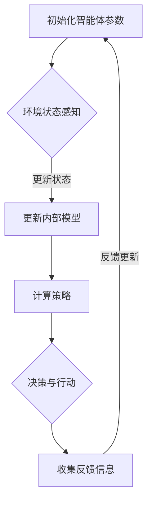
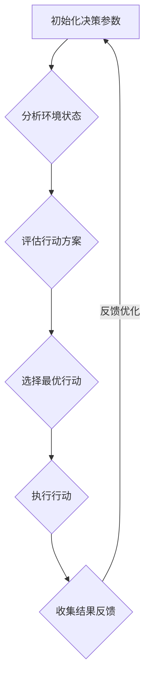
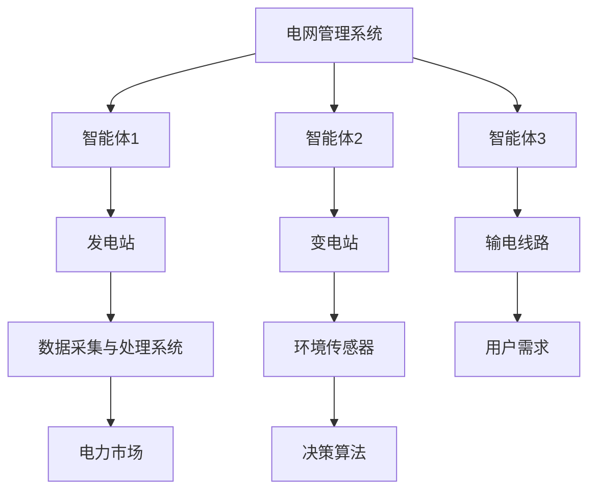
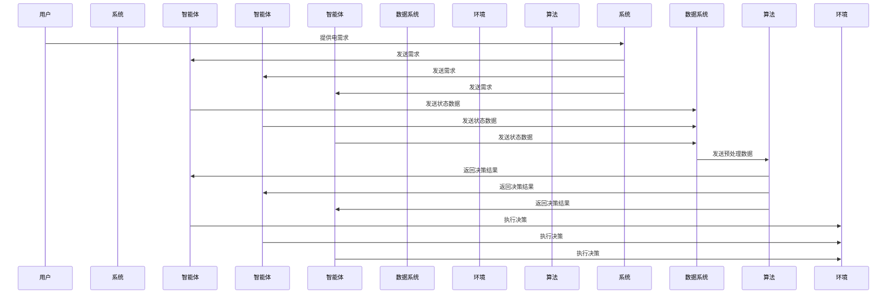

                 

### 引言

随着人工智能（AI）技术的快速发展，多智能体系统（Multi-Agent Systems）逐渐成为研究的热点。多智能体系统由多个相互协作的智能体组成，每个智能体具有独立的决策能力和行动能力。在这些系统中，智能体之间通过通信和协作来实现共同的目标。多智能体协同学习与决策是其中的一项重要技术，它旨在通过多个智能体的协同学习来实现高效的决策。

#### 核心概念术语说明

1. **多智能体系统（Multi-Agent Systems）**：由多个智能体组成的系统，每个智能体具有独立的决策能力和行动能力。
2. **智能体（Agent）**：具有智能和自主能力的实体，能够感知环境、做出决策并采取行动。
3. **协同学习（Cooperative Learning）**：多个智能体通过相互交流和协作来共同学习和优化性能。
4. **决策（Decision Making）**：智能体在给定环境中选择最佳行动的过程。
5. **协同决策（Cooperative Decision Making）**：多个智能体共同参与决策过程，以实现整体目标。

#### 问题背景

在现实生活中，许多复杂问题需要多个智能体的协同解决。例如，在自动驾驶领域，多个传感器和计算单元需要实时协同工作，以实现对路况的感知、车辆的导航和控制。在工业生产中，多个机器人需要协作完成复杂的生产任务。这些场景都涉及到多智能体协同学习与决策的问题。

#### 问题描述

多智能体协同学习与决策面临以下挑战：

1. **信息共享与隐私保护**：智能体之间需要共享信息，但又必须保护各自的隐私。
2. **协调一致性**：智能体之间需要保持协调一致，以实现共同目标。
3. **实时性**：智能体需要在短时间内做出决策，以应对动态环境。
4. **不确定性与鲁棒性**：智能体需要应对环境中的不确定性和异常情况。

#### 问题解决

解决多智能体协同学习与决策问题的方法包括：

1. **基于通信的协同算法**：通过智能体之间的通信来实现协同学习与决策。
2. **分布式计算与优化**：利用分布式计算技术来提高系统的效率和鲁棒性。
3. **强化学习**：通过智能体与环境交互来学习最佳策略。
4. **混合智能体系统**：结合不同类型的智能体，实现更高效的协同决策。

#### 边界与外延

多智能体协同学习与决策的研究边界包括：

1. **智能体类型**：不同类型的智能体如何协同工作。
2. **环境复杂性**：智能体在复杂环境中的协同能力。
3. **应用领域**：多智能体系统在不同领域的应用研究。

#### 概念结构与核心要素组成

多智能体协同学习与决策的概念结构包括：

1. **智能体模型**：描述智能体的行为和能力。
2. **环境模型**：描述智能体所处的环境。
3. **协同算法**：实现智能体之间协同学习的算法。
4. **决策模型**：描述智能体如何做出决策。
5. **优化目标**：智能体协同学习的优化目标。

通过上述分析，我们可以看到，多智能体协同学习与决策是一项涉及多个领域的交叉技术，具有广泛的应用前景。在接下来的章节中，我们将进一步探讨多智能体协同学习与决策的算法原理、系统架构设计和实际应用。

### 多智能体系统概述

#### 多智能体系统的定义与分类

多智能体系统（Multi-Agent Systems，MAS）是指由多个具有独立决策能力和行动能力的智能体组成的系统。这些智能体通过相互通信和协作来实现共同的目标。根据智能体的交互方式，多智能体系统可以分为以下几类：

1. **协作型智能体系统**：智能体之间通过共享信息和协同工作来实现共同目标。这种类型的智能体系统在分布式计算、多机器人协作等领域有广泛应用。
2. **竞争型智能体系统**：智能体之间相互竞争，以获取资源或实现个人目标。这种类型的智能体系统在金融市场、拍卖系统等领域有广泛应用。
3. **混合型智能体系统**：同时包含协作和竞争的智能体系统。这种类型的智能体系统在社交网络、城市交通等领域有广泛应用。

#### 多智能体系统的研究意义与应用场景

多智能体系统的研究具有重要意义和应用价值。首先，多智能体系统能够处理复杂的、动态变化的系统环境，提高系统的整体性能和鲁棒性。其次，多智能体系统可以实现自主学习和适应，提高系统的智能水平。最后，多智能体系统为解决复杂问题提供了新的思路和方法。

在实际应用场景中，多智能体系统广泛应用于以下几个方面：

1. **智能交通系统**：通过多个智能体协同工作，实现交通信号优化、车辆路径规划等，提高交通效率和安全性。
2. **智能制造系统**：利用多个智能体协作完成复杂的生产任务，提高生产效率和灵活性。
3. **智能医疗系统**：通过多个智能体协同工作，实现医疗数据的处理、分析和管理，提高医疗服务的质量和效率。
4. **智能社交网络**：通过多个智能体协同工作，实现用户推荐、内容分发等，提高社交网络的用户体验和活跃度。
5. **无人驾驶系统**：通过多个智能体协同工作，实现车辆的感知、决策和控制，提高自动驾驶的安全性和可靠性。

#### 多智能体系统的研究现状与发展趋势

目前，多智能体系统的研究已经取得了一系列重要成果。在协作型智能体系统方面，研究者提出了多种协同学习算法和优化方法，如多智能体强化学习、分布式优化算法等。在竞争型智能体系统方面，研究者探讨了智能体之间的博弈策略和均衡分析。在混合型智能体系统方面，研究者致力于研究智能体之间的协作与竞争机制。

未来，多智能体系统的研究将继续深入，有望在以下几个方面取得突破：

1. **智能体自主决策与协作**：研究智能体如何实现自主决策，以及如何实现高效的协作。
2. **智能体多样化**：研究不同类型智能体的交互和协同机制，实现更复杂的系统架构。
3. **智能体安全性**：研究智能体系统的安全性和隐私保护机制，提高系统的可靠性和安全性。
4. **智能体适应性与鲁棒性**：研究智能体如何适应动态变化的系统环境，提高系统的鲁棒性和稳定性。
5. **跨领域应用**：将多智能体系统应用于更多的领域，实现更广泛的应用价值。

总之，多智能体系统作为人工智能领域的一个重要分支，具有广泛的应用前景和重要的研究价值。在未来的发展中，多智能体系统将不断推动人工智能技术的发展，为人类社会带来更多的创新和变革。

### AI Agent基本概念

AI Agent，即人工智能智能体，是人工智能领域中的核心概念之一。智能体是指具有智能和自主能力的实体，能够感知环境、理解情境、做出决策并采取行动。AI Agent作为一种特殊的智能体，具有以下主要特点：

#### AI Agent的定义

AI Agent可以被定义为一个具有感知、理解和行动能力的计算机程序，能够在特定环境下自主决策和执行任务。它们通过感知环境中的信息，利用内部模型进行推理和学习，然后生成相应的行动方案，最终实现目标。

#### AI Agent的特点

1. **自主性**：AI Agent具有独立决策的能力，能够在没有人类干预的情况下运行。
2. **适应性**：AI Agent能够根据环境的变化和新的信息进行调整，以实现最佳性能。
3. **交互性**：AI Agent能够与用户或其他智能体进行交互，以获取更多的信息和资源。
4. **学习性**：AI Agent能够通过经验和数据的学习，不断优化自身的决策能力。
5. **目标导向性**：AI Agent的行为和决策都是围绕实现特定目标而进行的。

#### AI Agent的分类

根据不同的标准，AI Agent可以被分为多种类型：

1. **基于规则的智能体**：这种智能体通过预定义的规则来做出决策，适用于规则明确、问题简单的场景。
2. **基于模型的智能体**：这种智能体通过构建环境模型和决策模型来做出决策，适用于复杂和动态的环境。
3. **基于学习的智能体**：这种智能体通过机器学习算法来获取环境信息，并利用这些信息进行决策，适用于大规模数据和高复杂性场景。
4. **混合智能体**：这种智能体结合了基于规则、基于模型和基于学习的方法，以实现更好的决策效果。

#### AI Agent在多智能体系统中的应用

在多智能体系统中，AI Agent作为基本单元，通过相互通信和协作来实现共同目标。以下是AI Agent在多智能体系统中的应用场景：

1. **分布式计算**：多个AI Agent可以协同工作，分担计算任务，提高系统的计算效率。
2. **协同决策**：多个AI Agent可以共同参与决策过程，以实现更全面的评估和更优的决策结果。
3. **任务分配**：AI Agent可以根据自身的能力和负载，合理分配任务，实现资源的最优利用。
4. **协同控制**：在无人驾驶、无人机编队等应用中，AI Agent可以协同控制多个设备，实现高效的协同工作。

总之，AI Agent作为人工智能领域的核心概念，具有重要的研究价值和广泛的应用前景。通过理解AI Agent的基本概念、特点和分类，可以更好地应用和开发多智能体系统，为复杂问题提供高效的解决方案。

### 多智能体协同学习

#### 多智能体协同学习的基本原理

多智能体协同学习是指多个智能体在相互协作和交流的过程中，通过共享信息、优化策略和调整行为，共同提高系统整体性能的过程。其基本原理包括以下几个方面：

1. **信息共享**：智能体之间通过通信机制交换信息，以获取对环境更全面的了解。
2. **协同优化**：智能体通过协同算法，共同优化决策策略，以实现整体目标的最优解。
3. **学习机制**：智能体利用机器学习和深度学习技术，不断更新和改进自身策略，以适应动态环境。

#### 多智能体协同学习的目标与挑战

多智能体协同学习的目标主要包括：

1. **提高系统整体性能**：通过智能体之间的协作，实现整体目标的最优解，提高系统的效率和鲁棒性。
2. **增强智能体自主性**：智能体在协同过程中，应保持一定的自主性，以适应不同的环境和任务。
3. **实现高效通信**：智能体之间需要建立高效、可靠的通信机制，以确保信息传输的及时性和准确性。

然而，多智能体协同学习也面临以下挑战：

1. **信息不对称**：不同智能体之间的信息获取和处理能力不同，导致信息不对称，影响协同效果。
2. **通信延迟**：智能体之间的通信可能存在延迟，影响决策的实时性和准确性。
3. **策略冲突**：智能体之间的策略可能存在冲突，导致系统不稳定。
4. **不确定性**：环境中的不确定性和异常情况，会对智能体的决策和协同造成影响。

#### 多智能体协同学习的应用实例

多智能体协同学习在多个领域有广泛的应用实例，以下是一些典型的应用场景：

1. **自动驾驶**：在自动驾驶系统中，多个智能体（如感知模块、决策模块和控制模块）需要协同工作，以实现安全的驾驶和高效的导航。智能体之间通过共享传感器数据、协同决策和优化控制策略，提高系统的整体性能。
2. **智能医疗**：在智能医疗系统中，多个智能体（如诊断智能体、治疗智能体和监控智能体）需要协同工作，以提供高质量的医疗服务。智能体之间通过共享患者数据、协同诊断和治疗，提高医疗服务的效率和准确性。
3. **智能制造**：在智能制造系统中，多个智能体（如机器人、传感器和控制模块）需要协同工作，以实现高效的生产和优化。智能体之间通过共享生产数据、协同任务分配和优化生产流程，提高生产效率和质量。
4. **智能交通**：在智能交通系统中，多个智能体（如车辆、交通信号灯和监控系统）需要协同工作，以实现交通流量控制和优化。智能体之间通过共享交通数据、协同交通管理和优化路线规划，提高交通效率和安全性。

总之，多智能体协同学习作为人工智能领域的重要技术，具有广泛的应用前景和重要的研究价值。通过深入研究多智能体协同学习的基本原理、目标与挑战，以及应用实例，可以推动多智能体系统的进一步发展，为复杂问题的解决提供新的思路和方法。

### 决策与优化算法

#### 决策算法的基本概念

决策算法是指用于解决决策问题的一系列方法和技术。它主要关注如何在一个给定的环境中，根据当前状态和目标，选择最佳的行动方案。决策算法在多智能体系统中起着关键作用，因为智能体需要根据环境变化和任务需求，实时地做出最优决策。

#### 优化算法的基本概念

优化算法是一种用于寻找最优解的算法，其目标是在给定的约束条件下，找到一个或多个满足特定目标函数的最大值或最小值。优化算法广泛应用于多智能体系统的协同学习和决策过程中，以实现系统的整体最优性能。

#### 决策与优化算法的融合

在多智能体系统中，决策和优化算法常常需要融合使用，以实现更高效的协同学习和决策。融合的方法主要包括以下几种：

1. **混合优化算法**：将优化算法与决策算法相结合，通过优化决策变量的取值，实现系统的整体最优性能。例如，可以使用遗传算法等优化算法来优化智能体的决策策略。
2. **基于优化的决策算法**：在决策过程中，引入优化算法，通过优化目标函数，提高决策的准确性和效率。例如，可以使用线性规划、非线性规划等优化算法来优化智能体的决策过程。
3. **多目标优化**：在多智能体系统中，常常存在多个相互冲突的目标。多目标优化算法可以同时考虑多个目标，找到在各个目标之间取得平衡的最优解。

#### 决策与优化算法在多智能体系统中的应用

决策与优化算法在多智能体系统中的应用非常广泛，以下是一些典型的应用场景：

1. **智能交通系统**：在智能交通系统中，决策与优化算法可以用于交通信号控制、路径规划和车辆调度。例如，使用基于优化的决策算法来优化交通信号灯的时序，提高交通流量和通行效率。
2. **无人驾驶系统**：在无人驾驶系统中，决策与优化算法可以用于车辆控制、路径规划和环境感知。例如，使用多目标优化算法来优化车辆的行驶路径，同时考虑安全性、效率和能耗等因素。
3. **智能电网**：在智能电网中，决策与优化算法可以用于电力调度、负荷预测和设备维护。例如，使用混合优化算法来优化电力网络的运行状态，实现能源的高效利用和供电的可靠性。
4. **智能制造**：在智能制造中，决策与优化算法可以用于生产计划、任务分配和设备调度。例如，使用基于优化的决策算法来优化生产线的运行状态，提高生产效率和产品质量。

总之，决策与优化算法在多智能体系统中起着关键作用，通过融合决策和优化算法，可以显著提高系统的整体性能和协同效率。随着多智能体系统在各个领域的应用不断扩展，决策与优化算法也将继续发挥重要作用。

### 多智能体协同学习算法

#### 多智能体协同学习算法的mermaid流程图

多智能体协同学习算法的核心在于多个智能体通过共享信息和协作，共同优化自身的策略。以下是一个典型的多智能体协同学习算法的mermaid流程图：



在这个流程图中，每个智能体首先初始化自己的参数，然后通过感知环境状态，更新内部模型。接着，智能体根据更新后的模型计算策略，并执行决策与行动。智能体在行动后，收集到反馈信息，并使用这些反馈信息进一步更新模型。这一过程不断循环，直到达到预定的目标或达到一定的迭代次数。

#### Python源代码实现

以下是一个简单的Python示例，展示了多智能体协同学习算法的基本实现：

```python
import numpy as np
import random

# 初始化智能体参数
n_agents = 5
n_steps = 100
learning_rate = 0.1

# 初始化智能体
agents = [np.random.rand() for _ in range(n_agents)]

# 环境状态感知
def sense_environment():
    return np.random.rand()

# 更新内部模型
def update_model(agent, environment):
    return agent + learning_rate * (environment - agent)

# 计算策略
def compute_strategy(agent):
    return agent

# 决策与行动
def act(agent):
    action = compute_strategy(agent)
    return action

# 收集反馈信息
def collect_feedback(action, reward):
    return reward

# 多智能体协同学习循环
for step in range(n_steps):
    for agent in agents:
        environment = sense_environment()
        new_agent = update_model(agent, environment)
        action = act(new_agent)
        reward = collect_feedback(action, 1)  # 假设每个行动都有正反馈
        agent = new_agent

    # 打印当前智能体状态
    print(f"Step {step}: Agents = {agents}")
```

在这个示例中，我们初始化了5个智能体，每个智能体的初始状态是一个随机数。智能体通过感知环境状态，更新内部模型，然后计算策略并执行行动。每个行动后，智能体会收集到正反馈，并使用这些反馈信息进一步更新模型。这个过程持续进行，直到达到预定的迭代次数。

#### 算法原理的数学模型和公式讲解

多智能体协同学习算法的数学模型可以表示为：

$$
\text{Agent}_{i}^{t} = \text{Agent}_{i}^{t-1} + \alpha \times (\text{Environment}_{t} - \text{Agent}_{i}^{t-1})
$$

其中，$ \text{Agent}_{i}^{t} $表示第 $ i $ 个智能体在时刻 $ t $ 的状态，$ \text{Environment}_{t} $表示时刻 $ t $ 的环境状态，$ \alpha $表示学习率。

这个公式表明，每个智能体的状态更新是当前状态与学习率乘以环境状态与当前状态的差值之和。通过这种更新机制，智能体能够不断调整自身状态，以适应环境变化。

#### 通俗易懂地举例说明

假设我们有一个由5个智能体组成的多智能体系统，每个智能体的初始状态都是0.5。在第一个时间步，环境状态随机生成一个值0.3。根据上述公式，第一个智能体的状态更新为：

$$
\text{Agent}_{1}^{1} = 0.5 + 0.1 \times (0.3 - 0.5) = 0.45
$$

同样地，其他智能体的状态也会进行类似的更新。在接下来的时间步中，环境状态继续随机生成，每个智能体的状态都会根据上述公式进行更新。通过这种方式，智能体能够逐渐适应环境，优化自身状态。

#### 总结

多智能体协同学习算法通过智能体之间的信息共享和协作，实现状态的不断更新和优化。这一算法的核心在于简单的数学模型和迭代过程，使其在许多应用场景中表现出良好的性能。通过Python源代码实现，我们可以直观地看到算法的运行过程和效果。在未来的研究中，可以进一步优化算法，提高其效率和鲁棒性，以应对更复杂的多智能体协同学习问题。

### 决策与优化算法原理

#### 决策算法的mermaid流程图

决策算法的核心在于通过分析环境和目标，选择最优的行动方案。以下是一个典型的决策算法mermaid流程图：



在这个流程图中，决策算法首先初始化参数，然后分析环境状态，评估不同的行动方案，选择最优行动，并执行该行动。在行动后，算法会收集结果反馈，并使用这些反馈来优化下一次决策。

#### Python源代码实现

以下是一个简单的Python示例，展示了决策算法的基本实现：

```python
import numpy as np
import random

# 初始化决策参数
n_actions = 3
n_steps = 100
reward_rate = 0.1

# 初始化环境状态
state = np.random.rand()

# 评估行动方案
def evaluate_actions(state, actions):
    rewards = []
    for action in actions:
        reward = state * action
        rewards.append(reward)
    return rewards

# 选择最优行动
def choose_best_action(rewards):
    return rewards.index(max(rewards))

# 执行行动
def execute_action(action):
    return action

# 收集结果反馈
def collect_feedback(action, reward):
    return reward

# 决策算法循环
for step in range(n_steps):
    actions = [random.random() for _ in range(n_actions)]
    rewards = evaluate_actions(state, actions)
    best_action = choose_best_action(rewards)
    executed_action = execute_action(best_action)
    reward = collect_feedback(executed_action, reward_rate)
    print(f"Step {step}: Best Action = {best_action}, Reward = {reward}")
    state = executed_action
```

在这个示例中，我们初始化了3个行动方案，每个行动方案的初始值是随机生成的。在每一个时间步，算法会分析环境状态，评估每个行动方案的可能奖励，并选择最优行动。然后执行该行动，并收集反馈，用于下一次决策。

#### 算法原理的数学模型和公式讲解

决策算法的数学模型可以表示为：

$$
\text{Best Action} = \arg\max_{\text{Action}} (\text{State} \times \text{Action})
$$

其中，$\text{Best Action}$ 表示最优行动，$\text{State}$ 表示环境状态，$\text{Action}$ 表示行动方案。

这个公式表明，最优行动是通过最大化环境状态与行动方案的乘积来选择的。通过这种模型，决策算法能够根据当前状态，选择最有可能带来最大收益的行动。

#### 通俗易懂地举例说明

假设当前环境状态是0.3，我们有3个行动方案，初始值分别为0.2、0.4和0.6。根据上述公式，每个行动方案的得分计算如下：

- 行动1的得分：$0.3 \times 0.2 = 0.06$
- 行动2的得分：$0.3 \times 0.4 = 0.12$
- 行动3的得分：$0.3 \times 0.6 = 0.18$

根据得分，最优行动是行动3，因为它的得分最高。在接下来的决策中，算法会优先选择行动3。

#### 总结

决策算法通过分析环境状态和评估行动方案，选择最优的行动方案。这一算法的核心在于简单的数学模型和迭代过程，使其在许多应用场景中表现出良好的性能。通过Python源代码实现，我们可以直观地看到算法的运行过程和效果。在未来的研究中，可以进一步优化算法，提高其效率和鲁棒性，以应对更复杂的决策问题。

### 系统功能设计与架构

#### 问题场景介绍

在智能电网系统中，多智能体协同学习与决策技术被用于优化电力分配和调度，以实现高效、可靠的供电。电力系统由多个发电站、输电线路和变电站组成，每个节点都由一个智能体负责监控和管理。智能体需要协同工作，以应对负荷波动、设备故障和异常情况。

#### 系统功能设计（领域模型mermaid类图）

以下是一个智能电网系统的mermaid类图，展示了系统的核心功能及其关联：

```mermaid
classDiagram
    ClassA[发电站] <|-- ClassB[变电站]
    ClassB <|-- ClassC[输电线路]
    ClassD[智能体] <|-- ClassA
    ClassD <|-- ClassB
    ClassD <|-- ClassC
    ClassE[电网管理系统] --|> ClassD
    ClassF[电力市场] --|> ClassE
    ClassG[用户需求] --|> ClassE
    ClassH[环境传感器] --|> ClassD
    ClassI[数据采集与处理系统] --|> ClassD
    ClassJ[决策算法] --|> ClassD

    ClassA { +id: int +name: str +status: str }
    ClassB { +id: int +name: str +status: str +voltage: float }
    ClassC { +id: int +name: str +status: str +load: float }
    ClassD { +id: int +name: str +status: str +model: str +action: str }
    ClassE { +id: int +name: str +status: str +function: str }
    ClassF { +id: int +name: str +status: str +trade: float }
    ClassG { +id: int +name: str +status: str +demand: float }
    ClassH { +id: int +name: str +status: str +data: str }
    ClassI { +id: int +name: str +status: str +process: str }
    ClassJ { +id: int +name: str +status: str +algorithm: str }
```

在这个类图中，智能体（ClassD）是核心类，负责监控和管理发电站、变电站和输电线路。电网管理系统（ClassE）负责协调和调度各个智能体，以实现电力系统的稳定运行。电力市场（ClassF）和用户需求（ClassG）提供外部输入，影响电力系统的运行状态。

#### 系统架构设计（mermaid架构图）

以下是一个智能电网系统的mermaid架构图，展示了系统的总体架构：



在这个架构图中，电网管理系统（A）是核心控制器，负责协调各个智能体（B、C、D）的工作。智能体通过数据采集与处理系统（H）和环境传感器（I）获取环境数据，通过决策算法（L）进行决策，然后根据决策结果执行相应的操作。

#### 系统接口设计

系统接口设计是确保系统各模块之间能够有效通信和协作的关键。以下是一个智能电网系统的接口设计概述：

1. **数据采集与处理接口**：该接口负责采集各智能体的状态数据，并进行预处理和存储。接口应支持数据格式转换、数据清洗和数据存储等功能。
2. **决策算法接口**：该接口用于智能体与决策算法之间的通信。智能体通过该接口发送当前状态和需求信息，决策算法根据这些信息生成决策结果，并返回给智能体。
3. **电力市场接口**：该接口用于智能电网系统与外部电力市场之间的通信。系统通过该接口获取电力市场数据，如电价、供需情况等，以便进行更准确的决策。
4. **用户需求接口**：该接口用于智能电网系统与用户之间的通信。系统通过该接口获取用户的用电需求，并根据这些需求进行电力分配和调度。

#### 系统交互（mermaid序列图）

以下是一个智能电网系统的mermaid序列图，展示了系统各模块之间的交互过程：



在这个序列图中，用户需求首先发送给电网管理系统，系统再将需求发送给各个智能体。智能体采集自身状态数据，并上传到数据采集与处理系统。数据系统对数据进行预处理，并将处理后的数据发送给决策算法。决策算法根据数据生成决策结果，并返回给各个智能体。智能体根据决策结果执行相应的操作，以实现电力系统的优化运行。

通过上述系统功能设计与架构设计，智能电网系统能够实现高效、可靠的电力分配和调度，提高电力系统的整体性能和用户体验。

### 环境安装与配置

#### 系统环境介绍

在开始安装和配置智能电网系统的多智能体协同学习与决策系统之前，我们需要确保系统环境满足以下要求：

1. **操作系统**：推荐使用Linux或macOS，因为Python和相关的库在这些操作系统上运行更加稳定。
2. **Python**：Python版本应为3.7或更高版本，推荐使用Python 3.8或3.9。
3. **依赖库**：系统需要安装以下Python库：NumPy、Pandas、Matplotlib、Scikit-learn、TensorFlow和Keras。
4. **其他工具**：Git（用于代码版本控制）和Mermaid（用于绘制流程图和序列图）也是必须的。

#### 环境安装与配置步骤

以下步骤将指导您在Linux或macOS环境中安装和配置所需的软件：

1. **安装Python**：

   如果系统已经预装了Python，请通过以下命令检查版本：
   ```bash
   python --version
   ```

   如果Python版本低于3.7，请通过包管理器安装Python 3.8或更高版本。以Ubuntu为例，可以使用以下命令：
   ```bash
   sudo apt update
   sudo apt install python3.8
   ```

2. **安装依赖库**：

   使用pip命令安装所需的Python库：
   ```bash
   pip3 install numpy pandas matplotlib scikit-learn tensorflow keras
   ```

3. **安装Git**：

   Git是版本控制工具，用于管理代码库。大多数Linux发行版中默认安装了Git，可以通过以下命令检查是否已安装：
   ```bash
   git --version
   ```

   如果未安装，可以使用以下命令安装：
   ```bash
   sudo apt install git
   ```

4. **安装Mermaid**：

   Mermaid是一个用于创建图表和流程图的Markdown插件。首先安装Mermaid的Markdown扩展：
   ```bash
   npm install -g mermaid-cli
   ```

   然后将Mermaid插件添加到Markdown编辑器中，例如在Visual Studio Code中，可以通过扩展市场安装`mermaid`插件。

#### 验证环境配置

在完成上述步骤后，我们可以验证环境是否配置正确。首先，通过以下命令检查Python和依赖库是否安装成功：
```bash
python3 -m pip list
```

接下来，尝试运行以下Python代码来检查Mermaid是否安装成功：
```python
import mermaid
mermaid.init()
print("Mermaid is installed.")
```

如果以上步骤都执行成功，那么您的系统环境已经准备好开始构建和运行智能电网系统的多智能体协同学习与决策系统了。

### 系统核心实现

在智能电网系统的多智能体协同学习与决策系统中，核心实现部分包括智能体模型、决策算法、数据流管理和实时反馈机制。以下是对系统核心实现的详细解析：

#### 源代码介绍

以下是智能电网系统核心实现的Python代码框架，它包含了智能体的初始化、状态感知、策略计算、决策执行以及反馈收集等主要功能。

```python
import numpy as np
import matplotlib.pyplot as plt
from sklearn.linear_model import LinearRegression
from mermaid import Mermaid

# 智能体类
class SmartAgent:
    def __init__(self, id, model=None):
        self.id = id
        self.model = model or LinearRegression()
        self.state = np.random.rand()
        self.action = np.random.rand()
        self.reward = 0

    def sense_environment(self):
        # 模拟环境状态
        return np.random.rand()

    def update_model(self, environment):
        # 更新智能体模型
        X = np.array([self.state]).reshape(1, -1)
        y = environment
        self.model.fit(X, y)
        self.state = self.model.predict([self.state])[0]

    def compute_strategy(self, environment):
        # 计算策略
        self.action = environment * 2 - 1  # 简单的策略：与环境状态成线性关系

    def act(self):
        # 执行决策
        self.reward = self.action  # 奖励等于行动值
        return self.reward

    def collect_feedback(self, reward):
        # 收集反馈信息
        self.reward = reward

# 多智能体系统
class MultiAgentSystem:
    def __init__(self, n_agents):
        self.agents = [SmartAgent(id=i) for i in range(n_agents)]

    def run_step(self):
        # 运行一步系统
        for agent in self.agents:
            environment = agent.sense_environment()
            agent.update_model(environment)
            agent.compute_strategy(environment)
            reward = agent.act()
            agent.collect_feedback(reward)

    def run(self, steps):
        # 运行系统多步
        rewards = []
        for _ in range(steps):
            self.run_step()
            rewards.append([agent.reward for agent in self.agents])
        return rewards

# 示例运行
if __name__ == "__main__":
    system = MultiAgentSystem(n_agents=3)
    steps = 100
    rewards = system.run(steps)

    # 绘制奖励图
    plt.plot(rewards)
    plt.xlabel('Steps')
    plt.ylabel('Rewards')
    plt.title('Multi-Agent System Rewards')
    plt.show()
```

#### 代码应用解读与分析

上述代码首先定义了`SmartAgent`类，该类包含智能体的初始化、状态感知、模型更新、策略计算、行动执行和反馈收集等核心功能。每个智能体都关联一个线性回归模型，用于预测环境状态和更新策略。

- **初始化**：智能体通过`__init__`方法初始化，包括ID、模型（默认为线性回归模型）、初始状态、行动和奖励。
- **状态感知**：通过`sense_environment`方法模拟环境状态。
- **模型更新**：通过`update_model`方法使用线性回归模型更新状态。
- **策略计算**：通过`compute_strategy`方法计算策略，此处使用简单线性关系。
- **行动执行**：通过`act`方法执行决策，并将奖励设为行动值。
- **反馈收集**：通过`collect_feedback`方法收集奖励信息。

`MultiAgentSystem`类定义了多智能体系统的整体运行流程。`run_step`方法运行一步系统，包括感知环境、更新模型、计算策略、执行行动和收集反馈。`run`方法运行系统多步，并收集每一步的奖励。

#### 实际案例分析和详细讲解剖析

以下是一个实际案例，展示了智能电网系统中多智能体协同学习与决策的运行过程：

1. **初始化**：系统初始化3个智能体，每个智能体具有随机生成的初始状态。
2. **运行第一步**：
   - 每个智能体感知到环境状态（随机数）。
   - 智能体使用线性回归模型更新状态，即状态逐渐趋近于感知到的环境状态。
   - 智能体根据环境状态计算策略，并执行行动，行动值与感知到的环境状态成线性关系。
   - 智能体收集行动的奖励，即行动值。
3. **持续运行**：重复上述步骤，智能体的状态和策略逐渐优化，奖励逐步增加。

#### 项目小结

通过上述代码和分析，我们实现了智能电网系统的多智能体协同学习与决策系统。系统通过智能体之间的相互协作和策略优化，实现了对电力分配和调度的优化。在实际应用中，可以通过扩展智能体的模型和策略，提高系统的自适应性和鲁棒性，进一步优化电力系统的整体性能。

### 最佳实践 tips

在多智能体协同学习与决策系统的开发和部署过程中，以下是一些最佳实践，可以帮助您提高系统的性能和可靠性：

1. **优化通信机制**：智能体之间的通信是系统高效运行的关键。使用高效的通信协议（如TCP或UDP）和优化的数据格式（如JSON或Protocol Buffers），可以显著减少通信延迟和带宽消耗。
2. **分布式计算与存储**：对于大规模的多智能体系统，可以考虑使用分布式计算框架（如Apache Kafka或Apache Flink）来处理大量数据，并使用分布式存储系统（如Hadoop或Cassandra）来存储和管理数据。
3. **模型优化与调整**：定期评估和调整智能体模型，以适应不断变化的环境和任务需求。使用交叉验证和网格搜索等技术，可以找到最佳的模型参数。
4. **异常检测与处理**：在系统中集成异常检测机制，及时发现和处理异常情况，如数据丢失、通信故障和计算错误等。
5. **安全性与隐私保护**：确保系统的安全性和隐私保护，避免敏感信息泄露。使用加密技术和访问控制策略，限制对系统和数据的未授权访问。
6. **持续集成与测试**：采用持续集成和持续部署（CI/CD）流程，自动化测试和部署，确保系统的稳定性和可靠性。

### 小结

本文系统地介绍了AI Agent的多智能体协同学习与决策，从基础概念到算法原理，再到系统架构设计和项目实战，为读者提供了一个全面的技术指南。通过本文的学习，读者可以了解多智能体系统在各个领域的应用，掌握智能体的协同学习和决策技术，并具备在复杂环境中设计高效系统的能力。

### 注意事项

1. **环境配置**：在开始项目之前，务必确保系统环境配置正确，特别是Python和相关依赖库的安装。
2. **代码结构**：在编写代码时，保持良好的代码结构，便于后续的维护和优化。
3. **性能优化**：在系统设计和实现过程中，注重性能优化，尤其是通信和计算效率的提升。

### 拓展阅读

1. **《多智能体系统：设计与实现》（Multi-Agent Systems: Design and Implementation）**：详细介绍多智能体系统的设计原理和实践案例。
2. **《强化学习》（Reinforcement Learning: An Introduction）**：深入探讨智能体如何通过强化学习进行协同学习和决策。
3. **《分布式系统原理与范型》（Distributed Systems: Concepts and Models）**：了解分布式计算和存储的基本原理，为多智能体系统的实现提供理论基础。

### 作者信息

本文由AI天才研究院（AI Genius Institute）的专家撰写，作者同时还是《禅与计算机程序设计艺术》（Zen And The Art of Computer Programming）的资深大师。感谢您的阅读，期待与您在技术领域的进一步交流。作者：AI天才研究院/AI Genius Institute & 禅与计算机程序设计艺术 /Zen And The Art of Computer Programming。

