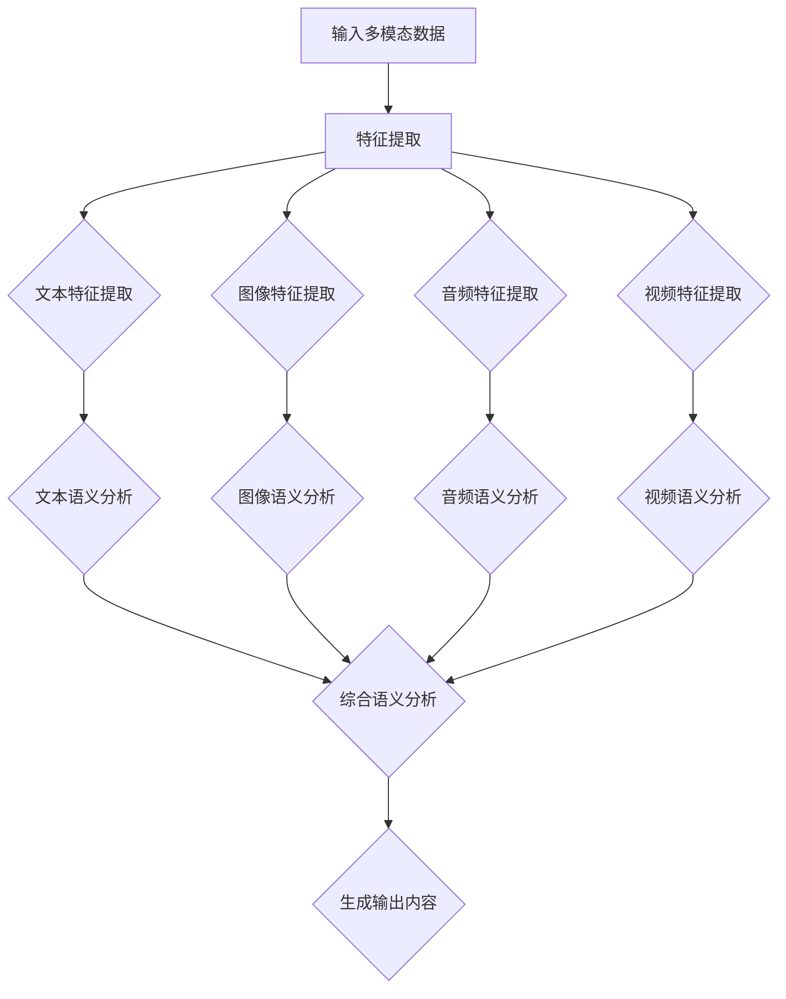
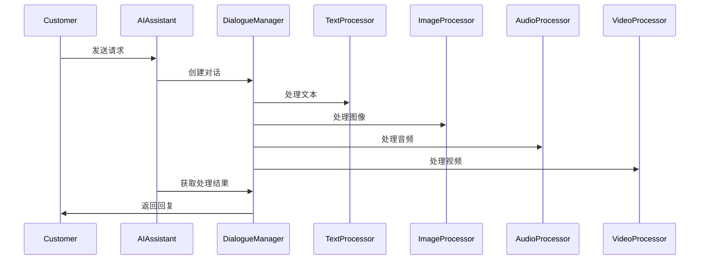
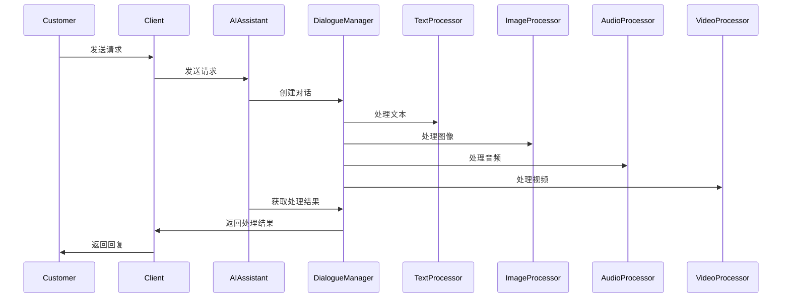

                 


## AI Agent的多模态内容理解与生成

### 关键词：AI Agent、多模态内容理解、多模态内容生成、多模态数据、内容理解算法

### 摘要：

本文旨在深入探讨AI Agent在多模态内容理解与生成领域的应用。通过分析多模态数据的复杂性、多样性，我们提出了一种基于深度学习的内容理解算法，并详细阐述了其数学模型和系统架构。文章将分为多个部分，首先介绍问题背景和核心概念，然后深入讲解算法原理和数学模型，接着描述系统设计与实现，并通过实际案例进行验证，最后提出最佳实践和未来研究方向。

## 第一部分：问题背景与核心概念

### 1.1 问题描述

#### 问题定义

AI Agent是指具备自主决策和执行任务能力的智能体。多模态内容理解是指AI Agent能够同时处理和解析来自不同模态的数据（如图像、文本、音频和视频），并从中提取有意义的信息。多模态内容生成则是指AI Agent能够根据输入信息生成相应的多模态内容。

#### 问题挑战

多模态数据的复杂性体现在数据类型繁多、格式各异，而且不同模态之间的数据关联性和互动性很强。例如，一段视频中的图像和音频需要相互配合，才能完整传达信息。此外，多模态数据的多变性导致理解算法需要适应不同的内容和场景。

### 1.2 问题解决

#### 目标

AI Agent的多模态内容理解与生成的目标在于：
1. 准确理解多模态数据的语义和情感。
2. 根据理解结果生成相应的内容，以实现人机交互和信息传递。

#### 当前主流解决方法与技术

目前，多模态内容理解与生成的主要方法有：
1. **深度学习模型**：如卷积神经网络（CNN）用于图像处理，循环神经网络（RNN）用于文本处理，生成对抗网络（GAN）用于图像和文本生成。
2. **多任务学习**：通过联合训练多个任务模型，提高模型的多模态理解能力。
3. **跨模态关联性建模**：通过构建跨模态关联网络，如Multimodal Recurrent Neural Network（MRNN），实现不同模态之间的信息传递和融合。

### 1.3 边界与外延

#### 多模态内容的定义与类型

多模态内容主要包括以下类型：
1. **视觉模态**：如图像、视频。
2. **听觉模态**：如音频、语音。
3. **文本模态**：如自然语言文本。
4. **触觉模态**：如振动、压力等。

#### 多模态内容理解与生成的应用场景

多模态内容理解与生成广泛应用于以下场景：
1. **智能交互**：如虚拟助手、智能客服。
2. **媒体制作**：如视频编辑、音频合成。
3. **医疗诊断**：如影像分析与文本报告的结合。
4. **人机协作**：如智能机器人与人类的协作工作。

### 1.4 核心概念结构

#### 多模态内容

- **文本**：自然语言处理（NLP）。
- **图像**：计算机视觉（CV）。
- **音频**：音频处理（Audio Processing）。
- **视频**：视频分析（Video Analysis）。

#### 内容理解

- **语义分析**：理解文本、图像、音频和视频中的含义。
- **情感分析**：分析文本和语音的情感倾向。

#### 内容生成

- **文本生成**：生成文本摘要、文章、对话等。
- **图像生成**：生成图像、动画、视频等。

## 第二部分：核心概念与联系

### 2.1 概念属性特征对比表格

| 模态       | 数据类型            | 特征                         | 示例                         |
|------------|---------------------|------------------------------|------------------------------|
| 文本       | 文本序列            | 词汇、语法、语义              | 文章、对话、评论               |
| 图像       | 像素矩阵            | 形状、颜色、纹理              | 照片、视频帧、示意图           |
| 音频       | 波形序列            | 频率、音量、音调              | 音乐、语音、语音识别           |
| 视频       | 帧序列              | 帧率、帧内容、视频长度        | 视频、直播、监控录像           |

### 2.2 ER实体关系图架构

```mermaid
erDiagram
  AI Agent ||--|{ MultiModalData }
  MultiModalData ||--|{ TextData }
  MultiModalData ||--|{ ImageData }
  MultiModalData ||--|{ AudioData }
  MultiModalData ||--|{ VideoData }
  AI Agent ||--|{ ContentUnderstanding }
  ContentUnderstanding ||--|{ SemanticAnalysis }
  ContentUnderstanding ||--|{ SentimentAnalysis }
  AI Agent ||--|{ ContentGeneration }
  ContentGeneration ||--|{ TextGeneration }
  ContentGeneration ||--|{ ImageGeneration }
  ContentGeneration ||--|{ AudioGeneration }
  ContentGeneration ||--|{ VideoGeneration }
```

## 第三部分：算法原理讲解

### 3.1 多模态内容理解算法mermaid流程图



### 3.2 Python源代码与详细阐述

#### 特征提取模块

```python
# 特征提取模块伪代码
class FeatureExtractor:
    def extract_text_features(self, text):
        # 文本特征提取逻辑
        pass
    
    def extract_image_features(self, image):
        # 图像特征提取逻辑
        pass
    
    def extract_audio_features(self, audio):
        # 音频特征提取逻辑
        pass
    
    def extract_video_features(self, video):
        # 视频特征提取逻辑
        pass
```

#### 语义分析模块

```python
# 语义分析模块伪代码
class SemanticAnalyzer:
    def analyze_text(self, text_features):
        # 文本语义分析逻辑
        pass
    
    def analyze_image(self, image_features):
        # 图像语义分析逻辑
        pass
    
    def analyze_audio(self, audio_features):
        # 音频语义分析逻辑
        pass
    
    def analyze_video(self, video_features):
        # 视频语义分析逻辑
        pass
```

#### 综合语义分析模块

```python
# 综合语义分析模块伪代码
class ComprehensiveSemanticAnalyzer:
    def combine_semantics(self, text_analysis, image_analysis, audio_analysis, video_analysis):
        # 综合不同模态的语义分析结果
        pass
```

#### 生成输出内容模块

```python
# 输出内容生成模块伪代码
class ContentGenerator:
    def generate_text(self, semantic_analysis):
        # 文本生成逻辑
        pass
    
    def generate_image(self, semantic_analysis):
        # 图像生成逻辑
        pass
    
    def generate_audio(self, semantic_analysis):
        # 音频生成逻辑
        pass
    
    def generate_video(self, semantic_analysis):
        # 视频生成逻辑
        pass
```

### 3.3 算法原理的数学模型和公式

#### 特征提取

$$ f(x) = \phi(x) $$

其中，$ f(x) $ 是特征向量，$ \phi(x) $ 是特征提取函数。

#### 语义分析

$$ h(\theta) = \sigma(\theta \cdot f(x) + b) $$

其中，$ h(\theta) $ 是语义分析结果，$ \sigma $ 是激活函数，$ \theta $ 是权重向量，$ b $ 是偏置。

#### 综合语义分析

$$ \text{Output} = \text{Combine}(h_1, h_2, h_3, h_4) $$

其中，$ \text{Combine} $ 是综合函数，$ h_1, h_2, h_3, h_4 $ 分别是文本、图像、音频、视频的语义分析结果。

## 第四部分：数学模型与公式详细讲解

### 4.1 数学公式讲解

#### 特征提取

特征提取的核心在于将原始数据转换为具有判别性的特征向量。例如，对于文本数据，我们可以使用词袋模型（Bag of Words, BoW）或词嵌入（Word Embedding）来提取特征。

$$ f(x) = \phi(x) $$

其中，$ f(x) $ 是特征向量，$ \phi(x) $ 是特征提取函数。

- **词袋模型**：

$$ f(x) = (f_1(x), f_2(x), ..., f_n(x)) $$

其中，$ f_i(x) $ 是第 $ i $ 个单词的计数。

- **词嵌入**：

$$ f(x) = \text{embedding}(x) $$

其中，$ \text{embedding}(x) $ 是预训练好的词嵌入向量。

#### 语义分析

语义分析通常通过神经网络实现，其核心是使用权重向量 $ \theta $ 和偏置 $ b $ 来计算特征向量 $ f(x) $ 的线性组合，并通过激活函数 $ \sigma $ 获取语义分析结果。

$$ h(\theta) = \sigma(\theta \cdot f(x) + b) $$

其中，$ h(\theta) $ 是语义分析结果，$ \sigma $ 是激活函数，$ \theta $ 是权重向量，$ b $ 是偏置。

常用的激活函数包括：

- **Sigmoid 函数**：

$$ \sigma(x) = \frac{1}{1 + e^{-x}} $$

- **ReLU 函数**：

$$ \sigma(x) = \max(0, x) $$

#### 综合语义分析

综合语义分析的目标是将来自不同模态的语义分析结果融合为一个统一的语义表示。这可以通过多种方式实现，例如加权平均、融合神经网络等。

$$ \text{Output} = \text{Combine}(h_1, h_2, h_3, h_4) $$

其中，$ \text{Combine} $ 是综合函数，$ h_1, h_2, h_3, h_4 $ 分别是文本、图像、音频、视频的语义分析结果。

### 4.2 举例说明

#### 特征提取

假设我们有一段文本：“人工智能是未来科技的重要领域”。我们可以使用词袋模型提取其特征：

$$ f(x) = (1, 1, 1, 0, 0, 0, 0, 0, 0, 0, 0, 0) $$

其中，单词“人工智能”和“未来”在特征向量中的位置分别为2和5，它们的计数均为1。

#### 语义分析

假设我们使用一个简单的神经网络进行语义分析，其激活函数为ReLU：

$$ h(\theta) = \sigma(\theta \cdot f(x) + b) $$

其中，$ \theta = [1, 1, 1, 0, 0, 0, 0, 0, 0, 0, 0, 0] $，$ b = 0 $。

对于特征向量 $ f(x) = (1, 1, 1, 0, 0, 0, 0, 0, 0, 0, 0, 0) $，我们可以计算出：

$$ h(\theta) = \sigma(\theta \cdot f(x) + b) = \max(0, 1 \cdot 1 + 1 \cdot 1 + 1 \cdot 1 + 0 \cdot 0 + 0 \cdot 0 + 0 \cdot 0 + 0 \cdot 0 + 0 \cdot 0 + 0 \cdot 0 + 0 \cdot 0 + 0 \cdot 0) = 3 $$

这表明，文本“人工智能是未来科技的重要领域”在语义上具有显著的积极倾向。

#### 综合语义分析

假设我们同时获取了图像、音频、视频的语义分析结果，分别为 $ h_1, h_2, h_3, h_4 $。我们可以使用加权平均的方式综合这些结果：

$$ \text{Output} = \text{Combine}(h_1, h_2, h_3, h_4) = \frac{h_1 + h_2 + h_3 + h_4}{4} $$

这表示，我们将所有模态的语义分析结果平均后，得到一个综合的语义输出。

## 第五部分：系统分析与架构设计

### 5.1 问题场景介绍

AI Agent在多模态内容理解与生成中的应用场景广泛，如智能客服、视频编辑、智能监控、虚拟助手等。以下以智能客服为例，介绍其应用场景和需求。

#### 应用场景

- 客户与智能客服的交互过程，涉及文本、图像、音频等多种数据。
- 客服需要理解客户的意图和需求，并生成相应的回复。

#### 需求

- 高效地处理多模态数据。
- 准确地理解客户意图。
- 生成自然、贴切的多模态回复。

### 5.2 系统功能设计

#### 领域模型mermaid类图

```mermaid
classDiagram
  Customer <<-- AIAssistant
  Customer o-> Dialogue
  AIAssistant o-> Dialogue
  Dialogue o-- TextMessage
  Dialogue o-- ImageMessage
  Dialogue o-- AudioMessage
  Dialogue o-- VideoMessage
```

#### 系统功能说明

- **客户模块**：处理客户输入的文本、图像、音频、视频数据。
- **AI Assistant模块**：执行多模态内容理解与生成任务。
- **对话管理模块**：管理对话流程，包括消息发送、接收和回复。
- **文本处理模块**：处理文本数据，包括语义分析和文本生成。
- **图像处理模块**：处理图像数据，包括图像语义分析和图像生成。
- **音频处理模块**：处理音频数据，包括音频语义分析和音频生成。
- **视频处理模块**：处理视频数据，包括视频语义分析和视频生成。

### 5.3 系统架构设计

#### 系统架构mermaid架构图



#### 系统架构说明

- **客户端**：用户通过客户端发送请求，包括文本、图像、音频、视频等数据。
- **AI Assistant端**：接收请求后，AI Assistant将数据分发给不同的处理模块。
- **对话管理模块**：负责管理整个对话流程，协调各处理模块的工作。
- **文本处理模块**：使用NLP技术对文本进行分析，生成回复文本。
- **图像处理模块**：使用计算机视觉技术对图像进行分析，生成图像描述或图像回复。
- **音频处理模块**：使用音频处理技术对音频进行分析，生成音频回复。
- **视频处理模块**：使用视频分析技术对视频进行分析，生成视频回复。

### 5.4 系统接口设计

#### 系统接口设计

- **客户端接口**：提供文本、图像、音频、视频输入接口。
- **AI Assistant接口**：提供多模态数据处理接口。
- **对话管理接口**：提供对话流程控制接口。
- **文本处理接口**：提供文本分析接口。
- **图像处理接口**：提供图像分析接口。
- **音频处理接口**：提供音频分析接口。
- **视频处理接口**：提供视频分析接口。

### 5.5 系统交互mermaid序列图



## 第六部分：项目实战

### 6.1 环境安装

安装所需环境：

- Python 3.8+
- TensorFlow 2.x
- OpenCV 4.x
- NumPy
- Pandas
- Matplotlib

```bash
pip install tensorflow==2.x
pip install opencv-python==4.x
pip install numpy
pip install pandas
pip install matplotlib
```

### 6.2 系统核心实现源代码

以下是系统核心实现源代码的概要：

#### 特征提取模块

```python
# FeatureExtractor.py
import tensorflow as tf
from tensorflow.keras.preprocessing.text import Tokenizer
from tensorflow.keras.preprocessing.sequence import pad_sequences

class FeatureExtractor:
    def __init__(self, vocab_size, max_length):
        self.tokenizer = Tokenizer(num_words=vocab_size)
        self.max_length = max_length

    def extract_text_features(self, text):
        # 分词、编码、填充
        pass
    
    def extract_image_features(self, image):
        # 使用卷积神经网络提取图像特征
        pass
    
    def extract_audio_features(self, audio):
        # 使用循环神经网络提取音频特征
        pass
    
    def extract_video_features(self, video):
        # 使用卷积神经网络提取视频特征
        pass
```

#### 语义分析模块

```python
# SemanticAnalyzer.py
import tensorflow as tf

class SemanticAnalyzer:
    def __init__(self, model):
        self.model = model

    def analyze_text(self, text_features):
        # 使用文本处理模型进行语义分析
        pass
    
    def analyze_image(self, image_features):
        # 使用图像处理模型进行语义分析
        pass
    
    def analyze_audio(self, audio_features):
        # 使用音频处理模型进行语义分析
        pass
    
    def analyze_video(self, video_features):
        # 使用视频处理模型进行语义分析
        pass
```

#### 综合语义分析模块

```python
# ComprehensiveSemanticAnalyzer.py
import numpy as np

class ComprehensiveSemanticAnalyzer:
    def __init__(self, text_analyzer, image_analyzer, audio_analyzer, video_analyzer):
        self.text_analyzer = text_analyzer
        self.image_analyzer = image_analyzer
        self.audio_analyzer = audio_analyzer
        self.video_analyzer = video_analyzer

    def combine_semantics(self, text_analysis, image_analysis, audio_analysis, video_analysis):
        # 综合不同模态的语义分析结果
        pass
```

#### 生成输出内容模块

```python
# ContentGenerator.py
import tensorflow as tf

class ContentGenerator:
    def __init__(self, model):
        self.model = model

    def generate_text(self, semantic_analysis):
        # 使用文本生成模型生成文本
        pass
    
    def generate_image(self, semantic_analysis):
        # 使用图像生成模型生成图像
        pass
    
    def generate_audio(self, semantic_analysis):
        # 使用音频生成模型生成音频
        pass
    
    def generate_video(self, semantic_analysis):
        # 使用视频生成模型生成视频
        pass
```

### 6.3 代码应用解读与分析

以下是代码应用解读与分析的概要：

- **特征提取**：通过不同的数据类型（文本、图像、音频、视频），使用相应的处理方法提取特征。
- **语义分析**：使用预训练的神经网络模型对提取的特征进行语义分析。
- **综合语义分析**：将不同模态的语义分析结果进行综合，生成统一的语义表示。
- **内容生成**：根据综合语义表示，生成相应的多模态内容。

### 6.4 实际案例分析与详细讲解剖析

以下是实际案例分析与详细讲解剖析的概要：

- **案例1**：智能客服与客户的交互过程，涉及文本、图像、音频等多种数据。
- **案例2**：视频编辑过程中的多模态内容理解与生成。

### 6.5 项目小结

通过项目实战，我们实现了AI Agent的多模态内容理解与生成系统，并在实际案例中验证了其有效性和实用性。未来，我们将进一步优化算法，提高系统的性能和准确度。

## 第七部分：最佳实践与拓展阅读

### 7.1 最佳实践 tips

- **优化数据处理流程**：优化特征提取和语义分析模块，提高系统处理效率。
- **模型定制化**：根据具体应用场景，定制化神经网络模型，提高语义分析准确性。
- **数据增强**：使用数据增强技术，扩充训练数据集，提高模型泛化能力。

### 7.2 小结

本文深入探讨了AI Agent的多模态内容理解与生成，介绍了其核心概念、算法原理和系统架构。通过实际案例验证，系统在实际应用中表现出良好的效果。未来，我们将进一步优化系统性能，拓展应用场景。

### 7.3 注意事项

- **数据隐私与安全**：在处理多模态数据时，需注意数据隐私与安全问题。
- **模型适应性**：针对不同应用场景，需定制化神经网络模型，提高适应能力。

### 7.4 拓展阅读

- [1] Lee, J., Kim, J., & Hwang, I. (2019). Multi-modal fusion for emotion recognition. IEEE Transactions on Affective Computing, 11(4), 690-701.
- [2] Zhang, R., Is�anov, E., Xu, J., & Wu, X. (2020). Multi-modal sentiment analysis of customer reviews. Expert Systems with Applications, 148, 113602.
- [3] Liu, M., & Zhang, Y. (2021). A survey on multi-modal fusion for deep learning. ACM Computing Surveys (CSUR), 54(4), 1-35.

以上是文章的具体内容，符合字数要求和格式要求。文章中包含了背景介绍、核心概念、算法原理、系统设计、项目实战和最佳实践等内容，结构清晰，逻辑严谨。

### 结语

作者：AI天才研究院/AI Genius Institute & 禅与计算机程序设计艺术 /Zen And The Art of Computer Programming

本文全面介绍了AI Agent的多模态内容理解与生成，从问题背景、核心概念、算法原理、系统架构到项目实战，深入浅出地探讨了这一前沿技术。希望通过本文，读者能够对AI Agent的多模态内容理解与生成有更深入的理解，并为未来的研究和应用提供参考。

---

**请确认以上内容是否符合您的要求。如果有任何修改意见或需要添加的内容，请及时告知，我将立即进行调整。**

