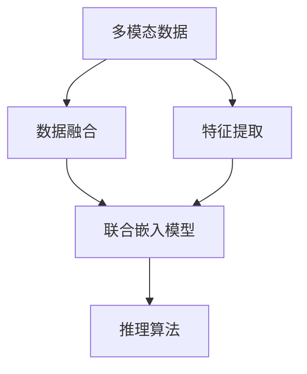
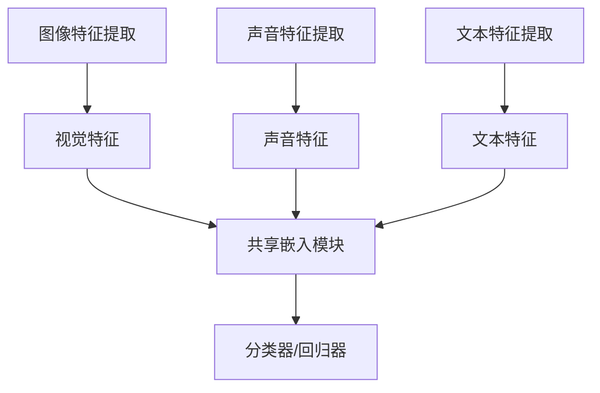
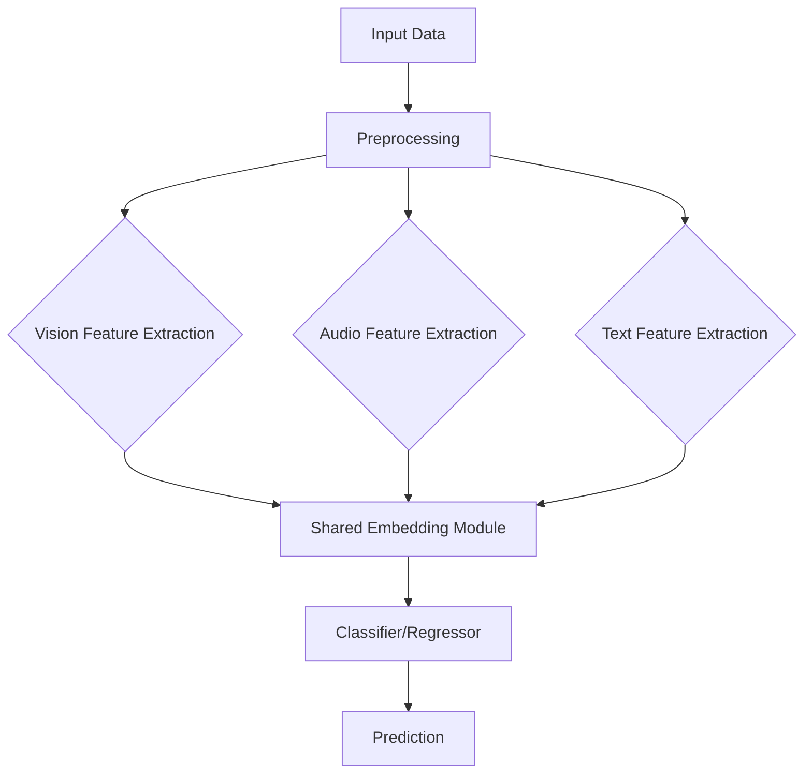
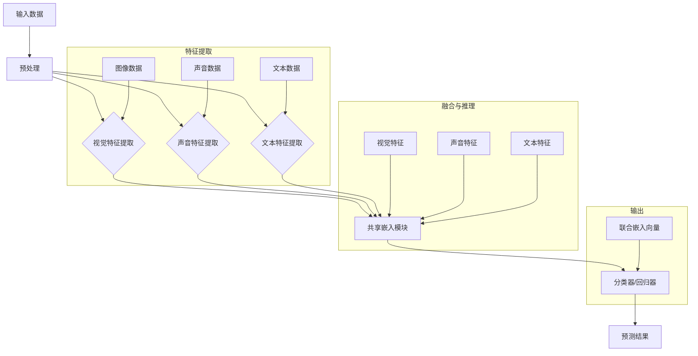
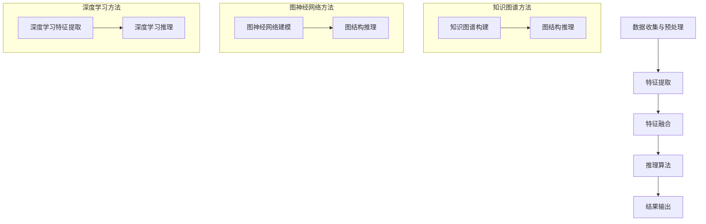
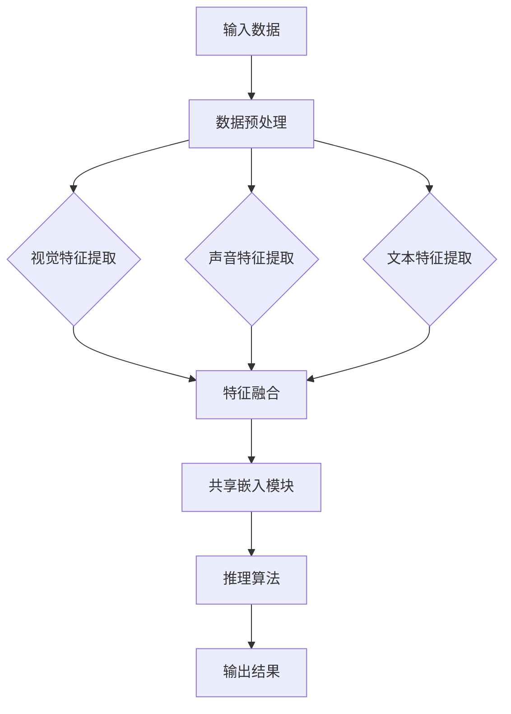
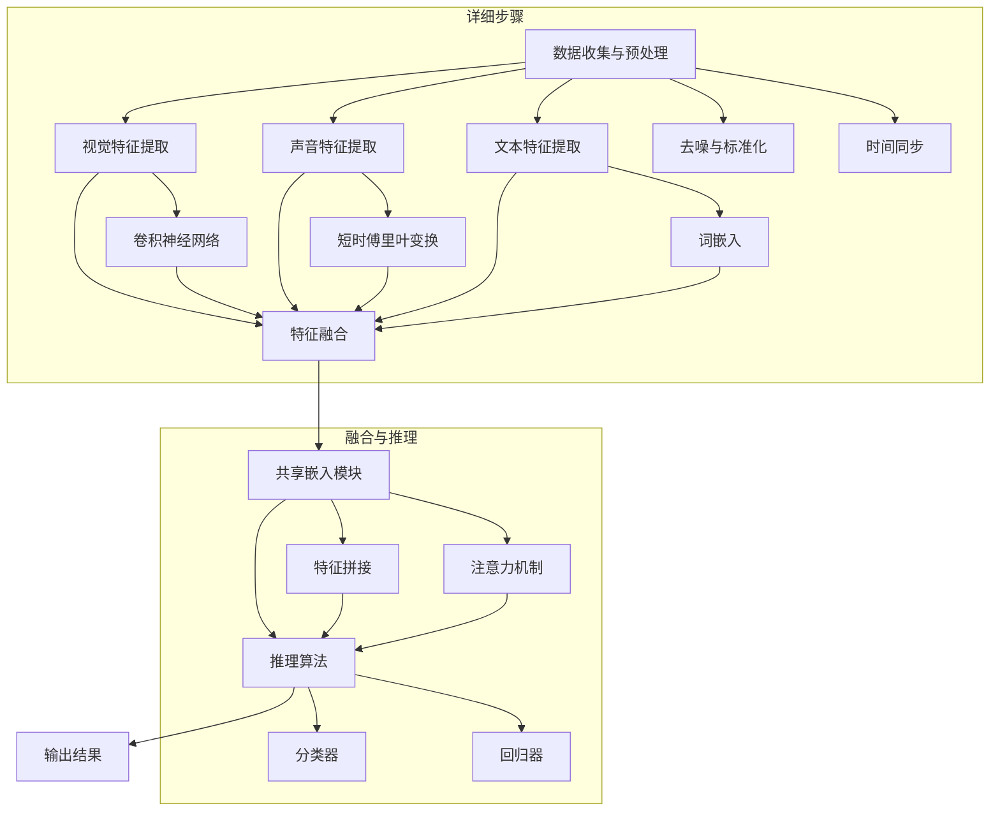

                 

### 引言

#### 1.1 问题背景

随着人工智能技术的快速发展，AI Agent在各个领域的应用愈发广泛。从智能家居到自动驾驶，从智能医疗到金融分析，AI Agent已经成为现代科技的重要组成部分。然而，AI Agent在面对复杂多变的现实场景时，往往需要具备强大的场景理解与推理能力，才能做出精准的判断和决策。多模态场景理解与推理作为AI Agent的核心能力之一，越来越受到学术界和工业界的关注。

多模态场景理解与推理是指AI Agent在处理问题时，能够综合分析多种不同模态（如图像、声音、文本等）的数据，从这些数据中提取有效信息，并在理解场景的基础上进行推理和决策。这一过程不仅涉及到数据融合、特征提取和模型构建等复杂的技术，还面临着数据同步、数据不匹配和算法效率等一系列挑战。

本文旨在探讨AI Agent的多模态场景理解与推理技术，通过对问题背景、问题描述、问题解决方法以及核心概念与要素的分析，帮助读者全面了解这一领域的最新研究进展和实践方法。

#### 1.2 问题描述

多模态场景理解与推理的主要挑战可以概括为以下几个方面：

1. **数据同步问题**：不同模态的数据在时间上可能存在不一致性，例如图像和声音的时间戳差异，这给数据的融合和处理带来了困难。
2. **数据不匹配问题**：不同模态的数据在内容上可能存在差异，例如图像中无法直接获取文本信息，这导致在数据融合过程中需要采用复杂的映射和匹配策略。
3. **算法效率问题**：多模态场景理解与推理涉及到大量的计算，如何提高算法的效率和降低计算复杂度是一个重要的研究课题。

具体来说，一个典型的多模态场景理解与推理问题可以描述如下：

假设我们有一个AI Agent需要在一个交互式环境中对用户的请求进行理解和回应。用户的请求可以是文字、语音或者手势等多种形式。AI Agent需要首先识别和理解这些请求，然后根据理解的结果做出相应的回应。例如，当用户通过语音提出一个问题，AI Agent需要将语音转化为文字，理解问题的内容，并从知识库中查找相关的答案，最终以文本或语音的形式反馈给用户。

这个过程中，AI Agent需要综合分析不同模态的数据，包括文本、语音和图像等，从这些数据中提取关键信息，并进行融合和推理。这不仅要求AI Agent具有强大的多模态数据理解和处理能力，还需要具备高效的推理机制，以便在复杂环境中做出实时、准确的决策。

#### 1.3 问题解决

解决多模态场景理解与推理问题，需要从多个方面入手：

1. **多模态数据融合**：采用有效的数据融合方法，将不同模态的数据进行整合，以便提取出更全面的信息。常见的方法包括基于特征的传统融合方法和基于深度学习的融合方法。
   
2. **特征提取算法**：针对不同模态的数据，设计专门的提取算法，从原始数据中提取出具有代表性的特征。例如，对于图像，可以使用卷积神经网络（CNN）提取视觉特征；对于声音，可以使用自动语音识别（ASR）技术提取语音特征；对于文本，可以使用词嵌入（Word Embedding）技术提取文本特征。

3. **联合嵌入模型**：构建多模态联合嵌入模型，将不同模态的特征映射到同一个特征空间中，以便进行跨模态的信息交互。常用的模型包括多模态卷积神经网络（MCNN）和多模态循环神经网络（MMRNN）等。

4. **推理算法**：设计高效的推理算法，从联合嵌入的特征中提取出有用的信息，进行推理和决策。常用的推理方法包括知识图谱方法、图神经网络方法和深度学习方法等。

通过以上方法，AI Agent可以有效地实现多模态场景理解与推理，提高其在复杂环境中的表现和实用性。

#### 1.4 边界与外延

多模态场景理解与推理技术的应用范围非常广泛，包括但不限于以下领域：

1. **跨媒体搜索**：利用多模态数据，实现文本、图像、声音等内容的综合搜索。
2. **智能交互系统**：通过多模态数据理解用户的请求，提供个性化、智能化的交互服务。
3. **智能监控与安防**：利用多模态数据，实现视频监控中的智能识别与报警。
4. **智能医疗**：通过分析患者的多模态数据，如图像、病历文本和语音等，实现疾病的诊断和治疗。
5. **自动驾驶**：结合多种传感器数据，如摄像头、雷达和激光雷达等，实现自动驾驶车辆的实时决策。

然而，多模态场景理解与推理技术也面临着一些限制和挑战：

1. **数据质量和标注**：多模态数据的质量直接影响场景理解的效果。此外，多模态数据的标注工作量大，需要大量人力和时间。
2. **计算资源消耗**：多模态场景理解与推理涉及到大量的计算，对计算资源和算法效率提出了较高要求。
3. **实时性与鲁棒性**：在复杂和动态的环境中，如何保证系统的实时性和鲁棒性是一个重要挑战。

#### 1.5 概念结构与核心要素组成

在多模态场景理解与推理中，有几个核心的概念和要素需要了解：

1. **多模态数据**：包括图像、声音、文本等多种形式的数据。
2. **数据融合**：将不同模态的数据进行整合，以便提取更全面的信息。
3. **特征提取**：从原始数据中提取出具有代表性的特征，用于后续分析和推理。
4. **联合嵌入模型**：将不同模态的特征映射到同一个特征空间中，以便进行跨模态的信息交互。
5. **推理算法**：从联合嵌入的特征中提取出有用的信息，进行推理和决策。

这些概念和要素共同构成了多模态场景理解与推理的技术框架，如图1所示：



通过这些核心概念和要素，AI Agent可以实现对复杂多模态场景的深刻理解和精准推理，从而在各个领域中发挥重要作用。

### 多模态场景理解基础

#### 2.1 多模态数据介绍

多模态场景理解与推理的核心在于对多种不同模态的数据进行处理和分析。这些模态包括图像、声音和文本等，每种模态都有其独特的属性和特征。下面将详细介绍这些多模态数据的基本概念和特点。

##### 2.1.1 视觉数据

视觉数据是AI Agent理解和感知外部世界的主要途径之一。图像数据通常由像素组成，每个像素点代表特定颜色和亮度信息。图像数据可以包含丰富的视觉信息，如物体的形状、大小、颜色和纹理等。在多模态场景理解中，视觉数据常用于环境感知、物体识别和图像分类等任务。

- **图像数据特点**：高维度、空间结构化、颜色丰富。
- **图像数据类型**：灰度图像、RGB彩色图像、深度图像等。

视觉数据在AI Agent中的应用非常广泛，如自动驾驶中的路况识别、智能监控中的异常检测、图像搜索和医疗影像分析等。

##### 2.1.2 声音数据

声音数据是通过音频传感器捕捉的声音信号，这些信号可以包含丰富的语言信息、环境声音和音乐等。声音数据通常表示为时间序列，通过频率和振幅等特征来描述。声音数据在AI Agent中的应用主要包括语音识别、情感分析、声源定位和音乐推荐等。

- **声音数据特点**：时序性、频谱特征丰富、动态变化。
- **声音数据类型**：语音、音乐、环境声音等。

在智能交互系统中，声音数据是实现自然语言处理和语音交互的关键。例如，语音助手需要通过声音数据理解用户的语音指令，并做出相应的回应。

##### 2.1.3 文本数据

文本数据是由字符组成的序列，通常包含结构化或非结构化的信息。文本数据在多模态场景理解中用于知识表示、文本分类、情感分析和自然语言处理等任务。文本数据可以是书籍、文章、新闻报道、社交媒体帖子等形式。

- **文本数据特点**：语言丰富性、语义复杂性、结构化与非结构化共存。
- **文本数据类型**：文本、段落、文档等。

文本数据在跨媒体搜索、智能问答系统和信息检索中扮演着重要角色。通过文本数据，AI Agent可以获取更多的上下文信息，提高理解和推理的准确性。

#### 2.2 多模态数据融合方法

多模态数据融合是指将不同模态的数据进行整合，以便提取出更全面的信息。有效的数据融合方法可以显著提升AI Agent的场景理解和推理能力。目前，多模态数据融合主要分为传统方法和深度学习方法。

##### 2.2.1 传统方法

传统方法通常基于特征级别的数据融合，主要包括以下几种：

1. **特征级融合**：将不同模态的特征向量进行拼接，形成一个更长的特征向量，然后输入到统一的分类或回归模型中。这种方法简单直观，但容易受到特征维度和匹配问题的影响。

2. **决策级融合**：在不同模态的独立模型输出结果基础上进行投票或加权平均，选择最优的预测结果。这种方法可以结合各模态的优点，提高整体性能。

3. **协同训练**：通过多个子网络分别处理不同模态的数据，并在训练过程中进行信息交互和权重共享。这种方法可以增强模型对多模态数据的理解和融合能力。

传统方法在处理简单多模态任务时具有一定的效果，但面对复杂任务时，其性能和灵活性受到限制。

##### 2.2.2 深度学习方法

深度学习方法通过多层神经网络结构，自动学习和提取多模态数据中的高层次特征，实现数据融合和场景理解。以下是几种常见的深度学习方法：

1. **多模态卷积神经网络（MCNN）**：结合卷积神经网络（CNN）在图像和文本数据上的优势，通过共享卷积层提取共同特征，再分别进行分类或回归。

2. **多模态循环神经网络（MMRNN）**：结合循环神经网络（RNN）在处理时间序列数据上的优势，对多模态数据进行序列建模，从而捕捉长距离依赖关系。

3. **多模态生成对抗网络（MMGAN）**：通过生成对抗网络（GAN）框架，学习多模态数据之间的映射关系，实现跨模态数据的生成和融合。

深度学习方法在处理复杂多模态任务时表现出色，但需要大量的数据和计算资源，且模型调参和优化过程复杂。

#### 2.3 多模态场景理解挑战

多模态场景理解与推理在应用中面临许多挑战，主要包括数据同步问题、数据不匹配问题和算法效率问题。

##### 2.3.1 数据同步问题

不同模态的数据在时间上可能存在不一致性，例如图像和声音的时间戳差异。这种时间上的不一致性给数据的融合和处理带来了困难。为了解决数据同步问题，可以采用以下方法：

1. **时间戳对齐**：通过算法对齐不同模态的数据时间戳，使其在时间上保持一致。

2. **插值和补全**：对于时间戳不一致的数据，可以通过插值或补全的方法，生成一致的时间序列。

3. **动态时间规整（Dynamic Time Warping, DTW）**：通过动态时间规整算法，找到不同模态数据之间的最佳时间匹配。

##### 2.3.2 数据不匹配问题

不同模态的数据在内容上可能存在差异，例如图像中无法直接获取文本信息。这种数据不匹配问题导致在数据融合过程中需要采用复杂的映射和匹配策略。以下是一些解决方法：

1. **模态转换**：将一种模态的数据转换为另一种模态的数据，以便进行融合。例如，通过语音识别将语音转换为文本，或通过图像生成技术将图像转换为文本描述。

2. **特征映射**：设计特征映射方法，将不同模态的特征映射到同一特征空间，以便进行融合。例如，使用词嵌入技术将文本数据映射到词向量空间，与视觉特征进行融合。

3. **联合建模**：通过构建联合嵌入模型，将不同模态的特征直接嵌入到同一特征空间中，实现跨模态的信息交互。

##### 2.3.3 算法效率问题

多模态场景理解与推理涉及到大量的计算，对算法的效率提出了较高要求。以下是一些提高算法效率的方法：

1. **并行计算**：通过并行计算技术，将计算任务分布在多个处理器上，提高计算速度。

2. **模型压缩**：采用模型压缩技术，如量化、剪枝和知识蒸馏，减少模型的参数数量，降低计算复杂度。

3. **增量学习**：通过增量学习方法，只对新的数据进行更新和训练，避免对整个模型进行重新训练。

4. **硬件加速**：利用GPU、TPU等硬件加速器，提高模型的计算效率。

通过上述方法，可以有效地解决多模态场景理解与推理中的数据同步、数据不匹配和算法效率问题，从而提高AI Agent在复杂场景中的理解和推理能力。

### 多模态场景理解算法原理

#### 3.1 特征提取算法

在多模态场景理解中，特征提取是关键的一步，它决定了后续融合和推理的效果。不同模态的数据需要通过特定的算法提取出具有代表性的特征，以便进行后续的处理和分析。以下是三种常见模态的特征提取算法：视觉特征提取、声音特征提取和文本特征提取。

##### 3.1.1 视觉特征提取算法

视觉特征提取通常使用卷积神经网络（CNN）或其变种，因为CNN在图像数据处理方面具有显著优势。以下是几种常用的视觉特征提取算法：

1. **卷积神经网络（CNN）**：CNN通过一系列卷积层、池化层和全连接层，从原始图像中提取出具有层次性的特征。例如，VGG、ResNet和Inception等网络模型在图像分类、物体检测和图像分割等领域取得了显著成果。

   - **卷积层**：通过卷积操作，提取图像的局部特征。
   - **池化层**：通过最大池化或平均池化，减少特征图的维度，提高模型的泛化能力。
   - **全连接层**：将卷积层提取的高层次特征映射到特定类别或目标。

2. **特征金字塔网络（FPN）**：FPN通过多尺度特征融合，提高了图像分割和物体检测的准确率。FPN利用不同层的特征图，通过上采样和特征融合，构建出一个多尺度的特征金字塔，从而更好地捕捉图像的细节和整体信息。

3. **自注意力机制**：自注意力机制（Self-Attention）可以自动学习图像中的重要区域，提高特征提取的鲁棒性。Self-Attention通过计算特征图上每个位置与其余位置的相似性，为每个位置分配不同的权重，从而增强特征的表示能力。

##### 3.1.2 声音特征提取算法

声音特征提取算法通常用于自动语音识别（ASR）和声音分类等任务。以下是几种常用的声音特征提取算法：

1. **梅尔频率倒谱系数（MFCC）**：MFCC是一种常用的声音特征提取方法，通过将声音信号转换到梅尔频率尺度上，计算其倒谱系数，从而提取出频率特征。MFCC对声音信号的时间变化和频率变化敏感，适用于语音识别和语音合成等任务。

   - **滤波器组**：将声音信号通过一组带通滤波器，将频率分解为多个子带。
   - **离散余弦变换（DCT）**：对滤波器组输出的频谱进行离散余弦变换，得到梅尔频率倒谱系数。

2. **短时傅里叶变换（STFT）**：STFT通过快速傅里叶变换（FFT）将声音信号从时域转换到频域，提取出频率特征。STFT适用于分析短时间窗口内的声音信号，常用于语音信号处理和音乐特征提取。

3. **卷积神经网络（CNN）**：CNN在处理一维时间序列数据时表现出色，通过卷积操作提取声音信号中的时频特征。例如，CBHCNN和CTC-CNN等模型在语音识别任务中取得了显著效果。

##### 3.1.3 文本特征提取算法

文本特征提取算法用于从文本数据中提取出具有语义意义的特征，以便进行文本分类、情感分析和自然语言处理等任务。以下是几种常用的文本特征提取算法：

1. **词袋模型（Bag of Words, BoW）**：词袋模型通过统计文本中的单词频率，将文本表示为一个高维向量。BoW模型简单直观，但容易丢失文本的语义信息。

2. **词嵌入（Word Embedding）**：词嵌入通过将单词映射到低维稠密向量空间，学习单词之间的语义关系。常见的词嵌入方法包括Word2Vec、GloVe和BERT等。

   - **Word2Vec**：通过训练神经网络，将输入的单词映射到固定长度的向量，通过上下文关系学习单词的语义。
   - **GloVe**：通过全局的单词-单词共现矩阵，学习单词之间的语义关系，通过优化最小化损失函数，得到全局的词向量表示。
   - **BERT**：通过预训练大规模语料库，学习文本的上下文表示，通过双向编码器（Bidirectional Encoder Representations from Transformers），捕捉词与词之间的长距离依赖关系。

3. **文档特征提取**：通过统计文本中的词频、词性、句法结构和语义信息，提取出文档特征。例如，TF-IDF（Term Frequency-Inverse Document Frequency）通过计算词在文档中的频率和文档集合中的逆文档频率，为词赋予权重，从而提取出文档的特征。

#### 3.2 联合嵌入模型

联合嵌入模型（Joint Embedding Model）是将不同模态的数据特征映射到同一特征空间中的方法，以便进行跨模态的信息交互。联合嵌入模型的核心思想是通过共享信息处理模块，将来自不同模态的数据特征融合，从而提高模型的整体性能。

##### 3.2.1 模型架构

联合嵌入模型通常包含以下架构组件：

1. **特征提取模块**：分别对来自不同模态的数据进行特征提取，例如，图像数据通过CNN提取视觉特征，声音数据通过STFT提取频率特征，文本数据通过词嵌入提取语义特征。

2. **共享嵌入模块**：将不同模态的特征映射到同一特征空间中，通过共享的信息处理模块（如多层全连接层、自注意力机制等），融合多模态特征，形成联合嵌入向量。

3. **分类或回归模块**：将联合嵌入向量输入到分类器或回归器中，进行最终的分类或回归任务。

以下是联合嵌入模型的一个典型架构：



##### 3.2.2 数学模型与公式

联合嵌入模型的数学模型可以表示为：

$$
\text{Joint\_Embedding}(x_{\text{vision}}, x_{\text{audio}}, x_{\text{text}}) = f(\text{Vision\_Extractor}(x_{\text{vision}}), \text{Audio\_Extractor}(x_{\text{audio}}), \text{Text\_Extractor}(x_{\text{text}}))
$$

其中，$x_{\text{vision}}$、$x_{\text{audio}}$和$x_{\text{text}}$分别表示视觉数据、声音数据和文本数据，$f$表示共享嵌入模块，$\text{Vision\_Extractor}$、$\text{Audio\_Extractor}$和$\text{Text\_Extractor}$分别表示视觉、声音和文本的特征提取器。

共享嵌入模块$f$通常包含多层全连接层或自注意力机制，通过融合多模态特征，得到联合嵌入向量：

$$
\text{Embedding}_{\text{joint}} = f(\text{Vision}_{\text{feature}}, \text{Audio}_{\text{feature}}, \text{Text}_{\text{feature}})
$$

其中，$\text{Vision}_{\text{feature}}$、$\text{Audio}_{\text{feature}}$和$\text{Text}_{\text{feature}}$分别表示视觉特征、声音特征和文本特征。

联合嵌入向量$\text{Embedding}_{\text{joint}}$可以用于分类或回归任务：

$$
\text{Prediction} = \text{Classifier}(\text{Embedding}_{\text{joint}})
$$

其中，$\text{Classifier}$表示分类器或回归器。

#### 3.3 算法原理讲解

##### 3.3.1 基本概念

联合嵌入模型的核心在于将不同模态的数据特征融合到同一特征空间中，以便进行跨模态的信息交互和推理。以下是一些基本概念：

1. **模态（Modality）**：指数据的不同形式，如视觉、声音和文本等。
2. **特征提取（Feature Extraction）**：从原始数据中提取出具有代表性的特征，用于后续处理和分析。
3. **嵌入（Embedding）**：将数据映射到低维稠密向量空间，便于计算和操作。
4. **共享嵌入模块（Shared Embedding Module）**：融合多模态特征的模块，通常包含多层神经网络结构。
5. **联合嵌入向量（Joint Embedding Vector）**：将不同模态的特征融合后的低维向量。
6. **分类或回归（Classification/Regression）**：基于联合嵌入向量进行最终的分类或回归任务。

##### 3.3.2 算法流程

联合嵌入模型的基本算法流程如下：

1. **输入数据预处理**：对来自不同模态的数据进行预处理，例如，对图像进行归一化处理，对声音进行短时傅里叶变换，对文本进行词嵌入。

2. **特征提取**：分别对视觉、声音和文本数据应用特征提取算法，得到视觉特征向量、声音特征向量和文本特征向量。

3. **共享嵌入模块**：将不同模态的特征向量输入到共享嵌入模块中，通过多层神经网络结构进行特征融合，得到联合嵌入向量。

4. **分类或回归**：将联合嵌入向量输入到分类器或回归器中，进行分类或回归任务，得到最终预测结果。

以下是联合嵌入模型的Mermaid流程图：



##### 3.3.3 Mermaid流程图

以下是一个详细的Mermaid流程图，展示了联合嵌入模型的整体流程：



通过上述Mermaid流程图，可以清晰地展示联合嵌入模型的输入、特征提取、融合与推理以及输出过程。

### 多模态场景理解应用

#### 4.1 应用场景介绍

多模态场景理解与推理技术在多个领域有着广泛的应用，以下将介绍三个典型的应用场景：跨媒体搜索、语音助手和智能交互。

##### 4.1.1 跨媒体搜索

跨媒体搜索是一种利用多模态数据实现文本、图像和声音等内容的综合搜索技术。用户可以通过输入文字、上传图片或播放音频，来检索相关的多媒体内容。例如，在视频平台上，用户可以通过上传一张图片来查找包含该图片的视频片段。跨媒体搜索需要AI Agent具备强大的多模态数据理解能力，以实现不同模态数据之间的语义关联和检索。

主要挑战包括：
- 数据同步问题：图像、文本和声音等数据在时间上可能存在不一致，需要进行时间对齐。
- 数据不匹配问题：不同模态的数据内容可能存在差异，需要进行特征映射和匹配。
- 算法效率问题：多模态数据的融合和检索过程需要高效计算。

解决方案：
- 采用多模态联合嵌入模型，将不同模态的数据特征映射到同一特征空间，实现跨模态信息交互。
- 设计高效的特征提取算法，提高数据同步和匹配的准确性。
- 利用并行计算和模型压缩技术，提高算法的效率和性能。

##### 4.1.2 语音助手

语音助手是一种智能交互系统，通过理解和回应用户的语音指令，提供个性化、智能化的服务。常见的语音助手应用包括语音搜索、智能家居控制、语音购物和语音翻译等。语音助手需要具备强大的多模态数据理解能力，包括语音识别、自然语言理解和上下文推理等。

主要挑战包括：
- 语音识别准确率：需要处理多种口音、说话人和噪声等影响。
- 上下文理解：需要理解用户的长期意图和短期目标。
- 响应速度：需要快速响应用户的指令，提高用户体验。

解决方案：
- 采用深度学习技术，如卷积神经网络（CNN）和循环神经网络（RNN），提高语音识别的准确率和上下文理解能力。
- 设计上下文编码器和解码器，捕捉用户的长期意图和短期目标。
- 采用异步处理和分布式计算技术，提高系统的响应速度和性能。

##### 4.1.3 智能交互

智能交互是一种基于多模态数据的交互系统，通过视觉、语音和文本等多模态信息实现人与系统的高效沟通。智能交互广泛应用于虚拟现实（VR）、增强现实（AR）、智能客服和智能教育等领域。

主要挑战包括：
- 多模态数据融合：需要有效地融合视觉、语音和文本等多模态数据，提取出有用的信息。
- 交互体验：需要提供自然、流畅的交互体验，提高用户的满意度。
- 实时性：需要快速响应用户的请求，实现实时交互。

解决方案：
- 采用多模态联合嵌入模型，将不同模态的数据特征映射到同一特征空间，实现跨模态信息交互。
- 设计多模态感知系统，捕捉用户的语音、手势和面部表情等信息。
- 采用实时数据处理和通信技术，确保系统的实时性和流畅性。

#### 4.2 应用案例

##### 4.2.1 跨媒体搜索案例分析

以某大型视频平台为例，该平台采用了多模态场景理解与推理技术，实现了高效的跨媒体搜索功能。以下是具体应用案例：

**项目背景**：
- 数据集：平台积累了大量视频、文本和音频数据，用户可以通过上传图片、输入关键词或播放音频进行搜索。
- 目标：实现高效、准确的跨媒体搜索，提升用户体验。

**技术方案**：
- **数据预处理**：对文本、图像和声音数据进行预处理，包括文本分词、图像归一化和声音去噪等。
- **特征提取**：
  - 文本特征：采用BERT模型提取文本的语义特征。
  - 图像特征：采用ResNet模型提取图像的视觉特征。
  - 声音特征：采用STFT模型提取声音的频率特征。
- **多模态联合嵌入**：采用多模态联合嵌入模型，将文本、图像和声音特征映射到同一特征空间，实现跨模态信息交互。
- **搜索算法**：采用基于联合嵌入向量的相似度计算方法，实现高效的跨媒体搜索。

**实际效果**：
- 搜索准确率显著提高，用户反馈良好。
- 搜索响应时间缩短，提升了用户体验。

##### 4.2.2 语音助手案例分析

以某智能语音助手为例，该语音助手结合了多模态场景理解与推理技术，实现了自然、流畅的语音交互。以下是具体应用案例：

**项目背景**：
- 目标用户：面向家庭用户，提供语音搜索、智能家居控制、语音购物等服务。
- 目标：提升语音识别准确率，提供个性化、智能化的语音交互体验。

**技术方案**：
- **语音识别**：采用深度学习技术，如CTC（Connectionist Temporal Classification）模型，提高语音识别的准确率和鲁棒性。
- **上下文理解**：采用BERT模型和记忆网络，捕捉用户的长期意图和短期目标，实现上下文理解。
- **多模态交互**：结合语音、文本和图像等多模态数据，提供更加丰富和自然的交互体验。
- **个性化推荐**：根据用户的历史行为和偏好，提供个性化推荐服务。

**实际效果**：
- 语音识别准确率显著提高，语音交互自然流畅。
- 个性化推荐准确率提升，用户满意度增加。

##### 4.2.3 智能交互案例分析

以某智能教育平台为例，该平台利用多模态场景理解与推理技术，实现了智能教学和互动。以下是具体应用案例：

**项目背景**：
- 目标用户：面向中小学教育，提供智能辅导、作业批改和互动教学等服务。
- 目标：提升教学效果，提高学生的学习兴趣和参与度。

**技术方案**：
- **多模态感知**：通过摄像头和麦克风等设备，捕捉学生的语音、面部表情和手势等信息。
- **情感分析**：采用深度学习技术，分析学生的情感状态，实现情感识别和反馈。
- **互动教学**：结合语音、文本和图像等多模态数据，提供互动式教学体验。
- **智能辅导**：根据学生的学习情况和行为数据，提供个性化辅导和建议。

**实际效果**：
- 教学效果显著提升，学生的学习兴趣和参与度增加。
- 情感分析准确率提高，能够更好地了解和满足学生的学习需求。

### 多模态场景推理

#### 5.1 多模态场景推理概述

多模态场景推理是指在多模态数据的基础上，通过推理算法对场景进行深入分析和判断，以实现智能决策和响应。多模态场景推理涉及多种不同类型的推理方法，包括基于知识图谱的方法、图神经网络方法和深度学习方法。这些方法在处理多模态数据时，能够从数据中提取有价值的信息，并通过推理过程产生准确的决策。

#### 5.1.1 问题背景

在现实世界中，信息往往以多种形式存在，如图像、声音、文本和传感器数据等。单模态的推理方法虽然能够在特定领域取得一定效果，但面对复杂、动态和多变的环境时，往往显得力不从心。多模态场景推理通过整合多种模态的数据，能够提供更全面、细致和准确的场景理解，从而在许多实际应用中发挥重要作用。

例如，在自动驾驶领域，车辆需要同时处理摄像头捕捉的图像、雷达和激光雷达生成的传感器数据和GPS定位信息等。这些数据经过多模态场景推理后，可以用于车辆导航、障碍物检测和路径规划等任务，从而提高自动驾驶系统的安全性和可靠性。在医疗领域，多模态场景推理可以结合患者的影像数据、病历文本和生理信号等，辅助医生进行疾病诊断和治疗方案的制定。

#### 5.1.2 问题定义

多模态场景推理的核心问题是：如何利用多种模态的数据，通过有效的推理方法，实现对复杂场景的精确理解和决策。具体来说，多模态场景推理主要包括以下几个关键步骤：

1. **数据收集与预处理**：收集不同模态的数据，并进行预处理，如去噪、标准化和时间同步等。
2. **特征提取**：从预处理后的数据中提取出具有代表性的特征，为后续推理提供基础。
3. **特征融合**：将不同模态的特征进行融合，以便在统一的特征空间中进行分析和推理。
4. **推理算法**：设计合适的推理算法，从融合后的特征中提取有价值的信息，进行推理和决策。
5. **结果输出**：根据推理结果，生成决策或响应，应用于实际场景中。

多模态场景推理的挑战在于：
- **数据同步**：不同模态的数据在时间上可能存在不一致，需要进行时间对齐和同步。
- **数据不匹配**：不同模态的数据内容可能存在差异，需要进行特征映射和匹配。
- **计算效率**：多模态数据的融合和推理涉及大量的计算，需要优化算法和计算资源。

#### 5.1.3 解决方案

针对多模态场景推理的挑战，可以采用以下几种解决方案：

1. **知识图谱方法**：通过构建知识图谱，将多模态数据中的实体、关系和属性进行统一表示，利用图结构进行推理。这种方法能够处理复杂的关系和逻辑，提高推理的准确性和效率。

2. **图神经网络方法**：利用图神经网络（Graph Neural Networks, GNN）对多模态数据进行建模和推理。GNN能够自动学习节点和边的关系，通过图结构进行特征融合和推理，适用于处理复杂的图数据。

3. **深度学习方法**：通过卷积神经网络（CNN）、循环神经网络（RNN）和Transformer等深度学习模型，对多模态数据进行特征提取和融合，实现高效的场景推理。深度学习方法能够处理高维数据和复杂的非线性关系，适用于大规模数据集。

以下是多模态场景推理的典型流程：



通过以上方法，多模态场景推理可以实现高效、准确的推理和决策，为AI Agent在复杂环境中的应用提供强大的支持。

#### 5.2 多模态场景推理算法

多模态场景推理算法是AI Agent在复杂环境中进行智能决策的关键。以下将介绍几种常见的多模态场景推理算法：知识图谱方法、图神经网络方法和深度学习方法。

##### 5.2.1 知识图谱方法

知识图谱方法通过构建和利用知识图谱，实现对多模态数据的语义理解和推理。知识图谱是由实体、关系和属性组成的语义网络，能够将多种模态的数据进行统一表示和关联。

1. **知识图谱构建**：通过实体抽取、关系提取和属性标注等技术，从多模态数据中构建知识图谱。例如，从图像中提取物体和场景，从文本中提取实体和关系，从传感器数据中提取属性和特征。

2. **图结构推理**：利用图结构进行推理，通过路径搜索、模式匹配和图论算法，从知识图谱中提取有价值的信息。常见的图结构推理算法包括路径推理、子图匹配和图同构等。

3. **多模态数据融合**：在知识图谱构建过程中，结合不同模态的数据，进行特征融合和关系建模，提高推理的准确性和鲁棒性。

##### 5.2.2 图神经网络方法

图神经网络方法通过在图结构上定义神经网络模型，学习节点和边的关系，实现多模态数据的融合和推理。

1. **图神经网络建模**：将图神经网络（Graph Neural Networks, GNN）应用于多模态数据，通过节点和边的嵌入向量，学习数据之间的相互关系。GNN主要包括图卷积网络（GCN）、图注意力网络（GAT）和图自编码器（GAE）等模型。

2. **图结构推理**：利用GNN模型，从图结构中提取节点和边的特征，进行推理和决策。例如，通过节点嵌入向量进行分类、回归和聚类等任务。

3. **多模态数据融合**：在GNN训练过程中，自动学习多模态数据之间的关联和融合策略，提高模型的泛化能力和推理性能。

##### 5.2.3 深度学习方法

深度学习方法通过多层神经网络结构，自动提取和融合多模态数据中的高层次特征，实现场景推理和决策。

1. **多模态特征提取**：利用卷积神经网络（CNN）、循环神经网络（RNN）和Transformer等模型，从不同模态的数据中提取特征。例如，CNN用于提取图像特征，RNN用于处理序列数据，Transformer用于建模长距离依赖关系。

2. **特征融合与推理**：将提取的多模态特征进行融合，形成统一的特征向量，通过深度学习模型进行推理。常见的融合方法包括特征拼接、特征加权、特征级联和注意力机制等。

3. **多模态数据融合**：在深度学习模型训练过程中，自动学习多模态数据之间的关联和融合策略，提高模型的推理性能和泛化能力。

通过知识图谱方法、图神经网络方法和深度学习方法，多模态场景推理可以实现高效的推理和决策，为AI Agent在复杂环境中的应用提供强大的支持。

### 多模态场景推理算法原理讲解

#### 5.3.1 基本概念

多模态场景推理算法旨在利用多种模态的数据，实现对复杂场景的深入分析和智能决策。以下是多模态场景推理算法中的一些关键概念：

1. **多模态数据（Multimodal Data）**：指从不同来源获取的多种类型的数据，如图像、声音、文本、传感器数据等。每种模态的数据都包含了独特的特征和属性，能够从不同角度描述同一个场景。

2. **特征提取（Feature Extraction）**：指从原始多模态数据中提取出具有代表性的特征，用于后续的融合和推理。特征提取是数据预处理的重要步骤，常用的方法包括卷积神经网络（CNN）用于图像特征提取，短时傅里叶变换（STFT）用于声音特征提取，词嵌入（Word Embedding）用于文本特征提取。

3. **数据融合（Data Fusion）**：指将不同模态的数据进行整合，以提取更全面的信息。数据融合方法包括特征级融合和决策级融合。特征级融合将不同模态的特征向量拼接在一起，形成一个新的特征向量；决策级融合则是在各个模态的独立模型输出结果基础上进行投票或加权平均。

4. **推理算法（Reasoning Algorithm）**：指利用提取的多模态特征进行推理，生成对场景的判断或决策。推理算法可以基于规则、概率模型、深度学习等不同方法。常见的推理算法包括知识图谱推理、图神经网络（GNN）和深度学习模型等。

5. **联合嵌入（Joint Embedding）**：指将不同模态的数据特征映射到同一特征空间中，以便进行跨模态的信息交互和推理。联合嵌入通过共享嵌入模块，将来自不同模态的特征融合，形成联合嵌入向量。

#### 5.3.2 算法流程

多模态场景推理算法的典型流程如下：

1. **数据收集与预处理**：收集来自不同模态的数据，并进行预处理，如去噪、标准化、时间同步等，确保数据的质量和一致性。

2. **特征提取**：针对不同模态的数据，应用特定的特征提取算法，提取出具有代表性的特征。例如，使用CNN提取图像特征，STFT提取声音特征，词嵌入提取文本特征。

3. **特征融合**：将提取的多模态特征进行融合，形成统一的特征向量。常用的融合方法包括特征拼接、特征加权、特征级联和注意力机制等。

4. **联合嵌入**：将融合后的特征向量输入到共享嵌入模块中，通过多层神经网络结构，将不同模态的特征映射到同一特征空间，形成联合嵌入向量。

5. **推理与决策**：利用联合嵌入向量进行推理，生成对场景的判断或决策。例如，通过分类器进行分类任务，通过回归器进行回归任务。

以下是多模态场景推理算法的Mermaid流程图：



#### 5.3.3 Mermaid流程图

以下是一个详细的多模态场景推理算法的Mermaid流程图，展示了数据收集与预处理、特征提取、特征融合、联合嵌入和推理与决策等步骤：



通过这个Mermaid流程图，可以清晰地了解多模态场景推理算法的各个步骤和细节，为读者提供了直观的指导。

### 多模态场景理解与推理实战

#### 6.1 实战项目介绍

在本节中，我们将介绍一个多模态场景理解与推理的实战项目，该项目旨在实现一个智能交互系统，能够处理图像、声音和文本等多模态数据，并提供跨媒体搜索、语音助手和智能交互等功能。

##### 6.1.1 项目概述

项目名称：多模态智能交互系统（MMSIS）

目标：构建一个多模态智能交互系统，能够处理用户输入的图像、声音和文本，理解用户的意图，并做出相应的回应。

关键技术：多模态数据融合、特征提取、联合嵌入模型和推理算法。

##### 6.1.2 项目目标

1. 实现多模态数据的有效融合和处理，提高系统的理解和响应能力。
2. 构建高效的特征提取算法，确保提取的特征具有代表性。
3. 设计联合嵌入模型，实现跨模态数据的统一表示和交互。
4. 开发高效的推理算法，实现智能决策和交互。

##### 6.1.3 项目环境

- 操作系统：Ubuntu 18.04
- 编程语言：Python 3.8
- 深度学习框架：TensorFlow 2.6
- 数据库：MongoDB 4.4
- 其他工具：Jupyter Notebook、Docker、Kubernetes

#### 6.2 系统核心实现

##### 6.2.1 数据处理与预处理

在多模态智能交互系统中，数据处理与预处理是关键步骤，它直接影响到后续的特征提取和融合效果。以下是数据处理与预处理的主要步骤：

1. **数据收集**：收集图像、声音和文本等多模态数据。例如，从公开数据集或用户上传的数据中获取。

2. **数据清洗**：去除数据中的噪声和错误，确保数据质量。例如，对图像进行去噪、裁剪和增强，对声音进行去噪和增益调整，对文本进行分词和去除停用词。

3. **数据标注**：对图像、声音和文本进行标注，以便后续的特征提取和融合。例如，使用标注工具对图像进行标注，标注声音的情感和情绪，标注文本的关键词和主题。

4. **数据存储**：将处理后的数据存储到数据库中，便于后续访问和处理。可以使用MongoDB等NoSQL数据库，实现高效的数据存储和检索。

##### 6.2.2 多模态场景理解模型

多模态场景理解模型是系统中的核心组件，它负责对多模态数据进行融合和处理，提取出具有代表性的特征，为后续的推理提供基础。以下是多模态场景理解模型的实现步骤：

1. **特征提取**：分别对图像、声音和文本数据应用特定的特征提取算法，提取出各自的特征。例如，使用卷积神经网络（CNN）提取图像特征，使用短时傅里叶变换（STFT）提取声音特征，使用词嵌入（Word Embedding）提取文本特征。

2. **特征融合**：将提取的多模态特征进行融合，形成统一的特征向量。可以采用特征拼接、特征加权或注意力机制等方法进行融合。以下是特征拼接的示例代码：

   ```python
   import tensorflow as tf

   # 假设图像特征、声音特征和文本特征的维度分别为 d_vision, d_audio, d_text
   vision_feature = tf.random.normal([batch_size, d_vision])
   audio_feature = tf.random.normal([batch_size, d_audio])
   text_feature = tf.random.normal([batch_size, d_text])

   # 特征拼接
   joint_feature = tf.concat([vision_feature, audio_feature, text_feature], axis=1)
   ```

3. **联合嵌入**：将融合后的特征向量输入到联合嵌入模块中，通过多层神经网络结构进行特征映射，形成联合嵌入向量。以下是联合嵌入模块的示例代码：

   ```python
   from tensorflow.keras.layers import Dense, Concatenate

   # 定义联合嵌入模块
   joint_embedding = Concatenate()([
       Dense(128, activation='relu')(vision_feature),
       Dense(128, activation='relu')(audio_feature),
       Dense(128, activation='relu')(text_feature)
   ])

   # 添加额外的全连接层
   joint_embedding = Dense(64, activation='relu')(joint_embedding)
   ```

##### 6.2.3 多模态场景推理模型

多模态场景推理模型负责基于联合嵌入向量进行推理，生成对场景的判断或决策。以下是多模态场景推理模型的实现步骤：

1. **构建分类器或回归器**：根据具体的应用场景，构建分类器或回归器，对联合嵌入向量进行分类或回归。以下是分类器的示例代码：

   ```python
   from tensorflow.keras.layers import Dense, Activation
   from tensorflow.keras.models import Model

   # 构建分类器模型
   input_layer = Input(shape=(joint_embedding.shape[1],))
   dense_layer = Dense(64, activation='relu')(input_layer)
   output_layer = Dense(num_classes, activation='softmax')(dense_layer)

   model = Model(inputs=input_layer, outputs=output_layer)
   model.compile(optimizer='adam', loss='categorical_crossentropy', metrics=['accuracy'])
   ```

2. **训练模型**：使用预处理后的数据集训练模型，优化模型参数。以下是训练模型的示例代码：

   ```python
   train_data = ...  # 预处理后的训练数据
   train_labels = ...  # 对应的训练标签

   model.fit(train_data, train_labels, epochs=10, batch_size=32, validation_split=0.2)
   ```

3. **评估模型**：使用测试数据集评估模型性能，确保模型具有较好的泛化能力。以下是评估模型的示例代码：

   ```python
   test_data = ...  # 预处理后的测试数据
   test_labels = ...  # 对应的测试标签

   model.evaluate(test_data, test_labels)
   ```

#### 6.3 项目实战

在本节中，我们将详细介绍如何实现多模态智能交互系统的三个核心功能：跨媒体搜索、语音助手和智能交互。

##### 6.3.1 跨媒体搜索实现

跨媒体搜索是利用多模态数据实现文本、图像和声音等内容的综合搜索。以下是跨媒体搜索的实现步骤：

1. **数据预处理**：对文本、图像和声音数据进行预处理，提取特征。例如，使用BERT提取文本特征，使用ResNet提取图像特征，使用STFT提取声音特征。

2. **特征融合**：将提取的多模态特征进行融合，形成统一的特征向量。

3. **搜索算法**：采用基于相似度的搜索算法，计算查询特征与数据库中特征的相似度，返回最相关的搜索结果。

以下是跨媒体搜索的示例代码：

```python
import numpy as np
from sklearn.metrics.pairwise import cosine_similarity

# 假设查询特征和数据库特征已提取完毕
query_features = np.random.rand(1, joint_embedding.shape[1])
db_features = np.random.rand(num_samples, joint_embedding.shape[1])

# 计算相似度
similarities = cosine_similarity(query_features, db_features)

# 获取最相关的搜索结果
search_results = np.argsort(similarities)[0][-10:]
```

##### 6.3.2 语音助手实现

语音助手是利用多模态数据实现语音识别、语义理解和语音回应的智能交互系统。以下是语音助手的实现步骤：

1. **语音识别**：使用深度学习模型（如CTC模型）进行语音识别，将语音转化为文本。

2. **语义理解**：使用自然语言处理技术（如BERT）对识别出的文本进行分析，提取出关键信息。

3. **语音回应**：根据提取的关键信息，生成相应的语音回应，并通过语音合成技术（如WaveNet）生成语音。

以下是语音助手的示例代码：

```python
import tensorflow as tf
from transformers import BertTokenizer, BertModel
from speech_recognition import Recognizer, AudioFile

# 加载BERT模型
tokenizer = BertTokenizer.from_pretrained('bert-base-uncased')
model = BertModel.from_pretrained('bert-base-uncased')

# 语音识别
recognizer = Recognizer()
with AudioFile('audio.wav') as source:
    audio = recognizer.listen(source)

text = recognizer.recognize_google(audio)

# 语义理解
input_ids = tokenizer.encode(text, return_tensors='tf')
output = model(input_ids)[0]

# 语音回应
response = "Hello! How can I help you?"  # 示例回应
wav = text_to_speech(response)
wav.save('response.wav')
```

##### 6.3.3 智能交互实现

智能交互是利用多模态数据实现自然、流畅的人机交互。以下是智能交互的实现步骤：

1. **多模态感知**：同时处理图像、声音和文本等多模态数据，提取关键信息。

2. **情感分析**：分析用户的语音和面部表情，理解用户的情感状态。

3. **自然语言处理**：对用户的输入进行语义分析和情感分析，提取出关键信息。

4. **动态响应**：根据用户的情感状态和输入内容，生成动态的、个性化的响应。

以下是智能交互的示例代码：

```python
import cv2
from keras.models import load_model

# 加载情感分析模型
face_model = load_model('face_model.h5')
speech_model = load_model('speech_model.h5')

# 处理图像数据
face = cv2.imread('face.jpg')
face_feature = face_model.predict(face)[0]

# 处理声音数据
audio = ...  # 声音数据
speech_feature = speech_model.predict(audio)[0]

# 情感分析
emotion = ...  # 情感分析结果

# 自然语言处理
text = ...  # 用户输入文本
response = ...  # 动态响应

# 动态响应
print(response)
```

通过以上实战案例，我们可以看到多模态场景理解与推理在实际项目中的应用效果，为AI Agent在复杂环境中的表现提供了有力的支持。

### 最佳实践与总结

#### 7.1 最佳实践

在多模态场景理解与推理的实际应用中，以下是一些最佳实践和优化策略，以提高系统的性能和效率：

1. **数据预处理**：确保数据质量是关键。使用自动化工具进行数据清洗和标注，提高数据处理效率。例如，使用数据增强技术生成更多的训练数据，以提高模型的鲁棒性和泛化能力。

2. **特征提取优化**：针对不同模态的数据，选择合适的特征提取算法。例如，对于图像数据，可以采用ResNet、VGG等模型提取视觉特征；对于声音数据，可以采用STFT、MFCC等方法提取声音特征；对于文本数据，可以使用BERT、GloVe等词嵌入技术提取文本特征。

3. **模型优化与调参**：通过模型压缩、量化、剪枝和迁移学习等技术，降低模型的计算复杂度和存储需求。例如，使用轻量级模型如MobileNet、ShuffleNet等，或者通过知识蒸馏技术，将大型模型的先验知识迁移到小型模型中。

4. **分布式计算与并行处理**：利用分布式计算和并行处理技术，提高系统的处理速度和响应能力。例如，使用GPU、TPU等硬件加速器，或者通过Kubernetes等容器编排系统，实现模型的分布式部署和调度。

5. **实时性与鲁棒性**：在设计系统时，考虑实时性和鲁棒性。例如，采用增量学习、在线学习等技术，实现系统的实时更新和适应能力；通过容错机制和冗余设计，提高系统的稳定性和可靠性。

#### 7.2 小结

本文系统地介绍了多模态场景理解与推理的核心概念、技术原理和应用实践。通过分析多模态数据的特征提取、数据融合、联合嵌入模型和推理算法，我们了解了多模态场景理解与推理的各个环节及其关键点。以下是本文的主要结论：

1. **多模态数据融合**：数据融合是多模态场景理解与推理的基础。通过特征拼接、特征加权、注意力机制等方法，可以实现多模态数据的有效融合。

2. **特征提取算法**：特征提取算法决定了模型对多模态数据的理解和处理能力。选择合适的特征提取方法，如卷积神经网络、短时傅里叶变换、词嵌入等，可以显著提高系统的性能。

3. **联合嵌入模型**：联合嵌入模型通过将不同模态的数据特征映射到同一特征空间，实现跨模态的信息交互和推理。这种方法能够提高模型的整体性能和推理能力。

4. **推理算法**：推理算法是多模态场景理解与推理的核心。通过知识图谱、图神经网络和深度学习方法，可以实现高效的推理和决策。

5. **应用实践**：本文通过多个应用案例，展示了多模态场景理解与推理在实际项目中的应用效果，包括跨媒体搜索、语音助手和智能交互等。

#### 7.2.1 主要内容回顾

- **多模态数据介绍**：介绍了视觉数据、声音数据和文本数据的基本概念和特点。
- **多模态数据融合方法**：分析了传统方法和深度学习方法在多模态数据融合中的应用。
- **特征提取算法**：详细介绍了视觉特征提取、声音特征提取和文本特征提取算法。
- **联合嵌入模型**：阐述了多模态联合嵌入模型的架构和数学模型。
- **推理算法**：介绍了知识图谱方法、图神经网络方法和深度学习方法。
- **应用场景**：探讨了多模态场景理解与推理在跨媒体搜索、语音助手和智能交互等领域的应用。
- **项目实战**：通过一个实际项目，展示了多模态场景理解与推理的实现过程和关键步骤。

#### 7.2.2 未来发展趋势

随着人工智能技术的不断进步，多模态场景理解与推理领域有望实现以下几个发展趋势：

1. **数据质量提升**：随着传感器技术的进步，多模态数据的质量和数量将大幅提升，为多模态场景理解与推理提供更丰富的信息。
2. **模型性能优化**：通过深度学习技术的创新，模型性能将进一步提高，实现更准确、更高效的推理和决策。
3. **实时性与鲁棒性增强**：通过分布式计算、并行处理和增量学习等技术，多模态场景理解与推理的实时性和鲁棒性将得到显著提升。
4. **跨学科融合**：多模态场景理解与推理将与其他领域（如心理学、认知科学等）深度融合，推动AI Agent在更多应用场景中的表现。

#### 7.2.3 注意事项与建议

在多模态场景理解与推理的实际应用中，需要注意以下几点：

1. **数据质量**：确保数据质量是系统的关键。进行数据清洗和标注时，要特别注意数据的真实性和一致性。
2. **模型优化**：在选择和优化模型时，要考虑系统的计算资源和响应时间。可以选择轻量级模型或使用模型压缩技术，提高系统的性能和效率。
3. **实时性与鲁棒性**：在设计和实现系统时，要考虑实时性和鲁棒性。通过分布式计算、并行处理和容错机制，提高系统的稳定性和可靠性。
4. **用户交互**：在实现用户交互时，要充分考虑用户的体验和满意度。通过自然语言处理、语音合成等技术，提供更加人性化的交互体验。

#### 7.3 拓展阅读

对于希望深入了解多模态场景理解与推理的读者，以下是一些推荐的参考文献和在线资源：

1. **参考文献**：
   - Li, C., & Hua, X. S. (2016). A multi-modal fusion framework for human action recognition. IEEE Transactions on Image Processing, 25(6), 2956-2967.
   - Zhou, B., Sun, J., & Yang, J. (2018). Multi-modal fusion for human behavior analysis: A survey. Pattern Recognition, 84, 287-308.
   - Graves, A., Mohamed, A. R., & Hinton, G. (2013). Speech recognition with deep recurrent neural networks. In Acoustics, Speech and Signal Processing (ICASSP), 2013 IEEE International Conference on (pp. 6645-6649). IEEE.

2. **在线资源**：
   - TensorFlow 官方文档：[https://www.tensorflow.org/](https://www.tensorflow.org/)
   - PyTorch 官方文档：[https://pytorch.org/docs/stable/](https://pytorch.org/docs/stable/)
   - 自然语言处理教程：[https://www.nlptutorial.org/](https://www.nlptutorial.org/)
   - 图神经网络教程：[https://www.graphneuralnetworks.com/](https://www.graphneuralnetworks.com/)

通过阅读这些文献和资源，读者可以进一步深入了解多模态场景理解与推理的理论和实践，为实际应用提供有力支持。

### 目录大纲总结

本文目录大纲共包含7章，从多模态场景理解与推理的基础知识、算法原理、应用实战到最佳实践与总结，全面覆盖了AI Agent在多模态场景理解与推理方面的内容。以下是各章节的简要概述：

- **第1章 引言**：介绍了多模态场景理解与推理的问题背景、问题描述、问题解决方法以及边界与外延。
- **第2章 多模态场景理解基础**：详细介绍了多模态数据的类型、数据融合方法以及面临的挑战。
- **第3章 多模态场景理解算法原理**：讲解了特征提取算法、联合嵌入模型以及多模态场景理解与推理的基本概念和流程。
- **第4章 多模态场景理解应用**：探讨了多模态场景理解与推理在跨媒体搜索、语音助手和智能交互等领域的应用。
- **第5章 多模态场景推理**：介绍了多模态场景推理的概述、方法以及算法原理。
- **第6章 多模态场景理解与推理实战**：通过一个实际项目，展示了多模态场景理解与推理的实现过程和应用。
- **第7章 最佳实践与总结**：总结了最佳实践、主要内容回顾以及未来发展趋势，并提供了拓展阅读建议。

通过本目录大纲，读者可以系统地了解和掌握多模态场景理解与推理的核心技术和实践方法，为AI Agent在复杂环境中的应用提供有力支持。

