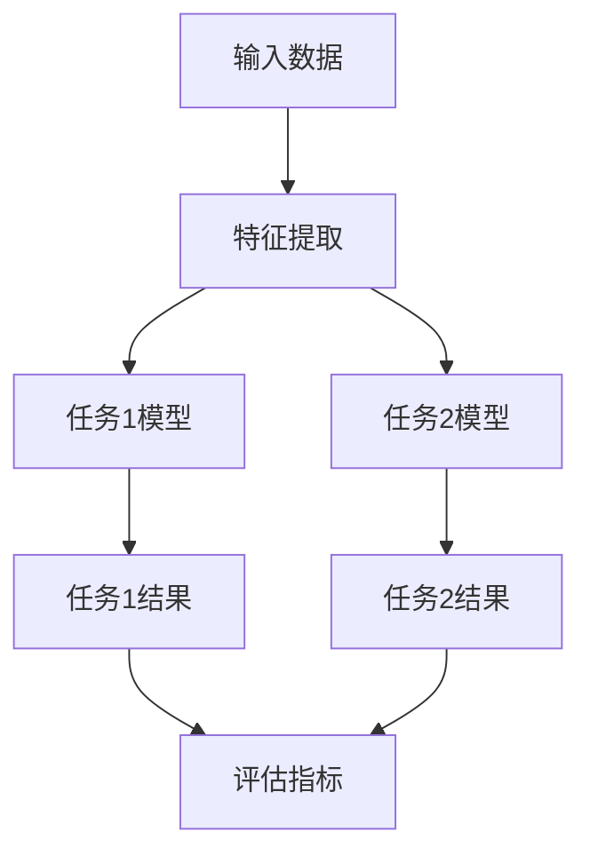
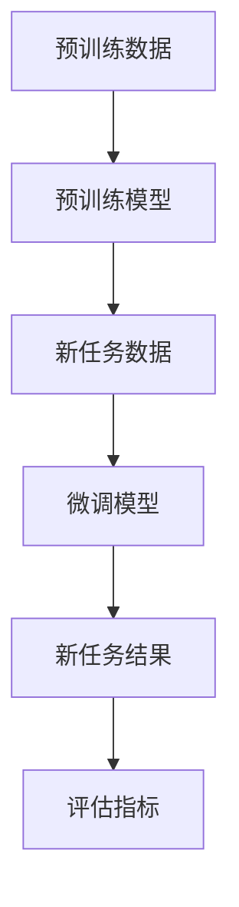

                 

### 引言

#### AI Agent与多模态学习的背景

随着人工智能技术的飞速发展，AI Agent（智能代理）在各个领域展现出了巨大的潜力。AI Agent被定义为能够自主执行任务、与环境交互并做出决策的智能实体。然而，现实世界中的信息是多元且复杂的，单一模态的信息往往难以满足AI Agent的全面需求。因此，多模态学习应运而生，它通过整合视觉、听觉和文本等不同模态的信息，使AI Agent能够更加准确地理解和响应复杂环境。

多模态学习是近年来人工智能领域的一个研究热点。其核心思想是利用多个模态的数据，通过有效的数据融合方法，使得AI Agent能够从不同的角度对问题进行理解和分析。例如，在视频监控系统中，整合视频（视觉）和音频（听觉）信息可以帮助系统更准确地识别事件和情感；在自然语言处理中，结合文本信息和图像信息可以增强文本的理解深度。

本研究的主要目标是探讨AI Agent的多模态学习，分析视觉、听觉和文本信息整合的技术方法和应用场景，提出一种有效的多模态学习框架。通过这一研究，我们希望能够为AI Agent的发展提供新的思路和解决方案。

#### 研究的重要性与意义

AI Agent的多模态学习具有广泛的应用前景。在医疗领域，多模态学习可以帮助医生更准确地诊断疾病，通过整合患者的病历信息、影像数据和语音记录，可以提供更加全面的诊断支持。在智能助手领域，整合文本和语音信息可以让智能助手更自然地与用户进行交互，提供更加个性化的服务。在自动驾驶领域，通过整合视觉、听觉和传感器信息，可以提高自动驾驶系统的安全性和可靠性。

此外，多模态学习在增强AI Agent的鲁棒性和适应性方面也具有重要作用。现实世界中的环境是多变且不可预测的，单一模态的信息可能无法全面反映环境状况。通过多模态学习，AI Agent可以从不同的模态获取互补信息，从而提高对复杂环境的理解和适应能力。

总之，研究AI Agent的多模态学习不仅具有重要的理论意义，也具有广泛的应用价值。它将为人工智能技术的发展注入新的活力，推动AI Agent在各个领域的应用更加深入和广泛。

#### 文章结构与内容安排

本文将分为六个主要部分，每个部分都聚焦于AI Agent的多模态学习的不同方面：

1. **引言**：介绍AI Agent与多模态学习的背景和重要性，概述本文的研究目标和结构。
2. **AI Agent与多模态学习概述**：详细讨论AI Agent和多模态学习的核心概念、发展历程以及研究现状。
3. **视觉模态的学习**：探讨视觉感知基础、卷积神经网络（CNN）以及特征提取与融合技术。
4. **听觉模态的学习**：分析听觉感知基础、循环神经网络（RNN）以及声学模型与语言模型的融合。
5. **文本模态的学习**：讨论自然语言处理（NLP）基础、词汇表示与嵌入技术以及上下文理解。
6. **多模态学习的整合**：介绍多模态数据融合技术、多任务学习和迁移学习的方法。
7. **应用案例分析**：通过具体案例展示多模态学习在现实世界中的应用。
8. **未来展望与挑战**：讨论多模态学习的发展趋势、面临的挑战及未来发展方向。

通过以上结构的安排，本文将系统地探讨AI Agent的多模态学习，为读者提供全面的技术分析和实践指导。

#### 文章关键词

- AI Agent
- 多模态学习
- 视觉感知
- 听觉感知
- 自然语言处理
- 数据融合
- 多任务学习
- 迁移学习

#### 摘要

本文旨在探讨AI Agent的多模态学习，重点研究视觉、听觉和文本信息的整合技术。首先，我们介绍了AI Agent与多模态学习的背景和重要性，随后详细分析了视觉、听觉和文本模态的学习方法和技术。接着，文章讨论了多模态数据融合的方法、多任务学习和迁移学习的应用。通过具体案例分析，展示了多模态学习在现实世界中的应用。最后，文章对多模态学习的发展趋势、面临的挑战及未来方向进行了展望。本文为AI Agent的多模态学习提供了系统的技术分析和实践指导。 

### AI Agent与多模态学习概述

#### 核心概念

首先，我们需要明确两个核心概念：AI Agent和多模态学习。

**AI Agent**，即人工智能代理，是一种具有自主性和交互性的智能实体。它可以自主执行任务、感知环境并做出决策。AI Agent的设计理念来源于人类代理的行为，旨在模拟人类的认知过程，实现更智能、更灵活的自动化操作。AI Agent在自动驾驶、智能助手、游戏智能体等领域有着广泛的应用。

**多模态学习**，是指通过整合来自不同模态的信息（如视觉、听觉、文本等），以提高AI Agent的感知能力和决策质量。多模态学习的目标是从多个信息源中提取有效特征，并进行有效融合，以实现更全面、更准确的环境理解和交互。

#### AI Agent的发展历程

AI Agent的发展历程可以追溯到人工智能（AI）的起源。自1956年达特茅斯会议上提出“人工智能”这一概念以来，人工智能技术经历了多个发展阶段。

1. **早期探索阶段（1956-1969）**：这一阶段主要关注基于逻辑推理的专家系统。专家系统通过模拟人类专家的思维方式，解决特定领域的问题。

2. **成熟与挑战阶段（1970-1980）**：随着计算机性能的提升，人工智能开始向更复杂的任务进军，包括自然语言处理、图像识别等。然而，由于数据稀缺和计算能力的限制，人工智能的发展遭遇了“人工智能寒冬”。

3. **复苏与扩展阶段（1980-1990）**：随着计算机硬件的进步和算法的创新，人工智能迎来了新的发展机遇。这一阶段，机器学习开始崭露头角，成为AI研究的重要方向。

4. **大数据与深度学习阶段（2010至今）**：随着大数据和深度学习技术的发展，AI Agent取得了显著的进展。深度学习模型能够通过大量的数据自动学习特征，从而实现了在图像识别、语音识别等任务中的突破。

#### 多模态学习的必要性

在AI Agent的发展过程中，单一模态的信息处理往往难以应对复杂多变的现实世界环境。以下原因使得多模态学习成为必要：

1. **信息互补性**：不同模态的信息可以提供互补的信息，从而提高AI Agent的感知能力。例如，视觉信息可以提供空间信息，听觉信息可以提供声音特征，文本信息可以提供语义信息。

2. **增强决策能力**：通过整合多个模态的信息，AI Agent可以获得更全面的环境理解，从而做出更准确的决策。例如，在自动驾驶中，整合视觉和雷达信息可以提供更准确的路况感知。

3. **提高鲁棒性**：多模态学习可以减少由于单一模态信息不足或噪声导致的错误。例如，在语音识别中，结合文本信息可以提高识别的准确性。

4. **拓宽应用领域**：多模态学习使得AI Agent可以应用于更广泛的领域，如医疗诊断、智能助手、人机交互等。

#### 多模态学习在AI Agent中的应用

多模态学习在AI Agent中的应用主要体现在以下几个方面：

1. **智能监控**：通过整合视频（视觉）和音频（听觉）信息，智能监控系统可以更准确地识别异常事件和场景。例如，当视频识别到闯入者时，结合音频识别到的声音特征，可以更准确地判断事件的真实性。

2. **自然语言处理**：多模态学习可以提升自然语言处理系统的理解能力。例如，在聊天机器人中，结合文本和语音信息，可以更准确地理解用户的意图和情感。

3. **自动驾驶**：自动驾驶系统需要整合视觉、听觉和传感器信息，以实现精准的环境感知和路径规划。例如，通过视觉识别道路标志，结合听觉识别交通声音，可以更准确地判断路况。

4. **医疗诊断**：多模态学习可以帮助医生更准确地诊断疾病。例如，通过整合患者的病历信息（文本）、影像数据（视觉）和语音记录（听觉），可以提供更全面的诊断支持。

#### 核心概念

以下是本文中涉及的一些核心概念及其定义：

- **AI Agent**：一种具有自主性和交互性的智能实体，能够执行任务、感知环境和做出决策。
- **多模态学习**：通过整合来自不同模态的信息（如视觉、听觉、文本等），提高AI Agent的感知能力和决策质量。
- **视觉模态**：通过图像和视频获取的信息，包括颜色、形状、运动等特征。
- **听觉模态**：通过声音和语音获取的信息，包括音调、音色、语速等特征。
- **文本模态**：通过自然语言文本获取的信息，包括词汇、句法、语义等特征。
- **数据融合**：将不同模态的信息进行整合，以提取有用特征和增强信息理解。
- **多任务学习**：同时训练多个相关任务，共享特征表示，以提高整体性能。
- **迁移学习**：利用已经在一个任务上训练好的模型，迁移到另一个相关任务上，以提高新任务的性能。

#### 多模态学习的组成部分

多模态学习涉及多个关键组成部分，包括数据预处理、特征提取、特征融合、模型训练和评估等。以下是这些组成部分的详细说明：

1. **数据预处理**：数据预处理是多模态学习的基础步骤，其目的是对原始数据进行清洗、标注和标准化。这一步包括数据清洗（去除噪声和错误）、数据标注（为每个模态的数据分配标签）和数据标准化（将数据转换为适合模型处理的格式）。

2. **特征提取**：特征提取是从原始数据中提取有用特征的过程。不同模态的数据需要使用不同的特征提取方法。例如，对于视觉模态，常用的特征提取方法包括卷积神经网络（CNN）和深度学习；对于听觉模态，常用的方法包括梅尔频率倒谱系数（MFCC）和循环神经网络（RNN）；对于文本模态，常用的方法包括词嵌入和文本分类器。

3. **特征融合**：特征融合是将不同模态的特征进行整合，以生成一个统一特征表示的过程。特征融合可以采用多种方法，包括特征级融合（直接将不同模态的特征进行合并）、决策级融合（在特征融合后再进行分类或预测）和模型级融合（将多个模型的结果进行整合）。

4. **模型训练**：模型训练是使用提取和融合后的特征数据，训练多模态学习模型的过程。常用的多模态学习模型包括多任务学习模型（同时训练多个相关任务）和迁移学习模型（利用已经在一个任务上训练好的模型，迁移到其他任务上）。

5. **模型评估**：模型评估是对训练好的多模态学习模型进行性能测试和优化的过程。评估指标包括准确率、召回率、F1分数等，这些指标可以帮助我们判断模型在特定任务上的性能。

#### 研究现状与趋势

多模态学习在人工智能领域的研究已经取得了显著进展。目前，多模态学习主要应用于图像识别、语音识别、自然语言处理和智能监控等领域。以下是一些主要的研究现状和趋势：

1. **深度学习方法**：深度学习方法在多模态学习中的应用越来越广泛。例如，卷积神经网络（CNN）在图像识别中表现出色，循环神经网络（RNN）在语音识别中具有优势，而变压器模型（Transformer）在自然语言处理中展现了强大的能力。

2. **跨模态表示学习**：跨模态表示学习是多模态学习的关键环节。研究主要集中在如何有效地将不同模态的信息映射到一个统一的表示空间，以便进行后续的特征融合和任务学习。

3. **多任务学习和迁移学习**：多任务学习和迁移学习是多模态学习的重要研究方向。通过同时训练多个相关任务或利用已有模型的知识迁移到新任务上，可以提高模型的性能和泛化能力。

4. **数据集与评估指标**：随着多模态学习应用场景的扩展，新的数据集和评估指标不断涌现。例如，多模态情感分析数据集和智能监控数据集，用于评估多模态学习模型在实际应用中的性能。

5. **跨领域应用**：多模态学习不仅在计算机视觉、语音识别和自然语言处理等领域取得了进展，还逐渐应用于医疗诊断、人机交互和自动驾驶等领域，推动了人工智能技术的跨领域应用。

#### 技术挑战与发展方向

尽管多模态学习取得了显著进展，但仍然面临许多技术挑战和问题：

1. **数据稀缺与标注成本**：多模态数据通常比单模态数据稀缺且标注成本高昂。如何有效地利用有限的标注数据进行多模态学习，是一个亟待解决的问题。

2. **数据不一致性**：不同模态的数据可能在时间、空间和内容上存在不一致性，如何有效地融合这些不一致的信息，是另一个挑战。

3. **模型解释性**：多模态学习模型往往较为复杂，其内部决策过程难以解释。如何提高模型的解释性，使其在应用中更加透明和可靠，是一个重要研究方向。

4. **跨模态迁移能力**：如何提高模型在不同模态之间的迁移能力，使其能够在新的模态上表现良好，是另一个重要挑战。

5. **实时性**：在许多实际应用中，多模态学习需要具备实时性，如何优化模型结构和算法，以提高实时性能，是一个关键问题。

未来的发展方向包括：

1. **跨模态数据生成**：通过生成对抗网络（GAN）等生成模型，模拟多样化的跨模态数据，以缓解数据稀缺问题。

2. **融合策略创新**：探索新的融合策略，如图神经网络（GCN）和注意力机制，以提高跨模态数据的融合效果。

3. **模型解释性与可解释性**：通过可视化方法、解释性算法和元学习技术，提高多模态学习模型的解释性。

4. **跨领域迁移学习**：研究跨领域迁移学习技术，以实现模型在多个领域上的应用和性能提升。

5. **硬件加速与优化**：通过硬件加速（如GPU、TPU）和算法优化，提高多模态学习模型的实时性能。

通过解决这些挑战，多模态学习有望在未来实现更加广泛和深入的应用，推动人工智能技术的持续发展。

### 视觉模态的学习

视觉模态的学习在人工智能领域具有至关重要的地位。视觉系统是人体最重要的感官之一，通过视觉信息，人类能够感知周围环境、识别物体和事件，从而做出相应的反应。在人工智能中，视觉信息处理同样扮演着关键角色，使得机器能够理解和解析图像和视频数据。本章节将详细探讨视觉模态的学习，从基本原理到核心算法，帮助读者全面了解这一领域的知识。

#### 视觉感知的基本原理

视觉感知是指通过视觉系统对光信号进行处理，生成对环境的感知和理解。人类视觉系统的基本原理可以概括为以下几个步骤：

1. **光的接收**：眼睛的视网膜接收外部光线，将其转换为电信号。
2. **神经传递**：电信号通过视神经传递到大脑，形成视觉信息。
3. **信息处理**：大脑对视觉信息进行解码、分析和理解，形成对环境的感知。
4. **反应生成**：基于视觉信息，大脑生成相应的反应，如移动、识别或决策。

在人工智能中，视觉感知主要通过计算机视觉技术实现。计算机视觉涉及从图像或视频中提取有用信息，如物体识别、场景理解、运动跟踪等。计算机视觉系统通常包括以下几个组成部分：

- **图像捕获**：使用相机或其他传感器捕获图像。
- **预处理**：对图像进行预处理，如滤波、去噪和增强。
- **特征提取**：从图像中提取有意义的特征，如边缘、纹理、颜色等。
- **模型训练**：使用机器学习算法，如卷积神经网络（CNN），对特征进行分类和识别。
- **结果输出**：将模型的预测结果输出，如物体标签、场景分类等。

#### 视觉信息处理流程

视觉信息处理是一个复杂的过程，涉及多个层次和阶段的处理。以下是视觉信息处理的基本流程：

1. **图像捕获**：相机或其他传感器捕捉图像数据。
2. **图像预处理**：对图像进行缩放、旋转、裁剪等预处理操作，以提高图像质量。
3. **图像分割**：将图像分割为不同的区域，以便对每个区域进行独立分析。
4. **特征提取**：从分割后的图像中提取特征，如边缘、纹理、形状等。
5. **特征融合**：将不同特征进行融合，生成统一的特征表示。
6. **分类与识别**：使用机器学习模型，如CNN，对提取的特征进行分类和识别。
7. **结果输出**：输出分类结果或识别结果，如物体标签、场景分类等。

在这一流程中，特征提取和模型训练是关键步骤。特征提取的目的是从图像中提取有意义的特征，这些特征可以帮助模型更好地理解和识别图像内容。模型训练则是通过大量标注数据，训练机器学习模型，使其能够自动识别和分类图像。

#### 卷积神经网络（CNN）

卷积神经网络（CNN）是计算机视觉领域最常用的深度学习模型之一。CNN通过卷积层、池化层和全连接层等结构，实现对图像的自动特征提取和分类。以下是CNN的基本结构和工作原理：

1. **卷积层**：卷积层通过卷积操作从输入图像中提取特征。每个卷积核（filter）可以提取图像中的特定特征，如边缘、纹理等。通过多个卷积层叠加，可以逐步提取更高层次的特征。

2. **池化层**：池化层用于降低特征图的维度，减少计算量。常用的池化操作包括最大池化和平均池化。

3. **全连接层**：全连接层将卷积层和池化层提取的特征进行整合，并输出分类结果。全连接层类似于传统神经网络中的全连接层。

CNN的工作原理可以概括为以下几个步骤：

- **输入阶段**：输入图像通过卷积层，生成一系列特征图。
- **特征提取阶段**：通过多个卷积层和池化层，逐步提取更高层次的特征。
- **分类阶段**：通过全连接层，将特征映射到分类结果。

CNN在图像识别、物体检测、语义分割等任务中表现出色。例如，在ImageNet图像识别挑战中，CNN模型显著提升了图像识别的准确率，推动了计算机视觉技术的发展。

#### CNN在视觉任务中的应用

CNN不仅在图像识别任务中表现出色，还在物体检测、语义分割、视频分析等视觉任务中得到了广泛应用。以下是CNN在几个常见视觉任务中的应用：

1. **图像识别**：图像识别是CNN最基础的应用。通过训练CNN模型，可以实现对图像中物体的分类。例如，在ImageNet图像识别挑战中，CNN模型成功识别出数百万个不同类别的物体。

2. **物体检测**：物体检测旨在定位图像中的多个物体，并给出它们的类别。常用的CNN模型包括R-CNN、Fast R-CNN、Faster R-CNN等。这些模型通过特征提取和边界框回归，实现了高效和准确的物体检测。

3. **语义分割**：语义分割是对图像中的每个像素进行分类，生成语义分割图。常用的CNN模型包括FCN、U-Net、SegNet等。这些模型通过卷积操作和全连接层，实现了对图像像素的精细分割。

4. **视频分析**：视频分析涉及对视频流中的连续图像进行处理和分析。CNN可以用于视频分类、动作识别、行人检测等任务。例如，通过训练CNN模型，可以实现对视频中的动作进行实时识别。

#### 特征提取与融合

在视觉任务中，特征提取是关键步骤之一。有效的特征提取可以显著提升模型的性能和准确性。以下是一些常用的特征提取方法：

1. **传统特征提取方法**：传统特征提取方法包括SIFT、SURF、HOG等。这些方法通过检测和描述图像中的局部特征，实现了对图像的区分和识别。然而，这些方法对光照、视角和尺度变化较为敏感。

2. **深度学习方法**：深度学习方法，特别是卷积神经网络（CNN），在特征提取方面表现出色。CNN通过多层卷积操作，可以自动学习图像中的高层次抽象特征，从而提高模型的泛化能力和鲁棒性。

在特征提取后，特征融合是一个重要的步骤。特征融合的目的是将不同模态或不同层次的特征进行整合，生成统一的特征表示。以下是一些常用的特征融合方法：

1. **特征级融合**：特征级融合是在特征提取后直接将不同模态的特征进行合并。这种方法简单有效，但可能忽略了不同特征之间的内在联系。

2. **决策级融合**：决策级融合是在模型分类或预测阶段，将不同模态的特征进行融合。这种方法可以充分利用各个模态的特征信息，但需要额外的计算开销。

3. **模型级融合**：模型级融合是通过多个独立的模型进行分类或预测，然后将结果进行融合。这种方法可以充分利用不同模型的优势，提高整体性能。

#### 实际案例分析

为了更好地理解视觉模态的学习，以下通过一个实际案例进行分析。

**案例：自动驾驶中的物体检测**

自动驾驶系统需要准确检测和理解道路上的物体，如车辆、行人、交通标志等，以实现安全、可靠的驾驶。以下是自动驾驶物体检测的基本流程：

1. **图像捕获**：使用摄像头捕获道路图像。
2. **图像预处理**：对图像进行预处理，如去噪、缩放、增强等，以提高图像质量。
3. **特征提取**：使用卷积神经网络（CNN）对预处理后的图像进行特征提取。卷积层逐步提取图像中的局部特征，如边缘、纹理等。池化层用于降低特征图的维度，减少计算量。
4. **物体检测**：使用物体检测算法，如Faster R-CNN，对提取的特征进行分类和定位。Faster R-CNN通过卷积神经网络提取特征，同时利用区域建议网络（RPN）生成候选物体边界框。
5. **结果输出**：输出检测到的物体类别和边界框，如车辆（car）、行人（pedestrian）、交通标志（traffic sign）等。

通过以上流程，自动驾驶系统可以准确识别和定位道路上的物体，从而实现自动驾驶功能。

#### 总结

视觉模态的学习在人工智能领域具有广泛的应用。通过卷积神经网络（CNN）等深度学习算法，可以实现高效的图像识别、物体检测、语义分割等视觉任务。特征提取与融合技术是视觉模态学习的关键步骤，通过有效的特征提取和融合，可以提升模型的性能和准确性。在实际应用中，视觉模态的学习为自动驾驶、智能监控、医疗诊断等领域提供了重要的技术支持。

### 听觉模态的学习

听觉模态的学习在人工智能领域同样具有极其重要的地位。人类的听觉系统能够捕捉声音信息，解析声音的音调、音色和节奏，从而理解语言、音乐和环境信息。在人工智能中，通过听觉模态的学习，机器可以理解和处理语音、音乐和音频信号，实现语音识别、音频分类、情感分析等任务。本章节将深入探讨听觉模态的学习，包括基本原理、核心算法和实际应用。

#### 听觉感知的基本原理

听觉感知是指通过听觉系统对声波信号进行处理，生成对声音的理解和感知。人类听觉系统的基本原理可以概括为以下几个步骤：

1. **声波接收**：外耳接收声波，并将其传递到中耳。
2. **声波转换**：中耳通过震动，将声波转换为机械振动。
3. **神经传递**：内耳的耳蜗将机械振动转换为神经信号，通过听觉神经传递到大脑。
4. **信息处理**：大脑对神经信号进行解码、分析和理解，生成对声音的感知。
5. **反应生成**：基于对声音的理解，大脑生成相应的反应，如理解语言、识别音乐或做出决策。

在人工智能中，听觉信息处理主要通过语音识别、音频处理和音乐分析等任务实现。以下是一些关键的组成部分：

- **音频捕获**：使用麦克风或其他音频传感器捕获声音信号。
- **预处理**：对音频信号进行预处理，如降噪、去混响和增强，以提高声音质量。
- **特征提取**：从音频信号中提取有意义的特征，如梅尔频率倒谱系数（MFCC）、谱图等。
- **模型训练**：使用机器学习算法，如循环神经网络（RNN）和深度神经网络（DNN），对提取的特征进行分类和识别。
- **结果输出**：输出分类结果或识别结果，如语音转文字、音频标签等。

#### 听觉信息处理流程

听觉信息处理的流程可以分为以下几个主要阶段：

1. **音频捕获**：麦克风或其他音频传感器捕捉声音信号。
2. **预处理**：对声音信号进行降噪、去混响和增强等预处理，以提高声音的清晰度和准确性。
3. **特征提取**：从预处理后的音频信号中提取特征，如梅尔频率倒谱系数（MFCC）、谱图等。这些特征能够捕捉声音的音调、音色和节奏等信息。
4. **特征归一化**：将提取的特征进行归一化处理，使其适合输入到机器学习模型。
5. **模型训练**：使用机器学习模型，如循环神经网络（RNN）或深度神经网络（DNN），对特征进行分类和识别。这些模型通过大量标注数据进行训练，学习如何将特征映射到相应的类别或标签。
6. **结果输出**：输出模型预测的结果，如语音转文字、音频标签等。

在这一流程中，特征提取和模型训练是关键步骤。特征提取的目的是从音频信号中提取有意义的特征，这些特征可以帮助模型更好地理解和识别声音。模型训练则是通过大量标注数据，训练机器学习模型，使其能够自动识别和分类声音。

#### 循环神经网络（RNN）

循环神经网络（RNN）是处理序列数据的一种有效方法，特别适用于音频处理和语音识别任务。RNN通过其循环结构，可以记住前面的输入信息，并在当前输入的基础上进行预测。以下是RNN的基本结构和工作原理：

1. **输入层**：输入层接受原始音频信号，如一帧帧的语音波形。
2. **隐藏层**：隐藏层包含多个神经元，每个神经元都连接到输入层的神经元。这些神经元通过循环连接，形成一个循环结构。每个隐藏层神经元的状态依赖于其前一个时间步的状态，从而可以记住前面的信息。
3. **输出层**：输出层对隐藏层的状态进行解码，生成预测结果，如语音转文字、音频标签等。

RNN的工作原理可以概括为以下几个步骤：

- **前向传播**：输入信号通过隐藏层，每个隐藏层神经元根据其前面的状态和当前输入进行计算，生成中间结果。
- **记忆**：隐藏层通过循环连接，将信息传递到下一个时间步，从而记住前面的输入信息。
- **后向传播**：通过误差计算和反向传播，更新隐藏层和输入层的权重，优化模型参数。

RNN在语音识别、语言模型训练和音频分类等任务中表现出色。例如，在Google的语音识别系统中，RNN被用于将连续的语音信号转换为文本。

#### RNN在听觉任务中的应用

RNN在多个听觉任务中都有广泛的应用，以下是几个典型应用：

1. **语音识别**：语音识别是将语音信号转换为文本的过程。RNN通过其记忆能力，可以有效地处理连续的语音信号，实现高准确率的语音识别。

2. **音频分类**：音频分类是将音频信号分类到不同的类别中，如音乐类型、声音来源等。RNN可以处理音频信号的时间序列特征，实现准确的音频分类。

3. **音乐生成**：音乐生成是通过模型生成新的音乐作品。RNN可以学习音乐的时间序列特征，生成旋律、节奏和和声等。

4. **声源识别**：声源识别是识别音频信号中的特定声源，如说话人识别、乐器识别等。RNN可以通过分析声波特征，实现高精度的声源识别。

#### 声学模型与语言模型

在语音识别任务中，声学模型和语言模型是两个核心组件。声学模型负责将语音信号转换为声学特征，而语言模型负责将声学特征转换为文本输出。以下是对这两个模型及其融合的详细说明：

1. **声学模型**：声学模型是一种用于处理语音信号的机器学习模型，其目的是将语音信号转换为声学特征。常见的声学模型包括隐马尔可夫模型（HMM）、高斯混合模型（GMM）和深度神经网络（DNN）。声学模型通过训练大量语音数据，学习语音信号的声学特征，如音素、音节等。

2. **语言模型**：语言模型是一种用于处理文本数据的机器学习模型，其目的是将声学特征转换为文本输出。常见的语言模型包括n-gram模型、神经网络语言模型（NNLM）和循环神经网络（RNN）。语言模型通过训练大量文本数据，学习文本的统计特征和语法结构。

3. **声学模型与语言模型的融合**：声学模型和语言模型的融合是语音识别的关键技术。通过结合声学特征和语言特征，可以显著提高语音识别的准确率。常见的融合方法包括基于统计的方法（如 beam search）、基于神经网络的模型（如CTC）和端到端的语音识别模型（如Seq2Seq）。

#### 实际案例分析

为了更好地理解听觉模态的学习，以下通过一个实际案例进行分析。

**案例：语音助手中的语音识别**

语音助手是日常生活中常见的应用，如苹果的Siri、亚马逊的Alexa等。语音识别是语音助手的核心功能之一，以下是一个典型的语音识别流程：

1. **音频捕获**：麦克风捕获用户的语音信号。
2. **预处理**：对语音信号进行降噪、去混响和增强等预处理，以提高语音的清晰度和准确性。
3. **特征提取**：使用梅尔频率倒谱系数（MFCC）等方法，从预处理后的语音信号中提取声学特征。
4. **声学模型**：使用预训练的声学模型，对提取的声学特征进行分类和识别，生成声学标签。
5. **语言模型**：使用预训练的语言模型，根据声学标签和上下文信息，生成文本输出。
6. **结果输出**：将生成的文本输出，如回答问题、执行命令等。

通过以上流程，语音助手可以准确理解用户的语音指令，实现智能交互。

#### 总结

听觉模态的学习在人工智能领域具有广泛的应用。通过循环神经网络（RNN）等深度学习算法，可以实现高效的语音识别、音频分类和音乐生成等任务。声学模型和语言模型的融合是语音识别的关键技术，通过结合声学特征和语言特征，可以显著提高语音识别的准确率。在实际应用中，听觉模态的学习为语音助手、智能监控和医疗诊断等领域提供了重要的技术支持。随着技术的不断发展，听觉模态的学习将继续在人工智能领域发挥重要作用。

### 文本模态的学习

文本模态的学习在人工智能领域占据着核心地位，它涉及到自然语言处理（NLP）的基础技术，如词汇表示、文本嵌入和上下文理解。通过有效的文本处理，机器能够理解和生成人类语言，从而实现智能对话、文本分析、情感识别等任务。本章节将深入探讨文本模态的学习，包括核心概念、关键技术以及实际应用。

#### 自然语言处理（NLP）

自然语言处理（NLP）是人工智能的一个分支，致力于让计算机理解和生成人类语言。NLP的核心任务包括文本分类、命名实体识别、情感分析、机器翻译、问答系统等。以下是NLP的一些关键概念：

- **文本分类**：将文本分类到预定义的类别中，如新闻文章的分类、社交媒体文本的情感分类等。
- **命名实体识别**：识别文本中的特定实体，如人名、地点、组织名等。
- **情感分析**：分析文本中的情感倾向，如正面、负面或中立情感。
- **机器翻译**：将一种语言的文本翻译成另一种语言。
- **问答系统**：根据用户的问题，从大量文本中检索并返回相关答案。

#### 词汇表示

词汇表示是将自然语言文本转换为计算机可以处理的向量形式的过程。有效的词汇表示方法可以提升NLP模型的效果和效率。以下是一些常用的词汇表示方法：

1. **词袋模型（Bag of Words, BOW）**：词袋模型将文本表示为单词的集合，忽略单词的顺序和语法结构。每个单词被表示为一个特征向量，其中每个维度表示该单词在文本中出现的频率。

2. **词嵌入（Word Embedding）**：词嵌入是将单词映射到一个低维向量空间，使得语义上相似的单词在向量空间中靠近。常见的词嵌入方法包括Word2Vec、GloVe等。这些方法通过训练大量文本数据，学习单词的向量表示。

3. **字符嵌入（Character Embedding）**：字符嵌入是将文本中的每个字符映射到向量空间。与词嵌入不同，字符嵌入能够捕捉单词内部的结构和语法特征，从而提高模型的性能。

4. **混合嵌入（Hybrid Embedding）**：混合嵌入结合了词嵌入和字符嵌入的优点，通过将词嵌入和字符嵌入融合，生成更加丰富和精确的文本表示。

#### 词汇表示的对比

以下是几种词汇表示方法的对比：

| 模型名称      | 特点                  | 适用场景                             |
| ------------ | ------------------- | ---------------------------------- |
| 词袋模型      | 简单，计算效率高      | 用于文本分类和文档相似度计算         |
| Word2Vec     | 尝试捕捉语义关系      | 用于文本分类、语义相似度计算和机器翻译 |
| GloVe        | 利用全局统计信息      | 用于文本分类、语义相似度计算和问答系统 |
| 字符嵌入      | 捕捉单词内部结构      | 用于文本分类和序列标注任务           |
| 混合嵌入      | 结合词和字符信息      | 用于复杂文本处理任务                 |

#### 词汇表示的对比表格

以下是词汇表示方法的对比表格：

| 模型名称      | 特点                      | 适用场景                             | 示例                                 |
| ------------ | ----------------------- | ---------------------------------- | ------------------------------------ |
| 词袋模型      | 忽略单词顺序，简单高效     | 文本分类、情感分析                   | `["I", "love", "AI"]` 转换为向量表示 |
| Word2Vec     | 学习单词之间的语义关系      | 语义相似度计算、机器翻译             | `["I", "love", "AI"]` 转换为高维向量 |
| GloVe        | 利用全局统计信息优化嵌入    | 问答系统、文本分类                   | `["I", "love", "AI"]` 转换为向量表示 |
| 字符嵌入      | 捕捉单词内部结构和语法特征  | 序列标注、文本分类                   | `["I", "love", "AI"]` 转换为向量表示 |
| 混合嵌入      | 结合词嵌入和字符嵌入优势    | 复杂文本处理任务                     | `["I", "love", "AI"]` 转换为向量表示 |

#### 上下文理解

上下文理解是NLP中的核心问题，它涉及如何从文本中理解单词的语义，特别是在特定上下文中。以下是一些关键的上下文理解技术：

1. **语言模型（Language Model）**：语言模型用于预测文本序列中的下一个单词或词组。通过训练大量文本数据，语言模型可以学习单词之间的统计关系和上下文信息。常见的语言模型包括n-gram模型和基于神经网络的模型（如RNN、Transformer）。

2. **上下文感知模型（Contextual Embeddings）**：上下文感知模型通过将单词映射到上下文相关的向量表示，实现了对单词语义的动态理解。这些模型能够捕捉单词在特定句子中的含义，从而提高NLP任务的性能。常见的上下文感知模型包括Word2Vec、GloVe和BERT。

3. **实体识别（Named Entity Recognition, NER）**：实体识别是识别文本中的特定实体（如人名、地点、组织名等）的任务。通过上下文理解，模型可以准确识别实体并分类。

4. **语义角色标注（Semantic Role Labeling, SRL）**：语义角色标注是识别句子中词语的语义角色（如主语、谓语、宾语等）的任务。通过上下文理解，模型可以捕捉句子中的语义关系。

#### 上下文理解的挑战

上下文理解虽然重要，但也面临许多挑战：

1. **多义词处理**：许多单词具有多个含义，特定上下文中的含义需要通过上下文信息进行推断。

2. **长句理解**：长句中的信息复杂，涉及多个层次的语义关系，理解长句中的上下文信息是一个挑战。

3. **跨模态理解**：在多模态学习场景中，文本信息与其他模态（如视觉、听觉）的信息进行融合，跨模态上下文理解也是一个难点。

4. **语用因素**：语用因素（如礼貌、意图）对上下文理解有很大影响，但难以用机器学习模型准确捕捉。

#### 实际案例分析

为了更好地理解文本模态的学习，以下通过一个实际案例进行分析。

**案例：智能客服系统中的文本分类**

智能客服系统是文本分类的一个典型应用。以下是一个典型的文本分类流程：

1. **数据收集**：收集大量的客服对话数据，包括用户问题和客服回答。
2. **预处理**：对文本数据进行清洗，如去除停用词、标点符号和特殊字符，并将文本转换为统一格式。
3. **特征提取**：使用词嵌入技术，将文本转换为向量表示。
4. **模型训练**：使用文本分类模型（如SVM、CNN、Transformer）对特征进行分类训练。
5. **模型部署**：将训练好的模型部署到智能客服系统中，实时分类用户问题。
6. **结果输出**：根据分类结果，系统返回相应的答案或转接给客服代表。

通过以上流程，智能客服系统可以自动分类用户问题，提供高效、准确的客服服务。

#### 总结

文本模态的学习在人工智能领域具有广泛的应用。通过词汇表示和上下文理解技术，机器能够理解和生成人类语言，实现文本分类、情感分析、机器翻译等任务。词汇表示方法包括词袋模型、词嵌入、字符嵌入和混合嵌入等。上下文理解是文本处理中的核心问题，涉及语言模型和上下文感知模型。在实际应用中，文本模态的学习为智能客服、文本分析和自然语言生成等领域提供了重要的技术支持。

### 多模态学习的整合

多模态学习的整合是将来自不同模态的信息（如视觉、听觉和文本）有效融合，以提高AI Agent的整体感知和决策能力。在多模态学习整合中，数据融合技术、多任务学习和迁移学习是关键方法。以下将详细探讨这些方法，并提供具体的实际案例。

#### 数据融合技术

数据融合是将不同模态的信息进行整合，以提取更有价值特征的过程。数据融合技术可以分为以下几类：

1. **特征级融合**：在特征级融合中，直接将来自不同模态的特征向量进行拼接。这种方法简单但可能忽略了特征间的内在关系。

2. **决策级融合**：决策级融合是在不同模态的特征提取和分类后，将分类结果进行整合。这种方法可以充分利用各个模态的特征信息，但需要额外的计算开销。

3. **模型级融合**：模型级融合是通过构建一个统一的模型，同时处理多个模态的数据。这种方法可以有效地整合不同模态的信息，但模型设计和训练较为复杂。

以下是特征级融合、决策级融合和模型级融合的对比表格：

| 融合方法     | 定义与特点                     | 适用场景                      |
| ---------- | -------------------------- | ------------------------- |
| 特征级融合   | 直接拼接不同模态的特征向量      | 简单，适用于计算资源有限的情况   |
| 决策级融合   | 在特征提取后整合分类结果        | 可以充分利用不同模态的信息      |
| 模型级融合   | 构建一个统一模型处理多模态数据    | 整合效果最好，但计算复杂度较高    |

#### 多任务学习

多任务学习是一种同时训练多个相关任务的方法，旨在提高模型的泛化能力和效率。多任务学习的关键在于共享特征表示和任务权重。以下是多任务学习的原理和应用：

1. **共享特征表示**：多个任务共享同一组特征表示，从而减少参数数量和计算量。通过共享特征，模型可以从不同任务中学习到有用的信息。

2. **任务权重**：多任务学习需要为每个任务分配权重，以平衡不同任务的贡献。常见的权重分配方法包括等权分配、基于数据分布的权重分配和基于任务难度的权重分配。

以下是多任务学习的原理图和步骤：

#### 多任务学习的应用案例

**案例：多模态情感分析**

多模态情感分析旨在通过整合视觉、听觉和文本信息，准确识别用户情感。以下是一个多模态情感分析的多任务学习应用案例：

1. **输入数据**：输入包括视频、音频和文本数据。
2. **特征提取**：使用CNN提取视觉特征，使用RNN提取听觉特征，使用词嵌入提取文本特征。
3. **共享特征表示**：将提取的视觉、听觉和文本特征进行拼接，形成一个统一的多模态特征向量。
4. **任务权重**：为视觉、听觉和文本任务分配不同的权重，以平衡各任务的贡献。
5. **模型训练**：使用共享特征向量同时训练情感分类模型。
6. **结果输出**：输出情感分类结果，如正面、负面或中立情感。

#### 迁移学习

迁移学习是一种利用已经在一个任务上训练好的模型，在新任务上提高性能的方法。迁移学习的关键在于将已有模型的知识迁移到新任务，从而减少训练数据和计算量。以下是迁移学习的原理和应用：

1. **预训练模型**：使用大量数据预训练一个基础模型，使其具备较强的特征提取能力。
2. **微调**：在新任务上，对预训练模型进行微调，以适应新任务的需求。
3. **迁移能力**：通过迁移学习，预训练模型在新任务上的性能通常优于从头训练的模型。

以下是迁移学习的原理图和步骤：

#### 多模态学习与迁移学习的结合

将多模态学习和迁移学习结合，可以充分利用多个模态的数据和已有模型的知识，实现更高效的多模态学习。以下是一个结合多模态学习和迁移学习的方法：

1. **预训练多模态模型**：使用大量多模态数据（如视觉、听觉和文本）预训练一个基础模型，使其具备强大的特征提取和融合能力。
2. **任务微调**：在新任务上，对预训练模型进行微调，同时整合来自不同模态的信息。
3. **迁移学习**：利用预训练模型在新任务上的迁移能力，减少对新数据的标注需求。

#### 实际案例分析

**案例：多模态医疗诊断**

多模态医疗诊断通过整合患者的病历信息（文本）、影像数据（视觉）和语音记录（听觉），提供更准确的诊断支持。以下是一个多模态医疗诊断的案例：

1. **输入数据**：输入包括病历文本、医学影像和患者语音记录。
2. **特征提取**：使用词嵌入提取文本特征，使用CNN提取影像特征，使用RNN提取语音特征。
3. **数据融合**：使用特征级融合方法，将提取的文本、影像和语音特征进行拼接。
4. **迁移学习**：利用预训练的多模态模型，对新任务进行微调。
5. **模型训练**：使用融合后的特征数据，训练多模态医疗诊断模型。
6. **结果输出**：输出诊断结果，如疾病分类和治疗方案。

通过以上步骤，多模态医疗诊断模型可以提供更全面和准确的诊断支持。

#### 总结

多模态学习的整合是提高AI Agent感知和决策能力的重要方法。数据融合技术、多任务学习和迁移学习是关键方法，每种方法都有其适用场景和优势。在实际应用中，多模态学习与迁移学习的结合可以充分利用不同模态的数据和已有模型的知识，实现更高效和准确的多模态学习。通过具体案例分析，可以看到多模态学习在医疗诊断、情感分析等领域的广泛应用和巨大潜力。

### 应用案例分析

多模态学习在现实世界中的应用已经展现出巨大的潜力和广泛的前景。通过具体的案例研究，我们可以更直观地了解多模态学习如何在不同领域中发挥作用，提升系统的性能和用户体验。

#### 多模态情感分析

多模态情感分析旨在通过整合用户的语音、文字和面部表情，更准确地识别用户情感。例如，在一个社交媒体平台上，用户可能会发表一段带有表情的文字和语音评论。通过多模态情感分析，系统可以更全面地理解用户的情感状态，从而提供更个性化的服务和内容推荐。

**案例研究**：

1. **数据收集**：收集用户的文本评论、语音录音和视频对话。
2. **特征提取**：使用词嵌入技术提取文本特征，使用梅尔频率倒谱系数（MFCC）提取语音特征，使用卷积神经网络（CNN）提取面部表情特征。
3. **数据融合**：将提取的多模态特征进行拼接，形成一个综合特征向量。
4. **情感分类模型**：使用深度学习模型，如双向长短期记忆网络（BiLSTM），对综合特征向量进行情感分类。
5. **结果输出**：系统根据情感分类结果，推荐相关内容或显示情感标签。

**案例效果**：通过多模态情感分析，平台可以更精准地识别用户的情感倾向，提高用户满意度和互动质量。

#### 多模态人机交互

多模态人机交互通过整合视觉、听觉和触觉信息，提供更自然、直观的交互体验。例如，智能助手如Siri和Google Assistant，通过语音、文字和触摸等多种交互方式，与用户进行无缝沟通。

**案例研究**：

1. **数据收集**：收集用户语音、文字输入和触摸操作。
2. **特征提取**：使用循环神经网络（RNN）处理语音特征，使用词嵌入提取文本特征，使用卷积神经网络（CNN）处理视觉特征。
3. **数据融合**：使用特征级融合方法，将语音、文本和视觉特征进行拼接。
4. **交互模型**：使用深度学习模型，如Transformer，对融合后的特征向量进行交互理解和响应生成。
5. **结果输出**：系统根据交互模型生成的响应，以语音、文字或触摸形式返回给用户。

**案例效果**：通过多模态人机交互，智能助手可以更准确地理解用户的意图，提供更加自然和个性化的服务。

#### 多模态医疗诊断

多模态医疗诊断通过整合患者的病历文本、影像数据和生理信号，提供更全面和准确的诊断支持。例如，在心脏病诊断中，医生可以通过整合心电图（ECG）、超声影像和病历记录，做出更准确的诊断。

**案例研究**：

1. **数据收集**：收集患者的ECG信号、超声影像和病历文本。
2. **特征提取**：使用时域分析方法提取ECG特征，使用CNN提取影像特征，使用词嵌入提取文本特征。
3. **数据融合**：使用模型级融合方法，构建一个统一的多模态模型，同时处理ECG、影像和文本数据。
4. **诊断模型**：使用深度学习模型，如多任务学习网络（MTL），对融合后的特征向量进行疾病分类。
5. **结果输出**：系统输出诊断结果，如心脏病的类型和严重程度。

**案例效果**：通过多模态医疗诊断，医生可以更全面地分析患者的病情，提高诊断准确率和治疗效果。

#### 案例分析总结

以上案例展示了多模态学习在情感分析、人机交互和医疗诊断等领域的实际应用。通过整合不同模态的信息，系统可以更准确地理解和响应复杂环境，提高用户体验和诊断效果。多模态学习的应用不仅增强了系统的感知能力，还提高了其在不同领域的适应性和可靠性。

### 未来展望与挑战

多模态学习作为人工智能领域的一个重要研究方向，其发展前景广阔，但也面临诸多挑战。在未来，多模态学习有望在多个领域取得重大突破，并进一步推动人工智能技术的发展。以下是多模态学习的未来发展方向、潜在挑战以及应对策略。

#### 未来发展方向

1. **跨模态数据生成**：生成对抗网络（GAN）等技术将广泛应用于跨模态数据生成。通过模拟多样化的跨模态数据，可以有效缓解数据稀缺问题，提高多模态学习的性能。

2. **融合策略创新**：随着深度学习技术的发展，多模态融合策略将不断创新。例如，图神经网络（GCN）和注意力机制等技术有望在多模态数据融合中发挥重要作用，提升融合效果。

3. **模型解释性**：提高多模态学习模型的解释性是一个重要方向。通过可视化方法、解释性算法和元学习技术，可以使得模型在应用中更加透明和可靠，从而增强用户对系统的信任。

4. **跨领域迁移学习**：跨领域迁移学习将使得多模态学习模型能够在不同的应用领域中表现良好。通过研究跨领域迁移的机制和策略，可以有效减少对新数据的标注需求，提高模型的泛化能力。

5. **实时性优化**：在实时性要求较高的应用场景中，如自动驾驶和智能监控，优化多模态学习模型的实时性能是一个重要挑战。通过硬件加速（如GPU、TPU）和算法优化，有望实现高效的多模态数据处理。

#### 面临的挑战

1. **数据稀缺与标注成本**：多模态数据通常比单模态数据稀缺且标注成本高昂。如何有效地利用有限的标注数据进行多模态学习，是一个亟待解决的问题。

2. **数据不一致性**：不同模态的数据可能在时间、空间和内容上存在不一致性，如何有效地融合这些不一致的信息，是一个重要挑战。

3. **模型解释性**：多模态学习模型往往较为复杂，其内部决策过程难以解释。如何提高模型的解释性，使其在应用中更加透明和可靠，是一个关键问题。

4. **跨模态迁移能力**：如何提高模型在不同模态之间的迁移能力，使其能够在新的模态上表现良好，是另一个重要挑战。

5. **实时性**：在许多实际应用中，多模态学习需要具备实时性，如何优化模型结构和算法，以提高实时性能，是一个关键问题。

#### 应对策略

1. **数据增强与生成**：通过数据增强和生成模型（如GAN），模拟多样化的跨模态数据，以缓解数据稀缺问题。

2. **融合策略优化**：探索新的融合策略，如图神经网络（GCN）和注意力机制，以提高跨模态数据的融合效果。

3. **模型解释性**：通过可视化方法、解释性算法和元学习技术，提高多模态学习模型的解释性。

4. **迁移学习**：研究跨领域迁移学习技术，以实现模型在多个领域上的应用和性能提升。

5. **硬件加速与优化**：通过硬件加速（如GPU、TPU）和算法优化，提高多模态学习模型的实时性能。

#### 开放性问题与未来研究

尽管多模态学习取得了显著进展，但仍存在许多开放性问题，值得进一步研究：

1. **跨模态一致性**：如何确保不同模态之间的信息在时间和空间上的一致性，是一个重要问题。

2. **多任务学习中的资源分配**：在多任务学习中，如何优化资源分配策略，以最大化不同任务的性能，是一个关键问题。

3. **数据隐私与安全**：如何保护多模态数据的安全和隐私，是一个亟待解决的伦理和技术问题。

4. **动态环境中的适应能力**：在动态变化的现实环境中，如何提高多模态学习模型的适应能力，是一个具有挑战性的研究问题。

通过解决这些开放性问题，多模态学习有望在未来实现更加广泛和深入的应用，推动人工智能技术的持续发展。

### 总结

本文全面探讨了AI Agent的多模态学习，从视觉、听觉和文本三个模态出发，分析了其学习方法和应用。我们首先介绍了AI Agent和多模态学习的基本概念，回顾了它们的发展历程和重要性。接着，我们详细讨论了视觉、听觉和文本模态的学习方法，包括核心原理和关键技术。随后，我们介绍了多模态学习的整合方法，如数据融合、多任务学习和迁移学习，并通过实际案例分析展示了多模态学习的应用。最后，我们对多模态学习的未来发展方向和挑战进行了展望。

通过本文的探讨，我们认识到多模态学习在提升AI Agent感知能力和决策质量方面的重要性。未来，随着技术的不断进步，多模态学习有望在医疗诊断、人机交互、智能监控等领域发挥更大的作用。同时，我们也应关注数据稀缺、模型解释性和实时性能等挑战，并积极探索解决方案。

感谢读者对本文的阅读，希望本文能为AI Agent的多模态学习研究提供有益的参考和启示。

### 作者信息

作者：AI天才研究院（AI Genius Institute）& 禅与计算机程序设计艺术（Zen And The Art of Computer Programming）

