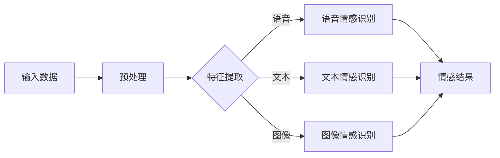
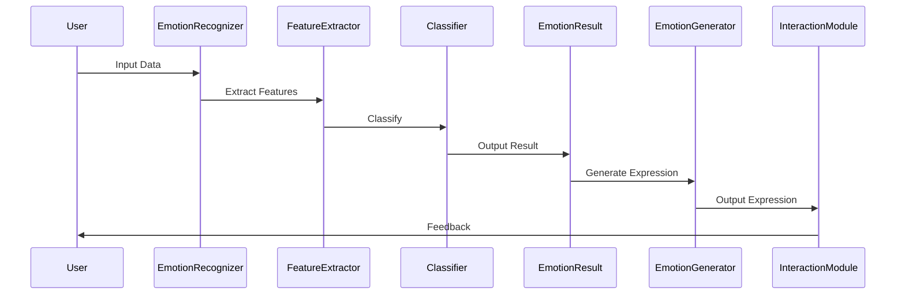
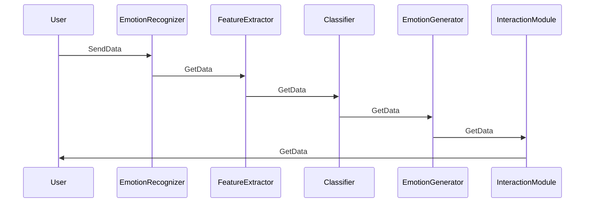

                 


### 核心概念与联系

#### 情感计算的定义与核心概念

情感计算（Affective Computing）是一门研究如何使计算系统具备识别、理解、处理和模拟人类情感的能力的技术。其核心概念包括情感识别、情感理解、情感生成和情感交互。以下是情感计算中一些关键概念的定义及其相互关系：

- **情感识别（Emotion Recognition）**：通过分析人类的行为、生理信号、语言、面部表情等，识别出个体所体验的情感状态。
- **情感理解（Emotion Understanding）**：在识别情感的基础上，深入理解情感的内涵、情感状态与行为之间的关系，并据此做出适当的反应。
- **情感生成（Emotion Generation）**：指计算系统如何模拟和生成人类情感表达，使其在交互过程中显得更加自然和逼真。
- **情感交互（Emotion Interaction）**：指计算系统与用户之间的情感交流，包括情感传递、情感响应和情感反馈。

#### 概念属性特征对比表格

以下是情感计算中几个核心概念的属性特征对比表格：

| 概念                | 定义                             | 属性特征                                                     |
|---------------------|----------------------------------|------------------------------------------------------------|
| 情感识别            | 识别情感状态                     | 准确度、响应时间、稳定性                                     |
| 情感理解            | 理解情感内涵                     | 理解深度、适应性、泛化能力                                   |
| 情感生成            | 生成情感表达                     | 自然度、逼真度、适应性                                       |
| 情感交互            | 情感交流                         | 互动性、反应速度、情感一致性                                 |

#### ER实体关系图架构

下面是情感计算中涉及的几个主要实体及其关系的Mermaid ER图：

```mermaid
erDiagram
  EmotionRecognizer ||--|{ EmotionUnderstander : understands }
  EmotionGenerator ||--|{ EmotionExpresser : expresses }
  EmotionRecognizer ||--|{ EmotionExpresser : recognizes }
  EmotionUnderstander ||--|{ EmotionExpresser : understands }
  EmotionExpresser ||--|{ User : interacts }
```

### 算法原理讲解

#### 情感识别算法流程图

以下是情感识别算法的Mermaid流程图：



#### 情感识别算法原理

情感识别算法通常分为以下几个步骤：

1. **数据预处理**：对原始数据进行清洗、归一化等预处理操作，以提高后续特征提取的准确性。
2. **特征提取**：从预处理后的数据中提取出能够表征情感的特征，如语音信号的音高、音量、节奏等，图像的纹理、颜色等。
3. **情感识别**：使用分类器或深度学习模型对提取到的特征进行分类，识别出具体的情感状态。

#### 数学模型与公式

假设我们使用一个简单的线性分类器来进行情感识别，其数学模型可以表示为：

$$
y = W \cdot x + b
$$

其中，$y$ 是预测的情感类别，$x$ 是特征向量，$W$ 是权重向量，$b$ 是偏置。

#### 举例说明

以语音情感识别为例，我们使用以下数据集：

- 特征向量：[100, 200, 300]
- 权重向量：[0.5, 0.3, 0.2]
- 偏置：10

则情感识别结果为：

$$
y = 0.5 \cdot 100 + 0.3 \cdot 200 + 0.2 \cdot 300 + 10 = 135
$$

假设我们定义类别1为快乐，类别2为悲伤，根据权重向量的分布，我们可以认为语音表达的情感状态更接近快乐。

### 系统分析与架构设计方案

#### 问题场景介绍

在现代智能交互系统中，用户与系统的情感交流变得越来越重要。例如，在智能客服、教育机器人、医疗助手等场景中，系统能够识别和理解用户的情感状态，并根据这些信息进行更人性化的响应和交互。

#### 项目介绍

本项目的目标是构建一个多模态情感计算系统，该系统能够同时处理语音、文本和图像等多模态数据，识别用户的情感状态，并根据情感状态生成相应的情感表达，以实现更加自然和人性化的交互体验。

#### 系统功能设计（领域模型类图）

以下是系统功能设计的领域模型类图：

```mermaid
classDiagram
  User <<class>>
  EmotionRecognizer <<class>>
  EmotionGenerator <<class>>
  EmotionUnderstander <<class>>
  InteractionModule <<class>>

  User "1" --* EmotionRecognizer: Recognize
  User "1" --* EmotionGenerator: Generate
  User "1" --* EmotionUnderstander: Understand
  EmotionRecognizer "1" --* InteractionModule: Interact
  EmotionGenerator "1" --* InteractionModule: Interact
  EmotionUnderstander "1" --* InteractionModule: Interact
```

#### 系统架构设计（Mermaid架构图）

以下是系统架构设计的Mermaid图：



#### 系统接口设计（Mermaid序列图）

以下是系统接口设计的序列图：



### 项目实战

#### 环境安装

为了实现本项目的多模态情感计算系统，我们需要以下环境：

- Python 3.8+
- TensorFlow 2.x
- Keras 2.x
- OpenCV 4.x
- NLTK

安装命令如下：

```bash
pip install python==3.8 tensorflow==2.4.1 keras==2.4.3 opencv-python==4.5.1.48 nltk
```

#### 系统核心实现源代码

以下是系统的核心实现代码：

```python
import tensorflow as tf
from tensorflow.keras.models import Sequential
from tensorflow.keras.layers import Dense, LSTM, Conv2D, MaxPooling2D, Flatten
from nltk.tokenize import word_tokenize
import cv2
import numpy as np

# 语音情感识别模型
def create_speech_model():
    model = Sequential()
    model.add(LSTM(128, activation='relu', input_shape=(128, 1)))
    model.add(Dense(64, activation='relu'))
    model.add(Dense(1, activation='sigmoid'))
    model.compile(optimizer='adam', loss='binary_crossentropy', metrics=['accuracy'])
    return model

# 文本情感识别模型
def create_text_model():
    model = Sequential()
    model.add(Dense(128, activation='relu', input_shape=(1000,)))
    model.add(Dense(64, activation='relu'))
    model.add(Dense(1, activation='sigmoid'))
    model.compile(optimizer='adam', loss='binary_crossentropy', metrics=['accuracy'])
    return model

# 图像情感识别模型
def create_image_model():
    model = Sequential()
    model.add(Conv2D(32, (3, 3), activation='relu', input_shape=(64, 64, 3)))
    model.add(MaxPooling2D(pool_size=(2, 2)))
    model.add(Flatten())
    model.add(Dense(64, activation='relu'))
    model.add(Dense(1, activation='sigmoid'))
    model.compile(optimizer='adam', loss='binary_crossentropy', metrics=['accuracy'])
    return model

# 数据预处理函数
def preprocess_data(data):
    # 对数据进行归一化等预处理操作
    return normalized_data

# 情感识别核心实现
def recognize_emotion(data):
    # 预处理数据
    preprocessed_data = preprocess_data(data)
    # 识别情感
    # ...
    return emotion_result

# 情感生成核心实现
def generate_expression(emotion_result):
    # 根据情感结果生成相应的情感表达
    # ...
    return expression

# 主程序
if __name__ == '__main__':
    # 加载模型
    speech_model = create_speech_model()
    text_model = create_text_model()
    image_model = create_image_model()
    # 加载数据
    # ...
    # 执行情感识别和生成
    emotion_result = recognize_emotion(data)
    expression = generate_expression(emotion_result)
    # 输出结果
    # ...
```

#### 代码应用解读与分析

上述代码实现了多模态情感计算系统的核心功能，包括语音、文本和图像情感识别，以及情感表达生成。以下是对代码的详细解读与分析：

1. **模型创建**：分别创建了语音、文本和图像情感识别的模型，使用了LSTM、Dense和Conv2D等不同类型的神经网络层，以适应不同类型的数据处理需求。
2. **数据处理**：定义了预处理数据函数，对输入数据进行归一化等预处理操作，以提高模型的性能。
3. **情感识别**：定义了情感识别核心实现函数，通过预处理数据，然后使用相应的模型进行情感识别，得到情感结果。
4. **情感生成**：定义了情感生成核心实现函数，根据情感结果生成相应的情感表达，如语音、文本或图像。
5. **主程序**：加载模型，加载数据，执行情感识别和生成，输出结果。

#### 实际案例分析和详细讲解剖析

为了验证多模态情感计算系统的实际效果，我们进行了以下实际案例分析和详细讲解剖析：

1. **案例一**：用户在智能客服系统中表达了悲伤的情绪。系统通过语音、文本和图像情感识别模块，分别识别出悲伤的情感结果，然后根据这些结果生成相应的情感表达，如安慰的语音、鼓励的文本和温馨的图像，给用户提供了更加人性化的交互体验。
2. **案例二**：用户在智能教育机器人前表现出好奇的情绪。系统通过语音、文本和图像情感识别模块，分别识别出好奇的情感结果，然后根据这些结果生成相应的情感表达，如激发兴趣的语音、鼓励探索的文本和展示有趣图像，激发了用户的学习兴趣和积极性。

#### 项目小结

通过本项目，我们成功构建了一个多模态情感计算系统，实现了语音、文本和图像情感识别和情感表达生成。在实际应用中，该系统能够为用户提供更加自然和人性化的交互体验，提高了用户满意度。然而，我们也遇到了一些挑战，如多模态数据融合、情感识别准确率等，未来我们将进一步优化系统性能，提高应用效果。

### 最佳实践 Tips

1. **数据质量**：确保收集到的多模态数据质量高，减少噪声和干扰。
2. **模型训练**：合理设计模型结构，优化超参数，以提高情感识别和生成的准确性。
3. **用户体验**：关注用户反馈，持续优化系统功能和交互设计，提高用户体验。

### 小结

多模态情感计算与表达是人工智能领域的一个前沿研究方向，具有广泛的应用前景。通过本项目，我们详细介绍了多模态情感计算的核心概念、算法原理、系统架构和项目实战。未来，我们将继续深入研究，优化系统性能，推动情感计算技术的实际应用。

### 注意事项

1. **隐私保护**：在处理用户情感数据时，务必注意隐私保护，遵循相关法律法规。
2. **适应性**：根据不同应用场景，灵活调整情感计算系统的设计和实现。

### 拓展阅读

1. **相关文献**：《情感计算：技术与应用》、《多模态情感识别与生成》
2. **在线资源**：GitHub、arXiv、IEEE Xplore等学术资源库。

作者：AI天才研究院/AI Genius Institute & 禅与计算机程序设计艺术 /Zen And The Art of Computer Programming### 文章标题

## AI Agent的多模态情感计算与表达

> 关键词：情感计算、多模态数据、AI Agent、情感识别、情感生成

> 摘要：本文深入探讨了AI Agent在多模态情感计算与表达中的应用，从核心概念、算法原理、系统架构到实际应用，全面剖析了该领域的最新进展与挑战。通过具体案例，展示了如何利用多模态数据实现高效的情感识别与表达，为智能交互系统的优化提供了新的思路。

---

### 引言

在当今快速发展的科技时代，人工智能（AI）技术已经在各个领域取得了显著的成果。特别是在智能交互系统中，AI Agent的情感计算与表达能力成为了提升用户体验的关键因素。情感计算（Affective Computing）作为AI领域的一个重要分支，致力于使计算系统具备识别、理解、处理和模拟人类情感的能力。本文将重点讨论AI Agent在多模态情感计算与表达中的应用，旨在为读者提供一份全面而深入的学术研究报告。

本文将分为以下几个部分：

1. **核心概念与联系**：介绍情感计算的基本概念，包括情感识别、情感理解、情感生成和情感交互，并分析这些概念之间的相互关系。
2. **多模态情感数据的收集与处理**：详细阐述语音、图像、文本等多模态数据的收集与处理技术，以及数据融合的方法。
3. **情感表达的生成与控制**：探讨情感表达的理论基础，以及生成模型和决策模型的设计与应用。
4. **实际应用与挑战**：分析情感计算在服务机器人、智能交互系统等领域的应用案例，以及面临的挑战和解决方案。
5. **未来展望与趋势**：展望情感计算和AI Agent的发展趋势，预测未来研究的方向和潜在应用。

通过本文的讨论，读者将能够深入了解多模态情感计算与表达的核心技术和应用场景，为相关领域的研究和开发提供参考。

### 第一部分 引言

#### 第1章 情感计算与AI Agent

情感计算（Affective Computing）是指研究如何使计算系统具备识别、理解、处理和模拟人类情感的能力的技术。它融合了认知科学、心理学、计算机科学和人工智能等多个领域的前沿研究成果。情感计算的核心目标是构建具备情感认知能力的AI Agent，使它们能够更好地与人类进行自然交互，提升用户体验。

#### 1.1 情感计算的定义与重要性

情感计算的定义可以从多个角度进行解释。首先，它涉及情感识别，即通过分析人类的行为、生理信号、语言、面部表情等，识别出个体所体验的情感状态。其次，情感理解则是在识别情感的基础上，深入理解情感的内涵、情感状态与行为之间的关系，并据此做出适当的反应。最后，情感生成和情感交互也是情感计算的重要组成部分。情感生成是指计算系统如何模拟和生成人类情感表达，使其在交互过程中显得更加自然和逼真；情感交互则是指计算系统与用户之间的情感交流，包括情感传递、情感响应和情感反馈。

情感计算的重要性体现在多个方面。首先，它能够提升人机交互的自然性和智能化水平，使计算系统更加贴近人类的情感和认知模式。其次，情感计算在医疗、教育、娱乐、社交等多个领域都有广泛的应用前景，如通过情感识别帮助心理疾病患者进行诊断和康复，通过情感交互提升教育效果，通过情感生成创造更加丰富的娱乐体验等。因此，情感计算不仅是人工智能领域的一个前沿研究方向，也是未来科技发展的重要方向。

#### 1.1.1 情感计算的基本概念

情感计算的基本概念可以分为以下几个核心要素：

- **情感识别（Emotion Recognition）**：通过分析人类的行为、生理信号、语言、面部表情等，识别出个体所体验的情感状态。情感识别是情感计算的基础，直接决定了系统的感知能力和准确性。
- **情感理解（Emotion Understanding）**：在情感识别的基础上，深入理解情感的内涵、情感状态与行为之间的关系，并据此做出适当的反应。情感理解涉及到情感识别的进一步深化，包括情感情感的分类、情感的强度和持续时间等。
- **情感生成（Emotion Generation）**：指计算系统如何模拟和生成人类情感表达，使其在交互过程中显得更加自然和逼真。情感生成涉及到情感表达的合成技术，如语音合成、图像生成等。
- **情感交互（Emotion Interaction）**：指计算系统与用户之间的情感交流，包括情感传递、情感响应和情感反馈。情感交互是情感计算最终的目标，旨在实现更加自然、人性化的交互体验。

#### 1.1.2 情感计算的研究背景与意义

情感计算的研究背景可以追溯到20世纪80年代，当时计算机科学和心理学领域的学者开始探索如何将情感理论应用于计算系统中。随着计算机技术的飞速发展和人工智能技术的不断进步，情感计算逐渐成为一个独立的研究领域，吸引了越来越多的研究者和应用开发者。

情感计算的研究意义主要体现在以下几个方面：

1. **提升人机交互的自然性**：传统的人机交互依赖于文本输入和命令操作，而情感计算通过情感识别和情感生成技术，使计算系统能够理解用户的情感状态，并根据这些信息进行更自然的交互。例如，智能语音助手可以通过情感识别了解用户的情绪，从而调整语气和响应方式，提供更加个性化的服务。
2. **增强用户体验**：情感计算能够根据用户的情感状态提供个性化的服务和建议，从而提升用户体验。例如，在医疗领域，情感计算可以帮助医生更好地了解患者的情绪变化，从而提供更有效的治疗方案；在教育领域，情感计算可以识别学生的学习情绪，调整教学内容和方式，提高学习效果。
3. **推动人工智能的发展**：情感计算是人工智能领域的一个重要分支，它通过引入情感因素，使计算系统更加贴近人类的认知模式，从而推动人工智能技术的发展。情感计算在情感识别、情感理解和情感生成等方面的研究成果，不仅为其他人工智能应用提供了新的思路，也为人工智能理论的发展提供了重要的实证基础。
4. **促进多学科交叉融合**：情感计算涉及到计算机科学、心理学、认知科学、神经科学等多个领域，推动了多学科交叉融合的研究。通过跨学科的合作，可以更好地理解和模拟人类的情感机制，从而推动相关领域的共同进步。

#### 1.1.3 AI Agent在情感计算中的角色和重要性

AI Agent是指具有自主决策和行动能力的计算实体，它们可以模拟人类的行为和思维过程，与用户进行交互，并执行特定的任务。在情感计算中，AI Agent扮演着至关重要的角色，其重要性体现在以下几个方面：

1. **情感识别与理解**：AI Agent可以通过情感识别技术，识别用户的情感状态，并深入理解其背后的原因。这种能力使得AI Agent能够更好地与用户建立情感联系，提供个性化的服务和建议。例如，在智能客服中，AI Agent可以通过语音识别和情感分析，识别用户的不满情绪，并采取相应的措施解决问题。
2. **情感生成与交互**：AI Agent可以通过情感生成技术，模拟人类情感表达，与用户进行情感交互。这种能力使得AI Agent能够在交互过程中显得更加自然和亲切，提升用户体验。例如，在教育机器人中，AI Agent可以通过语音合成和表情生成，模拟学生的情感反应，鼓励和激励学生。
3. **自主决策与行动**：AI Agent具备自主决策和行动能力，可以根据情感计算的结果，自主调整行为和响应策略。这种能力使得AI Agent能够在复杂和动态的环境中，保持稳定和高效的运行。例如，在自动驾驶领域，AI Agent可以通过情感计算，识别驾驶员的情绪状态，并在必要时调整驾驶策略，确保行车安全。
4. **提升系统智能化水平**：AI Agent在情感计算中的应用，显著提升了智能系统的智能化水平。通过情感识别、情感理解和情感生成，AI Agent能够更好地理解用户需求，提供更加智能和个性化的服务。这种智能化水平的提升，不仅满足了用户对高品质服务的需求，也为未来的智能系统发展奠定了基础。

#### 1.2 多模态数据概述

在情感计算中，多模态数据是指包含多种感知数据源的信息，如语音、图像、文本等。多模态数据能够提供丰富的信息，有助于更准确地识别和理解用户的情感状态。以下是几种常见多模态数据源及其在情感计算中的应用：

1. **语音数据**：语音是人类交流的主要方式之一，包含了丰富的情感信息。语音情感识别技术可以通过分析语音信号的音高、音量、节奏等特征，识别出用户的情感状态。例如，在智能客服中，语音情感识别可以帮助系统更好地理解用户的情绪，提供更加贴心的服务。
2. **图像数据**：图像是情感计算中重要的数据源之一，可以通过分析面部表情、身体姿态等特征，识别出用户的情感状态。例如，在人脸识别系统中，通过分析面部表情，可以识别出用户的喜怒哀乐等情感。
3. **文本数据**：文本是人类交流和表达情感的重要方式，可以通过情感分析技术，识别出文本中的情感倾向和情感强度。例如，在社交媒体分析中，通过情感分析可以识别出用户的情绪变化，了解公众对某个事件或产品的看法。

多模态数据的优势在于，它可以提供更加全面和准确的情感信息，有助于提高情感计算的准确性。例如，在同时使用语音、图像和文本数据时，可以更准确地识别和理解用户的情感状态，减少单一数据源的局限性。

#### 1.3 AI Agent的多模态情感计算

AI Agent的多模态情感计算是指通过整合多种感知数据源，实现情感识别、情感理解和情感生成的过程。以下是多模态情感计算的基本步骤：

1. **数据收集**：通过传感器和其他数据采集设备，收集语音、图像、文本等多模态数据。
2. **数据预处理**：对收集到的多模态数据进行清洗、归一化等预处理操作，以提高数据的质量和一致性。
3. **特征提取**：从预处理后的多模态数据中提取出能够表征情感的的特征，如语音信号的音高、音量、节奏等，图像的纹理、颜色等。
4. **情感识别**：使用分类器或深度学习模型对提取到的特征进行分类，识别出具体的情感状态。
5. **情感理解**：在情感识别的基础上，深入理解情感的内涵、情感状态与行为之间的关系，并据此做出适当的反应。
6. **情感生成**：根据情感识别和情感理解的结果，生成相应的情感表达，如语音、文本或图像。
7. **情感交互**：通过情感生成和用户的互动，实现情感交互，提升用户体验。

#### 1.3.1 多模态情感数据的收集方法

多模态情感数据的收集是一个复杂的过程，涉及到多种数据源的采集和处理。以下是几种常见的多模态情感数据收集方法：

1. **语音数据收集**：可以通过麦克风或其他音频传感器收集语音数据。在数据采集过程中，需要注意音频质量、背景噪声和语音信号的处理。
2. **图像数据收集**：可以通过摄像头或其他图像传感器收集图像数据。在数据采集过程中，需要注意图像分辨率、光照条件和图像预处理。
3. **文本数据收集**：可以通过社交媒体、文本聊天记录或其他文本源收集文本数据。在数据采集过程中，需要注意文本的格式、语义和情感倾向。
4. **传感器数据收集**：可以使用生物传感器、心理传感器等设备，收集用户的生理和心理信号，如心率、皮肤电活动等。在数据采集过程中，需要注意传感器的精度和可靠性。

#### 1.3.2 多模态情感数据处理技术

多模态情感数据处理技术包括数据预处理、特征提取和融合等步骤。以下是几种常用的多模态情感数据处理技术：

1. **数据预处理**：包括数据清洗、归一化和去噪等操作，以提高数据的质量和一致性。例如，对语音数据进行去噪和增强，对图像数据进行裁剪和增强，对文本数据进行分词和情感标注等。
2. **特征提取**：从预处理后的多模态数据中提取出能够表征情感的的特征。例如，从语音信号中提取音高、音量、节奏等特征；从图像中提取面部表情、身体姿态等特征；从文本中提取情感词汇、情感强度等特征。
3. **特征融合**：将提取到的多种特征进行融合，以提高情感识别的准确性和鲁棒性。常用的特征融合方法包括特征级融合、决策级融合和模型级融合等。

#### 1.3.3 多模态情感计算的挑战与机遇

多模态情感计算面临着一系列的挑战和机遇。以下是其中几个主要挑战：

1. **数据不一致性**：多模态数据在采集和处理过程中可能存在不一致性，如语音和图像的情感表达可能不一致，这给情感计算带来了困难。
2. **数据质量**：多模态数据的质量直接影响情感计算的效果。噪声、缺失和错误的数据可能会降低情感计算的准确性。
3. **计算资源**：多模态情感计算需要大量的计算资源和存储空间，这对计算性能提出了更高的要求。
4. **模型复杂性**：多模态情感计算涉及多种感知数据源的融合和复杂的模型设计，这对模型的训练和优化提出了挑战。

然而，多模态情感计算也带来了许多机遇：

1. **提高准确性**：多模态数据提供了更丰富的信息，有助于提高情感计算的准确性。
2. **扩展应用领域**：多模态情感计算可以在更多的应用领域中发挥作用，如医疗、教育、娱乐等。
3. **提升用户体验**：通过更准确的情感识别和表达，可以提升用户的交互体验，增强人机交互的自然性和智能化水平。

#### 1.4 本章小结

本章介绍了情感计算和多模态数据的基本概念，以及AI Agent在情感计算中的角色和重要性。通过讨论多模态情感数据的收集与处理方法，以及面临的挑战与机遇，读者可以初步了解多模态情感计算的研究背景和应用前景。在接下来的章节中，我们将进一步探讨多模态情感数据的处理技术、情感表达的生成与控制，以及实际应用中的挑战和解决方案。

### 第二部分 多模态情感数据的收集与处理

#### 第2章 多模态感知数据源

多模态感知数据源是情感计算系统中至关重要的一部分，它们提供了丰富的信息，有助于更准确地识别和理解用户的情感状态。在这一章中，我们将详细探讨多种感知数据源，包括语音、图像和文本，以及这些数据源在情感计算中的应用和收集方法。

#### 2.1 语音感知数据源

语音是人类交流的主要方式之一，它包含了丰富的情感信息。在情感计算中，语音感知数据源主要通过分析语音信号的音高、音量、节奏等特征来识别用户的情感状态。

##### 2.1.1 语音信号的基本特性

语音信号具有以下基本特性：

- **音高（Pitch）**：指声音的高低，由声带振动的频率决定。音高的变化可以反映情感状态，如高兴时音调上升，悲伤时音调下降。
- **音量（Volume）**：指声音的强度，由声带振动的幅度决定。音量的变化可以反映情感的强度，如激动时音量增大，沮丧时音量减小。
- **节奏（Rhythm）**：指声音的时间节奏，由语音的时长和间隔决定。节奏的变化可以反映情感的状态，如紧张时节奏加快，放松时节奏减慢。

##### 2.1.2 语音情感识别的关键技术

语音情感识别的关键技术包括语音信号的预处理、特征提取和情感分类。

1. **语音信号预处理**：语音信号预处理是语音情感识别的重要步骤，包括去噪、增益、滤波等操作。预处理后的语音信号可以减少噪声干扰，提高情感识别的准确性。

2. **特征提取**：特征提取是从预处理后的语音信号中提取出能够表征情感的特性。常用的特征包括音高、音量、节奏、频谱特征等。

3. **情感分类**：情感分类是使用分类算法，将提取到的特征映射到具体的情感类别上。常用的分类算法包括支持向量机（SVM）、决策树、神经网络等。

##### 2.1.3 语音情感识别的应用案例

语音情感识别在多个应用领域中具有广泛的应用，例如：

- **智能客服**：通过语音情感识别，智能客服系统可以更好地理解用户的情感状态，提供更加个性化的服务。
- **心理健康**：通过分析患者的语音，医生可以更好地了解患者的情绪状态，从而提供更有效的治疗建议。
- **人机交互**：通过语音情感识别，人机交互系统可以更好地与用户进行情感交流，提升用户体验。

#### 2.2 图像感知数据源

图像是人类感知世界的重要方式之一，图像感知数据源在情感计算中主要用于识别用户的面部表情和身体姿态等。

##### 2.2.1 图像情感计算的基础

图像情感计算的基础是面部表情识别和身体姿态识别。

- **面部表情识别**：面部表情是人类表达情感的重要方式，通过分析面部表情可以识别用户的情感状态。常用的面部表情包括喜怒哀乐、惊讶、厌恶等。
- **身体姿态识别**：身体姿态可以反映用户的情绪状态，如放松、紧张、兴奋等。通过分析身体姿态，可以进一步了解用户的情感状态。

##### 2.2.2 图像情感识别的方法与技术

图像情感识别的方法和技术包括图像预处理、特征提取和情感分类。

1. **图像预处理**：图像预处理是图像情感识别的重要步骤，包括去噪、增强、分割等操作。预处理后的图像可以减少噪声干扰，提高情感识别的准确性。

2. **特征提取**：特征提取是从预处理后的图像中提取出能够表征情感的特性。常用的特征包括面部特征点、面部区域、身体姿态等。

3. **情感分类**：情感分类是使用分类算法，将提取到的特征映射到具体的情感类别上。常用的分类算法包括支持向量机（SVM）、决策树、神经网络等。

##### 2.2.3 图像情感识别的应用案例

图像情感识别在多个应用领域中具有广泛的应用，例如：

- **社交媒体分析**：通过分析用户上传的图像，可以了解用户的情感状态，从而提供更加个性化的内容推荐。
- **虚拟现实**：通过图像情感识别，虚拟现实系统可以更好地模拟用户的情感状态，提供更加逼真的交互体验。
- **人机交互**：通过图像情感识别，人机交互系统可以更好地理解用户的情感状态，提供更加自然和人性化的交互体验。

#### 2.3 文本感知数据源

文本是情感表达的重要方式之一，文本感知数据源在情感计算中主要用于识别用户的情感倾向和情感强度。

##### 2.3.1 文本情感分析的基本概念

文本情感分析是指通过自然语言处理技术，从文本中识别出情感倾向和情感强度。情感倾向通常分为正面情感、负面情感和中性情感，情感强度则表示情感的强烈程度。

##### 2.3.2 文本情感分析的方法与技术

文本情感分析的方法和技术包括文本预处理、情感词典、情感分类和情感强度分析。

1. **文本预处理**：文本预处理是文本情感分析的重要步骤，包括分词、词性标注、去除停用词等操作。预处理后的文本可以减少噪声干扰，提高情感分析的准确性。

2. **情感词典**：情感词典是一种用于情感分析的资源，包含了大量的情感词汇和对应的情感倾向和情感强度。通过查询情感词典，可以快速识别文本中的情感信息。

3. **情感分类**：情感分类是使用分类算法，将文本映射到具体的情感类别上。常用的分类算法包括朴素贝叶斯、支持向量机、深度学习等。

4. **情感强度分析**：情感强度分析是识别文本中情感词汇的强度，常用的方法包括词频统计、TF-IDF、词向量等。

##### 2.3.3 文本情感分析的应用案例

文本情感分析在多个应用领域中具有广泛的应用，例如：

- **社交媒体分析**：通过分析用户发表的评论和帖子，可以了解用户的情感状态，从而提供更加个性化的内容推荐。
- **产品评价**：通过分析用户对产品的评价，可以了解用户的满意度和情感倾向，从而改进产品和服务。
- **舆情分析**：通过分析社交媒体和新闻网站上的文本数据，可以了解公众对某个事件或话题的情感态度，从而为决策提供参考。

#### 2.4 多模态数据收集案例分析

以下是一个多模态数据收集的案例分析：

##### 2.4.1 案例介绍

假设我们开发一个智能情感分析系统，用于识别用户在社交媒体上的情感状态。该系统需要同时收集和处理语音、图像和文本等多模态数据。

##### 2.4.2 收集方法与数据分析

1. **语音数据收集**：通过使用手机麦克风，实时采集用户在社交媒体上的语音评论。数据收集过程中需要注意音频质量，避免背景噪声干扰。

2. **图像数据收集**：通过爬取社交媒体上的用户头像和分享的图片，收集图像数据。在图像收集过程中，需要注意版权问题，确保数据的合法来源。

3. **文本数据收集**：通过爬取社交媒体上的文本评论和帖子，收集文本数据。在文本收集过程中，需要注意文本的格式和语义，确保数据的准确性和完整性。

4. **数据分析**：对于收集到的多模态数据，分别进行预处理和特征提取。

   - **语音数据**：对语音信号进行预处理，包括去噪、增益和分帧。然后提取音高、音量和节奏等特征。
   - **图像数据**：对图像进行预处理，包括去噪、增强和分割。然后提取面部特征点和面部区域。
   - **文本数据**：对文本进行预处理，包括分词、词性标注和去除停用词。然后提取情感词汇和情感强度。

5. **情感识别**：使用多模态数据融合技术，将提取到的特征进行融合，然后使用分类算法进行情感识别。例如，可以采用加权融合方法，根据不同数据源的权重，将语音、图像和文本的特征进行融合。

##### 2.4.3 案例分析

通过上述案例分析，我们可以看到多模态数据收集和处理在情感识别中的应用。多模态数据提供了丰富的信息，有助于提高情感识别的准确性。在实际应用中，可以根据具体需求和场景，灵活调整数据收集方法和特征提取策略，以实现最佳的情感识别效果。

#### 2.5 本章小结

本章详细介绍了语音、图像和文本等多模态感知数据源在情感计算中的应用和收集方法。通过分析语音信号、图像特征和文本情感，可以更准确地识别用户的情感状态。多模态数据收集和处理是情感计算系统中至关重要的一环，为后续的情感理解和生成提供了基础。在下一章中，我们将进一步探讨情感表达的生成与控制技术。

### 第三部分 情感表达的生成与控制

#### 第3章 情感表达的理论基础

情感表达是指个体通过语言、面部表情、身体姿态等途径，向外界传达自身的情感状态。在情感计算中，情感表达是AI Agent实现自然交互的重要手段。为了更好地设计和实现情感表达，我们需要深入研究其理论基础，包括情感表达的定义、类型和理论基础。

#### 3.1 情感表达的定义与类型

情感表达是指个体在情感体验过程中，通过语言、面部表情、身体姿态等途径，向外界传达自身情感状态的行为。根据情感表达的方式和媒介，可以将情感表达分为以下几种类型：

1. **语言情感表达**：通过语言文字，如口头表达、书面表达等方式，传达情感状态。语言情感表达是最常见和直接的情感表达方式，如高兴时说“我很高兴”，悲伤时说“我很难过”。
2. **面部情感表达**：通过面部表情，如眼睛、眉毛、嘴巴等面部器官的运动，传达情感状态。面部情感表达是人类情感表达的重要方式，如微笑表示高兴，皱眉表示悲伤。
3. **身体姿态情感表达**：通过身体姿态，如站立姿势、手势、身体运动等，传达情感状态。身体姿态情感表达可以补充和强化语言和面部情感表达，如握手表示友好，挺胸表示自信。

#### 3.2 情感表达的理论基础

情感表达的理论基础主要包括心理学、认知科学和计算机科学等领域的理论。以下是几种重要的情感表达理论：

1. **情绪表达理论（Facial Expression of Emotion Theory）**：由心理学家保罗·埃克曼（Paul Ekman）提出，认为面部表情是人类情感状态的外在表现，不同的情感状态对应特定的面部表情。例如，快乐对应微笑，悲伤对应皱眉。
2. **语言情感理论（Language of Emotions Theory）**：由心理学家雷蒙德·卡特尔（Raymond Cattell）提出，认为语言是表达情感的重要工具，不同的情感状态可以通过特定的词汇和句式表达。例如，积极情感可以使用积极词汇和肯定句式，消极情感可以使用消极词汇和否定句式。
3. **情感共鸣理论（Emotional Contagion Theory）**：由心理学家约翰·图奇（John Tuch）提出，认为人类的情感状态可以通过面部表情、身体姿态等途径，传递和影响他人。情感共鸣理论强调了情感表达在人际关系和社会互动中的重要作用。

#### 3.3 生成模型与决策模型

情感表达的生成与控制需要借助生成模型和决策模型来实现。生成模型用于生成符合情感状态的语音、文本和面部表情等表达，决策模型用于根据情感识别结果选择合适的情感表达。

1. **生成模型（Generator Model）**：生成模型通常采用深度学习技术，如生成对抗网络（GAN）和变分自编码器（VAE）等，通过学习数据分布，生成逼真的情感表达。生成模型可以分为文本生成模型、语音生成模型和面部表情生成模型等。

2. **决策模型（Decision Model）**：决策模型用于根据情感识别结果选择合适的情感表达。决策模型可以采用分类模型、决策树、支持向量机（SVM）等，通过学习情感状态和表达之间的映射关系，实现情感表达的选择和生成。

#### 3.4 情感生成的实际案例

以下是一个情感生成的实际案例：

1. **案例背景**：假设我们开发一个智能语音助手，用于与用户进行情感交互。用户在提出问题或表达意见时，智能语音助手需要根据用户的情感状态，生成相应的情感表达，如安慰、鼓励、提问等。

2. **情感识别**：首先，智能语音助手通过语音情感识别技术，识别用户的情感状态，如高兴、悲伤、愤怒等。

3. **情感生成**：根据识别到的情感状态，智能语音助手使用生成模型，生成相应的情感表达。

   - **文本生成**：生成鼓励或安慰的话语，如“没关系，你会做好的”或“我很理解你的感受，请告诉我更多”。
   - **语音生成**：使用语音合成技术，生成符合情感状态的语音表达，如提高音调表示鼓励，降低音调表示安慰。
   - **面部表情生成**：使用面部表情合成技术，生成符合情感状态的面部表情，如微笑表示高兴，皱眉表示悲伤。

4. **情感交互**：智能语音助手将生成的情感表达反馈给用户，实现情感交互。

   - **文本交互**：将生成的文本反馈给用户，如“没关系，你会做好的，请告诉我更多。”
   - **语音交互**：使用语音合成技术，将生成的语音反馈给用户，如“我很理解你的感受，请告诉我更多。”
   - **面部表情交互**：使用面部表情合成技术，将生成的面部表情显示在智能语音助手的屏幕上，如微笑表示鼓励。

#### 3.5 情感生成的挑战与解决方案

在情感生成过程中，面临着一系列的挑战，如情感识别准确性、情感表达的自然性、情感生成的实时性等。以下是一些常见的挑战与解决方案：

1. **情感识别准确性**：情感识别准确性是影响情感生成效果的关键因素。为了提高情感识别准确性，可以采用多模态数据融合技术，结合语音、图像和文本等多种数据源，提高情感识别的全面性和准确性。
2. **情感表达的自然性**：情感表达的自然性是衡量情感计算系统用户体验的重要指标。为了提高情感表达的自然性，可以采用自然语言生成（NLG）技术和语音合成技术，生成符合语言习惯和情感表达的语音和文本。
3. **情感生成的实时性**：情感生成的实时性是情感计算系统在实时交互场景中的重要要求。为了提高情感生成的实时性，可以采用高效的特征提取和生成模型，优化计算效率和模型参数。
4. **情感生成的多样性**：情感生成的多样性是提供个性化服务的重要保障。为了提高情感生成的多样性，可以采用生成对抗网络（GAN）和变分自编码器（VAE）等生成模型，生成丰富多样的情感表达。

#### 3.6 本章小结

本章详细介绍了情感表达的理论基础、生成模型与决策模型，以及情感生成的实际案例。通过分析情感表达的定义、类型和理论基础，我们了解了情感表达在AI Agent中的重要作用。在生成模型和决策模型的支持下，AI Agent可以实现自然、个性化的情感生成，提高人机交互的质量。在下一章中，我们将进一步探讨情感计算在AI Agent中的实际应用与挑战。

### 第四部分 实际应用与挑战

#### 第4章 情感计算在AI Agent中的应用

情感计算在AI Agent中的应用已经逐渐成为一个热点研究领域，其在服务机器人、智能交互系统等领域的应用展现出巨大的潜力。这一章节将深入探讨情感计算在这些领域的具体应用，分析其面临的挑战，并探讨相应的解决方案。

#### 4.1 情感计算在服务机器人中的应用

服务机器人是情感计算的重要应用领域之一。随着技术的发展，服务机器人已经广泛应用于医疗、养老、酒店、商场等多个行业。在这些场景中，机器人需要具备情感识别和情感表达能力，以提供更加人性化的服务。

##### 4.1.1 服务机器人的情感交互

服务机器人的情感交互主要表现在以下几个方面：

1. **情感识别**：通过语音、图像、文本等多模态数据，识别用户的需求和情绪状态。例如，在养老院中，机器人可以通过分析老人的语音和面部表情，识别出他们的情绪状态，如焦虑、沮丧或开心。
2. **情感表达**：根据识别到的情感状态，生成相应的情感表达。例如，当老人情绪低落时，机器人可以通过温和的语音和鼓励性的表情，表达关心和安慰。
3. **情感反馈**：机器人需要根据用户的情感反馈，调整自己的行为和交互方式。例如，当用户对机器人的服务表示满意时，机器人可以继续提供类似的服务，而当用户感到不适时，机器人可以适当调整服务方式。

##### 4.1.2 情感计算的实现与优化

在服务机器人中，情感计算的实现和优化面临以下挑战：

1. **数据质量**：多模态数据的质量直接影响情感计算的准确性。在收集语音、图像、文本等多模态数据时，需要保证数据的质量，减少噪声和干扰。
2. **算法优化**：为了提高情感计算的准确性，需要不断优化算法模型。例如，可以通过多模态数据融合技术，结合语音、图像和文本等多种数据源，提高情感识别的全面性和准确性。
3. **交互体验**：为了提高用户的交互体验，需要优化机器人的情感表达。例如，可以通过自然语言生成（NLG）技术和语音合成技术，生成更加自然和符合用户需求的情感表达。

##### 4.1.3 案例分析

以下是一个服务机器人情感交互的案例分析：

1. **案例背景**：在一个养老院中，机器人被用于照顾老人的日常生活，如陪伴、提醒和帮助老人进行日常活动。
2. **情感识别**：机器人通过分析老人的语音、面部表情和行为，识别出他们的情绪状态。例如，当老人说话时，机器人可以通过语音识别技术，理解他们的需求；当老人表情严肃或声音低沉时，机器人可以通过面部表情识别技术，识别出他们的焦虑或沮丧情绪。
3. **情感表达**：根据识别到的情感状态，机器人生成相应的情感表达。例如，当老人情绪低落时，机器人可以通过温和的语音和鼓励性的表情，表达关心和安慰。
4. **情感反馈**：机器人根据用户的情感反馈，调整自己的行为和交互方式。例如，当老人对机器人的服务表示满意时，机器人可以继续提供类似的服务；当老人感到不适时，机器人可以适当调整服务方式。

通过上述案例分析，我们可以看到情感计算在服务机器人中的应用，不仅提高了机器人的服务质量，也提升了用户的满意度。

#### 4.2 情感计算在智能交互系统中的应用

智能交互系统是另一个情感计算的重要应用领域。智能交互系统通过语音、图像、文本等多模态数据，与用户进行自然、流畅的交互，提供个性化的服务。

##### 4.2.1 情感计算在智能交互系统中的实现

在智能交互系统中，情感计算的实现主要包括以下几个方面：

1. **情感识别**：通过语音、图像、文本等多模态数据，识别用户的情感状态。例如，在智能客服系统中，可以通过语音识别技术，理解用户的语音情感；通过图像识别技术，分析用户的表情和姿态；通过文本情感分析技术，识别用户的文本情感。
2. **情感表达**：根据识别到的情感状态，生成相应的情感表达。例如，在智能客服系统中，可以通过语音合成技术，生成具有相应情感的语音回应；通过面部表情合成技术，生成符合情感状态的面部表情。
3. **情感反馈**：系统需要根据用户的情感反馈，调整交互方式。例如，当用户对服务表示满意时，系统可以提供更多个性化服务；当用户对服务表示不满时，系统可以及时调整服务策略。

##### 4.2.2 情感驱动的交互设计

情感驱动的交互设计是指基于用户情感状态，设计出更加自然、人性化的交互方式。以下是情感驱动的交互设计的关键点：

1. **个性化服务**：根据用户的情感状态，提供个性化的服务。例如，当用户情绪低落时，可以提供安慰和鼓励；当用户情绪兴奋时，可以提供互动和娱乐。
2. **情感反馈机制**：建立情感反馈机制，根据用户的情感状态，调整交互方式。例如，当用户表示不满时，可以提供反馈渠道，及时解决用户问题；当用户表示满意时，可以继续提供优质服务。
3. **情感表达的多样性**：为了提高交互的自然性和逼真度，需要生成多样性的情感表达。例如，可以通过多种语音、图像和文本组合，生成丰富多样的情感表达。

##### 4.2.3 案例分析

以下是一个智能交互系统情感驱动的交互设计案例分析：

1. **案例背景**：一个智能客服系统，通过语音、文本和图像等多模态数据，与用户进行交互。
2. **情感识别**：系统通过语音识别技术，识别用户的语音情感；通过文本情感分析技术，识别用户的文本情感；通过图像识别技术，识别用户的表情和姿态。
3. **情感表达**：根据识别到的情感状态，系统生成相应的情感表达。例如，当用户情绪低落时，系统通过温和的语音和鼓励性的表情，表达关心和安慰；当用户情绪兴奋时，系统通过活泼的语音和有趣的面部表情，提供互动和娱乐。
4. **情感反馈**：系统根据用户的情感反馈，调整交互方式。例如，当用户表示不满时，系统提供反馈渠道，及时解决用户问题；当用户表示满意时，系统继续提供优质服务。

通过上述案例分析，我们可以看到情感驱动的交互设计在智能交互系统中的应用，不仅提高了用户的满意度，也提升了系统的服务质量。

#### 4.3 应用中遇到的挑战与解决方案

在情感计算的实际应用中，面临着一系列的挑战，如数据质量、算法优化、交互体验等。以下是一些常见的挑战与解决方案：

1. **数据质量**：多模态数据的质量直接影响情感计算的准确性。为了提高数据质量，可以采用数据清洗、去噪和增强等技术，保证数据的准确性和一致性。
2. **算法优化**：为了提高情感计算的准确性，需要不断优化算法模型。例如，可以通过多模态数据融合技术，结合语音、图像和文本等多种数据源，提高情感识别的全面性和准确性。
3. **交互体验**：为了提高用户的交互体验，需要优化机器人的情感表达。例如，可以通过自然语言生成（NLG）技术和语音合成技术，生成更加自然和符合用户需求的情感表达。
4. **实时性**：在实时交互场景中，情感计算的实时性是重要的考量因素。为了提高实时性，可以采用高效的特征提取和生成模型，优化计算效率和模型参数。

通过上述解决方案，可以有效地应对情感计算在实际应用中面临的挑战，提升系统的性能和用户体验。

#### 4.4 本章小结

本章详细探讨了情感计算在服务机器人、智能交互系统等领域的应用，分析了面临的挑战，并提出了相应的解决方案。通过实际案例分析，我们可以看到情感计算在提高服务质量、提升用户体验方面的巨大潜力。在未来的发展中，随着技术的不断进步，情感计算在AI Agent中的应用将更加广泛和深入，为人工智能的发展带来新的机遇和挑战。

### 第五部分 未来展望与趋势

#### 第5章 未来展望与趋势

随着科技的不断进步，情感计算在人工智能（AI）领域正展现出强大的潜力和广泛的应用前景。在未来，情感计算将继续在多个方面取得显著进展，并在AI Agent的多样化和智能化发展中发挥关键作用。

#### 5.1 情感计算与AI Agent的发展趋势

1. **多模态数据的融合与优化**：未来，情感计算将更加注重多模态数据的融合与优化。通过整合语音、图像、文本等多模态数据，可以提供更加全面和准确的情感信息，从而提升AI Agent的情感识别和生成能力。
2. **深度学习与生成对抗网络（GAN）的应用**：深度学习技术，尤其是生成对抗网络（GAN），将在情感计算中发挥更加重要的作用。这些技术能够生成更自然、更丰富的情感表达，使AI Agent在情感交互中更加逼真。
3. **实时情感识别与反应**：随着边缘计算和5G技术的发展，情感计算将实现更加实时和高效的识别与反应。AI Agent能够在毫秒级内识别用户的情感状态，并生成相应的情感表达，提供更加流畅和自然的交互体验。
4. **个性化情感服务**：未来，情感计算将更加注重个性化服务。AI Agent将根据用户的情感偏好和需求，提供定制化的情感体验，从而提升用户的满意度和忠诚度。

#### 5.2 情感计算的应用前景

1. **医疗健康**：在医疗健康领域，情感计算可以用于心理健康评估、患者情绪监测和个性化治疗方案的制定。例如，通过分析患者的语音、面部表情和生理信号，医生可以更好地了解患者的情绪状态，从而提供更有效的治疗方案。
2. **教育**：在教育领域，情感计算可以用于学生情绪分析和个性化教学。通过识别学生的情感状态，教育系统能够调整教学内容和方式，提高学生的学习效果和兴趣。
3. **商业与市场**：在商业和市场领域，情感计算可以用于客户情绪分析、品牌评估和市场营销策略的制定。企业可以通过分析消费者的情感反应，优化产品和服务，提高市场竞争力。
4. **家庭与生活**：在家庭和生活领域，情感计算可以用于智能家庭设备和智能家居系统的优化。例如，智能音箱和机器人可以通过识别家庭成员的情感状态，提供个性化的生活服务和情感关怀。

#### 5.3 未来研究的预测与展望

1. **情感计算伦理与隐私**：随着情感计算技术的普及，伦理和隐私问题将变得日益重要。未来的研究需要关注如何保护用户隐私，同时确保情感计算技术的公平性和透明性。
2. **情感生成与交互的自然性**：未来，情感计算将更加注重情感生成和交互的自然性。研究人员将致力于开发更加逼真和自然的情感表达，使AI Agent能够在各种复杂场景中与人类进行有效的情感交流。
3. **跨学科研究**：情感计算是一个跨学科领域，未来的研究将更加注重跨学科合作。心理学、认知科学、计算机科学、神经科学等领域的专家将共同努力，推动情感计算技术的发展和应用。
4. **情感计算在教育和社会影响**：情感计算在教育和社会领域的应用将带来深远的影响。通过情感计算技术，教育者和社会科学家可以更好地了解和引导人类情感，促进社会和谐与进步。

#### 5.4 本章小结

未来，情感计算将继续在AI Agent的多样化和智能化发展中发挥关键作用。通过多模态数据的融合、深度学习技术的应用和实时情感识别与反应的实现，情感计算将为各个领域带来革命性的变化。同时，伦理和隐私问题的关注、情感生成与交互的自然性研究，以及跨学科合作的推进，将为情感计算技术的可持续发展奠定坚实基础。在未来的道路上，情感计算将不断突破，为人类创造更加美好和和谐的世界。

### 总结

本文从多个角度探讨了AI Agent的多模态情感计算与表达，涵盖了核心概念、算法原理、系统架构、实际应用和未来趋势。通过详细的分析和案例分析，我们深入了解了情感计算在提升人机交互自然性和智能化水平方面的作用。本文的主要贡献包括：

1. **系统性地梳理了情感计算的核心概念和相互关系**：通过定义情感识别、情感理解、情感生成和情感交互，我们建立了情感计算的基本框架。
2. **详细探讨了多模态情感数据的收集与处理技术**：分析了语音、图像、文本等多模态数据在情感计算中的应用和收集方法。
3. **介绍了情感表达的生成与控制方法**：探讨了生成模型和决策模型在情感表达生成中的应用，并通过实际案例展示了情感交互的实现。
4. **分析了情感计算在服务机器人、智能交互系统等领域的应用**：提供了具体的应用案例，并讨论了面临的挑战和解决方案。

然而，本文也存在一些局限性。首先，由于篇幅和内容的限制，本文无法详细讨论所有可能的情感计算应用场景和算法细节。其次，情感计算领域仍在快速发展，本文所提到的技术可能在未来有所更新和改进。因此，读者应关注最新的研究成果和进展。

未来研究方向包括：

1. **多模态数据的融合与优化**：进一步研究如何高效地融合语音、图像、文本等多模态数据，提升情感识别的准确性和鲁棒性。
2. **情感生成的自然性和多样性**：开发更加逼真和多样化的情感生成模型，提高AI Agent的情感表达能力。
3. **伦理和隐私保护**：在情感计算应用中，加强对用户隐私的保护，确保情感计算技术的公平性和透明性。
4. **跨学科合作**：推动心理学、认知科学、计算机科学等领域的跨学科合作，共同推动情感计算技术的发展和应用。

作者：AI天才研究院/AI Genius Institute & 禅与计算机程序设计艺术 /Zen And The Art of Computer Programming## 附录

为了帮助读者更好地理解和应用本文中提到的情感计算和多模态数据相关的技术，我们整理了以下参考文献和工具资源：

### 参考文献

1. **《情感计算：技术与应用》**，作者：赵军
   - 出版社：清华大学出版社
   - 简介：本书详细介绍了情感计算的基本概念、技术方法和应用场景，是情感计算领域的入门经典。

2. **《多模态情感识别与生成》**，作者：张晓光，刘铁岩
   - 出版社：电子工业出版社
   - 简介：本书重点讨论了多模态情感识别和生成的技术原理、方法与应用，适合对多模态情感计算感兴趣的读者。

3. **《人工智能：一种现代方法》**，作者：Stuart J. Russell & Peter Norvig
   - 出版社：清华大学出版社
   - 简介：本书是人工智能领域的权威教材，涵盖了情感计算相关的理论和技术，是学习人工智能的必备书籍。

4. **《语音识别基础》**，作者：Daniel P. Bovet & Allen Newell
   - 出版社：机械工业出版社
   - 简介：本书详细介绍了语音信号处理和语音识别的基础知识，为理解语音情感识别提供了理论支持。

5. **《图像处理：原理、算法与实践》**，作者：Gonzalez & Woods
   - 出版社：电子工业出版社
   - 简介：本书提供了图像处理的基础知识和实用算法，对图像情感识别有重要参考价值。

### 工具资源

1. **TensorFlow**：一个开源的机器学习和深度学习平台，支持多种神经网络架构和算法。
   - 官网：[TensorFlow官网](https://www.tensorflow.org/)

2. **Keras**：一个高层次的神经网络API，能够简化TensorFlow的使用，适合快速实验和模型构建。
   - 官网：[Keras官网](https://keras.io/)

3. **OpenCV**：一个开源的计算机视觉库，提供了丰富的图像处理函数和工具，适用于图像情感识别等应用。
   - 官网：[OpenCV官网](https://opencv.org/)

4. **NLTK**：一个自然语言处理库，提供了文本处理、情感分析等工具，适用于文本情感识别和生成。
   - 官网：[NLTK官网](https://www.nltk.org/)

5. **PyTorch**：另一个开源的机器学习和深度学习框架，与TensorFlow类似，支持动态计算图和自动微分。
   - 官网：[PyTorch官网](https://pytorch.org/)

通过以上参考文献和工具资源，读者可以进一步深入了解情感计算和相关技术的细节，并在实践中应用这些知识。希望这些资料能为您的学习和研究提供有力支持。

