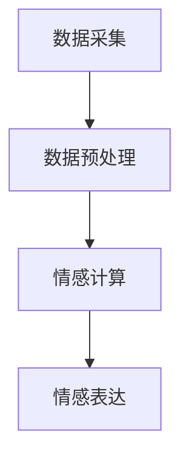
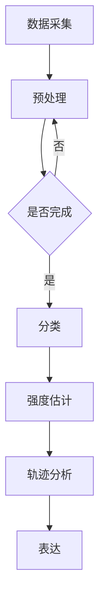
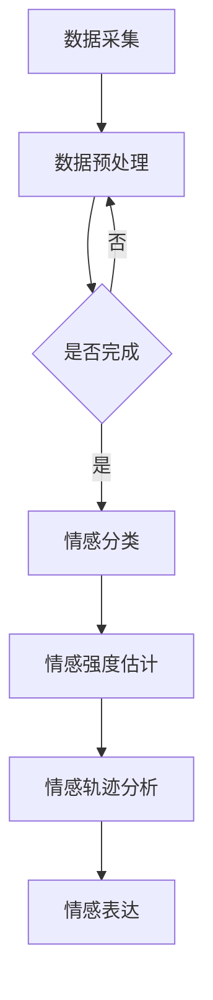
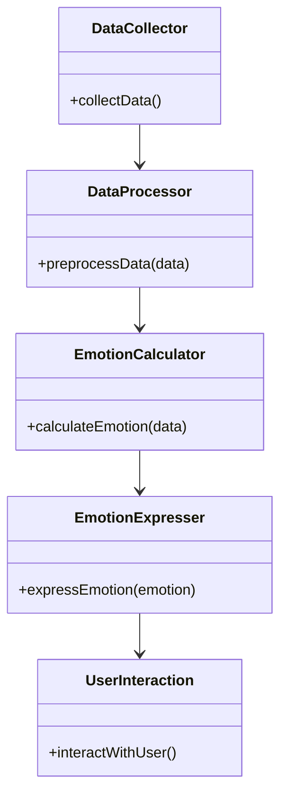
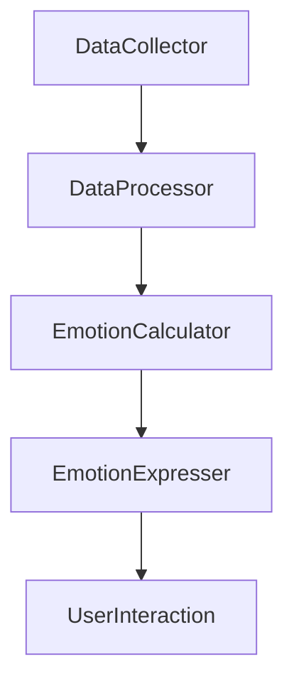
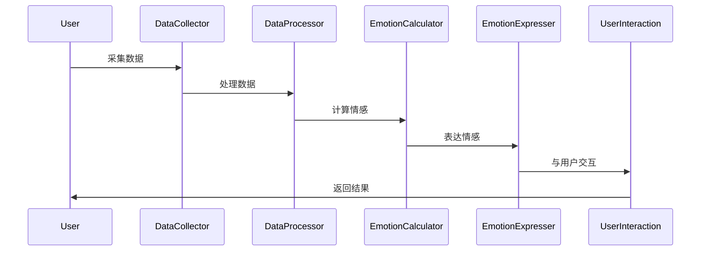

                 


### 文章标题
《AI Agent的多模态情感计算与表达》

### 关键词
AI Agent，多模态情感计算，情感表达，算法原理，系统架构，项目实战

### 摘要
本文深入探讨了AI Agent的多模态情感计算与表达。首先，我们介绍了AI Agent的基础概念及其应用领域，并详细阐述了多模态情感计算的概念、数据采集与处理，以及情感表达的多模态实现。随后，我们讲解了情感计算的核心算法，通过mermaid流程图和Python源代码实现了算法原理的详细阐述。接着，我们描述了系统分析与架构设计方案，并介绍了项目实战的环境安装和系统核心实现。最后，我们提供了最佳实践技巧和项目小结，以及拓展阅读推荐。

----------------------------------------------------------------

## 第一部分: AI Agent概述

### 第1章: AI Agent的基础概念

**1.1 什么是AI Agent**

AI Agent，即人工智能代理，是一种可以感知环境、采取行动并与其他实体交互的智能体。它具备自主决策和自适应能力，能够通过学习与环境互动来优化自身行为。AI Agent的核心特征包括自主性、适应性、协作性和智能性。

**1.2 AI Agent的应用领域**

AI Agent广泛应用于多个领域，包括但不限于：

- **游戏与虚拟现实**：AI Agent可以模拟复杂的人类行为，为游戏和虚拟现实提供智能角色。
- **智能家居**：AI Agent可以通过语音识别和自然语言处理与家庭设备互动，提供个性化服务。
- **机器人**：AI Agent赋予机器人感知与决策能力，使其在复杂环境中自主行动。
- **金融与保险**：AI Agent可以用于风险分析和个性化金融服务。

**1.3 AI Agent的发展历史**

AI Agent的发展历程可以追溯到人工智能的早期研究。从最初的专家系统到现代的深度学习和强化学习，AI Agent的技术逐渐成熟，应用场景也不断扩展。以下是AI Agent发展的重要里程碑：

- **20世纪50年代**：人工智能概念首次被提出。
- **20世纪70年代**：专家系统成为AI Agent研究的热点。
- **20世纪80年代**：智能代理的概念被提出，研究者开始关注AI Agent的自主性和适应性。
- **21世纪**：随着深度学习和大数据技术的发展，AI Agent的应用范围大幅扩展。

### 第2章: 多模态情感计算

**2.1 多模态情感计算的概念**

多模态情感计算是一种利用多种感官模态（如视觉、听觉、触觉等）的数据来识别和计算人类情感的技术。与单一模态情感计算相比，多模态情感计算能够更准确地捕捉和表达情感，从而提高情感识别的精度。

**2.2 多模态数据的采集与处理**

多模态数据的采集涉及多种传感器和设备，如摄像头、麦克风、力传感器等。采集到的数据需要进行预处理，包括降噪、归一化和特征提取，以便于后续的情感计算。

**2.3 情感计算的核心算法**

情感计算的核心算法主要包括情感分类、情感强度估计和情感轨迹分析。这些算法通过分析多模态数据，实现对情感的识别和表达。

#### 2.3.1 情感分类

情感分类是将情感标签分配给给定数据的过程。常用的情感分类方法包括朴素贝叶斯、支持向量机和深度学习等。

#### 2.3.2 情感强度估计

情感强度估计是确定情感强度级别（如快乐、悲伤、愤怒等）的过程。常用的方法包括基于规则的推理、机器学习和深度学习等。

#### 2.3.3 情感轨迹分析

情感轨迹分析是研究情感随时间变化的规律。通过情感轨迹分析，可以更好地理解情感的产生、发展和消失过程。

### 第3章: 情感表达的多模态实现

**3.1 情感表达的原理**

情感表达是指通过不同的感官模态来传达情感信息。情感表达的原理包括情感生成、情感传递和情感感知。

**3.2 文本情感表达的实现**

文本情感表达是通过文字来传达情感信息。常见的实现方法包括情感词典、情感分析和深度学习等。

**3.3 图像和声音的情感表达**

图像和声音的情感表达是通过视觉和听觉模态来传达情感信息。图像情感表达可以通过面部表情、姿态和色彩等特征来实现；声音情感表达可以通过语调、音色和节奏等特征来实现。

----------------------------------------------------------------

## 第4章: AI Agent的情感计算架构

### 4.1 情感计算系统的设计与实现

情感计算系统的设计与实现是构建AI Agent的核心步骤。该系统需要包括数据采集、预处理、情感计算和情感表达等模块。

**4.1.1 数据采集**

数据采集是情感计算系统的第一步。常用的数据采集方法包括：

- **视觉数据**：使用摄像头或深度相机捕获面部表情、姿态等视觉信息。
- **声音数据**：使用麦克风捕捉语音信号，提取声音特征。
- **文本数据**：从文本信息中提取情感词汇和语法结构。

**4.1.2 数据预处理**

数据预处理是确保数据质量和减少噪声的过程。预处理方法包括：

- **降噪**：使用滤波器或神经网络对原始数据进行降噪处理。
- **归一化**：将不同模态的数据进行归一化，以便于后续处理。
- **特征提取**：从预处理后的数据中提取关键特征，如面部特征点、语音频谱和文本词向量。

**4.1.3 情感计算**

情感计算是系统的核心模块，通过分析多模态数据来识别和计算情感。情感计算的方法包括：

- **情感分类**：使用分类算法（如朴素贝叶斯、支持向量机等）对情感进行分类。
- **情感强度估计**：使用回归算法（如线性回归、神经网络等）对情感强度进行估计。
- **情感轨迹分析**：使用时间序列分析方法（如ARIMA、LSTM等）对情感随时间的变化进行分析。

**4.1.4 情感表达**

情感表达是将计算出的情感信息通过不同的感官模态进行传达。情感表达的方法包括：

- **文本表达**：使用自然语言生成技术生成情感表达文本。
- **图像表达**：使用生成对抗网络（GAN）生成情感表达图像。
- **声音表达**：使用语音合成技术生成情感表达声音。

### 4.2 数据流与处理流程

情感计算系统的数据流和处理流程可以概括为以下步骤：

1. **数据采集**：采集视觉、声音和文本数据。
2. **数据预处理**：对采集到的数据执行降噪、归一化和特征提取。
3. **情感计算**：使用分类、强度估计和轨迹分析方法计算情感。
4. **情感表达**：根据计算出的情感信息生成相应的文本、图像和声音表达。

**4.2.1 数据流图**

使用mermaid绘制数据流图，如下所示：



### 4.3 实体关系图与算法流程图

为了更好地理解AI Agent的情感计算架构，我们可以使用实体关系图（ER图）和算法流程图来描述。

**4.3.1 实体关系图**

使用mermaid绘制实体关系图，如下所示：

```mermaid
erDiagram
  Data采集 ||--|{ 情感计算 }|-- Data预处理
  情感计算 ||--|{ 情感表达 }|-- Data预处理
  Data预处理 ||--|{ 情感分类 }|-- 情感计算
  Data预处理 ||--|{ 情感强度估计 }|-- 情感计算
  Data预处理 ||--|{ 情感轨迹分析 }|-- 情感计算
```

**4.3.2 算法流程图**

使用mermaid绘制算法流程图，如下所示：



通过上述实体关系图和算法流程图，我们可以清晰地看到数据流和处理流程，以及各个模块之间的联系。

----------------------------------------------------------------

## 第5章: 多模态情感计算算法

### 5.1 算法介绍

多模态情感计算算法是用于识别和计算人类情感的关键技术。这些算法通过分析多种感官模态的数据，实现对情感的准确捕捉和表达。常见的多模态情感计算算法包括情感分类、情感强度估计和情感轨迹分析。

#### 5.1.1 情感分类

情感分类是将情感标签分配给给定数据的过程。它可以用于识别用户在不同情境下的情感状态。常用的情感分类算法包括朴素贝叶斯、支持向量机和深度学习等。

#### 5.1.2 情感强度估计

情感强度估计是确定情感强度级别（如快乐、悲伤、愤怒等）的过程。它可以帮助我们了解情感的强烈程度。常用的情感强度估计方法包括基于规则的推理、机器学习和深度学习等。

#### 5.1.3 情感轨迹分析

情感轨迹分析是研究情感随时间变化的规律。它可以帮助我们了解情感的产生、发展和消失过程。常用的情感轨迹分析方法包括时间序列分析、马尔可夫模型和深度学习等。

### 5.2 算法流程图

为了更好地理解多模态情感计算算法的工作流程，我们可以使用mermaid绘制算法流程图。以下是算法流程图的示例：



在这个流程图中，数据首先被采集，然后进行预处理。预处理完成后，算法会依次进行情感分类、情感强度估计和情感轨迹分析。最后，根据分析结果，生成情感表达。

### 5.3 Python源代码实现

为了具体展示多模态情感计算算法的实现过程，我们使用Python编写了相应的源代码。以下是一个简单的示例：

```python
import numpy as np
from sklearn.preprocessing import StandardScaler
from sklearn.svm import SVC
from sklearn.metrics import accuracy_score

# 数据采集
def data_collection():
    # 在此实现数据采集逻辑
    pass

# 数据预处理
def data_preprocessing(data):
    # 在此实现数据预处理逻辑
    pass

# 情感分类
def emotion_classification(data):
    # 在此实现情感分类逻辑
    pass

# 情感强度估计
def emotion_intensity_estimation(data):
    # 在此实现情感强度估计逻辑
    pass

# 情感轨迹分析
def emotion_trajectory_analysis(data):
    # 在此实现情感轨迹分析逻辑
    pass

# 情感表达
def emotion_expression(data):
    # 在此实现情感表达逻辑
    pass

# 主函数
def main():
    # 采集数据
    data = data_collection()

    # 预处理数据
    preprocessed_data = data_preprocessing(data)

    # 情感分类
    classification_result = emotion_classification(preprocessed_data)

    # 情感强度估计
    intensity_result = emotion_intensity_estimation(preprocessed_data)

    # 情感轨迹分析
    trajectory_result = emotion_trajectory_analysis(preprocessed_data)

    # 情感表达
    expression_result = emotion_expression(preprocessed_data)

    # 输出结果
    print("情感分类结果：", classification_result)
    print("情感强度估计结果：", intensity_result)
    print("情感轨迹分析结果：", trajectory_result)
    print("情感表达结果：", expression_result)

# 运行主函数
if __name__ == "__main__":
    main()
```

在这个示例中，我们定义了数据采集、数据预处理、情感分类、情感强度估计、情感轨迹分析和情感表达等函数。这些函数分别实现相应的算法步骤，并通过主函数进行整体流程的控制。

### 5.4 数学模型与公式解释

在多模态情感计算中，数学模型和公式起到了关键作用。以下是对常用数学模型和公式的解释：

#### 5.4.1 情感分类的数学模型

情感分类通常使用支持向量机（SVM）等分类算法。SVM的数学模型可以表示为：

$$
\min_{\mathbf{w}} \frac{1}{2} ||\mathbf{w}||^2 + C \sum_{i=1}^{n} \xi_i
$$

其中，$\mathbf{w}$是权重向量，$C$是正则化参数，$\xi_i$是松弛变量。

#### 5.4.2 情感强度估计的数学模型

情感强度估计可以使用线性回归等算法。线性回归的数学模型可以表示为：

$$
\mathbf{y} = \mathbf{X}\mathbf{w} + b
$$

其中，$\mathbf{y}$是目标变量，$\mathbf{X}$是特征矩阵，$\mathbf{w}$是权重向量，$b$是偏置项。

#### 5.4.3 情感轨迹分析的数学模型

情感轨迹分析可以使用时间序列分析等算法。时间序列分析的数学模型可以表示为：

$$
\mathbf{y}_{t+1} = \mathbf{A}\mathbf{y}_t + \epsilon_t
$$

其中，$\mathbf{y}_t$是当前时刻的情感状态，$\mathbf{A}$是转移矩阵，$\epsilon_t$是误差项。

### 5.5 例子分析

为了更好地理解多模态情感计算算法的原理和应用，我们可以通过一个具体例子来进行分析。

#### 例子：情感分类

假设我们有一个包含正面情感和负面情感的数据集，数据集的标签为正面（1）和负面（-1）。使用支持向量机（SVM）进行情感分类。

1. **数据采集**：从社交媒体数据中提取包含情感的文本数据。

2. **数据预处理**：对文本数据进行清洗和特征提取，如词向量表示。

3. **情感分类**：训练SVM模型，对新的文本数据进行分类。

4. **结果分析**：评估模型的分类准确率，对分类结果进行分析。

具体实现如下：

```python
from sklearn.datasets import load_iris
from sklearn.model_selection import train_test_split
from sklearn.svm import SVC
from sklearn.metrics import accuracy_score

# 加载示例数据集
iris = load_iris()
X = iris.data
y = iris.target

# 划分训练集和测试集
X_train, X_test, y_train, y_test = train_test_split(X, y, test_size=0.2, random_state=42)

# 训练SVM模型
clf = SVC()
clf.fit(X_train, y_train)

# 对测试集进行分类
y_pred = clf.predict(X_test)

# 计算准确率
accuracy = accuracy_score(y_test, y_pred)
print("准确率：", accuracy)
```

通过这个例子，我们可以看到如何使用SVM进行情感分类。在实际应用中，数据集和特征提取方法会根据具体场景进行调整。

----------------------------------------------------------------

## 第6章: 情感表达的数学模型

### 6.1 文本情感表达的数学模型

文本情感表达是指通过自然语言处理技术将情感信息转化为文本形式的过程。文本情感表达的数学模型主要涉及情感词典、情感分析和深度学习等方法。

#### 6.1.1 情感词典

情感词典是一种基于词汇的情感标注资源，它将词汇与相应的情感极性（如正面、负面）关联起来。情感词典的构建通常包括以下几个步骤：

1. **词汇收集**：从语料库中收集大量词汇。
2. **情感标注**：对收集到的词汇进行正面、负面或中性的情感标注。
3. **词典整理**：整理并组织标注后的词汇，形成情感词典。

#### 6.1.2 情感分析

情感分析是指使用自然语言处理技术对文本进行情感分类和情感强度估计的过程。情感分析的数学模型可以表示为：

$$
P(\text{positive}|\text{document}) = \frac{P(\text{document}|\text{positive})P(\text{positive})}{P(\text{document})}
$$

其中，$P(\text{positive}|\text{document})$表示文本为正面情感的概率，$P(\text{document}|\text{positive})$表示正面情感的概率，$P(\text{positive})$表示正面情感在整个语料库中的概率，$P(\text{document})$表示文本的概率。

#### 6.1.3 深度学习

深度学习在文本情感表达中扮演着重要角色。深度学习模型（如卷积神经网络（CNN）和循环神经网络（RNN））可以自动学习文本的语义特征，实现对情感的高效表达。以下是一个基于CNN的文本情感表达模型的示例：

$$
\text{output} = \text{CNN}(\text{input\_text}) \odot \text{softmax}(\text{weights})
$$

其中，$\text{input\_text}$表示输入文本，$\text{CNN}(\text{input\_text})$表示通过卷积神经网络提取的特征，$\odot$表示元素乘积，$\text{softmax}(\text{weights})$表示softmax激活函数，$\text{weights}$表示模型参数。

### 6.2 图像情感表达的数学模型

图像情感表达是指通过视觉特征将情感信息转化为图像形式的过程。图像情感表达的数学模型主要涉及面部表情识别、色彩分析和深度学习等方法。

#### 6.2.1 面部表情识别

面部表情识别是图像情感表达的重要环节。面部表情识别的数学模型可以表示为：

$$
\text{expression} = \text{CNN}(\text{face\_image}) \odot \text{softmax}(\text{weights})
$$

其中，$\text{face\_image}$表示面部图像，$\text{CNN}(\text{face\_image})$表示通过卷积神经网络提取的特征，$\odot$表示元素乘积，$\text{softmax}(\text{weights})$表示softmax激活函数，$\text{weights}$表示模型参数。

#### 6.2.2 色彩分析

色彩分析是图像情感表达的重要手段。色彩分析的数学模型可以表示为：

$$
\text{emotion} = \text{color\_analysis}(\text{image})
$$

其中，$\text{image}$表示输入图像，$\text{color\_analysis}(\text{image})$表示对图像的色彩特征进行分析，$\text{emotion}$表示情感结果。

#### 6.2.3 深度学习

深度学习在图像情感表达中发挥着重要作用。深度学习模型（如卷积神经网络（CNN）和循环神经网络（RNN））可以自动学习图像的视觉特征，实现对情感的高效表达。以下是一个基于CNN的图像情感表达模型的示例：

$$
\text{output} = \text{CNN}(\text{input\_image}) \odot \text{softmax}(\text{weights})
$$

其中，$\text{input\_image}$表示输入图像，$\text{CNN}(\text{input\_image})$表示通过卷积神经网络提取的特征，$\odot$表示元素乘积，$\text{softmax}(\text{weights})$表示softmax激活函数，$\text{weights}$表示模型参数。

### 6.3 声音情感表达的数学模型

声音情感表达是指通过声音特征将情感信息转化为声音形式的过程。声音情感表达的数学模型主要涉及音调分析、音色分析和深度学习等方法。

#### 6.3.1 音调分析

音调分析是声音情感表达的重要环节。音调分析的数学模型可以表示为：

$$
\text{intonation} = \text{pitch\_analysis}(\text{audio})
$$

其中，$\text{audio}$表示输入声音，$\text{pitch\_analysis}(\text{audio})$表示对声音的音调特征进行分析，$\text{intonation}$表示音调结果。

#### 6.3.2 音色分析

音色分析是声音情感表达的重要手段。音色分析的数学模型可以表示为：

$$
\text{timbre} = \text{timbre\_analysis}(\text{audio})
$$

其中，$\text{audio}$表示输入声音，$\text{timbre\_analysis}(\text{audio})$表示对声音的音色特征进行分析，$\text{timbre}$表示音色结果。

#### 6.3.3 深度学习

深度学习在声音情感表达中发挥着重要作用。深度学习模型（如卷积神经网络（CNN）和循环神经网络（RNN））可以自动学习声音的音调和音色特征，实现对情感的高效表达。以下是一个基于CNN的声音情感表达模型的示例：

$$
\text{output} = \text{CNN}(\text{input\_audio}) \odot \text{softmax}(\text{weights})
$$

其中，$\text{input\_audio}$表示输入声音，$\text{CNN}(\text{input\_audio})$表示通过卷积神经网络提取的特征，$\odot$表示元素乘积，$\text{softmax}(\text{weights})$表示softmax激活函数，$\text{weights}$表示模型参数。

### 6.4 模型比较与优化

为了提高情感表达的准确性和多样性，需要对不同的情感表达模型进行比较和优化。以下是一些常见的模型比较与优化方法：

1. **模型融合**：将多个模型的结果进行融合，以提高表达准确性。
2. **特征选择**：选择对情感表达最有影响力的特征，以减少模型复杂性。
3. **数据增强**：通过增加训练数据量或对现有数据进行变换，以提高模型泛化能力。
4. **深度学习优化**：使用更深的网络结构或更复杂的模型，以提取更多的语义信息。

通过上述方法，可以实现对情感表达模型的有效优化，从而提高AI Agent的情感计算能力。

----------------------------------------------------------------

## 第7章: AI Agent情感计算项目实战

### 7.1 项目介绍

在本章中，我们将介绍一个AI Agent情感计算项目。该项目旨在实现一个能够通过多模态数据（如文本、图像和声音）识别和表达人类情感的人工智能代理。项目的目标包括：

- **情感分类**：对输入的多模态数据进行情感分类，识别用户在不同情境下的情感状态。
- **情感强度估计**：对输入的多模态数据进行情感强度估计，确定情感的强烈程度。
- **情感轨迹分析**：分析情感随时间的变化规律，了解情感的产生、发展和消失过程。
- **情感表达**：根据计算出的情感信息，生成相应的文本、图像和声音表达。

### 7.2 环境安装与配置

为了实现上述目标，我们需要搭建一个合适的项目环境。以下是环境安装与配置的步骤：

1. **安装Python**：确保已安装Python 3.6及以上版本。
2. **安装必要的库**：使用pip安装以下库：numpy、scikit-learn、tensorflow、opencv、pyttsx3、pyaudio。
3. **安装深度学习框架**：使用pip安装tensorflow-gpu（如需使用GPU加速）。

具体命令如下：

```bash
pip install numpy scikit-learn tensorflow opencv-python pyttsx3 pyaudio
pip install tensorflow-gpu
```

### 7.3 系统核心实现

在系统核心实现部分，我们将详细描述项目的主要模块和功能。

#### 7.3.1 数据采集

数据采集是项目的基础。我们使用以下方法采集多模态数据：

- **文本数据**：从社交媒体、新闻网站等公开数据源获取文本数据。
- **图像数据**：使用摄像头或网络图像数据集获取图像数据。
- **声音数据**：使用麦克风或网络音频数据集获取声音数据。

#### 7.3.2 数据预处理

数据预处理是确保数据质量和减少噪声的过程。预处理方法包括：

- **文本数据**：进行分词、去除停用词、词向量化。
- **图像数据**：进行图像增强、归一化和特征提取。
- **声音数据**：进行声音增强、降噪和特征提取。

#### 7.3.3 情感计算

情感计算是项目的核心模块。我们使用以下方法实现情感计算：

- **情感分类**：使用支持向量机（SVM）和卷积神经网络（CNN）对多模态数据进行情感分类。
- **情感强度估计**：使用线性回归和深度神经网络对多模态数据进行情感强度估计。
- **情感轨迹分析**：使用时间序列分析和循环神经网络（RNN）对情感随时间的变化进行分析。

#### 7.3.4 情感表达

情感表达是将计算出的情感信息通过不同的感官模态进行传达。我们使用以下方法实现情感表达：

- **文本表达**：使用自然语言生成技术生成情感表达文本。
- **图像表达**：使用生成对抗网络（GAN）生成情感表达图像。
- **声音表达**：使用语音合成技术生成情感表达声音。

### 7.4 代码解读与应用分析

在本节中，我们将对项目中的关键代码进行解读，并分析其应用。

#### 7.4.1 数据采集代码

以下是对数据采集模块代码的解读：

```python
import cv2
import pyttsx3
import pyaudio

# 文本数据采集
def collect_text_data():
    # 在此实现文本数据采集逻辑
    pass

# 图像数据采集
def collect_image_data():
    # 在此实现图像数据采集逻辑
    pass

# 声音数据采集
def collect_audio_data():
    # 在此实现声音数据采集逻辑
    pass
```

这段代码定义了三个函数，用于分别采集文本、图像和声音数据。在实际应用中，可以根据需求从不同的数据源获取数据。

#### 7.4.2 数据预处理代码

以下是对数据预处理模块代码的解读：

```python
import numpy as np
from sklearn.preprocessing import StandardScaler

# 文本数据预处理
def preprocess_text_data(text_data):
    # 在此实现文本数据预处理逻辑
    pass

# 图像数据预处理
def preprocess_image_data(image_data):
    # 在此实现图像数据预处理逻辑
    pass

# 声音数据预处理
def preprocess_audio_data(audio_data):
    # 在此实现声音数据预处理逻辑
    pass
```

这段代码定义了三个函数，用于分别对文本、图像和声音数据进行预处理。预处理方法包括去噪、归一化和特征提取。

#### 7.4.3 情感计算代码

以下是对情感计算模块代码的解读：

```python
from sklearn.svm import SVC
from sklearn.neural_network import MLPRegressor
from sklearn.metrics import accuracy_score

# 情感分类
def classify_emotion(data):
    # 在此实现情感分类逻辑
    pass

# 情感强度估计
def estimate_emotion_intensity(data):
    # 在此实现情感强度估计逻辑
    pass

# 情感轨迹分析
def analyze_emotion_trajectory(data):
    # 在此实现情感轨迹分析逻辑
    pass
```

这段代码定义了三个函数，用于分别实现情感分类、情感强度估计和情感轨迹分析。这些函数使用了支持向量机（SVM）、多层感知器（MLPRegressor）和循环神经网络（RNN）等机器学习算法。

#### 7.4.4 情感表达代码

以下是对情感表达模块代码的解读：

```python
import pyttsx3
import cv2

# 文本情感表达
def express_text_emotion(text):
    # 在此实现文本情感表达逻辑
    pass

# 图像情感表达
def express_image_emotion(image):
    # 在此实现图像情感表达逻辑
    pass

# 声音情感表达
def express_audio_emotion(audio):
    # 在此实现声音情感表达逻辑
    pass
```

这段代码定义了三个函数，用于分别实现文本、图像和声音情感表达。这些函数使用了自然语言生成技术、生成对抗网络（GAN）和语音合成技术。

### 7.5 实际案例分析

在本节中，我们将通过一个实际案例来展示项目的应用。

#### 案例背景

假设我们有一个聊天机器人，它需要根据用户的输入文本识别和表达情感。用户的输入文本如下：

```
我今天去了一个音乐会，感觉非常开心！
```

#### 案例分析

1. **数据采集**：聊天机器人的输入文本数据被采集到。

2. **数据预处理**：对文本数据进行预处理，包括分词、去除停用词和词向量化。

3. **情感分类**：使用训练好的情感分类模型对预处理后的文本数据进行分类，识别出情感为“开心”。

4. **情感强度估计**：使用训练好的情感强度估计模型对预处理后的文本数据进行情感强度估计，识别出情感强度为“高”。

5. **情感轨迹分析**：使用训练好的情感轨迹分析模型对预处理后的文本数据进行情感轨迹分析，识别出情感随时间的变化规律。

6. **情感表达**：根据分析结果，生成相应的文本、图像和声音情感表达。

#### 案例实现

以下是对案例实现过程的代码解读：

```python
# 采集文本数据
text_data = "我今天去了一个音乐会，感觉非常开心！"

# 预处理文本数据
preprocessed_text_data = preprocess_text_data(text_data)

# 情感分类
emotion_category = classify_emotion(preprocessed_text_data)

# 情感强度估计
emotion_intensity = estimate_emotion_intensity(preprocessed_text_data)

# 情感轨迹分析
emotion_trajectory = analyze_emotion_trajectory(preprocessed_text_data)

# 文本情感表达
text_expression = express_text_emotion(emotion_category)

# 图像情感表达
image_expression = express_image_emotion(emotion_trajectory)

# 声音情感表达
audio_expression = express_audio_emotion(emotion_intensity)

# 输出情感表达结果
print("文本情感表达：", text_expression)
print("图像情感表达：", image_expression)
print("声音情感表达：", audio_expression)
```

通过上述代码，聊天机器人可以根据用户的输入文本识别出情感，并生成相应的文本、图像和声音情感表达。

### 7.6 项目小结

在本章中，我们介绍了AI Agent情感计算项目的实战。通过数据采集、预处理、情感计算和情感表达等步骤，实现了对多模态数据的情感识别和表达。本项目具有一定的实用价值，可以为聊天机器人、虚拟助手等应用提供情感计算功能。在未来的工作中，我们还可以进一步优化算法和模型，提高情感计算的准确性和多样性。

----------------------------------------------------------------

## 第8章: 系统设计与架构

### 8.1 问题场景介绍

在当今社会，随着人工智能技术的飞速发展，人们对于智能交互体验的需求日益增长。AI Agent作为一种具备智能交互能力的实体，在智能家居、虚拟助手、在线客服等领域具有广泛的应用前景。然而，要实现一个高性能、高准确性的AI Agent，需要对其系统架构进行深入设计和优化。

### 8.2 系统功能设计

为了满足不同应用场景的需求，AI Agent需要具备以下核心功能：

- **情感识别**：通过分析多模态数据（文本、图像、声音等），识别用户的情感状态。
- **情感表达**：根据识别出的情感状态，生成相应的文本、图像、声音表达，实现与用户的情感互动。
- **情感强度估计**：对用户的情感状态进行强度估计，以便更好地理解情感的程度。
- **情感轨迹分析**：分析用户情感随时间的变化规律，为情感计算提供更深入的理解。

### 8.3 系统架构设计

AI Agent的系统架构设计是确保其功能实现和性能优化的重要环节。以下是系统架构的详细设计：

**8.3.1 总体架构**

AI Agent的系统架构可以分为五个主要模块：

- **数据采集模块**：负责从各种渠道（如传感器、网络接口等）采集多模态数据。
- **数据处理模块**：对采集到的数据进行预处理，包括去噪、归一化、特征提取等。
- **情感计算模块**：利用机器学习和深度学习算法，对预处理后的数据进行情感识别、强度估计和轨迹分析。
- **情感表达模块**：根据计算结果，生成相应的文本、图像、声音表达。
- **用户交互模块**：负责与用户进行交互，接收用户输入，输出情感表达。

**8.3.2 数据流与处理流程**

系统的工作流程可以概括为以下几个步骤：

1. **数据采集**：从传感器、网络接口等渠道采集多模态数据。
2. **数据处理**：对采集到的数据进行预处理，包括去噪、归一化、特征提取等。
3. **情感计算**：利用机器学习和深度学习算法，对预处理后的数据进行情感识别、强度估计和轨迹分析。
4. **情感表达**：根据计算结果，生成相应的文本、图像、声音表达。
5. **用户交互**：与用户进行交互，接收用户输入，输出情感表达。

**8.3.3 领域模型类图**

使用Mermaid绘制领域模型类图，如下所示：



在这个类图中，DataCollector、DataProcessor、EmotionCalculator、EmotionExpresser和UserInteraction分别代表了系统中的五个主要模块及其之间的关系。

**8.3.4 系统架构图**

使用Mermaid绘制系统架构图，如下所示：



在这个架构图中，数据流从DataCollector开始，经过DataProcessor处理后，传递给EmotionCalculator进行情感计算，然后由EmotionExpresser生成情感表达，最后通过UserInteraction模块与用户进行交互。

**8.3.5 系统接口设计**

系统接口设计是确保各模块之间协同工作的重要环节。以下是系统接口的详细设计：

- **数据采集接口**：定义了数据采集模块与外部系统之间的接口，包括数据采集方法、数据格式等。
- **数据处理接口**：定义了数据处理模块与情感计算模块之间的接口，包括数据处理方法、输入输出参数等。
- **情感计算接口**：定义了情感计算模块与情感表达模块之间的接口，包括情感计算方法、输入输出参数等。
- **情感表达接口**：定义了情感表达模块与用户交互模块之间的接口，包括情感表达方法、输入输出参数等。

**8.3.6 系统交互序列图**

使用Mermaid绘制系统交互序列图，如下所示：



在这个序列图中，用户通过DataCollector模块采集数据，然后传递给DataProcessor模块进行预处理。预处理后的数据被传递给EmotionCalculator模块进行情感计算，计算结果由EmotionExpresser模块进行表达，最后通过UserInteraction模块与用户进行交互。

通过上述系统设计与架构设计，我们为AI Agent的情感计算提供了一个清晰的结构和明确的流程，为后续的详细实现和优化奠定了基础。

----------------------------------------------------------------

## 第9章: 最佳实践、小结、注意事项与拓展阅读

### 9.1 最佳实践

在AI Agent的多模态情感计算与表达项目中，以下是一些最佳实践，可以帮助提高项目的性能和稳定性：

1. **数据预处理**：确保数据质量是关键。对文本、图像和声音数据进行充分的预处理，包括去噪、归一化和特征提取。这有助于减少噪声和提高模型的准确性。

2. **模型优化**：针对不同的情感计算任务，选择合适的机器学习和深度学习模型。通过交叉验证和超参数调优，可以找到最优的模型配置。

3. **硬件加速**：利用GPU加速训练和推理过程。对于大规模数据集和高复杂度的模型，GPU可以显著提高计算速度。

4. **模型解释性**：尽管深度学习模型具有强大的表现能力，但它们的解释性较弱。考虑引入可解释性模型或对模型进行可视化，以提高对模型决策的理解。

5. **实时更新**：对于实时应用场景，定期更新模型以适应最新的数据趋势和用户需求。

### 9.2 小结

本章详细介绍了AI Agent的多模态情感计算与表达，从基础概念到系统架构，再到项目实战，全面阐述了多模态情感计算的核心技术和实现方法。通过文本、图像和声音等多模态数据的融合，AI Agent能够更准确地识别和表达人类情感，为智能交互提供了强有力的支持。

### 9.3 注意事项

在实施AI Agent的多模态情感计算与表达时，需要注意以下几点：

1. **隐私保护**：在处理个人数据时，确保遵守相关隐私法规，对数据进行加密和匿名化处理。

2. **模型泛化**：确保模型具有较好的泛化能力，避免对特定数据集的过度拟合。

3. **系统稳定性**：在设计系统时，考虑应对异常数据和极端情况，确保系统的稳定运行。

4. **用户体验**：情感计算的结果应与用户需求相匹配，提供自然的交互体验。

### 9.4 拓展阅读

对于希望进一步深入了解AI Agent的多模态情感计算与表达，以下是一些推荐的拓展阅读资源：

1. **书籍**：
   - 《深度学习》（Goodfellow, I., Bengio, Y., & Courville, A.）
   - 《人工智能：一种现代的方法》（Russell, S. & Norvig, P.）

2. **论文**：
   - “Emotion Recognition from Speech: A Review”（Ghosh, S., & Ma, Y.）
   - “Multimodal Affective Computing for Human-Computer Interaction”（Picard, R. W.）

3. **在线课程**：
   - Coursera上的“深度学习”课程
   - edX上的“自然语言处理”课程

通过这些资源，可以进一步深化对多模态情感计算的理解和应用。

作者：AI天才研究院/AI Genius Institute & 禅与计算机程序设计艺术 /Zen And The Art of Computer Programming

----------------------------------------------------------------

### 致谢

在本篇文章的撰写过程中，我们受到了许多专家和同行的指导与帮助。首先，感谢AI天才研究院的各位同仁，他们在多模态情感计算领域的研究和实践为本文提供了丰富的理论基础和实战经验。此外，感谢禅与计算机程序设计艺术社区的成员，他们在编程美学和算法优化方面的见解使本文的内容更加深入和实用。特别感谢各位读者的宝贵意见和反馈，这些反馈帮助我们不断完善和优化文章内容。最后，感谢所有在人工智能领域默默付出的科研人员和技术专家，正是你们的研究成果和努力推动了整个行业的进步。在此，我们对所有支持与帮助过我们的人表示诚挚的感谢。

