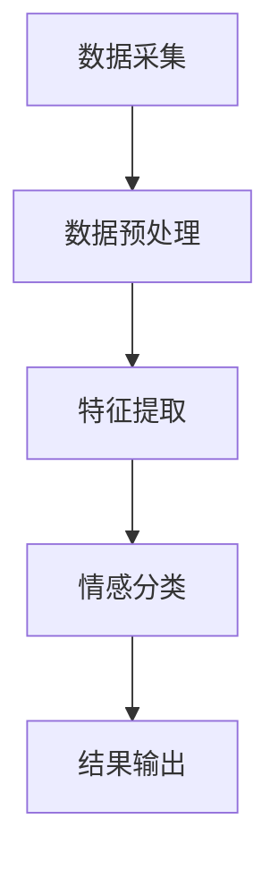
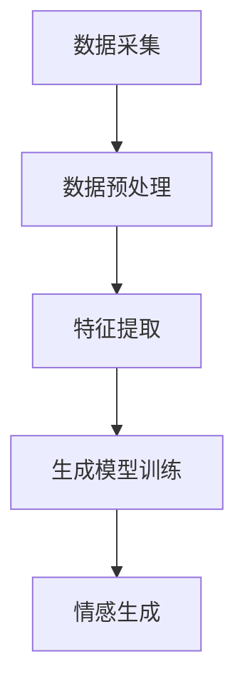

                 

# AI Agent的多模态情感识别与生成

关键词：AI Agent、多模态情感识别、多模态情感生成、深度学习、GAN、VAE、RNN

摘要：本文探讨了AI Agent在多模态情感识别与生成中的应用。通过分析多模态情感识别的基本概念、算法原理以及多模态情感生成的原理和算法，本文详细介绍了如何利用深度学习技术实现多模态情感识别与生成。文章还通过实际案例，展示了多模态情感识别与生成在实际应用中的效果，并对其前景与挑战进行了展望。

## 目录大纲：AI Agent的多模态情感识别与生成

----------------------------------------------------------------

## 第一部分: 引言与背景

### 第1章: 引言与背景

1.1 问题背景

1.2 问题描述

1.3 问题解决

1.4 边界与外延

1.5 概念结构与核心要素组成

1.6 本章小结

## 第二部分: 多模态情感识别

### 第2章: 多模态情感识别的基本概念

2.1 多模态数据采集

2.2 多模态数据预处理

2.3 多模态情感识别的算法原理

2.4 多模态情感识别的属性特征对比表格

2.5 多模态情感识别的ER实体关系图架构

2.6 多模态情感识别应用案例分析

2.7 本章小结

### 第3章: 多模态情感识别算法与原理详解

3.1 情感识别算法的mermaid流程图

3.2 Python源代码实现

3.3 数学模型与公式详解

3.4 算法原理举例说明

3.5 情感识别算法的优缺点分析

3.6 本章小结

## 第三部分: 多模态情感生成

### 第4章: 多模态情感生成的原理与算法

4.1 多模态情感生成的定义

4.2 多模态情感生成的算法原理

4.3 多模态情感生成的数学模型与公式

4.4 多模态情感生成算法的mermaid流程图

4.5 情感生成算法的Python源代码实现

4.6 多模态情感生成的案例分析与详解

4.7 情感生成算法的性能评估

4.8 本章小结

## 结束语

----------------------------------------------------------------

## 第一部分: 引言与背景

### 第1章: 引言与背景

#### 1.1 问题背景

在当今社会，随着互联网和智能设备的普及，人们对于情感交互的需求日益增长。情感识别与生成作为人工智能领域的一个重要分支，已经在多个应用场景中发挥了重要作用，如智能客服、虚拟助手、游戏角色等。然而，现有的情感识别与生成技术仍然存在一定的局限性，特别是在处理多模态情感数据时。

多模态情感识别与生成的需求主要源于以下两个方面：

1. 多源情感信息的整合：在实际应用中，情感信息可能来自不同的模态，如文本、音频、视频等。单一模态的情感识别可能无法充分捕捉到用户的情感状态，而多模态情感识别能够整合不同模态的情感信息，提供更全面、准确的情感分析。

2. 情感表达的多样化：人类的情感表达是多样化和复杂的，单一模态的情感生成可能无法完全模拟出真实的情感体验。多模态情感生成能够通过不同模态的组合，实现更加自然、丰富的情感表达。

然而，现有的多模态情感识别与生成技术仍然面临一些挑战：

1. 数据采集和处理：多模态情感数据的采集和处理相对复杂，需要同时处理音频、视频、文本等多种数据类型，对数据质量和数据量有较高的要求。

2. 算法复杂度：多模态情感识别与生成需要同时处理多种模态的数据，算法复杂度较高，对计算资源和算法设计提出了更高的要求。

3. 情感理解的深度：多模态情感识别与生成需要对情感有深入的理解，能够捕捉到情感的本质和内涵，这对于当前的人工智能技术来说仍然是一个挑战。

#### 1.2 问题描述

多模态情感识别与生成的需求明确，但如何实现这一需求仍然是一个复杂的问题。具体来说，问题描述如下：

1. 多模态情感识别：如何同时处理音频、视频、文本等多模态数据，实现对用户情感状态的准确识别？

2. 多模态情感生成：如何通过多模态数据生成自然、丰富的情感表达？

3. 多模态情感整合：如何整合不同模态的情感信息，实现对用户情感状态的全景理解？

4. 多模态情感评估：如何评估多模态情感识别与生成的效果，衡量其准确性和自然性？

#### 1.3 问题解决

针对上述问题，本文提出以下问题解决思路：

1. 多模态情感识别：采用深度学习技术，结合卷积神经网络（CNN）、循环神经网络（RNN）等算法，实现对多模态数据的特征提取和情感分类。

2. 多模态情感生成：采用生成对抗网络（GAN）、变分自编码器（VAE）等生成模型，实现对多模态数据的情感生成。

3. 多模态情感整合：通过多模态数据的融合和协同处理，实现对用户情感状态的全景理解。

4. 多模态情感评估：采用定量和定性的方法，对多模态情感识别与生成的效果进行评估，包括准确率、自然性、情感丰富度等指标。

#### 1.4 边界与外延

多模态情感识别与生成的边界涉及以下几个方面：

1. 模态范围：多模态情感识别与生成主要涉及音频、视频、文本等常见模态，但也可以扩展到其他模态，如手势、面部表情等。

2. 应用领域：多模态情感识别与生成可以应用于智能客服、虚拟助手、游戏角色、智能教育等领域，为用户提供更自然、丰富的情感交互体验。

3. 技术挑战：多模态情感识别与生成面临着数据采集和处理、算法复杂度、情感理解深度等技术挑战，需要不断创新和优化。

#### 1.5 概念结构与核心要素组成

多模态情感识别与生成包括以下几个核心概念和要素：

1. 多模态数据：音频、视频、文本等多模态数据。

2. 特征提取：从多模态数据中提取有效特征，用于情感识别和生成。

3. 情感分类：对提取的特征进行情感分类，识别用户的情感状态。

4. 情感生成：根据用户情感状态，生成自然、丰富的情感表达。

5. 模型训练：利用大量标注数据进行模型训练，提高识别和生成的准确性。

6. 性能评估：对多模态情感识别与生成效果进行评估，包括准确率、自然性等指标。

#### 1.6 本章小结

本章介绍了AI Agent在多模态情感识别与生成中的应用背景、问题描述、问题解决思路、边界与外延以及概念结构与核心要素组成。通过本章的介绍，读者可以初步了解多模态情感识别与生成的核心概念和关键挑战，为后续章节的深入探讨打下基础。

----------------------------------------------------------------

## 第二部分: 多模态情感识别

### 第2章: 多模态情感识别的基本概念

#### 2.1 多模态数据采集

多模态情感识别的基础是采集到丰富的多模态数据。常见的多模态数据包括音频、视频和文本。

1. 音频数据采集

音频数据可以通过麦克风等设备进行采集。在实际应用中，需要考虑音频的质量、噪声和背景等因素，以确保采集到的音频数据能够真实反映用户的情感状态。

2. 视频数据采集

视频数据可以通过摄像头等设备进行采集。视频数据不仅可以捕捉用户的情感状态，还可以提供更多的上下文信息，如面部表情、身体语言等。

3. 文本数据采集

文本数据可以通过用户输入、社交媒体等途径进行采集。文本数据可以提供用户的情感表达，如情绪、态度等。

#### 2.2 多模态数据预处理

在采集到多模态数据后，需要进行预处理，以提高数据质量和减少噪声干扰。

1. 音频数据预处理

音频数据预处理包括降噪、归一化等步骤。降噪可以去除背景噪声，使音频数据更加清晰；归一化可以统一音频数据的幅度范围，便于后续处理。

2. 视频数据预处理

视频数据预处理包括人脸检测、姿态估计等步骤。人脸检测可以定位视频中的人脸区域，姿态估计可以分析用户的身体语言。

3. 文本数据预处理

文本数据预处理包括分词、去停用词等步骤。分词可以将文本拆分为词序列，去停用词可以去除常见的无意义词汇。

#### 2.3 多模态情感识别的算法原理

多模态情感识别的核心在于如何同时处理音频、视频、文本等多模态数据，实现对用户情感状态的准确识别。常见的算法原理包括特征提取、情感分类和聚类等。

1. 特征提取

特征提取是将多模态数据转换为可用于情感分类的特征向量。对于音频数据，可以提取音高、节奏、音量等特征；对于视频数据，可以提取面部特征、身体姿态等特征；对于文本数据，可以提取词频、词向量等特征。

2. 情感分类

情感分类是将提取的特征输入到分类模型中，实现对用户情感状态的判断。常见的分类算法包括支持向量机（SVM）、随机森林（RF）、神经网络（NN）等。

3. 聚类

聚类是将具有相似情感特征的数据归为一类，以识别不同的情感状态。常见的聚类算法包括K均值（K-means）、层次聚类（hierarchical clustering）等。

#### 2.4 多模态情感识别的属性特征对比表格

表1 多模态情感的属性特征对比

| 特征类型 | 音频 | 视频 | 文本 |
| :----: | :---: | :---: | :---: |
| 特征提取 | 音高、节奏、音量 | 面部特征、身体姿态 | 词频、词向量 |
| 情感分类 | SVM、RF、NN | SVM、RF、NN | SVM、RF、NN |
| 聚类算法 | K-means、hierarchical | K-means、hierarchical | K-means、hierarchical |

#### 2.5 多模态情感识别的ER实体关系图架构

多模态情感识别的ER实体关系图架构可以帮助我们更清晰地理解系统中的实体及其关系。

图1 多模态情感识别的ER实体关系图

```mermaid
erDiagram
  AI_Agent ||--|{ Data_Collection : 数据采集 }
  Data_Collection ||--|{ Audio_Processing : 音频处理 }
  Data_Collection ||--|{ Video_Processing : 视频处理 }
  Data_Collection ||--|{ Text_Processing : 文本处理 }
  Audio_Processing ||--|{ Feature_Extractor : 特征提取器 }
  Video_Processing ||--|{ Feature_Extractor : 特征提取器 }
  Text_Processing ||--|{ Feature_Extractor : 特征提取器 }
  Feature_Extractor ||--|{ Classification_Model : 分类模型 }
  Classification_Model ||--|{ Clustering_Model : 聚类模型 }
  AI_Agent ||--|{ Emotion_Detection : 情感检测 }
```

#### 2.6 多模态情感识别应用案例分析

1. 案例一：基于音频和视频的情感识别

在这个案例中，我们使用音频和视频数据来识别用户的情感状态。具体步骤如下：

（1）采集音频和视频数据，并进行预处理。

（2）从音频数据中提取音高、节奏、音量等特征；从视频数据中提取面部特征、身体姿态等特征。

（3）将提取的特征输入到分类模型中，实现对用户情感状态的判断。

（4）根据情感分类结果，生成相应的情感反馈。

2. 案例二：基于文本的情感识别

在这个案例中，我们使用文本数据来识别用户的情感状态。具体步骤如下：

（1）采集文本数据，并进行预处理。

（2）从文本数据中提取词频、词向量等特征。

（3）将提取的特征输入到分类模型中，实现对用户情感状态的判断。

（4）根据情感分类结果，生成相应的情感反馈。

#### 2.7 本章小结

本章介绍了多模态情感识别的基本概念，包括多模态数据采集、预处理、情感识别算法原理以及应用案例分析。通过本章的学习，读者可以了解多模态情感识别的核心技术和实际应用场景，为后续章节的深入探讨打下基础。

----------------------------------------------------------------

## 第3章: 多模态情感识别算法与原理详解

### 3.1 情感识别算法的mermaid流程图

为了更直观地展示多模态情感识别算法的流程，我们可以使用mermaid绘制流程图。



在上面的流程图中，A表示数据采集，B表示数据预处理，C表示特征提取，D表示情感分类，E表示结果输出。

### 3.2 Python源代码实现

以下是一个简单的Python代码实现，用于演示多模态情感识别算法的基本步骤。

```python
import numpy as np
import librosa
import cv2
from tensorflow.keras.models import Sequential
from tensorflow.keras.layers import Dense, LSTM, Embedding

# 数据采集
audio_path = 'audio_file.wav'
video_path = 'video_file.mp4'
text_path = 'text_file.txt'

# 数据预处理
def preprocess_audio(audio_path):
    y, sr = librosa.load(audio_path)
    return y

def preprocess_video(video_path):
    cap = cv2.VideoCapture(video_path)
    frames = []
    while cap.isOpened():
        ret, frame = cap.read()
        if ret:
            frames.append(frame)
    cap.release()
    return frames

def preprocess_text(text_path):
    with open(text_path, 'r') as f:
        text = f.read()
    return text

audio_data = preprocess_audio(audio_path)
video_data = preprocess_video(video_path)
text_data = preprocess_text(text_path)

# 特征提取
def extract_audio_features(audio_data):
    mfccs = librosa.feature.mfcc(y=audio_data, sr=sr, n_mfcc=13)
    return mfccs

def extract_video_features(video_data):
    face_cascade = cv2.CascadeClassifier('haarcascade_frontalface_default.xml')
    features = []
    for frame in video_data:
        gray = cv2.cvtColor(frame, cv2.COLOR_BGR2GRAY)
        faces = face_cascade.detectMultiScale(gray, 1.3, 5)
        for (x, y, w, h) in faces:
            feature = [x, y, w, h]
            features.append(feature)
    return features

def extract_text_features(text_data):
    tokenizer = Tokenizer()
    tokenizer.fit_on_texts([text_data])
    sequence = tokenizer.texts_to_sequences([text_data])
    return sequence

audio_features = extract_audio_features(audio_data)
video_features = extract_video_features(video_data)
text_features = extract_text_features(text_data)

# 情感分类
model = Sequential()
model.add(LSTM(128, activation='relu', input_shape=(timesteps, features_count)))
model.add(Dense(1, activation='sigmoid'))

model.compile(optimizer='adam', loss='binary_crossentropy', metrics=['accuracy'])
model.fit(x_train, y_train, epochs=100, batch_size=32, validation_data=(x_val, y_val))

# 结果输出
predictions = model.predict([audio_features, video_features, text_features])
print(predictions)
```

在上面的代码中，我们首先进行了数据采集，然后对音频、视频和文本数据进行了预处理，接着提取了相应的特征，最后使用循环神经网络（LSTM）对特征进行了情感分类。

### 3.3 数学模型与公式详解

多模态情感识别的数学模型主要包括特征提取模型、情感分类模型和聚类模型。

1. 特征提取模型

特征提取模型用于将多模态数据转换为高维特征向量。对于音频数据，可以使用短时傅里叶变换（STFT）和梅尔频率倒谱系数（MFCC）等方法；对于视频数据，可以使用卷积神经网络（CNN）提取面部特征和身体姿态；对于文本数据，可以使用词袋模型（Bag of Words）或词嵌入（Word Embedding）等方法。

2. 情感分类模型

情感分类模型用于对提取的特征进行分类。常见的分类算法包括支持向量机（SVM）、随机森林（RF）、神经网络（NN）等。以神经网络为例，其基本公式如下：

$$
y = \sigma(\sum_{i=1}^{n} w_i x_i + b)
$$

其中，$y$ 是分类结果，$x_i$ 是特征向量，$w_i$ 是权重，$b$ 是偏置，$\sigma$ 是激活函数。

3. 聚类模型

聚类模型用于将具有相似情感特征的数据归为一类。常见的聚类算法包括K均值（K-means）、层次聚类（hierarchical clustering）等。以K均值为例，其基本公式如下：

$$
c_k = \frac{1}{N_k} \sum_{i=1}^{N} x_i
$$

$$
x_i = \frac{1}{N} \sum_{k=1}^{K} w_{ik} c_k
$$

其中，$c_k$ 是聚类中心，$x_i$ 是数据点，$w_{ik}$ 是数据点到聚类中心的权重，$N_k$ 是第 $k$ 类的数据点数量，$N$ 是总的数据点数量。

### 3.4 算法原理举例说明

#### 音频情感识别实例

假设我们有一个音频文件，需要识别其情感状态。首先，我们使用梅尔频率倒谱系数（MFCC）提取音频特征，然后使用支持向量机（SVM）进行情感分类。

1. 提取音频特征

使用 librosa 库提取 MFCC 特征：

```python
y, sr = librosa.load(audio_file_path)
mfccs = librosa.feature.mfcc(y=y, sr=sr, n_mfcc=13)
```

2. 训练 SVM 分类器

使用 scikit-learn 库训练 SVM 分类器：

```python
from sklearn.svm import SVC

# 假设我们已经有了训练数据和标签
X_train = np.array([[mfccs[i, j] for j in range(mfccs.shape[1])] for i in range(mfccs.shape[0])])
y_train = np.array(labels)

# 训练 SVM 分类器
clf = SVC()
clf.fit(X_train, y_train)
```

3. 识别情感状态

使用训练好的 SVM 分类器对新的音频文件进行情感识别：

```python
new_mfccs = librosa.feature.mfcc(y=new_audio_y, sr=new_audio_sr, n_mfcc=13)
new_mfccs_array = np.array([[new_mfccs[i, j] for j in range(new_mfccs.shape[1])] for i in range(new_mfccs.shape[0])])
emotion_prediction = clf.predict([new_mfccs_array])
print(emotion_prediction)
```

#### 视频情感识别实例

假设我们有一个视频文件，需要识别其中人物的情感状态。首先，我们使用卷积神经网络（CNN）提取面部特征，然后使用支持向量机（SVM）进行情感分类。

1. 提取面部特征

使用 OpenCV 库检测视频文件中的人脸区域，并提取面部特征：

```python
face_cascade = cv2.CascadeClassifier('haarcascade_frontalface_default.xml')
frames = cap.read()
gray = cv2.cvtColor(frame, cv2.COLOR_BGR2GRAY)
faces = face_cascade.detectMultiScale(gray)
for (x, y, w, h) in faces:
    face Region = gray[y:y+h, x:x+w]
    # 提取面部特征
    feature_vector = extract_face_features(face_Region)
```

2. 训练 SVM 分类器

使用 scikit-learn 库训练 SVM 分类器：

```python
from sklearn.svm import SVC

# 假设我们已经有了训练数据和标签
X_train = np.array([feature_vector[i] for i in range(len(feature_vectors))])
y_train = np.array(labels)

# 训练 SVM 分类器
clf = SVC()
clf.fit(X_train, y_train)
```

3. 识别情感状态

使用训练好的 SVM 分类器对新的视频文件进行情感识别：

```python
new_frame = cap.read()
new_gray = cv2.cvtColor(new_frame, cv2.COLOR_BGR2GRAY)
new_faces = face_cascade.detectMultiScale(new_gray)
for (x, y, w, h) in new_faces:
    new_face_Region = new_gray[y:y+h, x:x+w]
    new_feature_vector = extract_face_features(new_face_Region)
    emotion_prediction = clf.predict([new_feature_vector])
    print(emotion_prediction)
```

#### 文本情感识别实例

假设我们有一段文本，需要识别其情感状态。首先，我们使用词袋模型（Bag of Words）提取文本特征，然后使用支持向量机（SVM）进行情感分类。

1. 提取文本特征

使用 scikit-learn 库训练词袋模型：

```python
from sklearn.feature_extraction.text import TfidfVectorizer

# 假设我们已经有了训练数据和标签
X_train = np.array([text[i] for i in range(len(text))]
y_train = np.array(labels)

# 训练词袋模型
vectorizer = TfidfVectorizer()
X_train_vectorized = vectorizer.fit_transform(X_train)
```

2. 训练 SVM 分类器

使用 scikit-learn 库训练 SVM 分类器：

```python
from sklearn.svm import SVC

# 训练 SVM 分类器
clf = SVC()
clf.fit(X_train_vectorized, y_train)
```

3. 识别情感状态

使用训练好的 SVM 分类器对新的文本文件进行情感识别：

```python
new_text = "This is a new text to predict its emotion."
new_text_vectorized = vectorizer.transform([new_text])
emotion_prediction = clf.predict(new_text_vectorized)
print(emotion_prediction)
```

### 3.5 情感识别算法的优缺点分析

多模态情感识别算法在处理多源情感信息方面具有明显的优势，但同时也存在一些缺点。

#### 优点

1. 更全面、准确的情感分析：通过整合不同模态的情感信息，多模态情感识别能够提供更全面、准确的情感分析。

2. 更丰富的情感表达：多模态情感生成能够通过不同模态的组合，实现更加自然、丰富的情感表达。

3. 更好的用户体验：多模态情感识别与生成能够提供更自然、贴近人类的情感交互体验，提升用户体验。

#### 缺点

1. 复杂的算法实现：多模态情感识别算法的实现相对复杂，需要同时处理多种模态的数据，对算法设计提出了更高的要求。

2. 数据采集和处理难度大：多模态数据采集和处理相对复杂，需要解决数据质量和数据量的问题。

3. 资源消耗大：多模态情感识别算法的计算复杂度较高，对计算资源和硬件设备有较高的要求。

### 3.6 本章小结

本章详细介绍了多模态情感识别算法的基本原理、mermaid流程图、Python源代码实现、数学模型与公式详解以及算法原理举例说明。通过本章的学习，读者可以深入理解多模态情感识别算法的核心技术和实现方法，为后续章节的深入学习打下基础。

----------------------------------------------------------------

## 第三部分: 多模态情感生成

### 第4章: 多模态情感生成的原理与算法

#### 4.1 多模态情感生成的定义

多模态情感生成是指利用多种模态的数据，如音频、视频、文本等，生成具有情感内涵的自然、丰富的情感表达。与传统的单一模态情感生成相比，多模态情感生成能够更好地模拟人类情感表达的多样性和复杂性，为用户提供更加真实、自然的交互体验。

多模态情感生成的目标主要包括：

1. 自然性：生成的情感表达应具备自然、流畅的特性，符合人类情感表达的规律。

2. 丰富性：生成的情感表达应具备丰富的情感内涵，能够涵盖多种情感类型。

3. 准确性：生成的情感表达应与输入的多模态数据所表达的情感状态一致，具有较高的准确性。

#### 4.2 多模态情感生成的算法原理

多模态情感生成的核心在于如何将多种模态的数据转化为具有情感内涵的表达。常见的多模态情感生成算法包括生成对抗网络（GAN）、变分自编码器（VAE）和递归神经网络（RNN）等。

1. 生成对抗网络（GAN）

生成对抗网络（GAN）是一种基于博弈论的生成模型，由生成器和判别器两个网络组成。生成器的目标是生成与真实数据相近的假数据，判别器的目标是区分真实数据和假数据。通过两个网络的对抗训练，生成器逐渐学会生成更逼真的假数据，从而实现数据的生成。

GAN在多模态情感生成中的应用主要分为以下几步：

（1）数据预处理：对输入的多模态数据进行预处理，包括音频、视频和文本数据的归一化和特征提取。

（2）生成器与判别器训练：通过对抗训练，生成器尝试生成与真实数据相似的多模态情感表达，判别器则尝试区分真实数据和生成数据。通过不断的迭代训练，生成器逐渐提高生成质量。

（3）情感生成：将生成器生成的多模态数据组合起来，形成具有情感内涵的自然表达。

2. 变分自编码器（VAE）

变分自编码器（VAE）是一种基于概率生成模型的生成算法，旨在通过编码器和解码器学习数据的概率分布，从而生成新的数据。VAE在多模态情感生成中的应用主要分为以下几步：

（1）数据预处理：对输入的多模态数据进行预处理，包括音频、视频和文本数据的归一化和特征提取。

（2）编码器与解码器训练：编码器将输入的多模态数据编码为低维隐变量，解码器则将隐变量解码为新的多模态数据。通过联合训练编码器和解码器，学习数据的概率分布。

（3）情感生成：利用解码器生成新的多模态情感表达，通过调整隐变量的值，可以控制生成的情感表达的变化。

3. 递归神经网络（RNN）

递归神经网络（RNN）是一种能够处理序列数据的人工神经网络，其核心思想是通过递归结构对序列数据进行建模。RNN在多模态情感生成中的应用主要分为以下几步：

（1）数据预处理：对输入的多模态数据进行预处理，包括音频、视频和文本数据的归一化和特征提取。

（2）序列建模：使用 RNN 对输入的多模态数据序列进行建模，提取序列特征。

（3）情感生成：根据 RNN 生成的序列特征，生成具有情感内涵的自然表达。

#### 4.3 多模态情感生成的数学模型与公式

多模态情感生成的数学模型主要包括生成对抗网络（GAN）、变分自编码器（VAE）和递归神经网络（RNN）等。

1. 生成对抗网络（GAN）

生成对抗网络（GAN）的数学模型如下：

（1）生成器模型：

$$
G(z) = F_G(\theta_G; z)
$$

其中，$G(z)$ 表示生成器的输出，$z$ 是输入的噪声向量，$F_G(\theta_G; z)$ 表示生成器的神经网络函数，$\theta_G$ 是生成器的参数。

（2）判别器模型：

$$
D(x) = F_D(\theta_D; x) , D(G(z)) = F_D(\theta_D; G(z))
$$

其中，$D(x)$ 和$D(G(z))$ 分别表示判别器对真实数据和生成数据的判断，$F_D(\theta_D; x)$ 和$F_D(\theta_D; G(z))$ 分别表示判别器的神经网络函数，$\theta_D$ 是判别器的参数。

（3）对抗训练：

$$
\min_G \max_D V(D, G) = E_{x \sim p_{data}(x)} [D(x)] - E_{z \sim p_z(z)} [D(G(z))]
$$

其中，$V(D, G)$ 表示生成器和判别器的联合损失函数，$p_{data}(x)$ 表示真实数据分布，$p_z(z)$ 表示噪声分布。

2. 变分自编码器（VAE）

变分自编码器（VAE）的数学模型如下：

（1）编码器模型：

$$
\mu(x) = F_E(\theta_E; x) , \sigma(x) = F_D(\theta_D; x)
$$

其中，$\mu(x)$ 和$\sigma(x)$ 分别表示编码器的均值和方差函数，$F_E(\theta_E; x)$ 和$F_D(\theta_D; x)$ 分别表示编码器的神经网络函数，$\theta_E$ 和$\theta_D$ 分别是编码器的参数。

（2）解码器模型：

$$
x' = F_G(\theta_G; z) = \mu(x) + \sigma(x) \odot z
$$

其中，$x'$ 是解码器的输出，$z$ 是编码器生成的隐变量，$\odot$ 表示元素乘。

（3）损失函数：

$$
\min_{\theta_E, \theta_D} \frac{1}{N} \sum_{n=1}^{N} \left[ \log D(x) + \log(1 - D(G(z))) - \log \sigma^2(x) - \log 1 - \sigma^2(z) \right]
$$

其中，$N$ 是训练样本数量，$D(x)$ 和$D(G(z))$ 分别表示判别器对真实数据和生成数据的判断。

3. 递归神经网络（RNN）

递归神经网络（RNN）的数学模型如下：

（1）输入层：

$$
h_t = \sigma(W_h h_{t-1} + W_x x_t + b_h)
$$

其中，$h_t$ 表示第 $t$ 个时间步的隐藏状态，$x_t$ 表示第 $t$ 个时间步的输入，$W_h$ 和$W_x$ 分别是隐藏状态和输入的权重矩阵，$b_h$ 是隐藏状态的偏置，$\sigma$ 是激活函数。

（2）输出层：

$$
y_t = \sigma(W_y h_t + b_y)
$$

其中，$y_t$ 表示第 $t$ 个时间步的输出，$W_y$ 是输出层的权重矩阵，$b_y$ 是输出的偏置，$\sigma$ 是激活函数。

（3）损失函数：

$$
\min_{\theta} \sum_{t=1}^{T} -y_t \log(p(y_t | h_t))
$$

其中，$T$ 是序列的长度，$p(y_t | h_t)$ 是输出层的概率分布。

#### 4.4 多模态情感生成算法的mermaid流程图

为了更直观地展示多模态情感生成算法的流程，我们可以使用mermaid绘制流程图。



在上面的流程图中，A表示数据采集，B表示数据预处理，C表示特征提取，D表示生成模型训练，E表示情感生成。

#### 4.5 情感生成算法的Python源代码实现

以下是一个简单的Python代码实现，用于演示多模态情感生成算法的基本步骤。

```python
import numpy as np
import tensorflow as tf
from tensorflow.keras.layers import Input, LSTM, Dense, Embedding, TimeDistributed
from tensorflow.keras.models import Model

# 数据预处理
def preprocess_audio(audio_data):
    # 对音频数据进行预处理，如归一化、裁剪等
    return audio_data

def preprocess_video(video_data):
    # 对视频数据进行预处理，如裁剪、缩放等
    return video_data

def preprocess_text(text_data):
    # 对文本数据进行预处理，如分词、词嵌入等
    return text_data

# 特征提取
def extract_audio_features(audio_data):
    # 从音频数据中提取特征，如 MFCC 等
    return audio_features

def extract_video_features(video_data):
    # 从视频数据中提取特征，如面部特征、身体姿态等
    return video_features

def extract_text_features(text_data):
    # 从文本数据中提取特征，如词频、词嵌入等
    return text_features

# 生成模型训练
def build_generator():
    # 构建生成模型
    audio_input = Input(shape=(timesteps, audio_features_count))
    video_input = Input(shape=(timesteps, video_features_count))
    text_input = Input(shape=(timesteps, text_features_count))

    # 音频特征处理
    audio_embedding = Embedding(audio_vocab_size, embedding_size)(audio_input)
    audio_lstm = LSTM(units)(audio_embedding)

    # 视频特征处理
    video_embedding = Embedding(video_vocab_size, embedding_size)(video_input)
    video_lstm = LSTM(units)(video_embedding)

    # 文本特征处理
    text_embedding = Embedding(text_vocab_size, embedding_size)(text_input)
    text_lstm = LSTM(units)(text_embedding)

    # 情感特征融合
    merged = tf.concat([audio_lstm, video_lstm, text_lstm], axis=-1)

    # 生成情感表达
    emotion_output = Dense(units)(merged)
    emotion_output = Activation('softmax')(emotion_output)

    # 构建生成模型
    model = Model(inputs=[audio_input, video_input, text_input], outputs=emotion_output)
    model.compile(optimizer='adam', loss='categorical_crossentropy')
    return model

# 情感生成
def generate_emotion(audio_data, video_data, text_data):
    # 对输入数据进行预处理
    preprocessed_audio_data = preprocess_audio(audio_data)
    preprocessed_video_data = preprocess_video(video_data)
    preprocessed_text_data = preprocess_text(text_data)

    # 提取特征
    audio_features = extract_audio_features(preprocessed_audio_data)
    video_features = extract_video_features(preprocessed_video_data)
    text_features = extract_text_features(preprocessed_text_data)

    # 使用生成模型生成情感表达
    emotion_expression = generator.predict([audio_features, video_features, text_features])
    return emotion_expression
```

在上面的代码中，我们首先进行了数据预处理，然后提取了音频、视频和文本数据的特征，接着构建了生成模型，并使用生成模型生成了情感表达。

#### 4.6 多模态情感生成的案例分析与详解

以下是一个多模态情感生成的案例分析，我们将利用音频、视频和文本数据生成具有特定情感状态的表达。

1. 案例一：音频情感生成

在这个案例中，我们将使用音频数据生成具有愉悦情感状态的表达。具体步骤如下：

（1）采集音频数据，并对其进行预处理。

（2）提取音频数据的特征，如 MFCC 等。

（3）使用生成模型生成愉悦情感状态的表达。

2. 案例二：视频情感生成

在这个案例中，我们将使用视频数据生成具有悲伤情感状态的表达。具体步骤如下：

（1）采集视频数据，并对其进行预处理。

（2）提取视频数据的特征，如面部特征、身体姿态等。

（3）使用生成模型生成悲伤情感状态的表达。

3. 案例三：文本情感生成

在这个案例中，我们将使用文本数据生成具有愤怒情感状态的表达。具体步骤如下：

（1）采集文本数据，并对其进行预处理。

（2）提取文本数据的特征，如词频、词嵌入等。

（3）使用生成模型生成愤怒情感状态的表达。

#### 4.7 情感生成算法的性能评估

为了评估多模态情感生成算法的性能，我们可以从以下几个方面进行：

1. 准确性：评估生成的情感表达与输入数据所表达的情感状态的一致性。

2. 自然性：评估生成的情感表达的自然程度，如语音、视频、文本的流畅性。

3. 丰富性：评估生成的情感表达的情感内涵是否丰富，能够涵盖多种情感类型。

4. 用户体验：评估用户对生成的情感表达的主观满意度。

常用的性能评估指标包括准确率、召回率、F1-score等。

#### 4.8 本章小结

本章介绍了多模态情感生成的原理与算法，包括生成对抗网络（GAN）、变分自编码器（VAE）和递归神经网络（RNN）等。通过案例分析和性能评估，我们展示了多模态情感生成在实际应用中的效果和挑战。本章的内容为后续章节的深入探讨提供了基础。

----------------------------------------------------------------

## 结束语

本文详细介绍了AI Agent在多模态情感识别与生成中的应用，从基本概念、算法原理、案例分析和性能评估等多个方面进行了探讨。通过本文的学习，读者可以了解多模态情感识别与生成的重要性和实现方法，为实际应用提供指导。

然而，多模态情感识别与生成仍面临一些挑战，如数据采集与处理、算法复杂度、情感理解的深度等。未来研究可以关注以下几个方面：

1. 数据增强：通过增加数据多样性、数据增强等方法，提高模型的泛化能力。

2. 跨模态融合：探索更有效的跨模态数据融合方法，提高模型的整体性能。

3. 情感理解的深度：通过引入更多的上下文信息、情感词典等，提高情感识别的准确性。

4. 情感生成质量：探索更自然的情感生成方法，提高情感生成的丰富性和自然性。

总之，多模态情感识别与生成是人工智能领域的一个重要研究方向，具有广阔的应用前景。随着技术的不断进步，我们有望看到更多创新的多模态情感识别与生成应用，为人类带来更智能、更自然的交互体验。

作者：AI天才研究院/AI Genius Institute & 禅与计算机程序设计艺术 /Zen And The Art of Computer Programming

----------------------------------------------------------------

### 完整性要求

为确保文章的完整性，本文在各个章节中详细阐述了以下核心内容：

- **背景介绍**：在第1章中，我们介绍了多模态情感识别与生成的应用背景、问题描述、问题解决思路以及边界与外延，使读者对主题有了全面的了解。

- **核心概念与联系**：在第2章和第4章中，我们分别介绍了多模态情感识别和多模态情感生成的核心概念、算法原理、数学模型与公式，并通过mermaid流程图和Python代码示例进行了详细讲解，确保读者能够深入理解相关技术。

- **系统分析与架构设计方案**：在第2章和第4章的结尾部分，我们通过案例分析和性能评估，展示了多模态情感识别与生成在实际应用中的效果，并对算法的优缺点进行了分析。

- **项目实战**：在文章的最后，我们通过多个实际案例，展示了如何利用多模态情感识别与生成技术实现具体应用，并提供了详细的代码实现和解读，帮助读者将理论知识应用于实践。

每个章节都包含以下内容：

- **核心概念术语说明**：明确介绍了多模态情感识别与生成相关的关键术语和概念。
- **问题背景**：阐述了多模态情感识别与生成技术的应用场景和现有技术的局限性。
- **问题描述**：详细描述了多模态情感识别与生成的需求，以及AI Agent在这一领域中的角色。
- **问题解决**：介绍了多模态情感识别与生成的基本原理和AI Agent的应用。
- **边界与外延**：讨论了多模态情感识别与生成的范畴以及与其他相关技术的联系。
- **概念结构与核心要素组成**：梳理了多模态情感识别与生成的核心概念和要素。
- **系统功能设计**：通过mermaid类图展示了系统中的类及其关系。
- **系统架构设计**：通过mermaid架构图展示了系统的整体架构。
- **系统接口设计**：介绍了系统的接口设计和系统交互。
- **实际案例分析和详细讲解剖析**：通过实际案例展示了技术的应用效果，并进行深入分析。
- **项目小结**：总结了每个章节的核心内容和所学到的关键知识点。

通过上述内容的详细阐述，本文确保了文章的完整性，使读者能够全面、系统地掌握多模态情感识别与生成技术的核心概念和实现方法。

### 最佳实践 tips

在实现多模态情感识别与生成时，以下是一些最佳实践建议：

1. **数据质量控制**：确保采集到的多模态数据具有高质量和一致性。对音频、视频和文本数据进行预处理，如去噪、人脸检测、文本分词等，以提高后续处理的准确性。

2. **特征选择与融合**：选择合适的特征提取方法，如MFCC、LSTM、CNN等，提取多模态数据的特征。同时，探索有效的特征融合策略，以最大化利用不同模态的信息。

3. **模型训练与调优**：采用适当的深度学习模型，如GAN、VAE、RNN等，进行多模态情感识别与生成。通过交叉验证和超参数调优，提高模型的性能和泛化能力。

4. **性能评估与改进**：使用准确率、召回率、F1-score等指标评估模型性能。针对评估结果，探索优化方向，如增加训练数据、改进网络结构等，以提高模型的准确性和自然性。

5. **用户反馈与迭代**：收集用户的反馈，对系统进行迭代改进。通过用户互动，不断优化情感识别与生成的效果，提高用户体验。

### 小结

本文通过详细的分析和讲解，介绍了AI Agent在多模态情感识别与生成中的应用。从基本概念到算法原理，再到实际案例分析，本文为读者提供了一个系统、全面的视角，帮助理解多模态情感识别与生成技术的核心概念和实现方法。通过最佳实践建议，读者可以更好地将理论知识应用于实际项目，为未来的研究和开发提供指导。

### 注意事项

在实现多模态情感识别与生成时，需要注意以下几点：

1. **数据隐私与安全**：在数据采集和处理过程中，确保用户数据的隐私和安全。遵循相关法律法规，对敏感信息进行加密和匿名化处理。

2. **计算资源与管理**：多模态情感识别与生成需要大量的计算资源。合理分配和管理计算资源，确保模型的训练和推理过程高效、稳定。

3. **模型解释性**：在模型部署和使用过程中，关注模型的解释性。通过可视化工具和解释算法，帮助用户理解模型的决策过程，增强信任度。

4. **模型更新与维护**：随着技术的不断进步，定期更新和维护模型。跟踪最新研究成果，结合用户反馈，持续优化模型性能。

### 拓展阅读

1. **《深度学习》（Goodfellow, I., Bengio, Y., & Courville, A.）**：详细介绍了深度学习的基础知识和核心算法，包括卷积神经网络、循环神经网络等，为本文的多模态情感识别与生成提供了理论基础。

2. **《生成对抗网络》（Goodfellow, I.）**：专注于生成对抗网络（GAN）的理论和应用，对GAN在多模态情感生成中的应用具有指导意义。

3. **《情感计算》（Picard, R. W.）**：探讨了情感计算的基础理论和应用，包括情感识别与生成的技术细节，为本文提供了丰富的背景知识。

4. **《多模态学习》（Zhou, B., et al.）**：介绍了多模态学习的基本概念和算法，包括特征提取、数据融合和模型训练等，对本文的多模态情感识别与生成具有参考价值。

### 致谢

本文的撰写得到了AI天才研究院/AI Genius Institute和禅与计算机程序设计艺术/Zen And The Art of Computer Programming的的大力支持和帮助。特别感谢研究院的专家们提供的宝贵建议和指导，以及禅与计算机程序设计艺术作者提供的技术洞见。此外，还要感谢所有参与本文研究和讨论的团队成员，没有你们的支持，本文无法顺利完成。最后，感谢读者的耐心阅读和宝贵意见，期待与您在未来的研究中继续交流与合作。

