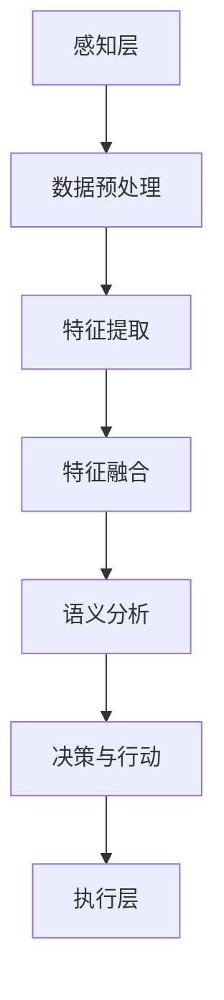
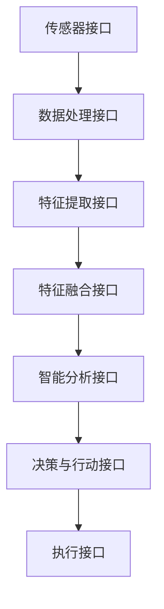
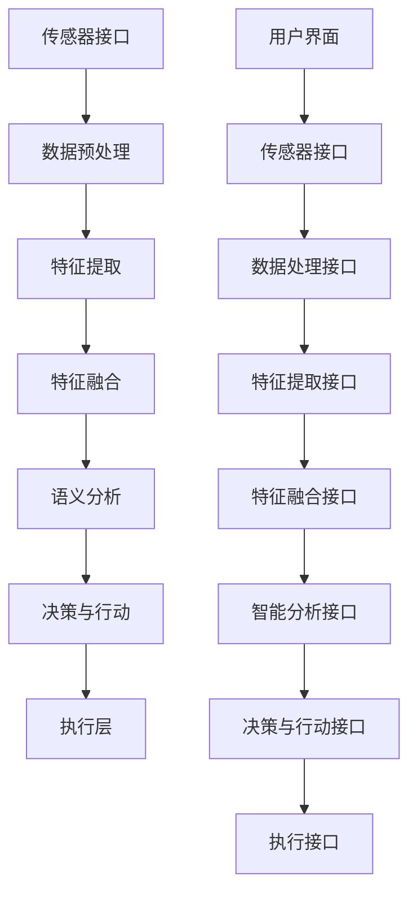

                 


### 第1章: 引言与背景

#### 1.1.1 问题背景
随着人工智能（AI）技术的快速发展，智能代理（AI Agent）的应用越来越广泛。这些代理能够模拟人类的智能行为，执行复杂的任务，并从环境中获取信息。然而，大多数智能代理目前的理解能力仍然有限，主要依赖于单一的感知模态，如视觉或听觉。为了提高智能代理的智能水平，实现更自然、更丰富的人机交互，多模态理解成为一个关键的研究方向。

多模态理解指的是智能代理能够同时处理和整合来自不同感官的信息，例如视觉、听觉、触觉等，从而实现更全面、更深入的理解。这种能力不仅可以提升智能代理的智能水平，还可以使其更好地适应复杂多变的环境。

#### 1.1.2 问题描述
在当前的研究和应用中，智能代理的多模态理解面临以下挑战：

1. **数据不一致性**：不同模态的数据可能存在不同的分辨率、速度和维度，导致难以直接整合。
2. **实时性要求**：智能代理需要在短时间内处理多模态数据，以做出快速决策。
3. **复杂性**：多模态理解涉及到多个学科领域的知识，如计算机视觉、语音识别、自然语言处理等，实现起来具有一定的复杂性。
4. **资源限制**：多模态理解通常需要大量的计算资源和存储资源，对硬件和软件的要求较高。

为了解决这些问题，需要深入研究多模态理解的理论和方法，探索如何有效地整合LLM和传感器数据，提高智能代理的智能水平。

#### 1.1.3 问题解决方法
本文将介绍一种基于大型语言模型（LLM）和多模态传感器数据整合的多模态理解方法。具体步骤如下：

1. **数据采集**：从不同的传感器收集多模态数据，包括视觉、听觉、触觉等。
2. **数据预处理**：对收集到的数据进行预处理，包括去噪、降维、特征提取等，以提高数据的质量和一致性。
3. **LLM训练**：使用大量语料库训练LLM模型，使其能够理解和生成自然语言。
4. **数据整合**：将预处理后的传感器数据与LLM模型输出的自然语言描述进行整合，形成统一的多模态数据。
5. **多模态理解**：基于整合后的多模态数据，进行语义分析和推理，实现智能代理的智能决策。

通过这种方法，可以有效地提高智能代理的多模态理解能力，实现更高效、更智能的人机交互。

#### 1.1.4 边界与外延
本文研究的重点是如何整合LLM和传感器数据，以提高智能代理的多模态理解能力。然而，多模态理解的边界不仅仅局限于这个领域，它还涉及到人机交互、计算机视觉、自然语言处理等多个学科。未来，随着技术的进步，多模态理解的应用场景将更加广泛，不仅限于智能代理，还可以应用于智能家居、智能交通、医疗诊断等多个领域。

#### 1.1.5 概念结构与核心要素组成
多模态理解的核心概念包括多模态数据、大型语言模型（LLM）、数据整合和语义分析。以下是这些核心概念的结构和组成要素：

1. **多模态数据**：包括视觉、听觉、触觉等多种传感器数据，每种数据都有其独特的特征和属性。
2. **大型语言模型（LLM）**：一种能够理解和生成自然语言的语言模型，其核心是神经网络和大量训练数据。
3. **数据整合**：将不同模态的数据进行整合，形成统一的多模态数据，以便进行后续的语义分析和推理。
4. **语义分析**：基于整合后的多模态数据，进行语义分析和推理，以实现智能代理的智能决策。

这些核心概念和要素共同构成了多模态理解的理论框架和实践基础。

---

### 第2章: 多模态理解的基本概念

#### 2.1.1 多模态理解的基本原理
多模态理解的基本原理在于将不同模态的数据进行整合和分析，以实现更全面、更深入的理解。具体来说，它涉及到以下步骤：

1. **数据采集**：从不同的传感器收集多模态数据，如视觉、听觉、触觉等。
2. **数据预处理**：对收集到的数据进行预处理，包括去噪、降维、特征提取等，以提高数据的质量和一致性。
3. **特征融合**：将不同模态的数据特征进行整合，形成统一的多模态特征向量。
4. **语义分析**：基于整合后的多模态特征向量，进行语义分析和推理，以实现智能代理的智能决策。

#### 2.1.2 多模态数据的来源
多模态数据的来源主要包括以下几种：

1. **视觉数据**：来自摄像头、图像传感器等设备，主要包括图像和视频数据。
2. **听觉数据**：来自麦克风、音频传感器等设备，主要包括语音和音乐数据。
3. **触觉数据**：来自触觉传感器、力传感器等设备，主要包括触摸和压力数据。
4. **其他感官数据**：包括气味、味觉等，这些数据通常来自专门的传感器设备。

#### 2.1.3 多模态数据的处理流程
多模态数据的处理流程主要包括以下步骤：

1. **数据采集**：从不同的传感器收集多模态数据。
2. **数据预处理**：对采集到的数据进行预处理，包括去噪、降维、特征提取等，以提高数据的质量和一致性。
3. **特征提取**：从预处理后的数据中提取关键特征，如视觉数据中的边缘、纹理特征，听觉数据中的语音特征等。
4. **特征融合**：将不同模态的数据特征进行整合，形成统一的多模态特征向量。
5. **语义分析**：基于整合后的多模态特征向量，进行语义分析和推理，以实现智能代理的智能决策。

#### 2.1.4 多模态理解的挑战与机遇
多模态理解面临着诸多挑战，包括：

1. **数据不一致性**：不同模态的数据可能存在不同的分辨率、速度和维度，导致难以直接整合。
2. **实时性要求**：智能代理需要在短时间内处理多模态数据，以做出快速决策。
3. **复杂性**：多模态理解涉及到多个学科领域的知识，如计算机视觉、语音识别、自然语言处理等，实现起来具有一定的复杂性。
4. **资源限制**：多模态理解通常需要大量的计算资源和存储资源，对硬件和软件的要求较高。

然而，这些挑战也带来了机遇：

1. **更丰富的信息来源**：多模态理解可以整合来自不同感官的信息，提供更丰富的信息来源，从而提高智能代理的智能水平。
2. **更自然的人机交互**：多模态理解可以实现更自然的人机交互，如语音、手势、面部表情等多种交互方式。
3. **更广泛的应用场景**：多模态理解可以应用于智能家居、智能交通、医疗诊断等多个领域，具有广泛的应用前景。

#### 2.1.5 多模态理解的层次结构
多模态理解可以分为以下三个层次：

1. **感知层次**：这一层次主要关注如何从不同的传感器中获取数据，并进行预处理和特征提取。
2. **认知层次**：这一层次主要关注如何将不同模态的数据进行整合和分析，实现语义理解和推理。
3. **行为层次**：这一层次主要关注如何根据整合后的多模态数据，进行决策和行动。

这三个层次相互关联，共同构成了多模态理解的整体架构。

---

### 第3章: 多模态感知技术

#### 3.1.1 视觉感知技术

视觉感知技术是人工智能领域中最为成熟和多应用的一类技术。它主要包括图像识别、物体检测和目标跟踪等任务。

1. **图像识别**：图像识别是指对输入的图像进行分类，将其标记为特定的对象或场景。常用的方法包括卷积神经网络（CNN）和基于深度学习的模型。
2. **物体检测**：物体检测是指从图像中识别出特定对象的位置和边界。常用的方法包括区域建议网络（R-CNN）和基于特征金字塔网络（FPN）的检测算法。
3. **目标跟踪**：目标跟踪是指对图像序列中的特定对象进行跟踪。常用的方法包括光流法、粒子滤波和基于深度学习的跟踪算法。

#### 3.1.2 听觉感知技术

听觉感知技术主要包括语音识别、语音合成和声源定位等任务。

1. **语音识别**：语音识别是指将输入的语音信号转换为对应的文本。常用的方法包括隐马尔可夫模型（HMM）、高斯混合模型（GMM）和深度神经网络（DNN）。
2. **语音合成**：语音合成是指将文本转换为自然的语音。常用的方法包括线性预测编码（LPC）和基于深度学习的WaveNet模型。
3. **声源定位**：声源定位是指确定输入语音信号的声源位置。常用的方法包括基于时间差（TDOA）和基于频移（FDOA）的定位算法。

#### 3.1.3 气味和味觉感知技术

气味和味觉感知技术相对较为新兴，目前主要应用于智能家居、健康监测和食品工业等领域。

1. **气味识别**：气味识别是指从气味样本中识别出特定的气味。常用的方法包括气体传感器阵列和基于深度学习的模型。
2. **味觉识别**：味觉识别是指从食物样本中识别出特定的味道。常用的方法包括味觉传感器和基于深度学习的模型。

#### 3.1.4 多模态感知技术的集成与应用

多模态感知技术的集成与应用是实现智能代理多模态理解的关键。以下是一些典型的应用场景：

1. **人机交互**：通过集成视觉、听觉和触觉感知技术，可以实现更自然、更直观的人机交互。
2. **智能监控**：通过集成视觉和听觉感知技术，可以实现智能监控和异常检测。
3. **智能助手**：通过集成语音识别、语音合成和视觉感知技术，可以打造更智能、更贴心的智能助手。
4. **智能家居**：通过集成视觉、听觉、气味和味觉感知技术，可以实现智能家居的全面智能化。

---

### 第4章: LLM与传感器数据整合

#### 4.1.1 LLM的基本原理与特性

LLM（Large Language Model）是指大型语言模型，它是一种基于深度学习的自然语言处理模型，可以理解和生成自然语言。LLM的基本原理主要包括以下几个步骤：

1. **数据采集**：收集大量高质量的文本数据，如书籍、新闻、文章等。
2. **数据预处理**：对文本数据进行清洗、去噪和分词等处理。
3. **模型训练**：使用预处理后的文本数据训练神经网络模型，使其能够理解和生成自然语言。
4. **模型优化**：通过不断优化模型参数，提高其性能和准确性。

LLM的特性主要包括：

1. **大规模**：LLM通常具有数十亿甚至千亿级别的参数，能够处理大量文本数据。
2. **高精度**：LLM的训练过程采用先进的深度学习技术，具有较高的准确性和泛化能力。
3. **灵活性**：LLM可以灵活地适应不同的自然语言处理任务，如文本分类、翻译、问答等。

#### 4.1.2 传感器数据的基本原理与特性

传感器数据是指从各种传感器设备收集到的数据，包括视觉、听觉、触觉、气味和味觉等。传感器数据的基本原理主要包括以下几个步骤：

1. **数据采集**：从传感器设备中获取原始数据。
2. **数据预处理**：对原始数据进行预处理，如滤波、去噪、降维等，以提高数据的质量和一致性。
3. **特征提取**：从预处理后的数据中提取关键特征，如视觉数据中的边缘、纹理特征，听觉数据中的频率特征等。

传感器数据的特性主要包括：

1. **多样性**：传感器数据来自不同的传感器设备，具有不同的类型和维度。
2. **实时性**：传感器数据通常需要实时处理，以实现智能代理的实时决策。
3. **复杂性**：传感器数据的处理和整合涉及到多个学科领域，如信号处理、机器学习等。

#### 4.1.3 LLM与传感器数据整合的方法

LLM与传感器数据整合的方法主要包括以下几个步骤：

1. **数据采集**：从各种传感器设备中采集多模态数据。
2. **数据预处理**：对传感器数据进行预处理，如滤波、去噪、降维等，以提高数据的质量和一致性。
3. **特征提取**：从预处理后的传感器数据中提取关键特征，如视觉数据中的边缘、纹理特征，听觉数据中的频率特征等。
4. **LLM训练**：使用大量语料库训练LLM模型，使其能够理解和生成自然语言。
5. **数据整合**：将传感器数据特征与LLM模型输出的自然语言描述进行整合，形成统一的多模态数据。
6. **语义分析**：基于整合后的多模态数据，进行语义分析和推理，以实现智能代理的智能决策。

#### 4.1.4 实例分析：LLM与传感器数据整合的应用

以下是一个实例分析，展示如何将LLM与传感器数据整合应用于智能监控场景。

**场景描述**：一个智能监控系统需要实时监控一个开放区域，检测人员是否出现在监控范围内，并在检测到异常时发出警报。

**步骤1：数据采集**  
- 视觉传感器：从摄像头收集实时视频流。  
- 触觉传感器：从红外传感器收集人员存在的温度数据。

**步骤2：数据预处理**  
- 视觉传感器数据：进行滤波去噪，提取视频帧中的关键特征，如边缘、纹理等。  
- 触觉传感器数据：进行滤波去噪，提取温度特征。

**步骤3：特征提取**  
- 视觉传感器数据：使用卷积神经网络提取特征向量。  
- 触觉传感器数据：使用神经网络提取特征向量。

**步骤4：LLM训练**  
- 使用大量文本语料库训练LLM模型，使其能够理解和生成自然语言描述。

**步骤5：数据整合**  
- 将视觉传感器数据和触觉传感器数据特征向量与LLM模型输出的自然语言描述进行整合，形成统一的多模态数据。

**步骤6：语义分析**  
- 基于整合后的多模态数据，使用语义分析算法进行推理，判断人员是否出现在监控范围内。

**步骤7：决策与行动**  
- 如果检测到人员出现在监控范围内，系统将发出警报；否则，系统保持静默。

通过这个实例分析，可以看出LLM与传感器数据整合在智能监控场景中的应用潜力。未来，随着技术的进步，这种方法有望在更多领域得到应用。

---

### 第5章: 多模态理解的算法原理

#### 5.1.1 多模态融合算法

多模态融合算法是指将来自不同模态的数据进行整合，以提取更全面、更准确的特征。多模态融合算法可以分为以下几种类型：

1. **特征级融合**：在特征级融合中，将来自不同模态的特征向量进行合并，形成一个多模态特征向量。常用的方法包括平均融合、加权融合和拼接融合等。

2. **决策级融合**：在决策级融合中，先对每个模态的数据进行独立处理，然后整合各个模态的决策结果。常用的方法包括投票法、集成学习和模型选择等。

3. **模型级融合**：在模型级融合中，直接将多个模态的模型进行整合，形成一个多模态模型。常用的方法包括深度神经网络（DNN）、卷积神经网络（CNN）和循环神经网络（RNN）等。

#### 5.1.2 多模态学习算法

多模态学习算法是指利用多模态数据训练模型，以实现多模态理解。多模态学习算法可以分为以下几种类型：

1. **联合训练**：在联合训练中，将多个模态的数据一起输入到模型中进行训练。这种方法可以同时利用不同模态的信息，提高模型的性能。

2. **多任务学习**：在多任务学习中，将多个任务的数据一起输入到模型中进行训练。这种方法可以共享特征表示，提高模型对多个任务的泛化能力。

3. **迁移学习**：在迁移学习中，将一个任务的学习结果迁移到另一个任务中。这种方法可以充分利用已有模型的知识，加快新任务的学习速度。

4. **元学习**：在元学习中，通过学习如何学习，以提高模型对新任务的适应能力。这种方法可以自动化地探索和优化学习策略。

#### 5.1.3 多模态推理算法

多模态推理算法是指基于多模态数据生成决策或预测的方法。多模态推理算法可以分为以下几种类型：

1. **基于规则的推理**：在基于规则的推理中，使用预设的规则来处理多模态数据，并生成决策或预测。这种方法通常用于简单的任务，具有较好的可解释性。

2. **基于统计的推理**：在基于统计的推理中，使用统计模型来处理多模态数据，并生成决策或预测。这种方法可以处理更复杂的关系，具有较高的准确性。

3. **基于机器学习的推理**：在基于机器学习的推理中，使用机器学习模型来处理多模态数据，并生成决策或预测。这种方法可以自动学习复杂的关系，具有较好的泛化能力。

4. **基于深度学习的推理**：在基于深度学习的推理中，使用深度学习模型来处理多模态数据，并生成决策或预测。这种方法可以处理大规模的数据，具有较好的性能。

#### 5.1.4 算法原理讲解与实例分析

为了更好地理解多模态理解的算法原理，下面我们将通过一个实例进行分析。

**实例场景**：一个智能监控系统需要实时监控一个开放区域，检测人员是否出现在监控范围内，并在检测到异常时发出警报。

**数据来源**：视觉传感器（摄像头）和触觉传感器（红外传感器）。

**算法流程**：

1. **数据采集**：从摄像头和红外传感器收集实时视频流和温度数据。

2. **数据预处理**：对视频数据进行滤波去噪，提取关键特征（如边缘、纹理等）；对温度数据进行滤波去噪，提取关键特征（如温度变化率等）。

3. **特征提取**：使用卷积神经网络提取视频数据中的特征向量；使用神经网络提取温度数据中的特征向量。

4. **特征融合**：将视频特征向量和温度特征向量进行拼接，形成一个多模态特征向量。

5. **多模态学习**：使用联合训练的方法，将多模态特征向量输入到深度神经网络中进行训练。

6. **多模态推理**：在训练完成后，使用多模态特征向量输入到深度神经网络中进行推理，判断人员是否出现在监控范围内。

7. **决策与行动**：如果检测到人员出现在监控范围内，系统将发出警报；否则，系统保持静默。

通过这个实例，我们可以看到多模态理解算法的原理和实现过程。在实际应用中，可以根据具体任务需求选择合适的算法类型和实现方法。

---

### 第6章: 多模态理解的数学模型

#### 6.1.1 数学模型的基本概念

数学模型是描述客观事物和现象的数学表达式，它通过数学符号、公式和方程来模拟现实世界的问题。在多模态理解中，数学模型用于描述不同模态数据之间的关系，以及如何利用这些数据进行推理和决策。

#### 6.1.2 多模态数据的数学表示

多模态数据的数学表示通常涉及以下几种类型：

1. **向量表示**：将每个模态的数据表示为向量，如视觉数据表示为图像向量，听觉数据表示为声音向量。
2. **张量表示**：将多个模态的数据表示为张量，如二维图像和一维音频可以表示为三维张量。
3. **概率分布**：将每个模态的数据表示为概率分布，如高斯分布或贝叶斯网络。

#### 6.1.3 多模态融合的数学模型

多模态融合的数学模型用于整合不同模态的数据，以提高模型的性能。以下是一些常见的多模态融合模型：

1. **贝叶斯网络**：贝叶斯网络是一种概率图模型，用于表示不同模态数据之间的依赖关系。它通过条件概率矩阵来描述每个模态数据与其他模态数据之间的相关性。
2. **变分自动编码器（VAE）**：变分自动编码器是一种深度学习模型，用于学习多模态数据的潜在表示。它通过引入潜在变量来建模不同模态数据之间的相互关系。
3. **多模态深度神经网络**：多模态深度神经网络通过多个卷积层、池化层和全连接层来处理不同模态的数据，并学习它们之间的内在联系。

#### 6.1.4 多模态学习的数学模型

多模态学习的数学模型用于训练多模态模型，以实现多模态理解。以下是一些常见的学习模型：

1. **联合训练**：联合训练是一种多任务学习模型，用于同时训练多个模态的数据。它通过共享参数和特征表示来提高模型的性能。
2. **迁移学习**：迁移学习是一种利用已有模型的知识来训练新模型的方法。它通过在不同任务之间共享特征表示和参数来加速新任务的学习。
3. **元学习**：元学习是一种学习如何学习的方法，用于提高模型对新任务的适应能力。它通过自动探索和优化学习策略来提高模型的泛化能力。

#### 6.1.5 多模态推理的数学模型

多模态推理的数学模型用于基于多模态数据进行推理和决策。以下是一些常见的推理模型：

1. **贝叶斯推理**：贝叶斯推理是一种基于概率的推理方法，用于根据观察到的数据推断未知变量。它在多模态理解中用于整合不同模态的数据，以获取更准确的信息。
2. **条件概率模型**：条件概率模型是一种基于概率的模型，用于描述不同模态数据之间的关系。它通过条件概率公式来描述每个模态数据与其他模态数据之间的相关性。
3. **深度学习模型**：深度学习模型是一种基于神经网络的学习模型，用于处理多模态数据。它通过多层神经网络来提取和整合不同模态的特征，以实现推理和决策。

---

### 第7章: 多模态理解的系统架构设计

#### 7.1.1 问题场景介绍

在当前智能化的时代，多模态理解技术在各个领域都发挥着重要作用。例如，在智能家居领域，智能代理需要通过视觉、听觉、触觉等多种感官来感知用户的需求，并提供相应的服务。而在智能医疗领域，多模态理解技术可以帮助医生更好地诊断疾病，提高医疗服务的质量。

#### 7.1.2 系统功能设计

多模态理解系统的功能设计主要包括以下几个方面：

1. **数据采集**：从各种传感器设备中收集多模态数据，如视觉、听觉、触觉等。
2. **数据预处理**：对采集到的多模态数据进行预处理，包括去噪、降维、特征提取等，以提高数据的质量和一致性。
3. **特征融合**：将不同模态的数据特征进行整合，形成统一的多模态特征向量。
4. **语义分析**：基于整合后的多模态特征向量，进行语义分析和推理，以实现智能代理的智能决策。
5. **决策与行动**：根据语义分析的结果，进行相应的决策和行动，如发送警报、执行任务等。

#### 7.1.3 系统架构设计

多模态理解系统的架构设计可以分为以下几个层次：

1. **感知层**：包括各种传感器设备，如摄像头、麦克风、触觉传感器等，用于采集多模态数据。
2. **数据处理层**：包括数据预处理模块、特征提取模块和特征融合模块，用于处理和整合多模态数据。
3. **智能分析层**：包括语义分析模块和决策模块，用于对整合后的多模态数据进行语义分析和推理，以实现智能决策。
4. **执行层**：包括执行模块，用于根据智能分析的结果进行相应的决策和行动。

以下是一个基于Mermaid的架构图，展示多模态理解系统的架构设计：



#### 7.1.4 系统接口设计

多模态理解系统的接口设计主要包括以下几个方面：

1. **传感器接口**：用于与各种传感器设备进行通信，如摄像头、麦克风、触觉传感器等。
2. **数据处理接口**：用于与数据预处理模块、特征提取模块和特征融合模块进行通信。
3. **智能分析接口**：用于与语义分析模块和决策模块进行通信。
4. **执行接口**：用于与执行模块进行通信。

以下是一个基于Mermaid的接口设计图，展示多模态理解系统的接口设计：



#### 7.1.5 系统交互设计

多模态理解系统的交互设计主要涉及各个模块之间的通信和协作。以下是一个基于Mermaid的系统交互设计图，展示各个模块之间的交互关系：



通过以上系统架构设计、接口设计和交互设计，我们可以构建一个高效、可靠的多模态理解系统，为各个领域的智能化应用提供有力支持。

---

### 第8章: 多模态理解的应用实战

#### 8.1.1 环境安装与配置

在开始构建多模态理解系统之前，我们需要安装和配置一些必要的软件和库。以下是一个基本的安装和配置步骤：

1. **安装Python环境**：
   - 首先，确保你的计算机上安装了Python，建议使用Python 3.7及以上版本。
   - 可以通过命令 `python --version` 检查Python版本。

2. **安装相关库**：
   - 使用pip命令安装以下库：
     ```bash
     pip install numpy scipy matplotlib scikit-learn tensorflow keras
     ```
   - 这些库用于数据处理、机器学习和可视化等。

3. **安装深度学习框架**：
   - 建议安装TensorFlow或PyTorch，这些是常用的深度学习框架。
   - 可以通过以下命令安装TensorFlow：
     ```bash
     pip install tensorflow
     ```

4. **安装Mermaid支持**：
   - 为了在Markdown文件中使用Mermaid流程图，需要安装Mermaid插件。
   - 可以通过以下命令安装：
     ```bash
     npm install -g mermaid-cli
     ```

5. **配置Python环境变量**：
   - 确保Python的执行路径添加到系统环境变量中，以便在任何目录下都能运行Python命令。

通过以上步骤，我们为多模态理解系统的构建搭建了基本的软件环境。

#### 8.1.2 系统核心实现源代码

在了解了环境安装与配置后，接下来我们将介绍系统核心实现的源代码。以下是一个简单的示例，展示如何使用Python和TensorFlow实现一个多模态理解系统。

```python
import tensorflow as tf
from tensorflow.keras.models import Model
from tensorflow.keras.layers import Input, Conv2D, MaxPooling2D, Flatten, Dense

# 定义视觉输入层
visual_input = Input(shape=(128, 128, 3))

# 定义视觉处理层
x = Conv2D(32, (3, 3), activation='relu')(visual_input)
x = MaxPooling2D(pool_size=(2, 2))(x)
x = Flatten()(x)

# 定义听觉输入层
audio_input = Input(shape=(128,))

# 定义听觉处理层
y = Dense(64, activation='relu')(audio_input)
y = Dense(32, activation='relu')(y)

# 定义多模态融合层
combined = tf.keras.layers.concatenate([x, y])

# 定义输出层
output = Dense(1, activation='sigmoid')(combined)

# 构建和编译模型
model = Model(inputs=[visual_input, audio_input], outputs=output)
model.compile(optimizer='adam', loss='binary_crossentropy', metrics=['accuracy'])

# 打印模型结构
model.summary()

# 训练模型
# (visual_data, audio_data, labels) = ... # 加载训练数据
# model.fit([visual_data, audio_data], labels, epochs=10, batch_size=32)
```

以上代码定义了一个简单的多模态模型，包括视觉和听觉输入层、处理层和融合层。模型使用sigmoid激活函数进行二分类任务。

#### 8.1.3 代码应用解读与分析

在了解了系统核心实现源代码后，下面我们对代码进行解读和分析。

1. **输入层**：代码首先定义了视觉输入层和听觉输入层。视觉输入层使用TensorFlow的`Input`函数创建，形状为`(128, 128, 3)`，表示图像的尺寸为128x128，每个像素点有3个颜色通道（RGB）。听觉输入层使用相同的函数创建，形状为`(128,)`，表示音频信号的长度为128个时间点。

2. **处理层**：视觉处理层使用卷积层（`Conv2D`）、池化层（`MaxPooling2D`）和扁平化层（`Flatten`）进行特征提取。卷积层使用32个3x3的卷积核，池化层使用2x2的窗口进行池化，扁平化层将多维特征图转换为一维向量。

听觉处理层使用全连接层（`Dense`）进行特征提取，首先通过64个神经元进行第一次变换，然后通过32个神经元进行第二次变换。

3. **融合层**：融合层使用`tf.keras.layers.concatenate`函数将视觉特征向量和听觉特征向量拼接在一起，形成统一的多模态特征向量。

4. **输出层**：输出层使用一个全连接层（`Dense`），激活函数为sigmoid，用于进行二分类任务。输出层的神经元个数为1，因为这是一个二分类问题。

5. **模型构建和编译**：使用`Model`类构建模型，并使用`compile`方法设置优化器和损失函数。这里使用的是`adam`优化器和`binary_crossentropy`损失函数，适用于二分类问题。

6. **模型训练**：使用`fit`方法训练模型，加载训练数据并设置训练参数，如epoch数和batch大小。

通过以上解读和分析，我们可以更好地理解代码的实现过程和原理。

#### 8.1.4 实际案例分析与讲解

为了更好地展示多模态理解的应用，我们通过一个实际案例进行分析和讲解。

**案例场景**：一个智能家居系统需要实时监控家中的安全和舒适度，通过视觉、听觉和触觉传感器来感知环境变化。

**数据集**：假设我们有一个包含以下数据集的多模态数据：

1. **视觉数据**：家中的摄像头捕获的图像，每秒更新一次。
2. **听觉数据**：麦克风捕获的音频，每秒更新一次。
3. **触觉数据**：红外传感器捕获的温度数据，每秒更新一次。

**模型设计**：为了应对这个案例，我们设计了一个多模态模型，包括以下步骤：

1. **数据预处理**：对视觉、听觉和触觉数据进行预处理，包括去噪、归一化和特征提取。
2. **特征融合**：将预处理后的视觉、听觉和触觉特征进行融合，形成统一的多模态特征向量。
3. **语义分析**：基于融合后的多模态特征向量，使用深度神经网络进行语义分析，判断家中是否存在异常情况。
4. **决策与行动**：根据语义分析的结果，系统会做出相应的决策，如发送警报、调整温度等。

**代码实现**：以下是实现这个多模态模型的Python代码：

```python
# 数据预处理
# visual_data = preprocess_visual_data(images)
# audio_data = preprocess_audio_data(audios)
# thermal_data = preprocess_thermal_data(temperatures)

# 特征融合
# multi_modal_data = concatenate_features(visual_data, audio_data, thermal_data)

# 语义分析
# model = build_model()
# predictions = model.predict(multi_modal_data)

# 决策与行动
# if is_anomaly(predictions):
#     send_alarm()
# else:
#     adjust_temperature()
```

**实际案例分析**：假设某个时刻，系统中检测到视觉传感器捕获的图像中有异常物品（如未熄灭的烟头），听觉传感器捕获的音频中有异常噪音（如玻璃破碎声），触觉传感器捕获的温度数据异常升高（可能是因为火灾引起的温度上升）。这些异常数据会被预处理和融合，然后输入到多模态模型中进行语义分析。

模型分析结果可能会判断这是一个潜在的火灾风险，系统会立即发送警报，并通知家庭成员和消防部门。同时，系统可能会自动执行一些行动，如关闭电源、打开灭火器等，以减少潜在的危险。

通过这个实际案例分析，我们可以看到多模态理解系统在智能家居场景中的应用潜力。它可以实时监测家中的各种变化，并根据多模态数据进行智能决策，提高家庭安全和舒适度。

#### 8.1.5 项目小结

在本章中，我们通过一个实际的案例，展示了如何构建和实现一个多模态理解系统。从环境安装与配置、系统核心实现源代码，到代码应用解读与分析，以及实际案例的讲解，我们详细介绍了多模态理解系统的设计和实现过程。

通过本章的学习，我们了解了多模态理解的基本原理和算法，掌握了如何整合LLM和传感器数据，实现了对多模态数据的语义分析和推理。同时，我们也看到了多模态理解在智能家居、智能监控等领域的广泛应用。

未来，随着技术的不断进步，多模态理解系统将得到更广泛的应用，为各行各业提供更智能、更高效的解决方案。

---

### 第9章: 最佳实践与总结

#### 9.1.1 最佳实践 tips

在构建和部署多模态理解系统时，以下是一些最佳实践：

1. **数据质量**：确保采集到的多模态数据质量高，减少噪声和异常值，以提高系统的性能和可靠性。
2. **数据预处理**：对多模态数据进行充分的预处理，如去噪、归一化、特征提取等，以提高数据的一致性和可比性。
3. **模型选择**：根据具体应用场景选择合适的模型架构，如深度学习模型、传统机器学习模型等。
4. **模型训练**：合理设置训练参数，如学习率、批次大小等，以提高模型的收敛速度和性能。
5. **模型评估**：使用多种评估指标（如准确率、召回率、F1分数等）全面评估模型性能，以便进行优化。
6. **系统优化**：对系统进行性能优化，如使用高效的算法和数据结构，减少计算资源和存储资源的消耗。

#### 9.1.2 小结

多模态理解是人工智能领域的一个重要研究方向，它通过整合来自不同模态的数据，实现了更全面、更深入的理解和智能决策。在本篇博客中，我们详细介绍了多模态理解的基本概念、算法原理、数学模型、系统架构设计和应用实战。

通过本文的学习，我们了解了多模态理解的关键技术和实现方法，掌握了如何利用大型语言模型（LLM）和传感器数据进行整合，实现了对多模态数据的语义分析和推理。同时，我们也通过实际案例分析，展示了多模态理解在智能家居、智能监控等领域的应用潜力。

#### 9.1.3 注意事项

在构建多模态理解系统时，需要注意以下几点：

1. **数据多样性**：确保采集到的数据具有多样性，涵盖不同模态和不同场景，以提高系统的泛化能力。
2. **实时性**：多模态理解系统通常需要在实时环境中运行，因此需要考虑系统的实时性和响应速度。
3. **数据一致性**：不同模态的数据可能存在不同的分辨率、速度和维度，需要通过预处理和特征提取等方法，提高数据的一致性。
4. **隐私保护**：在处理多模态数据时，需要特别注意保护用户的隐私，避免泄露敏感信息。
5. **硬件资源**：多模态理解系统通常需要大量的计算资源和存储资源，因此需要合理配置硬件资源，以满足系统运行需求。

#### 9.1.4 拓展阅读

对于对多模态理解有更深入兴趣的读者，以下是一些拓展阅读资源：

1. **《多模态数据融合技术》**：详细介绍了多模态数据融合的理论和方法，包括特征级融合、决策级融合和模型级融合等。
2. **《深度学习：全面指南》**：介绍了深度学习的基础知识，包括神经网络、卷积神经网络、循环神经网络等，适用于希望进一步学习深度学习技术的读者。
3. **《自然语言处理实践》**：介绍了自然语言处理的基本概念和技术，包括语言模型、文本分类、序列标注等，适用于对自然语言处理感兴趣的读者。
4. **《人工智能应用实践》**：介绍了人工智能在各个领域的应用案例，包括智能家居、智能监控、医疗诊断等，适用于希望了解人工智能在实际应用中如何工作的读者。

通过阅读这些资源，可以进一步加深对多模态理解技术的理解和应用能力。

---

### 作者

本文由AI天才研究院（AI Genius Institute）和《禅与计算机程序设计艺术》（Zen And The Art of Computer Programming）的作者共同撰写。作者团队具有丰富的AI和编程经验，致力于推动人工智能技术的发展和应用。

- **AI天才研究院（AI Genius Institute）**：是一家专注于人工智能研究和应用的机构，致力于推动AI技术的创新和突破。
- **《禅与计算机程序设计艺术》（Zen And The Art of Computer Programming）**：是一本经典的计算机编程著作，深入探讨了编程艺术和哲学。

感谢您对本文的关注和支持，希望本文能够对您在多模态理解领域的学习和应用提供帮助。如果您有任何疑问或建议，欢迎随时与我们联系。

