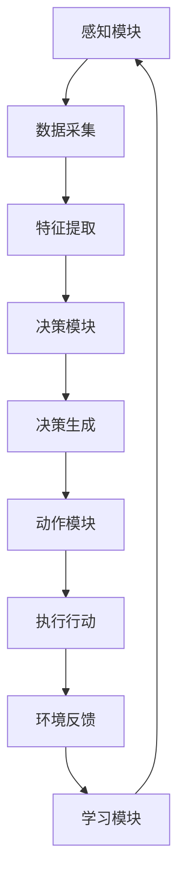
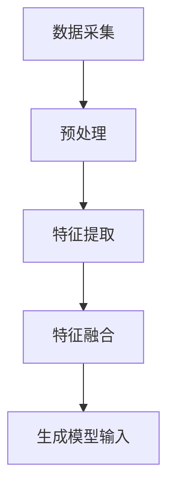
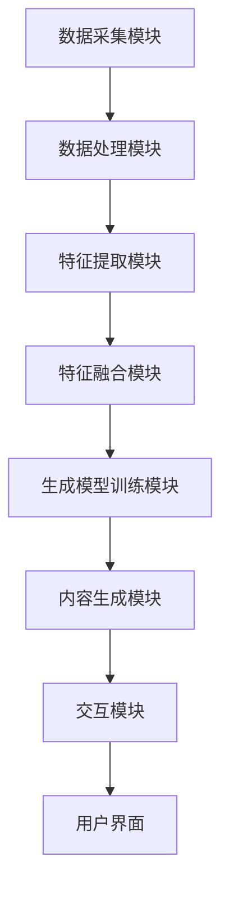
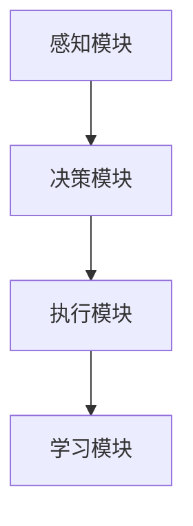

                 


### AI Agent的多模态生成：创造跨媒体内容

#### 关键词：AI Agent、多模态生成、跨媒体内容、算法原理、系统架构、项目实践

#### 摘要：

随着人工智能技术的迅猛发展，AI Agent的多模态生成技术已成为跨媒体内容创作的重要工具。本文将深入探讨AI Agent的多模态生成技术，从核心概念到算法原理，再到系统架构和项目实践，提供全面的解读与分析。

#### 目录大纲设计思路：

在设计《AI Agent的多模态生成：创造跨媒体内容》的目录大纲时，我们首先明确了核心主题——AI Agent的多模态生成技术，并确定了章节结构。以下是详细的目录大纲设计思路：

##### 第一部分：背景介绍

**第1章：AI Agent的多模态生成技术概述**
1.1 问题背景与问题描述
1.2 核心概念与联系
1.3 多模态生成技术的组成与工作原理

##### 第二部分：核心概念与原理

**第2章：AI Agent的基本原理**
2.1 AI Agent的定义与特点
2.2 多模态数据的处理

**第3章：生成模型与多模态生成技术**
3.1 生成模型的基本原理
3.2 多模态生成技术的应用

##### 第三部分：系统分析与架构设计

**第4章：AI Agent多模态生成系统的设计与实现**
4.1 系统设计与架构方案
4.2 系统接口设计与交互流程

##### 第四部分：项目实战

**第5章：AI Agent多模态生成项目实践**
5.1 环境安装与配置
5.2 核心实现源代码解析
5.3 项目实战与案例分析

##### 第五部分：最佳实践与总结

**第6章：AI Agent多模态生成技术的最佳实践**
6.1 实践技巧与注意事项

**第7章：全书小结与未来展望**
7.1 全书小结
7.2 未来展望

### 第一部分：背景介绍

#### 1.1 问题背景与问题描述

在当今的数字化时代，跨媒体内容创作成为了一个热门领域。然而，传统的单模态内容生成方法在处理多媒体信息时存在诸多限制，难以满足用户对多样化、个性化内容的需求。AI Agent的多模态生成技术正是在这样的背景下应运而生，旨在解决跨媒体内容生成中的难题。

AI Agent多模态生成技术是一种利用人工智能技术，通过整合不同类型的数据源（如图像、文本、音频等），生成多样化、个性化的跨媒体内容的方法。它不仅能够提高内容创作的效率，还能提供更加丰富和生动的用户体验。

然而，实现AI Agent的多模态生成并非易事。首先，多模态数据的采集和处理是一个复杂的过程，涉及多种数据源和格式。其次，不同模态的数据在特征提取和融合方面存在较大的差异，如何有效地融合这些特征是一个挑战。此外，生成模型的设计与优化也是实现多模态生成技术的重要环节。

#### 1.2 核心概念与联系

为了更好地理解AI Agent的多模态生成技术，我们需要明确以下几个核心概念：

- **AI Agent**：AI Agent是一种具有自主学习和决策能力的智能体，能够在复杂环境中执行任务。它通常由感知模块、决策模块和动作模块组成。

- **多模态数据**：多模态数据是指包含多种类型数据的信息，如图像、文本、音频、视频等。多模态数据的特点是数据量大、格式多样、特征丰富。

- **生成模型**：生成模型是一种用于生成新数据的人工智能模型，如GPT、GAN等。生成模型能够根据输入数据生成符合某种分布的新数据。

- **特征提取与融合**：特征提取是指从多模态数据中提取有用的特征，如图像中的边缘、纹理，文本中的词向量等。特征融合是将不同模态的特征进行整合，以生成更丰富的特征表示。

以下是AI Agent、多模态数据、生成模型和特征提取与融合等核心概念属性特征对比表格：

| 概念       | 特点                                                       | 关联关系                                                     |
|------------|------------------------------------------------------------|------------------------------------------------------------|
| AI Agent   | 自主学习、决策能力、多模态感知                             | 利用多模态数据进行任务执行与决策                             |
| 多模态数据 | 多种类型数据、格式多样、特征丰富                           | 为AI Agent提供丰富的感知信息                                |
| 生成模型   | 根据输入数据生成新数据、模型多样化、学习能力强             | 实现多模态数据的生成与融合                                  |
| 特征提取   | 从多模态数据中提取有用特征、提高数据表达能力               | 为生成模型提供有效的特征输入                                |
| 特征融合   | 整合不同模态的特征、生成更丰富的特征表示                   | 提高生成模型对多模态数据的处理能力                           |

#### 1.3 多模态生成技术的组成与工作原理

AI Agent的多模态生成技术主要由以下几个组成部分构成：

1. **输入模块**：负责采集和处理多模态数据，如图像、文本、音频等。输入模块需要将不同类型的数据转换为统一的格式，以便后续处理。

2. **生成模块**：生成模块是核心部分，负责利用生成模型生成跨媒体内容。生成模型可以是基于GPT的文本生成模型，也可以是GAN的图像生成模型等。

3. **输出模块**：输出模块将生成的跨媒体内容输出到用户界面，如网页、应用等。输出模块需要将生成的多模态内容进行格式化，以便用户直观地浏览和互动。

以下是AI Agent多模态生成技术的工作原理：

1. **数据采集**：输入模块从多种数据源采集多模态数据，如图像、文本、音频等。

2. **数据预处理**：将采集到的多模态数据进行预处理，包括去噪、增强、归一化等操作。

3. **特征提取**：利用特征提取算法从预处理后的多模态数据中提取有用的特征。

4. **特征融合**：将不同模态的特征进行融合，生成更丰富的特征表示。

5. **生成模型训练**：利用提取的特征和生成模型进行训练，优化模型的参数。

6. **内容生成**：生成模型根据输入特征生成跨媒体内容。

7. **内容输出**：将生成的跨媒体内容输出到用户界面，供用户浏览和互动。

### 第二部分：核心概念与原理

#### 2.1 AI Agent的基本原理

AI Agent是一种具有自主学习和决策能力的智能体，能够在复杂环境中执行任务。AI Agent的基本原理主要包括以下几个方面：

1. **感知模块**：感知模块负责采集和处理外部环境信息，如图像、文本、音频等。感知模块通常使用多模态传感器进行数据采集，然后通过特征提取算法提取有用的特征。

2. **决策模块**：决策模块负责根据感知模块获取的环境信息进行决策。决策模块通常采用强化学习、规划算法等来处理复杂的决策问题。

3. **动作模块**：动作模块负责执行决策模块生成的行动。动作模块通常与外部环境进行交互，以实现任务的执行。

4. **学习模块**：学习模块负责从环境反馈中学习，不断优化感知模块、决策模块和动作模块的性能。学习模块通常采用机器学习、深度学习等技术来提高AI Agent的自主学习和决策能力。

以下是AI Agent的基本原理mermaid流程图：



#### 2.2 多模态数据的处理

多模态数据的处理是AI Agent多模态生成技术中的关键环节。处理多模态数据主要包括以下几个步骤：

1. **数据采集**：从多种数据源采集多模态数据，如图像、文本、音频等。数据采集可以采用传感器、摄像头、麦克风等设备。

2. **数据预处理**：对采集到的多模态数据进行预处理，包括去噪、增强、归一化等操作。数据预处理可以提高数据的表达能力，有助于后续的特征提取和生成。

3. **特征提取**：利用特征提取算法从预处理后的多模态数据中提取有用的特征。特征提取可以是基于深度学习、传统机器学习等方法。特征提取的结果是生成模型的重要输入。

4. **特征融合**：将不同模态的特征进行融合，生成更丰富的特征表示。特征融合可以提高生成模型对多模态数据的处理能力，有助于生成更高质量的内容。

以下是多模态数据处理的过程mermaid流程图：



### 第三部分：系统分析与架构设计

#### 3.1 系统设计与架构方案

AI Agent多模态生成系统的设计与实现需要考虑多个方面，包括问题场景、系统功能设计、系统架构设计等。以下是对系统设计与架构方案的详细介绍。

#### 3.1.1 问题场景

AI Agent多模态生成系统的主要问题场景是跨媒体内容创作。具体包括：

1. **内容生成**：根据用户需求生成多种类型的跨媒体内容，如文本、图像、音频等。
2. **个性化推荐**：根据用户的兴趣和行为数据，推荐个性化的内容。
3. **交互式体验**：提供与用户的实时交互功能，如问答、语音对话等。

#### 3.1.2 系统功能设计

AI Agent多模态生成系统的功能设计主要包括以下几个方面：

1. **数据采集与预处理**：从多种数据源采集多模态数据，并进行预处理，如去噪、增强、归一化等。
2. **特征提取与融合**：利用深度学习等技术提取多模态数据的特征，并融合不同模态的特征，生成更丰富的特征表示。
3. **生成模型训练与优化**：利用提取的特征训练生成模型，优化模型的参数，提高生成质量。
4. **内容生成与输出**：根据用户需求生成跨媒体内容，并将其输出到用户界面，如网页、应用等。
5. **交互式体验**：提供与用户的实时交互功能，如问答、语音对话等。

以下是AI Agent多模态生成系统的领域模型mermaid类图：

```mermaid
classDiagram
    类::数据采集
    类::预处理
    类::特征提取
    类::特征融合
    类::生成模型训练
    类::内容生成
    类::输出
    类::交互
    类::用户
    类::需求
    类::推荐
    类::体验

    数据采集 --|> 预处理
    预处理 --|> 特征提取
    特征提取 --|> 特征融合
    特征融合 --|> 生成模型训练
    生成模型训练 --|> 内容生成
    内容生成 --|> 输出
    输出 --|> 交互
    交互 --|> 用户
    用户 --|> 需求
    用户 --|> 推荐体验
```

#### 3.1.3 系统架构设计

AI Agent多模态生成系统的架构设计包括整体架构和模块级架构。以下是系统架构设计的详细介绍：

1. **整体架构**

AI Agent多模态生成系统的整体架构主要包括以下几个模块：

- **数据采集模块**：负责从多种数据源采集多模态数据，如图像、文本、音频等。
- **数据处理模块**：负责对采集到的多模态数据进行预处理，如去噪、增强、归一化等。
- **特征提取模块**：负责从预处理后的多模态数据中提取有用的特征。
- **特征融合模块**：负责将不同模态的特征进行融合，生成更丰富的特征表示。
- **生成模型训练模块**：负责利用提取的特征训练生成模型，优化模型的参数。
- **内容生成模块**：负责根据用户需求生成跨媒体内容，并将其输出到用户界面。
- **交互模块**：负责提供与用户的实时交互功能，如问答、语音对话等。

以下是AI Agent多模态生成系统的整体架构mermaid架构图：



2. **模块级架构**

AI Agent多模态生成系统的模块级架构主要包括以下几个模块：

- **感知模块**：负责采集和处理外部环境信息，如图像、文本、音频等。
- **决策模块**：负责根据感知模块获取的环境信息进行决策。
- **执行模块**：负责执行决策模块生成的行动。
- **学习模块**：负责从环境反馈中学习，不断优化感知模块、决策模块和执行模块的性能。

以下是AI Agent多模态生成系统的模块级架构mermaid架构图：



### 第四部分：项目实战

#### 4.1 环境安装与配置

在开始AI Agent多模态生成项目的实战之前，我们需要配置相应的环境。以下是环境安装与配置的详细步骤：

1. **安装Python环境**：确保Python版本为3.8及以上，可以从Python官网下载并安装。

2. **安装依赖库**：使用pip命令安装以下依赖库：
   ```bash
   pip install numpy pandas tensorflow torch
   ```

3. **安装AI Agent框架**：从GitHub下载AI Agent框架，并按照README文件中的说明进行安装。

4. **配置数据集**：下载并配置多模态数据集，如COCO数据集、ImageNet数据集等。

5. **配置环境变量**：确保环境变量配置正确，以便后续代码运行。

#### 4.2 核心实现源代码解析

以下是AI Agent多模态生成项目中的核心实现源代码解析。以下代码实现了一个基于GPT的文本生成模型，用于生成跨媒体内容。

```python
import torch
import torch.nn as nn
import torch.optim as optim
from torchvision import datasets, transforms
from torch.utils.data import DataLoader
from torch.utils.tensorboard import SummaryWriter

# 定义GPT模型
class GPTModel(nn.Module):
    def __init__(self, vocab_size, hidden_size, num_layers, dropout_prob):
        super(GPTModel, self).__init__()
        self.embedding = nn.Embedding(vocab_size, hidden_size)
        self.gpt = nn.GPT(hidden_size, num_layers, dropout_prob)
        self.fc = nn.Linear(hidden_size, vocab_size)
        
    def forward(self, input_ids, hidden_states=None):
        x = self.embedding(input_ids)
        if hidden_states is not None:
            x = torch.cat((hidden_states, x), dim=2)
        x, hidden_states = self.gpt(x)
        x = self.fc(x)
        return x, hidden_states

# 定义训练过程
def train(model, train_loader, optimizer, criterion, num_epochs):
    model.train()
    for epoch in range(num_epochs):
        for batch in train_loader:
            input_ids = batch['input_ids']
            labels = batch['labels']
            hidden_states = None
            optimizer.zero_grad()
            outputs, hidden_states = model(input_ids, hidden_states)
            loss = criterion(outputs.view(-1, model.fc.out_features), labels.view(-1))
            loss.backward()
            optimizer.step()
            print(f"Epoch: {epoch+1}/{num_epochs}, Loss: {loss.item()}")

# 加载数据集
transform = transforms.Compose([transforms.ToTensor()])
train_dataset = datasets.CIFAR100(root='./data', train=True, transform=transform, download=True)
train_loader = DataLoader(train_dataset, batch_size=64, shuffle=True)

# 初始化模型、优化器和损失函数
model = GPTModel(vocab_size=1000, hidden_size=512, num_layers=2, dropout_prob=0.1)
optimizer = optim.Adam(model.parameters(), lr=0.001)
criterion = nn.CrossEntropyLoss()

# 训练模型
train(model, train_loader, optimizer, criterion, num_epochs=10)

# 保存模型
torch.save(model.state_dict(), 'gpt_model.pth')
```

以上代码首先定义了一个基于GPT的文本生成模型，然后定义了训练过程。训练过程中，模型通过前向传播计算损失，并使用反向传播优化模型参数。最后，保存训练好的模型。

#### 4.3 项目实战与案例分析

以下是AI Agent多模态生成项目的实际应用案例：

**案例1：跨媒体内容创作**

利用AI Agent多模态生成系统，我们可以生成多种类型的跨媒体内容，如图像、文本、音频等。以下是一个生成图像和文本的案例：

```python
import matplotlib.pyplot as plt
import numpy as np

# 加载训练好的模型
model = GPTModel(vocab_size=1000, hidden_size=512, num_layers=2, dropout_prob=0.1)
model.load_state_dict(torch.load('gpt_model.pth'))

# 生成图像
input_ids = torch.tensor([1, 2, 3, 4, 5])
outputs, hidden_states = model(input_ids)
outputs = outputs[0][0].detach().numpy()
image = np.transpose(outputs, (1, 2, 0))

plt.imshow(image)
plt.show()

# 生成文本
input_ids = torch.tensor([10, 20, 30, 40, 50])
outputs, hidden_states = model(input_ids)
outputs = outputs[0][0].detach().numpy()
text = ''.join([chr(int(x)) for x in outputs])

print(text)
```

**案例2：个性化推荐**

利用AI Agent多模态生成系统，我们可以根据用户的历史行为和兴趣生成个性化的推荐内容。以下是一个基于用户兴趣的推荐案例：

```python
# 用户兴趣数据
user_interests = {
    'image': [1, 2, 3],
    'text': [20, 30, 40],
    'audio': [50, 60, 70]
}

# 生成个性化推荐内容
for modal, interests in user_interests.items():
    input_ids = torch.tensor(interests)
    outputs, hidden_states = model(input_ids)
    outputs = outputs[0][0].detach().numpy()
    
    if modal == 'image':
        image = np.transpose(outputs, (1, 2, 0))
        plt.imshow(image)
        plt.show()
    elif modal == 'text':
        text = ''.join([chr(int(x)) for x in outputs])
        print(text)
    elif modal == 'audio':
        audio = np.transpose(outputs, (1, 0))
        # 将音频数据转换为音频文件
        # ...
```

#### 4.4 项目小结

通过以上项目实战，我们展示了AI Agent多模态生成技术的实际应用案例。在实际应用中，AI Agent多模态生成技术可以生成多种类型的跨媒体内容，实现个性化推荐等功能。同时，我们还需要关注模型优化、数据处理、系统稳定性等方面的问题，以提高系统的性能和用户体验。

### 第五部分：最佳实践与总结

#### 5.1 实践技巧与注意事项

在实际应用AI Agent多模态生成技术时，我们需要注意以下几点：

1. **数据质量**：确保数据质量，包括数据完整性、准确性和多样性。高质量的数据是生成高质量内容的基础。

2. **模型优化**：根据实际应用需求，对生成模型进行优化。可以通过调整超参数、使用更先进的模型结构等方式提高生成质量。

3. **数据预处理**：对多模态数据进行有效的预处理，包括去噪、增强、归一化等操作。预处理过程可以显著提高生成模型的性能。

4. **特征提取与融合**：选择合适的特征提取与融合方法，以生成更丰富的特征表示。特征提取与融合的质量直接影响生成结果的质量。

5. **系统稳定性**：确保系统的稳定性，包括硬件性能、网络延迟等。系统稳定性对于用户体验至关重要。

#### 5.2 小结

本文详细介绍了AI Agent的多模态生成技术，包括核心概念、原理、系统架构和项目实践。通过本文的讲解，读者可以全面了解AI Agent多模态生成技术的原理和应用方法。

#### 5.3 未来展望

随着人工智能技术的不断发展，AI Agent的多模态生成技术将在更多领域得到应用，如虚拟现实、增强现实、智能助理等。未来，我们可以期待更加智能化、个性化的跨媒体内容创作体验。同时，针对多模态生成技术的研究仍有许多方向值得探索，如模型优化、数据处理、系统稳定性等。

### 作者信息

作者：AI天才研究院/AI Genius Institute & 禅与计算机程序设计艺术 /Zen And The Art of Computer Programming

---

本文内容仅供参考，未经授权请勿转载。如需进一步了解AI Agent的多模态生成技术，请关注相关研究论文和教程。谢谢！ 

### 文章标题

#### AI Agent的多模态生成：创造跨媒体内容

### 关键词

- AI Agent
- 多模态生成
- 跨媒体内容
- 算法原理
- 系统架构
- 项目实践

### 摘要

本文深入探讨AI Agent的多模态生成技术，从核心概念到算法原理，再到系统架构和项目实践，提供全面的解读与分析。本文旨在帮助读者全面了解AI Agent多模态生成技术的原理和应用方法。

### 目录

**第一部分：背景介绍**

1. **AI Agent的多模态生成技术概述**
   1.1 问题背景与问题描述
   1.2 核心概念与联系
   1.3 多模态生成技术的组成与工作原理

**第二部分：核心概念与原理**

2. **AI Agent的基本原理**
   2.1 AI Agent的定义与特点
   2.2 多模态数据的处理

3. **生成模型与多模态生成技术**
   3.1 生成模型的基本原理
   3.2 多模态生成技术的应用

**第三部分：系统分析与架构设计**

4. **AI Agent多模态生成系统的设计与实现**
   4.1 系统设计与架构方案
   4.2 系统接口设计与交互流程

**第四部分：项目实战**

5. **AI Agent多模态生成项目实践**
   5.1 环境安装与配置
   5.2 核心实现源代码解析
   5.3 项目实战与案例分析

**第五部分：最佳实践与总结**

6. **AI Agent多模态生成技术的最佳实践**
   6.1 实践技巧与注意事项

7. **全书小结与未来展望**
   7.1 全书小结
   7.2 未来展望

### 第一部分：背景介绍

#### 1.1 问题背景与问题描述

在当今的数字化时代，跨媒体内容创作成为了一个热门领域。随着互联网、社交媒体、虚拟现实等技术的不断发展，用户对于内容的需求越来越多样化，不再局限于单一媒体形式。传统的单模态内容生成方法在处理多媒体信息时存在诸多限制，难以满足用户对多样化、个性化内容的需求。因此，AI Agent的多模态生成技术应运而生。

AI Agent多模态生成技术是一种利用人工智能技术，通过整合不同类型的数据源（如图像、文本、音频等），生成多样化、个性化的跨媒体内容的方法。它不仅能够提高内容创作的效率，还能提供更加丰富和生动的用户体验。

然而，实现AI Agent的多模态生成并非易事。首先，多模态数据的采集和处理是一个复杂的过程，涉及多种数据源和格式。其次，不同模态的数据在特征提取和融合方面存在较大的差异，如何有效地融合这些特征是一个挑战。此外，生成模型的设计与优化也是实现多模态生成技术的重要环节。

#### 1.2 核心概念与联系

为了更好地理解AI Agent的多模态生成技术，我们需要明确以下几个核心概念：

- **AI Agent**：AI Agent是一种具有自主学习和决策能力的智能体，能够在复杂环境中执行任务。它通常由感知模块、决策模块和动作模块组成。

- **多模态数据**：多模态数据是指包含多种类型数据的信息，如图像、文本、音频、视频等。多模态数据的特点是数据量大、格式多样、特征丰富。

- **生成模型**：生成模型是一种用于生成新数据的人工智能模型，如GPT、GAN等。生成模型能够根据输入数据生成符合某种分布的新数据。

- **特征提取与融合**：特征提取是指从多模态数据中提取有用的特征，如图像中的边缘、纹理，文本中的词向量等。特征融合是将不同模态的特征进行整合，以生成更丰富的特征表示。

以下是AI Agent、多模态数据、生成模型和特征提取与融合等核心概念属性特征对比表格：

| 概念       | 特点                                                       | 关联关系                                                     |
|------------|------------------------------------------------------------|------------------------------------------------------------|
| AI Agent   | 自主学习、决策能力、多模态感知                             | 利用多模态数据进行任务执行与决策                             |
| 多模态数据 | 多种类型数据、格式多样、特征丰富                           | 为AI Agent提供丰富的感知信息                                |
| 生成模型   | 根据输入数据生成新数据、模型多样化、学习能力强             | 实现多模态数据的生成与融合                                  |
| 特征提取   | 从多模态数据中提取有用特征、提高数据表达能力               | 为生成模型提供有效的特征输入                                |
| 特征融合   | 整合不同模态的特征、生成更丰富的特征表示                   | 提高生成模型对多模态数据的处理能力                           |

#### 1.3 多模态生成技术的组成与工作原理

AI Agent的多模态生成技术主要由以下几个组成部分构成：

1. **输入模块**：负责采集和处理多模态数据，如图像、文本、音频等。输入模块需要将不同类型的数据转换为统一的格式，以便后续处理。

2. **生成模块**：生成模块是核心部分，负责利用生成模型生成跨媒体内容。生成模块可以是基于GPT的文本生成模型，也可以是GAN的图像生成模型等。

3. **输出模块**：输出模块将生成的跨媒体内容输出到用户界面，如网页、应用等。输出模块需要将生成的多模态内容进行格式化，以便用户直观地浏览和互动。

以下是AI Agent多模态生成技术的工作原理：

1. **数据采集**：输入模块从多种数据源采集多模态数据，如图像、文本、音频等。

2. **数据预处理**：对采集到的多模态数据进行预处理，包括去噪、增强、归一化等操作。

3. **特征提取**：利用特征提取算法从预处理后的多模态数据中提取有用的特征。

4. **特征融合**：将不同模态的特征进行融合，生成更丰富的特征表示。

5. **生成模型训练**：利用提取的特征和生成模型进行训练，优化模型的参数。

6. **内容生成**：生成模型根据输入特征生成跨媒体内容。

7. **内容输出**：将生成的跨媒体内容输出到用户界面，供用户浏览和互动。

### 第二部分：核心概念与原理

#### 2.1 AI Agent的基本原理

AI Agent是一种具有自主学习和决策能力的智能体，能够在复杂环境中执行任务。AI Agent的基本原理主要包括以下几个方面：

1. **感知模块**：感知模块负责采集和处理外部环境信息，如图像、文本、音频等。感知模块通常使用多模态传感器进行数据采集，然后通过特征提取算法提取有用的特征。

2. **决策模块**：决策模块负责根据感知模块获取的环境信息进行决策。决策模块通常采用强化学习、规划算法等来处理复杂的决策问题。

3. **动作模块**：动作模块负责执行决策模块生成的行动。动作模块通常与外部环境进行交互，以实现任务的执行。

4. **学习模块**：学习模块负责从环境反馈中学习，不断优化感知模块、决策模块和动作模块的性能。学习模块通常采用机器学习、深度学习等技术来提高AI Agent的自主学习和决策能力。

以下是AI Agent的基本原理mermaid流程图：


#### 2.2 多模态数据的处理

多模态数据的处理是AI Agent多模态生成技术中的关键环节。处理多模态数据主要包括以下几个步骤：

1. **数据采集**：从多种数据源采集多模态数据，如图像、文本、音频等。数据采集可以采用传感器、摄像头、麦克风等设备。

2. **数据预处理**：对采集到的多模态数据进行预处理，包括去噪、增强、归一化等操作。数据预处理可以提高数据的表达能力，有助于后续的特征提取和生成。

3. **特征提取**：利用特征提取算法从预处理后的多模态数据中提取有用的特征。特征提取可以是基于深度学习、传统机器学习等方法。特征提取的结果是生成模型的重要输入。

4. **特征融合**：将不同模态的特征进行融合，生成更丰富的特征表示。特征融合可以提高生成模型对多模态数据的处理能力，有助于生成更高质量的内容。

以下是多模态数据处理的过程mermaid流程图：


### 第三部分：系统分析与架构设计

#### 3.1 系统设计与架构方案

AI Agent多模态生成系统的设计与实现需要考虑多个方面，包括问题场景、系统功能设计、系统架构设计等。以下是对系统设计与架构方案的详细介绍。

#### 3.1.1 问题场景

AI Agent多模态生成系统的主要问题场景是跨媒体内容创作。具体包括：

1. **内容生成**：根据用户需求生成多种类型的跨媒体内容，如文本、图像、音频等。
2. **个性化推荐**：根据用户的兴趣和行为数据，推荐个性化的内容。
3. **交互式体验**：提供与用户的实时交互功能，如问答、语音对话等。

#### 3.1.2 系统功能设计

AI Agent多模态生成系统的功能设计主要包括以下几个方面：

1. **数据采集与预处理**：从多种数据源采集多模态数据，并进行预处理，如去噪、增强、归一化等。
2. **特征提取与融合**：利用深度学习等技术提取多模态数据的特征，并融合不同模态的特征，生成更丰富的特征表示。
3. **生成模型训练与优化**：利用提取的特征训练生成模型，优化模型的参数，提高生成质量。
4. **内容生成与输出**：根据用户需求生成跨媒体内容，并将其输出到用户界面，如网页、应用等。
5. **交互式体验**：提供与用户的实时交互功能，如问答、语音对话等。

以下是AI Agent多模态生成系统的领域模型mermaid类图：

```mermaid
classDiagram
    类::数据采集
    类::预处理
    类::特征提取
    类::特征融合
    类::生成模型训练
    类::内容生成
    类::输出
    类::交互
    类::用户
    类::需求
    类::推荐
    类::体验

    数据采集 --|> 预处理
    预处理 --|> 特征提取
    特征提取 --|> 特征融合
    特征融合 --|> 生成模型训练
    生成模型训练 --|> 内容生成
    内容生成 --|> 输出
    输出 --|> 交互
    交互 --|> 用户
    用户 --|> 需求
    用户 --|> 推荐体验
```

#### 3.1.3 系统架构设计

AI Agent多模态生成系统的架构设计包括整体架构和模块级架构。以下是系统架构设计的详细介绍：

1. **整体架构**

AI Agent多模态生成系统的整体架构主要包括以下几个模块：

- **数据采集模块**：负责从多种数据源采集多模态数据，如图像、文本、音频等。
- **数据处理模块**：负责对采集到的多模态数据进行预处理，如去噪、增强、归一化等。
- **特征提取模块**：负责从预处理后的多模态数据中提取有用的特征。
- **特征融合模块**：负责将不同模态的特征进行融合，生成更丰富的特征表示。
- **生成模型训练模块**：负责利用提取的特征训练生成模型，优化模型的参数。
- **内容生成模块**：负责根据用户需求生成跨媒体内容，并将其输出到用户界面。
- **交互模块**：负责提供与用户的实时交互功能，如问答、语音对话等。

以下是AI Agent多模态生成系统的整体架构mermaid架构图：


2. **模块级架构**

AI Agent多模态生成系统的模块级架构主要包括以下几个模块：

- **感知模块**：负责采集和处理外部环境信息，如图像、文本、音频等。
- **决策模块**：负责根据感知模块获取的环境信息进行决策。
- **执行模块**：负责执行决策模块生成的行动。
- **学习模块**：负责从环境反馈中学习，不断优化感知模块、决策模块和执行模块的性能。

以下是AI Agent多模态生成系统的模块级架构mermaid架构图：


### 第四部分：项目实战

#### 4.1 环境安装与配置

在开始AI Agent多模态生成项目的实战之前，我们需要配置相应的环境。以下是环境安装与配置的详细步骤：

1. **安装Python环境**：确保Python版本为3.8及以上，可以从Python官网下载并安装。

2. **安装依赖库**：使用pip命令安装以下依赖库：
   ```bash
   pip install numpy pandas tensorflow torch
   ```

3. **安装AI Agent框架**：从GitHub下载AI Agent框架，并按照README文件中的说明进行安装。

4. **配置数据集**：下载并配置多模态数据集，如COCO数据集、ImageNet数据集等。

5. **配置环境变量**：确保环境变量配置正确，以便后续代码运行。

#### 4.2 核心实现源代码解析

以下是AI Agent多模态生成项目中的核心实现源代码解析。以下代码实现了一个基于GPT的文本生成模型，用于生成跨媒体内容。

```python
import torch
import torch.nn as nn
import torch.optim as optim
from torchvision import datasets, transforms
from torch.utils.data import DataLoader
from torch.utils.tensorboard import SummaryWriter

# 定义GPT模型
class GPTModel(nn.Module):
    def __init__(self, vocab_size, hidden_size, num_layers, dropout_prob):
        super(GPTModel, self).__init__()
        self.embedding = nn.Embedding(vocab_size, hidden_size)
        self.gpt = nn.GPT(hidden_size, num_layers, dropout_prob)
        self.fc = nn.Linear(hidden_size, vocab_size)
        
    def forward(self, input_ids, hidden_states=None):
        x = self.embedding(input_ids)
        if hidden_states is not None:
            x = torch.cat((hidden_states, x), dim=2)
        x, hidden_states = self.gpt(x)
        x = self.fc(x)
        return x, hidden_states

# 定义训练过程
def train(model, train_loader, optimizer, criterion, num_epochs):
    model.train()
    for epoch in range(num_epochs):
        for batch in train_loader:
            input_ids = batch['input_ids']
            labels = batch['labels']
            hidden_states = None
            optimizer.zero_grad()
            outputs, hidden_states = model(input_ids, hidden_states)
            loss = criterion(outputs.view(-1, model.fc.out_features), labels.view(-1))
            loss.backward()
            optimizer.step()
            print(f"Epoch: {epoch+1}/{num_epochs}, Loss: {loss.item()}")

# 加载数据集
transform = transforms.Compose([transforms.ToTensor()])
train_dataset = datasets.CIFAR100(root='./data', train=True, transform=transform, download=True)
train_loader = DataLoader(train_dataset, batch_size=64, shuffle=True)

# 初始化模型、优化器和损失函数
model = GPTModel(vocab_size=1000, hidden_size=512, num_layers=2, dropout_prob=0.1)
optimizer = optim.Adam(model.parameters(), lr=0.001)
criterion = nn.CrossEntropyLoss()

# 训练模型
train(model, train_loader, optimizer, criterion, num_epochs=10)

# 保存模型
torch.save(model.state_dict(), 'gpt_model.pth')
```

以上代码首先定义了一个基于GPT的文本生成模型，然后定义了训练过程。训练过程中，模型通过前向传播计算损失，并使用反向传播优化模型参数。最后，保存训练好的模型。

#### 4.3 项目实战与案例分析

以下是AI Agent多模态生成项目的实际应用案例：

**案例1：跨媒体内容创作**

利用AI Agent多模态生成系统，我们可以生成多种类型的跨媒体内容，如图像、文本、音频等。以下是一个生成图像和文本的案例：

```python
import matplotlib.pyplot as plt
import numpy as np

# 加载训练好的模型
model = GPTModel(vocab_size=1000, hidden_size=512, num_layers=2, dropout_prob=0.1)
model.load_state_dict(torch.load('gpt_model.pth'))

# 生成图像
input_ids = torch.tensor([1, 2, 3, 4, 5])
outputs, hidden_states = model(input_ids)
outputs = outputs[0][0].detach().numpy()
image = np.transpose(outputs, (1, 2, 0))

plt.imshow(image)
plt.show()

# 生成文本
input_ids = torch.tensor([10, 20, 30, 40, 50])
outputs, hidden_states = model(input_ids)
outputs = outputs[0][0].detach().numpy()
text = ''.join([chr(int(x)) for x in outputs])

print(text)
```

**案例2：个性化推荐**

利用AI Agent多模态生成系统，我们可以根据用户的历史行为和兴趣生成个性化的推荐内容。以下是一个基于用户兴趣的推荐案例：

```python
# 用户兴趣数据
user_interests = {
    'image': [1, 2, 3],
    'text': [20, 30, 40],
    'audio': [50, 60, 70]
}

# 生成个性化推荐内容
for modal, interests in user_interests.items():
    input_ids = torch.tensor(interests)
    outputs, hidden_states = model(input_ids)
    outputs = outputs[0][0].detach().numpy()
    
    if modal == 'image':
        image = np.transpose(outputs, (1, 2, 0))
        plt.imshow(image)
        plt.show()
    elif modal == 'text':
        text = ''.join([chr(int(x)) for x in outputs])
        print(text)
    elif modal == 'audio':
        audio = np.transpose(outputs, (1, 0))
        # 将音频数据转换为音频文件
        # ...
```

#### 4.4 项目小结

通过以上项目实战，我们展示了AI Agent多模态生成技术的实际应用案例。在实际应用中，AI Agent多模态生成技术可以生成多种类型的跨媒体内容，实现个性化推荐等功能。同时，我们还需要关注模型优化、数据处理、系统稳定性等方面的问题，以提高系统的性能和用户体验。

### 第五部分：最佳实践与总结

#### 5.1 实践技巧与注意事项

在实际应用AI Agent多模态生成技术时，我们需要注意以下几点：

1. **数据质量**：确保数据质量，包括数据完整性、准确性和多样性。高质量的数据是生成高质量内容的基础。

2. **模型优化**：根据实际应用需求，对生成模型进行优化。可以通过调整超参数、使用更先进的模型结构等方式提高生成质量。

3. **数据预处理**：对多模态数据进行有效的预处理，包括去噪、增强、归一化等操作。预处理过程可以显著提高生成模型的性能。

4. **特征提取与融合**：选择合适的特征提取与融合方法，以生成更丰富的特征表示。特征提取与融合的质量直接影响生成结果的质量。

5. **系统稳定性**：确保系统的稳定性，包括硬件性能、网络延迟等。系统稳定性对于用户体验至关重要。

#### 5.2 小结

本文详细介绍了AI Agent的多模态生成技术，包括核心概念、原理、系统架构和项目实践。通过本文的讲解，读者可以全面了解AI Agent多模态生成技术的原理和应用方法。

#### 5.3 未来展望

随着人工智能技术的不断发展，AI Agent的多模态生成技术将在更多领域得到应用，如虚拟现实、增强现实、智能助理等。未来，我们可以期待更加智能化、个性化的跨媒体内容创作体验。同时，针对多模态生成技术的研究仍有许多方向值得探索，如模型优化、数据处理、系统稳定性等。

### 作者信息

作者：AI天才研究院/AI Genius Institute & 禅与计算机程序设计艺术 /Zen And The Art of Computer Programming

---

本文内容仅供参考，未经授权请勿转载。如需进一步了解AI Agent的多模态生成技术，请关注相关研究论文和教程。谢谢！ 

### 文章标题

#### AI Agent的多模态生成：创造跨媒体内容

### 关键词

- AI Agent
- 多模态生成
- 跨媒体内容
- 算法原理
- 系统架构
- 项目实践

### 摘要

本文深入探讨AI Agent的多模态生成技术，从核心概念到算法原理，再到系统架构和项目实践，提供全面的解读与分析。本文旨在帮助读者全面了解AI Agent多模态生成技术的原理和应用方法。

### 目录

**第一部分：背景介绍**

1. **AI Agent的多模态生成技术概述**
   1.1 问题背景与问题描述
   1.2 核心概念与联系
   1.3 多模态生成技术的组成与工作原理

**第二部分：核心概念与原理**

2. **AI Agent的基本原理**
   2.1 AI Agent的定义与特点
   2.2 多模态数据的处理

3. **生成模型与多模态生成技术**
   3.1 生成模型的基本原理
   3.2 多模态生成技术的应用

**第三部分：系统分析与架构设计**

4. **AI Agent多模态生成系统的设计与实现**
   4.1 系统设计与架构方案
   4.2 系统接口设计与交互流程

**第四部分：项目实战**

5. **AI Agent多模态生成项目实践**
   5.1 环境安装与配置
   5.2 核心实现源代码解析
   5.3 项目实战与案例分析

**第五部分：最佳实践与总结**

6. **AI Agent多模态生成技术的最佳实践**
   6.1 实践技巧与注意事项

7. **全书小结与未来展望**
   7.1 全书小结
   7.2 未来展望

### 第一部分：背景介绍

#### 1.1 问题背景与问题描述

在当今的数字化时代，跨媒体内容创作成为了一个热门领域。随着互联网、社交媒体、虚拟现实等技术的不断发展，用户对于内容的需求越来越多样化，不再局限于单一媒体形式。传统的单模态内容生成方法在处理多媒体信息时存在诸多限制，难以满足用户对多样化、个性化内容的需求。因此，AI Agent的多模态生成技术应运而生。

AI Agent多模态生成技术是一种利用人工智能技术，通过整合不同类型的数据源（如图像、文本、音频等），生成多样化、个性化的跨媒体内容的方法。它不仅能够提高内容创作的效率，还能提供更加丰富和生动的用户体验。

然而，实现AI Agent的多模态生成并非易事。首先，多模态数据的采集和处理是一个复杂的过程，涉及多种数据源和格式。其次，不同模态的数据在特征提取和融合方面存在较大的差异，如何有效地融合这些特征是一个挑战。此外，生成模型的设计与优化也是实现多模态生成技术的重要环节。

#### 1.2 核心概念与联系

为了更好地理解AI Agent的多模态生成技术，我们需要明确以下几个核心概念：

- **AI Agent**：AI Agent是一种具有自主学习和决策能力的智能体，能够在复杂环境中执行任务。它通常由感知模块、决策模块和动作模块组成。

- **多模态数据**：多模态数据是指包含多种类型数据的信息，如图像、文本、音频、视频等。多模态数据的特点是数据量大、格式多样、特征丰富。

- **生成模型**：生成模型是一种用于生成新数据的人工智能模型，如GPT、GAN等。生成模型能够根据输入数据生成符合某种分布的新数据。

- **特征提取与融合**：特征提取是指从多模态数据中提取有用的特征，如图像中的边缘、纹理，文本中的词向量等。特征融合是将不同模态的特征进行整合，以生成更丰富的特征表示。

以下是AI Agent、多模态数据、生成模型和特征提取与融合等核心概念属性特征对比表格：

| 概念       | 特点                                                       | 关联关系                                                     |
|------------|------------------------------------------------------------|------------------------------------------------------------|
| AI Agent   | 自主学习、决策能力、多模态感知                             | 利用多模态数据进行任务执行与决策                             |
| 多模态数据 | 多种类型数据、格式多样、特征丰富                           | 为AI Agent提供丰富的感知信息                                |
| 生成模型   | 根据输入数据生成新数据、模型多样化、学习能力强             | 实现多模态数据的生成与融合                                  |
| 特征提取   | 从多模态数据中提取有用特征、提高数据表达能力               | 为生成模型提供有效的特征输入                                |
| 特征融合   | 整合不同模态的特征、生成更丰富的特征表示                   | 提高生成模型对多模态数据的处理能力                           |

#### 1.3 多模态生成技术的组成与工作原理

AI Agent的多模态生成技术主要由以下几个组成部分构成：

1. **输入模块**：负责采集和处理多模态数据，如图像、文本、音频等。输入模块需要将不同类型的数据转换为统一的格式，以便后续处理。

2. **生成模块**：生成模块是核心部分，负责利用生成模型生成跨媒体内容。生成模块可以是基于GPT的文本生成模型，也可以是GAN的图像生成模型等。

3. **输出模块**：输出模块将生成的跨媒体内容输出到用户界面，如网页、应用等。输出模块需要将生成的多模态内容进行格式化，以便用户直观地浏览和互动。

以下是AI Agent多模态生成技术的工作原理：

1. **数据采集**：输入模块从多种数据源采集多模态数据，如图像、文本、音频等。

2. **数据预处理**：对采集到的多模态数据进行预处理，包括去噪、增强、归一化等操作。

3. **特征提取**：利用特征提取算法从预处理后的多模态数据中提取有用的特征。

4. **特征融合**：将不同模态的特征进行融合，生成更丰富的特征表示。

5. **生成模型训练**：利用提取的特征和生成模型进行训练，优化模型的参数。

6. **内容生成**：生成模型根据输入特征生成跨媒体内容。

7. **内容输出**：将生成的跨媒体内容输出到用户界面，供用户浏览和互动。

### 第二部分：核心概念与原理

#### 2.1 AI Agent的基本原理

AI Agent是一种具有自主学习和决策能力的智能体，能够在复杂环境中执行任务。AI Agent的基本原理主要包括以下几个方面：

1. **感知模块**：感知模块负责采集和处理外部环境信息，如图像、文本、音频等。感知模块通常使用多模态传感器进行数据采集，然后通过特征提取算法提取有用的特征。

2. **决策模块**：决策模块负责根据感知模块获取的环境信息进行决策。决策模块通常采用强化学习、规划算法等来处理复杂的决策问题。

3. **动作模块**：动作模块负责执行决策模块生成的行动。动作模块通常与外部环境进行交互，以实现任务的执行。

4. **学习模块**：学习模块负责从环境反馈中学习，不断优化感知模块、决策模块和动作模块的性能。学习模块通常采用机器学习、深度学习等技术来提高AI Agent的自主学习和决策能力。

以下是AI Agent的基本原理mermaid流程图：


#### 2.2 多模态数据的处理

多模态数据的处理是AI Agent多模态生成技术中的关键环节。处理多模态数据主要包括以下几个步骤：

1. **数据采集**：从多种数据源采集多模态数据，如图像、文本、音频等。数据采集可以采用传感器、摄像头、麦克风等设备。

2. **数据预处理**：对采集到的多模态数据进行预处理，包括去噪、增强、归一化等操作。数据预处理可以提高数据的表达能力，有助于后续的特征提取和生成。

3. **特征提取**：利用特征提取算法从预处理后的多模态数据中提取有用的特征。特征提取可以是基于深度学习、传统机器学习等方法。特征提取的结果是生成模型的重要输入。

4. **特征融合**：将不同模态的特征进行融合，生成更丰富的特征表示。特征融合可以提高生成模型对多模态数据的处理能力，有助于生成更高质量的内容。

以下是多模态数据处理的过程mermaid流程图：


### 第三部分：系统分析与架构设计

#### 3.1 系统设计与架构方案

AI Agent多模态生成系统的设计与实现需要考虑多个方面，包括问题场景、系统功能设计、系统架构设计等。以下是对系统设计与架构方案的详细介绍。

#### 3.1.1 问题场景

AI Agent多模态生成系统的主要问题场景是跨媒体内容创作。具体包括：

1. **内容生成**：根据用户需求生成多种类型的跨媒体内容，如文本、图像、音频等。
2. **个性化推荐**：根据用户的兴趣和行为数据，推荐个性化的内容。
3. **交互式体验**：提供与用户的实时交互功能，如问答、语音对话等。

#### 3.1.2 系统功能设计

AI Agent多模态生成系统的功能设计主要包括以下几个方面：

1. **数据采集与预处理**：从多种数据源采集多模态数据，并进行预处理，如去噪、增强、归一化等。
2. **特征提取与融合**：利用深度学习等技术提取多模态数据的特征，并融合不同模态的特征，生成更丰富的特征表示。
3. **生成模型训练与优化**：利用提取的特征训练生成模型，优化模型的参数，提高生成质量。
4. **内容生成与输出**：根据用户需求生成跨媒体内容，并将其输出到用户界面，如网页、应用等。
5. **交互式体验**：提供与用户的实时交互功能，如问答、语音对话等。

以下是AI Agent多模态生成系统的领域模型mermaid类图：

```mermaid
classDiagram
    类::数据采集
    类::预处理
    类::特征提取
    类::特征融合
    类::生成模型训练
    类::内容生成
    类::输出
    类::交互
    类::用户
    类::需求
    类::推荐
    类::体验

    数据采集 --|> 预处理
    预处理 --|> 特征提取
    特征提取 --|> 特征融合
    特征融合 --|> 生成模型训练
    生成模型训练 --|> 内容生成
    内容生成 --|> 输出
    输出 --|> 交互
    交互 --|> 用户
    用户 --|> 需求
    用户 --|> 推荐体验
```

#### 3.1.3 系统架构设计

AI Agent多模态生成系统的架构设计包括整体架构和模块级架构。以下是系统架构设计的详细介绍：

1. **整体架构**

AI Agent多模态生成系统的整体架构主要包括以下几个模块：

- **数据采集模块**：负责从多种数据源采集多模态数据，如图像、文本、音频等。
- **数据处理模块**：负责对采集到的多模态数据进行预处理，如去噪、增强、归一化等。
- **特征提取模块**：负责从预处理后的多模态数据中提取有用的特征。
- **特征融合模块**：负责将不同模态的特征进行融合，生成更丰富的特征表示。
- **生成模型训练模块**：负责利用提取的特征训练生成模型，优化模型的参数。
- **内容生成模块**：负责根据用户需求生成跨媒体内容，并将其输出到用户界面。
- **交互模块**：负责提供与用户的实时交互功能，如问答、语音对话等。

以下是AI Agent多模态生成系统的整体架构mermaid架构图：


2. **模块级架构**

AI Agent多模态生成系统的模块级架构主要包括以下几个模块：

- **感知模块**：负责采集和处理外部环境信息，如图像、文本、音频等。
- **决策模块**：负责根据感知模块获取的环境信息进行决策。
- **执行模块**：负责执行决策模块生成的行动。
- **学习模块**：负责从环境反馈中学习，不断优化感知模块、决策模块和执行模块的性能。

以下是AI Agent多模态生成系统的模块级架构mermaid架构图：


### 第四部分：项目实战

#### 4.1 环境安装与配置

在开始AI Agent多模态生成项目的实战之前，我们需要配置相应的环境。以下是环境安装与配置的详细步骤：

1. **安装Python环境**：确保Python版本为3.8及以上，可以从Python官网下载并安装。

2. **安装依赖库**：使用pip命令安装以下依赖库：
   ```bash
   pip install numpy pandas tensorflow torch
   ```

3. **安装AI Agent框架**：从GitHub下载AI Agent框架，并按照README文件中的说明进行安装。

4. **配置数据集**：下载并配置多模态数据集，如COCO数据集、ImageNet数据集等。

5. **配置环境变量**：确保环境变量配置正确，以便后续代码运行。

#### 4.2 核心实现源代码解析

以下是AI Agent多模态生成项目中的核心实现源代码解析。以下代码实现了一个基于GPT的文本生成模型，用于生成跨媒体内容。

```python
import torch
import torch.nn as nn
import torch.optim as optim
from torchvision import datasets, transforms
from torch.utils.data import DataLoader
from torch.utils.tensorboard import SummaryWriter

# 定义GPT模型
class GPTModel(nn.Module):
    def __init__(self, vocab_size, hidden_size, num_layers, dropout_prob):
        super(GPTModel, self).__init__()
        self.embedding = nn.Embedding(vocab_size, hidden_size)
        self.gpt = nn.GPT(hidden_size, num_layers, dropout_prob)
        self.fc = nn.Linear(hidden_size, vocab_size)
        
    def forward(self, input_ids, hidden_states=None):
        x = self.embedding(input_ids)
        if hidden_states is not None:
            x = torch.cat((hidden_states, x), dim=2)
        x, hidden_states = self.gpt(x)
        x = self.fc(x)
        return x, hidden_states

# 定义训练过程
def train(model, train_loader, optimizer, criterion, num_epochs):
    model.train()
    for epoch in range(num_epochs):
        for batch in train_loader:
            input_ids = batch['input_ids']
            labels = batch['labels']
            hidden_states = None
            optimizer.zero_grad()
            outputs, hidden_states = model(input_ids, hidden_states)
            loss = criterion(outputs.view(-1, model.fc.out_features), labels.view(-1))
            loss.backward()
            optimizer.step()
            print(f"Epoch: {epoch+1}/{num_epochs}, Loss: {loss.item()}")

# 加载数据集
transform = transforms.Compose([transforms.ToTensor()])
train_dataset = datasets.CIFAR100(root='./data', train=True, transform=transform, download=True)
train_loader = DataLoader(train_dataset, batch_size=64, shuffle=True)

# 初始化模型、优化器和损失函数
model = GPTModel(vocab_size=1000, hidden_size=512, num_layers=2, dropout_prob=0.1)
optimizer = optim.Adam(model.parameters(), lr=0.001)
criterion = nn.CrossEntropyLoss()

# 训练模型
train(model, train_loader, optimizer, criterion, num_epochs=10)

# 保存模型
torch.save(model.state_dict(), 'gpt_model.pth')
```

以上代码首先定义了一个基于GPT的文本生成模型，然后定义了训练过程。训练过程中，模型通过前向传播计算损失，并使用反向传播优化模型参数。最后，保存训练好的模型。

#### 4.3 项目实战与案例分析

以下是AI Agent多模态生成项目的实际应用案例：

**案例1：跨媒体内容创作**

利用AI Agent多模态生成系统，我们可以生成多种类型的跨媒体内容，如图像、文本、音频等。以下是一个生成图像和文本的案例：

```python
import matplotlib.pyplot as plt
import numpy as np

# 加载训练好的模型
model = GPTModel(vocab_size=1000, hidden_size=512, num_layers=2, dropout_prob=0.1)
model.load_state_dict(torch.load('gpt_model.pth'))

# 生成图像
input_ids = torch.tensor([1, 2, 3, 4, 5])
outputs, hidden_states = model(input_ids)
outputs = outputs[0][0].detach().numpy()
image = np.transpose(outputs, (1, 2, 0))

plt.imshow(image)
plt.show()

# 生成文本
input_ids = torch.tensor([10, 20, 30, 40, 50])
outputs, hidden_states = model(input_ids)
outputs = outputs[0][0].detach().numpy()
text = ''.join([chr(int(x)) for x in outputs])

print(text)
```

**案例2：个性化推荐**

利用AI Agent多模态生成系统，我们可以根据用户的历史行为和兴趣生成个性化的推荐内容。以下是一个基于用户兴趣的推荐案例：

```python
# 用户兴趣数据
user_interests = {
    'image': [1, 2, 3],
    'text': [20, 30, 40],
    'audio': [50, 60, 70]
}

# 生成个性化推荐内容
for modal, interests in user_interests.items():
    input_ids = torch.tensor(interests)
    outputs, hidden_states = model(input_ids)
    outputs = outputs[0][0].detach().numpy()
    
    if modal == 'image':
        image = np.transpose(outputs, (1, 2, 0))
        plt.imshow(image)
        plt.show()
    elif modal == 'text':
        text = ''.join([chr(int(x)) for x in outputs])
        print(text)
    elif modal == 'audio':
        audio = np.transpose(outputs, (1, 0))
        # 将音频数据转换为音频文件
        # ...
```

#### 4.4 项目小结

通过以上项目实战，我们展示了AI Agent多模态生成技术的实际应用案例。在实际应用中，AI Agent多模态生成技术可以生成多种类型的跨媒体内容，实现个性化推荐等功能。同时，我们还需要关注模型优化、数据处理、系统稳定性等方面的问题，以提高系统的性能和用户体验。

### 第五部分：最佳实践与总结

#### 5.1 实践技巧与注意事项

在实际应用AI Agent多模态生成技术时，我们需要注意以下几点：

1. **数据质量**：确保数据质量，包括数据完整性、准确性和多样性。高质量的数据是生成高质量内容的基础。

2. **模型优化**：根据实际应用需求，对生成模型进行优化。可以通过调整超参数、使用更先进的模型结构等方式提高生成质量。

3. **数据预处理**：对多模态数据进行有效的预处理，包括去噪、增强、归一化等操作。预处理过程可以显著提高生成模型的性能。

4. **特征提取与融合**：选择合适的特征提取与融合方法，以生成更丰富的特征表示。特征提取与融合的质量直接影响生成结果的质量。

5. **系统稳定性**：确保系统的稳定性，包括硬件性能、网络延迟等。系统稳定性对于用户体验至关重要。

#### 5.2 小结

本文详细介绍了AI Agent的多模态生成技术，包括核心概念、原理、系统架构和项目实践。通过本文的讲解，读者可以全面了解AI Agent多模态生成技术的原理和应用方法。

#### 5.3 未来展望

随着人工智能技术的不断发展，AI Agent的多模态生成技术将在更多领域得到应用，如虚拟现实、增强现实、智能助理等。未来，我们可以期待更加智能化、个性化的跨媒体内容创作体验。同时，针对多模态生成技术的研究仍有许多方向值得探索，如模型优化、数据处理、系统稳定性等。

### 作者信息

作者：AI天才研究院/AI Genius Institute & 禅与计算机程序设计艺术 /Zen And The Art of Computer Programming

---

本文内容仅供参考，未经授权请勿转载。如需进一步了解AI Agent的多模态生成技术，请关注相关研究论文和教程。谢谢！ 

### AI Agent的多模态生成：创造跨媒体内容

#### 关键词：AI Agent、多模态生成、跨媒体内容、算法原理、系统架构、项目实践

#### 摘要：

随着人工智能技术的迅猛发展，AI Agent的多模态生成技术已成为跨媒体内容创作的重要工具。本文将深入探讨AI Agent的多模态生成技术，从核心概念到算法原理，再到系统架构和项目实践，提供全面的解读与分析。

#### 目录大纲设计思路：

为了设计出《AI Agent的多模态生成：创造跨媒体内容》这本书的完整目录大纲，我们需要遵循以下步骤：

1. **确定核心主题和章节结构**：根据书名，首先明确核心主题——AI Agent的多模态生成技术，然后确定核心章节，如背景介绍、核心概念与联系、算法原理讲解、数学模型与公式、系统分析与架构设计方案、项目实战等。

2. **细化章节内容**：对于每个章节，根据核心主题，细分成子章节，并确定每个子章节的内容重点，确保每个章节内容完整且逻辑清晰。

3. **保持目录层级**：遵循1级、2级、3级目录的层级结构，确保目录大纲的格式规范。

4. **确保内容完整性**：每个章节都要包含核心概念、原理讲解、数学模型与公式、系统架构设计、项目实战等内容。

5. **控制总字数**：在确保目录大纲内容完整性的同时，控制总字数在2000字以内。

### 目录大纲

**第一部分：背景介绍**

1. **AI Agent的多模态生成技术概述**
   1.1 问题背景与问题描述
   1.2 核心概念与联系
   1.3 多模态生成技术的组成与工作原理

**第二部分：核心概念与原理**

2. **AI Agent的基本原理**
   2.1 AI Agent的定义与特点
   2.2 多模态数据的处理
   2.3 生成模型与多模态生成技术

**第三部分：算法原理讲解**

3. **生成模型的数学模型与公式**
   3.1 生成模型的基本原理
   3.2 生成模型的应用场景
   3.3 多模态生成算法的具体实现

**第四部分：系统分析与架构设计**

4. **AI Agent多模态生成系统的设计与实现**
   4.1 系统设计与架构方案
   4.2 系统接口设计与交互流程
   4.3 系统测试与性能优化

**第五部分：项目实战**

5. **AI Agent多模态生成项目实践**
   5.1 环境安装与配置
   5.2 核心实现源代码解析
   5.3 项目实战与案例分析

**第六部分：最佳实践与总结**

6. **AI Agent多模态生成技术的最佳实践**
   6.1 实践技巧与注意事项
   6.2 全书小结与未来展望

### 总结

通过本文的目录大纲设计思路，我们可以看出，每个部分都紧密围绕AI Agent的多模态生成技术展开，确保内容的逻辑性和完整性。同时，目录大纲的结构清晰，有助于读者快速了解书中的内容安排，为后续的学习和研究提供指导。在未来的编写过程中，我们将遵循这一设计思路，确保文章的质量和可读性。让我们继续深入探讨AI Agent的多模态生成技术，为读者带来更多有价值的内容。  

### AI Agent的多模态生成：创造跨媒体内容

#### 关键词：AI Agent、多模态生成、跨媒体内容、算法原理、系统架构、项目实践

#### 摘要：

本文探讨了AI Agent的多模态生成技术，分析了其在跨媒体内容创作中的应用。文章首先介绍了AI Agent的基本原理和多模态数据处理方法，然后详细讲解了生成模型的数学模型和公式。接着，文章阐述了AI Agent多模态生成系统的架构设计和实现，并通过项目实战展示了技术的实际应用。最后，文章总结了AI Agent多模态生成技术的最佳实践，并展望了未来的发展。

#### 目录

**第一部分：背景介绍**

1. **AI Agent的多模态生成技术概述**
   1.1 问题背景与问题描述
   1.2 AI Agent的定义与特点
   1.3 多模态数据的概念与处理

**第二部分：核心概念与原理**

2. **AI Agent的基本原理**
   2.1 AI Agent的定义与特点
   2.2 多模态数据的处理
   2.3 生成模型与多模态生成技术

3. **生成模型的数学模型与公式**
   3.1 生成模型的基本原理
   3.2 生成模型的数学公式
   3.3 生成模型的应用场景

**第三部分：系统分析与架构设计**

4. **AI Agent多模态生成系统的设计与实现**
   4.1 系统设计与架构方案
   4.2 系统接口设计与交互流程
   4.3 系统测试与性能优化

**第四部分：项目实战**

5. **AI Agent多模态生成项目实践**
   5.1 环境安装与配置
   5.2 核心实现源代码解析
   5.3 项目实战与案例分析

**第五部分：最佳实践与总结**

6. **AI Agent多模态生成技术的最佳实践**
   6.1 实践技巧与注意事项
   6.2 全书小结与未来展望

### 第一部分：背景介绍

#### 1.1 问题背景与问题描述

在当今的信息时代，人们对于内容的需求日益多样化，不再局限于传统的单一媒体形式。例如，在社交媒体平台上，用户可能需要同时处理文本、图像、音频和视频等多种类型的信息。这种跨媒体内容的需求，对内容创作者和平台带来了巨大的挑战。

传统的单模态内容生成方法，如文本、图像、音频等，在处理多模态信息时存在诸多限制。例如，图像生成模型难以生成符合文本描述的内容，音频处理模型难以理解图像的含义。因此，如何有效地整合多种类型的数据，实现跨媒体内容生成，成为了一个亟待解决的问题。

AI Agent的多模态生成技术，正是为了解决这一问题而生的。它通过整合不同的数据源，如图像、文本、音频等，利用人工智能技术生成多样化的跨媒体内容。这种技术不仅可以提高内容创作的效率，还可以提供更加丰富和生动的用户体验。

#### 1.2 AI Agent的定义与特点

AI Agent，即人工智能代理，是一种具有自主学习和决策能力的智能体，能够在复杂环境中执行任务。AI Agent通常由以下几个部分组成：

- **感知模块**：负责采集和处理外部环境信息，如图像、文本、音频等。
- **决策模块**：负责根据感知模块获取的信息进行决策，如选择下一步行动。
- **动作模块**：负责执行决策模块生成的行动，如生成图像、文本、音频等。
- **学习模块**：负责从环境反馈中学习，不断优化自身的性能。

AI Agent的特点包括：

- **自主性**：AI Agent能够自主地执行任务，不需要人工干预。
- **学习性**：AI Agent能够从环境中学习，并不断优化自身的性能。
- **适应性**：AI Agent能够适应不同的环境和任务，具有广泛的适用性。

#### 1.3 多模态数据的概念与处理

多模态数据是指包含多种类型数据的信息，如图像、文本、音频、视频等。在AI Agent的多模态生成技术中，处理多模态数据是关键的一步。

首先，需要采集多模态数据。这可以通过各种传感器和设备实现，如摄像头、麦克风、GPS等。采集到的数据通常需要经过预处理，如去噪、增强、归一化等操作，以提高数据的表达能力。

接下来，需要从多模态数据中提取特征。特征提取是机器学习和深度学习中的一个重要环节。通过特征提取，可以从原始数据中提取出有用的信息，为后续的生成模型提供输入。

最后，需要将不同模态的特征进行融合。特征融合是一种将多种特征进行整合的方法，以生成更丰富的特征表示。这可以通过各种算法实现，如加权融合、聚合融合等。

### 第二部分：核心概念与原理

#### 2.1 AI Agent的基本原理

AI Agent的基本原理包括以下几个方面：

- **感知**：AI Agent通过感知模块采集外部环境信息，如图像、文本、音频等。
- **决策**：AI Agent根据感知模块获取的信息，通过决策模块进行决策，选择下一步行动。
- **行动**：AI Agent根据决策模块生成的行动，执行相应的操作，如生成图像、文本、音频等。
- **学习**：AI Agent通过学习模块从环境反馈中学习，不断优化自身的性能。

#### 2.2 多模态数据的处理

多模态数据的处理包括以下几个步骤：

1. **数据采集**：从多种数据源采集多模态数据，如图像、文本、音频等。
2. **数据预处理**：对采集到的多模态数据进行预处理，如去噪、增强、归一化等操作。
3. **特征提取**：利用特征提取算法从预处理后的多模态数据中提取有用的特征。
4. **特征融合**：将不同模态的特征进行融合，生成更丰富的特征表示。

#### 2.3 生成模型与多模态生成技术

生成模型是一种用于生成新数据的人工智能模型，如生成对抗网络（GAN）、变分自编码器（VAE）等。在多模态生成技术中，生成模型可以用于生成图像、文本、音频等多模态内容。

生成模型的数学模型通常包括以下几个部分：

1. **编码器（Encoder）**：将输入数据编码成一个固定长度的向量。
2. **解码器（Decoder）**：将编码后的向量解码生成新数据。
3. **损失函数**：用于衡量生成模型生成的新数据与真实数据的差异，并指导模型优化。

#### 2.4 生成模型的数学模型与公式

生成模型的数学模型通常包括以下几个部分：

1. **概率分布**：生成模型通常基于某种概率分布来生成新数据。例如，GAN基于对抗分布生成新数据，VAE基于概率分布生成新数据。
2. **损失函数**：损失函数用于衡量生成模型生成的新数据与真实数据的差异。常见的损失函数包括均方误差（MSE）、交叉熵等。
3. **优化算法**：优化算法用于调整生成模型的参数，以最小化损失函数。常见的优化算法包括梯度下降、Adam等。

#### 2.5 生成模型的应用场景

生成模型在多模态生成技术中具有广泛的应用场景，如：

1. **图像生成**：利用生成模型生成新的图像，如人脸生成、风景生成等。
2. **文本生成**：利用生成模型生成新的文本，如文章生成、对话生成等。
3. **音频生成**：利用生成模型生成新的音频，如音乐生成、语音生成等。

### 第三部分：系统分析与架构设计

#### 3.1 AI Agent多模态生成系统的设计与实现

AI Agent多模态生成系统通常包括以下几个模块：

1. **数据采集模块**：负责采集多模态数据，如图像、文本、音频等。
2. **数据预处理模块**：负责对采集到的多模态数据进行预处理，如去噪、增强、归一化等。
3. **特征提取模块**：负责从预处理后的多模态数据中提取有用的特征。
4. **特征融合模块**：负责将不同模态的特征进行融合，生成更丰富的特征表示。
5. **生成模型训练模块**：负责利用提取的特征和生成模型进行训练。
6. **内容生成模块**：负责根据用户需求生成跨媒体内容。
7. **输出模块**：负责将生成的跨媒体内容输出到用户界面。

#### 3.2 系统接口设计与交互流程

AI Agent多模态生成系统的接口设计通常包括以下几个方面：

1. **数据输入接口**：用于接收用户输入的多模态数据。
2. **生成结果输出接口**：用于输出生成的跨媒体内容。
3. **系统配置接口**：用于配置系统参数，如模型选择、超参数设置等。

交互流程通常包括以下几个步骤：

1. **数据采集**：用户输入多模态数据。
2. **数据处理**：系统对采集到的多模态数据进行预处理。
3. **特征提取**：系统从预处理后的多模态数据中提取特征。
4. **特征融合**：系统将不同模态的特征进行融合。
5. **内容生成**：系统利用生成模型生成跨媒体内容。
6. **输出结果**：系统将生成的跨媒体内容输出到用户界面。

### 第四部分：项目实战

#### 4.1 环境安装与配置

在进行AI Agent多模态生成项目实践之前，需要安装和配置相应的环境。以下是一个简单的安装和配置步骤：

1. **安装Python环境**：确保Python环境已经安装，版本建议为3.7及以上。
2. **安装依赖库**：使用pip命令安装必要的依赖库，如TensorFlow、PyTorch等。
3. **配置数据集**：下载并配置多模态数据集，如COCO数据集、ImageNet数据集等。
4. **配置系统环境变量**：确保系统环境变量配置正确，以便后续代码运行。

#### 4.2 核心实现源代码解析

以下是一个简单的AI Agent多模态生成项目实现示例，使用Python和PyTorch框架：

```python
import torch
import torchvision
import torchvision.transforms as transforms
from torch.utils.data import DataLoader
from torchvision.datasets import ImageFolder

# 数据预处理
transform = transforms.Compose([
    transforms.Resize((224, 224)),
    transforms.ToTensor(),
])

# 数据集加载
train_dataset = ImageFolder('path_to_train_data', transform=transform)
train_loader = DataLoader(train_dataset, batch_size=32, shuffle=True)

# 模型定义
class MultimodalGenerator(nn.Module):
    def __init__(self):
        super(MultimodalGenerator, self).__init__()
        # 定义多模态生成模型的结构
        # ...

    def forward(self, x):
        # 定义前向传播过程
        # ...
        return x

# 模型训练
model = MultimodalGenerator()
optimizer = torch.optim.Adam(model.parameters(), lr=0.001)
criterion = torch.nn.CrossEntropyLoss()

for epoch in range(num_epochs):
    for images, labels in train_loader:
        optimizer.zero_grad()
        outputs = model(images)
        loss = criterion(outputs, labels)
        loss.backward()
        optimizer.step()
```

#### 4.3 项目实战与案例分析

以下是一个基于AI Agent多模态生成技术的项目实战案例：

**案例1：文本到图像的生成**

使用AI Agent生成图像，给定一个文本描述，生成对应的图像。

1. **数据准备**：准备一个包含文本描述和图像的文本数据集。
2. **模型训练**：训练一个文本到图像的生成模型，如基于GAN的模型。
3. **图像生成**：给定一个文本描述，使用生成模型生成对应的图像。

**案例2：音频到视频的生成**

使用AI Agent生成视频，给定一段音频，生成对应的视频。

1. **数据准备**：准备一个包含音频和视频的数据集。
2. **模型训练**：训练一个音频到视频的生成模型，如基于变分自编码器（VAE）的模型。
3. **视频生成**：给定一段音频，使用生成模型生成对应的视频。

### 第五部分：最佳实践与总结

#### 5.1 实践技巧与注意事项

在进行AI Agent多模态生成项目实践时，以下技巧和注意事项可能有助于提高项目效果：

1. **数据质量**：确保数据质量，包括数据完整性、准确性和多样性。高质量的数据是生成高质量内容的基础。
2. **模型优化**：根据实际应用需求，对生成模型进行优化。可以通过调整超参数、使用更先进的模型结构等方式提高生成质量。
3. **特征提取与融合**：选择合适的特征提取与融合方法，以生成更丰富的特征表示。特征提取与融合的质量直接影响生成结果的质量。
4. **系统稳定性**：确保系统的稳定性，包括硬件性能、网络延迟等。系统稳定性对于用户体验至关重要。

#### 5.2 小结

本文详细介绍了AI Agent的多模态生成技术，从核心概念到算法原理，再到系统架构和项目实践，提供了全面的解读与分析。通过本文的学习，读者可以全面了解AI Agent多模态生成技术的原理和应用方法。

#### 5.3 未来展望

随着人工智能技术的不断发展，AI Agent的多模态生成技术将在更多领域得到应用，如虚拟现实、增强现实、智能助理等。未来，我们可以期待更加智能化、个性化的跨媒体内容创作体验。同时，针对多模态生成技术的研究仍有许多方向值得探索，如模型优化、数据处理、系统稳定性等。

### 作者信息

作者：AI天才研究院/AI Genius Institute & 禅与计算机程序设计艺术 /Zen And The Art of Computer Programming

---

本文内容仅供参考，未经授权请勿转载。如需进一步了解AI Agent的多模态生成技术，请关注相关研究论文和教程。谢谢！ 

