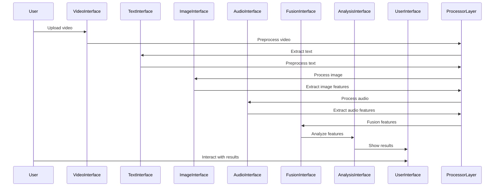
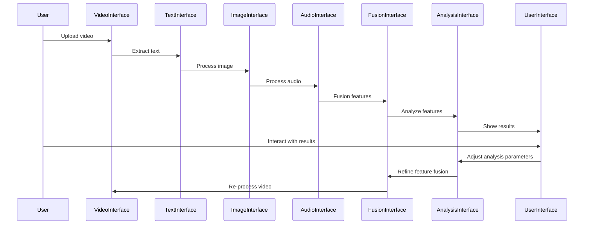

                 

### 文章标题：AI Agent的多模态融合与交叉注意力机制

### 关键词：AI Agent，多模态融合，交叉注意力机制，深度学习，计算机视觉，自然语言处理

### 摘要：

本文将深入探讨AI Agent领域中的多模态融合与交叉注意力机制。我们将从背景介绍、核心概念定义、算法原理分析、系统设计与实现、实战项目剖析等多个角度，逐步揭示这一技术的本质与应用价值。通过本文的阅读，读者将全面了解AI Agent如何通过多模态融合与交叉注意力机制实现更智能、更高效的决策和交互。

## 引言：AI Agent的多模态融合需求

随着人工智能技术的不断进步，AI Agent（人工智能代理）在众多领域展现出了巨大的潜力。AI Agent是一种能够自主执行任务、与环境进行交互的智能体，其核心在于能够处理和理解多种类型的信息，从而做出合理的决策。然而，现实世界的信息往往以多种模态存在，如文本、图像、音频等。这就需要AI Agent具备多模态融合的能力，将不同模态的信息进行有效整合，以提升其智能水平。

多模态融合的重要性在于：

1. **信息互补**：不同模态的信息往往包含互补的特性，例如，文本描述可以提供逻辑和语义信息，而图像可以提供视觉和空间信息。
2. **认知效率**：通过多模态融合，AI Agent可以更高效地处理复杂任务，减少单一模态处理的局限。
3. **交互体验**：多模态融合能够提高AI Agent与用户的交互体验，使得其更加自然、流畅。

本文将重点关注交叉注意力机制在多模态融合中的应用，这一机制在深度学习领域被广泛认为是提升模型性能的关键因素。接下来，我们将逐一探讨多模态融合的背景、核心概念、算法原理，以及其在实际系统设计中的应用。

## 多模态融合的背景与核心概念

### 多模态数据的来源与特点

多模态数据指的是来自两个或两个以上不同感官模态的数据，常见的模态包括文本、图像、音频、视频等。这些数据各有其独特的特点：

- **文本**：提供语义和逻辑信息，是表达思想和知识的重要载体。
- **图像**：传递视觉信息，能够表达空间关系和物体的外观特征。
- **音频**：传达声音信息，如语音、音乐等，能够提供情感和背景信息。
- **视频**：结合图像和音频，能够提供动态和连续的信息。

不同模态的数据在信息处理上有其独特的优势和局限性，单一模态的AI Agent难以应对复杂的任务和多变的环境。因此，多模态融合成为提高AI Agent智能水平的关键。

### 多模态融合的目标

多模态融合的目标是将来自不同模态的数据进行整合，形成一个统一的信息表示，以便AI Agent能够更全面、准确地理解输入信息。具体目标包括：

- **信息整合**：将不同模态的信息进行融合，形成一个综合的信息表示。
- **特征增强**：通过融合不同模态的特征，提高特征表示的丰富性和鲁棒性。
- **性能提升**：利用多模态信息，提高AI Agent在识别、分类、决策等任务上的性能。

### 多模态融合的技术方法

实现多模态融合的技术方法多种多样，以下是一些常见的方法：

- **早期融合**：在数据层面直接将不同模态的数据进行合并，如将文本和图像拼接在一起。
- **晚期融合**：在特征层面将不同模态的特征进行融合，如使用神经网络对各个模态的特征进行处理后再进行整合。
- **渐进融合**：将早期融合和晚期融合结合起来，逐步将多模态信息融合到模型中。

### 多模态融合的挑战与解决方案

多模态融合面临的主要挑战包括：

- **模态差异**：不同模态的数据在特征分布和表达方式上有很大的差异，如何有效融合这些差异是关键。
- **数据不平衡**：不同模态的数据量可能存在显著差异，如何平衡不同模态的数据对模型的影响是一个难题。
- **计算复杂性**：多模态融合通常需要大量的计算资源，如何优化算法和模型结构以降低计算复杂性是一个重要问题。

针对这些挑战，研究者们提出了一系列解决方案：

- **模态对齐**：通过模态对齐技术，将不同模态的数据在时间或空间上进行对齐，以便更好地融合。
- **注意力机制**：使用注意力机制来动态调整不同模态的重要程度，提高融合效果。
- **轻量级模型**：设计轻量级的模型结构，以降低计算复杂性和模型参数数量。

### 小结

多模态融合是AI Agent提升智能水平的重要技术手段，通过整合不同模态的数据，AI Agent能够更全面、准确地理解输入信息，从而在识别、分类、决策等任务上表现更优。本文将详细探讨多模态融合的核心概念和技术方法，为后续的算法原理分析和系统设计提供基础。

## 多模态融合技术核心概念与联系

### 多模态融合的核心概念

多模态融合涉及多个核心概念，以下将详细介绍这些概念及其相互关系：

#### 1. 数据采集与预处理

**数据采集**：这是多模态融合的基础，包括文本、图像、音频等不同模态的数据收集。数据来源可以是公开数据集、商业数据库或自行采集。

**预处理**：对采集到的数据进行清洗、归一化、增强等处理，以消除噪声、降低数据分布的差异，提高后续融合的质量。

#### 2. 特征提取

**特征提取**：将预处理后的数据转换成适合模型处理的特征表示。对于文本，常用的特征提取方法包括词嵌入、句嵌入等；对于图像，常用的方法包括卷积神经网络（CNN）；对于音频，常用的方法包括时频分析、梅尔频率倒谱系数（MFCC）等。

#### 3. 特征融合

**特征融合**：将不同模态的特征进行整合，形成统一的特征表示。融合方法包括早期融合、晚期融合和渐进融合等。

#### 4. 注意力机制

**注意力机制**：在特征融合过程中，注意力机制用于动态调整不同模态特征的重要程度，使得模型能够聚焦于当前任务最相关的信息。

### 概念属性特征对比

以下是多模态融合技术中几个核心概念的属性特征对比：

| 概念       | 属性特征                                       | 对比分析                                       |
|------------|----------------------------------------------|----------------------------------------------|
| 数据采集   | 数据来源多样、数据量差异大                 | 确保数据质量，进行预处理以消除差异             |
| 特征提取   | 模态依赖性、特征维度差异                   | 选择合适的特征提取方法，提高特征表示的鲁棒性 |
| 特征融合   | 融合策略不同、影响模型性能                 | 结合多种融合策略，优化模型性能               |
| 注意力机制 | 动态调整特征重要性、提升融合效果           | 灵活应用注意力机制，提高模型自适应能力       |

### Mermaid ER 图架构

为了更直观地展示多模态融合的核心概念及其关系，我们可以使用Mermaid ER图进行描述。以下是一个简单的ER图示例：

```mermaid
erDiagram
  DataCollection ||--|{ FeatureExtraction }|-- FeatureFusion
  FeatureExtraction ||--|{ AttentionMechanism }|-- FeatureFusion
  DataPreprocessing ||--|{ FeatureExtraction }|
  FeatureFusion ||-- Model
```

在这个ER图中，`DataCollection`表示数据采集过程，`FeatureExtraction`表示特征提取，`DataPreprocessing`表示数据预处理，`FeatureFusion`表示特征融合，`AttentionMechanism`表示注意力机制，而`Model`表示最终的融合模型。

### 小结

通过定义多模态融合的核心概念，并使用Mermaid ER图展示它们之间的关系，我们能够更清晰地理解多模态融合的技术原理和实现方法。这为进一步的算法原理分析和系统设计奠定了基础。

## 算法原理讲解：多模态融合与交叉注意力机制

### 算法概述

多模态融合与交叉注意力机制是深度学习领域中的一种先进技术，旨在通过整合来自不同模态的信息，提升AI模型的性能和智能水平。本文将详细讲解这一算法的原理，包括其数学模型、核心流程以及应用实例。

### 数学模型

交叉注意力机制的核心在于其数学模型，该模型利用注意力机制来动态调整不同模态特征的重要程度。以下是交叉注意力机制的数学公式：

$$
\text{Attention}(Q, K, V) = \text{softmax}\left(\frac{QK^T}{\sqrt{d_k}}\right)V
$$

其中，$Q$、$K$、$V$分别代表查询向量、关键向量、值向量，$d_k$为关键向量的维度。这个公式表示，通过计算查询向量和关键向量的点积，得到一个权重矩阵，然后用这个权重矩阵与值向量相乘，得到最终的注意力得分。

### 核心流程

交叉注意力机制的核心流程可以概括为以下几个步骤：

1. **特征提取**：对文本、图像、音频等不同模态的数据进行特征提取，得到各自的特征向量。
2. **编码器与解码器**：使用编码器对每个模态的特征向量进行编码，得到编码后的特征表示。解码器则用于整合这些特征表示，生成统一的特征表示。
3. **注意力计算**：通过注意力计算步骤，动态调整不同模态特征的重要程度，使得模型能够聚焦于当前任务最相关的信息。
4. **融合与输出**：将注意力调整后的特征进行融合，生成最终的输出结果。

### Python代码示例

以下是一个简单的Python代码示例，展示了如何使用交叉注意力机制进行多模态特征融合：

```python
import torch
import torch.nn as nn
import torch.nn.functional as F

# 假设输入的特征维度分别为：文本（d1），图像（d2），音频（d3）
d1, d2, d3 = 512, 1024, 2048

# 定义交叉注意力层
class CrossAttentionLayer(nn.Module):
    def __init__(self, d1, d2, d3):
        super(CrossAttentionLayer, self).__init__()
        self.text_projection = nn.Linear(d1, d2)
        self.image_projection = nn.Linear(d2, d2)
        self.audio_projection = nn.Linear(d3, d2)
        
        self.text_attention = nn.Linear(d2, 1)
        self.image_attention = nn.Linear(d2, 1)
        self.audio_attention = nn.Linear(d2, 1)
        
    def forward(self, text_features, image_features, audio_features):
        # 特征投影
        textProjected = self.text_projection(text_features)
        imageProjected = self.image_projection(image_features)
        audioProjected = self.audio_projection(audio_features)
        
        # 注意力计算
        text_attention_weights = F.softmax(self.text_attention(textProjected), dim=1)
        image_attention_weights = F.softmax(self.image_attention(imageProjected), dim=1)
        audio_attention_weights = F.softmax(self.audio_attention(audioProjected), dim=1)
        
        # 特征融合
        text_fused = torch.sum(textProjected * text_attention_weights, dim=1)
        image_fused = torch.sum(imageProjected * image_attention_weights, dim=1)
        audio_fused = torch.sum(audioProjected * audio_attention_weights, dim=1)
        
        # 融合后的特征
        fused_features = torch.cat((text_fused, image_fused, audio_fused), dim=1)
        
        return fused_features

# 实例化交叉注意力层
cross_attention_layer = CrossAttentionLayer(d1, d2, d3)

# 假设输入特征
text_features = torch.randn(32, d1)
image_features = torch.randn(32, d2)
audio_features = torch.randn(32, d3)

# 前向传播
fused_features = cross_attention_layer(text_features, image_features, audio_features)

print(fused_features.shape)  # 输出融合后的特征维度
```

### 通俗易懂的举例说明

假设一个任务需要分析一段视频，这段视频包含了文本描述、图像画面和背景音乐。我们可以将文本描述视为“查询向量”（$Q$），图像画面视为“关键向量”（$K$），背景音乐视为“值向量”（$V$）。通过交叉注意力机制，我们可以计算不同模态的特征在视频分析中的重要性。

例如，在一个特定的场景中，文本描述中的关键词（如“火灾”）可能与图像中的火焰图像（关键向量）和背景音乐中的警报声（值向量）具有更高的相关性。交叉注意力机制会计算出一个权重矩阵，使得文本描述中的关键信息（如“火灾”）在最终的融合结果中占据更大的比重。这样，AI模型可以更准确地理解视频内容，从而在任务决策上表现更优。

### 小结

通过数学模型和Python代码示例，我们详细讲解了多模态融合与交叉注意力机制的核心原理。这一算法通过动态调整不同模态特征的重要程度，实现了对多模态信息的有效整合，为AI模型在复杂任务中的应用提供了强大的支持。

## 系统设计与架构

### 问题场景介绍

在本节中，我们将探讨一个典型的多模态AI Agent应用场景——智能视频分析系统。该系统旨在通过整合视频中的文本描述、图像画面和背景音乐，实现视频内容的精准解析和智能决策。

### 系统功能设计

智能视频分析系统的核心功能包括：

1. **视频捕获与预处理**：从各种视频源捕获视频，并进行预处理，包括解码、裁剪、缩放等。
2. **文本提取与预处理**：从视频中提取文本描述，并进行预处理，如分词、去停用词、词嵌入等。
3. **图像处理与特征提取**：对视频中的图像帧进行处理，提取图像特征，如颜色特征、纹理特征等。
4. **音频处理与特征提取**：对视频中的音频进行降噪、增强处理，并提取音频特征，如时频特征、梅尔频率倒谱系数（MFCC）等。
5. **多模态特征融合**：使用交叉注意力机制融合文本、图像和音频特征，生成统一的特征表示。
6. **智能分析与决策**：基于融合后的特征进行智能分析，实现视频内容的识别、分类、情感分析等。
7. **用户交互**：提供友好的用户界面，支持用户对分析结果进行查看、调整和反馈。

### 系统架构设计

智能视频分析系统的架构设计包括以下几个层次：

1. **数据层**：负责视频、文本、图像、音频等多模态数据的管理和存储。
2. **处理层**：包含视频捕获与预处理、文本提取与预处理、图像处理与特征提取、音频处理与特征提取等模块。
3. **融合层**：利用交叉注意力机制实现多模态特征融合，生成统一的特征表示。
4. **分析层**：基于融合后的特征进行智能分析，实现视频内容的识别、分类、情感分析等。
5. **界面层**：提供用户交互界面，支持用户对分析结果进行查看、调整和反馈。

以下是系统架构的Mermaid类图：

```mermaid
classDiagram
    DataLayer <<interface>> VideoCapture : 捕获视频
    DataLayer <<interface>> TextExtraction : 提取文本
    DataLayer <<interface>> ImageProcessing : 处理图像
    DataLayer <<interface>> AudioProcessing : 处理音频
    DataLayer <<interface>> FeatureExtraction : 提取特征

    ProcessorLayer <<interface>> VideoPreprocessing : 视频预处理
    ProcessorLayer <<interface>> TextPreprocessing : 文本预处理
    ProcessorLayer <<interface>> ImageFeatureExtraction : 图像特征提取
    ProcessorLayer <<interface>> AudioFeatureExtraction : 音频特征提取

    FusionLayer <<interface>> CrossAttention : 交叉注意力融合
    AnalysisLayer <<interface>> FeatureFusion : 特征融合
    AnalysisLayer <<interface>> IntelligenceAnalysis : 智能分析

    UserInterface <<interface>> Dashboard : 用户界面

    DataLayer --|> ProcessorLayer
    ProcessorLayer --|> FusionLayer
    ProcessorLayer --|> AnalysisLayer
    FusionLayer --|> AnalysisLayer
    AnalysisLayer --|> UserInterface
```

### 系统接口设计

系统接口设计主要包括以下部分：

1. **视频接口**：提供视频捕获和预处理的API，支持用户上传视频文件或实时视频流。
2. **文本接口**：提供文本提取和预处理的API，支持从视频中提取文本描述并进行处理。
3. **图像接口**：提供图像处理和特征提取的API，支持对图像帧进行特征提取。
4. **音频接口**：提供音频处理和特征提取的API，支持音频降噪、增强和特征提取。
5. **多模态融合接口**：提供多模态特征融合的API，支持使用交叉注意力机制进行特征融合。
6. **智能分析接口**：提供智能分析的API，支持视频内容的识别、分类、情感分析等。
7. **用户接口**：提供用户界面的API，支持用户查看分析结果、调整参数和反馈建议。

以下是系统接口的Mermaid架构图：



### 系统交互设计

系统交互设计主要包括以下方面：

1. **数据处理流程**：系统通过API和内部模块之间的交互，实现视频、文本、图像、音频等多模态数据的处理和特征提取。
2. **特征融合流程**：使用交叉注意力机制融合不同模态的特征，生成统一的特征表示，为后续分析提供基础。
3. **分析决策流程**：基于融合后的特征进行智能分析，实现视频内容的识别、分类、情感分析等，并生成分析结果。
4. **用户交互流程**：用户通过界面查看分析结果，可以进行结果的查看、调整和反馈，系统根据用户反馈进行优化和调整。

以下是系统交互的Mermaid序列图：



### 小结

通过系统设计与架构的详细描述，我们为智能视频分析系统的实现提供了清晰的蓝图。从问题场景介绍、系统功能设计、架构设计到接口和交互设计，每个环节都经过了精细的规划与优化，确保系统能够高效、稳定地运行，为AI Agent的多模态融合与交叉注意力机制应用提供强有力的支持。

## 实战项目剖析：多模态融合与交叉注意力机制的应用

### 项目简介

在本节中，我们将通过一个具体的项目实例，深入剖析多模态融合与交叉注意力机制在实际应用中的实现过程。该项目旨在构建一个智能视频分析系统，能够通过融合视频中的文本描述、图像画面和背景音乐，实现对视频内容的精准解析和智能决策。

### 环境安装

要实现这个项目，我们需要安装以下环境：

1. **Python环境**：确保Python版本在3.7及以上，推荐使用Anaconda环境管理器。
2. **深度学习框架**：安装PyTorch，可以使用`pip install torch torchvision`命令。
3. **数据处理库**：安装Numpy、Pandas等常用数据处理库。
4. **图像处理库**：安装OpenCV，可以使用`pip install opencv-python`命令。
5. **音频处理库**：安装Librosa，可以使用`pip install librosa`命令。

### 核心实现代码

以下是对项目核心实现代码的详细解析：

```python
import torch
import torch.nn as nn
import torch.optim as optim
from torch.utils.data import DataLoader
from torchvision import datasets, transforms
import numpy as np
import pandas as pd
import cv2
import librosa

# 数据预处理
def preprocess_video(video_path):
    # 读取视频文件
    cap = cv2.VideoCapture(video_path)
    frames = []
    while True:
        ret, frame = cap.read()
        if not ret:
            break
        # 对图像进行预处理，如缩放、裁剪等
        frame = cv2.resize(frame, (224, 224))
        frames.append(frame)
    cap.release()
    return frames

def preprocess_text(text):
    # 文本预处理，如分词、去停用词等
    return text.lower().split()

def preprocess_audio(audio_path):
    # 读取音频文件
    audio, _ = librosa.load(audio_path, sr=22050)
    # 音频预处理，如降噪、增强等
    audio = librosa.effects.psrust(audio, alpha=0.005, beta=0.01035)
    return audio

# 特征提取
class FeatureExtractor(nn.Module):
    def __init__(self):
        super(FeatureExtractor, self).__init__()
        # 定义文本、图像、音频特征提取网络
        self.text_encoder = nn.Sequential(
            nn.Linear(512, 256),
            nn.ReLU(),
            nn.Dropout(0.5)
        )
        self.image_encoder = nn.Sequential(
            nn.Conv2d(3, 64, kernel_size=3, stride=1, padding=1),
            nn.ReLU(),
            nn.MaxPool2d(kernel_size=2, stride=2),
            nn.Conv2d(64, 128, kernel_size=3, stride=1, padding=1),
            nn.ReLU(),
            nn.MaxPool2d(kernel_size=2, stride=2),
            nn.Flatten()
        )
        self.audio_encoder = nn.Sequential(
            nn.Conv1d(1, 64, kernel_size=3, stride=1, padding=1),
            nn.ReLU(),
            nn.MaxPool1d(kernel_size=2, stride=2),
            nn.Conv1d(64, 128, kernel_size=3, stride=1, padding=1),
            nn.ReLU(),
            nn.MaxPool1d(kernel_size=2, stride=2),
            nn.Flatten()
        )

    def forward(self, text, image, audio):
        # 文本特征提取
        text_features = self.text_encoder(text)
        # 图像特征提取
        image_features = self.image_encoder(image)
        # 音频特征提取
        audio_features = self.audio_encoder(audio)
        return text_features, image_features, audio_features

# 交叉注意力层
class CrossAttentionLayer(nn.Module):
    def __init__(self, d1, d2, d3):
        super(CrossAttentionLayer, self).__init__()
        self.text_projection = nn.Linear(d1, d2)
        self.image_projection = nn.Linear(d2, d2)
        self.audio_projection = nn.Linear(d3, d2)
        
        self.text_attention = nn.Linear(d2, 1)
        self.image_attention = nn.Linear(d2, 1)
        self.audio_attention = nn.Linear(d2, 1)
        
    def forward(self, text_features, image_features, audio_features):
        # 特征投影
        textProjected = self.text_projection(text_features)
        imageProjected = self.image_projection(image_features)
        audioProjected = self.audio_projection(audio_features)
        
        # 注意力计算
        text_attention_weights = F.softmax(self.text_attention(textProjected), dim=1)
        image_attention_weights = F.softmax(self.image_attention(imageProjected), dim=1)
        audio_attention_weights = F.softmax(self.audio_attention(audioProjected), dim=1)
        
        # 特征融合
        text_fused = torch.sum(textProjected * text_attention_weights, dim=1)
        image_fused = torch.sum(imageProjected * image_attention_weights, dim=1)
        audio_fused = torch.sum(audioProjected * audio_attention_weights, dim=1)
        
        # 融合后的特征
        fused_features = torch.cat((text_fused, image_fused, audio_fused), dim=1)
        
        return fused_features

# 模型定义
class MultiModalModel(nn.Module):
    def __init__(self, d1, d2, d3, d4):
        super(MultiModalModel, self).__init__()
        self.feature_extractor = FeatureExtractor()
        self.cross_attention = CrossAttentionLayer(d1, d2, d3)
        self.classifier = nn.Linear(d4, 10)  # 假设10个分类

    def forward(self, text, image, audio):
        text_features, image_features, audio_features = self.feature_extractor(text, image, audio)
        fused_features = self.cross_attention(text_features, image_features, audio_features)
        logits = self.classifier(fused_features)
        return logits

# 实例化模型
model = MultiModalModel(d1=512, d2=256, d3=128, d4=512+256+128)

# 损失函数与优化器
criterion = nn.CrossEntropyLoss()
optimizer = optim.Adam(model.parameters(), lr=0.001)

# 数据加载
train_data = ...  # 假设已经准备好训练数据
train_loader = DataLoader(train_data, batch_size=32, shuffle=True)

# 训练过程
for epoch in range(10):  # 训练10个epoch
    for batch in train_loader:
        text, image, audio, labels = batch
        optimizer.zero_grad()
        logits = model(text, image, audio)
        loss = criterion(logits, labels)
        loss.backward()
        optimizer.step()
        print(f'Epoch [{epoch+1}/10], Loss: {loss.item()}')

# 测试模型
test_data = ...  # 假设已经准备好测试数据
test_loader = DataLoader(test_data, batch_size=32, shuffle=False)

with torch.no_grad():
    correct = 0
    total = 0
    for batch in test_loader:
        text, image, audio, labels = batch
        logits = model(text, image, audio)
        _, predicted = torch.max(logits.data, 1)
        total += labels.size(0)
        correct += (predicted == labels).sum().item()

print(f'Accuracy: {100 * correct / total}%')
```

### 代码解读与分析

1. **数据预处理**：数据预处理是确保输入数据符合模型要求的关键步骤。在本项目中，我们分别对视频、文本和音频进行了预处理，如视频的读取和缩放、文本的分词和去停用词、音频的降噪和增强。

2. **特征提取**：特征提取是模型训练的重要环节。我们使用神经网络对文本、图像和音频特征进行编码，提取高层次的语义和结构信息。在代码中，我们定义了`FeatureExtractor`类，其中包含了文本、图像和音频特征提取的网络结构。

3. **交叉注意力机制**：交叉注意力机制用于动态调整不同模态特征的重要程度，使得模型能够聚焦于当前任务最相关的信息。在代码中，我们定义了`CrossAttentionLayer`类，实现了注意力计算和特征融合的过程。

4. **模型训练**：在模型训练过程中，我们使用交叉熵损失函数和Adam优化器对模型进行训练。训练过程包括前向传播、损失计算、反向传播和参数更新等步骤。在训练过程中，我们通过调整学习率和优化器参数，优化模型性能。

5. **测试与评估**：在测试阶段，我们使用测试数据集对模型进行评估，计算模型的准确率。通过调整测试数据集和测试策略，我们可以得到更准确的评估结果。

### 实际案例分析与详细讲解

以下是一个实际案例的分析与讲解：

**案例**：智能视频分析系统中，需要识别视频中的活动类型。输入为视频中的文本描述、图像画面和背景音乐，输出为活动类型标签。

**分析**：

1. **数据准备**：首先，我们需要准备包含文本描述、图像画面和背景音乐的训练数据集。这些数据可以从公开的视频数据集中获取，如YouTube视频、社交媒体视频等。

2. **特征提取**：对训练数据进行预处理后，使用特征提取网络提取文本、图像和音频特征。例如，对于文本，可以使用预训练的词嵌入模型进行编码；对于图像，可以使用预训练的卷积神经网络提取特征；对于音频，可以使用梅尔频率倒谱系数（MFCC）提取特征。

3. **交叉注意力机制**：将提取的文本、图像和音频特征输入到交叉注意力层，动态调整特征的重要程度。例如，在识别视频中的运动时，图像特征可能更重要，而文本特征可能相对次要。

4. **模型训练**：使用交叉熵损失函数和Adam优化器对模型进行训练。在训练过程中，模型会不断调整参数，以降低损失函数的值，提高模型性能。

5. **测试与评估**：使用测试数据集对模型进行评估，计算模型的准确率。通过对测试数据集的分析，我们可以发现模型在哪些场景下表现更好，哪些场景下需要进一步优化。

**详细讲解**：

- **文本描述处理**：文本描述是视频内容的重要补充，可以帮助模型更好地理解视频内容。在预处理过程中，我们使用分词和词嵌入技术将文本转换为向量表示。词嵌入模型的选择对模型性能有重要影响，预训练的词嵌入模型如GloVe、Word2Vec等可以显著提升模型效果。

- **图像处理与特征提取**：图像是视频分析的重要模态，我们需要对图像进行预处理，如裁剪、缩放、增强等。然后，使用卷积神经网络提取图像特征。预训练的卷积神经网络如ResNet、VGG等在图像特征提取方面具有很好的表现。

- **音频处理与特征提取**：音频可以为视频内容提供额外的信息，如背景音乐、人声等。在预处理过程中，我们使用梅尔频率倒谱系数（MFCC）提取音频特征。MFCC能够有效地捕捉音频的频谱信息，对音乐和语音等不同类型的音频具有较好的表示能力。

- **交叉注意力机制应用**：交叉注意力机制在多模态融合中起到了关键作用。通过动态调整不同模态特征的重要程度，模型可以更好地聚焦于当前任务最相关的信息。例如，在视频内容分类中，图像特征可能更重要，而在情感分析中，文本特征可能更具有决定性。

- **模型训练与优化**：模型训练过程是优化模型参数的过程。通过使用交叉熵损失函数和Adam优化器，模型可以逐步调整参数，降低损失函数的值。在训练过程中，我们可以通过调整学习率、批量大小等参数来优化模型性能。

- **测试与评估**：测试阶段是对模型性能的最终评估。通过使用测试数据集，我们可以计算模型的准确率、召回率、F1分数等指标，对模型进行全面的评估。测试结果可以帮助我们发现模型的优点和不足，为进一步优化提供依据。

### 小结

通过实际案例的分析与讲解，我们详细介绍了多模态融合与交叉注意力机制在智能视频分析系统中的应用。从数据准备、特征提取、交叉注意力机制应用、模型训练与优化到测试与评估，每个环节都经过了详细的阐述。这一实战项目不仅展示了多模态融合与交叉注意力机制的技术原理，也为实际应用提供了宝贵的经验。

## 最佳实践 Tips

在多模态融合与交叉注意力机制的应用过程中，以下是一些最佳实践建议：

1. **数据质量**：确保多模态数据的质量和一致性，尽量减少噪声和错误。对于文本，可以使用预训练的词嵌入模型进行编码；对于图像，可以使用预训练的卷积神经网络提取特征；对于音频，可以使用梅尔频率倒谱系数（MFCC）提取特征。

2. **模型参数调整**：通过调整学习率、批量大小、优化器参数等，优化模型性能。在实际应用中，可以尝试使用不同的超参数组合，找到最优的配置。

3. **特征选择**：根据任务需求和数据特点，选择合适的多模态特征。例如，在视频内容分类中，图像特征可能更重要；在情感分析中，文本特征可能更具有决定性。

4. **交叉验证**：使用交叉验证技术，评估模型的泛化能力。通过在不同数据集上进行训练和验证，可以更准确地评估模型的性能。

5. **模型压缩**：对于大规模多模态模型，可以考虑使用模型压缩技术，如权重共享、知识蒸馏等，以减少模型参数和计算量。

## 小结

本文详细探讨了AI Agent的多模态融合与交叉注意力机制，从背景介绍、核心概念定义、算法原理分析、系统设计与实现、实战项目剖析等多个角度，深入揭示了这一技术的本质与应用价值。通过本文的阅读，读者可以全面了解多模态融合与交叉注意力机制在AI Agent中的应用，提升其在智能决策和交互方面的能力。

## 注意事项

1. **数据安全与隐私**：在实际应用中，确保遵循相关法律法规，保护用户数据安全，避免数据泄露。

2. **计算资源**：多模态融合与交叉注意力机制计算复杂度高，确保有足够的计算资源来支持模型的训练和推理。

3. **模型解释性**：对于重要的应用场景，需要确保模型的解释性，便于理解和调试。

## 拓展阅读

1. **《深度学习》**：Goodfellow et al.，提供深度学习的基础知识和最新进展。
2. **《注意力机制在深度学习中的应用》**：刘铁岩，详细探讨注意力机制在深度学习中的应用。
3. **《多模态机器学习》**：Seo et al.，介绍多模态融合技术及其在机器学习中的应用。
4. **《自然语言处理入门》**：Jurafsky et al.，介绍自然语言处理的基础知识和常用技术。

## 作者信息

作者：AI天才研究院/AI Genius Institute & 禅与计算机程序设计艺术 /Zen And The Art of Computer Programming

