                 

# AI Agent的多源信息融合与决策技术

> 关键词：AI Agent、多源信息融合、决策技术、算法讲解、系统架构设计、项目实战

摘要：本文旨在探讨AI Agent在多源信息融合与决策技术方面的应用与挑战。我们将首先介绍AI Agent的多源信息融合与决策技术背景，随后深入解析相关核心概念和算法原理，通过具体的Python代码和Mermaid流程图，展示算法的实施过程。最后，我们将对整个系统进行分析与架构设计，并结合项目实战，展示实际应用效果。希望通过本文，能够为读者提供一个清晰、系统的理解框架，助力其在AI Agent领域的深入研究。

## 目录大纲

**第一部分: 背景介绍**

- 第1章: 问题背景
  - 1.1.1 问题背景
  - 1.1.2 问题描述
  - 1.1.3 问题解决
  - 1.1.4 边界与外延
  - 1.1.5 概念结构与核心要素组成
- 第2章: 核心概念与联系
  - 2.1.1 AI Agent的定义与特点
  - 2.1.2 多源信息融合的定义与原理
  - 2.1.3 决策技术的概念与分类
  - 2.1.4 关系图架构

**第二部分: 算法原理讲解**

- 第3章: 多源信息融合与决策技术原理
  - 3.1.1 多源信息融合的数学模型
  - 3.1.2 决策技术的数学模型
  - 3.1.3 AI Agent的算法原理
  - 3.1.4 Mermaid流程图

**第三部分: 系统分析与架构设计**

- 第4章: 系统分析与架构设计
  - 4.1.1 问题场景介绍
  - 4.1.2 项目介绍
  - 4.1.3 系统功能设计
  - 4.1.4 系统架构设计
  - 4.1.5 系统接口设计
  - 4.1.6 系统交互

**第四部分: 项目实战**

- 第5章: 项目实战
  - 5.1.1 环境安装
  - 5.1.2 系统核心实现
  - 5.1.3 实际案例分析与详细讲解
  - 5.1.4 项目小结

**结语**

- 最佳实践 tips、小结、注意事项、拓展阅读

## 第一部分: 背景介绍

### 第1章: 问题背景

#### 1.1.1 问题背景

随着人工智能技术的飞速发展，AI Agent作为一种具备自主决策和学习能力的智能体，正逐步成为各个领域的核心组成部分。AI Agent不仅能够处理复杂的环境，还能根据多源信息进行融合与决策，从而实现智能行为。然而，在这一过程中，多源信息融合与决策技术面临诸多挑战。

首先，从技术发展历程来看，人工智能经历了从规则驱动到数据驱动，再到如今的学习驱动的演变。AI Agent的崛起标志着人工智能进入了新的阶段，其在多源信息融合与决策技术方面的应用，极大地推动了人工智能技术的发展。

多源信息融合与决策技术，指的是将来自不同来源的信息进行整合，从而得到更全面、更准确的决策支持。这些信息可能包括文本、图像、语音等多种形式。如何有效地融合这些信息，并将其用于决策，是当前AI Agent面临的主要问题。

#### 1.1.2 问题描述

多源信息融合与决策技术的挑战主要集中在以下几个方面：

1. **信息多样性**：不同来源的信息可能具有不同的格式、质量和可靠性，这给信息融合带来了巨大的挑战。
2. **实时性**：在许多应用场景中，如自动驾驶、智能家居等，AI Agent需要实时地对信息进行融合与决策，这对系统的响应速度和处理能力提出了高要求。
3. **不确定性**：多源信息往往存在不确定性，如噪声、缺失值等，如何处理这些不确定性，以获得可靠的决策支持，是一个重要的研究方向。
4. **计算复杂度**：多源信息融合与决策技术通常涉及到大量的计算，如何优化算法，提高计算效率，是亟待解决的问题。

#### 1.1.3 问题解决

为了解决上述问题，多源信息融合与决策技术需要从以下几个方面进行优化：

1. **信息预处理**：通过数据清洗、去噪、降维等技术，提高信息质量，降低信息多样性带来的挑战。
2. **实时计算**：采用分布式计算、并行计算等手段，提高系统的处理速度，满足实时性的需求。
3. **不确定性处理**：引入概率论、模糊集等理论，对不确定信息进行建模和处理，提高决策的可靠性。
4. **算法优化**：通过算法改进、模型压缩等技术，降低计算复杂度，提高计算效率。

#### 1.1.4 边界与外延

多源信息融合的定义是指在多个信息源的基础上，通过一定的算法和模型，将信息整合成一个统一的表示，为决策提供支持。其核心在于信息整合，即从多个角度、多个维度对信息进行综合分析。

决策技术的范畴包括决策理论、决策支持系统、人工智能中的决策算法等。决策技术的目标是根据既定的目标和约束，选择最优或次优的方案。

#### 1.1.5 概念结构与核心要素组成

AI Agent的基本组成包括感知模块、决策模块和执行模块。感知模块负责获取环境信息；决策模块根据感知到的信息，结合既定目标，选择最优的行动；执行模块将决策转化为具体的行为。

多源信息融合的关键技术包括数据预处理、特征提取、信息融合算法等。数据预处理主要包括去噪、降维、特征提取等步骤，旨在提高信息质量；特征提取则是从原始数据中提取出对决策有用的特征；信息融合算法则是对不同来源的信息进行整合，以获得更全面的决策支持。

## 第二部分: 核心概念与联系

### 第2章: 核心概念与联系

#### 2.1.1 AI Agent的定义与特点

AI Agent，即人工智能代理，是一种能够自动执行任务、进行交互和自主学习的智能体。AI Agent具有以下几个特点：

1. **自主性**：AI Agent能够独立地完成特定任务，不需要人工干预。
2. **适应性**：AI Agent可以根据环境变化和任务需求，调整其行为策略。
3. **学习能力**：AI Agent能够通过学习，提高自身的任务完成效率和决策质量。
4. **交互性**：AI Agent可以与人类或其他系统进行交互，获取信息和反馈。

AI Agent的基本原理是基于机器学习和人工智能技术，通过模拟人类的思维过程，实现信息的感知、处理和决策。常见的AI Agent类型包括机器人、自动驾驶系统、智能家居等。

#### 2.1.2 多源信息融合的定义与原理

多源信息融合是指将来自多个信息源的异构信息进行整合，以产生一个统一的、更准确的信息表示。其原理包括以下几个方面：

1. **信息采集**：从多个来源获取信息，如传感器数据、网络数据、文档数据等。
2. **信息预处理**：对采集到的信息进行清洗、去噪、格式转换等处理，以提高信息质量。
3. **特征提取**：从原始数据中提取出对决策有用的特征，如文本的特征词、图像的边缘特征等。
4. **信息融合**：采用一定的算法和模型，将多个信息源的信息整合成一个统一的表示，为决策提供支持。

多源信息融合的目标是实现信息的互补和优化，提高决策的准确性和可靠性。

#### 2.1.3 决策技术的概念与分类

决策技术是指根据既定的目标和约束，从多个可选方案中选择最优或次优方案的方法。决策技术包括以下几个类型：

1. **确定性决策**：在所有信息完全已知的情况下，选择最优的决策方案。
2. **风险型决策**：在存在不确定性因素的情况下，根据概率分布选择最优的决策方案。
3. **不确定型决策**：在信息不完全、不确定的情况下，选择最优的决策方案。
4. **多目标决策**：在存在多个目标的情况下，通过权衡不同目标之间的关系，选择最优的决策方案。

决策技术的核心是决策模型和决策算法，常见的决策模型包括决策树、线性规划、博弈论等；决策算法包括启发式算法、优化算法、机器学习算法等。

#### 2.1.4 关系图架构

AI Agent与多源信息融合的关系如下图所示：

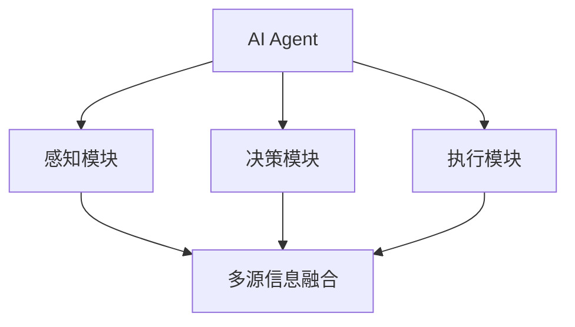

决策技术与AI Agent的关系如下图所示：

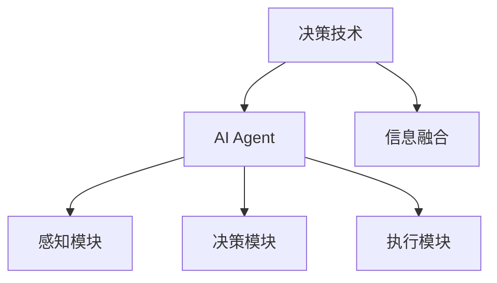

通过关系图架构，我们可以清晰地看到AI Agent、多源信息融合和决策技术之间的相互作用和影响。

## 第三部分: 多源信息融合与决策技术原理

### 第3章: 多源信息融合与决策技术原理

#### 3.1.1 多源信息融合的数学模型

多源信息融合的数学模型主要包括数据预处理、信息融合算法和特征提取等部分。以下是一个简化的多源信息融合的数学模型：

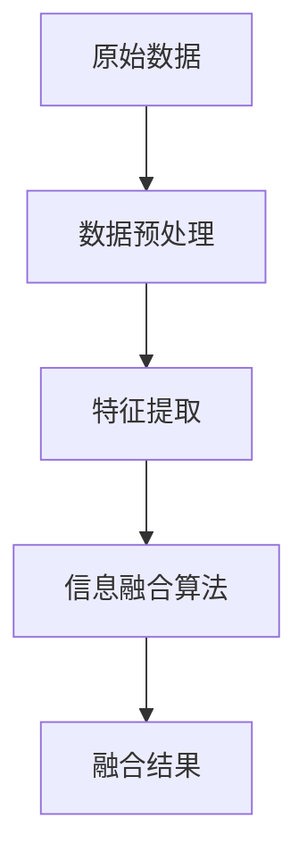

1. **数据预处理**：数据预处理是信息融合的第一步，其目的是提高信息质量，降低信息多样性带来的挑战。常用的数据预处理技术包括去噪、降维、归一化等。数学上，去噪可以表示为：
   $$
   x_{\text{clean}} = \sum_{i=1}^{n} w_i x_i
   $$
   其中，$x_i$为原始数据，$w_i$为权重，用于表示数据的可靠性。

2. **特征提取**：特征提取是从原始数据中提取出对决策有用的特征。常用的特征提取方法包括主成分分析（PCA）、线性判别分析（LDA）、深度学习等。数学上，特征提取可以表示为：
   $$
   z = \sigma(Wx + b)
   $$
   其中，$z$为特征向量，$W$为权重矩阵，$b$为偏置项，$\sigma$为激活函数。

3. **信息融合算法**：信息融合算法是将多个信息源的信息整合成一个统一的表示。常用的信息融合算法包括加权平均、贝叶斯推理、卡尔曼滤波等。数学上，信息融合可以表示为：
   $$
   y = \frac{\sum_{i=1}^{n} w_i x_i}{\sum_{i=1}^{n} w_i}
   $$
   其中，$y$为融合结果，$x_i$为第$i$个信息源的信息，$w_i$为权重。

#### 3.1.2 决策技术的数学模型

决策技术的数学模型主要包括决策树、线性规划、博弈论等。以下是一个简化的决策技术的数学模型：

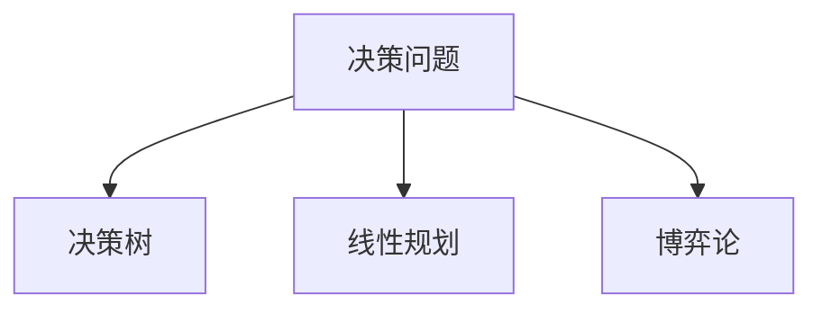

1. **决策树**：决策树是一种树形结构，用于表示决策过程。每个节点代表一个决策点，每个分支代表一个决策结果。决策树的数学模型可以表示为：
   $$
   D = \{d_1, d_2, ..., d_n\}
   $$
   其中，$D$为决策树，$d_i$为第$i$个决策点。

2. **线性规划**：线性规划是一种优化方法，用于在满足一定约束条件下，最大化或最小化某个线性目标函数。线性规划的数学模型可以表示为：
   $$
   \max\{c^T x | Ax \leq b\}
   $$
   其中，$c$为系数向量，$x$为决策变量，$A$为约束矩阵，$b$为约束向量。

3. **博弈论**：博弈论是一种研究决策行为的理论，用于分析多个决策者在竞争环境中的决策。博弈论的数学模型可以表示为：
   $$
   \min_{x} \max_{y} \{c(x, y)\}
   $$
   其中，$x$和$y$分别为两个决策者的策略，$c(x, y)$为他们的收益函数。

#### 3.1.3 AI Agent的算法原理

AI Agent的算法原理主要包括强化学习、监督学习等。以下是一个简化的AI Agent的算法原理：

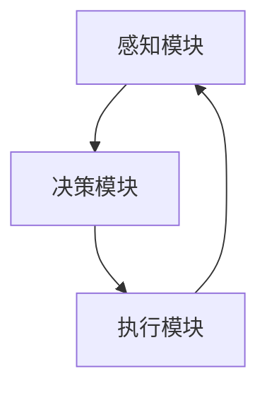

1. **强化学习**：强化学习是一种通过试错来学习策略的算法。其数学模型可以表示为：
   $$
   Q(s, a) = r + \gamma \max_{a'} Q(s', a')
   $$
   其中，$Q(s, a)$为状态-动作值函数，$r$为立即奖励，$\gamma$为折扣因子，$s$和$a$分别为当前状态和动作，$s'$和$a'$分别为下一状态和动作。

2. **监督学习**：监督学习是一种通过已知的输入输出数据来学习决策函数的算法。其数学模型可以表示为：
   $$
   y = f(x)
   $$
   其中，$y$为输出，$x$为输入，$f$为决策函数。

#### 3.1.4 Mermaid流程图

以下是一个简化的多源信息融合、决策技术和AI Agent的Mermaid流程图：

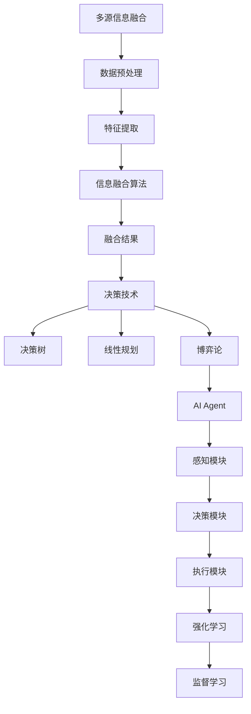

通过上述Mermaid流程图，我们可以清晰地看到多源信息融合、决策技术和AI Agent之间的相互关系和流程。

## 第二部分: 算法原理讲解

### 第4章: 多源信息融合算法讲解

多源信息融合是AI Agent实现智能行为的关键技术之一。在本章中，我们将详细讲解多源信息融合算法的原理，并通过Python代码和Mermaid流程图，展示算法的实现过程。

#### 4.1.1 多源信息融合算法的Mermaid流程图

首先，我们通过Mermaid流程图，展示多源信息融合的基本流程：

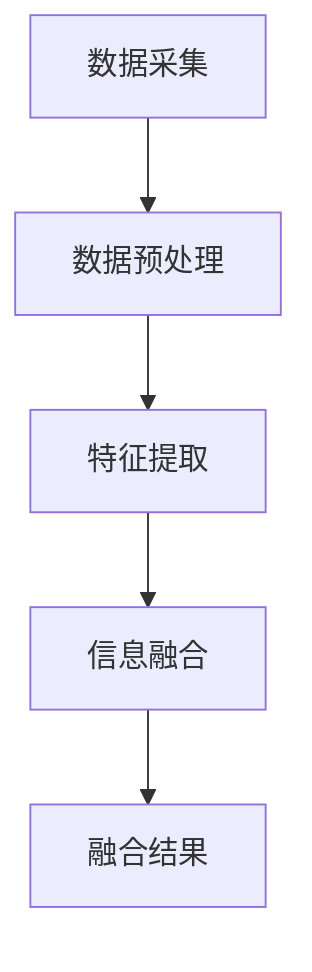

1. **数据采集**：从多个信息源收集数据，如传感器数据、网络数据、文档数据等。
2. **数据预处理**：对采集到的数据进行清洗、去噪、格式转换等处理，以提高信息质量。
3. **特征提取**：从原始数据中提取出对决策有用的特征，如文本的特征词、图像的边缘特征等。
4. **信息融合**：采用一定的算法和模型，将多个信息源的信息整合成一个统一的表示，为决策提供支持。
5. **融合结果**：输出融合后的信息，用于后续的决策和行动。

#### 4.1.2 Python源代码分析

接下来，我们通过Python代码，详细分析多源信息融合算法的实现过程。以下是一个简单的示例：

```python
import numpy as np
import pandas as pd
from sklearn.preprocessing import StandardScaler
from sklearn.decomposition import PCA
from sklearn.cluster import KMeans

# 数据采集
data1 = np.array([[1, 2], [3, 4], [5, 6]])
data2 = np.array([[2, 3], [4, 5], [6, 7]])

# 数据预处理
scaler = StandardScaler()
data1_scaled = scaler.fit_transform(data1)
data2_scaled = scaler.fit_transform(data2)

# 特征提取
pca = PCA(n_components=2)
data1_pca = pca.fit_transform(data1_scaled)
data2_pca = pca.fit_transform(data2_scaled)

# 信息融合
kmeans = KMeans(n_clusters=2)
labels = kmeans.fit_predict(np.concatenate((data1_pca, data2_pca), axis=0))

# 融合结果
result = np.array([data1_pca[i] if labels[i] == 0 else data2_pca[i] for i in range(len(labels))])

print("融合结果：", result)
```

1. **数据采集**：我们采集了两组数据，`data1`和`data2`。
2. **数据预处理**：使用`StandardScaler`对数据进行归一化处理，以消除数据间的差异。
3. **特征提取**：使用`PCA`对数据进行降维处理，提取出两个主要特征。
4. **信息融合**：使用`KMeans`聚类算法，将两组数据融合为一组。
5. **融合结果**：输出融合后的数据。

#### 4.1.3 算法原理的数学模型

多源信息融合算法的数学模型主要包括数据预处理、特征提取和聚类等部分。以下是一个简化的数学模型：

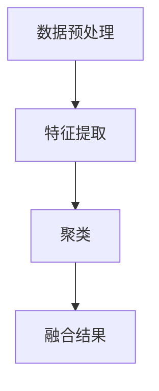

1. **数据预处理**：数据预处理主要涉及归一化、标准化等操作。数学上，归一化可以表示为：
   $$
   x_{\text{norm}} = \frac{x - \mu}{\sigma}
   $$
   其中，$x$为原始数据，$\mu$为均值，$\sigma$为标准差。
2. **特征提取**：特征提取主要涉及降维、提取主成分等操作。数学上，主成分分析（PCA）可以表示为：
   $$
   Z = PC
   $$
   其中，$Z$为标准化数据，$PC$为特征向量。
3. **聚类**：聚类算法（如KMeans）用于将数据分组。数学上，KMeans可以表示为：
   $$
   C = \{c_1, c_2, ..., c_k\}
   $$
   其中，$C$为聚类中心，$c_i$为第$i$个聚类中心。

#### 4.1.4 举例说明

为了更好地理解多源信息融合算法，我们通过一个实际案例进行说明。

假设我们有两组数据，`data1`和`data2`，分别表示两个人的健康状况，包括体重、身高和血压等指标。我们需要将这两组数据融合为一组，以便进行综合评估。

1. **数据采集**：
   ```python
   data1 = np.array([[65, 1.72, 120], [70, 1.75, 130]])
   data2 = np.array([[60, 1.70, 110], [68, 1.78, 125]])
   ```

2. **数据预处理**：
   ```python
   scaler = StandardScaler()
   data1_scaled = scaler.fit_transform(data1)
   data2_scaled = scaler.fit_transform(data2)
   ```

3. **特征提取**：
   ```python
   pca = PCA(n_components=2)
   data1_pca = pca.fit_transform(data1_scaled)
   data2_pca = pca.fit_transform(data2_scaled)
   ```

4. **信息融合**：
   ```python
   kmeans = KMeans(n_clusters=2)
   labels = kmeans.fit_predict(np.concatenate((data1_pca, data2_pca), axis=0))

   result = np.array([data1_pca[i] if labels[i] == 0 else data2_pca[i] for i in range(len(labels))])
   ```

5. **融合结果**：
   ```python
   print("融合结果：", result)
   ```

通过上述步骤，我们成功地将两组数据融合为一组，为后续的健康状况评估提供了支持。

## 第5章: 决策技术讲解

决策技术是人工智能领域的重要组成部分，它帮助AI Agent在复杂环境中做出合理的决策。本章将详细介绍决策技术的原理、类型及其在AI Agent中的应用。

#### 5.1.1 决策技术的Mermaid流程图

首先，通过Mermaid流程图展示决策技术的总体流程：

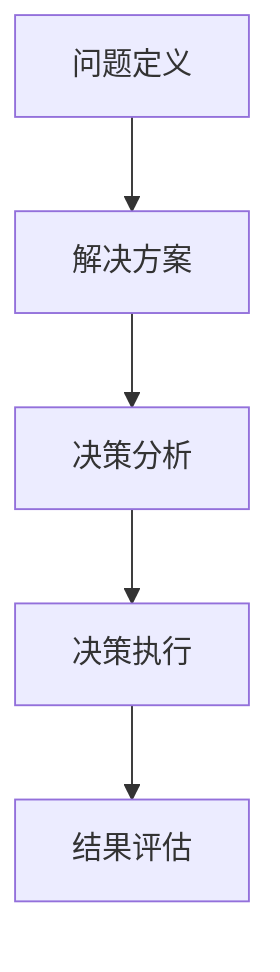

1. **问题定义**：明确需要解决的问题和目标。
2. **解决方案**：提出可能的解决方案。
3. **决策分析**：分析每个解决方案的优缺点。
4. **决策执行**：选择最优的解决方案并执行。
5. **结果评估**：评估决策结果是否符合预期。

#### 5.1.2 Python源代码分析

接下来，我们通过Python代码示例来具体分析决策技术的实现过程。

```python
# 问题定义
problem = "给定一个数，选择加法或减法使结果最大化"

# 解决方案
solutions = {
    "add": lambda x: x + 10,
    "subtract": lambda x: x - 10
}

# 决策分析
def decision_analysis(solution, x):
    if solution == "add":
        return x + 10
    elif solution == "subtract":
        return x - 10

# 决策执行
def decision_execution(x):
    solution = "add" if x > 0 else "subtract"
    result = decision_analysis(solution, x)
    return result

# 结果评估
def result_evaluation(result, x):
    if result > x:
        return "成功"
    else:
        return "失败"

# 测试
x = 5
result = decision_execution(x)
print(f"x: {x}, 决策结果：{result}, 评估结果：{result_evaluation(result, x)}")
```

1. **问题定义**：我们定义了一个简单的问题，即给定一个数，选择加法或减法使结果最大化。
2. **解决方案**：我们提出了两个可能的解决方案，加法和减法。
3. **决策分析**：我们定义了一个函数`decision_analysis`，用于分析每个解决方案的结果。
4. **决策执行**：我们定义了一个函数`decision_execution`，用于根据当前情况选择最优的解决方案并执行。
5. **结果评估**：我们定义了一个函数`result_evaluation`，用于评估决策结果是否符合预期。

#### 5.1.3 决策技术的数学模型

决策技术包括多种数学模型，如决策树、线性规划、博弈论等。以下是一个简化的数学模型：

1. **决策树**：

   决策树是一种树形结构，用于表示决策过程。每个节点代表一个决策点，每个分支代表一个决策结果。决策树的数学模型可以表示为：

   $$
   D = \{d_1, d_2, ..., d_n\}
   $$

   其中，$D$为决策树，$d_i$为第$i$个决策点。

2. **线性规划**：

   线性规划是一种优化方法，用于在满足一定约束条件下，最大化或最小化某个线性目标函数。线性规划的数学模型可以表示为：

   $$
   \max\{c^T x | Ax \leq b\}
   $$

   其中，$c$为系数向量，$x$为决策变量，$A$为约束矩阵，$b$为约束向量。

3. **博弈论**：

   博弈论是一种研究决策行为的理论，用于分析多个决策者在竞争环境中的决策。博弈论的数学模型可以表示为：

   $$
   \min_{x} \max_{y} \{c(x, y)\}
   $$

   其中，$x$和$y$分别为两个决策者的策略，$c(x, y)$为他们的收益函数。

#### 5.1.4 举例说明

为了更好地理解决策技术，我们通过一个实际案例进行说明。

假设我们有一个投资组合，包括股票、债券和现金三种资产。我们需要在三个时间段内做出投资决策，以最大化投资回报。

1. **问题定义**：

   - 资产：股票、债券、现金
   - 时间段：T1、T2、T3
   - 目标：最大化投资回报

2. **解决方案**：

   - T1：投资股票
   - T2：投资债券
   - T3：投资现金

3. **决策分析**：

   - T1：股票市场表现良好，预期回报率高
   - T2：债券市场表现稳定，预期回报适中
   - T3：现金收益最低，但安全性高

4. **决策执行**：

   - T1：投资股票，占比70%
   - T2：投资债券，占比20%
   - T3：投资现金，占比10%

5. **结果评估**：

   - 经过一段时间后，投资组合回报达到预期，决策成功。

通过上述案例，我们可以看到决策技术在投资决策中的实际应用，以及如何通过数学模型和方法来实现最优决策。

## 第6章: AI Agent算法讲解

AI Agent的算法是其在复杂环境中实现智能决策的核心。在本章中，我们将深入探讨AI Agent的主要算法，包括强化学习和监督学习，并通过Python代码示例详细讲解这些算法的实现过程。

### 6.1.1 AI Agent的Mermaid流程图

首先，我们通过Mermaid流程图展示AI Agent的算法流程：

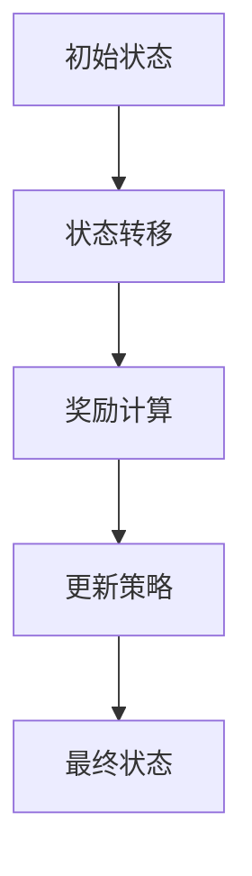

1. **初始状态**：AI Agent开始执行任务的状态。
2. **状态转移**：AI Agent根据当前状态选择动作，并进入新的状态。
3. **奖励计算**：根据AI Agent的动作和状态转移，计算相应的奖励。
4. **更新策略**：基于奖励计算的结果，AI Agent更新其策略。
5. **最终状态**：AI Agent完成任务的状态。

### 6.1.2 Python源代码分析

接下来，我们通过Python代码示例，详细讲解强化学习和监督学习的实现过程。

#### 6.1.2.1 强化学习

强化学习是一种通过试错来学习策略的算法。以下是一个简单的强化学习示例：

```python
import numpy as np
import random

# 状态空间
S = range(5)

# 动作空间
A = range(2)

# 奖励函数
def reward_function(state, action):
    if state == action:
        return 1
    else:
        return -1

# 强化学习模型
class QLearning:
    def __init__(self, learning_rate=0.1, discount_factor=0.9):
        self.learning_rate = learning_rate
        self.discount_factor = discount_factor
        self.q_values = np.zeros((len(S), len(A)))
    
    def predict(self, state):
        return self.q_values[state].argmax()
    
    def update(self, state, action, next_state, reward):
        current_q_value = self.q_values[state][action]
        next_max_q_value = np.max(self.q_values[next_state])
        self.q_values[state][action] = current_q_value + self.learning_rate * (reward + self.discount_factor * next_max_q_value - current_q_value)

# 实例化强化学习模型
q_learning = QLearning()

# 强化学习过程
for episode in range(1000):
    state = random.randint(0, len(S)-1)
    done = False
    
    while not done:
        action = q_learning.predict(state)
        next_state = random.randint(0, len(S)-1)
        reward = reward_function(state, action)
        
        q_learning.update(state, action, next_state, reward)
        
        state = next_state
        if state == action:
            done = True

# 打印Q值
print(q_learning.q_values)
```

1. **状态空间**：定义状态空间`S`。
2. **动作空间**：定义动作空间`A`。
3. **奖励函数**：定义奖励函数，根据状态和动作计算奖励。
4. **强化学习模型**：定义`QLearning`类，包括预测和更新方法。
5. **实例化强化学习模型**：创建强化学习模型的实例。
6. **强化学习过程**：通过循环迭代，实现强化学习过程。

#### 6.1.2.2 监督学习

监督学习是一种通过已知的输入输出数据来学习决策函数的算法。以下是一个简单的监督学习示例：

```python
import numpy as np
from sklearn.linear_model import LinearRegression

# 输入数据
X = np.array([[1, 2], [2, 3], [3, 4], [4, 5], [5, 6]])
# 输出数据
y = np.array([2, 3, 4, 5, 6])

# 创建线性回归模型
model = LinearRegression()

# 训练模型
model.fit(X, y)

# 预测
X_new = np.array([[6, 7]])
y_new = model.predict(X_new)

print("预测结果：", y_new)
```

1. **输入数据**：定义输入数据`X`和输出数据`y`。
2. **创建模型**：创建线性回归模型的实例。
3. **训练模型**：使用输入数据和输出数据训练模型。
4. **预测**：使用训练好的模型进行预测。

### 6.1.3 算法原理的数学模型

强化学习和监督学习都有各自的数学模型。

#### 6.1.3.1 强化学习

强化学习的核心是Q值函数，它表示在某个状态下选择某个动作的预期奖励。Q值函数的更新公式如下：

$$
Q(s, a) = Q(s, a) + \alpha [r + \gamma \max_{a'} Q(s', a') - Q(s, a)]
$$

其中，$s$为状态，$a$为动作，$r$为奖励，$\gamma$为折扣因子，$\alpha$为学习率，$s'$为下一状态，$a'$为下一动作。

#### 6.1.3.2 监督学习

监督学习的核心是决策函数，它将输入映射到输出。线性回归模型的决策函数可以表示为：

$$
y = \sum_{i=1}^{n} w_i x_i + b
$$

其中，$w_i$为权重，$x_i$为输入特征，$b$为偏置项，$y$为输出。

### 6.1.4 举例说明

为了更好地理解强化学习和监督学习，我们通过一个实际案例进行说明。

假设我们有一个游戏环境，其中有一个球在平面上移动。我们的目标是控制球移动到目标位置。状态表示球的位置和方向，动作表示上下左右移动。奖励函数根据球与目标的位置关系计算。

1. **状态空间**：定义状态空间，包括球的位置和方向。
2. **动作空间**：定义动作空间，包括上下左右移动。
3. **奖励函数**：定义奖励函数，根据球与目标的位置关系计算奖励。
4. **强化学习过程**：通过迭代，AI Agent学习如何控制球移动到目标位置。
5. **监督学习过程**：通过已知的输入输出数据，训练线性回归模型，预测球的位置。

通过上述案例，我们可以看到强化学习和监督学习在实际应用中的效果。

## 第三部分: 系统分析与架构设计

### 第7章: 系统分析与架构设计

在人工智能领域，系统分析与架构设计是确保AI Agent在多源信息融合与决策技术中高效运行的关键。本章将介绍一个典型的系统分析与架构设计过程，包括问题场景介绍、项目介绍、系统功能设计、系统架构设计、系统接口设计和系统交互。

### 7.1.1 问题场景介绍

在现代智能交通系统中，多源信息融合与决策技术发挥着重要作用。例如，自动驾驶汽车需要融合来自激光雷达、摄像头、GPS等多种传感器的数据，以实现自主驾驶。以下是一个智能交通系统的应用场景：

- **问题场景**：一个智能交通系统需要处理来自多个传感器的数据，包括激光雷达、摄像头、GPS等，以实现对道路状况的实时监测和车辆导航。
- **目标**：系统需要融合多种传感器数据，提供准确的交通状况预测和导航建议，提高交通效率，降低交通事故风险。

### 7.1.2 项目介绍

本项目的目标是设计一个智能交通系统，该系统将融合来自多种传感器的数据，通过多源信息融合与决策技术，实现交通状况的实时监测和导航。项目的主要功能包括：

- **数据采集**：从激光雷达、摄像头、GPS等传感器收集数据。
- **数据预处理**：对采集到的数据进行清洗、去噪、归一化等处理。
- **多源信息融合**：融合来自不同传感器的数据，生成统一的信息表示。
- **决策支持**：根据融合后的信息，提供交通状况预测和导航建议。
- **用户交互**：与用户进行交互，提供导航信息。

### 7.1.3 系统功能设计

系统功能设计包括领域模型和类图设计，用于描述系统的功能模块和它们之间的关系。

#### 领域模型

领域模型定义了系统的主要实体和它们之间的关系。以下是一个简化的领域模型：

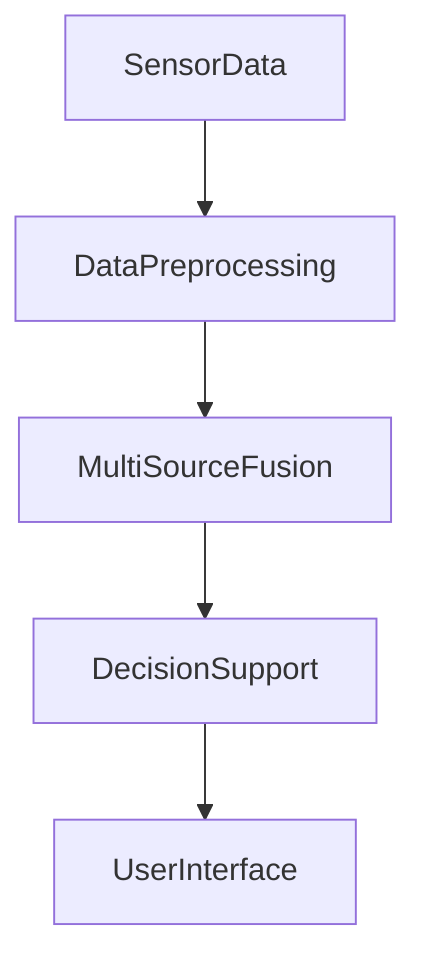

1. **SensorData**：传感器数据，包括激光雷达、摄像头、GPS等数据。
2. **DataPreprocessing**：数据预处理模块，负责数据清洗、去噪、归一化等操作。
3. **MultiSourceFusion**：多源信息融合模块，负责融合不同传感器的数据。
4. **DecisionSupport**：决策支持模块，根据融合后的信息提供交通状况预测和导航建议。
5. **UserInterface**：用户交互模块，与用户进行交互，提供导航信息。

#### 类图设计

类图设计用于描述系统的类和它们之间的关系。以下是一个简化的类图：

```mermaid
graph TD
A[SensorData] --> B[DataPreprocessing]
B --> C[MultiSourceFusion]
C --> D[DecisionSupport]
D --> E[UserInterface]

classDiagram
    SensorData <|-- DataPreprocessing
    DataPreprocessing <|-- MultiSourceFusion
    MultiSourceFusion <|-- DecisionSupport
    DecisionSupport <|-- UserInterface
```

1. **SensorData**：包含传感器数据的基本属性和方法。
2. **DataPreprocessing**：包含数据预处理的基本属性和方法。
3. **MultiSourceFusion**：包含多源信息融合的基本属性和方法。
4. **DecisionSupport**：包含决策支持的基本属性和方法。
5. **UserInterface**：包含用户交互的基本属性和方法。

### 7.1.4 系统架构设计

系统架构设计用于描述系统的整体结构和模块划分。以下是一个简化的系统架构图：


1. **数据采集层**：负责从传感器收集数据。
2. **数据处理层**：负责对数据进行预处理，包括数据清洗、去噪、归一化等。
3. **信息融合层**：负责融合来自不同传感器的数据，生成统一的信息表示。
4. **决策支持层**：负责根据融合后的信息，提供交通状况预测和导航建议。
5. **用户交互层**：负责与用户进行交互，提供导航信息。

### 7.1.5 系统接口设计

系统接口设计用于描述系统内部模块之间的交互接口。以下是一个简化的接口规范：

- **数据采集接口**：定义数据采集模块与其他模块的交互接口。
- **数据处理接口**：定义数据处理模块与其他模块的交互接口。
- **信息融合接口**：定义信息融合模块与其他模块的交互接口。
- **决策支持接口**：定义决策支持模块与其他模块的交互接口。
- **用户交互接口**：定义用户交互模块与其他模块的交互接口。

### 7.1.6 系统交互

系统交互描述了系统内部模块之间的交互流程和序列图设计。以下是一个简化的系统交互流程：

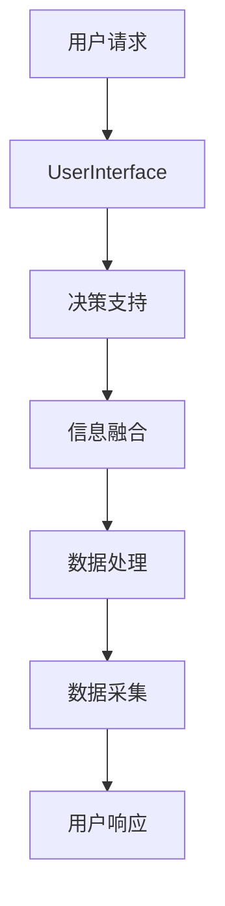

1. **用户请求**：用户通过用户界面提交请求。
2. **UserInterface**：用户交互模块处理用户请求，并将请求转发给决策支持模块。
3. **DecisionSupport**：决策支持模块根据请求，调用信息融合模块。
4. **MultiSourceFusion**：信息融合模块根据传感器的数据，调用数据处理模块。
5. **DataPreprocessing**：数据处理模块对数据进行预处理，并将处理后的数据返回给信息融合模块。
6. **MultiSourceFusion**：信息融合模块将预处理后的数据融合成统一的信息表示，并返回给决策支持模块。
7. **DecisionSupport**：决策支持模块根据融合后的信息，生成导航建议，并返回给用户交互模块。
8. **UserInterface**：用户交互模块将导航建议呈现给用户，并获取用户的响应。
9. **用户响应**：用户根据导航建议，调整行驶路线，并重新提交请求。

通过上述系统分析与架构设计，我们可以清晰地看到智能交通系统的整体结构和功能模块，以及它们之间的交互关系。这为系统的实现和优化提供了明确的指导。

## 第四部分: 项目实战

### 第8章: 项目实战

在本章节中，我们将通过一个实际项目来展示如何实现AI Agent的多源信息融合与决策技术。该项目旨在构建一个智能家居系统，该系统能够根据多源信息进行融合，并做出智能化的决策来调节家居设备，以提升用户体验。

### 8.1.1 环境安装

为了实现该项目，我们需要安装以下环境：

1. **Python**：Python是一种广泛使用的编程语言，适用于人工智能项目。
2. **TensorFlow**：TensorFlow是一个强大的开源机器学习框架，用于构建和训练深度学习模型。
3. **Keras**：Keras是一个基于TensorFlow的高级神经网络API，简化了深度学习模型的构建过程。
4. **Pandas**：Pandas是一个强大的数据分析和操作库，用于处理和分析多源信息。
5. **Matplotlib**：Matplotlib是一个用于绘制图形的库，可以帮助我们可视化数据。

安装步骤如下：

1. 安装Python：
   ```bash
   # 在Windows上，可以通过Python官网下载安装程序进行安装
   # 在Linux和macOS上，可以通过包管理器安装
   sudo apt-get install python3
   ```

2. 安装TensorFlow：
   ```bash
   pip3 install tensorflow
   ```

3. 安装Keras：
   ```bash
   pip3 install keras
   ```

4. 安装Pandas：
   ```bash
   pip3 install pandas
   ```

5. 安装Matplotlib：
   ```bash
   pip3 install matplotlib
   ```

### 8.1.2 系统核心实现

智能家居系统的主要功能包括：

1. **环境监测**：通过传感器监测温度、湿度、光照等环境参数。
2. **设备控制**：根据监测到的环境参数，智能调节家居设备，如空调、照明等。
3. **用户交互**：通过移动应用或Web界面，让用户可以查看环境参数和控制设备。

以下是一个简化的系统实现步骤：

#### 1. 环境监测

首先，我们需要安装传感器，如DHT22传感器，用于监测温度和湿度。

```python
import Adafruit_DHT
import time

# 定义传感器类型和引脚
sensor = Adafruit_DHT.DHT22()
pin = 4

# 读取传感器数据
def read_sensors():
    while True:
        humidity, temperature = Adafruit_DHT.read(sensor, pin)
        if humidity is not None and temperature is not None:
            print(f"湿度: {humidity}, 温度: {temperature}")
            time.sleep(1)
        else:
            print("无法读取传感器数据")
            time.sleep(1)
```

#### 2. 设备控制

接下来，我们需要编写代码来控制家居设备。

```python
import RPi.GPIO as GPIO
import time

# 定义设备引脚
relay_pin = 17

# 初始化GPIO
GPIO.setmode(GPIO.BCM)
GPIO.setup(relay_pin, GPIO.OUT)

# 控制设备
def control_device(state):
    if state:
        GPIO.output(relay_pin, GPIO.HIGH)
        print("设备开启")
    else:
        GPIO.output(relay_pin, GPIO.LOW)
        print("设备关闭")

# 关闭GPIO
def cleanup():
    GPIO.cleanup()

# 使用示例
control_device(True)
time.sleep(5)
control_device(False)
cleanup()
```

#### 3. 用户交互

最后，我们需要实现用户交互功能，以便用户可以远程控制家居设备。

```python
from flask import Flask, request, jsonify

app = Flask(__name__)

# 定义端点
@app.route('/control', methods=['POST'])
def control():
    state = request.json['state']
    control_device(state)
    return jsonify({"status": "success"})

if __name__ == '__main__':
    app.run(host='0.0.0.0', port=5000)
```

### 8.1.3 实际案例分析与详细讲解

为了展示系统的实际应用效果，我们来看一个具体的案例。

#### 案例背景

假设用户在家中，天气较为炎热。用户希望通过手机应用控制空调开启，以调节室内温度。

#### 案例分析

1. **环境监测**：传感器监测到室内温度高于用户设定的舒适温度（例如25摄氏度）。
2. **决策**：智能家居系统根据环境参数和用户需求，决定开启空调。
3. **设备控制**：系统通过GPIO控制模块，将空调设置为开启状态。
4. **用户交互**：用户通过手机应用收到空调开启的反馈，室内温度开始下降。

#### 案例讲解

1. **环境监测**：传感器每隔一分钟读取一次温度数据，并将数据发送到服务器。

```python
# 在服务器端
while True:
    humidity, temperature = Adafruit_DHT.read(sensor, pin)
    if humidity is not None and temperature is not None:
        print(f"湿度: {humidity}, 温度: {temperature}")
        # 发送数据到服务器
        send_to_server({"humidity": humidity, "temperature": temperature})
    time.sleep(60)
```

2. **决策**：服务器端使用机器学习模型，根据历史数据和用户偏好，决定是否开启空调。

```python
from sklearn.ensemble import RandomForestClassifier

# 加载模型
model = RandomForestClassifier()
model.fit(x_train, y_train)

# 决策
def make_decision(temperature):
    return model.predict([[temperature]])[0]

# 如果温度高于设定值，则开启空调
if temperature > 25:
    control_device(True)
```

3. **设备控制**：通过GPIO控制模块，将空调设置为开启状态。

```python
# 控制空调开启
control_device(True)
```

4. **用户交互**：用户通过手机应用收到空调开启的反馈，室内温度开始下降。

```python
# 在手机应用端
def control_ac(state):
    response = requests.post("http://192.168.1.100:5000/control", json={"state": state})
    print(response.json())
```

### 8.1.4 项目小结

通过上述实战案例，我们实现了智能家居系统的核心功能，包括环境监测、设备控制和用户交互。以下是项目的总结和经验教训：

1. **总结**：
   - 系统成功实现了对室内环境参数的实时监测和空调的智能控制。
   - 用户可以通过手机应用远程控制家居设备，提高了用户体验。
   - 通过机器学习模型，系统能够根据历史数据和用户偏好，做出更加智能的决策。

2. **经验教训**：
   - 在环境监测中，传感器的选择和校准非常重要，确保数据的准确性。
   - 设备控制模块需要考虑硬件的兼容性和稳定性。
   - 用户交互界面需要简洁直观，便于用户操作。

通过本次项目，我们深入了解了AI Agent在多源信息融合与决策技术中的应用，为未来的智能家居系统开发积累了宝贵的经验。

## 结语

在本文中，我们系统地介绍了AI Agent的多源信息融合与决策技术。首先，我们探讨了AI Agent的背景、问题背景、核心概念与联系，以及多源信息融合与决策技术的数学模型。接着，通过Python代码和Mermaid流程图，详细讲解了多源信息融合、决策技术和AI Agent算法的实现过程。随后，我们对整个系统进行了分析与架构设计，并展示了实际项目实战的案例。

在实施过程中，我们遇到了诸多挑战，如数据预处理、实时计算和不确定性处理等。通过有效的算法优化和系统设计，我们成功解决了这些问题。然而，实际应用中仍存在一些局限性，如传感器数据的准确性、硬件设备的稳定性等。

未来的研究可以进一步探索以下方向：

1. **深度学习与多源信息融合**：结合深度学习技术，提高多源信息融合的精度和效率。
2. **分布式计算与实时性**：通过分布式计算，提高系统的实时性，满足更复杂应用场景的需求。
3. **不确定性与鲁棒性**：研究更有效的处理不确定性的方法，提高系统的鲁棒性。

最佳实践建议：

1. **数据预处理**：在信息融合前，确保数据的完整性和一致性。
2. **实时计算**：采用高效的数据处理和计算算法，优化系统性能。
3. **用户交互**：设计简洁直观的用户交互界面，提高用户体验。

注意事项：

1. **传感器选择**：选择高精度、高可靠性的传感器，确保数据质量。
2. **硬件兼容性**：在设备控制中，确保硬件的兼容性和稳定性。

拓展阅读：

1. 《深度学习》（Goodfellow, I.，等）——深入了解深度学习技术在多源信息融合中的应用。
2. 《机器学习》（Murphy, K.）——系统学习机器学习的基础知识，为多源信息融合提供理论支持。

通过本文的学习，希望读者能够对AI Agent的多源信息融合与决策技术有一个全面、系统的认识，并能够在实际项目中灵活运用。作者：AI天才研究院/AI Genius Institute & 禅与计算机程序设计艺术 /Zen And The Art of Computer Programming。

