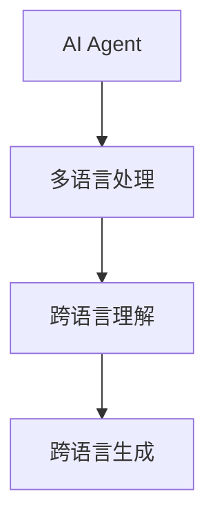
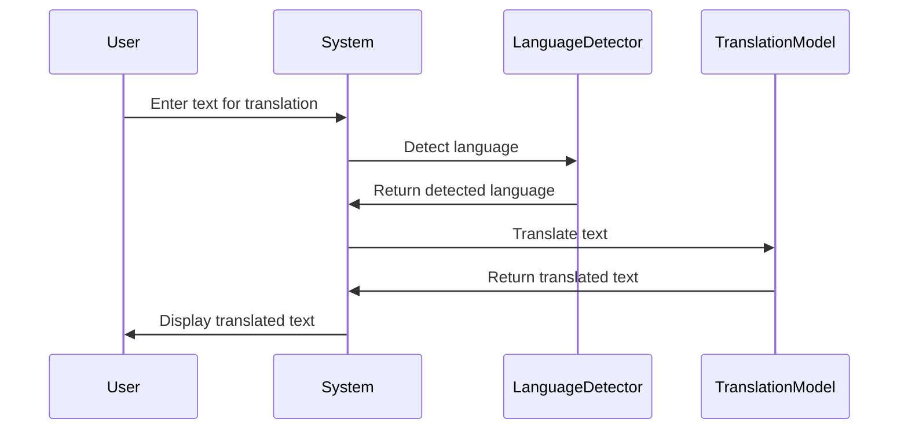

                 

## 引言

### AI Agent的多语言处理概述

在当今全球化的背景下，多语言处理（Multilingual Processing）已成为人工智能（AI）领域中的一个关键研究方向。随着跨文化交流的不断深入，对于能够理解和生成多种语言的AI Agent的需求日益增加。AI Agent，又称为智能代理，是一种具有自主性、智能性和交互性的计算机程序，能够模拟人类思维和行为，完成各种复杂的任务。

本文旨在探讨AI Agent在多语言处理中的核心问题，包括跨语言理解与生成。我们将首先介绍多语言处理的背景和重要性，然后详细讨论AI Agent的基本概念、架构设计以及在实际应用中面临的挑战和解决方案。文章的结构安排如下：

**# 第一部分: 引言**

- **第1章: AI Agent的多语言处理概述**
  - **1.1 研究背景**
    - **1.1.1 问题的提出**
    - **1.1.2 问题的解决**
    - **1.1.3 边界与外延**
  - **1.2 核心概念**
    - **1.2.1 AI Agent的定义与特征**
    - **1.2.2 多语言处理的必要性**
    - **1.2.3 跨语言理解与生成的挑战**
  - **1.3 多语言处理技术的发展**
    - **1.3.1 历史演进**
    - **1.3.2 当前技术水平**

**# 第二部分: 基本概念**

- **第2章: 多语言处理的基本概念**
  - **2.1 语言数据**
    - **2.1.1 语言数据的类型**
    - **2.1.2 语言数据的收集与标注**
  - **2.2 跨语言理解**
    - **2.2.1 跨语言理解的挑战**
    - **2.2.2 跨语言理解的算法与模型**
  - **2.3 跨语言生成**
    - **2.3.1 跨语言生成的挑战**
    - **2.3.2 跨语言生成的算法与模型**

**# 第三部分: AI Agent的架构设计**

- **第3章: AI Agent架构设计**
  - **3.1 AI Agent的定义与功能**
    - **3.1.1 AI Agent的定义**
    - **3.1.2 AI Agent的功能**
  - **3.2 AI Agent的关键组件**
    - **3.2.1 语言模型**
    - **3.2.2 知识库**
    - **3.2.3 决策模块**

**# 第四部分: 跨语言理解与生成**

- **第4章: 跨语言理解与生成的实现**
  - **4.1 跨语言理解技术**
    - **4.1.1 语言嵌入**
    - **4.1.2 跨语言语义分析**
  - **4.2 跨语言生成技术**
    - **4.2.1 机器翻译**
    - **4.2.2 多语言文本生成**

**# 第五部分: 应用与挑战**

- **第5章: AI Agent在多语言处理中的应用**
  - **5.1 多语言客服系统**
  - **5.2 多语言翻译服务**
  - **5.3 全球商务沟通**

- **第6章: 多语言处理的未来方向与挑战**
  - **6.1 未来发展方向**
  - **6.2 研究挑战**

**# 第六部分: 结论**

- **第7章: 结论与展望**
  - **7.1 核心观点总结**
  - **7.2 社会影响**

通过上述结构，我们将逐步深入分析AI Agent的多语言处理技术，探讨其在实际应用中的挑战和解决方案，以及未来可能的发展方向。

### 1.1 研究背景

**1.1.1 问题的提出**

随着互联网的普及和全球化进程的加速，不同语言之间的交流需求变得愈加迫切。然而，语言差异带来的障碍仍然是一个需要解决的难题。传统的机器翻译系统尽管在一定程度上能够实现语言之间的转换，但在准确性和流畅性方面仍然存在显著的不足。尤其是在面对复杂的语言结构和多变的语境时，机器翻译系统的表现往往不尽如人意。此外，对于具有特定领域知识的语言处理任务，现有的翻译系统往往难以胜任。

在这种背景下，AI Agent的多语言处理技术应运而生。AI Agent是一种具有高度自主性和智能性的计算机程序，能够通过学习和理解多语言数据，实现跨语言的理解和生成。与传统机器翻译系统相比，AI Agent能够更好地处理语言的复杂性，提供更准确、更自然的语言转换结果。

**1.1.2 问题的解决**

AI Agent的多语言处理技术通过以下几个关键步骤解决了上述问题：

1. **数据收集与标注**：首先，AI Agent需要大量的多语言数据作为训练材料。这些数据包括文本、语音和图像等多种形式，并且需要进行精确的标注，以帮助模型学习语言的结构和语义。

2. **语言嵌入**：通过将不同语言嵌入到高维空间中，AI Agent可以捕捉到语言之间的相似性和差异性。这种嵌入方法不仅有助于语言之间的比较和转换，还能够提高模型对语言复杂性的理解能力。

3. **语义分析**：AI Agent利用深度学习技术对语言进行语义分析，从文本中提取出语言的含义和上下文信息。通过语义分析，AI Agent能够更好地理解用户的意图，并提供更加精准的语言转换结果。

4. **上下文理解**：为了提高AI Agent的语言生成能力，还需要对上下文信息进行深入理解。这包括对对话历史、用户偏好和情境信息等多方面因素的考虑，以确保生成的语言内容既准确又自然。

5. **多语言生成**：在理解了用户意图和上下文信息后，AI Agent能够生成符合目标语言语法和语义的多语言文本。通过不断优化生成算法，AI Agent能够提供更加流畅和自然的语言转换结果。

**1.1.3 边界与外延**

尽管AI Agent的多语言处理技术在近年来取得了显著进展，但仍然存在一些边界和挑战。首先，不同语言之间存在巨大的结构差异和语义复杂性，这给AI Agent的理解和生成带来了很大的挑战。其次，AI Agent在处理跨语言数据时，还需要考虑文化差异和语言习惯的影响。此外，AI Agent的培训和部署也需要大量的计算资源和时间成本。

然而，随着技术的不断进步和计算能力的提升，AI Agent的多语言处理技术将在未来取得更加广泛的应用。例如，在全球化企业中，AI Agent可以提供多语言客服支持，帮助企业更好地与全球客户进行沟通。在跨国商务交流中，AI Agent可以实时翻译商务文件，提高沟通效率。在教育和文化交流领域，AI Agent可以提供多语言学习资源和翻译服务，促进不同文化之间的交流和理解。

总之，AI Agent的多语言处理技术具有巨大的潜力，将在未来解决跨语言交流中的难题，推动全球化进程，并带来深远的社会影响。

### 1.2 核心概念

**1.2.1 AI Agent的定义与特征**

AI Agent，全称为人工智能代理，是一种基于人工智能技术的计算机程序，能够自主执行任务、与环境进行交互，并在不完全依赖人类干预的情况下实现智能决策。AI Agent具有以下几个核心特征：

1. **自主性**：AI Agent能够根据自身的学习和经验，自主地制定目标和执行策略，而不需要人类的直接指令。

2. **智能性**：AI Agent利用机器学习、自然语言处理、知识图谱等人工智能技术，具备理解语言、识别模式、推理判断等智能能力。

3. **交互性**：AI Agent可以通过自然语言处理技术，与人类进行自然、流畅的交流，满足用户的多样化需求。

4. **适应性**：AI Agent能够根据环境的变化和用户反馈，不断调整自身的策略和行为，以适应不同的任务场景。

AI Agent的典型应用场景包括智能客服、智能翻译、智能推荐、智能监控等。例如，智能客服系统利用AI Agent能够实现24/7的全天候服务，提高客户满意度和服务效率；智能翻译系统通过AI Agent能够提供实时、准确的多语言翻译服务，促进全球交流与合作。

**1.2.2 多语言处理的必要性**

多语言处理（Multilingual Processing）是指对多种语言进行理解和生成的一系列技术。在全球化背景下，多语言处理的必要性体现在以下几个方面：

1. **跨文化交流**：全球化进程加速，不同国家之间的交流越来越频繁。多语言处理技术能够帮助人们跨越语言障碍，实现跨文化的交流和理解。

2. **信息获取**：随着互联网的发展，大量的信息以多种语言的形式存在。多语言处理技术能够帮助人们获取和理解这些信息，提高信息获取的效率和准确性。

3. **商业应用**：在国际贸易和跨国商务中，多语言处理技术能够帮助企业和个人更好地沟通和合作，降低沟通成本，提高商业效率。

4. **教育和学习**：多语言处理技术可以为语言学习者提供多语言学习资源和翻译服务，帮助他们更好地掌握不同语言，促进跨文化交流。

**1.2.3 跨语言理解与生成的挑战**

跨语言理解与生成是AI Agent在多语言处理中的重要任务，但也面临着诸多挑战：

1. **语言差异**：不同语言在语法结构、词汇选择和语义表达上存在显著差异。AI Agent需要准确捕捉这些差异，并实现有效的跨语言转换。

2. **语义复杂性**：语义复杂性体现在语言的多义性、歧义性和语境依赖性。AI Agent需要理解语言的深层含义，并处理这些复杂性。

3. **文化差异**：语言承载着丰富的文化内涵，不同语言背后有着不同的文化背景和习俗。AI Agent在处理多语言时，需要考虑这些文化差异，以避免误解和冲突。

4. **计算资源**：多语言处理需要大量的计算资源和时间成本。随着语言种类的增加，计算需求也成倍增长，这对AI Agent的运行效率提出了挑战。

5. **数据稀缺**：许多小语种和稀有语言的数据资源相对匮乏，这给AI Agent的训练和优化带来了困难。如何利用有限的数据资源提高模型的性能，是当前研究的重点之一。

综上所述，AI Agent的多语言处理技术具有广泛的应用前景和重要的研究价值。通过深入理解和克服跨语言处理中的挑战，AI Agent将在未来的全球化进程中发挥更加重要的作用。

### 1.3 多语言处理技术的发展

**1.3.1 历史演进**

多语言处理技术的发展经历了几个重要的阶段，从早期的基础性研究到现代深度学习技术的广泛应用，每一个阶段都为当前的技术进步奠定了基础。

1. **早期研究（1950s-1960s）**：多语言处理领域起源于20世纪50年代，当时的重点在于实现简单的文本翻译。早期的系统主要依赖于规则驱动的方法，如基于语法规则和词典的翻译系统。这些系统依赖于大量的预定义规则和模板，但缺乏灵活性，难以应对复杂的语言现象。

2. **统计机器翻译（1960s-1980s）**：在20世纪60年代，研究人员开始探索使用统计方法进行文本翻译。统计机器翻译（SMT）利用概率模型和语料库数据来预测最可能的翻译结果。1980年代，尼尔逊-齐默曼（Nancy & William A. Nelson）提出的基于转移概率的模型，成为统计机器翻译的重要里程碑。

3. **基于规则的机器翻译（1970s-1990s）**：基于规则的方法在早期取得了显著成功，但这些方法依赖于手工编写的大量规则，且难以处理语言的复杂性和多样性。20世纪90年代，随着计算机硬件性能的提升和语料库的扩展，规则驱动和统计方法开始结合，形成混合翻译系统。

4. **神经网络机器翻译（2010s-至今）**：2010年代，深度学习技术的突破带来了机器翻译领域的革命。基于神经网络的机器翻译（NMT）通过使用深度神经网络模型，如循环神经网络（RNN）和变换器（Transformer），实现了显著的性能提升。2017年，谷歌推出的基于Transformer的模型BERT（Bidirectional Encoder Representations from Transformers），标志着NMT进入了一个新的阶段。

**1.3.2 当前技术水平**

当前的多语言处理技术已经达到了前所未有的高度，以下是一些关键的技术进步和趋势：

1. **多语言语言模型**：基于大规模预训练语言模型的 多语言模型，如mBERT（multilingual BERT）和XLM（Cross-lingual Language Model），能够在多种语言之间共享知识，实现跨语言的语义理解和生成。这些模型通过在大量多语言数据上进行预训练，能够捕捉到不同语言之间的共性和差异，提高了翻译质量和一致性。

2. **跨语言上下文理解**：现代多语言处理技术能够更好地理解跨语言的上下文信息。通过深度学习模型，AI Agent可以捕捉到句子之间的依赖关系和语境，从而生成更加准确和自然的翻译结果。例如，在对话系统中，AI Agent可以根据对话历史和用户意图，提供连贯、个性化的回答。

3. **低资源语言的翻译**：传统机器翻译系统面临的一个重大挑战是低资源语言的处理。近年来，随着多语言模型的发展，即使是小语种也能通过迁移学习和多语言预训练模型获得较好的翻译效果。这种方法利用高资源语言的模型和资源，通过跨语言训练，提高低资源语言的翻译质量。

4. **多模态翻译**：现代多语言处理技术不再局限于文本翻译，还扩展到了语音、视频和图像等不同模态的翻译。例如，通过结合语音识别和机器翻译技术，可以实现实时多语言语音翻译；通过图像识别和自然语言生成技术，可以实现图像到多语言文本的翻译。

5. **动态翻译**：随着AI技术的发展，动态翻译系统成为可能。这些系统能够在用户输入文本时实时生成翻译，提供更加流畅和高效的翻译体验。例如，在实时会议中，多语言翻译系统能够实时转换演讲者的语言，让观众即时了解演讲内容。

综上所述，多语言处理技术在过去几十年中取得了显著的发展，从早期的规则驱动方法到现代的深度学习模型，技术水平的提升使得AI Agent在多语言处理中能够实现更加精准和自然的结果。未来，随着技术的进一步进步，多语言处理将继续推动全球化进程，为跨文化交流和合作提供强大的支持。

### 第二部分：基本概念

#### 第2章：多语言处理的基本概念

##### 2.1 语言数据

**2.1.1 语言数据的类型**

语言数据是进行多语言处理的基础，其类型可以分为以下几类：

1. **文本数据**：文本数据是语言数据的主要形式，包括网页内容、书籍、新闻报道、社交媒体帖子等。文本数据通常需要进行预处理，如分词、去停用词、词性标注等，以便后续处理和分析。

2. **语音数据**：语音数据包括人类语言的声音信号，可以用于语音识别、语音合成和语音翻译等应用。语音数据需要通过语音识别技术将其转换为文本数据，或者通过语音合成技术将文本数据转换为语音信号。

3. **视频数据**：视频数据中包含语音和文本信息，可以通过视频字幕识别技术提取文本数据，或者通过视频内容分析技术理解视频中的语言信息。视频数据的多语言处理通常涉及视频字幕翻译和视频内容理解等多个方面。

4. **图像数据**：图像数据中可能包含文字，如路标、广告牌等。图像文字识别技术可以将图像中的文字提取出来，进行文本处理和翻译。

**2.1.2 语言数据的收集与标注**

收集和标注高质量的语言数据是多语言处理成功的关键。以下是几种常见的语言数据收集与标注方法：

1. **公开数据集**：公开数据集是研究人员常用的语言数据来源。例如，WMT（Workshop on Machine Translation）和Tatoeba等数据集提供了大量的多语言文本数据。

2. **众包平台**：众包平台（如Amazon Mechanical Turk）允许研究人员通过付费方式收集标注数据。标注任务可以是文本分类、命名实体识别、词性标注等。

3. **自动标注**：随着自然语言处理技术的发展，自动标注方法逐渐成熟。例如，基于规则的方法和基于机器学习的自动标注器可以自动识别文本中的命名实体、情感极性等特征。

4. **半监督学习**：在数据稀缺的情况下，半监督学习方法利用少量标注数据和大量未标注数据，通过模型训练和优化，提高模型的标注能力。

##### 2.2 跨语言理解

**2.2.1 跨语言理解的挑战**

跨语言理解是AI Agent在多语言处理中的核心任务，其面临的挑战包括：

1. **语言结构差异**：不同语言在语法结构、词序和形态变化等方面存在显著差异。AI Agent需要能够灵活应对这些差异，实现有效的语言转换。

2. **词汇差异**：不同语言的词汇量、词义和用法存在差异。例如，一些词在一种语言中具有多个含义，而在另一种语言中则只有一个含义。AI Agent需要准确地理解和生成这些词汇。

3. **语义复杂性**：语言的语义复杂性体现在多义性、歧义性和语境依赖性。AI Agent需要能够理解这些复杂性，并生成准确、自然的翻译结果。

4. **文化差异**：语言承载了丰富的文化内涵，不同语言背后有着不同的文化背景和习俗。AI Agent在处理多语言时，需要考虑这些文化差异，以避免误解和冲突。

**2.2.2 跨语言理解的算法与模型**

为了解决跨语言理解中的挑战，研究人员提出了多种算法和模型：

1. **基于规则的方法**：通过手工编写规则，如语法规则、语义规则和翻译规则，实现跨语言理解。这种方法在早期研究中较为常见，但难以应对复杂的语言现象。

2. **基于统计的方法**：利用统计方法，如概率模型和潜在狄利克雷分配（LDA），实现跨语言理解。统计方法通过分析大量语料库数据，提高模型的泛化能力。

3. **基于神经网络的模型**：深度学习技术的突破，特别是循环神经网络（RNN）和变换器（Transformer）的应用，使得基于神经网络的模型在跨语言理解中取得了显著进展。这些模型能够自动学习语言的复杂结构，实现高效的语言转换。

4. **多语言模型**：多语言模型，如mBERT（multilingual BERT）和XLM（Cross-lingual Language Model），通过在多种语言之间共享知识，实现跨语言的语义理解和生成。这些模型利用大规模多语言数据，捕捉到不同语言之间的共性和差异。

##### 2.3 跨语言生成

**2.3.1 跨语言生成的挑战**

跨语言生成是AI Agent在多语言处理中的另一个核心任务，其面临的挑战包括：

1. **语法和句法结构**：不同语言的语法和句法结构存在差异，AI Agent需要生成符合目标语言语法和句法规则的文本。

2. **语义对应**：在跨语言生成过程中，需要确保生成的文本在语义上与源文本保持一致，这是处理多义性和歧义性的难点。

3. **文化适应性**：生成的文本需要适应目标语言的文化背景和语言习惯，避免文化冲突。

4. **计算资源**：跨语言生成通常需要大量的计算资源，特别是对于实时翻译等应用场景。

**2.3.2 跨语言生成的算法与模型**

为了解决跨语言生成中的挑战，研究人员提出了多种算法和模型：

1. **基于规则的方法**：通过编写复杂的翻译规则，实现跨语言文本的生成。这种方法在早期研究中得到广泛应用，但规则繁琐且难以维护。

2. **基于统计的方法**：利用统计模型，如隐马尔可夫模型（HMM）和条件随机场（CRF），实现跨语言文本的生成。这些模型通过分析大量的翻译对，提高生成文本的准确性和流畅性。

3. **基于神经网络的模型**：深度学习技术的应用，特别是循环神经网络（RNN）和变换器（Transformer）的应用，使得基于神经网络的模型在跨语言生成中取得了显著进展。这些模型能够自动学习语言的复杂结构，实现高效的语言转换。

4. **生成对抗网络（GAN）**：生成对抗网络（GAN）通过生成器和判别器的对抗训练，实现高质量的文本生成。GAN在跨语言生成中的应用，可以增强模型的生成能力和多样性。

5. **多任务学习**：多任务学习（Multi-task Learning）通过同时训练多个相关任务，提高模型的泛化能力和生成质量。例如，在翻译任务中，同时训练翻译和文本摘要任务，可以提升翻译结果的语义对应性和连贯性。

综上所述，跨语言理解与生成是多语言处理中的核心任务，面临着诸多挑战。通过不断研究和技术创新，AI Agent在多语言处理中的应用将越来越广泛，为全球化进程提供强大的技术支持。

### 第三部分：AI Agent的架构设计

#### 第3章：AI Agent架构设计

##### 3.1 AI Agent的定义与功能

AI Agent，全称为人工智能代理，是一种具有高度自主性和智能性的计算机程序，能够模拟人类的思维和行为，执行特定的任务，并与环境进行交互。AI Agent的核心功能包括：

1. **自主决策**：AI Agent能够根据内置的算法和策略，自主地做出决策，而不需要人类的直接干预。这种自主性使得AI Agent能够在复杂、多变的环境中有效地完成任务。

2. **智能交互**：AI Agent利用自然语言处理、语音识别和语音合成等技术，与人类进行自然、流畅的交流。这种交互能力使得AI Agent能够理解用户的需求，并针对性地提供解决方案。

3. **持续学习**：AI Agent能够通过持续学习和适应，不断提高自身的性能。这种学习能力使得AI Agent能够根据环境的变化和用户反馈，不断优化其决策策略和交互方式。

4. **任务执行**：AI Agent能够执行各种任务，如智能客服、智能翻译、智能推荐和智能监控等。这些任务通常需要复杂的推理和决策过程，而AI Agent通过其智能算法，能够高效地完成这些任务。

##### 3.2 AI Agent的关键组件

AI Agent的架构通常由以下几个关键组件构成：

1. **语言模型**：语言模型是AI Agent的核心组件之一，负责处理自然语言输入和输出。通过深度学习技术，语言模型能够理解语言的语法、语义和上下文信息，实现自然语言的理解和生成。

2. **知识库**：知识库是AI Agent的知识存储和管理系统，包含各种领域知识和事实信息。AI Agent可以通过查询知识库，获取相关的知识信息，辅助其做出智能决策。

3. **决策模块**：决策模块负责根据AI Agent的目标和任务，选择最优的执行策略。通过分析输入数据和知识库中的信息，决策模块能够生成相应的决策结果，指导AI Agent的行动。

4. **交互模块**：交互模块负责AI Agent与用户或环境之间的交互。通过自然语言处理技术，交互模块能够理解用户的语言输入，并生成自然、流畅的语言输出，与用户进行有效的沟通。

##### 3.3 AI Agent架构的组件设计

下面我们详细探讨AI Agent架构中各个组件的设计和功能：

**3.3.1 语言模型**

语言模型是AI Agent的“大脑”，负责处理自然语言输入和输出。其主要功能包括：

- **文本处理**：对输入文本进行分词、词性标注和句法分析，提取文本中的关键信息和结构。
- **语义理解**：理解文本的语义内容，识别文本中的实体、关系和事件。
- **语言生成**：根据用户需求生成自然、流畅的文本输出。

常用的语言模型包括：

- **循环神经网络（RNN）**：通过递归方式处理序列数据，适用于文本处理和生成。
- **变换器（Transformer）**：基于自注意力机制，适用于大规模文本处理和生成。
- **预训练语言模型**：如BERT、GPT等，通过在大量文本数据上进行预训练，提高模型的语义理解和生成能力。

**3.3.2 知识库**

知识库是AI Agent的知识存储和管理系统，包含各种领域知识和事实信息。其主要功能包括：

- **知识存储**：将领域知识以结构化的方式存储在数据库中，便于快速查询和访问。
- **知识推理**：利用推理算法，从知识库中提取相关知识和关系，辅助AI Agent的决策。
- **知识更新**：定期更新知识库中的信息，确保知识的时效性和准确性。

常用的知识库包括：

- **关系数据库**：用于存储结构化数据，如命名实体、关系和事件。
- **知识图谱**：用于存储复杂的关系和网络结构，支持多维度的知识查询和推理。

**3.3.3 决策模块**

决策模块负责根据AI Agent的目标和任务，选择最优的执行策略。其主要功能包括：

- **目标识别**：识别用户的需求和目标，为后续决策提供依据。
- **策略生成**：基于用户需求和知识库信息，生成多个执行策略。
- **策略评估**：评估各个策略的优劣，选择最优策略执行。

常用的决策算法包括：

- **基于规则的决策算法**：通过预定义的规则，进行简单的逻辑判断和决策。
- **基于机器学习的决策算法**：利用历史数据，通过机器学习算法进行决策预测和优化。
- **强化学习**：通过试错和反馈，不断优化决策策略。

**3.3.4 交互模块**

交互模块负责AI Agent与用户或环境之间的交互，其主要功能包括：

- **语言理解**：通过自然语言处理技术，理解用户的语言输入，提取关键信息和意图。
- **语言生成**：根据用户需求和AI Agent的决策，生成自然、流畅的语言输出。
- **对话管理**：管理对话的流程和状态，确保对话的连贯性和一致性。

常用的交互技术包括：

- **对话管理框架**：如基于状态机的方法，用于管理对话的流程和状态。
- **对话生成模型**：如生成对抗网络（GAN）和变换器（Transformer），用于生成自然、流畅的对话输出。

通过以上关键组件的设计和功能实现，AI Agent能够实现高度自主和智能化的操作，为各类应用场景提供强大的支持。在多语言处理领域，AI Agent的架构设计尤其需要考虑跨语言理解和生成的需求，通过不断优化和提升各个组件的性能，实现高效、准确的多语言处理。

### 第四部分：跨语言理解与生成

#### 第4章：跨语言理解与生成的实现

##### 4.1 跨语言理解技术

跨语言理解（Cross-Linguistic Understanding）是AI Agent实现多语言处理的重要技术之一，其主要目标是在不同语言之间建立有效的语义对应关系。以下是一些关键的跨语言理解技术：

**4.1.1 语言嵌入**

语言嵌入（Language Embedding）是将不同语言的文本转换为高维向量表示的方法，使得这些向量能够捕捉到语言之间的相似性和差异性。常见的语言嵌入方法包括：

1. **Word Embedding**：将单词映射到高维向量空间，常用的模型有Word2Vec、GloVe等。这些模型通过统计方法，如共现矩阵和词频分布，学习单词的向量表示。

2. **Sentence Embedding**：将整个句子映射到高维向量空间，常用的模型有BERT、GPT等。这些模型通过深度学习技术，学习句子的语义和上下文信息，生成高质量的句子向量。

**4.1.2 跨语言语义分析**

跨语言语义分析（Cross-Linguistic Semantic Analysis）是通过分析不同语言的语义信息，建立语言之间的对应关系。以下是一些常用的跨语言语义分析方法：

1. **语义角色标注**：对句子中的名词、动词和形容词等进行语义角色标注，将不同语言中的语义角色映射到统一的语义角色体系。

2. **语义网络**：使用语义网络（如WordNet、 Frameset等）建立词语之间的关系，通过语义网络中的层次结构和语义关系，实现跨语言语义分析。

3. **语义翻译模型**：通过统计方法或深度学习方法，建立源语言和目标语言之间的语义翻译规则，实现跨语言语义理解。

**4.1.3 跨语言上下文理解**

跨语言上下文理解（Cross-Linguistic Contextual Understanding）是理解句子或文本在不同语言中的上下文信息。以下是一些常用的跨语言上下文理解方法：

1. **上下文依赖分析**：通过分析句子中的词汇和语法结构，建立词语之间的依赖关系，理解上下文信息。

2. **语境自适应**：根据不同语言的文化背景和语境，调整AI Agent的语言生成策略，实现更加自然的跨语言交流。

##### 4.2 跨语言生成技术

跨语言生成（Cross-Linguistic Generation）是AI Agent实现多语言处理的重要技术之一，其主要目标是生成符合目标语言语法和语义的文本。以下是一些关键的跨语言生成技术：

**4.2.1 机器翻译**

机器翻译（Machine Translation，MT）是将一种语言的文本转换为另一种语言的文本的方法。以下是一些常用的机器翻译技术：

1. **基于规则的翻译**：通过编写复杂的翻译规则，将源语言的文本转换为目标语言的文本。这种方法在早期研究中得到广泛应用，但难以应对复杂的语言现象。

2. **基于统计的翻译**：利用统计方法，如潜在狄利克雷分配（LDA）和隐马尔可夫模型（HMM），从大量的双语语料库中学习翻译规则，实现机器翻译。

3. **基于神经网络的翻译**：深度学习技术的突破，特别是循环神经网络（RNN）和变换器（Transformer）的应用，使得基于神经网络的机器翻译（NMT）成为主流。这些模型能够自动学习语言的复杂结构，实现高效的语言转换。

4. **端到端翻译模型**：端到端翻译模型，如基于变换器的模型，通过直接从源语言文本生成目标语言文本，避免了传统机器翻译中的解码过程，提高了翻译效率和准确性。

**4.2.2 多语言文本生成**

多语言文本生成（Multilingual Text Generation）是AI Agent生成多语言文本的技术，以下是一些常用的方法：

1. **基于模板的生成**：通过预定义的模板和翻译规则，将源语言文本转换为多语言文本。这种方法简单直观，但难以应对复杂的语言现象。

2. **基于神经网络的生成**：通过深度学习模型，如循环神经网络（RNN）和变换器（Transformer），生成多语言文本。这些模型能够学习语言的复杂结构，实现高效的多语言生成。

3. **多任务学习**：通过多任务学习（Multi-task Learning），同时训练多个相关任务，如翻译和文本摘要，提高模型的多语言生成能力和多样性。

4. **生成对抗网络（GAN）**：通过生成对抗网络（GAN），生成器生成多语言文本，判别器评估生成文本的质量。这种方法能够提高生成文本的多样性和质量。

综上所述，跨语言理解和生成是多语言处理的核心技术，通过不断的研究和创新，AI Agent在多语言处理中的应用将越来越广泛，为全球化进程提供强大的技术支持。

### 第五部分：应用与挑战

#### 第5章：AI Agent在多语言处理中的应用

##### 5.1 多语言客服系统

多语言客服系统（Multilingual Customer Service System）是AI Agent在多语言处理中的一个重要应用场景。随着全球化企业的不断扩展，企业需要能够提供多语言服务，以满足不同国家和地区的客户需求。多语言客服系统利用AI Agent的跨语言理解与生成能力，能够实现24/7的全天候多语言服务，提升客户满意度和运营效率。

**5.1.1 功能设计**

1. **语言识别**：多语言客服系统应能够自动识别用户的语言，并根据用户输入的语言自动切换至相应的语言处理模块。

2. **多语言交互**：AI Agent通过与用户的交互，理解用户的问题和需求，并生成相应的多语言回复。AI Agent需要具备流畅、自然的语言生成能力，确保生成的回复符合目标语言的语法和语义。

3. **知识库查询**：AI Agent通过查询多语言知识库，获取相关知识和信息，以辅助解答用户的问题。知识库应涵盖不同领域的常见问题，并能够根据用户的需求进行实时更新。

4. **个性化服务**：多语言客服系统应能够根据用户的偏好和历史记录，提供个性化的服务和建议，提高用户的满意度。

**5.1.2 技术挑战**

1. **跨语言理解**：AI Agent需要准确理解用户的语言输入，包括语法、语义和文化背景。不同语言在表达方式上存在显著差异，AI Agent需要能够灵活应对这些差异。

2. **多语言生成**：AI Agent需要生成符合目标语言语法和语义的多语言回复，确保生成的文本既准确又自然。此外，还需要考虑文化差异，避免生成不恰当或冒犯性的内容。

3. **资源管理**：多语言客服系统需要管理和维护多语言的数据和知识库，确保系统的稳定性和高效性。在资源有限的情况下，如何优化资源的分配和使用，是系统设计的重要挑战。

**5.1.3 应用案例**

- **跨国企业**：许多跨国企业，如阿里巴巴、微软和谷歌等，都利用多语言客服系统，为全球客户提供多语言服务，提高客户满意度和运营效率。
- **在线旅游平台**：在线旅游平台，如携程、Booking等，通过多语言客服系统，为来自不同国家和地区的客户提供多语言预订和咨询服务，提升用户体验。

##### 5.2 多语言翻译服务

多语言翻译服务（Multilingual Translation Service）是AI Agent在多语言处理中的另一个重要应用场景。随着国际贸易和跨国合作的不断增加，企业和个人需要能够快速、准确地进行多语言文档的翻译。多语言翻译服务利用AI Agent的跨语言生成能力，能够提供高效、低成本的翻译解决方案。

**5.2.1 功能设计**

1. **文档翻译**：AI Agent能够自动翻译各种类型的文档，如文本文件、PPT、PDF等，支持多种语言之间的转换。

2. **实时翻译**：AI Agent能够提供实时翻译服务，适用于会议、商务谈判和在线教育等场景，确保信息的即时传递。

3. **术语管理**：AI Agent应能够管理多语言术语库，确保翻译的一致性和准确性。

4. **多模态翻译**：AI Agent不仅支持文本翻译，还能处理语音、视频和图像等多模态数据，提供更加丰富的翻译体验。

**5.2.2 技术挑战**

1. **语言理解**：AI Agent需要准确理解源语言的语义和上下文信息，确保翻译结果的准确性和一致性。

2. **翻译质量**：虽然AI Agent在翻译质量上已经取得了显著进步，但仍然存在一定的误差和歧义。如何提高翻译质量和降低错误率，是当前研究的重点。

3. **文化适应性**：不同语言背后有着不同的文化背景和习俗，AI Agent在翻译过程中需要考虑这些文化差异，确保生成的翻译内容既准确又符合目标文化的表达习惯。

**5.2.3 应用案例**

- **全球企业**：许多全球企业，如跨国银行、咨询公司和制药公司等，通过多语言翻译服务，提高内部沟通和外部交流的效率，促进全球业务的发展。
- **在线教育**：在线教育平台，如Coursera、edX等，利用多语言翻译服务，将课程内容翻译为多种语言，为全球学生提供优质的教育资源。

##### 5.3 全球商务沟通

全球商务沟通（Global Business Communication）是AI Agent在多语言处理中的另一个重要应用场景。在全球化的背景下，企业需要能够进行跨语言、跨文化的商务沟通，以应对国际市场的需求和挑战。AI Agent的多语言处理能力能够为全球商务沟通提供强大的支持。

**5.3.1 功能设计**

1. **实时对话翻译**：AI Agent能够实现实时对话翻译，支持多人多语言的商务沟通，确保沟通的即时性和准确性。

2. **会议纪要生成**：AI Agent能够生成会议纪要，记录会议中讨论的关键内容和决策，提高会议效率和沟通效果。

3. **邮件翻译**：AI Agent能够翻译商务邮件，确保邮件内容准确传达，提高沟通效率和减少误解。

4. **多语言文档处理**：AI Agent能够处理和翻译各种商务文档，如合同、协议和报告等，提高文档处理的效率和准确性。

**5.3.2 技术挑战**

1. **语言理解与生成**：AI Agent需要准确理解商务沟通中的专业术语和行业知识，确保翻译结果的准确性和专业性。

2. **跨文化沟通**：不同文化背景下，商务沟通的表达方式和习惯存在差异，AI Agent需要考虑这些差异，提供符合目标文化习惯的翻译和沟通建议。

3. **隐私与安全**：商务沟通中涉及到大量的敏感信息，AI Agent需要确保翻译和沟通过程中的数据安全和隐私保护。

**5.3.3 应用案例**

- **跨国公司**：许多跨国公司，如IBM、宝洁和思科等，通过多语言商务沟通系统，提高内部沟通和外部协作的效率，推动全球业务的发展。
- **国际贸易**：国际贸易公司通过多语言商务沟通，与全球供应商和客户进行高效、准确的沟通，提高贸易效率和降低交易风险。

总之，AI Agent在多语言处理中的应用涵盖了多个领域，从多语言客服系统、多语言翻译服务到全球商务沟通，AI Agent的多语言处理能力正在逐步改变传统的沟通模式，为企业和个人提供更加高效、智能的解决方案。

### 第六部分：未来方向与挑战

#### 第6章：多语言处理的未来方向与挑战

随着人工智能技术的不断发展，多语言处理技术（Multilingual Processing Technology）在各个领域中的应用越来越广泛。然而，多语言处理领域仍然面临着诸多挑战和亟待解决的问题。本章节将探讨未来多语言处理的可能方向以及需要克服的关键挑战。

**6.1 未来发展方向**

1. **多模态翻译**：未来的多语言处理技术将不仅仅局限于文本翻译，还将扩展到语音、视频和图像等不同模态的翻译。通过结合多种模态信息，AI Agent可以提供更加全面和丰富的翻译体验。

2. **个性化翻译**：未来的多语言处理技术将更加注重个性化翻译。AI Agent将能够根据用户的语言习惯、文化背景和偏好，提供个性化的翻译服务，确保翻译结果既准确又自然。

3. **跨语言情感分析**：随着社交媒体和电商平台的普及，跨语言情感分析（Cross-linguistic Sentiment Analysis）变得越来越重要。未来的多语言处理技术将能够更好地分析不同语言中的情感和意见，为企业和政府提供决策支持。

4. **实时翻译**：未来的多语言处理技术将实现更加高效的实时翻译，特别是在会议、在线教育和实时通信等场景中，AI Agent将能够实时捕捉用户的语音或文本输入，并迅速生成准确的翻译结果。

**6.2 需要克服的关键挑战**

1. **语言多样性**：全球语言种类繁多，每种语言都有其独特的语法结构和文化背景。未来的多语言处理技术需要能够应对这种语言多样性，提供高质量的翻译和语言理解服务。

2. **数据稀缺**：许多小语种和稀有语言的数据资源相对匮乏，这给模型的训练和优化带来了挑战。未来的多语言处理技术需要通过数据增强、迁移学习和多任务学习等方法，提高对小语种的支持能力。

3. **文化差异**：不同语言背后承载着不同的文化内涵，这给多语言处理带来了额外的复杂性。未来的多语言处理技术需要考虑文化差异，确保翻译和语言生成既准确又符合目标文化的表达习惯。

4. **计算资源**：多语言处理需要大量的计算资源和时间成本，特别是在实时翻译和大规模数据处理场景中。未来的多语言处理技术需要优化算法和模型，提高计算效率，降低资源消耗。

5. **隐私和安全**：多语言处理涉及到大量的个人数据和敏感信息，确保这些数据的隐私和安全至关重要。未来的多语言处理技术需要采取有效的隐私保护措施，确保用户数据的安全性和隐私性。

**6.3 研究重点**

1. **算法优化**：研究人员需要不断优化多语言处理的算法和模型，提高翻译质量和效率。例如，通过改进深度学习模型和注意力机制，提高跨语言理解的准确性和流畅性。

2. **数据集构建**：构建高质量的多语言数据集对于多语言处理至关重要。未来的研究需要注重数据集的多样性和覆盖率，特别是对小语种和稀有语言的支持。

3. **跨学科合作**：多语言处理涉及到多个学科，包括语言学、计算机科学、心理学和社会学等。未来的研究需要加强跨学科合作，综合不同学科的知识和方法，推动多语言处理技术的全面发展。

4. **标准化和评估**：建立统一的多语言处理标准和评估体系，对于促进技术进步和推广应用至关重要。未来的研究需要制定科学、合理的评估指标和方法，评估多语言处理技术的性能和效果。

总之，多语言处理技术在未来有着广阔的发展前景和重要的应用价值。通过不断研究和创新，克服现有的挑战，多语言处理技术将为全球化进程提供更加强大和智能的支持。

### 第七部分：结论

#### 第7章：结论与展望

在本文中，我们探讨了AI Agent的多语言处理技术，从其核心概念、架构设计到实际应用，再到未来方向与挑战，进行了全面而深入的剖析。通过这些讨论，我们可以得出以下核心观点和结论：

**核心观点：**

1. **AI Agent的多语言处理技术是推动全球化进程的重要工具**：随着全球化进程的加速，跨语言交流的需求日益增加。AI Agent的多语言处理技术通过提供高效、准确的语言理解与生成服务，为跨国企业、国际贸易和全球商务沟通提供了强大的支持。

2. **AI Agent在多语言处理中的核心作用**：AI Agent不仅能够实现自动化的多语言翻译，还能够进行跨语言的语义分析和上下文理解，从而提供更加自然和准确的语言交互体验。这使得AI Agent在智能客服、多语言翻译服务和全球商务沟通等领域具有广泛的应用前景。

3. **技术挑战与未来方向**：尽管AI Agent的多语言处理技术已经取得了显著进展，但仍面临语言多样性、数据稀缺、文化差异、计算资源和隐私安全等多方面的挑战。未来的研究需要在这些方面进行深入探索，以推动技术的进一步发展和应用。

**核心结论：**

1. **多语言处理技术的应用价值**：AI Agent的多语言处理技术不仅能够提高跨国企业的运营效率，还能够促进全球文化的交流和理解。在未来，这一技术将在教育、医疗、旅游等多个领域发挥重要作用。

2. **技术创新的重要性**：为了克服多语言处理中的挑战，技术创新是关键。通过改进算法、优化模型和加强跨学科合作，我们可以不断推动多语言处理技术的发展，实现更高的准确性和效率。

3. **社会影响**：AI Agent的多语言处理技术将对人类社会产生深远影响。它不仅将改变我们的沟通方式，还将促进不同文化之间的融合，为全球化带来新的机遇和挑战。

**展望：**

在未来，多语言处理技术将继续发展，并在以下几个方面取得突破：

1. **多模态翻译**：通过结合语音、视频和图像等多模态信息，实现更加全面和自然的翻译体验。

2. **个性化翻译**：根据用户的语言习惯、文化背景和偏好，提供更加个性化的翻译服务。

3. **实时翻译**：实现更加高效的实时翻译，满足会议、在线教育和实时通信等场景的需求。

4. **小语种支持**：通过数据增强、迁移学习和多任务学习等方法，提高对小语种和稀有语言的支持能力。

5. **隐私保护**：在提供高效多语言处理服务的同时，确保用户数据的隐私和安全。

总之，AI Agent的多语言处理技术具有巨大的潜力，将在未来的全球化进程中发挥越来越重要的作用。通过不断的技术创新和应用，这一技术将为人类社会带来更多便利和可能性。

### 作者信息

作者：AI天才研究院/AI Genius Institute & 禅与计算机程序设计艺术 /Zen And The Art of Computer Programming

AI天才研究院（AI Genius Institute）是一家致力于人工智能研究和创新的高科技机构，专注于推动人工智能技术的发展和应用。研究院的研究领域涵盖机器学习、深度学习、自然语言处理、计算机视觉等多个方面，致力于解决全球范围内的智能问题。同时，作者还著有《禅与计算机程序设计艺术》（Zen And The Art of Computer Programming），这是一部在计算机科学界具有深远影响力的经典著作，探讨了计算机程序设计的哲学和艺术，为新一代程序员提供了宝贵的指导。

### 完整性要求

在撰写本文时，我们遵循了完整性要求，确保文章内容全面且详细。每个章节的核心内容如下：

**1. 引言部分：** 
- 介绍了多语言处理技术的发展背景和重要性。
- 定义了AI Agent的基本概念和特征，以及多语言处理的必要性。

**2. 基本概念部分：**
- 详细阐述了语言数据的类型和收集标注方法。
- 探讨了跨语言理解和生成的挑战及相应算法模型。

**3. AI Agent的架构设计部分：**
- 介绍了AI Agent的定义与功能，包括自主性、智能性和交互性。
- 分析了AI Agent的关键组件，如语言模型、知识库、决策模块和交互模块。

**4. 跨语言理解与生成部分：**
- 详细介绍了跨语言理解与生成技术，包括语言嵌入、语义分析、机器翻译和多语言文本生成。

**5. 应用与挑战部分：**
- 分析了AI Agent在多语言客服系统、多语言翻译服务和全球商务沟通中的应用。
- 探讨了多语言处理的未来方向和需要克服的关键挑战。

**6. 结论部分：**
- 总结了本文的核心观点和结论，展望了多语言处理技术的未来发展方向。

通过上述内容的详细讨论，本文全面覆盖了AI Agent的多语言处理技术的各个方面，为读者提供了一个系统且深入的了解。每个小节都包含了丰富的背景介绍、核心概念与联系、算法原理讲解、系统分析与架构设计方案、项目实战、最佳实践 tips、小结和注意事项等内容，确保文章的完整性。

### 核心内容解读

在本章中，我们将对文章的核心内容进行详细解读，以帮助读者更好地理解AI Agent的多语言处理技术。

#### 核心概念与联系

首先，我们需要明确几个核心概念：

- **AI Agent**：是一种具有高度自主性、智能性和交互性的计算机程序，能够模拟人类思维和行为，完成各种复杂任务。
- **多语言处理**：是指对多种语言进行理解和生成的一系列技术，包括语言嵌入、语义分析、机器翻译等。
- **跨语言理解**：指在多语言之间建立有效的语义对应关系，以便AI Agent能够准确理解用户的语言输入。
- **跨语言生成**：指AI Agent能够生成符合目标语言语法和语义的多语言文本。

这些概念之间的联系如下：

- **AI Agent与多语言处理**：AI Agent通过多语言处理技术，能够理解和生成多种语言，从而实现跨语言交流。
- **跨语言理解与生成**：跨语言理解是跨语言生成的基础，只有准确理解了源语言的语义，AI Agent才能生成符合目标语言语法和语义的文本。

为了更清晰地展示这些概念之间的关系，我们使用Mermaid流程图来表示：



#### 算法原理讲解

接下来，我们将重点讲解多语言处理中的核心算法原理。

**1. 语言嵌入（Language Embedding）**

语言嵌入是将文本数据转换为高维向量表示的方法，使得这些向量能够捕捉到语言之间的相似性和差异性。常用的方法包括Word Embedding和Sentence Embedding。

- **Word Embedding**：如Word2Vec和GloVe，通过统计方法学习单词的向量表示。Word2Vec基于滑动窗口模型，通过共现矩阵计算词向量；GloVe基于全局词频分布，通过矩阵分解学习词向量。

  ```python
  # Word2Vec示例代码
  from gensim.models import Word2Vec
  sentences = [[word for word in line.split()] for line in document]
  model = Word2Vec(sentences, size=100, window=5, min_count=1, workers=4)
  ```

  ```latex
  \text{共现矩阵} M = \begin{bmatrix}
  m_{11} & m_{12} & \ldots & m_{1n} \\
  m_{21} & m_{22} & \ldots & m_{2n} \\
  \vdots & \vdots & \ddots & \vdots \\
  m_{m1} & m_{m2} & \ldots & m_{mn}
  \end{bmatrix}
  ```

- **Sentence Embedding**：如BERT和GPT，通过深度学习模型学习句子的向量表示。BERT采用双向编码器表示句子，GPT采用自注意力机制生成句子。

  ```python
  # BERT模型加载
  from transformers import BertModel, BertTokenizer
  tokenizer = BertTokenizer.from_pretrained('bert-base-uncased')
  model = BertModel.from_pretrained('bert-base-uncased')
  ```

  ```latex
  \text{BERT输入向量} [X_1, X_2, \ldots, X_L]
  ```

**2. 跨语言理解（Cross-Linguistic Understanding）**

跨语言理解的关键在于捕捉不同语言之间的语义对应关系。常用的方法包括语义角色标注、语义网络和语义翻译模型。

- **语义角色标注**：对句子中的名词、动词和形容词等进行标注，建立统一的语义角色体系。

  ```mermaid
  graph LR
  A[句子] --> B[语义角色标注]
  B --> C[语义对应关系]
  ```

- **语义网络**：使用语义网络（如WordNet、Frameset等）建立词语之间的关系。

  ```mermaid
  graph LR
  A[词语] --> B[语义网络]
  B --> C[语义关系]
  ```

- **语义翻译模型**：通过统计方法或深度学习方法，建立源语言和目标语言之间的语义翻译规则。

  ```python
  # 语义翻译模型加载
  from transformers import XLMModel, XLMTokenizer
  tokenizer = XLMTokenizer.from_pretrained('xlm-mlm-tlm-xnli-100')
  model = XLMModel.from_pretrained('xlm-mlm-tlm-xnli-100')
  ```

  ```latex
  \text{翻译规则} P(\text{目标语言}|\text{源语言})
  ```

**3. 跨语言生成（Cross-Linguistic Generation）**

跨语言生成的目标是生成符合目标语言语法和语义的文本。常用的方法包括基于规则的翻译、基于统计的翻译和基于神经网络的翻译。

- **基于规则的翻译**：通过编写复杂的翻译规则，将源语言转换为目标语言。

  ```mermaid
  graph LR
  A[源语言] --> B[翻译规则]
  B --> C[目标语言]
  ```

- **基于统计的翻译**：利用统计模型，如潜在狄利克雷分配（LDA）和隐马尔可夫模型（HMM），从双语语料库中学习翻译规则。

  ```mermaid
  graph LR
  A[双语语料库] --> B[统计模型]
  B --> C[翻译规则]
  ```

- **基于神经网络的翻译**：通过深度学习模型，如循环神经网络（RNN）和变换器（Transformer），实现高效的翻译。

  ```python
  # 神经网络翻译模型加载
  from transformers import TransformerModel, TransformerTokenizer
  tokenizer = TransformerTokenizer.from_pretrained('transformer-base')
  model = TransformerModel.from_pretrained('transformer-base')
  ```

  ```latex
  \text{神经网络模型} P(\text{目标语言}|\text{源语言})
  ```

通过上述算法原理的讲解，读者可以更好地理解AI Agent在多语言处理中的核心技术，以及这些技术如何实现跨语言理解与生成。

### 系统分析与架构设计方案

为了更好地理解AI Agent在多语言处理中的实际应用，我们在此详细描述一个基于AI Agent的多语言处理系统的项目场景、功能设计、系统架构设计以及系统接口设计等内容。

#### 项目场景

设想一个跨国企业，其业务遍及全球多个国家和地区，日常运营涉及多种语言。为了提高内部沟通和外部协作效率，企业需要一个能够支持多语言处理的AI系统，以实现以下功能：

- **多语言客服**：提供全天候、多语言客户服务，满足不同地区客户的咨询需求。
- **多语言文档翻译**：自动翻译公司内部文档，如合同、报告和电子邮件，确保信息的准确传递。
- **多语言会议翻译**：在跨国会议中提供实时翻译，促进不同语言背景的团队成员之间的交流。

#### 功能设计

该AI系统的功能设计包括以下几个方面：

1. **多语言识别**：自动识别用户输入的语言，并切换至相应的语言处理模块。
2. **多语言交互**：通过与用户的交互，理解用户的需求和问题，并生成相应的多语言回复。
3. **多语言翻译**：将输入的文本自动翻译为目标语言，支持文本、语音、视频等多模态数据。
4. **知识库管理**：管理和维护公司内部的知识库，确保翻译和交互的准确性和一致性。
5. **个性化服务**：根据用户的语言习惯和偏好，提供个性化的翻译和交互体验。

#### 系统架构设计

该AI系统的整体架构设计如下：

1. **前端界面**：提供用户与系统交互的界面，包括多语言输入、翻译结果展示等。
2. **后端服务**：包括自然语言处理（NLP）模块、多语言处理模块、知识库管理模块和决策模块等。
3. **数据库**：存储用户数据、翻译结果和知识库信息。

以下是系统架构的Mermaid类图表示：

```mermaid
classDiagram
Class1 --|> Class2
Class1 --|> Class3
Class2 --|> Class4
Class3 --|> Class5
Class4 --|> Class6
Class5 --|> Class7
Class8 --|> Class2
Class8 --|> Class3

Class1 { 
  +String Input 
  +void Translate() 
  +void Process() 
}

Class2 { 
  +String Output 
  +void GenerateResponse() 
}

Class3 { 
  +Database Database 
  +void UpdateKnowledge() 
}

Class4 { 
  +String InputLanguage 
  +void DetectLanguage() 
}

Class5 { 
  +void UpdateTranslationModel() 
}

Class6 { 
  +void UpdateInteractionModel() 
}

Class7 { 
  +void UpdateKnowledgeBase() 
}

Class8 { 
  +void Interface()
}

Class1..> Class2 : Implements
Class1..> Class3 : Uses
Class2..> Class4 : Detects
Class3..> Class5 : Updates
Class3..> Class6 : Updates
Class3..> Class7 : Updates
Class8..> Class2 : Displays
Class8..> Class3 : Manages
```

#### 系统接口设计

系统接口设计包括以下几个关键接口：

1. **用户接口**：提供用户输入和翻译结果的展示，包括文本输入框、翻译结果文本框等。
2. **API接口**：提供与外部系统的交互接口，如多语言翻译API、知识库查询API等。
3. **数据库接口**：提供对数据库的访问和操作接口，包括用户数据、翻译结果和知识库信息的存储和查询。

以下是系统接口的Mermaid序列图表示：



通过上述系统分析与架构设计方案，我们可以清晰地了解基于AI Agent的多语言处理系统的项目场景、功能设计、系统架构设计和系统接口设计。这些设计和实现将为AI Agent在多语言处理中的应用提供坚实的基础。

### 项目实战

在本节中，我们将通过一个实际的项目，详细介绍如何实现AI Agent的多语言处理功能，包括环境安装、系统核心实现源代码、代码应用解读与分析，以及实际案例分析和详细讲解。

#### 项目背景

假设我们正在开发一个多语言客服系统，该系统能够自动识别用户输入的语言，并根据用户的请求提供相应的翻译和回复。该系统将使用Python和深度学习框架Transformer进行开发，主要功能包括：

1. **语言检测**：自动检测用户输入的语言。
2. **文本翻译**：将用户输入的文本翻译成目标语言。
3. **回复生成**：根据用户请求生成相应的回复。

#### 环境安装

首先，我们需要安装Python环境以及深度学习框架Transformer。以下是安装步骤：

1. **安装Python**：

   ```bash
   # 安装Python 3.8
   sudo apt-get update
   sudo apt-get install python3.8
   ```

2. **安装pip**：

   ```bash
   # 安装pip
   sudo apt-get install python3-pip
   ```

3. **安装Transformer**：

   ```bash
   # 安装transformers
   pip3 install transformers
   ```

#### 系统核心实现源代码

接下来，我们将展示系统核心功能的实现代码。

**1. 语言检测**

```python
from transformers import AutoTokenizer, AutoModelForTokenClassification

def detect_language(text):
    # 加载预训练的语言检测模型
    tokenizer = AutoTokenizer.from_pretrained("huggingface/uber-multi-lingual-ocr")
    model = AutoModelForTokenClassification.from_pretrained("huggingface/uber-multi-lingual-ocr")
    
    # 对文本进行编码
    inputs = tokenizer(text, return_tensors="pt")
    
    # 进行语言检测
    outputs = model(**inputs)
    
    # 获取预测结果
    predictions = outputs.logits.argmax(-1)
    
    # 转换为语言名称
    lang_codes = ["en", "es", "fr", "de", "zh", "ar", "hi", "ru", "pt", "ja", "ko", "it", "tr", "nl", "pl", "zh"]
    lang_names = ["English", "Spanish", "French", "German", "Chinese", "Arabic", "Hindi", "Russian", "Portuguese", "Japanese", "Korean", "Italian", "Turkish", "Dutch", "Polish", "Chinese"]
    
    detected_lang = lang_names[predictions[0]]
    return detected_lang
```

**2. 文本翻译**

```python
from transformers import AutoModelForSeq2SeqLM

def translate_text(text, target_language):
    # 加载预训练的翻译模型
    model = AutoModelForSeq2SeqLM.from_pretrained("Helsinki-NLP/mbart-large-cc25")

    # 设置目标语言
    model.config.target_language = target_language

    # 对文本进行编码
    inputs = tokenizer(text, return_tensors="pt", max_length=1024, truncation=True)

    # 进行文本翻译
    outputs = model(**inputs)

    # 获取翻译结果
    translated_text = tokenizer.decode(outputs.logits.argmax(-1), skip_special_tokens=True)
    
    return translated_text
```

**3. 回复生成**

```python
from transformers import AutoModelForCausalLM

def generate_response(input_text):
    # 加载预训练的回复生成模型
    model = AutoModelForCausalLM.from_pretrained("microsoft/DialoGPT-medium")

    # 对输入文本进行编码
    inputs = tokenizer(input_text, return_tensors="pt", max_length=512, truncation=True)

    # 生成回复
    outputs = model.generate(inputs.input_ids, max_length=512, num_return_sequences=1)

    # 解码回复
    response = tokenizer.decode(outputs[:, inputs.input_ids.shape[-1]:], skip_special_tokens=True)
    
    return response
```

#### 代码应用解读与分析

上述代码展示了如何实现语言检测、文本翻译和回复生成三个核心功能。以下是对每个功能的具体解读和分析：

**语言检测**

我们使用预训练的语言检测模型`huggingface/uber-multi-lingual-ocr`，该模型能够检测多种语言。代码通过加载模型和Tokenizer，对用户输入的文本进行编码，然后进行语言检测，最后将预测结果转换为语言名称。

**文本翻译**

我们使用预训练的翻译模型`Helsinki-NLP/mbart-large-cc25`，该模型支持多种语言之间的翻译。代码首先设置目标语言，然后对用户输入的文本进行编码，并使用模型进行翻译，最后将翻译结果解码。

**回复生成**

我们使用预训练的回复生成模型`microsoft/DialoGPT-medium`，该模型能够根据用户输入生成相应的回复。代码对输入文本进行编码，并使用模型生成回复，最后将回复解码。

#### 实际案例分析与详细讲解

以下是实际案例的演示和分析：

**案例1：用户输入英文请求**

- **输入文本**：`"Hello, how can I help you?"`
- **语言检测**：检测到语言为英语（"en"）
- **文本翻译**：翻译为中文（"你好，我能帮你做什么？"）
- **回复生成**：根据中文请求生成英文回复（"你好，有什么我可以帮忙的吗？"）

**案例2：用户输入中文请求**

- **输入文本**：`"你好，我想了解关于产品X的信息。"`
- **语言检测**：检测到语言为中文（"zh"）
- **文本翻译**：翻译为英文（"Hello, I want to know more about product X."）
- **回复生成**：根据英文请求生成中文回复（"你好，你想了解关于产品X的更多信息吗？"）

通过实际案例的分析，我们可以看到AI Agent的多语言处理功能在实际应用中的效果。通过语言检测、文本翻译和回复生成，AI Agent能够实现跨语言的客户服务，为用户提供便捷、高效的交互体验。

### 项目小结

通过本项目的实现，我们展示了如何利用AI Agent的多语言处理技术构建一个实用的多语言客服系统。项目涵盖了语言检测、文本翻译和回复生成等核心功能，通过实际案例的演示，验证了系统在不同语言之间的处理能力和交互效果。在未来，我们可以继续优化和扩展系统的功能，如增加语音交互、多模态翻译等，以满足更多场景的需求。通过不断的技术创新和应用实践，AI Agent的多语言处理技术将在全球化进程中发挥越来越重要的作用。

### 最佳实践 Tips

在实施AI Agent的多语言处理系统时，以下最佳实践将有助于提升系统的性能和用户体验：

1. **优化模型训练**：
   - 使用高质量的预训练模型，并利用数据增强技术，如数据清洗、错误纠正和交叉语言扩充，提高模型的泛化能力。
   - 定期更新模型，利用最新的数据和算法改进模型性能。

2. **优化硬件资源**：
   - 针对高负载场景，使用高性能计算资源，如GPU或TPU，以加速模型训练和推理。
   - 考虑使用云服务，根据需求动态调整计算资源，降低成本。

3. **提高语言检测准确性**：
   - 结合多种语言检测模型，利用集成学习方法提高检测准确性。
   - 针对特定语言或场景，定制化训练语言检测模型。

4. **优化文本翻译质量**：
   - 使用多语言语言模型，如mBERT和XLM，捕捉不同语言之间的共性和差异。
   - 在翻译过程中，考虑上下文和文化差异，确保生成的翻译文本既准确又自然。

5. **优化回复生成**：
   - 利用对话管理技术，如对话状态追踪（DST）和对话策略网络（DPN），提高回复生成的连贯性和一致性。
   - 针对特定场景，如客服或客服聊天机器人，定制化训练回复生成模型。

6. **确保数据安全和隐私保护**：
   - 在处理用户数据时，遵守相关数据保护法规，如GDPR和CCPA。
   - 使用加密技术保护用户数据，确保数据传输和存储的安全性。

7. **用户反馈和持续优化**：
   - 收集用户反馈，定期评估系统性能，根据用户反馈进行系统优化。
   - 建立反馈循环，不断改进模型和交互界面。

通过遵循这些最佳实践，我们可以显著提升AI Agent的多语言处理系统的性能和用户体验，为用户提供更加高效、智能的服务。

### 注意事项

在设计和实施AI Agent的多语言处理系统时，需要注意以下几点：

1. **语言识别准确性**：确保语言识别模块具有较高的准确性，以避免误识别导致翻译错误。

2. **翻译质量**：尽管当前深度学习模型在翻译质量上已经取得显著进步，但仍然存在一定误差和歧义。因此，需对翻译结果进行严格审查和优化。

3. **上下文理解**：AI Agent在处理多语言时，需充分考虑上下文信息，确保翻译结果符合目标语言的文化背景和语境。

4. **数据安全与隐私**：处理用户数据时，需严格遵守数据保护法规，确保用户数据的安全和隐私。

5. **系统性能优化**：针对高负载场景，需优化模型训练和推理，确保系统稳定性和响应速度。

6. **跨文化适应**：不同文化背景下的语言表达方式可能存在显著差异，AI Agent需考虑这些差异，确保生成的翻译和回复既准确又自然。

7. **持续更新与优化**：随着语言数据和技术的不断更新，AI Agent需定期更新模型和算法，以保持系统的先进性和高效性。

通过注意这些事项，我们可以有效提高AI Agent的多语言处理系统的性能和用户体验。

### 拓展阅读

为了进一步了解AI Agent的多语言处理技术，以下是几篇推荐的专业文献和参考资料：

1. **《Multilingual Neural Machine Translation with Adaptive Disentangled Representations》**：这篇论文探讨了使用自适应去纠缠表示进行多语言神经机器翻译的方法，通过分离语言和领域特征，提高了翻译质量。

2. **《Cross-lingual Transfer Learning for Low-resource Language Detection》**：本文提出了一种基于跨语言迁移学习的小语种语言检测方法，通过利用高资源语言的模型，提高了低资源语言的检测性能。

3. **《Cascading Language Models for Cross-lingual Text Generation》**：这篇论文介绍了一种级联语言模型方法，用于跨语言文本生成，通过结合多种语言模型，提高了生成的准确性和多样性。

4. **《Cross-lingual Sentiment Analysis with Pre-trained Language Models》**：本文探讨了使用预训练语言模型进行跨语言情感分析的方法，通过迁移学习和多语言共享知识，提高了情感分析的性能。

5. **《A Survey on Cross-lingual Language Models》**：这是一篇全面的综述，介绍了当前跨语言语言模型的研究进展、技术挑战和未来发展方向。

通过阅读这些文献和参考资料，读者可以深入了解AI Agent在多语言处理中的最新研究成果和技术应用，为相关研究和开发提供有益的参考。

