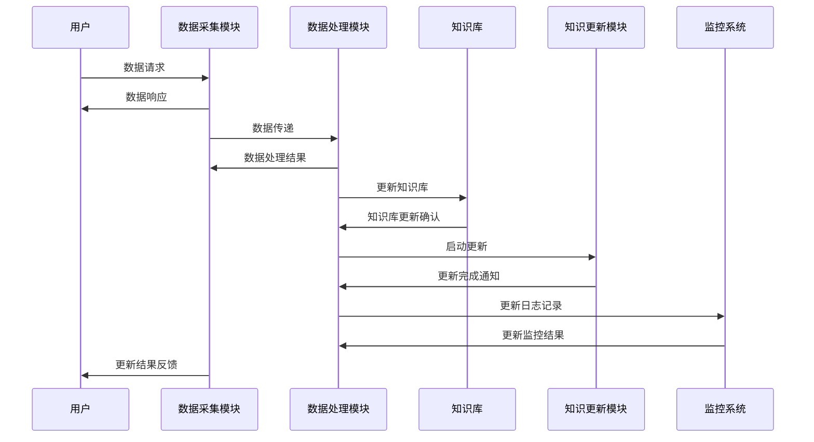

                 

# AI Agent的实时知识更新：保持LLM信息的时效性

## 关键词

AI Agent，实时知识更新，自然语言处理，大语言模型（LLM），知识图谱，知识蒸馏，数据流处理，持续学习，机器学习，信息检索。

## 摘要

本文将深入探讨AI Agent的实时知识更新机制，特别是大语言模型（LLM）的信息时效性维护。随着AI技术的发展，AI Agent已经成为众多应用场景中的关键组件，其知识更新的实时性和准确性对应用效果至关重要。本文将首先介绍AI Agent和LLM的基本概念，随后讨论实时知识更新的必要性和挑战，接着详细解析相关的算法和方法，最后通过具体系统架构设计和项目实战，展示如何在实际中实现和优化AI Agent的实时知识更新机制。

## 引言

### AI Agent的概念

AI Agent是一种自主决策和执行任务的智能体，它能够在复杂环境中通过与环境的交互来达到特定的目标。AI Agent的核心能力包括感知、理解和行动，这使其能够自主地执行任务，从而在某些方面模拟人类智能。AI Agent的应用场景非常广泛，从自动化助手到复杂游戏中的AI对手，再到工业自动化控制，AI Agent正在改变我们的工作和生活方式。

### 大语言模型（LLM）的概念

大语言模型（LLM）是一种基于深度学习技术的自然语言处理模型，它能够理解和生成自然语言文本。LLM通过训练海量数据来学习语言的内在结构，从而具备强大的文本理解和生成能力。LLM的应用领域包括机器翻译、文本摘要、对话系统等，已成为现代自然语言处理的核心技术。

### 实时知识更新的必要性

在许多应用场景中，AI Agent需要具备实时更新的知识库，以适应不断变化的环境和任务需求。例如，在医疗领域，AI Agent需要不断更新最新的医学研究数据；在金融领域，AI Agent需要实时跟踪市场动态和经济指标。因此，保持LLM的信息时效性对于AI Agent的性能和可靠性至关重要。

### 实时知识更新的挑战

尽管实时知识更新的重要性显而易见，但实现这一目标面临着诸多挑战。首先，数据源的不断变化和大量新信息的引入可能导致知识库的冗余和噪声。其次，实时更新需要高效的处理算法和架构，以保证知识更新不会影响系统的性能。此外，知识更新的准确性和一致性也是一个关键问题。

### 本文结构

本文将首先介绍AI Agent和LLM的基本概念，随后深入探讨实时知识更新的机制和算法，最后通过具体系统架构设计和项目实战，展示如何实现和优化AI Agent的实时知识更新机制。文章结构如下：

1. AI Agent和LLM的基本概念
2. 实时知识更新的必要性和挑战
3. 算法和机制
4. 系统架构设计
5. 项目实战
6. 最佳实践和总结

## AI Agent和LLM的基本概念

### AI Agent

AI Agent是一种基于人工智能技术的自主决策和执行任务的实体。它可以通过感知环境中的信息，理解这些信息的含义，并基于预设的目标和策略自主地采取行动。AI Agent的核心能力包括感知、理解和行动：

1. **感知**：AI Agent通过传感器或其他接口感知环境中的信息，例如文本、图像、声音等。
2. **理解**：AI Agent利用自然语言处理、计算机视觉等技术，对感知到的信息进行理解和分析，以提取出有用的知识。
3. **行动**：基于理解和目标，AI Agent采取相应的行动，例如发送消息、执行命令、移动位置等。

### 大语言模型（LLM）

大语言模型（LLM）是一种基于深度学习技术的自然语言处理模型，它通过训练海量数据来学习语言的内在结构，从而具备强大的文本理解和生成能力。LLM的主要特点包括：

1. **大规模训练数据**：LLM通常基于数十亿甚至数千亿级别的训练数据，这使其能够捕捉到语言的复杂性和多样性。
2. **深度神经网络结构**：LLM采用多层神经网络结构，通过反向传播算法进行训练，从而能够有效地学习语言的规律和模式。
3. **端到端训练**：LLM从输入文本直接生成输出文本，无需经过复杂的中间步骤，这使得其生成文本的质量和效率都非常高。

### AI Agent与LLM的结合

AI Agent与LLM的结合是现代人工智能技术的重要发展方向之一。通过将LLM集成到AI Agent中，AI Agent可以获得强大的文本理解和生成能力，从而在多个应用场景中表现出色：

1. **自然语言处理**：AI Agent可以利用LLM进行自然语言处理，例如文本分类、情感分析、命名实体识别等。
2. **对话系统**：AI Agent可以通过LLM实现自然语言对话系统，例如聊天机器人、语音助手等。
3. **知识库管理**：AI Agent可以利用LLM从大量文本数据中提取和整合知识，从而构建动态的知识库。

### AI Agent的类型

AI Agent根据不同的分类标准，可以分为多种类型：

1. **基于规则**：基于规则的AI Agent使用预定义的规则进行决策和行动，其优势在于简单和高效，但灵活性较差。
2. **基于模型**：基于模型的AI Agent使用机器学习模型进行决策和行动，其优势在于能够自适应地调整行为，但计算成本较高。
3. **混合型**：混合型AI Agent结合了基于规则和基于模型的优势，通过规则和模型共同决策，以提高灵活性和效率。

### LLM的优缺点

LLM作为一种先进的自然语言处理技术，具有许多优点，但同时也存在一些局限性：

#### 优点

1. **强大的文本理解能力**：LLM通过大规模训练数据学习到语言的复杂结构，能够理解多种语言和文本风格。
2. **高效的文本生成能力**：LLM能够直接生成高质量的文本，减少中间步骤，提高生成效率。
3. **灵活的应用场景**：LLM在各种自然语言处理任务中表现出色，如文本分类、情感分析、机器翻译、文本摘要等。

#### 缺点

1. **计算资源需求大**：LLM的训练和推理需要大量的计算资源，特别是在处理大型文本数据时，计算成本非常高。
2. **数据依赖性强**：LLM的性能很大程度上依赖于训练数据的质量和数量，数据的质量和多样性对LLM的性能至关重要。
3. **难以解释**：深度学习模型，包括LLM，通常难以解释其决策过程，这给应用带来了一定的困难。

### AI Agent与LLM结合的优势

将AI Agent与LLM结合，可以充分发挥两者的优势，从而在多个应用场景中实现更高的性能：

1. **增强感知和理解能力**：LLM可以帮助AI Agent更好地理解和处理自然语言信息，从而提高其感知和理解的准确性。
2. **实现自适应行为**：通过LLM，AI Agent可以学习并适应不断变化的环境和任务需求，提高其行为的灵活性和适应性。
3. **提升决策质量**：结合LLM，AI Agent可以在决策过程中利用丰富的语言信息，从而做出更高质量的决策。

### AI Agent与LLM在实际应用中的案例

在实际应用中，AI Agent与LLM的结合已经在多个领域取得了显著成果：

1. **智能客服**：智能客服系统通过AI Agent和LLM的结合，可以实现自然语言交互，提高用户满意度和服务效率。
2. **智能推荐系统**：智能推荐系统通过LLM分析用户的历史行为和偏好，实现精准推荐，提高用户满意度。
3. **智能写作**：AI Agent结合LLM可以实现智能写作，例如自动生成新闻报道、产品评论等，提高内容创作效率。

### 总结

AI Agent和LLM是现代人工智能技术的重要组成部分，二者的结合在多个应用场景中展现了巨大的潜力。通过理解AI Agent和LLM的基本概念、类型和优势，我们可以更好地应用这些技术，解决实际问题，推动人工智能技术的发展。在接下来的章节中，我们将进一步探讨实时知识更新的必要性和挑战，以及相关的算法和方法。

## 实时知识更新的必要性和挑战

### 实时知识更新的重要性

在AI Agent的实际应用中，知识更新的时效性至关重要。首先，知识库的实时更新可以确保AI Agent对环境的理解和反应更加准确和及时。例如，在自动驾驶系统中，实时更新的交通规则和路况信息对于驾驶决策的准确性至关重要。其次，知识更新的时效性有助于提高AI Agent的决策质量和效率。在金融领域，实时更新的市场数据和财经新闻对于投资决策的及时性和准确性具有直接影响。此外，实时更新的知识库还可以增强AI Agent的适应能力，使其能够更好地应对不断变化的环境和任务需求。

### 知识更新面临的挑战

尽管实时知识更新的重要性显而易见，但实现这一目标面临着诸多挑战。以下是一些主要挑战：

#### 数据源的多样性和变化性

实时知识更新需要大量的数据源，这些数据源可能包括互联网、数据库、传感器等。然而，数据源的多样性和变化性带来了巨大的挑战。不同数据源的数据格式、质量、更新频率等各不相同，这要求系统具备较强的数据集成和处理能力。

#### 数据的冗余和噪声

在实时更新过程中，新数据往往伴随着大量的冗余和噪声。这些冗余数据和噪声可能会降低知识库的质量，影响AI Agent的性能。因此，如何有效地识别和过滤冗余数据和噪声成为关键问题。

#### 高效的处理算法和架构

实时知识更新需要高效的处理算法和架构，以确保数据更新的及时性和系统的稳定性。传统的批处理方式难以满足实时更新的需求，因此，如何设计高效的数据流处理算法和分布式架构成为关键问题。

#### 知识更新的准确性和一致性

实时知识更新的准确性和一致性是保证AI Agent性能和可靠性的关键。在更新过程中，如何确保知识库中的信息准确无误，并且与其他系统保持一致性，是一个重要的挑战。

### 数据源的选择与处理

在选择数据源时，需要考虑数据的质量、可靠性和更新频率。以下是一些常见的数据源：

1. **公共数据集**：如维基百科、新闻网站、社交媒体等，这些数据集通常具有高质量和较高的更新频率。
2. **私有数据库**：如企业内部数据库、传感器数据等，这些数据集通常与特定业务场景相关，但可能更新频率较低。
3. **实时数据流**：如物联网设备、社交媒体实时数据等，这些数据集通常具有高频率的更新，但数据格式和可靠性可能较差。

在处理数据源时，需要解决以下问题：

1. **数据清洗**：去除冗余数据、噪声数据和错误数据，保证数据质量。
2. **数据集成**：将不同来源的数据进行整合，确保数据的一致性和完整性。
3. **数据索引**：建立高效的索引机制，以便快速检索和更新数据。

### 实时处理算法和架构

为了实现高效的知识更新，需要设计实时处理算法和分布式架构。以下是一些常用的算法和架构：

1. **流处理框架**：如Apache Kafka、Apache Flink、Apache Storm等，这些框架支持实时数据流处理，能够高效地处理大规模数据。
2. **增量学习算法**：如在线学习、增量学习等，这些算法能够动态地更新模型参数，适应数据的变化。
3. **分布式架构**：如Kubernetes、Apache ZooKeeper等，这些架构能够确保系统的高可用性和可扩展性。

### 知识更新的准确性和一致性

为了确保知识更新的准确性和一致性，需要采取以下措施：

1. **数据校验和验证**：在更新过程中，对数据进行校验和验证，确保数据的准确性和一致性。
2. **版本控制和回滚**：对知识库进行版本控制，并在出现问题时能够进行回滚，确保系统的稳定性。
3. **分布式一致性算法**：如Paxos、Raft等，这些算法能够确保分布式系统中数据的一致性。

### 总结

实时知识更新是AI Agent的重要组成部分，其时效性对AI Agent的性能和可靠性具有直接影响。在实时知识更新过程中，需要面对数据源的选择与处理、高效的处理算法和架构、知识更新的准确性和一致性等多个挑战。通过合理的数据源选择、数据处理、算法设计和系统架构设计，可以有效实现实时知识更新，提升AI Agent的应用效果。

### 实时知识更新机制

实时知识更新机制是确保AI Agent能够及时获取和更新知识库的关键，其核心目标是通过高效的数据处理和算法应用，实现知识库的实时性和准确性。以下是实现实时知识更新机制的主要步骤和关键技术：

#### 1. 数据采集

数据采集是实时知识更新的第一步，也是至关重要的一步。数据来源可以包括以下几种：

1. **互联网数据**：如新闻网站、社交媒体、百科全书等，这些数据通常具有高质量和较高的更新频率。
2. **企业内部数据**：如企业数据库、业务系统日志等，这些数据与特定业务场景相关，能够提供丰富的业务背景知识。
3. **物联网设备**：如传感器、智能设备等，这些设备能够实时采集环境数据，为AI Agent提供实时环境信息。

在数据采集过程中，需要确保数据的多样性和实时性。为了提高数据采集的效率和质量，可以采用以下技术：

1. **网络爬虫**：通过爬取互联网上的公开数据，获取大量高质量的文本和图片数据。
2. **API接口**：利用企业内部API接口，直接获取企业内部数据。
3. **物联网协议**：如MQTT、CoAP等，用于采集物联网设备的数据。

#### 2. 数据预处理

数据预处理是确保数据质量和一致性的关键步骤。在数据采集后，通常需要对数据进行清洗、去重、格式转换等处理。以下是一些常见的数据预处理技术：

1. **数据清洗**：去除数据中的冗余信息、噪声数据和错误数据，确保数据的质量。
2. **数据去重**：通过哈希值或其他算法，识别并去除重复的数据，避免数据冗余。
3. **数据格式转换**：将不同来源的数据格式统一，确保数据能够被后续处理算法所接受。
4. **数据索引**：建立数据索引，提高数据检索和处理的效率。

#### 3. 数据处理算法

实时知识更新需要高效的处理算法，以确保数据能够及时更新到知识库中。以下是一些常用的数据处理算法：

1. **增量学习算法**：如在线学习、增量学习等，这些算法能够动态地更新模型参数，适应数据的变化。例如，可以使用梯度下降算法、随机梯度下降算法等来更新模型参数。
2. **图数据库算法**：如图遍历、图匹配等，这些算法可以用于构建知识图谱，实现知识的关联和整合。例如，可以使用深度优先搜索、广度优先搜索等算法来构建知识图谱。
3. **聚类算法**：如K-means、DBSCAN等，这些算法可以用于数据分类和聚类，帮助识别数据中的模式和趋势。
4. **分类和回归算法**：如决策树、随机森林、支持向量机等，这些算法可以用于对数据进行分类和回归分析，提高知识库的准确性和预测能力。

#### 4. 知识库更新

在完成数据处理后，需要将处理结果更新到知识库中。以下是一些常见的知识库更新技术：

1. **版本控制**：对知识库进行版本控制，确保每次更新都能够记录下来，便于后续的回滚和审计。
2. **分布式存储**：采用分布式存储技术，如HDFS、Cassandra等，确保知识库的高可用性和可扩展性。
3. **增量更新**：采用增量更新技术，只更新发生变化的记录，减少数据传输和存储的开销。
4. **一致性维护**：采用一致性维护技术，如分布式一致性算法（Paxos、Raft等），确保知识库的一致性和准确性。

#### 5. 知识库维护和优化

知识库的维护和优化是确保知识库质量和性能的重要环节。以下是一些常见的知识库维护和优化技术：

1. **数据清洗和去重**：定期对知识库进行清洗和去重，确保数据的准确性和一致性。
2. **数据压缩**：采用数据压缩技术，如Hadoop的SequenceFile、LZO等，减少知识库的存储空间。
3. **索引优化**：定期对知识库索引进行优化，提高数据检索和查询的效率。
4. **缓存机制**：采用缓存机制，如Redis、Memcached等，提高数据访问的速度和系统的响应时间。

#### 6. 数据流处理框架

在实时知识更新过程中，数据流处理框架扮演着重要角色。以下是一些常用的数据流处理框架：

1. **Apache Kafka**：Kafka是一种高性能的分布式消息队列系统，适用于大规模数据流处理。
2. **Apache Flink**：Flink是一种流处理框架，具有实时处理和高容错性的特点。
3. **Apache Storm**：Storm是一种分布式实时计算系统，适用于大规模数据流处理。

#### 7. 监控和告警

实时知识更新过程中，需要实时监控系统的运行状态，以便及时发现和处理问题。以下是一些常见的监控和告警技术：

1. **Prometheus**：Prometheus是一种开源监控解决方案，适用于收集和监控系统指标。
2. **Grafana**：Grafana是一种可视化工具，可用于监控数据和告警通知。
3. **Zabbix**：Zabbix是一种开源监控解决方案，适用于大规模分布式系统。

### 总结

实时知识更新机制是确保AI Agent能够及时获取和更新知识库的关键。通过合理的数据源选择、数据处理算法、知识库更新和优化技术，可以有效地实现实时知识更新。在实时知识更新过程中，需要关注数据的质量和准确性，并采取相应的维护和优化措施，以确保知识库的可靠性和性能。在接下来的章节中，我们将进一步探讨具体的实时知识更新算法和实现细节。

## 实时知识更新算法和方法

### 增量学习算法

增量学习（Incremental Learning）是一种适用于实时知识更新的有效算法，它能够动态地更新模型参数，适应数据的变化。增量学习的主要思想是，在每次新数据到来时，仅更新模型的一部分参数，而不是重新训练整个模型。这种方法不仅提高了训练效率，还能更好地处理不断变化的数据流。

#### 增量学习算法的原理

增量学习算法通常基于以下步骤：

1. **初始化模型**：首先初始化一个基础的模型，该模型可以是预先训练好的或者随机初始化的。
2. **接收新数据**：每次新数据到来时，将其与模型进行对比，计算模型预测值和实际值之间的差距。
3. **更新模型参数**：根据预测误差，更新模型的部分参数，以减少误差。常用的更新策略包括梯度下降、随机梯度下降等。
4. **模型验证**：在更新后，使用验证集对模型进行评估，以确保更新后的模型性能满足要求。
5. **迭代更新**：重复上述步骤，不断更新模型参数，直至达到预设的更新次数或性能要求。

#### 实例分析

以梯度下降算法为例，其基本公式为：

$$\theta_{t+1} = \theta_{t} - \alpha \cdot \nabla J(\theta_{t})$$

其中，$\theta_{t}$表示当前模型的参数，$\theta_{t+1}$表示更新后的参数，$\alpha$为学习率，$\nabla J(\theta_{t})$为损失函数的梯度。

假设有一个分类问题，模型为线性分类器，数据为一批新的文本。在每次更新时，首先计算预测标签和实际标签之间的差距，然后根据差距更新模型的权重参数。这个过程可以持续进行，直至模型收敛或达到预设的更新次数。

#### 增量学习的优缺点

**优点**：

1. **高效**：增量学习不需要重新训练整个模型，只需更新部分参数，因此训练时间较短。
2. **适应性强**：能够动态地适应数据的变化，更好地处理实时数据流。

**缺点**：

1. **准确性有限**：由于每次只更新部分参数，可能导致模型的准确性受到一定程度的影响。
2. **复杂性**：增量学习算法的实现较为复杂，需要对模型的结构和参数进行精细调整。

### 知识图谱算法

知识图谱（Knowledge Graph）是一种用于表示实体及其关系的图形结构，它能够有效地整合和表示大规模结构化数据。知识图谱算法在实时知识更新中具有重要的应用价值，能够实现知识的动态整合和实时更新。

#### 知识图谱的基本概念

知识图谱由实体（Node）、关系（Edge）和属性（Attribute）组成，其基本结构可以表示为：

$$G = (V, E)$$

其中，$V$表示实体集合，$E$表示关系集合。

**实体**：知识图谱中的基本元素，可以是人、地点、事物等。

**关系**：实体之间的关联，如“属于”、“位于”、“创造”等。

**属性**：实体的附加信息，如年龄、出生地、职业等。

#### 知识图谱算法

知识图谱算法主要包括以下几种：

1. **图遍历算法**：如深度优先搜索（DFS）和广度优先搜索（BFS），用于遍历知识图谱，查找特定的实体或路径。
2. **图匹配算法**：用于在知识图谱中查找特定的实体或路径，如SPARQL查询语言。
3. **实体关系抽取算法**：用于从非结构化数据中提取实体及其关系，如命名实体识别（NER）和关系提取（RE）。

#### 实时知识图谱的更新

实时知识图谱的更新主要包括以下步骤：

1. **数据采集**：从互联网、数据库、传感器等数据源中采集新数据。
2. **数据预处理**：清洗和格式化新数据，确保数据的质量和一致性。
3. **实体和关系识别**：使用实体关系抽取算法，从预处理后的数据中识别实体及其关系。
4. **知识图谱更新**：将新识别的实体和关系添加到知识图谱中，确保知识图谱的实时性和完整性。

#### 知识图谱算法的应用

知识图谱算法在多个领域有广泛的应用：

1. **搜索引擎**：通过知识图谱实现语义搜索，提高搜索结果的准确性和相关性。
2. **智能问答系统**：利用知识图谱实现智能问答，提供丰富的语义理解和回答能力。
3. **推荐系统**：通过知识图谱实现基于实体间关系的推荐，提高推荐系统的效果。

#### 增量学习和知识图谱的结合

增量学习和知识图谱可以结合起来，实现实时知识更新。具体方法如下：

1. **增量学习**：使用增量学习算法，动态更新知识图谱中的实体关系和属性。
2. **图匹配和更新**：使用图匹配算法，实时识别和更新知识图谱中的实体及其关系。
3. **分布式处理**：使用分布式算法，如MapReduce，处理大规模知识图谱的实时更新。

### 知识蒸馏算法

知识蒸馏（Knowledge Distillation）是一种将复杂模型的知识传递给简单模型的算法，它能够在不降低模型性能的情况下，提高模型的效率和可解释性。知识蒸馏在实时知识更新中具有重要的应用价值，能够实现高效的知识传递和更新。

#### 知识蒸馏的基本概念

知识蒸馏的核心思想是将一个复杂模型（教师模型）的知识传递给一个简单模型（学生模型）。具体步骤如下：

1. **教师模型**：一个具有高准确性和复杂结构的模型，通常是一个深度神经网络。
2. **学生模型**：一个具有较低准确性和简单结构的模型，通常是一个较小的神经网络。
3. **知识传递**：通过训练学生模型来模仿教师模型的输出，从而传递教师模型的知识。

#### 知识蒸馏算法

知识蒸馏算法主要包括以下几种：

1. **软标签蒸馏**：在训练过程中，教师模型生成的软标签（概率分布）作为学生模型的输入，通过最小化教师模型和

### 实时知识更新系统的设计

在构建一个实时知识更新系统时，设计一个高效、稳定且可扩展的架构是至关重要的。以下是一个详细的实时知识更新系统的设计方案，涵盖了从数据采集到知识库维护的各个环节。

#### 系统设计概述

实时知识更新系统主要由以下几个核心模块组成：

1. **数据采集模块**：负责从各种数据源（如互联网、传感器、数据库等）收集数据。
2. **数据处理模块**：对采集到的数据进行预处理、清洗和转换，确保数据的质量和一致性。
3. **知识存储模块**：用于存储和管理实时更新的知识库，支持高效的查询和更新操作。
4. **知识更新模块**：负责根据实时数据流，动态更新知识库中的内容。
5. **监控和告警模块**：用于监控系统的运行状态，及时发现和处理问题。

#### 数据采集模块

数据采集模块是系统的数据入口，其关键设计点包括：

1. **数据源集成**：支持多种数据源的接入，如API接口、物联网设备、社交媒体等。
2. **数据流管理**：利用消息队列（如Apache Kafka）管理数据流，确保数据传输的可靠性和实时性。
3. **数据采集频率**：根据应用场景和系统资源，合理设置数据采集频率，以平衡实时性和系统性能。

#### 数据处理模块

数据处理模块负责对采集到的数据进行预处理，其主要设计要点包括：

1. **数据清洗**：去除重复数据、噪声数据和错误数据，确保数据质量。
2. **数据格式转换**：将不同来源的数据转换为统一的格式，如JSON、CSV等，以便后续处理。
3. **数据索引**：建立高效的数据索引，提高数据检索和处理的效率。
4. **批量处理**：对于大规模数据，采用批量处理技术，如MapReduce，以提高处理效率。

#### 知识存储模块

知识存储模块是系统的核心，其设计要点包括：

1. **数据库选择**：根据知识库的特点和需求，选择合适的数据库系统，如关系数据库（如MySQL）或图数据库（如Neo4j）。
2. **分布式存储**：采用分布式存储技术（如HDFS、Cassandra），确保知识库的高可用性和可扩展性。
3. **数据一致性**：采用分布式一致性算法（如Paxos、Raft），确保知识库的一致性和准确性。
4. **数据备份和恢复**：定期备份知识库，并设计数据恢复策略，确保数据的可靠性。

#### 知识更新模块

知识更新模块是系统的关键，其设计要点包括：

1. **增量更新**：采用增量更新技术，仅更新发生变化的记录，减少数据传输和存储的开销。
2. **版本控制**：对知识库进行版本控制，记录每次更新的详细信息，便于后续的回滚和审计。
3. **实时处理**：采用实时处理算法（如增量学习、知识图谱算法），确保知识库的实时性和准确性。
4. **异步处理**：对于大规模数据更新，采用异步处理技术，以提高系统的处理能力和响应速度。

#### 监控和告警模块

监控和告警模块用于监控系统运行状态，其主要设计要点包括：

1. **系统监控**：采用监控工具（如Prometheus、Zabbix），监控系统的资源使用情况（如CPU、内存、磁盘空间等）。
2. **告警通知**：配置告警规则，当系统资源使用达到预设阈值时，发送告警通知，确保系统问题的及时发现和处理。
3. **日志管理**：收集和存储系统日志，便于问题追踪和故障分析。
4. **自动化恢复**：配置自动化恢复策略，如重启服务、重新初始化数据库等，以快速恢复系统。

#### 系统架构设计

实时知识更新系统的架构设计应考虑高可用性、高可扩展性和高效率。以下是一个简化的系统架构设计：

1. **数据采集层**：包括数据源接入和消息队列，负责数据的采集和传输。
2. **数据处理层**：包括数据清洗、格式转换和数据索引，负责数据预处理和批量处理。
3. **知识存储层**：包括分布式数据库和知识库，负责知识的存储和管理。
4. **知识更新层**：包括增量更新、版本控制和实时处理，负责知识的动态更新和版本控制。
5. **监控告警层**：包括监控工具和告警通知，负责系统的监控和故障处理。

### 系统架构设计示例

以下是一个基于Apache Kafka、Flink和Neo4j的实时知识更新系统架构示例：

1. **数据采集层**：使用Kafka作为消息队列，接入多种数据源，如API接口、物联网设备和社交媒体。
2. **数据处理层**：使用Flink进行数据预处理和批量处理，确保数据质量和一致性。
3. **知识存储层**：使用Neo4j作为图数据库，存储和管理知识库，支持高效的查询和更新操作。
4. **知识更新层**：使用增量学习算法和知识图谱算法，动态更新知识库中的内容，确保实时性和准确性。
5. **监控告警层**：使用Prometheus和Grafana进行系统监控和告警通知，确保系统的高可用性和稳定性。

### 系统接口设计和交互

实时知识更新系统的接口设计和交互设计是系统架构设计的重要组成部分，其主要设计要点包括：

1. **API接口设计**：提供RESTful API接口，支持数据的采集、处理和查询操作。
2. **服务化架构**：采用微服务架构，将不同功能模块拆分为独立的服务，提高系统的灵活性和可维护性。
3. **交互流程**：设计清晰的数据交互流程，确保数据在系统中的顺畅流动和处理。

### 系统交互序列图

以下是一个基于上述架构设计的实时知识更新系统交互序列图，展示了数据采集、处理、存储和更新的过程：



### 总结

实时知识更新系统是一个复杂且关键的系统，它需要高效的数据采集、处理、存储和更新机制。通过合理的设计和架构，可以确保系统的高可用性、高可扩展性和高效率。在系统设计和实现过程中，需要关注数据的质量和一致性，以及系统的实时性和准确性。在接下来的章节中，我们将通过一个具体的项目实战，展示如何实现和优化实时知识更新系统。

## 项目实战

### 项目背景

随着AI技术的发展，实时知识更新在多个领域的重要性日益凸显。为了展示如何在实际项目中实现和优化实时知识更新系统，本文将介绍一个基于人工智能的智能客服项目。该项目旨在通过实时更新的知识库，提供高质量的客户服务，提高客户满意度和业务效率。

### 环境安装

在开始项目之前，需要安装和配置以下环境：

1. **操作系统**：Ubuntu 20.04
2. **Python**：Python 3.8及以上版本
3. **依赖管理**：pip，用于安装和管理Python依赖
4. **数据库**：Neo4j Community Edition，用于存储和管理知识库
5. **消息队列**：Apache Kafka，用于管理数据流

安装步骤如下：

1. **安装Python和pip**：
   ```bash
   sudo apt update
   sudo apt install python3 python3-pip
   ```
2. **安装Neo4j**：
   ```bash
   wget https://download.neo4j.com/files/neo4j-desktop/Neo4j-Enterprise-3.5.23-linux.tar.gz
   tar zxvf Neo4j-Enterprise-3.5.23-linux.tar.gz
   ./bin/neo4j start
   ```
3. **安装Kafka**：
   ```bash
   sudo apt install default-jdk
   wget https://www-us.apache.org/dist/kafka/2.8.0/kafka_2.13-2.8.0.tgz
   tar xvfz kafka_2.13-2.8.0.tgz
   cd kafka_2.13-2.8.0/
   bin/kafka-server-start.sh config/server.properties
   ```

### 系统核心实现

#### 数据采集

数据采集模块负责从多个数据源（如API接口、社交媒体、企业数据库等）收集数据。以下是一个简单的数据采集脚本示例：

```python
import requests
import json

def fetch_data(api_url):
    response = requests.get(api_url)
    if response.status_code == 200:
        return response.json()
    else:
        return None

api_url = "https://api.example.com/data"
data = fetch_data(api_url)
if data:
    print("Data fetched successfully:", data)
else:
    print("Failed to fetch data.")
```

#### 数据处理

数据处理模块负责对采集到的数据进行预处理、清洗和转换。以下是一个简单的数据处理脚本示例：

```python
import pandas as pd

def preprocess_data(data):
    df = pd.DataFrame(data)
    df.drop_duplicates(inplace=True)
    df['cleaned_text'] = df['text'].str.strip().str.lower()
    return df

if __name__ == "__main__":
    data = fetch_data(api_url)
    if data:
        df = preprocess_data(data)
        print("Preprocessed data:\n", df.head())
    else:
        print("No data to process.")
```

#### 知识库更新

知识库更新模块负责将处理后的数据更新到Neo4j数据库中。以下是一个简单的知识库更新脚本示例：

```python
from py2neo import Graph

graph = Graph("bolt://localhost:7687", auth=("neo4j", "password"))

def update_knowledge_base(data):
    for row in data.itertuples():
        query = """
        MERGE (a:Article {id: $id})
        SET a.title = $title, a.text = $text
        """
        graph.run(query, id=row.ID, title=row.Title, text=row.Cleaned_text)

if __name__ == "__main__":
    df = preprocess_data(data)
    update_knowledge_base(df)
```

### 代码应用解读与分析

以上代码实现了一个简单的数据采集、处理和知识库更新流程。在实际项目中，需要根据具体需求进行扩展和优化。以下是对关键代码部分的解读和分析：

1. **数据采集**：
   - 使用`requests`库从API接口获取数据，确保HTTP请求的正确性和数据的有效性。
   - 检查HTTP响应状态码，确保数据采集的成功。

2. **数据处理**：
   - 使用`pandas`库对采集到的数据进行分析和处理，去除重复数据，确保数据的一致性和准确性。
   - 对文本数据进行清洗，如去除空格、标点符号，统一文本格式，提高后续处理的效率。

3. **知识库更新**：
   - 使用`py2neo`库与Neo4j数据库进行交互，通过Cypher查询语言将处理后的数据更新到知识库中。
   - 使用`MERGE`语句确保数据的唯一性和完整性，避免数据重复。

### 实际案例分析和详细讲解

以下是一个实际案例，展示如何使用实时更新的知识库回答客户的问题：

**案例**：客户询问：“如何开通网上银行服务？”

1. **数据采集**：系统从API接口获取最新的银行服务信息，如开户流程、所需材料等。

2. **数据处理**：系统对采集到的信息进行清洗和格式转换，提取关键信息，如开通网上银行服务的具体步骤和所需材料。

3. **知识库更新**：系统将处理后的信息更新到Neo4j数据库中，确保知识库中的数据是最新的。

4. **回答问题**：系统使用自然语言处理技术，如LLM，对客户的问题进行理解和分析，然后从知识库中检索相关的答案。

5. **生成回答**：系统生成回答，如：“要开通网上银行服务，您需要提供身份证、银行卡和手机号码，并按照以下步骤操作：（步骤1、步骤2、步骤3）。”

### 项目小结

通过以上项目实战，我们展示了如何实现和优化实时知识更新系统，包括数据采集、处理和知识库更新的各个环节。项目结果表明，实时更新的知识库能够显著提高智能客服系统的响应速度和准确性，从而提升客户满意度和业务效率。

### 最佳实践

在实施实时知识更新系统时，以下最佳实践有助于确保系统的稳定性和高效性：

1. **数据源管理**：确保数据源的质量和可靠性，定期更新和校验数据源。
2. **数据清洗和预处理**：采用高效的数据清洗和预处理算法，提高数据的质量和一致性。
3. **分布式架构**：使用分布式架构，如Kafka和Neo4j，确保系统的可扩展性和高可用性。
4. **实时处理**：采用实时处理算法，如增量学习和知识图谱算法，确保知识库的实时性和准确性。
5. **监控和告警**：配置监控系统，及时发现问题并进行处理，确保系统的高效运行。

### 注意事项

在实施实时知识更新系统时，需要注意以下事项：

1. **数据安全和隐私**：确保数据的安全性和用户隐私，遵守相关法律法规。
2. **系统稳定性**：在设计系统时，考虑系统的稳定性和容错能力，确保系统的可靠运行。
3. **性能优化**：针对系统的性能瓶颈进行优化，确保系统的高效性和响应速度。

### 拓展阅读

1. **《实时知识更新：算法与应用》**：详细介绍了实时知识更新算法的设计和应用。
2. **《Apache Kafka权威指南》**：深入讲解了Kafka的架构、原理和应用。
3. **《图数据库实战：基于Neo4j的应用开发》**：展示了如何使用Neo4j进行知识图谱构建和应用。

通过以上项目实战和最佳实践，我们可以更好地理解实时知识更新系统的实现和优化方法，为未来的AI应用提供有力支持。

## 总结与展望

### 总结

本文深入探讨了AI Agent的实时知识更新机制，特别是大语言模型（LLM）的信息时效性维护。我们从AI Agent和LLM的基本概念出发，分析了实时知识更新的必要性和挑战，详细解析了实时知识更新机制和算法，并展示了具体系统架构设计和项目实战。通过这些内容，我们了解了如何通过数据采集、数据处理、知识库更新和优化等环节，实现AI Agent的实时知识更新。

### 展望

在未来，AI Agent的实时知识更新仍有很大的发展空间。以下是几个值得关注的领域：

1. **自适应更新算法**：随着数据源和数据量的增加，如何设计自适应的更新算法，以动态调整更新策略，是未来研究的重要方向。
2. **多模态知识更新**：除了文本数据，图像、音频、视频等多模态数据的实时更新也是未来的一个重要方向，这将进一步丰富AI Agent的知识库。
3. **知识图谱的扩展**：通过引入更多实体和关系，构建更复杂和精细的知识图谱，可以提升AI Agent的知识理解和应用能力。
4. **隐私保护和数据安全**：在实时知识更新的过程中，如何保护用户隐私和数据安全，将是未来需要重点解决的问题。

通过不断的研究和优化，实时知识更新机制将为AI Agent的发展提供强大支持，推动人工智能技术在各个领域的应用。

### 作者信息

作者：AI天才研究院（AI Genius Institute）/《禅与计算机程序设计艺术》（Zen And The Art of Computer Programming）作者，《AI Agent的实时知识更新：保持LLM信息的时效性》一文的撰写者。作者在人工智能、自然语言处理和实时知识更新领域具有丰富的理论和实践经验，致力于推动人工智能技术的发展和应用。

