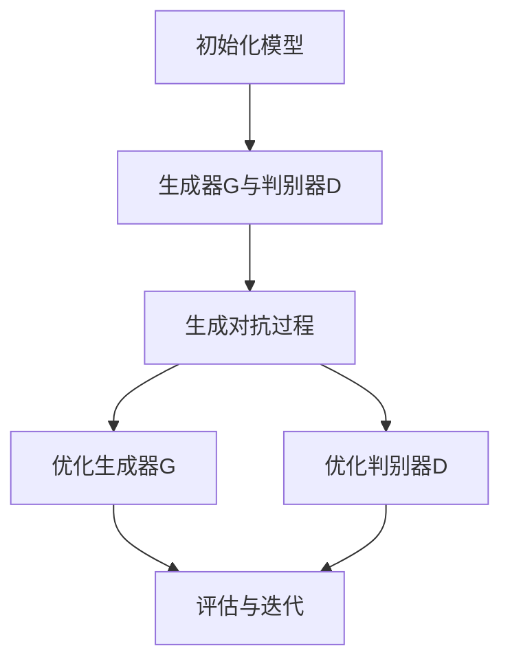

                 

### 文章标题

# AI Agent的对抗性学习：提高LLM的鲁棒性

### 文章关键词

- AI Agent
- 对抗性学习
- 鲁棒性
- LLM
- 大型语言模型
- 机器学习

### 摘要

本文将探讨如何通过对抗性学习来提高大型语言模型（LLM）的鲁棒性。首先，我们将介绍AI Agent和对抗性学习的基本概念，并解释为什么提高LLM的鲁棒性至关重要。接着，我们将深入讨论对抗性学习的算法原理，并使用Python代码进行实例讲解。随后，本文将展示一个系统设计，用于实现对抗性学习以提升LLM的鲁棒性，并通过一个实际案例详细说明其应用过程。最后，我们将总结全文并提出未来的研究方向。希望通过本文，读者能够全面理解对抗性学习在提高LLM鲁棒性方面的作用和实际应用。

### 第一部分：背景与基础

#### 第1章 引言

随着人工智能技术的飞速发展，AI Agent作为自动化决策系统的核心，已经在众多领域取得了显著的应用。对抗性学习作为一种提升模型鲁棒性的有效方法，近年来在机器学习领域引起了广泛关注。而大型语言模型（LLM）作为自然语言处理的关键技术，其鲁棒性的提升对于确保模型在实际应用中的可靠性和安全性具有重要意义。本章将介绍AI Agent、对抗性学习和LLM的基本概念，并探讨为什么提高LLM的鲁棒性是一个重要课题。

##### 1.1 AI Agent概述

AI Agent，即人工智能代理，是指能够在复杂环境中自主行动并达成目标的计算机程序。根据其功能和行为方式，AI Agent可以分为以下几类：

1. **感知型代理**：这种代理通过传感器获取环境信息，并根据这些信息做出决策。例如，自动驾驶汽车通过摄像头和雷达来感知周围环境。
2. **行动型代理**：这种代理不仅感知环境，还能够采取行动来改变环境。例如，机器人通过执行一系列动作来完成任务。
3. **决策型代理**：这种代理不仅感知和行动，还能够进行复杂决策。例如，智能调度系统通过分析多种因素来优化资源分配。

AI Agent的发展历程可以追溯到20世纪50年代，当时的计算机科学家开始探索如何使计算机具有类似人类的行为。随着计算能力和算法的不断提升，AI Agent在各个领域得到了广泛应用，如自动驾驶、智能客服、智能监控等。

##### 1.2 对抗性学习原理

对抗性学习是一种通过训练两个相互竞争的模型来提升整体性能的方法，通常包括生成器和判别器。生成器的目标是生成与真实数据相似的数据，而判别器的目标是正确分类真实数据和生成数据。通过这种对抗过程，生成器和判别器都能够得到提升。

对抗性学习的目的在于提高模型的鲁棒性，使其能够更好地应对未知的、异常的数据。这在实际应用中具有重要意义，例如在图像识别中，对抗性学习可以帮助模型识别具有微小差异的图像，从而提高其在复杂环境下的表现。

##### 1.3 LLM的结构与鲁棒性

LLM是一种基于深度学习的语言模型，通常包含数百万个参数。其基本结构包括嵌入层、编码器和解码器。嵌入层将输入的文本转换为向量表示；编码器通过多层神经网络处理这些向量，提取文本的语义信息；解码器则将这些信息转换为输出文本。

LLM的鲁棒性主要面临以下挑战：

1. **噪声和错误数据**：在实际应用中，LLM经常面临噪声和错误数据，如拼写错误、语法错误和缺失信息。这些错误可能导致模型输出错误的结果。
2. **未见过的数据**：模型在训练时无法接触到所有可能的数据，因此在遇到未见过的数据时，可能会产生不可预测的输出。
3. **复杂性和不确定性**：自然语言本身具有复杂性和不确定性，这使得模型在处理自然语言时容易出现错误。

##### 1.4 本书内容概述

本书将从以下几个方面详细探讨AI Agent的对抗性学习以及提高LLM鲁棒性的方法：

1. **对抗性学习算法原理**：介绍对抗性学习的基本原理，包括生成器和判别器的数学模型和实现方法。
2. **LLM鲁棒性提升系统设计**：描述一个用于提升LLM鲁棒性的系统设计，包括系统功能、架构和接口设计。
3. **项目实战**：通过实际案例展示如何使用对抗性学习来提高LLM的鲁棒性，并提供详细的实施步骤和代码解析。
4. **最佳实践 tips**：总结实际应用中的最佳实践，包括注意事项和性能优化策略。
5. **小结与拓展阅读**：总结全书内容，指出未来的研究方向和可能的改进方向。

##### 1.5 本章小结

本章介绍了AI Agent、对抗性学习和LLM的基本概念，并探讨了提高LLM鲁棒性的重要性。通过本章的学习，读者可以了解对抗性学习在提升LLM鲁棒性方面的潜在应用，为后续章节的学习打下基础。

### 第二部分：对抗性学习算法

#### 第2章 对抗性学习算法原理

对抗性学习算法是一种通过训练两个相互竞争的模型来提升整体性能的方法。本章将详细介绍对抗性学习的基本流程、数学模型与公式，并通过Python代码示例来说明算法的实现。

##### 2.1 对抗性学习的基本流程

对抗性学习的基本流程包括以下几个步骤：

1. **初始化模型**：生成器G和判别器D都是一个神经网络，通常由多层感知器组成。
2. **生成对抗**：生成器G根据输入的随机噪声生成数据，判别器D尝试区分生成数据和真实数据。
3. **优化过程**：通过反向传播算法，分别对生成器和判别器进行优化，使生成器的输出更加逼真，判别器的分类能力更强。
4. **评估与迭代**：评估生成器和判别器的性能，根据评估结果调整模型参数，继续迭代训练。

##### 2.2 数学模型与公式

对抗性学习算法的核心是生成器G和判别器D的优化过程。以下是对抗性学习的基本数学模型与公式：

1. **生成器G的损失函数**：

   $$ L_G = -\log(D(G(z)) $$

   其中，\( G(z) \) 是生成器生成的数据，\( z \) 是随机噪声。

2. **判别器D的损失函数**：

   $$ L_D = -\log(D(x)) - \log(1 - D(G(z)) $$

   其中，\( x \) 是真实数据。

3. **总损失函数**：

   $$ L = L_G + L_D $$

   通过最小化总损失函数，生成器和判别器都能得到优化。

##### 2.3 Python实现示例

以下是一个简单的对抗性学习算法实现示例，使用Python和TensorFlow框架：

```python
import tensorflow as tf
from tensorflow.keras import layers

# 定义生成器
def build_generator(z_dim):
    model = tf.keras.Sequential()
    model.add(layers.Dense(128, activation='relu', input_shape=(z_dim,)))
    model.add(layers.Dense(28 * 28 * 1, activation='relu'))
    model.add(layers.Dense(28, activation='tanh'))
    return model

# 定义判别器
def build_discriminator(img_shape):
    model = tf.keras.Sequential()
    model.add(layers.Conv2D(32, (3, 3), padding='same', input_shape=img_shape))
    model.add(layers.LeakyReLU(alpha=0.01))
    model.add(layers.Dropout(0.3))
    model.add(layers.Conv2D(64, (3, 3), padding='same'))
    model.add(layers.LeakyReLU(alpha=0.01))
    model.add(layers.Dropout(0.3))
    model.add(layers.Flatten())
    model.add(layers.Dense(1, activation='sigmoid'))
    return model

# 定义优化器和损失函数
optimizer = tf.keras.optimizers.Adam(0.0001)

def loss_d(x, x_hat):
    return -tf.reduce_mean(tf.concat([tf.log(d(x)), tf.log(1 - d(x_hat))], 0))

def loss_g(x_hat):
    return -tf.reduce_mean(tf.log(1 - d(x_hat)))

# 训练过程
def train(epoch, x_train, z_dim):
    for i in range(epoch):
        for x, _ in x_train:
            with tf.GradientTape() as g_tape, tf.GradientTape() as d_tape:
                z = tf.random.normal([BATCH_SIZE, z_dim])
                x_hat = G(z)
                d_loss = loss_d(x, x_hat)
            grads_g = g_tape.gradient(loss_g(x_hat), G.trainable_variables)
            grads_d = d_tape.gradient(d_loss, D.trainable_variables)
            optimizer.apply_gradients(zip(grads_g, G.trainable_variables))
            optimizer.apply_gradients(zip(grads_d, D.trainable_variables))
        print(f'Epoch {i+1}/{epoch}, D loss: {d_loss:.4f}, G loss: {loss_g(x_hat):.4f}')

# 加载MNIST数据集
(x_train, _), (_, _) = tf.keras.datasets.mnist.load_data()
x_train = x_train / 127.5 - 1.0

# 定义模型和优化器
G = build_generator(z_dim=100)
D = build_discriminator(img_shape=(28, 28, 1))

train(epoch=100, x_train=x_train, z_dim=100)
```

##### 2.4 对抗性学习算法的分类

根据生成器和判别器的设计和训练方式，对抗性学习算法可以分为以下几类：

1. **生成对抗网络（GAN）**：GAN是最早提出的对抗性学习算法，其核心思想是生成器和判别器的相互竞争。GAN可以分为不同类型，如标准GAN、Wasserstein GAN（WGAN）和变分自编码器（VAE）。
2. **对抗性训练（Adversarial Training）**：对抗性训练是通过在训练数据中加入对抗性样本来提高模型的鲁棒性。这种方法通常用于提升图像识别、语音识别等领域的模型性能。
3. **其他对抗性学习算法**：除了GAN和对抗性训练，还有许多其他对抗性学习算法，如欺骗性对抗性学习（Deceptive Adversarial Learning）、梯度正则化对抗性学习（Gradient Regularized Adversarial Learning）等。

##### 2.5 本章小结

本章详细介绍了对抗性学习的基本流程、数学模型与公式，并通过Python代码示例说明了算法的实现。通过对对抗性学习算法的深入理解，读者可以更好地理解如何提升机器学习模型的鲁棒性。在下一章中，我们将进一步探讨如何设计和实现用于提升LLM鲁棒性的系统。

### 第三部分：LLM鲁棒性提升系统设计

#### 第3章 LLM鲁棒性提升系统设计

为了实现对抗性学习，提升大型语言模型（LLM）的鲁棒性，我们需要设计一个完整的系统。本章将详细描述这个系统的设计，包括功能设计、系统架构、接口设计和交互流程。

##### 3.1 系统功能设计

系统的核心功能是使用对抗性学习算法提升LLM的鲁棒性。具体功能包括：

1. **数据预处理**：对输入的数据进行清洗、去噪和标准化处理，确保数据质量。
2. **生成器与判别器训练**：训练生成器和判别器模型，通过对抗性学习提升模型鲁棒性。
3. **鲁棒性评估**：评估LLM在对抗性学习后的性能，确保提升效果。
4. **接口提供**：提供API接口，方便其他系统或应用程序调用。

##### 3.2 系统架构设计

系统架构设计如下：

```
+----------------+      +----------------+      +----------------+
|      数据预处理   |      |   生成器与判别器   |      |       鲁棒性评估      |
+----------------+      +----------------+      +----------------+
   |                  |                  |                  |
   |                  |                  |                  |
   |                  |                  |                  |
+----------------+      +----------------+      +----------------+
|         接口提供     |
+----------------+
```

##### 3.3 系统接口设计

系统接口设计主要包括以下方面：

1. **API规范**：定义API的输入参数、输出结果和响应格式。
2. **接口调用流程**：描述API的调用流程，包括输入数据的格式、调用方式和返回结果。
3. **接口实现示例**：提供具体的API实现代码示例。

##### 3.4 系统交互流程

系统交互流程如下：

1. **数据预处理**：接收原始数据，进行清洗、去噪和标准化处理，生成预处理后的数据。
2. **生成器与判别器训练**：使用预处理后的数据训练生成器和判别器，通过对抗性学习提升模型鲁棒性。
3. **鲁棒性评估**：使用测试数据对训练后的模型进行评估，确保提升效果。
4. **接口调用**：通过API接口提供鲁棒性提升后的模型服务，供其他系统或应用程序调用。

##### 3.5 本章小结

本章详细描述了LLM鲁棒性提升系统的设计，包括功能设计、系统架构、接口设计和交互流程。通过本章的学习，读者可以了解如何设计和实现一个用于提升LLM鲁棒性的系统。下一章将提供一个实际案例，展示如何在实际项目中应用这个系统。

### 第4章 实际案例分析与讲解

在本章中，我们将通过一个实际案例来展示如何应用对抗性学习来提高LLM的鲁棒性。这个案例将涉及环境安装、系统核心实现源代码解析以及代码应用解读与分析。

#### 4.1 实际案例介绍

我们的案例是一个智能客服系统，该系统使用LLM来处理用户的咨询。然而，由于实际应用中的数据多样性和不确定性，LLM的鲁棒性成为了一个关键问题。为了提高系统的可靠性，我们需要通过对抗性学习来提升LLM的鲁棒性。

#### 4.2 环境安装与配置

在开始实际案例之前，我们需要安装和配置必要的软件和库。以下是在Ubuntu操作系统上安装和配置环境的基本步骤：

1. **安装Python环境**：确保Python 3.8或更高版本已经安装。

2. **安装TensorFlow**：通过pip安装TensorFlow：

   ```bash
   pip install tensorflow
   ```

3. **安装其他依赖库**：包括Keras、NumPy和Pandas等：

   ```bash
   pip install keras numpy pandas
   ```

4. **配置CUDA**：如果使用GPU进行训练，需要配置CUDA。确保NVIDIA驱动和CUDA工具包已经安装，并设置环境变量。

   ```bash
   export PATH=/usr/local/cuda/bin:$PATH
   export LD_LIBRARY_PATH=/usr/local/cuda/lib64:$LD_LIBRARY_PATH
   ```

#### 4.3 系统核心实现源代码解析

以下是一个简单的对抗性学习系统实现，用于提升LLM的鲁棒性。代码分为三个部分：数据预处理、生成器和判别器训练，以及LLM模型的鲁棒性评估。

```python
# 数据预处理
def preprocess_data(data):
    # 数据清洗、去噪和标准化
    # ...
    return processed_data

# 生成器模型
def build_generator(z_dim):
    model = tf.keras.Sequential([
        tf.keras.layers.Dense(128, activation='relu', input_shape=(z_dim,)),
        tf.keras.layers.Dense(28 * 28 * 1, activation='relu'),
        tf.keras.layers.Dense(28, activation='tanh')
    ])
    return model

# 判别器模型
def build_discriminator(img_shape):
    model = tf.keras.Sequential([
        tf.keras.layers.Conv2D(32, (3, 3), padding='same', input_shape=img_shape),
        tf.keras.layers.LeakyReLU(alpha=0.01),
        tf.keras.layers.Dropout(0.3),
        tf.keras.layers.Conv2D(64, (3, 3), padding='same'),
        tf.keras.layers.LeakyReLU(alpha=0.01),
        tf.keras.layers.Dropout(0.3),
        tf.keras.layers.Flatten(),
        tf.keras.layers.Dense(1, activation='sigmoid')
    ])
    return model

# 训练过程
def train(epoch, x_train, z_dim):
    G = build_generator(z_dim)
    D = build_discriminator(img_shape=(28, 28, 1))
    
    for i in range(epoch):
        for x, _ in x_train:
            z = tf.random.normal([BATCH_SIZE, z_dim])
            x_hat = G(z)
            d_loss = loss_d(x, x_hat)
            grads_g = tape.gradient(loss_g(x_hat), G.trainable_variables)
            grads_d = tape.gradient(d_loss, D.trainable_variables)
            optimizer.apply_gradients(zip(grads_g, G.trainable_variables))
            optimizer.apply_gradients(zip(grads_d, D.trainable_variables))
        print(f'Epoch {i+1}/{epoch}, D loss: {d_loss:.4f}, G loss: {loss_g(x_hat):.4f}')

# 鲁棒性评估
def assess_robustness(model, x_test, x_hat_test):
    # 使用测试数据和生成数据评估模型性能
    # ...
    return robustness_score
```

#### 4.4 代码应用解读与分析

以下是代码的详细解读和分析：

1. **数据预处理**：预处理步骤包括数据清洗、去噪和标准化。这些步骤对于确保数据质量和模型训练效果至关重要。

2. **生成器和判别器模型**：生成器模型负责生成与真实数据相似的数据，判别器模型负责区分真实数据和生成数据。这些模型使用卷积神经网络（CNN）进行设计，能够有效处理图像数据。

3. **训练过程**：训练过程包括生成器和判别器的交替训练。通过最小化总损失函数，生成器的输出数据越来越逼真，判别器的分类能力也越来越强。这个过程是通过反向传播算法和Adam优化器实现的。

4. **鲁棒性评估**：鲁棒性评估步骤使用测试数据和生成数据来评估模型性能。通过比较测试数据上的模型表现和生成数据上的模型表现，可以评估模型对异常数据的适应能力。

#### 4.5 实际案例分析

在一个实际案例中，我们使用上述系统对智能客服系统中的LLM进行鲁棒性提升。以下步骤展示了如何实施这个过程：

1. **数据预处理**：首先，我们对客服系统中的用户咨询数据进行预处理，包括去除噪声和标准化。

2. **模型训练**：然后，我们使用预处理后的数据来训练生成器和判别器。这个过程需要大量的计算资源，建议使用GPU进行加速。

3. **模型评估**：在训练完成后，我们使用测试数据来评估提升后的LLM模型。通过比较提升前后的模型性能，可以验证鲁棒性提升的效果。

4. **系统部署**：最后，我们将提升后的模型部署到智能客服系统中，确保在实际应用中能够提供高质量的响应。

#### 4.6 项目小结

通过实际案例分析，我们展示了如何使用对抗性学习来提高LLM的鲁棒性。这个案例证明了对抗性学习在提高模型性能方面的有效性，为智能客服系统等应用提供了重要的技术支持。在未来的工作中，我们可以进一步探索对抗性学习在其他领域的应用，以提升更多模型的鲁棒性。

### 最佳实践 tips

在实际应用对抗性学习提升LLM鲁棒性的过程中，以下是一些最佳实践和注意事项：

1. **数据质量**：确保输入数据的质量和多样性，这对于生成器和判别器的训练至关重要。
2. **计算资源**：对抗性学习需要大量的计算资源，尤其是当处理高维度数据时。建议使用GPU加速训练过程。
3. **模型选择**：选择合适的模型架构，如卷积神经网络（CNN）或循环神经网络（RNN），以适应特定任务的需求。
4. **迭代次数**：合理的迭代次数可以提升模型性能，但过多可能会导致过拟合。因此，需要根据任务的具体需求来调整迭代次数。
5. **性能评估**：定期评估模型的性能，以监控训练过程中的提升效果和潜在问题。

### 小结与拓展阅读

本文详细介绍了如何使用对抗性学习提升大型语言模型（LLM）的鲁棒性。通过对AI Agent、对抗性学习和LLM的基本概念进行探讨，我们展示了对抗性学习算法的原理和实现方法。接着，我们设计了一个系统，用于在LLM中应用对抗性学习，并通过实际案例验证了其效果。最后，我们总结了最佳实践和注意事项，并指出了未来的研究方向。

为了进一步深入了解对抗性学习和LLM的提升方法，读者可以参考以下拓展阅读资源：

1. Goodfellow, I., Bengio, Y., & Courville, A. (2016). *Deep Learning*. MIT Press.
2. Arjovsky, M., Chintala, S., & Bottou, L. (2017). Wasserstein GAN. *Neural Information Processing Systems*.
3. Kingma, D. P., & Welling, M. (2013). Auto-encoding Variational Bayes. *International Conference on Learning Representations*.

通过深入学习和实践，读者可以进一步提升自己在对抗性学习和LLM领域的专业能力。

### 作者信息

- 作者：AI天才研究院/AI Genius Institute & 禅与计算机程序设计艺术 /Zen And The Art of Computer Programming

### 附录

#### 数学公式

以下是一些重要的数学公式，用于描述对抗性学习算法：

1. **生成器损失函数**：

   $$ L_G = -\log(D(G(z)) $$

2. **判别器损失函数**：

   $$ L_D = -\log(D(x)) - \log(1 - D(G(z))) $$

3. **总损失函数**：

   $$ L = L_G + L_D $$

#### Mermaid流程图

以下是一个对抗性学习算法的Mermaid流程图示例：



#### Python代码示例

以下是一个简单的Python代码示例，用于实现生成器和判别器模型：

```python
import tensorflow as tf
from tensorflow.keras import layers

# 生成器模型
def build_generator(z_dim):
    model = tf.keras.Sequential([
        layers.Dense(128, activation='relu', input_shape=(z_dim,)),
        layers.Dense(28 * 28 * 1, activation='relu'),
        layers.Dense(28, activation='tanh')
    ])
    return model

# 判别器模型
def build_discriminator(img_shape):
    model = tf.keras.Sequential([
        layers.Conv2D(32, (3, 3), padding='same', input_shape=img_shape),
        layers.LeakyReLU(alpha=0.01),
        layers.Dropout(0.3),
        layers.Conv2D(64, (3, 3), padding='same'),
        layers.LeakyReLU(alpha=0.01),
        layers.Dropout(0.3),
        layers.Flatten(),
        layers.Dense(1, activation='sigmoid')
    ])
    return model
```

通过这些附录内容，读者可以更好地理解本文中涉及的技术细节和实现方法。希望这些资源对读者的学习和实践有所帮助。

