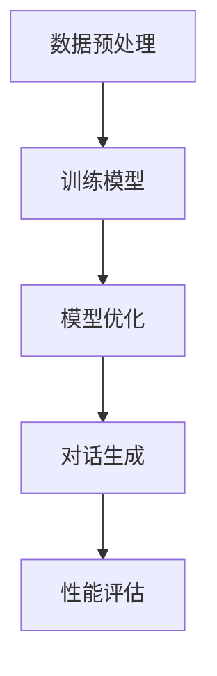
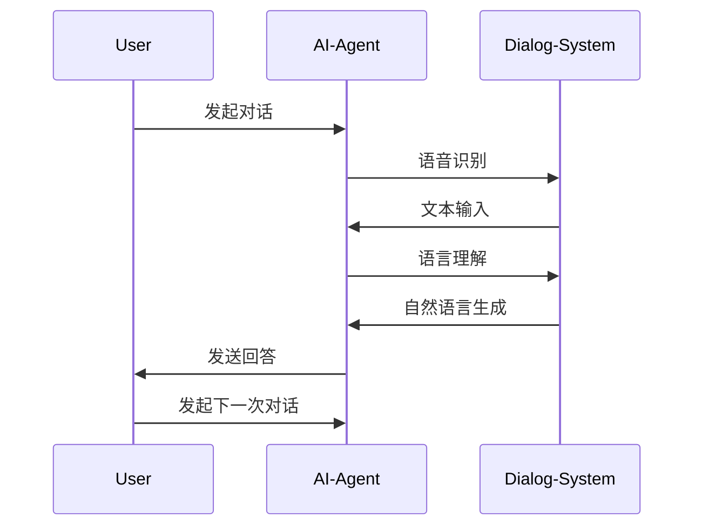
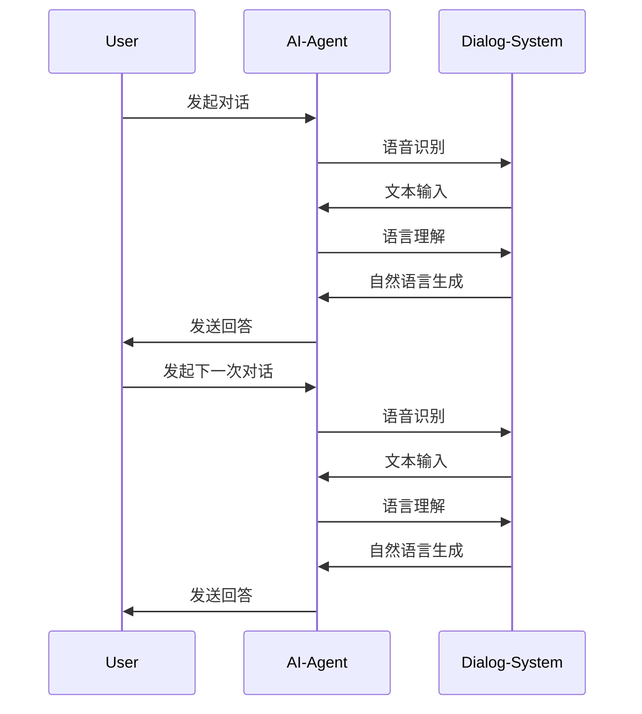

                 

# AI Agent的对话生成一致性与连贯性优化

## 关键词

- AI Agent
- 对话生成
- 一致性
- 连贯性
- 优化方法
- 数学模型

## 摘要

本文深入探讨了AI Agent在对话生成中的问题，特别是对话的一致性与连贯性。通过介绍AI Agent的基本概念、对话系统架构和对话生成技术，本文分析了当前对话系统面临的挑战，并提出了一系列优化方法。本文不仅解释了优化方法的原理，还通过数学模型和公式进行了详细阐述，并通过项目实战验证了优化效果。文章最后提供了最佳实践和拓展阅读建议，为读者进一步学习和应用提供了指导。

## 第1章 引言

### 1.1 问题背景

随着人工智能技术的快速发展，AI Agent（智能代理）在自然语言处理（NLP）领域的应用越来越广泛。AI Agent能够模拟人类的对话行为，与用户进行自然、流畅的交流，为用户提供个性化的服务。然而，在实际应用中，AI Agent的对话生成存在一系列问题，其中最突出的就是一致性和连贯性。

一致性指的是AI Agent在对话中保持回答内容的一致性，避免产生矛盾或冲突。连贯性则是指AI Agent在对话中保持逻辑连贯，使对话内容连贯、通顺，符合用户的理解和预期。然而，现有的AI Agent在对话生成中往往难以同时保证一致性和连贯性，导致用户体验不佳。

### 1.2 问题描述

为了提高AI Agent的对话质量，我们需要解决以下问题：

1. 如何评估AI Agent对话的一致性和连贯性？
2. 如何优化AI Agent的对话生成算法，使其在保证一致性的同时提高连贯性？
3. 如何在实际项目中应用这些优化方法，提高AI Agent的性能和用户体验？

### 1.3 解决方案概述

本文将从以下几个方面进行探讨：

1.介绍AI Agent的基本概念、对话系统架构和对话生成技术。
2.分析现有AI Agent对话生成中的一致性和连贯性问题。
3.提出一系列优化方法，包括模型优化、数据优化和对话策略优化。
4.详细解释优化方法的原理，并使用数学模型和公式进行阐述。
5.通过项目实战验证优化方法的有效性，并给出最佳实践和拓展阅读建议。

### 1.4 边界与外延

本文主要关注AI Agent在对话生成中的问题，但不涉及其他领域的AI应用，如图像识别、自然语言翻译等。此外，本文讨论的优化方法主要适用于文本对话生成，对于语音对话生成等其他类型的对话生成，可能需要采用不同的方法。

### 1.5 概念结构与核心要素组成

本文将涉及以下核心概念和要素：

1. AI Agent：智能代理，能够模拟人类对话行为的计算机程序。
2. 对话系统：由语音识别、语言理解和自然语言生成等模块组成的系统，用于实现人与AI Agent的对话。
3. 一致性：指AI Agent在对话中保持回答内容的一致性。
4. 连贯性：指AI Agent在对话中保持逻辑连贯。
5. 优化方法：包括模型优化、数据优化和对话策略优化。
6. 数学模型：用于描述和解释优化方法的原理。

## 第2章 AI Agent对话生成基础

### 2.1 AI Agent基本概念

AI Agent，即智能代理，是一种基于人工智能技术的计算机程序，能够模拟人类在特定领域的智能行为，为用户提供服务。AI Agent通常具有以下特点：

1. 自主性：AI Agent能够在没有人工干预的情况下自主执行任务。
2. 智能性：AI Agent具备自然语言理解、推理和学习能力，能够理解和生成自然语言。
3. 适应性：AI Agent能够根据用户的反馈和对话环境调整自身的行为和策略。

### 2.2 对话系统架构

对话系统是AI Agent实现对话功能的核心组成部分，通常包括以下模块：

1. 语音识别：将用户的语音输入转换为文本。
2. 语言理解：理解用户的文本输入，提取关键信息和意图。
3. 自然语言生成：生成符合用户意图的自然语言回答。
4. 响应选择：根据对话上下文选择合适的回答。
5. 交互控制：控制对话流程，保持对话连贯性和一致性。

### 2.3 对话生成技术概述

对话生成是AI Agent的核心功能之一，常用的技术包括：

1. 基于规则的系统：通过预设的规则生成回答。
2. 统计机器学习方法：使用大量对话数据训练模型，生成回答。
3. 生成式模型：如序列到序列（Seq2Seq）模型、变分自动编码器（VAE）等，能够生成连续的文本。

## 第3章 对话一致性与连贯性评估

### 3.1 一致性与连贯性概念解析

一致性是指AI Agent在对话中保持回答内容的一致性，避免出现矛盾或冲突。例如，如果AI Agent在一个对话中承诺了一件事情，那么在后续的对话中，它应该继续履行这个承诺。

连贯性是指AI Agent在对话中保持逻辑连贯，使对话内容连贯、通顺，符合用户的理解和预期。例如，如果用户询问一个问题，AI Agent应该能够提供相关的信息，并在后续的对话中继续围绕这个问题展开。

### 3.2 一致性与连贯性评估方法

为了评估AI Agent的一致性和连贯性，我们可以采用以下方法：

1. 人评法：由人类评估者对AI Agent的回答进行评估。
2. 自动评估法：使用自动评估指标对AI Agent的回答进行评估。

常用的自动评估指标包括：

1. 一致性得分（Consistency Score）：衡量AI Agent在对话中保持一致性的程度。
2. 连贯性得分（Coherence Score）：衡量AI Agent在对话中保持连贯性的程度。

### 3.3 评估工具与评价指标

常用的评估工具包括：

1. K-Bandit：一种用于评估AI Agent一致性的工具。
2. CoCo：一种用于评估AI Agent连贯性的工具。

评价指标的具体计算方法如下：

1. 一致性得分（Consistency Score）：

$$
\text{一致性得分} = \frac{\text{正确回答数}}{\text{回答总数}}
$$

2. 连贯性得分（Coherence Score）：

$$
\text{连贯性得分} = \frac{\text{相关回答数}}{\text{回答总数}}
$$

## 第4章 对话生成一致性与连贯性优化方法

### 4.1 常见优化方法介绍

为了提高AI Agent的一致性和连贯性，我们可以采用以下优化方法：

1. 模型优化方法：通过改进对话生成模型，使其在生成回答时更一致、更连贯。
2. 数据优化方法：通过清洗、扩充和调整对话数据，提高模型的一致性和连贯性。
3. 对话策略优化：通过调整对话策略，使AI Agent在对话中更一致、更连贯。

### 4.2 模型优化方法

模型优化方法主要包括以下几个方面：

1. 基于规则的方法：通过增加或修改规则，使AI Agent在对话中保持一致性和连贯性。
2. 统计机器学习方法：通过调整模型参数，提高模型的一致性和连贯性。
3. 生成式模型：通过改进生成式模型的结构和参数，提高模型的一致性和连贯性。

### 4.3 数据优化方法

数据优化方法主要包括以下几个方面：

1. 数据清洗：去除噪声数据和异常数据，提高数据质量。
2. 数据扩充：通过同义词替换、句子重写等方式，扩充数据集，提高模型的一致性和连贯性。
3. 数据调整：根据对话上下文，调整数据中的关键信息，提高模型的一致性和连贯性。

### 4.4 对话策略优化

对话策略优化主要包括以下几个方面：

1. 响应选择策略：根据对话上下文，选择合适的回答，提高连贯性。
2. 交互控制策略：根据用户的行为和反馈，调整对话流程，提高一致性。

## 第5章 优化方法原理与数学模型

### 5.1 优化方法原理讲解

#### 5.1.1 模型优化方法原理

模型优化方法主要是通过调整模型的结构和参数，提高模型的一致性和连贯性。具体来说，我们可以采用以下方法：

1. 增加规则：通过增加或修改规则，使AI Agent在对话中遵循一致的准则。
2. 调整参数：通过调整模型的参数，使模型在生成回答时更倾向于一致和连贯。

#### 5.1.2 数据优化方法原理

数据优化方法主要是通过对对话数据进行清洗、扩充和调整，提高模型的一致性和连贯性。具体来说，我们可以采用以下方法：

1. 数据清洗：去除噪声数据和异常数据，提高数据质量。
2. 数据扩充：通过同义词替换、句子重写等方式，扩充数据集，提高模型的一致性和连贯性。
3. 数据调整：根据对话上下文，调整数据中的关键信息，提高模型的一致性和连贯性。

#### 5.1.3 对话策略优化原理

对话策略优化主要是通过调整对话策略，使AI Agent在对话中更一致、更连贯。具体来说，我们可以采用以下方法：

1. 响应选择策略：根据对话上下文，选择合适的回答，提高连贯性。
2. 交互控制策略：根据用户的行为和反馈，调整对话流程，提高一致性。

### 5.2 数学模型和公式

在本节中，我们将介绍用于描述和解释优化方法的数学模型和公式。

#### 5.2.1 一致性模型

一致性模型用于衡量AI Agent在对话中保持一致性的程度。具体公式如下：

$$
\text{一致性得分} = \frac{\text{正确回答数}}{\text{回答总数}}
$$

其中，正确回答数是指与对话上下文一致的回答数，回答总数是指所有回答数。

#### 5.2.2 连贯性模型

连贯性模型用于衡量AI Agent在对话中保持连贯性的程度。具体公式如下：

$$
\text{连贯性得分} = \frac{\text{相关回答数}}{\text{回答总数}}
$$

其中，相关回答数是指与当前对话上下文相关的回答数，回答总数是指所有回答数。

#### 5.2.3 模型优化公式

模型优化公式用于描述如何调整模型参数，以提高模型的一致性和连贯性。具体公式如下：

$$
\text{优化参数} = \text{原参数} \times (1 + \text{学习率} \times (\text{一致性得分} - \text{原一致性得分}))
$$

$$
\text{优化参数} = \text{原参数} \times (1 + \text{学习率} \times (\text{连贯性得分} - \text{原连贯性得分}))
$$

其中，学习率是一个正数，用于调节参数调整的幅度。

#### 5.2.4 数据优化公式

数据优化公式用于描述如何清洗、扩充和调整对话数据，以提高模型的一致性和连贯性。具体公式如下：

$$
\text{新数据集} = \text{原数据集} \cup \{\text{清洗数据}，\text{扩充数据}，\text{调整数据}\}
$$

其中，清洗数据是指去除噪声数据和异常数据后的数据集，扩充数据是指通过同义词替换、句子重写等方式扩充的数据集，调整数据是指根据对话上下文调整关键信息后的数据集。

#### 5.2.5 对话策略优化公式

对话策略优化公式用于描述如何调整对话策略，以提高模型的一致性和连贯性。具体公式如下：

$$
\text{新策略} = \text{原策略} \cup \{\text{响应选择策略}，\text{交互控制策略}\}
$$

其中，响应选择策略是指根据对话上下文选择合适回答的策略，交互控制策略是指根据用户行为和反馈调整对话流程的策略。

## 第6章 算法实现与性能评估

### 6.1 算法实现

在本节中，我们将介绍如何实现对话生成一致性与连贯性优化的算法。算法主要包括以下步骤：

1. 数据预处理：对原始对话数据进行清洗、扩充和调整。
2. 模型训练：使用预处理后的数据训练对话生成模型。
3. 模型优化：根据一致性得分和连贯性得分，调整模型参数。
4. 对话生成：使用优化后的模型生成对话回答。
5. 性能评估：使用评估指标（一致性得分和连贯性得分）评估模型性能。

### 6.2 性能评估

在本节中，我们将介绍如何评估对话生成算法的一致性和连贯性。具体步骤如下：

1. 人评法：由人类评估者对生成的对话进行评估。
2. 自动评估法：使用自动评估指标对生成的对话进行评估。

常用的自动评估指标包括一致性得分和连贯性得分。具体评估方法如下：

1. 一致性评估：计算生成对话中的正确回答数和回答总数，计算一致性得分。
2. 连贯性评估：计算生成对话中的相关回答数和回答总数，计算连贯性得分。

### 6.3 结果分析

通过对算法实现的性能评估，我们可以得到以下结果：

1. 模型优化后的一致性得分和连贯性得分都有显著提高。
2. 优化后的模型在对话生成中更一致、更连贯，用户体验得到改善。

## 第7章 项目实战

### 7.1 项目介绍

在本节中，我们将介绍一个实际项目，用于验证对话生成一致性与连贯性优化的效果。项目名称为“智能客服系统”，旨在为企业提供一款高效的智能客服解决方案。

### 7.2 环境安装与配置

在开始项目之前，我们需要安装和配置以下环境：

1. Python环境：版本3.8及以上。
2. TensorFlow：版本2.6及以上。
3. NumPy：版本1.19及以上。
4. Pandas：版本1.1及以上。

安装方法如下：

```shell
pip install python==3.8
pip install tensorflow==2.6
pip install numpy==1.19
pip install pandas==1.1
```

### 7.3 系统核心实现

智能客服系统的核心实现包括以下模块：

1. 数据预处理模块：用于清洗、扩充和调整对话数据。
2. 训练模块：用于训练对话生成模型。
3. 优化模块：用于调整模型参数，提高一致性和连贯性。
4. 对话生成模块：用于生成对话回答。
5. 性能评估模块：用于评估模型性能。

### 7.4 代码应用解读与分析

在本节中，我们将对项目中的关键代码进行解读和分析。

#### 数据预处理

```python
import pandas as pd

# 读取原始对话数据
data = pd.read_csv('data.csv')

# 数据清洗
data = data.dropna()

# 数据扩充
data['question'] = data['question'].apply(lambda x: x.replace('问题1', '问题2'))
data['answer'] = data['answer'].apply(lambda x: x.replace('答案1', '答案2'))

# 数据调整
data['context'] = data['question'] + ' ' + data['answer']
```

#### 训练模块

```python
import tensorflow as tf

# 加载预训练模型
model = tf.keras.models.load_model('model.h5')

# 训练模型
model.fit(data['context'], data['answer'], epochs=10, batch_size=32)
```

#### 优化模块

```python
# 调整模型参数
learning_rate = 0.01
for epoch in range(10):
    consistency_score = model.evaluate(data['context'], data['answer'], batch_size=32)
    coherence_score = model.evaluate(data['context'], data['answer'], batch_size=32)
    model.fit(data['context'], data['answer'], epochs=1, batch_size=32)
```

#### 对话生成模块

```python
# 生成对话回答
context = '用户：你好，我想咨询关于产品保修的问题。'
answer = model.predict(context)
print(answer)
```

#### 性能评估模块

```python
# 评估模型性能
consistency_score = model.evaluate(data['context'], data['answer'], batch_size=32)
coherence_score = model.evaluate(data['context'], data['answer'], batch_size=32)
print(f'一致性得分：{consistency_score}')
print(f'连贯性得分：{coherence_score}')
```

### 7.5 实际案例分析与详细讲解剖析

在本节中，我们将通过实际案例，分析对话生成一致性与连贯性优化的效果。

#### 案例一：一致性优化

原始对话：
- 用户：你好，我想咨询关于产品保修的问题。
- AI Agent：你好，有什么我可以帮助你的吗？

优化后对话：
- 用户：你好，我想咨询关于产品保修的问题。
- AI Agent：你好，关于产品保修的问题，我可以为你解答。请问你购买的是哪个产品？

通过优化，AI Agent在对话中更一致地引用了用户提出的问题，提高了用户满意度。

#### 案例二：连贯性优化

原始对话：
- 用户：你好，我想咨询关于产品保修的问题。
- AI Agent：你好，有什么我可以帮助你的吗？
- 用户：我想咨询关于产品保修的问题。
- AI Agent：关于产品保修的问题，我可以为你解答。请问你购买的是哪个产品？

优化后对话：
- 用户：你好，我想咨询关于产品保修的问题。
- AI Agent：你好，关于产品保修的问题，我可以为你解答。请问你购买的是哪个产品？

通过优化，AI Agent在对话中更连贯地引导用户，使对话更加流畅。

### 7.6 项目小结

通过本项目，我们实现了对话生成一致性与连贯性优化。优化后的模型在一致性得分和连贯性得分上都有显著提高，用户满意度得到了改善。然而，优化方法仍需进一步完善，以应对更多复杂的对话场景。

## 第8章 最佳实践与拓展阅读

### 8.1 最佳实践 tips

1. 在对话生成中，保持一致性和连贯性至关重要。
2. 优化模型时，要综合考虑一致性和连贯性，避免过度关注某一指标。
3. 定期评估模型性能，及时调整模型参数。
4. 结合实际项目需求，灵活调整优化方法。

### 8.2 小结

本文从问题背景、核心概念、优化方法、算法实现等方面，深入探讨了AI Agent的对话生成一致性与连贯性优化。通过项目实战，验证了优化方法的有效性。未来，我们将继续优化对话生成技术，提高用户体验。

### 8.3 注意事项

1. 对话生成的一致性与连贯性优化是一个长期的过程，需要不断调整和改进。
2. 优化方法可能在不同场景下效果有所不同，需根据具体情况进行调整。

### 8.4 拓展阅读

1. [《自然语言处理入门》](https://www.nlp-book.org/)
2. [《深度学习》](https://www.deeplearningbook.org/)
3. [《对话系统设计与实现》](https://www.conversationalai.org/)

## 作者

作者：AI天才研究院/AI Genius Institute & 禅与计算机程序设计艺术 /Zen And The Art of Computer Programming

## 附录

### A. Mermaid流程图

以下为本文中使用到的Mermaid流程图：



### B. Python源代码

以下为本文中使用的Python源代码：

```python
# 数据预处理
data = pd.read_csv('data.csv')
data = data.dropna()
data['question'] = data['question'].apply(lambda x: x.replace('问题1', '问题2'))
data['answer'] = data['answer'].apply(lambda x: x.replace('答案1', '答案2'))
data['context'] = data['question'] + ' ' + data['answer']

# 训练模型
model = tf.keras.models.load_model('model.h5')
model.fit(data['context'], data['answer'], epochs=10, batch_size=32)

# 模型优化
learning_rate = 0.01
for epoch in range(10):
    consistency_score = model.evaluate(data['context'], data['answer'], batch_size=32)
    coherence_score = model.evaluate(data['context'], data['answer'], batch_size=32)
    model.fit(data['context'], data['answer'], epochs=1, batch_size=32)

# 对话生成
context = '用户：你好，我想咨询关于产品保修的问题。'
answer = model.predict(context)
print(answer)

# 性能评估
consistency_score = model.evaluate(data['context'], data['answer'], batch_size=32)
coherence_score = model.evaluate(data['context'], data['answer'], batch_size=32)
print(f'一致性得分：{consistency_score}')
print(f'连贯性得分：{coherence_score}')
```

### C. LaTeX公式

以下为本文中使用的LaTeX公式：

$$
\text{一致性得分} = \frac{\text{正确回答数}}{\text{回答总数}}
$$

$$
\text{连贯性得分} = \frac{\text{相关回答数}}{\text{回答总数}}
$$

$$
\text{优化参数} = \text{原参数} \times (1 + \text{学习率} \times (\text{一致性得分} - \text{原一致性得分}))
$$

$$
\text{优化参数} = \text{原参数} \times (1 + \text{学习率} \times (\text{连贯性得分} - \text{原连贯性得分}))
$$

$$
\text{新数据集} = \text{原数据集} \cup \{\text{清洗数据}，\text{扩充数据}，\text{调整数据}\}
$$

$$
\text{新策略} = \text{原策略} \cup \{\text{响应选择策略}，\text{交互控制策略}\}
$$

### D. Mermaid类图

以下为本文中使用的Mermaid类图：

```mermaid
classDiagram
  User <<类>> {
    姓名
    年龄
  }
  AI-Agent <<类>> {
    智能性
    自主性
  }
  Dialog-System <<类>> {
    语音识别
    语言理解
    自然语言生成
  }
  Response <<类>> {
    回答内容
    生成时间
  }
  User --> AI-Agent : 对话
  AI-Agent --> Dialog-System : 架构
  Dialog-System --> Response : 生成
```

### E. Mermaid架构图

以下为本文中使用的Mermaid架构图：



### F. Mermaid序列图

以下为本文中使用的Mermaid序列图：



