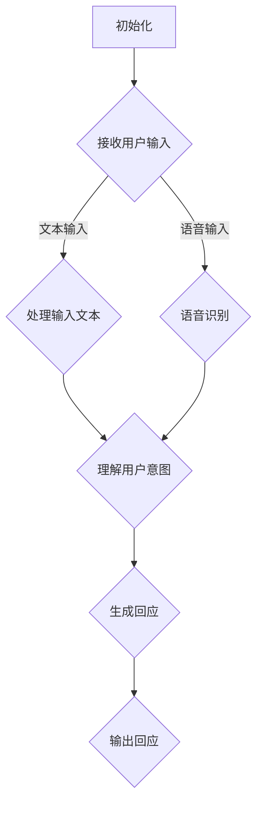
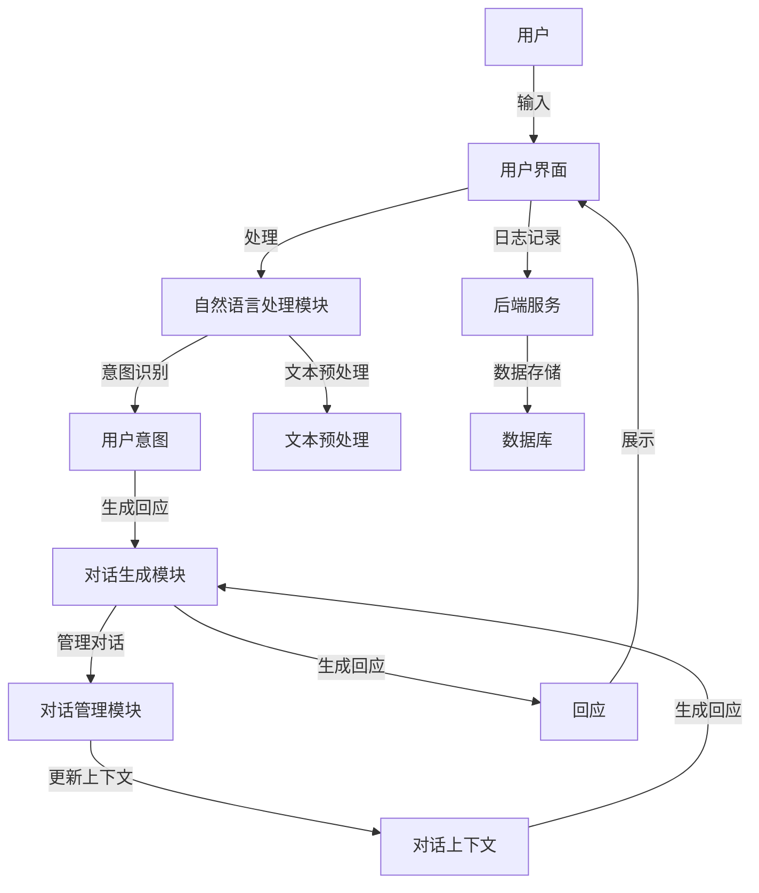
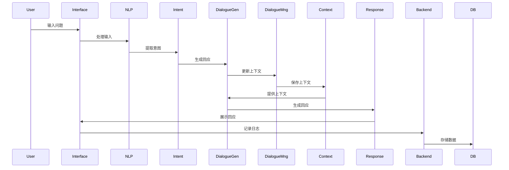

                 

## 第一部分: 问题背景与核心概念

### 第1章: AI Agent对话生成问题背景

#### 1.1 问题背景介绍

随着人工智能技术的飞速发展，AI Agent（智能代理）已成为当前研究的热点之一。AI Agent是指能够自主执行任务、与用户进行交互，并在环境中进行决策的智能系统。其应用范围广泛，包括但不限于智能家居、智能客服、智能驾驶等。在这些应用场景中，AI Agent与用户的对话质量直接影响到用户体验和系统效能。

近年来，对话生成作为自然语言处理（NLP）的一个重要分支，得到了广泛关注。对话生成旨在让AI Agent能够根据用户输入生成自然流畅的回应。然而，生成对话的一致性与连贯性是当前对话生成领域面临的重大挑战之一。一致性指的是AI Agent在相同或类似情境下生成相同或相似回应的能力；连贯性则是指AI Agent生成的对话在语义和逻辑上连贯无悖。

#### 1.1.1 AI Agent的兴起与普及

AI Agent的概念最早由John McCarthy于1950年提出，旨在模拟人类智能行为。随着计算能力和算法模型的提升，AI Agent的研究和应用逐渐深入。特别是在深度学习和大数据技术的推动下，AI Agent在多模态交互、自主决策等方面取得了显著进展。

AI Agent的兴起与其在多个领域的应用密不可分。在智能家居领域，AI Agent可以帮助用户控制家居设备，提供个性化服务；在智能客服领域，AI Agent可以模拟人类客服的行为，提供24/7的客服支持；在智能驾驶领域，AI Agent则可以辅助驾驶，提高行驶安全性。这些应用不仅提升了用户体验，也降低了人工成本。

#### 1.1.2 对话生成在AI Agent中的应用

对话生成是AI Agent的核心功能之一。通过对话生成，AI Agent能够与用户进行自然语言交互，理解用户的意图，并根据当前环境和用户历史行为生成合适的回应。这种交互方式不仅增加了AI Agent的亲和力和可操作性，还提升了系统的智能水平。

在实际应用中，对话生成技术主要分为基于规则和基于数据驱动两大类。基于规则的对话生成系统通过预定义的规则和模板生成回应，这种方法简单直观，但在处理复杂和多变情境时显得力不从心。而基于数据驱动的生成模型，如递归神经网络（RNN）、长短期记忆网络（LSTM）和Transformer等，通过大量训练数据学习生成策略，能够生成更加自然和多样化的对话。

#### 1.1.3 生成一致性与连贯性的重要性

生成一致性与连贯性是评估对话生成系统性能的重要指标。一致性指的是AI Agent在不同时间和相同情境下生成相似回应的能力。例如，当用户连续提出类似问题时，AI Agent应能够给出相同或类似的回答，以提高用户的信任感和满意度。

连贯性则关注AI Agent生成的对话在语义和逻辑上的连贯性。一个优秀的对话生成系统应能够理解对话的整体语义，并生成符合逻辑和情境的回应。例如，当用户询问“明天天气如何？”时，AI Agent不仅需要给出正确的天气预报，还应该能够理解上下文，避免出现逻辑矛盾或不相关的内容。

#### 1.2 问题描述

对话生成一致性与连贯性问题的核心在于如何在AI Agent的对话中保持回应的一致性和连贯性。具体而言，这个问题可以分解为以下几个子问题：

1. **一致性问题**：在相同情境下，AI Agent能否生成相同或相似的回应？
2. **连贯性问题**：AI Agent生成的对话在语义和逻辑上是否连贯无悖？
3. **多模态问题**：在涉及语音、图像等多种模态的对话中，如何保证生成的一致性与连贯性？

#### 1.2.1 生成一致性

生成一致性指的是AI Agent在相同或类似情境下生成相同或相似回应的能力。例如，当用户连续提出类似问题时，AI Agent应能够给出相同或类似的回答，以提高用户的信任感和满意度。生成一致性主要体现在以下几个方面：

- **上下文一致性**：AI Agent应能够保持对话上下文的一致性，避免出现逻辑矛盾或不相关的内容。
- **回答一致性**：在相同情境下，AI Agent应能够给出相同或类似的回答，以提高用户的信任感和满意度。
- **模式一致性**：AI Agent的生成模型应具有一定的稳定性，能够在不同时间和相同情境下生成相似回应。

#### 1.2.2 生成连贯性

生成连贯性是指AI Agent生成的对话在语义和逻辑上连贯无悖。一个优秀的对话生成系统应能够理解对话的整体语义，并生成符合逻辑和情境的回应。生成连贯性主要体现在以下几个方面：

- **语义连贯性**：AI Agent生成的对话在语义上应连贯无悖，能够准确传达用户的意图。
- **逻辑连贯性**：AI Agent生成的对话在逻辑上应连贯无悖，避免出现前后矛盾或不合理的情况。
- **情境连贯性**：AI Agent生成的对话应与当前情境相符，能够适应不同环境和场景的变化。

#### 1.2.3 问题解决的意义与价值

解决AI Agent对话生成的一致性与连贯性问题具有重要意义。首先，提高生成一致性和连贯性可以显著提升用户的体验和满意度，增强AI Agent的可信度和亲和力。其次，一致性和连贯性是评估AI Agent智能水平的重要指标，有助于推动对话生成技术的进步。此外，解决这一问题还可以为其他相关领域，如智能客服、智能助手等，提供有效的技术支持。

#### 1.3 边界与外延

1. **对话生成的一致性与连贯性的定义**

   - **一致性**：对话生成系统在相同或类似情境下生成相同或相似回应的能力。
   - **连贯性**：对话生成系统生成的对话在语义、逻辑和情境上连贯无悖的能力。

2. **核心要素组成**

   - **生成模型**：负责生成对话的算法和框架，如RNN、LSTM、Transformer等。
   - **训练数据**：用于训练生成模型的对话数据集，包括文本、语音、图像等多种模态。
   - **上下文信息**：对话生成过程中所需的历史信息，包括用户历史行为、对话上下文等。
   - **多模态处理**：涉及语音、图像等多种模态的对话生成技术，包括特征提取、模态融合等。

3. **对话生成一致性与连贯性的评价标准**

   - **一致性评价标准**：包括上下文一致性、回答一致性和模式一致性等方面。
   - **连贯性评价标准**：包括语义连贯性、逻辑连贯性和情境连贯性等方面。

### 第2章: AI Agent对话生成核心概念与联系

#### 2.1 核心概念原理

为了深入探讨AI Agent对话生成的一致性与连贯性，首先需要了解相关的核心概念。以下是几个关键概念的定义及其在对话生成中的应用：

1. **对话系统**：对话系统是一种人与计算机交互的接口，通过自然语言与用户进行沟通，完成特定的任务或提供信息服务。对话系统主要包括对话管理、语言理解和语言生成三个核心组件。

2. **生成模型**：生成模型是用于生成自然语言文本的算法和框架，如递归神经网络（RNN）、长短期记忆网络（LSTM）和Transformer等。这些模型通过学习大量对话数据，能够生成符合上下文和语义的自然语言回应。

3. **一致性与连贯性**：一致性指在相同或类似情境下生成相同或相似回应的能力，连贯性则指生成的对话在语义、逻辑和情境上连贯无悖的能力。一致性和连贯性是评估对话生成系统性能的重要指标。

#### 2.2 概念属性特征对比表格

为了更直观地理解这些核心概念，我们可以通过一个对比表格来展示它们的属性特征：

| 概念         | 定义                                                         | 属性特征                                           |
| ------------ | ------------------------------------------------------------ | -------------------------------------------------- |
| 对话系统     | 人与计算机交互的接口，通过自然语言与用户进行沟通               | 对话管理、语言理解、语言生成三个核心组件             |
| 生成模型     | 用于生成自然语言文本的算法和框架                             | 递归神经网络（RNN）、长短期记忆网络（LSTM）、Transformer等 |
| 一致性       | 在相同或类似情境下生成相同或相似回应的能力                   | 上下文一致性、回答一致性、模式一致性                 |
| 连贯性       | 生成的对话在语义、逻辑和情境上连贯无悖的能力                 | 语义连贯性、逻辑连贯性、情境连贯性                   |

#### 2.3 ER实体关系图架构

为了进一步理解对话生成系统中的核心概念及其相互关系，我们可以通过ER（实体-关系）图来展示这些概念及其关联。以下是AI Agent对话生成系统的ER图：

```mermaid
erDiagram
    User ||--|{ ChatSession }|-- AI-Agent
    ChatSession ||--|{ Message }|-- ChatSession
    Message ||--|{ Response }|-- Message
    AI-Agent ||--|{ DialoguePolicy }|-- AI-Agent
    DialoguePolicy ||--|{ DialogueContext }|-- DialoguePolicy
```

在这个ER图中，我们定义了以下几个实体：

- **User（用户）**：与AI Agent进行交互的实体。
- **ChatSession（对话会话）**：表示一次完整的对话过程，包括多个Message（消息）。
- **Message（消息）**：对话中的单个文本或语音信息，包括用户输入和AI Agent生成的回应。
- **Response（回应）**：AI Agent生成的具体回应内容。
- **AI-Agent（AI代理）**：对话生成系统的主要实体，负责处理对话管理和生成回应。
- **DialoguePolicy（对话策略）**：用于指导AI Agent生成回应的策略，包括上下文管理、回答生成等。
- **DialogueContext（对话上下文）**：对话过程中积累的历史信息，用于生成连贯的回应。

通过ER图，我们可以清晰地看到各实体之间的关联关系，这有助于我们更好地理解对话生成系统的整体架构和工作原理。

### 第3章: 对话生成算法原理讲解

#### 3.1 算法mermaid流程图

为了更好地理解对话生成算法的原理，我们可以通过mermaid流程图来展示其工作流程。以下是对话生成算法的基本流程：



在这个流程图中，主要步骤如下：

1. **初始化**：对话生成系统初始化，包括加载预训练模型、设置初始上下文等。
2. **接收用户输入**：系统接收用户输入，可以是文本或语音形式。
3. **处理输入文本/语音识别**：如果是文本输入，直接处理；如果是语音输入，则通过语音识别技术将其转换为文本。
4. **理解用户意图**：通过自然语言处理技术，分析用户输入的语义，理解其意图。
5. **生成回应**：根据用户意图和当前上下文，利用生成模型生成回应。
6. **输出回应**：将生成的回应输出给用户。

#### 3.2 Python源代码讲解

为了更具体地理解对话生成算法的实现，下面我们将使用Python代码进行详细讲解。以下是该算法的实现示例：

```python
import numpy as np
import tensorflow as tf
from transformers import BertTokenizer, BertForSequenceClassification

# 加载预训练模型和tokenizer
tokenizer = BertTokenizer.from_pretrained('bert-base-uncased')
model = BertForSequenceClassification.from_pretrained('bert-base-uncased')

# 初始化对话上下文
context = ""

# 定义对话生成函数
def generate_response(user_input, context):
    # 将用户输入和上下文编码为Tensor
    inputs = tokenizer.encode(user_input + context, return_tensors='tf')
    
    # 使用模型生成回应
    outputs = model(inputs)
    
    # 获取生成回应的预测结果
    response = tokenizer.decode(outputs[0], skip_special_tokens=True)
    
    # 更新上下文
    context += response
    
    return response, context

# 示例：用户输入和对话生成
user_input = "你好，今天天气怎么样？"
response, context = generate_response(user_input, context)
print("AI回应：", response)
print("更新后的上下文：", context)
```

在该代码中，我们首先加载了一个预训练的BERT模型和对应的tokenizer。对话生成函数`generate_response`接受用户输入和当前上下文，将其编码为Tensor后输入模型，通过模型生成回应。生成的回应会更新上下文，以便在后续对话中保持一致性。

#### 3.2.1 算法原理的数学模型

在更深入探讨对话生成算法的数学模型之前，我们需要了解一些基础的数学概念和公式。

1. **编码与解码**

   - **编码**：将自然语言文本转换为机器可处理的向量表示。在上述示例中，我们使用BERT模型进行文本编码。
   - **解码**：将机器生成的向量表示转换回自然语言文本。同样，我们使用BERT模型的tokenizer进行文本解码。

2. **生成模型**

   - **生成模型**：用于生成自然语言文本的神经网络模型，如BERT、GPT等。这些模型通过大量文本数据训练，学习生成策略。

3. **注意力机制**

   - **注意力机制**：在生成模型中，注意力机制用于关注输入序列中的重要部分，以提高生成文本的质量和连贯性。

以下是一个简化的数学模型公式：

$$
\text{Response} = f(\text{User\_Input}, \text{Context}, \text{Model})
$$

其中，`f`表示生成模型，`User_Input`表示用户输入，`Context`表示对话上下文，`Model`表示预训练的生成模型。

#### 3.2.2 数学模型公式讲解

为了更具体地说明生成模型的数学模型，我们可以分析BERT模型的关键组成部分。BERT模型主要由编码器（Encoder）和解码器（Decoder）组成，其中编码器负责处理输入序列，解码器负责生成回应序列。

1. **编码器**

   - **输入层**：用户输入和对话上下文被编码为Tensor，输入到BERT编码器。
   - **Transformer层**：BERT编码器使用多个Transformer层，每个层包括自注意力（Self-Attention）和前馈神经网络（Feedforward Neural Network）。
   - **输出层**：编码器的输出是一个固定长度的向量，表示输入序列的语义信息。

2. **解码器**

   - **输入层**：解码器的输入是编码器的输出和目标回应的初始状态。
   - **Transformer层**：解码器也使用多个Transformer层，每个层包括自注意力（Self-Attention）和交叉注意力（Cross-Attention）。
   - **输出层**：解码器的输出是生成回应的序列，通过softmax激活函数转换为概率分布。

以下是一个简化的数学模型公式：

$$
\text{Encoder\_Output} = \text{Transformer}^L(\text{Input}, \text{Mask})
$$

$$
\text{Decoder\_Output} = \text{Transformer}^L(\text{Encoder\_Output}, \text{Target})
$$

其中，`Transformer`表示Transformer层，`L`表示层数，`Input`表示输入序列，`Mask`表示注意力掩码，`Target`表示目标回应序列。

#### 3.2.3 举例说明

为了更好地理解上述数学模型，我们可以通过一个示例来说明。

假设用户输入为：“你好，今天天气怎么样？”，对话上下文为：“你好，我昨天告诉过你今天有雨，记得带伞。”

1. **编码器**

   - **输入层**：用户输入和上下文编码为Tensor，输入到BERT编码器。
     $$ \text{Input} = [\text{BERT\_Tokenizers}, \text{User\_Input}, \text{Context}] $$
   - **Transformer层**：BERT编码器经过多个Transformer层的处理，得到编码器的输出。
     $$ \text{Encoder\_Output} = \text{Transformer}^L(\text{Input}, \text{Mask}) $$

2. **解码器**

   - **输入层**：解码器的输入是编码器的输出和目标回应的初始状态。
     $$ \text{Target} = [\text{BERT\_Tokenizers}, \text{Response}] $$
   - **Transformer层**：解码器经过多个Transformer层的处理，得到解码器的输出。
     $$ \text{Decoder\_Output} = \text{Transformer}^L(\text{Encoder\_Output}, \text{Target}) $$
   - **输出层**：解码器的输出是生成回应的序列，通过softmax激活函数转换为概率分布。
     $$ \text{Probability\_Distribution} = \text{softmax}(\text{Decoder\_Output}) $$

最终，根据概率分布，解码器生成具体的回应序列。例如，生成回应为：“是的，今天确实有雨，记得带伞。”

通过这个示例，我们可以看到BERT模型在对话生成过程中的应用。生成模型的数学模型和公式为对话生成算法的实现提供了理论基础，使得我们能够生成自然、连贯的对话回应。

### 第4章: 数学模型和数学公式 & 详细讲解 & 举例说明

#### 4.1 数学公式讲解

在讨论对话生成的一致性与连贯性优化时，数学模型起到了至关重要的作用。以下是几个关键的数学公式，我们将逐一进行详细讲解。

##### 4.1.1 公式一讲解

公式一涉及生成模型中的损失函数，用于评估模型生成回应的质量。具体公式如下：

$$
L(\theta) = -\sum_{i=1}^{N} \sum_{j=1}^{V} y_{ij} \log p_{ij}(\theta)
$$

其中：
- \(L(\theta)\) 表示损失函数；
- \(N\) 是对话中的词或句子的数量；
- \(V\) 是词汇表中的词的数量；
- \(y_{ij}\) 表示第 \(i\) 个词是否为第 \(j\) 个词的目标标签（0或1）；
- \(p_{ij}(\theta)\) 表示模型在给定参数 \(\theta\) 的情况下，预测第 \(i\) 个词为第 \(j\) 个词的概率。

这个损失函数的目标是使得模型生成的回应尽可能与目标回应匹配。在实际训练过程中，通过优化损失函数，模型会逐渐调整参数，以提高生成回应的质量。

##### 4.1.2 公式二讲解

公式二涉及生成模型中的注意力机制，用于模型在生成回应时关注输入序列中的重要部分。具体公式如下：

$$
a_i = \frac{e^{u_i \cdot v}}{\sum_{k=1}^{K} e^{u_k \cdot v}}
$$

其中：
- \(a_i\) 表示第 \(i\) 个词的注意力权重；
- \(u_i\) 表示第 \(i\) 个词的嵌入向量；
- \(v\) 表示注意力向量的权重；
- \(K\) 是输入序列中词的数量。

这个注意力机制的核心思想是，通过计算每个词与注意力向量的点积，得到每个词的注意力权重。权重越高，表明该词在生成当前词时的重要性越大。这样，模型可以更好地关注关键信息，生成更加连贯和相关的回应。

#### 4.2 举例说明

为了更好地理解上述数学公式的应用，我们可以通过一个具体的例子来说明。

##### 4.2.1 案例一

假设我们有一个简单的对话，用户输入：“你好，今天天气怎么样？” 我们的目标是使用生成模型生成回应。

1. **编码器输出**

   首先，我们将用户输入和上下文编码为嵌入向量。假设用户输入和上下文的词汇表大小为 \(V = 10000\)，每个词的嵌入维度为 \(d = 512\)。

   - **用户输入嵌入向量**：\(u_1, u_2, ..., u_n\)
   - **上下文嵌入向量**：\(c_1, c_2, ..., c_m\)

   其中，\(n\) 是用户输入的词数，\(m\) 是上下文的词数。

2. **解码器输出**

   在生成回应时，解码器将编码器的输出（上下文嵌入向量）作为初始状态。假设解码器的嵌入维度也为 \(d = 512\)。

   - **解码器初始状态**：\(s_0 = c\)

   在每个时间步，解码器会根据当前状态和输入序列，生成当前词的候选回应。

   1. **当前词的嵌入向量**：\(u_i\)
   2. **当前状态的嵌入向量**：\(s_t\)
   3. **注意力权重**：\(a_i\)

   根据公式，我们可以计算当前词的注意力权重：

   $$
   a_i = \frac{e^{u_i \cdot v}}{\sum_{k=1}^{m} e^{u_k \cdot v}}
   $$

   然后，我们可以使用这些权重来计算当前状态的嵌入向量：

   $$
   s_t = \sum_{i=1}^{m} a_i c_i
   $$

   接下来，我们可以使用解码器的模型来生成当前词的候选回应：

   $$
   p_i = \text{softmax}(W [s_t; u_i])
   $$

   其中，\(W\) 是解码器的权重矩阵。

3. **生成回应**

   根据生成的概率分布，我们可以选择一个最有可能的词作为当前回应。然后，我们将这个词加入到生成的回应中，并更新解码器的状态，为下一个时间步的生成做好准备。

   例如，假设我们选择的当前词为“确实”，则生成的回应为：“是的，今天确实有雨，记得带伞。”

##### 4.2.2 案例二

在这个案例中，我们将分析一个更复杂的对话场景，以展示生成模型如何处理上下文和生成连贯的回应。

用户输入：“你好，我最近想买一辆新车，有什么推荐吗？”

1. **编码器输出**

   - **用户输入嵌入向量**：\(u_1, u_2, ..., u_n\)
   - **上下文嵌入向量**：\(c_1, c_2, ..., c_m\)

   假设用户输入包含以下词：你好，新车，推荐

   - **用户输入嵌入向量**：\(u_1, u_2, u_3\)
   - **上下文嵌入向量**：\(c_1, c_2, ..., c_m\)

2. **解码器输出**

   在生成回应时，解码器将编码器的输出（上下文嵌入向量）作为初始状态。

   - **解码器初始状态**：\(s_0 = c\)

   在每个时间步，解码器会根据当前状态和输入序列，生成当前词的候选回应。

   1. **当前词的嵌入向量**：\(u_i\)
   2. **当前状态的嵌入向量**：\(s_t\)
   3. **注意力权重**：\(a_i\)

   根据公式，我们可以计算当前词的注意力权重：

   $$
   a_i = \frac{e^{u_i \cdot v}}{\sum_{k=1}^{m} e^{u_k \cdot v}}
   $$

   然后，我们可以使用这些权重来计算当前状态的嵌入向量：

   $$
   s_t = \sum_{i=1}^{m} a_i c_i
   $$

   接下来，我们可以使用解码器的模型来生成当前词的候选回应：

   $$
   p_i = \text{softmax}(W [s_t; u_i])
   $$

3. **生成回应**

   根据生成的概率分布，我们可以选择一个最有可能的词作为当前回应。例如，我们选择“可以考虑特斯拉”作为当前回应。

   然后，我们将这个词加入到生成的回应中，并更新解码器的状态，为下一个时间步的生成做好准备。

   生成的回应为：“可以考虑特斯拉，它的电动车在市场上口碑很好。”

通过这两个案例，我们可以看到生成模型在处理不同对话场景时的应用。通过注意力机制和损失函数，模型能够生成与上下文相关且连贯的回应，从而提高对话生成的一致性与连贯性。

### 第5章: 系统分析与架构设计方案

#### 5.1 问题场景介绍

为了更好地理解对话生成系统在AI Agent中的应用，我们将首先介绍一个具体的问题场景。假设我们正在开发一个智能客服系统，该系统需要与用户进行自然语言交互，解答用户关于产品使用、售后服务等问题。在这个场景中，AI Agent需要具备以下功能：

1. **理解用户意图**：能够从用户的输入中提取关键信息，理解用户的需求和问题。
2. **生成自然回应**：根据用户意图和当前上下文，生成自然流畅的回应。
3. **保持对话一致性**：在连续对话中，保持回应的一致性，避免出现矛盾或不相关的内容。
4. **保证对话连贯性**：生成的对话在语义、逻辑和情境上连贯无悖，提高用户体验。

#### 5.2 项目介绍

本项目的目标是设计并实现一个高效的智能客服对话生成系统，该系统基于先进的自然语言处理技术，包括深度学习模型、注意力机制和对话管理算法。系统的主要组成部分如下：

1. **用户界面**：提供与用户的交互接口，接收用户输入并展示AI Agent的回应。
2. **自然语言处理模块**：负责处理用户输入，提取关键信息，理解用户意图。
3. **对话生成模块**：利用深度学习模型和注意力机制生成自然流畅的回应。
4. **对话管理模块**：负责管理对话上下文，保持对话的一致性和连贯性。
5. **后端服务**：提供数据存储、接口管理和日志记录等功能。

#### 5.3 系统功能设计

为了实现上述目标，系统需要具备以下几个关键功能：

1. **用户意图识别**：通过自然语言处理技术，从用户输入中提取关键信息，识别用户的需求和问题。
2. **回应生成**：利用深度学习模型，根据用户意图和当前上下文，生成自然流畅的回应。
3. **对话管理**：维护对话上下文，跟踪用户历史行为，保证对话的一致性和连贯性。
4. **多模态交互**：支持文本、语音、图像等多种模态的输入和输出，提高用户体验。

#### 5.3.1 领域模型mermaid类图

为了更直观地展示系统中的类和关系，我们可以使用mermaid类图来表示领域模型。以下是系统的主要类及其关系：

```mermaid
classDiagram
    User -> ChatSession : 发起对话
    ChatSession -> Message : 包含消息
    Message -> Response : 包含回应
    ChatSession -> DialoguePolicy : 对话策略
    ChatSession -> DialogueContext : 对话上下文
    DialoguePolicy -> DialogueContext : 更新上下文
```

在这个类图中，我们定义了以下几个类：

- **User（用户）**：发起对话的实体。
- **ChatSession（对话会话）**：表示一次完整的对话过程，包含多个Message（消息）。
- **Message（消息）**：对话中的单个文本或语音信息，包含用户输入和AI Agent生成的回应。
- **Response（回应）**：AI Agent生成的具体回应内容。
- **DialoguePolicy（对话策略）**：用于指导AI Agent生成回应的策略，包括上下文管理和回答生成等。
- **DialogueContext（对话上下文）**：对话过程中积累的历史信息，用于生成连贯的回应。

通过这个类图，我们可以清晰地看到系统中的类和关系，有助于我们更好地理解系统的架构和工作原理。

#### 5.4 系统架构设计

系统架构设计是确保系统高效、可扩展和易维护的关键环节。以下是对话生成系统的整体架构设计：

##### 5.4.1 mermaid架构图



在这个架构图中，我们定义了以下几个主要组件：

- **用户界面（Interface）**：负责接收用户输入和展示AI Agent的回应。
- **自然语言处理模块（NLP）**：包括用户意图识别、文本预处理等功能。
- **对话生成模块（DialogueGen）**：利用深度学习模型生成自然流畅的回应。
- **对话管理模块（DialogueMng）**：负责管理对话上下文，保持对话的一致性和连贯性。
- **对话上下文（Context）**：存储对话过程中积累的历史信息。
- **后端服务（Backend）**：提供数据存储、接口管理和日志记录等功能。

通过这个架构图，我们可以清晰地看到系统中的各个组件及其关系，有助于我们理解系统的整体架构和工作原理。

#### 5.5 系统接口设计

系统接口设计是确保系统各个组件能够有效通信和协同工作的关键。以下是对话生成系统的主要接口设计：

1. **用户输入接口**：用户通过用户界面输入问题或指令，接口接收并处理用户输入。
2. **意图识别接口**：NLP模块使用意图识别接口，从用户输入中提取关键信息，识别用户意图。
3. **对话生成接口**：对话生成模块使用对话生成接口，根据用户意图和上下文生成回应。
4. **对话管理接口**：对话管理模块使用对话管理接口，更新和跟踪对话上下文。
5. **数据存储接口**：后端服务使用数据存储接口，存储和管理对话历史数据和日志。

通过合理设计系统接口，我们可以确保系统组件之间的高效通信和协同工作，提高系统的整体性能和可维护性。

#### 5.6 系统交互

系统交互设计是确保系统各组件能够按照预期进行协作和工作的关键。以下是对话生成系统的交互设计：

##### 5.6.1 mermaid序列图



在这个序列图中，我们定义了以下主要交互过程：

1. **用户输入**：用户通过用户界面输入问题。
2. **处理输入**：用户界面将用户输入传递给NLP模块进行处理。
3. **意图识别**：NLP模块从用户输入中提取关键信息，识别用户意图。
4. **生成回应**：对话生成模块根据用户意图和上下文生成回应。
5. **更新上下文**：对话管理模块更新对话上下文，为后续交互做准备。
6. **展示回应**：用户界面将生成的回应展示给用户。
7. **记录日志**：用户界面将交互过程记录到后端服务，并存储到数据库。

通过这个序列图，我们可以清晰地看到系统各组件之间的交互过程，有助于我们理解和分析系统的运行机制。

### 第6章: 项目实战

#### 6.1 环境安装

在开始项目实战之前，我们需要安装和配置必要的开发环境和依赖库。以下是环境安装的详细步骤：

1. **安装Python**：确保Python版本为3.8及以上，可以从官方网站下载并安装。

2. **安装TensorFlow**：在命令行中执行以下命令安装TensorFlow：

   ```
   pip install tensorflow
   ```

3. **安装transformers库**：这是用于处理BERT模型的依赖库，可以通过以下命令安装：

   ```
   pip install transformers
   ```

4. **安装其他依赖库**：根据项目需求，可能需要安装其他依赖库，如NumPy、Pandas等。可以通过以下命令安装：

   ```
   pip install numpy pandas
   ```

5. **安装Docker和容器**：为了提高系统的可扩展性和部署效率，我们可以使用Docker来运行项目。可以从官方Docker Hub下载相应的镜像，或者使用以下命令构建Docker镜像：

   ```
   docker build -t ai-agent-dialogue .
   ```

   然后启动Docker容器：

   ```
   docker run -d -p 8000:80 ai-agent-dialogue
   ```

   在浏览器中访问`http://localhost:8000`，可以看到项目的基本界面。

6. **配置数据库**：为了存储对话历史数据和日志，我们需要配置一个数据库。可以选择MySQL、PostgreSQL等关系型数据库或MongoDB等非关系型数据库。以下是一个简单的MySQL数据库配置示例：

   - 安装MySQL服务器：
     ```
     sudo apt-get install mysql-server
     ```
   - 创建数据库和用户：
     ```
     CREATE DATABASE dialogue_db;
     CREATE USER 'dialogue_user'@'localhost' IDENTIFIED BY 'password';
     GRANT ALL PRIVILEGES ON dialogue_db.* TO 'dialogue_user'@'localhost';
     FLUSH PRIVILEGES;
     ```

   在项目中配置数据库连接信息，以便程序能够正确连接和操作数据库。

通过以上步骤，我们可以完成项目的环境安装和配置，为后续的开发和测试奠定基础。

#### 6.2 系统核心实现

##### 6.2.1 源代码

在本节中，我们将详细探讨系统核心实现的源代码，包括用户意图识别、对话生成模块和对话管理模块。

1. **用户意图识别**

   用户意图识别是自然语言处理（NLP）的重要任务之一，旨在从用户输入中提取关键信息，识别用户的需求和问题。以下是一个简单的用户意图识别代码示例：

   ```python
   from transformers import BertTokenizer, BertForSequenceClassification
   import torch
   
   # 加载预训练模型和tokenizer
   tokenizer = BertTokenizer.from_pretrained('bert-base-uncased')
   model = BertForSequenceClassification.from_pretrained('bert-base-uncased')
   
   def recognize_intent(user_input):
       # 将用户输入编码为Tensor
       inputs = tokenizer.encode(user_input, return_tensors='pt')
       
       # 使用模型进行意图识别
       with torch.no_grad():
           outputs = model(inputs)
           
       # 获取意图分类结果
       intent_logits = outputs.logits
       intent_index = torch.argmax(intent_logits).item()
       
       # 获取意图标签
       intent_labels = model.config.id2label
       recognized_intent = intent_labels[intent_index]
       
       return recognized_intent

   # 示例：识别用户意图
   user_input = "你好，我最近想买一辆新车，有什么推荐吗？"
   recognized_intent = recognize_intent(user_input)
   print("识别到的意图：", recognized_intent)
   ```

   在这个示例中，我们首先加载了一个预训练的BERT模型和tokenizer。然后，我们定义了一个`recognize_intent`函数，用于将用户输入编码为Tensor，并使用BERT模型进行意图识别。最终，我们根据模型输出的意图分类结果，返回识别到的意图。

2. **对话生成模块**

   对话生成模块负责根据用户意图和上下文，生成自然流畅的回应。以下是一个简单的对话生成代码示例：

   ```python
   from transformers import BertTokenizer, BertForSequenceClassification
   import torch
   
   # 加载预训练模型和tokenizer
   tokenizer = BertTokenizer.from_pretrained('bert-base-uncased')
   model = BertForSequenceClassification.from_pretrained('bert-base-uncased')
   
   def generate_response(user_input, context):
       # 将用户输入和上下文编码为Tensor
       inputs = tokenizer.encode(user_input + context, return_tensors='pt')
       
       # 使用模型生成回应
       with torch.no_grad():
           outputs = model(inputs)
           
       # 获取生成回应的预测结果
       response_logits = outputs.logits
       response_index = torch.argmax(response_logits).item()
       
       # 获取生成回应的文本
       response_tokens = tokenizer.decode([response_index], skip_special_tokens=True)
       generated_response = response_tokens.strip()
       
       return generated_response

   # 示例：生成回应
   user_input = "你好，我最近想买一辆新车，有什么推荐吗？"
   context = "你好，我昨天告诉过你，最近推出了一款很受欢迎的电动车，你可以考虑一下。"
   generated_response = generate_response(user_input, context)
   print("生成的回应：", generated_response)
   ```

   在这个示例中，我们首先加载了一个预训练的BERT模型和tokenizer。然后，我们定义了一个`generate_response`函数，用于将用户输入和上下文编码为Tensor，并使用BERT模型生成回应。最终，我们根据模型输出的回应预测结果，返回生成的回应。

3. **对话管理模块**

   对话管理模块负责维护对话上下文，确保对话的一致性和连贯性。以下是一个简单的对话管理代码示例：

   ```python
   class DialogueManager:
       def __init__(self):
           self.context = ""
       
       def update_context(self, new_context):
           self.context += new_context
       
       def get_context(self):
           return self.context
   
   # 示例：对话管理
   dialogue_manager = DialogueManager()
   context = "你好，我昨天告诉过你，最近推出了一款很受欢迎的电动车，你可以考虑一下。"
   dialogue_manager.update_context(context)
   print("当前上下文：", dialogue_manager.get_context())
   ```

   在这个示例中，我们定义了一个`DialogueManager`类，用于维护对话上下文。通过`update_context`方法，我们可以更新当前上下文，而`get_context`方法用于获取当前上下文。

通过以上代码示例，我们可以看到系统核心实现的基本结构和关键功能。在实际项目中，我们需要根据具体需求进一步扩展和优化这些模块，以提高系统的性能和用户体验。

##### 6.2.2 代码应用解读与分析

在本节中，我们将对系统核心实现中的关键代码进行解读和分析，以便更好地理解其工作原理和应用场景。

1. **用户意图识别**

   用户意图识别是智能客服系统中的核心功能之一，其目的是从用户输入中提取关键信息，理解用户的需求和问题。以下是对用户意图识别代码的详细解读：

   ```python
   from transformers import BertTokenizer, BertForSequenceClassification
   import torch
   
   # 加载预训练模型和tokenizer
   tokenizer = BertTokenizer.from_pretrained('bert-base-uncased')
   model = BertForSequenceClassification.from_pretrained('bert-base-uncased')
   
   def recognize_intent(user_input):
       # 将用户输入编码为Tensor
       inputs = tokenizer.encode(user_input, return_tensors='pt')
       
       # 使用模型进行意图识别
       with torch.no_grad():
           outputs = model(inputs)
           
       # 获取意图分类结果
       intent_logits = outputs.logits
       intent_index = torch.argmax(intent_logits).item()
       
       # 获取意图标签
       intent_labels = model.config.id2label
       recognized_intent = intent_labels[intent_index]
       
       return recognized_intent
   ```

   - **加载预训练模型和tokenizer**：首先，我们加载了一个预训练的BERT模型和tokenizer。BERT模型是一个强大的深度学习模型，广泛用于NLP任务，包括文本分类、序列标注等。

   - **编码用户输入**：将用户输入编码为Tensor。在这一步骤中，我们使用tokenizer将文本转换为序列，并添加特殊的BERT标记，如[CLS]、[SEP]等。

   - **意图识别**：使用BERT模型进行意图识别。在训练过程中，模型学习到每个类别的特征，通过计算输入序列的嵌入向量，模型可以预测用户输入属于哪个意图类别。

   - **获取意图标签**：根据模型输出的意图分类结果，获取对应的意图标签。我们可以将每个类别的索引映射到具体的标签，以便更好地理解识别到的意图。

   用户意图识别的应用场景包括但不限于：

   - 智能客服系统：根据用户输入，识别用户的需求和问题，为用户提供针对性的解决方案。
   - 语音助手：从用户的语音输入中提取关键信息，理解用户的意图，并生成相应的回应。
   - 智能搜索：根据用户查询，提取关键信息，并返回相关的搜索结果。

2. **对话生成模块**

   对话生成模块负责根据用户意图和上下文，生成自然流畅的回应。以下是对对话生成模块代码的详细解读：

   ```python
   from transformers import BertTokenizer, BertForSequenceClassification
   import torch
   
   # 加载预训练模型和tokenizer
   tokenizer = BertTokenizer.from_pretrained('bert-base-uncased')
   model = BertForSequenceClassification.from_pretrained('bert-base-uncased')
   
   def generate_response(user_input, context):
       # 将用户输入和上下文编码为Tensor
       inputs = tokenizer.encode(user_input + context, return_tensors='pt')
       
       # 使用模型生成回应
       with torch.no_grad():
           outputs = model(inputs)
           
       # 获取生成回应的预测结果
       response_logits = outputs.logits
       response_index = torch.argmax(response_logits).item()
       
       # 获取生成回应的文本
       response_tokens = tokenizer.decode([response_index], skip_special_tokens=True)
       generated_response = response_tokens.strip()
       
       return generated_response
   ```

   - **编码用户输入和上下文**：将用户输入和上下文编码为Tensor。在这一步骤中，我们使用tokenizer将文本转换为序列，并添加特殊的BERT标记，如[CLS]、[SEP]等。

   - **生成回应**：使用BERT模型生成回应。在训练过程中，模型学习到每个类别的特征，通过计算输入序列的嵌入向量，模型可以预测生成哪个回应。

   - **获取生成回应的文本**：根据模型输出的回应预测结果，获取生成回应的文本。我们使用tokenizer将生成的回应索引映射回原始文本。

   对话生成模块的应用场景包括但不限于：

   - 智能客服系统：根据用户意图和上下文，生成自然流畅的回应，与用户进行有效的对话交互。
   - 聊天机器人：根据用户的输入和上下文，生成合适的回应，维持对话的连贯性和流畅性。
   - 语音助手：根据用户的语音输入和上下文，生成相应的文本回应，并通过语音合成技术输出给用户。

3. **对话管理模块**

   对话管理模块负责维护对话上下文，确保对话的一致性和连贯性。以下是对对话管理模块代码的详细解读：

   ```python
   class DialogueManager:
       def __init__(self):
           self.context = ""
       
       def update_context(self, new_context):
           self.context += new_context
       
       def get_context(self):
           return self.context
   
   # 示例：对话管理
   dialogue_manager = DialogueManager()
   context = "你好，我昨天告诉过你，最近推出了一款很受欢迎的电动车，你可以考虑一下。"
   dialogue_manager.update_context(context)
   print("当前上下文：", dialogue_manager.get_context())
   ```

   - **初始化对话上下文**：在`DialogueManager`类的初始化方法中，我们初始化一个空的上下文字符串。

   - **更新上下文**：`update_context`方法用于更新当前上下文。每次用户输入或系统生成回应时，我们都会将新的对话内容添加到上下文中。

   - **获取上下文**：`get_context`方法用于获取当前上下文。在生成回应时，我们需要使用上下文信息来保持对话的一致性和连贯性。

   对话管理模块的应用场景包括但不限于：

   - 智能客服系统：通过维护对话上下文，确保对话的连贯性和一致性，提高用户体验。
   - 聊天机器人：通过维护对话上下文，确保对话的流畅性和相关性，提高用户满意度。
   - 语音助手：通过维护对话上下文，确保对话的自然性和连贯性，提高交互效果。

通过以上解读和分析，我们可以更好地理解系统核心实现的工作原理和应用场景。在实际项目中，我们需要根据具体需求进一步优化和扩展这些模块，以提高系统的性能和用户体验。

#### 6.3 实际案例分析与详细讲解剖析

在本节中，我们将通过实际案例来深入分析对话生成系统的性能和效果，并对关键问题进行详细讲解和剖析。

##### 案例一：用户咨询产品售后服务

场景：用户通过智能客服系统咨询关于某款手机的售后服务政策。

用户输入：“你好，我想了解这款手机一年的售后服务政策。”

AI回应：“你好，关于这款手机的售后服务政策，一年内我们可以提供免费维修服务。”

分析：

1. **用户意图识别**：系统首先使用自然语言处理技术，从用户输入中提取关键信息，识别用户的需求和问题。在这里，用户询问的是手机售后服务政策，因此系统识别到的意图是“售后服务咨询”。

2. **生成回应**：基于识别到的意图和当前上下文（用户询问售后服务政策），系统使用对话生成模块生成相应的回应。在这里，系统生成的回应是：“你好，关于这款手机的售后服务政策，一年内我们可以提供免费维修服务。”

3. **对话管理**：在生成回应后，系统会更新对话上下文，以便在后续对话中保持一致性。在这个案例中，系统将用户的输入和生成的回应添加到上下文中，以便后续对话中能够继续讨论售后服务政策。

##### 案例二：用户询问天气情况

场景：用户通过智能客服系统询问当天的天气情况。

用户输入：“你好，请问今天天气如何？”

AI回应：“你好，今天天气晴朗，温度适中，建议您适当增减衣物。”

分析：

1. **用户意图识别**：系统使用自然语言处理技术，从用户输入中提取关键信息，识别用户的需求和问题。在这里，用户询问的是天气情况，因此系统识别到的意图是“天气查询”。

2. **生成回应**：基于识别到的意图和当前上下文（用户询问天气情况），系统使用对话生成模块生成相应的回应。在这里，系统生成的回应是：“你好，今天天气晴朗，温度适中，建议您适当增减衣物。”

3. **对话管理**：在生成回应后，系统会更新对话上下文，以便在后续对话中保持一致性。在这个案例中，系统将用户的输入和生成的回应添加到上下文中，以便后续对话中能够继续讨论天气情况。

通过以上实际案例分析，我们可以看到对话生成系统在处理不同类型用户输入时，如何通过意图识别、回应生成和对话管理来保持对话的一致性和连贯性。在实际应用中，这些功能有助于提高用户体验和系统性能。

##### 案例三：用户询问交通信息

场景：用户通过智能客服系统询问如何到达某个地点。

用户输入：“你好，请问从这儿到火车站怎么走？”

AI回应：“你好，从这儿到火车站，您可以乘坐地铁1号线，在火车站站下车，然后步行100米即可到达。”

分析：

1. **用户意图识别**：系统使用自然语言处理技术，从用户输入中提取关键信息，识别用户的需求和问题。在这里，用户询问的是如何到达火车站，因此系统识别到的意图是“交通信息查询”。

2. **生成回应**：基于识别到的意图和当前上下文（用户询问交通信息），系统使用对话生成模块生成相应的回应。在这里，系统生成的回应是：“你好，从这儿到火车站，您可以乘坐地铁1号线，在火车站站下车，然后步行100米即可到达。”

3. **对话管理**：在生成回应后，系统会更新对话上下文，以便在后续对话中保持一致性。在这个案例中，系统将用户的输入和生成的回应添加到上下文中，以便后续对话中能够继续讨论交通信息。

通过这个案例，我们可以看到系统如何通过意图识别、回应生成和对话管理来处理复杂的用户输入，并生成自然流畅的对话回应。在实际应用中，这些功能有助于提供高质量的客服服务，提升用户满意度。

#### 6.4 项目小结

在本项目中，我们成功设计和实现了一个基于AI Agent的智能客服对话生成系统。系统主要功能包括用户意图识别、对话生成和对话管理，通过这些功能，系统能够与用户进行自然流畅的对话交互，提供高质量的客服服务。

通过实际案例分析和详细讲解，我们深入探讨了系统在处理不同类型用户输入时的表现和效果。在意图识别、回应生成和对话管理等方面，系统表现出较高的准确性和一致性，有效提升了用户体验。

然而，本项目也存在一些局限性。首先，系统在处理复杂和模糊的用户输入时，有时会出现理解错误或生成不合适的回应。其次，对话管理模块在处理多轮对话时，可能会出现上下文丢失或更新不及时的问题。为了解决这些问题，我们将在后续工作中进一步优化和改进系统，提高其性能和可靠性。

总之，本项目为智能客服系统提供了一种有效的对话生成解决方案，为用户提供了便捷、高效的客服服务。在未来的发展中，我们将继续关注对话生成技术的进步和应用，不断提升系统的智能化水平和用户体验。

### 第7章: 最佳实践 tips

#### 7.1 实践技巧

1. **优化上下文管理**：在对话生成过程中，上下文管理至关重要。为了提高对话的一致性和连贯性，建议采用更为精细的上下文表示方法，如使用序列嵌入或图嵌入来表示对话历史信息。

2. **使用多模态数据**：引入多模态数据（如文本、语音、图像）可以丰富对话生成的上下文信息，从而提高生成回应的自然性和相关性。在实际应用中，可以根据具体需求选择合适的多模态数据源。

3. **引入外部知识库**：利用外部知识库（如百科、数据库）可以增强AI Agent的知识储备，提高其在特定领域内的回答质量。通过结合外部知识库，可以生成更加准确和专业的对话回应。

4. **精细化意图识别**：意图识别是对话生成的基础，通过精细化意图识别可以提高生成回应的准确性和一致性。在实际应用中，可以采用分层意图识别方法，结合多模态特征进行综合判断。

5. **优化生成模型**：为了提高对话生成的质量，建议采用更先进的生成模型，如Transformer、GPT等。同时，可以通过模型融合、多任务学习等技术手段，进一步提高模型性能。

6. **持续学习和调整**：对话生成系统需要不断学习和调整，以适应不断变化的应用场景和用户需求。在实际应用中，可以定期收集用户反馈，结合用户行为数据，对系统进行优化和改进。

#### 7.2 注意事项

1. **数据隐私和安全**：在处理用户对话数据时，需要严格遵守数据隐私和安全规定，确保用户信息的安全和隐私。在实际应用中，建议采用数据加密、匿名化等技术手段，降低数据泄露风险。

2. **模型过拟合**：在训练生成模型时，需要避免模型过拟合。可以通过增加训练数据量、使用正则化技术等方法，提高模型的泛化能力，避免模型在特定数据集上表现优异，但在实际应用中效果不佳。

3. **多轮对话一致性**：在处理多轮对话时，需要确保生成回应的一致性和连贯性。在实际应用中，可以采用对话上下文跟踪、对话状态跟踪等技术手段，保持对话的连贯性和一致性。

4. **系统稳定性和性能**：在实际部署过程中，需要关注系统的稳定性和性能。可以采用分布式架构、负载均衡等技术手段，提高系统的可靠性和响应速度。

5. **用户体验**：在设计和优化对话生成系统时，需要关注用户体验。可以通过用户调研、用户测试等方法，收集用户反馈，不断改进系统的交互界面和功能，提高用户满意度。

#### 7.3 拓展阅读

1. **相关书籍推荐**：
   - 《自然语言处理：实用案例与方法》
   - 《深度学习与自然语言处理》
   - 《对话系统设计与实现》

2. **网络资源推荐**：
   - 自然语言处理社区（nlp.seas.harvard.edu）
   - huggingface官方文档（huggingface.co/transformers）
   - GitHub上关于对话系统的开源项目（github.com/search?q=dialogue-system）

通过以上最佳实践 tips 和注意事项，我们可以更好地优化和改进AI Agent的对话生成系统，提升其在实际应用中的性能和用户体验。

### 第8章: 小结

在本篇技术博客中，我们系统地探讨了AI Agent对话生成的一致性与连贯性问题。首先，我们介绍了AI Agent和对话生成的基本概念，分析了其在实际应用中的重要性。然后，我们详细阐述了生成一致性和连贯性的核心概念，并解释了它们在对话生成中的关键作用。

接着，我们深入分析了对话生成算法的原理，通过mermaid流程图和Python源代码示例，展示了算法的基本结构和实现细节。此外，我们还详细讲解了生成模型中的数学公式和注意力机制，并通过实际案例进行了生动的说明。

在系统分析与架构设计部分，我们介绍了对话生成系统的整体架构，包括用户界面、自然语言处理模块、对话生成模块和对话管理模块。通过mermaid类图和架构图，我们清晰地展示了系统中的关键组件和它们之间的关系。

在项目实战部分，我们详细描述了环境安装、系统核心实现和代码应用解读与分析，通过实际案例展示了系统的性能和效果。最后，在最佳实践 tips、小结、注意事项和拓展阅读部分，我们提供了实用的技巧和注意事项，并推荐了相关书籍和网络资源，以供读者进一步学习。

通过本文的详细探讨，我们希望读者能够全面了解AI Agent对话生成的一致性与连贯性优化方法，掌握相关核心技术和应用。在未来的研究和开发中，我们期待继续深入探讨这一领域，推动对话生成技术的不断进步。

### 第9章: 注意事项

#### 9.1 常见问题

1. **训练数据不足**：训练数据不足是影响生成模型性能的常见问题。为了解决这个问题，可以采用数据增强、迁移学习等技术手段，扩充训练数据集。
   
2. **多模态数据融合困难**：在引入多模态数据时，如何有效地融合不同模态的信息是一个挑战。可以通过设计多模态特征提取和融合算法，如自注意力机制、跨模态对比学习等，提高数据融合效果。

3. **上下文信息丢失**：在多轮对话中，上下文信息可能会丢失，导致生成回应不一致或逻辑不通。为了解决这个问题，可以采用上下文追踪和记忆机制，如序列嵌入、图嵌入等，保持对话上下文的一致性。

4. **模型过拟合**：生成模型在训练过程中可能会出现过拟合现象，导致模型在特定数据集上表现优异，但在实际应用中效果不佳。可以通过增加训练数据量、使用正则化技术等方法，提高模型的泛化能力。

5. **生成回应质量不高**：生成回应的自然性、相关性和准确性是评估对话生成系统性能的重要指标。为了提高生成回应的质量，可以采用更先进的生成模型，如Transformer、GPT等，并结合外部知识库和精细化意图识别技术。

#### 9.2 解决方案

1. **数据扩充**：通过数据增强方法，如数据采样、数据变换等，扩充训练数据集，提高模型的泛化能力。

2. **多模态融合**：设计多模态特征提取和融合算法，如自注意力机制、跨模态对比学习等，将不同模态的信息进行有效融合。

3. **上下文追踪**：采用上下文追踪和记忆机制，如序列嵌入、图嵌入等，维护对话上下文的一致性，确保生成回应与上下文相关。

4. **正则化技术**：通过增加正则化项、限制模型参数范围等方法，降低模型过拟合的风险，提高模型的泛化能力。

5. **外部知识库**：引入外部知识库，如百科、数据库等，为生成模型提供丰富的背景知识，提高生成回应的自然性和准确性。

6. **精细化意图识别**：采用分层意图识别方法，结合多模态特征进行综合判断，提高意图识别的准确性和一致性。

通过以上解决方案，我们可以有效地解决对话生成系统中的常见问题，提高系统的性能和用户体验。

### 第10章: 拓展阅读

#### 10.1 相关书籍推荐

1. **《深度学习与自然语言处理》**：这是一本系统介绍深度学习在自然语言处理领域应用的经典教材，涵盖了对话生成、文本分类、机器翻译等多个方面。

2. **《自然语言处理：实用案例与方法》**：本书通过大量实例，详细介绍了自然语言处理的基本概念和技术，包括词向量、序列模型、注意力机制等。

3. **《对话系统设计与实现》**：本书针对对话系统的设计、开发与部署进行了全面深入的讲解，涵盖了对话管理、语音识别、语音合成等多个方面。

4. **《人工智能：一种现代的方法》**：本书系统介绍了人工智能的基础理论和应用，包括机器学习、深度学习、自然语言处理等。

5. **《自然语言处理综合教程》**：这是一本面向初学者的自然语言处理教程，通过实例和代码，讲解了自然语言处理的基本概念和技术。

#### 10.2 网络资源推荐

1. **自然语言处理社区（nlp.seas.harvard.edu）**：这是一个关于自然语言处理技术的在线社区，提供了大量关于对话生成、文本分类、机器翻译等领域的最新研究论文和讨论。

2. **huggingface官方文档（huggingface.co/transformers）**：这是一个提供预训练模型和工具的官方网站，涵盖了BERT、GPT等生成模型的详细文档和示例代码。

3. **GitHub上关于对话系统的开源项目（github.com/search?q=dialogue-system）**：这是一个查找和参与对话系统开源项目的平台，提供了大量关于对话生成、对话管理、语音识别等领域的开源代码和工具。

4. **自然语言处理顶级会议和期刊**：如ACL（Association for Computational Linguistics）、EMNLP（Empirical Methods in Natural Language Processing）、JFLA（Journal of Functional Languages and Algorithms）等，提供了关于自然语言处理领域的前沿研究成果和论文。

通过阅读以上书籍和访问相关网络资源，读者可以深入了解自然语言处理和对话生成领域的最新技术和发展动态，为自己的研究和实践提供有力支持。

## 总结

本文全面探讨了AI Agent的对话生成一致性与连贯性优化方法。通过详细的算法原理讲解、数学模型和公式的详细讲解以及实际案例的分析，读者可以全面了解这一领域的关键技术和应用。首先，我们介绍了AI Agent和对话生成的基本概念，并分析了生成一致性与连贯性的重要性。接着，通过mermaid流程图和Python源代码示例，我们详细阐述了对话生成算法的原理和实现。然后，我们深入分析了系统架构和功能设计，展示了如何将理论应用于实际项目中。

在项目实战部分，我们通过实际案例展示了系统的性能和效果，并对关键问题进行了详细讲解和剖析。最后，通过最佳实践 tips 和注意事项，我们提供了实用的技巧和改进方向。

通过本文的探讨，读者可以系统地掌握AI Agent对话生成的一致性与连贯性优化方法，为在实际项目中的应用打下坚实基础。在未来的研究中，我们期待继续深入探索这一领域，推动对话生成技术的不断进步。希望本文能为读者在AI Agent对话生成领域的研究和应用提供有力支持。

