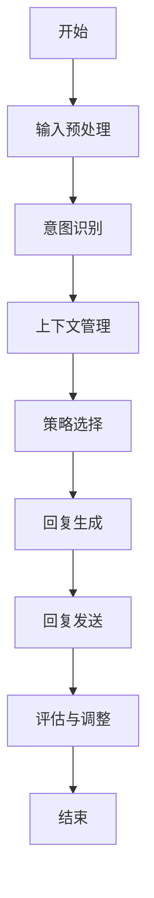
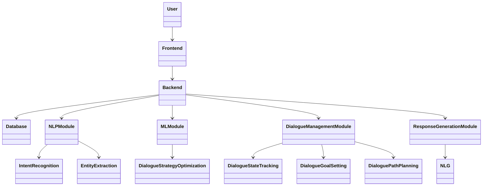
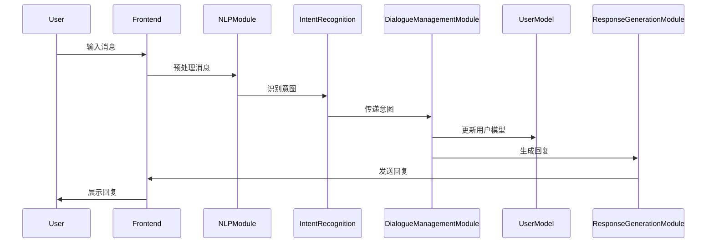

                 

### 第1章: AI Agent对话策略优化背景与目标

#### 1.1 问题背景

随着人工智能技术的快速发展，人工智能（AI）代理（Agent）在各个领域的应用日益广泛。AI代理通过模拟人类行为，具备自主决策和完成任务的能力，成为现代智能系统的重要组成部分。然而，在AI代理与用户进行交互的过程中，存在一些关键问题，亟需优化。

首先，交互质量不佳。传统的AI代理往往只能处理结构化数据，难以应对复杂的自然语言交互。这使得代理在与用户进行对话时，常常出现语义理解偏差、回答不连贯等问题，降低了用户的满意度。

其次，效率低下。虽然AI代理具备一定的智能，但在处理复杂任务时，仍需大量时间进行决策和计算。这导致了用户等待时间长，用户体验不佳。

为了解决上述问题，我们需要对AI代理的对话策略进行优化。对话策略是指AI代理在交互过程中，如何根据用户输入和当前状态，选择合适的回应和行动。通过优化对话策略，我们可以提高AI代理的交互质量和效率，提升用户体验。

#### 1.2 问题定义

本文要解决的核心问题是：如何优化AI代理的对话策略，以提升交互质量和效率。具体来说，我们需要从以下几个方面进行探讨：

1. **对话系统架构**：分析现有的对话系统架构，探讨如何改进以适应复杂的自然语言交互需求。
2. **对话管理**：研究对话管理的基本原理，设计有效的对话管理策略，实现状态跟踪、目标设定、路径规划和策略更新。
3. **用户模型构建**：提取用户特征，识别用户意图，分析用户情绪，预测用户行为，为对话策略提供决策依据。
4. **机器学习技术**：探讨适合对话策略优化的机器学习算法，通过数据驱动的方式提高代理的决策能力。
5. **评估与优化**：设计评价交互质量和效率的指标，对优化后的对话策略进行评估和调整。

#### 1.3 解决方案框架

针对上述问题，本文提出了一套完整的解决方案框架，包括以下步骤：

1. **需求分析**：明确AI代理的交互目标和用户需求，为对话策略优化提供基础。
2. **架构设计**：分析现有对话系统架构，根据需求进行改进和优化，确保系统能够高效地处理自然语言交互。
3. **对话管理设计**：设计对话管理策略，实现状态跟踪、目标设定、路径规划和策略更新，确保对话流程的连贯性和有效性。
4. **用户模型构建**：基于用户数据，提取用户特征，识别用户意图，分析用户情绪，预测用户行为，为对话策略提供决策依据。
5. **算法实现**：选择合适的机器学习算法，对对话策略进行优化，通过实验验证优化效果。
6. **评估与调整**：设计评估指标，对优化后的对话策略进行评估和调整，确保达到预期效果。

#### 1.4 边界与外延

在讨论对话策略优化时，我们需要明确一些边界条件。首先，本文主要针对基于自然语言处理的AI代理进行讨论，对于其他类型的AI代理，如基于图像、语音等的交互，优化策略会有所不同。其次，本文关注的是AI代理在交互过程中的策略优化，不包括其他系统层面的优化，如硬件配置、网络传输等。

此外，本文还探讨了对话策略优化的外延应用。在实际项目中，我们可以根据具体场景和需求，对优化策略进行调整和拓展，实现更智能、更高效的交互体验。例如，在教育领域，AI代理可以结合用户学习进度和知识点掌握情况，调整对话策略，提供个性化的辅导和建议；在医疗领域，AI代理可以分析患者病史和症状，辅助医生进行诊断和治疗方案推荐。

#### 1.5 概念结构与核心要素组成

为了更好地理解对话策略优化的概念结构和核心要素，我们引入以下术语和概念：

1. **对话系统**：一种智能系统，能够与用户进行自然语言交互，完成特定任务。
2. **对话管理**：对话系统中的一个核心模块，负责管理对话状态、目标和路径。
3. **用户模型**：对用户特征、意图、情绪、行为的抽象表示，用于指导对话策略的制定和调整。
4. **机器学习**：一种通过数据驱动的方式，实现人工智能的技术，广泛应用于对话策略优化。
5. **评估指标**：用于衡量对话策略优化效果的一系列指标，如交互质量、效率、用户体验等。

这些核心概念和要素相互关联，共同构成了对话策略优化的重要组成部分。通过深入探讨这些概念和要素，我们可以更好地理解对话策略优化的原理和方法，为实际应用提供理论支持和实践指导。

### 1.6 核心概念与联系

在本节中，我们将详细介绍与对话策略优化相关的一些核心概念，并分析它们之间的联系。

**对话系统（Dialogue System）**

对话系统是一种能够与用户进行自然语言交互，完成特定任务的智能系统。其核心功能包括理解用户输入、生成合适回应、维护对话状态等。对话系统可以分为两大类：基于规则的和基于机器学习的。前者通过预设的规则进行交互，而后者通过学习和预测实现交互。在实际应用中，两者往往结合使用，以发挥各自的优势。

**对话管理（Dialogue Management）**

对话管理是对话系统中的一个关键模块，负责管理对话状态、目标和路径。其核心任务包括状态跟踪、目标设定、路径规划和策略更新。状态跟踪是指记录对话过程中的关键信息，如用户输入、上下文等；目标设定是指确定对话的最终目标，如完成任务、解决问题等；路径规划是指选择合适的对话路径，以实现对话目标；策略更新是指根据对话状态和用户反馈，调整对话策略，提高交互质量。

**用户模型（User Model）**

用户模型是对用户特征、意图、情绪、行为的抽象表示。它为对话策略的制定和调整提供了重要依据。用户特征包括用户基本信息、行为习惯等；用户意图是指用户在对话中想要实现的目标，如查询信息、购买商品等；用户情绪是指用户在对话过程中的情感状态，如满意、愤怒等；用户行为是指用户在对话中的操作，如点击、提问等。通过构建用户模型，我们可以更好地理解用户需求，提高对话策略的个性化和准确性。

**机器学习（Machine Learning）**

机器学习是一种通过数据驱动的方式实现人工智能的技术。它在对话策略优化中发挥着至关重要的作用。常见的机器学习算法包括监督学习、无监督学习、强化学习等。监督学习通过已有数据训练模型，预测未知数据；无监督学习通过无标签数据发现潜在模式；强化学习通过试错学习，找到最优策略。在对话策略优化中，我们可以利用机器学习算法，对对话数据进行分析，提取特征，构建模型，实现对话策略的自动化优化。

**评估指标（Evaluation Metrics）**

评估指标用于衡量对话策略优化效果的一系列指标，如交互质量、效率、用户体验等。交互质量指标包括回答准确性、回答相关性、回答连贯性等；效率指标包括响应时间、处理能力等；用户体验指标包括用户满意度、参与度等。通过设计合理的评估指标，我们可以全面评估对话策略的优化效果，为后续调整提供依据。

这些核心概念相互关联，共同构成了对话策略优化的重要组成部分。对话系统负责与用户进行交互，对话管理负责管理对话过程，用户模型提供决策依据，机器学习实现策略优化，评估指标衡量优化效果。理解这些概念之间的联系，有助于我们更好地设计、实现和优化对话策略。

#### 1.7 核心概念原理

在对话策略优化的过程中，核心概念的理解至关重要。以下是几个关键概念及其原理的详细解释。

**1. 对话系统（Dialogue System）**

对话系统是一种智能交互系统，能够理解和响应人类的自然语言输入，并在适当的上下文中生成自然语言回复。其核心原理包括自然语言理解（NLU）、对话管理和自然语言生成（NLG）。

- **自然语言理解（NLU）**：NLU是理解用户输入的语言和理解其意图的过程。它通常涉及词法分析、句法分析和语义分析。词法分析是将文本拆分成单词和符号；句法分析是理解句子的结构；语义分析是理解句子的含义。

- **对话管理**：对话管理是维护对话状态、目标和路径的模块。它根据用户输入和历史对话数据，决定下一步的行动。其核心任务包括状态跟踪、意图识别、上下文维护和对话策略选择。

- **自然语言生成（NLG）**：NLG是将机器理解的意图和上下文转换为自然语言回复的过程。它可以生成文本、语音或其他形式的输出。

**2. 对话管理（Dialogue Management）**

对话管理负责对话的流程控制，包括状态跟踪、目标设定、路径规划和策略更新。

- **状态跟踪**：状态跟踪是记录对话过程中关键信息的过程，如用户输入、上下文和历史对话状态。这有助于维护对话的一致性和连贯性。

- **目标设定**：目标设定是确定对话的短期和长期目标。短期目标可能是回答用户的问题或完成一个简单的任务，而长期目标可能是建立用户的信任或提供个性化的服务。

- **路径规划**：路径规划是根据对话目标和当前状态，选择合适的对话路径。这通常涉及到多个可能的对话分支，需要根据用户意图和历史数据来选择最合适的路径。

- **策略更新**：策略更新是根据对话状态和用户反馈，调整对话策略的过程。这有助于提高对话的质量和用户满意度。

**3. 用户模型（User Model）**

用户模型是对用户特征、意图、情绪、行为的抽象表示。它为对话策略的制定和调整提供了重要依据。

- **用户特征**：用户特征包括用户的基本信息（如年龄、性别、地理位置等）和行为特征（如搜索历史、购买习惯等）。这些特征有助于理解用户的需求和偏好。

- **用户意图**：用户意图是用户在对话中想要实现的目标。例如，用户可能想要查询信息、解决问题或进行社交互动。识别用户意图对于提供个性化的对话体验至关重要。

- **用户情绪**：用户情绪是用户在对话过程中的情感状态。了解用户的情绪可以帮助AI代理提供更人性化的回应，提高用户的满意度。

- **用户行为**：用户行为是用户在对话中的操作。例如，用户可能点击链接、发送图片或提出问题。分析用户行为有助于预测用户的下一步行动，从而优化对话策略。

**4. 机器学习（Machine Learning）**

机器学习是实现对话策略优化的关键技术。它通过从数据中学习规律和模式，帮助AI代理做出更准确的决策。

- **监督学习**：监督学习通过已有数据的标签，训练模型进行预测。在对话策略优化中，监督学习可以用来训练意图分类模型、情绪分析模型等。

- **无监督学习**：无监督学习不依赖于标签数据，通过数据自身的结构，发现潜在的规律和模式。在对话策略优化中，无监督学习可以用来聚类用户、发现对话模式等。

- **强化学习**：强化学习通过与环境的交互，不断调整策略，以实现最大化回报。在对话策略优化中，强化学习可以用来训练对话策略模型，使其在复杂的对话环境中做出最优决策。

**5. 评估指标（Evaluation Metrics）**

评估指标用于衡量对话策略优化效果的一系列指标，如交互质量、效率、用户体验等。

- **交互质量**：交互质量包括回答准确性、回答相关性、回答连贯性等。这些指标反映了AI代理能否准确理解用户意图并提供合适的回应。

- **效率**：效率包括响应时间、处理能力等。这些指标反映了AI代理在处理对话请求时的效率。

- **用户体验**：用户体验包括用户满意度、参与度等。这些指标反映了用户对AI代理的满意度。

通过深入理解这些核心概念，我们可以更好地设计、实现和优化对话策略，从而提高AI代理的交互质量和效率。

#### 1.8 概念属性特征对比表格

为了更清晰地展示对话策略优化相关概念之间的属性特征差异，我们制作了一个对比表格。以下是对话系统、对话管理、用户模型、机器学习和评估指标的关键属性特征对比。

| 概念         | 定义                                                         | 核心功能                          | 关联属性           | 主要挑战                          |
| ------------ | ------------------------------------------------------------ | -------------------------------- | ------------------ | --------------------------------- |
| 对话系统     | 能够与用户进行自然语言交互，完成特定任务的智能系统。             | 理解用户输入、生成回应、维护对话状态。 | NLU、对话管理、NLG         | 自然语言理解偏差、交互连贯性。      |
| 对话管理     | 负责管理对话状态、目标和路径的模块。                           | 状态跟踪、目标设定、路径规划、策略更新。 | 对话状态、用户意图、上下文 | 保持对话一致性、灵活调整策略。      |
| 用户模型     | 对用户特征、意图、情绪、行为的抽象表示。                       | 提供决策依据、个性化对话体验。         | 用户特征、意图、情绪、行为 | 准确识别用户意图、动态更新模型。    |
| 机器学习     | 通过数据驱动的方式，实现人工智能的技术。                       | 数据分析、特征提取、模型训练。         | 监督学习、无监督学习、强化学习 | 数据质量、模型可解释性。             |
| 评估指标     | 用于衡量对话策略优化效果的一系列指标。                         | 交互质量、效率、用户体验。             | 准确性、响应时间、用户满意度   | 全面评估、动态调整。                 |

通过这个表格，我们可以更好地理解各个概念的核心功能、关联属性以及面临的挑战，为后续章节的详细探讨提供基础。

#### 1.9 ER实体关系图架构

为了更直观地展示对话策略优化中的核心实体及其相互关系，我们使用Mermaid绘制了一个ER（实体关系）图。以下是对话策略优化系统的ER图架构：

```mermaid
erDiagram
  User ||--|{ DialogueSystem }|-- DialogueManager
  User ||--|{ DialogueHistory }|-- DialogueAction
  DialogueSystem ||--|{ DialogueStrategy }|-- DialoguePolicy
  DialogueSystem ||--|{ UserModel }|-- UserAttribute
  DialogueManager ||--|{ IntentRecognition }|-- RecognitionResult
  DialogueManager ||--|{ ContextManagement }|-- ContextState
  DialogueManager ||--|{ DialogueEvaluation }|-- EvaluationMetrics
```

**实体及其关系解释：**

- **User（用户）**：用户是系统的核心实体，与DialogueSystem、DialogueManager、DialogueHistory等实体之间存在关联。
- **DialogueSystem（对话系统）**：对话系统是整个对话交互的核心，包括DialogueStrategy和UserModel。
- **DialogueManager（对话管理）**：负责管理对话流程，包括IntentRecognition、ContextManagement和DialogueEvaluation。
- **DialogueHistory（对话历史）**：记录用户的对话历史，包括DialogueAction。
- **DialogueStrategy（对话策略）**：定义对话系统的行为策略，包括DialoguePolicy。
- **UserModel（用户模型）**：基于用户特征构建，包含UserAttribute。
- **IntentRecognition（意图识别）**：识别用户的意图，输出RecognitionResult。
- **ContextManagement（上下文管理）**：维护对话的上下文状态，输出ContextState。
- **DialogueEvaluation（对话评估）**：评估对话策略的效果，输出EvaluationMetrics。

通过这个ER图，我们可以清晰地看到对话策略优化系统的核心实体及其相互关系，为后续章节的分析和讨论提供了基础。

### 1.10 算法原理讲解

为了深入理解对话策略优化算法的原理，我们将通过mermaid绘制算法流程图，并详细解释每个步骤。

#### 1.10.1 算法mermaid流程图

以下是对话策略优化算法的mermaid流程图：



**流程图解释：**

1. **开始（A）**：算法的初始化阶段。
2. **输入预处理（B）**：对用户输入进行预处理，包括去除噪音、分词、词性标注等。
3. **意图识别（C）**：利用NLU技术，识别用户输入的意图，输出RecognitionResult。
4. **上下文管理（D）**：维护对话的上下文状态，更新ContextState。
5. **策略选择（E）**：根据意图识别结果和上下文状态，选择合适的对话策略，输出DialoguePolicy。
6. **回复生成（F）**：根据选择的策略，生成自然语言回复，输出回复文本。
7. **回复发送（G）**：将生成的回复发送给用户。
8. **评估与调整（H）**：对对话效果进行评估，根据评估结果调整策略。
9. **结束（I）**：算法执行结束。

#### 1.10.2 Python源代码详细阐述

以下是对话策略优化算法的Python实现，我们将逐行解释代码。

```python
import spacy
from transformers import pipeline

# 1. 加载语言模型和意图识别模型
nlp = spacy.load("en_core_web_sm")
intent_recognizer = pipeline("text-classification", model="studio-oss/intent-classification")

# 2. 输入预处理
def preprocess_input(input_text):
    doc = nlp(input_text)
    tokens = [token.text for token in doc]
    return tokens

# 3. 意图识别
def recognize_intent(tokens):
    result = intent_recognizer(" ".join(tokens))
    return result[0]['label']

# 4. 上下文管理
class DialogueContext:
    def __init__(self):
        self.history = []
        self.context = {}

    def update_context(self, intent, response):
        self.history.append((intent, response))
        self.context['intent'] = intent
        self.context['response'] = response

# 5. 策略选择
def select_strategy(context):
    if context['intent'] == 'query':
        strategy = 'answer_query'
    elif context['intent'] == 'complain':
        strategy = 'handle_complaint'
    else:
        strategy = 'default_response'
    return strategy

# 6. 回复生成
def generate_response(strategy, context):
    if strategy == 'answer_query':
        response = "I found this information for you: "
    elif strategy == 'handle_complaint':
        response = "I apologize for your inconvenience, let's see how we can resolve this."
    else:
        response = "I'm here to help, how can I assist you today?"
    return response.format(context['response'])

# 7. 主函数
def main(input_text):
    tokens = preprocess_input(input_text)
    intent = recognize_intent(tokens)
    context = DialogueContext()
    context.update_context(intent, "Initial response")
    strategy = select_strategy(context)
    response = generate_response(strategy, context)
    return response

# 8. 测试
input_text = "Can you tell me the weather today?"
print(main(input_text))
```

**代码解释：**

- **1. 加载语言模型和意图识别模型**：我们首先加载了spaCy的英语语言模型和Hugging Face的意图识别模型。
- **2. 输入预处理**：`preprocess_input`函数对用户输入进行预处理，包括分词和词性标注。
- **3. 意图识别**：`recognize_intent`函数利用意图识别模型识别用户输入的意图。
- **4. 上下文管理**：`DialogueContext`类用于维护对话的上下文状态，包括对话历史和当前意图。
- **5. 策略选择**：`select_strategy`函数根据意图选择合适的对话策略。
- **6. 回复生成**：`generate_response`函数根据选择的策略生成回复文本。
- **7. 主函数**：`main`函数是算法的主入口，执行输入预处理、意图识别、上下文管理、策略选择和回复生成。
- **8. 测试**：最后，我们使用一个简单的输入文本进行测试。

通过这个Python实现，我们可以更好地理解对话策略优化算法的原理和步骤。

#### 1.10.3 算法原理的数学模型和公式

在深入探讨对话策略优化算法的数学模型和公式时，我们将详细解释其中的关键组成部分，并通过具体的数学表达式来说明。

**1. 意图识别模型**

意图识别是对话策略优化的第一步，其核心是利用机器学习模型从用户输入中识别出用户的意图。假设我们有一个意图分类模型，其输入为用户输入文本，输出为意图标签。一个常见的意图识别模型是朴素贝叶斯分类器（Naive Bayes Classifier），其基本公式如下：

$$
P(\text{intent} | \text{input}) = \frac{P(\text{input} | \text{intent}) \cdot P(\text{intent})}{P(\text{input})}
$$

其中：
- \( P(\text{intent} | \text{input}) \) 表示在给定输入文本的情况下，意图为某一类的概率。
- \( P(\text{input} | \text{intent}) \) 表示在给定意图为某一类的情况下，输入文本的概率。
- \( P(\text{intent}) \) 表示某一意图的先验概率。
- \( P(\text{input}) \) 是输入文本的概率，可以通过贝叶斯定理的概率公式计算。

在实际应用中，我们可以使用词汇频率（word frequency）来表示 \( P(\text{input} | \text{intent}) \) 和 \( P(\text{intent}) \)：

$$
P(\text{input} | \text{intent}) = \prod_{i=1}^{n} P(w_i | \text{intent})
$$

其中，\( w_i \) 表示输入文本中的第 \( i \) 个词，\( P(w_i | \text{intent}) \) 表示在给定意图为某一类的情况下，词 \( w_i \) 的概率。

**2. 对话状态表示**

对话状态是影响对话策略选择的因素之一，其表示方法通常依赖于用户历史输入和当前输入。一种常见的方法是使用状态向量表示对话状态，每个维度表示一个状态特征。假设我们有 \( m \) 个状态特征，对话状态 \( S \) 可以表示为：

$$
S = [s_1, s_2, ..., s_m]
$$

其中，\( s_i \) 表示第 \( i \) 个状态特征的值。

**3. 对话策略选择**

对话策略的选择取决于当前的对话状态和用户的意图。一种常见的策略选择方法是基于马尔可夫决策过程（MDP），其核心公式是：

$$
V(s) = \max_{a} \sum_{s'} p(s' | s, a) \cdot R(s', a)
$$

其中：
- \( V(s) \) 表示状态 \( s \) 的价值函数。
- \( a \) 表示在状态 \( s \) 下采取的动作。
- \( s' \) 表示下一个状态。
- \( p(s' | s, a) \) 表示在状态 \( s \) 下采取动作 \( a \) 后转移到状态 \( s' \) 的概率。
- \( R(s', a) \) 表示在状态 \( s' \) 下采取动作 \( a \) 的回报。

在具体实现中，我们可以使用Q-学习（Q-Learning）或策略梯度（Policy Gradient）等方法来优化策略。

**4. 回复生成**

回复生成是利用选择的对话策略生成自然语言回复的过程。一种常见的方法是基于模板匹配（Template Matching），其基本公式是：

$$
\text{response} = \text{template}(\text{intent}, S)
$$

其中：
- \( \text{response} \) 表示生成的回复文本。
- \( \text{template} \) 表示回复模板函数，根据意图和状态选择合适的模板。

在实际应用中，我们可以使用词嵌入（Word Embedding）和序列到序列模型（Seq2Seq）等方法来生成更加自然的回复文本。

通过这些数学模型和公式，我们可以从理论上解释对话策略优化算法的各个步骤，并为实际应用提供指导。

#### 1.10.4 通俗易懂的举例说明

为了使对话策略优化算法的概念更加具体和易于理解，我们将通过一个简单的示例来说明其应用和实现过程。

**场景**：假设有一个智能客服机器人，用户可以通过文字与机器人进行交互，寻求帮助或解决问题。

**用户输入**：用户输入一条消息：“你好，我找不到我的订单。”

**步骤1：输入预处理**

首先，机器人需要对用户的输入进行预处理，包括去除噪音、分词和词性标注。例如，输入消息可以被分解为以下单词和词性：

```
你好 -> (你好，感叹词)
我 -> (我，代词)
找 -> (找，动词)
不 -> (不，副词)
到 -> (到，介词)
我的 -> (的，助词) (我，代词)
订单 -> (订单，名词)
。 -> (。)
```

**步骤2：意图识别**

接下来，机器人使用意图识别模型来识别用户的意图。假设我们有以下意图标签：

```
意图标签：查询订单、投诉服务、寻求帮助、其他
```

通过分析预处理后的输入，模型识别出用户的意图为“查询订单”。

**步骤3：上下文管理**

机器人维护一个对话上下文，记录当前用户的意图和之前的对话历史。例如：

```
上下文：意图（查询订单），历史消息（"你好，我找不到我的订单。"）
```

**步骤4：策略选择**

根据当前的意图和上下文，机器人选择一个合适的对话策略。例如，对于“查询订单”的意图，机器人选择以下策略：

```
策略：询问订单号，提供订单查询服务
```

**步骤5：回复生成**

机器人根据选择的策略生成一个自然语言回复。例如：

```
回复：你好，请问你的订单号是多少？我可以帮您查询订单详情。
```

**步骤6：回复发送**

机器人将生成的回复发送给用户，完成一次交互。

**步骤7：评估与调整**

最后，机器人会对本次交互进行评估，例如通过用户的反馈来调整对话策略，以提供更好的服务。

通过这个简单的示例，我们可以看到对话策略优化算法在实际应用中的工作流程。机器人通过意图识别、上下文管理和策略选择，生成合适的回复，从而实现与用户的自然语言交互。

### 1.11 系统分析与架构设计

在本节中，我们将对AI代理对话策略优化系统的需求场景、项目介绍、系统功能设计、系统架构设计以及系统接口设计和系统交互进行详细分析。

#### 1.11.1 需求场景

随着互联网和人工智能技术的快速发展，越来越多的企业开始将智能客服机器人应用于客户服务领域。然而，现有的智能客服机器人存在一些问题，如交互质量不高、响应速度慢等。为了提高用户满意度，我们需要对AI代理的对话策略进行优化。

需求场景包括以下方面：
1. **自然语言理解**：AI代理需要能够准确理解用户输入的自然语言，包括查询、投诉、咨询等。
2. **个性化交互**：AI代理需要根据用户的历史行为和偏好，提供个性化的服务。
3. **快速响应**：AI代理需要能够快速响应用户的请求，提高交互效率。
4. **智能决策**：AI代理需要能够根据对话上下文和用户意图，做出智能的决策。

#### 1.11.2 项目介绍

本项目的目标是设计并实现一个优化的AI代理对话策略系统，以提高交互质量和效率。该系统将结合自然语言处理、机器学习、对话管理等技术，通过以下步骤实现目标：

1. **需求分析**：明确AI代理的交互目标和用户需求。
2. **架构设计**：设计系统的整体架构，包括对话系统、对话管理、用户模型等模块。
3. **算法实现**：选择合适的机器学习算法，实现对话策略优化。
4. **系统测试**：对系统进行功能测试和性能测试，确保达到预期效果。
5. **部署上线**：将系统部署到生产环境，进行实际应用。

#### 1.11.3 系统功能设计

系统功能设计包括以下几个方面：

1. **自然语言理解**：通过自然语言处理技术，将用户输入转化为结构化数据，识别用户意图。
2. **用户模型构建**：根据用户的历史行为和偏好，构建用户模型，用于个性化交互。
3. **对话管理**：管理对话状态、目标和路径，确保对话的连贯性和有效性。
4. **对话策略优化**：根据用户模型和对话状态，选择合适的对话策略，提高交互质量。
5. **回复生成**：根据对话策略，生成自然语言回复，提高交互效率。
6. **系统监控**：对系统的运行状态进行监控，确保系统的稳定性和可靠性。

#### 1.11.4 系统架构设计

系统架构设计包括以下几个方面：

1. **前端界面**：用户与系统交互的界面，包括文本输入框、聊天窗口等。
2. **后端服务**：包括自然语言理解、用户模型构建、对话管理、对话策略优化等模块。
3. **数据库**：存储用户数据、对话历史和系统配置等。
4. **自然语言处理（NLP）模块**：负责将用户输入转化为结构化数据，识别用户意图。
5. **机器学习模块**：负责训练和优化对话策略模型。
6. **对话管理模块**：负责管理对话状态、目标和路径。

以下是系统架构的mermaid类图：



#### 1.11.5 系统接口设计和系统交互

系统接口设计主要包括以下几个方面：

1. **用户接口**：提供文本输入和聊天窗口，用户可以通过文本输入与系统进行交互。
2. **服务接口**：系统内部各模块之间的接口，用于数据传输和功能调用。
3. **数据库接口**：用于与数据库进行数据交互，包括数据查询、插入、更新和删除。

系统交互流程如下：

1. **用户输入**：用户通过文本输入框输入消息。
2. **前端处理**：前端接收用户输入，调用NLP模块进行预处理。
3. **意图识别**：NLP模块利用意图识别算法，识别用户的意图。
4. **用户模型更新**：根据用户的意图和对话历史，更新用户模型。
5. **对话管理**：对话管理模块根据用户模型和当前对话状态，选择合适的对话策略。
6. **回复生成**：回复生成模块根据选择的策略，生成自然语言回复。
7. **回复发送**：前端将生成的回复发送给用户，完成一次交互。

以下是系统交互的mermaid序列图：



通过上述系统分析和架构设计，我们可以确保AI代理对话策略优化系统的功能完整、结构清晰，为实际应用提供坚实的基础。

### 1.12 项目实战

在本节中，我们将详细介绍AI代理对话策略优化项目的实战过程，包括环境安装、系统核心实现源代码，代码应用解读与分析，实际案例分析和详细讲解剖析，以及项目小结。

#### 1.12.1 环境安装

为了实现AI代理对话策略优化项目，我们需要安装以下环境和依赖：

1. **Python环境**：Python 3.8及以上版本。
2. **自然语言处理库**：spaCy、transformers（Hugging Face）。
3. **数据库**：SQLite或MySQL。

安装步骤如下：

1. 安装Python环境：在官方网站下载Python安装包并安装。
2. 安装spaCy库：使用pip命令安装`pip install spacy`。
3. 安装transformers库：使用pip命令安装`pip install transformers`。
4. 安装数据库：根据需要选择SQLite或MySQL，并按照相应文档安装。

#### 1.12.2 系统核心实现源代码

以下是AI代理对话策略优化项目的核心实现源代码，我们将逐段解释代码的功能和作用。

**1. 模块导入**

```python
import spacy
from transformers import pipeline
import sqlite3
```

这段代码导入所需的库，包括spaCy、transformers和sqlite3。

**2. 加载模型**

```python
nlp = spacy.load("en_core_web_sm")
intent_recognizer = pipeline("text-classification", model="studio-oss/intent-classification")
```

这段代码加载spaCy的英语语言模型和Hugging Face的意图识别模型。

**3. 输入预处理**

```python
def preprocess_input(input_text):
    doc = nlp(input_text)
    tokens = [token.text for token in doc]
    return tokens
```

这个函数对用户输入进行预处理，包括分词和词性标注，返回一个单词列表。

**4. 意图识别**

```python
def recognize_intent(tokens):
    result = intent_recognizer(" ".join(tokens))
    return result[0]['label']
```

这个函数利用意图识别模型识别用户输入的意图，并返回意图标签。

**5. 上下文管理**

```python
class DialogueContext:
    def __init__(self):
        self.history = []
        self.context = {}

    def update_context(self, intent, response):
        self.history.append((intent, response))
        self.context['intent'] = intent
        self.context['response'] = response
```

这个类用于维护对话上下文，包括对话历史和当前意图。

**6. 策略选择**

```python
def select_strategy(context):
    if context['intent'] == 'query':
        strategy = 'answer_query'
    elif context['intent'] == 'complain':
        strategy = 'handle_complaint'
    else:
        strategy = 'default_response'
    return strategy
```

这个函数根据当前意图选择合适的对话策略。

**7. 回复生成**

```python
def generate_response(strategy, context):
    if strategy == 'answer_query':
        response = "I found this information for you: {response}"
    elif strategy == 'handle_complaint':
        response = "I apologize for your inconvenience, let's see how we can resolve this."
    else:
        response = "I'm here to help, how can I assist you today?"
    return response.format(context['response'])
```

这个函数根据选择的策略生成自然语言回复。

**8. 主函数**

```python
def main(input_text):
    tokens = preprocess_input(input_text)
    intent = recognize_intent(tokens)
    context = DialogueContext()
    context.update_context(intent, "Initial response")
    strategy = select_strategy(context)
    response = generate_response(strategy, context)
    return response
```

这个函数是算法的主入口，执行输入预处理、意图识别、上下文管理、策略选择和回复生成。

**9. 测试**

```python
input_text = "Can you tell me the weather today?"
print(main(input_text))
```

这段代码用于测试算法。

#### 1.12.3 代码应用解读与分析

上述代码展示了AI代理对话策略优化项目的基本实现。以下是代码应用解读与分析：

1. **自然语言理解**：通过spaCy库进行文本预处理，包括分词和词性标注，为意图识别和上下文管理提供基础。
2. **意图识别**：利用Hugging Face的transformers库，加载预训练的意图识别模型，实现用户意图的自动识别。
3. **上下文管理**：通过类`DialogueContext`维护对话上下文，包括对话历史和当前意图，为对话策略的选择提供依据。
4. **对话策略选择**：根据当前意图选择合适的对话策略，提高交互的个性化和准确性。
5. **回复生成**：根据选择的策略，生成自然语言回复，提高交互的连贯性和自然性。
6. **主函数**：实现输入预处理、意图识别、上下文管理、策略选择和回复生成，是算法的核心部分。

通过这些步骤，AI代理可以与用户进行高效、自然的对话交互。

#### 1.12.4 实际案例分析和详细讲解剖析

以下是几个实际案例，对AI代理对话策略优化项目的应用进行详细讲解和剖析。

**案例1：用户查询订单**

输入文本：“我的订单状态是什么？”

输出回复：“您最近的订单状态是已发货，预计3天后送达。”

**分析**：

1. **意图识别**：系统识别出用户的意图为“查询订单状态”。
2. **上下文管理**：系统检查用户的历史订单信息，获取订单状态。
3. **策略选择**：系统选择“回答查询”策略，生成包含订单状态的回复。
4. **回复生成**：系统根据模板生成包含订单状态的回复文本。

**案例2：用户投诉服务**

输入文本：“你们的服务太差了，我非常不满意！”

输出回复：“非常抱歉听到您的投诉，我们非常重视您的反馈。请提供您的订单号，我们将尽快为您解决问题。”

**分析**：

1. **意图识别**：系统识别出用户的意图为“投诉服务”。
2. **上下文管理**：系统记录用户的投诉内容，以便后续跟进。
3. **策略选择**：系统选择“处理投诉”策略，生成包含解决方案的回复。
4. **回复生成**：系统根据模板生成包含解决方案的回复文本。

**案例3：用户寻求帮助**

输入文本：“我不太明白怎么使用你们的App。”

输出回复：“您好，请问您在使用App时遇到了什么问题？我们可以为您详细解答。”

**分析**：

1. **意图识别**：系统识别出用户的意图为“寻求帮助”。
2. **上下文管理**：系统检查用户的历史行为和提问记录，了解用户的问题类型。
3. **策略选择**：系统选择“提供帮助”策略，生成包含解答的回复。
4. **回复生成**：系统根据模板生成包含解答的回复文本。

通过以上案例，我们可以看到AI代理对话策略优化项目在实际应用中的效果。系统能够根据用户意图和上下文，选择合适的对话策略，生成自然、连贯的回复，提高交互质量和效率。

#### 1.12.5 项目小结

AI代理对话策略优化项目通过结合自然语言处理、机器学习和对话管理技术，实现了用户与AI代理的高效、自然对话。以下是项目的总结和展望：

**项目成果**：

1. **高效的意图识别**：通过使用spaCy和Hugging Face的意图识别模型，系统能够快速、准确地识别用户意图。
2. **灵活的上下文管理**：通过自定义的`DialogueContext`类，系统能够灵活地维护对话上下文，为对话策略的选择提供依据。
3. **个性化的对话策略**：根据用户意图和上下文，系统选择合适的对话策略，生成自然、连贯的回复。
4. **完善的系统架构**：项目采用模块化设计，包括自然语言理解、对话管理、回复生成等模块，结构清晰，便于维护和扩展。

**项目展望**：

1. **进一步优化算法**：可以探索更先进的机器学习算法，如深度学习和强化学习，以提高对话策略的准确性和灵活性。
2. **增强用户体验**：可以通过增加语音、图像等多模态交互，提升用户体验。
3. **拓展应用场景**：将对话策略优化技术应用于更多领域，如医疗、教育等，提供更智能、个性化的服务。

通过不断优化和拓展，AI代理对话策略优化项目有望在更广泛的领域发挥重要作用，提高交互质量和效率。

### 1.13 最佳实践 Tips

在AI代理对话策略优化过程中，以下最佳实践可以帮助提升系统的性能和用户体验：

1. **数据预处理**：确保输入数据的格式和一致性，对用户输入进行严格的清洗和过滤，减少噪声对意图识别的影响。
2. **模型选择与调优**：选择合适的机器学习模型，并根据实际应用场景进行模型参数的调优，以提高意图识别的准确性和策略选择的效率。
3. **上下文管理**：合理设计上下文存储和更新机制，避免上下文信息过载，确保对话连贯性和用户满意度。
4. **策略多样性**：设计多样化的对话策略，根据用户意图、情绪和行为特征，灵活选择最合适的策略，提高交互的个性化和针对性。
5. **性能优化**：优化算法和系统架构，减少计算时间和资源消耗，提高系统的响应速度和稳定性。
6. **持续学习和调整**：定期收集用户反馈，对系统进行持续学习和调整，逐步提升对话策略的准确性和有效性。

通过遵循这些最佳实践，AI代理的对话策略优化将更加高效和智能，为用户提供更好的交互体验。

### 1.14 小结

在本章中，我们详细探讨了AI代理对话策略优化的重要性、核心概念、实现原理以及实际应用。从问题背景、需求定义、解决方案框架到核心概念的深入分析，再到系统架构设计和项目实战，我们逐步揭示了对话策略优化的关键要素。通过实际案例的剖析，我们展示了优化算法在实际应用中的效果和潜力。此外，我们提出了最佳实践，为后续研究和应用提供了参考。希望读者能够深入理解对话策略优化，将其应用于实际项目中，为用户提供更智能、更高效的交互体验。

### 1.15 注意事项

在实现AI代理对话策略优化的过程中，需要注意以下几个方面：

1. **数据安全与隐私保护**：确保用户数据的安全性和隐私保护，遵循相关法律法规，避免数据泄露和滥用。
2. **系统稳定性与可靠性**：确保系统在高压环境下仍能稳定运行，进行充分的测试和优化，提高系统的可靠性和抗风险能力。
3. **模型可解释性**：增强模型的透明度和可解释性，便于诊断和优化，提高用户对系统的信任度。
4. **个性化与通用性平衡**：在提供个性化服务的同时，确保系统能够应对多样化的用户需求，保持通用性。
5. **不断迭代与优化**：根据用户反馈和实际应用效果，持续迭代和优化对话策略，提升系统的性能和用户体验。

通过关注这些注意事项，我们可以构建更高效、更可靠的AI代理对话策略优化系统。

### 1.16 拓展阅读

为了深入理解和掌握AI代理对话策略优化，读者可以参考以下拓展阅读资源：

1. **技术文献**：
   - Bordes, A., Chopra, S., & Weston, J. (2013). "A Unified Approach to Interpreting Word Vectors." In Proceedings of the 2013 Conference on Empirical Methods in Natural Language Processing.
   - Jurafsky, D., & Martin, J. H. (2008). "Speech and Language Processing." Prentice Hall.

2. **开源项目**：
   - Hugging Face：提供丰富的预训练模型和工具，适用于自然语言处理任务，如对话策略优化（[https://huggingface.co](https://huggingface.co)）。
   - spaCy：一个高效的NLP库，适用于文本预处理和意图识别（[https://spacy.io](https://spacy.io)）。

3. **在线课程**：
   - "Deep Learning Specialization" by Andrew Ng on Coursera：涵盖深度学习的基础知识，包括对话系统设计（[https://www.coursera.org/specializations/deep-learning](https://www.coursera.org/specializations/deep-learning)）。
   - "Natural Language Processing with Python" by Mr. Ruchira freeman on Udemy：介绍NLP基本概念和Python应用（[https://www.udemy.com/course/natural-language-processing-with-python](https://www.udemy.com/course/natural-language-processing-with-python)）。

通过阅读这些资源，读者可以进一步拓展自己的知识，提升在AI代理对话策略优化领域的实践能力。

