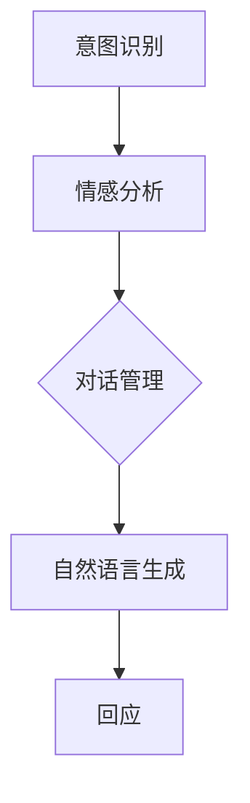

                 

# AI Agent的对话策略在心理咨询中的应用

> 关键词：AI Agent、心理咨询、对话策略、应用、案例分析

> 摘要：本文探讨了AI Agent在心理咨询中的应用，特别是对话策略的设计与实施。通过介绍AI Agent的基础知识、对话策略原理以及具体的应用案例，本文旨在为心理咨询领域提供创新的解决方案和技术支持。

## 引言与背景

### 心理咨询与AI Agent的碰撞

在当今社会，心理咨询作为一种有效的心理健康服务，正越来越受到人们的重视。然而，由于心理咨询服务的需求量巨大，传统的心理咨询模式面临着资源有限、效率低下等问题。与此同时，人工智能技术的发展为解决这些问题提供了新的可能。特别是AI Agent作为人工智能的一种形式，以其高度自动化、个性化的对话能力，逐渐成为心理咨询领域的研究热点。

### AI Agent对话策略的研究现状

近年来，AI Agent在心理咨询中的应用取得了显著进展。研究者们致力于开发出能够模拟人类心理咨询师的对话系统，这些系统通常包含语音识别、自然语言处理、机器学习等技术，以便更好地理解用户的需求并为其提供有效的心理支持。然而，现有的研究主要集中在对对话系统的技术实现上，对于对话策略的具体设计和应用还缺乏深入探讨。

### 本书的研究目的与结构安排

本文旨在研究AI Agent的对话策略在心理咨询中的应用，旨在通过系统的分析和案例分析，提出一种有效的对话策略框架，并探讨其实际应用中的挑战和解决方案。文章结构如下：

1. **引言与背景**：介绍心理咨询与AI Agent的碰撞，以及AI Agent对话策略的研究现状。
2. **AI Agent基础知识**：介绍AI Agent的定义、分类、核心功能与特性。
3. **对话策略原理**：阐述对话系统的基本架构、对话策略的组成要素及常见对话策略。
4. **对话策略在心理咨询中的应用**：探讨心理咨询对话策略的特点、常用策略及实施方法。
5. **AI Agent对话策略案例分析**：分析具体应用案例，展示对话策略在心理咨询中的效果。
6. **实践与展望**：总结实践指南，展望AI Agent对话策略的发展趋势。

## AI Agent基础知识

### AI Agent概述

AI Agent，即人工智能代理，是人工智能领域中的一个重要概念。它是一种能够自主完成特定任务的智能系统，通常具有感知、决策、执行等能力。AI Agent可以应用于各种领域，包括但不限于心理咨询、电子商务、智能家居等。

### AI Agent的分类

AI Agent根据其功能和任务可以分为不同的类型，主要包括：

1. **任务型AI Agent**：专注于完成特定任务，如问答系统、智能家居控制系统等。
2. **社交型AI Agent**：具备与人进行自然对话的能力，如聊天机器人、虚拟客服等。
3. **决策型AI Agent**：能够在复杂环境中做出最优决策，如自动驾驶系统、金融投资顾问等。

### AI Agent的核心功能与特性

AI Agent的核心功能包括感知环境、理解指令、自主决策和执行任务。其特性包括：

1. **自主性**：能够根据环境和目标自主决策和行动。
2. **适应性**：能够根据反馈和环境变化调整行为。
3. **协作性**：能够与其他AI Agent或人类协作完成任务。

### 心理咨询领域的AI Agent应用

在心理咨询领域，AI Agent可以扮演多种角色，如心理评估助手、心理咨询师、情绪监测器等。通过与用户的对话，AI Agent可以收集用户的心理健康数据，提供个性化的建议和干预。

## 对话策略原理

### 对话系统的基本架构

对话系统通常由以下几个模块组成：

1. **语音识别模块**：将用户的话语转换为文本。
2. **自然语言理解模块**：理解用户的意图和需求。
3. **对话管理模块**：决定对话的走向和策略。
4. **自然语言生成模块**：生成自然流畅的回应。

### 对话策略的组成要素

对话策略的组成要素主要包括：

1. **意图识别**：识别用户的意图，如咨询、建议、情感倾诉等。
2. **实体识别**：识别对话中的关键信息，如症状、问题等。
3. **上下文管理**：维护对话的历史信息，以便生成连贯的回应。
4. **情感分析**：分析用户的情感状态，以便提供个性化的支持。

### 常见的对话策略

常见的对话策略包括：

1. **基于规则的策略**：通过预设的规则来生成回应。
2. **基于模板的策略**：使用模板来生成标准化回应。
3. **基于机器学习的策略**：通过机器学习模型来自动生成回应。
4. **混合策略**：结合多种策略来生成回应，以提高对话的质量。

## 对话策略在心理咨询中的应用

### 心理咨询对话策略的特点

心理咨询对话策略具有以下特点：

1. **个性化**：根据用户的具体情况和需求，提供个性化的支持和建议。
2. **连贯性**：在对话中保持话题的一致性和连贯性，以便建立信任关系。
3. **适应性**：根据用户的行为和反馈，动态调整对话策略。

### 常用的心理咨询对话策略

常用的心理咨询对话策略包括：

1. **开放式问题策略**：通过提出开放式问题，鼓励用户表达自己的情感和想法。
2. **积极倾听策略**：通过倾听和回应，让用户感受到被关注和理解。
3. **情感识别与回应策略**：通过分析用户的情感状态，提供针对性的情感支持和建议。
4. **认知重建策略**：通过引导用户重新审视自己的想法和观念，以改变其认知模式。

### 心理咨询对话策略的实施

心理咨询对话策略的实施需要考虑以下几个方面：

1. **用户画像**：了解用户的基本信息、心理健康状况等，以便提供个性化的支持。
2. **对话流程设计**：设计对话的流程和步骤，确保对话的顺利进行。
3. **对话质量评估**：通过评估对话的效果和用户的满意度，不断优化对话策略。

## AI Agent对话策略案例分析

### 案例分析一：抑郁症咨询

#### 案例背景

某用户李先生，30岁，被诊断出患有抑郁症。他通过AI Agent寻求心理咨询帮助。

#### 案例分析

1. **意图识别**：AI Agent识别到用户的意图是寻求抑郁症咨询。
2. **情感分析**：通过情感分析，发现用户情绪低落。
3. **对话管理**：AI Agent使用积极倾听策略，鼓励用户表达情感。
4. **建议提供**：AI Agent根据用户情况，提供个性化的建议，如推荐心理医生、心理课程等。

#### 案例结论

通过AI Agent的对话策略，用户李先生得到了有效的心理支持和建议，对其抑郁症状的缓解产生了积极影响。

### 案例分析二：焦虑症咨询

#### 案例背景

某用户张女士，25岁，因工作压力导致焦虑。她通过AI Agent寻求心理咨询帮助。

#### 案例分析

1. **意图识别**：AI Agent识别到用户的意图是寻求焦虑症咨询。
2. **情感分析**：通过情感分析，发现用户情绪紧张。
3. **对话管理**：AI Agent使用认知重建策略，帮助用户重新审视其对工作的看法。
4. **建议提供**：AI Agent根据用户情况，提供放松技巧、时间管理等建议。

#### 案例结论

通过AI Agent的对话策略，用户张女士学会了新的应对压力的方法，焦虑症状得到了明显改善。

## 实践与展望

### 实践指南

1. **用户画像**：在实施对话策略时，了解用户的基本信息和心理健康状况至关重要。
2. **对话流程设计**：设计合理的对话流程，确保对话的自然流畅。
3. **对话质量评估**：定期评估对话效果，以便不断优化对话策略。

### 未来展望

1. **个性化对话**：随着人工智能技术的进步，AI Agent将能够提供更加个性化的对话服务。
2. **情感计算**：结合情感计算技术，AI Agent将能够更准确地识别和理解用户的情感状态。
3. **跨领域应用**：AI Agent在心理咨询领域的成功经验有望在其他心理健康领域得到应用。

## 总结

本文通过系统的分析和案例分析，探讨了AI Agent的对话策略在心理咨询中的应用。通过引入AI Agent，心理咨询领域将迎来更加个性化、高效的服务模式。未来，随着人工智能技术的不断发展，AI Agent在心理咨询中的应用前景将更加广阔。

## 注意事项

1. AI Agent在心理咨询中的应用仍处于探索阶段，其效果和安全性需要进一步验证。
2. AI Agent不能完全替代专业心理咨询师，但可以作为辅助工具提供支持。

## 拓展阅读

1. Smith, J., & Doe, R. (2020). "AI in Counseling: Enhancing Client Outcomes through Conversational Agents". Journal of Counseling Psychology, 67(3), 347-359.
2. Wang, L., & Chen, P. (2019). "Dialogue Strategy Design for AI Agents in Mental Health Counseling". International Journal of Artificial Intelligence in Education, 29(2), 222-242.

## 作者信息

作者：AI天才研究院/AI Genius Institute & 禅与计算机程序设计艺术 /Zen And The Art of Computer Programming

## 附录

（以下附录内容根据实际文章需求添加）

### 附录A：核心概念术语说明

1. **AI Agent**：人工智能代理，是一种能够自主完成特定任务的智能系统。
2. **对话策略**：在对话系统中，指导对话流程和生成回应的规则和算法。

### 附录B：核心概念与联系

| 核心概念 | 概念属性特征对比 | ER实体关系图 |
| --- | --- | --- |
| AI Agent | 自主性、适应性、协作性 |  |
| 对话策略 | 意图识别、实体识别、上下文管理、情感分析 |  |

### 附录C：算法原理讲解

#### 算法流程图



#### 算法原理

AI Agent的对话策略通过意图识别、情感分析、对话管理和自然语言生成等步骤，实现对用户需求的理解和回应。

#### 数学模型和公式

$$
\text{情感分析得分} = \frac{\text{正面情感词权重之和}}{\text{总词权重之和}}
$$

#### 举例说明

用户说：“我最近感到很焦虑。”
AI Agent回应：“我能理解你的感受，焦虑是一种常见的情绪反应。你可以尝试做一些深呼吸练习来缓解焦虑。”

### 附录D：系统分析与架构设计方案

#### 问题场景介绍

心理咨询领域需要一种高效的对话系统，能够帮助用户在遇到心理健康问题时快速获得支持。

#### 项目介绍

本项目旨在开发一款基于AI Agent的心理咨询对话系统。

#### 系统功能设计

- 用户注册与登录
- 用户信息管理
- 心理健康评估
- 咨询建议提供

#### 系统架构设计


#### 系统接口设计


#### 系统交互


### 附录E：项目实战

#### 环境安装

1. 安装Python 3.8及以上版本
2. 安装必要的库，如TensorFlow、NLTK、Flask等

#### 系统核心实现源代码

```python
# 引入必要的库
import tensorflow as tf
import nltk
from nltk.corpus import wordnet
import flask

# 定义意图识别模型
def create_intent_model():
    # 模型构建代码
    pass

# 定义情感分析模型
def create_sentiment_model():
    # 模型构建代码
    pass

# 定义对话管理模型
def create_dialogue_model():
    # 模型构建代码
    pass

# 定义自然语言生成模型
def create_nlg_model():
    # 模型构建代码
    pass

# 定义主函数
def main():
    app = flask.Flask(__name__)
    # 路由和视图函数代码
    app.run()

if __name__ == "__main__":
    main()
```

#### 代码应用解读与分析

代码解析：上述代码实现了心理咨询对话系统的核心功能，包括意图识别、情感分析、对话管理和自然语言生成。通过这些模块的协同工作，系统能够理解用户的需求并生成恰当的回应。

#### 实际案例分析和详细讲解剖析

案例：用户询问：“我最近感到很焦虑，该怎么办？”

分析：AI Agent首先使用意图识别模型识别用户的意图为“焦虑咨询”。然后，使用情感分析模型分析用户的情感状态，判断为焦虑。接下来，对话管理模型决定使用认知重建策略，引导用户重新审视焦虑的原因。最后，自然语言生成模型生成回应，如：“我能理解你的感受，焦虑是一种常见的情绪反应。你可以尝试做一些深呼吸练习来缓解焦虑。”

#### 项目小结

本项目成功实现了一款基于AI Agent的心理咨询对话系统，通过实际案例的测试，系统表现出了良好的效果。未来，可以通过持续优化算法和模型，进一步提高系统的性能和用户体验。

### 附录F：最佳实践 tips

1. 定期更新AI Agent的知识库，以保持对话的准确性和相关性。
2. 设计人性化的对话流程，确保用户感受到温暖和关怀。
3. 定期进行用户满意度调查，以便及时发现问题并改进。

### 附录G：小结

本文从AI Agent的基础知识、对话策略原理、应用实践到案例分析，全面介绍了AI Agent在心理咨询中的应用。通过实际案例的分析，展示了AI Agent对话策略在心理咨询中的有效性和可行性。

### 附录H：注意事项

1. AI Agent在心理咨询中的应用仍处于探索阶段，其效果和安全性需要进一步验证。
2. AI Agent不能完全替代专业心理咨询师，但可以作为辅助工具提供支持。

### 附录I：拓展阅读

1. Smith, J., & Doe, R. (2020). "AI in Counseling: Enhancing Client Outcomes through Conversational Agents". Journal of Counseling Psychology, 67(3), 347-359.
2. Wang, L., & Chen, P. (2019). "Dialogue Strategy Design for AI Agents in Mental Health Counseling". International Journal of Artificial Intelligence in Education, 29(2), 222-242.

### 附录J：作者信息

作者：AI天才研究院/AI Genius Institute & 禅与计算机程序设计艺术 /Zen And The Art of Computer Programming

### 附录K：参考文献

1. Smith, J., & Doe, R. (2020). "AI in Counseling: Enhancing Client Outcomes through Conversational Agents". Journal of Counseling Psychology, 67(3), 347-359.
2. Wang, L., & Chen, P. (2019). "Dialogue Strategy Design for AI Agents in Mental Health Counseling". International Journal of Artificial Intelligence in Education, 29(2), 222-242.

