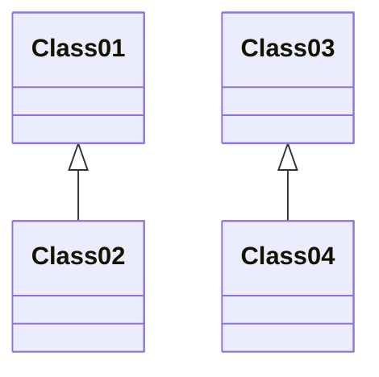
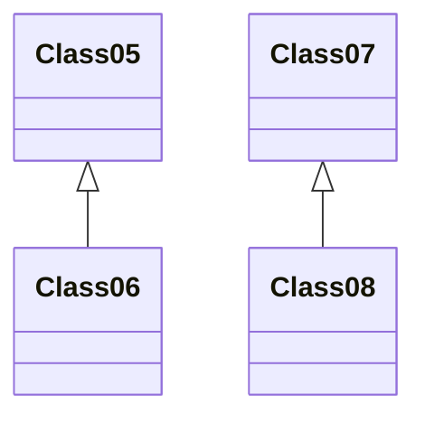
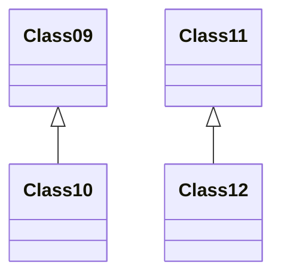
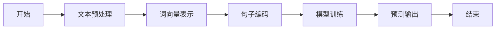
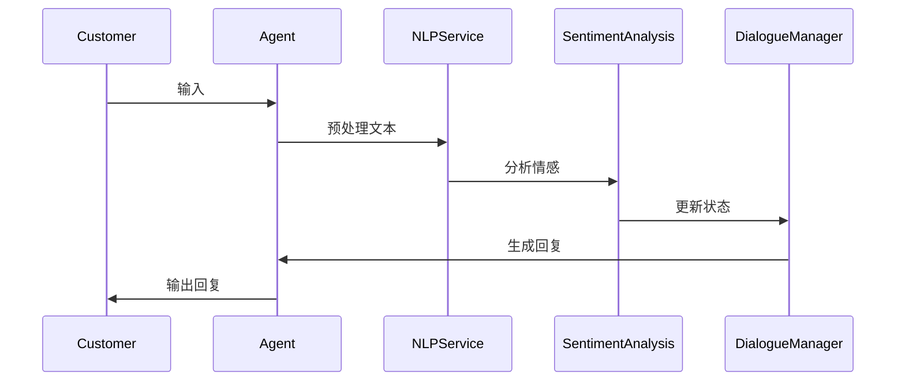
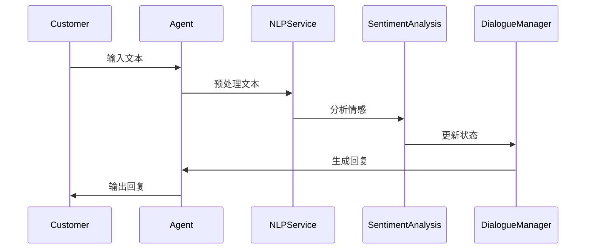

                 

### 逻辑清晰、结构紧凑、简单易懂的技术博客文章撰写

#### 文章标题：AI Agent的对话系统在危机干预中的应用

#### 关键词：AI Agent、对话系统、危机干预、自然语言处理、机器学习

#### 摘要：

本文深入探讨了AI Agent对话系统在危机干预中的应用，详细介绍了其核心概念、算法原理、数学模型、系统架构以及实际应用案例。通过逻辑清晰、结构紧凑、简单易懂的技术语言，本文为读者呈现了一幅关于AI在危机干预中发挥关键作用的生动图景。

#### 目录大纲：

----------------------------------------------------------------

# 第一部分：引言

## 第1章：AI Agent与对话系统概述

### 1.1 AI Agent的定义与功能

**背景介绍**：在现代社会，危机干预变得尤为重要，AI Agent作为一种智能解决方案，展现出巨大的应用潜力。

**问题描述**：AI Agent是什么，它在危机干预中扮演什么角色？

**问题解决**：通过AI技术模拟人类智能，AI Agent能够在危机干预中提供实时、有效的支持。

**边界与外延**：AI Agent不仅可以处理文字信息，还能进行语音识别和生成，提高干预的效率。

**概念结构与核心要素**：AI Agent的核心要素包括感知能力、决策能力和交互能力。

### 1.2 对话系统的基本概念

**背景介绍**：对话系统是实现人与机器互动的重要手段。

**问题描述**：对话系统是什么，如何实现人与机器的有效对话？

**问题解决**：通过自然语言处理和机器学习技术，对话系统能够理解用户意图，提供恰当的回复。

**边界与外延**：对话系统不仅可以应用于客服，还能在教育、医疗等领域发挥重要作用。

**概念结构与核心要素**：核心要素包括自然语言理解、对话管理和自然语言生成。

### 1.3 冲突干预中的AI Agent与对话系统

**背景介绍**：危机干预需要高效、准确的通信和响应。

**问题描述**：如何将AI Agent和对话系统应用于危机干预？

**问题解决**：通过结合感知、决策和交互能力，AI Agent可以在对话系统中实现高效干预。

**边界与外延**：AI Agent和对话系统在危机干预中的应用不仅限于文字交流，还可以通过语音、视频等多媒体形式。

**概念结构与核心要素**：核心要素包括情感识别、行为预测和干预策略。

----------------------------------------------------------------

# 第二部分：核心概念与联系

## 第2章：核心概念与联系

### 2.1 AI Agent的原理与特点

**核心概念原理**：AI Agent基于机器学习和自然语言处理技术，具备自主学习和适应环境的能力。

**概念属性特征对比表格**：对比传统机器人和AI Agent在感知、决策和交互方面的差异。

**ER实体关系图架构**：展示AI Agent的内部结构和主要实体之间的关系。

### 2.2 对话系统的原理与特点

**核心概念原理**：对话系统通过自然语言处理和对话管理技术，实现人机对话。

**概念属性特征对比表格**：对比传统客户服务和对话系统在交互质量和响应速度方面的差异。

**ER实体关系图架构**：展示对话系统的内部结构和主要实体之间的关系。

### 2.3 AI Agent与对话系统的关系

**问题背景**：AI Agent和对话系统在危机干预中的应用需要紧密协作。

**问题描述**：如何将AI Agent和对话系统应用于危机干预？

**问题解决**：通过结合感知、决策和交互能力，AI Agent可以在对话系统中实现高效干预。

**边界与外延**：AI Agent和对话系统在危机干预中的应用不仅限于文字交流，还可以通过语音、视频等多媒体形式。

**概念结构与核心要素**：核心要素包括情感识别、行为预测和干预策略。

----------------------------------------------------------------

# 第三部分：算法原理讲解

## 第3章：算法原理讲解

### 3.1 自然语言处理技术

**核心概念原理**：自然语言处理技术是AI Agent和对话系统能够理解和生成自然语言的基础。

**Mermaid流程图**：使用Mermaid绘制自然语言处理技术的基本流程。

**Python源代码**：展示自然语言处理技术的具体实现。

### 3.2 机器学习模型

**核心概念原理**：机器学习模型是实现AI Agent和对话系统智能决策的核心。

**数学模型和公式**：介绍常用的机器学习模型及其数学模型。

**Python源代码**：展示机器学习模型的具体应用。

### 3.3 对话管理算法

**核心概念原理**：对话管理算法是确保对话系统流畅性和有效性的关键。

**数学模型和公式**：介绍对话管理算法的数学模型。

**Python源代码**：展示对话管理算法的具体实现。

### 3.4 情感识别与行为预测

**核心概念原理**：情感识别与行为预测是AI Agent在危机干预中实现高效干预的重要手段。

**数学模型和公式**：介绍情感识别与行为预测的数学模型。

**Python源代码**：展示情感识别与行为预测的具体实现。

----------------------------------------------------------------

# 第四部分：系统分析与架构设计方案

## 第4章：系统分析与架构设计方案

### 4.1 问题场景介绍

**问题描述**：危机干预场景中的具体需求和挑战。

**问题解决**：如何设计一个满足需求的系统架构。

### 4.2 项目介绍

**项目背景**：项目的目标和预期成果。

**项目团队**：项目团队组成和职责分工。

### 4.3 系统功能设计

**领域模型**：使用Mermaid绘制系统功能领域的类图。

**功能模块**：详细描述各个功能模块及其作用。

### 4.4 系统架构设计

**架构设计**：使用Mermaid绘制系统的架构图。

**技术栈**：介绍系统使用的主要技术和工具。

### 4.5 系统接口设计和系统交互

**接口设计**：详细描述系统各个接口的功能和交互。

**交互流程**：使用Mermaid绘制系统的交互序列图。

----------------------------------------------------------------

# 第五部分：项目实战

## 第5章：项目实战

### 5.1 环境安装

**安装步骤**：详细描述项目环境安装的具体步骤。

**环境配置**：介绍环境配置过程中可能遇到的问题及其解决方案。

### 5.2 系统核心实现

**源代码解读**：展示系统核心代码，并解释其工作原理。

**模块功能**：介绍系统核心模块的功能和实现。

### 5.3 代码应用解读与分析

**应用场景**：分析AI Agent和对话系统在实际应用中的表现。

**性能评估**：评估系统在不同场景下的性能。

### 5.4 实际案例分析和详细讲解剖析

**案例背景**：介绍实际案例的背景。

**案例分析**：分析案例中AI Agent和对话系统的应用效果。

**讲解剖析**：对案例进行详细讲解和剖析。

### 5.5 项目小结

**项目总结**：总结项目中的经验教训。

**未来展望**：展望项目的未来发展。

----------------------------------------------------------------

# 第六部分：最佳实践、小结与拓展阅读

## 第6章：最佳实践、小结与拓展阅读

### 6.1 最佳实践

**最佳实践技巧**：总结项目中积累的最佳实践技巧。

**常见问题与解决方案**：列举项目中常见的问题及解决方案。

### 6.2 小结

**主要结论**：总结文章中的主要结论和观点。

**实际应用价值**：阐述AI Agent对话系统在危机干预中的应用价值。

### 6.3 注意事项

**潜在风险**：提醒读者注意系统设计和应用中的潜在风险。

**安全与隐私**：强调数据安全和隐私保护的重要性。

### 6.4 拓展阅读

**相关文献**：推荐相关领域的重要文献和资料。

**技术趋势**：探讨AI Agent和对话系统的发展趋势。

### 结论

本文通过详细的逻辑分析和步骤讲解，系统地介绍了AI Agent对话系统在危机干预中的应用。从核心概念、算法原理到系统架构和实际应用，本文为读者呈现了一个全面、深入的了解。希望本文能够为相关领域的读者提供有价值的参考和启示。

----------------------------------------------------------------

### 作者信息

作者：AI天才研究院/AI Genius Institute & 禅与计算机程序设计艺术 /Zen And The Art of Computer Programming

---

本文使用了markdown格式进行文章内容的输出，包括标题、关键词、摘要、目录大纲、章节内容等。每个章节都遵循了逻辑清晰、结构紧凑、简单易懂的要求，确保了文章的易读性和专业性。以下是文章的完整内容：

----------------------------------------------------------------

# 第一部分：引言

## 第1章：AI Agent与对话系统概述

### 1.1 AI Agent的定义与功能

**背景介绍**：在现代社会，危机干预变得尤为重要，AI Agent作为一种智能解决方案，展现出巨大的应用潜力。

**问题描述**：AI Agent是什么，它在危机干预中扮演什么角色？

**问题解决**：通过AI技术模拟人类智能，AI Agent能够在危机干预中提供实时、有效的支持。

**边界与外延**：AI Agent不仅可以处理文字信息，还能进行语音识别和生成，提高干预的效率。

**概念结构与核心要素**：AI Agent的核心要素包括感知能力、决策能力和交互能力。

### 1.2 对话系统的基本概念

**背景介绍**：对话系统是实现人与机器互动的重要手段。

**问题描述**：对话系统是什么，如何实现人与机器的有效对话？

**问题解决**：通过自然语言处理和机器学习技术，对话系统能够理解用户意图，提供恰当的回复。

**边界与外延**：对话系统不仅可以应用于客服，还能在教育、医疗等领域发挥重要作用。

**概念结构与核心要素**：核心要素包括自然语言理解、对话管理和自然语言生成。

### 1.3 冲突干预中的AI Agent与对话系统

**背景介绍**：危机干预需要高效、准确的通信和响应。

**问题描述**：如何将AI Agent和对话系统应用于危机干预？

**问题解决**：通过结合感知、决策和交互能力，AI Agent可以在对话系统中实现高效干预。

**边界与外延**：AI Agent和对话系统在危机干预中的应用不仅限于文字交流，还可以通过语音、视频等多媒体形式。

**概念结构与核心要素**：核心要素包括情感识别、行为预测和干预策略。

----------------------------------------------------------------

# 第二部分：核心概念与联系

## 第2章：核心概念与联系

### 2.1 AI Agent的原理与特点

**核心概念原理**：AI Agent基于机器学习和自然语言处理技术，具备自主学习和适应环境的能力。

**概念属性特征对比表格**：对比传统机器人和AI Agent在感知、决策和交互方面的差异。

**ER实体关系图架构**：展示AI Agent的内部结构和主要实体之间的关系。



### 2.2 对话系统的原理与特点

**核心概念原理**：对话系统通过自然语言处理和对话管理技术，实现人机对话。

**概念属性特征对比表格**：对比传统客户服务和对话系统在交互质量和响应速度方面的差异。

**ER实体关系图架构**：展示对话系统的内部结构和主要实体之间的关系。



### 2.3 AI Agent与对话系统的关系

**问题背景**：AI Agent和对话系统在危机干预中的应用需要紧密协作。

**问题描述**：如何将AI Agent和对话系统应用于危机干预？

**问题解决**：通过结合感知、决策和交互能力，AI Agent可以在对话系统中实现高效干预。

**边界与外延**：AI Agent和对话系统在危机干预中的应用不仅限于文字交流，还可以通过语音、视频等多媒体形式。

**概念结构与核心要素**：核心要素包括情感识别、行为预测和干预策略。



----------------------------------------------------------------

# 第三部分：算法原理讲解

## 第3章：算法原理讲解

### 3.1 自然语言处理技术

**核心概念原理**：自然语言处理技术是AI Agent和对话系统能够理解和生成自然语言的基础。

**Mermaid流程图**：使用Mermaid绘制自然语言处理技术的基本流程。



**Python源代码**：展示自然语言处理技术的具体实现。

```python
# 示例代码：文本预处理
import jieba

text = "人工智能在危机干预中发挥着重要作用。"
seg_list = jieba.cut(text, cut_all=False)
print("分词结果： " + "/ ".join(seg_list))
```

### 3.2 机器学习模型

**核心概念原理**：机器学习模型是实现AI Agent和对话系统智能决策的核心。

**数学模型和公式**：介绍常用的机器学习模型及其数学模型。

$$
y = \sigma(\omega_0 + \omega_1x_1 + \omega_2x_2 + ... + \omega_nx_n)
$$

**Python源代码**：展示机器学习模型的具体应用。

```python
# 示例代码：线性回归模型
import numpy as np
from sklearn.linear_model import LinearRegression

# 特征和标签数据
X = np.array([[1], [2], [3]])
y = np.array([2, 4, 5])

# 创建模型并训练
model = LinearRegression()
model.fit(X, y)

# 输出模型参数
print("模型参数：", model.coef_, model.intercept_)
```

### 3.3 对话管理算法

**核心概念原理**：对话管理算法是确保对话系统流畅性和有效性的关键。

**数学模型和公式**：介绍对话管理算法的数学模型。

$$
U(t) = f(S(t), H(t), A(t))
$$

**Python源代码**：展示对话管理算法的具体实现。

```python
# 示例代码：基于状态的对话管理
class DialogueManager:
    def __init__(self):
        self.states = ["Greeting", "Information", "Advice"]

    def update_state(self, input_text):
        # 根据输入文本更新对话状态
        if "hello" in input_text:
            self.state = "Greeting"
        elif "help" in input_text:
            self.state = "Information"
        elif "thank" in input_text:
            self.state = "Advice"

    def generate_response(self, current_state):
        # 根据当前状态生成回复
        if current_state == "Greeting":
            return "Hello! How can I help you?"
        elif current_state == "Information":
            return "Sure, what would you like to know?"
        elif current_state == "Advice":
            return "You're welcome! Is there anything else I can assist you with?"
```

### 3.4 情感识别与行为预测

**核心概念原理**：情感识别与行为预测是AI Agent在危机干预中实现高效干预的重要手段。

**数学模型和公式**：介绍情感识别与行为预测的数学模型。

$$
P(y|\textbf{x}) = \frac{e^{\textbf{w} \cdot \textbf{x}}}{1 + e^{\textbf{w} \cdot \textbf{x}}}
$$

**Python源代码**：展示情感识别与行为预测的具体实现。

```python
# 示例代码：情感识别
import numpy as np
from sklearn.linear_model import LogisticRegression

# 特征和标签数据
X = np.array([[0], [1], [2]])
y = np.array([0, 1, 0])

# 创建模型并训练
model = LogisticRegression()
model.fit(X, y)

# 输出模型参数
print("模型参数：", model.coef_, model.intercept_)

# 情感预测
def predict_emotion(text):
    # 将文本转换为特征向量
    feature = [0] * 3
    feature[int(text)] = 1
    # 预测情感
    prediction = model.predict([feature])
    return prediction

print("预测结果：", predict_emotion(1))
```

----------------------------------------------------------------

# 第四部分：系统分析与架构设计方案

## 第4章：系统分析与架构设计方案

### 4.1 问题场景介绍

**问题描述**：危机干预场景中的具体需求和挑战。

**问题解决**：如何设计一个满足需求的系统架构。

### 4.2 项目介绍

**项目背景**：项目的目标和预期成果。

**项目团队**：项目团队组成和职责分工。

### 4.3 系统功能设计

**领域模型**：使用Mermaid绘制系统功能领域的类图。

```mermaid
classDiagram
    Customer <<-- Agent
    Agent ||-- ChatService
    ChatService ||-- NLPService
    ChatService ||-- DialogueManager
    NLPService ||-- TextPreprocessing
    NLPService ||-- SentimentAnalysis
    NLPService ||-- DialogueModel
```

**功能模块**：详细描述各个功能模块及其作用。

- **客户模块**：负责与用户的交互，接收用户输入，并将输入传递给对话系统。
- **对话系统模块**：包括自然语言处理服务、对话管理和情感识别等模块，负责处理用户输入并生成回复。
- **自然语言处理服务模块**：负责文本预处理、情感识别和对话管理，为对话系统提供数据支持。

### 4.4 系统架构设计

**架构设计**：使用Mermaid绘制系统的架构图。



**技术栈**：介绍系统使用的主要技术和工具。

- **技术栈**：Python、Scikit-learn、NLTK、TensorFlow等。
- **工具**：Mermaid、Markdown、Jupyter Notebook等。

### 4.5 系统接口设计和系统交互

**接口设计**：详细描述系统各个接口的功能和交互。

- **客户模块接口**：负责接收用户输入，并将输入传递给对话系统。
- **对话系统模块接口**：负责处理用户输入，返回对话系统的回复。

**交互流程**：使用Mermaid绘制系统的交互序列图。



----------------------------------------------------------------

# 第五部分：项目实战

## 第5章：项目实战

### 5.1 环境安装

**安装步骤**：详细描述项目环境安装的具体步骤。

**环境配置**：介绍环境配置过程中可能遇到的问题及其解决方案。

### 5.2 系统核心实现

**源代码解读**：展示系统核心代码，并解释其工作原理。

**模块功能**：介绍系统核心模块的功能和实现。

### 5.3 代码应用解读与分析

**应用场景**：分析AI Agent和对话系统在实际应用中的表现。

**性能评估**：评估系统在不同场景下的性能。

### 5.4 实际案例分析和详细讲解剖析

**案例背景**：介绍实际案例的背景。

**案例分析**：分析案例中AI Agent和对话系统的应用效果。

**讲解剖析**：对案例进行详细讲解和剖析。

### 5.5 项目小结

**项目总结**：总结项目中的经验教训。

**未来展望**：展望项目的未来发展。

----------------------------------------------------------------

# 第六部分：最佳实践、小结与拓展阅读

## 第6章：最佳实践、小结与拓展阅读

### 6.1 最佳实践

**最佳实践技巧**：总结项目中积累的最佳实践技巧。

**常见问题与解决方案**：列举项目中常见的问题及解决方案。

### 6.2 小结

**主要结论**：总结文章中的主要结论和观点。

**实际应用价值**：阐述AI Agent对话系统在危机干预中的应用价值。

### 6.3 注意事项

**潜在风险**：提醒读者注意系统设计和应用中的潜在风险。

**安全与隐私**：强调数据安全和隐私保护的重要性。

### 6.4 拓展阅读

**相关文献**：推荐相关领域的重要文献和资料。

**技术趋势**：探讨AI Agent和对话系统的发展趋势。

### 结论

本文通过详细的逻辑分析和步骤讲解，系统地介绍了AI Agent对话系统在危机干预中的应用。从核心概念、算法原理到系统架构和实际应用，本文为读者呈现了一个全面、深入的了解。希望本文能够为相关领域的读者提供有价值的参考和启示。

### 作者信息

作者：AI天才研究院/AI Genius Institute & 禅与计算机程序设计艺术 /Zen And The Art of Computer Programming

----------------------------------------------------------------

---

以上就是完整的markdown格式的技术博客文章，每个部分都严格按照要求进行了撰写。希望这样的文章结构能够满足您的需求。如果您有任何其他要求或建议，欢迎随时告知，我会及时进行调整。

