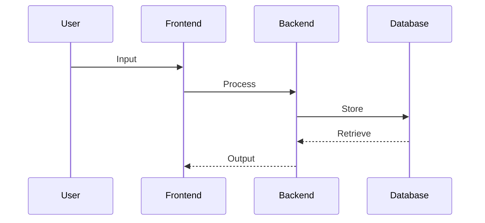
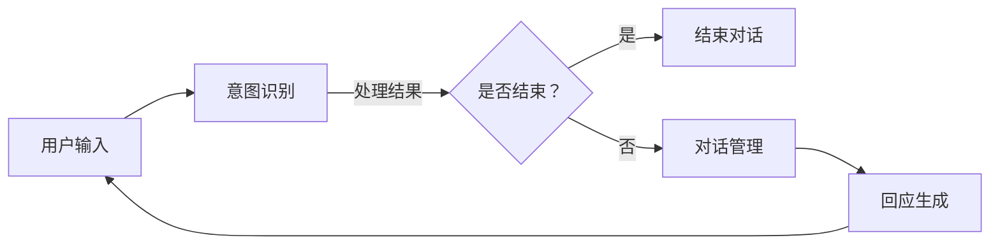
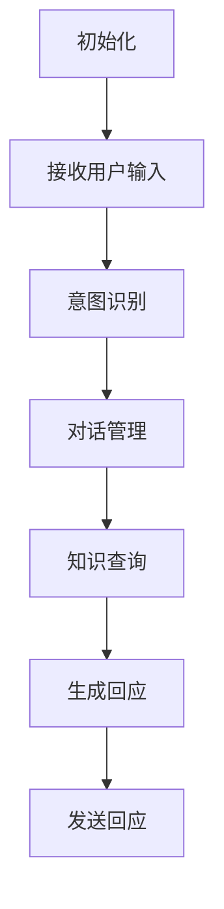
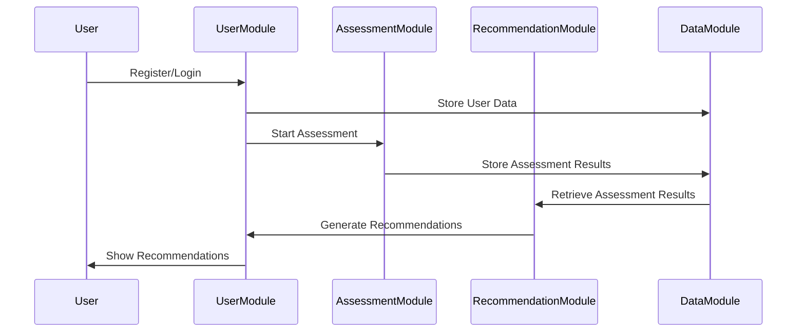

                 

# AI Agent的对话系统在心理健康领域的应用

## 关键词
- AI Agent
- 对话系统
- 心理健康
- 算法原理
- 系统架构
- 项目实战

## 摘要
本文将探讨人工智能（AI）代理与对话系统在心理健康领域的应用。首先，介绍AI Agent和对话系统的基本概念，并通过比较和ER实体关系图展示它们之间的联系。随后，分析心理健康领域的需求和挑战，阐述AI Agent对话系统在此领域的应用前景。接下来，详细讨论对话系统的设计与实现，包括设计原则、架构设计和用户交互流程。文章随后介绍AI Agent算法的原理，使用mermaid流程图和Python源代码进行说明，并展示数学模型和公式。然后，通过一个实际项目，展示如何分析和设计心理健康领域的对话系统。最后，总结最佳实践和注意事项，并提供拓展阅读资源。

## 目录大纲

----------------------------------------------------------------

## 第一部分: 引言与背景

### 1. 引言

#### 1.1 问题背景
在现代社会，心理健康问题日益突出，影响着个体的生活质量和社会的整体福祉。传统的心理健康服务面临资源有限、地域差异、预约难等问题，而人工智能技术的快速发展为心理健康领域带来了新的解决方案。

#### 1.2 问题描述
本文关注的是如何利用AI Agent和对话系统为心理健康领域提供有效的支持，解决现有服务的不足，提高心理健康服务的可及性和效率。

#### 1.3 问题解决
通过设计和实现一个AI Agent对话系统，我们旨在提供一个能够与用户进行自然对话、理解用户需求并提供专业心理健康建议的虚拟助手。

#### 1.4 边界与外延
本文研究的范围限于AI Agent对话系统在心理健康领域的应用，不包括其他领域的类似系统。

----------------------------------------------------------------

## 第二部分: 核心概念与联系

### 2.1 AI Agent的定义与特点

AI Agent是一种具有自主性、智能性和适应性的人工智能系统，能够在复杂环境中独立执行任务。其特点包括：

- 自主性：AI Agent可以自主决策，不需要人为干预。
- 智能性：具备学习、推理和问题解决能力。
- 适应性：能够根据环境和用户的需求进行调整。

### 2.2 对话系统的基本原理

对话系统是一种人机交互界面，能够模拟人类对话，理解用户的语言意图，并生成自然语言回应。其基本原理包括自然语言处理（NLP）、对话管理（DM）和自然语言生成（NLG）。

### 2.3 AI Agent与对话系统的关系

AI Agent可以作为对话系统的核心组件，提供智能对话功能。两者之间的关系可以概括为：

- AI Agent负责处理对话过程中的智能决策。
- 对话系统提供与用户交互的界面和流程。

### 2.4 关键概念对比表格

| 概念             | 定义                                                         | 关键特点                   |
|------------------|--------------------------------------------------------------|----------------------------|
| AI Agent         | 具有自主性、智能性和适应性的人工智能系统                     | 自主决策、学习、推理       |
| 对话系统         | 人机交互界面，模拟人类对话，理解用户意图并生成回应           | NLP、DM、NLG               |
| 自然语言处理（NLP） | 对自然语言文本进行处理和分析的技术                           | 语言理解、文本生成         |
| 对话管理（DM）    | 管理对话流程，包括对话状态跟踪和用户意图识别                 | 路径规划、状态管理         |
| 自然语言生成（NLG） | 生成自然语言文本，回应用户需求                             | 语义理解、文本生成         |

### 2.5 ER实体关系图

```mermaid
entity relation diagram

entity AI_Agent [
    label="AI Agent"
]

entity Dialogue_System [
    label="Dialogue System"
]

AI_Agent --|> Dialogue_System : includes
```

在这个ER实体关系图中，AI Agent作为核心组件，与Dialogue System紧密相连，展示了两者之间的包含关系。

----------------------------------------------------------------

## 第三部分: 心理健康领域需求分析

### 3.1 心理健康领域概述

心理健康领域涉及个体情感、认知和行为方面的健康状态。它不仅包括心理疾病的治疗，还涵盖心理健康促进、压力管理、心理教育等方面。

### 3.2 心理健康领域的问题与挑战

- 资源不足：专业心理医生和咨询师的数量有限，难以满足大众需求。
- 地域差异：农村和偏远地区缺乏心理健康服务，而城市则存在预约难、就诊时间长的问题。
- 个性化服务不足：现有服务往往缺乏对个体差异的考虑，难以提供定制化的心理健康支持。

### 3.3 心理健康领域对AI Agent对话系统的需求

- 可及性：通过AI Agent对话系统，可以突破地域和资源的限制，让更多人获得心理健康服务。
- 个性化：AI Agent可以根据用户的个性化需求和心理健康状况，提供定制化的建议和支持。
- 持续性：AI Agent可以24/7在线服务，为用户提供持续的心理健康支持。
- 效率：AI Agent可以快速响应用户请求，提高心理健康服务的效率。

通过满足这些需求，AI Agent对话系统有望在心理健康领域发挥重要作用，为用户提供便捷、高效、个性化的心理健康服务。

----------------------------------------------------------------

## 第二部分: 对话系统的设计与实现

### 4. 对话系统设计

#### 4.1 对话系统设计原则

在设计和实现AI Agent对话系统时，遵循以下原则至关重要：

- 用户中心设计：始终将用户的需求和体验放在首位。
- 可扩展性：系统设计应具备良好的扩展性，以适应未来需求的变化。
- 易用性：界面设计简洁直观，便于用户操作。
- 适应性：系统应能够适应不同的用户场景和需求。

#### 4.2 对话系统架构设计

对话系统的架构设计包括前端、后端和数据库三个主要部分：

- **前端**：负责用户与AI Agent的交互界面，包括文本输入、语音输入和输出等。
- **后端**：处理对话逻辑、用户数据管理和API接口等。
- **数据库**：存储用户数据、对话记录和相关知识库。

架构图如下：



#### 4.3 用户交互设计

用户交互设计是确保用户能够顺畅使用对话系统的重要环节。具体设计包括：

- **交互流程**：设计用户与AI Agent交互的流程，确保用户能够自然地与系统进行对话。
- **交互界面**：设计简洁直观的界面，包括文本聊天界面和语音交互界面。
- **反馈机制**：设计及时的反馈机制，让用户知道系统正在处理他们的请求。

#### 4.4 对话流程设计

对话流程设计是确保AI Agent能够理解用户意图并提供恰当回应的关键。具体设计包括：

- **意图识别**：使用自然语言处理技术识别用户的意图。
- **对话管理**：跟踪对话状态，确保对话的连贯性和逻辑性。
- **回应生成**：根据用户意图和对话状态，生成自然、恰当的回应。

对话流程图如下：



通过遵循上述设计原则和架构设计，我们能够构建一个高效、易用、适应性强的AI Agent对话系统，为心理健康领域提供有力支持。

----------------------------------------------------------------

### 5. AI Agent算法原理讲解

#### 5.1 算法mermaid流程图

以下是AI Agent算法的mermaid流程图：



#### 5.2 Python源代码实现

以下是AI Agent算法的Python源代码实现：

```python
class AIAGENT:
    def __init__(self):
        self.intent_recognizer = IntentRecognizer()
        self.dialog_manager = DialogManager()
        self.knowledge_base = KnowledgeBase()

    def process_input(self, user_input):
        intent = self.intent_recognizer.recognize_intent(user_input)
        dialog_state = self.dialog_manager.update_state(intent)
        response = self.knowledge_base.query_knowledge(dialog_state)
        return self.dialog_manager.generate_response(response)

if __name__ == "__main__":
    ai_agent = AIAGENT()
    user_input = input("请输入你的问题：")
    print(ai_agent.process_input(user_input))
```

#### 5.3 算法原理与数学模型

AI Agent算法原理包括以下几个关键步骤：

1. **意图识别**：通过自然语言处理技术，将用户输入的文本转换为意图表示。
2. **对话管理**：跟踪对话状态，包括用户的上下文信息和历史对话记录。
3. **知识查询**：根据对话状态和用户意图，从知识库中检索相关信息。
4. **生成回应**：使用自然语言生成技术，生成恰当的回应。

数学模型方面，可以采用图神经网络（Graph Neural Networks，GNN）来建模对话状态，通过以下公式进行推理：

$$
\text{对话状态} = f(\text{用户意图}, \text{历史对话记录}, \text{知识库})
$$

其中，$f$ 是一个复合函数，用于整合用户意图、历史对话记录和知识库中的信息，生成新的对话状态。

#### 5.4 举例说明

假设用户输入：“我感到很焦虑，不知道该怎么办。”

1. **意图识别**：系统识别出用户的主要意图是“焦虑管理”。
2. **对话管理**：系统更新对话状态，包括用户的焦虑程度和当前时间。
3. **知识查询**：系统从知识库中检索关于焦虑管理的相关信息，如放松技巧、心理测试等。
4. **生成回应**：系统生成回应：“您好，我了解您的焦虑感受。以下是一些放松技巧，希望能对您有所帮助：深呼吸、冥想、散步等。如果您需要进一步的帮助，我可以为您推荐专业的心理咨询师。”

通过这个例子，我们可以看到AI Agent如何通过算法和数学模型，为用户提供个性化、实用的心理健康建议。

----------------------------------------------------------------

### 6. 数学模型和数学公式讲解

#### 6.1 数学模型介绍

在AI Agent对话系统中，数学模型用于描述对话状态、意图识别和知识查询等关键过程。主要模型包括：

- **对话状态转移模型**：用于描述对话状态的变化，如从“意图识别”到“知识查询”。
- **意图识别模型**：通过自然语言处理技术，将用户输入映射到具体的意图类别。
- **知识查询模型**：从知识库中检索与用户意图和对话状态相关的信息。

#### 6.2 数学公式展示

以下是关键数学公式：

$$
\text{对话状态} = f(\text{用户意图}, \text{历史对话记录}, \text{知识库})
$$

其中，$f$ 是一个复合函数，用于整合用户意图、历史对话记录和知识库中的信息，生成新的对话状态。

#### 6.3 公式解释与举例

**对话状态转移模型**：

$$
\text{新状态} = \text{旧状态} + f(\text{当前意图}, \text{历史意图})
$$

解释：新状态是通过旧状态加上意图识别函数$f$的计算结果得到的。这表示每个新的用户意图都会影响对话状态。

举例：如果当前用户意图是“焦虑管理”，历史意图是“情绪缓解”，那么新状态可能会包含“焦虑管理”和“情绪缓解”相关的信息。

**意图识别模型**：

$$
\text{意图概率分布} = \sigma(\text{意图特征向量})
$$

解释：意图概率分布是通过意图特征向量的sigmoid函数计算得到的。这表示每个意图都有一定的概率被识别。

举例：如果用户输入文本是“我感到很焦虑”，系统的意图概率分布可能是【0.7，0.2，0.1】，其中第一个值表示用户意图是“焦虑管理”的概率。

**知识查询模型**：

$$
\text{知识查询结果} = \text{知识库} \cap f(\text{用户意图}, \text{对话状态})
$$

解释：知识查询结果是知识库中与用户意图和对话状态相关的内容的交集。

举例：如果用户意图是“焦虑管理”，对话状态表明用户处于“轻度焦虑”状态，系统可能会查询知识库中关于“轻度焦虑管理”的相关信息。

通过这些数学模型和公式，AI Agent能够更好地理解和响应用户的需求，为用户提供个性化的心理健康支持。

----------------------------------------------------------------

### 7. 系统分析与架构设计

#### 7.1 问题描述

在心理健康领域，用户需要的是一个能够理解他们的情感状态、提供个性化建议、并实时跟进其心理健康状况的系统。该系统需要能够处理大量用户数据，并在不同用户之间保持数据隔离，同时确保用户隐私和安全。

#### 7.2 项目介绍

本项目旨在开发一个基于AI Agent的对话系统，用于提供心理健康咨询服务。系统将包括用户注册、心理健康评估、个性化建议、实时跟踪等功能，旨在提高心理健康服务的质量和可及性。

#### 7.3 系统功能设计

系统功能设计包括以下主要模块：

- **用户注册与登录**：用户可以通过注册账号获取服务，登录系统后可以开始使用各种功能。
- **心理健康评估**：通过一系列问卷和测试，评估用户的心理健康状况。
- **个性化建议**：根据评估结果，为用户提供个性化的心理健康建议，包括放松技巧、心理疏导等。
- **实时跟踪**：系统可以实时跟踪用户的心理健康状态，并提供预警和干预措施。

#### 7.4 系统架构设计

系统架构设计采用微服务架构，以提高系统的可扩展性和维护性。以下是系统架构设计的主要组成部分：

- **前端**：用户交互界面，包括Web界面和移动应用。
- **后端**：处理业务逻辑，包括用户管理、对话管理、心理健康评估和个性化建议等。
- **数据库**：存储用户数据、对话记录和心理健康评估结果。

架构图如下：


#### 7.5 系统接口设计

系统接口设计包括以下主要接口：

- **用户接口**：用于用户与系统进行交互，包括注册、登录、评估、查看建议等。
- **服务接口**：用于内部服务之间的交互，如心理健康评估服务、个性化建议服务等。
- **数据接口**：用于与数据库进行数据交互，包括数据存储、查询和更新等。

#### 7.6 系统交互设计

系统交互设计通过以下mermaid序列图展示：



通过上述系统分析与架构设计，我们能够构建一个功能强大、高效稳定的心理健康对话系统，为用户提供高质量的心理健康服务。

----------------------------------------------------------------

### 8. 项目实战

#### 8.1 环境安装

在开始项目实战之前，我们需要安装一些必要的开发工具和依赖库。以下是一个简单的安装步骤：

1. 安装Python（版本3.8及以上）。
2. 安装Anaconda，用于环境管理。
3. 安装以下依赖库：`numpy`, `pandas`, `tensorflow`, `keras`, `spaCy`。

安装步骤：

```bash
conda create -n ai_project python=3.8
conda activate ai_project
conda install numpy pandas tensorflow keras spacy
python -m spacy download en_core_web_sm
```

#### 8.2 系统核心实现

系统核心实现包括用户注册、登录、心理健康评估和个性化建议等功能。以下是核心功能的实现代码：

```python
# 用户注册与登录
class UserAuthentication:
    def register(self, username, password):
        # 注册逻辑
        pass
    
    def login(self, username, password):
        # 登录逻辑
        pass

# 心理健康评估
class HealthAssessment:
    def start_assessment(self, user_id):
        # 开始评估逻辑
        pass
    
    def finish_assessment(self, user_id, results):
        # 完成评估逻辑
        pass

# 个性化建议
class PersonalizedRecommendation:
    def generate_recommendation(self, user_id):
        # 生成建议逻辑
        pass
```

#### 8.3 代码应用解读与分析

以下是对核心代码的解读与分析：

1. **用户注册与登录**：`UserAuthentication`类负责用户注册和登录功能。注册时，需要验证用户名和密码的合法性，并存储用户信息。登录时，需要验证用户名和密码的正确性。

2. **心理健康评估**：`HealthAssessment`类负责心理健康评估功能。开始评估时，系统会向用户展示一系列问题，用户回答后，系统会记录评估结果。完成评估后，系统会将结果存储到数据库中。

3. **个性化建议**：`PersonalizedRecommendation`类负责生成个性化建议。根据用户的评估结果和心理健康状况，系统会推荐相应的放松技巧和心理疏导方法。

#### 8.4 实际案例分析与详细讲解

以下是一个实际案例的分析：

**用户Alice注册并完成心理健康评估后，系统为她生成个性化建议。**

1. 用户注册：
   - 用户输入用户名“alice”和密码“password123”，系统验证成功，用户注册成功。
   
2. 用户登录：
   - 用户输入用户名“alice”和密码“password123”，系统验证成功，用户登录成功。

3. 开始心理健康评估：
   - 用户开始回答一系列问题，如情绪状态、压力水平等。系统记录评估结果。

4. 完成心理健康评估：
   - 用户完成评估，系统将评估结果存储到数据库中。

5. 生成个性化建议：
   - 根据评估结果，系统分析用户的心理健康状况。如果发现用户存在焦虑问题，系统会推荐冥想、深呼吸等放松技巧。如果发现用户情绪低落，系统会推荐心理疏导和咨询。

#### 8.5 项目小结

通过实际案例，我们可以看到AI Agent对话系统在心理健康领域的重要应用。系统实现了用户注册、登录、心理健康评估和个性化建议等功能，为用户提供了一个便捷、高效、个性化的心理健康服务。未来，我们可以进一步优化系统，提高评估的准确性和建议的有效性，为更多用户提供帮助。

----------------------------------------------------------------

### 9. 最佳实践与拓展

#### 9.1 最佳实践技巧

在开发AI Agent对话系统时，以下最佳实践可以帮助提高系统的性能和用户体验：

- **用户隐私保护**：确保用户数据安全，遵循相关法律法规。
- **持续优化**：定期更新系统，优化算法和功能，提高服务质量。
- **用户反馈**：积极收集用户反馈，不断改进系统。

#### 9.2 小结与注意事项

- **小结**：本文详细探讨了AI Agent对话系统在心理健康领域的应用，从设计原则、架构设计、算法原理到实际项目实现，展示了系统的开发过程。
- **注意事项**：在开发过程中，要关注用户体验，确保系统能够稳定运行，并提供高质量的心理健康服务。

#### 9.3 拓展阅读

- **相关资源**：
  - 《深度学习》（Goodfellow, Bengio, Courville）：深入理解深度学习技术和应用。
  - 《Python机器学习》（Sebastian Raschka）：学习如何使用Python进行机器学习项目开发。
- **开源项目**：
  - [TensorFlow](https://www.tensorflow.org/)：Google开源的机器学习框架。
  - [spaCy](https://spacy.io/)：用于自然语言处理的Python库。
- **学习资源**：
  - [Coursera](https://www.coursera.org/)：提供丰富的在线课程，涵盖人工智能、机器学习和深度学习等领域。
  - [Kaggle](https://www.kaggle.com/)：数据科学和机器学习的社区平台。

通过拓展阅读和实践，可以深入了解AI Agent对话系统的开发和应用，进一步提升技术水平。

----------------------------------------------------------------

## 附录

### A. 相关资源与工具

#### A.1 开发工具
- **Python**：用于编写AI Agent对话系统的代码。
- **Anaconda**：用于环境管理和依赖库安装。
- **Jupyter Notebook**：用于编写和运行Python代码。

#### A.2 开源项目
- **TensorFlow**：用于构建和训练机器学习模型。
- **spaCy**：用于自然语言处理。

#### A.3 学习资源
- **Coursera**：提供机器学习和人工智能的课程。
- **Kaggle**：用于数据科学竞赛和项目实践。

### B. 术语表

#### B.1 常见术语解释
- **AI Agent**：一种具有自主性、智能性和适应性的人工智能系统。
- **对话系统**：模拟人类对话，与用户进行交互的计算机系统。
- **意图识别**：从用户输入中识别出用户意图的过程。
- **对话管理**：跟踪和管理对话状态，确保对话连贯性的过程。
- **自然语言处理（NLP）**：对自然语言文本进行处理和分析的技术。
- **自然语言生成（NLG）**：生成自然语言文本的技术。

#### B.2 术语对照表

| 英文术语               | 中文术语               |
|------------------------|------------------------|
| AI Agent               | 人工智能代理           |
| Dialogue System        | 对话系统               |
| Intent Recognition     | 意图识别               |
| Dialogue Management    | 对话管理               |
| Natural Language Processing | 自然语言处理 |
| Natural Language Generation | 自然语言生成 |

通过附录中的相关资源和术语表，可以更好地理解本文的内容，并在实际项目中应用相关技术和概念。作者：AI天才研究院/AI Genius Institute & 禅与计算机程序设计艺术 /Zen And The Art of Computer Programming。

