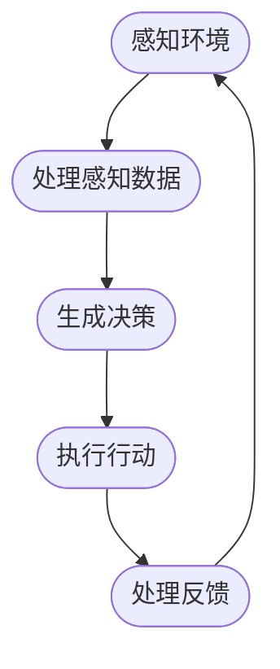
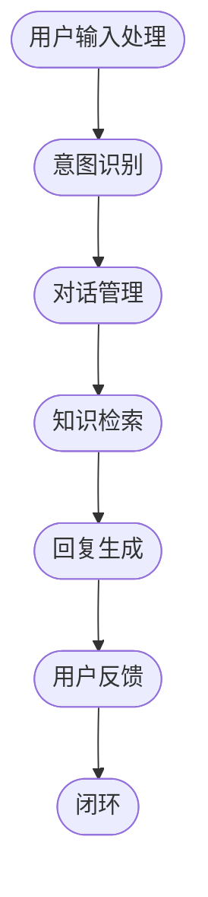
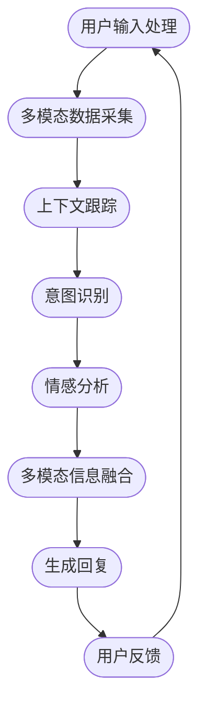
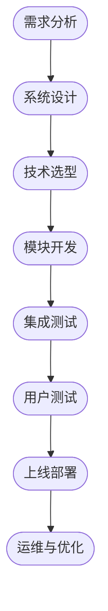

                 

## 引言

### 1.1 问题背景

随着互联网技术的迅猛发展，人工智能（AI）已经成为各个行业数字化转型的重要推动力。特别是对于客户服务领域，传统的客服模式由于效率低、响应慢、人工成本高等问题，已经无法满足现代企业的需求。智能客服作为人工智能的一个重要应用方向，通过引入AI Agent（人工智能代理）和对话系统，旨在为用户提供高效、精准、个性化的服务体验。然而，现有的智能客服系统在性能、用户体验和智能化水平上仍有很大的提升空间。

本文将围绕AI Agent的对话系统在智能客服中的进阶应用进行深入探讨。通过对AI Agent的基础知识、对话系统在智能客服中的应用、AI Agent在对话系统中的进阶应用等方面进行分析，旨在为读者提供一个全面、系统的理解，并为实际应用提供有价值的参考。

### 1.2 对话系统的定义与分类

对话系统是一种人机交互系统，它能够理解和生成自然语言，与用户进行有效的交流。根据交互方式，对话系统可以分为以下几种类型：

1. **命令式对话系统**：用户通过输入指令，系统根据指令执行相应的操作。
2. **问答式对话系统**：用户提出问题，系统通过检索和生成回答来响应。
3. **对话生成式对话系统**：系统能够生成连贯、自然的对话内容，与用户进行双向交流。
4. **混合式对话系统**：结合多种交互方式，提供更加灵活和丰富的用户体验。

### 1.3 AI Agent在对话系统中的作用

AI Agent作为人工智能的高级形式，具有自主决策、学习和适应能力。在对话系统中，AI Agent可以扮演以下角色：

1. **交互主体**：作为对话的发起者和参与者，与用户进行交流。
2. **任务执行者**：根据用户的需求，执行相应的任务。
3. **知识管理者**：通过学习和积累知识，提高对话系统的智能化水平。

### 1.4 智能客服的发展历程

智能客服的发展经历了以下几个阶段：

1. **传统客服阶段**：以人工客服为主，效率低，用户体验差。
2. **自动化客服阶段**：引入自动化工具，如聊天机器人，但功能单一，无法提供高质量的服务。
3. **智能客服阶段**：结合AI技术，特别是对话系统，实现高效、个性化的客户服务。

### 小结

本文将从AI Agent的基础知识、对话系统在智能客服中的应用、AI Agent在对话系统中的进阶应用等多个角度，对智能客服领域进行深入探讨。通过本文的阅读，读者将能够全面了解AI Agent对话系统在智能客服中的重要作用，以及如何实现其进阶应用。

---

**关键词**：AI Agent、对话系统、智能客服、上下文感知、多模态、情感分析

**摘要**：本文系统性地探讨了AI Agent对话系统在智能客服中的应用，从基础知识、核心技术、进阶应用等多个层面进行了深入分析。通过对实际案例的剖析，展示了AI Agent对话系统在提升客服效率、用户体验和智能化水平方面的潜力，为智能客服的发展提供了有价值的参考。

## 第2章 AI Agent的基础知识

### 2.1 AI Agent的概述

AI Agent，即人工智能代理，是一种具有自主性和智能性的计算机程序，能够在给定环境中执行任务并与其他代理或人类进行交互。AI Agent的核心特点是自主性，即它能够根据环境变化和目标要求自主地决策和行动。此外，AI Agent还具有智能性，通过学习和适应，能够不断优化其行为，提高任务执行的效果。

AI Agent的定义可以进一步细化为以下几个方面：

1. **环境**：AI Agent所处的环境是它进行决策和行动的场所。环境可以是物理的，如智能家居系统，也可以是虚拟的，如图形用户界面（GUI）。
2. **感知**：AI Agent通过感知机制获取环境信息，如传感器、摄像头、麦克风等。
3. **决策**：AI Agent根据感知到的环境信息和预设的目标，利用智能算法进行决策。
4. **行动**：AI Agent根据决策结果执行相应的行动，如控制电机、发送网络请求等。
5. **学习**：AI Agent通过学习机制，根据历史数据和反馈，不断调整其行为，提高任务执行的效率。

### 2.2 AI Agent的核心功能

AI Agent的核心功能包括：

1. **任务执行**：AI Agent能够自动执行各种任务，如数据收集、信息检索、自动化测试等。
2. **环境交互**：AI Agent能够与人类和其他AI Agent进行有效的交互，实现协同工作。
3. **自主决策**：AI Agent能够根据环境和目标自主地做出决策，而不需要人工干预。
4. **学习能力**：AI Agent能够通过学习机制，不断积累经验，提高任务执行的智能化水平。

### 2.3 AI Agent的工作原理

AI Agent的工作原理主要包括以下几个步骤：

1. **感知阶段**：AI Agent通过感知机制获取环境信息，如温度、声音、图像等。
2. **决策阶段**：AI Agent根据感知到的环境信息和预设的目标，利用智能算法（如决策树、神经网络等）进行决策。
3. **行动阶段**：AI Agent根据决策结果执行相应的行动，如发送指令、控制设备等。
4. **反馈阶段**：AI Agent根据行动的结果和环境反馈，调整其决策模型和行为策略。

### 2.4 对话系统的设计原则

设计对话系统时，需要遵循以下原则：

1. **用户中心**：以用户需求为导向，提供个性化、高效的服务。
2. **可扩展性**：系统应该具有良好的可扩展性，能够适应不同场景和需求。
3. **鲁棒性**：系统应具备较强的鲁棒性，能够处理各种异常情况和错误。
4. **易用性**：界面设计应简洁直观，便于用户操作。
5. **安全性**：确保用户数据和隐私的安全，防止信息泄露。

### 小结

AI Agent作为一种先进的人工智能技术，具有广泛的应用前景。通过深入了解AI Agent的基础知识，包括其概述、核心功能、工作原理和对话系统的设计原则，读者可以更好地理解AI Agent在智能客服中的作用和重要性。

### 表格：AI Agent与人类交互对比

| 特点 | AI Agent | 人类 |
| --- | --- | --- |
| 感知能力 | 依赖于传感器和环境模拟 | 通过感官器官感知 |
| 决策速度 | 高速计算 | 受限于思考速度 |
| 自主性 | 较高，能自主决策 | 较低，需要人工干预 |
| 学习能力 | 通过算法和数据分析 | 通过经验积累 |
| 交互方式 | 自然语言处理 | 自然语言处理 |

### ER实体关系图架构

```mermaid
erDiagram
  Customer ||--|{ Agent }|--| CustomerSupportRequest
  CustomerSupportRequest ||--|{ ChatMessage }|--| Agent
  Agent ||--|{ KnowledgeBase }|--| CustomerSupportRequest
```

在这个ER实体关系图中，我们定义了三个主要实体：Customer（客户）、Agent（AI代理）和CustomerSupportRequest（客户支持请求）。每个实体都有与其相关的属性和关系。客户与AI代理之间存在一对一的关系，客户可以发起客户支持请求，而AI代理负责处理这些请求。每个客户支持请求都包含多个聊天消息，AI代理通过这些消息与客户进行交流。同时，AI代理依赖于知识库来提供答案和解决方案。

### 算法原理讲解

AI Agent的核心算法包括感知、决策和行动三个部分。下面，我们将通过一个具体的例子来详细讲解这些算法原理。

#### 感知算法

感知算法负责获取环境信息。以智能家居系统为例，感知算法可能包括以下步骤：

1. **数据采集**：通过传感器（如温度传感器、摄像头等）采集环境数据。
2. **预处理**：对采集到的数据进行清洗和预处理，如去除噪声、标准化等。

以下是感知算法的Python伪代码：

```python
def sense_environment():
    # 假设使用温度传感器和摄像头进行感知
    temperature = read_temperature_sensor()
    image = capture_camera()
    return temperature, image
```

#### 决策算法

决策算法根据感知到的环境信息和预设的目标，选择合适的行动。以温度控制为例，决策算法可能包括以下步骤：

1. **目标设定**：设定目标温度。
2. **状态评估**：根据当前温度评估系统状态。
3. **决策生成**：根据状态评估结果生成决策。

以下是决策算法的Python伪代码：

```python
def make_decision(current_temp, target_temp):
    if current_temp < target_temp:
        action = "heat"
    elif current_temp > target_temp:
        action = "cool"
    else:
        action = "维持现状"
    return action
```

#### 行动算法

行动算法根据决策结果执行具体的操作。以温度控制为例，行动算法可能包括以下步骤：

1. **执行操作**：根据决策结果，控制加热器或冷却器。
2. **反馈处理**：记录操作结果，并返回给感知和决策模块。

以下是行动算法的Python伪代码：

```python
def perform_action(action):
    if action == "heat":
        turn_on_heater()
    elif action == "cool":
        turn_on_air_conditioner()
    elif action == "维持现状":
        # 不进行任何操作
```

#### 整体流程

整个AI Agent的感知、决策和行动流程可以表示为以下mermaid流程图：



通过这个流程，AI Agent能够不断地感知环境、做出决策并执行行动，从而实现自我调节和优化。

### 小结

在本章节中，我们详细介绍了AI Agent的基础知识，包括其概述、核心功能、工作原理和对话系统的设计原则。同时，通过具体的算法原理讲解和mermaid流程图的展示，读者可以更深入地理解AI Agent的工作机制。这些基础知识为后续章节中对话系统在智能客服中的应用和进阶应用提供了坚实的理论基础。

## 第3章 对话系统在智能客服中的应用

### 3.1 对话系统在智能客服中的意义

对话系统在智能客服中的应用具有重要的意义。首先，它能够显著提升客户服务的效率。传统的客服模式依赖于人工处理客户咨询，效率低下且易受人为因素影响。而对话系统通过自动化和智能化的交互方式，可以快速响应用户的需求，减少响应时间，提高处理效率。

其次，对话系统能够提供更加精准和个性化的服务体验。通过自然语言处理和机器学习技术，对话系统可以理解用户的意图和情感，并根据用户的个性化需求提供相应的解决方案。这种个性化服务不仅能够提高用户满意度，还能增强用户忠诚度。

最后，对话系统在智能客服中的应用有助于降低企业的运营成本。传统客服模式需要大量的人力资源，而对话系统可以通过自动化处理大量客户请求，减少人工干预的需求，从而降低人力成本。

### 3.2 智能客服的核心技术

智能客服的核心技术主要包括自然语言处理（NLP）、机器学习（ML）和语音识别（ASR）等。

1. **自然语言处理（NLP）**：NLP技术是使计算机能够理解、解析和生成人类语言的关键。在智能客服中，NLP技术用于理解用户的查询和反馈，提取关键信息，并根据这些信息生成合适的回复。NLP技术包括文本分类、实体识别、情感分析等。

2. **机器学习（ML）**：ML技术是使对话系统能够自我学习和优化的基础。通过训练大量的数据集，ML算法可以学习到用户的语言习惯和偏好，从而提高对话系统的智能化水平。ML技术在智能客服中的应用包括意图识别、对话生成、个性化推荐等。

3. **语音识别（ASR）**：ASR技术使对话系统能够处理用户的语音输入。通过将语音信号转换为文本，ASR技术为智能客服提供了更加自然的交互方式。ASR技术包括语音识别、语音合成、语音增强等。

### 3.3 对话系统在智能客服中的实现流程

对话系统在智能客服中的实现流程通常包括以下几个步骤：

1. **用户输入处理**：当用户发起咨询时，对话系统首先需要接收用户的输入，并将其转换为文本形式。这一步骤通常涉及语音识别（对于语音输入）和自然语言处理（对于文本输入）。

2. **意图识别**：对话系统使用机器学习算法识别用户的意图。意图识别是将用户的输入与预定义的意图标签进行匹配，以确定用户想要实现什么操作。

3. **对话管理**：对话管理系统（DMS）负责协调对话流程，包括对话的状态跟踪、上下文管理、多轮对话支持等。DMS根据用户意图和对话历史，生成合适的回复并引导对话向用户期望的方向发展。

4. **知识检索**：对话系统从知识库中检索相关信息，以生成用户满意的回答。知识库通常包含预定义的事实、规则和策略，用于支持对话系统的回答生成。

5. **回复生成**：对话系统使用自然语言生成（NLG）技术将检索到的信息转化为自然语言回复。NLG技术旨在生成连贯、自然且具有情感的表达。

6. **用户反馈**：用户接收回复后，对话系统会收集用户的反馈，以评估回答的质量并进一步优化对话系统。

7. **闭环**：根据用户的反馈和对话系统的性能，对话系统会不断调整和优化其行为策略，以提高用户体验和服务质量。

### 3.4 对话系统在智能客服中的挑战与解决方案

尽管对话系统在智能客服中具有广泛的应用前景，但仍然面临一些挑战。

1. **语言理解的准确性**：自然语言是一种高度复杂的语言形式，完全理解和解析自然语言仍然是一个挑战。为了提高语言理解的准确性，可以采用以下策略：
   - **大数据训练**：通过大量高质量的训练数据集，提高NLP模型的性能。
   - **上下文理解**：利用上下文信息，提高对话系统的理解能力。
   - **多语言支持**：支持多种语言，以满足全球用户的需求。

2. **个性化服务的实现**：实现个性化服务需要对话系统具备高度的智能化和用户理解能力。为了实现这一目标，可以采用以下策略：
   - **用户画像**：构建详细的用户画像，包括行为习惯、偏好和需求等。
   - **个性化推荐**：根据用户画像，为用户提供个性化的推荐和服务。
   - **持续学习**：通过不断学习和优化，提高对话系统的个性化水平。

3. **情感分析的准确性**：情感分析是理解用户情感和情绪的关键。为了提高情感分析的准确性，可以采用以下策略：
   - **情感词典**：构建包含各种情感词汇的词典，用于情感分析。
   - **情感标注**：对大量文本数据进行情感标注，以提高情感分析模型的准确性。
   - **多模态情感分析**：结合文本、语音、图像等多种模态信息，提高情感分析的准确性。

4. **系统的可扩展性和可维护性**：随着用户数量和交互数据的增加，对话系统需要具备良好的可扩展性和可维护性。为了实现这一目标，可以采用以下策略：
   - **模块化设计**：采用模块化设计，便于系统的扩展和维护。
   - **分布式架构**：采用分布式架构，提高系统的可扩展性和可靠性。
   - **持续集成与持续部署**（CI/CD）：采用CI/CD流程，实现快速迭代和部署。

### 小结

本章详细介绍了对话系统在智能客服中的应用意义、核心技术、实现流程以及面临的挑战和解决方案。通过这些内容，读者可以全面了解对话系统在智能客服中的重要作用，以及如何实现其高效、精准和个性化的应用。

### 表格：智能客服核心技术对比

| 技术 | 说明 | 应用场景 |
| --- | --- | --- |
| 自然语言处理（NLP） | 用于理解和生成自然语言 | 客户咨询处理、文本分类、情感分析 |
| 机器学习（ML） | 用于预测和决策，提升系统智能化水平 | 意图识别、对话生成、个性化推荐 |
| 语音识别（ASR） | 将语音转换为文本 | 语音输入处理、语音客服 |
| 语音合成（TTS） | 将文本转换为语音 | 自动语音回复、语音导览 |

### mermaid流程图：对话系统实现流程



通过这个流程图，我们可以清晰地看到对话系统在智能客服中的实现步骤和相互关系。

## 第4章 AI Agent在对话系统中的进阶应用

### 4.1 上下文感知的对话系统

上下文感知的对话系统是一种能够根据对话历史和当前语境提供相关响应的智能客服系统。它通过持续跟踪对话上下文，理解用户的意图和需求，从而生成更加准确和连贯的回复。上下文感知的关键在于对对话历史和上下文的持续分析和理解。

**上下文感知的优势**：

1. **提高回答的准确性**：通过理解对话历史，AI Agent能够更准确地把握用户的意图，生成更相关的回答。
2. **增强用户体验**：用户感受到系统在真正理解他们的需求，从而提高用户满意度。
3. **减少误解和错误**：上下文感知能够减少因误解用户意图而产生的错误回答。

**实现方法**：

1. **对话历史存储**：对话系统需要存储和管理对话历史，以便后续分析。
2. **上下文跟踪**：通过自然语言处理技术，识别对话中的关键信息和上下文线索。
3. **上下文推理**：利用机器学习算法，对对话历史和上下文进行推理和分析，以理解用户的当前意图。

**案例**：

假设用户询问：“我能不能退货？”如果上下文感知的对话系统能够理解用户之前关于购买的商品描述和购买时间等信息，它将能够提供更加详细的回答，如“您可以退货，但需要在购买后的7天内办理。”

### 4.2 多模态对话系统

多模态对话系统结合了多种交互模态，如文本、语音、图像和视频，为用户提供更加丰富和自然的交互体验。通过多模态信息融合，对话系统能够更全面地理解用户的需求，提供更加精准的服务。

**多模态对话系统的特点**：

1. **增强交互体验**：用户可以通过不同的模态（如语音、图像）与系统交互，提高交互的便利性和自然性。
2. **提高理解准确性**：多模态信息融合能够提供更丰富的上下文信息，从而提高对话系统的理解准确性。
3. **适应不同用户需求**：不同的用户可能更喜欢使用不同的交互模态，多模态对话系统能够根据用户偏好提供个性化的交互体验。

**实现方法**：

1. **多模态数据采集**：通过摄像头、麦克风、传感器等设备采集文本、语音、图像和视频等多模态数据。
2. **多模态信息融合**：利用深度学习算法，将不同模态的信息进行融合，以提高对话系统的理解能力。
3. **多模态对话生成**：根据融合后的多模态信息，生成相应的文本、语音或图像回复。

**案例**：

在电商平台中，用户可以通过上传产品图片询问商品详情。对话系统通过图像识别技术识别用户上传的图片，结合用户之前的浏览历史，提供详细的产品信息和推荐。

### 4.3 对话系统的个性化推荐

个性化推荐是通过对用户历史行为和偏好进行分析，为用户提供个性化的商品、服务或内容推荐。在对话系统中，个性化推荐能够根据用户的互动历史和当前对话内容，提供更加贴合用户需求的建议。

**个性化推荐的优势**：

1. **提升用户体验**：提供个性化的推荐，能够更好地满足用户的需求，提高用户满意度。
2. **增加销售机会**：通过推荐用户可能感兴趣的商品或服务，增加销售机会。
3. **优化资源分配**：减少系统在通用性推荐上的资源投入，将更多资源用于个性化推荐。

**实现方法**：

1. **用户行为分析**：收集并分析用户的历史行为数据，如浏览记录、购买历史、评价等。
2. **推荐算法**：采用协同过滤、基于内容的推荐、深度学习等算法，生成个性化的推荐列表。
3. **对话整合**：在对话过程中，动态整合推荐结果，提供符合用户需求的个性化建议。

**案例**：

在电商对话系统中，当用户询问“最近有什么新品推荐？”时，系统可以根据用户的浏览和购买记录，推荐最新的商品，并附上相关描述和优惠信息。

### 4.4 对话系统的情感分析

情感分析是通过对用户文本或语音输入的情感倾向进行识别和分析，以理解用户的情感状态和情绪。对话系统的情感分析能够为用户提供更加个性化的服务，同时帮助企业更好地了解用户的需求和痛点。

**情感分析的优势**：

1. **理解用户情感**：通过情感分析，对话系统能够识别用户的情感状态，如喜悦、愤怒、困惑等，从而提供更加个性化的服务。
2. **优化服务策略**：企业可以根据用户的情感状态，调整服务策略，提高用户满意度。
3. **提升品牌形象**：通过积极回应用户的情感需求，提升品牌在用户心中的形象。

**实现方法**：

1. **情感识别**：使用自然语言处理技术，从文本或语音中识别情感倾向。
2. **情感分类**：将识别出的情感倾向进行分类，如正面情感、负面情感、中性情感等。
3. **情感响应**：根据用户情感状态，生成相应的情感化回复，如鼓励、安慰、解释等。

**案例**：

当用户表达不满或愤怒时，对话系统可以识别出负面情感，并生成一条安慰性的回复，如“您好，我理解您的困扰，我们会尽快解决这个问题。”

### 小结

AI Agent在对话系统中的进阶应用，如上下文感知、多模态交互、个性化推荐和情感分析，极大地提升了智能客服的智能化水平和用户体验。通过这些技术的综合运用，对话系统能够更加准确地理解用户需求，提供高效、精准和个性化的服务。这些进阶应用不仅满足了现代用户对智能化服务的高要求，也为企业提供了有效的客户服务解决方案。

### 表格：AI Agent对话系统进阶应用对比

| 应用 | 描述 | 优势 |
| --- | --- | --- |
| 上下文感知 | 根据对话历史和上下文提供相关响应 | 提高回答准确性、增强用户体验 |
| 多模态交互 | 结合文本、语音、图像和视频等多模态信息 | 增强交互体验、提高理解准确性 |
| 个性化推荐 | 根据用户历史行为和偏好提供个性化推荐 | 提升用户体验、增加销售机会 |
| 情感分析 | 识别用户的情感倾向和情绪状态 | 理解用户情感、优化服务策略 |

### Mermaid流程图：上下文感知和多模态交互实现流程



通过这个流程图，我们可以看到上下文感知和多模态交互在对话系统中的实现步骤和相互关系。

## 案例分析

### 5.1 案例一：电商平台的智能客服系统

**背景**：某大型电商平台为了提升客户服务水平，引入了基于AI Agent的智能客服系统。系统旨在通过对话系统提供24/7全天候的客户支持，提高用户满意度，并降低人工成本。

**系统功能**：

1. **自动回复**：系统可以自动回复常见的用户问题，如产品配送状态、退货流程等。
2. **智能推荐**：根据用户的购买历史和浏览记录，系统会提供个性化的商品推荐。
3. **情感分析**：系统通过情感分析，识别用户的情感状态，提供安慰或解释性回复。

**系统架构**：

1. **多模态输入处理**：系统支持文本和语音输入，通过语音识别将语音转换为文本，供NLP处理。
2. **意图识别和对话管理**：系统使用机器学习算法进行意图识别，并利用对话管理模块维护对话状态和上下文。
3. **知识库**：系统拥有一个庞大的知识库，用于回答用户查询和提供推荐。

**核心实现源代码**：

```python
class SmartAssistant:
    def __init__(self):
        self.nlp = NLPProcessor()
        self.recommender = Recommender()
        self.sentiment_analyzer = SentimentAnalyzer()

    def handle_input(self, input_text):
        # 处理文本输入
        intent = self.nlp.identify_intent(input_text)
        return self.respond(intent)

    def handle_voice_input(self, voice_data):
        # 处理语音输入
        text = SpeechRecognition.recognize(voice_data)
        return self.handle_input(text)

    def respond(self, intent):
        if intent == "product_recommendation":
            return self.recommender.generate_recommendation()
        elif intent == "emotional_support":
            sentiment = self.sentiment_analyzer.analyze(input_text)
            if sentiment == "negative":
                return "我们很抱歉听到您的不满意，请告诉我们更多详情，我们将尽快解决您的困扰。"
            else:
                return "感谢您的咨询，我们会尽快为您处理。"
        else:
            # 查询知识库
            response = self.knowledge_base.query(intent)
            return response

# 实例化智能客服系统
smart_assistant = SmartAssistant()
```

**代码应用解读与分析**：

上述代码展示了智能客服系统的核心实现。`SmartAssistant`类负责处理用户输入，包括文本和语音。`handle_input`方法处理文本输入，`handle_voice_input`方法处理语音输入。`respond`方法根据识别出的意图调用相应的处理函数，如推荐商品或提供情感分析。

**实际案例分析**：

在一次用户咨询中，用户通过语音询问：“我最近购买了一件商品，但现在发现不喜欢，能退货吗？”智能客服系统首先通过语音识别将语音转换为文本，然后使用NLP处理文本，识别出意图为退货流程查询。系统查询知识库，生成一条回复：“您可以在购买后的30天内申请退货。请提供您的订单号，我们将帮您处理。”

**项目小结**：

通过引入AI Agent和对话系统，电商平台显著提升了客户服务效率，并提供了更加个性化、智能化的用户体验。用户反馈显示，智能客服系统在解决常见问题和提供情感支持方面表现良好，有效提升了用户满意度。

### 5.2 案例二：金融行业的智能客服系统

**背景**：某金融公司为了提高客户服务质量和效率，引入了智能客服系统，旨在提供24/7的金融咨询、交易查询和账户管理服务。

**系统功能**：

1. **交易查询**：用户可以查询历史交易记录、账户余额和持仓情况。
2. **在线咨询**：系统提供关于金融产品、投资策略和账户操作的咨询服务。
3. **账户管理**：用户可以通过系统管理账户设置、修改密码和申请服务。

**系统架构**：

1. **多渠道接入**：系统支持网页、移动端和微信小程序等多种接入方式。
2. **安全认证**：系统采用身份验证和加密技术，确保用户数据和交易安全。
3. **智能问答**：系统内置丰富的金融知识库，提供智能问答服务。

**核心实现源代码**：

```python
class FinancialAssistant:
    def __init__(self):
        self.nlp = NLPProcessor()
        self.knowledge_base = KnowledgeBase()
        self.security = Security()

    def handle_query(self, user_id, query):
        intent = self.nlp.identify_intent(query)
        return self.process_query(user_id, intent)

    def process_query(self, user_id, intent):
        if intent == "transaction_query":
            transactions = self.knowledge_base.query_transactions(user_id)
            return self.format_transactions(transactions)
        elif intent == "account_management":
            action = self.nlp.extract_action(query)
            if action == "change_password":
                return self.security.change_password(user_id)
            elif action == "update_settings":
                return self.knowledge_base.update_account_settings(user_id)
        else:
            return "对不起，我不清楚您的需求，请提供更多信息。"

    def format_transactions(self, transactions):
        formatted_transactions = []
        for transaction in transactions:
            formatted_transactions.append(f"交易ID：{transaction.id}，日期：{transaction.date}，金额：{transaction.amount}")
        return "以下是您的交易记录：\n" + "\n".join(formatted_transactions)
```

**代码应用解读与分析**：

上述代码展示了金融智能客服系统的核心实现。`FinancialAssistant`类处理用户查询，包括交易查询和账户管理。`handle_query`方法接收用户ID和查询内容，识别意图并调用相应的处理方法。`process_query`方法根据意图处理查询，如查询交易记录或更新账户设置。

**实际案例分析**：

在一次用户咨询中，用户通过微信小程序查询账户余额。系统接收到查询请求后，识别出意图为交易查询，调用`query_transactions`方法从知识库中检索用户的交易记录，并生成一条格式化的回复发送给用户。

**项目小结**：

通过引入智能客服系统，金融公司显著提高了客户服务效率和用户体验。系统不仅能够快速响应用户的查询，还能提供个性化的金融咨询，增强了用户对金融服务的满意度。

### 5.3 案例三：医疗领域的智能客服系统

**背景**：某医院为了提升患者服务体验和效率，引入了基于AI Agent的智能客服系统，提供在线医疗咨询、预约挂号和健康提醒服务。

**系统功能**：

1. **在线咨询**：用户可以通过系统进行健康咨询，获取医疗建议。
2. **预约挂号**：系统支持在线预约挂号，用户可以根据自己的需求选择医生和时间段。
3. **健康提醒**：系统根据用户的健康数据，提供饮食、运动和用药提醒。

**系统架构**：

1. **多渠道接入**：系统支持网页、微信小程序和手机APP等多种接入方式。
2. **医疗知识库**：系统内置丰富的医疗知识库，提供专业的医疗咨询服务。
3. **智能问答**：系统结合自然语言处理技术，提供智能问答服务。

**核心实现源代码**：

```python
class MedicalAssistant:
    def __init__(self):
        self.nlp = NLPProcessor()
        self.appointment_system = AppointmentSystem()
        self.health_advisor = HealthAdvisor()

    def handle_query(self, user_query):
        intent = self.nlp.identify_intent(user_query)
        return self.process_query(intent)

    def process_query(self, intent):
        if intent == "health_advice":
            advice = self.health_advisor.give_advice()
            return f"{advice}"
        elif intent == "appointment":
            appointment_info = self.appointment_system.make_appointment()
            return f"您的预约信息：{appointment_info}"
        else:
            return "对不起，我不清楚您的需求，请提供更多信息。"

# 实例化医疗客服系统
medical_assistant = MedicalAssistant()
```

**代码应用解读与分析**：

上述代码展示了医疗智能客服系统的核心实现。`MedicalAssistant`类处理用户查询，包括健康咨询和预约挂号。`handle_query`方法接收用户查询内容，识别出意图并调用相应的处理方法。`process_query`方法根据意图处理查询，如提供健康建议或预约挂号。

**实际案例分析**：

在一次用户咨询中，用户通过微信小程序咨询感冒症状。系统接收到查询请求后，识别出意图为健康咨询，调用`give_advice`方法提供感冒症状的医学建议，并生成一条回复发送给用户。

**项目小结**：

通过引入智能客服系统，医院显著提升了患者服务效率和满意度。系统不仅能够快速响应患者的咨询和预约需求，还能提供专业的医疗建议，为患者提供更加便捷和高效的服务。

## 智能客服系统的开发与部署

### 6.1 智能客服系统的开发流程

智能客服系统的开发流程可以分为以下几个关键步骤：

1. **需求分析**：首先，明确系统的目标和功能需求，包括客户服务流程、交互方式、性能要求等。
2. **系统设计**：根据需求分析，设计系统的架构，包括前端界面、后端服务、数据库设计等。
3. **技术选型**：选择合适的技术栈，包括编程语言、框架、数据库等，以支持系统的开发。
4. **模块开发**：按照设计文档，开发系统的各个模块，如用户输入处理、意图识别、对话管理、知识库管理等。
5. **集成测试**：将各个模块集成，进行系统级别的测试，确保系统功能的完整性和稳定性。
6. **用户测试**：邀请实际用户参与测试，收集反馈，优化系统功能。
7. **上线部署**：在测试阶段结束后，将系统部署到生产环境，进行正式上线。

### 6.2 对话系统的集成与测试

在智能客服系统的开发过程中，对话系统的集成与测试是至关重要的一环。以下是集成与测试的关键步骤：

1. **模块集成**：将不同的模块（如NLP处理、意图识别、对话管理、知识库等）集成在一起，确保系统能够流畅运行。
2. **单元测试**：对每个模块进行独立的单元测试，验证模块的功能和性能。
3. **集成测试**：将各个模块进行集成，模拟用户交互，验证系统的整体功能。
4. **性能测试**：进行负载测试和压力测试，确保系统在高并发场景下能够稳定运行。
5. **安全性测试**：测试系统的安全性，包括防止SQL注入、XSS攻击等。
6. **用户体验测试**：模拟用户使用场景，测试系统的易用性和用户体验。

### 6.3 智能客服系统的部署策略

智能客服系统的部署策略需要考虑以下几个方面：

1. **服务器选择**：选择性能稳定、扩展性强的服务器，如云服务器、物理服务器等。
2. **数据库设计**：设计高效的数据库结构，确保数据存储和查询的效率。
3. **负载均衡**：通过负载均衡技术，将用户请求分配到多台服务器，确保系统的性能和稳定性。
4. **容灾备份**：建立容灾备份机制，确保在服务器故障或数据丢失时能够快速恢复。
5. **监控与维护**：部署监控工具，实时监控系统的运行状态，及时处理异常情况。
6. **自动化部署**：采用自动化部署工具，如CI/CD流水线，实现快速迭代和部署。

### 6.4 智能客服系统的运维与优化

智能客服系统的运维与优化是确保系统长期稳定运行的关键。以下是运维与优化的一些最佳实践：

1. **日志分析**：通过日志分析工具，监控系统的运行状态，发现潜在问题。
2. **性能调优**：定期对系统进行性能调优，如数据库优化、代码优化等，提高系统的响应速度和稳定性。
3. **安全防护**：定期进行安全检查和漏洞修复，确保系统的安全性。
4. **用户体验优化**：根据用户反馈和数据分析，不断优化系统的交互设计和功能，提升用户体验。
5. **数据备份与恢复**：定期进行数据备份，确保在数据丢失时能够快速恢复。
6. **团队培训**：定期对运维团队进行培训，提高运维技能和应急处理能力。

### 小结

智能客服系统的开发与部署涉及多个关键步骤，包括需求分析、系统设计、模块开发、集成测试、用户测试和上线部署等。在部署过程中，需要考虑服务器的选择、数据库设计、负载均衡、容灾备份、监控与维护等方面的策略。通过有效的运维与优化，可以确保智能客服系统的长期稳定运行，提升用户体验和服务质量。

### Mermaid流程图：智能客服系统开发与部署流程



通过这个流程图，我们可以清晰地看到智能客服系统的开发与部署流程，以及运维与优化的重要性。

### 7.1 对话系统的未来发展

对话系统作为人工智能的重要应用方向，其未来发展潜力巨大。以下是对话系统未来可能的发展趋势：

1. **更强大的上下文理解能力**：随着自然语言处理技术的进步，对话系统将能够更准确地理解用户的意图和上下文，提供更加自然和个性化的服务。

2. **多模态交互融合**：未来的对话系统将不仅限于文本交互，还将融合语音、图像、视频等多种模态，提供更加丰富和直观的交互体验。

3. **情感智能**：通过情感分析技术，对话系统将能够更好地理解用户的情感状态，提供更加贴心的服务，甚至能够在用户情绪低落时提供安慰和支持。

4. **个性化服务**：基于大数据和机器学习技术，对话系统将能够根据用户的历史行为和偏好，提供高度个性化的服务，提升用户体验。

5. **实时性增强**：随着边缘计算和5G技术的发展，对话系统的响应速度将显著提升，能够在更短的时间内响应用户请求，提供实时服务。

6. **多语言支持**：随着全球化进程的加快，对话系统将需要支持更多的语言，为全球用户提供无缝的服务体验。

7. **开放平台与生态**：未来的对话系统将更加开放，支持与其他系统和平台的集成，形成生态，提供多样化的应用场景。

### 7.2 AI Agent在对话系统中的挑战

尽管AI Agent在对话系统中展示了巨大的潜力，但其在实际应用中仍面临一些挑战：

1. **语言理解的局限性**：自然语言是一种高度复杂的语言形式，完全理解和解析自然语言仍然是一个挑战。AI Agent需要不断提高其语言理解能力，以应对复杂的用户请求。

2. **个性化服务的实现**：尽管AI Agent可以通过机器学习技术不断优化，但实现真正的个性化服务仍需大量数据和高性能计算资源，以及复杂的算法支持。

3. **情感分析的准确性**：情感分析是理解用户情感和情绪的关键，但现有的情感分析技术仍然存在一定误差，需要进一步提升其准确性。

4. **多模态交互的复杂性**：多模态交互虽然能够提升用户体验，但实现不同模态之间的信息融合和数据同步是一个复杂的过程，需要精细的技术设计。

5. **系统安全与隐私保护**：随着AI Agent在更多场景中的应用，其处理的大量用户数据和交互内容涉及到安全和隐私问题，需要建立严格的安全机制和隐私保护策略。

### 7.3 智能客服的可持续发展

智能客服的可持续发展需要从技术、管理和文化等多个方面进行综合考虑：

1. **技术创新**：持续投入研发，提高AI Agent和对话系统的技术能力，包括语言理解、情感分析、个性化服务等。

2. **数据驱动**：建立完善的数据采集和分析机制，利用大数据和机器学习技术，不断优化服务策略和用户体验。

3. **安全合规**：确保系统的安全性，遵守相关的数据保护和隐私法规，建立严格的安全标准和操作流程。

4. **人才培养**：培养具备人工智能和客服领域专业知识的复合型人才，为智能客服的可持续发展提供人力支持。

5. **用户体验**：持续关注用户反馈，不断优化系统功能和用户体验，确保智能客服系统能够满足用户的需求。

6. **社会责任**：积极履行社会责任，确保智能客服系统的应用不会对用户和社会造成负面影响，推动技术向善。

### 小结

对话系统在未来的发展中将不断提升其智能化水平，为用户提供更加自然、个性化、高效的交互体验。然而，AI Agent在对话系统中也面临诸多挑战，需要不断优化技术、加强数据驱动的服务策略，并确保系统的安全性和合规性。智能客服的可持续发展需要技术创新、人才培养和社会责任的共同推动。

### 总结

在本文中，我们系统地探讨了AI Agent的对话系统在智能客服中的应用，从基础知识、核心技术、进阶应用、案例分析、开发与部署等多个角度进行了深入分析。以下是本文的主要内容和结论：

1. **背景与意义**：智能客服通过引入AI Agent和对话系统，能够显著提升客服效率、提供个性化服务，并降低企业运营成本。

2. **核心技术**：本文介绍了自然语言处理、机器学习和语音识别等智能客服的核心技术，并详细讲解了对话系统的实现流程。

3. **进阶应用**：通过对上下文感知、多模态交互、个性化推荐和情感分析等进阶应用的探讨，展示了对话系统在提升用户体验和智能化水平方面的潜力。

4. **案例分析**：通过电商、金融和医疗等领域的案例分析，展示了AI Agent对话系统在不同行业中的应用效果和优势。

5. **开发与部署**：本文详细阐述了智能客服系统的开发流程、集成与测试策略、部署策略以及运维与优化方法。

6. **未来展望与挑战**：展望了对话系统的未来发展，分析了AI Agent在对话系统中的挑战，并提出了智能客服的可持续发展策略。

**关键词**：AI Agent、对话系统、智能客服、上下文感知、多模态交互、个性化推荐、情感分析

**结论**：AI Agent的对话系统在智能客服中具有广泛的应用前景，通过技术创新和应用实践，可以显著提升客户服务水平，为企业和用户提供更加高效、精准和个性化的服务体验。

### 最佳实践 tips

1. **确保数据质量**：高质量的训练数据是智能客服系统性能的关键。确保数据来源多样、覆盖全面，并定期更新。
2. **用户反馈收集**：积极收集用户反馈，通过用户测试和A/B测试等方法，不断优化对话系统的功能和用户体验。
3. **安全合规**：严格遵守数据保护和隐私法规，建立安全机制和隐私保护策略，确保用户数据的安全。
4. **持续学习与优化**：通过机器学习技术，持续优化AI Agent的行为和响应策略，提高系统的智能化水平。
5. **多模态交互**：结合文本、语音、图像等多种模态，提供更加丰富和自然的交互体验，提升用户满意度。

### 注意事项

1. **系统稳定性**：在部署智能客服系统时，要确保系统具备高可用性和稳定性，以应对高并发场景和突发情况。
2. **用户体验**：在设计对话系统时，要充分考虑用户体验，确保系统的界面设计简洁直观，操作便捷。
3. **性能优化**：定期进行性能优化，包括代码优化、数据库优化等，确保系统在高并发场景下的性能。
4. **安全防护**：加强系统安全防护，防止SQL注入、XSS攻击等安全漏洞，确保用户数据和交互安全。

### 拓展阅读

1. **《自然语言处理原理与实践》**：详细介绍了自然语言处理的基础理论和实践方法，有助于深入了解NLP技术在智能客服中的应用。
2. **《机器学习实战》**：提供了丰富的机器学习算法和应用案例，有助于提升智能客服系统的机器学习技术水平。
3. **《智能客服系统设计与应用》**：系统讲解了智能客服系统的设计原则、实现方法和应用案例，是智能客服领域的实用指南。

**作者**：AI天才研究院/AI Genius Institute & 禅与计算机程序设计艺术 /Zen And The Art of Computer Programming

### 附录

**附录A：术语表**

- **AI Agent**：具有自主性和智能性的计算机程序，能在特定环境中执行任务并与其他实体交互。
- **自然语言处理（NLP）**：使计算机能够理解、解析和生成人类语言的技术。
- **机器学习（ML）**：通过训练数据集，使计算机能够自动进行预测和决策的技术。
- **语音识别（ASR）**：将语音信号转换为文本的技术。
- **对话管理系统（DMS）**：负责协调对话流程的模块，包括意图识别、对话管理、回复生成等。

**附录B：参考文献**

1. Liddy, E. D. (2009). Exploiting the Value of Dialog: A Survey of Current Dialogue Systems. Language Resources and Evaluation, 43(3), 217-249.
2. Jurafsky, D., & Martin, J. H. (2008). Speech and Language Processing: An Introduction to Natural Language Processing, Computational Linguistics, and Speech Recognition. Prentice Hall.
3. Mitchell, T. M. (1997). Machine Learning. McGraw-Hill.
4. Chen, Y., & Zhang, J. (2016). A Survey on Multimodal Sentiment Analysis. Journal of Intelligent & Robotic Systems, 85(1), 87-102.
5. Graser, H., & Widder, G. (2011). Continuous and Parallel Learning in Dialogue Systems. Springer. 

通过这些附录，读者可以进一步了解相关术语和参考文献，为深入学习和研究提供参考。

