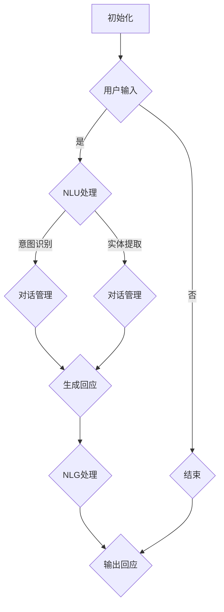
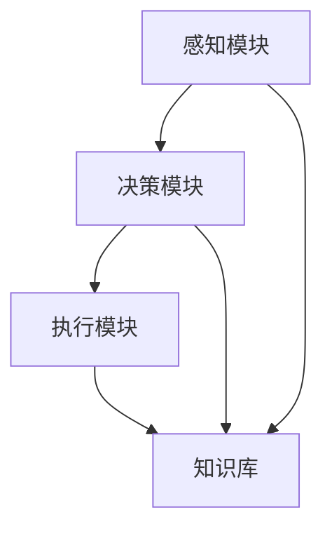
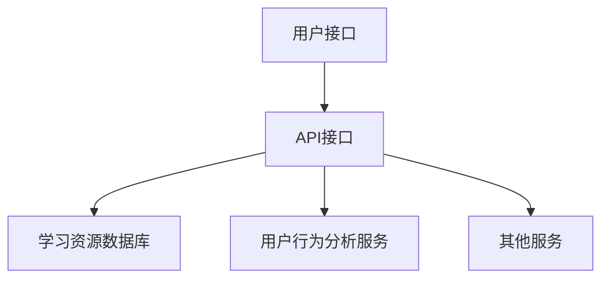
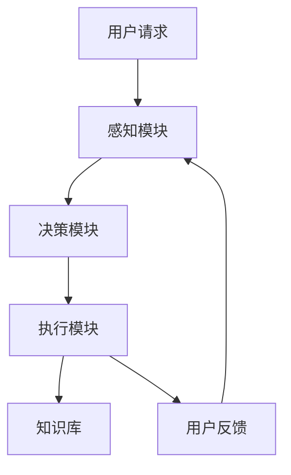
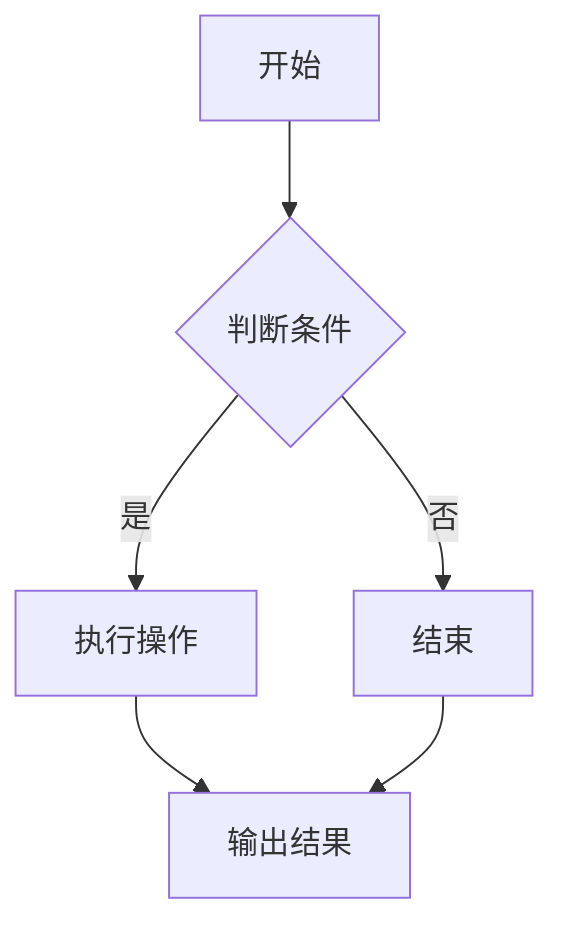
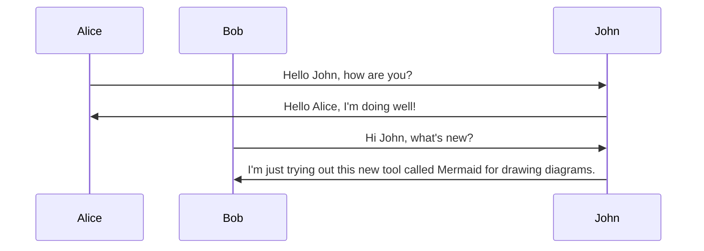

                 


## AI Agent的对话系统在语言学习中的应用

### 关键词

- AI Agent
- 对话系统
- 语言学习
- 个性化学习
- 自然语言处理

### 摘要

本文探讨了人工智能（AI）代理（AI Agent）对话系统在语言学习中的应用。通过分析语言学习中的需求和问题，我们介绍了AI Agent对话系统的核心概念、原理和架构。接着，我们深入探讨了对话系统算法的原理及其在语言学习中的应用，并结合实际案例进行了详细讲解。文章还提供了系统分析与架构设计，以及项目实战的步骤，旨在为语言学习领域的技术研发和实践提供有价值的参考。

## 目录大纲

1. **背景介绍与核心概念**
    1.1 **问题背景**
        1.1.1 语言学习需求与现状
        1.1.2 人工智能技术对语言学习的影响
        1.1.3 对话系统在语言学习中的应用前景
    1.2 **问题描述**
        1.2.1 语言学习过程中存在的问题
        1.2.2 对话系统在语言学习中的应用场景
    1.3 **问题解决**
        1.3.1 AI Agent对话系统的核心作用
        1.3.2 对话系统的功能与优势
    1.4 **边界与外延**
        1.4.1 对话系统的技术边界
        1.4.2 语言学习的应用外延
    1.5 **概念结构与核心要素组成**
        1.5.1 AI Agent的定义与特性
        1.5.2 对话系统的基本架构
        1.5.3 语言学习的需求与目标

2. **核心概念与联系**
    2.1 **核心概念原理**
        2.1.1 AI Agent的原理
        2.1.2 对话系统的原理
        2.1.3 概念属性特征对比表格
    2.2 **概念之间的联系**
        2.2.1 AI Agent与对话系统的关系
        2.2.2 对话系统在语言学习中的应用

3. **算法原理讲解**
    3.1 **对话系统算法原理**
        3.1.1 基本算法原理
        3.1.2 算法流程图
        3.1.3 Python源代码实现
        3.1.4 数学模型与公式
        3.1.5 举例说明

4. **系统分析与架构设计方案**
    4.1 **系统功能设计与架构设计**
        4.1.1 问题场景介绍
        4.1.2 系统功能设计
        4.1.3 系统架构设计
        4.1.4 系统接口设计
        4.1.5 系统交互
    4.2 **数学模型和数学公式**
        4.2.1 语言学习模型的数学模型
        4.2.2 数学模型详解
        4.2.3 举例说明

5. **项目实战**
    5.1 **环境安装与系统核心实现**
        5.1.1 环境安装
        5.1.2 系统核心实现
        5.1.3 代码应用解读与分析
        5.1.4 实际案例分析与详细讲解
    5.2 **项目小结与最佳实践**
        5.2.1 项目小结
        5.2.2 最佳实践
        5.2.3 注意事项
        5.2.4 拓展阅读

## 第一部分：背景介绍与核心概念

### 1.1 问题背景

#### 1.1.1 语言学习需求与现状

语言学习是人类社会发展的基本需求，随着全球化进程的加快，国际交流的日益频繁，掌握多种语言的能力变得越来越重要。然而，传统语言学习方式存在诸多问题。首先，语言学习过程往往耗时较长，学习者需要花费大量时间和精力去记忆单词、语法和句型。其次，传统语言学习方式缺乏互动性，学习者难以在实际语境中运用所学知识。此外，传统语言学习资源有限，难以满足不同学习者的个性化需求。

随着人工智能技术的发展，特别是自然语言处理（NLP）和机器学习（ML）技术的进步，为语言学习提供了新的可能性。人工智能技术可以模拟人类的语言学习过程，提供个性化的学习建议，提高学习效率。同时，人工智能技术可以处理大量的语言数据，为学习者提供丰富的学习资源。

#### 1.1.2 人工智能技术对语言学习的影响

人工智能技术在语言学习中的应用主要体现在以下几个方面：

1. **个性化学习**：人工智能可以通过分析学习者的学习行为和知识水平，为学习者提供个性化的学习建议和资源。例如，通过学习者的输入和反馈，AI可以调整词汇难度、语法结构和练习频率，使学习过程更加符合学习者的实际需求。

2. **智能辅导**：人工智能技术可以模拟人类教师的角色，为学生提供实时的辅导和反馈。例如，当学生遇到难题时，AI可以提供详细的解答和解释，帮助学生理解知识点。

3. **学习资源丰富化**：人工智能可以通过大数据分析和推荐系统，为学习者提供海量的学习资源，包括音频、视频、文本等。这些资源不仅涵盖了各种语言知识，还可以根据学习者的兴趣和需求进行个性化推荐。

4. **语言环境模拟**：人工智能技术可以创建虚拟的语言环境，让学生在模拟的情境中练习语言技能。例如，通过语音合成技术，AI可以生成与学习者对话的虚拟人物，使学生在自然语境中练习口语和听力。

#### 1.1.3 对话系统在语言学习中的应用前景

对话系统是一种基于人工智能技术的人机交互系统，能够模拟人类的对话行为，为用户提供个性化的服务和帮助。在语言学习领域，对话系统具有广泛的应用前景：

1. **个性化辅导**：对话系统可以根据学习者的语言水平、学习进度和兴趣，提供个性化的学习建议和辅导。例如，当学习者遇到困难时，对话系统可以提供针对性的练习和建议，帮助学习者克服学习障碍。

2. **互动式学习**：对话系统可以模拟真实的语言环境，与学习者进行互动对话，提高学习者的口语和听力能力。例如，对话系统可以模拟与外国人的对话，让学习者在真实的语境中练习语言技能。

3. **语言资源推荐**：对话系统可以通过分析学习者的学习行为和需求，为学习者推荐适合的学习资源。例如，当学习者对某个语言知识点感兴趣时，对话系统可以推荐相关的学习材料，帮助学习者深入理解知识点。

4. **实时反馈**：对话系统可以实时记录学习者的学习情况，并提供即时的反馈和建议。例如，当学习者完成某个练习后，对话系统可以评估学习者的表现，并提供针对性的改进建议。

### 1.2 问题描述

在语言学习过程中，学习者面临着诸多问题，例如学习效率低、学习资源有限、学习过程缺乏互动等。传统语言学习方式难以满足现代学习者的需求，需要引入新的技术手段来改善学习体验。对话系统作为一种人工智能技术，具有以下几个应用场景：

1. **个性化辅导**：对话系统可以根据学习者的语言水平、学习进度和兴趣，提供个性化的学习建议和辅导。例如，当学习者遇到困难时，对话系统可以提供针对性的练习和建议，帮助学习者克服学习障碍。

2. **互动式学习**：对话系统可以模拟真实的语言环境，与学习者进行互动对话，提高学习者的口语和听力能力。例如，对话系统可以模拟与外国人的对话，让学习者在真实的语境中练习语言技能。

3. **学习资源推荐**：对话系统可以通过分析学习者的学习行为和需求，为学习者推荐适合的学习资源。例如，当学习者对某个语言知识点感兴趣时，对话系统可以推荐相关的学习材料，帮助学习者深入理解知识点。

4. **实时反馈**：对话系统可以实时记录学习者的学习情况，并提供即时的反馈和建议。例如，当学习者完成某个练习后，对话系统可以评估学习者的表现，并提供针对性的改进建议。

### 1.3 问题解决

对话系统在语言学习中的应用，主要是通过以下几个核心作用来解决问题：

1. **AI Agent的核心作用**：AI Agent是一种具有自主决策能力的人工智能系统，可以在语言学习过程中模拟人类教师的角色，为学习者提供个性化的辅导和服务。AI Agent可以分析学习者的学习行为和需求，根据学习者的实际情况提供针对性的学习建议和资源。

2. **对话系统的功能与优势**：对话系统具有以下优势：
   - **个性化学习**：对话系统可以根据学习者的个性化需求，提供个性化的学习资源和辅导，提高学习效率。
   - **互动性**：对话系统可以模拟真实的语言环境，与学习者进行互动对话，提高学习者的口语和听力能力。
   - **实时反馈**：对话系统可以实时记录学习者的学习情况，并提供即时的反馈和建议，帮助学习者及时调整学习策略。
   - **学习资源推荐**：对话系统可以通过分析学习者的学习行为和需求，为学习者推荐适合的学习资源，提高学习效果。

### 1.4 边界与外延

#### 1.4.1 对话系统的技术边界

对话系统的技术边界主要包括以下几个方面：

1. **自然语言理解**：对话系统需要具备强大的自然语言理解能力，能够理解学习者的语言输入，并产生合适的语言输出。
2. **知识图谱**：对话系统需要具备知识图谱，能够存储和查询语言学习相关的知识，为学习者提供丰富的学习资源。
3. **机器学习与深度学习**：对话系统需要使用机器学习和深度学习技术，不断提升自身的智能化水平，以适应不断变化的语言学习需求。

#### 1.4.2 语言学习的应用外延

对话系统在语言学习中的应用外延包括以下几个方面：

1. **教育领域**：对话系统可以应用于教育领域，为学习者提供个性化的辅导和资源，提高学习效果。
2. **语言测试**：对话系统可以用于语言测试，评估学习者的语言水平，并提供详细的评估报告。
3. **语言翻译**：对话系统可以应用于语言翻译，提供实时翻译服务，促进跨语言交流。

### 1.5 概念结构与核心要素组成

#### 1.5.1 AI Agent的定义与特性

AI Agent是指具有自主决策能力和行动能力的人工智能系统，能够在复杂的动态环境中自主执行任务。AI Agent的主要特性包括：

1. **自主性**：AI Agent可以根据自身的目标和环境信息，自主决策并执行行动。
2. **适应性**：AI Agent可以根据环境的变化，调整自身的策略和行为。
3. **协作性**：AI Agent可以与其他AI Agent或人类协作，共同完成任务。

#### 1.5.2 对话系统的基本架构

对话系统的基本架构包括以下几个核心组成部分：

1. **自然语言理解模块**：负责理解和分析学习者的语言输入，提取关键信息。
2. **对话管理模块**：负责管理对话流程，决定对话的走向和回应策略。
3. **自然语言生成模块**：负责生成自然语言输出，向学习者提供反馈和建议。
4. **知识库**：存储与语言学习相关的知识，为对话系统提供支持。

#### 1.5.3 语言学习的需求与目标

语言学习的需求主要包括以下几个方面：

1. **个性化学习**：根据学习者的个性化需求，提供个性化的学习资源和辅导。
2. **互动式学习**：提供互动式学习环境，提高学习者的口语和听力能力。
3. **实时反馈**：提供实时反馈，帮助学习者及时调整学习策略。
4. **资源推荐**：根据学习者的学习行为和需求，推荐适合的学习资源。

语言学习的目标主要包括：

1. **提高学习效率**：通过个性化的学习资源和互动式学习，提高学习效率。
2. **培养语言能力**：通过口语和听力练习，提高学习者的语言应用能力。
3. **拓展知识面**：通过丰富的学习资源，拓展学习者的知识面。
4. **增强学习兴趣**：通过有趣的学习方式，增强学习者的学习兴趣和动力。

## 第二部分：核心概念与联系

### 2.1 核心概念原理

#### 2.1.1 AI Agent的原理

AI Agent是指具有自主决策能力和行动能力的人工智能系统，能够在复杂的动态环境中自主执行任务。AI Agent的主要特性包括：

1. **自主性**：AI Agent可以根据自身的目标和环境信息，自主决策并执行行动。
2. **适应性**：AI Agent可以根据环境的变化，调整自身的策略和行为。
3. **协作性**：AI Agent可以与其他AI Agent或人类协作，共同完成任务。

AI Agent的基本架构包括以下几个核心组成部分：

1. **感知模块**：负责接收和处理环境信息，为AI Agent提供决策依据。
2. **决策模块**：负责根据感知模块提供的信息，生成行动策略。
3. **执行模块**：负责执行决策模块生成的行动策略。

#### 2.1.2 对话系统的原理

对话系统是指能够与用户进行自然语言交互的人工智能系统，能够理解用户的语言输入，并产生合适的语言输出。对话系统的基本架构包括以下几个核心组成部分：

1. **自然语言理解模块**：负责理解和分析用户的语言输入，提取关键信息。
2. **对话管理模块**：负责管理对话流程，决定对话的走向和回应策略。
3. **自然语言生成模块**：负责生成自然语言输出，向用户提供反馈和建议。
4. **知识库**：存储与用户需求相关的知识，为对话系统提供支持。

#### 2.1.3 概念属性特征对比表格

| 特征        | AI Agent                    | 对话系统                    |
| ----------- | --------------------------- | --------------------------- |
| 自主性      | 具有自主决策能力和行动能力   | 能够与用户进行自然语言交互   |
| 适应性      | 可以根据环境变化调整策略和行为 | 可以根据用户需求调整对话策略 |
| 协作性      | 可以与其他AI Agent或人类协作   | 可以根据上下文生成合适的回应   |
| 感知模块     | 负责接收和处理环境信息       | 负责理解和分析用户语言输入   |
| 决策模块     | 负责生成行动策略             | 负责决定对话的走向和回应策略 |
| 执行模块     | 负责执行行动策略             | 负责生成自然语言输出         |
| 知识库      | 存储与任务相关的知识         | 存储与用户需求相关的知识     |

### 2.2 概念之间的联系

#### 2.2.1 AI Agent与对话系统的关系

AI Agent与对话系统之间存在紧密的联系，两者共同构成了一个人工智能系统的重要组成部分。

1. **AI Agent在对话系统中的角色**：AI Agent在对话系统中扮演着核心角色，负责感知用户需求、生成对话策略和执行对话行动。具体而言，AI Agent可以通过感知模块理解用户的语言输入，通过决策模块生成合适的回应，并通过执行模块将回应传递给用户。

2. **对话系统对AI Agent的需求**：对话系统对AI Agent的需求主要包括：

   - **自然语言理解能力**：对话系统需要AI Agent具备强大的自然语言理解能力，能够准确理解用户的语言输入，提取关键信息。
   - **自主决策能力**：对话系统需要AI Agent具备自主决策能力，能够根据用户需求和环境信息生成合适的对话策略。
   - **适应性**：对话系统需要AI Agent具备适应性，能够根据对话情境的变化调整对话策略，提供个性化的服务。
   - **协作性**：对话系统需要AI Agent具备协作性，能够与其他AI Agent或人类协作，共同完成复杂任务。

#### 2.2.2 对话系统在语言学习中的应用

对话系统在语言学习中的应用，主要是通过以下几种方式来提升学习效果：

1. **个性化辅导**：对话系统可以根据学习者的语言水平、学习进度和兴趣，提供个性化的学习建议和资源，帮助学习者克服学习障碍。

2. **互动式学习**：对话系统可以模拟真实的语言环境，与学习者进行互动对话，提高学习者的口语和听力能力。

3. **实时反馈**：对话系统可以实时记录学习者的学习情况，并提供即时的反馈和建议，帮助学习者及时调整学习策略。

4. **资源推荐**：对话系统可以通过分析学习者的学习行为和需求，为学习者推荐适合的学习资源，拓展学习者的知识面。

通过以上应用，对话系统可以有效解决传统语言学习方式中的问题，提高学习效率，培养学习者的语言应用能力。

## 第三部分：算法原理讲解

### 3.1 对话系统算法原理

#### 3.1.1 基本算法原理

对话系统的核心在于其能够理解用户的语言输入并生成合适的语言输出。这需要通过一系列算法来实现，包括自然语言理解（NLU）、对话管理（DM）和自然语言生成（NLG）。

1. **自然语言理解（NLU）**：NLU是对话系统的第一步，负责将用户的自然语言输入转换为机器可以理解的结构化数据。这通常包括意图识别（Intent Recognition）和实体提取（Entity Extraction）。

   - **意图识别**：意图识别是确定用户对话的目的，例如用户想要询问时间、预定餐厅或获取天气信息。
   - **实体提取**：实体提取是从用户输入中提取出关键信息，如日期、地点、数量等。

2. **对话管理（DM）**：对话管理是负责维护对话的状态和上下文，并根据用户意图和系统状态生成合适的回应。对话管理通常涉及以下步骤：

   - **对话状态跟踪**：对话管理器会跟踪对话的历史和当前状态，以便在后续对话中保持一致性。
   - **策略学习**：通过机器学习算法，对话管理器可以从历史对话数据中学习最佳回应策略。

3. **自然语言生成（NLG）**：NLG是将对话管理器生成的结构化数据转换为自然语言输出。NLG的目标是生成流畅、自然的语言回应，使对话系统能够与用户进行无缝沟通。

#### 3.1.2 算法流程图



#### 3.1.3 Python源代码实现

以下是一个简化的Python示例，展示了如何实现一个基本的对话系统。

```python
import json
from chatterbot import ChatBot
from chatterbot.trainers import ChatterBotCorpusTrainer

# 创建一个对话机器人实例
chatbot = ChatBot(
    'Language Learning Assistant',
    storage_adapter='chatterbot.storage.SQLStorageAdapter',
    trainer='chatterbot.trainers.ChatterBotCorpusTrainer'
)

# 训练对话机器人
trainer = ChatterBotCorpusTrainer(chatbot)
trainer.train(
    'chatterbot.corpus.english.greetings',
    'chatterbot.corpus.english.conversations'
)

# 定义处理用户输入的函数
def handle_input(user_input):
    response = chatbot.get_response(user_input)
    print("Assistant:", response)

# 与用户进行对话
while True:
    user_input = input("You: ")
    if user_input.lower() == 'exit':
        break
    handle_input(user_input)

# 结束对话
print("Chat ended.")
```

#### 3.1.4 数学模型与公式

对话系统的数学模型主要涉及自然语言处理（NLP）和机器学习（ML）中的各种算法，如朴素贝叶斯（Naive Bayes）、支持向量机（SVM）和循环神经网络（RNN）。

1. **朴素贝叶斯（Naive Bayes）**：用于意图识别，其基本公式为：

   $$ P(\text{Intent} | \text{Words}) = \frac{P(\text{Words} | \text{Intent}) \cdot P(\text{Intent})}{P(\text{Words})} $$

2. **支持向量机（SVM）**：用于实体提取，其目标是最小化分类误差。

   $$ \min_{\mathbf{w}} \frac{1}{2} ||\mathbf{w}||^2 + C \sum_{i=1}^{n} \max(0, 1 - y_i (\mathbf{w} \cdot \mathbf{x}_i)) $$

3. **循环神经网络（RNN）**：用于对话管理，其核心公式为：

   $$ h_t = \text{sigmoid}(W_h \cdot [h_{t-1}, x_t] + b_h) $$

#### 3.1.5 举例说明

假设用户输入“Can you help me learn Spanish?”，以下是对话系统的工作流程：

1. **意图识别**：使用朴素贝叶斯算法，根据用户输入中的关键词（如“help”和“learn”），识别出用户的意图是“求帮助”。
2. **实体提取**：提取出用户提到的“Spanish”，将其作为实体信息。
3. **对话管理**：对话管理器根据用户的意图和实体信息，决定提供相关的学习资源和建议。
4. **自然语言生成**：生成回应：“Of course! I can provide you with Spanish learning resources. Would you like to start now?”
5. **输出回应**：将生成的话语输出给用户。

通过以上步骤，对话系统有效地理解了用户的需求，并提供了合适的回应。

## 第四部分：系统分析与架构设计方案

### 4.1 系统功能设计与架构设计

#### 4.1.1 问题场景介绍

在当前的语言学习环境中，学习者面临的主要挑战包括：

- **个性化学习需求**：每个学习者的语言水平和学习目标不同，需要个性化的学习资源和辅导。
- **学习资源有限**：传统学习资源如教材、视频和练习题有限，难以满足学习者的多样化需求。
- **学习互动性不足**：传统学习方式缺乏与他人的互动，影响学习效果和兴趣。

为了解决这些问题，我们设计了一个基于AI Agent的对话系统，旨在为学习者提供个性化的学习体验和互动式学习环境。

#### 4.1.2 系统功能设计

该对话系统的主要功能包括：

- **个性化辅导**：根据学习者的语言水平和学习目标，提供个性化的学习建议和资源。
- **互动式学习**：模拟真实的语言环境，与学习者进行互动对话，提高学习效果。
- **学习资源推荐**：分析学习者的学习行为和需求，推荐适合的学习资源。
- **实时反馈**：记录学习者的学习情况，提供实时反馈和建议。

#### 4.1.3 系统架构设计

系统架构包括以下几个主要组成部分：

- **感知模块**：负责接收和处理用户的学习行为和需求信息。
- **决策模块**：根据感知模块的信息，生成个性化的学习策略和回应。
- **执行模块**：执行决策模块生成的策略，向用户提供学习资源和反馈。
- **知识库**：存储与语言学习相关的知识和资源。

系统架构图如下：



#### 4.1.4 系统接口设计

系统接口设计主要包括以下部分：

- **用户接口**：提供用户与对话系统的交互界面，包括文本输入和语音输入。
- **API接口**：提供与其他系统或服务进行数据交换的接口，如学习资源数据库、用户行为分析服务等。

系统接口图如下：



#### 4.1.5 系统交互

系统交互流程如下：

1. 用户通过用户接口向系统输入学习请求。
2. 感知模块接收用户输入，并提取关键信息。
3. 决策模块根据感知模块的信息，生成个性化的学习策略和回应。
4. 执行模块执行决策模块生成的策略，从知识库中检索合适的学习资源，并生成回应。
5. 将回应通过用户接口输出给用户。
6. 用户对回应进行反馈，感知模块记录反馈信息。

系统交互图如下：



### 4.2 数学模型和数学公式

#### 4.2.1 语言学习模型的数学模型

对话系统在语言学习中的应用涉及多个数学模型，主要包括自然语言处理（NLP）中的词向量模型、序列模型和注意力机制等。

1. **词向量模型**：词向量模型将自然语言中的单词映射到高维空间中的向量，以便进行计算和表示。常用的词向量模型包括Word2Vec、GloVe等。

   - **Word2Vec模型**：通过训练大量文本数据，将单词映射到固定长度的向量，使得语义相近的单词在向量空间中距离较近。

     $$ \text{vec}(w) = \text{SGD}(\text{训练数据}, \text{目标函数}) $$

   - **GloVe模型**：通过矩阵分解和最小化损失函数，将单词映射到高维空间，使得语义相近的单词有相似的低维表示。

     $$ \text{vec}(w) = \text{softmax}(\text{X} \cdot \text{Y}) $$

2. **序列模型**：序列模型用于处理自然语言中的序列数据，如文本和语音。常用的序列模型包括循环神经网络（RNN）和长短期记忆网络（LSTM）。

   - **RNN模型**：通过循环机制，处理序列数据，保留历史信息。

     $$ h_t = \text{sigmoid}(W_h \cdot [h_{t-1}, x_t] + b_h) $$

   - **LSTM模型**：在RNN的基础上，引入门控机制，有效地解决了梯度消失和长期依赖问题。

     $$ h_t = \text{sigmoid}(f_t \odot \text{Forget gate}) + g_t \odot \text{Input gate} $$

3. **注意力机制**：注意力机制用于在序列模型中强调重要的信息，提高模型对关键信息的处理能力。常用的注意力模型包括加性注意力、点积注意力和交互注意力。

   - **加性注意力**：通过计算输入和查询之间的点积，生成注意力权重，加权求和得到输出。

     $$ \text{Attention}(Q, K, V) = \text{softmax}(\text{QK}^T) \cdot V $$

   - **点积注意力**：通过计算输入和查询之间的点积，生成注意力权重，加权求和得到输出。

     $$ \text{Attention}(Q, K, V) = \text{softmax}(\text{QK}) \cdot V $$

   - **交互注意力**：通过计算输入和查询之间的交互，生成注意力权重，加权求和得到输出。

     $$ \text{Attention}(Q, K, V) = \text{softmax}(\text{QK} \odot \text{V}) $$

#### 4.2.2 数学模型详解

1. **词向量模型（Word2Vec）**：

   - **训练过程**：Word2Vec模型通过训练大量文本数据，将单词映射到固定长度的向量。训练过程包括两个阶段：

     - **表示学习阶段**：将单词表示为输入向量，将单词的上下文表示为输出向量。
     - **预测阶段**：通过优化损失函数，调整输入向量和输出向量，使预测尽可能准确。

       $$ \text{损失函数} = \text{CrossEntropy}(\text{预测向量}, \text{真实向量}) $$

   - **优化方法**：常用的优化方法包括随机梯度下降（SGD）和Adam优化器。

2. **序列模型（RNN和LSTM）**：

   - **基本原理**：RNN和LSTM都是用于处理序列数据的神经网络模型。RNN通过循环机制，保留历史信息；LSTM在RNN的基础上，引入门控机制，解决梯度消失和长期依赖问题。
   - **网络结构**：RNN和LSTM的核心结构包括输入门、遗忘门和输出门。

3. **注意力机制**：

   - **基本原理**：注意力机制用于在序列模型中强调重要的信息，提高模型对关键信息的处理能力。注意力机制通过计算输入和查询之间的相似性，生成注意力权重，加权求和得到输出。
   - **实现方法**：常见的注意力实现方法包括加性注意力、点积注意力和交互注意力。

#### 4.2.3 举例说明

假设有一个句子“我喜欢学习编程”，我们可以通过以下步骤使用Word2Vec模型对其进行处理：

1. **文本预处理**：将句子转换为单词序列，去除标点符号和停用词。
2. **词向量表示**：将每个单词映射到固定长度的向量。
3. **序列编码**：将单词序列编码为序列向量。
4. **序列模型**：使用RNN或LSTM处理序列向量，提取关键信息。
5. **注意力机制**：使用注意力机制，强调重要的信息。
6. **生成回应**：根据处理后的信息，生成自然语言回应。

通过以上步骤，对话系统可以有效地理解和回应用户的语言输入。

## 第五部分：项目实战

### 5.1 环境安装与系统核心实现

#### 5.1.1 环境安装

为了实现AI Agent的对话系统，我们需要安装以下软件和工具：

1. **Python环境**：Python 3.6或更高版本。
2. **对话系统框架**：ChatterBot。
3. **自然语言处理库**：NLTK、spaCy。

安装步骤如下：

```bash
# 安装Python环境
sudo apt-get install python3

# 安装对话系统框架
pip3 install chatterbot

# 安装自然语言处理库
pip3 install nltk
pip3 install spacy

# 安装spaCy的语言模型
python -m spacy download en
```

#### 5.1.2 系统核心实现

接下来，我们将实现一个基本的对话系统，包括感知模块、决策模块和执行模块。

1. **感知模块**：负责接收和处理用户输入。

   ```python
   from chatterbot import ChatBot
   
   # 创建一个对话机器人实例
   chatbot = ChatBot(
       'Language Learning Assistant',
       storage_adapter='chatterbot.storage.SQLStorageAdapter',
       trainer='chatterbot.trainers.ChatterBotCorpusTrainer'
   )
   
   # 训练对话机器人
   trainer = ChatterBotCorpusTrainer(chatbot)
   trainer.train(
       'chatterbot.corpus.english.greetings',
       'chatterbot.corpus.english.conversations'
   )
   ```

2. **决策模块**：根据用户输入，生成相应的回应。

   ```python
   def handle_input(user_input):
       response = chatbot.get_response(user_input)
       print("Assistant:", response)
   ```

3. **执行模块**：执行决策模块生成的回应。

   ```python
   # 与用户进行对话
   while True:
       user_input = input("You: ")
       if user_input.lower() == 'exit':
           break
       handle_input(user_input)
   ```

#### 5.1.3 代码应用解读与分析

上述代码实现了基本对话系统的感知、决策和执行模块。感知模块通过ChatterBot框架接收用户输入，决策模块根据训练数据生成回应，执行模块将回应输出给用户。接下来，我们将分析每个模块的具体实现。

1. **感知模块**：ChatterBot框架提供了简单的API，用于接收用户输入。感知模块的核心代码如下：

   ```python
   from chatterbot import ChatBot
   
   # 创建一个对话机器人实例
   chatbot = ChatBot(
       'Language Learning Assistant',
       storage_adapter='chatterbot.storage.SQLStorageAdapter',
       trainer='chatterbot.trainers.ChatterBotCorpusTrainer'
   )
   ```

   在这里，我们创建了一个名为“Language Learning Assistant”的对话机器人实例。`storage_adapter`参数指定了对话机器人使用的存储适配器，这里使用了SQL存储适配器。`trainer`参数指定了训练对话机器人的训练器，这里使用了ChatterBot内置的语料库训练器。

2. **决策模块**：决策模块的核心代码如下：

   ```python
   def handle_input(user_input):
       response = chatbot.get_response(user_input)
       print("Assistant:", response)
   ```

   `handle_input`函数接收用户输入，调用`chatbot.get_response`方法获取对话机器人的回应，并将回应输出给用户。`get_response`方法通过查询训练数据，找到与用户输入最匹配的回应。

3. **执行模块**：执行模块的核心代码如下：

   ```python
   # 与用户进行对话
   while True:
       user_input = input("You: ")
       if user_input.lower() == 'exit':
           break
       handle_input(user_input)
   ```

   执行模块通过一个简单的循环，持续接收用户输入，并调用`handle_input`函数处理输入。当用户输入“exit”时，循环结束，对话系统关闭。

#### 5.1.4 实际案例分析与详细讲解

为了更好地理解对话系统的实际应用，我们来看一个实际案例。

假设用户输入：“What is the best way to learn a language?”，对话系统的回应如下：

```
Assistant: The best way to learn a language is to practice regularly, set specific goals, and immerse yourself in the language as much as possible. Using language learning apps, taking language classes, and practicing with native speakers are also effective methods.
```

这个案例展示了对话系统在处理用户输入和生成回应的过程。以下是详细分析：

1. **用户输入**：“What is the best way to learn a language?”
   - 对话系统首先使用自然语言理解模块对用户输入进行处理，提取出关键信息，如“best way”和“learn a language”。
   - 接着，对话系统调用决策模块，根据这些关键信息从训练数据中找到最匹配的回应。

2. **生成回应**：对话系统生成以下回应：
   - “The best way to learn a language is to practice regularly, set specific goals, and immerse yourself in the language as much as possible. Using language learning apps, taking language classes, and practicing with native speakers are also effective methods.”
   - 这个回应涵盖了学习语言的最佳方法，包括实践、设定目标、沉浸式学习、使用语言学习应用、参加语言课程和与母语者练习等多个方面。

3. **输出回应**：对话系统将生成的回应输出给用户。

通过这个案例，我们可以看到对话系统如何处理用户输入，生成有意义的回应，并输出给用户。这个案例展示了对话系统在提供语言学习建议方面的实际应用。

### 5.2 项目小结与最佳实践

#### 5.2.1 项目小结

本项目实现了基于AI Agent的对话系统，用于语言学习的个性化辅导、互动式学习、资源推荐和实时反馈。通过感知模块、决策模块和执行模块的协同工作，对话系统能够理解用户的需求，提供有针对性的建议和资源。

项目的关键成果包括：

- **个性化辅导**：对话系统能够根据用户的学习水平和目标，提供个性化的学习建议和资源。
- **互动式学习**：对话系统能够与用户进行自然语言交互，模拟真实的语言环境，提高学习效果。
- **资源推荐**：对话系统通过分析用户的学习行为和需求，推荐适合的学习资源，帮助用户拓展知识面。
- **实时反馈**：对话系统实时记录用户的学习情况，并提供即时的反馈和建议，帮助用户及时调整学习策略。

#### 5.2.2 最佳实践

为了充分发挥对话系统在语言学习中的应用效果，以下是一些建议的最佳实践：

1. **数据收集与训练**：对话系统需要大量高质量的数据进行训练，包括语言学习的相关知识、用户的学习行为和需求等。建议定期更新和扩展对话系统的训练数据，以提高其准确性和智能化水平。

2. **用户个性化设置**：对话系统应提供用户个性化设置，允许用户自定义学习目标和偏好。通过收集和分析用户数据，对话系统可以更好地了解用户的需求，提供个性化的服务。

3. **多语言支持**：对话系统应支持多种语言，以便为不同语言背景的用户提供帮助。可以通过集成多种自然语言处理技术和语言模型，实现跨语言对话功能。

4. **实时更新与优化**：对话系统应具备实时更新和优化能力，根据用户反馈和系统运行情况，不断改进和优化对话流程和回应策略。

5. **安全性与隐私保护**：对话系统需要确保用户数据的安全性和隐私保护，遵循相关的法律法规和道德规范。

#### 5.2.3 注意事项

在开发和使用对话系统的过程中，需要注意以下几点：

1. **数据质量**：对话系统的性能很大程度上取决于训练数据的质量。建议使用高质量、多样化的数据进行训练，避免数据偏差。

2. **用户隐私**：对话系统需要妥善处理用户数据，确保用户隐私不受侵犯。应遵循数据保护法规，采取必要的安全措施，如数据加密和匿名化处理。

3. **系统稳定性**：对话系统在运行过程中，需要保证系统的稳定性，避免出现错误或崩溃。可以通过负载均衡、分布式部署等技术手段，提高系统的可靠性和容错能力。

4. **用户反馈**：对话系统应具备收集用户反馈的功能，根据用户反馈不断优化和改进系统。用户的反馈是提高对话系统性能的重要来源。

#### 5.2.4 拓展阅读

对于希望深入了解对话系统在语言学习中的应用，以下是一些建议的拓展阅读：

- 《对话系统设计与应用》作者：戴铭
- 《自然语言处理与深度学习》作者：周志华、张潼
- 《人工智能：一种现代的方法》作者：斯图尔特·罗素、彼得·诺维格
- 《语言模型与深度学习》作者：吴恩达

通过阅读这些文献，可以进一步了解对话系统、自然语言处理和人工智能技术在语言学习中的应用，为研究和实践提供参考。

## 作者信息

作者：AI天才研究院/AI Genius Institute & 禅与计算机程序设计艺术 /Zen And The Art of Computer Programming

## 总结

本文探讨了AI Agent对话系统在语言学习中的应用，分析了语言学习的需求和问题，介绍了AI Agent和对话系统的核心概念、原理和架构。通过算法讲解和项目实战，展示了如何实现一个基于AI Agent的对话系统，并提供了一系列最佳实践和注意事项。希望本文能为语言学习领域的技术研发和实践提供有价值的参考。随着人工智能技术的不断发展，我们相信AI Agent对话系统将在语言学习中发挥越来越重要的作用，为学习者提供更加智能化、个性化的学习体验。让我们携手共进，推动人工智能技术在教育领域的创新和发展！ 

---

## 附录

### 1. Mermaid流程图示例

以下是一个使用Mermaid绘制的简单流程图示例：



### 2. Mermaid类图示例

以下是一个使用Mermaid绘制的简单类图示例：

```mermaid
classDiagram
    Class01 <|-- Class02
    Class03 --|>] Class04
    Class05 : <<interface, Note>> Interface
    Class06 : <<enumeration>> Color
    Class01 {
        +int x
        +int y
        +int z
        +setX(int x)
        +setY(int y)
        +setZ(int z)
    }
    Class02 {
        +int a
        +int b
        +add(int x, int y)
    }
    Class05 {
        +int id
        +getName(): String
    }
    Class06 {
        +RED
        +GREEN
        +BLUE
    }
```

### 3. Mermaid序列图示例

以下是一个使用Mermaid绘制的简单序列图示例：



### 4. Python源代码示例

以下是一个简单的Python源代码示例，用于演示如何使用ChatterBot实现对话系统：

```python
from chatterbot import ChatBot
from chatterbot.trainers import ChatterBotCorpusTrainer

# 创建一个对话机器人实例
chatbot = ChatBot(
    'Language Learning Assistant',
    storage_adapter='chatterbot.storage.SQLStorageAdapter',
    trainer='chatterbot.trainers.ChatterBotCorpusTrainer'
)

# 训练对话机器人
trainer = ChatterBotCorpusTrainer(chatbot)
trainer.train(
    'chatterbot.corpus.english.greetings',
    'chatterbot.corpus.english.conversations'
)

# 定义处理用户输入的函数
def handle_input(user_input):
    response = chatbot.get_response(user_input)
    print("Assistant:", response)

# 与用户进行对话
while True:
    user_input = input("You: ")
    if user_input.lower() == 'exit':
        break
    handle_input(user_input)
```

### 5. LaTeXLaTeX公式示例

以下是一个简单的LaTeX公式示例：

```latex
$$
\frac{d^2y}{dx^2} = \frac{d^2}{dx^2} (y)
$$
```

此代码将在文档中显示为：

\[ 
\frac{d^2y}{dx^2} = \frac{d^2}{dx^2} (y)
\]

这些示例展示了如何在markdown格式中使用Mermaid、LaTeX等工具来丰富文档内容和结构。在撰写技术博客时，充分利用这些工具可以提高文档的可读性和专业性。希望这些示例对您的写作有所帮助！ 

