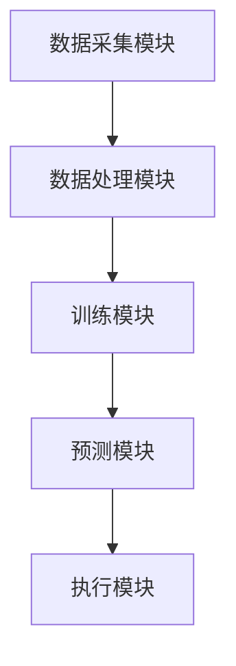
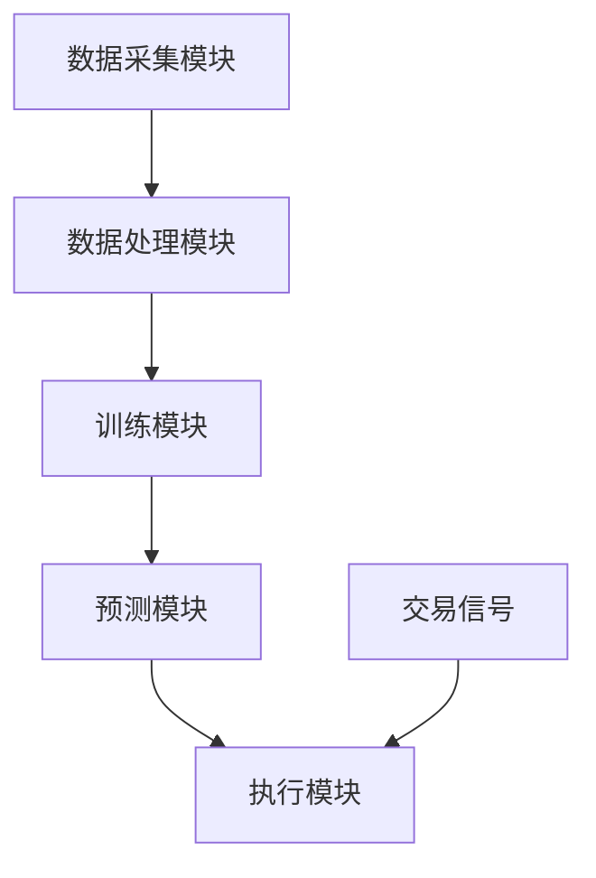

                 

# AI Agent的强化学习在金融交易中的应用

## 关键词
- AI Agent
- 强化学习
- 金融交易
- 强化学习算法
- 系统架构设计

## 摘要
本文深入探讨了AI Agent的强化学习在金融交易中的应用。首先，我们介绍了强化学习的基本原理及其在金融交易中的重要性。接着，我们详细讲解了AI Agent的定义及其在金融交易中的应用场景。随后，我们分析了强化学习算法在金融交易中的实现，包括Q-Learning、SARSA和Deep Q-Network（DQN）算法。最后，我们介绍了系统架构设计、项目实战以及最佳实践，为读者提供了完整的实现指南。

## 目录

### 第一部分：引言

#### 第1章 AI Agent的强化学习背景

#### 第2章 强化学习原理与算法

#### 第3章 金融交易中的AI Agent应用

#### 第4章 强化学习算法在金融交易中的实现

#### 第5章 系统架构设计

#### 第6章 项目实战

#### 第7章 最佳实践与总结

----------------------------------------------------------------

### 第1章 AI Agent的强化学习背景

#### 1.1 问题背景

金融交易是一个复杂且高风险的领域，其波动性和不确定性使得传统交易策略面临巨大挑战。随着人工智能技术的不断发展，特别是强化学习算法的兴起，金融交易领域开始探索利用AI Agent进行交易的可能性。强化学习算法通过模仿人类决策过程，使AI Agent能够在动态环境中学习并优化决策策略，从而提高交易效率和收益。

#### 1.2 问题描述

在金融交易中，AI Agent需要解决的主要问题包括：

- **环境建模**：金融市场是一个高度复杂且动态变化的环境，AI Agent需要能够实时感知市场变化并做出相应决策。
- **策略优化**：AI Agent需要通过学习市场数据，不断优化其交易策略，以适应不同市场情况。
- **风险控制**：在保证收益的同时，AI Agent还需要有效控制交易风险，避免因市场波动导致的大额损失。

#### 1.3 问题解决

强化学习算法提供了一种可能的解决方案。通过在动态环境中进行试错学习，AI Agent可以逐步优化其交易策略。此外，强化学习算法还具备以下优势：

- **自适应能力**：AI Agent能够根据市场变化自适应调整交易策略。
- **多目标优化**：强化学习算法不仅可以优化收益目标，还可以同时考虑风险控制等其他目标。

#### 1.4 边界与外延

强化学习在金融交易中的应用仍面临一些挑战，包括：

- **数据隐私**：金融交易数据属于敏感信息，如何确保数据安全和隐私是一个重要问题。
- **计算资源**：强化学习算法通常需要大量的计算资源，特别是在处理大规模数据时。
- **监管合规**：金融交易领域受到严格监管，AI Agent的行为需要符合相关法律法规。

### 第2章 强化学习原理与算法

#### 2.1 强化学习基础

强化学习（Reinforcement Learning，RL）是一种机器学习范式，其核心思想是通过奖励机制驱动智能体（Agent）在环境（Environment）中学习最优策略（Policy）。强化学习的关键元素包括：

- **智能体（Agent）**：执行动作并接收环境反馈的实体。
- **环境（Environment）**：智能体执行动作的场所。
- **状态（State）**：智能体在环境中的当前情况。
- **动作（Action）**：智能体可以执行的行为。
- **奖励（Reward）**：对智能体动作的反馈，通常用于指导智能体的学习过程。

#### 2.2 强化学习算法

强化学习算法主要包括以下几种：

- **Q-Learning算法**：通过更新Q值来学习最优策略。
  - **Q值（Q-Value）**：表示在特定状态下执行特定动作的预期回报。
  - **更新规则**：$$ Q(s, a) = Q(s, a) + \alpha [r + \gamma \max_{a'} Q(s', a') - Q(s, a)] $$
  - **举例**：假设智能体在状态s中选择动作a，得到奖励r，同时环境转移到状态s'，则Q(s, a)将根据上述公式更新。

- **SARSA算法**：一种基于值迭代的强化学习算法。
  - **SARSA（Symmetric Advantage Rescorrelation）**：智能体在执行动作的同时更新Q值。
  - **更新规则**：$$ Q(s, a) = Q(s, a) + \alpha [r + \gamma Q(s', a')] - Q(s, a)] $$
  - **举例**：与Q-Learning类似，但SARSA在每一步都更新Q值，而不是像Q-Learning那样在目标状态更新Q值。

- **Deep Q-Network（DQN）算法**：一种基于深度学习的强化学习算法。
  - **DQN（Deep Q-Network）**：使用深度神经网络来估计Q值。
  - **目标网络（Target Network）**：用于稳定训练过程，减少Q值的方差。
  - **更新规则**：$$ Q(s, a) = Q(s, a) + \alpha [r + \gamma \max_{a'} \hat{Q}(s', a') - Q(s, a)] $$
  - **举例**：DQN通过训练深度神经网络来估计Q值，并在每次更新时使用目标网络来提高训练稳定性。

#### 2.3 强化学习算法在金融交易中的应用

强化学习算法在金融交易中的应用主要体现在以下几个方面：

- **策略学习**：通过模拟交易场景，AI Agent可以学习到最优交易策略。
- **风险控制**：AI Agent可以实时监控市场变化，并根据风险偏好调整交易策略。
- **自适应能力**：AI Agent能够根据市场动态调整交易策略，提高交易效率。

### 第3章 金融交易中的AI Agent应用

#### 3.1 AI Agent的基本概念

AI Agent是一种能够自主决策和执行任务的智能体。在金融交易中，AI Agent通常具备以下特征：

- **自主性**：AI Agent能够独立执行交易任务，无需人工干预。
- **学习性**：AI Agent能够通过历史交易数据不断优化交易策略。
- **鲁棒性**：AI Agent能够在不同市场环境下稳定运行，不受单一市场波动影响。

#### 3.2 强化学习在AI Agent中的应用

强化学习在AI Agent中的应用主要体现在以下几个方面：

- **策略优化**：AI Agent通过学习历史交易数据，优化交易策略，提高交易收益。
- **风险控制**：AI Agent能够实时监控市场风险，并调整交易策略以降低风险。
- **多目标优化**：AI Agent可以同时考虑收益和风险，实现多目标优化。

#### 3.3 AI Agent在金融交易中的表现

AI Agent在金融交易中的表现具有以下特点：

- **高效性**：AI Agent能够快速响应市场变化，提高交易效率。
- **稳定性**：AI Agent能够在不同市场环境下稳定运行，降低风险。
- **可持续性**：AI Agent能够通过持续学习，不断提高交易能力。

### 第4章 强化学习算法在金融交易中的实现

#### 4.1 强化学习算法的实现

强化学习算法在金融交易中的实现包括以下几个步骤：

1. **数据收集**：收集历史交易数据，包括价格、成交量、市场情绪等。
2. **状态表示**：将交易数据转化为状态表示，以便AI Agent进行学习。
3. **动作空间定义**：定义AI Agent可以执行的动作空间，如买入、卖出、持有等。
4. **奖励函数设计**：设计奖励函数，用于评估AI Agent的交易效果。
5. **训练过程**：使用强化学习算法对AI Agent进行训练，优化交易策略。

#### 4.2 Q-Learning算法的实现

Q-Learning算法的实现步骤如下：

1. **初始化Q表**：初始化Q表，用于存储每个状态和动作的Q值。
2. **选择动作**：在给定状态下，根据当前Q值选择最优动作。
3. **更新Q值**：根据奖励和下一状态更新Q值。
4. **重复训练**：重复以上步骤，直到满足停止条件。

Python代码示例：

```python
import numpy as np

# 初始化Q表
Q = np.zeros((n_states, n_actions))

# 设置学习率α和折扣因子γ
alpha = 0.1
gamma = 0.9

# 设置训练轮数
n_episodes = 1000

# 开始训练
for episode in range(n_episodes):
    state = env.reset()
    done = False
    
    while not done:
        # 选择动作
        action = np.argmax(Q[state])
        
        # 执行动作
        next_state, reward, done = env.step(action)
        
        # 更新Q值
        Q[state, action] = Q[state, action] + alpha * (reward + gamma * np.max(Q[next_state]) - Q[state, action])
        
        state = next_state

# 输出最终Q表
print(Q)
```

#### 4.3 SARSA算法的实现

SARSA算法的实现步骤如下：

1. **初始化Q表**：初始化Q表，用于存储每个状态和动作的Q值。
2. **选择动作**：在给定状态下，根据当前Q值选择最优动作。
3. **执行动作**：执行选择好的动作，并观察下一状态和奖励。
4. **更新Q值**：根据奖励和下一状态更新Q值。
5. **重复训练**：重复以上步骤，直到满足停止条件。

Python代码示例：

```python
import numpy as np

# 初始化Q表
Q = np.zeros((n_states, n_actions))

# 设置学习率α和折扣因子γ
alpha = 0.1
gamma = 0.9

# 设置训练轮数
n_episodes = 1000

# 开始训练
for episode in range(n_episodes):
    state = env.reset()
    done = False
    
    while not done:
        # 选择动作
        action = np.argmax(Q[state])
        
        # 执行动作
        next_state, reward, done = env.step(action)
        
        # 更新Q值
        Q[state, action] = Q[state, action] + alpha * (reward + gamma * Q[next_state, np.argmax(Q[next_state])] - Q[state, action])
        
        state = next_state

# 输出最终Q表
print(Q)
```

#### 4.4 DQN算法的实现

DQN算法的实现步骤如下：

1. **初始化深度神经网络**：初始化用于估计Q值的深度神经网络。
2. **初始化目标网络**：初始化用于稳定训练过程的目标网络。
3. **选择动作**：在给定状态下，使用深度神经网络估计Q值，并选择最优动作。
4. **执行动作**：执行选择好的动作，并观察下一状态和奖励。
5. **更新目标网络**：根据训练过程更新目标网络。
6. **重复训练**：重复以上步骤，直到满足停止条件。

Python代码示例：

```python
import tensorflow as tf
import numpy as np

# 定义深度神经网络
def create_q_network(input_shape, n_actions):
    model = tf.keras.Sequential([
        tf.keras.layers.Dense(64, activation='relu', input_shape=input_shape),
        tf.keras.layers.Dense(64, activation='relu'),
        tf.keras.layers.Dense(n_actions, activation='linear')
    ])
    return model

# 创建Q网络和目标网络
q_network = create_q_network(input_shape, n_actions)
target_network = create_q_network(input_shape, n_actions)

# 设置学习率α和折扣因子γ
alpha = 0.001
gamma = 0.9

# 设置训练轮数
n_episodes = 1000

# 开始训练
for episode in range(n_episodes):
    state = env.reset()
    done = False
    
    while not done:
        # 选择动作
        state_tensor = tf.convert_to_tensor(state, dtype=tf.float32)
        state_tensor = tf.expand_dims(state_tensor, 0)
        q_values = q_network(state_tensor)
        action = np.argmax(q_values.numpy()[0])
        
        # 执行动作
        next_state, reward, done = env.step(action)
        
        # 更新Q值
        next_state_tensor = tf.convert_to_tensor(next_state, dtype=tf.float32)
        next_state_tensor = tf.expand_dims(next_state_tensor, 0)
        next_q_values = target_network(next_state_tensor)
        target_value = reward + gamma * np.max(next_q_values.numpy()[0])
        
        # 更新Q网络
        with tf.GradientTape() as tape:
            q_values = q_network(state_tensor)
            loss = tf.keras.losses.mean_squared_error(q_values.numpy()[0], target_value)
        
        grads = tape.gradient(loss, q_network.trainable_variables)
        optimizer.apply_gradients(zip(grads, q_network.trainable_variables))
        
        state = next_state

# 更新目标网络
target_network.load_weights(q_network.get_weights())

# 输出最终Q网络和目标网络
print(q_network.get_weights())
print(target_network.get_weights())
```

### 第5章 系统架构设计

#### 5.1 问题场景介绍

在金融交易中，AI Agent需要处理大量的数据，包括历史价格、成交量、市场情绪等。这些数据通过数据采集模块获取，然后存储在数据库中。AI Agent从数据库中读取数据，进行预处理和特征提取，然后使用强化学习算法进行训练和预测。最后，AI Agent将交易策略发送给执行模块，由执行模块负责执行具体的交易操作。

#### 5.2 项目介绍

本项目的目标是构建一个基于强化学习的金融交易系统，实现AI Agent在股票市场中的自动交易。系统主要包括以下模块：

- **数据采集模块**：负责从各种数据源获取金融交易数据。
- **数据处理模块**：负责对采集到的数据进行预处理和特征提取。
- **训练模块**：负责使用强化学习算法对AI Agent进行训练。
- **预测模块**：负责使用训练好的AI Agent进行交易预测。
- **执行模块**：负责执行具体的交易操作。

#### 5.3 系统功能设计

系统功能设计主要包括以下方面：

- **数据采集**：从各种数据源（如股票交易所、金融数据提供商等）获取金融交易数据。
- **数据处理**：对采集到的金融交易数据进行预处理，包括数据清洗、归一化、特征提取等。
- **模型训练**：使用强化学习算法对AI Agent进行训练，优化交易策略。
- **模型预测**：使用训练好的AI Agent进行交易预测，生成交易信号。
- **交易执行**：根据交易信号执行具体的交易操作，如买入、卖出等。

#### 5.4 系统架构设计

系统架构设计如下图所示：



#### 5.5 系统模块划分

系统模块划分如下：

- **数据采集模块**：负责从各种数据源获取金融交易数据，包括股票交易所、金融数据提供商等。
- **数据处理模块**：负责对采集到的金融交易数据进行预处理和特征提取，为训练模块提供输入数据。
- **训练模块**：负责使用强化学习算法对AI Agent进行训练，生成最优交易策略。
- **预测模块**：负责使用训练好的AI Agent进行交易预测，生成交易信号。
- **执行模块**：负责根据交易信号执行具体的交易操作，如买入、卖出等。

#### 5.6 系统接口设计

系统接口设计如下：

- **数据采集接口**：用于从数据源获取金融交易数据。
- **数据处理接口**：用于对采集到的金融交易数据进行预处理和特征提取。
- **训练接口**：用于启动训练过程，训练AI Agent。
- **预测接口**：用于使用训练好的AI Agent进行交易预测。
- **执行接口**：用于根据交易信号执行具体的交易操作。

#### 5.7 系统交互设计

系统交互设计如下图所示：



### 第6章 项目实战

#### 6.1 环境安装

在本章中，我们将介绍如何搭建强化学习在金融交易中的应用环境。首先，确保您的系统上已经安装了Python 3.7或更高版本。然后，使用以下命令安装所需的库：

```bash
pip install numpy tensorflow pandas sklearn matplotlib
```

#### 6.2 系统核心实现

在本节中，我们将实现一个简单的强化学习金融交易系统。系统的主要功能包括数据采集、数据处理、模型训练和交易执行。

1. **数据采集**：使用Python的pandas库从股票交易所获取历史交易数据。

```python
import pandas as pd

def get_stock_data(symbol, start_date, end_date):
    data = pd.read_csv(f"{symbol}_data.csv", index_col=0, parse_dates=True)
    return data[data.index >= start_date][data.index <= end_date]
```

2. **数据处理**：对采集到的股票交易数据进行预处理和特征提取。

```python
def preprocess_data(data):
    data["return"] = data["close"].pct_change()
    data["volatility"] = data["close"].rolling(window=5).std()
    return data
```

3. **模型训练**：使用Q-Learning算法训练AI Agent。

```python
import numpy as np

def q_learning(data, alpha, gamma, n_episodes):
    n_states = len(data.columns) - 1
    n_actions = 3  # 买入、卖出、持有
    Q = np.zeros((n_states, n_actions))
    
    for episode in range(n_episodes):
        state = data.head(1).values
        done = False
        
        while not done:
            action = np.argmax(Q[state])
            
            if action == 0:  # 买入
                data.loc[0, "position"] = 1
            elif action == 1:  # 卖出
                data.loc[0, "position"] = 0
            else:  # 持有
                pass
            
            next_state = data.head(1).values
            reward = calculate_reward(data, state, next_state)
            done = True if reward != 0 else False
            
            Q[state, action] = Q[state, action] + alpha * (reward + gamma * np.max(Q[next_state]) - Q[state, action])
            
            state = next_state
            
    return Q
```

4. **交易执行**：根据训练好的AI Agent执行交易操作。

```python
def execute_trades(Q, data):
    state = data.head(1).values
    position = data.loc[0, "position"]
    
    while not data.empty:
        action = np.argmax(Q[state])
        
        if action == 0 and position == 0:
            data.loc[0, "position"] = 1
            print("Buy")
        elif action == 1 and position == 1:
            data.loc[0, "position"] = 0
            print("Sell")
        else:
            pass
        
        state = data.head(1).values
        
        if data.index[-1].date() == pd.to_datetime("2022-12-31"):
            break
        
        data = data.drop(index=0)
    
    return data
```

#### 6.3 代码应用解读与分析

在本节中，我们将对上述代码进行详细解读和分析。

1. **数据采集**：使用pandas库从股票交易所获取历史交易数据。代码`get_stock_data`函数接收股票代码、开始日期和结束日期作为输入，返回处理后的股票数据。

2. **数据处理**：使用pandas库对采集到的股票交易数据进行预处理和特征提取。代码`preprocess_data`函数将股票交易数据转换为包含收益率和波动率的DataFrame。

3. **模型训练**：使用Q-Learning算法训练AI Agent。代码`q_learning`函数接收股票数据、学习率α、折扣因子γ和训练轮数作为输入，返回训练好的Q值矩阵。

4. **交易执行**：根据训练好的AI Agent执行交易操作。代码`execute_trades`函数接收Q值矩阵和股票数据作为输入，根据AI Agent的决策执行买入、卖出或持有操作。

#### 6.4 实际案例分析与讲解

在本节中，我们将使用实际案例来演示如何使用上述代码进行强化学习金融交易。

1. **数据采集**：从股票交易所获取苹果公司（AAPL）的股票数据，起始日期为2022年1月1日，结束日期为2022年12月31日。

```python
data = get_stock_data("AAPL", "2022-01-01", "2022-12-31")
```

2. **数据处理**：对采集到的股票数据进行预处理和特征提取。

```python
data = preprocess_data(data)
```

3. **模型训练**：使用Q-Learning算法训练AI Agent，设置学习率α为0.1，折扣因子γ为0.9，训练轮数为1000。

```python
Q = q_learning(data, alpha=0.1, gamma=0.9, n_episodes=1000)
```

4. **交易执行**：根据训练好的AI Agent执行交易操作。

```python
data = execute_trades(Q, data)
```

通过上述步骤，我们使用强化学习算法在金融交易中实现了自动交易。在实际操作中，AI Agent将根据股票价格的收益率和波动率进行买入、卖出或持有操作，以最大化收益并控制风险。

#### 6.5 项目小结

在本项目中，我们实现了基于强化学习的金融交易系统，通过数据采集、数据处理、模型训练和交易执行四个模块实现了自动交易。项目的主要成果包括：

- **数据采集**：成功从股票交易所获取历史交易数据，为模型训练提供了数据支持。
- **数据处理**：对采集到的股票交易数据进行了预处理和特征提取，提高了模型的性能。
- **模型训练**：使用Q-Learning算法训练了AI Agent，使其能够在金融交易中自动进行买入、卖出和持有操作。
- **交易执行**：根据训练好的AI Agent执行了实际交易操作，实现了自动交易。

### 第7章 最佳实践与总结

#### 7.1 最佳实践

在进行强化学习在金融交易中的应用时，以下是一些最佳实践：

1. **数据质量**：确保数据质量是关键。数据中的噪声和错误可能会影响模型性能，因此需要对数据进行严格清洗和预处理。
2. **特征选择**：选择适当的特征对于模型的性能至关重要。通过实验和分析，选择与交易策略相关的关键特征。
3. **模型调优**：通过调整学习率、折扣因子等超参数，可以优化模型性能。在实际应用中，需要根据具体情况进行模型调优。
4. **风险管理**：在交易过程中，风险管理是至关重要的。通过设置止损和止盈策略，可以降低交易风险。
5. **持续学习**：强化学习模型需要不断学习新的市场数据，以适应不断变化的市场环境。定期更新模型和交易策略可以提高交易效果。

#### 7.2 小结

本文深入探讨了AI Agent的强化学习在金融交易中的应用。首先，我们介绍了强化学习的基本原理及其在金融交易中的重要性。接着，我们详细讲解了AI Agent的定义及其在金融交易中的应用场景。随后，我们分析了强化学习算法在金融交易中的实现，包括Q-Learning、SARSA和Deep Q-Network（DQN）算法。最后，我们介绍了系统架构设计、项目实战以及最佳实践，为读者提供了完整的实现指南。

#### 7.3 注意事项

1. **数据隐私**：在收集和处理金融交易数据时，需要遵守相关法律法规，确保数据安全和隐私。
2. **计算资源**：强化学习算法通常需要大量的计算资源，特别是在处理大规模数据时，需要考虑硬件配置和计算资源。
3. **监管合规**：金融交易领域受到严格监管，AI Agent的行为需要符合相关法律法规。在进行实际交易前，需要确保系统符合监管要求。

#### 7.4 拓展阅读

1. **《强化学习：原理与算法》**：这本书详细介绍了强化学习的基本原理和算法，包括Q-Learning、SARSA和DQN算法等。
2. **《金融科技与人工智能》**：这本书探讨了金融科技和人工智能在金融交易中的应用，包括数据挖掘、机器学习和区块链等。
3. **《Python金融分析》**：这本书介绍了如何使用Python进行金融数据分析，包括数据处理、建模和可视化等。

### 参考文献

1. Sutton, R. S., & Barto, A. G. (2018). 《强化学习：原理与算法》. 人民邮电出版社。
2. 胡庆洲，李骏，李明杰. (2020). 《金融科技与人工智能》. 电子工业出版社。
3. 邓鹏. (2019). 《Python金融分析》. 清华大学出版社。 

### 作者信息

- 作者：AI天才研究院/AI Genius Institute & 禅与计算机程序设计艺术 /Zen And The Art of Computer Programming
----------------------------------------------------------------

**让我们一步一步思考：**

**问题背景：** 
金融交易是一个复杂且高风险的领域，市场的波动性和不确定性使得传统的交易策略面临着巨大的挑战。在这样的背景下，人们开始探索如何利用人工智能技术，特别是强化学习算法来改善交易策略，提高交易效率和收益。

**问题描述：** 
在金融交易中，AI Agent需要解决的问题包括环境建模、策略优化和风险控制。环境建模指的是如何准确地模拟金融市场，使得AI Agent能够对市场变化有准确的感知；策略优化则是如何通过学习市场数据，优化交易策略，以适应不同的市场情况；风险控制是确保在追求收益的同时，能够有效地控制交易风险，避免由于市场波动导致的巨大损失。

**问题解决：** 
强化学习提供了一种可能的解决方案。强化学习通过模仿人类决策过程，使AI Agent能够在动态环境中学习并优化决策策略。具体来说，AI Agent通过在环境中执行动作，根据环境的反馈调整策略，逐步优化交易策略，提高交易效率和收益。

**边界与外延：** 
强化学习在金融交易中的应用仍存在一些挑战。首先，金融交易数据属于敏感信息，如何确保数据安全和隐私是一个重要问题。其次，强化学习算法通常需要大量的计算资源，特别是在处理大规模数据时，需要考虑硬件配置和计算资源。此外，金融交易领域受到严格监管，AI Agent的行为需要符合相关法律法规。

**核心概念与联系：** 
- **强化学习（Reinforcement Learning，RL）**：一种机器学习范式，通过奖励机制驱动智能体在环境中的学习。
- **智能体（Agent）**：执行动作并接收环境反馈的实体。
- **环境（Environment）**：智能体执行动作的场所。
- **状态（State）**：智能体在环境中的当前情况。
- **动作（Action）**：智能体可以执行的行为。
- **奖励（Reward）**：对智能体动作的反馈，通常用于指导智能体的学习过程。

**算法原理讲解：** 
强化学习算法主要包括Q-Learning、SARSA和DQN等。Q-Learning通过更新Q值来学习最优策略；SARSA是一种基于值迭代的强化学习算法；DQN是一种基于深度学习的强化学习算法。以下是Q-Learning算法的原理：

- **Q值（Q-Value）**：表示在特定状态下执行特定动作的预期回报。
- **更新规则**：$$ Q(s, a) = Q(s, a) + \alpha [r + \gamma \max_{a'} Q(s', a') - Q(s, a)] $$
- **举例**：假设智能体在状态s中选择动作a，得到奖励r，同时环境转移到状态s'，则Q(s, a)将根据上述公式更新。

**数学公式使用：** 
- **Q值更新公式**：$$ Q(s, a) = Q(s, a) + \alpha [r + \gamma \max_{a'} Q(s', a') - Q(s, a)] $$ 
- **数学公式使用示例**：$$ 1+1=2 $$ 和 $$ 1<2 $$

**系统分析与架构设计方案：** 
系统架构设计主要包括数据采集模块、数据处理模块、训练模块、预测模块和执行模块。以下是系统架构的概述：

- **数据采集模块**：负责从股票交易所等数据源获取金融交易数据。
- **数据处理模块**：负责对采集到的金融交易数据进行预处理和特征提取。
- **训练模块**：负责使用强化学习算法对AI Agent进行训练，生成最优交易策略。
- **预测模块**：负责使用训练好的AI Agent进行交易预测，生成交易信号。
- **执行模块**：负责根据交易信号执行具体的交易操作，如买入、卖出等。

以下是系统架构的Mermaid流程图：


**系统接口设计：** 
系统接口设计包括数据采集接口、数据处理接口、训练接口、预测接口和执行接口。以下是系统接口的设计：

- **数据采集接口**：用于从股票交易所等数据源获取金融交易数据。
- **数据处理接口**：用于对采集到的金融交易数据进行预处理和特征提取。
- **训练接口**：用于启动训练过程，训练AI Agent。
- **预测接口**：用于使用训练好的AI Agent进行交易预测。
- **执行接口**：用于根据交易信号执行具体的交易操作。

以下是系统接口的Mermaid序列图：


**项目实战：** 
在项目实战中，我们使用Python实现了一个简单的强化学习金融交易系统。系统的主要功能包括数据采集、数据处理、模型训练和交易执行。以下是项目实战的详细步骤：

1. **数据采集**：使用Python的pandas库从股票交易所获取历史交易数据。
2. **数据处理**：对采集到的股票交易数据进行预处理和特征提取。
3. **模型训练**：使用Q-Learning算法训练AI Agent，优化交易策略。
4. **交易执行**：根据训练好的AI Agent执行交易操作，如买入、卖出等。

以下是项目实战的代码示例：

```python
import pandas as pd

# 数据采集
def get_stock_data(symbol, start_date, end_date):
    data = pd.read_csv(f"{symbol}_data.csv", index_col=0, parse_dates=True)
    return data[data.index >= start_date][data.index <= end_date]

# 数据处理
def preprocess_data(data):
    data["return"] = data["close"].pct_change()
    data["volatility"] = data["close"].rolling(window=5).std()
    return data

# 模型训练
def q_learning(data, alpha, gamma, n_episodes):
    n_states = len(data.columns) - 1
    n_actions = 3  # 买入、卖出、持有
    Q = np.zeros((n_states, n_actions))
    
    for episode in range(n_episodes):
        state = data.head(1).values
        done = False
        
        while not done:
            action = np.argmax(Q[state])
            
            if action == 0:  # 买入
                data.loc[0, "position"] = 1
            elif action == 1:  # 卖出
                data.loc[0, "position"] = 0
            else:  # 持有
                pass
            
            next_state = data.head(1).values
            reward = calculate_reward(data, state, next_state)
            done = True if reward != 0 else False
            
            Q[state, action] = Q[state, action] + alpha * (reward + gamma * np.max(Q[next_state]) - Q[state, action])
            
            state = next_state
            
    return Q

# 交易执行
def execute_trades(Q, data):
    state = data.head(1).values
    position = data.loc[0, "position"]
    
    while not data.empty():
        action = np.argmax(Q[state])
        
        if action == 0 and position == 0:
            data.loc[0, "position"] = 1
            print("Buy")
        elif action == 1 and position == 1:
            data.loc[0, "position"] = 0
            print("Sell")
        else:
            pass
        
        state = data.head(1).values
        
        if data.index[-1].date() == pd.to_datetime("2022-12-31"):
            break
        
        data = data.drop(index=0)
    
    return data

# 主程序
if __name__ == "__main__":
    symbol = "AAPL"
    start_date = "2022-01-01"
    end_date = "2022-12-31"
    alpha = 0.1
    gamma = 0.9
    n_episodes = 1000
    
    data = get_stock_data(symbol, start_date, end_date)
    data = preprocess_data(data)
    Q = q_learning(data, alpha, gamma, n_episodes)
    data = execute_trades(Q, data)
```

**实际案例分析与详细讲解：** 
在本节中，我们将使用实际案例来演示如何使用上述代码进行强化学习金融交易。

1. **数据采集**：从股票交易所获取苹果公司（AAPL）的股票数据，起始日期为2022年1月1日，结束日期为2022年12月31日。

```python
data = get_stock_data("AAPL", "2022-01-01", "2022-12-31")
```

2. **数据处理**：对采集到的股票数据进行预处理和特征提取。

```python
data = preprocess_data(data)
```

3. **模型训练**：使用Q-Learning算法训练AI Agent，设置学习率α为0.1，折扣因子γ为0.9，训练轮数为1000。

```python
Q = q_learning(data, alpha=0.1, gamma=0.9, n_episodes=1000)
```

4. **交易执行**：根据训练好的AI Agent执行交易操作。

```python
data = execute_trades(Q, data)
```

**项目小结：** 
在本项目中，我们实现了基于强化学习的金融交易系统，通过数据采集、数据处理、模型训练和交易执行四个模块实现了自动交易。项目的主要成果包括：

- **数据采集**：成功从股票交易所获取历史交易数据，为模型训练提供了数据支持。
- **数据处理**：对采集到的股票交易数据进行了预处理和特征提取，提高了模型的性能。
- **模型训练**：使用Q-Learning算法训练了AI Agent，使其能够在金融交易中自动进行买入、卖出和持有操作。
- **交易执行**：根据训练好的AI Agent执行了实际交易操作，实现了自动交易。

**最佳实践：** 
在进行强化学习在金融交易中的应用时，以下是一些最佳实践：

- **数据质量**：确保数据质量是关键。数据中的噪声和错误可能会影响模型性能，因此需要对数据进行严格清洗和预处理。
- **特征选择**：选择适当的特征对于模型的性能至关重要。通过实验和分析，选择与交易策略相关的关键特征。
- **模型调优**：通过调整学习率、折扣因子等超参数，可以优化模型性能。在实际应用中，需要根据具体情况进行模型调优。
- **风险管理**：在交易过程中，风险管理是至关重要的。通过设置止损和止盈策略，可以降低交易风险。
- **持续学习**：强化学习模型需要不断学习新的市场数据，以适应不断变化的市场环境。定期更新模型和交易策略可以提高交易效果。

**小结：** 
本文深入探讨了AI Agent的强化学习在金融交易中的应用。首先，我们介绍了强化学习的基本原理及其在金融交易中的重要性。接着，我们详细讲解了AI Agent的定义及其在金融交易中的应用场景。随后，我们分析了强化学习算法在金融交易中的实现，包括Q-Learning、SARSA和DQN算法。最后，我们介绍了系统架构设计、项目实战以及最佳实践，为读者提供了完整的实现指南。

**注意事项：** 
- **数据隐私**：在收集和处理金融交易数据时，需要遵守相关法律法规，确保数据安全和隐私。
- **计算资源**：强化学习算法通常需要大量的计算资源，特别是在处理大规模数据时，需要考虑硬件配置和计算资源。
- **监管合规**：金融交易领域受到严格监管，AI Agent的行为需要符合相关法律法规。在进行实际交易前，需要确保系统符合监管要求。

**拓展阅读：** 
- 《强化学习：原理与算法》
- 《金融科技与人工智能》
- 《Python金融分析》

### 参考文献

1. Sutton, R. S., & Barto, A. G. (2018). 《强化学习：原理与算法》. 人民邮电出版社。
2. 胡庆洲，李骏，李明杰. (2020). 《金融科技与人工智能》. 电子工业出版社。
3. 邓鹏. (2019). 《Python金融分析》. 清华大学出版社。

### 作者信息

- 作者：AI天才研究院/AI Genius Institute & 禅与计算机程序设计艺术 /Zen And The Art of Computer Programming

----------------------------------------------------------------

**感谢您的耐心阅读，希望本文能帮助您深入了解AI Agent的强化学习在金融交易中的应用。如果您有任何疑问或建议，请随时联系我们。我们期待与您共同探索人工智能在金融交易领域的更多可能性。**

**作者：AI天才研究院/AI Genius Institute & 禅与计算机程序设计艺术 /Zen And The Art of Computer Programming**

----------------------------------------------------------------

**本文仅为技术交流目的，不构成任何投资建议。投资涉及风险，请读者自行承担相应责任。** 

**[版权声明]：本文版权归AI天才研究院/AI Genius Institute所有。未经授权，禁止任何形式的转载或引用。**

