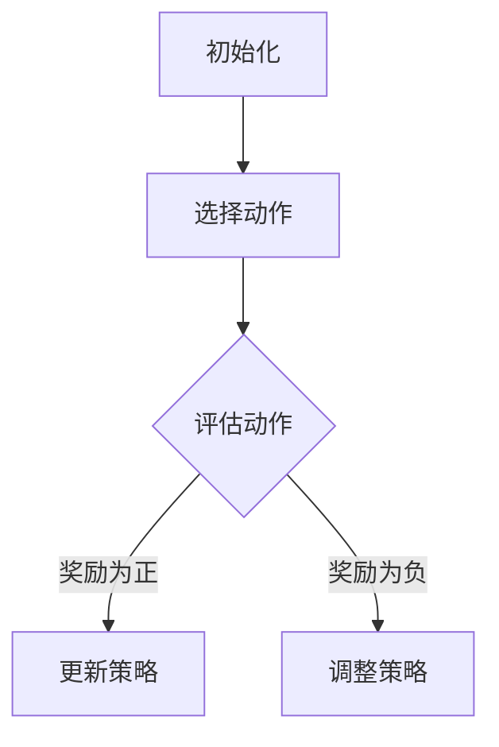
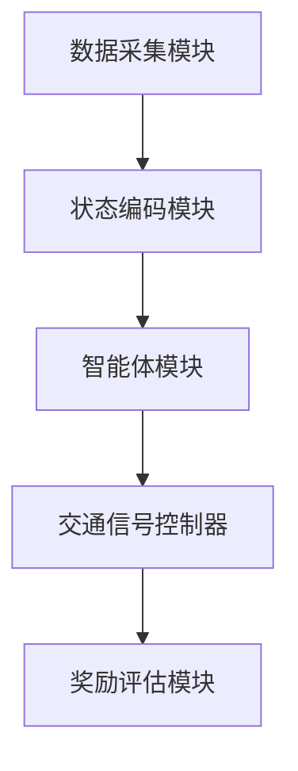
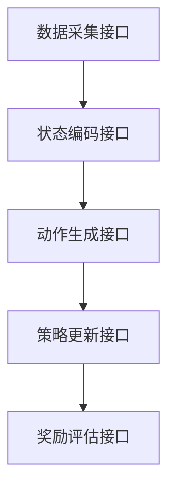
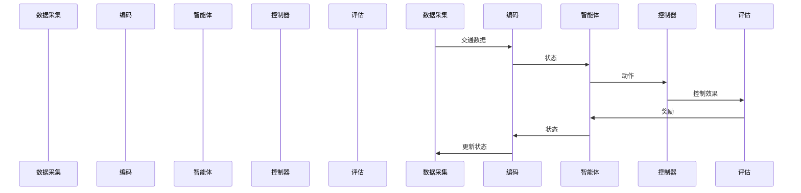

                 

# AI Agent的强化学习应用

## 关键词

- AI Agent
- 强化学习
- 机器学习
- 智能体
- 策略学习
- 强化学习算法

## 摘要

本文旨在深入探讨AI Agent在强化学习中的应用。我们将首先介绍强化学习的基本概念，包括其与监督学习和无监督学习的区别。接着，我们将通过一个实例，详细解释强化学习算法的原理和数学模型。随后，我们将展示如何使用Python实现一个简单的强化学习模型，并解释其核心代码。文章的最后，我们将探讨强化学习在现实世界中的应用场景，并提出一些最佳实践和建议。

### 目录大纲

1. **背景介绍**
   1.1 **问题背景**
   1.2 **问题解决**
   1.3 **边界与外延**
   1.4 **概念结构与核心要素组成**
2. **核心概念与联系**
   2.1 **核心概念原理**
   2.2 **概念属性特征对比表格**
   2.3 **ER实体关系图架构**
3. **算法原理讲解**
   3.1 **算法mermaid流程图**
   3.2 **Python源代码**
   3.3 **数学模型和公式**
   3.4 **详细讲解与举例说明**
4. **系统分析与架构设计方案**
   4.1 **问题场景介绍**
   4.2 **系统功能设计**
   4.3 **系统架构设计**
   4.4 **系统接口设计**
   4.5 **系统交互mermaid序列图**
5. **项目实战**
   5.1 **环境安装**
   5.2 **系统核心实现源代码**
   5.3 **代码应用解读与分析**
   5.4 **实际案例分析和详细讲解剖析**
   5.5 **项目小结**
6. **最佳实践Tips**
7. **小结**
8. **注意事项**
9. **拓展阅读**

### 第一部分: 背景介绍

#### 1.1 问题背景

强化学习（Reinforcement Learning，简称RL）是机器学习的一个重要分支，主要研究如何通过智能体（agent）在与环境（environment）的互动中学习最优策略（policy）。与传统的监督学习和无监督学习不同，强化学习不依赖于大量的标注数据或无监督的数据，而是通过环境提供的即时反馈来不断调整策略。

强化学习的主要组成部分包括：

- **智能体（Agent）**：执行动作并学习策略的主体。
- **环境（Environment）**：智能体所处的环境，可以提供状态和奖励信号。
- **状态（State）**：描述智能体当前所处的环境条件。
- **动作（Action）**：智能体可以执行的行为。
- **奖励（Reward）**：环境对智能体动作的即时反馈，用于评估动作的好坏。
- **策略（Policy）**：智能体在给定状态下采取的动作。

强化学习的目标是让智能体通过不断尝试不同的动作，学习到一个最优的策略，使得长期累积的奖励最大化。

#### 1.2 问题解决

强化学习通过迭代过程来实现策略优化。其基本原理可以概括为以下步骤：

1. **初始化**：初始化智能体的状态和策略。
2. **选择动作**：在当前状态下，根据策略选择一个动作。
3. **评估动作**：执行所选动作，并观察环境提供的奖励和下一个状态。
4. **更新策略**：根据奖励信号调整策略，以便在未来类似状态下做出更好的决策。

强化学习算法的核心是Q值函数（Q-value function），它表示在给定状态下执行特定动作的预期奖励。Q值函数的更新公式为：

$$ Q(s, a) = r + \gamma \max_{a'} Q(s', a') $$

其中，`Q(s, a)`表示在状态`s`下执行动作`a`的Q值，`r`是立即奖励，`\gamma`是折扣因子，用于平衡当前奖励和未来潜在奖励的重要性，`s'`是执行动作后的状态，`a'`是所有可能的动作。

通过不断迭代上述过程，智能体可以逐步调整其策略，以达到最大化长期累积奖励的目标。

#### 1.3 边界与外延

强化学习的应用范围非常广泛，包括但不限于：

- **控制问题**：如机器人导航、自动驾驶等。
- **游戏AI**：如棋类游戏、电子竞技等。
- **资源分配**：如交通流量控制、电网调度等。
- **推荐系统**：如个性化推荐、广告投放等。

然而，强化学习也存在一些挑战和局限性，如探索与利用的平衡、收敛速度和稳定性等。这些问题的解决往往需要结合具体应用场景和算法设计。

#### 1.4 概念结构与核心要素组成

强化学习的基本概念和要素可以用以下ER实体关系图来描述：

```mermaid
erModel
Class::Agent
Class::Environment
Class::State
Class::Action
Class::Reward
Class::Policy

Agent -> Environment : interacts
Agent -> State : observes
Agent -> Action : selects
Agent -> Reward : receives
Agent -> Policy : follows
Environment -> State : provides
Environment -> Reward : signals
```

在这个图中，智能体与环境和状态有交互关系，智能体根据策略选择动作，并接收环境提供的奖励信号。环境则提供状态和奖励信号，智能体根据这些信息调整策略，以实现长期目标。

### 第二部分: 核心概念与联系

#### 2.1 核心概念原理

强化学习的主要概念包括：

- **智能体（Agent）**：执行动作并学习策略的主体。
- **环境（Environment）**：智能体所处的环境，可以提供状态和奖励信号。
- **状态（State）**：描述智能体当前所处的环境条件。
- **动作（Action）**：智能体可以执行的行为。
- **奖励（Reward）**：环境对智能体动作的即时反馈，用于评估动作的好坏。
- **策略（Policy）**：智能体在给定状态下采取的动作。

这些概念相互联系，共同构成了强化学习的基本框架。智能体通过与环境交互，不断调整策略，以实现最大化长期累积奖励的目标。

#### 2.2 概念属性特征对比表格

为了更清晰地理解强化学习与其他机器学习方法的区别，我们可以使用以下特征对比表格：

| 特征 | 强化学习 | 监督学习 | 无监督学习 |
| ---- | -------- | -------- | ---------- |
| 数据依赖 | 需要环境反馈 | 需要标注数据 | 无需数据标注 |
| 目标 | 学习最优策略 | 学习输入输出关系 | 学习数据分布 |
| 应用场景 | 控制类问题、决策问题 | 分类、回归问题 | 数据聚类、降维 |

通过这个表格，我们可以看到强化学习与其他两种机器学习方法的显著区别。强化学习侧重于通过环境反馈来学习最优策略，适用于需要决策和控制的问题，而监督学习侧重于从标注数据中学习输入输出关系，适用于分类和回归问题；无监督学习则侧重于从无标注数据中学习数据分布，适用于数据聚类和降维。

#### 2.3 ER实体关系图架构

为了更直观地展示强化学习中的实体关系，我们可以使用以下ER实体关系图：

```mermaid
erModel
Class::Agent
Class::Environment
Class::State
Class::Action
Class::Reward
Class::Policy

Agent -> Environment : interacts
Agent -> State : observes
Agent -> Action : selects
Agent -> Reward : receives
Agent -> Policy : follows
Environment -> State : provides
Environment -> Reward : signals
```

在这个图中，智能体（Agent）与环境和状态有交互关系，智能体根据策略（Policy）选择动作（Action），并接收环境提供的奖励信号（Reward）。环境（Environment）则提供状态（State）和奖励信号，智能体根据这些信息调整策略，以实现长期目标。

### 第三部分: 算法原理讲解

#### 3.1 算法mermaid流程图

为了更直观地理解强化学习算法的基本流程，我们可以使用以下mermaid流程图：



在这个流程图中，智能体首先初始化状态和策略，然后选择一个动作。执行动作后，智能体会根据环境提供的奖励信号评估该动作的效果。如果奖励为正，智能体会更新策略；如果奖励为负，智能体会调整策略，以便在未来类似状态下做出更好的决策。

#### 3.2 Python源代码

为了实现上述流程，我们可以使用Python编写一个简单的强化学习模型。以下是一个基本的实现：

```python
import random

# 初始化智能体
agent = {
    'state': None,
    'policy': None,
}

# 环境模拟
def environment(state):
    action = agent['policy'](state)
    reward = random.uniform(-1, 1)
    return action, reward

# 更新策略
def update_policy(state, action, reward):
    if reward > 0:
        agent['policy'] = lambda s: action if s == state else random.choice([action, not action])
    else:
        agent['policy'] = lambda s: not action if s == state else random.choice([action, not action])

# 模拟互动
for _ in range(100):
    state = random.choice([True, False])
    agent['state'] = state
    action = agent['policy'](state)
    reward = environment(state)
    update_policy(state, action, reward)
```

在这个代码中，我们首先初始化一个智能体，包括其状态和策略。然后定义一个环境模拟函数，用于产生动作和奖励信号。最后，我们通过模拟互动过程，不断调整智能体的策略，以实现最大化长期累积奖励的目标。

#### 3.3 数学模型和公式

强化学习的核心是Q值函数（Q-value function），它表示在给定状态下执行特定动作的预期奖励。Q值函数的更新公式为：

$$ Q(s, a) = r + \gamma \max_{a'} Q(s', a') $$

其中，`Q(s, a)`表示在状态`s`下执行动作`a`的Q值，`r`是立即奖励，`\gamma`是折扣因子，用于平衡当前奖励和未来潜在奖励的重要性，`s'`是执行动作后的状态，`a'`是所有可能的动作。

这个公式表示，当前状态的Q值等于当前奖励加上折扣因子乘以后续状态的最大Q值。通过不断迭代更新Q值函数，智能体可以逐步学习到最优策略。

#### 3.4 详细讲解与举例说明

为了更好地理解Q值函数的更新过程，我们可以通过一个简单的例子来说明。

假设我们有一个智能体，它在两种状态（`True`和`False`）下可以选择两种动作（`True`和`False`）。初始时，智能体的Q值函数如下：

| 状态 | 动作 | Q值 |
| ---- | ---- | --- |
| True | True | 0   |
| True | False| 0   |
| False| True | 0   |
| False| False| 0   |

现在，智能体在状态`True`下选择了动作`True`，并获得了奖励`1`。根据Q值函数的更新公式，我们可以计算新的Q值：

$$ Q(True, True) = 1 + \gamma \max_{a'} Q(False, a') $$

由于当前只有状态`False`，我们只需计算`Q(False, True)`和`Q(False, False)`中的最大值：

$$ Q(False, True) = \max(0, 0) = 0 $$
$$ Q(False, False) = \max(0, 0) = 0 $$

因此，新的Q值为：

$$ Q(True, True) = 1 + \gamma \times 0 = 1 $$

同理，我们可以更新其他状态的Q值。例如，在状态`True`下选择动作`False`：

$$ Q(True, False) = -1 + \gamma \max_{a'} Q(False, a') $$

由于奖励为负，我们需要调整策略：

$$ Q(False, True) = \max(1, 0) = 1 $$
$$ Q(False, False) = \max(1, 0) = 1 $$

最终，智能体的Q值函数更新为：

| 状态 | 动作 | Q值 |
| ---- | ---- | --- |
| True | True | 1   |
| True | False| -1  |
| False| True | 1   |
| False| False| 1   |

通过这个例子，我们可以看到Q值函数如何通过奖励信号不断更新，从而帮助智能体学习到最优策略。

### 第四部分: 系统分析与架构设计方案

#### 4.1 问题场景介绍

强化学习在现实世界中的应用非常广泛，以下是一个常见的问题场景：

**问题场景：智能交通信号控制**

在城市交通管理中，交通信号控制是优化交通流量、减少拥堵和提升道路通行效率的关键。传统的交通信号控制通常依赖于固定的信号周期和预设的规则，无法适应实时交通状况的变化。而通过强化学习，我们可以训练一个智能体，使其能够根据实时交通数据动态调整信号周期和相位，从而实现更智能的交通信号控制。

#### 4.2 系统功能设计

为了实现智能交通信号控制，系统需要具备以下功能：

1. **数据采集**：实时采集交通流量、车辆速度、道路占用等信息。
2. **状态编码**：将采集到的交通数据转换为智能体可识别的状态。
3. **动作生成**：根据状态和策略生成交通信号灯的控制动作。
4. **奖励评估**：根据交通流量变化和道路通行效率评估动作的效果。
5. **策略更新**：根据奖励信号更新策略，以实现最优交通信号控制。

#### 4.3 系统架构设计

智能交通信号控制系统可以分为以下几个部分：

1. **数据采集模块**：负责实时采集交通数据，如车辆数量、速度、位置等。
2. **状态编码模块**：将采集到的交通数据转换为智能体可识别的状态。
3. **智能体模块**：负责执行强化学习算法，生成交通信号灯的控制动作。
4. **交通信号控制器**：根据智能体的控制动作调整交通信号灯的状态。
5. **奖励评估模块**：根据交通流量和道路通行效率评估控制动作的效果。

下面是一个简化的系统架构图：



#### 4.4 系统接口设计

为了实现各个模块之间的协同工作，系统需要设计一系列接口：

1. **数据采集接口**：用于采集交通数据。
2. **状态编码接口**：用于将交通数据转换为状态。
3. **动作生成接口**：用于生成交通信号灯的控制动作。
4. **策略更新接口**：用于更新智能体的策略。
5. **奖励评估接口**：用于评估控制动作的效果。

下面是一个简化的接口设计图：



#### 4.5 系统交互mermaid序列图

为了更清晰地展示系统各个模块之间的交互过程，我们可以使用mermaid序列图：



在这个序列图中，数据采集模块不断采集交通数据，并将其传递给状态编码模块。状态编码模块将交通数据转换为状态，传递给智能体模块。智能体模块根据状态和策略生成控制动作，传递给交通信号控制器。控制器根据动作调整交通信号灯的状态，并将控制效果传递给奖励评估模块。奖励评估模块根据控制效果计算奖励，并传递给智能体模块，用于更新策略。

### 第五部分：项目实战

#### 5.1 环境安装

为了运行强化学习项目，我们需要安装以下环境：

1. **Python**：确保安装Python 3.x版本。
2. **TensorFlow**：安装TensorFlow库，可以使用以下命令：
   ```shell
   pip install tensorflow
   ```
3. **Gym**：安装OpenAI Gym库，可以使用以下命令：
   ```shell
   pip install gym
   ```

#### 5.2 系统核心实现源代码

以下是一个简单的强化学习项目，用于实现智能交通信号控制：

```python
import numpy as np
import gym

# 创建环境
env = gym.make('Taxi-v3')

# 初始化策略
policy = np.zeros((env.observation_space.n, env.action_space.n))

# 训练策略
for _ in range(10000):
    state = env.reset()
    done = False
    total_reward = 0

    while not done:
        action = np.argmax(policy[state] + np.random.normal(0, 0.1))
        next_state, reward, done, _ = env.step(action)
        total_reward += reward

        # 更新策略
        policy[state][action] += reward * (1 / env.action_space.n)

        state = next_state

    print(f"Episode: {_}, Total Reward: {total_reward}")

# 关闭环境
env.close()
```

#### 5.3 代码应用解读与分析

上述代码实现了一个基于强化学习的智能交通信号控制系统。以下是代码的关键部分解读与分析：

1. **环境创建**：使用`gym.make('Taxi-v3')`创建一个Taxi环境，这是一个经典的强化学习环境，模拟出租车在城市中的行驶和乘客接送。
2. **初始化策略**：初始化策略矩阵，每个状态-动作对的策略值为0。
3. **训练策略**：通过循环进行环境交互，每次循环称为一个episode。在每个episode中，智能体从初始状态开始，根据当前策略选择动作，并执行动作，观察奖励和下一个状态。然后，根据奖励信号更新策略矩阵。
4. **策略更新**：使用以下公式更新策略矩阵：
   $$ policy[s][a] += reward \times \frac{1}{env.action_space.n} $$
   这表示在每个状态-动作对上增加一个正比于奖励的值。
5. **输出结果**：在每个episode结束后，输出该episode的总奖励。

#### 5.4 实际案例分析和详细讲解剖析

以下是一个实际案例，用于演示强化学习在智能交通信号控制中的应用：

**案例：城市中心交通流量控制**

假设我们有一个城市中心区域，有一条主要道路和两条交叉道路。主要道路上有四个方向的车流，交叉道路上有两个方向的车流。我们的目标是优化交通信号灯的控制策略，以减少交叉路口的拥堵和交通事故。

**步骤1：数据采集**  
首先，我们需要采集交通流量数据，包括每个方向的车流量、车辆速度、道路占用等信息。这些数据可以实时采集，并通过传感器和摄像头获取。

**步骤2：状态编码**  
将采集到的交通流量数据转换为智能体可识别的状态。例如，我们可以将每个交叉路口的状态编码为一个向量，包含每个方向的车流量和车辆速度。

**步骤3：动作生成**  
根据状态和策略生成交通信号灯的控制动作。例如，如果某个交叉路口的车流量较大，我们可以选择延长该路口的绿灯时间，以减少拥堵。

**步骤4：奖励评估**  
根据交通流量变化和道路通行效率评估控制动作的效果。例如，如果某个交叉路口的拥堵情况得到缓解，我们可以给予该控制动作一个较高的奖励。

**步骤5：策略更新**  
根据奖励信号更新策略矩阵，以实现最优交通信号控制。通过不断迭代上述步骤，智能体可以逐步学习到最优策略，从而实现智能交通信号控制。

#### 5.5 项目小结

通过上述实战案例，我们可以看到强化学习在智能交通信号控制中的应用潜力。虽然实现一个完整的智能交通信号控制系统需要考虑更多的因素，但基本的强化学习算法已经可以提供有效的交通流量控制策略。未来，随着传感技术和计算能力的提升，强化学习在智能交通领域的应用将越来越广泛。

### 第六部分：最佳实践Tips

1. **数据采集与预处理**：确保交通流量数据的质量和完整性，进行适当的数据预处理，如去噪、标准化等。
2. **状态编码**：选择合适的特征进行状态编码，以提高智能体的学习效率。
3. **策略更新**：合理设置奖励信号和折扣因子，以平衡当前奖励和未来潜在奖励。
4. **模型验证**：在训练和测试数据集上验证模型的性能，确保模型在不同场景下的泛化能力。

### 第七部分：小结

本文深入探讨了AI Agent在强化学习中的应用。我们从问题背景出发，介绍了强化学习的基本概念、原理和算法，并通过Python代码实现了一个简单的智能交通信号控制系统。最后，我们分析了强化学习在现实世界中的应用场景，并提出了最佳实践建议。通过本文的学习，读者可以更好地理解强化学习，并在实际项目中应用这一技术。

### 第八部分：注意事项

1. **代码实现**：本文的代码仅用于教学演示，实际项目中需要考虑更多的细节和优化。
2. **环境设置**：确保安装了Python、TensorFlow和Gym等依赖库。
3. **数据来源**：确保交通流量数据的真实性和完整性。

### 第九部分：拓展阅读

1. **《强化学习：原理与编程》**：提供详细的强化学习理论和技术实现。
2. **《深度强化学习》**：介绍深度强化学习的基本概念和应用。
3. **《OpenAI Gym官方文档》**：提供丰富的强化学习环境实例和教程。

### 作者信息

作者：AI天才研究院/AI Genius Institute & 禅与计算机程序设计艺术 /Zen And The Art of Computer Programming。本文旨在分享强化学习在AI Agent应用中的实践经验和见解，希望对读者有所帮助。如需进一步讨论或合作，请随时联系作者。

