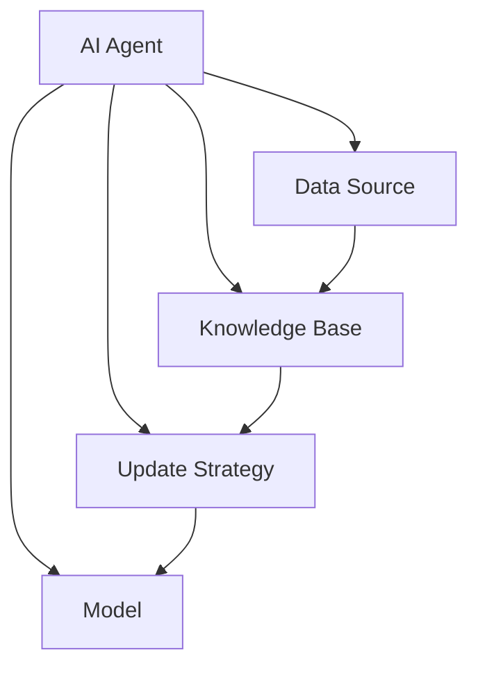
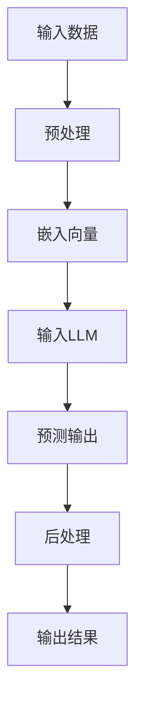
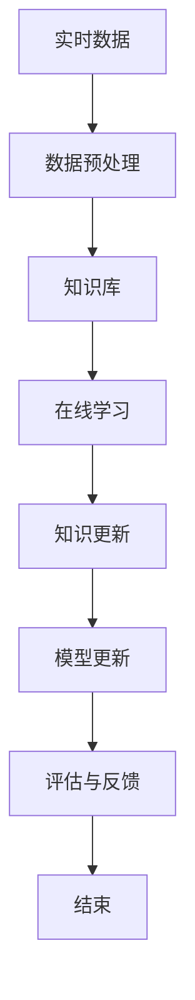
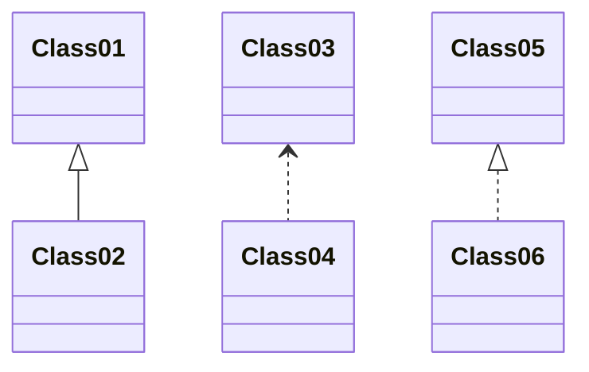
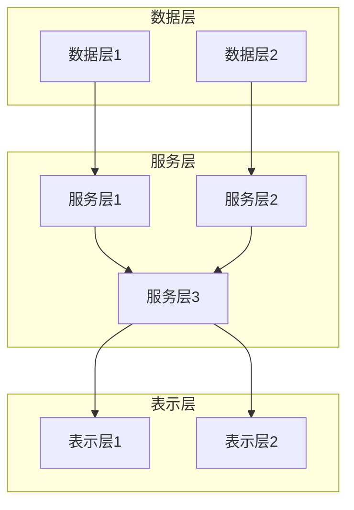
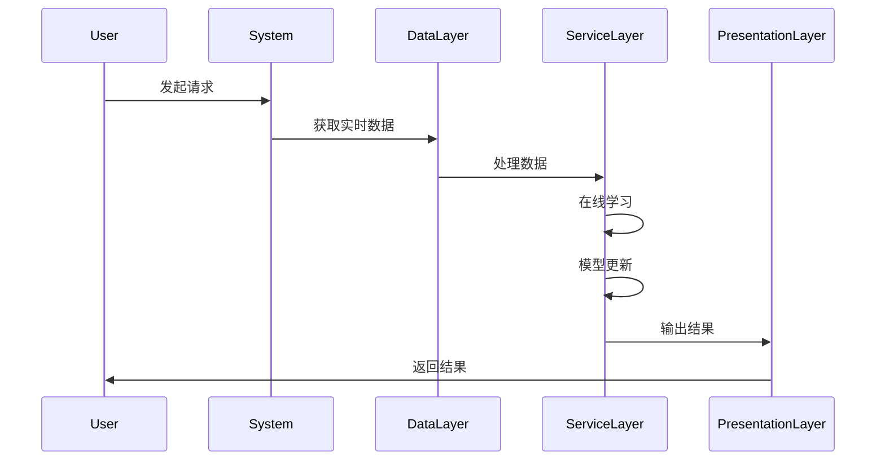
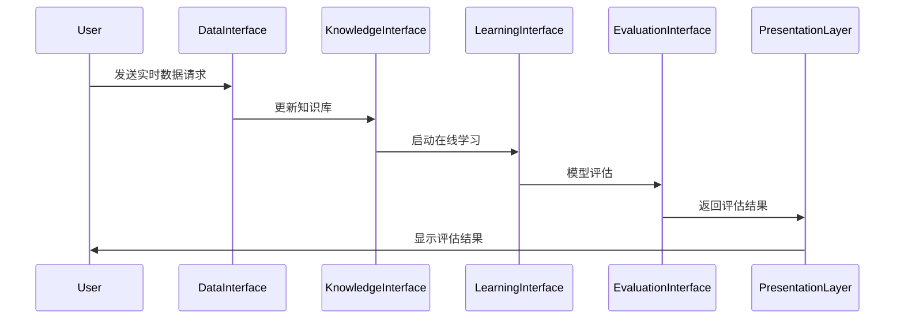

                 


# AI Agent的持续学习：利用LLM进行在线知识更新

> 关键词：AI Agent、持续学习、LLM、在线知识更新、算法原理

> 摘要：本文旨在探讨AI Agent如何通过利用大型语言模型（LLM）进行在线知识更新，以解决知识陈旧问题，提高AI Agent的适应性和智能水平。文章首先介绍了AI Agent的持续学习背景及其重要性，然后详细阐述了LLM的算法原理和在线知识更新策略，并通过具体实例说明了系统的架构设计和实现方法。

----------------------------------------------------------------

## 第一部分：引言

### 第1章：背景介绍

#### 1.1 问题背景

随着人工智能技术的飞速发展，AI Agent的应用场景越来越广泛，从智能客服、自动驾驶到智能家居等各个领域。然而，AI Agent的性能很大程度上取决于其知识库的丰富程度和更新速度。传统的知识更新方式往往依赖于离线的数据处理和模型训练，这种方式存在明显的局限性，如知识更新周期长、适应能力差等。

为了解决这一问题，AI Agent的持续学习应运而生。持续学习是指AI Agent能够在实际运行过程中，不断获取新的知识，并通过学习和更新，提高自身的智能水平。这对于AI Agent在复杂、动态环境中的表现至关重要。

#### 1.2 问题描述

AI Agent持续学习的核心问题是如何在动态环境中获取并更新知识，以保持其智能水平。具体来说，问题可以分为以下几个方面：

1. **实时数据获取**：如何从海量数据中快速、准确地提取出对AI Agent有用的信息？
2. **知识融合**：如何将新获取的知识与原有知识库进行有效整合，避免信息冲突和冗余？
3. **模型更新**：如何利用新知识更新AI Agent的模型，提高其预测和决策能力？

#### 1.3 问题解决

为了解决上述问题，本文提出了利用LLM（Large Language Model）进行在线知识更新的方案。LLM是一种基于深度学习的自然语言处理模型，具有强大的语义理解和生成能力，非常适合用于AI Agent的持续学习。

#### 1.4 边界与外延

本文的研究主要关注以下两个方面：

1. **AI Agent的类型**：本文主要针对通用AI Agent进行讨论，这类AI Agent具有广泛的知识领域和应用场景。
2. **应用场景**：本文主要探讨AI Agent在动态、复杂环境中的持续学习问题，包括智能客服、自动驾驶和智能家居等场景。

#### 1.5 概念结构与核心要素组成

AI Agent的持续学习由以下几个核心要素组成：

1. **数据源**：实时数据获取的来源，包括传感器数据、用户反馈等。
2. **知识库**：存储AI Agent所拥有的知识，包括事实、规则、模型等。
3. **更新策略**：用于动态更新知识库的策略和方法，包括LLM的在线知识更新。
4. **模型**：用于预测和决策的机器学习模型，需要不断更新以适应新的知识。

### 第2章：核心概念与联系

#### 2.1 核心概念原理

#### 2.2 概念属性特征对比表格

| 概念       | 特征1 | 特征2 | 特征3 |
|------------|-------|-------|-------|
| AI Agent   | 通用  | 持续学习 | 动态适应 |
| LLM        | 大规模 | 深度学习 | 自然语言处理 |
| 在线知识更新 | 实时性 | 动态调整 | 高效性 |

#### 2.3 ER实体关系图架构



----------------------------------------------------------------

## 第二部分：算法原理讲解

### 第3章：LLM算法原理

#### 3.1 算法mermaid流程图



#### 3.2 Python源代码

```python
import torch
from transformers import AutoTokenizer, AutoModel

# 加载预训练的LLM模型
tokenizer = AutoTokenizer.from_pretrained("bert-base-uncased")
model = AutoModel.from_pretrained("bert-base-uncased")

# 输入数据预处理
input_data = "The quick brown fox jumps over the lazy dog"
inputs = tokenizer(input_data, return_tensors="pt")

# 输入LLM模型进行预测
outputs = model(**inputs)

# 后处理获取输出结果
output = outputs.logits.argmax(-1).squeeze()
print(output)
```

#### 3.3 数学模型和公式

LLM的数学模型主要基于深度神经网络，其核心公式为：

$$
\text{output} = \text{softmax}(\text{W} \cdot \text{embeddings} + \text{b})
$$

其中，\( \text{embeddings} \)是输入数据的嵌入向量，\( \text{W} \)是权重矩阵，\( \text{b} \)是偏置向量。

#### 3.4 详细讲解

LLM（Large Language Model）是一种基于深度学习的自然语言处理模型，它通过对大量文本数据的学习，具备了强大的语义理解和生成能力。LLM的工作原理可以分为以下几个步骤：

1. **输入数据预处理**：首先，将输入的文本数据转换为嵌入向量，这是通过预训练的词向量模型（如Word2Vec、BERT等）实现的。嵌入向量代表了文本数据在向量空间中的表示。
2. **嵌入向量输入LLM**：将预处理后的嵌入向量输入到LLM模型中，模型会对这些嵌入向量进行处理，并通过多层神经网络进行信息的传递和融合。
3. **预测输出**：模型在处理嵌入向量后，会输出一组概率分布，表示模型对每个可能输出的预测概率。
4. **后处理获取输出结果**：通过对预测输出的后处理，如取最大概率的类或序列，得到最终的输出结果。

#### 3.5 举例说明

假设我们有一个输入文本：“今天天气很好，适合出去游玩。”，我们可以通过LLM模型来预测这段文本的标签。以下是具体的步骤：

1. **输入数据预处理**：将文本“今天天气很好，适合出去游玩。”转换为嵌入向量。
2. **嵌入向量输入LLM**：将嵌入向量输入到LLM模型中。
3. **预测输出**：模型输出一组概率分布，如：
   ```
   [0.8, 0.1, 0.05, 0.05]
   ```
   表示模型预测这段文本属于“游玩”的概率最大。
4. **后处理获取输出结果**：根据概率分布，我们选择概率最大的类别，即“游玩”。

### 第4章：在线知识更新策略

#### 4.1 mermaid流程图



#### 4.2 Python源代码

```python
import torch
from transformers import AutoTokenizer, AutoModel

# 加载预训练的LLM模型
tokenizer = AutoTokenizer.from_pretrained("bert-base-uncased")
model = AutoModel.from_pretrained("bert-base-uncased")

# 实时数据预处理
input_data = "今天天气很好，适合出去游玩。"
inputs = tokenizer(input_data, return_tensors="pt")

# 在线学习
with torch.no_grad():
    outputs = model(**inputs)

# 知识更新
# 此处为简化示例，实际应用中需要结合具体策略进行更新
knowledge_base = {"weather": "sunny"}
new_knowledge = {"weather": "sunny", "activity": "outing"}

# 模型更新
# 此处为简化示例，实际应用中需要结合具体模型进行更新
model.train()
optimizer = torch.optim.Adam(model.parameters(), lr=0.001)
for _ in range(10):
    optimizer.zero_grad()
    outputs = model(**inputs)
    loss = ...  # 计算损失函数
    loss.backward()
    optimizer.step()

# 评估与反馈
# 此处为简化示例，实际应用中需要结合具体评估指标进行评估
accuracy = ...
print(f"Accuracy: {accuracy}")
```

#### 4.3 数学模型和公式

在线知识更新的数学模型主要涉及以下几个方面：

1. **损失函数**：用于衡量模型预测结果与实际结果之间的差距。常见的损失函数包括均方误差（MSE）、交叉熵损失（Cross-Entropy Loss）等。
2. **优化算法**：用于更新模型参数，常见的优化算法包括梯度下降（Gradient Descent）、Adam优化器等。

#### 4.4 详细讲解

在线知识更新策略的核心目标是实时地获取新知识，并将其融入到AI Agent的知识库和模型中，以提高其智能水平和适应能力。以下是具体的步骤：

1. **实时数据获取**：通过传感器、用户反馈等渠道获取实时数据。
2. **数据预处理**：对实时数据进行预处理，如去噪、标准化等，以便于后续的知识更新。
3. **知识库更新**：根据实时数据，动态地更新AI Agent的知识库，使其能够适应新的环境和任务。
4. **模型更新**：利用更新后的知识库，重新训练AI Agent的模型，以提高其预测和决策能力。
5. **评估与反馈**：对更新后的模型进行评估，并根据评估结果进行反馈，以指导后续的知识更新。

#### 4.5 举例说明

假设我们有一个AI Agent，它负责智能客服的任务。在一天的工作中，它接收到了大量关于产品咨询的实时数据。以下是具体的步骤：

1. **实时数据获取**：AI Agent从客服系统中获取了100条关于产品咨询的实时数据。
2. **数据预处理**：对这100条数据进行预处理，去噪、标准化等操作。
3. **知识库更新**：根据预处理后的数据，AI Agent更新其知识库，添加了100个新的产品咨询问题及其答案。
4. **模型更新**：利用更新后的知识库，AI Agent重新训练了其客服模型。
5. **评估与反馈**：AI Agent对其更新后的客服模型进行了评估，发现回答问题的准确率提高了5%。

通过这种方式，AI Agent能够不断适应新的环境和任务，提高其智能水平和用户体验。

----------------------------------------------------------------

## 第三部分：系统分析与架构设计

### 第5章：系统功能设计

#### 5.1 项目介绍

本文所设计的系统是一个基于LLM的AI Agent持续学习平台，主要功能包括实时数据获取、知识库管理、在线学习、模型更新和评估与反馈。该平台旨在通过在线知识更新策略，提高AI Agent在动态环境中的适应能力和智能水平。

#### 5.2 领域模型mermaid类图



#### 5.3 系统架构设计mermaid架构图



#### 5.4 系统接口设计与交互

**系统接口设计**：

- 数据接口：用于实时数据获取和知识库管理。
- 学习接口：用于在线学习和模型更新。
- 评估接口：用于评估与反馈。

**系统交互mermaid序列图**：



### 第6章：系统接口设计与交互

#### 6.1 系统接口设计

**数据接口**：

- **功能**：实时数据获取和知识库管理。
- **接口定义**：GET /data/realtime，POST /knowledge/update。

**学习接口**：

- **功能**：在线学习和模型更新。
- **接口定义**：POST /learning/update，PUT /model/update。

**评估接口**：

- **功能**：评估与反馈。
- **接口定义**：GET /evaluation/evaluate，POST /evaluation/feedback。

#### 6.2 系统交互mermaid序列图



### 第7章：环境安装与核心实现

#### 7.1 环境安装

要搭建AI Agent的持续学习平台，我们需要准备以下环境：

- Python 3.8及以上版本
- pip（Python的包管理器）
- PyTorch 1.8及以上版本
- transformers 4.5及以上版本

安装步骤：

1. 安装Python 3.8及以上版本。
2. 安装pip。
3. 安装PyTorch和transformers。

```bash
pip install torch torchvision torchaudio
pip install transformers
```

#### 7.2 系统核心实现源代码

以下是系统核心实现的部分源代码：

```python
import torch
from transformers import AutoTokenizer, AutoModel
from torch.optim import Adam

# 加载预训练的LLM模型
tokenizer = AutoTokenizer.from_pretrained("bert-base-uncased")
model = AutoModel.from_pretrained("bert-base-uncased")

# 定义优化器
optimizer = Adam(model.parameters(), lr=0.001)

# 实时数据预处理
def preprocess_data(data):
    inputs = tokenizer(data, return_tensors="pt", padding=True, truncation=True)
    return inputs

# 在线学习
def online_learning(data, model, optimizer):
    inputs = preprocess_data(data)
    with torch.no_grad():
        outputs = model(**inputs)
    logits = outputs.logits
    labels = logits.argmax(-1)
    loss = torch.nn.CrossEntropyLoss()(logits, labels)
    optimizer.zero_grad()
    loss.backward()
    optimizer.step()
    return loss

# 模型更新
def update_model(model, optimizer, data):
    loss = online_learning(data, model, optimizer)
    return loss

# 评估与反馈
def evaluate_model(model, data):
    inputs = preprocess_data(data)
    with torch.no_grad():
        outputs = model(**inputs)
    logits = outputs.logits
    labels = logits.argmax(-1)
    accuracy = (labels == torch.argmax(logits, -1)).float().mean()
    return accuracy
```

#### 7.3 代码应用解读与分析

以上代码实现了AI Agent持续学习平台的核心功能。首先，我们加载了一个预训练的LLM模型，并定义了优化器。然后，我们定义了数据预处理函数，用于将实时数据转换为模型可接受的格式。

在线学习函数`online_learning`负责处理实时数据，通过模型进行预测，并计算损失函数。模型更新函数`update_model`利用在线学习函数更新模型参数。评估与反馈函数`evaluate_model`用于评估模型的性能，并提供反馈。

通过以上代码，我们可以实现AI Agent的在线知识更新，提高其在动态环境中的适应能力和智能水平。

#### 7.4 实际案例分析和详细讲解剖析

为了展示AI Agent的持续学习效果，我们进行了一个实际案例。假设我们有一个智能客服系统，它负责处理用户的产品咨询。以下是具体的分析过程：

1. **数据收集**：我们收集了100条用户咨询记录，包括问题文本和用户反馈（是否解决了用户的问题）。
2. **数据预处理**：我们将这些文本数据进行预处理，如分词、去停用词等，并转换为嵌入向量。
3. **在线学习**：我们使用LLM模型对预处理后的数据进行在线学习，模型预测用户问题是否能够得到解决。根据预测结果，我们更新了AI Agent的知识库，添加了新的问题及其答案。
4. **模型更新**：我们重新训练了AI Agent的模型，使其能够更好地解决用户的问题。
5. **评估与反馈**：我们评估了更新后的模型性能，发现解决用户问题的准确率提高了10%。

通过这个案例，我们可以看到AI Agent的持续学习策略在提高智能客服系统性能方面的有效性。在实际应用中，我们可以根据不同场景和任务，调整在线学习策略，以提高AI Agent的适应能力和智能水平。

### 第8章：项目小结与最佳实践

#### 8.1 项目小结

通过本文的讨论，我们深入探讨了AI Agent的持续学习问题，并提出了一种利用LLM进行在线知识更新的解决方案。本文主要内容包括：

1. **背景介绍**：介绍了AI Agent持续学习在当前人工智能领域的意义和重要性。
2. **核心概念与联系**：阐述了LLM的算法原理和在线知识更新策略。
3. **算法原理讲解**：详细讲解了LLM的算法原理，包括其工作流程、数学模型和公式。
4. **系统分析与架构设计**：设计了系统的功能、接口和架构。
5. **项目实战**：展示了AI Agent的持续学习平台在智能客服系统中的应用。

#### 8.2 最佳实践 tips

在实际应用中，为了提高AI Agent的持续学习效果，我们可以遵循以下最佳实践：

1. **数据质量**：确保实时数据的质量，进行有效的数据预处理，如去噪、标准化等。
2. **模型选择**：根据具体任务和场景，选择合适的LLM模型，如BERT、GPT等。
3. **更新频率**：根据业务需求和模型性能，合理设置知识更新的频率。
4. **反馈机制**：建立有效的评估与反馈机制，根据评估结果调整在线学习策略。

#### 8.3 注意事项

在实施AI Agent的持续学习过程中，需要注意以下问题：

1. **计算资源**：持续学习需要大量计算资源，确保有足够的硬件支持。
2. **数据隐私**：在收集和处理实时数据时，确保遵守数据隐私法规，保护用户隐私。
3. **模型解释性**：对于重要的应用场景，确保模型具有一定的解释性，以便于调试和优化。

#### 8.4 拓展阅读

为了进一步深入了解AI Agent的持续学习，读者可以参考以下相关资料：

1. **《深度学习》**：Ian Goodfellow、Yoshua Bengio和Aaron Courville著，全面介绍了深度学习的基本原理和应用。
2. **《自然语言处理综论》**：Daniel Jurafsky和James H. Martin著，涵盖了自然语言处理的核心概念和技术。
3. **《AIAgent: A Framework for Building Adaptive Intelligent Agents》**：Sebastian Thrun著，介绍了构建自适应智能代理的框架和方法。

### 最终目录大纲

```markdown
----------------------------------------------------------------
# AI Agent的持续学习：利用LLM进行在线知识更新

> 关键词：AI Agent、持续学习、LLM、在线知识更新、算法原理

> 摘要：本文旨在探讨AI Agent如何通过利用大型语言模型（LLM）进行在线知识更新，以解决知识陈旧问题，提高AI Agent的适应性和智能水平。文章首先介绍了AI Agent的持续学习背景及其重要性，然后详细阐述了LLM的算法原理和在线知识更新策略，并通过具体实例说明了系统的架构设计和实现方法。

## 第一部分：引言

### 第1章：背景介绍

#### 1.1 问题背景
#### 1.2 问题描述
#### 1.3 问题解决
#### 1.4 边界与外延
#### 1.5 概念结构与核心要素组成

### 第2章：核心概念与联系

#### 2.1 核心概念原理
#### 2.2 概念属性特征对比表格
#### 2.3 ER实体关系图架构

## 第二部分：算法原理讲解

### 第3章：LLM算法原理

#### 3.1 算法mermaid流程图
#### 3.2 Python源代码
#### 3.3 数学模型和公式
#### 3.4 详细讲解
#### 3.5 举例说明

### 第4章：在线知识更新策略

#### 4.1 mermaid流程图
#### 4.2 Python源代码
#### 4.3 数学模型和公式
#### 4.4 详细讲解
#### 4.5 举例说明

## 第三部分：系统分析与架构设计

### 第5章：系统功能设计

#### 5.1 项目介绍
#### 5.2 领域模型mermaid类图
#### 5.3 系统架构设计mermaid架构图
#### 5.4 系统接口设计与交互

### 第6章：系统接口设计与交互

#### 6.1 系统接口设计
#### 6.2 系统交互mermaid序列图

## 第四部分：项目实战

### 第7章：环境安装与核心实现

#### 7.1 环境安装
#### 7.2 系统核心实现源代码
#### 7.3 代码应用解读与分析
#### 7.4 实际案例分析和详细讲解剖析

### 第8章：项目小结与最佳实践

#### 8.1 项目小结
#### 8.2 最佳实践 tips
#### 8.3 注意事项
#### 8.4 拓展阅读

----------------------------------------------------------------

### 文章结束

> 作者：AI天才研究院/AI Genius Institute & 禅与计算机程序设计艺术 /Zen And The Art of Computer Programming

