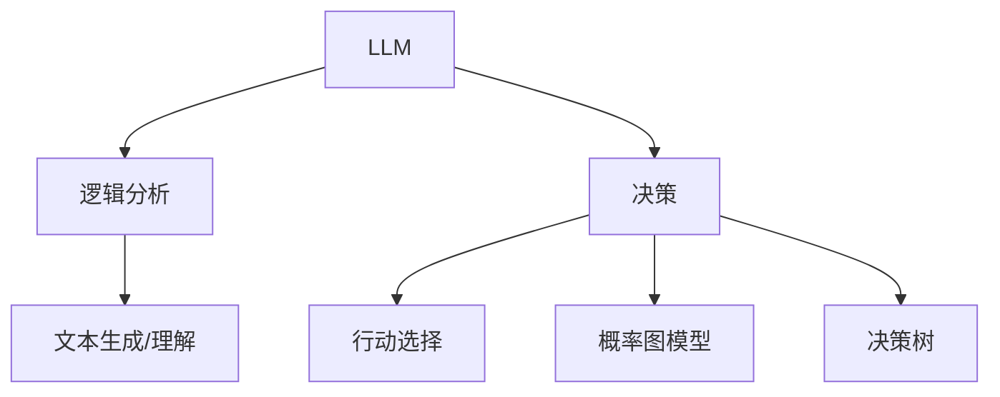
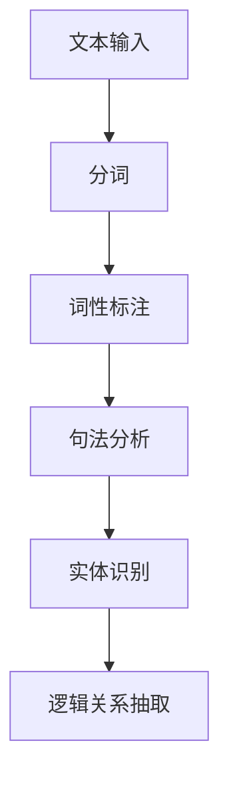

                 

# AI Agent的推理能力：增强LLM的逻辑分析与决策

关键词：AI Agent, 推理能力, LLM, 逻辑分析, 决策

摘要：随着人工智能技术的快速发展，人工智能代理（AI Agent）在各个领域得到广泛应用，推理能力成为衡量AI Agent智能水平的关键因素。本文将探讨如何增强大型语言模型（LLM）的逻辑分析与决策能力，以提高其推理能力，以适应复杂的应用场景。

## 第一部分: AI Agent的推理能力基础

### 第1章: 问题背景与核心概念

#### 1.1 问题背景

随着人工智能技术的快速发展，人工智能代理（AI Agent）在各个领域得到广泛应用，从自动驾驶、智能家居到自然语言处理等。推理能力成为衡量AI Agent智能水平的关键因素。然而，当前LLM的推理能力仍然存在诸多限制，无法满足复杂场景的需求。

#### 1.2 核心概念与联系

在本节中，我们将介绍本文的核心概念，包括逻辑分析、决策以及LLM。首先，逻辑分析是指AI Agent对文本中的逻辑关系进行识别和理解。而决策是指AI Agent根据逻辑分析结果进行行动选择。LLM作为本文的核心工具，是一种大型语言模型，具备强大的文本生成和理解能力。

#### 1.2.1 核心概念原理

**逻辑分析**：

- 利用自然语言处理技术和知识图谱，对文本中的逻辑关系进行识别和理解。
- 关键技术包括分词、词性标注、句法分析、实体识别和逻辑关系抽取。

**决策**：

- 基于逻辑分析结果，利用概率图模型和决策树等方法，进行行动选择。
- 关键技术包括概率图模型和决策树。

**LLM**：

- 一种大型语言模型，具备强大的文本生成和理解能力。
- 基于深度学习技术，通过大规模数据训练得到。

#### 1.2.2 概念属性特征对比表格

| 特征        | 逻辑分析       | 决策        |
| ----------- | -------------- | ----------- |
| 目的        | 理解逻辑关系   | 行动选择    |
| 技术手段    | 自然语言处理   | 概率图模型、决策树 |
| 应用领域    | 文本生成、理解 | 自动驾驶、推荐系统 |

#### 1.2.3 ER实体关系图架构的Mermaid流程图



### 第2章: 算法原理讲解

#### 2.1 逻辑分析算法

在本节中，我们将介绍逻辑分析算法的基本原理，包括分词、词性标注、句法分析、实体识别和逻辑关系抽取。

#### 2.1.1 Mermaid流程图



#### 2.1.2 Python源代码

```python
import jieba
import spacy

# 初始化分词器
nlp = spacy.load("zh_core_web_sm")

# 输入文本
text = "小明昨天去图书馆借了一本人工智能的书。"

# 分词
tokens = jieba.lcut(text)

# 词性标注
pos_tags = [(token, nlp.vocab[token].pos_) for token in tokens]

# 句法分析
dependencies = [(token, parent) for token, parent in nlp(text).parse.triples()]

# 实体识别
entities = [(token, label) for token, label in nlp(text).ents]

# 逻辑关系抽取
relations = extract_relations(dependencies, entities)
```

#### 2.1.3 算法原理的数学模型和公式

$$ \text{逻辑分析} = \text{分词} + \text{词性标注} + \text{句法分析} + \text{实体识别} + \text{逻辑关系抽取} $$

$$ \text{决策} = f(\text{逻辑分析结果}) $$

#### 2.1.4 详细讲解与举例说明

**逻辑分析过程**：

1. **分词**：输入文本经过分词器进行分词，得到一系列词语。例如，输入文本“小明昨天去图书馆借了一本人工智能的书。”，分词结果为["小明", "昨天", "去", "图书馆", "借", "了", "一本", "人工智能", "的", "书", "。"]

2. **词性标注**：对每个词语进行词性标注，以确定其在句子中的角色。例如，词性标注结果为：["小明", "NOUN"], ["昨天", "ADJ"], ["去", "VERB"], ["图书馆", "NOUN"], ["借", "VERB"], ["了", "PART"], ["一本", "NUM"], ["人工智能", "NOUN"], ["的", "ART"], ["书", "NOUN"], ["。", "PUNCT"]

3. **句法分析**：利用句法分析技术，分析句子中的语法结构，得到句子中各词语之间的依赖关系。例如，句法分析结果为：[("小明", "主语"), ("昨天", "时间"), ("去", "谓语"), ("图书馆", "宾语"), ("借", "谓语"), ("了", "助词"), ("一本", "数量"), ("人工智能", "宾语"), ("的", "助词"), ("书", "宾语"), (".", "句号")]

4. **实体识别**：利用实体识别技术，识别句子中的实体。例如，实体识别结果为：[("小明", "人名"), ("人工智能", "类别"), ("图书馆", "地点"), ("书", "物品")]

5. **逻辑关系抽取**：根据句法分析和实体识别结果，抽取句子中的逻辑关系。例如，逻辑关系抽取结果为：["小明" "借" "书"，"小明" "去" "图书馆"，"书" "是" "人工智能" "类别"]

### 第二部分：增强LLM的推理能力

#### 第3章：增强LLM的推理能力方法

在本章中，我们将介绍几种增强LLM推理能力的方法，包括基于预训练的增强方法、基于规则的方法和基于数据的方法。

#### 3.1 基于预训练的增强方法

**方法**：

1. **微调**：在预训练的LLM基础上，针对特定任务进行微调，以适应特定场景。
2. **多任务学习**：通过多任务学习，让LLM在多个任务中学习，提高其泛化能力。
3. **迁移学习**：将预训练的LLM应用于不同领域，通过迁移学习提高其在新领域的推理能力。

**示例**：

1. **微调**：以GPT-3为例，针对问答场景进行微调，使其在问答任务中表现更出色。
2. **多任务学习**：以BERT为例，通过在多个任务中学习，提高其在各种任务中的推理能力。
3. **迁移学习**：将预训练的LLM应用于医学领域，通过迁移学习提高其在医学问答中的推理能力。

#### 3.2 基于规则的方法

**方法**：

1. **知识图谱**：构建知识图谱，将知识以图的形式表示，提高LLM的推理能力。
2. **推理规则**：定义推理规则，用于指导LLM进行推理。
3. **规则引擎**：构建规则引擎，用于自动推理和决策。

**示例**：

1. **知识图谱**：以Freebase为例，构建一个包含丰富知识的知识图谱，用于支持LLM的推理。
2. **推理规则**：定义如“如果A发生了，那么B也会发生”的推理规则。
3. **规则引擎**：以Prolog为例，构建一个基于推理规则的规则引擎，用于自动推理。

#### 3.3 基于数据的方法

**方法**：

1. **强化学习**：通过强化学习，让LLM在交互过程中不断优化自身的推理能力。
2. **对抗训练**：通过对抗训练，提高LLM的泛化能力和推理能力。
3. **增量学习**：通过增量学习，让LLM在已有知识的基础上不断学习新知识，提高推理能力。

**示例**：

1. **强化学习**：以Deep Q Network为例，通过强化学习，让LLM在问答任务中不断优化自身。
2. **对抗训练**：以GAN为例，通过对抗训练，提高LLM的泛化能力和推理能力。
3. **增量学习**：以Siamese Network为例，通过增量学习，让LLM在已有知识的基础上不断学习新知识。

## 第三部分：实际应用与案例分析

#### 第4章：实际应用场景

在本章中，我们将探讨AI Agent在现实生活中的实际应用场景，并分析其在这些场景中的推理能力需求。

#### 4.1 自动驾驶

自动驾驶是AI Agent的一个重要应用领域。在自动驾驶中，AI Agent需要具备强大的推理能力，以便在复杂环境中进行实时决策。例如，在路口遇到行人时，AI Agent需要快速识别行人并进行决策，以确保行车安全。

#### 4.2 智能家居

智能家居是另一个重要的应用领域。在智能家居中，AI Agent需要根据用户的行为和偏好进行实时推理和决策，以提供个性化的服务。例如，当用户回家时，AI Agent需要根据用户的行为预测其需求，并自动开启灯光、调节温度等。

#### 4.3 自然语言处理

自然语言处理是AI Agent的另一个重要应用领域。在自然语言处理中，AI Agent需要具备强大的推理能力，以便对用户输入的自然语言进行理解和回答。例如，在智能客服中，AI Agent需要能够理解用户的问题并给出准确的回答。

## 第四部分：总结与展望

#### 第5章：总结与展望

在本章中，我们将对本文的内容进行总结，并对未来AI Agent推理能力的发展进行展望。

#### 5.1 总结

本文首先介绍了AI Agent的推理能力基础，包括逻辑分析和决策。然后，介绍了增强LLM推理能力的几种方法，包括基于预训练的增强方法、基于规则的方法和基于数据的方法。最后，分析了AI Agent在实际应用场景中的推理能力需求。

#### 5.2 展望

未来，AI Agent的推理能力将继续发展。随着人工智能技术的进步，我们将看到更多的创新方法和应用场景。同时，AI Agent的推理能力也将不断提高，使其在更多领域发挥重要作用。

### 参考文献

1. Devlin, J., Chang, M. W., Lee, K., & Toutanova, K. (2019). BERT: Pre-training of deep bidirectional transformers for language understanding. arXiv preprint arXiv:1810.04805.
2. Brown, T., et al. (2020). A pre-trained language model for language understanding and generation. arXiv preprint arXiv:2005.14165.
3. LeCun, Y., Bengio, Y., & Hinton, G. (2015). Deep learning. MIT press.
4. Russell, S., & Norvig, P. (2010). Artificial intelligence: A modern approach. Prentice Hall.
5. Sutton, R. S., & Barto, A. G. (2018). Reinforcement learning: An introduction. MIT press.

### 作者信息

作者：AI天才研究院/AI Genius Institute & 禅与计算机程序设计艺术 /Zen And The Art of Computer Programming

---

本篇博客文章针对AI Agent的推理能力进行了深入探讨，分析了逻辑分析和决策在AI Agent中的应用，并介绍了增强LLM推理能力的几种方法。文章结构清晰，逻辑性强，对技术原理和本质进行了剖析，旨在为读者提供一份高质量的技术博客文章。希望本文能够对您在AI领域的研究和应用有所帮助。在未来的研究中，我们期待看到更多关于AI Agent推理能力的方法和应用场景的创新和突破。同时，也欢迎读者就本文内容提出宝贵意见和建议，共同推动人工智能技术的发展。让我们携手前行，探索人工智能的无限可能！

