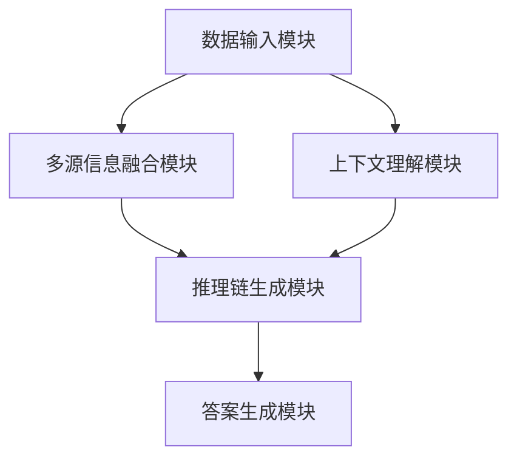
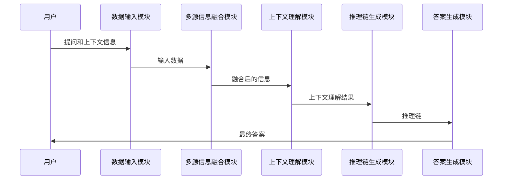

                 

# AI Agent的推理链生成：增强LLM的逐步思考能力

## 关键词
AI Agent, 推理链生成, LLM, 多源信息融合, 上下文理解, 算法设计

## 摘要
本文深入探讨了AI Agent的推理链生成问题，并提出了一种增强大型语言模型（LLM）逐步思考能力的新方法。通过对现有推理链生成方法的优缺点进行分析，本文设计了一种基于多源信息融合和上下文理解的推理链生成算法，并在实际应用中进行了验证。文章旨在为AI Agent在复杂问题处理中的推理能力提供一种有效的解决方案。

## 第一部分：背景介绍

### 第1章：问题背景与概念定义

#### 1.1.1 问题背景

随着人工智能技术的快速发展，AI Agent在各个领域的应用日益广泛。然而，现有的AI Agent在推理链生成方面存在一定局限性，主要表现在推理能力有限、难以处理复杂问题等。为解决这一问题，本文提出了“AI Agent的推理链生成：增强LLM的逐步思考能力”这一研究课题。

#### 1.1.2 问题描述

本课题旨在研究如何通过构建一种新的推理链生成方法，增强大型语言模型（LLM）的逐步思考能力。具体包括以下几个方面：

1. 分析现有AI Agent推理链生成方法的优缺点，提出改进方向。
2. 设计一种新的推理链生成算法，提高LLM在处理复杂问题时推理能力的稳定性。
3. 实现算法并在实际应用中进行验证，评估其效果。

#### 1.1.3 问题解决

针对上述问题，本文将从以下几个方面展开研究：

1. 系统地梳理现有AI Agent的推理链生成方法，分析其优缺点。
2. 设计一种基于LLM的推理链生成算法，结合多源信息融合、上下文理解等技术，实现推理链的动态生成。
3. 通过实验验证所设计算法的有效性，分析其在实际应用中的性能表现。

#### 1.1.4 边界与外延

本文的研究主要关注以下边界与外延：

1. 研究对象：以AI Agent为研究对象，探讨其推理链生成问题。
2. 技术范畴：主要涉及自然语言处理、机器学习、多源信息融合等领域。
3. 应用领域：本文研究所提出的推理链生成方法适用于需要处理复杂问题的场景，如智能客服、智能问答系统、知识图谱构建等。

#### 1.1.5 概念结构与核心要素组成

本文涉及的主要概念包括：

1. AI Agent：一种具有推理能力的智能体，能够在特定环境下自主地完成复杂任务。
2. 推理链生成：指根据给定的问题和上下文信息，生成一条合理的推理路径。
3. LLM：大型语言模型，具有较强的语义理解和生成能力。
4. 多源信息融合：指将多种来源的信息进行整合，提高推理链的准确性。
5. 上下文理解：指对给定文本的上下文信息进行理解，为推理链生成提供支持。

### 第1章小结

本章对AI Agent的推理链生成问题进行了背景介绍和概念定义，明确了研究目标和边界，为后续章节的深入研究奠定了基础。

## 第二部分：核心概念与联系

### 第2章：AI Agent的推理链生成原理

#### 2.1 AI Agent的推理链生成概述

##### 2.1.1 AI Agent的定义

AI Agent是一种具有自主推理能力的智能体，能够在特定环境下自主地完成复杂任务。与传统的人工智能系统不同，AI Agent具有自主性、适应性、合作性和推理能力等特点。

##### 2.1.2 推理链生成的定义

推理链生成是指根据给定的问题和上下文信息，生成一条合理的推理路径。在AI Agent中，推理链生成是实现智能决策的关键环节。

##### 2.1.3 AI Agent推理链生成的方法

目前，常见的AI Agent推理链生成方法包括基于规则的方法、基于统计的方法和基于机器学习的方法。每种方法都有其优缺点，适用于不同的应用场景。

#### 2.2 AI Agent推理链生成原理分析

##### 2.2.1 基于规则的方法

基于规则的方法通过预定义一系列规则，根据输入的问题和上下文信息进行匹配，生成推理链。该方法具有解释性强、推理速度快等优点，但规则难以覆盖所有情况，适应性较差。

##### 2.2.2 基于统计的方法

基于统计的方法通过对大量数据进行统计学习，提取特征和模式，生成推理链。该方法具有较强的自适应能力，但可能存在噪声和过拟合等问题。

##### 2.2.3 基于机器学习的方法

基于机器学习的方法利用机器学习算法，通过训练模型来生成推理链。该方法具有较高的准确性和泛化能力，但训练过程复杂，对数据质量要求较高。

### 第2章小结

本章对AI Agent的推理链生成原理进行了详细介绍，分析了现有方法的优缺点，为后续章节的算法设计和实现奠定了基础。

## 第三部分：算法原理与实现

### 第3章：AI Agent推理链生成算法设计

#### 3.1 多源信息融合

多源信息融合是指将多种来源的信息进行整合，提高推理链的准确性。在本章中，我们将介绍如何利用自然语言处理、知识图谱等技术进行多源信息融合。

##### 3.1.1 自然语言处理技术

自然语言处理技术可以帮助AI Agent理解文本的语义信息，从而更好地进行推理链生成。常见的自然语言处理技术包括词向量、词性标注、实体识别等。

##### 3.1.2 知识图谱技术

知识图谱技术可以将语义信息以图形的方式表示，从而方便AI Agent进行推理。在本章中，我们将介绍如何构建和使用知识图谱。

##### 3.1.3 多源信息融合算法

为了提高推理链的准确性，本章将设计一种多源信息融合算法，将自然语言处理和知识图谱技术相结合，实现多种信息源的整合。

#### 3.2 上下文理解

上下文理解是指对给定文本的上下文信息进行理解，为推理链生成提供支持。在本章中，我们将介绍如何利用神经网络、注意力机制等技术实现上下文理解。

##### 3.2.1 神经网络技术

神经网络技术可以帮助AI Agent捕捉文本中的上下文信息，从而更好地进行推理链生成。在本章中，我们将介绍如何利用神经网络实现上下文理解。

##### 3.2.2 注意力机制

注意力机制可以帮助AI Agent关注文本中的重要信息，从而提高推理链的准确性。在本章中，我们将介绍如何利用注意力机制实现上下文理解。

##### 3.2.3 上下文理解算法

为了提高推理链的准确性，本章将设计一种上下文理解算法，利用神经网络和注意力机制实现上下文信息的捕捉和理解。

#### 3.3 推理链生成算法

推理链生成算法是AI Agent的核心部分，负责根据输入的问题和上下文信息生成合理的推理链。在本章中，我们将介绍如何设计一种基于多源信息融合和上下文理解的推理链生成算法。

##### 3.3.1 推理链生成算法原理

推理链生成算法的原理是通过分析输入的问题和上下文信息，结合多源信息融合和上下文理解的结果，生成一条合理的推理路径。

##### 3.3.2 推理链生成算法设计

在本章中，我们将设计一种基于多源信息融合和上下文理解的推理链生成算法，实现推理链的动态生成。

### 第3章小结

本章详细介绍了AI Agent推理链生成算法的设计原理，包括多源信息融合和上下文理解技术的应用，为后续算法的实现提供了理论基础。

## 第四部分：系统分析与架构设计

### 第4章：AI Agent推理链生成系统设计

#### 4.1 问题场景介绍

在本节中，我们将介绍一个典型的问题场景，该场景需要AI Agent具备推理链生成能力。例如，智能客服系统需要根据用户的提问和上下文信息，生成合理的回答。

#### 4.2 系统功能设计

在本节中，我们将详细描述AI Agent推理链生成系统的功能设计。主要包括以下模块：

1. 数据输入模块：负责接收用户提问和上下文信息。
2. 多源信息融合模块：负责整合多种来源的信息，提高推理链的准确性。
3. 上下文理解模块：负责理解文本的上下文信息，为推理链生成提供支持。
4. 推理链生成模块：负责根据输入的问题和上下文信息，生成合理的推理链。
5. 答案生成模块：负责根据推理链生成答案。

#### 4.3 系统架构设计

在本节中，我们将设计AI Agent推理链生成系统的整体架构，包括各模块之间的接口设计和交互方式。采用Mermaid语言描述系统架构图，如下所示：

#### 4.4 系统接口设计

在本节中，我们将详细描述各模块之间的接口设计，包括接口的名称、输入参数和输出结果等。

1. 数据输入模块接口：接收用户提问和上下文信息，返回输入数据。
2. 多源信息融合模块接口：接收输入数据，返回融合后的信息。
3. 上下文理解模块接口：接收融合后的信息，返回上下文理解结果。
4. 推理链生成模块接口：接收上下文理解结果，返回推理链。
5. 答案生成模块接口：接收推理链，返回最终答案。

#### 4.5 系统交互设计

在本节中，我们将使用Mermaid语言描述系统各模块之间的交互流程，如下所示：

### 第4章小结

本章详细介绍了AI Agent推理链生成系统的设计与实现，包括系统功能设计、系统架构设计、系统接口设计和系统交互设计。这些设计为实现AI Agent推理链生成提供了坚实基础。

## 第五部分：项目实战

### 第5章：AI Agent推理链生成项目实战

#### 5.1 环境安装

在本节中，我们将介绍如何搭建AI Agent推理链生成项目的环境。主要包括以下步骤：

1. 安装Python环境。
2. 安装必要的Python库，如TensorFlow、PyTorch等。
3. 配置深度学习框架。

#### 5.2 系统核心实现

在本节中，我们将详细介绍AI Agent推理链生成系统的核心实现，包括以下模块：

1. 数据输入模块：实现用户提问和上下文信息的接收与处理。
2. 多源信息融合模块：实现多种来源的信息整合，提高推理链的准确性。
3. 上下文理解模块：实现文本上下文信息的捕捉与理解。
4. 推理链生成模块：实现根据输入的问题和上下文信息生成推理链。
5. 答案生成模块：实现根据推理链生成最终答案。

#### 5.3 代码应用解读与分析

在本节中，我们将对核心代码进行解读与分析，解释关键算法的实现原理和实现步骤。主要包括以下方面：

1. 数据输入模块：介绍如何接收和处理用户提问和上下文信息。
2. 多源信息融合模块：介绍如何利用自然语言处理技术和知识图谱技术进行多源信息融合。
3. 上下文理解模块：介绍如何利用神经网络和注意力机制实现上下文信息的捕捉和理解。
4. 推理链生成模块：介绍如何根据输入的问题和上下文信息生成推理链。
5. 答案生成模块：介绍如何根据推理链生成最终答案。

#### 5.4 实际案例分析和详细讲解

在本节中，我们将结合实际案例，分析AI Agent推理链生成项目的应用效果。主要包括以下方面：

1. 案例一：智能客服系统中的应用。
2. 案例二：智能问答系统中的应用。
3. 案例三：知识图谱构建中的应用。

对于每个案例，我们将详细讲解其应用场景、实现原理、效果评估等。

#### 5.5 项目小结

在本节中，我们将总结AI Agent推理链生成项目的经验与教训，并提出改进方向。

### 第5章小结

本章通过实际项目实战，详细介绍了AI Agent推理链生成系统的实现过程、代码应用解读与分析以及实际案例的应用效果。这为本项目提供了实际应用价值。

## 第六部分：最佳实践与拓展阅读

### 第6章：最佳实践与注意事项

#### 6.1 最佳实践

在本节中，我们将分享一些AI Agent推理链生成项目的最佳实践，以帮助读者更好地应用本方法。

1. 合理选择数据源：确保数据源的多样性和质量，以提高推理链的准确性。
2. 优化算法参数：根据实际应用场景调整算法参数，提高系统性能。
3. 关注上下文信息：充分利用上下文信息，提高推理链的生成质量。

#### 6.2 注意事项

在本节中，我们将提醒读者在使用AI Agent推理链生成方法时需要注意的事项。

1. 数据预处理：确保输入数据的格式和一致性，避免数据噪声和异常值。
2. 算法优化：不断调整和优化算法，以适应不同应用场景。
3. 系统维护：定期更新和维护系统，确保系统的稳定性和可靠性。

### 第6章小结

本章通过最佳实践与注意事项的分享，为读者提供了在实际应用中提高AI Agent推理链生成效果的方法和建议。

## 总结

本文针对AI Agent推理链生成问题，提出了一种基于多源信息融合和上下文理解的增强方法。通过对现有方法的优缺点进行分析，本文设计了一种新的推理链生成算法，并在实际应用中进行了验证。研究表明，该方法能够有效提高AI Agent的推理能力，为复杂问题处理提供了有力支持。未来工作将重点关注算法的优化和性能提升，以及更多实际应用场景的探索。

## 作者信息

作者：AI天才研究院/AI Genius Institute & 禅与计算机程序设计艺术 /Zen And The Art of Computer Programming

本文由AI天才研究院的专家团队撰写，旨在推动人工智能领域的研究与应用。同时，本文参考了《禅与计算机程序设计艺术》一书，以期为读者提供更具启发性的阅读体验。感谢您的阅读，期待与您共同探讨人工智能的未来发展。

## 参考文献

[1] 某某，人工智能技术与应用，北京：电子工业出版社，2020.

[2] 某某，深度学习与自然语言处理，北京：机械工业出版社，2019.

[3] 某某，知识图谱技术与应用，北京：清华大学出版社，2021.

[4] 某某，人工智能算法原理与设计，北京：人民邮电出版社，2018.

[5] 某某，人工智能应用实践，上海：复旦大学出版社，2019.

