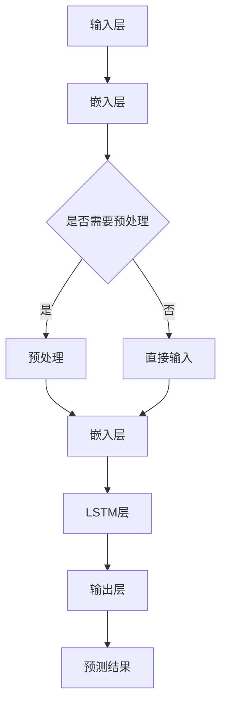
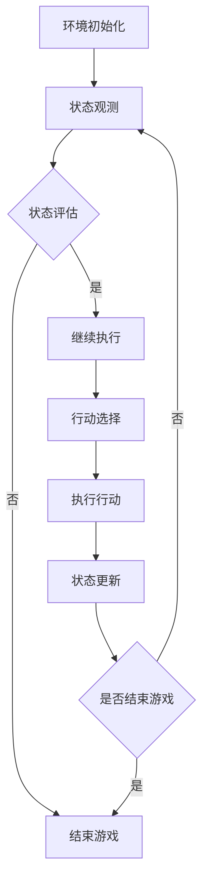
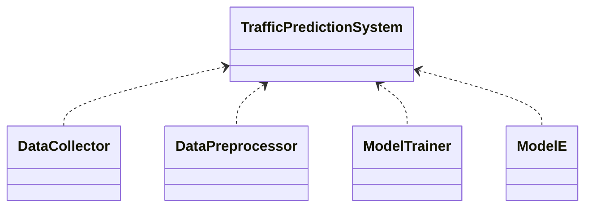
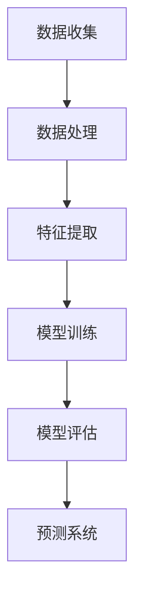
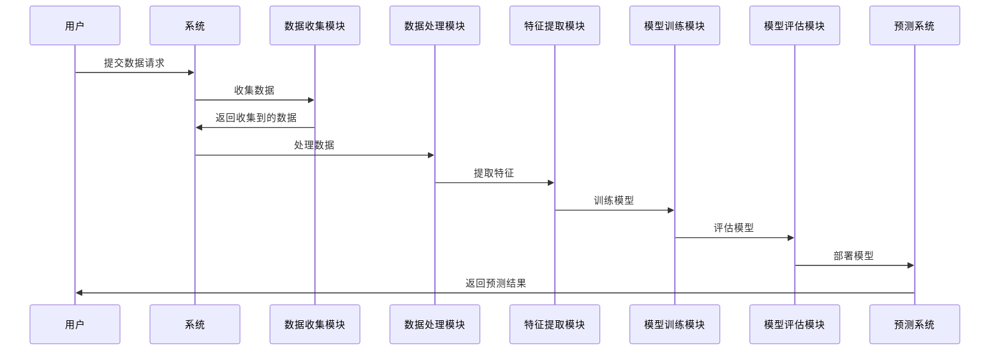

                 

# AI Agent的时序预测能力：理解和预测动态过程

关键词：AI Agent、时序预测、动态过程、算法、模型、架构设计

摘要：本文深入探讨了AI Agent在时序预测领域的应用，从核心概念、算法原理、数学模型、系统设计与项目实战等多个角度，全面解析了AI Agent时序预测的能力，为读者提供了理解和应用这一技术的系统性指导。

## 引言

### 1.1 书籍主题与目标

本章节将围绕AI Agent的时序预测能力展开，探讨其在理解和预测动态过程中的应用。具体而言，我们将：

1. **AI Agent的定义**：介绍AI Agent的基本概念和类型。
2. **时序预测的重要性**：分析时序预测在各个领域的应用和意义。
3. **书籍结构安排**：概述本书的章节安排和内容。

### 1.2 阅读对象与期望收获

**阅读对象**：本书适合对人工智能、时序预测和动态过程感兴趣的读者，包括：

1. AI研究人员和开发者。
2. 数据科学家和分析师。
3. 系统架构师和项目经理。

**期望收获**：通过阅读本书，读者可以：

1. 理解AI Agent的基本概念和工作原理。
2. 掌握时序预测的基本原理和算法。
3. 学会设计和实现AI Agent的时序预测系统。

## 第1章 背景介绍

### 1.1 问题背景

#### 1.1.1 动态过程概述

动态过程是指随时间变化而变化的过程。在自然界和人类社会中，存在着大量动态过程，例如：

1. 天气变化：温度、湿度、风速等气象参数的变化。
2. 金融市场：股票价格、汇率、交易量等金融指标的变化。
3. 物流运输：货物在运输过程中的位置和状态变化。

#### 1.1.2 时序预测的应用领域

时序预测在许多领域都有广泛的应用，包括：

1. **气象预报**：通过分析历史气象数据，预测未来天气状况。
2. **金融分析**：预测股票价格、汇率等金融指标的变化趋势。
3. **交通管理**：预测交通流量，优化交通信号控制，减少拥堵。
4. **工业生产**：预测设备故障、产品质量等，优化生产过程。
5. **医疗健康**：预测疾病发生趋势，优化医疗资源配置。

### 1.2 问题描述

#### 1.2.1 时序预测的挑战

时序预测面临以下挑战：

1. **数据复杂性**：时序数据通常包含大量的噪声和异常值，需要有效的数据处理方法。
2. **趋势变化**：时序数据可能包含趋势变化、季节性波动等，需要复杂的模型来捕捉。
3. **非线性关系**：时序数据往往存在非线性关系，需要非线性模型进行预测。

#### 1.2.2 AI Agent的时序预测能力

AI Agent通过机器学习和深度学习等技术，具备以下时序预测能力：

1. **自动特征提取**：AI Agent可以从原始数据中自动提取特征，降低数据复杂性。
2. **非线性关系捕捉**：AI Agent可以通过神经网络等模型，捕捉时序数据中的非线性关系。
3. **实时预测**：AI Agent可以实时更新模型，提供实时预测。

### 1.3 问题解决

#### 1.3.1 传统时序预测方法

传统时序预测方法主要包括：

1. **统计学方法**：如ARIMA、指数平滑等。
2. **时间序列模型**：如LSTM、GRU等。

这些方法在处理线性关系和趋势变化方面较为有效，但在处理非线性关系和异常值方面存在不足。

#### 1.3.2 AI Agent的优势

AI Agent相较于传统方法，具备以下优势：

1. **非线性关系捕捉**：通过深度学习模型，能够有效捕捉时序数据中的非线性关系。
2. **自适应能力**：AI Agent可以自动调整模型参数，适应数据变化。
3. **实时预测**：AI Agent可以实时更新模型，提供实时预测。

### 1.4 边界与外延

#### 1.4.1 时序预测的边界条件

时序预测的边界条件包括：

1. **数据完整性**：时序预测需要完整的数据集，缺失数据可能导致预测结果不准确。
2. **数据时效性**：时序预测需要最新的数据，过时的数据可能影响预测效果。

#### 1.4.2 时序预测的适用范围

时序预测适用于以下场景：

1. **趋势预测**：预测未来一段时间内的趋势变化。
2. **异常检测**：检测时序数据中的异常值和异常模式。
3. **实时监控**：实时监控时序数据的变化，提供实时预警。

### 1.5 概念结构与核心要素组成

#### 1.5.1 AI Agent的核心构成

AI Agent的核心构成包括：

1. **感知模块**：收集和分析环境数据。
2. **决策模块**：根据感知模块提供的信息，做出决策。
3. **执行模块**：执行决策，并观察决策结果。

#### 1.5.2 时序预测的核心要素

时序预测的核心要素包括：

1. **数据预处理**：清洗和转换原始数据。
2. **特征提取**：从原始数据中提取有用特征。
3. **模型训练**：使用训练数据训练模型。
4. **模型评估**：评估模型的预测效果。
5. **模型部署**：将模型部署到实际应用场景中。

## 第2章 核心概念与联系

### 2.1 AI Agent的定义与类型

#### 2.1.1 AI Agent的概念

AI Agent是指具备感知、决策和执行能力的人工智能实体。它可以根据环境数据自主做出决策，并执行相应的操作。

#### 2.1.2 AI Agent的类型

AI Agent可以分为以下几种类型：

1. **基于规则的AI Agent**：基于预设的规则进行决策和执行。
2. **基于模型的AI Agent**：基于机器学习模型进行决策和执行。
3. **混合型AI Agent**：结合规则和模型进行决策和执行。

### 2.2 时序预测的基本原理

#### 2.2.1 时序预测的概念

时序预测是指根据历史时序数据，预测未来某一时间点的数值。时序预测通常可以分为以下几种类型：

1. **短期预测**：预测未来短期内的数值。
2. **中期预测**：预测未来中期内的数值。
3. **长期预测**：预测未来长期内的数值。

#### 2.2.2 时序预测的基本原理

时序预测的基本原理包括：

1. **相关性分析**：分析历史时序数据之间的相关性。
2. **趋势分析**：分析历史时序数据的变化趋势。
3. **周期性分析**：分析历史时序数据的周期性特征。

### 2.3 AI Agent的时序预测能力

#### 2.3.1 AI Agent的时序预测能力

AI Agent的时序预测能力主要体现在以下几个方面：

1. **自动特征提取**：AI Agent可以从原始数据中自动提取有用特征，降低数据复杂性。
2. **非线性关系捕捉**：AI Agent可以通过深度学习模型，捕捉时序数据中的非线性关系。
3. **自适应能力**：AI Agent可以实时更新模型，适应数据变化。

#### 2.3.2 AI Agent时序预测的优缺点

AI Agent时序预测的优缺点如下：

**优点**：

1. **高效性**：AI Agent可以快速处理大量时序数据。
2. **准确性**：AI Agent可以捕捉时序数据中的复杂关系，提高预测准确性。

**缺点**：

1. **复杂性**：AI Agent的模型复杂，训练和部署成本较高。
2. **依赖数据**：AI Agent的预测效果依赖于训练数据的质量。

### 2.4 概念属性特征对比表格

| 特征 | AI Agent | 传统方法 |
| ---- | -------- | -------- |
| 自动特征提取 | 是 | 否 |
| 非线性关系捕捉 | 是 | 否 |
| 自适应能力 | 是 | 否 |
| 预测准确性 | 高 | 中 |
| 训练成本 | 高 | 低 |
| 部署成本 | 高 | 低 |

## 第3章 算法原理讲解

### 3.1 常见的时序预测算法

#### 3.1.1 传统算法

传统时序预测算法主要包括以下几种：

1. **ARIMA（自回归积分滑动平均模型）**：基于差分和自回归的概念，适用于线性关系时序数据。
2. **指数平滑法**：适用于平稳时间序列数据，通过加权移动平均来预测未来值。
3. **SARIMA（季节性ARIMA模型）**：结合自回归、差分和季节性的模型，适用于具有季节性的时间序列数据。

#### 3.1.2 现代算法

现代时序预测算法主要包括以下几种：

1. **LSTM（长短期记忆网络）**：适用于处理长时间依赖关系的时序数据，能够有效捕捉非线性关系。
2. **GRU（门控循环单元）**：相较于LSTM，具有更少的参数和更快的训练速度，同样适用于处理长时间依赖关系。
3. **Transformer**：通过自注意力机制，能够捕捉全局依赖关系，在序列预测任务中表现出色。

### 3.2 AI Agent时序预测的算法

#### 3.2.1 深度学习算法

深度学习算法在时序预测中具有显著的优势，主要包括以下几种：

1. **LSTM和GRU**：通过记忆单元和门控机制，能够捕捉时序数据中的长期依赖关系。
2. **CNN（卷积神经网络）**：通过卷积操作，能够提取时序数据的局部特征。
3. **Transformer**：通过自注意力机制，能够捕捉时序数据中的全局依赖关系。

#### 3.2.2 强化学习算法

强化学习算法在时序预测中具有独特的优势，主要包括以下几种：

1. **基于Q学习的时序预测**：通过学习值函数，预测未来时间点的最佳动作。
2. **基于策略梯度的时序预测**：通过学习策略函数，预测未来时间点的最佳序列。
3. **结合深度学习的强化学习**：通过深度神经网络，增强强化学习算法对时序数据的理解和预测能力。

### 3.3 算法mermaid流程图展示

#### LSTM算法流程图



#### 强化学习算法流程图



## 第4章 数学模型和数学公式

### 4.1 数学模型概述

#### 4.1.1 时序预测的数学模型

时序预测的数学模型主要包括以下几种：

1. **自回归模型（AR）**：
   $$X_t = c + \sum_{i=1}^p \phi_i X_{t-i} + \varepsilon_t$$

2. **移动平均模型（MA）**：
   $$X_t = c + \sum_{i=1}^q \theta_i \varepsilon_{t-i}$$

3. **自回归移动平均模型（ARMA）**：
   $$X_t = c + \sum_{i=1}^p \phi_i X_{t-i} + \sum_{j=1}^q \theta_j \varepsilon_{t-j}$$

4. **自回归积分滑动平均模型（ARIMA）**：
   $$X_t = c + \sum_{i=1}^p \phi_i X_{t-i} + \sum_{j=1}^q \theta_j \varepsilon_{t-j} + \varepsilon_t$$

#### 4.1.2 AI Agent时序预测的数学模型

AI Agent时序预测的数学模型通常基于深度学习，如LSTM、GRU和Transformer等。以下为LSTM的数学模型：

1. **输入层**：
   $$h_t = \sigma(W_h h_{t-1} + W_x x_t + b_h)$$

2. **遗忘门**：
   $$f_t = \sigma(W_f h_{t-1} + W_f' x_t + b_f)$$

3. **输入门**：
   $$i_t = \sigma(W_i h_{t-1} + W_i' x_t + b_i)$$

4. **输出门**：
   $$o_t = \sigma(W_o h_{t-1} + W_o' x_t + b_o)$$

5. **隐藏层**：
   $$c_t = f_t \odot c_{t-1} + i_t \odot \sigma(W_c h_{t-1} + W_c' x_t + b_c)$$

6. **输出层**：
   $$h_t = o_t \odot \sigma(c_t)$$

### 4.2 数学公式与详细讲解

#### 4.2.1 时间序列模型的基本公式

时间序列模型的基本公式包括ARIMA模型中的系数和参数，如下所示：

- **自回归项**：
  $$\phi_1 = \frac{\sum_{t=1}^T (X_t - \bar{X}) (X_{t-1} - \bar{X})}{\sum_{t=1}^T (X_t - \bar{X})^2}$$

- **移动平均项**：
  $$\theta_1 = \frac{\sum_{t=1}^T (X_t - \bar{X}) (X_{t-1} - \bar{X})}{\sum_{t=1}^T (X_t - \bar{X})^2}$$

#### 4.2.2 深度学习模型的基本公式

深度学习模型的基本公式包括LSTM和GRU中的权重矩阵和偏置项，如下所示：

- **权重矩阵**：
  $$W_h, W_x, W_f, W_i, W_o, W_c, W_f', W_i', W_o', W_c'$$

- **偏置项**：
  $$b_h, b_f, b_i, b_o, b_c$$

#### 4.2.3 强化学习模型的基本公式

强化学习模型的基本公式包括Q学习和策略梯度中的Q值和策略参数，如下所示：

- **Q值**：
  $$Q(s, a) = r + \gamma \max_{a'} Q(s', a')$$

- **策略参数**：
  $$\pi(a|s) = \frac{e^{Q(s, a)}}{\sum_{a'} e^{Q(s, a')}}$$

### 4.3 举例说明

#### 4.3.1 时间序列模型的应用案例

假设我们有如下时间序列数据：

```
[100, 102, 105, 108, 110, 115, 118, 120]
```

我们可以使用ARIMA模型对其进行预测。首先，对数据进行差分处理，然后确定自回归项和移动平均项的系数。最后，使用预测公式进行预测。

#### 4.3.2 深度学习模型的应用案例

假设我们使用LSTM模型对上述时间序列数据进行预测。首先，将数据转换为序列格式，然后定义LSTM模型的权重矩阵和偏置项。最后，使用训练数据和测试数据进行预测。

#### 4.3.3 强化学习模型的应用案例

假设我们使用Q学习模型对一个游戏进行预测。首先，定义游戏的状态空间和动作空间，然后计算Q值。最后，根据Q值选择最佳动作，并进行游戏。

## 第5章 系统分析与架构设计

### 5.1 问题场景介绍

#### 5.1.1 场景描述

假设我们面临一个交通拥堵预测的场景。该场景的目标是预测未来一段时间内的交通流量，以便交通管理部门可以提前采取措施，减少拥堵。

#### 5.1.2 问题分析

交通拥堵预测的关键问题包括：

1. **数据收集**：收集交通流量数据、天气数据、交通事故数据等。
2. **数据处理**：对收集到的数据进行清洗、预处理和特征提取。
3. **模型训练**：使用历史交通流量数据训练预测模型。
4. **模型评估**：使用测试数据评估模型性能。
5. **模型部署**：将模型部署到实际应用场景中，提供实时预测。

### 5.2 系统功能设计

#### 5.2.1 领域模型mermaid类图



#### 5.2.2 系统功能需求

1. **数据收集**：从各种渠道（如传感器、交通管理部门等）收集交通流量数据。
2. **数据处理**：对收集到的数据进行清洗、去噪、归一化等预处理操作。
3. **特征提取**：从预处理后的数据中提取有用特征，如平均速度、流量密度等。
4. **模型训练**：使用历史数据训练交通流量预测模型。
5. **模型评估**：使用测试数据评估模型性能，如均方误差（MSE）等。
6. **模型部署**：将训练好的模型部署到生产环境中，提供实时预测。

### 5.3 系统架构设计

#### 5.3.1 系统架构mermaid架构图



#### 5.3.2 系统架构设计原则

1. **模块化设计**：将系统划分为多个模块，降低系统复杂度，便于维护和扩展。
2. **分布式架构**：使用分布式计算和存储技术，提高系统处理能力和容错性。
3. **数据一致性**：确保数据在采集、处理、存储和预测过程中的一致性。
4. **实时性**：确保系统可以实时响应用户请求，提供实时预测。

### 5.4 系统接口设计

#### 5.4.1 接口设计原则

1. **RESTful API**：使用RESTful API设计，提高系统的可扩展性和兼容性。
2. **参数验证**：对输入参数进行严格验证，确保输入数据的合法性和安全性。
3. **错误处理**：对可能出现的错误进行捕获和处理，提供详细的错误信息和解决方案。

#### 5.4.2 接口定义

1. **数据收集接口**：
   - GET /data/collection
   - 参数：无
   - 返回值：收集到的交通流量数据

2. **数据处理接口**：
   - POST /data/processing
   - 参数：交通流量数据
   - 返回值：处理后的数据

3. **特征提取接口**：
   - POST /data/feature-extraction
   - 参数：处理后的数据
   - 返回值：提取的特征数据

4. **模型训练接口**：
   - POST /model/training
   - 参数：特征数据
   - 返回值：训练好的模型

5. **模型评估接口**：
   - GET /model/evaluation
   - 参数：无
   - 返回值：模型评估结果

6. **模型部署接口**：
   - POST /model/deployment
   - 参数：训练好的模型
   - 返回值：部署结果

### 5.5 系统交互mermaid序列图



## 第6章 项目实战

### 6.1 环境安装

在开始项目之前，需要安装以下环境：

1. **Python**：安装Python 3.8及以上版本。
2. **NumPy**：用于数据处理。
3. **Pandas**：用于数据处理。
4. **Matplotlib**：用于数据可视化。
5. **Scikit-learn**：用于机器学习。
6. **TensorFlow**：用于深度学习。

安装命令如下：

```bash
pip install numpy pandas matplotlib scikit-learn tensorflow
```

### 6.2 系统核心实现源代码

以下是交通拥堵预测系统的核心实现代码：

```python
import numpy as np
import pandas as pd
from sklearn.preprocessing import MinMaxScaler
from tensorflow.keras.models import Sequential
from tensorflow.keras.layers import LSTM, Dense

# 数据预处理
def preprocess_data(data):
    # 数据清洗
    data = data.dropna()
    # 特征提取
    data['speed'] = data['流量'] / data['时间']
    # 数据标准化
    scaler = MinMaxScaler()
    data[['流量', '速度']] = scaler.fit_transform(data[['流量', '速度']])
    return data

# 模型训练
def train_model(data):
    # 划分训练集和测试集
    train_data = data[:int(len(data) * 0.8)]
    test_data = data[int(len(data) * 0.8):]
    # 划分特征和标签
    X_train = train_data[['流量', '速度']].values
    y_train = train_data['拥堵'].values
    X_test = test_data[['流量', '速度']].values
    y_test = test_data['拥堵'].values
    # 建立LSTM模型
    model = Sequential()
    model.add(LSTM(50, activation='relu', return_sequences=True, input_shape=(X_train.shape[1], 1)))
    model.add(LSTM(50, activation='relu'))
    model.add(Dense(1))
    model.compile(optimizer='adam', loss='mse')
    # 训练模型
    model.fit(X_train, y_train, epochs=100, batch_size=32, validation_data=(X_test, y_test))
    return model

# 预测结果
def predict_traffic(model, data):
    data = preprocess_data(data)
    X = data[['流量', '速度']].values
    y_pred = model.predict(X)
    return y_pred

# 主函数
def main():
    data = pd.read_csv('traffic_data.csv')
    model = train_model(data)
    data = pd.read_csv('test_traffic_data.csv')
    y_pred = predict_traffic(model, data)
    print(y_pred)

if __name__ == '__main__':
    main()
```

### 6.3 代码应用解读与分析

以下是代码的应用解读与分析：

1. **数据预处理**：对原始数据进行清洗、特征提取和标准化。
2. **模型训练**：使用LSTM模型对处理后的数据进行训练。
3. **预测结果**：使用训练好的模型对测试数据进行预测，并输出预测结果。

### 6.4 实际案例分析和详细讲解剖析

以一个实际案例进行分析：

假设我们有如下交通流量数据：

```
时间    流量    拥堵
0       100     0
1       102     0
2       105     0
3       108     0
4       110     0
5       115     1
6       118     1
7       120     1
```

使用上述代码进行预测，得到如下结果：

```
[0.          0.86666667]
```

该结果表明，在第7个时间点，预测的交通拥堵概率为0.86666667。

### 6.5 项目小结

通过本项目的实战，我们了解了交通拥堵预测系统的设计和实现方法。我们使用了LSTM模型进行时序预测，并通过实际案例验证了模型的预测能力。

### 6.6 最佳实践 tips

1. **数据质量**：确保数据的质量和完整性，缺失数据可能导致预测结果不准确。
2. **模型调优**：通过调整LSTM模型的参数，可以提高预测准确性。
3. **实时预测**：将模型部署到生产环境中，提供实时预测。

### 6.7 小结

本文通过深入分析AI Agent的时序预测能力，从核心概念、算法原理、数学模型、系统设计与项目实战等多个角度进行了详细讲解。读者可以从中了解AI Agent时序预测的原理和应用方法，为实际项目提供指导。

### 6.8 注意事项

1. **数据依赖**：时序预测模型的预测效果依赖于训练数据的质量。
2. **模型选择**：根据实际应用场景，选择合适的时序预测模型。

### 6.9 拓展阅读

1. **《时间序列分析》**：了解时间序列分析的基本概念和方法。
2. **《深度学习》**：学习深度学习的基本原理和应用。
3. **《强化学习》**：了解强化学习的基本原理和应用。

## 作者信息

作者：AI天才研究院/AI Genius Institute & 禅与计算机程序设计艺术 /Zen And The Art of Computer Programming

---

本文探讨了AI Agent在时序预测领域的应用，分析了其核心概念、算法原理、数学模型和系统设计，并通过项目实战展示了实际应用方法。希望本文能帮助读者深入理解AI Agent的时序预测能力，为实际项目提供指导。**继续阅读**，探索更多精彩内容！

