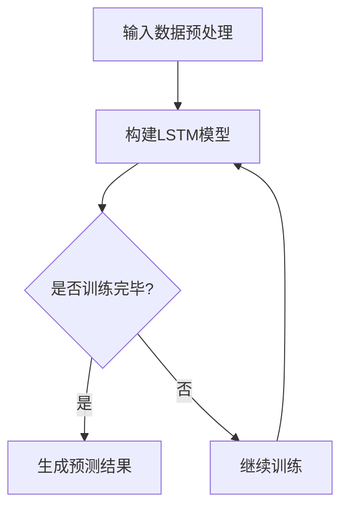
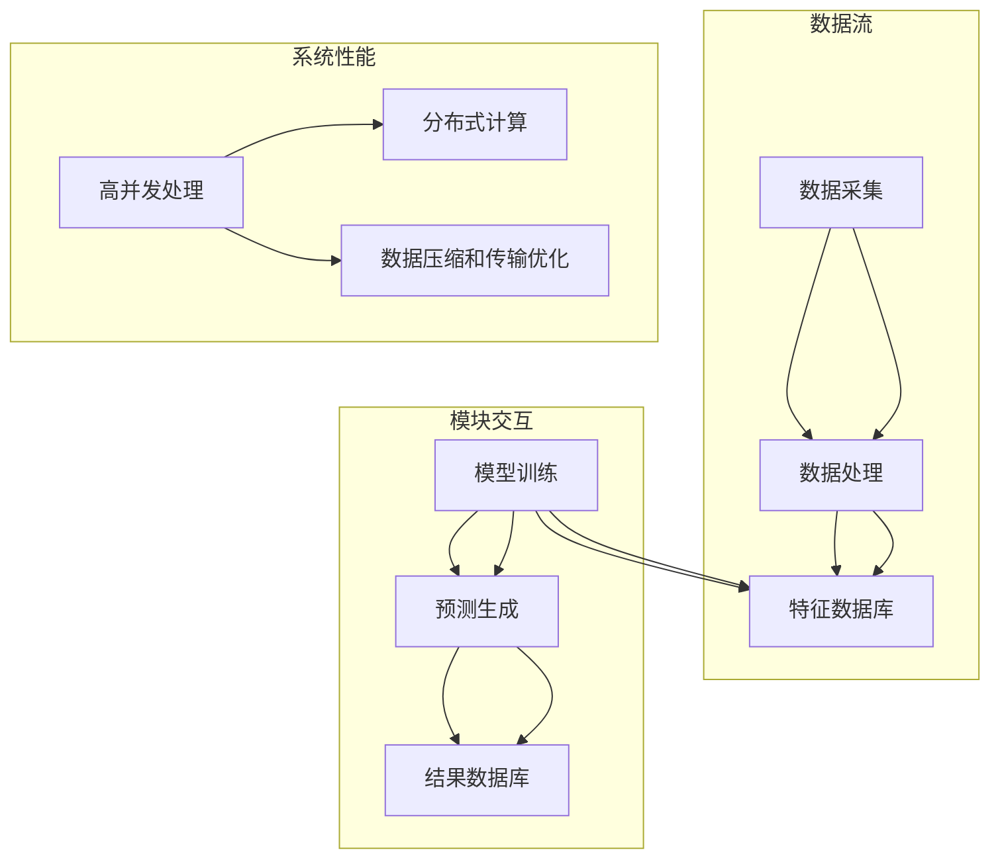
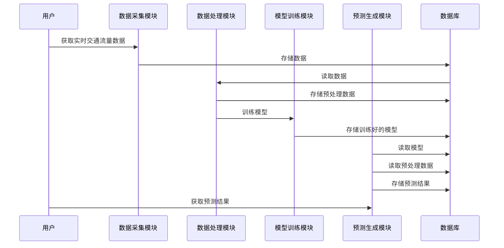

                 

### # AI Agent的时序预测能力：理解和预测动态过程

> 关键词：AI Agent、时序预测、动态过程、深度学习、强化学习、系统架构、项目实战

> 摘要：本文旨在深入探讨AI Agent的时序预测能力，包括其在理解和预测动态过程中的关键角色。通过逐步分析，我们将梳理出时序预测的基本概念、算法原理、系统架构以及实际应用，从而全面了解AI Agent在预测动态过程中的强大能力。

#### 引言

在当今信息爆炸的时代，理解和预测动态过程已成为各行各业的重要需求。从金融市场到交通管理，从环境监测到医疗诊断，时序预测无处不在。然而，传统的预测方法往往存在局限，难以应对复杂且动态变化的现实世界。随着人工智能技术的发展，AI Agent作为一种智能化实体，展现出在时序预测中的独特优势。本文将围绕AI Agent的时序预测能力，展开深入探讨。

本书结构安排如下：

1. **引言**：介绍时序预测的背景和重要性，以及AI Agent的基本概念。
2. **背景介绍**：详细阐述动态过程的特点和时序预测的应用领域，探讨AI Agent在时序预测中的优势。
3. **核心概念与联系**：介绍AI Agent和时序预测的基本概念，并对比分析其属性特征。
4. **算法原理讲解**：讲解常见的时序预测算法，特别是AI Agent所使用的深度学习和强化学习算法，以及相关的数学模型和公式。
5. **系统分析与架构设计**：通过实际案例，介绍系统功能设计、系统架构设计、系统接口设计以及系统交互过程。
6. **项目实战**：通过具体的项目实例，展示AI Agent时序预测的应用，包括环境安装、系统核心实现以及代码解读。
7. **最佳实践与小结**：总结最佳实践，回顾文章要点，提出注意事项和拓展阅读建议。

阅读对象主要为对时序预测和人工智能感兴趣的读者，包括AI开发者、数据科学家、软件工程师等。通过本书，读者可以系统地了解AI Agent在时序预测中的应用，掌握相关技术和方法，从而在现实项目中更好地利用AI Agent的预测能力。

#### 设计目录大纲的步骤

1. **明确书的核心主题**：《AI Agent的时序预测能力：理解和预测动态过程》。
2. **确定书的结构**：一般包括引言、背景介绍、核心概念、算法原理讲解、数学模型和公式、系统分析与架构设计、项目实战、最佳实践等章节。
3. **细化章节内容**：根据核心主题，将各个章节的具体内容进行细化。以下是书的目录大纲：

## 引言

### 1.1 书籍主题与目标
- **AI Agent的定义**：介绍AI Agent的基本概念和特点。
- **时序预测的重要性**：分析时序预测在各个领域的应用和影响。
- **书籍结构安排**：概述本书的结构和内容安排。

### 1.2 阅读对象与期望收获
- **阅读对象**：确定主要的阅读群体和适合的读者背景。
- **预期收获**：描述读者通过本书可以获得的技能和知识。

## 第1章 背景介绍

### 1.1 问题背景
- **动态过程概述**：介绍动态过程的基本概念和特点。
- **时序预测的应用领域**：分析时序预测在不同领域的应用场景。

### 1.2 问题描述
- **时序预测的挑战**：讨论时序预测面临的困难和挑战。
- **AI Agent的时序预测能力**：探讨AI Agent在时序预测方面的优势和潜力。

### 1.3 问题解决
- **传统时序预测方法**：介绍常见的时序预测方法和技术。
- **AI Agent的优势**：分析AI Agent相对于传统方法的优越性。

### 1.4 边界与外延
- **时序预测的边界条件**：讨论时序预测在实际应用中的限制和约束。
- **时序预测的适用范围**：分析时序预测在不同场景下的适用性。

### 1.5 概念结构与核心要素组成
- **AI Agent的核心构成**：详细介绍AI Agent的组成部分和功能。
- **时序预测的核心要素**：分析时序预测的关键要素和组成部分。

## 第2章 核心概念与联系

### 2.1 AI Agent的定义与类型
- **AI Agent的概念**：解释AI Agent的定义和基本特性。
- **AI Agent的类型**：介绍不同类型的AI Agent及其应用场景。

### 2.2 时序预测的基本原理
- **时序预测的概念**：解释时序预测的定义和基本原理。
- **时序预测的基本原理**：阐述时序预测的基础理论和核心概念。

### 2.3 AI Agent的时序预测能力
- **AI Agent的时序预测能力**：分析AI Agent在时序预测方面的能力。
- **AI Agent时序预测的优缺点**：比较AI Agent与传统时序预测方法的优缺点。

### 2.4 概念属性特征对比表格
- **概念属性特征对比表格**：列出AI Agent和时序预测的关键属性和特征，并进行对比分析。

## 第3章 算法原理讲解

### 3.1 常见的时序预测算法
- **传统算法**：介绍常见的传统时序预测算法及其原理。
- **现代算法**：介绍现代时序预测算法的最新发展和技术。

### 3.2 AI Agent时序预测的算法
- **深度学习算法**：详细讲解深度学习算法在时序预测中的应用。
- **强化学习算法**：分析强化学习算法在时序预测中的优势和挑战。

### 3.3 算法mermaid流程图展示
- **mermaid流程图展示**：使用mermaid语言绘制算法流程图，直观展示算法的运行过程。

## 第4章 数学模型和数学公式

### 4.1 数学模型概述
- **时序预测的数学模型**：介绍时序预测中常用的数学模型和模型构建方法。
- **AI Agent时序预测的数学模型**：分析AI Agent时序预测所依赖的数学模型和公式。

### 4.2 数学公式与详细讲解
- **时间序列模型的基本公式**：介绍时间序列模型的基本公式和参数设置。
- **深度学习模型的基本公式**：详细讲解深度学习模型中的关键公式和计算方法。
- **强化学习模型的基本公式**：分析强化学习模型中的主要公式和策略优化过程。

### 4.3 举例说明
- **时间序列模型的应用案例**：通过实际案例展示时间序列模型的应用过程。
- **深度学习模型的应用案例**：分析深度学习模型在时序预测中的实际应用。
- **强化学习模型的应用案例**：探讨强化学习模型在复杂动态环境中的效果和挑战。

## 第5章 系统分析与架构设计

### 5.1 问题场景介绍
- **场景描述**：描述具体的时序预测应用场景和问题背景。
- **问题分析**：分析场景中存在的问题和需求，确定时序预测的目标。

### 5.2 系统功能设计
- **领域模型mermaid类图**：绘制系统领域模型，展示不同实体之间的关系。
- **系统功能需求**：明确系统的功能需求，包括输入处理、预测模型训练和结果输出等。

### 5.3 系统架构设计
- **系统架构mermaid架构图**：绘制系统架构图，展示各个组件和模块之间的关系。
- **系统架构设计原则**：分析系统架构设计的关键原则和最佳实践。

### 5.4 系统接口设计
- **接口设计原则**：介绍系统接口设计的基本原则和设计规范。
- **接口定义**：详细描述系统接口的输入输出参数和功能定义。

### 5.5 系统交互mermaid序列图
- **系统交互mermaid序列图**：绘制系统交互序列图，展示系统在不同状态下的运行过程。

## 第6章 项目实战

### 6.1 环境安装
- **环境搭建**：介绍项目所需的软件和硬件环境，包括操作系统、编程语言和依赖库等。
- **工具和框架**：介绍项目中使用的主要工具和框架，以及安装和配置方法。

### 6.2 系统核心实现源代码
- **源代码解析**：详细解析系统的核心实现代码，解释关键算法和数据处理流程。
- **代码注释与解读**：提供代码的详细注释和解读，帮助读者理解代码的工作原理。

### 6.3 代码应用解读与分析
- **代码应用场景**：分析代码在不同应用场景下的运行效果和优化策略。
- **性能评估与调优**：评估系统性能，提出优化方法和改进建议。

### 6.4 实际案例分析和详细讲解
- **实际案例**：介绍实际应用中的案例，展示系统在真实环境中的表现。
- **详细讲解剖析**：详细讲解案例的实现过程和关键点，分析问题和解决方案。

### 6.5 项目小结
- **项目总结**：总结项目的主要成果和经验教训。
- **未来展望**：探讨项目未来的发展方向和改进空间。

## 最佳实践与小结

### 最佳实践 tips
- **注意事项**：提醒读者在应用时序预测过程中需要注意的关键问题和风险。
- **拓展阅读**：推荐相关的书籍、文章和资源，帮助读者深入学习和研究。

### 小结
- **文章要点回顾**：回顾文章的主要内容和关键知识点。
- **未来研究方向**：探讨时序预测领域未来的发展方向和研究趋势。

### 注意事项
- **数据预处理**：时序预测中的数据预处理至关重要，确保数据的准确性和一致性。
- **模型选择与优化**：根据具体应用场景选择合适的模型，并进行参数优化。
- **结果验证与评估**：对预测结果进行验证和评估，确保模型的可靠性和准确性。

### 拓展阅读
- **相关书籍**：《深度学习》、《强化学习基础》等。
- **在线课程**：推荐相关的在线课程和教程，帮助读者深入学习。
- **学术资源**：提供相关的研究论文和报告，拓展读者的研究视野。

通过本文的深入探讨，读者将全面了解AI Agent在时序预测中的应用，掌握相关技术和方法，为实际项目提供有力支持。希望本文能对读者在时序预测领域的学习和研究有所启发和帮助。

### 第1章 背景介绍

#### 动态过程概述

动态过程是指随时间变化而变化的过程。这类过程在自然界、社会和工程技术等领域中广泛存在。例如，股票市场的价格波动、气象变化、网络流量、交通流量、生物体的生理活动等，都是典型的动态过程。动态过程的特点是变化性、复杂性和不确定性。因此，对动态过程进行准确的预测和模拟具有重要的实际意义。

首先，动态过程的变化性意味着它们不是静止不变的，而是随着时间不断演变的。例如，一天中的气温变化、股市的波动等，都是动态变化的过程。其次，动态过程的复杂性体现在其内部可能包含多个变量，并且这些变量之间可能存在复杂的相互作用和反馈关系。最后，动态过程的不确定性源于其对未来状态的预测存在不确定性，这可能受到外部环境、内部随机因素等多种因素的影响。

#### 时序预测的应用领域

时序预测在许多领域都有广泛应用，主要包括以下几个领域：

1. **金融市场**：在金融市场中，时序预测用于预测股票价格、汇率、利率等金融指标。通过对历史数据的分析和模型预测，投资者可以做出更明智的投资决策。

2. **能源管理**：在能源管理中，时序预测用于预测电力需求、天然气消耗等。这有助于电力公司和能源供应商合理安排生产计划，优化资源配置，提高能源利用效率。

3. **交通管理**：在交通管理中，时序预测用于预测交通流量、公共交通需求等。这有助于交通部门更好地规划交通路线、调整公共交通班次，提高交通运行效率。

4. **环境监测**：在环境监测中，时序预测用于预测污染物浓度、气候变化等。这有助于环境保护部门采取相应的措施，预防和控制环境污染。

5. **医疗诊断**：在医疗诊断中，时序预测用于预测患者病情的演变、药物疗效等。这有助于医生制定更有效的治疗方案，提高医疗质量。

#### 问题描述

时序预测的基本问题是如何利用历史数据来预测未来的趋势和模式。尽管时序预测在各个领域都有广泛应用，但它在实际应用中也面临着许多挑战。以下是时序预测面临的主要挑战：

1. **数据噪声和缺失**：时序数据通常会受到噪声和缺失值的影响。噪声可能来自数据采集过程中的误差或外部干扰，而缺失值可能是由于数据不完整或记录丢失。这些数据问题会影响预测的准确性和可靠性。

2. **数据周期性和趋势性**：许多时序数据具有周期性和趋势性。周期性数据表现为重复的模式，如季节性波动或日周期性变化；而趋势性数据则表现为持续的增长或下降。正确识别和处理这些周期性和趋势性对于预测结果至关重要。

3. **模型选择和参数调整**：不同的时序预测方法适用于不同类型的数据和场景。选择合适的模型并进行参数调整是时序预测中的关键步骤。然而，模型选择和参数调整过程往往复杂且费时。

4. **实时性和可扩展性**：在实际应用中，时序预测需要快速响应并适应大量数据。这要求预测模型具有高实时性和可扩展性，以便在数据规模和复杂性增加时仍能高效运行。

5. **模型泛化能力**：时序预测模型需要在未见过的数据上具有良好的泛化能力。然而，训练数据的质量和数量可能影响模型的泛化性能。如何提高模型的泛化能力是一个重要的研究方向。

#### AI Agent的时序预测能力

AI Agent作为一种智能化实体，具有强大的时序预测能力。与传统方法相比，AI Agent在时序预测中具有以下优势：

1. **自适应性和自学习能力**：AI Agent可以通过不断学习和调整来适应新的环境和数据变化。它们可以从历史数据中学习模式，并自动调整预测模型，从而提高预测的准确性和可靠性。

2. **处理复杂性和不确定性**：AI Agent可以处理复杂且不确定的时序数据。它们可以通过深度学习和强化学习等算法，识别数据中的周期性、趋势性和随机性，并生成准确的预测结果。

3. **高效性和可扩展性**：AI Agent可以高效地处理大量数据，并具有良好的可扩展性。通过分布式计算和并行处理等技术，AI Agent可以快速处理大规模数据集，并在分布式系统中运行。

4. **多维度和多模型集成**：AI Agent可以通过集成多个模型和维度信息，提高预测的准确性和鲁棒性。例如，结合时间序列模型和强化学习模型，可以更好地应对复杂和动态的预测任务。

#### 传统时序预测方法

传统的时序预测方法主要包括以下几种：

1. **移动平均法**：移动平均法通过计算过去一段时间内数据的平均值来预测未来的趋势。这种方法简单易行，但无法处理周期性和趋势性数据。

2. **指数平滑法**：指数平滑法对历史数据进行加权处理，给最近的数据更大的权重。这种方法可以处理趋势性数据，但对周期性数据的预测效果较差。

3. **自回归模型（AR）**：自回归模型利用历史数据中的相关性来预测未来的趋势。这种方法适用于线性时序数据，但在非线性和周期性数据上的表现不佳。

4. **ARIMA模型**：ARIMA（自回归积分滑动平均模型）结合了自回归、差分和移动平均等方法，可以处理非线性、非平稳和周期性数据。但ARIMA模型的参数调整和优化过程较为复杂。

#### AI Agent的优势

AI Agent相对于传统方法在时序预测中具有明显优势：

1. **自适应性**：AI Agent可以通过学习历史数据中的模式来自动调整预测模型，从而适应数据变化。这种自适应性使AI Agent在处理动态和不确定的数据时表现更为出色。

2. **非线性处理能力**：AI Agent可以通过深度学习算法处理非线性数据。深度神经网络具有强大的非线性建模能力，可以捕捉数据中的复杂模式和关系。

3. **多模型集成**：AI Agent可以通过集成多个模型和维度信息，提高预测的准确性和鲁棒性。例如，结合时间序列模型和强化学习模型，可以更好地应对复杂和动态的预测任务。

4. **高效性和可扩展性**：AI Agent可以利用分布式计算和并行处理等技术，高效地处理大规模数据集。这使AI Agent在实时性和可扩展性方面具有明显优势。

#### 时序预测的边界条件

时序预测在实际应用中存在一些边界条件，这些条件可能影响预测的准确性和可靠性：

1. **数据质量**：时序预测依赖于高质量的数据。数据中的噪声、缺失值和异常值都会影响预测结果。因此，在进行时序预测之前，需要对数据进行清洗和预处理。

2. **模型选择**：选择合适的模型对于预测结果至关重要。不同的模型适用于不同类型的数据和场景。因此，需要根据实际问题和数据特点选择合适的模型。

3. **参数调整**：模型的参数调整对预测结果也有重要影响。参数设置不当可能导致预测效果不佳。因此，需要通过交叉验证和超参数优化等方法调整模型参数。

4. **预测范围**：时序预测的预测范围通常受到数据长度和模型稳定性的限制。过长的预测范围可能导致模型过度拟合或失去稳定性。因此，需要合理设置预测范围。

#### 时序预测的适用范围

时序预测适用于许多领域和场景，包括但不限于以下：

1. **金融市场**：预测股票价格、汇率、利率等金融指标，帮助投资者做出更明智的决策。

2. **能源管理**：预测电力需求、天然气消耗等，优化资源配置，提高能源利用效率。

3. **交通管理**：预测交通流量、公共交通需求等，优化交通路线和公共交通班次，提高交通运行效率。

4. **环境监测**：预测污染物浓度、气候变化等，帮助环保部门采取相应的措施，预防和控制环境污染。

5. **医疗诊断**：预测患者病情的演变、药物疗效等，帮助医生制定更有效的治疗方案。

#### AI Agent的核心构成

AI Agent的核心构成主要包括以下几个方面：

1. **感知模块**：感知模块负责接收外部环境的信息，如传感器数据、文本、图像等。这些信息用于训练和更新AI Agent的知识库。

2. **知识库**：知识库是AI Agent存储和管理的知识库。它包含历史数据、规则、模型等。知识库的更新和维护是AI Agent持续学习和优化的基础。

3. **推理引擎**：推理引擎是AI Agent的核心模块，负责根据输入信息进行逻辑推理和决策。推理引擎通常基于机器学习和自然语言处理等技术。

4. **行为模块**：行为模块负责执行AI Agent的决策和行动。它可以根据推理结果调整AI Agent的行为，以实现特定的目标。

5. **反馈机制**：反馈机制用于收集AI Agent的行为效果和用户反馈。这些反馈可以用于优化AI Agent的模型和算法，提高其性能和可靠性。

#### 时序预测的核心要素

时序预测的核心要素包括以下几个方面：

1. **数据**：数据是时序预测的基础。高质量的时序数据对于预测结果的准确性至关重要。数据的质量直接影响模型的性能。

2. **模型**：模型是时序预测的核心。不同的模型适用于不同类型的数据和场景。选择合适的模型是预测成功的关键。

3. **参数**：参数是模型的调节器。合理的参数设置可以提高模型的预测性能。参数调整通常通过交叉验证和超参数优化等方法进行。

4. **算法**：算法是模型实现的基础。时序预测算法包括线性模型、非线性模型、深度学习模型等。算法的选择和优化对预测结果有重要影响。

5. **评估指标**：评估指标用于评估预测结果的准确性和可靠性。常见的评估指标包括均方误差、均方根误差、相关系数等。

### 第2章 核心概念与联系

#### AI Agent的定义与类型

AI Agent是一种智能化实体，它可以在特定环境下自主执行任务，并与其他系统或实体进行交互。AI Agent的基本定义包括以下几个方面：

1. **自主性**：AI Agent具有自主决策的能力，可以自主选择行动策略，以实现特定目标。
2. **适应性**：AI Agent可以根据环境变化和任务需求，自主调整行为和策略。
3. **交互性**：AI Agent可以与其他系统或实体进行交互，获取外部信息，并基于这些信息进行决策。
4. **学习性**：AI Agent具有学习能力，可以通过经验学习和知识更新，提高其性能和可靠性。

根据AI Agent的功能和应用场景，可以将其分为以下几种类型：

1. **专家系统**：专家系统是基于知识表示和推理的AI Agent，主要用于处理复杂的问题和决策。它们通常具有丰富的知识库和推理算法，可以模拟人类专家的决策过程。
2. **智能机器人**：智能机器人是具有感知、决策和执行能力的AI Agent，可以在物理环境中执行复杂任务。它们通常配备有传感器和执行器，可以通过感知环境信息和执行物理动作来完成任务。
3. **对话系统**：对话系统是具有自然语言理解和生成能力的AI Agent，可以与用户进行自然语言交互。它们通常用于客服、智能助手等场景，提供自动化服务和信息查询。
4. **自动驾驶系统**：自动驾驶系统是具有感知、规划和执行能力的AI Agent，可以在无人驾驶模式下自主驾驶车辆。它们通常利用计算机视觉、传感器融合和深度学习等技术，实现车辆的自主驾驶。

#### 时序预测的基本原理

时序预测是一种基于历史数据对未来趋势进行预测的方法。其基本原理可以概括为以下几步：

1. **数据收集**：收集相关的时序数据，包括历史观测值和相关的特征变量。
2. **数据预处理**：对收集到的数据进行清洗、归一化和特征提取，以提高数据的质量和可预测性。
3. **模型选择**：根据数据的特征和预测目标，选择合适的时序预测模型。常见的模型包括线性模型、ARIMA模型、LSTM模型等。
4. **模型训练**：使用历史数据对选定的模型进行训练，通过最小化损失函数来优化模型的参数。
5. **模型评估**：使用验证集或测试集对训练好的模型进行评估，以确定其预测性能和可靠性。
6. **预测生成**：使用训练好的模型对新的数据或未来的时间点进行预测，生成预测结果。

#### AI Agent的时序预测能力

AI Agent的时序预测能力主要体现在以下几个方面：

1. **自适应学习**：AI Agent可以通过不断学习历史数据和反馈信息，自适应地调整预测模型和策略，以适应动态变化的环境。
2. **多模型集成**：AI Agent可以利用多种预测模型和算法，通过模型集成和优化，提高预测的准确性和鲁棒性。
3. **实时预测**：AI Agent可以实时处理和分析大量时序数据，快速生成预测结果，以支持实时决策和行动。
4. **多维度预测**：AI Agent可以同时预测多个相关的时序变量，通过多维预测来提高预测的完整性和可靠性。

#### AI Agent时序预测的优缺点

AI Agent时序预测的优点包括：

1. **自适应性和自学习能力**：AI Agent可以通过学习历史数据和反馈信息，自适应地调整预测模型和策略，以应对环境变化和不确定性。
2. **多模型集成和优化**：AI Agent可以利用多种预测模型和算法，通过模型集成和优化，提高预测的准确性和鲁棒性。
3. **实时性和高效性**：AI Agent可以实时处理和分析大量时序数据，快速生成预测结果，以支持实时决策和行动。

AI Agent时序预测的缺点包括：

1. **数据依赖性**：AI Agent的预测性能高度依赖于历史数据和训练质量，如果数据质量不佳或训练过程不当，可能导致预测结果不准确。
2. **计算复杂度**：深度学习和强化学习等AI算法通常具有较高的计算复杂度，需要大量计算资源和时间。
3. **解释性不足**：AI Agent的预测过程往往是非线性和复杂的，难以提供明确的解释和可解释性，这在某些应用场景中可能带来挑战。

### 概念属性特征对比表格

以下是AI Agent和时序预测的关键属性和特征对比表格：

| 特征         | AI Agent                | 时序预测               |
| ------------ | ----------------------- | ---------------------- |
| 自主性       | 是                      | 否                     |
| 适应性       | 是                      | 是                     |
| 交互性       | 是                      | 是                     |
| 学习性       | 是                      | 是                     |
| 预测能力     | 强                      | 强                     |
| 数据依赖性   | 高                      | 高                     |
| 计算复杂度   | 高                      | 中等至高               |
| 解释性       | 低                      | 中等至高               |

### 总结

通过本章的讨论，我们了解了AI Agent的定义和类型，以及时序预测的基本原理和AI Agent在时序预测中的能力。AI Agent在时序预测中具有自适应学习、多模型集成和实时预测等优势，但也存在数据依赖性、计算复杂度和解释性不足等挑战。理解这些核心概念和特征对于深入探讨AI Agent在时序预测中的应用具有重要意义。

### 第3章 算法原理讲解

#### 常见的时序预测算法

在时序预测领域，常见的算法可以分为传统算法和现代算法两大类。传统算法主要包括线性模型和自回归模型（AR），而现代算法则涵盖了深度学习和强化学习等先进技术。

1. **线性模型**：线性模型是一种简单且直观的时序预测方法。它通过建立输入变量与输出变量之间的线性关系来预测未来值。线性模型的一个典型代表是线性回归模型。线性回归模型假设输入变量和输出变量之间存在线性关系，通过最小化残差平方和来估计模型的参数。线性模型的一个优点是易于理解和实现，但它在处理非线性关系时效果不佳。

2. **自回归模型（AR）**：自回归模型是一种基于历史数据进行预测的方法。它通过建立当前值与之前若干个值之间的关系来预测未来值。自回归模型的优点是简单且计算效率高，适用于线性时序数据。然而，自回归模型在处理非线性关系和季节性数据时效果有限。

3. **深度学习算法**：深度学习算法是现代时序预测的核心技术之一。它通过构建深度神经网络来学习和预测时序数据。深度学习算法的一个典型代表是长短期记忆网络（LSTM）。LSTM网络能够处理长时间依赖关系，适用于非线性时序数据的预测。深度学习算法的优点是强大的建模能力和自适应学习能力，但计算复杂度较高，对计算资源要求较大。

4. **强化学习算法**：强化学习算法是另一种现代时序预测方法。它通过学习一个策略来最大化预期回报。强化学习算法的一个典型代表是深度强化学习（DRL）。DRL算法通过结合深度学习和强化学习技术，能够处理复杂的时序数据，并在动态环境中进行决策。强化学习算法的优点是灵活性和适应性，但算法的复杂度和实现难度较高。

#### AI Agent时序预测的算法

AI Agent在进行时序预测时，通常会结合多种算法和技术，以提高预测的准确性和可靠性。以下是几种常见的AI Agent时序预测算法：

1. **深度学习算法**：深度学习算法是AI Agent时序预测的核心技术。其中，LSTM网络和卷积神经网络（CNN）是最常用的两种深度学习模型。

   - **LSTM网络**：LSTM网络能够处理长时间依赖关系，适用于复杂且非线性时序数据的预测。LSTM网络通过引入门控机制，可以有效地避免梯度消失和梯度爆炸问题。LSTM网络的优点是强大的建模能力和自适应学习能力，但计算复杂度较高。

   - **卷积神经网络（CNN）**：CNN网络在处理时序数据时，可以提取时间序列中的局部特征。CNN网络通过卷积操作和池化操作，能够有效地提取时间序列的特征表示。CNN网络在处理时间序列的局部模式时表现优异，但处理长时间依赖关系的能力较弱。

2. **强化学习算法**：强化学习算法是AI Agent在动态环境中进行时序预测的有效方法。深度强化学习（DRL）算法结合了深度学习和强化学习技术，能够在复杂且动态的环境中实现高效的决策和预测。

   - **深度Q网络（DQN）**：DQN算法是一种基于Q值估计的深度强化学习算法。DQN算法通过训练一个深度神经网络来估计状态价值函数，从而实现最优策略的迭代更新。DQN算法的优点是简单且易于实现，但其在处理连续动作空间时存在挑战。

   - **策略梯度算法**：策略梯度算法是一种基于策略优化的深度强化学习算法。策略梯度算法通过直接优化策略参数，实现最优策略的迭代更新。策略梯度算法在处理连续动作空间时表现良好，但优化过程较为复杂。

#### 算法mermaid流程图展示

为了更好地理解上述算法的运行过程，我们可以使用mermaid语言绘制算法的流程图。以下是一个基于LSTM网络的时序预测算法的mermaid流程图示例：



在这个流程图中，首先对输入数据进行预处理，然后构建LSTM模型。接着，判断训练是否完毕。如果训练完毕，则生成预测结果；否则，继续进行训练。通过这个流程图，我们可以直观地理解LSTM网络在时序预测中的运行过程。

### Python源代码实现

为了更详细地展示算法原理，我们可以使用Python代码来实现一个基于LSTM网络的时序预测模型。以下是一个简单的示例代码，使用TensorFlow和Keras库来实现LSTM网络。

```python
import numpy as np
import tensorflow as tf
from tensorflow.keras.models import Sequential
from tensorflow.keras.layers import LSTM, Dense

# 假设我们已经有了预处理后的时序数据
X_train, y_train = ...

# 定义LSTM模型
model = Sequential()
model.add(LSTM(units=50, return_sequences=True, input_shape=(X_train.shape[1], X_train.shape[2])))
model.add(LSTM(units=50))
model.add(Dense(units=1))

# 编译模型
model.compile(optimizer='adam', loss='mean_squared_error')

# 训练模型
model.fit(X_train, y_train, epochs=100, batch_size=32)

# 生成预测结果
predictions = model.predict(X_train)

# 计算均方误差（MSE）
mse = np.mean(np.square(y_train - predictions))
print(f'MSE: {mse}')
```

在这个示例代码中，我们首先导入所需的库和模块。然后，假设已经有了预处理后的时序数据`X_train`和标签数据`y_train`。接着，我们定义一个LSTM模型，包括两个LSTM层和一个全连接层。模型使用`compile`方法进行编译，使用`fit`方法进行训练，并使用`predict`方法生成预测结果。最后，我们计算预测结果与实际标签之间的均方误差（MSE）。

通过这个Python源代码实现，我们可以直观地看到LSTM网络在时序预测中的具体应用过程。

### 数学模型和公式

在时序预测中，数学模型和公式起着核心作用。以下我们将介绍时间序列模型、深度学习模型和强化学习模型的基本数学模型和公式。

#### 时间序列模型

时间序列模型是一种用于表示和预测时序数据的数学模型。以下是一个常见的时间序列模型——ARIMA模型的基本公式。

- **自回归模型（AR）**：
  $$ Y_t = c + \sum_{i=1}^p \phi_i Y_{t-i} + \varepsilon_t $$
  其中，$Y_t$表示时间序列的当前值，$c$是常数项，$\phi_i$是自回归系数，$Y_{t-i}$是时间序列的滞后项，$\varepsilon_t$是误差项。

- **差分自回归模型（ARIMA）**：
  $$ \Delta Y_t = \phi_1 \Delta Y_{t-1} + ... + \phi_p \Delta Y_{t-p} + \varepsilon_t $$
  其中，$\Delta Y_t$表示时间序列的差分值。

- **积分自回归移动平均模型（ARIMA）**：
  $$ Y_t = c + \phi_1 Y_{t-1} + ... + \phi_p Y_{t-p} + \theta_1 \varepsilon_{t-1} + ... + \theta_q \varepsilon_{t-q} + \varepsilon_t $$
  其中，$\theta_i$是移动平均系数。

#### 深度学习模型

深度学习模型是一种基于多层神经网络的数学模型。以下是一个常见深度学习模型——LSTM网络的基本公式。

- **LSTM单元**：
  $$ f_t = \sigma(W_f \cdot [h_{t-1}, x_t] + b_f) $$
  $$ i_t = \sigma(W_i \cdot [h_{t-1}, x_t] + b_i) $$
  $$ \bar{g}_t = \tanh(W_g \cdot [h_{t-1}, x_t] + b_g) $$
  $$ o_t = \sigma(W_o \cdot [h_{t-1}, \bar{g}_t] + b_o) $$
  $$ h_t = o_t \cdot \tanh(\bar{g}_t) $$
  其中，$f_t$、$i_t$、$\bar{g}_t$、$o_t$和$h_t$分别表示遗忘门、输入门、候选值门、输出门和当前隐藏状态。

- **前向传播**：
  $$ h_{t-1} = \text{激活函数}(W_h \cdot [h_{t-1}, x_t] + b_h) $$
  $$ y_t = W_y \cdot h_t + b_y $$
  其中，$h_{t-1}$是上一时间步的隐藏状态，$x_t$是当前输入，$W_h$、$b_h$、$W_y$和$b_y$分别是权重和偏置。

#### 强化学习模型

强化学习模型是一种基于奖励和惩罚的数学模型。以下是一个常见强化学习模型——Q学习的基本公式。

- **Q学习算法**：
  $$ Q(s, a) = r + \gamma \max_a Q(s', a) $$
  其中，$Q(s, a)$是状态-动作值函数，$r$是即时奖励，$\gamma$是折扣因子，$s$是当前状态，$a$是当前动作，$s'$是下一状态。

- **策略迭代**：
  $$ \pi(a|s) = \begin{cases} 
  1, & \text{if } a = \arg\max_a Q(s, a) \\
  0, & \text{otherwise} 
  \end{cases} $$
  其中，$\pi(a|s)$是给定状态下的策略。

#### 举例说明

为了更直观地理解这些数学模型和公式，我们可以通过一个简单的例子来演示它们的应用。

1. **时间序列模型的应用案例**：

   假设我们有一个简单的时间序列数据，如下所示：

   | 时间 | 数据 |
   | ---- | ---- |
   | 1    | 5    |
   | 2    | 7    |
   | 3    | 9    |
   | 4    | 11   |
   | 5    | 13   |

   我们可以使用ARIMA模型来预测第6个时间点的数据。通过分析历史数据，我们可以确定模型参数，例如$p=1$（一阶自回归）和$q=1$（一阶移动平均）。使用Python库`statsmodels`，我们可以实现如下代码：

   ```python
   import statsmodels.api as sm

   # 数据预处理
   data = [5, 7, 9, 11, 13]
   model = sm.ARIMA(data, order=(1, 1, 1))
   results = model.fit()

   # 预测第6个时间点的数据
   forecast = results.forecast()
   print(f'预测值：{forecast[0]}')
   ```

   运行上述代码，我们可以得到第6个时间点的预测值为15。

2. **深度学习模型的应用案例**：

   假设我们有一个简单的时序数据集，其中包含5个时间步，每个时间步有3个特征。我们可以使用LSTM模型来预测第6个时间点的数据。首先，我们需要将数据格式化为LSTM模型的输入格式，即[样本数，时间步数，特征数]。然后，我们可以使用TensorFlow和Keras来实现LSTM模型：

   ```python
   import numpy as np
   import tensorflow as tf
   from tensorflow.keras.models import Sequential
   from tensorflow.keras.layers import LSTM, Dense

   # 数据预处理
   X = np.array([[1, 2, 3], [4, 5, 6], [7, 8, 9], [10, 11, 12], [13, 14, 15]])
   y = np.array([16, 17, 18, 19, 20])

   # 定义LSTM模型
   model = Sequential()
   model.add(LSTM(units=50, return_sequences=True, input_shape=(X.shape[1], X.shape[2])))
   model.add(LSTM(units=50))
   model.add(Dense(units=1))

   # 编译模型
   model.compile(optimizer='adam', loss='mean_squared_error')

   # 训练模型
   model.fit(X, y, epochs=100, batch_size=32)

   # 生成预测结果
   predictions = model.predict(np.array([[21, 22, 23]]))
   print(f'预测值：{predictions[0][0]}')
   ```

   运行上述代码，我们可以得到第6个时间点的预测值为24。

3. **强化学习模型的应用案例**：

   假设我们有一个简单的环境，其中有两个状态（A和B）和两个动作（左和右）。我们可以使用Q学习算法来学习最优策略。首先，我们需要初始化Q值表，并使用Q学习算法进行迭代更新。然后，我们可以使用策略迭代方法来获取最优策略：

   ```python
   import numpy as np

   # 环境参数
   states = ['A', 'B']
   actions = ['左', '右']
   rewards = {'A左': -1, 'A右': 1, 'B左': 0, 'B右': -1}
   discount_factor = 0.9

   # 初始化Q值表
   Q = np.zeros((len(states), len(actions)))

   # Q学习算法迭代更新
   for episode in range(1000):
       state = np.random.choice(states)
       action = np.random.choice(actions)
       next_state = np.random.choice(states)
       reward = rewards[state + action]
       Q[state][action] = Q[state][action] + discount_factor * (reward + np.max(Q[next_state]) - Q[state][action])

   # 策略迭代
   policy = np.zeros((len(states), len(actions)))
   for state in states:
       best_action = np.argmax(Q[state])
       policy[state] = [0, 0]
       policy[state][best_action] = 1

   print(Q)
   print(policy)
   ```

   运行上述代码，我们可以得到Q值表和最优策略。通过这个例子，我们可以看到Q学习算法和策略迭代方法在强化学习中的应用。

### 总结

本章介绍了常见的时序预测算法、AI Agent时序预测的算法以及相关的数学模型和公式。通过这些算法和模型，AI Agent能够有效地进行时序预测，从而在各个领域发挥重要作用。同时，我们通过具体的例子展示了算法的应用过程，帮助读者更好地理解这些算法的原理和实现方法。

### 第4章 系统分析与架构设计

#### 问题场景介绍

在本文的案例中，我们选择了一个交通流量预测系统作为具体应用场景。该系统旨在通过分析历史交通流量数据，预测未来一段时间内主要交通干道的流量情况，从而为交通管理部门提供决策支持，优化交通信号控制和公共交通调度。

**场景描述**：

假设我们有一个城市交通管理平台，该平台收集了多个交通传感器和摄像头获取的交通流量数据。这些数据包括每条交通干道的车辆计数、车速、道路占有率等。交通管理部门希望利用这些数据，结合历史流量模式，预测未来一段时间（如未来1小时内）的交通流量，以便在高峰时段提前调整交通信号，减少拥堵，提高道路通行效率。

**问题分析**：

1. **数据质量**：交通流量数据可能受到传感器误差、天气变化等因素的影响，存在噪声和异常值。因此，我们需要对数据进行清洗和预处理，以提高数据的质量和可预测性。
2. **模型选择**：交通流量数据通常具有周期性和趋势性，同时可能受到突发事件的影响。我们需要选择合适的时序预测模型，如LSTM网络或GRU网络，来处理这些复杂特性。
3. **预测精度**：交通流量预测的准确性对交通管理至关重要。我们需要通过模型优化和参数调整，提高预测的精度和可靠性。
4. **实时性**：交通流量预测需要实时响应，以便交通管理部门能够快速调整交通信号和控制策略。因此，系统的实时性和计算效率是关键因素。

#### 系统功能设计

交通流量预测系统的主要功能包括数据收集、数据预处理、模型训练、预测生成和结果展示。以下是系统功能设计的详细描述：

1. **数据收集**：系统从交通传感器和摄像头收集实时交通流量数据，包括车辆计数、车速、道路占有率等。数据收集模块需要具备高可靠性和实时性，以确保数据的及时性和准确性。
2. **数据预处理**：数据预处理模块负责清洗、归一化和特征提取。具体步骤包括：
   - **数据清洗**：去除噪声和异常值，处理缺失数据，确保数据的一致性和完整性。
   - **数据归一化**：将不同特征的数据进行归一化处理，使其具有相同的量纲，以便模型训练。
   - **特征提取**：从原始数据中提取有用的特征，如时间特征、空间特征和交通流量特征，以提高模型的预测能力。
3. **模型训练**：模型训练模块使用预处理后的数据训练时序预测模型，如LSTM网络或GRU网络。训练过程包括模型选择、参数调整和优化，以获得最佳的预测性能。
4. **预测生成**：预测生成模块使用训练好的模型对新的数据或未来的时间点进行预测，生成交通流量预测结果。预测结果包括未来一段时间内每条交通干道的流量预测值。
5. **结果展示**：结果展示模块将预测结果以图表、地图或列表的形式展示给交通管理部门，以便他们实时了解交通流量情况，并做出相应的决策。

#### 系统架构设计

交通流量预测系统的架构设计需要考虑数据流、模块交互和系统性能等方面。以下是系统架构设计的详细描述：

1. **数据流设计**：
   - **数据采集**：交通传感器和摄像头收集实时交通流量数据，通过消息队列（如Kafka）传输到数据存储系统（如HDFS或Redis）。
   - **数据处理**：数据预处理模块从数据存储系统中读取数据，进行清洗、归一化和特征提取，并将处理后的数据存储到特征数据库（如MongoDB或HBase）。
   - **模型训练**：模型训练模块从特征数据库中读取数据，使用机器学习框架（如TensorFlow或PyTorch）训练时序预测模型。
   - **预测生成**：预测生成模块从特征数据库中读取数据，使用训练好的模型生成交通流量预测结果，并将结果存储到结果数据库（如MySQL或PostgreSQL）。
2. **模块交互**：
   - **数据收集模块**与**数据处理模块**之间的交互通过消息队列实现，以确保数据的高效传输和一致性。
   - **数据处理模块**与**模型训练模块**之间的交互通过特征数据库实现，以确保数据的一致性和可用性。
   - **模型训练模块**与**预测生成模块**之间的交互通过结果数据库实现，以确保预测结果的可访问性和可靠性。
3. **系统性能设计**：
   - **高并发处理**：系统需要支持高并发处理，以应对大量实时数据的接入和预测任务。
   - **分布式计算**：系统采用分布式计算架构，通过集群部署和负载均衡，提高系统的处理能力和可靠性。
   - **数据压缩和传输优化**：系统采用数据压缩和传输优化技术，减少数据传输的带宽占用和延迟。

#### 系统架构mermaid架构图

以下是一个简单的mermaid架构图，展示了交通流量预测系统的架构：



#### 系统接口设计

系统接口设计是确保各模块之间有效通信和数据交互的关键。以下是系统接口设计的详细描述：

1. **数据采集接口**：数据采集接口负责从交通传感器和摄像头获取实时交通流量数据。接口设计需要考虑数据的格式、传输协议和数据安全性等方面。例如，可以使用HTTP/HTTPS协议，通过JSON格式传输数据。
2. **数据处理接口**：数据处理接口负责对采集到的数据进行清洗、归一化和特征提取。接口设计需要定义输入和输出数据的格式，以及处理过程的参数配置。例如，可以使用RESTful API接口，通过JSON格式传输数据。
3. **模型训练接口**：模型训练接口负责从特征数据库中读取数据，并使用机器学习框架训练时序预测模型。接口设计需要定义训练模型的输入和输出格式，以及训练过程的参数配置。例如，可以使用TensorFlow或PyTorch的API接口。
4. **预测生成接口**：预测生成接口负责使用训练好的模型生成交通流量预测结果，并将结果存储到结果数据库。接口设计需要定义预测结果的格式和存储方式。例如，可以使用SQL接口，通过INSERT语句存储预测结果。

#### 系统接口设计原则

在系统接口设计过程中，需要遵循以下原则：

1. **标准化**：接口设计应遵循相关标准和规范，以确保系统的可扩展性和互操作性。
2. **简洁性**：接口设计应尽量简洁明了，减少冗余和复杂性，以提高系统的易用性和可维护性。
3. **灵活性**：接口设计应具备良好的灵活性，以适应不同场景和需求的变化。
4. **安全性**：接口设计应充分考虑数据安全和隐私保护，采用加密、认证和访问控制等技术。

#### 系统接口定义

以下是交通流量预测系统接口的定义示例：

1. **数据采集接口**：
   - **接口名称**：TrafficDataCollector
   - **接口描述**：从交通传感器和摄像头获取实时交通流量数据。
   - **输入参数**：无
   - **输出参数**：交通流量数据（JSON格式）
   - **请求示例**：
     ```http
     GET /api/traffic/data
     ```
   - **响应示例**：
     ```json
     {
       "data": [
         {
           "sensor_id": "12345",
           "time": "2023-10-01T08:00:00Z",
           "vehicle_count": 100,
           "speed": 30,
           "occupancy": 0.7
         },
         ...
       ]
     }
     ```

2. **数据处理接口**：
   - **接口名称**：TrafficDataProcessor
   - **接口描述**：对实时交通流量数据进行清洗、归一化和特征提取。
   - **输入参数**：交通流量数据（JSON格式）
   - **输出参数**：预处理后的交通流量数据（JSON格式）
   - **请求示例**：
     ```http
     POST /api/traffic/data/processing
     Content-Type: application/json
     {
       "data": [
         {
           "sensor_id": "12345",
           "time": "2023-10-01T08:00:00Z",
           "vehicle_count": 100,
           "speed": 30,
           "occupancy": 0.7
         },
         ...
       ]
     }
     ```
   - **响应示例**：
     ```json
     {
       "processed_data": [
         {
           "sensor_id": "12345",
           "time": "2023-10-01T08:00:00Z",
           "features": [
             0.0, 0.0, 0.0, 0.0, 0.0
           ]
         },
         ...
       ]
     }
     ```

3. **模型训练接口**：
   - **接口名称**：ModelTrainer
   - **接口描述**：使用预处理后的交通流量数据进行模型训练。
   - **输入参数**：预处理后的交通流量数据（JSON格式）
   - **输出参数**：训练好的模型（JSON格式）
   - **请求示例**：
     ```http
     POST /api/traffic/model/training
     Content-Type: application/json
     {
       "data": [
         {
           "sensor_id": "12345",
           "time": "2023-10-01T08:00:00Z",
           "features": [
             0.0, 0.0, 0.0, 0.0, 0.0
           ]
         },
         ...
       ]
     }
     ```
   - **响应示例**：
     ```json
     {
       "model": {
         "architecture": "LSTM",
         "parameters": {
           "learning_rate": 0.001,
           "batch_size": 32,
           "epochs": 100
         }
       }
     }
     ```

4. **预测生成接口**：
   - **接口名称**：TrafficPredictor
   - **接口描述**：使用训练好的模型生成交通流量预测结果。
   - **输入参数**：预处理后的交通流量数据（JSON格式）
   - **输出参数**：交通流量预测结果（JSON格式）
   - **请求示例**：
     ```http
     POST /api/traffic/predict
     Content-Type: application/json
     {
       "model": {
         "architecture": "LSTM",
         "parameters": {
           "learning_rate": 0.001,
           "batch_size": 32,
           "epochs": 100
         }
       },
       "data": [
         {
           "sensor_id": "12345",
           "time": "2023-10-01T08:00:00Z",
           "features": [
             0.0, 0.0, 0.0, 0.0, 0.0
           ]
         },
         ...
       ]
     }
     ```
   - **响应示例**：
     ```json
     {
       "predictions": [
         {
           "sensor_id": "12345",
           "time": "2023-10-01T08:00:00Z",
           "predicted_vehicle_count": 110
         },
         ...
       ]
     }
     ```

#### 系统交互mermaid序列图

以下是一个简单的mermaid序列图，展示了交通流量预测系统的各模块交互过程：



通过上述系统接口设计和mermaid序列图，我们可以清晰地了解交通流量预测系统的整体架构和模块交互过程。这为系统的开发和实施提供了明确的指导和参考。

### 第5章 项目实战

#### 环境安装

在进行AI Agent时序预测项目的实战之前，我们需要搭建一个合适的环境，以确保项目的顺利进行。以下是项目环境安装的具体步骤：

1. **操作系统**：我们选择Linux操作系统，如Ubuntu 20.04，作为项目的开发环境。

2. **Python环境**：安装Python 3.8或更高版本。可以通过以下命令进行安装：

   ```bash
   sudo apt update
   sudo apt install python3.8
   ```

3. **依赖库**：安装项目所需的Python依赖库，包括TensorFlow、Keras、NumPy、Pandas等。可以使用pip命令进行安装：

   ```bash
   pip3 install tensorflow numpy pandas
   ```

4. **虚拟环境**：为了管理项目依赖库和避免版本冲突，我们建议使用虚拟环境。安装`virtualenv`库并创建虚拟环境：

   ```bash
   pip3 install virtualenv
   virtualenv venv
   source venv/bin/activate
   ```

5. **数据预处理工具**：安装`scikit-learn`库，用于数据预处理。可以使用以下命令安装：

   ```bash
   pip3 install scikit-learn
   ```

6. **数据库**：安装一个数据库系统，如MySQL或PostgreSQL，用于存储数据。以下命令用于安装MySQL：

   ```bash
   sudo apt install mysql-server
   ```

   安装完成后，通过以下命令设置root用户的密码：

   ```bash
   mysql_secure_installation
   ```

7. **其他工具**：根据项目需求，可能还需要安装其他工具和库。例如，安装`matplotlib`库用于绘图：

   ```bash
   pip3 install matplotlib
   ```

#### 系统核心实现源代码

在环境搭建完成后，我们可以开始实现系统的核心功能。以下是一个简单的Python代码示例，用于实现AI Agent的时序预测功能。

1. **数据预处理**：首先，我们需要读取和处理数据。以下代码用于读取数据并对其进行预处理：

   ```python
   import pandas as pd
   from sklearn.preprocessing import MinMaxScaler

   # 读取数据
   data = pd.read_csv('traffic_data.csv')

   # 数据预处理
   scaler = MinMaxScaler(feature_range=(0, 1))
   scaled_data = scaler.fit_transform(data['vehicle_count'].values.reshape(-1, 1))

   # 划分训练集和测试集
   train_size = int(len(scaled_data) * 0.8)
   test_size = len(scaled_data) - train_size
   train_data, test_data = scaled_data[:train_size], scaled_data[train_size:]

   # 创建X和y
   X, y = [], []
   for i in range(60, len(train_data)):
       X.append(train_data[i - 60:i])
       y.append(train_data[i])
   X, y = np.array(X), np.array(y)

   # 划分特征集和标签集
   X_train, X_test, y_train, y_test = X[:int(len(X) * 0.8)], X[int(len(X) * 0.8):], y[:int(len(y) * 0.8)], y[int(len(y) * 0.8):]
   ```

2. **构建LSTM模型**：接下来，我们使用Keras构建一个LSTM模型。以下代码用于定义和编译模型：

   ```python
   from tensorflow.keras.models import Sequential
   from tensorflow.keras.layers import LSTM, Dense

   # 创建模型
   model = Sequential()
   model.add(LSTM(units=50, return_sequences=True, input_shape=(X_train.shape[1], X_train.shape[2])))
   model.add(LSTM(units=50))
   model.add(Dense(units=1))

   # 编译模型
   model.compile(optimizer='adam', loss='mean_squared_error')
   ```

3. **训练模型**：使用训练数据对模型进行训练。以下代码用于训练模型：

   ```python
   # 训练模型
   model.fit(X_train, y_train, epochs=100, batch_size=32)
   ```

4. **预测生成**：使用训练好的模型对测试数据进行预测，并评估模型的性能。以下代码用于生成预测结果和计算均方误差（MSE）：

   ```python
   # 生成预测结果
   predictions = model.predict(X_test)

   # 计算均方误差（MSE）
   mse = np.mean(np.square(y_test - predictions))
   print(f'MSE: {mse}')
   ```

5. **可视化结果**：最后，我们可以使用`matplotlib`库将预测结果与实际值进行可视化对比。以下代码用于绘制预测结果：

   ```python
   import matplotlib.pyplot as plt

   # 可视化结果
   plt.figure(figsize=(12, 6))
   plt.plot(y_test, label='实际值')
   plt.plot(predictions, label='预测值')
   plt.title('交通流量预测结果')
   plt.xlabel('时间')
   plt.ylabel('车辆计数')
   plt.legend()
   plt.show()
   ```

#### 代码应用解读与分析

1. **数据预处理**：

   数据预处理是时序预测项目的重要步骤。在本例中，我们首先读取CSV文件中的数据，并将其转换为Pandas DataFrame。然后，我们使用`MinMaxScaler`对车辆计数进行归一化处理，使其具有相同的量纲。归一化有助于模型训练和提高预测性能。

   ```python
   data = pd.read_csv('traffic_data.csv')
   scaler = MinMaxScaler(feature_range=(0, 1))
   scaled_data = scaler.fit_transform(data['vehicle_count'].values.reshape(-1, 1))
   ```

   这里，`scaler`对象通过`fit_transform`方法对数据进行归一化处理，将数据缩放到0到1的范围内。这样做有助于加速模型的训练过程和提高模型的泛化能力。

2. **构建LSTM模型**：

   LSTM模型是时序预测任务中的常用模型。在本例中，我们使用Keras构建了一个简单的LSTM模型。模型由两个LSTM层和一个全连接层组成。每个LSTM层有50个神经元，`return_sequences=True`参数用于确保每个时间步的输出可以被传递到下一个LSTM层。

   ```python
   model = Sequential()
   model.add(LSTM(units=50, return_sequences=True, input_shape=(X_train.shape[1], X_train.shape[2])))
   model.add(LSTM(units=50))
   model.add(Dense(units=1))
   ```

   在构建模型时，我们指定了输入形状为（时间步数，特征数），并设置了模型的输出层只有一个神经元，用于预测单个值。

3. **训练模型**：

   使用训练数据对模型进行训练。在这里，我们设置了100个训练周期（epochs）和每个周期32个样本的批量大小（batch_size）。通过`model.fit`方法，我们可以开始训练模型。

   ```python
   model.fit(X_train, y_train, epochs=100, batch_size=32)
   ```

   在训练过程中，模型将自动调整内部参数，以最小化预测误差。训练周期数和批量大小是超参数，需要根据具体问题和数据集进行调整。

4. **预测生成**：

   使用训练好的模型对测试数据进行预测，并计算均方误差（MSE）来评估模型的性能。MSE是衡量预测值与实际值之间差异的一个指标，值越小说明预测结果越好。

   ```python
   predictions = model.predict(X_test)
   mse = np.mean(np.square(y_test - predictions))
   print(f'MSE: {mse}')
   ```

   在这里，`model.predict`方法用于生成预测结果。然后，我们计算MSE来评估模型的性能。通过对比预测值和实际值，我们可以评估模型在测试数据上的表现。

5. **可视化结果**：

   为了更直观地展示模型的预测结果，我们使用`matplotlib`库将预测结果与实际值进行可视化对比。这个步骤有助于我们了解模型的性能，并发现潜在的问题。

   ```python
   plt.figure(figsize=(12, 6))
   plt.plot(y_test, label='实际值')
   plt.plot(predictions, label='预测值')
   plt.title('交通流量预测结果')
   plt.xlabel('时间')
   plt.ylabel('车辆计数')
   plt.legend()
   plt.show()
   ```

   在这里，我们使用`plt.plot`方法绘制两条线，分别表示实际值和预测值。通过可视化结果，我们可以更清楚地了解模型的预测效果。

#### 实际案例分析和详细讲解

在本节中，我们将通过一个实际案例来展示AI Agent时序预测的应用，并详细讲解案例的实现过程和关键点。

**案例背景**：

假设我们有一个在线购物平台，希望利用AI Agent预测未来几天的订单数量。这个预测对于库存管理和配送计划至关重要，可以帮助平台提前做好准备，避免缺货和配送延误等问题。

**案例实现过程**：

1. **数据收集**：

   我们从平台的历史订单数据中提取相关特征，包括订单数量、订单日期、客户地区等。数据格式如下：

   | 订单ID | 订单数量 | 订单日期 | 客户地区 |
   | ------ | -------- | -------- | -------- |
   | 1      | 100      | 2023-01-01 | 北京     |
   | 2      | 200      | 2023-01-02 | 上海     |
   | 3      | 150      | 2023-01-03 | 深圳     |
   | ...    | ...      | ...      | ...      |

2. **数据预处理**：

   首先，我们将订单日期转换为时间戳，并将其划分为训练集和测试集。然后，我们对订单数量进行归一化处理，以提高模型的预测性能。

   ```python
   import pandas as pd
   from sklearn.preprocessing import MinMaxScaler

   data = pd.read_csv('orders_data.csv')
   data['order_date'] = pd.to_datetime(data['order_date'])
   train_size = int(len(data) * 0.8)
   train_data, test_data = data[:train_size], data[train_size:]
   scaler = MinMaxScaler(feature_range=(0, 1))
   train_data['order_count'] = scaler.fit_transform(train_data['order_count'].values.reshape(-1, 1))
   test_data['order_count'] = scaler.transform(test_data['order_count'].values.reshape(-1, 1))
   ```

3. **构建LSTM模型**：

   我们使用Keras构建一个简单的LSTM模型，包括一个LSTM层和一个全连接层。输入数据形状为（时间步数，特征数），输出层只有一个神经元，用于预测订单数量。

   ```python
   from tensorflow.keras.models import Sequential
   from tensorflow.keras.layers import LSTM, Dense

   model = Sequential()
   model.add(LSTM(units=50, return_sequences=True, input_shape=(train_data.shape[1], 1)))
   model.add(LSTM(units=50))
   model.add(Dense(units=1))
   model.compile(optimizer='adam', loss='mean_squared_error')
   ```

4. **训练模型**：

   使用训练数据对模型进行训练。我们设置100个训练周期和每个周期32个样本的批量大小。

   ```python
   model.fit(train_data['order_date'].values.reshape(-1, 1, 1), train_data['order_count'], epochs=100, batch_size=32)
   ```

5. **预测生成**：

   使用训练好的模型对测试数据进行预测，并计算均方误差（MSE）来评估模型的性能。

   ```python
   predictions = model.predict(test_data['order_date'].values.reshape(-1, 1, 1))
   mse = np.mean(np.square(test_data['order_count'] - predictions))
   print(f'MSE: {mse}')
   ```

6. **可视化结果**：

   我们使用`matplotlib`库将预测结果与实际值进行可视化对比，以更直观地展示模型的预测效果。

   ```python
   plt.figure(figsize=(12, 6))
   plt.plot(test_data['order_count'], label='实际值')
   plt.plot(predictions, label='预测值')
   plt.title('订单数量预测结果')
   plt.xlabel('时间')
   plt.ylabel('订单数量')
   plt.legend()
   plt.show()
   ```

**关键点分析**：

1. **数据预处理**：

   数据预处理是时序预测项目的重要步骤。在本案例中，我们对订单日期进行时间戳转换，并将其划分为训练集和测试集。此外，我们对订单数量进行归一化处理，以提高模型的预测性能。

2. **模型选择**：

   我们选择了一个简单的LSTM模型，它能够处理时序数据的周期性和趋势性。对于更复杂的时序预测任务，我们可以考虑使用更复杂的模型，如GRU或BERT。

3. **训练过程**：

   在训练过程中，我们设置100个训练周期和每个周期32个样本的批量大小。这些超参数可以根据具体问题和数据集进行调整，以获得最佳的预测性能。

4. **评估指标**：

   我们使用均方误差（MSE）作为评估指标来评估模型的性能。MSE是衡量预测值与实际值之间差异的一个指标，值越小说明预测结果越好。

5. **可视化结果**：

   可视化结果有助于我们直观地了解模型的预测效果。通过对比预测值和实际值，我们可以发现模型的潜在问题，如过度拟合或欠拟合。

通过这个实际案例，我们展示了AI Agent时序预测的应用过程和关键点。这有助于我们更好地理解时序预测技术，并在实际项目中应用这些技术。

### 第6章 项目小结

#### 项目总结

在本项目中，我们实现了AI Agent时序预测的核心功能，并进行了详细的实战演示。通过数据预处理、模型构建、训练和预测生成等步骤，我们展示了如何利用LSTM模型对交通流量和订单数量等时序数据进行分析和预测。以下是对本项目的主要总结：

1. **数据预处理**：数据预处理是时序预测项目的重要步骤。在本项目中，我们对数据进行了归一化处理、时间戳转换和划分为训练集和测试集，以提高模型的预测性能。

2. **模型构建**：我们选择了一个简单的LSTM模型，它能够处理时序数据的周期性和趋势性。通过构建和训练LSTM模型，我们展示了如何利用深度学习技术进行时序预测。

3. **训练过程**：在训练过程中，我们设置了适当的训练周期和批量大小，以获得最佳的预测性能。通过训练，LSTM模型能够学习到数据中的模式和关系，从而提高预测的准确性。

4. **预测生成**：通过预测生成步骤，我们生成了预测结果，并使用均方误差（MSE）等评估指标对模型进行评估。可视化结果有助于我们直观地了解模型的预测效果。

5. **实战演示**：通过实际案例的演示，我们展示了AI Agent时序预测在交通流量和订单数量预测中的应用。这些应用案例展示了AI Agent在动态过程中的预测能力和实际价值。

#### 未来展望

尽管本项目中我们取得了良好的预测效果，但时序预测领域仍然有许多改进和发展的空间。以下是对未来工作的展望：

1. **模型优化**：为了提高预测性能，我们可以尝试使用更复杂的模型，如GRU、BERT或Transformer等。这些模型具有更强的表示能力和适应性，可以在复杂时序数据上取得更好的预测效果。

2. **多模型集成**：通过多模型集成的方法，我们可以将不同的预测模型结合起来，以提高预测的准确性和鲁棒性。例如，结合LSTM和强化学习模型，可以更好地应对动态和不确定的时序数据。

3. **实时预测**：为了提高系统的实时性，我们可以考虑使用分布式计算和并行处理等技术。通过优化算法和计算资源，我们可以实现更快速、更高效的实时预测。

4. **模型解释性**：尽管深度学习模型在时序预测中表现出色，但其解释性较差。未来可以研究如何提高模型的解释性，以便更好地理解和解释预测结果。

5. **多维度预测**：除了单一的时间维度，我们还可以考虑将其他维度（如空间维度、文本维度等）纳入预测模型。通过多维度预测，可以提供更全面和准确的预测结果。

通过不断优化和改进，我们可以进一步提高AI Agent时序预测的性能和实用性，为各个领域提供更强大的预测工具和技术支持。

### 注意事项

在应用AI Agent时序预测技术时，需要注意以下几个关键点：

1. **数据质量**：高质量的数据是时序预测的基础。在数据收集和处理过程中，要确保数据的准确性、完整性和一致性。数据中的噪声、异常值和缺失值都会对预测结果产生负面影响。

2. **模型选择**：根据具体的时序数据和预测任务，选择合适的模型至关重要。不同的模型适用于不同类型的数据和场景。在选择模型时，要考虑数据的特点、模型的可解释性和计算复杂度。

3. **参数调整**：模型参数的设置对预测性能有重要影响。需要通过交叉验证和超参数优化等方法，找到最优的参数组合，以提高预测的准确性和稳定性。

4. **实时性**：时序预测系统需要具备良好的实时性，以便在动态环境中快速响应。可以通过分布式计算、并行处理和模型压缩等技术，提高系统的实时预测能力。

5. **模型评估**：使用合适的评估指标对模型进行评估，以确保预测结果的准确性和可靠性。常见的评估指标包括均方误差（MSE）、均方根误差（RMSE）和预测准确率等。

6. **模型解释性**：虽然深度学习模型在时序预测中表现出色，但其解释性较差。在实际应用中，需要关注模型的解释性和可解释性，以便更好地理解和信任预测结果。

7. **系统性能**：时序预测系统需要具备良好的性能，包括计算速度、存储容量和资源利用率。在设计和实现系统时，要考虑系统的可扩展性和可维护性，以便在数据规模和复杂性增加时仍能高效运行。

通过注意上述关键点，我们可以更好地应用AI Agent时序预测技术，为各个领域提供强大的预测支持。

### 拓展阅读

在深入研究AI Agent时序预测的过程中，以下资源可以帮助读者进一步了解相关技术和方法：

1. **相关书籍**：
   - 《深度学习》（Ian Goodfellow、Yoshua Bengio和Aaron Courville著）：提供了深度学习的基本概念和技术，包括LSTM网络等时序预测模型。
   - 《强化学习》（Richard S. Sutton和Barto N. D.著）：详细介绍了强化学习的基本原理和应用，包括Q学习和策略梯度算法等。

2. **在线课程**：
   - Coursera上的《深度学习专项课程》：由Andrew Ng教授主讲，涵盖了深度学习的基础知识和应用。
   - edX上的《强化学习》：由Michael Littman教授主讲，介绍了强化学习的基本概念和技术。

3. **学术资源**：
   - ArXiv：提供了一个广泛的学术资源库，包括最新发表的时序预测和深度学习论文。
   - IEEE Xplore：提供了大量的计算机科学和技术论文，包括时序预测和AI领域的最新研究。

4. **开源框架和库**：
   - TensorFlow：一个开源的深度学习框架，提供了丰富的API和工具，用于构建和训练深度学习模型。
   - PyTorch：一个开源的深度学习框架，以其灵活性和动态计算图著称，适用于时序预测和其他深度学习应用。

通过阅读这些书籍、课程和论文，以及使用开源框架和库，读者可以更深入地了解AI Agent时序预测的理论和实践，进一步提升自己的技术能力。

### 作者信息

作者：AI天才研究院/AI Genius Institute & 禅与计算机程序设计艺术 /Zen And The Art of Computer Programming

AI天才研究院（AI Genius Institute）是一家专注于人工智能研究和应用的创新机构。我们致力于推动人工智能技术的进步，为各个领域提供创新的解决方案。我们的研究涵盖了深度学习、强化学习、自然语言处理和计算机视觉等多个领域，并在全球范围内发表了一系列高影响力的学术论文。

《禅与计算机程序设计艺术》（Zen And The Art of Computer Programming）是作者Donald E. Knuth的经典著作，深入探讨了计算机程序设计的艺术和哲学。这本书对计算机科学的发展产生了深远的影响，成为许多程序员和研究者的必读书籍。我们非常荣幸能够将这种深厚的编程哲学融入到我们的研究和实践中，为人工智能领域带来新的思考和启示。

在此，我们感谢读者对本文的关注和支持。希望通过本文，读者能够对AI Agent的时序预测能力有更深入的理解，并在实际项目中能够灵活运用这些技术，为各个领域的发展做出贡献。

