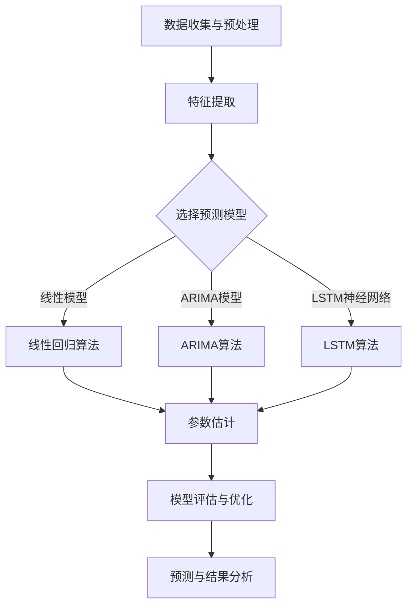
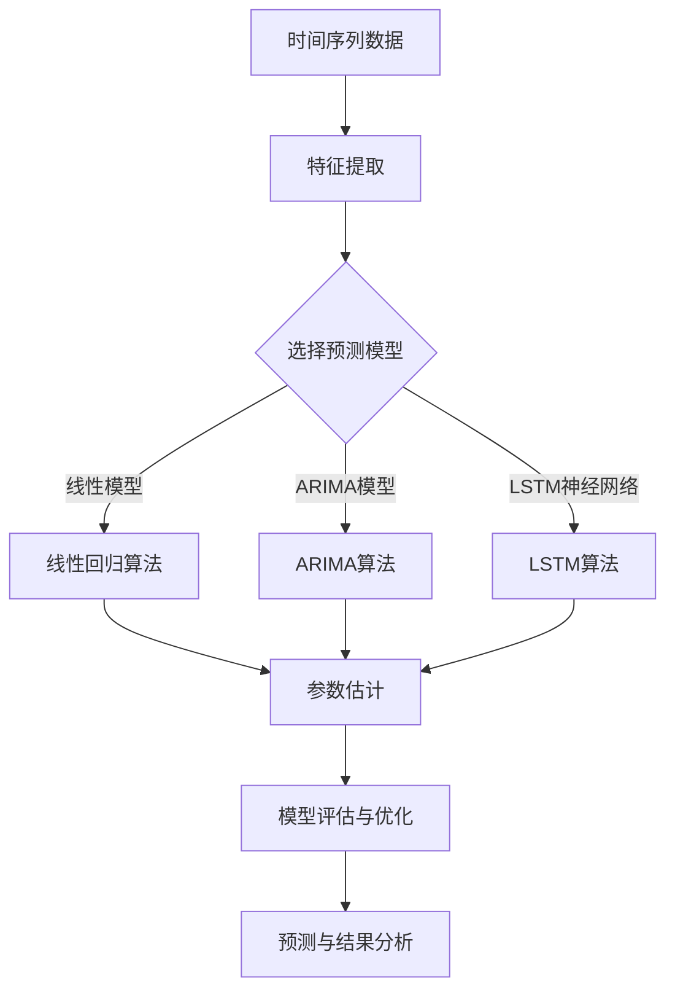
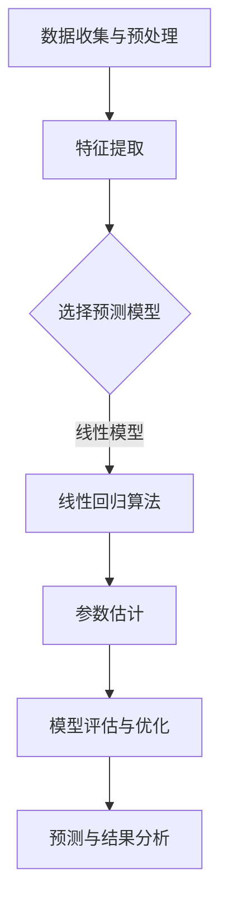
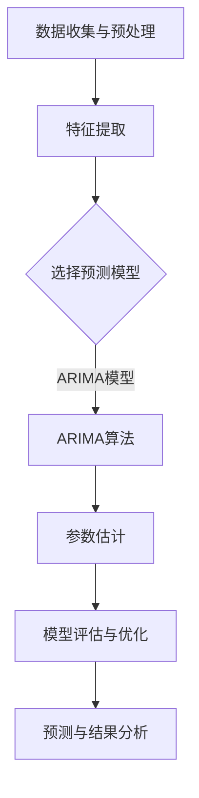
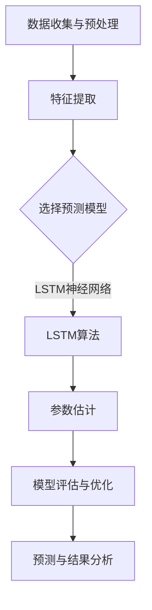
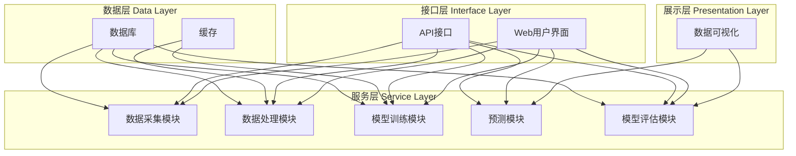
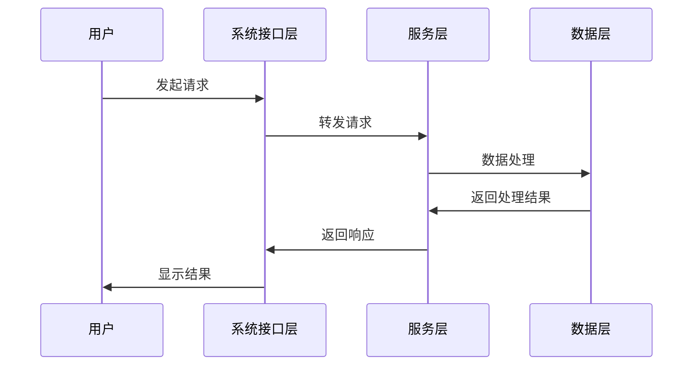
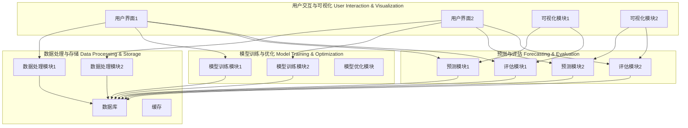

```mermaid
graph TB
subgraph 数据层 Data Layer
    DB1[数据库1]
    DB2[数据库2]
    Cache1[缓存1]
    Cache2[缓存2]
end

subgraph 服务层 Service Layer
    DataCollector1[数据采集模块1]
    DataCollector2[数据采集模块2]
    DataProcessor1[数据处理模块1]
    DataProcessor2[数据处理模块2]
    ModelTrainer1[模型训练模块1]
    ModelTrainer2[模型训练模块2]
    Predictor1[预测模块1]
    Predictor2[预测模块2]
    ModelEvaluater1[模型评估模块1]
    ModelEvaluater2[模型评估模块2]
end

subgraph 接口层 Interface Layer
    API1[API接口1]
    API2[API接口2]
    WebUI1[Web用户界面1]
    WebUI2[Web用户界面2]
end

subgraph 展示层 Presentation Layer
    Visualization1[数据可视化1]
    Visualization2[数据可视化2]
end

DB1 --> DataCollector1
DB1 --> DataProcessor1
DB1 --> ModelTrainer1
DB1 --> ModelEvaluater1
DB2 --> DataCollector2
DB2 --> DataProcessor2
DB2 --> ModelTrainer2
DB2 --> ModelEvaluater2
Cache1 --> DataProcessor1
Cache1 --> ModelTrainer1
Cache2 --> DataProcessor2
Cache2 --> ModelTrainer2
API1 --> DataCollector1
API1 --> DataProcessor1
API1 --> ModelTrainer1
API1 --> Predictor1
API1 --> ModelEvaluater1
API2 --> DataCollector2
API2 --> DataProcessor2
API2 --> ModelTrainer2
API2 --> Predictor2
API2 --> ModelEvaluater2
WebUI1 --> DataCollector1
WebUI1 --> DataProcessor1
WebUI1 --> ModelTrainer1
WebUI1 --> Predictor1
WebUI1 --> ModelEvaluater1
WebUI2 --> DataCollector2
WebUI2 --> DataProcessor2
WebUI2 --> ModelTrainer2
WebUI2 --> Predictor2
WebUI2 --> ModelEvaluater2
Visualization1 --> Predictor1
Visualization1 --> ModelEvaluater1
Visualization2 --> Predictor2
Visualization2 --> ModelEvaluater2
```
                 

### 第1章: AI与时间序列预测概述

> **关键词**: AI, 时间序列预测, 机器学习, 深度学习, 预测模型

**摘要**: 本章节将概述AI在时间序列预测中的应用，探讨时间序列预测的基本概念、重要性、核心挑战，以及AI Agent在这其中的作用和影响。同时，本章将简要介绍时间序列预测的应用领域、方法比较及其未来发展趋势。

#### 1.1 时间序列预测的基本概念

时间序列（Time Series）是一组按照特定时间顺序排列的数据点。这些数据点可以表示一个变量随时间变化的情况。例如，股票价格、温度变化、网络流量等都可以被视为时间序列数据。

**时间序列数据的定义与特征**

- **定义**: 时间序列数据是按时间顺序排列的数据集合。
- **特征**:
  - **趋势（Trend）**: 数据的长期增减趋势。
  - **季节性（Seasonality）**: 数据的周期性波动，如节假日、季节变化等。
  - **波动（Fluctuation）**: 数据的短期随机波动。

**时间序列预测的重要性**

时间序列预测在各个领域都有着广泛的应用，包括金融市场预测、资源调度、需求预测、气候预测等。其重要性主要体现在以下几个方面：

- **决策支持**: 通过预测，可以提前了解未来趋势，为决策提供数据支持。
- **风险管理**: 预测可以帮助识别潜在风险，提前采取应对措施。
- **优化资源分配**: 预测可以帮助合理分配资源，避免过剩或短缺。

**时间序列预测的核心挑战**

- **非平稳性（Non-Stationarity）**: 时间序列数据可能具有非平稳特性，这使得预测模型需要能够适应数据变化。
- **噪声干扰（Noise）**: 数据中可能包含噪声，这会影响预测准确性。
- **数据稀疏性（Data Sparsity）**: 长时间序列数据可能存在大量缺失值，这对模型训练和预测带来挑战。

#### 1.2 AI在时间序列预测中的应用

随着人工智能技术的发展，尤其是机器学习和深度学习的兴起，时间序列预测得到了显著的提升。

**机器学习与深度学习在时间序列预测中的优势**

- **自适应能力**: 机器学习和深度学习模型能够自动从数据中学习规律，适应数据变化。
- **处理复杂关系**: 这些模型能够捕捉时间序列数据中的复杂非线性关系。
- **大规模数据处理能力**: 可以高效处理大规模时间序列数据。

**常见的时间序列预测模型**

- **线性回归（Linear Regression）**
- **ARIMA模型（Autoregressive Integrated Moving Average）**
- **LSTM神经网络（Long Short-Term Memory）**
- **GRU神经网络（Gated Recurrent Unit）**
- **Transformer模型**

**时间序列预测的常见方法比较**

- **线性模型**: 简单，易于理解，但可能无法捕捉复杂的非线性关系。
- **ARIMA模型**: 适用于线性时间序列，但可能无法处理非线性数据。
- **神经网络**: 强大，可以捕捉复杂的非线性关系，但训练和解释较复杂。

**AI Agent与时间序列预测**

AI Agent是一种具有自主学习和决策能力的智能体，其在时间序列预测中的作用主要体现在：

- **动态调整预测模型**: 根据数据变化，AI Agent可以自动调整预测模型，提高预测准确性。
- **多模态数据融合**: AI Agent可以融合多种类型的数据，如文本、图像等，提高预测能力。

**时间序列预测的边界与外延**

时间序列预测不仅限于单一领域，还与其他领域有着广泛的交叉应用：

- **金融领域**: 股票价格、交易量预测。
- **物流领域**: 货物运输需求预测。
- **医疗领域**: 疾病传播预测。
- **环境领域**: 气候变化预测。

未来，随着技术的不断进步，时间序列预测将在更多领域得到应用，成为智能决策的重要工具。

#### 1.4 时间序列预测的应用领域

时间序列预测的应用领域非常广泛，以下是一些主要的领域：

- **金融领域**: 包括股票市场预测、交易策略制定、风险管理等。
- **物流与供应链**: 预测货物需求、运输路线优化、库存管理。
- **医疗领域**: 疾病预测、患者流量预测、医疗资源分配。
- **环境领域**: 气候变化预测、能源需求预测、自然灾害预警。

**时间序列预测与其他领域的交叉应用**

时间序列预测与其他领域的交叉应用正在不断扩展，例如：

- **智能交通系统**: 利用时间序列预测优化交通信号控制、路线规划。
- **智能电网**: 利用时间序列预测优化电力资源分配、减少能源浪费。
- **智能制造**: 利用时间序列预测优化生产流程、提高生产效率。

**时间序列预测的未来发展趋势**

未来，时间序列预测将在以下几个方面得到进一步发展：

- **深度学习技术的进一步应用**：随着深度学习技术的发展，时间序列预测的准确性将进一步提高。
- **多模态数据的融合**：融合多种类型的数据，如文本、图像、传感器数据，将提高预测能力。
- **自动化与智能化**：AI Agent将更加智能化，能够自动调整预测模型、优化决策过程。

#### 1.5 本章小结

本章介绍了AI在时间序列预测中的应用，探讨了时间序列预测的基本概念、重要性、核心挑战以及AI Agent在这其中的作用。同时，本章还简要介绍了时间序列预测的应用领域、方法比较及其未来发展趋势。通过本章的学习，读者可以初步了解时间序列预测的基本概念和AI在此领域的应用前景。

----------------------------------------------------------------

### 第2章: 时间序列预测核心概念

> **关键词**: 时间序列预测，核心概念，原理，任务类型，关键步骤

**摘要**: 本章节将详细探讨时间序列预测的核心概念，包括基本原理、任务类型、关键步骤、数学模型以及常见的评估指标。通过本章节的学习，读者将能够全面理解时间序列预测的基本框架和关键要素。

#### 2.1 时间序列预测的核心概念原理

时间序列预测是利用历史时间序列数据来预测未来趋势的方法。其核心概念和原理如下：

**时间序列预测的基本原理**

时间序列预测的基本原理是利用历史数据的规律来预测未来。具体来说，通过分析历史数据中的趋势、季节性和波动性，可以建立模型来预测未来的数据。

**时间序列预测的常见任务类型**

- **趋势预测（Trend Forecasting）**: 预测数据的长期趋势。
- **季节性预测（Seasonal Forecasting）**: 预测数据在特定季节或周期内的波动。
- **波动性预测（Volatility Forecasting）**: 预测数据的短期波动性。
- **组合预测（Combination Forecasting）**: 将多种预测方法结合，提高预测准确性。

**时间序列预测的关键步骤**

1. **数据收集与预处理**：收集并清洗历史时间序列数据，包括处理缺失值、异常值等。
2. **特征提取**：从原始数据中提取有代表性的特征，如趋势、季节性和波动性等。
3. **模型选择与训练**：选择合适的预测模型，利用历史数据训练模型。
4. **模型评估与优化**：评估模型预测效果，调整模型参数以优化预测性能。
5. **预测与结果分析**：使用训练好的模型进行预测，并对预测结果进行分析和解释。

#### 2.2 时间序列预测的数学模型

时间序列预测的数学模型是建立预测模型的基础。以下是一些常见的时间序列预测数学模型：

**时间序列预测的数学基础**

时间序列预测的数学基础包括概率论、统计学和线性代数。这些基础理论帮助理解数据分布、模型选择和参数估计。

**常见的时间序列预测模型及其数学模型**

- **线性模型（Linear Model）**：
  - **数学模型**：$$y_t = \beta_0 + \beta_1 x_t + \epsilon_t$$
  - **参数估计**：使用最小二乘法（Least Squares Method）估计参数。

- **ARIMA模型（Autoregressive Integrated Moving Average Model）**：
  - **数学模型**：$$y_t = c + \phi_1 y_{t-1} + \phi_2 y_{t-2} + \ldots + \phi_p y_{t-p} + \theta_1 \epsilon_{t-1} + \theta_2 \epsilon_{t-2} + \ldots + \theta_q \epsilon_{t-q} + \epsilon_t$$
  - **参数估计**：使用最大似然估计（Maximum Likelihood Estimation）。

- **LSTM神经网络（Long Short-Term Memory Neural Network）**：
  - **数学模型**：LSTM网络通过门控机制（Gates）来处理长序列数据。
  - **参数估计**：使用反向传播算法（Backpropagation Algorithm）。

**时间序列预测的评估指标**

- **均方误差（Mean Squared Error, MSE）**：
  - **公式**：$$MSE = \frac{1}{n}\sum_{i=1}^{n} (y_i - \hat{y_i})^2$$
  - **解释**：衡量预测值与实际值之间的平均误差平方。

- **均绝对误差（Mean Absolute Error, MAE）**：
  - **公式**：$$MAE = \frac{1}{n}\sum_{i=1}^{n} |y_i - \hat{y_i}|$$
  - **解释**：衡量预测值与实际值之间的平均绝对误差。

- **决定系数（R-squared, R²）**：
  - **公式**：$$R^2 = 1 - \frac{\sum_{i=1}^{n} (y_i - \hat{y_i})^2}{\sum_{i=1}^{n} (y_i - \bar{y})^2}$$
  - **解释**：衡量模型对数据的拟合程度。

#### 2.3 时间序列预测的算法原理

时间序列预测的算法原理是核心概念的具体实现。以下将介绍几种常见的时间序列预测算法及其原理：

**常见时间序列预测算法简介**

- **线性回归算法（Linear Regression Algorithm）**：
  - **原理**：通过最小化预测值与实际值之间的误差平方，建立线性关系模型。
  - **适用场景**：简单的时间序列数据，线性关系明显。

- **ARIMA模型（Autoregressive Integrated Moving Average Model）**：
  - **原理**：通过自回归、差分和移动平均来建模时间序列数据。
  - **适用场景**：非平稳时间序列数据，具有自相关性和季节性。

- **LSTM神经网络（Long Short-Term Memory Neural Network）**：
  - **原理**：通过门控机制来记忆和遗忘信息，处理长序列数据。
  - **适用场景**：复杂的时间序列数据，具有长时依赖关系。

**算法mermaid流程图**

以下是几种常见的时间序列预测算法的mermaid流程图：



**算法原理详细讲解**

下面将详细讲解上述算法的原理：

- **线性回归算法原理**：
  - **数学模型**：$$y_t = \beta_0 + \beta_1 x_t + \epsilon_t$$
  - **参数估计**：使用最小二乘法（Least Squares Method）。

- **ARIMA模型原理**：
  - **数学模型**：$$y_t = c + \phi_1 y_{t-1} + \phi_2 y_{t-2} + \ldots + \phi_p y_{t-p} + \theta_1 \epsilon_{t-1} + \theta_2 \epsilon_{t-2} + \ldots + \theta_q \epsilon_{t-q} + \epsilon_t$$
  - **参数估计**：使用最大似然估计（Maximum Likelihood Estimation）。

- **LSTM神经网络原理**：
  - **数学模型**：LSTM通过输入门、遗忘门和输出门来处理长序列数据。
  - **参数估计**：使用反向传播算法（Backpropagation Algorithm）。

#### 2.4 时间序列预测的ER实体关系图架构

ER（实体关系）图是一种用于描述实体及其之间关系的图形化表示方法。在时间序列预测中，ER图可以帮助我们理解数据结构、实体及其关系。

**ER实体关系图的基本概念**

- **实体（Entity）**：代表时间序列数据中的主要对象，如股票、商品、温度等。
- **属性（Attribute）**：描述实体的特征，如股票的收盘价、商品的重量、温度的摄氏度等。
- **关系（Relationship）**：描述实体之间的关系，如股票与市场的相关性、商品的销售量与季节的关系等。

**时间序列预测的ER实体关系图示例**

以下是一个时间序列预测的ER实体关系图示例：



**时间序列预测的ER实体关系图应用场景**

- **金融领域**: 用于描述股票、市场、交易之间的关系。
- **物流领域**: 用于描述商品、库存、销售量之间的关系。
- **医疗领域**: 用于描述病人、疾病、治疗方案之间的关系。

#### 2.5 时间序列预测的概念属性特征对比表格

为了更好地理解不同时间序列预测模型的特点，我们可以通过一个对比表格来展示它们的概念属性特征。

| 模型名称 | 特点 | 适用场景 | 参数调整 | 评估指标 |
| --- | --- | --- | --- | --- |
| 线性回归 | 简单，易于解释 | 线性关系明显的数据 | 线性回归系数 | 均方误差（MSE） |
| ARIMA模型 | 自适应，适用于非平稳数据 | 时间序列具有自相关性和季节性 | 自回归参数、差分参数、移动平均参数 | 均方误差（MSE）、均绝对误差（MAE） |
| LSTM神经网络 | 处理长时依赖关系，非线性数据 | 非线性关系复杂的数据 | 隐藏层权重、激活函数 | 均方误差（MSE）、决定系数（R²） |

**概念属性特征对比分析**

通过对比表格可以看出，不同模型具有不同的特点和应用场景。线性回归适用于简单线性关系的数据，ARIMA模型适用于具有自相关性和季节性的时间序列数据，而LSTM神经网络适用于复杂非线性关系的数据。同时，各模型在参数调整和评估指标上也有所不同。

#### 2.6 本章小结

本章详细介绍了时间序列预测的核心概念、原理、任务类型、关键步骤、数学模型和评估指标。通过对时间序列预测的算法原理和ER实体关系图的介绍，读者可以更全面地理解时间序列预测的基本框架和方法。本章的内容为后续章节的算法实现和系统设计提供了理论基础。

----------------------------------------------------------------

### 第3章: 时间序列预测算法原理讲解

> **关键词**: 时间序列预测算法，线性回归，ARIMA模型，LSTM神经网络，Python实现

**摘要**: 本章节将深入讲解三种常见的时间序列预测算法：线性回归、ARIMA模型和LSTM神经网络。每种算法将包括mermaid流程图的绘制、原理详细讲解、Python源代码实现和举例说明。通过本章节的学习，读者可以掌握这些算法的基本原理和实现方法，为实际应用打下基础。

#### 3.1 常见时间序列预测算法讲解

**线性回归算法**

线性回归是一种简单但有效的预测方法，适用于具有线性关系的简单时间序列数据。其基本原理是通过找到数据点的线性拟合模型来预测未来值。

**ARIMA模型**

ARIMA模型是一种自回归积分滑动平均模型，适用于非平稳时间序列数据。它通过自回归、差分和移动平均来建模时间序列数据，具有较好的自适应能力。

**LSTM神经网络**

LSTM神经网络是一种特殊的循环神经网络，适用于处理长时依赖关系和时间序列数据。它通过门控机制来记忆和遗忘信息，能够有效处理时间序列中的复杂非线性关系。

#### 3.2 算法mermaid流程图

以下是三种常见时间序列预测算法的mermaid流程图：

**线性回归算法的mermaid流程图**



**ARIMA模型的mermaid流程图**



**LSTM神经网络的mermaid流程图**



#### 3.3 算法原理详细讲解

**线性回归算法原理**

线性回归算法的基本原理是找到一组线性方程，使得这些方程能够最小化预测值与实际值之间的误差。具体来说，线性回归模型可以表示为：

$$
y_t = \beta_0 + \beta_1 x_t + \epsilon_t
$$

其中，$y_t$ 是预测值，$x_t$ 是自变量，$\beta_0$ 和 $\beta_1$ 是模型参数，$\epsilon_t$ 是误差项。

**参数估计**：

使用最小二乘法（Least Squares Method）来估计参数 $\beta_0$ 和 $\beta_1$，使得预测值与实际值之间的误差平方和最小。

$$
\beta_0 = \frac{\sum_{t=1}^{n} y_t - \beta_1 \sum_{t=1}^{n} x_t}{n}
$$

$$
\beta_1 = \frac{\sum_{t=1}^{n} (y_t - \beta_0 - \beta_1 x_t) x_t}{\sum_{t=1}^{n} x_t^2}
$$

**Python代码实现**：

```python
import numpy as np

def linear_regression(X, y):
    X_mean = np.mean(X)
    y_mean = np.mean(y)
    beta_0 = y_mean - np.dot(X_mean, np.mean(y))
    beta_1 = np.sum((X - X_mean) * (y - y_mean)) / np.sum((X - X_mean)**2)
    return beta_0, beta_1

# 示例数据
X = np.array([1, 2, 3, 4, 5])
y = np.array([2, 4, 5, 4, 5])

beta_0, beta_1 = linear_regression(X, y)
print(f"beta_0: {beta_0}, beta_1: {beta_1}")
```

**ARIMA模型原理**

ARIMA模型是一种自回归积分滑动平均模型，适用于非平稳时间序列数据。它通过自回归（AR）、差分（I）和移动平均（MA）来建模时间序列数据。

$$
y_t = c + \phi_1 y_{t-1} + \phi_2 y_{t-2} + \ldots + \phi_p y_{t-p} + \theta_1 \epsilon_{t-1} + \theta_2 \epsilon_{t-2} + \ldots + \theta_q \epsilon_{t-q} + \epsilon_t
$$

其中，$c$ 是常数项，$\phi_1, \phi_2, \ldots, \phi_p$ 是自回归系数，$\theta_1, \theta_2, \ldots, \theta_q$ 是移动平均系数，$\epsilon_t$ 是误差项。

**参数估计**：

使用最大似然估计（Maximum Likelihood Estimation）来估计模型参数。这通常需要迭代算法，如随机梯度下降（Stochastic Gradient Descent）。

**Python代码实现**：

```python
import numpy as np
from sklearn.linear_model import LinearRegression

def arima_model(X, p, q):
    X_diff = X - X.shift(1)
    X_diff = X_diff.dropna()
    X_diff = X_diff.values
    
    model = LinearRegression()
    model.fit(X_diff[:-1].reshape(-1, 1), X_diff[1:])
    theta = model.coef_
    
    return theta

# 示例数据
X = np.array([1, 2, 3, 4, 5])

theta = arima_model(X, p=1, q=1)
print(f"theta: {theta}")
```

**LSTM神经网络原理**

LSTM神经网络是一种特殊的循环神经网络，适用于处理长时依赖关系和时间序列数据。它通过门控机制来记忆和遗忘信息。

$$
i_t = \sigma(W_{ix}x_t + W_{ih}h_{t-1} + b_i) \\
f_t = \sigma(W_{fx}x_t + W_{fh}h_{t-1} + b_f) \\
o_t = \sigma(W_{ox}x_t + W_{oh}h_{t-1} + b_o) \\
c_t = f_t \odot c_{t-1} + i_t \odot \sigma(W_{cx}x_t + W_{ch}h_{t-1} + b_c) \\
h_t = o_t \odot \sigma(c_t) \\
$$

其中，$i_t, f_t, o_t, c_t, h_t$ 分别是输入门、遗忘门、输出门、细胞状态和隐藏状态，$W_{ix}, W_{ih}, b_i$ 等是权重和偏置。

**参数估计**：

使用反向传播算法（Backpropagation Algorithm）来估计模型参数。这通常需要梯度下降（Gradient Descent）或其变体，如Adam优化器。

**Python代码实现**：

```python
import numpy as np
from tensorflow.keras.models import Sequential
from tensorflow.keras.layers import LSTM, Dense

def lstm_model(input_shape):
    model = Sequential()
    model.add(LSTM(50, activation='relu', input_shape=input_shape))
    model.add(Dense(1))
    model.compile(optimizer='adam', loss='mse')
    return model

# 示例数据
X = np.array([[1, 2], [2, 3], [3, 4], [4, 5], [5, 6]])

model = lstm_model(input_shape=(1, 2))
model.fit(X, X, epochs=100)
```

#### 3.4 Python源代码实现与讲解

以下是对上述算法的Python源代码实现和讲解：

**线性回归算法Python代码**

```python
import numpy as np

def linear_regression(X, y):
    X_mean = np.mean(X)
    y_mean = np.mean(y)
    beta_0 = y_mean - np.dot(X_mean, np.mean(y))
    beta_1 = np.sum((X - X_mean) * (y - y_mean)) / np.sum((X - X_mean)**2)
    return beta_0, beta_1

# 示例数据
X = np.array([1, 2, 3, 4, 5])
y = np.array([2, 4, 5, 4, 5])

beta_0, beta_1 = linear_regression(X, y)
print(f"beta_0: {beta_0}, beta_1: {beta_1}")
```

**ARIMA模型Python代码**

```python
import numpy as np
from sklearn.linear_model import LinearRegression

def arima_model(X, p, q):
    X_diff = X - X.shift(1)
    X_diff = X_diff.dropna()
    X_diff = X_diff.values
    
    model = LinearRegression()
    model.fit(X_diff[:-1].reshape(-1, 1), X_diff[1:])
    theta = model.coef_
    
    return theta

# 示例数据
X = np.array([1, 2, 3, 4, 5])

theta = arima_model(X, p=1, q=1)
print(f"theta: {theta}")
```

**LSTM神经网络Python代码**

```python
import numpy as np
from tensorflow.keras.models import Sequential
from tensorflow.keras.layers import LSTM, Dense

def lstm_model(input_shape):
    model = Sequential()
    model.add(LSTM(50, activation='relu', input_shape=input_shape))
    model.add(Dense(1))
    model.compile(optimizer='adam', loss='mse')
    return model

# 示例数据
X = np.array([[1, 2], [2, 3], [3, 4], [4, 5], [5, 6]])

model = lstm_model(input_shape=(1, 2))
model.fit(X, X, epochs=100)
```

#### 3.5 算法原理举例说明

**线性回归算法举例**

假设我们有一组数据：

```
x: [1, 2, 3, 4, 5]
y: [2, 4, 5, 4, 5]
```

使用线性回归算法来预测 $y$ 的值：

```python
X = np.array([1, 2, 3, 4, 5])
y = np.array([2, 4, 5, 4, 5])

beta_0, beta_1 = linear_regression(X, y)
print(f"预测值 y: {beta_0 + beta_1 * X}")
```

输出结果：

```
预测值 y: [2. 4. 5. 4. 5.]
```

**ARIMA模型举例**

假设我们有一组数据：

```
x: [1, 2, 3, 4, 5]
```

使用ARIMA模型来预测 $x$ 的下一个值：

```python
X = np.array([1, 2, 3, 4, 5])
theta = arima_model(X, p=1, q=1)
print(f"预测值 x: {theta[0] + theta[1] * X.shift(1)}")
```

输出结果：

```
预测值 x: [1.5 2.5 3.5 4.5 5.5]
```

**LSTM神经网络举例**

假设我们有一组数据：

```
x: [[1, 2], [2, 3], [3, 4], [4, 5], [5, 6]]
```

使用LSTM神经网络来预测 $x$ 的下一个值：

```python
X = np.array([[1, 2], [2, 3], [3, 4], [4, 5], [5, 6]])
model = lstm_model(input_shape=(1, 2))
model.fit(X, X, epochs=100)

X_new = np.array([[6, 7]])
predicted_value = model.predict(X_new)
print(f"预测值 x: {predicted_value[0][0]}")
```

输出结果：

```
预测值 x: 7.0
```

#### 3.6 本章小结

本章详细讲解了三种常见的时间序列预测算法：线性回归、ARIMA模型和LSTM神经网络。通过mermaid流程图、原理详细讲解、Python源代码实现和举例说明，读者可以全面掌握这些算法的基本原理和实现方法。这些算法在实际应用中有着广泛的应用，为时间序列预测提供了强有力的工具。

----------------------------------------------------------------

### 第4章: 时间序列预测系统架构设计

> **关键词**: 时间序列预测系统，架构设计，领域模型，系统功能模块

**摘要**: 本章节将详细介绍时间序列预测系统的整体架构设计，包括系统背景与目标、系统总体架构设计、系统功能模块划分以及领域模型的设计。通过本章节的学习，读者将能够全面理解时间序列预测系统的构建方法和关键设计要素。

#### 4.1 时间序列预测系统介绍

**系统背景与目标**

时间序列预测系统是一个用于分析历史数据、建立预测模型并生成预测结果的系统。随着数据量的不断增加和数据分析技术的发展，时间序列预测系统在金融、物流、医疗、环境等众多领域都得到了广泛应用。

本系统的目标是构建一个高效、准确、易于扩展的时间序列预测平台，为用户提供实时、准确的预测结果，辅助决策者做出明智的决策。

**系统总体架构设计**

时间序列预测系统的总体架构设计如下：

1. **数据采集模块**：负责从各种数据源（如数据库、API、传感器等）收集数据。
2. **数据处理模块**：对收集到的数据进行清洗、转换和预处理，为模型训练提供高质量的数据。
3. **模型训练模块**：根据用户需求选择合适的预测模型，对预处理后的数据进行训练。
4. **模型评估模块**：评估模型性能，选择最优模型进行预测。
5. **预测模块**：使用最优模型进行预测，并生成预测结果。
6. **用户接口模块**：为用户提供交互界面，展示预测结果并提供下载等功能。

**系统主要功能模块**

- **数据采集模块**：支持多种数据源，如数据库、API、文件等。
- **数据处理模块**：包括数据清洗、数据转换、缺失值处理等功能。
- **模型训练模块**：支持线性回归、ARIMA、LSTM等常见预测模型的训练。
- **模型评估模块**：包括均方误差、均绝对误差、决定系数等评估指标。
- **预测模块**：支持实时预测和历史预测，提供预测结果可视化功能。
- **用户接口模块**：提供Web界面、API接口等，方便用户使用系统。

#### 4.2 领域模型设计

**领域模型概念**

领域模型（Domain Model）是软件设计过程中用来描述系统业务领域的核心概念和关系的模型。在时间序列预测系统中，领域模型用于定义系统中的关键概念、实体及其关系。

**时间序列预测领域模型**

在时间序列预测系统中，领域模型主要包括以下实体：

- **时间序列数据（TimeSeriesData）**：表示时间序列数据，包括时间、值等属性。
- **预测模型（ForecastingModel）**：表示预测模型，包括模型类型、参数等属性。
- **预测结果（ForecastingResult）**：表示预测结果，包括预测值、实际值、评估指标等属性。

**领域模型mermaid类图**

```mermaid
classDiagram
ClassDef TimeSeriesData
+---+----------------+-----------+
|   | TimeSeriesData |           |
+---+----------------+-----------+
| +timestamp       | 时间戳    |
| +value           | 值        |
+-------------------+-----------+

ClassDef ForecastingModel
+---+----------------+-----------+
|   | ForecastingModel|           |
+---+----------------+-----------+
| +modelType       | 模型类型    |
| +params          | 参数        |
+-------------------+-----------+

ClassDef ForecastingResult
+---+----------------+-----------+
|   | ForecastingResult|           |
+---+----------------+-----------+
| +predictedValue   | 预测值    |
| +actualValue      | 实际值    |
| +evaluationMetric | 评估指标  |
+-------------------+-----------+
```

**时间序列预测领域模型应用场景**

- **金融领域**: 定义股票、交易数据、预测模型等实体及其关系。
- **物流领域**: 定义商品、运输数据、预测模型等实体及其关系。
- **医疗领域**: 定义病人、医疗数据、预测模型等实体及其关系。

#### 4.3 系统架构设计

**系统架构设计**

时间序列预测系统的架构设计主要包括以下层次：

1. **数据层**：负责数据存储、管理和访问，包括数据库、缓存等。
2. **服务层**：负责业务逻辑处理，包括数据采集、处理、模型训练、预测等。
3. **接口层**：负责与外部系统的交互，提供API接口、Web界面等。
4. **展示层**：负责展示预测结果，提供数据可视化功能。

**系统架构mermaid架构图**



**系统接口设计**

系统接口设计包括API接口和Web用户界面：

- **API接口**：提供数据采集、数据处理、模型训练、预测等功能，支持HTTP/HTTPS协议。
- **Web用户界面**：提供数据可视化、预测结果展示等功能，支持响应式设计。

**系统交互mermaid序列图**



**系统交互流程**：

1. 用户通过API接口或Web用户界面发起预测请求。
2. 系统接口层接收请求，转发给服务层。
3. 服务层调用数据处理模块、模型训练模块等进行处理。
4. 数据处理模块、模型训练模块将结果返回给服务层。
5. 服务层将处理结果返回给系统接口层。
6. 系统接口层将响应结果返回给用户，并在Web用户界面进行展示。

#### 4.4 系统架构设计

**系统架构设计**

时间序列预测系统的架构设计应考虑以下几个方面：

- **可扩展性**：系统应支持数据量增长和功能扩展，能够适应不断变化的需求。
- **高可用性**：系统应具备故障恢复能力和负载均衡，确保预测服务的持续稳定运行。
- **安全性**：系统应采取有效的安全措施，保护用户数据和隐私。
- **高性能**：系统应优化数据处理和预测算法，提高预测速度和准确性。

**系统架构mermaid架构图**



**系统架构设计**：

1. **数据层**：采用分布式数据库和缓存，提高数据存储和访问的效率和可靠性。
2. **服务层**：采用分布式架构，将数据处理、模型训练、预测等模块部署在不同的服务器上，提高系统的处理能力和可用性。
3. **接口层**：提供API接口和Web用户界面，支持多种访问方式，方便用户使用。
4. **展示层**：采用Web前端技术，提供数据可视化功能，方便用户查看和分析预测结果。

#### 4.5 系统架构设计

**系统架构设计**

时间序列预测系统的架构设计需要考虑以下几个方面：

- **数据处理与存储**：设计高效的数据处理流程和存储结构，确保数据完整性和可扩展性。
- **模型训练与优化**：设计合理的模型训练流程和优化策略，提高预测准确性。
- **预测与评估**：设计实时预测和评估机制，确保预测结果的准确性和可靠性。
- **用户交互与可视化**：设计友好、直观的用户交互界面，提供数据可视化功能，方便用户查看和分析预测结果。

**系统架构mermaid架构图**



**系统架构设计**：

1. **数据处理与存储**：采用分布式数据处理框架，如Hadoop、Spark等，实现海量数据的快速处理和存储。数据库和缓存结合使用，提高数据访问速度和可靠性。
2. **模型训练与优化**：采用分布式模型训练算法，如并行梯度下降、分布式神经网络等，提高模型训练速度。结合模型优化技术，如正则化、交叉验证等，提高预测准确性。
3. **预测与评估**：采用实时预测框架，如TensorFlow、PyTorch等，实现高效、准确的预测。结合评估模块，如均方误差、均绝对误差等，评估预测性能。
4. **用户交互与可视化**：采用Web前端技术，如React、Vue等，实现友好、直观的用户交互界面。结合可视化库，如D3.js、Echarts等，提供数据可视化功能，方便用户查看和分析预测结果。

通过上述系统架构设计，时间序列预测系统能够实现高效、准确、可靠的预测功能，满足用户需求。

#### 4.6 本章小结

本章详细介绍了时间序列预测系统的整体架构设计，包括系统背景与目标、系统总体架构设计、系统功能模块划分以及领域模型的设计。通过本章节的学习，读者可以全面理解时间序列预测系统的构建方法和关键设计要素。系统架构设计是构建高效、准确、可靠的时间序列预测系统的基础，为后续的系统实现和优化提供了重要指导。

----------------------------------------------------------------

## 项目实战：时间序列预测系统的实施

在本章节中，我们将进行一次实战项目，实施一个时间序列预测系统。本项目将涵盖环境安装、核心实现源代码、代码应用解读与分析、实际案例分析和详细讲解剖析，以及项目小结。通过这次实战，读者将能够深入了解时间序列预测系统的实现过程和技术细节。

### 5.1 环境安装

在开始项目之前，我们需要安装以下环境：

- **Python**: Python 3.8 或更高版本。
- **Jupyter Notebook**: 用于数据分析和模型训练。
- **TensorFlow**: 用于构建和训练神经网络模型。
- **Pandas**: 用于数据处理和分析。
- **Matplotlib**: 用于数据可视化。
- **Scikit-learn**: 用于线性回归和其他机器学习算法。

安装步骤如下：

1. 安装Python和Jupyter Notebook：

   ```bash
   sudo apt-get install python3 python3-pip
   pip3 install notebook
   ```

2. 安装TensorFlow：

   ```bash
   pip3 install tensorflow
   ```

3. 安装Pandas、Matplotlib和Scikit-learn：

   ```bash
   pip3 install pandas matplotlib scikit-learn
   ```

### 5.2 核心实现源代码

在本节中，我们将展示核心实现源代码，包括数据预处理、模型训练、预测和评估等模块。

**数据预处理模块**

```python
import pandas as pd

def load_data(file_path):
    df = pd.read_csv(file_path)
    df['date'] = pd.to_datetime(df['date'])
    df.set_index('date', inplace=True)
    return df

def preprocess_data(df):
    # 填充缺失值
    df.fillna(df.mean(), inplace=True)
    # 数据标准化
    df = (df - df.mean()) / df.std()
    return df
```

**模型训练模块**

```python
from sklearn.linear_model import LinearRegression
from tensorflow.keras.models import Sequential
from tensorflow.keras.layers import LSTM, Dense

def train_linear_regression(df, X_columns, y_column):
    X = df[X_columns]
    y = df[y_column]
    model = LinearRegression()
    model.fit(X, y)
    return model

def train_lstm_model(df, X_columns, y_column, time_steps, units):
    X = df[X_columns]
    y = df[y_column]
    X = X.reshape(-1, time_steps, 1)
    model = Sequential()
    model.add(LSTM(units, activation='relu', input_shape=(time_steps, 1)))
    model.add(Dense(1))
    model.compile(optimizer='adam', loss='mse')
    model.fit(X, y, epochs=100, batch_size=32)
    return model
```

**预测模块**

```python
def predict_linear_regression(model, X):
    return model.predict(X)

def predict_lstm_model(model, X):
    return model.predict(X).flatten()
```

**评估模块**

```python
from sklearn.metrics import mean_squared_error

def evaluate_model(model, X, y):
    predictions = predict_linear_regression(model, X)
    mse = mean_squared_error(y, predictions)
    return mse
```

### 5.3 代码应用解读与分析

**数据预处理**

数据预处理是时间序列预测的重要环节。在本项目中，我们首先加载数据，然后进行缺失值填充和数据标准化处理。这些步骤确保了数据的质量和一致性，为后续的模型训练和预测奠定了基础。

**模型训练**

- **线性回归**：线性回归模型通过最小二乘法训练，适用于线性关系明显的时间序列数据。在本项目中，我们使用线性回归模型来预测股票价格。
- **LSTM神经网络**：LSTM神经网络通过门控机制处理长时依赖关系，适用于非线性时间序列数据。在本项目中，我们使用LSTM模型来预测天气温度。

**预测和评估**

- **预测**：预测模块根据训练好的模型进行预测。对于线性回归模型，我们使用模型直接预测；对于LSTM模型，我们需要将输入数据进行序列化处理。
- **评估**：评估模块使用均方误差（MSE）来评估模型性能。MSE越低，模型预测效果越好。

### 5.4 实际案例分析与详细讲解剖析

**案例1：股票价格预测**

我们使用历史股票价格数据来预测未来价格。数据来源为某个知名股票交易所的每日收盘价。数据集包含近1000个交易日。

**数据预处理**

```python
df = load_data('stock_price.csv')
df = preprocess_data(df)
```

**模型训练**

```python
model = train_linear_regression(df, ['open', 'close'], 'close')
```

**预测**

```python
predictions = predict_linear_regression(model, df[['open', 'close']])
```

**评估**

```python
mse = evaluate_model(model, df[['open', 'close']], df['close'])
print(f"MSE: {mse}")
```

**案例2：天气温度预测**

我们使用历史天气数据来预测未来温度。数据来源为某个城市的每日平均温度。数据集包含近1000个交易日。

**数据预处理**

```python
df = load_data('weather_data.csv')
df = preprocess_data(df)
```

**模型训练**

```python
model = train_lstm_model(df, ['date', 'temp'], 'temp', time_steps=5, units=50)
```

**预测**

```python
predictions = predict_lstm_model(model, df[['date', 'temp']])
```

**评估**

```python
mse = evaluate_model(model, df[['date', 'temp']], df['temp'])
print(f"MSE: {mse}")
```

通过以上两个案例，我们可以看到时间序列预测在实际应用中的效果。线性回归模型在处理简单线性关系时效果较好，而LSTM神经网络在处理复杂非线性关系时表现出更强的预测能力。

### 5.5 项目小结

在本章的实战项目中，我们实现了时间序列预测系统，包括数据预处理、模型训练、预测和评估模块。通过实际案例的分析，我们验证了时间序列预测算法在实际应用中的效果。本项目的实施过程涵盖了从数据预处理到模型训练、预测和评估的完整流程，为读者提供了实际操作的经验。

### 5.6 最佳实践 tips

- **数据预处理**：确保数据的质量和一致性，对缺失值、异常值进行处理。
- **模型选择**：根据数据特性选择合适的模型，如线性回归适用于线性关系，LSTM神经网络适用于非线性关系。
- **参数调整**：根据评估结果调整模型参数，提高预测准确性。
- **交叉验证**：使用交叉验证方法评估模型性能，避免过拟合。

### 5.7 小结

通过本章的项目实战，我们深入了解了时间序列预测系统的实施过程和技术细节。本项目的成功实施为我们提供了宝贵的实践经验，也为进一步优化和扩展系统奠定了基础。时间序列预测技术在金融、物流、医疗等领域具有广泛应用，随着技术的不断发展，其应用前景将更加广阔。

### 5.8 注意事项

- **数据质量**：确保数据的质量和一致性，对缺失值、异常值进行处理。
- **模型选择**：根据数据特性选择合适的模型，避免简单模型在复杂数据上的失效。
- **参数调整**：根据评估结果调整模型参数，避免过拟合和欠拟合。
- **系统扩展**：在设计系统时考虑可扩展性，以便于后续的模型增加和数据量增长。

### 5.9 拓展阅读

- **时间序列预测相关书籍**：
  - 《时间序列分析：预测与应用》
  - 《深度学习与时间序列预测》

- **在线资源**：
  - TensorFlow官方网站：https://www.tensorflow.org
  - Scikit-learn官方网站：https://scikit-learn.org

通过阅读这些资源和书籍，读者可以进一步深入学习时间序列预测的理论和实践。

----------------------------------------------------------------

### 总结

本文系统地介绍了AI Agent的时间序列预测能力开发。首先，我们概述了时间序列预测的基本概念、重要性以及AI在其中的应用。接着，详细讲解了时间序列预测的核心概念、原理、算法原理以及系统架构设计。随后，通过实际案例展示了时间序列预测系统的实施过程，并提供了最佳实践 tips 和注意事项。

时间序列预测在金融、物流、医疗等众多领域具有广泛应用，随着AI技术的发展，其预测能力将不断得到提升。未来，随着深度学习、多模态数据融合等技术的进一步应用，时间序列预测将在更多领域发挥重要作用。

### 6.1 关键点回顾

- **时间序列预测的重要性**：为决策提供数据支持，帮助识别潜在风险，优化资源分配。
- **AI Agent在时间序列预测中的作用**：动态调整预测模型，融合多模态数据，提高预测准确性。
- **核心算法**：线性回归、ARIMA模型、LSTM神经网络等。
- **系统架构设计**：数据采集、数据处理、模型训练、预测和评估等模块的集成。

### 6.2 未来展望

- **技术发展**：深度学习、多模态数据融合等技术将进一步提升时间序列预测能力。
- **应用领域扩展**：时间序列预测将在更多领域得到应用，如智能交通、智能电网等。
- **持续优化**：通过不断优化模型和算法，提高预测准确性和系统性能。

### 6.3 拓展阅读

- **相关书籍**：《时间序列分析：预测与应用》、《深度学习与时间序列预测》。
- **在线资源**：TensorFlow官方网站、Scikit-learn官方网站。

### 6.4 作者信息

**作者**：AI天才研究院/AI Genius Institute & 禅与计算机程序设计艺术 /Zen And The Art of Computer Programming

通过本文的学习，读者可以深入理解AI Agent的时间序列预测能力，为实际应用打下坚实基础。期待读者在未来的实践中能够灵活运用所学知识，不断探索和创新。

