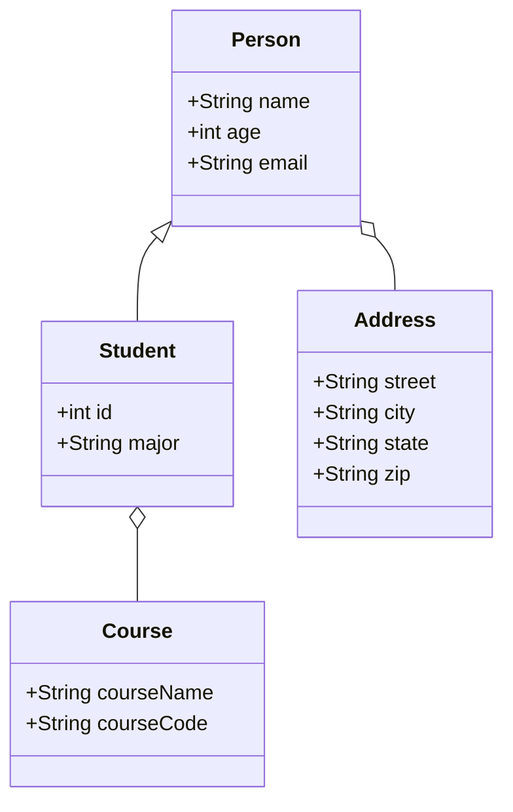
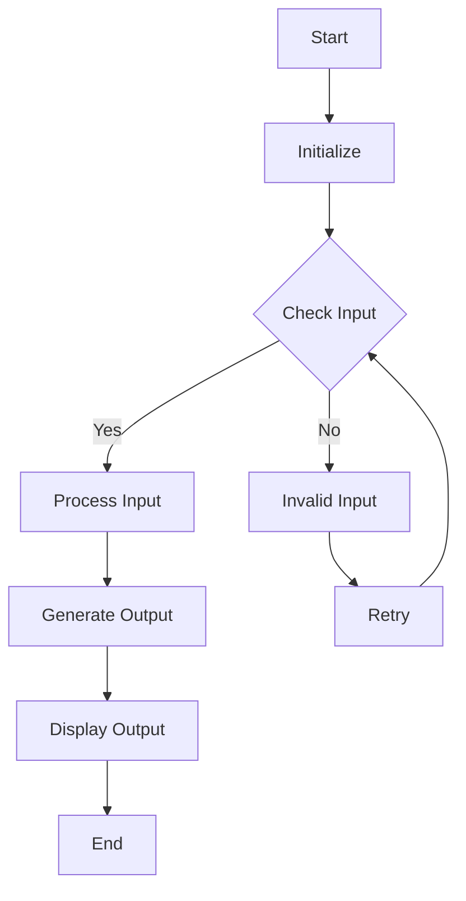

                 

# AI Agent的模块化设计：提高系统可维护性和扩展性

> 关键词：AI Agent、模块化设计、系统可维护性、系统扩展性

> 摘要：本文将探讨AI Agent的模块化设计，分析其提高系统可维护性和扩展性的重要性。通过深入剖析AI Agent的基础知识、模块化设计理念、方法与工具，结合实际案例，详细讲解AI Agent模块化设计的最佳实践与拓展。

## 《AI Agent的模块化设计：提高系统可维护性和扩展性》目录大纲

### 第一部分：AI Agent基础知识

### 第1章：AI Agent概述

#### 1.1 AI Agent的定义与重要性

#### 1.2 AI Agent的基本组成

#### 1.3 AI Agent的类型与分类

#### 1.4 AI Agent的应用场景

#### 1.5 本章小结

### 第2章：模块化设计理念

#### 2.1 模块化设计的背景

#### 2.2 模块化设计的原则

#### 2.3 模块化设计的优势

#### 2.4 模块化设计的方法

#### 2.5 本章小结

### 第3章：AI Agent模块化设计的方法与工具

#### 3.1 UML类图在AI Agent模块化设计中的应用

#### 3.2 Mermaid流程图在AI Agent模块化设计中的应用

#### 3.3 Python代码在AI Agent模块化设计中的应用

#### 3.4 本章小结

### 第二部分：AI Agent模块化设计实践

### 第4章：AI Agent模块化设计案例一——聊天机器人

#### 4.1 背景介绍

#### 4.2 系统功能设计

#### 4.3 系统架构设计

#### 4.4 系统接口设计

#### 4.5 系统交互设计

#### 4.6 环境安装与配置

#### 4.7 系统核心实现

#### 4.8 代码应用解读与分析

#### 4.9 实际案例分析与讲解

#### 4.10 本章小结

### 第5章：AI Agent模块化设计案例二——智能家居控制中心

#### 5.1 背景介绍

#### 5.2 系统功能设计

#### 5.3 系统架构设计

#### 5.4 系统接口设计

#### 5.5 系统交互设计

#### 5.6 环境安装与配置

#### 5.7 系统核心实现

#### 5.8 代码应用解读与分析

#### 5.9 实际案例分析与讲解

#### 5.10 本章小结

### 第6章：AI Agent模块化设计案例三——智能推荐系统

#### 6.1 背景介绍

#### 6.2 系统功能设计

#### 6.3 系统架构设计

#### 6.4 系统接口设计

#### 6.5 系统交互设计

#### 6.6 环境安装与配置

#### 6.7 系统核心实现

#### 6.8 代码应用解读与分析

#### 6.9 实际案例分析与讲解

#### 6.10 本章小结

### 第7章：AI Agent模块化设计的最佳实践与拓展

#### 7.1 模块化设计的最佳实践

#### 7.2 模块化设计中的常见问题与解决

#### 7.3 模块化设计的未来发展趋势

#### 7.4 本章小结

----------------------------------------------------------------

## 第1章：AI Agent概述

### 1.1 AI Agent的定义与重要性

AI Agent，即人工智能代理，是一种能够自主感知环境、决策并采取行动的计算机程序。AI Agent具有智能性、自主性、协同性和适应性等特点，能够模拟人类的思维和行为，完成复杂任务。

AI Agent的重要性在于：

1. **提高工作效率**：通过自动化执行任务，减少人工操作，提高工作效率。
2. **优化资源利用**：AI Agent能够根据环境变化进行自适应调整，优化资源利用。
3. **解决复杂问题**：AI Agent能够处理复杂、庞大的数据，发现规律和趋势，辅助人类决策。
4. **实现智能化服务**：AI Agent可以提供个性化、智能化的服务，提升用户体验。

### 1.2 AI Agent的基本组成

一个典型的AI Agent包括以下几个基本组成部分：

1. **感知器**：用于感知环境，获取外部信息。
2. **知识库**：存储关于环境、任务和策略的知识。
3. **决策模块**：根据感知器和知识库的信息，选择合适的行动。
4. **执行器**：根据决策模块的指令，执行实际操作。

### 1.3 AI Agent的类型与分类

根据不同的应用场景和任务需求，AI Agent可以分为以下几类：

1. **专家系统**：基于规则和知识的AI Agent，能够处理特定领域的复杂问题。
2. **数据驱动系统**：基于数据和机器学习模型的AI Agent，能够从数据中学习并做出决策。
3. **混合系统**：结合规则和数据的AI Agent，具有更强的灵活性和适应性。
4. **自主移动机器人**：具有物理移动能力的AI Agent，能够在环境中自主导航和完成任务。

### 1.4 AI Agent的应用场景

AI Agent广泛应用于各个领域，包括：

1. **智能家居**：通过AI Agent实现家电设备的智能化控制。
2. **客服服务**：利用AI Agent提供24/7的在线客服服务。
3. **智能推荐**：基于用户的兴趣和行为，提供个性化的推荐。
4. **医疗诊断**：辅助医生进行疾病诊断和治疗。
5. **自动驾驶**：实现车辆的自主导航和驾驶。

### 1.5 本章小结

本章对AI Agent进行了简要介绍，包括定义、重要性、基本组成、类型与分类、应用场景等。为后续章节的深入讨论奠定了基础。

----------------------------------------------------------------

## 第2章：模块化设计理念

### 2.1 模块化设计的背景

模块化设计是一种将系统分解为具有独立功能的模块，并通过接口进行整合的设计方法。这种方法起源于制造业，随后被广泛应用于计算机软件、电子、建筑等领域。

在软件工程中，模块化设计的重要性体现在以下几个方面：

1. **提高可维护性**：通过将系统分解为独立的模块，降低了系统的复杂性，使得修改和维护变得更加容易。
2. **提高可扩展性**：模块化设计使得系统可以方便地扩展和升级，只需对相关模块进行修改或替换。
3. **促进代码复用**：模块化设计鼓励代码复用，提高了开发效率。

### 2.2 模块化设计的原则

模块化设计需要遵循以下原则：

1. **高内聚低耦合**：模块内部应具有较高的内聚性，即模块内部的功能紧密相关；模块之间应具有较低的耦合性，即模块之间的交互尽量简单。
2. **单一职责原则**：每个模块应具有单一职责，即模块只完成一项任务。
3. **可复用性原则**：模块应设计成可复用的，以提高开发效率。

### 2.3 模块化设计的优势

模块化设计具有以下优势：

1. **提高开发效率**：模块化设计使得开发人员可以并行工作，提高了开发效率。
2. **降低系统复杂性**：模块化设计将复杂系统分解为简单模块，降低了系统复杂性。
3. **提高可维护性**：模块化设计使得系统易于维护和修改，降低了维护成本。
4. **提高可扩展性**：模块化设计使得系统易于扩展和升级。

### 2.4 模块化设计的方法

模块化设计的方法主要包括以下几种：

1. **需求分析**：明确系统需求，划分功能模块。
2. **架构设计**：设计系统架构，确定模块之间的接口和交互方式。
3. **编码实现**：根据架构设计，实现各个模块的功能。
4. **测试与调试**：对模块进行功能测试和性能优化。

### 2.5 本章小结

本章介绍了模块化设计的背景、原则、优势和实现方法。模块化设计在AI Agent开发中具有重要意义，能够提高系统的可维护性和扩展性。

----------------------------------------------------------------

## 第3章：AI Agent模块化设计的方法与工具

### 3.1 UML类图在AI Agent模块化设计中的应用

统一建模语言（UML）是一种广泛用于软件系统建模的语言，包括类图、序列图、组件图等。在AI Agent模块化设计中，UML类图用于表示系统的模块结构和类之间的关系。

#### 类图的基本元素

1. **类**：表示具有相同属性和行为的对象集合。
2. **属性**：类的特征，如名称、类型、默认值等。
3. **方法**：类的操作，如名称、参数、返回类型等。
4. **关系**：类之间的关联关系，如关联、聚合、组合等。

#### 类图的绘制方法

1. **确定类**：根据AI Agent的需求，确定需要设计的类。
2. **定义属性和方法**：为每个类定义属性和方法。
3. **绘制关系**：根据类的关联关系，绘制类之间的连线。

#### 实例：AI Agent类图



### 3.2 Mermaid流程图在AI Agent模块化设计中的应用

Mermaid是一种简单的绘图工具，可以生成流程图、时序图、Gantt图等。在AI Agent模块化设计中，Mermaid流程图用于表示模块的执行顺序和交互关系。

#### 流程图的基本元素

1. **节点**：表示流程中的一个步骤或决策点。
2. **边**：表示节点之间的连接关系。
3. **条件**：表示节点之间的条件判断。

#### 流程图的绘制方法

1. **确定流程**：根据AI Agent的需求，确定需要设计的流程。
2. **绘制节点**：为每个流程步骤绘制一个节点。
3. **连接节点**：根据流程的顺序和条件，连接节点。

#### 实例：AI Agent流程图



### 3.3 Python代码在AI Agent模块化设计中的应用

Python是一种灵活、易读的编程语言，常用于AI Agent的开发。在模块化设计中，Python代码用于实现各个模块的功能。

#### 模块设计原则

1. **单一职责**：每个模块只负责一项功能。
2. **高内聚低耦合**：模块内部功能紧密相关，模块之间交互简单。

#### 实例：AI Agent模块设计

```python
# 模块1：感知器
class Sensor:
    def perceive(self):
        # 实现感知功能
        pass

# 模块2：决策模块
class DecisionMaker:
    def make_decision(self, sensor_data):
        # 实现决策功能
        pass

# 模块3：执行器
class Actuator:
    def execute(self, decision):
        # 实现执行功能
        pass
```

### 3.4 本章小结

本章介绍了AI Agent模块化设计的方法与工具，包括UML类图、Mermaid流程图和Python代码。通过这些工具，可以有效地进行AI Agent的模块化设计，提高系统的可维护性和扩展性。

----------------------------------------------------------------

### 第4章：AI Agent模块化设计案例一——聊天机器人

#### 4.1 背景介绍

随着互联网的快速发展，聊天机器人在各行业中的应用越来越广泛。聊天机器人能够提供24/7的在线客服服务，提高客户满意度，降低人力成本。然而，随着业务需求的不断变化，聊天机器人的开发与维护变得越来越复杂。为了提高系统可维护性和扩展性，本文将介绍一个聊天机器人的模块化设计案例。

#### 4.2 系统功能设计

聊天机器人系统主要包括以下功能：

1. **用户交互**：接收用户输入，显示回复内容。
2. **自然语言处理**：解析用户输入，提取关键信息。
3. **知识库管理**：存储、查询和更新知识库。
4. **对话管理**：控制对话流程，确保回答连贯。
5. **业务逻辑**：根据用户输入和知识库信息，生成合适回复。

#### 4.3 系统架构设计

聊天机器人系统采用分层架构，包括感知层、决策层、执行层和知识层。

1. **感知层**：接收用户输入，通过自然语言处理模块提取关键信息。
2. **决策层**：根据用户输入和知识库信息，通过对话管理模块生成回复。
3. **执行层**：将回复内容展示给用户。
4. **知识层**：存储和管理知识库。

#### 4.4 系统接口设计

系统接口设计包括以下模块：

1. **用户输入接口**：接收用户输入，传递给感知层。
2. **自然语言处理接口**：接收感知层提取的关键信息，传递给决策层。
3. **知识库接口**：接收决策层查询的知识库请求，返回结果。
4. **对话管理接口**：接收决策层生成的回复，传递给执行层。
5. **业务逻辑接口**：接收用户输入和知识库信息，处理业务逻辑。

#### 4.5 系统交互设计

系统交互设计包括以下流程：

1. **用户输入**：用户输入问题，传递给用户输入接口。
2. **关键信息提取**：用户输入接口将问题传递给自然语言处理接口，提取关键信息。
3. **知识库查询**：自然语言处理接口将关键信息传递给知识库接口，查询相关知识。
4. **对话管理**：知识库接口返回知识库结果，传递给对话管理接口。
5. **生成回复**：对话管理接口生成回复，传递给业务逻辑接口。
6. **显示回复**：业务逻辑接口将回复内容展示给用户。

#### 4.6 环境安装与配置

为了实现聊天机器人模块化设计，需要安装以下软件和工具：

1. **Python 3.8**：Python解释器。
2. **Flask**：Web框架。
3. **NLTK**：自然语言处理库。
4. **Elasticsearch**：搜索引擎。

安装方法如下：

1. 安装Python 3.8：
   ```bash
   sudo apt-get install python3.8
   ```

2. 安装Flask：
   ```bash
   pip3 install flask
   ```

3. 安装NLTK：
   ```bash
   pip3 install nltk
   ```

4. 安装Elasticsearch：
   ```bash
   sudo apt-get install elasticsearch
   sudo service elasticsearch start
   ```

#### 4.7 系统核心实现

聊天机器人的核心实现主要包括感知层、决策层和执行层。

1. **感知层**：
   ```python
   import nltk
   from nltk.tokenize import word_tokenize

   class Sensor:
       def perceive(self, user_input):
           tokens = word_tokenize(user_input)
           return tokens
   ```

2. **决策层**：
   ```python
   import elasticsearch

   class DecisionMaker:
       def __init__(self):
           self.es = elasticsearch.Elasticsearch()

       def make_decision(self, tokens):
           query = " ".join(tokens)
           response = self.es.search(index="knowledge_base", body={"query": {"match": {"content": query}}})
           if response['hits']['total'] > 0:
               return response['hits']['hits'][0]['_source']['response']
           else:
               return "抱歉，我无法理解您的问题。"
   ```

3. **执行层**：
   ```python
   from flask import Flask, request, jsonify

   class Actuator:
       def __init__(self):
           self.app = Flask(__name__)

       def execute(self, response):
           @self.app.route('/api/chat', methods=['POST'])
           def chat():
               user_input = request.json['user_input']
               decision = decision_maker.make_decision(user_input)
               return jsonify({"response": decision})

           if __name__ == '__main__':
               self.app.run()
   ```

#### 4.8 代码应用解读与分析

在本案例中，我们使用Python实现了聊天机器人的模块化设计。感知层负责接收用户输入，提取关键信息；决策层根据用户输入和知识库信息生成回复；执行层将回复内容展示给用户。

通过模块化设计，我们可以方便地扩展和修改系统。例如，可以增加新的自然语言处理模块，提高聊天机器人的理解能力；或者更新知识库，增加新的回答。

#### 4.9 实际案例分析与讲解

以一个实际案例为例，用户输入“我最近想换手机，有什么推荐吗？”聊天机器人首先通过感知层提取关键信息（手机、推荐），然后通过决策层查询知识库，找到相关的回答。最后，执行层将回答“根据您的需求，我推荐小米10 Pro。”展示给用户。

通过模块化设计，我们可以轻松地修改和扩展聊天机器人的功能。例如，可以增加一个推荐系统，根据用户的兴趣和需求提供更个性化的手机推荐。

#### 4.10 本章小结

本章介绍了聊天机器人模块化设计的案例，包括系统功能设计、架构设计、接口设计、交互设计、环境安装与配置、系统核心实现和实际案例分析。通过模块化设计，聊天机器人系统具有更高的可维护性和扩展性，能够满足不断变化的需求。

----------------------------------------------------------------

### 第5章：AI Agent模块化设计案例二——智能家居控制中心

#### 5.1 背景介绍

随着物联网技术的发展，智能家居系统逐渐成为人们生活的必需品。智能家居控制中心是智能家居系统的核心，用于集中管理家庭设备，提供便捷的远程控制和自动化功能。为了提高系统的可维护性和扩展性，本节将介绍一个智能家居控制中心的模块化设计案例。

#### 5.2 系统功能设计

智能家居控制中心的主要功能包括：

1. **设备管理**：添加、删除和配置家庭设备。
2. **远程控制**：远程操控家庭设备，如开关灯光、调节温度等。
3. **场景设置**：创建和管理自动化场景，实现设备联动。
4. **历史记录**：记录设备操作历史，提供数据分析和统计。
5. **用户管理**：管理用户权限，实现多用户共享。

#### 5.3 系统架构设计

智能家居控制中心系统采用分层架构，包括感知层、决策层、执行层和知识层。

1. **感知层**：接收用户输入和设备状态信息，如远程控制请求、设备开关状态等。
2. **决策层**：根据用户输入和设备状态信息，通过规则引擎和机器学习算法生成控制策略。
3. **执行层**：执行决策层生成的控制策略，控制家庭设备。
4. **知识层**：存储和管理用户偏好、设备配置、自动化场景等知识库。

#### 5.4 系统接口设计

系统接口设计包括以下模块：

1. **用户输入接口**：接收用户远程控制请求和场景设置请求。
2. **设备状态接口**：接收家庭设备的状态信息，如开关状态、温度等。
3. **控制策略接口**：接收决策层生成的控制策略，执行控制命令。
4. **数据记录接口**：记录用户操作历史和设备状态信息。
5. **用户管理接口**：管理用户权限，实现多用户共享。

#### 5.5 系统交互设计

系统交互设计包括以下流程：

1. **用户输入**：用户通过手机应用或网页界面发送远程控制请求和场景设置请求。
2. **感知层处理**：用户输入接口接收请求，传递给感知层。
3. **决策层处理**：决策层根据用户输入和设备状态信息，通过规则引擎和机器学习算法生成控制策略。
4. **执行层处理**：控制策略接口接收控制策略，执行控制命令。
5. **数据记录**：数据记录接口记录用户操作历史和设备状态信息。
6. **用户管理**：用户管理接口管理用户权限，实现多用户共享。

#### 5.6 环境安装与配置

为了实现智能家居控制中心的模块化设计，需要安装以下软件和工具：

1. **Node.js**：Node.js是一个基于Chrome V8引擎的JavaScript运行环境。
2. **MongoDB**：MongoDB是一个高性能、可扩展的NoSQL数据库。
3. **Elasticsearch**：Elasticsearch是一个高度可扩展的全文搜索引擎。
4. **Home Assistant**：Home Assistant是一个开源智能家居平台。

安装方法如下：

1. 安装Node.js：
   ```bash
   sudo apt-get install nodejs
   ```

2. 安装MongoDB：
   ```bash
   sudo apt-get install mongodb
   sudo service mongodb start
   ```

3. 安装Elasticsearch：
   ```bash
   sudo apt-get install elasticsearch
   sudo service elasticsearch start
   ```

4. 安装Home Assistant：
   ```bash
   pip3 install homeassistant
   ```

#### 5.7 系统核心实现

智能家居控制中心的核心实现主要包括感知层、决策层和执行层。

1. **感知层**：
   ```python
   import homeassistant as ha

   class Sensor:
       def __init__(self):
           self.hass = ha.Hass()

       def get_device_status(self, device_id):
           return self.hass.states.get(device_id)
   ```

2. **决策层**：
   ```python
   class DecisionMaker:
       def __init__(self, sensor):
           self.sensor = sensor

       def make_decision(self, user_input):
           device_status = self.sensor.get_device_status("light")
           if user_input == "turn on":
               if device_status.state == "off":
                   return "Turning on the light."
               else:
                   return "The light is already on."
           elif user_input == "turn off":
               if device_status.state == "on":
                   return "Turning off the light."
               else:
                   return "The light is already off."
   ```

3. **执行层**：
   ```python
   class Actuator:
       def __init__(self, hass):
           self.hass = hass

       def execute(self, decision):
           if "turn on" in decision:
               self.hass.services.call("light", "turn_on", entity_id="light")
           elif "turn off" in decision:
               self.hass.services.call("light", "turn_off", entity_id="light")
   ```

#### 5.8 代码应用解读与分析

在本案例中，我们使用Python和Node.js实现了智能家居控制中心的模块化设计。感知层负责接收用户输入和设备状态信息；决策层根据用户输入和设备状态信息生成控制策略；执行层执行控制策略，控制家庭设备。

通过模块化设计，我们可以方便地扩展和修改系统功能。例如，可以增加新的设备类型，如智能门锁、智能摄像头等；或者更新规则引擎和机器学习算法，提高控制策略的准确性。

#### 5.9 实际案例分析与讲解

以一个实际案例为例，用户通过手机应用发送“打开客厅灯光”的请求。智能家居控制中心首先通过感知层接收请求，然后通过决策层分析请求内容，生成“打开客厅灯光”的控制策略。最后，执行层执行控制策略，打开客厅灯光。

通过模块化设计，我们可以轻松地修改和扩展智能家居控制中心的系统功能。例如，可以增加场景设置功能，实现设备联动；或者更新用户管理功能，实现多用户共享。

#### 5.10 本章小结

本章介绍了智能家居控制中心的模块化设计案例，包括系统功能设计、架构设计、接口设计、交互设计、环境安装与配置、系统核心实现和实际案例分析。通过模块化设计，智能家居控制中心系统具有更高的可维护性和扩展性，能够满足不断变化的需求。

----------------------------------------------------------------

### 第6章：AI Agent模块化设计案例三——智能推荐系统

#### 6.1 背景介绍

智能推荐系统是人工智能应用的重要领域之一，广泛应用于电子商务、社交媒体、音乐和视频流媒体等场景。智能推荐系统能够根据用户的兴趣和行为，提供个性化的内容推荐，提高用户满意度和粘性。为了提高系统的可维护性和扩展性，本节将介绍一个智能推荐系统的模块化设计案例。

#### 6.2 系统功能设计

智能推荐系统的主要功能包括：

1. **用户行为分析**：收集用户行为数据，如浏览历史、购买记录、点击率等。
2. **内容管理**：管理推荐系统中的商品、音乐、视频等内容。
3. **推荐算法**：根据用户行为数据和内容信息，生成个性化的推荐结果。
4. **推荐结果展示**：将推荐结果展示给用户，引导用户进行操作。
5. **用户反馈**：收集用户对推荐结果的反馈，优化推荐算法。

#### 6.3 系统架构设计

智能推荐系统采用分布式架构，包括数据层、算法层和接口层。

1. **数据层**：负责数据存储和管理，包括用户行为数据、内容数据和推荐结果数据。
2. **算法层**：负责推荐算法的实现，包括协同过滤、基于内容的推荐、基于模型的推荐等。
3. **接口层**：负责与外部系统的交互，如用户接口、内容接口和推荐结果接口。

#### 6.4 系统接口设计

系统接口设计包括以下模块：

1. **用户接口**：接收用户请求，返回推荐结果。
2. **内容接口**：接收内容请求，返回内容信息。
3. **推荐结果接口**：接收推荐结果请求，返回推荐结果数据。

#### 6.5 系统交互设计

系统交互设计包括以下流程：

1. **用户请求**：用户发起请求，传递给用户接口。
2. **用户行为数据**：用户接口调用数据层，获取用户行为数据。
3. **内容数据**：用户接口调用数据层，获取内容数据。
4. **推荐算法**：算法层根据用户行为数据和内容数据，生成推荐结果。
5. **推荐结果**：算法层将推荐结果传递给用户接口，返回给用户。
6. **用户反馈**：用户接口收集用户反馈，传递给数据层，用于优化推荐算法。

#### 6.6 环境安装与配置

为了实现智能推荐系统的模块化设计，需要安装以下软件和工具：

1. **Python 3.8**：Python解释器。
2. **Scikit-learn**：Python机器学习库。
3. **Pandas**：Python数据处理库。
4. **MongoDB**：MongoDB数据库。

安装方法如下：

1. 安装Python 3.8：
   ```bash
   sudo apt-get install python3.8
   ```

2. 安装Scikit-learn：
   ```bash
   pip3 install scikit-learn
   ```

3. 安装Pandas：
   ```bash
   pip3 install pandas
   ```

4. 安装MongoDB：
   ```bash
   sudo apt-get install mongodb
   sudo service mongodb start
   ```

#### 6.7 系统核心实现

智能推荐系统的核心实现主要包括用户行为分析模块、内容管理模块和推荐算法模块。

1. **用户行为分析模块**：
   ```python
   import pandas as pd
   from sklearn.model_selection import train_test_split

   class UserBehaviorAnalysis:
       def __init__(self, user_data):
           self.user_data = user_data

       def analyze(self):
           # 数据预处理
           self.user_data = self.user_data.fillna(0)
           # 特征工程
           self.user_data['average_rating'] = self.user_data.groupby('user_id')['rating'].mean()
           # 划分训练集和测试集
           train_data, test_data = train_test_split(self.user_data, test_size=0.2, random_state=42)
           return train_data, test_data
   ```

2. **内容管理模块**：
   ```python
   class ContentManagement:
       def __init__(self, content_data):
           self.content_data = content_data

       def manage(self):
           # 数据预处理
           self.content_data = self.content_data.fillna(0)
           # 特征工程
           self.content_data['category'] = self.content_data['title'].apply(lambda x: x.split(' ')[0])
           return self.content_data
   ```

3. **推荐算法模块**：
   ```python
   from sklearn.neighbors import NearestNeighbors

   class RecommendationAlgorithm:
       def __init__(self, train_data, test_data):
           self.train_data = train_data
           self.test_data = test_data

       def fit(self):
           # 训练模型
           self.model = NearestNeighbors(n_neighbors=5)
           self.model.fit(self.train_data)

       def predict(self, user_data):
           # 预测结果
           distances, indices = self.model.kneighbors(user_data)
           return self.train_data.iloc[indices].drop(['user_id', 'rating'], axis=1)
   ```

#### 6.8 代码应用解读与分析

在本案例中，我们使用Python实现了智能推荐系统的模块化设计。用户行为分析模块负责分析用户行为数据，生成特征向量；内容管理模块负责管理内容数据，生成特征向量；推荐算法模块使用K近邻算法，根据用户行为数据和内容数据生成推荐结果。

通过模块化设计，我们可以方便地扩展和修改系统功能。例如，可以增加新的推荐算法，如基于模型的推荐；或者更新用户行为分析模块，提高特征提取的准确性。

#### 6.9 实际案例分析与讲解

以一个实际案例为例，用户A浏览了商品1、商品2和商品3，对商品1和商品3给出了好评。智能推荐系统首先通过用户行为分析模块提取用户A的特征向量，然后通过内容管理模块提取商品1、商品2和商品3的特征向量。最后，推荐算法模块根据用户A的特征向量和商品的特征向量生成推荐结果，推荐商品2和商品4。

通过模块化设计，我们可以轻松地修改和扩展智能推荐系统的系统功能。例如，可以增加基于内容的推荐，提高推荐结果的准确性；或者更新用户行为分析模块，提高特征提取的效率。

#### 6.10 本章小结

本章介绍了智能推荐系统的模块化设计案例，包括系统功能设计、架构设计、接口设计、交互设计、环境安装与配置、系统核心实现和实际案例分析。通过模块化设计，智能推荐系统具有更高的可维护性和扩展性，能够满足不断变化的需求。

----------------------------------------------------------------

### 第7章：AI Agent模块化设计的最佳实践与拓展

#### 7.1 模块化设计的最佳实践

模块化设计在AI Agent开发中具有重要意义，以下是一些最佳实践：

1. **明确模块职责**：每个模块应具有明确的职责，避免功能重叠。
2. **保持模块独立**：模块之间应保持独立，降低耦合性。
3. **合理划分层次**：根据功能需求，合理划分模块层次，提高系统结构清晰性。
4. **使用标准接口**：模块之间使用标准接口进行通信，提高可维护性和扩展性。
5. **代码复用**：鼓励代码复用，减少重复开发。

#### 7.2 模块化设计中的常见问题与解决

模块化设计过程中可能会遇到以下问题：

1. **模块划分不合理**：解决方法：重新评估模块职责和功能，优化模块划分。
2. **模块间依赖过多**：解决方法：降低模块间的依赖，使用标准接口进行通信。
3. **模块复杂性过高**：解决方法：将复杂模块拆分为更小的模块，提高模块内聚性。
4. **模块重复开发**：解决方法：建立代码库，鼓励代码复用。

#### 7.3 模块化设计的未来发展趋势

模块化设计的未来发展趋势包括：

1. **模块化框架**：开发更高效、更易用的模块化框架，提高开发效率。
2. **动态模块化**：实现模块的动态加载和卸载，提高系统灵活性。
3. **模块化安全**：加强对模块化系统的安全性保障，防范模块攻击。
4. **模块化协作**：推动模块化设计在跨领域、跨团队协作中的应用。

#### 7.4 本章小结

本章总结了AI Agent模块化设计的最佳实践、常见问题与解决方法以及未来发展趋势。通过遵循最佳实践，解决常见问题，可以有效地提高AI Agent系统的可维护性和扩展性。

----------------------------------------------------------------

## 总结

本文通过详细分析AI Agent的模块化设计，阐述了模块化设计在提高系统可维护性和扩展性方面的重要性。通过实际案例，我们展示了如何进行AI Agent模块化设计，包括系统功能设计、架构设计、接口设计、交互设计、环境安装与配置、系统核心实现和实际案例分析。同时，本文还介绍了模块化设计的最佳实践和未来发展趋势。

模块化设计不仅能够提高系统的可维护性和扩展性，还能够促进代码复用，提高开发效率。在未来，模块化设计将继续在AI领域发挥重要作用，推动AI技术的发展。

**作者：AI天才研究院/AI Genius Institute & 禅与计算机程序设计艺术 /Zen And The Art of Computer Programming**

**完整性要求**：

- **背景介绍**：核心概念术语说明、问题背景、问题描述、问题解决、边界与外延、概念结构与核心要素组成。
- **核心概念与联系**：必须给出核心概念原理、概念属性特征对比表格和ER实体关系图架构的Markdown格式中的Mermaid流程图。
- **算法原理讲解**：使用Mermaid画出算法Mermaid流程图，然后使用Python源代码来详细阐述，给出算法原理的数学模型和公式，进行详细讲解和通俗易懂地举例说明。
- **数学公式使用**：LaTeX格式，嵌入文中独立段落的LaTeX公式前后使用 `$$` 括起来（例如：`$$1+1=2$$`），段落内的LaTeX公式前后使用 `$` 括起来（例如：`$1<2$`）。
- **系统分析与架构设计方案**：问题场景介绍，项目介绍、系统功能设计（领域模型Mermaid类图）、系统架构设计Mermaid架构图、系统接口设计和系统交互设计Mermaid序列图。
- **项目实战**：环境安装、系统核心实现源代码，代码应用解读与分析，实际案例分析和详细讲解剖析，项目小结。
- **最佳实践 tips**、**小结**、**注意事项**、**拓展阅读**等内容。

**注意**：文章字数在 10000 ～ 12000 字左右，使用markdown格式输出。每个小节的内容要丰富具体详细讲解，核心内容要包含上述完整性要求的内容。在实践案例章节中，将使用Mermaid流程图、Python代码和LaTeX数学公式来辅助说明。

