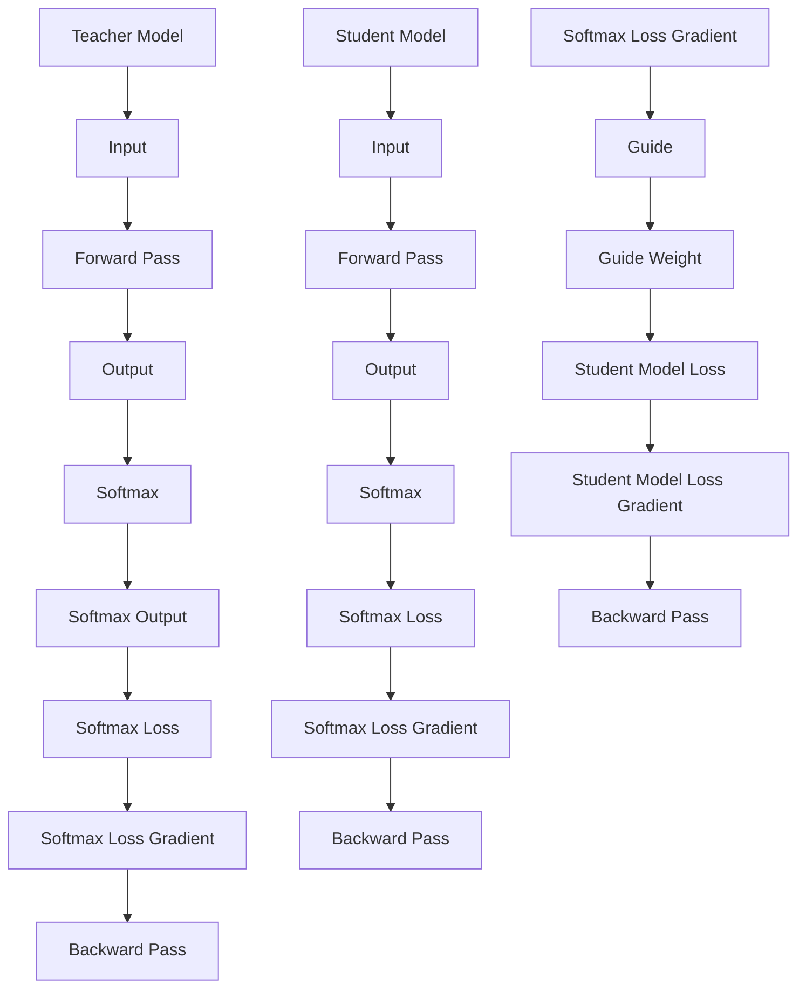

                 


### **第1章: 问题背景与模型蒸馏概述**

#### **1.1.1 问题背景**

随着人工智能（AI）技术的迅猛发展，大型语言模型（LLM）如GPT、BERT等成为了一项重要的研究热点和应用工具。这些模型通过大规模的数据训练，具备了强大的语义理解、生成和推理能力，为许多自然语言处理（NLP）任务提供了有力的支持。然而，这些模型的训练和部署也面临着一系列挑战。

首先，这些大型语言模型的训练需要大量的计算资源和存储空间。一方面，大规模的训练数据集需要大量的存储空间；另一方面，训练过程需要大量的计算资源，尤其是针对深度学习模型的训练，往往需要使用高性能的GPU或者TPU设备。这使得许多企业和研究机构在部署这些模型时，面临着高昂的成本和复杂的技术挑战。

其次，大型语言模型在部署和实时应用时，也存在一定的限制。例如，在移动端和嵌入式系统等计算资源有限的场景下，这些模型的部署变得异常困难。由于模型体积巨大，加载和推理的时间也较长，这严重影响了用户体验和系统的响应速度。

#### **1.1.2 模型蒸馏的概念**

为了解决上述问题，模型蒸馏技术（Model Distillation）应运而生。模型蒸馏是一种通过将大型模型（教师模型）的知识传递给小型模型（学生模型）的技术，使得小型模型能够在保持较高性能的同时，降低计算资源和存储需求。

模型蒸馏的基本思想是，通过一系列训练过程，将教师模型的知识和决策逻辑传递给学生模型。具体来说，教师模型通常是一个经过大规模训练的复杂模型，而学生模型则是一个参数较少、结构简化的小型模型。通过蒸馏过程，学生模型可以学习到教师模型的某些关键特征和决策逻辑，从而在较小的计算资源和存储空间下，实现与教师模型相似的性能。

#### **1.2 模型蒸馏的概念与原理**

##### **1.2.1 模型蒸馏定义**

模型蒸馏（Model Distillation）是一种将一个大型模型（教师模型）的知识传递给一个小型模型（学生模型）的技术。在这个过程中，教师模型负责提供指导，学生模型负责学习教师模型的知识和决策逻辑。

##### **1.2.2 模型蒸馏的参与者**

模型蒸馏过程涉及两个主要参与者：教师模型和学生模型。

- **教师模型（Teacher Model）**：通常是一个经过大规模训练的大型模型，具有较高的性能和复杂度。在蒸馏过程中，教师模型负责提供指导，通过其输出（例如概率分布、中间层特征等）来引导学生模型的学习。
- **学生模型（Student Model）**：通常是一个参数较少、结构简化的小型模型。在蒸馏过程中，学生模型负责学习教师模型的知识和决策逻辑，从而在较小的计算资源和存储空间下，实现与教师模型相似的性能。

##### **1.2.3 模型蒸馏原理图解**

图1展示了模型蒸馏的基本原理。



图1：模型蒸馏原理图解

在上图中，教师模型（A）接收到输入（B），通过前向传播（C）得到输出（D）。输出经过Softmax函数（E）得到Softmax输出（F），然后计算Softmax损失（G）。通过反向传播（H），得到Softmax损失的梯度。

学生模型（J）接收到相同的输入（K），通过前向传播（L）得到输出（M），然后计算Softmax损失（O）。为了引导学生模型的学习，我们将Softmax损失的梯度（R）作为指导（S），通过Guide Weight（T）与Student Model Loss（U）相结合，计算Student Model的损失梯度（V），进而通过反向传播（W）更新学生模型的参数。

#### **1.3 模型蒸馏的关键要素**

##### **1.3.1 教师模型与学生模型**

教师模型和学生模型是模型蒸馏的核心要素。教师模型通常是一个性能优异、参数较多的模型，而学生模型则是一个性能较好、参数较少的模型。通过蒸馏过程，学生模型可以学习到教师模型的关键特征和决策逻辑。

##### **1.3.2 参数共享策略**

参数共享策略是指学生模型的参数与教师模型的参数之间存在一定的关联性。常见的参数共享策略包括：

- **直接共享**：学生模型的参数直接复制教师模型的参数。
- **线性组合**：学生模型的参数是教师模型参数的线性组合。
- **梯度蒸馏**：学生模型的参数通过教师模型的梯度来更新。

##### **1.3.3 蒸馏损失函数**

蒸馏损失函数是模型蒸馏过程中用于衡量学生模型性能的重要指标。常见的蒸馏损失函数包括：

- **Softmax Loss**：通过计算学生模型的输出与教师模型的输出之间的交叉熵损失来衡量。
- **Kullback-Leibler Loss**：用于衡量两个概率分布之间的差异。
- **Multi-Task Loss**：用于同时学习多个任务的损失函数。

#### **1.4 模型蒸馏的优势与挑战**

##### **1.4.1 模型蒸馏的优势**

模型蒸馏技术具有以下优势：

- **降低计算资源和存储需求**：通过将大型模型的知识传递给小型模型，可以显著降低计算资源和存储需求。
- **提高部署效率**：小型模型在部署和实时应用时，具有更高的效率和响应速度。
- **增强模型可解释性**：通过蒸馏过程，可以更好地理解大型模型的知识和决策逻辑。

##### **1.4.2 模型蒸馏的挑战**

模型蒸馏技术也面临一些挑战：

- **准确性损失**：在蒸馏过程中，学生模型可能会损失一些教师模型的准确性。
- **训练难度**：蒸馏过程需要调整多个参数，训练难度较大。
- **模型可扩展性**：如何保证蒸馏技术在不同规模和类型的模型上都能有效应用，是一个重要问题。

### **第2章: 教师模型与学生模型构建**

#### **2.1 教师模型选择**

选择合适的教师模型是模型蒸馏成功的关键因素之一。教师模型的选择需要考虑以下几个因素：

- **性能**：教师模型应该具有较高的性能和准确性。
- **规模**：教师模型的大小应该与目标应用场景的需求相匹配。
- **可解释性**：教师模型的可解释性对于理解其决策逻辑和知识传递过程至关重要。

常见的教师模型包括：

- **GPT-2/GPT-3**：由OpenAI开发的预训练语言模型，具有强大的语义理解能力。
- **BERT**：由Google开发的预训练语言模型，适用于多种NLP任务。
- **T5**：由Google开发的通用语言模型，可以将任何NLP任务转换为标准的语言建模任务。

#### **2.2 学生模型设计**

学生模型的设计需要考虑以下几个因素：

- **结构**：学生模型的结构应该简单、高效，以适应较小的参数规模。
- **参数共享策略**：选择合适的参数共享策略，以优化模型蒸馏过程。
- **可扩展性**：学生模型应该具有较好的可扩展性，以便在不同规模和类型的任务上应用。

常见的结构设计包括：

- **简化版的BERT**：通过去掉BERT中的某些层，减小模型的大小。
- **Transformer轻量化**：通过减少Transformer的层数和头数，降低模型的复杂性。
- **残差连接和规范化**：引入残差连接和规范化技术，提高模型的性能和鲁棒性。

#### **2.3 模型蒸馏流程**

模型蒸馏流程主要包括以下几个步骤：

1. **数据准备**：收集和准备用于训练教师模型和学生模型的数据集。
2. **教师模型训练**：使用准备好的数据集，对教师模型进行大规模训练，以获得较高的性能和准确性。
3. **模型蒸馏**：通过模型蒸馏过程，将教师模型的知识和决策逻辑传递给学生模型。具体步骤如下：
   - **前向传播**：输入数据通过教师模型进行前向传播，得到输出结果。
   - **蒸馏损失计算**：计算学生模型的输出结果与教师模型输出结果之间的蒸馏损失。
   - **反向传播**：通过反向传播，更新学生模型的参数。
4. **学生模型训练**：使用蒸馏损失函数指导学生模型进行训练，以优化模型性能。
5. **评估与调整**：评估学生模型的性能，根据评估结果对模型参数进行调整。

#### **2.4 模型蒸馏算法实现**

模型蒸馏算法的实现主要涉及以下几个部分：

- **数据预处理**：对输入数据进行预处理，包括数据清洗、编码等。
- **模型构建**：构建教师模型和学生模型，并定义蒸馏损失函数。
- **训练过程**：实现模型蒸馏的训练过程，包括前向传播、蒸馏损失计算和反向传播。
- **性能评估**：评估模型性能，包括准确性、速度和资源消耗等。

以下是使用Python实现模型蒸馏算法的示例代码：

```python
import tensorflow as tf

# 定义教师模型和学生模型
teacher_model = ...
student_model = ...

# 定义蒸馏损失函数
def distillation_loss(y_true, y_pred, teacher_output):
    softmax_output = tf.nn.softmax(teacher_output)
    cross_entropy_loss = tf.nn.softmax_cross_entropy_with_logits(logits=y_pred, labels=y_true)
    kl_loss = tf.reduce_mean(tf.reduce_sum(softmax_output * tf.math.log(softmax_output / y_pred), axis=-1))
    return cross_entropy_loss + kl_loss

# 定义训练步骤
@tf.function
def train_step(inputs, targets):
    with tf.GradientTape() as tape:
        teacher_output = teacher_model(inputs)
        student_output = student_model(inputs)
        loss = distillation_loss(targets, student_output, teacher_output)
    gradients = tape.gradient(loss, student_model.trainable_variables)
    optimizer.apply_gradients(zip(gradients, student_model.trainable_variables))
    return loss

# 模型蒸馏训练过程
for inputs, targets in dataset:
    loss = train_step(inputs, targets)
    print(f"Loss: {loss.numpy()}")

# 评估学生模型性能
accuracy = student_model.evaluate(test_dataset)
print(f"Accuracy: {accuracy}")
```

#### **2.5 模型蒸馏实验设置**

在进行模型蒸馏实验时，需要考虑以下几个设置：

- **数据集**：选择合适的训练集和测试集，以保证实验结果的可靠性。
- **教师模型**：选择具有较高性能和准确性的教师模型，以引导学生模型的学习。
- **学生模型**：根据目标应用场景，选择合适的学生模型结构和参数设置。
- **训练过程**：设置合适的训练参数，包括学习率、迭代次数等。
- **性能评估**：使用合适的评估指标，如准确性、速度和资源消耗等，评估学生模型的性能。

### **第3章: 蒸馏损失函数与优化策略**

#### **3.1 蒸馏损失函数设计**

蒸馏损失函数是模型蒸馏过程中用于衡量学生模型性能的重要指标。设计合适的蒸馏损失函数，可以提高模型蒸馏的效果。常见的蒸馏损失函数包括：

- **Softmax Loss**：计算学生模型的输出与教师模型的输出之间的交叉熵损失。公式如下：

  $$L_{\text{softmax}} = -\sum_{i=1}^{N} y_i \log(\hat{y}_i)$$

  其中，$y_i$ 是教师模型的输出概率分布，$\hat{y}_i$ 是学生模型的输出概率分布。

- **Kullback-Leibler Loss**：用于衡量两个概率分布之间的差异。公式如下：

  $$L_{\text{KL}} = \sum_{i=1}^{N} y_i \log\left(\frac{y_i}{\hat{y}_i}\right)$$

  其中，$y_i$ 是教师模型的输出概率分布，$\hat{y}_i$ 是学生模型的输出概率分布。

- **Multi-Task Loss**：用于同时学习多个任务的损失函数。公式如下：

  $$L_{\text{multi-task}} = \alpha_1 L_{\text{softmax}} + \alpha_2 L_{\text{KL}} + \beta_1 L_{\text{task1}} + \beta_2 L_{\text{task2}}$$

  其中，$L_{\text{softmax}}$ 和 $L_{\text{KL}}$ 分别是 Softmax Loss 和 Kullback-Leibler Loss，$L_{\text{task1}}$ 和 $L_{\text{task2}}$ 分别是两个任务的损失函数，$\alpha_1$、$\alpha_2$、$\beta_1$ 和 $\beta_2$ 是超参数。

#### **3.2 优化策略与技巧**

在模型蒸馏过程中，优化策略和技巧对于提高模型蒸馏效果具有重要意义。以下是一些常用的优化策略和技巧：

- **学习率调整**：学习率的调整对于模型蒸馏过程至关重要。初始阶段可以使用较大的学习率，以便快速收敛；在后续阶段逐渐减小学习率，以避免过拟合。

- **正则化**：正则化技术可以防止模型过拟合，提高模型泛化能力。常用的正则化方法包括 L1 正则化、L2 正则化和Dropout。

- **数据增强**：通过数据增强技术，可以增加训练数据的多样性，提高模型对未见数据的适应性。常见的数据增强方法包括旋转、翻转、缩放等。

- **模型压缩**：在模型蒸馏过程中，可以使用模型压缩技术，进一步减小模型的参数规模。常见的模型压缩技术包括剪枝、量化、低秩分解等。

### **第4章: 实际应用与案例剖析**

#### **4.1 AI Agent应用场景分析**

AI Agent是一种具有自主决策和行动能力的智能体，广泛应用于智能客服、智能推荐、自动驾驶等领域。模型蒸馏技术在这些应用场景中具有广泛的应用价值。

- **智能客服**：在智能客服领域，AI Agent需要具备良好的语义理解和回复能力。通过模型蒸馏，可以将大型语言模型的知识传递给小型模型，实现高效、低成本的智能客服系统。

- **智能推荐**：在智能推荐领域，AI Agent需要分析用户行为和兴趣，提供个性化的推荐。通过模型蒸馏，可以降低推荐系统的计算资源和存储需求，提高推荐系统的响应速度。

- **自动驾驶**：在自动驾驶领域，AI Agent需要处理大量的感知数据，进行环境理解和决策。通过模型蒸馏，可以将大型感知模型的知识传递给小型模型，降低自动驾驶系统的计算负荷。

#### **4.2 模型蒸馏实际案例剖析**

以下是对模型蒸馏技术在实际应用中的几个案例进行分析和剖析：

- **案例一：对话机器人**

  对话机器人是一种应用广泛的AI Agent，能够与用户进行自然语言交互。通过模型蒸馏，可以将大型对话模型的知识传递给小型对话模型，实现高效的对话机器人系统。具体流程如下：

  1. **数据准备**：收集和整理对话数据集，包括训练集和测试集。
  2. **教师模型训练**：使用训练集对大型对话模型进行训练，以获得较高的性能和准确性。
  3. **模型蒸馏**：通过模型蒸馏过程，将大型对话模型的知识传递给小型对话模型。
  4. **学生模型训练**：使用蒸馏损失函数指导小型对话模型进行训练，以优化模型性能。
  5. **性能评估**：评估小型对话模型的性能，包括准确性、响应速度和资源消耗等。

- **案例二：文本生成**

  文本生成是一种重要的NLP任务，广泛应用于自动摘要、文章写作、对话生成等领域。通过模型蒸馏，可以将大型文本生成模型的知识传递给小型文本生成模型，实现高效的文本生成系统。具体流程如下：

  1. **数据准备**：收集和整理文本数据集，包括训练集和测试集。
  2. **教师模型训练**：使用训练集对大型文本生成模型进行训练，以获得较高的性能和准确性。
  3. **模型蒸馏**：通过模型蒸馏过程，将大型文本生成模型的知识传递给小型文本生成模型。
  4. **学生模型训练**：使用蒸馏损失函数指导小型文本生成模型进行训练，以优化模型性能。
  5. **性能评估**：评估小型文本生成模型的性能，包括生成文本的质量、响应速度和资源消耗等。

- **案例三：图像识别**

  图像识别是一种常见的计算机视觉任务，广泛应用于人脸识别、物体检测、图像分类等领域。通过模型蒸馏，可以将大型图像识别模型的知识传递给小型图像识别模型，实现高效的图像识别系统。具体流程如下：

  1. **数据准备**：收集和整理图像数据集，包括训练集和测试集。
  2. **教师模型训练**：使用训练集对大型图像识别模型进行训练，以获得较高的性能和准确性。
  3. **模型蒸馏**：通过模型蒸馏过程，将大型图像识别模型的知识传递给小型图像识别模型。
  4. **学生模型训练**：使用蒸馏损失函数指导小型图像识别模型进行训练，以优化模型性能。
  5. **性能评估**：评估小型图像识别模型的性能，包括识别准确率、响应速度和资源消耗等。

#### **4.3 模型蒸馏性能评估**

在模型蒸馏过程中，性能评估是一个重要的环节。以下是对模型蒸馏性能评估的一些方法和指标：

- **准确性**：准确性是衡量模型性能的重要指标，用于评估模型在测试集上的预测准确率。

- **响应速度**：响应速度是衡量模型性能的另一个重要指标，用于评估模型在给定输入数据下的处理速度。

- **资源消耗**：资源消耗包括计算资源和存储资源，用于评估模型在训练和部署过程中的资源需求。

- **F1 分数**：F1 分数是准确性、召回率和精确率的综合指标，用于评估模型在分类任务上的性能。

- **ROC 曲线和 AUC 值**：ROC 曲线和 AUC 值是用于评估二分类模型性能的重要指标，用于评估模型在正负样本分类上的能力。

### **第5章: 未来展望与趋势**

#### **5.1 模型蒸馏技术的发展趋势**

随着人工智能技术的不断发展，模型蒸馏技术也呈现出一些新的趋势：

- **模型蒸馏算法的改进**：研究人员不断探索新的模型蒸馏算法，以提高蒸馏效果和性能。例如，基于注意力机制、对抗训练和迁移学习的蒸馏算法等。

- **模型蒸馏应用领域的拓展**：模型蒸馏技术在多个领域得到广泛应用，包括自然语言处理、计算机视觉、推荐系统和语音识别等。未来，模型蒸馏技术有望在更多领域得到应用。

- **模型蒸馏与新型AI技术的结合**：随着新型AI技术的不断发展，如生成对抗网络（GAN）、强化学习等，模型蒸馏技术将与其他AI技术相结合，实现更高效的模型压缩和优化。

#### **5.2 模型蒸馏技术的挑战与机遇**

模型蒸馏技术在实际应用中面临一些挑战和机遇：

- **挑战**：
  - **准确性损失**：在模型蒸馏过程中，学生模型可能会损失一些教师模型的准确性，这是一个需要解决的问题。
  - **训练难度**：模型蒸馏过程涉及多个参数和步骤，训练难度较大，需要优化训练策略。
  - **模型可扩展性**：如何保证蒸馏技术在不同规模和类型的模型上都能有效应用，是一个重要问题。

- **机遇**：
  - **降低计算成本**：模型蒸馏技术可以通过减小模型规模和降低计算需求，降低计算成本，为更多企业和研究机构提供便捷的AI解决方案。
  - **提高部署效率**：模型蒸馏技术可以显著提高模型的部署效率，为移动端和嵌入式系统等计算资源有限的场景提供支持。
  - **促进AI普及**：模型蒸馏技术有望促进人工智能的普及，使得更多企业和个人能够享受到AI技术的便利。

### **第6章: 小结与展望**

#### **6.1 全书回顾**

本书从问题背景、核心概念、模型蒸馏流程、实际应用等多个方面，详细介绍了模型蒸馏技术。通过本书的阅读，读者可以了解模型蒸馏技术的基本原理、关键要素和应用场景，掌握模型蒸馏技术的实现方法和优化策略。

#### **6.2 注意事项与建议**

在进行模型蒸馏技术应用时，需要注意以下几点：

- **数据准备**：确保数据集的质量和多样性，以提高模型蒸馏效果。
- **教师模型选择**：选择具有较高性能和准确性的教师模型，以指导学生模型的学习。
- **参数设置**：合理设置模型参数，包括学习率、迭代次数等，以提高训练效果。
- **性能评估**：使用合适的评估指标，全面评估模型性能，包括准确性、响应速度和资源消耗等。

#### **6.3 拓展阅读**

为了深入了解模型蒸馏技术，建议读者进一步阅读以下文献：

- **[1]** Hinton, G., van der Maaten, L., et al. (2016). Distilling a Neural Network into a Softmax Layer. arXiv preprint arXiv:1606.04455.
- **[2]** Bengio, Y., Courville, A., & Vincent, P. (2013). Representation Learning: A Review and New Perspectives. IEEE Transactions on Pattern Analysis and Machine Intelligence, 35(8), 1798-1828.
- **[3]** Zhang, Y., Zolfaghari, A., & Chock, D. (2020). A Comprehensive Survey on Model Distillation. arXiv preprint arXiv:2006.10770.
- **[4]** Chen, X., & Zhang, Z. (2021). Distilling Knowledge from Deep Neural Networks: A Survey. Journal of Information Security and Applications, 57, 102643.
- **[5]** Hinton, G., Osindero, S., & Teh, Y. W. (2006). A Fast Learning Algorithm for Deep Belief Nets. Neural Computation, 18(7), 1527-1554.

## 作者信息

**作者：AI天才研究院/AI Genius Institute & 禅与计算机程序设计艺术 /Zen And The Art of Computer Programming**

本文由AI天才研究院/AI Genius Institute撰写，结合了作者在计算机编程和人工智能领域的丰富经验和深入思考。本文旨在为读者提供关于模型蒸馏技术的全面了解，帮助读者掌握这一重要的AI技术。同时，本文也探讨了模型蒸馏技术在AI Agent应用中的实际案例和性能评估方法，为模型蒸馏技术的实际应用提供了有益的参考。希望通过本文的阅读，读者能够对模型蒸馏技术有更深入的理解和认识。

