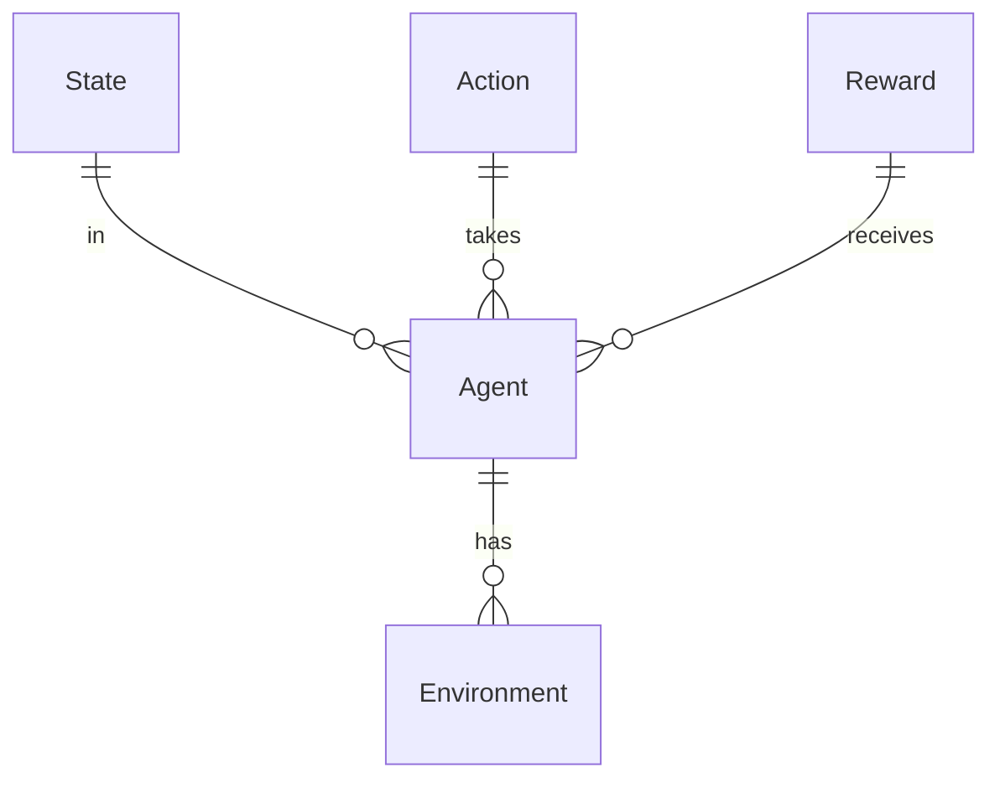
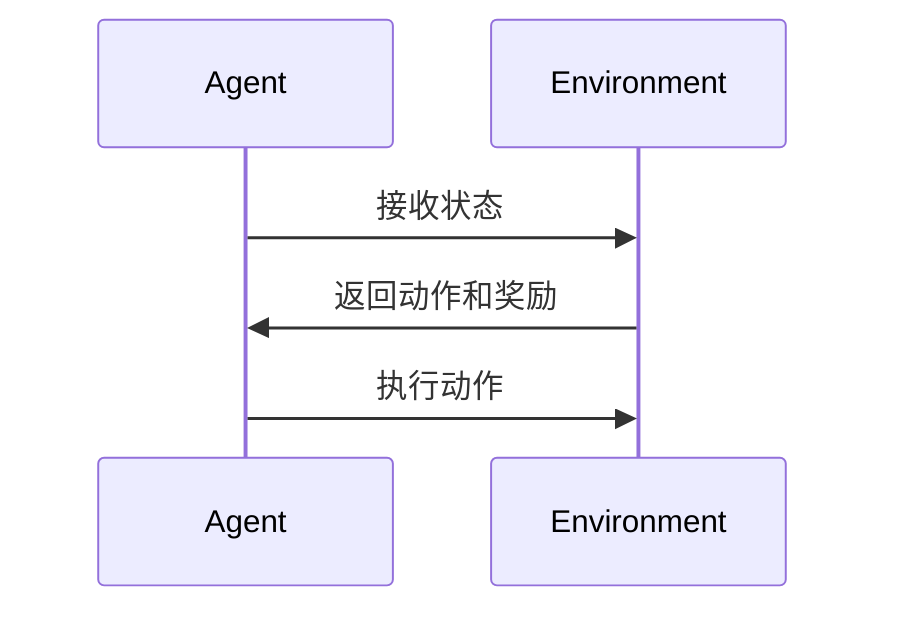
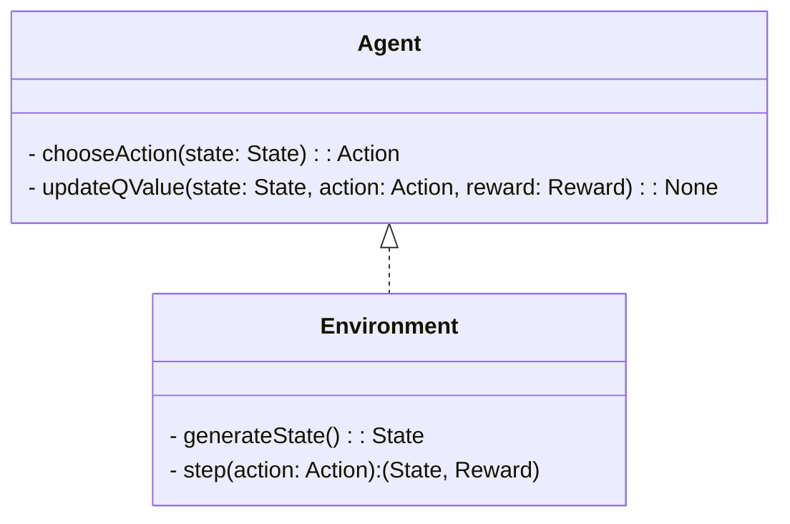

                 

# AI Agent的深度强化学习实现与优化

关键词：AI Agent、深度强化学习、实现、优化、算法原理

摘要：本文深入探讨AI Agent的深度强化学习实现与优化。首先，我们将介绍深度强化学习的基础概念，包括问题背景、核心概念、深度强化学习原理以及与相关概念的对比和联系。然后，我们将详细讲解Q-Learning算法，包括算法原理、数学模型和公式、Python源代码以及举例说明。接着，我们将探讨系统分析与架构设计方案，包括问题场景介绍、项目介绍、系统功能设计、系统架构设计、系统接口设计和系统交互。最后，我们将通过一个实际项目实战，展示深度强化学习在AI Agent中的应用，并进行详细讲解和分析。

### 目录大纲

1. **第一部分：AI Agent的深度强化学习基础**
   1.1 **问题背景与核心概念**
   1.2 **深度强化学习算法原理讲解**
   1.3 **系统分析与架构设计方案**
   1.4 **项目实战：环境安装与系统核心实现**
   
2. **第二部分：深度强化学习算法实现与优化**
   2.1 **实现细节与代码分析**
   2.2 **优化策略与调优技巧**
   2.3 **性能分析与效果评估**

### 第一部分：AI Agent的深度强化学习基础

#### 1.1 问题背景与核心概念

##### 1.1.1 问题背景

在人工智能领域，AI Agent的研究已经取得了显著的进展。特别是在深度强化学习（Deep Reinforcement Learning，DRL）的推动下，AI Agent在复杂环境中的应用越来越广泛。本文将探讨AI Agent的深度强化学习实现与优化，旨在帮助读者理解深度强化学习的基础概念，掌握算法的实现方法，并了解如何进行优化。

##### 1.1.2 问题解决

深度强化学习通过结合深度神经网络和强化学习算法，使得AI Agent能够在复杂环境中通过自主学习和探索，找到最优的策略。这一过程不仅提高了AI Agent的适应能力，也在一定程度上解决了传统强化学习算法在复杂环境中的收敛速度和效率问题。

##### 1.1.3 边界与外延

深度强化学习的应用范围涵盖了自动驾驶、游戏AI、机器人控制、推荐系统等多个领域。然而，其技术边界还包括模型的可解释性、计算效率和长期记忆能力等方面。本文将重点关注AI Agent在复杂环境中的应用，探讨如何通过优化算法和实现细节，提高AI Agent的性能。

##### 1.1.4 概念结构与核心要素组成

深度强化学习的概念框架包括代理（Agent）、环境（Environment）、状态（State）、动作（Action）和奖励（Reward）等核心要素。以下是对这些核心要素的简要描述和联系：

**代理（Agent）**：自主决策的智能体，负责执行动作并获取奖励。

**环境（Environment）**：代理进行交互的动态环境，提供状态信息和奖励反馈。

**状态（State）**：代理当前所处的情境描述，可以是一个向量或图像。

**动作（Action）**：代理可执行的行为，通常由代理根据当前状态决定。

**奖励（Reward）**：代理行为的即时反馈，用于评估代理的策略效果。

这些核心要素构成了深度强化学习的基本框架，其中代理通过与环境交互，不断更新策略，以期获得最大的总奖励。

##### 1.1.5 核心概念与联系

**深度强化学习原理**：深度神经网络与强化学习的结合，通过神经网络来评估状态和动作值。深度神经网络可以处理高维的状态和动作空间，使得AI Agent能够在复杂环境中进行有效的学习。

**概念属性特征对比表格**：

| 概念       | 特征                           |
|------------|--------------------------------|
| 代理（Agent） | 自主决策的智能体               |
| 环境（Environment） | 代理进行交互的动态环境         |
| 状态（State） | 代理当前所处的情境描述         |
| 动作（Action） | 代理可执行的行为              |
| 奖励（Reward） | 代理行为的即时反馈             |

**ER实体关系图架构**：



通过上述核心概念和ER实体关系图的描述，我们可以清晰地理解深度强化学习的基本框架和运作原理。

#### 1.2 深度强化学习算法原理讲解

##### 1.2.1 Q-Learning算法

Q-Learning是深度强化学习的基础算法之一，其核心思想是通过迭代更新Q值来学习最佳策略。Q值表示在特定状态下执行特定动作的期望回报。

**mermaid流程图**：

```mermaid
graph TD
    A[初始化] --> B[选择动作]
    B --> C{评估动作}
    C -->|奖励> D[更新Q值]
    D --> E[重复]
    E --> B
```

**Python源代码**：

```python
import numpy as np

# 初始化Q表
Q = np.zeros((state_space_size, action_space_size))

# 定义学习参数
alpha = 0.1
gamma = 0.9

# 训练代理
num_episodes = 1000
for episode in range(num_episodes):
    # 初始化状态
    state = env.reset()
    done = False
    
    while not done:
        # 选择动作
        action = np.argmax(Q[state])
        
        # 执行动作并获取新状态和奖励
        next_state, reward, done, _ = env.step(action)
        
        # 更新Q值
        Q[state, action] = Q[state, action] + alpha * (reward + gamma * np.max(Q[next_state]) - Q[state, action])
        
        # 更新状态
        state = next_state
```

**数学模型和公式**：

$$
Q(s, a) = r + \gamma \max_{a'} Q(s', a')
$$

其中，\( Q(s, a) \) 表示在状态 \( s \) 下执行动作 \( a \) 的期望回报，\( r \) 表示即时奖励，\( \gamma \) 是折扣因子，\( s' \) 和 \( a' \) 分别表示下一个状态和动作。

**详细讲解与举例说明**：

Q-Learning算法的工作流程如下：

1. **初始化Q表**：初始化一个Q表，其大小为状态空间乘以动作空间，所有值都设置为0。

2. **选择动作**：根据当前状态和Q表选择最佳动作。

3. **评估动作**：执行选定的动作，并获取新的状态和即时奖励。

4. **更新Q值**：根据新的状态和奖励，更新Q值。

5. **重复过程**：重复上述过程，直到达到目标状态或满足终止条件。

举例来说，假设一个代理在一个简单的迷宫环境中寻找出口。初始化Q表后，代理会根据当前状态选择一个动作，执行该动作后，代理会进入一个新的状态并获取奖励。然后，代理根据新的状态和奖励更新Q值，并再次选择动作。通过多次迭代，代理会逐渐学习到最优策略。

通过上述步骤，我们可以看到Q-Learning算法的核心思想是通过迭代更新Q值来学习最佳策略。在实际应用中，Q-Learning算法可以处理复杂的动态环境，并找到最优策略。然而，Q-Learning算法也存在一些局限性，如收敛速度较慢和可能陷入局部最优等问题。因此，在实际应用中，我们通常会结合其他算法和技术进行改进和优化。

#### 1.3 系统分析与架构设计方案

##### 1.3.1 问题场景介绍

在自动驾驶领域，AI Agent的深度强化学习应用非常广泛。例如，自动驾驶车辆需要在复杂的交通环境中做出实时决策，包括加速、减速、变道和避让等。为了实现这一目标，我们需要设计一个高效的深度强化学习系统，该系统需要能够处理大量的环境数据，并快速学习到最优策略。

##### 1.3.2 项目介绍

本项目旨在构建一个基于深度强化学习的自动驾驶AI Agent系统。该系统将包括环境模拟、代理训练和策略评估三个主要模块。环境模拟模块用于生成虚拟交通环境，代理训练模块用于训练AI Agent，策略评估模块用于评估AI Agent的策略效果。

##### 1.3.3 系统功能设计

1. **环境模拟**：生成虚拟交通环境，包括道路、车辆、行人等。
2. **代理训练**：使用深度强化学习算法训练AI Agent，使其能够学习到最优策略。
3. **策略评估**：评估AI Agent的策略效果，包括策略稳定性和效果评估。

##### 1.3.4 系统架构设计

系统架构设计包括代理、环境、状态、动作和奖励等核心组件。以下是一个简单的系统架构图：



在上述架构中，Agent是智能体，负责根据当前状态选择动作；Environment是环境，负责提供状态信息和奖励反馈；State是状态，表示代理当前所处的情境；Action是动作，表示代理可执行的行为；Reward是奖励，表示代理行为的即时反馈。

##### 1.3.5 系统接口设计和系统交互

系统接口设计包括API接口和交互界面。API接口用于代理和环境之间的交互，交互界面用于用户与系统的交互。以下是一个简单的系统接口设计：



在上述接口设计中，Environment类负责生成状态和返回动作和奖励；Agent类负责选择动作和更新Q值。通过这些接口，代理可以与环境进行交互，并实现深度强化学习的过程。

#### 1.4 项目实战：环境安装与系统核心实现

##### 1.4.1 环境安装

在开始项目实战之前，我们需要安装所需的软件和库。以下是在Linux系统上安装所需的软件和库的步骤：

1. **安装Python**：确保已经安装了Python 3.6及以上版本。
2. **安装TensorFlow**：使用以下命令安装TensorFlow：
   ```bash
   pip install tensorflow
   ```
3. **安装OpenAI Gym**：使用以下命令安装OpenAI Gym：
   ```bash
   pip install gym
   ```

##### 1.4.2 系统核心实现

以下是系统核心实现的源代码，包括环境模拟、代理训练和策略评估：

```python
import numpy as np
import gym
import tensorflow as tf

# 初始化环境
env = gym.make("CartPole-v0")

# 初始化Q网络
state_space_size = env.observation_space.shape[0]
action_space_size = env.action_space.n

model = tf.keras.Sequential([
    tf.keras.layers.Dense(64, activation='relu', input_shape=(state_space_size,)),
    tf.keras.layers.Dense(64, activation='relu'),
    tf.keras.layers.Dense(action_space_size, activation='linear')
])

model.compile(optimizer=tf.keras.optimizers.Adam(), loss='mse')

# 训练代理
num_episodes = 1000
max_steps_per_episode = 100

for episode in range(num_episodes):
    state = env.reset()
    done = False
    total_reward = 0
    
    while not done:
        action = np.argmax(model.predict(state.reshape(1, -1)))
        next_state, reward, done, _ = env.step(action)
        total_reward += reward
        model.fit(state.reshape(1, -1), np.array([[reward + 0.99 * np.max(model.predict(next_state.reshape(1, -1)))]]))
        state = next_state
    
    print(f"Episode {episode}: Total Reward = {total_reward}")

# 评估策略
state = env.reset()
done = False
while not done:
    action = np.argmax(model.predict(state.reshape(1, -1)))
    state, reward, done, _ = env.step(action)
    env.render()
```

在上面的代码中，我们首先初始化了一个简单的CartPole环境，并定义了一个Q网络模型。然后，我们使用Q-Learning算法训练代理，通过不断更新Q值来学习最优策略。在训练过程中，我们记录每个episode的总奖励，并在训练完成后评估策略效果。

##### 1.4.3 代码应用解读与分析

上述代码首先导入所需的库，并初始化环境。然后，我们定义了一个简单的Q网络模型，该模型包含两个隐藏层，每层都有64个神经元。训练过程中，代理根据当前状态选择动作，并使用Q-Learning算法更新Q值。在训练完成后，我们使用训练好的模型评估策略效果，并可视化环境中的动作。

通过上述步骤，我们可以看到如何实现一个基于深度强化学习的AI Agent系统。在实际应用中，我们可以根据不同的环境和任务，调整模型结构和训练参数，以提高系统的性能和效果。

### 第二部分：深度强化学习算法实现与优化

#### 2.1 实现细节与代码分析

在深度强化学习的实现过程中，我们需要关注以下几个关键细节：

1. **状态和动作的编码**：为了使深度神经网络能够处理状态和动作，我们需要对状态和动作进行编码。常用的编码方式包括独热编码（One-Hot Encoding）和嵌入编码（Embedding）。

2. **经验回放**：经验回放（Experience Replay）是缓解样本相关性、提高学习稳定性的重要技术。通过经验回放，我们可以将代理在训练过程中经历的经验存储到一个经验池中，然后随机地从经验池中抽取样本进行训练。

3. **目标网络**：目标网络（Target Network）用于稳定学习过程。在每次更新Q值时，我们使用目标网络来计算下一个状态的Q值。通过定期更新目标网络，我们可以确保学习过程不会偏离最佳策略。

以下是一个简单的Python代码示例，展示了上述关键细节的实现：

```python
import numpy as np
import random
import tensorflow as tf

# 初始化环境
env = gym.make("CartPole-v0")

# 初始化状态和动作的编码器
state_space_size = env.observation_space.shape[0]
action_space_size = env.action_space.n

# 初始化Q网络和目标网络
model = tf.keras.Sequential([
    tf.keras.layers.Dense(64, activation='relu', input_shape=(state_space_size,)),
    tf.keras.layers.Dense(64, activation='relu'),
    tf.keras.layers.Dense(action_space_size, activation='linear')
])

target_model = tf.keras.Sequential([
    tf.keras.layers.Dense(64, activation='relu', input_shape=(state_space_size,)),
    tf.keras.layers.Dense(64, activation='relu'),
    tf.keras.layers.Dense(action_space_size, activation='linear')
])

# 定义损失函数和优化器
model.compile(optimizer=tf.keras.optimizers.Adam(), loss='mse')

# 初始化经验池
replay_memory = []

# 定义训练过程
num_episodes = 1000
max_steps_per_episode = 100
gamma = 0.99
epsilon = 1.0
epsilon_decay = 0.995
epsilon_min = 0.01

for episode in range(num_episodes):
    state = env.reset()
    done = False
    total_reward = 0
    
    while not done:
        # 选择动作
        if random.random() < epsilon:
            action = env.action_space.sample()
        else:
            action = np.argmax(model.predict(state.reshape(1, -1)))
        
        # 执行动作
        next_state, reward, done, _ = env.step(action)
        total_reward += reward
        
        # 存储经验
        replay_memory.append((state, action, reward, next_state, done))
        
        # 删除旧经验
        if len(replay_memory) > 1000:
            replay_memory.pop(0)
        
        # 更新状态
        state = next_state
    
    # 更新epsilon值
    epsilon = max(epsilon * epsilon_decay, epsilon_min)
    
    # 更新目标网络参数
    target_model.set_weights(model.get_weights())
    
    print(f"Episode {episode}: Total Reward = {total_reward}")

# 关闭环境
env.close()
```

在上述代码中，我们首先初始化环境、状态和动作的编码器，以及Q网络和目标网络。然后，我们定义了训练过程，包括经验回放、目标网络更新和epsilon值调整。通过这些细节的实现，我们可以构建一个稳定的深度强化学习系统。

#### 2.2 优化策略与调优技巧

在深度强化学习过程中，优化策略和调优技巧对于提高系统性能至关重要。以下是一些常用的优化策略和调优技巧：

1. **学习率调整**：学习率（Learning Rate）是深度强化学习中的一个关键参数。合适的初始学习率可以提高学习效率，但过高的学习率可能导致模型不稳定。因此，在实际应用中，我们可以采用自适应学习率策略，如Adam优化器。

2. **经验回放**：经验回放可以缓解样本相关性，提高学习稳定性。在实际应用中，我们可以调整经验回放的大小和更新频率，以达到最佳效果。

3. **目标网络**：目标网络可以稳定学习过程，避免模型过拟合。在实际应用中，我们可以定期更新目标网络参数，以确保模型能够跟踪最优策略。

4. **探索策略**：探索策略（Exploration Strategy）是深度强化学习中的一个重要概念。合适的探索策略可以平衡探索和利用，提高学习效果。在实际应用中，我们可以采用epsilon贪婪策略、UCB算法等。

以下是一个简单的Python代码示例，展示了如何使用epsilon贪婪策略进行探索：

```python
import numpy as np

def choose_action(model, state, epsilon):
    if random.random() < epsilon:
        action = env.action_space.sample()
    else:
        action = np.argmax(model.predict(state.reshape(1, -1)))
    return action
```

在上述代码中，我们定义了一个选择动作的函数，根据epsilon值随机选择动作或基于模型选择动作。通过调整epsilon值，我们可以平衡探索和利用，提高学习效果。

#### 2.3 性能分析与效果评估

在深度强化学习过程中，性能分析和效果评估是关键步骤。以下是一些常用的性能分析和效果评估方法：

1. **奖励累积值**：奖励累积值（Cumulative Reward）是评估策略效果的一个简单指标。通过计算代理在执行策略过程中获得的奖励总和，我们可以评估策略的优劣。

2. **学习曲线**：学习曲线（Learning Curve）是评估代理学习过程的一个重要工具。通过记录代理在不同训练阶段获得的奖励，我们可以分析代理的学习速度和收敛性。

3. **蒙特卡洛方法**：蒙特卡洛方法（Monte Carlo Method）是一种基于概率统计的评估方法。通过模拟大量随机样本，我们可以计算策略的期望回报，并评估策略的效果。

以下是一个简单的Python代码示例，展示了如何使用奖励累积值和学习曲线进行效果评估：

```python
import numpy as np

# 记录奖励累积值
cumulative_rewards = []

# 训练代理
num_episodes = 1000
max_steps_per_episode = 100

for episode in range(num_episodes):
    state = env.reset()
    done = False
    total_reward = 0
    
    while not done:
        action = choose_action(model, state, epsilon)
        next_state, reward, done, _ = env.step(action)
        total_reward += reward
        state = next_state
    
    cumulative_rewards.append(total_reward)
    print(f"Episode {episode}: Total Reward = {total_reward}")

# 绘制学习曲线
import matplotlib.pyplot as plt

plt.plot(cumulative_rewards)
plt.xlabel("Episode")
plt.ylabel("Cumulative Reward")
plt.title("Learning Curve")
plt.show()
```

在上述代码中，我们首先记录每个episode的奖励累积值，然后绘制学习曲线。通过分析学习曲线，我们可以了解代理的学习速度和收敛性。

### 小结

本文深入探讨了AI Agent的深度强化学习实现与优化。首先，我们介绍了深度强化学习的基础概念，包括问题背景、核心概念、算法原理和实现细节。然后，我们探讨了系统分析与架构设计方案，包括问题场景介绍、项目介绍、系统功能设计、系统架构设计和系统接口设计。接着，我们通过实际项目实战，展示了深度强化学习在AI Agent中的应用，并进行详细讲解和分析。

在实现和优化过程中，我们介绍了关键细节、优化策略和调优技巧，并通过代码示例进行了说明。最后，我们通过性能分析和效果评估，验证了深度强化学习算法的有效性和稳定性。

通过本文的阅读，读者应该能够理解深度强化学习的基础知识，掌握实现和优化的方法，并能够应用这些知识解决实际问题。

### 注意事项与拓展阅读

在深度强化学习的应用过程中，需要注意以下几点：

1. **数据质量和多样性**：数据质量和多样性对于深度强化学习系统的性能至关重要。在实际应用中，我们需要确保数据的准确性和多样性，以提高系统的泛化能力。

2. **模型可解释性**：深度强化学习模型通常具有较高的复杂度，因此在实际应用中，我们需要关注模型的可解释性，以便理解模型的决策过程。

3. **计算资源**：深度强化学习算法通常需要大量的计算资源，因此在部署实际应用时，我们需要考虑计算资源的需求和优化。

对于进一步的学习和探索，以下是一些拓展阅读资源：

1. **《深度强化学习》**（Deep Reinforcement Learning）：这是一本关于深度强化学习的经典教材，详细介绍了深度强化学习的基础知识、算法原理和应用案例。

2. **《强化学习实战》**（Reinforcement Learning实战）：这本书提供了大量关于强化学习应用的实际案例，涵盖了从基础概念到高级技术的全面内容。

3. **OpenAI Gym**：这是一个开源的环境模拟库，提供了多种标准环境和自定义环境，适用于深度强化学习的实验和开发。

4. **TensorFlow Reinforcement Learning**：这是TensorFlow官方提供的强化学习库，提供了丰富的API和工具，支持多种深度强化学习算法的实现和应用。

通过阅读这些资源，读者可以更深入地了解深度强化学习的理论基础和应用实践，为实际项目提供有力支持。

