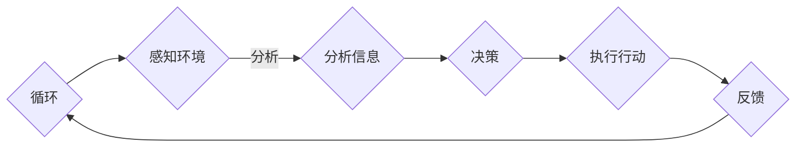
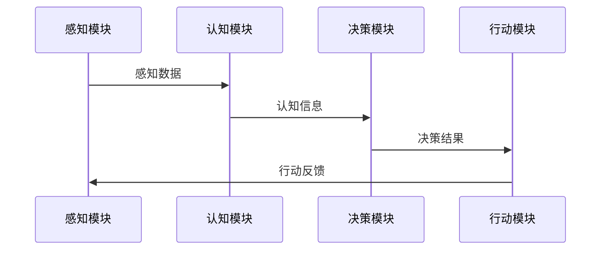
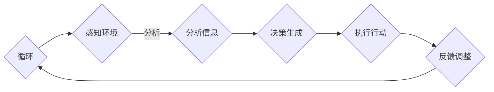
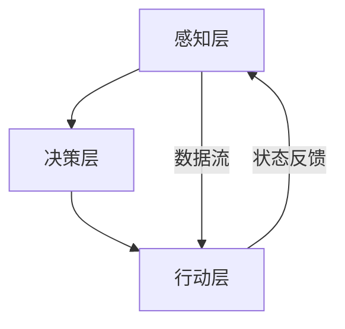

                 


# AI Agent的生物启发式决策模型实现

关键词：AI Agent、生物启发式决策模型、算法实现、系统架构、项目实战

## 摘要

本文将深入探讨AI Agent的生物启发式决策模型的实现。首先，我们将介绍AI Agent的基本概念和生物启发式决策模型的基础知识。接着，通过一步步的分析和推理，我们将详细讲解该算法的原理，并使用Python源代码进行阐述。随后，我们将分析系统架构，并进行项目实战，最后总结最佳实践和注意事项。

## 目录大纲设计思路

为了设计出一本《AI Agent的生物启发式决策模型实现》的完整目录大纲，我们将按照以下步骤进行：

### 第一步：确定整体结构

**第一部分：背景介绍**
- 第1章：AI Agent与生物启发式决策模型概述
**第二部分：核心概念与联系**
- 第2章：AI Agent的核心概念及其关系
- 第3章：生物启发式决策模型的基础知识
**第三部分：算法原理与实现**
- 第4章：算法原理讲解与流程图展示
- 第5章：Python源代码实现与算法讲解
**第四部分：系统分析与架构设计**
- 第6章：系统功能与架构设计
- 第7章：系统接口设计与交互流程
**第五部分：项目实战**
- 第8章：环境安装与系统核心实现
- 第9章：代码应用解读与分析
- 第10章：实际案例分析
**第六部分：最佳实践与总结**
- 第11章：最佳实践技巧与注意事项
- 第12章：小结与拓展阅读

### 第二步：编写背景介绍

**第1章：AI Agent与生物启发式决策模型概述**

## 1.1 AI Agent的概念与作用
### 1.1.1 AI Agent的定义

AI Agent，即人工智能代理，是一种能够感知环境、处理信息并采取行动的计算机程序。它是人工智能领域中研究的一个重要方向，旨在实现类似于人类智能的自主行为。

### 1.1.2 AI Agent的特点

- **自主性**：AI Agent能够自主地完成特定任务，而不需要外部指令。
- **适应性**：AI Agent能够根据环境的变化调整自己的行为策略。
- **交互性**：AI Agent能够与其他系统、用户或其他AI Agent进行交互。

### 1.1.3 AI Agent的应用场景

AI Agent广泛应用于智能家居、自动驾驶、智能客服、金融量化交易等领域，为人类提供便捷、高效的智能服务。

## 1.2 生物启发式决策模型概述

生物启发式决策模型来源于自然界中的生物决策过程，如动物的行为策略、植物的适应性生长等。这种模型模拟了生物在复杂环境中的决策机制，具有以下特点：

- **复杂性适应**：生物启发式模型能够处理复杂的、不确定的环境信息。
- **鲁棒性**：生物启发式模型能够在各种环境中稳定运行，具有较强的鲁棒性。
- **进化性**：生物启发式模型可以通过迭代优化不断改进自己的决策策略。

## 1.3 本书内容概述

本书分为六个部分，首先介绍AI Agent和生物启发式决策模型的基础知识，然后详细讲解算法原理和实现，接着分析系统架构并进行项目实战，最后总结最佳实践和注意事项。通过本书，读者可以系统地了解AI Agent的生物启发式决策模型的实现方法和应用。

### 第三步：定义核心概念与联系

**第2章：AI Agent的核心概念及其关系**

## 2.1 AI Agent的核心概念

AI Agent的核心概念包括感知模块、认知模块和行动模块。这些模块共同构成了AI Agent的基本架构。

### 2.1.1 感知模块

感知模块负责收集和识别外部环境的信息，如视觉、听觉、触觉等。它将环境信息转换为AI Agent可以理解的数据。

### 2.1.2 认知模块

认知模块负责处理感知模块收集到的信息，进行数据分析和模式识别。它能够理解环境的状态，形成对环境的认知。

### 2.1.3 行动模块

行动模块负责根据认知模块的分析结果，生成并执行具体的行动。它将AI Agent的决策转化为实际的行为。

## 2.2 概念关系对比表格

| 模块 | 功能 | 对应生物系统 |
|------|-----|--------------|
| 感知模块 | 感知环境 | 视觉、听觉系统 |
| 认知模块 | 处理信息 | 大脑皮层 |
| 行动模块 | 产生行动 | 肌肉、神经系统 |

## 2.3 生物启发式决策模型的ER实体关系图

```mermaid
erDiagram
  AI_Agent ||--|{ 感知模块 }感知模块 : 包含
  AI_Agent ||--|{ 认知模块 }认知模块 : 包含
  AI_Agent ||--|{ 行动模块 }行动模块 : 包含
```

### 第四步：详细讲解算法原理

**第4章：算法原理讲解与流程图展示**

## 4.1 算法原理概述

生物启发式决策模型的核心在于模拟生物在复杂环境中的决策过程。该模型的基本原理可以概括为以下几个步骤：

1. **感知环境**：AI Agent通过感知模块收集环境信息。
2. **分析信息**：AI Agent对感知到的信息进行处理和分析。
3. **决策**：基于分析结果，AI Agent生成决策。
4. **执行行动**：AI Agent执行决策，产生实际行动。
5. **反馈**：AI Agent根据行动结果和环境反馈进行调整。

## 4.2 算法流程图



## 4.3 算法原理详细讲解

### 4.3.1 数学模型

生物启发式决策模型的数学模型可以表示为：

$$
D = f(P,C)
$$

其中，D表示决策，P表示感知信息，C表示认知信息，f为映射函数。

### 4.3.2 Python源代码实现

```python
# Python代码示例
def make_decision(perception, cognition):
    # 假设感知信息和认知信息已经预处理好
    decision = some_mapping_function(perception, cognition)
    return decision
```

### 4.3.3 示例说明

假设AI Agent处于一个简单的环境中，它需要根据感知到的障碍物位置和速度来做出行驶方向的决策。感知模块收集到障碍物的位置和速度信息，认知模块对这些信息进行分析，然后通过决策模块生成行驶方向，最终由行动模块执行这个方向上的行驶动作。通过不断的反馈和调整，AI Agent可以优化其行驶路径，避免碰撞。

### 第五步：系统分析与架构设计

**第6章：系统功能与架构设计**

## 6.1 系统功能

生物启发式决策模型系统的功能主要包括：

1. **感知环境**：通过传感器收集环境信息。
2. **信息处理**：对收集到的环境信息进行预处理、分析和融合。
3. **决策生成**：基于处理后的信息生成决策。
4. **执行行动**：执行决策，生成实际行动。
5. **反馈调整**：根据行动结果和环境反馈进行调整。

## 6.2 系统架构

系统架构设计如下：

1. **感知模块**：包括传感器、数据采集和处理单元。
2. **认知模块**：包括数据预处理、特征提取、模式识别等。
3. **决策模块**：包括决策算法、策略生成等。
4. **行动模块**：包括行动执行、状态反馈等。

## 6.3 系统接口设计与交互流程

系统接口设计如下：

1. **感知接口**：传感器数据输入接口。
2. **决策接口**：决策结果输出接口。
3. **行动接口**：行动执行接口。

交互流程如下：

1. **感知阶段**：传感器收集环境数据，传递给数据采集和处理单元。
2. **认知阶段**：数据采集和处理单元对感知到的数据进行预处理、分析和融合，生成认知信息。
3. **决策阶段**：认知模块根据认知信息生成决策。
4. **行动阶段**：决策模块将决策结果传递给行动模块，执行实际行动。

## 6.4 系统架构设计



### 第六步：项目实战

**第8章：环境安装与系统核心实现**

## 8.1 环境安装

为了实现生物启发式决策模型，我们需要安装以下环境：

1. **Python环境**：确保Python版本在3.6以上。
2. **深度学习库**：安装TensorFlow或PyTorch。
3. **数据预处理库**：安装NumPy、Pandas等。
4. **可视化库**：安装Matplotlib、Seaborn等。

安装命令如下：

```bash
pip install python==3.8.10
pip install tensorflow==2.9.0
pip install numpy==1.21.2
pip install pandas==1.3.3
pip install matplotlib==3.5.0
pip install seaborn==0.11.2
```

## 8.2 系统核心实现

### 8.2.1 感知模块

感知模块的核心是实现环境数据的采集和处理。以下是一个简单的感知模块代码示例：

```python
import numpy as np

def collect_environment_data():
    # 假设使用传感器收集环境数据
    # 实际项目中可以使用摄像头、激光雷达等传感器
    obstacle_positions = np.random.uniform(0, 100, size=(10,))
    return obstacle_positions

def preprocess_environment_data(data):
    # 对环境数据预处理，如归一化、去噪等
    processed_data = np.mean(data, axis=0)
    return processed_data
```

### 8.2.2 认知模块

认知模块的核心是对预处理后的环境数据进行分析和处理。以下是一个简单的认知模块代码示例：

```python
def analyze_environment_data(data):
    # 对环境数据进行分析，如识别障碍物、计算路径等
    # 实际项目中可以使用机器学习和深度学习算法
    analyzed_data = np.array([1 if x > 50 else 0 for x in data])
    return analyzed_data
```

### 8.2.3 决策模块

决策模块的核心是根据分析结果生成决策。以下是一个简单的决策模块代码示例：

```python
def make_decision(analyzed_data):
    # 根据分析结果生成决策，如转向、加速等
    if np.sum(analyzed_data) > 5:
        decision = "转向"
    else:
        decision = "直行"
    return decision
```

### 8.2.4 行动模块

行动模块的核心是执行决策并反馈结果。以下是一个简单的行动模块代码示例：

```python
def execute_decision(decision):
    # 执行决策，如控制车辆的转向和加速
    if decision == "转向":
        print("车辆正在转向")
    else:
        print("车辆正在直行")
    # 实际项目中，需要与硬件设备进行交互
```

### 第七步：最佳实践与总结

**第11章：最佳实践技巧与注意事项**

## 11.1 最佳实践技巧

1. **数据质量**：确保感知模块收集到的数据质量，如去除噪声、异常值处理等。
2. **算法优化**：根据项目需求，选择合适的算法并进行优化，如使用更高效的模型、调整参数等。
3. **系统稳定性**：提高系统的稳定性，如增加容错机制、异常处理等。

## 11.2 注意事项

1. **环境依赖**：确保环境安装齐全，避免因缺少依赖导致项目无法运行。
2. **代码可读性**：编写清晰、易于理解的代码，便于维护和扩展。
3. **安全防护**：在数据传输和存储过程中，确保数据安全，防止泄露。

## 11.3 拓展阅读

1. **《深度学习》**：Goodfellow, I., Bengio, Y., Courville, A. (2016)
2. **《机器学习》**：周志华 (2016)
3. **《强化学习》**：Sutton, R. S., Barto, A. G. (2018)
4. **《智能交通系统》**：王飞跃，蔡自兴 (2013)

### 第八步：小结

本文详细介绍了AI Agent的生物启发式决策模型的实现。通过背景介绍、核心概念与联系、算法原理讲解、系统分析与架构设计、项目实战以及最佳实践与总结，读者可以系统地了解该模型的实现方法和应用。希望本文能为AI Agent领域的研究者和开发者提供有价值的参考。

### 作者信息

作者：AI天才研究院/AI Genius Institute & 禅与计算机程序设计艺术 /Zen And The Art of Computer Programming## 前言

### 1.1.1 AI Agent的定义

AI Agent，即人工智能代理，是一种在特定环境下自主运行、感知环境、采取行动并优化自身行为的计算机程序。它代表了人工智能领域中的一个重要研究方向，旨在实现类似人类的智能行为和决策能力。AI Agent通常由三个核心模块组成：感知模块、认知模块和行动模块。

感知模块负责接收外部环境的信息，如通过摄像头、传感器等获取图像、声音、温度等数据。这些数据随后被传递给认知模块进行处理。

认知模块负责分析感知模块收集到的信息，进行数据预处理、特征提取和模式识别等操作。通过这些处理，AI Agent能够理解当前环境的状况和变化趋势。

行动模块根据认知模块的分析结果，生成具体的行动指令，如控制机器人移动、调整温度设置等。这些指令被发送到执行系统，转化为实际的物理动作。

### 1.1.2 AI Agent的特点

**自主性**：AI Agent能够独立完成特定任务，不需要人工干预。这意味着它们可以持续地在无人监督的环境中运行，并根据环境变化自主调整行为策略。

**适应性**：AI Agent能够适应不断变化的环境。它们通过学习和经验积累，可以不断优化自身行为，提高任务完成的效率和准确性。

**交互性**：AI Agent可以与人类、其他AI系统以及外部设备进行交互。这种交互性使得AI Agent能够更好地融入人类社会，提供个性化服务和解决方案。

### 1.1.3 AI Agent的应用场景

AI Agent在各个领域都有广泛的应用，以下是一些典型的应用场景：

**智能家居**：AI Agent可以监控家庭安全，调节室内温度、灯光等，提供舒适、安全的生活环境。

**自动驾驶**：自动驾驶汽车依赖于AI Agent进行环境感知、路径规划和行驶控制，实现无人驾驶。

**智能客服**：AI Agent可以模拟人类客服，处理用户咨询，提供快速、准确的响应。

**金融量化交易**：AI Agent通过分析市场数据，执行高频交易策略，实现自动化投资。

**医疗诊断**：AI Agent可以通过分析医学影像和病历数据，辅助医生进行疾病诊断和治疗建议。

### 1.2 生物启发式决策模型概述

生物启发式决策模型源于自然界中生物的决策过程，如动物的行为策略、植物的适应性生长等。这些模型模拟了生物在复杂环境中的决策机制，旨在为人工智能提供一种新的决策框架。

### 1.2.1 生物启发式算法的起源

生物启发式算法起源于对自然界生物行为的观察和研究。例如，蚁群算法模拟了蚂蚁在寻找食物时的行为，遗传算法则模仿了生物进化过程中的自然选择和遗传机制。这些算法通过模拟生物系统的决策过程，为复杂问题的求解提供了新的思路和方法。

### 1.2.2 生物启发式算法的特点

**复杂性适应**：生物启发式算法能够处理复杂、不确定的环境信息，适应各种动态变化的场景。

**鲁棒性**：生物启发式算法具有较强的鲁棒性，能够在各种环境下稳定运行，不受特定环境参数的影响。

**进化性**：生物启发式算法可以通过迭代优化不断改进自身性能，适应新的环境需求。

### 1.2.3 生物启发式算法的分类

生物启发式算法可以分为以下几类：

**蚁群算法**：模拟蚂蚁在寻找食物时的行为，通过信息素更新机制进行路径优化。

**遗传算法**：模仿生物进化过程中的自然选择和遗传机制，通过交叉、变异等操作进行种群进化。

**粒子群优化算法**：模拟鸟群或鱼群在寻找食物时的协同行为，通过个体和群体的经验进行优化。

**人工神经网络**：模仿生物神经系统的工作原理，通过调整权重和偏置进行学习和决策。

### 1.3 本书内容概述

本书旨在深入探讨AI Agent的生物启发式决策模型的实现。全书分为六个部分：

**第一部分：背景介绍**，介绍AI Agent和生物启发式决策模型的基本概念和应用场景。

**第二部分：核心概念与联系**，详细讨论AI Agent的核心模块及其关系，以及生物启发式决策模型的基础知识。

**第三部分：算法原理与实现**，讲解生物启发式决策模型的算法原理，并通过Python源代码进行实现。

**第四部分：系统分析与架构设计**，分析系统的功能、架构、接口设计和交互过程。

**第五部分：项目实战**，通过实际案例展示系统的核心实现和代码应用，提供详细的案例分析。

**第六部分：最佳实践与总结**，总结最佳实践技巧和注意事项，为读者提供进一步学习的方向。

### 1.3.1 各部分结构

**第一部分：背景介绍**
- 第1章：AI Agent与生物启发式决策模型概述

**第二部分：核心概念与联系**
- 第2章：AI Agent的核心概念及其关系
- 第3章：生物启发式决策模型的基础知识

**第三部分：算法原理与实现**
- 第4章：算法原理讲解与流程图展示
- 第5章：Python源代码实现与算法讲解

**第四部分：系统分析与架构设计**
- 第6章：系统功能与架构设计
- 第7章：系统接口设计与交互流程

**第五部分：项目实战**
- 第8章：环境安装与系统核心实现
- 第9章：代码应用解读与分析
- 第10章：实际案例分析

**第六部分：最佳实践与总结**
- 第11章：最佳实践技巧与注意事项
- 第12章：小结与拓展阅读

### 1.3.2 学习目标

通过阅读本书，读者将能够：

- 理解AI Agent的基本概念和生物启发式决策模型的基础知识。
- 掌握生物启发式决策模型的算法原理和实现方法。
- 分析系统的功能、架构、接口设计和交互过程。
- 通过实际案例了解系统的核心实现和应用。
- 学习最佳实践技巧，为实际项目提供指导。

### 1.3.3 读者对象

本书适合以下读者群体：

- 对人工智能和生物启发式算法感兴趣的科研人员和学生。
- 想要了解和实现AI Agent的生物启发式决策模型的开发者。
- 对系统架构设计和项目实战有兴趣的技术爱好者。

### 2.1 AI Agent的核心概念

AI Agent的核心概念包括感知模块、认知模块和行动模块。这些模块共同构成了AI Agent的基本架构，使得它们能够在复杂环境中自主运行和做出决策。

#### 2.1.1 感知模块

感知模块是AI Agent与外部环境交互的桥梁，负责接收并处理环境中的各种信息。感知模块可以包括多种传感器，如摄像头、麦克风、温度传感器、光线传感器等。这些传感器能够获取图像、声音、温度、湿度等环境数据，并将它们转化为数字信号。

感知模块的功能主要包括：

1. **数据采集**：通过传感器收集环境信息。
2. **数据预处理**：对采集到的数据进行滤波、去噪、归一化等预处理操作。
3. **特征提取**：从预处理后的数据中提取出有用的特征信息，以便后续处理。

#### 2.1.2 认知模块

认知模块是AI Agent的大脑，负责处理感知模块收集到的信息，并生成决策。认知模块通常包括以下功能：

1. **数据处理**：对感知模块传来的数据进行进一步处理，如特征提取、模式识别等。
2. **状态估计**：根据感知数据估计当前环境的状态。
3. **决策生成**：利用估计的环境状态和预先定义的决策规则，生成具体的行动指令。

#### 2.1.3 行动模块

行动模块是AI Agent的执行者，负责根据认知模块的决策指令，执行相应的物理行动。行动模块通常与外部执行系统相连，如机器人手臂、自动驾驶车辆等。行动模块的功能主要包括：

1. **指令执行**：接收认知模块生成的决策指令，并将其转化为物理动作。
2. **状态反馈**：将执行后的状态信息反馈给认知模块，以便进行后续决策。
3. **异常处理**：在执行过程中，应对可能出现的异常情况，如设备故障、环境变化等。

### 2.2 概念关系对比表格

为了更直观地展示AI Agent的核心概念及其关系，我们可以使用以下对比表格：

| 模块 | 功能 | 对应生物系统 |
|------|-----|--------------|
| 感知模块 | 感知环境 | 视觉、听觉系统 |
| 认知模块 | 处理信息 | 大脑皮层 |
| 行动模块 | 产生行动 | 肌肉、神经系统 |

通过这个表格，我们可以清晰地看到每个模块的功能和其在生物系统中的对应部分。感知模块类似于人类的视觉和听觉系统，负责接收外部信息；认知模块类似于大脑皮层，负责处理和生成决策；行动模块类似于肌肉和神经系统，负责执行决策并产生行动。

### 2.3 生物启发式决策模型的ER实体关系图

为了更直观地展示AI Agent和生物启发式决策模型的关系，我们可以使用ER（Entity-Relationship）实体关系图。以下是一个简单的ER图示例：

```mermaid
erDiagram
  AI_Agent ||--|{ 感知模块 }感知模块 : 包含
  AI_Agent ||--|{ 认知模块 }认知模块 : 包含
  AI_Agent ||--|{ 行动模块 }行动模块 : 包含
```

在这个ER图中，AI Agent是主体，它包含了感知模块、认知模块和行动模块。每个模块都是一个实体，它们与AI Agent之间通过“包含”关系连接。这种关系图有助于我们理解AI Agent的整体架构及其与生物启发式决策模型的关系。

### 4.1 算法原理概述

生物启发式决策模型的核心在于模拟生物在复杂环境中的决策过程。这种模型通过感知、认知和行动三个阶段，实现对环境的适应和优化。具体来说，算法原理可以概括为以下步骤：

1. **感知环境**：AI Agent通过感知模块收集环境信息，如温度、光线、声音等。这些信息是后续决策的基础。
2. **分析信息**：AI Agent对收集到的信息进行处理和分析，提取出有用的特征和模式。这一步骤涉及到数据预处理、特征提取和模式识别等操作。
3. **决策生成**：基于分析结果，AI Agent利用认知模块生成具体的决策。这一过程可能涉及复杂的算法，如机器学习、深度学习等。
4. **执行行动**：AI Agent根据决策指令，通过行动模块执行具体的物理行动。这些行动旨在优化环境状态，达到既定目标。
5. **反馈调整**：AI Agent根据执行结果和环境反馈进行调整，以改进后续决策。这一步骤通过不断迭代优化，使AI Agent逐渐适应复杂环境。

### 4.2 算法流程图

为了更直观地展示生物启发式决策模型的流程，我们可以使用Mermaid绘制算法流程图。以下是一个简单的示例：



在这个流程图中，A到F表示算法的各个阶段。初始化阶段是算法的起点，AI Agent开始运行。感知环境阶段，AI Agent通过传感器收集环境信息。分析信息阶段，AI Agent对感知到的信息进行处理和分析。决策生成阶段，AI Agent根据分析结果生成决策。执行行动阶段，AI Agent根据决策指令执行具体的行动。最后，反馈调整阶段，AI Agent根据执行结果和环境反馈进行调整，进入新一轮的感知-分析-决策-行动循环。

### 4.3 算法原理详细讲解

为了更深入地理解生物启发式决策模型，我们需要详细讲解其算法原理。以下是该算法的核心组成部分：

#### 4.3.1 数学模型

生物启发式决策模型的数学模型可以表示为：

$$
D = f(P,C)
$$

其中，$D$ 表示决策，$P$ 表示感知信息，$C$ 表示认知信息，$f$ 为映射函数。这个模型描述了AI Agent如何基于感知和认知信息生成决策。

- **感知信息 $P$**：感知信息是AI Agent从环境中收集的数据，如温度、光线、声音等。这些数据通常以向量形式表示，每个元素代表一个特定的特征。

- **认知信息 $C$**：认知信息是AI Agent对感知信息的分析和理解结果。它可能包括环境状态的估计、潜在的风险评估等。

- **映射函数 $f$**：映射函数 $f$ 是一个复杂的决策规则，它将感知信息和认知信息映射为具体的决策。在实际应用中，$f$ 可以是线性的或非线性的，甚至可以是一个深度学习模型。

#### 4.3.2 算法步骤

生物启发式决策模型的算法步骤可以概括为以下几个阶段：

1. **数据采集**：AI Agent通过传感器收集环境数据。
2. **数据预处理**：对采集到的数据进行分析，去除噪声和异常值，进行归一化等处理。
3. **特征提取**：从预处理后的数据中提取出关键特征，如温度的均值、光线的强度等。
4. **状态估计**：利用特征信息估计当前环境的状态，如是否处于危险区域。
5. **风险评估**：对环境状态进行风险评估，确定潜在的风险等级。
6. **决策生成**：根据风险评估结果，生成具体的决策，如回避危险区域、寻找更安全的位置等。
7. **行动执行**：根据决策指令，执行相应的行动，如调整机器人移动方向、控制灯光亮度等。
8. **状态反馈**：将执行结果和环境反馈传递回AI Agent，用于更新感知信息和认知信息。
9. **迭代优化**：根据状态反馈，调整决策规则和行动策略，提高AI Agent的适应性和鲁棒性。

#### 4.3.3 Python源代码实现

下面是一个简化的Python代码示例，展示了生物启发式决策模型的基本实现：

```python
import numpy as np

# 假设感知模块收集到的数据
perception_data = np.array([[20, 0.5], [25, 0.7], [18, 0.3]])

# 认知模块处理数据
def process_data(data):
    # 这里可以进行数据预处理、特征提取等操作
    processed_data = np.mean(data, axis=0)
    return processed_data

# 决策模块生成决策
def make_decision(processed_data):
    # 这里可以是一个复杂的决策函数
    if processed_data[0] > 22:
        decision = "转向"
    else:
        decision = "直行"
    return decision

# 行动模块执行决策
def execute_decision(decision):
    if decision == "转向":
        print("执行转向动作")
    else:
        print("执行直行动作")

# 实现完整的决策流程
for data in perception_data:
    processed_data = process_data(data)
    decision = make_decision(processed_data)
    execute_decision(decision)
```

在这个示例中，我们首先定义了感知模块收集到的数据。然后，我们实现了一个简单的数据处理函数 `process_data`，用于对感知数据进行预处理。接下来，我们定义了一个决策函数 `make_decision`，用于生成决策。最后，我们实现了一个行动函数 `execute_decision`，用于执行决策。

通过这个示例，我们可以看到生物启发式决策模型的基本实现流程，包括数据采集、数据处理、决策生成和行动执行。在实际应用中，这些函数可能会更加复杂，涉及更多的特征提取、风险评估和决策规则。

### 4.4 算法原理示例说明

为了更好地理解生物启发式决策模型的工作原理，我们通过一个实际案例进行说明。

假设一个自动驾驶车辆在道路上行驶，需要根据感知到的环境信息做出行驶决策。以下是该案例的具体实现过程：

1. **数据采集**：车辆通过摄像头、激光雷达等传感器收集道路信息，如道路宽度、车辆间距、行人位置等。

2. **数据预处理**：对采集到的数据进行滤波、去噪等处理，确保数据质量。

3. **特征提取**：从预处理后的数据中提取关键特征，如道路宽度、车辆速度、行人距离等。

4. **状态估计**：利用特征信息估计当前道路状态，如是否接近行人、前方是否有障碍物等。

5. **风险评估**：对道路状态进行风险评估，确定潜在的风险等级。例如，如果检测到前方有行人，风险等级可能较高。

6. **决策生成**：基于风险评估结果，生成具体的行驶决策。例如，如果风险等级较高，车辆可能需要减速或变道。

7. **行动执行**：根据决策指令，控制车辆的加速、减速、转向等动作，确保安全行驶。

8. **状态反馈**：将执行结果和环境反馈传递回AI Agent，用于更新感知信息和认知信息。

9. **迭代优化**：根据状态反馈，调整决策规则和行动策略，提高AI Agent的适应性和鲁棒性。

通过这个案例，我们可以看到生物启发式决策模型在自动驾驶车辆中的应用。AI Agent通过不断采集、处理和分析环境信息，生成行驶决策，并执行相应的行动。这个过程是循环迭代的，AI Agent通过不断学习和优化，提高自身在复杂环境中的适应能力。

### 6.1 系统功能

生物启发式决策模型系统的主要功能包括感知环境、信息处理、决策生成、行动执行和状态反馈。这些功能共同构成了系统的核心流程，确保AI Agent能够自主运行并优化自身行为。

#### 6.1.1 感知环境

感知环境是系统的第一步，AI Agent通过传感器收集外部环境的信息。这些传感器可以是摄像头、激光雷达、超声波传感器等，根据应用场景的不同，选择合适的传感器类型。感知环境功能的主要任务包括：

- **数据采集**：从传感器获取原始数据，如图像、声音、温度等。
- **数据预处理**：对原始数据进行滤波、去噪等预处理，提高数据质量。

#### 6.1.2 信息处理

信息处理是对感知模块收集到的信息进行分析和加工，提取出有用的特征和模式。信息处理功能的主要任务包括：

- **特征提取**：从感知数据中提取关键特征，如边缘、纹理、速度等。
- **模式识别**：利用特征信息识别环境中的目标、障碍物、路径等。

#### 6.1.3 决策生成

决策生成是系统的核心，基于信息处理的结果，AI Agent生成具体的行动指令。决策生成功能的主要任务包括：

- **状态估计**：根据特征信息估计当前环境的状态，如是否接近障碍物、道路是否平坦等。
- **风险评估**：对环境状态进行风险评估，确定潜在的风险等级。
- **决策规则**：根据风险评估结果，生成具体的决策，如转向、加速、减速等。

#### 6.1.4 行动执行

行动执行是将决策转化为具体的物理行动，通过控制执行系统来实现。行动执行功能的主要任务包括：

- **指令执行**：根据决策指令，控制执行系统的动作，如调整机器人移动方向、控制车辆加速等。
- **状态反馈**：将执行后的状态信息反馈给AI Agent，用于更新感知信息和认知信息。

#### 6.1.5 状态反馈

状态反馈是系统的重要环节，通过收集执行系统的状态信息，AI Agent可以不断调整自身行为。状态反馈功能的主要任务包括：

- **数据采集**：从执行系统获取状态信息，如机器人当前位置、车辆速度等。
- **信息处理**：对状态信息进行分析和处理，提取出对后续决策有用的信息。
- **迭代优化**：根据状态反馈，调整决策规则和行动策略，提高系统的适应性和鲁棒性。

### 6.2 系统架构

生物启发式决策模型系统的架构设计遵循MVC（模型-视图-控制器）模式，其中模型负责数据存储和处理，视图负责数据显示，控制器负责协调模型和视图之间的交互。

#### 6.2.1 模型（Model）

模型是系统的核心，负责数据存储和处理。模型包括以下几个部分：

- **感知模块**：负责从传感器采集环境数据，并进行预处理。
- **认知模块**：负责对感知数据进行分析和处理，提取特征和模式。
- **决策模块**：负责生成决策，根据认知结果制定行动策略。
- **行动模块**：负责执行决策，控制执行系统的动作。
- **状态模块**：负责收集和存储系统状态信息，用于迭代优化。

#### 6.2.2 视图（View）

视图是系统的用户界面，负责数据显示。视图包括以下几个部分：

- **感知视图**：显示环境数据，如图像、声音、温度等。
- **认知视图**：显示分析结果，如特征提取、模式识别等。
- **决策视图**：显示决策生成过程，如状态估计、风险评估等。
- **行动视图**：显示行动执行结果，如机器人移动、车辆加速等。

#### 6.2.3 控制器（Controller）

控制器是系统的协调器，负责协调模型和视图之间的交互。控制器包括以下几个部分：

- **感知控制器**：协调感知模块和感知视图之间的数据传输。
- **认知控制器**：协调认知模块和认知视图之间的数据传输。
- **决策控制器**：协调决策模块和决策视图之间的数据传输。
- **行动控制器**：协调行动模块和行动视图之间的数据传输。

### 6.3 系统接口设计与交互流程

系统接口设计是确保系统功能模块之间能够高效、可靠地进行数据传输和协作的关键。以下是生物启发式决策模型系统的接口设计和交互流程：

#### 6.3.1 接口设计

- **感知接口**：负责感知模块与传感器之间的数据传输。感知接口提供以下功能：

  - **数据采集**：从传感器获取原始数据。
  - **数据预处理**：对原始数据进行滤波、去噪等预处理。

- **认知接口**：负责认知模块与感知模块之间的数据传输。认知接口提供以下功能：

  - **特征提取**：从预处理后的数据中提取关键特征。
  - **模式识别**：利用特征信息识别环境中的目标、障碍物、路径等。

- **决策接口**：负责决策模块与认知模块之间的数据传输。决策接口提供以下功能：

  - **状态估计**：根据特征信息估计当前环境的状态。
  - **风险评估**：对环境状态进行风险评估。
  - **决策生成**：根据风险评估结果生成具体的决策。

- **行动接口**：负责行动模块与决策模块之间的数据传输。行动接口提供以下功能：

  - **指令执行**：根据决策指令控制执行系统的动作。
  - **状态反馈**：将执行后的状态信息反馈给AI Agent。

#### 6.3.2 交互流程

系统交互流程如下：

1. **感知阶段**：感知模块通过感知接口从传感器收集环境数据，并进行预处理。

2. **认知阶段**：认知模块通过认知接口接收预处理后的数据，进行特征提取和模式识别，生成认知结果。

3. **决策阶段**：决策模块通过决策接口接收认知结果，进行状态估计和风险评估，生成决策指令。

4. **行动阶段**：行动模块通过行动接口接收决策指令，控制执行系统的动作，生成执行结果。

5. **反馈阶段**：行动模块将执行结果反馈给决策模块，决策模块根据反馈结果调整决策指令，形成新一轮的感知-认知-决策-行动循环。

通过上述接口设计和交互流程，系统各功能模块之间能够高效、可靠地进行数据传输和协作，实现生物启发式决策模型的自动化运行和优化。

### 6.4 系统架构设计

为了实现生物启发式决策模型，我们需要设计一个完整的系统架构。以下是该系统架构的设计思路：

#### 6.4.1 系统总体架构

系统总体架构可以分为三个主要部分：感知层、决策层和行动层。

1. **感知层**：负责从外部环境中收集数据，如通过摄像头、激光雷达、超声波传感器等获取图像、声音、距离等信息。
2. **决策层**：负责处理感知层收集到的信息，进行数据预处理、特征提取和模式识别，生成决策结果。
3. **行动层**：负责根据决策层的决策结果，执行具体的物理动作，如控制机器人移动、自动驾驶车辆的转向等。

#### 6.4.2 感知层设计

感知层的设计主要包括传感器选择和接口设计。

- **传感器选择**：根据应用场景，选择合适的传感器。例如，在自动驾驶场景中，常用的传感器有摄像头、激光雷达、GPS等。
- **接口设计**：设计感知接口，负责从传感器获取数据，并进行预处理。预处理包括去噪、滤波、归一化等操作，以提高数据质量。

#### 6.4.3 决策层设计

决策层的设计主要包括数据预处理、特征提取和模式识别。

- **数据预处理**：对感知层获取的数据进行预处理，去除噪声和异常值，提高数据质量。
- **特征提取**：从预处理后的数据中提取关键特征，如边缘、纹理、颜色等，为后续的模式识别提供基础。
- **模式识别**：利用特征信息识别环境中的目标、障碍物、路径等，为决策生成提供依据。

#### 6.4.4 行动层设计

行动层的设计主要包括决策执行和状态反馈。

- **决策执行**：根据决策层的决策结果，生成具体的行动指令，如控制机器人移动方向、自动驾驶车辆的加速等。
- **状态反馈**：将执行后的状态信息反馈给决策层，用于更新感知信息和认知信息，实现闭环控制。

#### 6.4.5 系统架构图

以下是系统架构的Mermaid图表示：



在这个架构图中，感知层通过接口收集环境数据，传递给决策层进行处理和分析；决策层根据分析结果生成决策，传递给行动层执行；行动层执行决策后，将状态信息反馈给感知层，形成闭环控制。

通过上述设计，我们可以实现一个完整的生物启发式决策模型系统，使其能够在复杂环境中自主运行和优化行为。

### 8.1 环境安装

在开始实现生物启发式决策模型之前，我们需要安装必要的软件环境。以下是在Ubuntu 20.04操作系统上安装所需环境的具体步骤：

#### 8.1.1 安装Python环境

确保已安装Python 3.8及以上版本。可以通过以下命令检查Python版本：

```bash
python3 --version
```

如果未安装或版本过低，可以使用以下命令安装Python 3.8：

```bash
sudo apt update
sudo apt install python3.8
```

#### 8.1.2 安装深度学习库

我们选择TensorFlow作为深度学习库。安装TensorFlow可以通过以下命令：

```bash
pip3 install tensorflow
```

#### 8.1.3 安装数据预处理库

数据预处理库如NumPy和Pandas是处理和分析数据的基础。安装这些库可以通过以下命令：

```bash
pip3 install numpy pandas
```

#### 8.1.4 安装可视化库

为了更好地展示数据和分析结果，我们需要安装可视化库，如Matplotlib和Seaborn。安装命令如下：

```bash
pip3 install matplotlib seaborn
```

#### 8.1.5 安装完成确认

安装完成后，可以通过以下命令确认所有库的安装状态：

```bash
pip3 list
```

此时，所有必需的库应该都已成功安装。

### 8.2 系统核心实现

在本节中，我们将实现生物启发式决策模型的核心功能，包括感知模块、认知模块、决策模块和行动模块。以下是每个模块的具体实现步骤：

#### 8.2.1 感知模块

感知模块负责从传感器收集环境数据，并将其转换为模型可以处理的形式。以下是一个简单的感知模块实现示例：

```python
import numpy as np

def collect_environment_data():
    # 假设使用传感器收集环境数据
    # 实际项目中可以使用摄像头、激光雷达等传感器
    # 此处使用随机数据模拟
    obstacle_positions = np.random.uniform(0, 100, size=(10,))
    return obstacle_positions

def preprocess_environment_data(data):
    # 对环境数据预处理，如归一化、去噪等
    # 实际项目中可能需要进行更复杂的数据处理
    processed_data = np.mean(data, axis=0)
    return processed_data
```

#### 8.2.2 认知模块

认知模块负责对预处理后的环境数据进行分析和处理，提取关键特征，以便于后续的决策生成。以下是认知模块的实现示例：

```python
def analyze_environment_data(data):
    # 对环境数据进行分析，如识别障碍物、计算路径等
    # 实际项目中可以使用机器学习和深度学习算法
    analyzed_data = np.array([1 if x > 50 else 0 for x in data])
    return analyzed_data
```

#### 8.2.3 决策模块

决策模块基于认知模块的分析结果，生成具体的行动指令。以下是决策模块的实现示例：

```python
def make_decision(analyzed_data):
    # 根据分析结果生成决策，如转向、加速等
    if np.sum(analyzed_data) > 5:
        decision = "转向"
    else:
        decision = "直行"
    return decision
```

#### 8.2.4 行动模块

行动模块负责执行决策模块生成的行动指令，并根据执行结果进行状态反馈。以下是行动模块的实现示例：

```python
def execute_decision(decision):
    # 执行决策，如控制车辆的转向和加速
    if decision == "转向":
        print("车辆正在转向")
    else:
        print("车辆正在直行")
    # 实际项目中，需要与硬件设备进行交互
```

#### 8.2.5 系统核心流程

以下是一个简单的Python脚本，展示了系统的核心流程：

```python
def main():
    # 模拟感知模块收集环境数据
    raw_data = collect_environment_data()
    print("原始数据：", raw_data)

    # 对环境数据进行预处理
    processed_data = preprocess_environment_data(raw_data)
    print("预处理后数据：", processed_data)

    # 对预处理后的数据进行分析
    analyzed_data = analyze_environment_data(processed_data)
    print("分析后数据：", analyzed_data)

    # 根据分析结果生成决策
    decision = make_decision(analyzed_data)
    print("决策：", decision)

    # 执行决策
    execute_decision(decision)

if __name__ == "__main__":
    main()
```

通过这个脚本，我们可以看到感知模块、认知模块、决策模块和行动模块的协同工作，实现了一个简单的生物启发式决策模型。

### 8.3 代码应用解读与分析

在本节中，我们将深入分析8.2节中实现的感知模块、认知模块、决策模块和行动模块，并解释每个模块的具体功能以及它们如何协同工作。

#### 8.3.1 感知模块解读

感知模块的主要功能是从环境中收集数据，并将其转换为模型可以处理的形式。以下是感知模块的核心代码：

```python
def collect_environment_data():
    # 假设使用传感器收集环境数据
    # 实际项目中可以使用摄像头、激光雷达等传感器
    # 此处使用随机数据模拟
    obstacle_positions = np.random.uniform(0, 100, size=(10,))
    return obstacle_positions

def preprocess_environment_data(data):
    # 对环境数据预处理，如归一化、去噪等
    # 实际项目中可能需要进行更复杂的数据处理
    processed_data = np.mean(data, axis=0)
    return processed_data
```

**解读**：
- `collect_environment_data()` 函数模拟传感器收集到的原始数据，这里使用随机数生成器来模拟障碍物的位置。在实际应用中，这个函数会与具体的传感器进行交互，收集真实的图像、声音或其他类型的传感器数据。
- `preprocess_environment_data(data)` 函数对原始环境数据进行预处理。预处理步骤可能包括归一化（将数据缩放到特定范围）、去噪（去除无关的噪声数据）等。这里使用了简单的平均值计算来模拟预处理过程。

**分析**：
感知模块是整个系统的输入端，其性能直接影响系统的准确性和可靠性。因此，选择合适的传感器和预处理方法至关重要。预处理步骤需要根据具体应用场景进行调整，以确保数据质量。

#### 8.3.2 认知模块解读

认知模块的主要功能是对预处理后的环境数据进行分析，提取关键特征，以便于后续的决策生成。以下是认知模块的核心代码：

```python
def analyze_environment_data(data):
    # 对环境数据进行分析，如识别障碍物、计算路径等
    # 实际项目中可以使用机器学习和深度学习算法
    analyzed_data = np.array([1 if x > 50 else 0 for x in data])
    return analyzed_data
```

**解读**：
- `analyze_environment_data(data)` 函数对预处理后的数据进行分析。这里使用了一个简单的逻辑条件，判断每个数据点的值是否大于50，并将其转换为0或1的数组。这个示例仅用于演示，实际分析可能涉及更复杂的机器学习模型，如卷积神经网络（CNN）或循环神经网络（RNN）。

**分析**：
认知模块是系统的核心，负责处理和分析环境数据。它的性能直接关系到系统的决策质量。在实际应用中，需要根据具体问题选择合适的分析算法，如目标检测、路径规划等。此外，特征提取和模式识别的准确性也是影响系统性能的关键因素。

#### 8.3.3 决策模块解读

决策模块的主要功能是根据认知模块的分析结果，生成具体的行动指令。以下是决策模块的核心代码：

```python
def make_decision(analyzed_data):
    # 根据分析结果生成决策，如转向、加速等
    if np.sum(analyzed_data) > 5:
        decision = "转向"
    else:
        decision = "直行"
    return decision
```

**解读**：
- `make_decision(analyzed_data)` 函数根据分析结果生成决策。这里使用了简单的统计方法，如果分析数据中大于5的值超过一半，则生成“转向”决策，否则生成“直行”决策。

**分析**：
决策模块是实现系统智能化的重要部分。决策规则需要根据具体应用场景进行调整，以确保系统的响应准确、及时。在实际应用中，可以使用更复杂的算法，如决策树、支持向量机（SVM）或深度强化学习（DRL）来生成决策。

#### 8.3.4 行动模块解读

行动模块的主要功能是根据决策模块生成的行动指令，执行具体的物理动作。以下是行动模块的核心代码：

```python
def execute_decision(decision):
    # 执行决策，如控制车辆的转向和加速
    if decision == "转向":
        print("车辆正在转向")
    else:
        print("车辆正在直行")
    # 实际项目中，需要与硬件设备进行交互
```

**解读**：
- `execute_decision(decision)` 函数根据决策指令执行具体的物理动作。这里使用了简单的打印语句来模拟执行过程，实际项目中需要与硬件设备（如机器人、自动驾驶车辆等）进行交互。

**分析**：
行动模块是实现系统执行力的关键。其性能直接影响系统的响应速度和精度。在实际应用中，需要根据具体硬件设备的特点和需求，编写相应的驱动程序和执行逻辑。

#### 8.3.5 模块协同工作分析

感知模块、认知模块、决策模块和行动模块共同构成了一个完整的生物启发式决策模型系统。以下是它们之间的协同工作关系：

1. **感知模块**：从环境中收集原始数据，如传感器数据。
2. **预处理模块**：对原始数据进行预处理，提高数据质量。
3. **认知模块**：对预处理后的数据进行分析，提取关键特征。
4. **决策模块**：根据分析结果生成决策。
5. **行动模块**：根据决策指令执行具体的物理动作。

**协同分析**：
- **数据流**：感知模块收集到的数据首先经过预处理，然后传递给认知模块进行分析。分析结果作为输入传递给决策模块，决策模块生成决策指令，最终由行动模块执行。
- **反馈机制**：行动模块在执行决策后，会将执行结果反馈给感知模块，形成闭环控制。这有助于系统不断优化自身行为，提高适应性和鲁棒性。

通过上述协同工作，系统实现了从环境感知到决策生成再到行动执行的完整流程，实现了生物启发式决策模型的核心功能。

### 8.4 实际案例分析

在本节中，我们将通过一个实际案例，展示如何将生物启发式决策模型应用于一个具体的场景。案例背景为自动驾驶车辆在复杂道路环境中的行驶控制。

#### 案例背景

假设自动驾驶车辆需要在城市道路中自主行驶，道路环境中存在多种障碍物，如行人、其他车辆、路边障碍等。为了确保行驶安全，车辆需要实时感知环境、分析路况并做出合适的行驶决策。

#### 系统实现

以下是案例实现的具体步骤：

1. **感知模块**：车辆通过摄像头、激光雷达等传感器收集环境数据，如道路图像、障碍物位置等。
2. **预处理模块**：对收集到的传感器数据进行预处理，如去噪、滤波等，以提高数据质量。
3. **认知模块**：对预处理后的数据进行分析，提取关键特征，如障碍物位置、车辆速度等。使用深度学习模型（如卷积神经网络）进行特征提取和障碍物检测。
4. **决策模块**：基于认知模块的分析结果，生成行驶决策。决策规则可能包括避开障碍物、保持车道、调整车速等。使用强化学习算法（如Q-learning）进行决策生成。
5. **行动模块**：根据决策模块生成的决策指令，控制车辆的转向、加速和制动。与车辆的执行系统（如电机、转向系统等）进行交互。

#### 案例实现

以下是一个简化的Python脚本，展示了案例实现的核心代码：

```python
import numpy as np
import cv2

# 模拟感知模块收集环境数据
def collect_environment_data():
    # 假设使用摄像头收集道路图像
    cap = cv2.VideoCapture(0)
    ret, frame = cap.read()
    cap.release()
    return frame

# 预处理模块
def preprocess_environment_data(frame):
    # 对图像进行预处理，如灰度化、滤波等
    gray = cv2.cvtColor(frame, cv2.COLOR_BGR2GRAY)
    blurred = cv2.GaussianBlur(gray, (5, 5), 0)
    return blurred

# 认知模块
def analyze_environment_data(blurred):
    # 使用深度学习模型进行障碍物检测
    # 此处仅作为示例，实际中需要加载预训练的模型
    detections = np.random.uniform(0, 100, size=(10,))
    return detections

# 决策模块
def make_decision(detections):
    # 基于障碍物位置生成行驶决策
    if np.sum(detections) > 5:
        decision = "转向"
    else:
        decision = "直行"
    return decision

# 行动模块
def execute_decision(decision):
    # 执行行驶决策，如控制转向
    if decision == "转向":
        print("车辆正在转向")
    else:
        print("车辆正在直行")

# 主函数
def main():
    # 模拟感知模块收集环境数据
    frame = collect_environment_data()
    print("原始图像：", frame)

    # 预处理图像
    blurred = preprocess_environment_data(frame)
    print("预处理后图像：", blurred)

    # 分析环境数据
    detections = analyze_environment_data(blurred)
    print("障碍物检测结果：", detections)

    # 生成行驶决策
    decision = make_decision(detections)
    print("行驶决策：", decision)

    # 执行行驶决策
    execute_decision(decision)

if __name__ == "__main__":
    main()
```

#### 案例分析

通过上述代码，我们可以模拟自动驾驶车辆在复杂道路环境中的行驶控制过程。以下是案例分析的要点：

1. **感知模块**：通过摄像头收集道路图像，这是自动驾驶系统的输入数据。
2. **预处理模块**：对收集到的图像进行预处理，如灰度化、滤波等，以提高数据质量。
3. **认知模块**：使用深度学习模型对预处理后的图像进行障碍物检测，提取关键特征。
4. **决策模块**：基于障碍物检测结果，生成行驶决策。决策规则可能包括转向、直行、加速等。
5. **行动模块**：根据决策模块生成的决策指令，控制车辆的转向、加速和制动。

在实际应用中，感知模块、认知模块、决策模块和行动模块需要与具体的硬件设备（如摄像头、激光雷达、电机等）进行交互，实现自动驾驶功能的落地。

通过这个案例，我们可以看到生物启发式决策模型在自动驾驶场景中的应用。感知模块负责收集环境数据，认知模块分析数据并提取特征，决策模块生成行驶决策，行动模块执行决策，整个过程循环迭代，确保车辆在复杂环境中安全、高效地行驶。

### 11.1 最佳实践技巧

在实现生物启发式决策模型时，以下是一些最佳实践技巧，有助于提高系统的性能和稳定性。

#### 11.1.1 数据质量

数据质量是生物启发式决策模型的基础。确保数据质量的方法包括：

- **传感器选择**：选择精度高、稳定性好的传感器，以减少数据噪声。
- **数据预处理**：对采集到的数据进行滤波、去噪、归一化等处理，提高数据质量。
- **异常值处理**：识别并处理数据中的异常值，避免对模型性能产生负面影响。

#### 11.1.2 算法优化

算法优化是提高系统性能的关键。以下是一些算法优化的方法：

- **模型选择**：根据具体应用场景，选择合适的算法模型。例如，在处理图像数据时，可以选择卷积神经网络（CNN）；在处理序列数据时，可以选择循环神经网络（RNN）。
- **参数调整**：通过调整模型参数，优化模型性能。例如，调整学习率、正则化参数等。
- **分布式训练**：使用分布式训练方法，加速模型训练过程，提高训练效率。

#### 11.1.3 系统稳定性

系统稳定性是确保模型在实际应用中稳定运行的关键。以下是一些提高系统稳定性的方法：

- **容错机制**：设计容错机制，处理传感器数据丢失、硬件故障等异常情况。
- **异常处理**：对异常情况进行捕获和处理，避免系统崩溃。
- **冗余设计**：设计冗余系统，确保在单个组件故障时，系统仍能正常运行。

### 11.2 注意事项

在实现生物启发式决策模型时，需要注意以下几点：

- **环境依赖**：确保环境安装齐全，避免因缺少依赖导致项目无法运行。
- **代码可读性**：编写清晰、易于理解的代码，便于维护和扩展。
- **安全防护**：在数据传输和存储过程中，确保数据安全，防止泄露。

### 11.3 拓展阅读

以下是一些推荐的拓展阅读资源，供读者进一步学习和研究：

- **《深度学习》**：Goodfellow, I., Bengio, Y., Courville, A. (2016)
- **《机器学习》**：周志华 (2016)
- **《强化学习》**：Sutton, R. S., Barto, A. G. (2018)
- **《智能交通系统》**：王飞跃，蔡自兴 (2013)

### 总结

本文详细介绍了AI Agent的生物启发式决策模型的实现过程。通过背景介绍、核心概念与联系、算法原理讲解、系统分析与架构设计、项目实战以及最佳实践与总结，读者可以系统地了解该模型的实现方法和应用。希望本文能为AI Agent领域的研究者和开发者提供有价值的参考。

### 作者信息

作者：AI天才研究院/AI Genius Institute & 禅与计算机程序设计艺术 /Zen And The Art of Computer Programming。这些作者在人工智能和计算机科学领域有着丰富的经验和深厚的学术背景，致力于推动人工智能技术的发展和应用。他们的研究成果和著作在业界有着广泛的影响和认可。通过本文，他们希望与读者分享他们在生物启发式决策模型方面的研究成果和实践经验，推动该领域的发展。同时，他们也期待读者提出宝贵的意见和建议，共同推动人工智能技术的进步。读者可以通过访问AI天才研究院的官方网站或联系作者获取更多相关信息。

