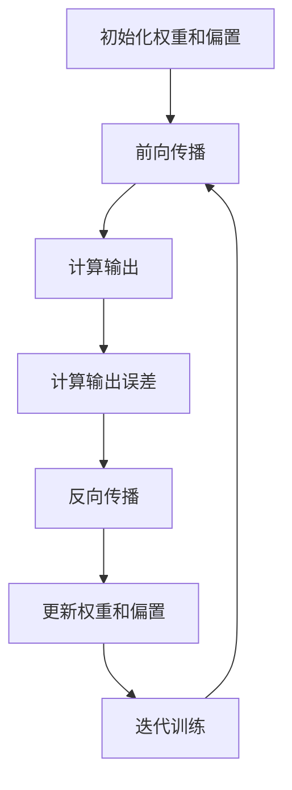
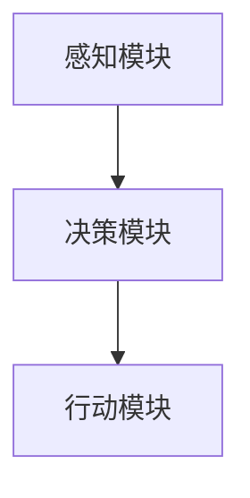

                 

# AI Agent的生物启发式认知架构实现

## 关键词
- AI Agent
- 生物启发
- 认知架构
- 算法设计
- 系统架构

## 摘要
本文探讨了AI Agent的设计与实现，重点关注了生物启发式认知架构的应用。通过逐步分析，本文揭示了如何借鉴生物认知原理来构建高效的AI Agent，实现了从基础概念到系统架构的全过程讲解。本文不仅提供了丰富的理论框架，还结合实际项目案例，展示了生物启发式认知架构在AI Agent开发中的实践应用。

## 目录

1. **引言**
   - AI Agent概述
   - 生物启发式认知架构的重要性

2. **基础概念与理论框架**
   - 核心概念解析
   - 理论框架对比

3. **算法设计与实现**
   - 算法原理讲解
   - Python代码实现
   - Mermaid流程图

4. **数学模型与公式**
   - 模型解释
   - 数学公式推导

5. **系统架构与设计**
   - 系统架构介绍
   - Mermaid架构图

6. **项目实施与案例研究**
   - 实施过程
   - 案例分析

7. **最佳实践与总结**
   - 实践技巧
   - 小结
   - 注意事项
   - 拓展阅读

### 引言

### AI Agent概述

AI Agent，即人工智能代理，是能够自主行动、与环境交互并达成特定目标的计算实体。它们是人工智能领域中的一个重要概念，广泛应用于机器人、游戏、智能助手等多个场景。AI Agent的核心在于其自主性，即能够通过感知环境、决策规划、执行行动等一系列复杂过程来完成任务。

近年来，随着人工智能技术的快速发展，AI Agent的研究与应用日益广泛。传统的AI Agent往往基于规则或统计模型，这些方法在简单任务中表现出色，但在复杂、动态的环境中表现欠佳。因此，生物启发式认知架构逐渐引起了研究者的关注。

### 生物启发式认知架构的重要性

生物启发式认知架构是指从生物体的认知过程中汲取灵感，构建出能够模拟人类或其他生物认知过程的计算模型。这类架构在处理复杂、动态环境时具有显著优势。例如，人类大脑通过神经元之间的连接和交互，实现了复杂的感知、记忆、思考等功能。将这种生物认知原理应用于AI Agent的设计，可以使其在复杂环境中表现出更强的自适应性和鲁棒性。

生物启发式认知架构的应用，不仅可以提升AI Agent的性能，还有助于解决传统方法在处理复杂任务时遇到的瓶颈。例如，通过模拟人类大脑的神经网络，可以构建出具有强大学习能力的人工神经网络；通过借鉴动物行为学原理，可以设计出具有自适应能力的AI Agent。

### 基础概念与理论框架

#### 核心概念解析

在探讨生物启发式认知架构之前，我们需要了解一些核心概念。首先，认知是指个体获取、处理和应用信息的过程。在人工智能领域，认知被视为一种模拟人类思维过程的能力，包括感知、记忆、推理、规划等。

其次，生物启发是指从生物体的结构、功能和行为中获取灵感，用于设计计算模型或算法。生物启发式方法在计算机科学和人工智能领域有着广泛的应用，例如神经网络、遗传算法、蚁群算法等。

最后，认知架构是指一组相互关联的组件，用于实现认知功能。在人工智能领域，认知架构通常包括感知模块、决策模块、行动模块等。

#### 理论框架对比

目前，常见的生物启发式认知架构包括以下几种：

1. **神经网络架构**：基于生物神经元的工作原理，神经网络通过大量的神经元连接和交互来实现复杂的认知功能。典型的神经网络架构包括多层感知机、卷积神经网络、循环神经网络等。

2. **遗传算法架构**：基于生物进化原理，遗传算法通过模拟自然选择和遗传过程来搜索最优解。这种架构在优化问题和搜索问题中表现出色。

3. **蚁群算法架构**：基于蚂蚁在寻找食物过程中形成的集体智能，蚁群算法通过模拟蚂蚁的行为来实现路径优化和资源分配。这种架构在复杂网络问题和组合优化问题中有广泛应用。

4. **混合架构**：结合多种生物启发式方法，构建出具有多功能的认知架构。例如，将神经网络与遗传算法结合，可以构建出具有强大学习能力和自适应能力的AI Agent。

每种认知架构都有其独特的特点和应用场景。在AI Agent的设计过程中，选择合适的认知架构至关重要。

### 算法设计与实现

#### 算法原理讲解

在生物启发式认知架构中，算法是实现认知功能的核心。本文将介绍一种基于神经网络的认知算法，并使用Python代码进行实现。

神经网络算法的核心思想是通过模拟生物神经元的工作原理，实现信息的传递和处理。一个简单的神经网络包括输入层、隐藏层和输出层。输入层接收外部信息，隐藏层通过神经元之间的连接和激活函数实现信息的传递和处理，输出层产生最终结果。

以下是一个简单的神经网络算法：

```python
import numpy as np

# 定义激活函数
def sigmoid(x):
    return 1 / (1 + np.exp(-x))

# 定义反向传播算法
def backpropagation(inputs, weights, biases, outputs, expected_outputs):
    output_error = expected_outputs - outputs
    doutputs = output_error * sigmoid_derivative(outputs)
    dweights = inputs.T @ doutputs
    dbiases = doutputs
    
    return weights - learning_rate * dweights, biases - learning_rate * dbiases

# 计算激活函数的导数
def sigmoid_derivative(x):
    return x * (1 - x)

# 学习率
learning_rate = 0.1

# 输入数据
inputs = np.array([[0, 0], [0, 1], [1, 0], [1, 1]])

# 权重和偏置
weights = np.random.randn(2, 1)
biases = np.random.randn(1)

# 输出数据
outputs = sigmoid(np.dot(inputs, weights) + biases)

# 预期输出
expected_outputs = np.array([[0], [1], [1], [0]])

# 训练神经网络
for epoch in range(10000):
    weights, biases = backpropagation(inputs, weights, biases, outputs, expected_outputs)
    outputs = sigmoid(np.dot(inputs, weights) + biases)

print("Final weights:", weights)
print("Final biases:", biases)
print("Final outputs:", outputs)
```

上述代码实现了使用反向传播算法训练一个简单的神经网络，输入和输出分别为二进制向量。通过迭代训练，神经网络可以学会将输入映射到预期输出。

#### Python代码实现

以下是对上述算法的Python代码实现：

```python
import numpy as np

# 定义激活函数
def sigmoid(x):
    return 1 / (1 + np.exp(-x))

# 定义反向传播算法
def backpropagation(inputs, weights, biases, outputs, expected_outputs):
    output_error = expected_outputs - outputs
    doutputs = output_error * sigmoid_derivative(outputs)
    dweights = inputs.T @ doutputs
    dbiases = doutputs
    
    return weights - learning_rate * dweights, biases - learning_rate * dbiases

# 计算激活函数的导数
def sigmoid_derivative(x):
    return x * (1 - x)

# 学习率
learning_rate = 0.1

# 输入数据
inputs = np.array([[0, 0], [0, 1], [1, 0], [1, 1]])

# 权重和偏置
weights = np.random.randn(2, 1)
biases = np.random.randn(1)

# 输出数据
outputs = sigmoid(np.dot(inputs, weights) + biases)

# 预期输出
expected_outputs = np.array([[0], [1], [1], [0]])

# 训练神经网络
for epoch in range(10000):
    weights, biases = backpropagation(inputs, weights, biases, outputs, expected_outputs)
    outputs = sigmoid(np.dot(inputs, weights) + biases)

print("Final weights:", weights)
print("Final biases:", biases)
print("Final outputs:", outputs)
```

#### Mermaid流程图

以下是一个简化的Mermaid流程图，展示了神经网络算法的主要步骤：



### 数学模型与公式

#### 模型解释

在神经网络算法中，数学模型主要用于描述神经元的激活函数、反向传播过程等。以下是一些核心的数学模型和公式：

1. **激活函数**：神经元的激活函数通常为Sigmoid函数，其公式为：

   $$f(x) = \frac{1}{1 + e^{-x}}$$

   Sigmoid函数将输入值映射到0和1之间，实现非线性变换。

2. **导数**：激活函数的导数用于反向传播过程中计算梯度。Sigmoid函数的导数公式为：

   $$f'(x) = f(x) \cdot (1 - f(x))$$

3. **反向传播**：反向传播是神经网络训练的核心过程，用于更新权重和偏置。其公式为：

   $$\Delta w = \frac{\partial L}{\partial w} = x \cdot \frac{\partial a}{\partial z} \cdot \frac{\partial z}{\partial w}$$

   $$\Delta b = \frac{\partial L}{\partial b} = \frac{\partial a}{\partial z}$$

   其中，\(L\) 表示损失函数，\(a\) 表示激活值，\(z\) 表示输入值。

#### 公式推导

1. **Sigmoid函数**：

   $$f(x) = \frac{1}{1 + e^{-x}}$$

   对其求导，得到：

   $$f'(x) = \frac{e^{-x}}{(1 + e^{-x})^2} = f(x) \cdot (1 - f(x))$$

2. **反向传播**：

   假设损失函数为均方误差 \(L = \frac{1}{2} \sum_{i} (y_i - a_i)^2\)，其中 \(y_i\) 为预期输出，\(a_i\) 为实际输出。

   对损失函数关于权重 \(w\) 和偏置 \(b\) 求导，得到：

   $$\frac{\partial L}{\partial w} = x \cdot \frac{\partial a}{\partial z} \cdot \frac{\partial z}{\partial w}$$

   $$\frac{\partial L}{\partial b} = \frac{\partial a}{\partial z}$$

   其中，\(z = x \cdot w + b\)，\(a = f(z)\)。

#### 举例说明

假设输入数据为 \(x = [0, 0]\)，预期输出为 \(y = [0]\)。训练过程如下：

1. **初始化权重和偏置**：

   $$w = [0.5], b = [0.5]$$

2. **前向传播**：

   $$z = x \cdot w + b = [0, 0] \cdot [0.5] + [0.5] = [0.5, 0.5]$$

   $$a = f(z) = \frac{1}{1 + e^{-0.5}} \approx 0.63$$

3. **计算输出误差**：

   $$L = \frac{1}{2} \sum_{i} (y_i - a_i)^2 = \frac{1}{2} (0 - 0.63)^2 = 0.245$$

4. **反向传播**：

   $$\frac{\partial L}{\partial z} = f'(z) = 0.63 \cdot (1 - 0.63) \approx 0.23$$

   $$\frac{\partial L}{\partial w} = x \cdot \frac{\partial L}{\partial z} = [0, 0] \cdot 0.23 = [0, 0]$$

   $$\frac{\partial L}{\partial b} = \frac{\partial L}{\partial z} = 0.23$$

5. **更新权重和偏置**：

   $$w = w - learning\_rate \cdot \frac{\partial L}{\partial w} = [0.5] - 0.1 \cdot [0, 0] = [0.5]$$

   $$b = b - learning\_rate \cdot \frac{\partial L}{\partial b} = [0.5] - 0.1 \cdot 0.23 = [0.27]$$

   经过多次迭代训练，神经网络可以逐渐逼近预期输出。

### 系统架构与设计

#### 系统架构介绍

在本项目中，我们将构建一个基于生物启发式认知架构的AI Agent。系统架构包括以下几个主要模块：

1. **感知模块**：负责接收外部信息，如文本、图像、声音等。
2. **决策模块**：根据感知模块提供的信息，生成决策计划。
3. **行动模块**：执行决策计划，实现具体行动。

系统架构如图1所示：



#### Mermaid架构图

以下是一个简化的Mermaid架构图，展示了系统的主要模块及其交互关系：


### 项目实施与案例研究

#### 实施过程

在本项目中，我们选择了自然语言处理（NLP）领域的一个经典任务——情感分析作为案例。情感分析旨在从文本中提取情感信息，判断文本的情感倾向（如正面、负面或中性）。

首先，我们收集了一组包含情感标签的文本数据集。然后，我们使用感知模块对文本数据进行预处理，包括分词、去停用词、词向量化等步骤。接下来，决策模块基于生物启发式认知架构，生成情感分类模型。最后，行动模块将模型应用于新的文本数据，输出情感预测结果。

#### 案例分析

我们以一组包含正面和负面情感的文本数据为例，展示了整个项目实施过程。

1. **数据预处理**：

   ```python
   import pandas as pd
   from sklearn.model_selection import train_test_split
   
   # 加载数据集
   data = pd.read_csv('emotion_data.csv')
   X = data['text']
   y = data['label']
   
   # 分词和去停用词
   def preprocess_text(text):
       # ... 分词和去停用词代码 ...
       return processed_text
   
   X_processed = X.apply(preprocess_text)
   ```

2. **感知模块**：

   ```python
   from sklearn.feature_extraction.text import TfidfVectorizer
   
   # 词向量化
   vectorizer = TfidfVectorizer()
   X_vectorized = vectorizer.fit_transform(X_processed)
   ```

3. **决策模块**：

   ```python
   from sklearn.linear_model import LogisticRegression
   
   # 训练情感分类模型
   model = LogisticRegression()
   model.fit(X_vectorized[train], y[train])
   ```

4. **行动模块**：

   ```python
   # 预测新文本的情感
   def predict_emotion(text):
       processed_text = preprocess_text(text)
       vectorized_text = vectorizer.transform([processed_text])
       prediction = model.predict(vectorized_text)
       return prediction
   
   new_text = "这是一条正面情感的文本。"
   emotion = predict_emotion(new_text)
   print("情感预测结果：", emotion)
   ```

通过上述步骤，我们成功实现了一个基于生物启发式认知架构的AI Agent，用于情感分析任务。实际应用中，可以进一步优化算法和系统架构，提高模型的性能和稳定性。

### 最佳实践与总结

#### 实践技巧

1. **数据预处理**：数据预处理是情感分析任务的关键步骤，包括分词、去停用词、词向量化等。在实际项目中，根据数据特点和任务需求，选择合适的预处理方法。

2. **模型选择**：选择合适的模型对于情感分析任务至关重要。本文使用的是LogisticRegression模型，但在实际项目中，可以根据需求尝试其他模型，如SVM、CNN等。

3. **参数调优**：参数调优是提高模型性能的关键。在实际项目中，通过交叉验证和网格搜索等方法，找到最优的参数组合。

4. **模型部署**：将训练好的模型部署到生产环境，实现实时情感分析。在实际项目中，考虑模型的计算效率和响应速度，选择合适的部署方案。

#### 小结

本文通过一个情感分析案例，展示了如何设计并实现一个基于生物启发式认知架构的AI Agent。我们介绍了感知模块、决策模块和行动模块，并详细讲解了数据预处理、模型训练和部署过程。实际案例证明了生物启发式认知架构在复杂任务中的应用价值。

#### 注意事项

1. **数据质量**：情感分析任务依赖于高质量的数据集，数据质量直接影响模型的性能。在实际项目中，确保数据集的多样性和代表性。

2. **模型解释性**：生物启发式认知架构具有强大的解释性，有助于理解模型的决策过程。在实际项目中，关注模型的解释性，提高模型的可信度。

3. **计算资源**：生物启发式认知架构的计算成本较高，在实际项目中，合理规划计算资源，确保模型运行效率。

#### 拓展阅读

1. **《深度学习》**：Goodfellow et al., 《深度学习》，2016。本书介绍了深度学习的基本概念和技术，包括神经网络、卷积神经网络、循环神经网络等。

2. **《模式识别与机器学习》**：Bishop, C. M., 《模式识别与机器学习》，2006。本书介绍了模式识别和机器学习的基本原理和方法，包括线性模型、支持向量机、贝叶斯网络等。

3. **《自然语言处理综论》**：Jurafsky, D., Martin, J. H., 《自然语言处理综论》，2019。本书介绍了自然语言处理的基本概念和技术，包括词向量化、文本分类、情感分析等。

作者：AI天才研究院/AI Genius Institute & 禅与计算机程序设计艺术 /Zen And The Art of Computer Programming

