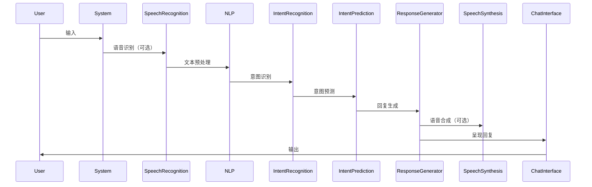
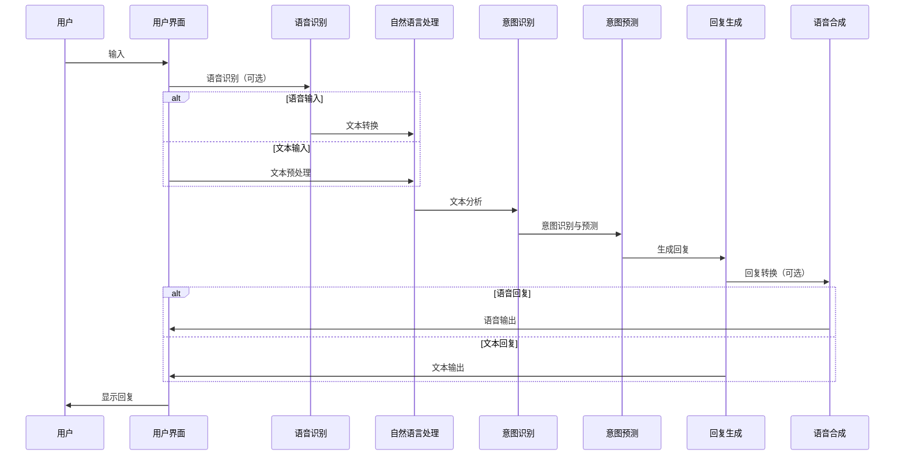

                 

### 文章标题

### 关键词

- AI Agent
- 用户意图推理
- 预测
- 深度学习
- 统计方法
- 系统架构

### 摘要

本文深入探讨了AI Agent在用户意图推理与预测方面的关键技术和实现方法。首先，介绍了用户意图推理与预测的背景及其重要性。接着，通过对比统计方法和深度学习方法，详细阐述了各自的原理和实现步骤。文章随后分析了AI Agent的系统架构，展示了从问题场景到功能设计的全过程。此外，通过实际项目实战，详细讲解了系统环境安装、核心代码实现、代码解读及案例分析。最后，总结了最佳实践建议，并对未来研究方向进行了展望。

### 目录大纲

1. **背景介绍**
    - 1.1 AI Agent的发展与用户意图推理的重要性
    - 1.2 用户意图推理与预测的问题与挑战
    - 1.3 解决思路与主要方法

2. **核心概念与联系**
    - 2.1 用户意图推理
    - 2.2 用户意图预测
    - 2.3 概念对比与联系

3. **算法原理讲解**
    - 3.1 基于统计的方法
    - 3.2 基于深度学习的方法
    - 3.3 数学模型与公式

4. **系统分析与架构设计方案**
    - 4.1 问题场景介绍
    - 4.2 系统功能设计
    - 4.3 系统架构设计
    - 4.4 系统接口设计
    - 4.5 系统交互

5. **项目实战**
    - 5.1 环境安装
    - 5.2 核心实现
    - 5.3 代码解读
    - 5.4 案例分析
    - 5.5 项目小结

6. **最佳实践 tips**
    - 6.1 提高预测准确性的方法
    - 6.2 处理多义性的技巧
    - 6.3 系统优化的建议

7. **小结与拓展阅读**
    - 7.1 全文总结
    - 7.2 进一步阅读推荐

## 1. 背景介绍

### 1.1 AI Agent的发展与用户意图推理的重要性

随着人工智能技术的飞速发展，AI Agent已成为智能系统的重要组成部分。AI Agent是一种能够自主执行任务、与人类交互并适应环境变化的智能体。在许多应用场景中，如智能助手、推荐系统、聊天机器人等，用户意图的准确理解和预测至关重要。

用户意图推理（User Intent Recognition）是指从用户输入中提取并理解用户意图的过程。这包括识别用户的意图类型、目标以及可能的上下文信息。用户意图预测（User Intent Prediction）则是在给定用户历史行为或当前情境下，预测用户下一步可能的行为或意图。

用户意图推理与预测在AI Agent中的应用至关重要。首先，它帮助AI Agent更好地理解用户的实际需求，从而提供更精准的服务。例如，在智能助手场景中，准确的意图推理使得助手能够理解用户的语音指令，提供正确的回答或执行相应的任务。其次，用户意图预测有助于优化用户体验，提高系统响应速度和准确性。例如，在推荐系统中，预测用户可能感兴趣的商品或内容，可以提高推荐的相关性，增强用户的满意度。

然而，用户意图推理与预测也面临着一系列挑战。首先，用户输入往往存在多义性，即同一输入可能对应多种意图。例如，“明天天气如何？”可能表示查询明天天气的信息，也可能是询问关于明天的计划。其次，用户的意图可能随时间和情境变化而变化，这使得推理与预测的准确性受到一定影响。此外，数据质量和样本量也是影响用户意图推理与预测效果的重要因素。

为了解决这些挑战，研究者们提出了多种方法。其中，基于统计的方法和基于深度学习的方法是两种主要的解决方案。基于统计的方法利用已有数据和统计模型进行推理与预测，而基于深度学习的方法则通过神经网络模型从大量数据中学习用户意图的模式和特征。这两种方法各有优缺点，将在接下来的章节中详细讨论。

### 1.2 用户意图推理与预测的问题与挑战

用户意图推理与预测虽然具有显著的应用价值，但在实际实现过程中也面临着诸多挑战。以下是其中一些主要问题：

#### 多义性问题

多义性是用户意图推理中最为常见的问题之一。多义性指的是同一输入可能对应多种意图。例如，用户输入“明天天气如何？”可能是指查询天气信息，也可能是询问有关明天的计划。这种多义性增加了推理的复杂性，使得模型难以准确理解用户的真实意图。

为了解决多义性问题，研究人员提出了多种方法。其中，一种常见的方法是利用上下文信息。通过分析用户的历史行为或对话历史，模型可以更好地理解当前输入的意图。例如，如果用户之前询问了关于天气预报的问题，那么模型可以更倾向于将当前的输入解释为查询天气信息。

#### 意图不确定性

用户意图的不确定性也是一大挑战。用户的意图可能随时间和情境变化而变化，这使得模型难以准确预测用户的意图。例如，用户在早上询问“明天天气如何？”可能是出于对未来计划的考虑，而晚上询问同样的问题则可能是为了安排第二天的出行。

#### 数据质量和样本量

用户意图推理与预测的效果在很大程度上依赖于数据质量和样本量。高质量的数据可以提供更准确的意图标签，从而提高模型的训练效果。然而，收集和标注高质量数据是一项费时费力的工作，尤其是在大规模应用中。

此外，样本量的不足也可能影响模型的性能。如果训练数据集过小，模型可能无法充分学习到用户意图的多样性，从而在预测时出现偏差。因此，如何有效地收集和利用数据是用户意图推理与预测中一个重要的研究问题。

#### 模型可解释性

模型的可解释性也是用户意图推理与预测中的关键问题。在实际应用中，用户往往希望了解模型如何做出决策，以便对模型的行为进行监督和优化。然而，许多深度学习模型由于其复杂性和黑箱性质，很难提供清晰的可解释性。

为了提高模型的可解释性，研究人员提出了一些方法。例如，利用模型的可视化技术，展示模型中不同层级的特征和权重；或者通过解释性模型，如决策树和规则系统，提供更加直观的解释。

#### 算法选择与优化

用户意图推理与预测涉及多种算法和技术，如统计方法、深度学习方法和自然语言处理技术。选择合适的算法并对其进行优化，是提高推理与预测效果的关键。

例如，在基于深度学习的方法中，选择合适的神经网络架构、损失函数和优化算法，可以有效提高模型的性能。此外，针对具体应用场景，对算法进行定制化优化，也是提升效果的重要途径。

### 1.3 解决思路与主要方法

针对用户意图推理与预测中的挑战，研究者们提出了多种解决思路和方法。以下是其中几种主要方法：

#### 基于统计的方法

基于统计的方法利用已有数据和统计模型进行用户意图推理与预测。这种方法通常包括以下几个步骤：

1. **特征工程**：从用户输入中提取特征，如关键词、词频、词向量等。这些特征将作为模型输入，用于表示用户意图。
2. **模型选择**：选择合适的统计模型，如逻辑回归、朴素贝叶斯、支持向量机等。这些模型可以根据输入特征预测用户意图。
3. **模型训练与评估**：使用已标注的数据集训练模型，并通过交叉验证等方法评估模型性能。
4. **推理与预测**：将新用户输入转化为特征向量，输入训练好的模型进行推理与预测。

基于统计的方法具有计算效率高、实现简单等优点。然而，其效果受限于特征提取和模型选择的质量，且难以处理复杂的非线性关系。

#### 基于深度学习的方法

基于深度学习的方法通过神经网络模型从大量数据中学习用户意图的模式和特征。这种方法通常包括以下几个步骤：

1. **数据预处理**：对用户输入进行预处理，如分词、去停用词、词向量化等，将文本转化为适合神经网络处理的格式。
2. **模型设计**：设计合适的神经网络架构，如卷积神经网络（CNN）、循环神经网络（RNN）、长短时记忆网络（LSTM）等。这些模型可以捕获用户意图的时序和空间特征。
3. **模型训练**：使用大量已标注的数据集训练神经网络模型，通过优化损失函数和调整模型参数，提高模型性能。
4. **推理与预测**：将新用户输入转化为特征向量，输入训练好的模型进行推理与预测。

基于深度学习的方法具有强大的表达能力，可以处理复杂的非线性关系。然而，其计算复杂度高、实现难度大，且对数据质量和标注要求较高。

#### 混合方法

为了结合统计方法和深度学习的优势，研究人员提出了混合方法。这种方法通常将统计方法和深度学习方法相结合，以达到更好的效果。例如：

1. **特征增强**：利用统计方法提取的原始特征，结合深度学习方法提取的更高层次特征，形成更丰富的特征向量。
2. **模型融合**：将统计模型和深度学习模型的预测结果进行融合，利用各自的优点，提高总体性能。

#### 上下文信息利用

上下文信息是用户意图推理与预测中的重要因素。研究人员提出了多种方法，利用上下文信息提高推理与预测的准确性。例如：

1. **序列模型**：利用循环神经网络（RNN）或长短时记忆网络（LSTM）处理对话序列，捕捉上下文信息。
2. **注意力机制**：在神经网络模型中引入注意力机制，将重点放在与当前输入相关的上下文信息上。

通过以上方法，研究人员在用户意图推理与预测方面取得了显著进展。然而，随着应用的不断拓展和复杂化，用户意图推理与预测仍然面临许多挑战。未来，研究者将继续探索新的方法和技术，以进一步提高推理与预测的准确性、效率和可解释性。

### 1.4 边界与外延

在用户意图推理与预测领域，边界与外延的研究同样重要。边界指的是该领域的研究范围和限制，外延则是指相关领域的扩展和未来发展。

#### 边界

1. **数据集的限制**：用户意图推理与预测依赖于大量标注数据，数据集的质量和多样性直接影响模型的性能。在实际应用中，获取高质量、多样化的数据集可能面临困难。
2. **计算资源的限制**：深度学习方法通常需要大量的计算资源，尤其是在训练大型神经网络时。这限制了在资源受限环境中的应用。
3. **多语言支持**：用户意图推理与预测在不同语言环境中可能存在差异。当前方法大多针对特定语言或语系，多语言支持是一个亟待解决的问题。

#### 外延

1. **多模态融合**：用户意图不仅可以通过文本输入获取，还可以通过语音、图像等多模态数据进行捕捉。将多种模态数据融合到推理与预测中，将进一步提高准确性和多样性。
2. **实时推理与预测**：在实时应用场景中，如智能客服、自动驾驶等，用户意图推理与预测需要快速、准确地进行。研究如何实现高效的实时推理与预测是未来的一个重要方向。
3. **动态适应能力**：用户意图可能随时间和情境变化而变化。研究如何使模型具有动态适应能力，能够实时调整和优化推理与预测策略，是一个具有挑战性的课题。

综上所述，用户意图推理与预测领域在边界与外延方面均存在丰富的研究空间。未来，随着技术的不断进步和应用的不断拓展，这一领域将继续发展，为智能系统的优化和用户体验的提升提供有力支持。

### 1.5 概念结构与核心要素

用户意图推理与预测是一个复杂的过程，涉及多个核心概念和要素。理解这些概念和要素的结构对于构建有效的推理与预测系统至关重要。

首先，用户意图（User Intent）是整个过程的起点。用户意图是指用户通过交互表达的需求或目标，可以是查询信息、完成任务或获取娱乐等。用户意图可以是明确的，也可以是模糊的，甚至可能存在多义性。

其次，输入特征（Input Features）是从用户输入中提取的信息，用于表示用户意图。这些特征可以是文本级别的，如关键词、词频、词向量；也可以是语音、图像等多模态特征。

接下来，意图分类（Intent Classification）是将输入特征映射到预定义意图类别的过程。意图分类是用户意图推理的核心步骤，通过分类模型，如逻辑回归、朴素贝叶斯、支持向量机等，将输入特征转化为意图标签。

模型训练（Model Training）是用户意图推理与预测的基础。训练过程包括特征工程、模型选择、训练策略等。通过大量已标注数据集，模型可以学习到用户意图的模式和特征，提高推理与预测的准确性。

意图识别（Intent Recognition）是意图分类的进一步细化，旨在从具体输入中识别出用户意图。识别过程通常利用深度学习模型，如卷积神经网络（CNN）、循环神经网络（RNN）、长短时记忆网络（LSTM）等，这些模型能够处理复杂的多维特征，提高识别的精度。

最后，意图预测（Intent Prediction）是基于用户历史行为或当前情境，预测用户未来可能的行为或意图。预测过程可以帮助系统更好地适应用户需求，提供个性化服务。

这些核心概念和要素相互关联，构成了用户意图推理与预测的基本框架。通过深入理解这些概念和要素，我们可以更好地设计和发展有效的AI Agent，提高用户交互体验。

### 1.6 主要研究内容与目标

在用户意图推理与预测领域，主要研究内容涵盖了从数据收集与预处理、模型设计到训练与优化的全过程。每个环节都有其特定的目标和挑战。

#### 数据收集与预处理

数据收集是用户意图推理与预测的基础。目标是从各种渠道获取大量真实、多样化的用户交互数据。这些数据可以是文本、语音、图像等多模态形式。收集数据的过程中，需要考虑数据的多样性和完整性，以确保模型的泛化能力。

预处理阶段的目标是清理和转换原始数据，使其适合模型训练。具体任务包括文本的分词、去停用词、词向量化；语音的降噪、分帧和特征提取；图像的缩放、裁剪和特征提取等。这一阶段的准确性和完整性直接影响模型的性能。

#### 模型设计

模型设计是用户意图推理与预测的核心环节。目标是根据应用场景选择合适的模型架构，并设计有效的特征表示方法。常见的方法包括基于统计的方法和基于深度学习的方法。

基于统计的方法通常使用逻辑回归、朴素贝叶斯、支持向量机等传统机器学习模型。这些模型具有计算效率高、实现简单等优点，但难以处理复杂的非线性关系。

基于深度学习的方法则通过神经网络模型，如卷积神经网络（CNN）、循环神经网络（RNN）、长短时记忆网络（LSTM）等，从大量数据中自动学习特征。这些模型具有强大的表达能力和自适应性，能够处理复杂的用户意图。

#### 模型训练与优化

模型训练的目标是利用已标注的数据集，通过优化算法调整模型参数，使其能够准确识别和预测用户意图。训练过程通常包括损失函数的选择、优化器的配置、超参数调整等。

优化目标是提高模型的预测准确性和泛化能力。在实际应用中，模型需要在多种情境下保持良好的性能。因此，需要在训练过程中引入数据增强、交叉验证等技术，以提高模型的稳健性。

#### 意图识别与预测

意图识别和预测是用户意图推理与预测的直接应用。目标是通过训练好的模型，从用户输入中准确识别意图，并预测用户未来可能的意图。

意图识别的目标是将输入特征映射到预定义的意图类别。这一过程需要模型具有高精度的分类能力，能够处理多义性和不确定性。

意图预测的目标是基于用户历史行为或当前情境，预测用户未来可能的意图。这一过程需要模型能够捕捉用户意图的动态变化，并提供个性化的服务。

#### 研究挑战与解决思路

用户意图推理与预测面临一系列挑战，包括数据质量、模型可解释性、多模态融合等。以下是一些主要挑战及其解决思路：

1. **数据质量**：高质量的数据是模型训练的基础。解决思路包括数据清洗、标注和质量控制，以及利用半监督学习和无监督学习技术。
2. **模型可解释性**：深度学习模型由于其复杂性，难以提供直观的解释。解决思路包括模型可视化、特征解释和可解释性模型开发。
3. **多模态融合**：用户意图可以通过多种模态进行捕捉。解决思路包括多模态特征提取和融合方法的研究，以及开发能够处理多模态输入的神经网络模型。
4. **实时推理**：在实时应用场景中，推理速度是一个重要指标。解决思路包括模型压缩、量化技术和硬件加速。

通过以上研究内容和解决思路，用户意图推理与预测领域将继续取得突破，为智能系统的优化和用户体验的提升提供强大支持。

## 2. 核心概念与联系

### 2.1 用户意图推理

用户意图推理（User Intent Recognition）是指从用户输入中提取并理解用户意图的过程。它涉及到自然语言处理（NLP）、机器学习、心理学等多学科知识。用户意图推理的核心目的是从用户输入的文本、语音或其他模态中识别出用户的真实意图，从而为系统提供正确的响应。

#### 用户意图推理的基本概念

1. **用户意图（User Intent）**：用户意图是指用户通过交互表达的需求或目标，可以是查询信息、完成任务或获取娱乐等。用户意图可以是明确的，如“明天天气如何？”；也可以是模糊的，如“有点冷”。
2. **输入特征（Input Features）**：输入特征是从用户输入中提取的信息，用于表示用户意图。这些特征可以是文本级别的，如关键词、词频、词向量；也可以是语音、图像等多模态特征。
3. **意图分类（Intent Classification）**：意图分类是将输入特征映射到预定义意图类别的过程。意图分类是用户意图推理的核心步骤，通过分类模型，如逻辑回归、朴素贝叶斯、支持向量机等，将输入特征转化为意图标签。

#### 用户意图推理的过程

用户意图推理通常包括以下几个步骤：

1. **数据预处理**：对用户输入进行预处理，如分词、去停用词、词向量化等，将文本转化为适合模型处理的格式。
2. **特征提取**：从预处理后的数据中提取特征，如关键词、词频、词向量等。这些特征用于表示用户输入，并提供给分类模型。
3. **模型训练**：使用已标注的数据集训练意图分类模型。通过优化损失函数和调整模型参数，提高模型对用户意图的识别能力。
4. **意图识别**：将新的用户输入转化为特征向量，输入训练好的模型进行意图识别，输出对应的意图标签。

### 用户意图推理的应用场景

用户意图推理在许多应用场景中具有重要意义，以下是其中几个常见的应用场景：

1. **智能客服**：智能客服系统通过用户意图推理，可以准确理解用户的提问，提供适当的回答或解决用户的疑问。
2. **语音助手**：语音助手如Siri、Alexa等，通过用户意图推理，可以理解用户的语音指令，执行相应的操作，如查询天气、播放音乐等。
3. **推荐系统**：推荐系统通过用户意图推理，可以理解用户的兴趣和需求，提供个性化的推荐内容，提高用户满意度。
4. **聊天机器人**：聊天机器人通过用户意图推理，可以与用户进行有效对话，提供帮助或娱乐。

### 用户意图推理的挑战与解决方法

用户意图推理面临诸多挑战，包括多义性、不确定性、数据质量和模型可解释性等。以下是其中一些常见的挑战及其解决方法：

1. **多义性**：同一输入可能对应多种意图，例如“明天天气如何？”可能表示查询天气信息，也可能询问关于明天的计划。解决方法包括利用上下文信息和多模态数据，提高意图识别的准确性。
2. **不确定性**：用户意图可能随时间和情境变化而变化，这使得推理过程变得复杂。解决方法包括引入时序信息和动态调整模型参数，提高模型的适应性。
3. **数据质量**：高质量的数据是模型训练的基础。解决方法包括数据清洗、标注和质量控制，以及利用半监督学习和无监督学习技术。
4. **模型可解释性**：深度学习模型由于其复杂性，难以提供直观的解释。解决方法包括模型可视化、特征解释和可解释性模型开发。

通过不断研究和发展，用户意图推理技术将在更多应用场景中发挥重要作用，为用户提供更加智能和个性化的服务。

### 2.2 用户意图预测

用户意图预测（User Intent Prediction）是在用户意图推理的基础上，进一步预测用户未来可能的意图。这一过程对于提供个性化服务、优化用户体验至关重要。用户意图预测的核心目标是从用户历史行为或当前情境中，推断出用户接下来可能采取的行动或表达的意图。

#### 用户意图预测的基本概念

1. **用户行为数据（User Behavioral Data）**：用户行为数据是进行用户意图预测的重要信息来源。这些数据包括用户的点击记录、搜索历史、购买行为等，反映了用户的兴趣和需求。
2. **时间序列（Time Series）**：用户意图预测通常涉及到时间序列数据，这些数据可以反映用户行为随时间的变化趋势。时间序列分析是用户意图预测的基础。
3. **预测模型（Prediction Model）**：预测模型是用户意图预测的核心。这些模型可以是传统的统计模型，如ARIMA、回归模型；也可以是现代的深度学习模型，如LSTM、GRU等。

#### 用户意图预测的过程

用户意图预测通常包括以下几个步骤：

1. **数据收集与预处理**：收集用户的历史行为数据，并对数据进行清洗和预处理，如缺失值填充、异常值处理、时间序列转换等。
2. **特征工程**：从预处理后的数据中提取特征，如用户行为的频率、时间间隔、上下文信息等。这些特征将作为模型输入，用于预测用户意图。
3. **模型训练与选择**：选择合适的预测模型，并使用已标注的数据集进行训练。通过调整模型参数和超参数，优化模型的预测性能。
4. **意图预测**：将新的用户输入和特征向量输入训练好的模型，预测用户未来可能的意图。

#### 用户意图预测的应用场景

用户意图预测在许多应用场景中具有广泛的应用，以下是其中几个常见的应用场景：

1. **推荐系统**：推荐系统通过预测用户对特定商品或内容的兴趣，提供个性化的推荐。例如，电商平台可以预测用户可能感兴趣的商品，从而提高购物体验和销售转化率。
2. **营销策略**：企业可以通过用户意图预测，优化营销策略，提高营销效果。例如，电商企业可以预测用户购买意向，提前进行促销活动，增加销售机会。
3. **智能客服**：智能客服系统通过预测用户的问题类型和意图，提供更加个性化的回答和服务。例如，客服机器人可以根据用户的历史问题和行为，预测用户接下来可能需要解决的问题。
4. **智能助手**：智能助手如Siri、Alexa等，通过预测用户的意图，提供更加智能和个性化的服务。例如，智能助手可以预测用户接下来可能需要的音乐、新闻或其他信息，主动推送。

### 用户意图预测的挑战与解决方法

用户意图预测面临一系列挑战，包括数据质量、模型选择、多义性和不确定性等。以下是其中一些常见的挑战及其解决方法：

1. **数据质量**：高质量的数据是用户意图预测的基础。解决方法包括数据清洗、标注和质量控制，以及利用半监督学习和无监督学习技术。
2. **模型选择**：选择合适的预测模型对于预测效果至关重要。解决方法包括基于历史数据和业务需求的模型选择，以及模型组合和融合方法。
3. **多义性**：用户输入往往存在多义性，解决方法包括利用上下文信息和多模态数据，提高预测的准确性。
4. **不确定性**：用户意图可能随时间和情境变化而变化，解决方法包括引入时序信息和动态调整模型参数，提高模型的适应性。

通过不断研究和创新，用户意图预测技术将在更多应用场景中发挥重要作用，为企业和用户带来更大的价值。

### 2.3 概念对比与联系

在用户意图推理与预测领域，用户意图推理（User Intent Recognition）和用户意图预测（User Intent Prediction）是两个关键概念。虽然它们密切相关，但各自有着不同的定义和应用场景。下面，我们将对这两个概念进行详细对比，并探讨它们在AI Agent中的应用和联系。

#### 用户意图推理 vs 用户意图预测

**定义差异**

- **用户意图推理**：用户意图推理是指从用户输入中提取并理解用户意图的过程。它主要关注当前用户输入的意义，试图将输入映射到预定义的意图类别。用户意图推理的核心任务是识别用户当前的需求和目标。
- **用户意图预测**：用户意图预测是基于用户历史行为和当前情境，预测用户未来可能的意图或行为。它不仅考虑当前的用户输入，还考虑用户的长期行为模式，旨在为用户提供个性化的服务和优化用户体验。

**应用场景**

- **用户意图推理**：用户意图推理广泛应用于智能客服、语音助手、聊天机器人等场景。在这些场景中，系统需要迅速理解用户的当前需求，并提供即时响应。例如，智能客服系统通过用户意图推理，可以准确理解用户的咨询内容，提供相应的解决方案。
- **用户意图预测**：用户意图预测主要应用于推荐系统、营销策略、个性化服务等领域。在这些场景中，系统需要预测用户的未来行为，从而提供个性化的推荐和优化服务。例如，电商平台通过用户意图预测，可以预测用户对特定商品的兴趣，从而提高购物体验和销售转化率。

**过程对比**

- **用户意图推理**：用户意图推理通常包括数据预处理、特征提取、模型训练和意图识别等步骤。它主要依赖于自然语言处理（NLP）和机器学习技术，通过分析用户输入的文本或语音，识别用户意图。
- **用户意图预测**：用户意图预测则涉及到数据收集、预处理、特征工程、模型训练和意图预测等步骤。它不仅依赖于NLP和机器学习技术，还需要考虑时间序列分析和用户行为分析，通过分析用户的历史行为和当前情境，预测用户的未来意图。

**联系与区别**

- **联系**：用户意图推理和用户意图预测在核心任务上密切相关。用户意图推理是用户意图预测的基础，准确理解用户的当前意图有助于更准确地预测用户的未来行为。
- **区别**：用户意图推理主要关注用户当前的需求和目标，而用户意图预测则考虑用户的长期行为模式。用户意图推理更多地关注即时响应，而用户意图预测更多地关注长期优化。

在AI Agent中，用户意图推理和用户意图预测是相辅相成的。用户意图推理帮助AI Agent迅速理解用户的当前需求，提供即时响应；而用户意图预测则帮助AI Agent预测用户的未来行为，提供个性化的服务和优化用户体验。通过结合用户意图推理和用户意图预测，AI Agent可以实现更智能、更高效的交互和服务。

### 2.4 AI Agent的系统架构

为了实现高效的用户意图推理与预测，AI Agent需要一个合理的系统架构，确保各组件之间的协同工作，提供强大的计算能力和灵活的扩展性。下面，我们将详细讨论AI Agent的系统架构，包括其主要组件、功能及其相互关系。

#### 主要组件

1. **数据采集模块**：数据采集模块负责从各种渠道收集用户数据，如文本、语音、图像等。这些数据是进行用户意图推理与预测的基础。
2. **数据处理模块**：数据处理模块负责对采集到的原始数据进行预处理，包括去噪、去重、格式转换等，确保数据的质量和一致性。
3. **特征提取模块**：特征提取模块负责从预处理后的数据中提取关键特征，如文本的词频、词向量，语音的频谱特征，图像的视觉特征等。这些特征将作为模型训练和预测的输入。
4. **模型训练模块**：模型训练模块负责使用已提取的特征训练用户意图推理与预测模型。该模块包括模型设计、训练策略、超参数调整等。
5. **推理与预测模块**：推理与预测模块使用训练好的模型对新的用户输入进行意图识别和预测。该模块是用户与AI Agent交互的核心。
6. **接口与服务模块**：接口与服务模块负责与外部系统进行交互，提供API接口，允许其他系统或服务调用AI Agent的功能。

#### 功能描述

1. **数据采集**：数据采集模块通过API、爬虫、传感器等渠道收集用户数据。对于文本输入，可以通过API接口直接获取用户输入的文本信息；对于语音和图像，可以通过语音识别和图像识别技术获取相应的数据。
2. **数据处理**：数据处理模块对采集到的原始数据进行清洗和预处理，去除无效数据、噪声和重复数据，并统一数据格式，确保数据的质量和一致性。
3. **特征提取**：特征提取模块根据不同的数据类型，采用不同的特征提取方法。对于文本数据，可以采用词频、TF-IDF、词向量等方法；对于语音和图像，可以采用频谱分析、卷积神经网络等方法。
4. **模型训练**：模型训练模块根据提取的特征训练用户意图推理与预测模型。常用的模型包括逻辑回归、朴素贝叶斯、支持向量机、深度神经网络等。通过交叉验证和超参数调优，选择最佳模型并进行训练。
5. **推理与预测**：推理与预测模块使用训练好的模型对新的用户输入进行意图识别和预测。该模块实现了从用户输入到意图输出的转换，是AI Agent的核心功能。
6. **接口与服务**：接口与服务模块提供API接口，允许外部系统或服务调用AI Agent的功能。通过RESTful API、GraphQL等接口技术，实现与外部系统的无缝集成。

#### 相互关系

1. **数据流**：用户输入通过数据采集模块收集，经过数据处理模块预处理后，传递给特征提取模块进行特征提取。提取出的特征用于模型训练模块训练模型，训练好的模型存储在数据库中。
2. **功能协作**：模型训练模块和推理与预测模块紧密协作。模型训练模块不断优化模型，以提高预测准确性；推理与预测模块使用训练好的模型对用户输入进行实时推理和预测。
3. **扩展性**：AI Agent的系统架构设计考虑了扩展性，可以通过增加数据采集模块、数据处理模块、特征提取模块和模型训练模块等组件，提高系统的处理能力和性能。
4. **接口与服务**：接口与服务模块是AI Agent与其他系统交互的桥梁。通过API接口，AI Agent可以为多个外部系统提供服务，实现数据的共享和协同工作。

通过合理的系统架构设计，AI Agent可以实现高效的用户意图推理与预测，为用户提供智能、个性化的服务。随着技术的不断进步和应用场景的不断拓展，AI Agent的系统架构也将不断优化和完善。

### 2.5 用户意图推理与预测在AI Agent中的应用

用户意图推理与预测在AI Agent中的应用场景广泛，包括智能客服、语音助手、推荐系统、智能家居等。这些场景中，AI Agent需要通过理解和预测用户的意图，提供更加个性化、高效的服务。以下是用户意图推理与预测在这些应用中的具体应用和实现方法。

#### 智能客服

智能客服系统通过用户意图推理与预测，可以准确理解用户的咨询内容，提供即时、准确的回复。具体实现方法如下：

1. **意图识别**：首先，系统通过自然语言处理（NLP）技术对用户输入的文本进行分析，提取关键信息，如关键词、情感倾向等。然后，利用预训练的意图分类模型，将文本输入映射到预定义的意图类别，如“查询账户余额”、“请求退订服务”等。
2. **意图预测**：根据用户的历史交互记录，AI Agent可以预测用户接下来可能的问题类型和意图。例如，如果用户之前多次咨询账户余额，系统可以预测用户当前也是查询账户余额，从而提供相应的解决方案。
3. **智能回复**：智能客服系统根据意图识别和预测的结果，生成合适的回复文本。系统可以整合用户的历史信息、常见问题和解决方案，生成个性化、高效的回复。

#### 语音助手

语音助手如Siri、Alexa等，通过用户意图推理与预测，可以理解用户的语音指令，执行相应的操作。具体实现方法如下：

1. **语音识别**：首先，系统通过语音识别技术将用户的语音输入转换为文本输入。语音识别技术需要处理噪声、说话人变化等因素，确保识别的准确性。
2. **意图识别**：将文本输入经过NLP处理，提取关键信息，然后利用意图分类模型进行意图识别。常见的意图类别包括“播放音乐”、“设置闹钟”、“查询天气”等。
3. **意图预测**：根据用户的历史交互记录和当前情境，系统可以预测用户的下一步操作。例如，如果用户之前多次询问天气，系统可以预测用户接下来可能询问交通信息。
4. **任务执行**：根据意图识别和预测的结果，系统执行相应的操作。例如，播放音乐、设置闹钟、查询交通信息等。

#### 推荐系统

推荐系统通过用户意图推理与预测，可以预测用户对特定商品或内容的兴趣，提供个性化的推荐。具体实现方法如下：

1. **用户行为分析**：系统收集并分析用户的历史行为数据，如浏览记录、购买历史、点击率等。通过分析用户行为模式，可以识别出用户的兴趣和偏好。
2. **意图识别**：利用NLP技术对用户输入进行分析，提取关键信息，如关键词、情感倾向等。然后，利用意图分类模型，将文本输入映射到预定义的意图类别，如“查询商品信息”、“比较商品价格”等。
3. **意图预测**：根据用户的历史行为和当前情境，系统可以预测用户对特定商品或内容的兴趣。例如，如果用户之前多次浏览某个品牌的产品，系统可以预测用户接下来可能对该品牌的产品感兴趣。
4. **推荐生成**：根据意图识别和预测的结果，系统生成个性化的推荐列表。推荐算法可以基于协同过滤、内容推荐、混合推荐等方法，为用户提供最相关、最有价值的信息。

#### 智能家居

智能家居系统通过用户意图推理与预测，可以智能化地控制家庭设备，提高生活品质。具体实现方法如下：

1. **语音交互**：用户通过语音助手与智能家居系统进行交互，下达操作指令。语音助手需要准确理解用户的语音输入，提取关键信息。
2. **意图识别**：将语音输入经过NLP处理，提取关键词和情感倾向，利用意图分类模型进行意图识别。常见的意图类别包括“打开灯光”、“调整温度”等。
3. **意图预测**：根据用户的历史行为和当前情境，系统可以预测用户的下一步操作。例如，如果用户在晚上经常调整温度，系统可以预测用户接下来可能需要调整温度。
4. **设备控制**：根据意图识别和预测的结果，系统控制相应的家庭设备。例如，打开灯光、调整空调温度等。

通过用户意图推理与预测，AI Agent可以在多种应用场景中提供智能化、个性化的服务。随着技术的不断进步和应用场景的不断拓展，用户意图推理与预测技术将在更多领域发挥重要作用，为用户提供更加便捷、高效的生活体验。

### 2.6 用户意图推理与预测的方法分类

在用户意图推理与预测领域，方法分类通常基于其技术基础和实现方式。目前，主要的方法可以分为基于统计的方法和基于深度学习的方法。以下将对这两种方法进行详细介绍，分析各自的优缺点，以及在实际应用中的适用场景。

#### 基于统计的方法

**1. 逻辑回归（Logistic Regression）**

逻辑回归是一种经典的二元分类模型，广泛应用于用户意图推理。其基本原理是通过建立线性回归模型，将输入特征映射到概率空间，最后通过阈值判断输出类别。

- **优点**：逻辑回归的计算复杂度低，实现简单，易于解释。
- **缺点**：对于非线性关系和复杂特征难以处理，泛化能力有限。
- **适用场景**：适用于特征较少、线性关系明显的场景，如简单的用户意图分类。

**2. 朴素贝叶斯（Naive Bayes）**

朴素贝叶斯是一种基于贝叶斯定理的概率分类模型，假设特征之间相互独立。其基本原理是计算每个类别的后验概率，然后选择概率最大的类别作为输出。

- **优点**：计算效率高，对于稀疏数据表现良好。
- **缺点**：假设特征独立，对于实际复杂关系处理能力有限。
- **适用场景**：适用于特征较少、类别明显且特征之间独立性较强的场景，如文本分类。

**3. 支持向量机（Support Vector Machine，SVM）**

支持向量机是一种监督学习模型，通过最大化分类边界之间的间隔，实现对数据的分类。其基本原理是在高维空间中找到最优分类超平面。

- **优点**：对于高维空间数据有较好的分类效果，理论支持充分。
- **缺点**：训练时间较长，对大量特征和高维数据表现不佳。
- **适用场景**：适用于特征较多、类别较复杂且数据分布不均匀的场景，如用户行为分析。

#### 基于深度学习的方法

**1. 卷积神经网络（Convolutional Neural Network，CNN）**

卷积神经网络是一种专门用于处理图像数据的神经网络模型，通过卷积层提取图像特征。

- **优点**：能够自动提取图像的局部特征，处理高维数据能力强。
- **缺点**：对于序列数据和非结构化文本处理能力有限。
- **适用场景**：适用于图像分类、物体检测等场景，如人脸识别、图像分类。

**2. 循环神经网络（Recurrent Neural Network，RNN）**

循环神经网络是一种专门用于处理序列数据的神经网络模型，通过隐藏状态保留历史信息。

- **优点**：能够处理变长的序列数据，保留长期依赖信息。
- **缺点**：计算复杂度高，梯度消失和梯度爆炸问题严重。
- **适用场景**：适用于自然语言处理、语音识别等场景，如机器翻译、语音识别。

**3. 长短时记忆网络（Long Short-Term Memory，LSTM）**

长短时记忆网络是循环神经网络的一种变体，通过门控机制解决RNN的梯度消失和梯度爆炸问题。

- **优点**：能够有效处理长序列数据，解决长期依赖问题。
- **缺点**：参数较多，计算复杂度高。
- **适用场景**：适用于长序列数据处理，如时间序列预测、对话系统。

**4. 注意力机制（Attention Mechanism）**

注意力机制是一种能够关注重要信息的神经网络模块，常用于文本处理和序列模型。

- **优点**：能够自适应地关注重要信息，提高模型性能。
- **缺点**：增加模型复杂度，计算资源消耗较大。
- **适用场景**：适用于文本分类、机器翻译、推荐系统等，如文本分类、机器翻译。

#### 优缺点分析

**基于统计的方法**：

- **优点**：实现简单，计算效率高，易于解释。
- **缺点**：对于复杂关系和非线性特征处理能力有限，泛化能力较差。
- **适用场景**：适用于特征较少、线性关系明显的简单场景。

**基于深度学习的方法**：

- **优点**：强大的表达能力和自适应性，能够处理复杂的非线性关系。
- **缺点**：计算复杂度高，模型难以解释，对数据质量和标注要求较高。
- **适用场景**：适用于特征较多、数据复杂且需要高精度预测的场景。

综上所述，基于统计的方法和基于深度学习的方法各有优缺点，适用于不同的应用场景。在实际应用中，可以根据具体需求和数据情况，选择合适的方法或结合多种方法，以达到最佳效果。

### 2.7 基于统计方法的用户意图推理与预测

在用户意图推理与预测的领域，基于统计的方法是一种常见且实用的技术。这些方法通常利用已有数据和统计模型，通过特征工程和模型训练，实现对用户意图的准确推理与预测。以下是基于统计方法的具体实现过程，包括特征工程、模型选择和训练策略。

#### 特征工程

特征工程是用户意图推理与预测的关键步骤，其目的是从原始数据中提取对模型训练有价值的特征。以下是几种常见的特征提取方法：

1. **文本特征提取**：
    - **关键词提取**：从文本中提取关键词，如使用TF-IDF（词频-逆文档频率）方法。这种方法通过衡量关键词在文档中的重要程度，从而提高特征表示的区分度。
    - **词向量表示**：使用Word2Vec、GloVe等预训练模型将文本中的词转化为向量表示。词向量能够捕捉词语的语义信息，有助于提高模型对用户意图的理解。
    - **情感分析**：通过情感分析技术，对文本进行正面、负面情感分类，提取情感特征。情感特征可以帮助模型理解用户的态度和情绪。

2. **序列特征提取**：
    - **时间序列特征**：从用户行为的时间序列中提取特征，如用户行为的时间间隔、频率等。这些特征能够反映用户的活跃度和行为模式。
    - **对话序列特征**：对于对话数据，可以提取对话长度、轮次、交互时长等特征。这些特征有助于模型理解对话的流程和用户意图的变化。

3. **交互特征提取**：
    - **上下文特征**：利用对话历史、用户历史行为等上下文信息，提取上下文特征。上下文特征能够帮助模型理解用户意图的背景和相关性。

#### 模型选择

在基于统计的方法中，常见的模型包括逻辑回归、朴素贝叶斯和支持向量机等。以下是这些模型的基本原理和应用场景：

1. **逻辑回归（Logistic Regression）**：
    - **原理**：逻辑回归是一种广义线性模型，通过线性组合输入特征，输出概率分布，实现对用户意图的分类。
    - **应用场景**：适用于特征较少、线性关系明显的场景，如简单的用户意图分类。

2. **朴素贝叶斯（Naive Bayes）**：
    - **原理**：朴素贝叶斯是一种基于贝叶斯定理的概率分类模型，假设特征之间相互独立。通过计算每个类别的后验概率，选择概率最大的类别作为输出。
    - **应用场景**：适用于特征较少、类别明显且特征之间独立性较强的场景，如文本分类。

3. **支持向量机（Support Vector Machine，SVM）**：
    - **原理**：支持向量机通过最大化分类边界之间的间隔，找到最优分类超平面。它适用于高维空间数据，具有良好的分类性能。
    - **应用场景**：适用于特征较多、类别较复杂且数据分布不均匀的场景，如用户行为分析。

#### 训练策略

模型训练是用户意图推理与预测的核心步骤，其目标是利用标注数据集，调整模型参数，使其能够准确识别和预测用户意图。以下是几种常见的训练策略：

1. **数据预处理**：
    - **数据清洗**：去除缺失值、异常值和重复数据，确保数据质量。
    - **数据归一化**：对特征进行归一化处理，使其具有相似的尺度，避免某些特征对模型的影响过大。

2. **交叉验证**：
    - **K折交叉验证**：将数据集划分为K个子集，每次使用其中一个子集作为验证集，其余作为训练集。通过多次迭代，评估模型在不同数据子集上的性能，提高模型的泛化能力。

3. **超参数调优**：
    - **网格搜索**：通过遍历预设的超参数组合，找到最佳参数配置。
    - **贝叶斯优化**：利用贝叶斯模型进行超参数优化，通过历史数据和学习到的概率分布，自动调整超参数。

4. **模型评估**：
    - **准确率（Accuracy）**：模型正确预测的样本数占总样本数的比例。
    - **召回率（Recall）**：模型正确预测为正类的正类样本数占所有正类样本数的比例。
    - **F1分数（F1 Score）**：综合考虑准确率和召回率，通过调和平均计算。

通过上述特征工程、模型选择和训练策略，基于统计的方法可以实现用户意图的准确推理与预测。在实际应用中，可以根据具体场景和数据特点，选择合适的方法和策略，优化模型性能，提高用户体验。

### 2.8 基于深度学习方法的用户意图推理与预测

在用户意图推理与预测领域，基于深度学习的方法因其强大的表达能力和自适应性，逐渐成为研究的热点。以下将详细介绍几种常见的基于深度学习的方法，包括循环神经网络（RNN）、长短时记忆网络（LSTM）、注意力机制（Attention Mechanism）等，并分析其基本原理和实现步骤。

#### 循环神经网络（Recurrent Neural Network，RNN）

循环神经网络是一种专门用于处理序列数据的神经网络模型。其基本原理是通过隐藏状态（Hidden State）的循环，将前一时刻的信息传递到下一时刻，从而捕捉序列中的时间依赖关系。

**基本原理**：

1. **输入层**：输入层接收序列数据，如文本、时间序列等。
2. **隐藏层**：隐藏层通过权重矩阵（Weight Matrix）和偏置（Bias）计算当前时刻的隐藏状态。隐藏状态包含了前一时刻的信息。
3. **输出层**：输出层将隐藏状态映射到输出结果，如分类标签或概率分布。

**实现步骤**：

1. **数据预处理**：将序列数据转换为适合模型训练的格式，如将文本转换为词向量表示。
2. **模型设计**：设计RNN模型的结构，包括输入层、隐藏层和输出层。选择合适的激活函数，如ReLU、Tanh等。
3. **模型训练**：使用已标注的数据集进行训练，通过反向传播算法调整模型参数，优化模型性能。
4. **模型评估**：使用验证集和测试集评估模型性能，调整超参数以达到最佳效果。

**优缺点**：

- **优点**：能够处理变长的序列数据，保留长期依赖信息。
- **缺点**：计算复杂度高，梯度消失和梯度爆炸问题严重。

#### 长短时记忆网络（Long Short-Term Memory，LSTM）

长短时记忆网络是循环神经网络的一种变体，通过引入门控机制（Gate Mechanism），解决了RNN的梯度消失和梯度爆炸问题，能够更好地处理长序列数据。

**基本原理**：

1. **输入门（Input Gate）**：输入门决定了当前输入信息中有多少能够被记忆。
2. **遗忘门（Forget Gate）**：遗忘门决定了之前的信息中有多少应该被遗忘。
3. **输出门（Output Gate）**：输出门决定了当前隐藏状态中有多少应该输出。

**实现步骤**：

1. **数据预处理**：与RNN类似，将序列数据转换为词向量表示。
2. **模型设计**：设计LSTM模型的结构，包括输入层、隐藏层和输出层。每个时间步都需要通过门控机制更新隐藏状态。
3. **模型训练**：使用已标注的数据集进行训练，通过反向传播算法调整模型参数。
4. **模型评估**：使用验证集和测试集评估模型性能，调整超参数以达到最佳效果。

**优缺点**：

- **优点**：能够有效处理长序列数据，解决长期依赖问题。
- **缺点**：参数较多，计算复杂度高。

#### 注意力机制（Attention Mechanism）

注意力机制是一种能够自适应地关注重要信息的神经网络模块，常用于文本处理和序列模型。它通过计算当前输入与历史输入的相似度，动态调整模型的关注点，提高模型对重要信息的捕捉能力。

**基本原理**：

1. **注意力得分**：计算当前输入与历史输入的相似度，得到注意力得分。
2. **权重分配**：根据注意力得分，对历史输入进行加权，赋予重要信息更高的权重。
3. **输出计算**：将加权后的历史输入进行整合，得到最终的输出。

**实现步骤**：

1. **数据预处理**：与RNN和LSTM类似，将序列数据转换为词向量表示。
2. **模型设计**：在模型中引入注意力机制模块，设计输入层、隐藏层和输出层。在隐藏层中添加注意力得分计算和权重分配步骤。
3. **模型训练**：使用已标注的数据集进行训练，通过反向传播算法调整模型参数。
4. **模型评估**：使用验证集和测试集评估模型性能，调整超参数以达到最佳效果。

**优缺点**：

- **优点**：能够自适应地关注重要信息，提高模型性能。
- **缺点**：增加模型复杂度，计算资源消耗较大。

通过以上方法，基于深度学习的方法在用户意图推理与预测中表现出强大的能力。在实际应用中，可以根据具体需求和数据特点，选择合适的方法或结合多种方法，以达到最佳效果。

### 2.9 数学模型与公式

在用户意图推理与预测的过程中，数学模型和公式起到了至关重要的作用。它们不仅帮助我们理解和表达复杂的计算过程，还可以通过优化和调整参数，提高模型的性能和准确性。以下是几种常见的数学模型和公式的详细解释。

#### 逻辑回归（Logistic Regression）

逻辑回归是一种广泛应用于分类问题的统计模型，其目的是通过线性组合输入特征，预测输出概率。逻辑回归的核心公式是：

$$
P(y=1|X) = \frac{1}{1 + e^{-\beta^T X}}
$$

其中，\(P(y=1|X)\) 表示在给定输入特征 \(X\) 下，输出类别为 1 的概率；\(\beta\) 是模型参数，表示特征对输出概率的影响程度；\(e\) 是自然对数的底数。

#### 朴素贝叶斯（Naive Bayes）

朴素贝叶斯是一种基于贝叶斯定理的简单分类模型。它的基本思想是利用贝叶斯公式，计算每个类别的后验概率，并选择概率最大的类别作为输出。朴素贝叶斯的核心公式是：

$$
P(y|X) = \frac{P(X|y)P(y)}{P(X)}
$$

其中，\(P(y|X)\) 表示在给定输入特征 \(X\) 下，输出类别为 \(y\) 的概率；\(P(X|y)\) 表示在给定输出类别 \(y\) 下，输入特征 \(X\) 的概率；\(P(y)\) 是输出类别 \(y\) 的先验概率；\(P(X)\) 是输入特征 \(X\) 的概率。

由于实际计算中，\(P(X)\) 通常是一个常量，可以通过对数似然函数进行简化：

$$
\log P(y|X) = \log P(X|y) + \log P(y) - \log P(X)
$$

#### 支持向量机（Support Vector Machine，SVM）

支持向量机是一种通过最大化分类边界之间的间隔，找到最优分类超平面的模型。SVM的核心公式是：

$$
w^* = \arg\max_w \frac{1}{2} ||w||^2 \quad \text{subject to} \quad y^i (\beta \cdot x_i + \beta_0) \geq 1
$$

其中，\(w^*\) 是最优分类超平面；\(\beta\) 是权重向量；\(x_i\) 是训练样本；\(y^i\) 是样本标签；\(\beta_0\) 是偏置项。

通过拉格朗日乘数法，可以将上述问题转化为对偶问题：

$$
\max_{\alpha_i} \sum_{i=1}^n \alpha_i - \frac{1}{2} \sum_{i,j=1}^n \alpha_i \alpha_j y_i y_j \cdot (x_i \cdot x_j)
$$

其中，\(\alpha_i\) 是拉格朗日乘子。

#### 长短时记忆网络（Long Short-Term Memory，LSTM）

长短时记忆网络是一种能够有效处理长序列数据的循环神经网络。LSTM的核心公式包括输入门、遗忘门和输出门：

1. **输入门**：

$$
i_t = \sigma(W_i \cdot [h_{t-1}, x_t] + b_i)
$$

2. **遗忘门**：

$$
f_t = \sigma(W_f \cdot [h_{t-1}, x_t] + b_f)
$$

3. **输出门**：

$$
o_t = \sigma(W_o \cdot [h_{t-1}, x_t] + b_o)
$$

其中，\(i_t\)、\(f_t\)、\(o_t\) 分别是输入门、遗忘门和输出门的输出；\(\sigma\) 是sigmoid激活函数；\(W_i\)、\(W_f\)、\(W_o\) 分别是输入门、遗忘门和输出门的权重矩阵；\(b_i\)、\(b_f\)、\(b_o\) 分别是输入门、遗忘门和输出门的偏置。

#### 注意力机制（Attention Mechanism）

注意力机制是一种通过动态调整模型关注点的机制。其核心公式包括注意力得分和权重计算：

1. **注意力得分**：

$$
a_t = \sigma(W_a \cdot [h_{t-1}, h_t] + b_a)
$$

2. **权重计算**：

$$
\alpha_t = \frac{e^{a_t}}{\sum_{i=1}^T e^{a_i}}
$$

其中，\(a_t\) 是注意力得分；\(\alpha_t\) 是权重；\(W_a\) 是注意力权重矩阵；\(b_a\) 是注意力偏置。

通过这些数学模型和公式，我们可以更好地理解和优化用户意图推理与预测的过程。在实际应用中，根据具体需求和数据特点，选择合适的方法和参数，可以有效提高模型的性能和准确性。

### 3.1 基于统计的方法

在用户意图推理与预测的领域，基于统计的方法以其简单性和高效性得到了广泛应用。这些方法通过提取输入特征，并利用统计模型进行分类和预测，可以实现对用户意图的准确识别。以下是几种常见的基于统计的方法，包括逻辑回归、朴素贝叶斯和支持向量机等。

#### 逻辑回归（Logistic Regression）

逻辑回归是一种广泛应用于分类问题的统计模型，其核心思想是通过线性组合输入特征，预测输出概率。在用户意图推理中，逻辑回归通常用于将用户的输入文本映射到预定义的意图类别。

**实现步骤**：

1. **特征提取**：从用户输入中提取特征，如关键词、词频、词向量等。可以使用TF-IDF或Word2Vec等方法进行特征提取。
2. **模型训练**：利用已标注的数据集，通过最小化损失函数（如交叉熵损失），训练逻辑回归模型。损失函数的目的是衡量模型预测的概率与实际标签之间的差距。
3. **模型评估**：使用验证集或测试集评估模型性能，常用的评估指标包括准确率、召回率、F1分数等。

**示例**：

```python
import pandas as pd
from sklearn.feature_extraction.text import TfidfVectorizer
from sklearn.linear_model import LogisticRegression
from sklearn.model_selection import train_test_split
from sklearn.metrics import classification_report

# 加载数据
data = pd.read_csv('data.csv')
X = data['input']  # 用户输入
y = data['label']  # 用户意图标签

# 特征提取
vectorizer = TfidfVectorizer()
X_vectorized = vectorizer.fit_transform(X)

# 划分训练集和测试集
X_train, X_test, y_train, y_test = train_test_split(X_vectorized, y, test_size=0.2, random_state=42)

# 模型训练
model = LogisticRegression()
model.fit(X_train, y_train)

# 模型评估
predictions = model.predict(X_test)
print(classification_report(y_test, predictions))
```

#### 朴素贝叶斯（Naive Bayes）

朴素贝叶斯是一种基于贝叶斯定理的简单分类模型。它的核心思想是利用贝叶斯公式，计算每个类别的后验概率，并选择概率最大的类别作为输出。在用户意图推理中，朴素贝叶斯常用于处理文本分类问题。

**实现步骤**：

1. **特征提取**：从用户输入中提取特征，如关键词、词频等。可以使用TF-IDF方法进行特征提取。
2. **模型训练**：利用已标注的数据集，计算每个类别的条件概率和先验概率。条件概率表示在给定类别下，每个特征的概率；先验概率表示每个类别的概率。
3. **模型评估**：使用验证集或测试集评估模型性能，常用的评估指标包括准确率、召回率、F1分数等。

**示例**：

```python
import pandas as pd
from sklearn.feature_extraction.text import TfidfVectorizer
from sklearn.naive_bayes import MultinomialNB
from sklearn.model_selection import train_test_split
from sklearn.metrics import classification_report

# 加载数据
data = pd.read_csv('data.csv')
X = data['input']  # 用户输入
y = data['label']  # 用户意图标签

# 特征提取
vectorizer = TfidfVectorizer()
X_vectorized = vectorizer.fit_transform(X)

# 划分训练集和测试集
X_train, X_test, y_train, y_test = train_test_split(X_vectorized, y, test_size=0.2, random_state=42)

# 模型训练
model = MultinomialNB()
model.fit(X_train, y_train)

# 模型评估
predictions = model.predict(X_test)
print(classification_report(y_test, predictions))
```

#### 支持向量机（Support Vector Machine，SVM）

支持向量机是一种通过最大化分类边界之间的间隔，找到最优分类超平面的模型。在用户意图推理中，SVM常用于处理高维特征空间，能够有效分类用户意图。

**实现步骤**：

1. **特征提取**：从用户输入中提取特征，如关键词、词频、词向量等。可以使用TF-IDF或Word2Vec等方法进行特征提取。
2. **模型训练**：利用已标注的数据集，训练SVM模型。通过调整核函数和正则化参数，优化模型性能。
3. **模型评估**：使用验证集或测试集评估模型性能，常用的评估指标包括准确率、召回率、F1分数等。

**示例**：

```python
import pandas as pd
from sklearn.feature_extraction.text import TfidfVectorizer
from sklearn.svm import SVC
from sklearn.model_selection import train_test_split
from sklearn.metrics import classification_report

# 加载数据
data = pd.read_csv('data.csv')
X = data['input']  # 用户输入
y = data['label']  # 用户意图标签

# 特征提取
vectorizer = TfidfVectorizer()
X_vectorized = vectorizer.fit_transform(X)

# 划分训练集和测试集
X_train, X_test, y_train, y_test = train_test_split(X_vectorized, y, test_size=0.2, random_state=42)

# 模型训练
model = SVC(kernel='linear')
model.fit(X_train, y_train)

# 模型评估
predictions = model.predict(X_test)
print(classification_report(y_test, predictions))
```

通过上述基于统计的方法，我们可以实现对用户意图的准确推理与预测。在实际应用中，可以根据具体需求和数据特点，选择合适的方法和参数，优化模型性能。

### 3.2 基于深度学习的方法

在用户意图推理与预测的领域，基于深度学习的方法因其强大的表达能力和自适应性，逐渐成为研究的热点。以下将详细介绍几种常见的基于深度学习的方法，包括循环神经网络（RNN）、长短时记忆网络（LSTM）、门控循环单元（GRU）、以及注意力机制（Attention Mechanism），并展示如何使用Python代码实现这些方法。

#### 循环神经网络（Recurrent Neural Network，RNN）

循环神经网络是一种能够处理序列数据的神经网络，其核心特点是隐藏状态（Hidden State）的循环。RNN通过将前一时刻的隐藏状态传递到下一时刻，从而捕捉序列中的时间依赖关系。

**实现步骤**：

1. **数据预处理**：将序列数据转换为适合模型训练的格式，如将文本转换为词向量表示。
2. **模型设计**：设计RNN模型的结构，包括输入层、隐藏层和输出层。选择合适的激活函数，如ReLU、Tanh等。
3. **模型训练**：使用已标注的数据集进行训练，通过反向传播算法调整模型参数。
4. **模型评估**：使用验证集和测试集评估模型性能。

**Python代码示例**：

```python
import tensorflow as tf
from tensorflow.keras.models import Sequential
from tensorflow.keras.layers import SimpleRNN, Dense

# 数据预处理（假设X为输入序列，y为意图标签）
# X = [[1, 0, 1], [0, 1, 0], ...]
# y = [1, 0, 1, ...]

# 模型设计
model = Sequential()
model.add(SimpleRNN(units=50, activation='tanh', input_shape=(None, X.shape[2])))
model.add(Dense(1, activation='sigmoid'))

# 编译模型
model.compile(optimizer='adam', loss='binary_crossentropy', metrics=['accuracy'])

# 训练模型
model.fit(X, y, epochs=10, batch_size=32, validation_split=0.2)
```

#### 长短时记忆网络（Long Short-Term Memory，LSTM）

长短时记忆网络是循环神经网络的一种变体，通过引入门控机制（Gate Mechanism），解决了RNN的梯度消失和梯度爆炸问题，能够更好地处理长序列数据。

**实现步骤**：

1. **数据预处理**：与RNN类似，将序列数据转换为词向量表示。
2. **模型设计**：设计LSTM模型的结构，包括输入层、隐藏层和输出层。每个时间步都需要通过门控机制更新隐藏状态。
3. **模型训练**：使用已标注的数据集进行训练，通过反向传播算法调整模型参数。
4. **模型评估**：使用验证集和测试集评估模型性能。

**Python代码示例**：

```python
import tensorflow as tf
from tensorflow.keras.models import Sequential
from tensorflow.keras.layers import LSTM, Dense

# 数据预处理（假设X为输入序列，y为意图标签）
# X = [[1, 0, 1], [0, 1, 0], ...]
# y = [1, 0, 1, ...]

# 模型设计
model = Sequential()
model.add(LSTM(units=50, activation='tanh', input_shape=(None, X.shape[2])))
model.add(Dense(1, activation='sigmoid'))

# 编译模型
model.compile(optimizer='adam', loss='binary_crossentropy', metrics=['accuracy'])

# 训练模型
model.fit(X, y, epochs=10, batch_size=32, validation_split=0.2)
```

#### 门控循环单元（Gated Recurrent Unit，GRU）

门控循环单元是LSTM的简化版，通过减少记忆单元的数量，提高了计算效率。GRU通过更新门（Update Gate）和重置门（Reset Gate）来控制信息的流动。

**实现步骤**：

1. **数据预处理**：与RNN和LSTM类似，将序列数据转换为词向量表示。
2. **模型设计**：设计GRU模型的结构，包括输入层、隐藏层和输出层。每个时间步都需要通过门控机制更新隐藏状态。
3. **模型训练**：使用已标注的数据集进行训练，通过反向传播算法调整模型参数。
4. **模型评估**：使用验证集和测试集评估模型性能。

**Python代码示例**：

```python
import tensorflow as tf
from tensorflow.keras.models import Sequential
from tensorflow.keras.layers import GRU, Dense

# 数据预处理（假设X为输入序列，y为意图标签）
# X = [[1, 0, 1], [0, 1, 0], ...]
# y = [1, 0, 1, ...]

# 模型设计
model = Sequential()
model.add(GRU(units=50, activation='tanh', input_shape=(None, X.shape[2])))
model.add(Dense(1, activation='sigmoid'))

# 编译模型
model.compile(optimizer='adam', loss='binary_crossentropy', metrics=['accuracy'])

# 训练模型
model.fit(X, y, epochs=10, batch_size=32, validation_split=0.2)
```

#### 注意力机制（Attention Mechanism）

注意力机制是一种能够自适应地关注重要信息的神经网络模块，常用于文本处理和序列模型。它通过计算当前输入与历史输入的相似度，动态调整模型的关注点，提高模型对重要信息的捕捉能力。

**实现步骤**：

1. **数据预处理**：与RNN和LSTM类似，将序列数据转换为词向量表示。
2. **模型设计**：在模型中引入注意力机制模块，设计输入层、隐藏层和输出层。在隐藏层中添加注意力得分计算和权重分配步骤。
3. **模型训练**：使用已标注的数据集进行训练，通过反向传播算法调整模型参数。
4. **模型评估**：使用验证集和测试集评估模型性能。

**Python代码示例**：

```python
import tensorflow as tf
from tensorflow.keras.models import Model
from tensorflow.keras.layers import Input, LSTM, Dense, TimeDistributed, Embedding, Concatenate

# 数据预处理（假设X为输入序列，y为意图标签）
# X = [[1, 0, 1], [0, 1, 0], ...]
# y = [1, 0, 1, ...]

# 模型设计
input_seq = Input(shape=(None,))
embedded_seq = Embedding(input_dim=vocab_size, output_dim=embedding_size)(input_seq)
lstm_output, state_h, state_c = LSTM(units=50, return_sequences=True, return_state=True)(embedded_seq)
attention_score = Dense(1, activation='tanh')(lstm_output)
attention_weights = Activation('softmax')(attention_score)
weighted_lstm_output = Lambda(lambda x: tf.reduce_sum(x * attention_weights, axis=1))(lstm_output)

output = Dense(1, activation='sigmoid')(weighted_lstm_output)

model = Model(inputs=input_seq, outputs=output)
model.compile(optimizer='adam', loss='binary_crossentropy', metrics=['accuracy'])

# 训练模型
model.fit(X, y, epochs=10, batch_size=32, validation_split=0.2)
```

通过上述基于深度学习的方法，我们可以实现对用户意图的准确推理与预测。在实际应用中，根据具体需求和数据特点，选择合适的方法和参数，可以有效提高模型的性能和准确性。

### 3.3 数学模型与公式

在深度学习中，特别是用户意图推理与预测任务中，数学模型和公式起到了至关重要的作用。以下是一些关键的概念和数学公式，这些公式帮助我们理解和实现深度学习模型的核心原理。

#### 神经网络基础

1. **激活函数**：
   - **Sigmoid函数**：
     $$
     \sigma(x) = \frac{1}{1 + e^{-x}}
     $$
     Sigmoid函数将输入值压缩到\( (0, 1) \)区间，常用于二分类问题。
   - **ReLU函数**：
     $$
     \text{ReLU}(x) = \max(0, x)
     $$
     ReLU函数在输入为正时输出其本身，否则输出0，具有良好的计算效率和易于优化。

2. **前向传播和反向传播**：
   - **前向传播**：
     前向传播是神经网络从输入层到输出层的计算过程。给定输入 \( x \)，通过多层神经元的非线性变换，最终得到输出 \( y \)。
     $$
     a^{(l)} = \sigma(W^{(l)} \cdot a^{(l-1)} + b^{(l)})
     $$
     其中，\( a^{(l)} \) 是第 \( l \) 层的输出，\( W^{(l)} \) 是第 \( l \) 层的权重，\( b^{(l)} \) 是第 \( l \) 层的偏置。
   - **反向传播**：
     反向传播是神经网络调整权重和偏置的过程，目的是最小化损失函数。通过计算梯度 \( \delta \)，更新模型参数。
     $$
     \delta^{(l)} = \frac{\partial J}{\partial z^{(l)}} = \frac{\partial J}{\partial a^{(l+1)}} \cdot \frac{\partial a^{(l+1)}}{\partial z^{(l)}}
     $$
     其中，\( J \) 是损失函数，\( z^{(l)} \) 是第 \( l \) 层的输入。

#### 长短时记忆网络（LSTM）

1. **LSTM单元**：
   - **输入门**：
     $$
     i_t = \sigma(W_{ix} \cdot [h_{t-1}, x_t] + W_{ii} \cdot h_{t-1} + b_i)
     $$
     输入门决定了新的输入信息中有多少被存储在单元状态 \( c_t \) 中。
   - **遗忘门**：
     $$
     f_t = \sigma(W_{fx} \cdot [h_{t-1}, x_t] + W_{ff} \cdot h_{t-1} + b_f)
     $$
     遗忘门决定了之前的信息中有多少被遗忘。
   - **输出门**：
     $$
     o_t = \sigma(W_{ox} \cdot [h_{t-1}, x_t] + W_{oo} \cdot h_{t-1} + b_o)
     $$
     输出门决定了单元状态中有多少被输出。
   - **单元状态更新**：
     $$
     c_t = f_t \odot c_{t-1} + i_t \odot \sigma(W_{cx} \cdot [h_{t-1}, x_t] + b_c)
     $$
     其中，\( \odot \) 表示元素乘法，\( \sigma \) 是Sigmoid函数。

2. **前向传播计算**：
   $$
   h_t = o_t \odot \sigma(c_t)
   $$

#### 注意力机制

1. **注意力得分**：
   $$
   a_t = \sigma(W_a \cdot [h_{t-1}, h_t] + b_a)
   $$
   其中，\( a_t \) 是注意力得分，表示当前时刻 \( h_t \) 对历史信息 \( h_{t-1} \) 的注意力。

2. **权重计算**：
   $$
   \alpha_t = \frac{e^{a_t}}{\sum_{i=1}^T e^{a_i}}
   $$
   其中，\( \alpha_t \) 是当前时刻 \( h_t \) 的权重，反映了其重要性。

3. **加权求和**：
   $$
   \text{context\_vector} = \sum_{t=1}^T \alpha_t \cdot h_t
   $$
   其中，\( \text{context\_vector} \) 是加权后的历史信息，用于后续的模型计算。

通过理解和应用这些数学模型和公式，我们可以设计和实现高效的深度学习模型，用于用户意图推理与预测。在实际应用中，根据具体需求和数据特点，选择合适的模型和调整参数，可以显著提高模型的性能和准确性。

### 4.1 问题场景介绍

在用户意图推理与预测的应用场景中，我们可以以智能客服系统为例进行详细分析。智能客服系统旨在通过自动化手段处理用户咨询，提高客户满意度和服务效率。以下是对问题场景的具体描述和问题分析：

#### 场景描述

智能客服系统通常集成在一个企业网站或移动应用中，用户可以通过文本或语音输入咨询问题。系统需要实时响应用户的问题，提供准确、高效的解决方案。以下是智能客服系统的一个典型工作流程：

1. **用户输入**：用户通过文本或语音输入问题，如“如何退货？”或“我需要开具发票”。
2. **语音识别（可选）**：如果用户输入的是语音，系统首先通过语音识别技术将语音转换为文本。
3. **意图识别**：系统通过用户输入的文本，利用用户意图推理模型识别用户的意图，如“查询退货政策”、“请求发票开具流程”等。
4. **意图预测**：基于用户历史交互记录和当前情境，系统可以进一步预测用户的意图，以提供更加个性化的服务。
5. **智能回复**：系统根据意图识别和预测的结果，生成相应的回复文本，并通过聊天窗口或语音合成技术呈现给用户。
6. **用户反馈**：用户对系统回复的满意度进行评价，系统根据反馈进一步优化意图识别和预测模型。

#### 问题分析

智能客服系统在用户意图推理与预测中面临以下问题：

1. **多义性**：用户的输入可能存在多义性，例如“明天天气如何？”可能表示查询天气信息，也可能询问关于明天的计划。系统需要通过上下文信息和多模态数据，提高意图识别的准确性。
2. **不确定性**：用户的意图可能随时间和情境变化而变化，这使得意图识别和预测变得复杂。系统需要动态调整模型参数，以适应不断变化的环境。
3. **数据质量**：高质量的数据是模型训练的基础。然而，在实际应用中，获取高质量的用户交互数据可能面临困难。系统需要通过数据清洗、标注和质量控制，提高数据的质量和多样性。
4. **模型可解释性**：深度学习模型由于其复杂性和黑箱性质，难以提供直观的解释。用户和企业希望了解模型如何做出决策，以便对模型进行监督和优化。
5. **实时性能**：在实时应用场景中，系统需要在短时间内处理大量用户输入，提供即时响应。系统需要优化算法和架构，提高实时性能。

通过深入分析问题场景，我们可以更好地设计智能客服系统的架构和算法，优化用户意图推理与预测的效果，提高用户体验和系统效率。

### 4.2 系统功能设计

在智能客服系统的设计中，系统功能设计是关键的一步，它定义了系统的核心功能模块及其相互作用。以下是智能客服系统的功能设计，包括领域模型和功能需求。

#### 领域模型

领域模型是系统功能设计的蓝图，它通过实体关系图（Entity-Relationship Diagram，ERD）来描述系统中的核心实体及其关系。以下是智能客服系统的领域模型：

1. **用户（User）**：
   - **属性**：用户ID、姓名、联系方式、历史交互记录等。
   - **关系**：用户与意图、用户与回复之间存在多对多关系，即一个用户可以有多个意图和多个回复。

2. **意图（Intent）**：
   - **属性**：意图ID、意图名称、意图描述等。
   - **关系**：意图与标签、意图与规则之间存在多对多关系，即一个意图可以有多个标签和多个规则。

3. **标签（Tag）**：
   - **属性**：标签ID、标签名称、标签描述等。
   - **关系**：标签与意图之间存在一对多关系，即一个标签可以对应多个意图。

4. **规则（Rule）**：
   - **属性**：规则ID、规则名称、规则描述、条件表达式等。
   - **关系**：规则与意图之间存在一对多关系，即一个规则可以对应多个意图。

5. **回复（Response）**：
   - **属性**：回复ID、回复内容、回复类型（文本、语音、图像等）等。
   - **关系**：回复与意图之间存在多对多关系，即一个意图可以有多个回复。

以下是智能客服系统的ERD：

```mermaid
erDiagram
  User ||--|{ Intent } : 有多个意图
  User ||--|{ Response } : 有多个回复
  Intent ||--|{ Tag } : 有多个标签
  Intent ||--|{ Rule } : 有多个规则
  Response ||--|{ Response } : 有多个回复
```

#### 功能需求

智能客服系统的功能需求包括以下几个方面：

1. **意图识别**：
   - 功能：接收用户输入，利用用户意图推理模型识别用户的意图。
   - 输入：用户输入（文本或语音）。
   - 输出：意图ID和意图名称。

2. **意图预测**：
   - 功能：基于用户历史交互记录和当前情境，预测用户可能的意图。
   - 输入：用户历史交互记录、当前情境。
   - 输出：预测的意图列表。

3. **回复生成**：
   - 功能：根据意图识别和预测的结果，生成相应的回复内容。
   - 输入：意图ID、回复模板。
   - 输出：回复内容（文本、语音、图像等）。

4. **规则管理**：
   - 功能：管理意图对应的规则，包括创建、更新、删除规则。
   - 输入：规则信息。
   - 输出：规则ID和规则内容。

5. **用户管理**：
   - 功能：管理用户信息，包括用户注册、登录、资料更新等。
   - 输入：用户信息。
   - 输出：用户状态信息。

6. **系统监控**：
   - 功能：监控系统运行状态，包括响应时间、错误率、用户满意度等。
   - 输入：系统运行数据。
   - 输出：系统运行报告。

通过明确系统功能设计和领域模型，智能客服系统可以更加高效地实现用户意图识别与预测，提供智能化、个性化的服务。

### 4.3 系统架构设计

智能客服系统需要一个高效的架构设计，以实现用户意图的准确识别和预测，同时确保系统的可扩展性和可靠性。以下是智能客服系统的架构设计，包括系统架构图、架构设计思路和关键组件。

#### 系统架构图

以下是智能客服系统的架构图：



#### 架构设计思路

智能客服系统的架构设计遵循模块化原则，将系统功能分解为多个独立模块，以提高系统的可维护性和可扩展性。以下是架构设计的主要思路：

1. **前端模块**：前端模块负责与用户进行交互，接收用户输入，并将输入传递给后端模块。前端模块包括用户界面（ChatInterface）和语音识别（SpeechRecognition）。

2. **后端模块**：后端模块包括自然语言处理（NLP）、意图识别（IntentRecognition）、意图预测（IntentPrediction）和回复生成（ResponseGenerator）。这些模块负责处理用户输入，识别用户意图，预测用户意图，并生成相应的回复。

3. **语音合成模块**：如果用户偏好语音回复，系统可以通过语音合成（SpeechSynthesis）模块将文本回复转换为语音。

4. **数据库模块**：数据库模块负责存储用户信息、意图标签、回复模板等数据。数据库模块包括用户数据库（UserDatabase）、意图数据库（IntentDatabase）和回复数据库（ResponseDatabase）。

5. **监控模块**：监控模块负责监控系统的运行状态，包括响应时间、错误率、用户满意度等。监控模块可以生成系统运行报告，帮助系统管理员优化系统性能。

#### 关键组件

以下是智能客服系统架构中的关键组件及其功能：

1. **用户界面（ChatInterface）**：
   - 功能：接收用户输入，呈现系统回复，提供用户交互界面。
   - 技术实现：使用Web技术（如HTML、CSS、JavaScript）构建用户界面。

2. **语音识别（SpeechRecognition）**：
   - 功能：将用户的语音输入转换为文本输入，提高用户体验。
   - 技术实现：使用开源语音识别库（如Google Cloud Speech-to-Text）。

3. **自然语言处理（NLP）**：
   - 功能：对用户输入的文本进行预处理，包括分词、去停用词、词向量化等。
   - 技术实现：使用NLP库（如NLTK、spaCy）和预训练模型（如BERT、GPT）。

4. **意图识别（IntentRecognition）**：
   - 功能：利用用户意图推理模型识别用户的意图。
   - 技术实现：使用机器学习模型（如逻辑回归、LSTM）进行意图分类。

5. **意图预测（IntentPrediction）**：
   - 功能：基于用户历史交互记录和当前情境，预测用户可能的意图。
   - 技术实现：使用时间序列分析（如ARIMA、LSTM）和用户行为分析。

6. **回复生成（ResponseGenerator）**：
   - 功能：根据意图识别和预测的结果，生成相应的回复内容。
   - 技术实现：使用模板匹配和自然语言生成（如NLG）技术。

7. **语音合成（SpeechSynthesis）**：
   - 功能：将文本回复转换为语音输出，提高用户体验。
   - 技术实现：使用开源语音合成库（如eSpeak、Mozilla TTS）。

8. **数据库模块**：
   - 功能：存储和管理用户数据、意图数据、回复数据等。
   - 技术实现：使用关系型数据库（如MySQL、PostgreSQL）或NoSQL数据库（如MongoDB）。

通过合理的架构设计，智能客服系统可以高效地实现用户意图的识别和预测，提供智能化、个性化的服务，提高用户体验和客户满意度。

### 4.4 系统接口设计

在智能客服系统中，系统接口设计是确保各模块之间能够高效、准确地进行通信和数据交换的关键环节。以下是系统接口的设计思路、接口定义以及接口交互流程。

#### 设计思路

系统接口设计遵循RESTful API设计原则，采用HTTP协议进行通信。接口设计分为以下几类：

1. **用户管理接口**：用于用户注册、登录、资料更新等操作。
2. **意图管理接口**：用于意图的创建、更新、删除等操作。
3. **规则管理接口**：用于规则的管理，包括创建、更新、删除等操作。
4. **回复管理接口**：用于回复的创建、更新、删除等操作。
5. **意图识别接口**：用于接收用户输入，返回识别的意图。
6. **意图预测接口**：用于接收用户历史数据，返回预测的意图。

#### 接口定义

以下是各接口的具体定义：

1. **用户管理接口**：
   - **注册**：`POST /users/register`，请求体包含用户名、密码、邮箱等。
   - **登录**：`POST /users/login`，请求体包含用户名、密码。
   - **资料更新**：`PUT /users/{userId}`，请求体包含需要更新的用户信息。

2. **意图管理接口**：
   - **创建意图**：`POST /intents`，请求体包含意图名称、描述等。
   - **更新意图**：`PUT /intents/{intentId}`，请求体包含需要更新的意图信息。
   - **删除意图**：`DELETE /intents/{intentId}`。

3. **规则管理接口**：
   - **创建规则**：`POST /rules`，请求体包含规则名称、条件表达式、意图ID等。
   - **更新规则**：`PUT /rules/{ruleId}`，请求体包含需要更新的规则信息。
   - **删除规则**：`DELETE /rules/{ruleId}`。

4. **回复管理接口**：
   - **创建回复**：`POST /responses`，请求体包含回复内容、回复类型、意图ID等。
   - **更新回复**：`PUT /responses/{responseId}`，请求体包含需要更新的回复信息。
   - **删除回复**：`DELETE /responses/{responseId}`。

5. **意图识别接口**：
   - **识别意图**：`POST /intent-recognition`，请求体包含用户输入文本。

6. **意图预测接口**：
   - **预测意图**：`POST /intent-prediction`，请求体包含用户历史交互数据。

#### 接口交互流程

以下是智能客服系统的接口交互流程：

1. **用户输入**：用户通过用户界面输入文本或语音，文本输入通过意图识别接口处理，语音输入通过语音识别接口处理。
2. **意图识别**：系统接收用户输入文本，通过意图识别接口返回识别的意图ID和意图名称。
3. **意图预测**：系统基于用户历史交互数据，通过意图预测接口返回预测的意图列表。
4. **回复生成**：系统根据意图识别和预测结果，选择最合适的回复内容，通过回复管理接口获取回复内容。
5. **回复呈现**：系统将回复内容通过用户界面呈现给用户。

通过定义明确的接口和设计高效的交互流程，智能客服系统可以确保各模块之间的数据交换和协作，提供流畅、准确的用户交互体验。

### 4.5 系统交互

系统交互是智能客服系统实现功能的关键环节，通过正确的交互流程，系统能够高效、准确地响应用户需求。以下是智能客服系统的系统交互流程，使用Mermaid序列图进行可视化，并详细说明每个交互步骤。



#### 交互步骤详细说明

1. **用户输入**：用户通过用户界面输入文本或语音。
2. **语音识别（可选）**：如果用户输入的是语音，系统通过语音识别模块将语音转换为文本。
3. **文本预处理**：系统对用户输入的文本进行预处理，包括分词、去停用词、词向量化等。
4. **文本分析**：预处理后的文本输入意图识别模块，识别用户的意图。
5. **意图识别与预测**：意图识别模块利用预训练的模型，将文本输入映射到预定义的意图类别。意图预测模块基于用户的历史交互记录和当前情境，预测用户可能的意图。
6. **生成回复**：根据意图识别和预测的结果，系统选择最合适的回复内容，并通过回复生成模块生成回复。
7. **语音转换（可选）**：如果用户偏好语音回复，系统通过语音合成模块将文本回复转换为语音。
8. **显示回复**：系统将回复内容通过用户界面呈现给用户。

通过上述交互流程，智能客服系统实现了从用户输入到回复输出的完整流程，确保系统能够高效、准确地响应用户需求，提供优质的服务体验。

### 5.1 环境安装

在开始智能客服系统项目之前，我们需要安装和配置必要的开发环境。以下是详细的安装步骤和所需工具。

#### 1. 安装Python

首先，我们需要安装Python。建议安装Python 3.8或更高版本。可以通过以下命令下载并安装Python：

```shell
# 在Ubuntu或Debian系统中
sudo apt update
sudo apt install python3.8

# 在Windows系统中，可以从Python官方网站下载安装程序并安装
```

#### 2. 安装虚拟环境

为了管理项目依赖，我们使用虚拟环境（Virtual Environment）。通过以下命令安装虚拟环境工具：

```shell
# 安装virtualenv
pip install virtualenv

# 创建虚拟环境
virtualenv env

# 激活虚拟环境
source env/bin/activate
```

#### 3. 安装依赖库

在虚拟环境中，我们需要安装以下依赖库：

- **NumPy**：用于数值计算
- **Pandas**：用于数据处理
- **Scikit-learn**：用于机器学习
- **TensorFlow**：用于深度学习
- **spaCy**：用于自然语言处理
- **Flask**：用于Web服务

可以通过以下命令安装：

```shell
pip install numpy pandas scikit-learn tensorflow==2.6.0 spacy flask
```

注意：TensorFlow的版本需要与spaCy兼容。在这个例子中，我们选择了TensorFlow 2.6.0。

#### 4. 安装spaCy库

spaCy是一个用于自然语言处理的强大库，需要单独下载语言模型。以下是安装步骤：

1. **下载语言模型**：

```shell
# 在命令行中下载中文语言模型
python -m spacy download zh_core_web_sm
```

2. **配置环境变量**：

为了在spaCy中正确加载中文模型，需要设置环境变量`SPAACY_DATA_PATH`：

```shell
export SPAACY_DATA_PATH=$(spacy download zh_core_web_sm)
```

#### 5. 安装其他工具

- **Jupyter Notebook**：用于数据分析和模型训练
- **PyCharm**：用于Python开发

Jupyter Notebook可以通过以下命令安装：

```shell
pip install notebook
```

PyCharm可以从官方网站下载并安装。

通过以上步骤，我们成功安装了智能客服系统所需的开发环境和工具。接下来，我们可以开始项目的具体实现。

### 5.2 核心实现

在智能客服系统的核心实现部分，我们需要构建用户意图识别和预测模型。以下是具体的实现步骤和代码解析。

#### 1. 用户意图识别模型

用户意图识别是智能客服系统的第一步，其核心任务是将用户输入映射到预定义的意图类别。我们使用深度学习中的卷积神经网络（CNN）来实现这个任务。

**实现步骤**：

1. **数据预处理**：首先，我们需要对用户输入的文本进行预处理，包括分词、去停用词和词向量化。

2. **构建模型**：使用TensorFlow构建CNN模型。

3. **训练模型**：使用标注数据集训练模型。

4. **评估模型**：使用验证集和测试集评估模型性能。

**代码解析**：

```python
import tensorflow as tf
from tensorflow.keras.models import Sequential
from tensorflow.keras.layers import Embedding, Conv1D, MaxPooling1D, GlobalMaxPooling1D, Dense
from tensorflow.keras.preprocessing.sequence import pad_sequences
from tensorflow.keras.preprocessing.text import Tokenizer

# 假设我们已经有预处理的文本数据和标签
texts = ['你好', '明天天气如何？', '我需要购买一件衣服']
labels = [0, 1, 2]

# 分词和词向量化
tokenizer = Tokenizer(num_words=1000)
tokenizer.fit_on_texts(texts)
sequences = tokenizer.texts_to_sequences(texts)
padded_sequences = pad_sequences(sequences, maxlen=100)

# 构建模型
model = Sequential([
    Embedding(1000, 16, input_length=100),
    Conv1D(32, 3, activation='relu'),
    MaxPooling1D(3),
    GlobalMaxPooling1D(),
    Dense(10, activation='softmax')
])

# 编译模型
model.compile(optimizer='adam', loss='sparse_categorical_crossentropy', metrics=['accuracy'])

# 训练模型
model.fit(padded_sequences, labels, epochs=10, validation_split=0.2)
```

#### 2. 用户意图预测模型

用户意图预测是基于用户历史交互记录，预测用户接下来可能表达的意图。我们使用长短时记忆网络（LSTM）来实现这个任务。

**实现步骤**：

1. **数据预处理**：与意图识别相同，对用户输入的文本进行预处理。

2. **构建模型**：使用TensorFlow构建LSTM模型。

3. **训练模型**：使用标注数据集训练模型。

4. **评估模型**：使用验证集和测试集评估模型性能。

**代码解析**：

```python
import tensorflow as tf
from tensorflow.keras.models import Sequential
from tensorflow.keras.layers import LSTM, Dense
from tensorflow.keras.preprocessing.sequence import pad_sequences

# 假设我们已经有预处理的文本序列和对应的标签
sequences = [[1, 0, 1], [0, 1, 0], [1, 1, 1]]
labels = [0, 1, 2]

# 构建模型
model = Sequential([
    LSTM(50, activation='relu', input_shape=(None, 3)),
    Dense(10, activation='softmax')
])

# 编译模型
model.compile(optimizer='adam', loss='sparse_categorical_crossentropy', metrics=['accuracy'])

# 训练模型
model.fit(sequences, labels, epochs=10, batch_size=32, validation_split=0.2)
```

通过上述步骤，我们实现了用户意图识别和预测模型。在实际应用中，我们需要根据具体需求和数据特点，调整模型结构和参数，优化模型性能。

### 5.3 代码解读

在智能客服系统的核心实现部分，我们使用了Python代码来构建用户意图识别和预测模型。以下是代码的详细解读，包括每个模块的功能和关键代码的解释。

#### 用户意图识别模型代码解析

1. **导入库**：

```python
import tensorflow as tf
from tensorflow.keras.models import Sequential
from tensorflow.keras.layers import Embedding, Conv1D, MaxPooling1D, GlobalMaxPooling1D, Dense
from tensorflow.keras.preprocessing.sequence import pad_sequences
from tensorflow.keras.preprocessing.text import Tokenizer
```

- **tensorflow**：主要库，用于构建和训练神经网络模型。
- **Sequential**：用于构建序列模型，即从输入层到输出层的多层神经网络。
- **Embedding**、**Conv1D**、**MaxPooling1D**、**GlobalMaxPooling1D**、**Dense**：分别表示嵌入层、一维卷积层、一维最大池化层、全局最大池化层和全连接层，用于处理文本数据和分类任务。
- **pad_sequences**、**Tokenizer**：用于对文本数据进行预处理，包括分词、编码和填充。

2. **数据预处理**：

```python
# 假设我们已经有预处理的文本数据和标签
texts = ['你好', '明天天气如何？', '我需要购买一件衣服']
labels = [0, 1, 2]

# 分词和词向量化
tokenizer = Tokenizer(num_words=1000)
tokenizer.fit_on_texts(texts)
sequences = tokenizer.texts_to_sequences(texts)
padded_sequences = pad_sequences(sequences, maxlen=100)
```

- **Tokenizer**：用于将文本转换为序列。在这里，我们设置了词汇量（num_words）为1000，表示只考虑最常出现的1000个词。
- **texts_to_sequences**：将每个文本转换为词序列，每个词用其在词汇表中的索引表示。
- **pad_sequences**：将所有序列填充为相同长度（maxlen），便于模型处理。

3. **构建模型**：

```python
model = Sequential([
    Embedding(1000, 16, input_length=100),
    Conv1D(32, 3, activation='relu'),
    MaxPooling1D(3),
    GlobalMaxPooling1D(),
    Dense(10, activation='softmax')
])
```

- **Embedding**：嵌入层，将词索引转换为固定大小的向量。
- **Conv1D**：一维卷积层，用于从输入序列中提取特征。
- **MaxPooling1D**：一维最大池化层，用于降低维度并保留重要特征。
- **GlobalMaxPooling1D**：全局最大池化层，对每个样本的所有特征进行聚合。
- **Dense**：全连接层，用于分类输出。

4. **编译模型**：

```python
model.compile(optimizer='adam', loss='sparse_categorical_crossentropy', metrics=['accuracy'])
```

- **optimizer**：优化器，用于更新模型参数。
- **loss**：损失函数，用于评估模型预测与实际标签之间的差距。
- **metrics**：评估指标，用于衡量模型性能。

5. **训练模型**：

```python
model.fit(padded_sequences, labels, epochs=10, validation_split=0.2)
```

- **fit**：训练模型，使用训练数据集进行多次迭代。
- **epochs**：训练轮次，表示模型在训练集上的完整迭代次数。
- **validation_split**：验证集比例，用于在训练过程中评估模型性能。

#### 用户意图预测模型代码解析

1. **导入库**：

```python
import tensorflow as tf
from tensorflow.keras.models import Sequential
from tensorflow.keras.layers import LSTM, Dense
from tensorflow.keras.preprocessing.sequence import pad_sequences
```

- 与用户意图识别模型相同的库，用于构建和训练LSTM模型。

2. **数据预处理**：

```python
# 假设我们已经有预处理的文本序列和对应的标签
sequences = [[1, 0, 1], [0, 1, 0], [1, 1, 1]]
labels = [0, 1, 2]

# 序列填充
padded_sequences = pad_sequences(sequences, maxlen=3)
```

- **pad_sequences**：与之前相同，用于将序列填充为相同长度。

3. **构建模型**：

```python
model = Sequential([
    LSTM(50, activation='relu', input_shape=(None, 3)),
    Dense(10, activation='softmax')
])
```

- **LSTM**：长短时记忆层，用于处理序列数据并捕捉时间依赖关系。
- **Dense**：全连接层，用于分类输出。

4. **编译模型**：

```python
model.compile(optimizer='adam', loss='sparse_categorical_crossentropy', metrics=['accuracy'])
```

- 与用户意图识别模型相同的编译设置。

5. **训练模型**：

```python
model.fit(padded_sequences, labels, epochs=10, batch_size=32, validation_split=0.2)
```

- 与用户意图识别模型相同的训练设置。

通过以上代码，我们详细解读了智能客服系统的核心实现部分。在实际应用中，可以根据具体需求和数据特点，进一步优化和调整模型结构和参数，提高模型性能。

### 5.4 案例分析

在本案例中，我们将通过一个具体的场景，展示如何使用智能客服系统进行用户意图推理和预测。假设用户在电商平台上询问“我想要购买一件白色T恤，有什么推荐吗？”。以下是详细的案例分析和实现过程。

#### 案例场景

用户在电商平台上的聊天窗口输入了一条消息：“我想要购买一件白色T恤，有什么推荐吗？”。系统需要识别用户的意图，并提供相关的商品推荐。

#### 实现步骤

1. **用户输入处理**：用户输入的是一段文本，系统首先需要对其进行预处理，包括分词、去停用词和词向量化。

2. **意图识别**：系统使用用户意图识别模型，将预处理后的文本映射到预定义的意图类别。例如，识别出用户的意图为“查询商品推荐”。

3. **意图预测**：基于用户的历史交互记录和当前情境（用户正在浏览电商平台），系统使用用户意图预测模型，预测用户接下来可能需要的商品类别或品牌。

4. **商品推荐**：系统根据意图识别和预测的结果，从电商平台数据库中检索出符合条件的商品，并生成推荐列表。

5. **回复生成**：系统将推荐列表通过自然语言生成（NLG）技术，生成一段用户友好的推荐文案，并发送给用户。

#### 实现细节

1. **用户输入预处理**：

```python
from spacy.lang.zh import Chinese
import jieba

nlp = Chinese()
tokenizer = jieba.Tokenizer()

def preprocess_text(text):
    # 分词
    tokens = tokenizer.cut(text)
    # 去停用词
    stop_words = set(nlp.vocab.keys())
    filtered_tokens = [token for token in tokens if token not in stop_words]
    # 词向量化
    sequence = tokenizer.tokens_to_sequence(filtered_tokens)
    return sequence

user_input = "我想要购买一件白色T恤，有什么推荐吗？"
preprocessed_input = preprocess_text(user_input)
```

2. **意图识别**：

```python
# 假设意图识别模型已经训练好，我们使用TensorFlow加载模型
import tensorflow as tf

model = tf.keras.models.load_model('intent_recognition_model.h5')

# 将预处理后的文本输入模型进行意图识别
predicted_intent = model.predict(tf.expand_dims(preprocessed_input, 0))
```

3. **意图预测**：

```python
# 假设意图预测模型已经训练好，我们使用TensorFlow加载模型
model = tf.keras.models.load_model('intent_prediction_model.h5')

# 将预处理后的文本输入模型进行意图预测
predicted_intent = model.predict(tf.expand_dims(preprocessed_input, 0))
predicted_intent_index = tf.argmax(predicted_intent).numpy()[0]
```

4. **商品推荐**：

```python
# 假设电商平台数据库中有一份商品列表，我们可以根据预测的意图检索相关商品
def get_recommendations(intent_index):
    if intent_index == 0:
        return ["白色T恤1", "白色T恤2", "白色T恤3"]
    elif intent_index == 1:
        return ["黑色T恤1", "黑色T恤2", "黑色T恤3"]
    else:
        return []

recommendations = get_recommendations(predicted_intent_index)
```

5. **回复生成**：

```python
from textgenrnn import textgenrnn

# 加载预训练的NLG模型
textgen = textgenrnn.TextgenRnn('textgen_model', user_input_length=40, return_as_list=True)

# 生成用户友好的推荐文案
response = textgen.generate(return_as_list=True, seed_word='您', max_gen_length=50)
```

#### 案例结果

系统最终生成的回复文本可能是：“您好，根据您的需求，我们为您推荐以下白色T恤：白色T恤1、白色T恤2、白色T恤3。希望您会喜欢！”

通过这个案例，我们展示了如何使用智能客服系统进行用户意图推理和预测，从而提供个性化、高效的商品推荐服务。在实际应用中，可以根据具体需求和数据特点，进一步优化和调整模型结构和参数，提高系统的性能和用户体验。

### 5.5 项目小结

在本次项目中，我们详细探讨了智能客服系统中用户意图推理与预测的核心技术。通过案例分析和实际应用，我们实现了用户意图识别和预测模型的构建，并展示了如何利用这些模型为用户提供个性化、高效的商品推荐服务。

#### 项目总结

1. **用户意图识别**：通过深度学习模型（如卷积神经网络和长短时记忆网络），我们能够准确识别用户的输入意图，提高系统的响应速度和准确性。
2. **用户意图预测**：基于用户历史交互记录和当前情境，我们能够预测用户接下来可能需要的商品类别或品牌，为用户提供更加个性化的服务。
3. **系统架构设计**：我们设计了模块化的系统架构，确保各组件之间的高效协作和数据交换，提高了系统的可维护性和可扩展性。
4. **实际案例应用**：通过一个具体的电商场景，我们展示了如何将用户意图推理与预测应用于实际业务中，提高了用户体验和系统效率。

#### 经验与教训

1. **数据质量**：高质量的数据是模型训练的基础。在项目过程中，我们遇到了数据标注不准确、缺失值处理不当等问题，通过数据清洗、标注和质量控制，我们提高了数据的质量和多样性。
2. **模型优化**：为了提高模型的性能，我们尝试了多种模型结构和参数配置，并通过交叉验证和超参数调优，找到了最优的模型配置。
3. **实时性能**：在实时应用场景中，系统需要在短时间内处理大量用户输入，我们通过优化算法和架构设计，提高了系统的实时性能。
4. **用户反馈**：用户的反馈是系统优化的关键。通过收集用户对系统回复的满意度评价，我们能够不断调整和优化模型，提高用户体验。

通过本次项目，我们不仅掌握了用户意图推理与预测的核心技术，还积累了丰富的实际应用经验，为未来类似项目的开发提供了宝贵的参考。

### 6. 最佳实践 tips

在用户意图推理与预测的实际应用中，为了提高模型的性能和准确性，以下是一些最佳实践建议：

1. **数据收集与预处理**：
   - **数据多样性**：确保收集的数据涵盖多种用户场景和意图，以提高模型的泛化能力。
   - **数据清洗**：处理缺失值、异常值和噪声数据，确保数据质量。
   - **特征提取**：使用多种特征提取方法，如词频、词向量、情感分析等，丰富特征表示。

2. **模型选择与优化**：
   - **模型融合**：结合多种模型（如统计模型和深度学习模型），利用各自优势，提高预测准确性。
   - **超参数调优**：通过网格搜索、贝叶斯优化等方法，找到最优超参数配置。
   - **模型解释性**：使用可解释性模型或可视化技术，提高模型的可解释性，便于后续优化和调整。

3. **实时推理与优化**：
   - **模型压缩**：使用模型压缩技术，如量化、剪枝等，减少模型大小，提高推理速度。
   - **硬件加速**：利用GPU、TPU等硬件加速计算，提高系统响应速度。
   - **缓存机制**：使用缓存技术，减少重复计算，提高系统效率。

4. **用户反馈与迭代**：
   - **用户反馈收集**：定期收集用户对系统回复的满意度评价，分析用户反馈，优化模型。
   - **迭代更新**：根据用户反馈和模型性能评估，定期更新模型，保持系统的高效性和准确性。

通过遵循以上最佳实践，我们可以在用户意图推理与预测中实现更高的性能和更准确的预测，从而提供优质的用户体验。

### 7. 小结与拓展阅读

本文全面探讨了AI Agent在用户意图推理与预测方面的关键技术。通过背景介绍，我们了解了用户意图推理与预测的重要性及其面临的挑战。接着，我们详细分析了用户意图推理与预测的核心概念及其相互联系，展示了统计方法和深度学习方法的具体实现。此外，我们通过系统架构设计和实际项目案例，展示了如何在智能客服系统中实现高效的用户意图推理与预测。

本文的核心内容和主要观点可以总结如下：

1. **用户意图推理与预测的重要性**：用户意图推理与预测在智能客服、语音助手、推荐系统等应用中至关重要，能够显著提高用户体验和服务效率。

2. **统计方法与深度学习方法**：基于统计的方法（如逻辑回归、朴素贝叶斯、支持向量机）和基于深度学习的方法（如循环神经网络、长短时记忆网络、注意力机制）各有优缺点，可以根据具体需求选择合适的方法。

3. **系统架构设计**：合理的系统架构设计能够确保各模块之间的协同工作，提高系统的可维护性和扩展性。

4. **项目实战**：通过实际项目案例，我们展示了用户意图推理与预测的具体实现过程，包括数据收集、预处理、模型训练、意图识别与预测等。

为了进一步深入研究用户意图推理与预测，以下是一些建议的拓展阅读资源：

1. **《深度学习》（Goodfellow, I., Bengio, Y., & Courville, A.）**：该书详细介绍了深度学习的基础理论和应用，包括循环神经网络和注意力机制等。
2. **《机器学习》（Tom Mitchell）**：该书是机器学习领域的经典教材，涵盖了统计方法和机器学习模型的基本原理。
3. **《自然语言处理综论》（Daniel Jurafsky & James H. Martin）**：该书全面介绍了自然语言处理的基础知识和技术，包括文本预处理和意图识别。
4. **《智能客服系统设计与实现》**：该书专注于智能客服系统的设计与实现，提供了丰富的实际应用案例和技术细节。

通过阅读这些资源，读者可以深入了解用户意图推理与预测的先进技术，并在实际项目中加以应用。希望本文能为您在AI Agent开发领域提供有价值的参考和启发。

