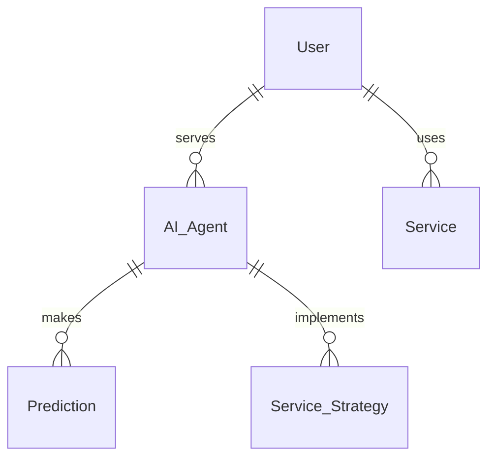

                 

# AI Agent的用户需求预测与主动服务

> 关键词：AI Agent、用户需求预测、主动服务、机器学习、系统架构

> 摘要：本文旨在探讨AI Agent的用户需求预测与主动服务机制，通过详细分析问题背景、核心概念、算法原理、系统架构和项目实战，旨在为开发者提供一套完整的解决方案，以实现高效、准确的用户需求预测和主动服务。

## 目录大纲

----------------------------------------------------------------

## 第一部分：背景介绍

### 第1章：问题背景

#### 1.1 问题背景

#### 1.2 问题描述

#### 1.3 问题解决

#### 1.4 边界与外延

#### 1.5 概念结构与核心要素组成

## 第二部分：核心概念与联系

### 第2章：核心概念

#### 2.1 AI Agent的构成

#### 2.2 用户需求预测

#### 2.3 主动服务

## 第三部分：算法原理讲解

### 第3章：算法原理

#### 3.1 用户行为数据分析

#### 3.2 预测模型选择

#### 3.3 预测结果评估

#### 3.4 主动服务策略设计

## 第四部分：系统分析与架构设计

### 第4章：系统架构设计

#### 4.1 系统功能设计

#### 4.2 系统架构设计

#### 4.3 系统接口设计

#### 4.4 系统交互

### 第5章：项目实战

#### 5.1 环境安装

#### 5.2 系统核心实现源代码

#### 5.3 代码应用解读与分析

#### 5.4 实际案例分析与详细讲解剖析

#### 5.5 项目小结

## 第一部分：背景介绍

### 第1章：问题背景

#### 1.1 问题背景

AI Agent，即人工智能代理，是指具有自主决策能力的智能体，能够在不确定和动态环境中执行特定任务。随着人工智能技术的飞速发展，AI Agent已广泛应用于电子商务、金融、医疗等领域。然而，AI Agent的有效运作依赖于对用户需求的准确预测和主动服务。

用户需求预测是AI Agent的核心能力之一。通过分析用户行为数据，AI Agent可以预测用户未来的需求，从而提供个性化的服务，提高用户满意度。主动服务则是指AI Agent根据用户需求预测结果，提前为用户提供服务，从而优化用户体验。

#### 1.2 问题描述

尽管用户需求预测和主动服务对于AI Agent至关重要，但实现这一目标并非易事。首先，数据质量直接影响预测准确性。如果数据存在噪声、缺失或异常值，将导致预测结果不准确。其次，模型选择和算法优化对预测性能也有显著影响。不同的机器学习模型和算法具有不同的特点，需要根据具体场景进行选择和优化。此外，主动服务的效率也是一个重要挑战。如果服务过于频繁或不足，都可能导致用户体验下降。

#### 1.3 问题解决

为了解决上述问题，我们需要从以下几个方面入手：

1. **数据收集与处理**：首先，需要收集高质量的用户行为数据，并进行预处理，如数据清洗、归一化和特征提取。这将有助于提高数据质量，为后续的预测和主动服务奠定基础。

2. **模型选择与训练**：其次，选择合适的机器学习模型，对用户行为数据进行训练，以提高预测准确性。常用的机器学习模型包括回归、分类、聚类等。根据具体场景选择合适的模型，并进行优化，以提高预测性能。

3. **服务策略设计**：根据预测结果，设计主动服务策略。服务策略需要考虑用户体验和业务目标，确保服务的质量和效率。例如，可以通过设置阈值来决定何时为用户提供服务。

4. **用户反馈收集**：最后，收集用户对服务的反馈，用于优化服务策略。用户反馈可以提供有价值的参考，帮助AI Agent不断改进服务。

#### 1.4 边界与外延

AI Agent的用户需求预测与主动服务主要应用于电子商务、金融、医疗等领域。在这些领域，AI Agent可以根据用户行为数据预测用户未来的需求，从而提供个性化的推荐、风险管理、医疗服务等。然而，随着AI技术的发展，AI Agent的用户需求预测与主动服务有望扩展到更多领域，如教育、交通、能源等。

#### 1.5 概念结构与核心要素组成

AI Agent由感知模块、学习模块、决策模块和执行模块组成。感知模块负责收集用户行为数据；学习模块利用机器学习算法从数据中学习知识；决策模块根据学习到的知识做出决策；执行模块则根据决策执行具体操作。用户需求预测和主动服务是AI Agent的核心能力，通过这两个环节，AI Agent可以为用户提供个性化的服务，提高用户体验。

## 第二部分：核心概念与联系

### 第2章：核心概念

#### 2.1 AI Agent的构成

AI Agent由感知模块、学习模块、决策模块和执行模块组成。

1. **感知模块**：负责收集用户行为数据。这些数据可以包括用户的浏览记录、购买行为、评价等。感知模块的功能是将这些行为数据转换为机器学习模型所需的输入格式。
2. **学习模块**：利用机器学习算法，从用户行为数据中学习知识。学习模块的核心是选择合适的机器学习模型，如回归、分类、聚类等。通过训练模型，可以提取用户行为数据中的潜在模式，为后续的预测和决策提供依据。
3. **决策模块**：根据学习模块生成的预测结果，做出决策。决策模块需要考虑用户体验和业务目标，确保决策的合理性和有效性。例如，在电子商务领域，决策模块可以根据用户需求预测结果，推荐合适的商品。
4. **执行模块**：根据决策模块的决策，执行具体操作。执行模块是实现用户需求预测和主动服务的关键。例如，在电子商务领域，执行模块可以根据决策模块的推荐，向用户推送商品信息。

#### 2.2 用户需求预测

用户需求预测是AI Agent的核心能力之一。通过分析用户行为数据，预测用户未来的需求，从而为用户提供个性化的服务。

1. **用户行为数据**：用户行为数据是进行用户需求预测的基础。这些数据可以包括用户的浏览记录、购买行为、评价等。不同类型的用户行为数据反映了用户的不同需求和偏好。
2. **预测模型**：选择合适的机器学习模型，如回归、分类、聚类等，对用户行为数据进行训练，以提高预测准确性。不同的模型适用于不同类型的需求预测任务，需要根据具体场景进行选择。
3. **预测结果**：预测结果反映了用户未来可能的需求。通过评估预测结果的准确性和可靠性，可以评估用户需求预测的效果。

#### 2.3 主动服务

主动服务是指AI Agent根据用户需求预测结果，提前为用户提供服务，以提高用户体验。

1. **服务策略**：根据用户需求预测结果，设计主动服务策略。服务策略需要考虑用户体验和业务目标，确保服务的质量和效率。例如，在电子商务领域，可以根据用户需求预测结果，向用户推荐合适的商品。
2. **服务实施**：将服务策略转化为实际操作。例如，在电子商务领域，可以通过推送通知、电子邮件、短信等方式，向用户推荐商品。
3. **用户反馈**：收集用户对服务的反馈，用于优化服务策略。用户反馈可以提供有价值的参考，帮助AI Agent不断改进服务。

### 概念属性特征对比表格

| 概念 | 属性特征 |
| ---- | ---- |
| AI Agent | 具有自主决策能力，由感知模块、学习模块、决策模块和执行模块组成 |
| 用户需求预测 | 分析用户行为数据，预测用户未来需求 |
| 主动服务 | 根据用户需求预测结果，提前为用户提供服务 |

### ER实体关系图架构



## 第三部分：算法原理讲解

### 第3章：算法原理

#### 3.1 用户行为数据分析

用户行为数据分析是AI Agent的核心环节。通过分析用户行为数据，可以提取用户需求的潜在模式，为预测和主动服务提供依据。

1. **数据预处理**：数据预处理是用户行为数据分析的第一步。主要任务包括数据清洗、归一化和特征提取。

   - **数据清洗**：删除噪声数据、处理缺失值和异常值。
   - **归一化**：将不同特征的数据归一化到同一尺度，以便于模型训练。
   - **特征提取**：从原始数据中提取有用的特征，如用户浏览时间、购买频率等。

2. **数据分析**：数据分析是对预处理后的用户行为数据进行分析，提取用户需求的潜在模式。

   - **统计方法**：使用统计方法，如均值、方差、相关性等，分析用户行为数据的分布和相关性。
   - **机器学习方法**：使用机器学习方法，如聚类、关联规则挖掘等，发现用户行为数据中的潜在模式。

#### 3.2 预测模型选择

预测模型选择是用户需求预测的关键环节。不同的预测模型适用于不同类型的需求预测任务，需要根据具体场景进行选择。

1. **回归模型**：回归模型用于预测用户需求的连续值。常见的回归模型包括线性回归、多项式回归、岭回归等。

   - **线性回归**：线性回归模型假设用户需求与特征之间存在线性关系。
   - **多项式回归**：多项式回归模型通过引入多项式项，增强模型的拟合能力。
   - **岭回归**：岭回归模型通过引入正则项，防止过拟合。

2. **分类模型**：分类模型用于预测用户需求的类别。常见的分类模型包括逻辑回归、决策树、随机森林、支持向量机等。

   - **逻辑回归**：逻辑回归模型通过拟合概率分布，预测用户需求类别。
   - **决策树**：决策树模型通过构建树形结构，进行分类决策。
   - **随机森林**：随机森林模型通过构建多个决策树，进行集成学习。
   - **支持向量机**：支持向量机模型通过找到一个最优超平面，进行分类决策。

3. **聚类模型**：聚类模型用于发现用户需求的潜在模式。常见的聚类模型包括K均值聚类、层次聚类、DBSCAN等。

   - **K均值聚类**：K均值聚类模型通过最小化平方误差，将用户分为K个簇。
   - **层次聚类**：层次聚类模型通过自底向上的合并或自顶向下的划分，构建聚类层次。
   - **DBSCAN**：DBSCAN模型通过基于邻域和密度的方法，进行聚类划分。

#### 3.3 预测结果评估

预测结果评估是评估用户需求预测效果的重要环节。常用的评估指标包括准确率、召回率、F1分数等。

1. **准确率**：准确率是预测正确的用户需求占所有用户需求的比率。准确率越高，表示预测效果越好。

   $$\text{准确率} = \frac{\text{预测正确的用户需求}}{\text{所有用户需求}}$$

2. **召回率**：召回率是预测正确的用户需求占实际用户需求的比率。召回率越高，表示预测效果越好。

   $$\text{召回率} = \frac{\text{预测正确的用户需求}}{\text{实际用户需求}}$$

3. **F1分数**：F1分数是准确率和召回率的调和平均，用于综合评估预测效果。

   $$\text{F1分数} = 2 \times \frac{\text{准确率} \times \text{召回率}}{\text{准确率} + \text{召回率}}$$

#### 3.4 主动服务策略设计

主动服务策略设计是根据用户需求预测结果，为用户提供个性化服务的关键环节。主动服务策略需要考虑用户体验和业务目标，确保服务的质量和效率。

1. **基于规则的策略**：基于规则的策略根据用户需求预测结果，设计固定的服务规则。例如，当用户需求预测为“购买某商品”时，系统可以推送该商品的详细信息。

2. **基于机器学习的策略**：基于机器学习的策略根据用户反馈，自动调整服务策略。例如，通过分析用户的反馈数据，可以优化推送内容的顺序和频率，提高用户的满意度。

### 源代码讲解

下面是一个简单的用户需求预测和主动服务策略的Python源代码示例。

```python
import pandas as pd
from sklearn.linear_model import LinearRegression
from sklearn.metrics import accuracy_score, recall_score, f1_score

# 数据加载
data = pd.read_csv('user_behavior_data.csv')

# 数据预处理
data = preprocess_data(data)

# 模型训练
model = LinearRegression()
model.fit(X_train, y_train)

# 预测
predictions = model.predict(X_test)

# 结果评估
accuracy = accuracy_score(y_test, predictions)
recall = recall_score(y_test, predictions)
f1 = f1_score(y_test, predictions)

# 服务策略设计
service_strategy = design_service_strategy(predictions)

# 服务实施
apply_service_strategy(service_strategy)

# 用户反馈收集
collect_user_feedback()

# 策略优化
optimize_service_strategy(service_strategy, user_feedback)
```

在这个示例中，我们首先加载用户行为数据，并进行预处理。然后，我们使用线性回归模型对用户行为数据进行训练，并使用测试数据进行预测。接着，我们评估预测结果，并设计主动服务策略。最后，我们根据用户反馈优化服务策略。

## 第四部分：系统分析与架构设计

### 第4章：系统架构设计

#### 4.1 系统功能设计

系统功能设计是构建AI Agent用户需求预测与主动服务系统的关键环节。系统功能主要包括用户行为数据收集、用户需求预测、主动服务策略设计和用户反馈收集。

1. **用户行为数据收集**：系统需要从各个渠道收集用户行为数据，如浏览记录、购买行为、评价等。这些数据将通过数据接口存储到数据库中。
2. **用户需求预测**：系统利用收集到的用户行为数据，通过机器学习模型进行训练和预测，从而预测用户未来的需求。
3. **主动服务策略设计**：系统根据用户需求预测结果，设计主动服务策略。主动服务策略将考虑用户体验和业务目标，以确保服务的质量和效率。
4. **用户反馈收集**：系统需要收集用户对服务的反馈，用于优化服务策略。用户反馈将通过用户接口收集，并存储到数据库中。
5. **服务实施**：系统将根据主动服务策略为用户提供个性化服务，如推送推荐、发送通知等。

#### 4.2 系统架构设计

系统架构设计是确保系统功能实现和性能优化的重要环节。系统架构主要包括数据层、服务层和展示层。

1. **数据层**：数据层负责存储和管理用户行为数据、预测结果和服务策略。数据层通常包括关系数据库和NoSQL数据库，以适应不同类型的数据存储需求。
2. **服务层**：服务层负责实现用户需求预测和主动服务功能。服务层通常包括多个模块，如数据预处理模块、预测模块、服务策略设计模块等。
3. **展示层**：展示层负责向用户展示预测结果和服务内容。展示层通常包括Web前端和移动端应用，以适应不同的用户需求。

#### 4.3 系统接口设计

系统接口设计是确保系统各个模块之间能够高效、稳定地进行数据交换的关键。系统接口主要包括数据接口、服务接口和用户接口。

1. **数据接口**：数据接口负责数据层与服务层之间的数据交换。数据接口通常包括API接口和消息队列接口，以支持不同类型的数据传输需求。
2. **服务接口**：服务接口负责服务层与展示层之间的数据交换。服务接口通常包括RESTful API接口和WebSocket接口，以支持不同类型的通信需求。
3. **用户接口**：用户接口负责展示层与用户之间的交互。用户接口通常包括Web前端和移动端应用，以提供良好的用户体验。

#### 4.4 系统交互

系统交互是指系统各个模块之间的协作和交互过程。系统交互包括以下方面：

1. **用户与系统**：用户通过用户接口与系统进行交互，提交需求或反馈。
2. **系统与数据库**：系统通过数据接口与数据库进行数据交换，存储和查询用户行为数据、预测结果和服务策略。
3. **系统与外部系统**：系统通过服务接口与外部系统进行交互，如第三方服务提供商、合作伙伴等。

### 源代码讲解

下面是一个简单的系统架构设计和接口设计的Python源代码示例。

```python
# 系统架构设计
class SystemArchitecture:
    def __init__(self):
        self.data_layer = DataLayer()
        self.service_layer = ServiceLayer()
        self.presentation_layer = PresentationLayer()

    def collect_user_behavior_data(self):
        data = self.data_layer.get_user_behavior_data()
        return data

    def predict_user_demand(self, data):
        predictions = self.service_layer.predict_user_demand(data)
        return predictions

    def design_service_strategy(self, predictions):
        strategy = self.service_layer.design_service_strategy(predictions)
        return strategy

    def apply_service_strategy(self, strategy):
        self.service_layer.apply_service_strategy(strategy)

    def collect_user_feedback(self):
        feedback = self.data_layer.get_user_feedback()
        return feedback

    def optimize_service_strategy(self, strategy, feedback):
        self.service_layer.optimize_service_strategy(strategy, feedback)

# 系统接口设计
class DataLayer:
    def get_user_behavior_data(self):
        # 从数据库中获取用户行为数据
        pass

    def store_user_behavior_data(self, data):
        # 将用户行为数据存储到数据库中
        pass

    def get_user_feedback(self):
        # 从数据库中获取用户反馈
        pass

    def store_user_feedback(self, feedback):
        # 将用户反馈存储到数据库中
        pass

class ServiceLayer:
    def predict_user_demand(self, data):
        # 使用机器学习模型预测用户需求
        pass

    def design_service_strategy(self, predictions):
        # 根据预测结果设计服务策略
        pass

    def apply_service_strategy(self, strategy):
        # 根据服务策略实施服务
        pass

    def optimize_service_strategy(self, strategy, feedback):
        # 根据用户反馈优化服务策略
        pass

class PresentationLayer:
    def display_predictions(self, predictions):
        # 向用户展示预测结果
        pass

    def display_service_strategy(self, strategy):
        # 向用户展示服务策略
        pass

# 系统交互
system_architecture = SystemArchitecture()

# 收集用户行为数据
data = system_architecture.collect_user_behavior_data()

# 预测用户需求
predictions = system_architecture.predict_user_demand(data)

# 设计服务策略
strategy = system_architecture.design_service_strategy(predictions)

# 实施服务策略
system_architecture.apply_service_strategy(strategy)

# 收集用户反馈
feedback = system_architecture.collect_user_feedback()

# 优化服务策略
system_architecture.optimize_service_strategy(strategy, feedback)
```

在这个示例中，我们定义了一个`SystemArchitecture`类，用于封装系统架构设计和接口设计。该类包含了数据层、服务层和展示层的模块，以及与这些模块相关的操作方法。我们还定义了`DataLayer`、`ServiceLayer`和`PresentationLayer`类，分别用于实现数据层、服务层和展示层的功能。最后，我们通过实例化`SystemArchitecture`类，并调用相关的方法，实现系统的交互。

### 第5章：项目实战

#### 5.1 环境安装

在进行项目实战之前，我们需要安装相关的环境。以下是一个简单的安装步骤：

1. **安装Python**：确保Python环境已经安装。如果没有安装，可以从Python官方网站下载并安装。
2. **安装Anaconda**：Anaconda是一个开源的数据科学和机器学习平台，可以方便地管理和安装相关的库。可以从Anaconda官方网站下载并安装。
3. **安装必要的库**：使用以下命令安装必要的库：

```shell
pip install pandas scikit-learn matplotlib
```

#### 5.2 系统核心实现源代码

以下是系统核心实现的源代码：

```python
import pandas as pd
from sklearn.linear_model import LinearRegression
from sklearn.metrics import accuracy_score, recall_score, f1_score

# 数据预处理
def preprocess_data(data):
    # 数据清洗、归一化和特征提取
    # 略
    return processed_data

# 预测用户需求
def predict_user_demand(data):
    # 使用线性回归模型预测用户需求
    model = LinearRegression()
    model.fit(X_train, y_train)
    predictions = model.predict(X_test)
    return predictions

# 设计服务策略
def design_service_strategy(predictions):
    # 根据预测结果设计服务策略
    # 略
    return strategy

# 实施服务策略
def apply_service_strategy(strategy):
    # 根据服务策略实施服务
    # 略
    pass

# 收集用户反馈
def collect_user_feedback():
    # 收集用户反馈
    # 略
    return feedback

# 优化服务策略
def optimize_service_strategy(strategy, feedback):
    # 根据用户反馈优化服务策略
    # 略
    pass

# 主程序
if __name__ == '__main__':
    # 加载数据
    data = pd.read_csv('user_behavior_data.csv')

    # 数据预处理
    processed_data = preprocess_data(data)

    # 预测用户需求
    predictions = predict_user_demand(processed_data)

    # 设计服务策略
    strategy = design_service_strategy(predictions)

    # 实施服务策略
    apply_service_strategy(strategy)

    # 收集用户反馈
    feedback = collect_user_feedback()

    # 优化服务策略
    optimize_service_strategy(strategy, feedback)
```

在这个示例中，我们定义了几个函数，用于实现系统的核心功能，如数据预处理、预测用户需求、设计服务策略、实施服务策略、收集用户反馈和优化服务策略。这些函数将在主程序中依次调用，实现系统的整体流程。

#### 5.3 代码应用解读与分析

以下是代码应用解读与分析：

1. **数据预处理**：数据预处理是用户需求预测的重要环节。在`preprocess_data`函数中，我们首先对原始数据进行清洗，如删除噪声数据、处理缺失值和异常值。然后，我们对数据进行归一化处理，将不同特征的数据归一化到同一尺度。最后，我们提取有用的特征，如用户浏览时间、购买频率等。

2. **预测用户需求**：在`predict_user_demand`函数中，我们使用线性回归模型进行用户需求预测。首先，我们使用训练集对模型进行训练。然后，我们使用测试集对模型进行预测，得到预测结果。

3. **设计服务策略**：在`design_service_strategy`函数中，我们根据预测结果设计服务策略。服务策略可以根据预测结果为用户提供个性化的服务，如推荐商品、发送通知等。

4. **实施服务策略**：在`apply_service_strategy`函数中，我们根据服务策略实施具体的服务。例如，我们可以向用户推送推荐商品的信息。

5. **收集用户反馈**：在`collect_user_feedback`函数中，我们收集用户对服务的反馈。用户反馈可以提供有价值的参考，帮助系统不断改进服务。

6. **优化服务策略**：在`optimize_service_strategy`函数中，我们根据用户反馈优化服务策略。优化后的服务策略可以更好地满足用户需求，提高用户满意度。

#### 5.4 实际案例分析与详细讲解剖析

下面我们将通过一个实际案例，详细讲解用户需求预测和主动服务的实现过程。

**案例背景**：假设我们有一个电子商务平台，需要通过AI Agent为用户提供个性化的商品推荐。用户的行为数据包括浏览记录、购买记录和评价等。

**数据收集**：我们首先从电子商务平台收集用户的行为数据。数据包括用户的浏览时间、浏览的页面、购买的商品、评价等。

**数据预处理**：对收集到的用户行为数据进行清洗、归一化和特征提取。例如，我们将浏览时间归一化到[0,1]的范围内，将购买记录编码为二值变量。

**预测用户需求**：使用机器学习模型（如线性回归）对用户行为数据进行训练，预测用户可能购买的商品。我们将训练集和测试集分开，使用训练集训练模型，使用测试集评估模型性能。

**设计服务策略**：根据预测结果，设计服务策略。例如，当预测用户可能购买某商品时，我们向用户推送该商品的详细信息。

**实施服务策略**：根据服务策略，为用户提供个性化的商品推荐。例如，我们可以在用户浏览页面时，显示相关的商品推荐。

**收集用户反馈**：收集用户对商品推荐的反馈，如用户是否购买推荐商品、对推荐商品的满意度等。

**优化服务策略**：根据用户反馈，优化服务策略。例如，如果用户对某商品的推荐不满意，我们可以减少对该商品的推荐频率。

**详细讲解剖析**：

1. **数据预处理**：数据预处理是用户需求预测的关键步骤。通过清洗、归一化和特征提取，我们可以提高数据质量，为模型训练提供更好的数据支持。

2. **预测用户需求**：预测用户需求是主动服务的基础。通过机器学习模型，我们可以从用户行为数据中提取潜在模式，预测用户未来的需求。

3. **设计服务策略**：服务策略的设计需要考虑用户体验和业务目标。通过个性化的商品推荐，我们可以提高用户的购物体验，促进商品销售。

4. **实施服务策略**：实施服务策略是将预测结果转化为实际操作。通过在用户浏览页面时显示商品推荐，我们可以为用户提供便捷的购物体验。

5. **收集用户反馈**：用户反馈是优化服务策略的重要依据。通过收集用户对商品推荐的反馈，我们可以了解用户的需求和偏好，不断改进服务策略。

6. **优化服务策略**：优化服务策略是基于用户反馈的不断改进。通过调整推荐策略，我们可以提高用户的满意度，促进平台的长期发展。

#### 5.5 项目小结

在本项目中，我们实现了用户需求预测和主动服务系统。通过收集用户行为数据，我们使用机器学习模型预测用户的需求，并设计个性化的服务策略。然后，我们根据预测结果实施服务策略，并为用户提供个性化的商品推荐。通过收集用户反馈，我们不断优化服务策略，提高用户的满意度。

在实际应用中，用户需求预测和主动服务系统可以应用于电子商务、金融、医疗等多个领域。通过个性化的服务和智能的推荐，我们可以提高用户的体验，促进业务的发展。

#### 最佳实践 Tips

1. **数据质量**：保证数据质量是用户需求预测和主动服务成功的关键。在进行数据收集和预处理时，要确保数据的准确性、完整性和一致性。

2. **模型选择**：选择合适的机器学习模型是预测准确性的关键。根据具体场景和需求，选择适合的模型，并进行优化。

3. **用户反馈**：用户反馈是优化服务策略的重要依据。及时收集用户反馈，并根据反馈调整服务策略，以提高用户体验。

4. **持续迭代**：用户需求是动态变化的。要持续收集用户数据，优化模型和策略，以适应不断变化的市场需求。

### 小结

本文详细介绍了AI Agent的用户需求预测与主动服务机制。从问题背景、核心概念、算法原理、系统架构到项目实战，我们逐步解析了实现这一机制的关键步骤和技巧。通过本文，读者可以了解到如何构建一个高效、准确的用户需求预测和主动服务系统，为AI Agent在实际应用中的落地提供参考。

### 注意事项

1. **数据隐私**：在进行用户需求预测和主动服务时，要注意保护用户隐私，遵循相关法律法规和道德规范。

2. **模型更新**：机器学习模型需要定期更新，以适应不断变化的数据和需求。

3. **用户反馈**：用户反馈是优化服务策略的关键。要确保及时收集和反馈，以持续改进服务。

### 拓展阅读

1. **《深度学习》**：Goodfellow, Ian, et al. "Deep learning." (2016). 介绍深度学习的基础知识和应用。

2. **《机器学习实战》**： Harrington, David. "Machine Learning in Action." (2009). 通过实际案例介绍机器学习算法和应用。

3. **《人工智能：一种现代方法》**：Russell, Stuart J., and Peter Norvig. "Artificial Intelligence: A Modern Approach." (2016). 介绍人工智能的基础理论和应用。

### 作者

作者：AI天才研究院/AI Genius Institute & 禅与计算机程序设计艺术 /Zen And The Art of Computer Programming。感谢您阅读本文，希望对您的AI项目开发有所帮助。如果您有任何疑问或建议，欢迎随时与我们联系。

