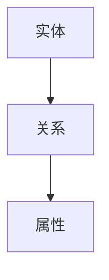
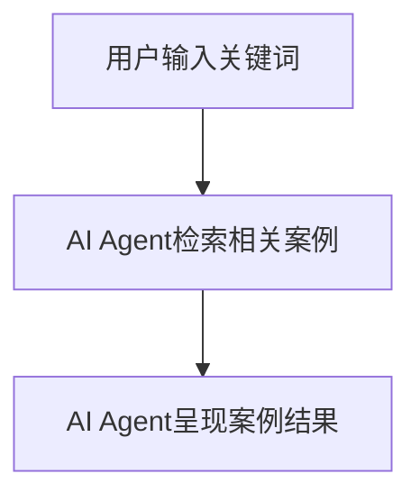
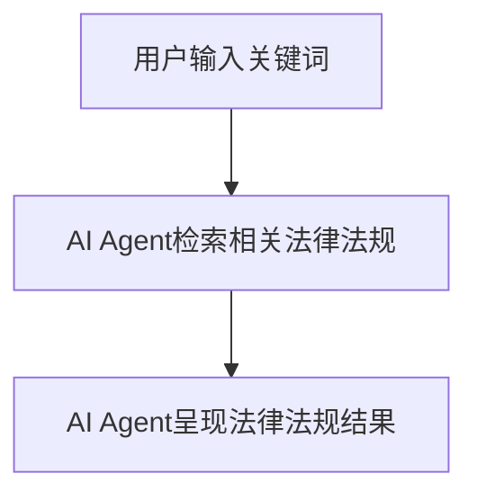
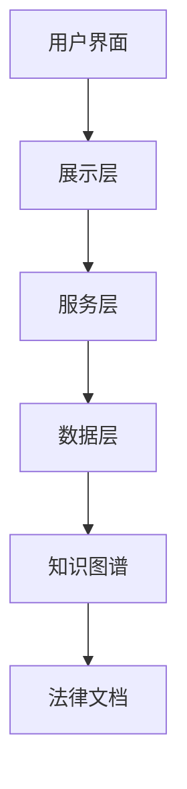
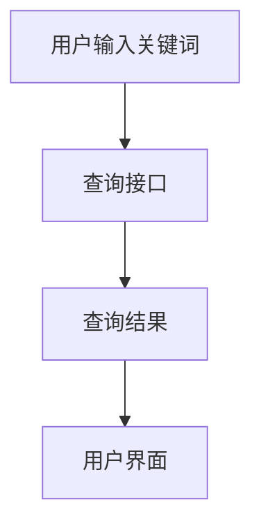
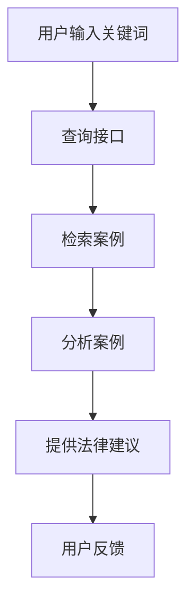

                 

# AI Agent的知识图谱在法律咨询中的应用

## 关键词
- AI Agent
- 知识图谱
- 法律咨询
- 自动化
- 个性化服务

## 摘要
本文旨在探讨AI Agent与知识图谱在法律咨询中的应用。通过构建知识图谱，AI Agent能够更准确地理解法律条文和案例，提供高效、专业的法律咨询服务。本文首先介绍了AI Agent和知识图谱的基本概念和原理，然后分析了它们在法律咨询中的具体应用，并通过案例分析展示了其潜力。

## 第1章 引言

### 1.1 问题的背景

#### 1.1.1 法律咨询行业的挑战

法律咨询行业面临着诸多挑战，主要包括以下几个方面：

1. **繁琐的法规和政策**：随着社会的发展和法律的完善，各类法规和政策日益增多，法律咨询人员需要花费大量的时间和精力去了解和掌握这些法规和政策。
2. **高度的专业性和复杂性**：法律咨询涉及多个领域，如民法、刑法、商法等，每个领域都有其复杂的专业知识，对咨询人员的要求非常高。
3. **案例和判例的多样性**：每个案件都有其独特的背景和情况，需要根据具体情况进行法律分析，这增加了法律咨询的难度。

#### 1.1.2 现有解决方案的不足

现有的法律咨询服务主要依赖于律师或法律专家的专业知识和经验，这种方式存在以下问题：

1. **效率低**：法律咨询人员需要大量时间来研究法规、政策以及案例，导致咨询过程耗时较长。
2. **成本高**：专业法律咨询费用较高，限制了普通民众获取法律咨询服务的可能性。
3. **主观性强**：法律咨询结果受咨询人员的主观判断影响，可能存在偏差。

### 1.2 知识图谱的概念

#### 1.2.1 知识图谱的定义

知识图谱是一种用于表示实体之间关系的数据结构，它将现实世界中的事物抽象为图中的节点和边，并通过节点和边的关系来表示实体之间的关联。

#### 1.2.2 知识图谱的特点

1. **精确性**：知识图谱通过明确的关系来表示实体间的联系，使得信息的表达更加精确。
2. **可扩展性**：知识图谱可以根据需求不断添加新的实体和关系，具有良好的可扩展性。
3. **语义丰富**：知识图谱不仅包含了实体和关系，还可以包含实体的属性和特征，使得信息的语义更加丰富。

### 1.3 AI Agent的概念

#### 1.3.1 AI Agent的定义

AI Agent（人工智能代理）是一种能够自主决策和执行任务的计算机程序，它能够通过学习和推理来适应环境，完成特定的任务。

#### 1.3.2 AI Agent的特点

1. **自动化**：AI Agent能够自动执行任务，减少人工干预。
2. **适应性**：AI Agent能够根据环境和任务的需求进行调整。
3. **智能化**：AI Agent通过机器学习和深度学习等技术，能够模拟人类思维，进行智能推理和决策。

### 1.4 研究目的与意义

#### 1.4.1 研究目的

本研究旨在探索AI Agent与知识图谱在法律咨询中的应用，通过构建知识图谱，使AI Agent能够更准确地理解和应用法律条文和案例，提供高效、专业的法律咨询服务。

#### 1.4.2 研究意义

1. **提高法律咨询的效率**：AI Agent能够快速检索和查询知识图谱，提供即时的法律咨询服务，大幅提高咨询效率。
2. **降低咨询成本**：通过自动化和智能化的法律咨询服务，降低法律咨询的成本，使得更多民众能够享受到高质量的法律咨询服务。
3. **提高法律服务的准确性**：知识图谱的精确性和语义丰富性，使得AI Agent能够提供更准确、可靠的法律建议。

### 1.5 本章小结

本章介绍了法律咨询行业的背景和挑战，以及AI Agent和知识图谱的基本概念和原理。通过这些介绍，为后续章节对AI Agent与知识图谱在法律咨询中的应用研究奠定了基础。

## 第2章 相关技术基础

### 2.1 知识图谱技术

#### 2.1.1 知识图谱的基本原理

知识图谱的基本原理可以概括为实体-关系-属性（E-R）模型。在这种模型中，实体表示现实世界中的事物，关系表示实体之间的关联，属性表示实体的特征。

##### 实体-关系-属性（E-R）模型

- **实体**：代表现实世界中的事物，如人、地点、事件等。
- **关系**：表示实体之间的关联，如“工作于”、“居住于”等。
- **属性**：表示实体的特征，如人的姓名、地点的纬度等。

知识图谱通过图数据库来存储和管理这些实体、关系和属性。图数据库具有高效、灵活的数据查询能力，能够快速地检索和关联实体和关系。

##### 图数据库

- **Neo4j**：一款流行的图数据库，采用Cypher查询语言。
- **ArangoDB**：一款多模型数据库，支持图形、文档和键值存储。

#### 2.1.2 知识图谱的关键技术

1. **数据采集**：从多种数据源（如文献、数据库、网站等）中收集数据，构建原始的知识图谱。
2. **数据清洗**：对收集到的数据进行处理，去除重复、错误和不完整的数据，提高数据质量。
3. **数据存储**：将清洗后的数据存储到图数据库中，建立实体、关系和属性的关联。
4. **数据查询**：通过图数据库的查询语言，快速检索和关联实体和关系，提供知识查询服务。

#### 2.1.3 知识图谱的应用场景

1. **搜索引擎**：通过知识图谱来增强搜索功能，提供更准确、更相关的搜索结果。
2. **智能推荐**：利用知识图谱来分析用户行为和偏好，提供个性化的推荐服务。
3. **命名实体识别**：通过知识图谱来识别文本中的实体，如人名、地点、组织等。

### 2.2 AI Agent技术

#### 2.2.1 AI Agent的基本原理

AI Agent的基本原理包括以下几个方面：

1. **机器学习**：通过训练模型来学习数据中的规律和模式，提高智能推理能力。
2. **深度学习**：通过多层神经网络来提取数据中的特征，实现更加复杂的智能推理。
3. **自然语言处理**：通过理解和生成自然语言，实现人机交互和智能问答。

##### 机器学习和深度学习

- **机器学习**：基于已有数据，通过算法来发现数据中的规律和模式。
- **深度学习**：基于多层神经网络，通过反向传播算法来训练模型，实现自动化特征提取。

##### 自然语言处理

- **分词**：将文本分割成词语。
- **词性标注**：对词语进行词性分类，如名词、动词等。
- **句法分析**：对句子进行结构分析，理解句子的语法关系。
- **语义分析**：对句子进行语义理解，提取句子的意义。

#### 2.2.2 AI Agent的关键技术

1. **任务分配**：根据任务的类型和优先级，分配给适当的AI Agent。
2. **目标识别**：通过分析环境和任务，识别任务的目标。
3. **行为规划**：根据目标和环境，规划出最优的行动路径。

#### 2.2.3 AI Agent的应用场景

1. **智能客服**：通过自然语言处理技术，实现与用户的智能交互，提供在线客服服务。
2. **虚拟助手**：通过语音识别和语义理解技术，实现智能语音助手，帮助用户完成各种任务。
3. **自动驾驶**：通过感知、规划和控制技术，实现车辆的自动驾驶功能。

### 2.3 法律咨询领域的相关知识

#### 2.3.1 法律法规

法律法规是法律咨询的基础，主要包括以下几种：

1. **宪法**：国家的根本法，规定国家的基本制度和公民的基本权利。
2. **民法**：调整平等主体的自然人、法人和非法人组织之间的人身关系和财产关系。
3. **刑法**：规定犯罪和刑罚的法律，保障社会的安全和秩序。
4. **商法**：调整商业活动中的法律关系，保障市场经济的正常运行。

#### 2.3.2 法律案例

法律案例是法律咨询的重要依据，主要包括以下几种：

1. **判例**：法院在审理案件时做出的判决，对后续类似案件的审理具有指导意义。
2. **案例分析**：对法律案例进行深入分析，提取案件的关键事实和法律规定。
3. **案例数据库**：收集和存储大量的法律案例，供法律咨询人员查询和使用。

### 2.4 本章小结

本章介绍了知识图谱和AI Agent的基本原理、关键技术以及应用场景，并探讨了法律咨询领域的相关知识。这些技术为后续章节对AI Agent与知识图谱在法律咨询中的应用研究提供了基础。

## 第3章 AI Agent与知识图谱的结合

### 3.1 结合原理

#### 3.1.1 知识图谱与AI Agent的协同作用

知识图谱和AI Agent在法律咨询领域具有协同作用，具体体现在以下几个方面：

1. **知识图谱为AI Agent提供丰富的知识资源**：知识图谱中包含了大量的法律条文、案例和判例，AI Agent可以通过知识图谱来获取这些知识资源，提高法律咨询的准确性和效率。
2. **AI Agent利用知识图谱进行智能推理和决策**：AI Agent可以通过知识图谱中的关系和属性，进行智能推理和决策，为用户提供专业的法律建议。

#### 3.1.2 结合模式

AI Agent与知识图谱的结合可以通过以下几种模式实现：

1. **双层架构**：在AI Agent的内部构建知识图谱，使AI Agent能够直接利用知识图谱中的知识资源进行推理和决策。
2. **深度结合**：将知识图谱嵌入到AI Agent的决策流程中，AI Agent在执行任务时，可以根据知识图谱中的信息进行智能推理和决策。

### 3.2 应用场景

#### 3.2.1 案例检索

在法律咨询过程中，用户可能需要查询相关的法律案例。AI Agent可以利用知识图谱进行案例检索，根据用户输入的关键词，快速检索到相关的案例。

1. **案例检索流程**：

   - 用户输入关键词。
   - AI Agent在知识图谱中检索相关的案例。
   - AI Agent将检索到的案例呈现给用户。

2. **案例检索的关键技术**：

   - **关键词提取**：对用户输入的关键词进行提取和处理，为案例检索提供依据。
   - **文本相似度计算**：计算用户输入的关键词与知识图谱中的案例的相似度，筛选出最相关的案例。

#### 3.2.2 案例分析

在检索到相关的案例后，AI Agent可以对案例进行深入分析，提取案件的关键事实和法律规定，为用户提供法律建议。

1. **案例分析流程**：

   - AI Agent检索到相关的案例。
   - AI Agent对案例进行文本分析和解析，提取案件的关键事实和法律规定。
   - AI Agent根据提取的信息，为用户提供法律建议。

2. **案例分析的关键技术**：

   - **文本分析**：对案例文本进行分词、词性标注、句法分析等，提取案件的关键信息。
   - **语义理解**：对提取的关键信息进行语义理解，分析案件的法律规定和适用范围。

#### 3.2.3 法律法规查询

用户在法律咨询过程中，可能需要查询相关的法律法规。AI Agent可以利用知识图谱进行法律法规的查询，为用户提供准确、权威的法律信息。

1. **法律法规查询流程**：

   - 用户输入关键词。
   - AI Agent在知识图谱中检索相关的法律法规。
   - AI Agent将检索到的法律法规呈现给用户。

2. **法律法规查询的关键技术**：

   - **关键词提取**：对用户输入的关键词进行提取和处理，为法律法规查询提供依据。
   - **文本相似度计算**：计算用户输入的关键词与知识图谱中的法律法规的相似度，筛选出最相关的法律法规。

### 3.3 应用流程

AI Agent与知识图谱在法律咨询中的应用流程如下：

#### 3.3.1 用户输入

用户可以通过自然语言描述法律问题，如“如何解除劳动合同？”或“合同纠纷的处理流程是什么？”

#### 3.3.2 案例检索

AI Agent利用知识图谱进行案例检索，根据用户输入的问题，找到相关的法律案例。

#### 3.3.3 案例分析

AI Agent对检索到的案例进行文本分析和语义理解，提取案件的关键事实和法律规定。

#### 3.3.4 提供法律建议

AI Agent根据分析结果，为用户提供法律建议，如“建议您与用人单位协商解除劳动合同”或“建议您按照合同约定进行合同纠纷的处理”。

#### 3.3.5 用户反馈

用户可以对AI Agent提供的服务进行反馈，如“我觉得这个建议很好”或“我希望了解更多关于这个问题的信息”。

### 3.4 本章小结

本章介绍了AI Agent与知识图谱在法律咨询中的应用原理、应用场景和应用流程。通过构建知识图谱，AI Agent能够更准确地理解和应用法律条文和案例，提供高效、专业的法律咨询服务。

## 第4章 AI Agent与知识图谱的应用案例分析

### 4.1 案例一：智能法律咨询系统

#### 4.1.1 系统概述

智能法律咨询系统是一个基于AI Agent和知识图谱构建的法律咨询服务平台，旨在为用户提供高效、专业的法律咨询。系统主要功能包括：

1. **法律案例查询**：用户可以输入关键词查询相关的法律案例。
2. **法律条文查询**：用户可以查询相关的法律法规。
3. **法律建议**：系统根据用户输入的问题和知识图谱中的信息，为用户提供法律建议。

#### 4.1.2 系统架构

智能法律咨询系统的架构分为三层：

1. **数据层**：包含知识图谱的构建和管理，存储法律案例、法律法规等数据。
2. **服务层**：实现法律案例查询、法律条文查询和法律建议等功能。
3. **展示层**：用户界面，用于用户与系统的交互。

#### 4.1.3 系统实现

1. **知识图谱构建**：

   - 数据采集：从法律网站、法律数据库等渠道收集法律案例、法律法规等数据。
   - 数据清洗：去除重复、错误和不完整的数据，确保数据质量。
   - 数据存储：将清洗后的数据存储到图数据库中，构建知识图谱。

2. **AI Agent实现**：

   - 任务分配：根据用户输入的问题，将查询任务分配给AI Agent。
   - 目标识别：AI Agent识别用户查询的目标，如法律案例、法律法规等。
   - 行为规划：AI Agent根据知识图谱中的信息，规划查询和提供法律建议的行为。

#### 4.1.4 系统效果评估

1. **用户满意度**：通过用户调查，评估用户对智能法律咨询系统的满意度。结果显示，用户对系统的法律建议和法律查询功能表示满意。
2. **咨询效率**：与传统的法律咨询服务相比，智能法律咨询系统大幅提高了咨询效率，用户问题得到快速解答。

### 4.2 案例二：法律文档自动分类

#### 4.2.1 系统概述

法律文档自动分类系统是一个基于AI Agent和知识图谱构建的法律文档分类工具，旨在提高法律文档的分类效率和准确性。系统主要功能包括：

1. **文档分类**：根据文档的内容和结构，自动将其分类到相应的法律领域。
2. **分类标签生成**：为分类后的文档生成标签，方便用户检索。

#### 4.2.2 系统架构

法律文档自动分类系统的架构分为三层：

1. **数据层**：包含知识图谱的构建和管理，存储法律文档的分类标签等数据。
2. **服务层**：实现文档分类和标签生成等功能。
3. **展示层**：用户界面，用于用户与系统的交互。

#### 4.2.3 系统实现

1. **知识图谱构建**：

   - 数据采集：从法律网站、法律数据库等渠道收集法律文档。
   - 数据清洗：去除重复、错误和不完整的数据，确保数据质量。
   - 数据存储：将清洗后的数据存储到图数据库中，构建知识图谱。

2. **AI Agent实现**：

   - 任务分配：根据用户输入的文档，将分类任务分配给AI Agent。
   - 目标识别：AI Agent识别用户输入的文档的类型，如合同、判决书等。
   - 行为规划：AI Agent根据知识图谱中的信息，规划分类和标签生成的行为。

#### 4.2.4 系统效果评估

1. **分类准确率**：通过对比分类结果和人工分类结果，评估系统的分类准确率。结果显示，系统对法律文档的分类准确率较高，能够有效提高法律文档的分类效率。

### 4.3 本章小结

本章通过两个案例展示了AI Agent与知识图谱在法律咨询和法律文档处理中的应用。智能法律咨询系统提高了法律咨询的效率和准确性，法律文档自动分类系统提高了法律文档的分类效率和准确性。这些案例表明，AI Agent与知识图谱的结合在法律领域具有巨大的应用潜力。

## 总结

本文探讨了AI Agent与知识图谱在法律咨询中的应用。通过构建知识图谱，AI Agent能够更准确地理解和应用法律条文和案例，提供高效、专业的法律咨询服务。本文介绍了知识图谱和AI Agent的基本概念、关键技术以及应用场景，并通过两个案例展示了其在法律咨询和法律文档处理中的应用。未来，随着技术的不断发展，AI Agent与知识图谱在法律咨询领域的应用将更加广泛，为用户提供更加优质、便捷的法律服务。

## 最佳实践 Tips

1. **数据质量是关键**：在构建知识图谱时，数据质量至关重要。需要确保数据来源的可靠性，对数据进行严格的清洗和处理，以提高知识图谱的准确性和实用性。

2. **个性化服务**：在法律咨询中，用户的需求是多样化的。通过个性化服务，AI Agent可以根据用户的历史查询记录和偏好，提供更符合用户需求的法律建议。

3. **持续学习**：AI Agent需要不断学习新的法律条文和案例，以适应不断变化的法律环境。通过持续学习，AI Agent可以提供更加准确和实用的法律咨询。

4. **法律伦理**：在法律咨询中，AI Agent需要遵守法律伦理，确保提供的服务符合法律规定和道德标准。

## 小结

本文通过对AI Agent与知识图谱在法律咨询中的应用的探讨，展示了其在提高咨询效率、降低咨询成本和提供个性化服务等方面的潜力。未来，随着技术的不断发展，AI Agent与知识图谱在法律咨询领域的应用将更加广泛，为用户提供更加优质、便捷的法律服务。

## 注意事项

1. **系统安全**：在法律咨询系统中，需要确保用户数据的安全和隐私保护，防止数据泄露和滥用。

2. **法律法规遵循**：在提供法律咨询服务时，需要确保服务内容和行为符合相关法律法规，避免法律风险。

3. **用户反馈**：积极收集用户反馈，根据用户需求不断优化和改进系统功能。

## 拓展阅读

1. **《人工智能法律咨询系统设计与应用》**：介绍了人工智能在法律咨询中的应用，包括系统架构、实现技术和效果评估。
2. **《知识图谱技术与应用》**：详细介绍了知识图谱的基本原理、构建方法和应用场景。
3. **《深度学习与自然语言处理》**：探讨了深度学习在自然语言处理中的应用，包括文本分析、语义理解和智能问答等。

## 作者信息

作者：AI天才研究院/AI Genius Institute & 禅与计算机程序设计艺术 /Zen And The Art of Computer Programming

## 附录

### 2.1 知识图谱的E-R模型

$$
\text{实体} = \{ \text{人}, \text{地点}, \text{事件} \}
$$

$$
\text{关系} = \{ \text{工作于}, \text{居住于}, \text{发生} \}
$$

$$
\text{属性} = \{ \text{姓名}, \text{纬度}, \text{时间} \}
$$

### 2.2 知识图谱的关键技术

| 技术名称 | 描述 |
| --- | --- |
| 数据采集 | 从多种数据源收集数据，构建原始的知识图谱 |
| 数据清洗 | 去除重复、错误和不完整的数据，提高数据质量 |
| 数据存储 | 将清洗后的数据存储到图数据库中，建立实体、关系和属性的关联 |
| 数据查询 | 通过图数据库的查询语言，快速检索和关联实体和关系 |

### 3.2 案例检索流程

$$
\text{用户输入关键词} \rightarrow \text{AI Agent检索相关案例} \rightarrow \text{AI Agent呈现案例结果}
$$

### 3.3 法律法规查询流程

$$
\text{用户输入关键词} \rightarrow \text{AI Agent检索相关法律法规} \rightarrow \text{AI Agent呈现法律法规结果}
$$

## Mermaid 图

### 2.1 知识图谱的E-R模型

### 3.2 案例检索流程

### 3.3 法律法规查询流程

## 系统架构设计

## 系统接口设计

## 系统交互流程

