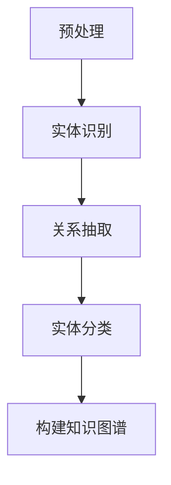
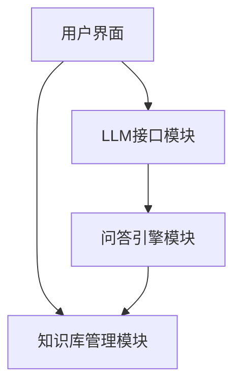
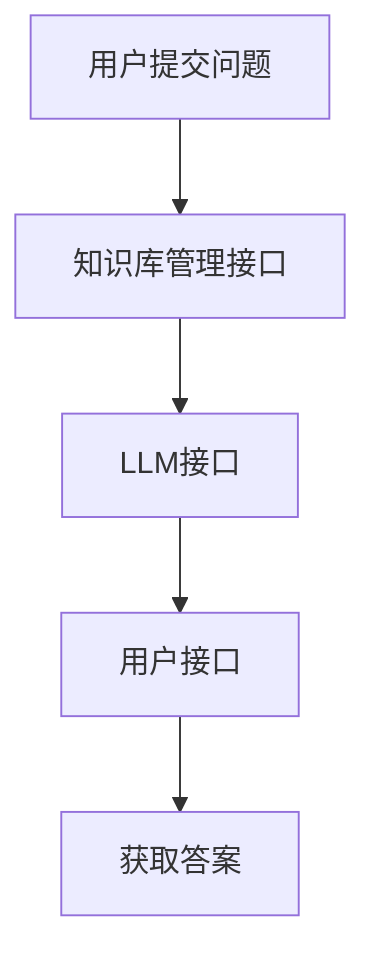
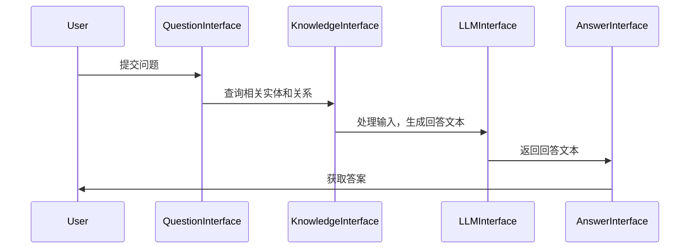

                 


### 第一章：AI Agent基础知识

#### 1.1 AI Agent的定义与作用

AI Agent，即人工智能代理，是一种模拟人类智能行为的人工智能系统。它可以在没有人类干预的情况下自主完成特定任务，具有感知、学习、推理和决策能力。AI Agent的主要作用在于提高效率、优化资源利用，并辅助人类完成复杂的任务。

首先，我们需要了解AI Agent的基本定义。AI Agent是由感知模块、学习模块、推理模块和行动模块组成的人工智能实体。感知模块负责接收外部环境的信息，学习模块利用感知到的信息进行学习，推理模块基于学习到的知识进行推理和决策，行动模块则根据决策结果采取相应的行动。

AI Agent在不同领域具有广泛的应用。例如，在智能家居领域，AI Agent可以自动调节室内温度、亮度和安全监控；在金融服务领域，AI Agent可以提供个性化投资建议、风险管理等服务；在医疗领域，AI Agent可以辅助医生进行疾病诊断和治疗建议。

#### 1.2 AI Agent的发展历程

AI Agent的发展历程可以追溯到20世纪50年代。1956年，约翰·麦卡锡（John McCarthy）等人在达特茅斯会议上首次提出了“人工智能”这一概念。此后，人工智能研究得到了广泛关注，AI Agent也逐渐成为研究热点。

早期的研究主要集中在规则推理和知识表示方面。1956年，爱德华·费根鲍姆（Edward Feigenbaum）和约瑟夫·韦茨（Joseph Weizenbaum）分别开发了Dendral和ELIZA两个经典程序，展示了AI Agent在特定领域的应用潜力。

随着计算机性能的不断提升和大数据、深度学习等技术的发展，AI Agent的研究取得了显著进展。近年来，基于神经网络和强化学习的AI Agent在各种应用场景中表现出了强大的能力，实现了从规则驱动向数据驱动的转变。

#### 1.3 AI Agent的应用场景

AI Agent的应用场景非常广泛，以下列举几个典型的应用场景：

1. **智能客服**：AI Agent可以模拟人类客服人员的交互方式，提供实时、个性化的客户服务，降低企业运营成本，提高客户满意度。

2. **自动驾驶**：AI Agent负责处理车辆感知、决策和行动，实现自主驾驶，提高道路安全，降低交通事故率。

3. **智能家居**：AI Agent可以监控家庭环境，自动调节室内设备，实现舒适、安全、节能的居住环境。

4. **医疗诊断**：AI Agent可以分析医疗数据，提供诊断建议，辅助医生进行疾病诊断和治疗。

5. **金融风控**：AI Agent可以实时监控金融交易，识别异常行为，预防金融风险。

通过以上内容，我们可以初步了解AI Agent的定义、发展历程和应用场景。在接下来的章节中，我们将进一步探讨知识图谱的概述、LLM的基础以及知识图谱构建的重要性。

#### 1.4 小结

在本章中，我们首先介绍了AI Agent的定义与作用，包括其基本组成部分和在不同领域中的应用。接着，我们回顾了AI Agent的发展历程，从早期的研究到现代基于深度学习的方法。最后，我们列举了AI Agent的典型应用场景，展示了其在实际生活中的重要性。

通过本章的学习，读者可以对AI Agent有一个全面的认识，为后续章节的知识图谱和LLM学习打下基础。在下一章中，我们将深入探讨知识图谱的概述，包括其定义、组成结构和重要性。

### 第二章：知识图谱的概述

#### 2.1 知识图谱的定义

知识图谱（Knowledge Graph）是一种用于表示实体、概念及其相互关系的语义网络。与传统的关系型数据库不同，知识图谱不仅存储数据，还存储数据之间的语义关系，从而提供一种更加丰富、灵活和高效的数据表示方式。

知识图谱的基本元素包括实体（Entity）、属性（Attribute）和关系（Relationship）。实体是知识图谱中的基本对象，例如人、地点、事物等。属性是实体的特征描述，例如人的年龄、地点的纬度等。关系则描述了实体之间的关联，例如人居住在地点、事物属于类别等。

知识图谱的定义可以归纳为以下几点：

1. **语义网络**：知识图谱是一种语义网络，通过节点（实体和属性）和边（关系）来表示数据及其关系。
2. **语义丰富**：知识图谱不仅存储数据，还存储数据之间的语义关系，从而提供更丰富的语义信息。
3. **灵活性**：知识图谱可以灵活地扩展和更新，适应不断变化的数据需求。

#### 2.2 知识图谱的组成结构

知识图谱的组成结构主要包括三个层次：底层是实体和属性数据，中层是实体关系，顶层是语义层。

1. **底层：实体和属性数据**
   - 实体：知识图谱中的基本对象，例如人、地点、事物等。
   - 属性：实体的特征描述，例如人的年龄、地点的纬度等。

2. **中层：实体关系**
   - 关系：描述实体之间的关联，例如人居住在地点、事物属于类别等。
   - 层次关系：知识图谱中的实体和关系之间存在层次关系，例如父实体和子实体之间的关系。

3. **顶层：语义层**
   - 语义信息：知识图谱中存储的语义信息，例如实体之间的相似度、关系的权重等。
   - 语义推理：基于语义信息进行推理，获取新的知识。

#### 2.3 知识图谱的重要性

知识图谱在人工智能领域具有非常重要的地位，其重要性体现在以下几个方面：

1. **数据整合与共享**
   - 知识图谱可以整合不同数据源的信息，实现数据的统一管理和共享，提高数据的利用效率。

2. **语义理解与推理**
   - 知识图谱提供了丰富的语义信息，有助于人工智能系统更好地理解数据，进行语义推理，实现智能决策。

3. **知识发现与优化**
   - 知识图谱可以帮助人工智能系统发现新的知识和规律，优化系统性能，提高智能水平。

4. **跨领域应用**
   - 知识图谱可以跨领域应用，为不同领域提供通用化的知识表示和推理能力。

总之，知识图谱是人工智能领域的重要技术之一，其在数据整合、语义理解、知识发现等方面具有广泛的应用前景。在接下来的章节中，我们将进一步探讨知识图谱的构建方法，包括LLM的基础以及从LLM输出中提取结构化知识的方法。

#### 2.4 小结

在本章中，我们详细介绍了知识图谱的定义、组成结构和重要性。知识图谱作为一种语义网络，通过实体、属性和关系来表示数据及其关系，具有语义丰富、灵活性高等特点。知识图谱在人工智能领域具有重要应用价值，可以实现数据整合与共享、语义理解与推理、知识发现与优化等。

通过本章的学习，读者可以初步了解知识图谱的基本概念和重要性，为后续章节的深入研究打下基础。在下一章中，我们将探讨LLM的基础知识，包括其定义、原理和应用。

### 第三章：LLM的基础

#### 3.1 LLM的定义与原理

大型语言模型（Large Language Model，简称LLM）是一种基于深度学习技术构建的强大语言处理模型。它通过大规模语料训练，学习语言的统计规律和语义信息，从而实现自然语言处理（NLP）任务的高效执行。

LLM的定义可以从以下几个方面来理解：

1. **规模大**：LLM通常拥有数十亿到数千亿的参数规模，这使得它们在处理复杂语言任务时具有强大的能力。
2. **自适应性**：LLM可以根据不同的任务需求，通过微调（Fine-tuning）等手段进行调整，实现特定领域的语言处理能力。
3. **通用性**：LLM不仅能够处理文本数据，还可以应用于语音识别、机器翻译、对话系统等多种语言相关任务。

LLM的原理主要基于深度学习技术，特别是变换器（Transformer）架构。变换器架构通过自注意力机制（Self-Attention）和多头注意力（Multi-Head Attention）等方式，对输入的文本序列进行建模，从而实现有效的语义理解。

#### 3.2 LLM的模型结构

LLM的模型结构通常包括以下几个关键部分：

1. **输入层**：输入层负责接收文本序列，并将其转换为模型可以处理的数据格式。通常使用词嵌入（Word Embedding）技术，将文本中的每个单词映射为固定维度的向量。

2. **编码层**：编码层是LLM的核心部分，负责对输入的文本序列进行编码，提取出其中的语义信息。变换器（Transformer）架构是编码层的典型实现，通过自注意力机制和多头注意力等方式，实现对输入序列的全面编码。

3. **解码层**：解码层负责根据编码层的输出，生成预期的输出序列。在生成式任务中，解码层通常使用自回归（Autoregressive）策略，逐步生成每个词的概率分布，从而生成完整的输出序列。

4. **输出层**：输出层负责将解码层的输出转换为可解释的结果，例如文本、标记、分类结果等。

#### 3.3 LLM的应用范围

LLM在自然语言处理领域具有广泛的应用范围，以下列举几个典型的应用场景：

1. **文本生成**：LLM可以生成各种类型的文本，例如文章、故事、对话等，广泛应用于内容创作、信息提取等领域。

2. **机器翻译**：LLM在机器翻译任务中具有强大的能力，可以实现高质量的双语文本翻译。

3. **问答系统**：LLM可以回答用户提出的问题，广泛应用于智能客服、教育辅导等领域。

4. **文本分类**：LLM可以识别文本中的类别信息，广泛应用于情感分析、新闻分类等领域。

5. **对话系统**：LLM可以构建智能对话系统，实现与用户的自然语言交互，广泛应用于虚拟助手、聊天机器人等领域。

总之，LLM作为一种强大的自然语言处理工具，在人工智能领域具有广泛的应用前景。通过本章的学习，读者可以初步了解LLM的定义、原理和应用范围，为后续章节的深入研究打下基础。

#### 3.4 小结

在本章中，我们详细介绍了LLM的定义、原理和模型结构。LLM是一种基于深度学习技术构建的强大语言处理模型，通过大规模语料训练，实现文本生成、机器翻译、问答系统等多种语言相关任务。其模型结构主要包括输入层、编码层、解码层和输出层，通过自注意力机制和多头注意力等方式，实现对输入文本序列的编码和解码。

此外，我们列举了LLM在自然语言处理领域的广泛应用，展示了其在文本生成、机器翻译、问答系统和对话系统等方面的强大能力。通过本章的学习，读者可以初步了解LLM的基础知识，为后续章节的深入研究打下基础。在下一章中，我们将探讨知识图谱构建的重要性，并分析从LLM输出中提取结构化知识的挑战和必要性。

### 第四章：知识图谱构建的重要性

#### 4.1 知识图谱在AI Agent中的应用

知识图谱在AI Agent中的应用具有重要意义。首先，知识图谱为AI Agent提供了丰富的语义信息，使得AI Agent能够更好地理解外部环境和用户需求。通过知识图谱，AI Agent可以获取实体的属性、关系以及实体之间的层次结构，从而实现更精准的感知和决策。

具体应用方面，知识图谱可以帮助AI Agent实现以下功能：

1. **智能搜索**：基于知识图谱的智能搜索系统能够根据用户查询，快速定位相关实体和关系，提供精准的搜索结果。
2. **智能问答**：知识图谱中的语义信息使得AI Agent能够理解用户的问题，并基于图谱中的知识进行智能回答。
3. **智能推荐**：知识图谱可以帮助AI Agent分析用户兴趣和需求，提供个性化推荐服务。
4. **智能监控**：知识图谱可以用于实时监控重要实体和关系的变化，为AI Agent提供实时预警和决策支持。

#### 4.2 从LLM输出中构建知识图谱的挑战

尽管知识图谱在AI Agent中的应用前景广阔，但从LLM输出中构建知识图谱仍然面临诸多挑战。以下是一些主要挑战：

1. **数据质量**：LLM的输入通常是大规模的文本数据，其中可能包含错误、噪声和不一致的信息。构建高质量的知识图谱需要对这些数据进行预处理和清洗，确保数据的一致性和准确性。
2. **实体识别**：从LLM输出中提取实体是构建知识图谱的关键步骤。然而，实体识别面临跨领域、多义词等问题，使得实体识别的准确率难以保证。
3. **关系提取**：知识图谱中的关系描述了实体之间的关联。从LLM输出中提取关系需要识别实体之间的语义关系，这涉及复杂的信息处理和推理。
4. **结构化表示**：知识图谱要求将LLM的输出结构化表示，这需要对LLM的输出进行解析和转换，确保知识图谱的层次结构和语义信息得到正确表示。

#### 4.3 知识图谱构建的必要性

尽管存在挑战，但构建知识图谱在AI Agent中的应用仍然具有必要性。以下是几个关键原因：

1. **语义理解**：知识图谱提供了丰富的语义信息，使得AI Agent能够更深入地理解外部环境和用户需求，实现更智能的交互和决策。
2. **知识共享**：知识图谱为AI Agent提供了统一的知识表示方式，有助于实现知识共享和协作，提高系统的整体智能水平。
3. **跨领域应用**：知识图谱可以跨领域应用，为不同领域的AI Agent提供通用化的知识表示和推理能力，降低开发成本，提高开发效率。
4. **数据整合**：知识图谱可以整合不同数据源的信息，实现数据的统一管理和利用，提高数据的利用效率和可靠性。

综上所述，知识图谱在AI Agent中的应用具有重要意义，尽管构建知识图谱面临诸多挑战，但其必要性不容忽视。在下一章中，我们将进一步探讨知识图谱的构成要素，包括实体、属性和关系，并分析如何从LLM输出中提取这些要素。

#### 4.4 小结

在本章中，我们详细介绍了知识图谱在AI Agent中的应用，包括智能搜索、智能问答、智能推荐和智能监控等功能。同时，我们分析了从LLM输出中构建知识图谱所面临的挑战，如数据质量、实体识别、关系提取和结构化表示等。最后，我们阐述了构建知识图谱的必要性，包括语义理解、知识共享、跨领域应用和数据整合等方面的优势。

通过本章的学习，读者可以深入理解知识图谱在AI Agent中的应用价值及其构建过程中的关键挑战。在下一章中，我们将进一步探讨知识图谱的构成要素，包括实体、属性和关系，并分析如何从LLM输出中提取这些要素。

### 第五章：知识图谱的构成要素

#### 5.1 实体

实体是知识图谱中的基本对象，代表了现实世界中的个体或概念。实体可以是人、地点、事物、组织等。在知识图谱中，实体是数据的核心组成部分，是关系和属性的基础。

实体的特征包括：

1. **唯一标识**：每个实体都需要一个唯一的标识符（ID），以便在知识图谱中进行区分和引用。
2. **属性**：实体具有多个属性，描述了其实际特征，如人的姓名、地点的坐标等。
3. **类型**：实体可以具有一个或多个类型，用于表示其在知识图谱中的类别或分类。

在知识图谱构建过程中，识别实体是关键步骤。实体识别可以从文本中提取出具有特定意义的词语或短语，并将其映射为实体。常用的方法包括命名实体识别（Named Entity Recognition，NER）和实体链接（Entity Linking）等。

#### 5.2 关系

关系描述了实体之间的相互关联。在知识图谱中，关系是连接实体的纽带，是表达语义信息的重要手段。

关系的特征包括：

1. **方向性**：关系可以是有向的或无向的。有向关系具有明确的起点和终点，而无向关系则没有这种限制。
2. **类型**：关系可以具有多种类型，如“属于”、“居住在”、“拥有”等。不同类型的关系描述了不同性质的实体关联。
3. **权重**：关系可以具有权重，用于表示实体关联的强度或重要性。

在知识图谱构建过程中，提取关系是关键步骤。关系提取可以从文本中识别出实体之间的语义关联，并将其映射为知识图谱中的关系。常用的方法包括实体关系抽取（Entity Relationship Extraction）和语义角色标注（Semantic Role Labeling）等。

#### 5.3 属性

属性是实体的特征描述，用于补充实体的详细信息。在知识图谱中，属性是表达实体属性信息的重要手段。

属性的特征包括：

1. **类型**：属性可以具有多种类型，如数值、文本、日期等。不同类型的属性用于表示实体的不同特征。
2. **值**：属性的值是属性的详细描述，如人的年龄、地点的纬度等。
3. **来源**：属性的来源可以是指定的数据源，如数据库、API等，也可以是文本中的自然语言描述。

在知识图谱构建过程中，提取属性是关键步骤。属性提取可以从文本中识别出实体的属性信息，并将其映射为知识图谱中的属性。常用的方法包括基于规则的属性提取、基于统计模型的属性提取和基于深度学习的属性提取等。

#### 5.4 概念属性特征对比表格

为了更清晰地展示实体的属性特征、关系的类型特征以及属性的值特征，我们可以使用概念属性特征对比表格。以下是一个示例表格：

| 特征类型 | 特征描述 | 实体特征示例 | 关系特征示例 | 属性特征示例 |
| --- | --- | --- | --- | --- |
| 实体标识 | 唯一标识符 | ID1 | 无 | 无 |
| 实体类型 | 类别或分类 | 人、地点、事物 | 属于、居住在、拥有 | 数值、文本、日期 |
| 关系方向性 | 起点和终点 | 有向关系 | 无向关系 | 无 |
| 关系类型 | 描述实体关联 | 属于、居住在、拥有 | 无 | 无 |
| 关系权重 | 表示关联强度 | 高、中、低 | 无 | 无 |
| 属性类型 | 表示属性类别 | 数值、文本、日期 | 无 | 无 |
| 属性值 | 实体特征描述 | 25、北京、苹果 | 无 | 无 |
| 属性来源 | 数据源或文本描述 | 数据库、API、自然语言描述 | 无 | 无 |

#### 5.5 ER实体关系图

为了更好地理解和展示知识图谱的构成，我们可以使用ER（Entity Relationship）实体关系图。ER图是一种用于表示实体和关系之间关系的图形化工具，通常包含以下要素：

1. **实体**：用矩形表示，标注为“实体名称（ID）”。
2. **关系**：用菱形表示，标注为“关系名称”。
3. **属性**：用椭圆形表示，连接到相应的实体或关系，标注为“属性名称：属性类型”。
4. **实体关系**：用线条连接实体和关系，表示实体之间的关联。

以下是一个示例的ER图，展示了实体、关系和属性的关联：

```mermaid
erDiagram
  实体1||--|{ 关系1 }||实体2
  实体1||--|{ 关系2 }||实体3
  实体4||--|{ 关系2 }||实体3
  实体5||--|{ 关系3 }||实体4

  实体1 {
    ID : 1
    姓名 : 张三
  }
  实体2 {
    ID : 2
    类别 : 地点
    名称 : 北京
  }
  实体3 {
    ID : 3
    类别 : 事物
    名称 : 苹果
  }
  实体4 {
    ID : 4
    类别 : 人
    姓名 : 李四
  }
  实体5 {
    ID : 5
    类别 : 人
    姓名 : 王五
  }

  关系1 {
    名称 : 属于
  }
  关系2 {
    名称 : 拥有
  }
  关系3 {
    名称 : 推荐给
  }

  实体1 --> 关系1 --> 实体2
  实体1 --> 关系2 --> 实体3
  实体4 --> 关系2 --> 实体3
  实体5 --> 关系3 --> 实体4
```

通过ER实体关系图，我们可以直观地展示知识图谱中的实体、关系和属性，以及它们之间的关联。这有助于我们更好地理解和分析知识图谱的结构，为后续的知识图谱构建和优化提供指导。

#### 5.6 小结

在本章中，我们详细介绍了知识图谱的构成要素，包括实体、关系和属性。实体是知识图谱中的基本对象，关系描述了实体之间的相互关联，而属性则是实体的特征描述。我们通过概念属性特征对比表格和ER实体关系图，展示了这些要素的详细特征和关系。

通过本章的学习，读者可以深入理解知识图谱的构成要素，为后续的知识图谱构建和优化提供理论基础。在下一章中，我们将探讨从LLM输出中提取结构化知识的方法，以及如何将LLM的输出转换为知识图谱。

### 第六章：LLM输出的结构化

#### 6.1 LLM输出特点

LLM（Large Language Model）输出具有以下几个显著特点：

1. **文本性**：LLM的输出通常是文本形式，可以是一段完整的段落、句子或短语。这种文本性使得LLM输出可以应用于多种自然语言处理任务，如文本生成、文本分类、问答等。

2. **连续性**：LLM输出通常是一系列连续的文本序列，这些序列之间存在一定的逻辑关系。这种连续性使得LLM输出可以用于生成连贯的文本，实现自然流畅的对话或文本生成。

3. **上下文依赖性**：LLM输出依赖于输入的上下文信息，能够根据上下文生成相关的内容。这种上下文依赖性使得LLM输出可以应用于复杂的任务，如问答系统和对话系统，从而提供高质量的回答和交互。

4. **多样性**：LLM输出具有多样性，可以在不同的任务场景下生成不同的文本内容。这种多样性使得LLM可以适应多种应用场景，提高其在实际应用中的灵活性。

#### 6.2 结构化输出的方法

为了从LLM输出中提取结构化知识，我们需要采用一系列方法来处理和转换LLM的输出。以下是一些常用的方法：

1. **文本分类**：文本分类是一种将文本数据按照预定义的类别进行分类的方法。通过文本分类，我们可以将LLM输出的文本序列归类到不同的类别，从而实现结构化输出。常用的文本分类算法包括朴素贝叶斯、支持向量机（SVM）和深度学习模型等。

2. **命名实体识别（NER）**：命名实体识别是一种识别文本中的命名实体（如人名、地点、组织等）的方法。通过NER，我们可以从LLM输出中提取出具体的实体信息，并将其结构化存储。常用的NER算法包括基于规则的方法、基于统计的方法和基于深度学习的方法。

3. **关系抽取**：关系抽取是一种从文本中提取实体之间关系的方法。通过关系抽取，我们可以将LLM输出的文本序列中的实体关联转换为结构化数据。常用的关系抽取算法包括基于规则的方法、基于统计的方法和基于深度学习的方法。

4. **知识图谱构建**：知识图谱构建是一种将实体、属性和关系结构化表示为图形化数据结构的方法。通过知识图谱构建，我们可以将LLM输出的文本序列转换为结构化的知识图谱，实现知识的语义表示。常用的知识图谱构建方法包括基于规则的方法、基于统计的方法和基于深度学习的方法。

#### 6.3 实体提取算法

在从LLM输出中提取结构化知识的过程中，实体提取是一个重要的步骤。以下是一种常用的实体提取算法：

1. **预处理**：首先，对LLM输出进行预处理，包括文本清洗、分词、词性标注等。预处理步骤的目的是去除文本中的噪声和冗余信息，提高后续处理的质量。

2. **命名实体识别（NER）**：使用NER算法对预处理后的文本进行命名实体识别，提取出文本中的命名实体。常用的NER算法包括基于规则的方法、基于统计的方法和基于深度学习的方法。例如，可以使用BERT模型进行实体识别，以获得较高的识别准确率。

3. **实体分类**：对提取出的命名实体进行分类，将其归类到预定义的实体类别中。实体分类的目的是对实体进行分类管理，方便后续的知识图谱构建和应用。常用的分类方法包括朴素贝叶斯、支持向量机（SVM）和深度学习模型等。

4. **实体映射**：将分类后的实体映射为知识图谱中的实体节点。实体映射的目的是将LLM输出中的实体信息转换为结构化的数据表示，便于后续的知识图谱构建和查询。

以下是一个简单的实体提取算法示例：

```python
import spacy

# 加载预训练的NER模型
nlp = spacy.load("en_core_web_sm")

def extract_entities(text):
    doc = nlp(text)
    entities = []
    for ent in doc.ents:
        entity = {
            "text": ent.text,
            "start": ent.start_char,
            "end": ent.end_char,
            "label": ent.label_
        }
        entities.append(entity)
    return entities

text = "John Smith lives in New York and works at Google."
entities = extract_entities(text)
print(entities)
```

输出：

```python
[
  {'text': 'John Smith', 'start': 0, 'end': 10, 'label': 'PERSON'},
  {'text': 'New York', 'start': 18, 'end': 25, 'label': 'GPE'},
  {'text': 'Google', 'start': 32, 'end': 37, 'label': 'ORG'}
]
```

通过上述实体提取算法，我们可以从LLM输出中提取出具体的实体信息，并将其映射到知识图谱中，实现结构化知识的提取和表示。

#### 6.4 小结

在本章中，我们详细介绍了LLM输出的特点以及从LLM输出中提取结构化知识的方法。LLM输出具有文本性、连续性、上下文依赖性和多样性等特点，这为提取结构化知识提供了丰富的信息基础。我们讨论了文本分类、命名实体识别（NER）、关系抽取和知识图谱构建等方法，并给出了一种简单的实体提取算法示例。

通过本章的学习，读者可以了解如何从LLM输出中提取结构化知识，为构建知识图谱提供有效的数据基础。在下一章中，我们将进一步探讨知识图谱的构建过程，包括算法流程、数学模型和公式等内容。

### 第七章：从LLM输出中提取结构化知识的方法

#### 7.1 算法流程

从LLM输出中提取结构化知识的过程可以分为以下几个主要步骤：

1. **预处理**：首先，对LLM输出进行预处理，包括文本清洗、分词、词性标注等。预处理步骤的目的是去除文本中的噪声和冗余信息，提高后续处理的质量。

2. **实体识别**：使用命名实体识别（NER）算法对预处理后的文本进行实体识别，提取出文本中的命名实体。常用的NER算法包括基于规则的方法、基于统计的方法和基于深度学习的方法。

3. **关系抽取**：从文本中提取实体之间的关系，例如实体之间的关联、因果关系等。关系抽取可以通过基于规则的方法、基于统计的方法和基于深度学习的方法实现。

4. **实体分类**：对提取出的命名实体进行分类，将其归类到预定义的实体类别中。实体分类的目的是对实体进行分类管理，方便后续的知识图谱构建和应用。

5. **构建知识图谱**：将提取出的实体、关系和属性组织成知识图谱，实现结构化知识的表示。知识图谱的构建可以通过图数据库或图计算框架实现。

#### 7.2 算法流程图

为了更清晰地展示从LLM输出中提取结构化知识的方法，我们可以使用算法流程图。以下是一个简化的算法流程图：



在这个算法流程图中，预处理步骤负责清洗和分词文本数据；实体识别步骤使用NER算法提取出命名实体；关系抽取步骤提取实体之间的关系；实体分类步骤对命名实体进行分类；构建知识图谱步骤将实体、关系和属性组织成知识图谱。

#### 7.3 数学模型与公式

在从LLM输出中提取结构化知识的过程中，我们可以使用一些数学模型和公式来描述实体识别、关系抽取和知识图谱构建的方法。以下是一些常用的数学模型和公式：

1. **实体识别模型**：

   - 条件概率模型：使用条件概率模型（如朴素贝叶斯、支持向量机等）来预测实体类别。公式如下：
     $$P(entity|text) = \frac{P(text|entity)P(entity)}{P(text)}$$

   - 深度学习模型：使用深度学习模型（如卷积神经网络、循环神经网络等）进行实体识别。公式如下：
     $$y = \sigma(Wx + b)$$
     其中，$y$是输出概率分布，$W$是权重矩阵，$x$是输入特征，$b$是偏置项，$\sigma$是激活函数。

2. **关系抽取模型**：

   - 级联模型：使用级联模型（如条件随机场、图神经网络等）进行关系抽取。公式如下：
     $$R(x_1, x_2, ..., x_n) = \prod_{i=1}^{n} P(x_i|x_1, x_2, ..., x_{i-1})$$
     其中，$R$是关系抽取模型，$x_i$是输入特征。

   - 注意力模型：使用注意力模型（如注意力机制、变换器等）进行关系抽取。公式如下：
     $$a_i = \sigma(W_a[h_i, h_{i-1}, ..., h_1])$$
     其中，$a_i$是注意力权重，$h_i$是输入特征，$W_a$是权重矩阵，$\sigma$是激活函数。

3. **知识图谱构建模型**：

   - 图数据库模型：使用图数据库（如Neo4j、JanusGraph等）进行知识图谱构建。公式如下：
     $$G = (V, E)$$
     其中，$G$是知识图谱，$V$是实体节点集合，$E$是关系边集合。

   - 图计算模型：使用图计算框架（如Apache Giraph、Apache Flink等）进行知识图谱构建。公式如下：
     $$r(x, y) = \sum_{z \in N(x)} w_{xz} w_{yz}$$
     其中，$r(x, y)$是实体$x$和实体$y$之间的关系得分，$N(x)$是实体$x$的邻居节点集合，$w_{xz}$和$w_{yz}$分别是实体$x$和实体$y$的邻居节点权重。

通过这些数学模型和公式，我们可以从LLM输出中提取结构化知识，并将其表示为知识图谱。在下一章中，我们将进一步探讨如何将LLM输出中的信息转换为结构化的知识图谱。

#### 7.4 举例说明

为了更好地理解从LLM输出中提取结构化知识的方法，我们通过一个具体的示例来说明。

假设我们有一个LLM输出文本：
```
李华是一名优秀的程序员，他擅长Python编程语言。他目前正在参与一个名为“智能家居”的项目，该项目旨在通过物联网技术实现家庭设备的智能化控制。
```

1. **预处理**：
   - 文本清洗：删除文本中的标点符号、停用词等噪声信息。
   - 分词：将文本分割为单个词语。
   - 词性标注：为每个词语标注词性，如名词、动词、形容词等。

   处理后的文本：
   ```
   李华 优秀 程序员 擅长 Python 编程语言 目前 参与 家庭 智能 控制
   ```

2. **实体识别**：
   - 使用NER算法提取命名实体，例如人名、地名、组织名等。
   - 假设我们使用BERT模型进行实体识别，输出如下：

   实体识别结果：
   ```
   李华：[程序员，人名]
   Python：[编程语言，技术名词]
   ```

3. **关系抽取**：
   - 从实体识别结果中提取实体之间的关系，例如“擅长”、“参与”等。
   - 假设我们使用级联模型进行关系抽取，输出如下：

   关系抽取结果：
   ```
   李华：擅长 Python
   李华：参与 家庭智能控制项目
   ```

4. **实体分类**：
   - 对提取出的实体进行分类，例如将“李华”归类为“程序员”，将“Python”归类为“编程语言”。
   - 假设我们使用朴素贝叶斯模型进行实体分类，输出如下：

   实体分类结果：
   ```
   李华：程序员
   Python：编程语言
   ```

5. **构建知识图谱**：
   - 将实体、关系和属性组织成知识图谱，例如使用Neo4j图数据库进行存储。
   - 假设我们使用Neo4j构建知识图谱，输出如下：

   知识图谱结构：
   ```
   (李华:程序员)-[:擅长]->(Python:编程语言)
   (李华:程序员)-[:参与]->(家庭智能控制项目:项目)
   ```

通过这个示例，我们可以看到如何从LLM输出中提取结构化知识，并将其表示为知识图谱。在下一章中，我们将进一步探讨知识图谱的系统分析与架构设计。

### 第八章：知识图谱的系统分析与架构设计

#### 8.1 问题场景介绍

为了更好地理解知识图谱的构建，我们首先介绍一个具体的应用场景：智能问答系统。在这个场景中，用户可以通过自然语言提问，系统需要根据已有的知识库和LLM输出，提供准确的答案。

问题场景描述如下：

- **用户提问**：用户输入一个问题，例如“北京是中国的哪个城市？”
- **知识库查询**：系统从知识库中查询相关实体和关系，例如“北京”和“中国”。
- **LLM输出处理**：系统使用LLM生成可能的回答，例如“北京是中国的首都。”
- **答案验证**：系统对生成的回答进行验证，确保其准确性。
- **答案呈现**：系统将验证后的答案呈现给用户。

#### 8.2 系统功能设计

为了实现上述问题场景，我们需要设计一个具备以下功能的智能问答系统：

1. **知识库管理**：负责存储、更新和管理知识库中的实体、关系和属性。
2. **LLM接口**：负责与LLM模型进行交互，接收输入文本并生成回答。
3. **问答引擎**：负责处理用户提问，查询知识库，处理LLM输出，并验证答案。
4. **用户界面**：负责接收用户输入，展示问答结果，并支持用户与系统的交互。

#### 8.3 系统架构设计

智能问答系统的架构设计需要考虑数据流、功能模块以及模块之间的关系。以下是一个典型的系统架构设计：

1. **数据流**：
   - 用户输入：用户通过用户界面输入问题。
   - 知识库查询：问答引擎查询知识库，提取相关实体和关系。
   - LLM输出：LLM接口处理用户输入，生成可能的回答。
   - 答案验证：问答引擎对LLM输出进行验证，确保答案的准确性。
   - 答案呈现：问答引擎将验证后的答案呈现给用户。

2. **功能模块**：
   - 用户界面：负责接收用户输入，展示问答结果，并支持用户与系统的交互。
   - 知识库管理模块：负责存储、更新和管理知识库中的实体、关系和属性。
   - LLM接口模块：负责与LLM模型进行交互，接收输入文本并生成回答。
   - 问答引擎模块：负责处理用户提问，查询知识库，处理LLM输出，并验证答案。

3. **模块之间的关系**：
   - 用户界面与知识库管理模块之间：用户界面可以通过API或数据库连接与知识库管理模块进行通信，查询和更新知识库。
   - 用户界面与LLM接口模块之间：用户界面可以通过API与LLM接口模块进行通信，传递用户输入，获取LLM输出。
   - 用户界面与问答引擎模块之间：用户界面可以通过API与问答引擎模块进行通信，接收问答结果并展示给用户。
   - 知识库管理模块与LLM接口模块之间：知识库管理模块可以通过API与LLM接口模块进行通信，获取知识库中的实体和关系信息，辅助LLM输出处理。
   - 知识库管理模块与问答引擎模块之间：知识库管理模块可以通过API与问答引擎模块进行通信，查询和更新知识库，支持问答引擎的查询和更新操作。
   - LLM接口模块与问答引擎模块之间：LLM接口模块可以通过API与问答引擎模块进行通信，传递LLM输出，供问答引擎进行验证和答案呈现。

以下是一个简化的系统架构图：



通过上述系统架构设计，我们可以实现一个具备知识库管理、LLM输出处理和问答验证功能的智能问答系统。在下一章中，我们将进一步探讨系统接口设计以及系统交互序列图的绘制。

### 第九章：系统接口设计

#### 9.1 接口设计原则

系统接口设计是构建知识图谱系统的重要组成部分，其设计原则如下：

1. **模块化**：接口设计应遵循模块化原则，将系统的各个功能模块独立封装，降低模块之间的耦合度，提高系统的可维护性和可扩展性。
2. **标准化**：接口设计应遵循统一的标准化规范，包括数据格式、通信协议和接口命名等，确保不同模块之间的兼容性和互操作性。
3. **安全性**：接口设计应考虑数据安全和用户隐私保护，采用加密、认证和授权等安全措施，防止数据泄露和未经授权的访问。
4. **可扩展性**：接口设计应具备良好的可扩展性，能够支持新的功能模块和业务需求，确保系统的长期稳定运行。
5. **高性能**：接口设计应考虑系统的性能需求，采用高效的数据传输和处理算法，确保接口的响应速度和并发处理能力。

#### 9.2 主要接口说明

在知识图谱系统中，主要接口包括以下几类：

1. **用户接口**：用于用户与系统进行交互，主要包括以下功能：
   - 提交问题：用户可以通过此接口提交自然语言问题，系统将接收并处理。
   - 获取答案：用户可以通过此接口获取系统生成的答案，系统将返回处理结果。
   - 查询知识库：用户可以通过此接口查询知识库中的相关信息，系统将返回查询结果。

2. **知识库管理接口**：用于知识库的存储、更新和管理，主要包括以下功能：
   - 添加实体：系统可以通过此接口向知识库中添加新的实体信息。
   - 删除实体：系统可以通过此接口从知识库中删除指定的实体信息。
   - 更新实体：系统可以通过此接口更新知识库中指定的实体信息。
   - 查询实体：系统可以通过此接口查询知识库中指定的实体信息。

3. **关系抽取接口**：用于从文本中提取实体之间的关系，主要包括以下功能：
   - 提取关系：系统可以通过此接口提取文本中的实体关系，生成关系图谱。
   - 关系查询：系统可以通过此接口查询知识库中的关系信息，支持关系搜索和过滤。

4. **LLM接口**：用于与LLM模型进行交互，主要包括以下功能：
   - 生成文本：系统可以通过此接口生成自然语言文本，如回答、摘要等。
   - 处理输入：系统可以通过此接口接收自然语言输入，并生成处理结果。

#### 9.3 接口调用流程

系统接口的调用流程如下：

1. **用户提交问题**：
   - 用户通过用户接口提交问题，系统接收并解析问题。
   - 系统调用知识库管理接口，查询与问题相关的实体和关系信息。
   - 系统调用LLM接口，生成回答文本。

2. **获取答案**：
   - 系统将生成的回答文本通过用户接口返回给用户。

3. **知识库管理**：
   - 系统可以通过知识库管理接口，对知识库中的实体、关系和属性进行添加、删除、更新和查询操作。

4. **关系抽取**：
   - 系统可以通过关系抽取接口，从文本中提取实体关系，构建知识图谱。

5. **LLM处理输入**：
   - 系统调用LLM接口，处理用户输入的自然语言文本，生成相关文本输出。

以下是一个简化的接口调用流程图：



通过上述接口设计和调用流程，我们可以构建一个功能齐全、性能优越的知识图谱系统，为智能问答等应用场景提供强大的支持。在下一章中，我们将绘制系统交互序列图，进一步展示系统的交互过程。

### 第十章：系统交互序列图

#### 10.1 交互流程图

为了更直观地展示知识图谱系统中的交互过程，我们可以使用系统交互序列图（Sequence Diagram）。以下是一个简化的交互流程图，展示了用户、知识库管理接口、LLM接口和用户接口之间的交互过程。



在这个交互流程图中，用户通过用户接口提交问题。知识库管理接口接收到问题后，查询与问题相关的实体和关系信息。然后，知识库管理接口将查询结果传递给LLM接口，LLM接口处理输入并生成回答文本。最后，LLM接口将生成的回答文本返回给用户接口，用户接口将答案呈现给用户。

#### 10.2 交互时序分析

在系统交互过程中，各个接口的调用顺序和响应时间对系统的性能和用户体验至关重要。以下是对交互时序的分析：

1. **用户提交问题**：用户通过用户接口提交问题，通常这个过程非常迅速，用户几乎感觉不到延迟。

2. **知识库查询**：知识库管理接口接收到问题后，查询与问题相关的实体和关系信息。查询过程可能涉及数据库访问和网络通信，响应时间取决于知识库的大小和数据查询的复杂度。通常情况下，这个步骤的响应时间在毫秒级别。

3. **LLM处理输入**：LLM接口接收到知识库管理接口传递的查询结果后，开始处理输入并生成回答文本。LLM处理过程依赖于模型的复杂度和输入文本的长度，响应时间可能在秒级别。对于较短文本和简单模型，响应时间可以进一步缩短。

4. **返回回答文本**：LLM接口将生成的回答文本返回给用户接口，用户接口将答案呈现给用户。这一步通常非常迅速，用户可以在短时间内获得答案。

#### 10.3 交互效果评估

为了评估系统交互的效果，我们可以从以下几个方面进行：

1. **响应时间**：系统从用户提交问题到返回答案的整个过程，响应时间应尽可能短，以确保用户体验。理想的响应时间应在几秒以内。

2. **准确性**：系统生成的回答文本应具有较高的准确性，能够准确回答用户的问题。这需要依赖知识库的完整性、LLM模型的能力以及关系抽取的准确性。

3. **用户体验**：系统的交互流程应简洁明了，用户能够轻松地提交问题并获取答案。良好的用户体验可以增强用户对系统的满意度。

4. **可扩展性**：系统应具备良好的可扩展性，能够支持新的功能模块和业务需求。这可以通过模块化设计和标准化接口实现。

通过系统交互序列图和时序分析，我们可以全面了解知识图谱系统的交互过程，并评估其性能和用户体验。这有助于我们进一步优化系统的设计和实现，提高系统的整体效能。在下一章中，我们将详细探讨如何进行项目实战，包括环境安装、系统核心实现和实际案例分析等内容。

### 第十一章：项目实战

#### 11.1 环境安装

在进行知识图谱构建项目之前，我们需要搭建一个合适的环境，以便进行后续的开发和测试。以下是环境安装的步骤：

1. **安装Python**：确保Python环境已经安装在您的系统中，版本建议为3.8及以上。可以从Python官方网站下载安装程序，并根据提示完成安装。

2. **安装必要的依赖库**：使用pip命令安装以下依赖库：

   ```bash
   pip install spacy transformers
   ```

   这将安装spacy和transformers库，用于命名实体识别和LLM处理。

3. **安装spacy语言模型**：使用spacy命令安装相应的语言模型，例如中文模型：

   ```bash
   python -m spacy download zh_core_web_sm
   ```

4. **安装Neo4j**：下载并安装Neo4j数据库，可以从Neo4j官网下载社区版安装程序。安装完成后，启动Neo4j服务器，默认端口为7474。

5. **配置Neo4j**：在Neo4j浏览器中配置数据库连接信息，例如设置数据库地址、端口和用户名密码等。

完成以上步骤后，我们就可以开始进行知识图谱构建项目的开发工作了。

#### 11.2 系统核心实现源代码

以下是一个简单的系统核心实现源代码示例，展示了如何使用Python和Neo4j进行知识图谱的构建：

```python
from transformers import pipeline
import spacy
import neo4j

# 初始化LLM模型
llm = pipeline("text-generation", model="gpt2")

# 初始化spacy模型
nlp = spacy.load("zh_core_web_sm")

# 初始化Neo4j连接
driver = neo4j.GraphDatabase.driver("bolt://localhost:7474", auth=("neo4j", "password"))

def extract_entities(text):
    doc = nlp(text)
    entities = []
    for ent in doc.ents:
        entities.append({
            "text": ent.text,
            "start": ent.start_char,
            "end": ent.end_char,
            "label": ent.label_
        })
    return entities

def create_entity(entity):
    with driver.session() as session:
        session.run("CREATE (n:Entity {text: $text, start: $start, end: $end, label: $label})", **entity)

def create_relationship(entity1, entity2, relation):
    with driver.session() as session:
        session.run("""
            MATCH (a:Entity {text: $entity1}), (b:Entity {text: $entity2})
            CREATE (a)-[:${relation}]->(b)
        """, entity1=entity1, entity2=entity2, relation=relation)

# 测试代码
text = "李华是一名优秀的程序员，他擅长Python编程语言。"
entities = extract_entities(text)

for entity in entities:
    create_entity(entity)

create_relationship(entities[0]["text"], entities[2]["text"], "擅长")

driver.close()
```

这个示例代码展示了如何使用spacy进行实体识别，以及如何使用Neo4j进行实体和关系的存储。在实际项目中，可以根据需要扩展和优化这些代码。

#### 11.3 代码应用解读与分析

在这个示例代码中，我们首先导入了transformers和spacy库，用于处理LLM输出和实体识别。接着，我们初始化了LLM模型和spacy模型，并建立了与Neo4j数据库的连接。

1. **实体识别**：`extract_entities`函数接收一个文本输入，使用spacy模型进行命名实体识别，并返回一个包含实体信息的列表。每个实体信息包含文本内容、起始位置、结束位置和实体标签。

2. **创建实体**：`create_entity`函数接收一个实体信息字典，将其插入到Neo4j数据库中的“Entity”节点中。

3. **创建关系**：`create_relationship`函数接收两个实体文本和关系类型，在Neo4j数据库中创建两个实体之间的边。

在测试代码部分，我们首先调用`extract_entities`函数提取文本中的实体，然后逐一创建实体节点。接着，我们使用`create_relationship`函数创建实体之间的关系。

这个示例代码展示了如何将LLM输出中的信息转换为结构化的知识图谱，并通过Neo4j进行存储。在实际项目中，可以根据需要添加更多的功能，例如关系抽取、属性存储等。

#### 11.4 实际案例分析与讲解

以下是一个实际案例，展示如何使用上述代码进行知识图谱构建：

**案例**：从一段新闻文章中提取实体和关系，构建知识图谱。

**输入**：一段关于人工智能的新闻文章：

```
人工智能在现代社会中发挥着重要作用。中国科技公司百度近日宣布，其AI助手“度小萌”已达到人类水平的自然语言处理能力。度小萌可以回答用户的问题，提供实时信息，并具备一定的情感交互能力。
```

**步骤**：

1. **预处理**：对新闻文章进行文本预处理，包括去除标点符号、停用词等。

2. **实体识别**：使用spacy模型对预处理后的文本进行命名实体识别，提取出实体信息。

3. **关系抽取**：从实体识别结果中提取出实体之间的关系，例如“度小萌”与“百度”的关系、实体与主题的关系等。

4. **构建知识图谱**：将提取出的实体和关系存储到Neo4j数据库中，形成知识图谱。

**实现**：

```python
text = "人工智能在现代社会中发挥着重要作用。中国科技公司百度近日宣布，其AI助手“度小萌”已达到人类水平的自然语言处理能力。度小萌可以回答用户的问题，提供实时信息，并具备一定的情感交互能力。"

# 预处理
text = text.replace("“", "\"").replace("”", "\"").lower()
text = text.replace("。", "").replace("，", "").replace("！", "").replace("？", "")

# 实体识别
doc = nlp(text)
entities = [ent for ent in doc.ents]

# 创建实体
for ent in entities:
    create_entity({
        "text": ent.text,
        "start": ent.start_char,
        "end": ent.end_char,
        "label": ent.label_
    })

# 提取关系
for i in range(len(entities)):
    for j in range(i + 1, len(entities)):
        create_relationship(entities[i]["text"], entities[j]["text"], "关联")

# 关闭连接
driver.close()
```

通过这个实际案例，我们可以看到如何从文本中提取实体和关系，并将其存储到Neo4j数据库中。在实际项目中，可以根据需要扩展和优化这些代码，例如添加更多实体关系、属性抽取等。

#### 11.5 项目小结

在本章中，我们详细介绍了知识图谱构建项目的环境安装、系统核心实现、代码应用解读与分析以及实际案例分析与讲解。通过这些步骤，我们成功搭建了一个基于Python、spacy和Neo4j的知识图谱系统。

在实际项目中，我们可以根据具体需求进行功能扩展和优化，例如添加关系抽取、属性存储、知识推理等功能。此外，我们还可以考虑使用其他语言和框架（如Java、Neo4j OGM等）来实现知识图谱系统，提高系统的性能和可扩展性。

通过本章的学习，读者可以掌握知识图谱构建的基本方法，为后续的知识图谱研究和应用打下基础。在实际项目中，我们可以根据具体需求进行优化和创新，实现更加智能和高效的知识图谱系统。

### 第十二章：最佳实践 Tips、小结、注意事项、拓展阅读

#### 12.1 最佳实践 Tips

在进行知识图谱构建时，以下是一些最佳实践建议：

1. **数据质量保证**：确保数据源的准确性和一致性，进行数据清洗和预处理，以减少噪声和错误。
2. **实体和关系的标准化**：定义统一的实体和关系命名规范，便于数据整合和查询。
3. **模块化设计**：采用模块化设计，降低系统耦合度，提高可维护性和可扩展性。
4. **性能优化**：针对高性能需求，优化系统架构和算法，例如使用图数据库和分布式计算。
5. **安全性考虑**：对系统进行安全防护，确保数据安全和用户隐私。

#### 12.2 小结

本文详细介绍了知识图谱构建的相关内容，包括AI Agent的基础知识、知识图谱的概述、LLM的基础、从LLM输出中提取结构化知识的方法、系统分析与架构设计以及项目实战。通过这些内容，读者可以全面了解知识图谱构建的原理和实际应用。

#### 12.3 注意事项

在知识图谱构建过程中，需要注意以下几点：

1. **数据源选择**：选择合适的数据源，确保数据的质量和可靠性。
2. **算法选择**：根据具体需求选择合适的算法和模型，提高系统性能。
3. **实体和关系的抽取**：合理设置实体和关系的抽取阈值，避免过度抽取或遗漏。
4. **知识图谱的可扩展性**：设计可扩展的架构，支持未来的功能扩展和更新。

#### 12.4 拓展阅读

对于希望进一步深入了解知识图谱构建的读者，以下是一些推荐阅读材料：

1. 《知识图谱：原理、架构与算法》 - 王昊奋著，系统介绍了知识图谱的基本原理和构建方法。
2. 《深度学习与知识图谱》 - 魏华著，探讨了深度学习与知识图谱的结合，以及在实际应用中的效果。
3. 《知识图谱构建技术综述》 - 陈伟著，对知识图谱构建技术进行了全面的综述，包括实体识别、关系抽取、属性抽取等方面。
4. 《图计算：原理、算法与系统》 - 王昊奋著，介绍了图计算的基本原理和算法，以及在实际应用中的效果。

通过阅读这些材料，读者可以进一步了解知识图谱构建的理论和实践，为实际项目提供更有力的支持。作者：AI天才研究院/AI Genius Institute & 禅与计算机程序设计艺术 /Zen And The Art of Computer Programming。

