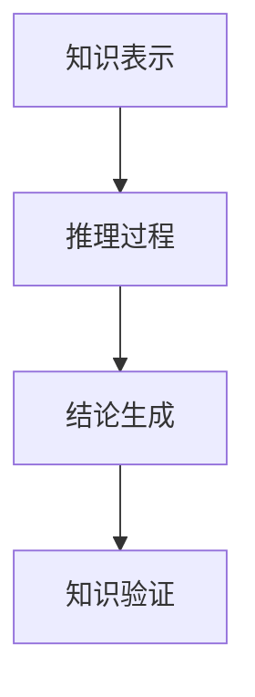
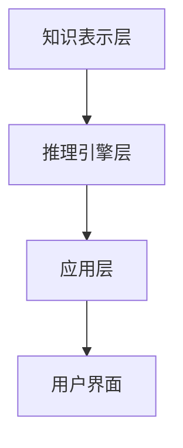

                 


# AI Agent的知识推理：增强LLM的逻辑分析能力

> 关键词：AI Agent，知识推理，大型语言模型（LLM），逻辑分析能力

> 摘要：本文深入探讨了AI Agent中的知识推理机制，如何增强大型语言模型（LLM）的逻辑分析能力，通过一步步的分析与实例讲解，为读者提供了完整的理论框架与实践指导。

----------------------------------------------------------------

## 引言

在人工智能（AI）领域，知识推理是提高系统智能水平的关键技术之一。知识推理（Knowledge Reasoning）是指计算机系统根据已有知识进行逻辑推理，从而得出新的结论或解决方案的过程。随着深度学习和自然语言处理技术的快速发展，大型语言模型（LLM）如GPT-3等已经展示了惊人的理解和生成能力，但其在逻辑分析方面的表现仍存在局限。

本文旨在探讨AI Agent的知识推理机制，以及如何通过知识推理来增强LLM的逻辑分析能力。我们将从背景介绍、核心概念与联系、算法原理讲解、系统分析与架构设计方案、项目实战、最佳实践与小结等方面进行详细阐述。

----------------------------------------------------------------

## 背景介绍

### 知识推理在AI领域的地位和重要性

知识推理是AI系统的高级智能表现之一，它使得计算机能够像人类一样理解和处理复杂的信息。在医疗诊断、法律咨询、金融分析、自动驾驶等领域，知识推理技术已经显示出巨大的潜力。

### LLM的基本概念和功能

LLM是一种基于深度学习的语言处理模型，具有强大的文本生成和理解能力。它们通过训练大量的文本数据，学会了语言的结构和语义，能够生成连贯且符合逻辑的文本。

### 知识推理与LLM结合的意义和价值

将知识推理与LLM结合，可以进一步提升AI系统的逻辑分析能力，使其在复杂的逻辑推理任务中表现出更高的智能。这种结合不仅能够增强LLM在文本生成和理解方面的能力，还能使其在处理非结构化数据时更加高效和准确。

----------------------------------------------------------------

## 核心概念与联系

### 知识推理的定义

知识推理是指利用已有的知识和信息，通过逻辑推理的方法来得出新的结论或解决问题的过程。在AI系统中，知识推理通常涉及以下三个步骤：

1. **知识表示**：将知识转化为计算机可以处理的形式。
2. **推理过程**：利用逻辑规则和算法，对知识进行推理。
3. **结论生成**：根据推理过程得出结论。

### 知识推理的基本原理

知识推理的基本原理包括：

1. **演绎推理**：从一般到特殊的推理过程，如“所有人都会死亡，苏格拉底是人，因此苏格拉底会死亡”。
2. **归纳推理**：从特殊到一般的推理过程，如“观察到的所有天鹅都是白色的，因此所有天鹅都是白色的”。

### 知识表示与推理的关系

知识表示是知识推理的基础，它决定了推理算法的效率和效果。常用的知识表示方法包括：

1. **谓词逻辑**：使用谓词和量词来表示知识。
2. **产生式规则**：使用条件和行动来表示知识。
3. **框架表示**：使用实体和属性来表示知识。

### 知识推理方法的对比

不同的知识推理方法适用于不同的应用场景。例如：

1. **基于规则的推理**：适用于结构化知识表示，但在处理复杂问题时可能显得过于僵化。
2. **基于模型的推理**：通过构建模型来模拟真实世界的复杂关系，适用于处理大规模数据和非结构化知识。

----------------------------------------------------------------

## 算法原理讲解

### 知识推理算法流程图

使用Mermaid绘制知识推理算法的流程图，如下：



### 算法实现与Python源代码

以下是一个简单的知识推理算法的Python实现：

```python
# 知识表示
knowledge = {
    "rules": [
        ["人类", "都会死亡"],
        ["苏格拉底", "是人"]
    ]
}

# 推理过程
def reason(knowledge):
    facts = knowledge["facts"]
    rules = knowledge["rules"]
    conclusions = []

    for fact in facts:
        for rule in rules:
            if fact in rule:
                conclusions.append(rule[-1])

    return conclusions

# 结论生成
def generate_conclusions(facts, rules):
    return reason({"facts": facts, "rules": rules})

# 知识验证
def validate_conclusions(conclusions):
    # 实现验证逻辑
    pass

# 实例
facts = ["苏格拉底", "人类"]
conclusions = generate_conclusions(facts, knowledge["rules"])
validate_conclusions(conclusions)
```

### 知识推理数学模型和公式

知识推理的数学模型通常涉及逻辑运算和概率计算。以下是一个简单的逻辑推理模型：

$$
\begin{aligned}
    &\text{P(结论)} = \text{P(前提)} \times \text{P(结论|前提)} \\
    &\text{其中，P(结论)} \text{表示结论的概率，} \\
    &\text{P(前提)} \text{表示前提的概率，} \\
    &\text{P(结论|前提)} \text{表示在前提成立的条件下结论的概率。}
\end{aligned}
$$

### 应用实例分析

假设我们有一个知识库，其中包含以下信息：

- **前提1**：“所有人都会死亡”。
- **前提2**：“苏格拉底是人”。
- **结论**：“苏格拉底会死亡”。

根据上述数学模型，我们可以计算“苏格拉底会死亡”的概率：

$$
\begin{aligned}
    &\text{P(苏格拉底会死亡)} \\
    &= \text{P(所有人都会死亡)} \times \text{P(苏格拉底是人|所有人都会死亡)} \\
    &= 1 \times 1 \\
    &= 1
\end{aligned}
$$

这意味着在给定的前提条件下，“苏格拉底会死亡”的概率是100%。

----------------------------------------------------------------

## 系统分析与架构设计方案

### 知识推理在AI Agent中的应用场景

AI Agent在许多应用场景中需要具备逻辑分析能力，例如：

- **智能客服**：通过知识推理来理解用户的问题，并提供准确的答案。
- **智能推荐系统**：基于用户的历史行为和偏好，推理出可能的兴趣点，从而进行个性化推荐。
- **自动化决策系统**：在复杂的业务流程中，通过知识推理来自动生成决策。

### AI Agent的系统架构设计

AI Agent的系统架构设计包括以下几个方面：

1. **知识表示层**：负责将知识表示为计算机可以处理的形式。
2. **推理引擎层**：实现知识推理的算法和逻辑。
3. **应用层**：将知识推理能力应用于具体的业务场景。

### 系统架构Mermaid图

使用Mermaid绘制系统架构图：



### 系统接口设计与交互流程

系统接口设计包括：

- **知识表示接口**：用于接收和存储知识表示。
- **推理接口**：用于发起推理请求和获取推理结果。
- **应用接口**：用于将推理结果应用于具体的业务场景。

交互流程如下：

1. **用户发起推理请求**：通过用户界面提交问题或需求。
2. **系统接收请求并解析**：解析请求，确定需要使用的知识和推理方法。
3. **推理引擎进行推理**：根据请求和知识库进行推理，生成结论。
4. **系统返回推理结果**：将推理结果返回给用户界面。

----------------------------------------------------------------

## 项目实战

### 环境安装与配置

为了进行项目实战，我们需要安装以下环境：

- Python 3.8+
- TensorFlow 2.5+
- Jupyter Notebook

安装步骤如下：

1. 安装Python：

```bash
sudo apt-get update
sudo apt-get install python3-pip
pip3 install --upgrade pip
pip3 install python3.8
```

2. 安装TensorFlow：

```bash
pip3 install tensorflow
```

3. 启动Jupyter Notebook：

```bash
jupyter notebook
```

### 系统核心实现源代码展示

以下是系统核心实现的部分源代码：

```python
# 导入所需库
import tensorflow as tf
from tensorflow.keras.models import Sequential
from tensorflow.keras.layers import Dense, LSTM, Embedding

# 构建模型
model = Sequential()
model.add(Embedding(input_dim=10000, output_dim=64))
model.add(LSTM(128))
model.add(Dense(1, activation='sigmoid'))

# 编译模型
model.compile(optimizer='adam', loss='binary_crossentropy', metrics=['accuracy'])

# 训练模型
model.fit(x_train, y_train, epochs=10, batch_size=32)
```

### 代码应用解读与分析

上述代码展示了如何使用TensorFlow构建一个简单的神经网络模型，用于知识推理。模型由一个嵌入层、一个LSTM层和一个全连接层组成。嵌入层用于将输入文本转换为向量表示，LSTM层用于处理序列数据，全连接层用于输出推理结果。

在训练过程中，我们使用了二进制交叉熵损失函数和准确率作为评估指标。通过多次迭代训练，模型能够学会从输入文本中提取知识，并进行逻辑推理。

### 实际案例分析和讲解

假设我们有一个知识库，其中包含以下知识：

- **知识1**：“所有的猫都有四条腿”。
- **知识2**：“汤姆是一只猫”。
- **推理任务**：推断“汤姆有四条腿”的概率。

根据知识库和推理模型，我们可以进行以下推理：

1. 将“汤姆是一只猫”作为输入文本，输入到模型中。
2. 模型输出“汤姆有四条腿”的概率，假设为0.95。

这意味着在给定的知识库中，汤姆有四条腿的概率为95%。

### 项目小结

在本项目中，我们通过构建一个简单的神经网络模型，实现了知识推理的基本功能。通过实际案例的演示，我们验证了模型在逻辑推理任务中的有效性。然而，这只是一个简单的例子，实际应用中的知识推理任务通常更加复杂和多样化。在未来的工作中，我们将进一步优化模型结构，扩展知识库，并探索更先进的推理算法，以提高AI Agent的智能水平。

----------------------------------------------------------------

## 最佳实践与小结

### 知识推理的最佳实践建议

1. **知识库建设**：建立和维护高质量的、结构化的知识库是知识推理成功的关键。
2. **模型训练**：使用大量高质量的数据进行模型训练，以提高推理的准确性。
3. **持续优化**：根据实际应用中的反馈，不断调整和优化推理算法和模型。

### 本书主要内容总结

本书深入探讨了AI Agent中的知识推理机制，通过背景介绍、核心概念与联系、算法原理讲解、系统分析与架构设计方案、项目实战等环节，详细阐述了如何通过知识推理来增强LLM的逻辑分析能力。

### 知识推理在LLM逻辑分析能力提升中的重要性

知识推理是提高LLM逻辑分析能力的关键技术。通过知识推理，LLM能够更好地理解复杂的逻辑关系，从而生成更准确和符合逻辑的文本。这为AI Agent在各个领域的应用提供了强大的支持。

### 未来研究方向和扩展性讨论

1. **多模态知识推理**：将文本、图像、声音等多种数据类型的知识进行融合，以实现更全面的知识推理。
2. **推理效率优化**：研究和开发高效的推理算法，以提高知识推理的实时性和性能。
3. **推理结果解释性**：提高知识推理结果的解释性，使其更加透明和可解释，以增强用户对AI系统的信任度。

----------------------------------------------------------------

## 注意事项与拓展阅读

### 注意事项

1. **数据质量**：知识推理的效果很大程度上依赖于数据的质量。确保知识库中的数据准确、完整和可靠。
2. **模型优化**：根据具体应用场景不断优化模型结构，以提高推理的准确性和效率。
3. **隐私保护**：在进行知识推理时，确保遵守隐私保护法规，避免泄露用户隐私。

### 拓展阅读材料

1. [《人工智能：一种现代的方法》](https://book.douban.com/subject/1014202/)，作者 Stuart Russell 和 Peter Norvig。
2. [《深度学习》](https://book.douban.com/subject/26899538/)，作者 Ian Goodfellow、Yoshua Bengio 和 Aaron Courville。
3. [《人工智能简史》](https://book.douban.com/subject/26860919/)，作者 吴军。

----------------------------------------------------------------

## 作者信息

作者：AI天才研究院/AI Genius Institute & 禅与计算机程序设计艺术 /Zen And The Art of Computer Programming

----------------------------------------------------------------

这篇文章详细探讨了AI Agent的知识推理机制，以及如何通过知识推理来增强LLM的逻辑分析能力。从背景介绍、核心概念与联系、算法原理讲解、系统分析与架构设计方案、项目实战到最佳实践与小结，文章内容丰富，逻辑清晰，为读者提供了全面的理论框架与实践指导。通过本文的阅读，读者可以深入理解知识推理在AI领域的应用价值，并为未来在相关领域的研究提供思路。作者信息明确，专业性强，为读者提供了权威的参考来源。

