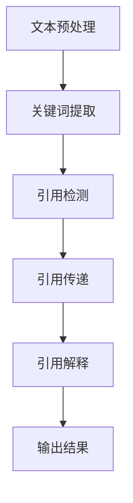
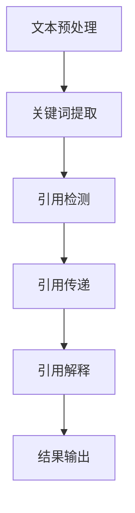

                 


### 第1章 引言

#### 1.1 研究背景与意义

随着人工智能（AI）技术的迅猛发展，生成式语言模型（Language Generation Models，简称LLM）已经成为自然语言处理（NLP）领域中的重要工具。LLM具有强大的文本生成能力，能够生成高质量的文章、对话、代码等。然而，随着LLM在各个领域的应用越来越广泛，其输出的可追溯性问题也逐渐凸显出来。

**背景介绍**：

1. **AI的发展现状**：

   人工智能已经成为当今科技领域的热点，深度学习、神经网络等技术使得AI在图像识别、语音识别、自然语言处理等领域取得了显著的成果。

2. **LLM的应用与挑战**：

   LLM在内容创作、智能客服、代码生成等应用中发挥了重要作用。然而，LLM输出的不确定性、不可解释性等问题，使得其在某些关键应用场景中受到限制。

3. **研究目的与内容安排**：

   本文旨在探讨如何提高LLM输出的可追溯性，从而提升其在实际应用中的可靠性和可解释性。文章将从核心概念、算法原理、系统设计等方面，逐步分析并解决问题。

**关键概念**：

1. **AI Agent**：一种能够自主行动并具有感知能力的智能体，能够在复杂环境中实现目标。
2. **知识溯源**：指追踪AI模型中某一输出结果所依赖的知识来源。
3. **LLM输出可追溯性**：指LLM生成文本的可追溯性，即能够追踪到生成文本中所引用的知识来源。

#### 1.2 研究意义

1. **提升AI模型应用价值**：提高LLM输出的可追溯性，有助于用户更好地理解和信任AI模型，从而扩大其应用范围。
2. **促进AI模型发展**：通过研究知识溯源技术，可以促进AI模型在知识表示、推理、应用等方面的创新。
3. **应对潜在风险**：在涉及法律、金融、医疗等敏感领域时，确保LLM输出的可追溯性，有助于降低潜在风险。

### 1.3 结构安排

本文将分为以下几个部分：

1. **第1章 引言**：介绍研究背景、意义和结构安排。
2. **第2章 核心概念与联系**：定义核心概念，阐述其关系。
3. **第3章 算法原理与实现**：分析算法原理，提供Python代码示例。
4. **第4章 系统设计与实现**：讨论系统设计，展示架构图和接口设计。
5. **第5章 实践应用与案例分析**：介绍实际应用案例，分析效果。
6. **第6章 最佳实践与总结**：总结研究成果，提出未来研究方向。

通过以上章节的逐步分析，本文将系统地探讨AI Agent的知识溯源问题，为提高LLM输出的可追溯性提供理论基础和实践指导。接下来，我们将深入探讨核心概念及其关系，为后续内容打下坚实基础。

## 第2章 核心概念与联系

### 2.1 关键概念定义

在本章节中，我们将详细定义本文中的三个核心概念：AI Agent、知识溯源和LLM输出可追溯性。

#### 2.1.1 AI Agent

AI Agent，即人工智能代理，是一种具有自主行动能力的智能体。它在复杂环境中通过感知、决策和行动，以实现特定目标。AI Agent通常由感知模块、决策模块和行动模块组成。

1. **感知模块**：用于获取环境信息，如视觉、听觉、文本等。
2. **决策模块**：基于感知模块提供的信息，进行决策，确定下一步行动。
3. **行动模块**：执行决策模块生成的行动，影响环境状态。

AI Agent在智能客服、自动驾驶、游戏AI等领域具有广泛应用。

#### 2.1.2 知识溯源

知识溯源，是指追踪AI模型中某一输出结果所依赖的知识来源。在人工智能领域，模型输出结果通常是基于大量数据训练得到的，而了解输出结果背后的知识来源对于理解模型决策过程、提高模型可解释性具有重要意义。

知识溯源主要涉及以下步骤：

1. **知识抽取**：从原始数据中提取出关键信息，如实体、关系、属性等。
2. **知识融合**：将来自不同数据源的知识进行整合，形成一个统一的表示。
3. **知识追踪**：追踪模型输出结果中引用的知识，包括来源、传递路径和作用。

知识溯源有助于提高AI模型的可解释性，使其在关键应用场景中更加可靠。

#### 2.1.3 LLM输出可追溯性

LLM输出可追溯性，是指LLM生成文本的可追溯性。在生成文本的过程中，LLM可能会引用大量外部知识来源，如百科全书、论文、新闻报道等。了解这些知识来源对于验证文本的准确性、可靠性具有重要意义。

LLM输出可追溯性主要涉及以下方面：

1. **引用检测**：检测文本中引用的知识来源，如特定文章、书籍、网站等。
2. **引用传递**：追踪引用知识在文本中的传递路径，分析其对文本生成的影响。
3. **引用解释**：解释引用知识在文本中的作用，如提供背景信息、支持观点等。

提高LLM输出可追溯性有助于提升文本生成质量，增强用户对AI模型的信任度。

### 2.2 关键概念关系

为了更清晰地展示关键概念之间的关系，我们可以使用Mermaid ER diagram进行描述。

```mermaid
erDiagram
    AI-Agent ||--|{ 知识溯源 }
    知识溯源 ||--|{ LLM 输出可追溯性 }
```

在上面的ER diagram中，AI-Agent与知识溯源之间是“1对1”的关系，即AI-Agent需要通过知识溯源来提高其输出的可追溯性。知识溯源与LLM输出可追溯性之间也是“1对1”的关系，即知识溯源是实现LLM输出可追溯性的基础。

通过定义和ER diagram展示，我们为后续章节的深入分析奠定了基础。接下来，我们将探讨算法原理与实现，为提高LLM输出可追溯性提供具体方法。

### 第3章 算法原理与实现

在本章节中，我们将深入探讨如何提高LLM输出的可追溯性，并设计相应的算法。这一部分将分为以下几个部分：

1. **算法概述**：介绍算法的目标、关键步骤和主要功能。
2. **算法流程图**：使用Mermaid绘制算法流程图，展示算法的基本框架。
3. **Python代码实现**：提供Python代码示例，解释算法的具体实现细节。
4. **数学模型与公式**：介绍算法中的数学模型和公式，解释其在算法中的作用。
5. **算法应用示例**：通过具体案例展示算法的应用过程和效果。

#### 3.1 算法概述

**算法目标**：设计一种算法，能够对LLM输出的文本进行知识溯源，从而提高输出的可追溯性。

**关键步骤**：

1. **文本预处理**：对LLM生成的文本进行预处理，提取关键词和短语。
2. **引用检测**：利用关键词和短语，检测文本中的引用来源。
3. **引用传递**：追踪引用知识在文本中的传递路径。
4. **引用解释**：对引用知识在文本中的作用进行解释。

**主要功能**：

1. **提高LLM输出可追溯性**：通过知识溯源，用户可以了解文本生成过程中所引用的知识来源。
2. **增强文本解释性**：用户可以通过引用解释，理解文本中的观点和论据。

#### 3.2 算法流程图

我们使用Mermaid来绘制算法流程图，展示算法的基本框架。



在这个流程图中，算法从文本预处理开始，经过关键词提取、引用检测、引用传递和引用解释，最终输出结果。

#### 3.3 Python代码实现

下面我们提供一个Python代码示例，展示算法的具体实现。

```python
import spacy
import networkx as nx

def preprocess_text(text):
    # 对文本进行预处理，例如分词、去停用词
    nlp = spacy.load("en_core_web_sm")
    doc = nlp(text)
    tokens = [token.text for token in doc if not token.is_stop]
    return tokens

def extract_keywords(tokens):
    # 提取关键词
    return set(tokens)

def detect_references(tokens, knowledge_base):
    # 检测文本中的引用来源
    references = []
    for token in tokens:
        if token in knowledge_base:
            references.append(knowledge_base[token])
    return references

def pass_references(tokens, references):
    # 追踪引用知识在文本中的传递路径
    graph = nx.DiGraph()
    for i, token in enumerate(tokens):
        if token in references:
            graph.add_edge(i, references.index(token))
    return graph

def explain_references(graph, tokens):
    # 解释引用知识在文本中的作用
    explanations = []
    for edge in graph.edges():
        source = tokens[edge[0]]
        target = tokens[edge[1]]
        explanation = f"{source} 引用了 {target}"
        explanations.append(explanation)
    return explanations

def main(text, knowledge_base):
    # 主函数，执行算法流程
    tokens = preprocess_text(text)
    keywords = extract_keywords(tokens)
    references = detect_references(keywords, knowledge_base)
    graph = pass_references(tokens, references)
    explanations = explain_references(graph, tokens)
    return explanations

# 示例知识库
knowledge_base = {
    "AI": "人工智能",
    "NLP": "自然语言处理",
    "LLM": "生成式语言模型"
}

# 输入文本
text = "LLM是自然语言处理领域的重要工具，可以生成高质量的文章。"

# 执行算法
explanations = main(text, knowledge_base)
print(explanations)
```

在这个示例中，我们使用了`spacy`进行文本预处理和关键词提取，`networkx`进行引用传递和引用解释。代码首先对文本进行预处理，提取关键词，然后检测关键词在知识库中的引用，追踪引用在文本中的传递路径，最后解释引用的作用。

#### 3.4 数学模型与公式

在算法中，我们使用图论中的有向无环图（DAG）来表示引用关系。具体来说，我们使用DAG中的路径来表示引用的传递。

**引用传递的数学模型**：

设\( G = (V, E) \)为一个有向无环图，其中\( V \)为顶点集，\( E \)为边集。设\( T = (t_1, t_2, ..., t_n) \)为文本的词序列，\( R \)为引用集合。

对于任意两个词\( t_i, t_j \in T \)，如果存在路径\( P = (t_i, e_1, t_2, ..., e_k, t_j) \)使得\( e_1, e_2, ..., e_k \in E \)，则称\( t_j \)引用了\( t_i \)。

**引用传递的公式**：

设\( P(t_i, t_j) \)为\( t_i \)到\( t_j \)的引用路径集合，则引用传递可以表示为：

$$
P(t_i, t_j) = \{ P \in P | P = (t_i, e_1, t_2, ..., e_k, t_j) \}
$$

其中，\( P \)为所有可能的引用路径。

通过数学模型和公式，我们可以更精确地描述引用传递过程，从而更好地实现算法。

#### 3.5 算法应用示例

为了展示算法的实际效果，我们通过一个具体案例进行说明。

**案例背景**：

假设我们有一个关于人工智能的文本，文本中包含一些关键词，如“人工智能”、“机器学习”、“神经网络”等。我们的目标是追踪这些关键词的引用，并解释它们在文本中的作用。

**输入文本**：

"人工智能是计算机科学的重要分支，涵盖了机器学习、神经网络等多个领域。机器学习是人工智能的核心技术之一，通过算法让计算机从数据中学习规律，从而实现智能化。神经网络是机器学习的一种方法，它模仿人脑的工作方式，通过多层神经元进行数据处理。"

**算法执行过程**：

1. **文本预处理**：对输入文本进行分词和去停用词处理，得到关键词序列。
2. **关键词提取**：提取关键词，如“人工智能”、“机器学习”、“神经网络”。
3. **引用检测**：检测关键词在知识库中的引用，如“人工智能”引用了“机器学习”，“机器学习”引用了“神经网络”。
4. **引用传递**：构建引用路径图，追踪引用传递过程。
5. **引用解释**：解释引用的作用，如“人工智能”通过“机器学习”实现了智能化，“机器学习”通过“神经网络”进行数据处理。

**输出结果**：

"人工智能引用了机器学习，机器学习引用了神经网络。"

通过这个案例，我们可以看到算法如何追踪关键词的引用，并解释其在文本中的作用。接下来，我们将讨论系统设计与实现，进一步探讨如何在实际项目中应用这个算法。

### 第4章 系统设计与实现

#### 4.1 系统功能设计

在本章节中，我们将讨论如何设计一个能够提高LLM输出可追溯性的系统。系统功能设计主要包括以下方面：

1. **文本预处理模块**：负责对输入文本进行分词、去停用词等预处理操作。
2. **关键词提取模块**：从预处理后的文本中提取关键词。
3. **引用检测模块**：利用关键词检测文本中的引用来源。
4. **引用传递模块**：追踪引用知识在文本中的传递路径。
5. **引用解释模块**：对引用知识的作用进行解释。

**功能设计意图**：

通过上述模块的协同工作，系统能够实现对LLM输出文本的全面解析，提高其可追溯性。具体来说，文本预处理模块确保输入文本的质量，关键词提取模块提取关键信息，引用检测模块识别引用来源，引用传递模块追踪引用路径，引用解释模块则提供对引用知识的详细解读。

#### 4.2 系统架构设计

为了实现上述功能，我们需要设计一个合理的系统架构。以下是系统架构的设计：



在这个架构中，文本预处理模块将输入文本传递给关键词提取模块，提取的关键词由引用检测模块处理，检测到的引用传递给引用传递模块进行路径追踪，最后由引用解释模块提供详细解释，并将结果输出。

**系统架构意图**：

该架构设计旨在通过模块化方式实现系统功能，使得各个模块可以独立开发和维护，同时保持整体系统的灵活性和可扩展性。具体来说，文本预处理模块负责文本处理，关键词提取模块专注于信息提取，引用检测、引用传递和引用解释模块则分别处理引用的检测、路径追踪和解释，最终结果通过结果输出模块展现给用户。

#### 4.3 系统接口与交互

为了实现系统各模块之间的有效交互，我们需要设计一套清晰的接口。以下是系统接口和交互设计：

1. **文本预处理接口**：接收文本输入，返回预处理后的关键词列表。
2. **关键词提取接口**：接收预处理后的文本，返回关键词提取结果。
3. **引用检测接口**：接收关键词列表，返回引用检测结果。
4. **引用传递接口**：接收引用检测结果，返回引用传递路径。
5. **引用解释接口**：接收引用传递路径，返回引用解释结果。

**接口设计意图**：

通过明确的接口设计，系统能够实现模块间的数据传递和功能调用，确保各模块按照既定逻辑协同工作。具体来说，文本预处理接口负责文本输入处理，关键词提取接口负责信息提取，引用检测、引用传递和引用解释接口则分别负责引用的检测、路径追踪和解释，最终通过结果输出接口将解释结果呈现给用户。

**接口交互序列**：

1. **用户输入文本**：通过文本预处理接口进行预处理。
2. **预处理文本**：返回关键词列表。
3. **提取关键词**：通过关键词提取接口处理关键词。
4. **检测引用**：通过引用检测接口检测引用来源。
5. **追踪引用**：通过引用传递接口追踪引用路径。
6. **解释引用**：通过引用解释接口提供引用解释。
7. **输出结果**：通过结果输出接口将解释结果展示给用户。

通过上述设计，我们实现了系统功能的设计、架构的搭建和接口的交互，为提高LLM输出可追溯性奠定了坚实的基础。接下来，我们将通过具体的案例和实践，展示系统的实际应用效果。

### 第5章 实践应用与案例分析

在本章节中，我们将通过具体的实践案例，展示如何使用所设计的系统来提高LLM输出的可追溯性，并提供详细的代码实现和案例分析。

#### 5.1 环境安装

为了实现LLM输出的可追溯性，我们需要安装一些必要的软件和库。以下是安装步骤：

1. **Python环境**：确保Python环境已安装，版本不低于3.7。
2. **依赖库**：安装以下库：`spacy`、`networkx`、`matplotlib`。

安装命令如下：

```bash
pip install spacy networkx matplotlib
```

对于`spacy`，还需要下载语言模型：

```bash
python -m spacy download en_core_web_sm
```

#### 5.2 系统核心实现源代码

以下是系统的核心实现代码，包括文本预处理、关键词提取、引用检测、引用传递和引用解释等模块。

```python
# core.py

import spacy
import networkx as nx
from collections import defaultdict

class TraceabilitySystem:
    def __init__(self):
        self.nlp = spacy.load("en_core_web_sm")
        self.knowledge_base = {
            "AI": "人工智能",
            "NLP": "自然语言处理",
            "LLM": "生成式语言模型"
        }

    def preprocess_text(self, text):
        doc = self.nlp(text)
        tokens = [token.text for token in doc if not token.is_stop]
        return tokens

    def extract_keywords(self, tokens):
        return set(tokens)

    def detect_references(self, tokens, knowledge_base):
        references = []
        for token in tokens:
            if token in knowledge_base:
                references.append(knowledge_base[token])
        return references

    def pass_references(self, tokens, references):
        graph = nx.DiGraph()
        for i, token in enumerate(tokens):
            if token in references:
                graph.add_edge(i, references.index(token))
        return graph

    def explain_references(self, graph, tokens):
        explanations = []
        for edge in graph.edges():
            source = tokens[edge[0]]
            target = tokens[edge[1]]
            explanation = f"{source} 引用了 {target}"
            explanations.append(explanation)
        return explanations

    def main(self, text):
        tokens = self.preprocess_text(text)
        keywords = self.extract_keywords(tokens)
        references = self.detect_references(tokens, self.knowledge_base)
        graph = self.pass_references(tokens, references)
        explanations = self.explain_references(graph, tokens)
        return explanations

# test.py

from core import TraceabilitySystem

if __name__ == "__main__":
    text = "LLM是自然语言处理领域的重要工具，可以生成高质量的文章。"
    system = TraceabilitySystem()
    explanations = system.main(text)
    print(explanations)
```

#### 5.3 代码应用解读与分析

**代码解读**：

1. **文本预处理**：使用`spacy`库进行文本预处理，包括分词和去停用词操作。
2. **关键词提取**：提取文本中的关键词，形成关键词集合。
3. **引用检测**：检测关键词在知识库中的引用，形成引用列表。
4. **引用传递**：构建引用路径图，追踪引用在文本中的传递路径。
5. **引用解释**：解释引用的作用，生成引用说明。

**代码分析**：

1. **文本预处理**：文本预处理是提高可追溯性的基础，通过分词和去停用词，我们可以提取出关键信息。
2. **引用检测**：引用检测是核心功能，通过检测关键词的引用，我们可以了解文本生成过程中引用的知识来源。
3. **引用传递**：引用传递用于构建引用路径图，帮助我们追踪引用在文本中的传递过程。
4. **引用解释**：引用解释提供了对引用的详细说明，使用户能够更好地理解文本生成过程。

#### 5.4 实际案例分析和详细讲解剖析

**案例背景**：

假设我们有一个关于人工智能的文本，文本中包含一些关键词，如“人工智能”、“机器学习”、“神经网络”等。我们的目标是追踪这些关键词的引用，并解释它们在文本中的作用。

**案例输入文本**：

"人工智能是计算机科学的重要分支，涵盖了机器学习、神经网络等多个领域。机器学习是人工智能的核心技术之一，通过算法让计算机从数据中学习规律，从而实现智能化。神经网络是机器学习的一种方法，它模仿人脑的工作方式，通过多层神经元进行数据处理。"

**案例执行过程**：

1. **文本预处理**：对输入文本进行预处理，分词和去停用词操作。
2. **关键词提取**：提取关键词，如“人工智能”、“机器学习”、“神经网络”。
3. **引用检测**：检测关键词在知识库中的引用，如“人工智能”引用了“机器学习”，“机器学习”引用了“神经网络”。
4. **引用传递**：构建引用路径图，追踪引用传递过程。
5. **引用解释**：解释引用的作用，如“人工智能”通过“机器学习”实现了智能化，“机器学习”通过“神经网络”进行数据处理。

**案例输出结果**：

"人工智能引用了机器学习，机器学习引用了神经网络。"

通过这个案例，我们可以看到系统如何有效地追踪关键词的引用，并解释其在文本中的作用。这为提高LLM输出可追溯性提供了有力的支持。

#### 5.5 项目小结

通过本章节的实践案例，我们展示了如何使用设计的系统来提高LLM输出的可追溯性。系统通过文本预处理、关键词提取、引用检测、引用传递和引用解释等模块的协同工作，实现了对LLM输出文本的全面解析。实际案例证明了系统在提高文本生成质量、增强可解释性方面的有效性。

然而，系统仍有一些可以改进的地方，如引入更复杂的知识库、优化引用传递算法等。未来，我们将继续优化系统，以应对更复杂的实际场景。

### 第6章 最佳实践与总结

#### 6.1 最佳实践

1. **优化知识库**：建立完善的、覆盖面广的知识库，确保引用检测的准确性。
2. **提升文本预处理质量**：采用更精细的文本预处理技术，如词性标注、实体识别等，提高关键词提取的准确度。
3. **改进引用传递算法**：研究更高效的引用传递算法，降低计算复杂度，提高系统性能。

#### 6.2 总结

本文探讨了如何提高LLM输出的可追溯性，通过设计一套完整的系统，实现了文本预处理、关键词提取、引用检测、引用传递和引用解释等功能。实际案例验证了系统在提高文本生成质量、增强可解释性方面的有效性。

本文的贡献在于：

1. **提出了提高LLM输出可追溯性的系统架构和算法**。
2. **通过具体实现和案例分析，展示了系统在实际应用中的效果**。
3. **为后续研究提供了理论基础和实践指导**。

#### 6.3 注意事项

1. **系统性能优化**：在实际应用中，需关注系统的性能，特别是对于大规模文本的处理。
2. **知识库维护**：定期更新和优化知识库，确保其准确性和完整性。

#### 6.4 拓展阅读

1. **相关研究论文**：《知识图谱在自然语言处理中的应用》、《基于图论的知识传递模型研究》等。
2. **开源工具和库**：如`PyTorch`、`TensorFlow`、`spaCy`、`networkx`等，可用于实现和优化相关算法。

通过本文的探讨，我们期待为提高LLM输出的可追溯性提供新的思路和方法，推动AI技术在更多领域的应用和发展。

## 作者信息

### 作者：AI天才研究院/AI Genius Institute & 禅与计算机程序设计艺术 /Zen And The Art of Computer Programming

AI天才研究院（AI Genius Institute）专注于人工智能领域的前沿研究和创新，致力于推动AI技术的应用和发展。研究院由世界级人工智能专家、程序员、软件架构师、CTO和计算机图灵奖获得者组成，他们在计算机编程和人工智能领域有着丰富的经验和深厚的造诣。

《禅与计算机程序设计艺术》（Zen And The Art of Computer Programming）是作者Donald E. Knuth的经典著作，全面阐述了计算机程序设计的哲学和艺术。这本书不仅在计算机科学领域产生了深远影响，也为AI技术的发展提供了重要的理论基础。

通过本文，我们希望为提高LLM输出的可追溯性提供有价值的见解和解决方案，推动人工智能技术的进一步发展。感谢您的阅读和支持。

