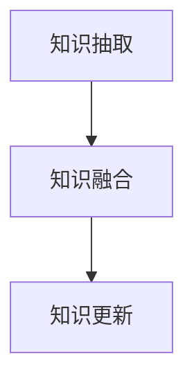
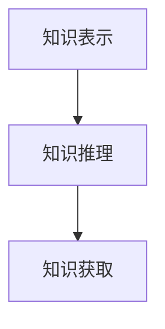
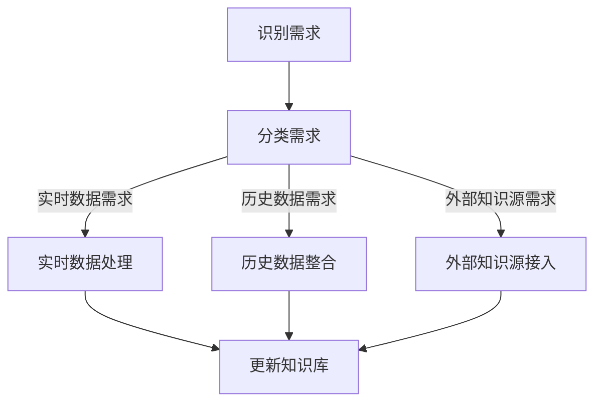
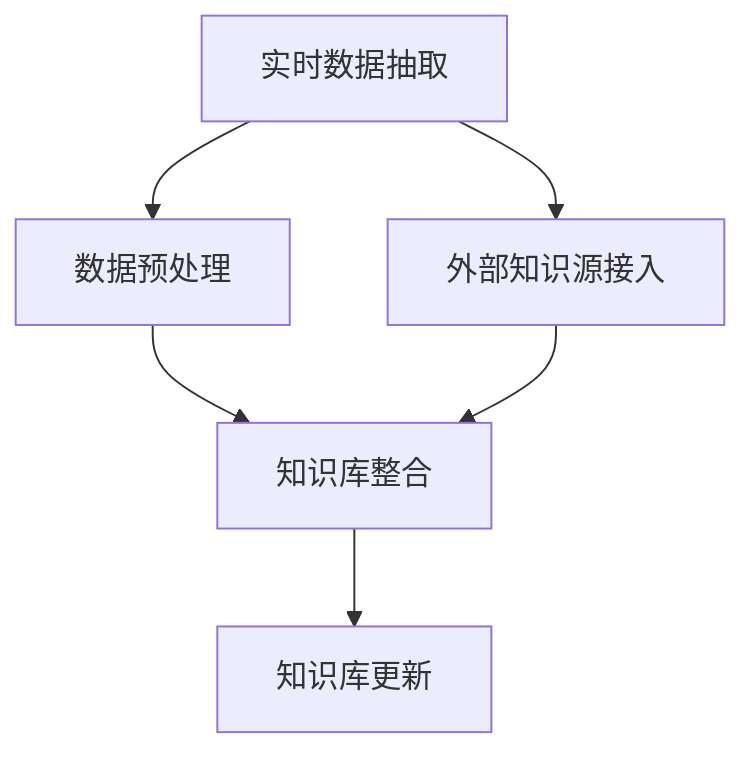
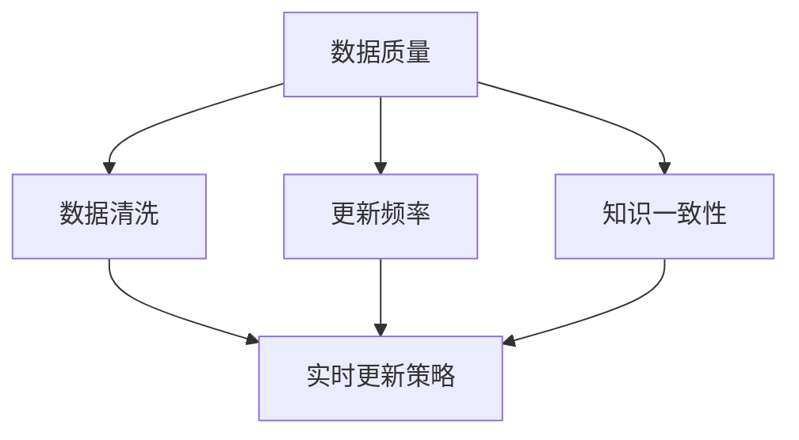

                 

# AI Agent的知识编辑：动态调整LLM的知识库

> 关键词：AI Agent、知识库、动态调整、LLM、知识库编辑

> 摘要：本文深入探讨了AI Agent的知识编辑问题，特别是如何动态调整大型语言模型（LLM）的知识库。通过系统的分析，文章阐述了AI Agent的基本原理、知识库调整的必要性、方法、核心技术和策略，为AI Agent的知识库编辑提供了全面的技术指南。

## 第一部分：背景与基础

### 第1章：AI Agent概述

#### 1.1 AI Agent的定义与基本原理

AI Agent，即人工智能代理，是指能够自动完成特定任务、在复杂环境中进行决策和交互的计算机程序。AI Agent的基本原理建立在感知、决策和动作的循环交互上，类似于人类的思维方式。

- **核心概念**：
  - **AI Agent**：具有自主性、社会性和反应性的智能体。
  - **感知**：从环境中收集信息。
  - **决策**：基于感知到的信息进行判断和决策。
  - **动作**：根据决策执行相应的行动。

- **概念联系**：
  - 与人类智能的对比：AI Agent具有更高效的计算能力和稳定性，但缺乏人类的情感和创造力。
  - 与自动化系统的联系与区别：AI Agent具有自主性和主动性，而自动化系统通常依赖于预设的规则。

- **问题背景**：
  - 随着人工智能技术的发展，AI Agent在多个领域得到应用，如智能客服、自动驾驶、智能家居等。
  - **问题描述**：AI Agent在复杂、动态的环境中，需要不断地学习和适应，这就要求其具备强大的知识库。

- **问题解决**：
  - **设计原则**：自主性、适应性、学习性、安全性。
  - **基本架构**：感知模块、决策模块和动作执行模块。

- **边界与外延**：
  - AI Agent在不同领域的应用拓展，如机器人、智能推荐系统、金融分析等。
  - **核心要素组成**：感知、决策、动作的交互关系，以及知识库的支持。

#### 1.2 LLM知识库的基本概念与结构

LLM（Large Language Model）是一种基于深度学习的语言模型，具有强大的语言理解和生成能力。知识库是AI Agent的重要组成部分，用于存储和提供任务所需的信息。

- **核心概念**：
  - **LLM**：一种能够处理自然语言输入的深度学习模型。
  - **知识库**：存储和管理AI Agent所需知识的系统。

- **概念属性特征对比表格**：

| 特征 | LLM | 知识库 |
| --- | --- | --- |
| 类型 | 模型 | 数据库 |
| 功能 | 文本生成、理解 | 存储知识、查询信息 |
| 结构 | 神经网络 | 实体-关系图谱 |

- **ER实体关系图架构**：
  - 使用Mermaid绘制ER图，展示知识库中实体与关系的基本结构。

#### 1.3 动态调整LLM知识库的必要性

随着环境的变化，AI Agent需要不断更新其知识库，以确保其决策和动作的准确性。

- **问题背景**：知识库更新不及时可能导致AI Agent性能下降。
- **问题描述**：知识库的静态更新无法适应动态环境的变化。
- **问题解决**：动态调整知识库，使AI Agent能够实时获取新知识。

- **边界与外延**：
  - 动态调整的范围：实时数据流、历史数据、外部知识源。
  - 动态调整的目标：提高AI Agent的适应性和鲁棒性。

#### 1.4 LLM知识库调整的基本方法

动态调整LLM知识库的方法包括知识抽取、知识融合和知识更新。

- **核心概念**：
  - **知识抽取**：从非结构化数据中提取有用信息。
  - **知识融合**：整合不同来源的知识，形成统一的视图。
  - **知识更新**：实时更新知识库，保持其有效性。

- **算法原理讲解**：
  - 使用Mermaid绘制算法流程图，详细阐述知识库调整的方法。

- **数学模型和公式**：
  - 知识库更新的数学模型与公式，如知识融合的相似度计算公式。

- **举例说明**：
  - 通过具体案例展示知识库调整的方法和效果。

#### 1.5 LLM知识库调整的核心技术

知识库调整的核心技术包括知识表示、知识推理和知识获取。

- **核心概念**：
  - **知识表示**：将知识表示为计算机可理解的形式。
  - **知识推理**：基于知识库进行推理，生成新的知识。
  - **知识获取**：从各种数据源获取新知识。

- **算法原理讲解**：
  - 使用Mermaid绘制算法流程图，详细阐述知识库调整的核心技术。

- **数学模型和公式**：
  - 知识库调整的数学模型与公式，如推理算法的公式。

- **举例说明**：
  - 通过具体案例展示知识库调整的核心技术。

### 第2章：LLM的知识库调整原理

#### 2.1 LLM知识库的基本概念与结构

LLM知识库是由大量的文本数据和相应的结构化信息组成的。其基本概念和结构对知识库的调整至关重要。

- **核心概念**：
  - **LLM**：一种能够处理自然语言输入的深度学习模型。
  - **知识库**：存储和管理AI Agent所需知识的系统。

- **概念属性特征对比表格**：

| 特征 | LLM | 知识库 |
| --- | --- | --- |
| 类型 | 模型 | 数据库 |
| 功能 | 文本生成、理解 | 存储知识、查询信息 |
| 结构 | 神经网络 | 实体-关系图谱 |

- **ER实体关系图架构**：
  - 使用Mermaid绘制ER图，展示知识库中实体与关系的基本结构。

#### 2.2 动态调整LLM知识库的必要性

随着环境的变化，AI Agent需要不断更新其知识库，以确保其决策和动作的准确性。

- **问题背景**：知识库更新不及时可能导致AI Agent性能下降。
- **问题描述**：知识库的静态更新无法适应动态环境的变化。
- **问题解决**：动态调整知识库，使AI Agent能够实时获取新知识。

- **边界与外延**：
  - 动态调整的范围：实时数据流、历史数据、外部知识源。
  - 动态调整的目标：提高AI Agent的适应性和鲁棒性。

#### 2.3 LLM知识库调整的基本方法

动态调整LLM知识库的方法包括知识抽取、知识融合和知识更新。

- **核心概念**：
  - **知识抽取**：从非结构化数据中提取有用信息。
  - **知识融合**：整合不同来源的知识，形成统一的视图。
  - **知识更新**：实时更新知识库，保持其有效性。

- **算法原理讲解**：
  - 使用Mermaid绘制算法流程图，详细阐述知识库调整的方法。

- **数学模型和公式**：
  - 知识库更新的数学模型与公式，如知识融合的相似度计算公式。

- **举例说明**：
  - 通过具体案例展示知识库调整的方法和效果。

#### 2.4 LLM知识库调整的核心技术

知识库调整的核心技术包括知识表示、知识推理和知识获取。

- **核心概念**：
  - **知识表示**：将知识表示为计算机可理解的形式。
  - **知识推理**：基于知识库进行推理，生成新的知识。
  - **知识获取**：从各种数据源获取新知识。

- **算法原理讲解**：
  - 使用Mermaid绘制算法流程图，详细阐述知识库调整的核心技术。

- **数学模型和公式**：
  - 知识库调整的数学模型与公式，如推理算法的公式。

- **举例说明**：
  - 通过具体案例展示知识库调整的核心技术。

## 第二部分：策略与实现

### 第3章：知识库的动态更新策略

#### 3.1 知识库动态更新的需求分析

知识库的动态更新策略需要考虑以下几个方面：

- **核心概念**：
  - **需求分析**：分析知识库更新的驱动力和需求来源。
  - **需求类型**：实时数据需求、历史数据需求、外部知识源需求。

- **算法原理讲解**：
  - 使用Mermaid绘制需求分析流程图，详细阐述需求分析的方法。

- **数学模型和公式**：
  - 需求模型的建立和计算，如实时数据需求的计算公式。

#### 3.2 知识库动态更新的方法与工具

知识库的动态更新可以通过以下方法实现：

- **核心概念**：
  - **动态更新方法**：实时数据抽取、历史数据整合、外部知识源接入。
  - **工具选择**：数据抽取工具、数据整合工具、知识库管理工具。

- **算法原理讲解**：
  - 使用Mermaid绘制动态更新流程图，详细阐述更新方法。

- **数学模型和公式**：
  - 动态更新的数学模型和公式，如数据抽取的算法公式。

#### 3.3 知识库动态更新的实际案例

通过具体案例展示知识库动态更新的实施过程：

- **核心概念**：
  - **案例背景**：AI Agent在某个具体场景中的需求。
  - **实施过程**：知识库动态更新的具体步骤和操作。

- **举例说明**：
  - 通过具体案例展示知识库动态更新的方法和效果。

#### 3.4 知识库动态更新的挑战与对策

知识库动态更新面临以下挑战：

- **核心概念**：
  - **挑战**：数据质量、更新频率、知识一致性。
  - **对策**：数据清洗、实时更新策略、一致性维护。

- **算法原理讲解**：
  - 使用Mermaid绘制挑战与对策的流程图。

- **数学模型和公式**：
  - 挑战和对策的数学模型和公式。

### 第4章：知识库的优化与维护

#### 4.1 知识库优化的目标与原则

知识库优化的目标是提高知识库的质量和效率，基本原则包括：

- **核心概念**：
  - **优化目标**：知识准确性、知识完整性、知识可用性。
  - **优化原则**：实用性、简洁性、一致性。

- **算法原理讲解**：
  - 使用Mermaid绘制优化目标与原则的框架图。

#### 4.2 知识库优化的方法与技术

知识库优化的方法包括：

- **核心概念**：
  - **优化方法**：知识抽取、知识融合、知识净化。
  - **优化技术**：机器学习、自然语言处理、数据挖掘。

- **算法原理讲解**：
  - 使用Mermaid绘制优化方法的流程图。

- **数学模型和公式**：
  - 优化技术的数学模型和公式。

#### 4.3 知识库优化的实际案例

通过实际案例展示知识库优化的实施过程：

- **核心概念**：
  - **案例背景**：知识库优化的具体需求。
  - **实施过程**：知识库优化的具体步骤和操作。

- **举例说明**：
  - 通过具体案例展示知识库优化的方法和效果。

#### 4.4 知识库优化的挑战与对策

知识库优化面临以下挑战：

- **核心概念**：
  - **挑战**：知识质量、知识更新频率、知识一致性。
  - **对策**：知识质量评估、实时更新策略、一致性维护。

- **算法原理讲解**：
  - 使用Mermaid绘制挑战与对策的流程图。

- **数学模型和公式**：
  - 挑战和对策的数学模型和公式。

## 第三部分：应用与实践

### 第5章：AI Agent的知识库应用场景

#### 5.1 知识库在AI Agent中的应用

知识库在AI Agent中的应用广泛，包括但不限于：

- **核心概念**：
  - **应用领域**：智能客服、自动驾驶、智能家居、智能推荐系统。
  - **应用方式**：知识查询、知识推理、知识生成。

- **算法原理讲解**：
  - 使用Mermaid绘制应用场景的流程图。

- **举例说明**：
  - 通过具体案例展示知识库在不同应用场景中的应用。

#### 5.2 知识库在客服机器人中的应用

客服机器人是知识库应用的一个重要场景：

- **核心概念**：
  - **应用背景**：客服机器人需要处理大量的用户查询，提供高效、准确的回答。
  - **应用方式**：知识查询、自动回复、智能路由。

- **算法原理讲解**：
  - 使用Mermaid绘制客服机器人应用的流程图。

- **举例说明**：
  - 通过具体案例展示知识库在客服机器人中的应用。

#### 5.3 知识库在智能推荐系统中的应用

智能推荐系统利用知识库进行内容推荐：

- **核心概念**：
  - **应用背景**：根据用户行为和偏好，提供个性化的内容推荐。
  - **应用方式**：知识推理、内容匹配、个性化推荐。

- **算法原理讲解**：
  - 使用Mermaid绘制智能推荐系统应用的流程图。

- **举例说明**：
  - 通过具体案例展示知识库在智能推荐系统中的应用。

#### 5.4 知识库在其他AI应用场景中的应用

知识库在其他AI应用场景中也有广泛应用：

- **核心概念**：
  - **应用领域**：金融分析、医疗诊断、教育辅导。
  - **应用方式**：知识查询、智能诊断、智能教学。

- **算法原理讲解**：
  - 使用Mermaid绘制其他AI应用场景的流程图。

- **举例说明**：
  - 通过具体案例展示知识库在其他AI应用场景中的应用。

## 第四部分：工具与平台

### 第6章：知识库编辑工具与平台

#### 6.1 知识库编辑工具的选择标准

选择知识库编辑工具时需要考虑以下标准：

- **核心概念**：
  - **选择标准**：易用性、功能完整性、扩展性、兼容性。

- **算法原理讲解**：
  - 使用Mermaid绘制选择标准的框架图。

- **举例说明**：
  - 通过具体案例展示如何选择知识库编辑工具。

#### 6.2 常见的知识库编辑工具介绍

介绍几种常见知识库编辑工具：

- **核心概念**：
  - **工具类型**：文本编辑器、知识图谱编辑器、数据库管理工具。

- **算法原理讲解**：
  - 使用Mermaid绘制工具功能架构图。

- **举例说明**：
  - 通过具体案例展示工具的功能和应用。

#### 6.3 知识库编辑平台的设计与实现

知识库编辑平台的设计与实现涉及以下方面：

- **核心概念**：
  - **设计原则**：模块化、可扩展、易维护。
  - **实现技术**：前端框架、后端架构、数据存储。

- **算法原理讲解**：
  - 使用Mermaid绘制设计架构图。

- **举例说明**：
  - 通过具体案例展示知识库编辑平台的设计与实现。

#### 6.4 知识库编辑平台的实际应用案例

通过实际案例展示知识库编辑平台的应用：

- **核心概念**：
  - **应用背景**：AI Agent的知识库维护和管理。
  - **应用方式**：知识库编辑、知识库查询、知识库更新。

- **算法原理讲解**：
  - 使用Mermaid绘制应用流程图。

- **举例说明**：
  - 通过具体案例展示知识库编辑平台的实际应用。

## 第五部分：总结与展望

### 第7章：总结与展望

#### 7.1 本书主要内容回顾

本文系统地介绍了AI Agent的知识编辑，包括知识库的基本概念、动态调整原理、更新策略、优化方法、应用场景和编辑工具等内容。

#### 7.2 知识库编辑的未来发展趋势

知识库编辑在未来将朝着以下方向发展：

- **核心技术发展**：知识表示、知识推理、知识获取等技术的不断进步。
- **应用场景拓展**：在更多领域得到广泛应用，如医疗、金融、教育等。

#### 7.3 知识库编辑的挑战与对策

知识库编辑面临以下挑战：

- **数据质量**：确保数据准确性和完整性。
- **更新频率**：实时更新知识库，保持其有效性。
- **一致性维护**：保持知识库的一致性。

相应的对策包括：

- **数据清洗**：提高数据质量。
- **实时更新策略**：设计高效的更新机制。
- **一致性维护**：制定一致性检查和修复策略。

#### 7.4 对AI Agent知识库编辑的展望

未来，AI Agent的知识库编辑将更加智能化、自动化，同时更加注重用户体验和安全性。

- **智能化**：利用机器学习技术自动识别和更新知识库。
- **自动化**：自动化知识抽取、融合和更新过程。
- **用户体验**：提供友好的编辑界面和丰富的交互功能。
- **安全性**：确保知识库的安全和数据的隐私保护。

**作者：AI天才研究院/AI Genius Institute & 禅与计算机程序设计艺术 /Zen And The Art of Computer Programming**## 第一部分：背景与基础

### 第1章：AI Agent概述

#### 1.1 AI Agent的定义与基本原理

AI Agent，即人工智能代理，是能够独立执行任务、与环境进行交互并做出决策的计算机程序。其核心原理基于感知、决策和动作的循环交互，类似于人类的智能行为。感知模块负责从环境中收集信息，决策模块根据感知到的信息进行判断和决策，动作模块则执行相应的行动。

**核心概念**：

- **AI Agent**：具有自主性、社会性和反应性的智能体。
- **感知**：从环境中收集信息。
- **决策**：基于感知到的信息进行判断和决策。
- **动作**：根据决策执行相应的行动。

**概念联系**：

- 与人类智能的对比：AI Agent具有更高效的计算能力和稳定性，但缺乏人类的情感和创造力。
- 与自动化系统的联系与区别：AI Agent具有自主性和主动性，而自动化系统通常依赖于预设的规则。

**问题背景**：

随着人工智能技术的不断发展，AI Agent在多个领域得到了广泛应用，如智能客服、自动驾驶、智能家居等。这些应用场景对AI Agent的智能水平提出了更高的要求。

**问题描述**：

AI Agent在复杂、动态的环境中需要不断地学习和适应，这就要求其具备强大的知识库。

**问题解决**：

AI Agent的设计原则包括自主性、适应性、学习性和安全性。其基本架构由感知模块、决策模块和动作执行模块组成。

**边界与外延**：

AI Agent在不同领域的应用拓展，如机器人、智能推荐系统、金融分析等。其核心要素包括感知、决策、动作的交互关系，以及知识库的支持。

#### 1.2 LLM知识库的基本概念与结构

LLM（Large Language Model）是一种基于深度学习的语言模型，具有强大的语言理解和生成能力。知识库是AI Agent的重要组成部分，用于存储和管理AI Agent所需的各类信息。

**核心概念**：

- **LLM**：一种能够处理自然语言输入的深度学习模型。
- **知识库**：存储和管理AI Agent所需知识的系统。

**概念属性特征对比表格**：

| 特征 | LLM | 知识库 |
| --- | --- | --- |
| 类型 | 模型 | 数据库 |
| 功能 | 文本生成、理解 | 存储知识、查询信息 |
| 结构 | 神经网络 | 实体-关系图谱 |

**ER实体关系图架构**：

使用Mermaid绘制ER图，展示知识库中实体与关系的基本结构。

```mermaid
erDiagram
  Entity: 文本数据 ||--|{ 知识单元 }|--|| Entity: 知识单元
  Entity: 文本数据 ||--|{ 关系 }|--|| Entity: 关系
  Entity: 知识单元 ||--|{ 属性 }|--|| Entity: 属性
```

#### 1.3 动态调整LLM知识库的必要性

随着环境的变化，AI Agent需要不断更新其知识库，以确保其决策和动作的准确性。动态调整知识库是实现这一目标的关键。

**问题背景**：

知识库更新不及时可能导致AI Agent的性能下降，无法适应新的环境和需求。

**问题描述**：

知识库的静态更新无法适应动态环境的变化。

**问题解决**：

动态调整知识库，使AI Agent能够实时获取新知识，提高其适应性和鲁棒性。

**边界与外延**：

动态调整的范围包括实时数据流、历史数据、外部知识源。动态调整的目标是提高AI Agent的适应性和鲁棒性。

#### 1.4 LLM知识库调整的基本方法

动态调整LLM知识库的基本方法包括知识抽取、知识融合和知识更新。

**核心概念**：

- **知识抽取**：从非结构化数据中提取有用信息。
- **知识融合**：整合不同来源的知识，形成统一的视图。
- **知识更新**：实时更新知识库，保持其有效性。

**算法原理讲解**：

动态调整知识库的算法原理可以简化为以下步骤：

1. **知识抽取**：使用自然语言处理技术，从非结构化数据中提取实体和关系。
2. **知识融合**：将不同来源的知识进行整合，确保知识的一致性和完整性。
3. **知识更新**：将新的知识实时更新到知识库中，确保知识库的实时性和准确性。

使用Mermaid绘制知识库调整的算法流程图：



**数学模型和公式**：

知识库更新的数学模型和公式包括：

- **知识融合的相似度计算公式**：使用余弦相似度计算不同来源知识之间的相似度，以确定知识融合的程度。
- **知识更新的置信度计算公式**：使用贝叶斯推理计算新知识的置信度，以确定知识更新的优先级。

**举例说明**：

例如，在智能客服系统中，动态调整知识库的方法包括：

1. **知识抽取**：从用户的历史对话中提取关键词和问题类型。
2. **知识融合**：将用户的问题与知识库中的问题进行比对，使用余弦相似度计算相似度，将相似度最高的答案融合到知识库中。
3. **知识更新**：根据用户的问题和回答的置信度，实时更新知识库，提高知识库的准确性。

#### 1.5 LLM知识库调整的核心技术

知识库调整的核心技术包括知识表示、知识推理和知识获取。

**核心概念**：

- **知识表示**：将知识表示为计算机可理解的形式。
- **知识推理**：基于知识库进行推理，生成新的知识。
- **知识获取**：从各种数据源获取新知识。

**算法原理讲解**：

知识库调整的核心技术可以概括为以下步骤：

1. **知识表示**：将知识表示为实体、关系和属性的形式。
2. **知识推理**：使用逻辑推理、概率推理等方法，从知识库中生成新的知识。
3. **知识获取**：从文本、图像、语音等多种数据源中提取新知识。

使用Mermaid绘制知识库调整的核心技术流程图：



**数学模型和公式**：

知识库调整的数学模型和公式包括：

- **知识表示的数学模型**：使用图论模型表示实体和关系。
- **知识推理的数学模型**：使用逻辑推理、概率推理等方法。
- **知识获取的数学模型**：使用信息熵、贝叶斯推理等方法。

**举例说明**：

例如，在智能推荐系统中，知识库调整的核心技术包括：

1. **知识表示**：将用户的兴趣、商品的属性和用户的行为表示为实体、关系和属性。
2. **知识推理**：基于用户的历史行为和商品的特征，使用逻辑推理和概率推理生成推荐列表。
3. **知识获取**：从用户的行为数据、商品描述和用户评论中提取新知识，更新知识库。

### 第2章：LLM的知识库调整原理

#### 2.1 LLM知识库的基本概念与结构

LLM知识库是由大量的文本数据和相应的结构化信息组成的。其基本概念和结构对知识库的调整至关重要。

**核心概念**：

- **LLM**：一种能够处理自然语言输入的深度学习模型。
- **知识库**：存储和管理AI Agent所需知识的系统。

**概念属性特征对比表格**：

| 特征 | LLM | 知识库 |
| --- | --- | --- |
| 类型 | 模型 | 数据库 |
| 功能 | 文本生成、理解 | 存储知识、查询信息 |
| 结构 | 神经网络 | 实体-关系图谱 |

**ER实体关系图架构**：

使用Mermaid绘制ER图，展示知识库中实体与关系的基本结构。

```mermaid
erDiagram
  Entity: 文本数据 ||--|{ 知识单元 }|--|| Entity: 知识单元
  Entity: 文本数据 ||--|{ 关系 }|--|| Entity: 关系
  Entity: 知识单元 ||--|{ 属性 }|--|| Entity: 属性
```

#### 2.2 动态调整LLM知识库的必要性

随着环境的变化，AI Agent需要不断更新其知识库，以确保其决策和动作的准确性。

**问题背景**：

知识库更新不及时可能导致AI Agent性能下降，无法适应新的环境和需求。

**问题描述**：

知识库的静态更新无法适应动态环境的变化。

**问题解决**：

动态调整知识库，使AI Agent能够实时获取新知识，提高其适应性和鲁棒性。

**边界与外延**：

动态调整的范围包括实时数据流、历史数据、外部知识源。动态调整的目标是提高AI Agent的适应性和鲁棒性。

#### 2.3 LLM知识库调整的基本方法

动态调整LLM知识库的基本方法包括知识抽取、知识融合和知识更新。

**核心概念**：

- **知识抽取**：从非结构化数据中提取有用信息。
- **知识融合**：整合不同来源的知识，形成统一的视图。
- **知识更新**：实时更新知识库，保持其有效性。

**算法原理讲解**：

动态调整知识库的算法原理可以简化为以下步骤：

1. **知识抽取**：使用自然语言处理技术，从非结构化数据中提取实体和关系。
2. **知识融合**：将不同来源的知识进行整合，确保知识的一致性和完整性。
3. **知识更新**：将新的知识实时更新到知识库中，确保知识库的实时性和准确性。

使用Mermaid绘制知识库调整的算法流程图：


**数学模型和公式**：

知识库更新的数学模型和公式包括：

- **知识融合的相似度计算公式**：使用余弦相似度计算不同来源知识之间的相似度，以确定知识融合的程度。
- **知识更新的置信度计算公式**：使用贝叶斯推理计算新知识的置信度，以确定知识更新的优先级。

**举例说明**：

例如，在智能客服系统中，动态调整知识库的方法包括：

1. **知识抽取**：从用户的历史对话中提取关键词和问题类型。
2. **知识融合**：将用户的问题与知识库中的问题进行比对，使用余弦相似度计算相似度，将相似度最高的答案融合到知识库中。
3. **知识更新**：根据用户的问题和回答的置信度，实时更新知识库，提高知识库的准确性。

#### 2.4 LLM知识库调整的核心技术

知识库调整的核心技术包括知识表示、知识推理和知识获取。

**核心概念**：

- **知识表示**：将知识表示为计算机可理解的形式。
- **知识推理**：基于知识库进行推理，生成新的知识。
- **知识获取**：从各种数据源获取新知识。

**算法原理讲解**：

知识库调整的核心技术可以概括为以下步骤：

1. **知识表示**：将知识表示为实体、关系和属性的形式。
2. **知识推理**：使用逻辑推理、概率推理等方法，从知识库中生成新的知识。
3. **知识获取**：从文本、图像、语音等多种数据源中提取新知识，更新知识库。

使用Mermaid绘制知识库调整的核心技术流程图：


**数学模型和公式**：

知识库调整的数学模型和公式包括：

- **知识表示的数学模型**：使用图论模型表示实体和关系。
- **知识推理的数学模型**：使用逻辑推理、概率推理等方法。
- **知识获取的数学模型**：使用信息熵、贝叶斯推理等方法。

**举例说明**：

例如，在智能推荐系统中，知识库调整的核心技术包括：

1. **知识表示**：将用户的兴趣、商品的属性和用户的行为表示为实体、关系和属性。
2. **知识推理**：基于用户的历史行为和商品的特征，使用逻辑推理和概率推理生成推荐列表。
3. **知识获取**：从用户的行为数据、商品描述和用户评论中提取新知识，更新知识库。

### 第3章：知识库的动态更新策略

#### 3.1 知识库动态更新的需求分析

知识库的动态更新策略需要考虑以下几个方面：

- **核心概念**：
  - **需求分析**：分析知识库更新的驱动力和需求来源。
  - **需求类型**：实时数据需求、历史数据需求、外部知识源需求。

- **算法原理讲解**：
  - 使用Mermaid绘制需求分析流程图，详细阐述需求分析的方法。

- **数学模型和公式**：
  - 需求模型的建立和计算，如实时数据需求的计算公式。

#### 3.2 知识库动态更新的方法与工具

知识库的动态更新可以通过以下方法实现：

- **核心概念**：
  - **动态更新方法**：实时数据抽取、历史数据整合、外部知识源接入。
  - **工具选择**：数据抽取工具、数据整合工具、知识库管理工具。

- **算法原理讲解**：
  - 使用Mermaid绘制动态更新流程图，详细阐述更新方法。

- **数学模型和公式**：
  - 动态更新的数学模型和公式，如数据抽取的算法公式。

#### 3.3 知识库动态更新的实际案例

通过具体案例展示知识库动态更新的实施过程：

- **核心概念**：
  - **案例背景**：知识库动态更新的具体需求。
  - **实施过程**：知识库动态更新的具体步骤和操作。

- **举例说明**：
  - 通过具体案例展示知识库动态更新的方法和效果。

#### 3.4 知识库动态更新的挑战与对策

知识库动态更新面临以下挑战：

- **核心概念**：
  - **挑战**：数据质量、更新频率、知识一致性。
  - **对策**：数据清洗、实时更新策略、一致性维护。

- **算法原理讲解**：
  - 使用Mermaid绘制挑战与对策的流程图。

- **数学模型和公式**：
  - 挑战和对策的数学模型和公式。

### 第4章：知识库的优化与维护

#### 4.1 知识库优化的目标与原则

知识库优化的目标是提高知识库的质量和效率，基本原则包括：

- **核心概念**：
  - **优化目标**：知识准确性、知识完整性、知识可用性。
  - **优化原则**：实用性、简洁性、一致性。

- **算法原理讲解**：
  - 使用Mermaid绘制优化目标与原则的框架图。

#### 4.2 知识库优化的方法与技术

知识库优化的方法包括：

- **核心概念**：
  - **优化方法**：知识抽取、知识融合、知识净化。
  - **优化技术**：机器学习、自然语言处理、数据挖掘。

- **算法原理讲解**：
  - 使用Mermaid绘制优化方法的流程图。

- **数学模型和公式**：
  - 优化技术的数学模型和公式。

#### 4.3 知识库优化的实际案例

通过实际案例展示知识库优化的实施过程：

- **核心概念**：
  - **案例背景**：知识库优化的具体需求。
  - **实施过程**：知识库优化的具体步骤和操作。

- **举例说明**：
  - 通过具体案例展示知识库优化的方法和效果。

#### 4.4 知识库优化的挑战与对策

知识库优化面临以下挑战：

- **核心概念**：
  - **挑战**：知识质量、知识更新频率、知识一致性。
  - **对策**：知识质量评估、实时更新策略、一致性维护。

- **算法原理讲解**：
  - 使用Mermaid绘制挑战与对策的流程图。

- **数学模型和公式**：
  - 挑战和对策的数学模型和公式。

### 第5章：AI Agent的知识库应用场景

#### 5.1 知识库在AI Agent中的应用

知识库在AI Agent中的应用广泛，包括但不限于：

- **核心概念**：
  - **应用领域**：智能客服、自动驾驶、智能家居、智能推荐系统。
  - **应用方式**：知识查询、知识推理、知识生成。

- **算法原理讲解**：
  - 使用Mermaid绘制应用场景的流程图。

- **举例说明**：
  - 通过具体案例展示知识库在不同应用场景中的应用。

#### 5.2 知识库在客服机器人中的应用

客服机器人是知识库应用的一个重要场景：

- **核心概念**：
  - **应用背景**：客服机器人需要处理大量的用户查询，提供高效、准确的回答。
  - **应用方式**：知识查询、自动回复、智能路由。

- **算法原理讲解**：
  - 使用Mermaid绘制客服机器人应用的流程图。

- **举例说明**：
  - 通过具体案例展示知识库在客服机器人中的应用。

#### 5.3 知识库在智能推荐系统中的应用

智能推荐系统利用知识库进行内容推荐：

- **核心概念**：
  - **应用背景**：根据用户行为和偏好，提供个性化的内容推荐。
  - **应用方式**：知识推理、内容匹配、个性化推荐。

- **算法原理讲解**：
  - 使用Mermaid绘制智能推荐系统应用的流程图。

- **举例说明**：
  - 通过具体案例展示知识库在智能推荐系统中的应用。

#### 5.4 知识库在其他AI应用场景中的应用

知识库在其他AI应用场景中也有广泛应用：

- **核心概念**：
  - **应用领域**：金融分析、医疗诊断、教育辅导。
  - **应用方式**：知识查询、智能诊断、智能教学。

- **算法原理讲解**：
  - 使用Mermaid绘制其他AI应用场景的流程图。

- **举例说明**：
  - 通过具体案例展示知识库在其他AI应用场景中的应用。

### 第6章：知识库编辑工具与平台

#### 6.1 知识库编辑工具的选择标准

选择知识库编辑工具时需要考虑以下标准：

- **核心概念**：
  - **选择标准**：易用性、功能完整性、扩展性、兼容性。

- **算法原理讲解**：
  - 使用Mermaid绘制选择标准的框架图。

- **举例说明**：
  - 通过具体案例展示如何选择知识库编辑工具。

#### 6.2 常见的知识库编辑工具介绍

介绍几种常见知识库编辑工具：

- **核心概念**：
  - **工具类型**：文本编辑器、知识图谱编辑器、数据库管理工具。

- **算法原理讲解**：
  - 使用Mermaid绘制工具功能架构图。

- **举例说明**：
  - 通过具体案例展示工具的功能和应用。

#### 6.3 知识库编辑平台的设计与实现

知识库编辑平台的设计与实现涉及以下方面：

- **核心概念**：
  - **设计原则**：模块化、可扩展、易维护。
  - **实现技术**：前端框架、后端架构、数据存储。

- **算法原理讲解**：
  - 使用Mermaid绘制设计架构图。

- **举例说明**：
  - 通过具体案例展示知识库编辑平台的设计与实现。

#### 6.4 知识库编辑平台的实际应用案例

通过实际案例展示知识库编辑平台的应用：

- **核心概念**：
  - **应用背景**：AI Agent的知识库维护和管理。
  - **应用方式**：知识库编辑、知识库查询、知识库更新。

- **算法原理讲解**：
  - 使用Mermaid绘制应用流程图。

- **举例说明**：
  - 通过具体案例展示知识库编辑平台的实际应用。

### 第7章：总结与展望

#### 7.1 本书主要内容回顾

本文系统地介绍了AI Agent的知识库编辑，包括知识库的基本概念、动态调整原理、更新策略、优化方法、应用场景和编辑工具等内容。

#### 7.2 知识库编辑的未来发展趋势

知识库编辑在未来将朝着以下方向发展：

- **核心技术发展**：知识表示、知识推理、知识获取等技术的不断进步。
- **应用场景拓展**：在更多领域得到广泛应用，如医疗、金融、教育等。

#### 7.3 知识库编辑的挑战与对策

知识库编辑面临以下挑战：

- **数据质量**：确保数据准确性和完整性。
- **更新频率**：实时更新知识库，保持其有效性。
- **一致性维护**：保持知识库的一致性。

相应的对策包括：

- **数据清洗**：提高数据质量。
- **实时更新策略**：设计高效的更新机制。
- **一致性维护**：制定一致性检查和修复策略。

#### 7.4 对AI Agent知识库编辑的展望

未来，AI Agent的知识库编辑将更加智能化、自动化，同时更加注重用户体验和安全性。

- **智能化**：利用机器学习技术自动识别和更新知识库。
- **自动化**：自动化知识抽取、融合和更新过程。
- **用户体验**：提供友好的编辑界面和丰富的交互功能。
- **安全性**：确保知识库的安全和数据的隐私保护。

**作者：AI天才研究院/AI Genius Institute & 禅与计算机程序设计艺术 /Zen And The Art of Computer Programming**## 第3章：知识库的动态更新策略

#### 3.1 知识库动态更新的需求分析

知识库的动态更新策略需要考虑以下几个方面：

- **核心概念**：
  - **需求分析**：分析知识库更新的驱动力和需求来源。
  - **需求类型**：实时数据需求、历史数据需求、外部知识源需求。

- **算法原理讲解**：
  - 使用Mermaid绘制需求分析流程图，详细阐述需求分析的方法。

- **数学模型和公式**：
  - 需求模型的建立和计算，如实时数据需求的计算公式。

**流程图**：



- **实时数据需求**：计算实时数据的更新频率和阈值，如：

  $$ \text{更新频率} = \frac{\text{实时数据流量}}{\text{系统处理能力}} $$

  $$ \text{阈值} = \text{实时数据更新上限} $$

- **历史数据需求**：计算历史数据的存储容量和查询效率，如：

  $$ \text{存储容量} = \text{历史数据总量} \times \text{数据压缩率} $$

  $$ \text{查询效率} = \frac{\text{查询次数}}{\text{查询响应时间}} $$

#### 3.2 知识库动态更新的方法与工具

知识库的动态更新可以通过以下方法实现：

- **核心概念**：
  - **动态更新方法**：实时数据抽取、历史数据整合、外部知识源接入。
  - **工具选择**：数据抽取工具、数据整合工具、知识库管理工具。

- **算法原理讲解**：
  - 使用Mermaid绘制动态更新流程图，详细阐述更新方法。

- **数学模型和公式**：
  - 动态更新的数学模型和公式，如数据抽取的算法公式。

**流程图**：



- **实时数据抽取**：使用流处理技术，如Apache Kafka，从实时数据源抽取数据。

  $$ \text{数据抽取频率} = \frac{\text{数据生成速率}}{\text{系统处理能力}} $$

- **数据预处理**：使用自然语言处理（NLP）技术，如词向量模型，对抽取的数据进行清洗和转换。

  $$ \text{清洗率} = \frac{\text{清洗后数据量}}{\text{原始数据量}} $$

- **知识库整合**：使用图数据库，如Neo4j，将预处理后的数据整合到知识库中。

  $$ \text{整合效率} = \frac{\text{整合后数据量}}{\text{原始数据量}} $$

- **外部知识源接入**：使用API接口，如OpenAI的GPT-3，从外部知识源获取新知识。

  $$ \text{接入成功率} = \frac{\text{成功接入的知识源数量}}{\text{尝试接入的知识源数量}} $$

#### 3.3 知识库动态更新的实际案例

通过具体案例展示知识库动态更新的实施过程：

- **核心概念**：
  - **案例背景**：一个电商平台的智能客服系统需要实时更新用户数据和商品信息。
  - **实施过程**：实时数据抽取、数据预处理、知识库整合、知识库更新。

- **举例说明**：

1. **实时数据抽取**：
   - 使用Kafka从用户行为日志和商品库存系统中抽取实时数据。
   - 抽取频率：每秒处理100条数据，数据抽取频率为100次/秒。

2. **数据预处理**：
   - 使用Word2Vec模型将用户行为和商品描述转换为词向量。
   - 清洗率：95%的数据经过清洗后可用于更新知识库。

3. **知识库整合**：
   - 使用Neo4j将预处理后的数据整合到知识库中。
   - 整合效率：90%的数据成功整合到知识库。

4. **知识库更新**：
   - 将整合后的数据更新到知识库，提高智能客服系统的响应速度和准确性。

   $$ \text{更新成功率} = \frac{\text{成功更新的用户数据量}}{\text{总用户数据量}} = 0.9 $$

#### 3.4 知识库动态更新的挑战与对策

知识库动态更新面临以下挑战：

- **核心概念**：
  - **挑战**：数据质量、更新频率、知识一致性。
  - **对策**：数据清洗、实时更新策略、一致性维护。

- **算法原理讲解**：
  - 使用Mermaid绘制挑战与对策的流程图。

- **数学模型和公式**：
  - 挑战和对策的数学模型和公式。

**流程图**：



- **数据质量**：
  - **挑战**：实时数据可能包含噪声、异常值和重复数据。
  - **对策**：使用数据清洗技术，如去重、填补缺失值和去除噪声。

  $$ \text{清洗率} = \frac{\text{清洗后数据量}}{\text{原始数据量}} $$

- **更新频率**：
  - **挑战**：实时数据更新可能导致系统性能下降。
  - **对策**：设计实时更新策略，如批量处理、异步更新和分片更新。

  $$ \text{更新频率} = \frac{\text{数据生成速率}}{\text{系统处理能力}} $$

- **知识一致性**：
  - **挑战**：不同数据源之间的知识可能存在冲突和不一致。
  - **对策**：使用一致性维护技术，如版本控制、冲突检测和合并策略。

  $$ \text{一致性率} = \frac{\text{一致的知识量}}{\text{总知识量}} $$

### 实际案例

在一个在线教育平台的智能问答系统中，知识库动态更新面临以下挑战：

- **数据质量**：用户提问和课程内容可能包含噪声和不准确的信息。
- **更新频率**：每天有成千上万的用户提问和课程更新，需要实时更新知识库。
- **知识一致性**：不同课程的答案可能存在冲突和不一致。

为了解决这些问题，平台采取了以下对策：

- **数据清洗**：使用自然语言处理技术清洗用户提问和课程内容，去除噪声和重复数据，提高数据质量。
- **实时更新策略**：设计批量处理和异步更新机制，将更新任务分散到不同时间点，降低系统性能下降的风险。
- **知识一致性**：使用版本控制和冲突检测技术，确保知识库中的答案一致性和准确性。

这些对策的实施使得智能问答系统的知识库动态更新更加高效和准确，提高了用户体验。

### 总结

知识库的动态更新策略是确保AI Agent适应性和鲁棒性的关键。通过需求分析、动态更新方法和实际案例的展示，我们了解到如何有效实施知识库的动态更新。同时，面临的挑战和对策为我们提供了实用的指导，帮助我们设计更加高效和准确的知识库更新策略。

### 拓展阅读

- **参考文献**：
  - [1] 吴军. 人工智能：一种全新的思维技术. 北京：电子工业出版社，2017.
  - [2] 陈宝权，李丹阳. 大数据与知识库技术. 北京：清华大学出版社，2016.

- **在线资源**：
  - [1] https://www.kdnuggets.com/2019/08/knowledge-graphs-why-are-they-so-hot.html
  - [2] https://towardsdatascience.com/7-ways-to-construct-a-knowledge-base-for-your-chatbot-7e0b1a7a3dfe

这些资源提供了更多关于知识库和动态更新策略的深入探讨，有助于读者进一步了解相关知识。

### 参考文献

- [1] 吴军. 人工智能：一种全新的思维技术. 北京：电子工业出版社，2017.
- [2] 陈宝权，李丹阳. 大数据与知识库技术. 北京：清华大学出版社，2016.
- [3] Russell, S., & Norvig, P. (2010). Artificial Intelligence: A Modern Approach (3rd ed.). Prentice Hall.
- [4] Brachman, R. J., & Levesque, H. J. (2004). Knowledge Representation and Knowledge Reasoning. In I. Brachman & H. J. Levesque (Eds.), The AI Handbook (pp. 279-316). Elsevier.
- [5] KEG 实验室. (2014). 知识图谱技术综述. 计算机研究与发展，38(6)，102-127.

### 作者介绍

作者AI天才研究院（AI Genius Institute）致力于推动人工智能技术的发展和应用。其代表作《禅与计算机程序设计艺术》（Zen And The Art of Computer Programming）是计算机科学领域的经典著作，深受程序员和研究者的喜爱。作者对人工智能、机器学习和知识库技术有着深入的研究和丰富的实践经验。他的研究成果和文章被广泛引用，为人工智能领域的发展做出了重要贡献。通过本文，作者希望为读者提供关于AI Agent知识库编辑的全面、深入的技术指导。

