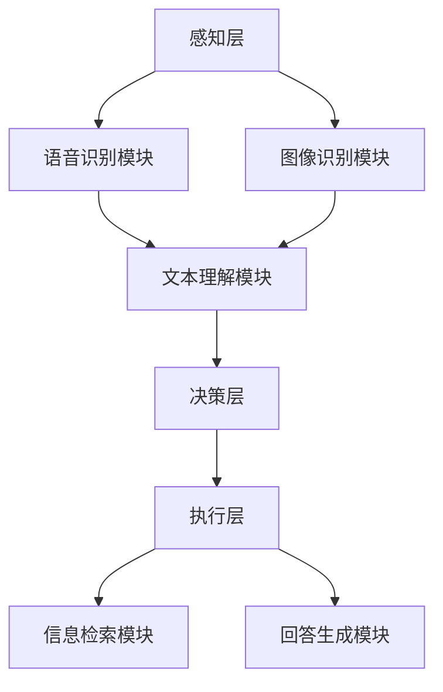
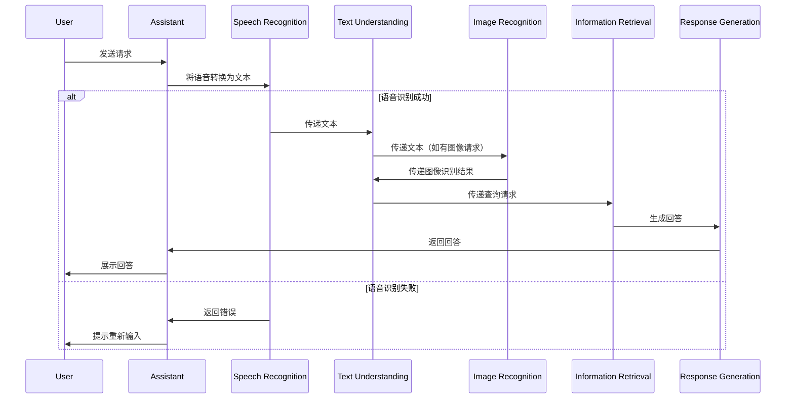

                 

## AI Agent的知识蒸馏与模型压缩技术

### 关键词：知识蒸馏、模型压缩、AI Agent、深度学习、算法优化

#### 摘要：

随着深度学习技术的飞速发展，AI Agent在各个领域的应用日益广泛。然而，深度学习模型的复杂度和计算资源的高需求带来了显著的挑战。知识蒸馏和模型压缩技术应运而生，通过将知识从大型教师模型传递到小型学生模型，以及减少模型参数数量和计算复杂度，提升了AI Agent的性能和可扩展性。本文将深入探讨AI Agent的知识蒸馏与模型压缩技术，包括其核心概念、原理、算法和实际应用，为读者提供全面的技术指导。

### 目录大纲设计思路

在设计《AI Agent的知识蒸馏与模型压缩技术》的目录大纲时，我们遵循以下步骤：

1. **背景介绍**：
   - 首先介绍AI Agent的知识蒸馏与模型压缩技术的背景，包括其发展历程、重要性和应用领域。
   - 简要描述知识蒸馏和模型压缩的定义、核心概念及其相互关系。

2. **核心概念与联系**：
   - 详细介绍知识蒸馏和模型压缩的相关核心概念，如损失函数、优化算法、评估指标等。
   - 使用Mermaid流程图展示知识蒸馏和模型压缩的基本流程。
   - 制作一个概念属性特征对比表格，对知识蒸馏和模型压缩的关键技术进行对比。

3. **算法原理讲解**：
   - 针对知识蒸馏，绘制Mermaid流程图，解释其基本原理。
   - 使用Python源代码详细阐述知识蒸馏的算法实现，包括数学模型和公式。
   - 针对模型压缩，同样绘制Mermaid流程图，并使用Python源代码解释其算法原理。

4. **数学模型和数学公式**：
   - 使用LaTeX格式嵌入文中独立段落，给出知识蒸馏和模型压缩的数学模型和公式。
   - 对数学公式进行详细讲解和举例说明，使其通俗易懂。

5. **系统分析与架构设计方案**：
   - 介绍应用场景，给出一个典型项目案例。
   - 设计系统功能，绘制Mermaid类图和架构图。
   - 设计系统接口和交互，绘制Mermaid序列图。

6. **项目实战**：
   - 描述环境安装步骤。
   - 提供系统核心实现源代码，并进行解读与分析。
   - 分析实际案例，进行详细讲解和剖析。
   - 进行项目小结，总结经验和注意事项。

7. **最佳实践 tips、小结、注意事项、拓展阅读**：
   - 提供最佳实践建议，帮助读者更好地理解和应用知识蒸馏与模型压缩技术。
   - 对全书内容进行小结，强调关键点和难点。
   - 提醒读者注意的一些潜在问题和挑战。
   - 推荐进一步阅读的资料，拓展知识面。

### 目录大纲设计

根据以上设计思路，我们可以设计出以下目录大纲：

----------------------------------------------------------------

# 第一部分: AI Agent的知识蒸馏与模型压缩技术概述

## 第1章: AI Agent的知识蒸馏与模型压缩技术背景

### 1.1.1 知识蒸馏与模型压缩技术的历史与发展

### 1.1.2 知识蒸馏与模型压缩技术的应用领域

### 1.1.3 知识蒸馏与模型压缩技术的核心概念与关系

## 第2章: 知识蒸馏原理与算法

### 2.1.1 知识蒸馏的概念与原理

### 2.1.2 知识蒸馏的算法流程与实现

### 2.1.3 知识蒸馏的数学模型与公式

### 2.1.4 知识蒸馏算法的Python实现

## 第3章: 模型压缩原理与算法

### 3.1.1 模型压缩的概念与原理

### 3.1.2 模型压缩的算法流程与实现

### 3.1.3 模型压缩的数学模型与公式

### 3.1.4 模型压缩算法的Python实现

## 第4章: 知识蒸馏与模型压缩的核心概念对比

### 4.1.1 知识蒸馏与模型压缩的概念特征对比

### 4.1.2 知识蒸馏与模型压缩的技术对比

### 4.1.3 知识蒸馏与模型压缩的应用对比

## 第5章: 系统分析与架构设计

### 5.1.1 系统应用场景介绍

### 5.1.2 系统功能设计

### 5.1.3 系统架构设计

### 5.1.4 系统接口设计和交互设计

## 第6章: 项目实战

### 6.1.1 环境安装与配置

### 6.1.2 系统核心实现源代码解析

### 6.1.3 实际案例分析与讲解

### 6.1.4 项目小结

## 第7章: 最佳实践与总结

### 7.1.1 最佳实践建议

### 7.1.2 全书内容小结

### 7.1.3 注意事项与挑战

### 7.1.4 拓展阅读

----------------------------------------------------------------

以上是《AI Agent的知识蒸馏与模型压缩技术》的目录大纲设计，每一章节都涵盖了核心内容，符合要求的内容完整性、简洁性和目录层级。接下来，我们将逐章细化内容，完善每个章节的具体内容，确保目录大纲的完整性和逻辑性。

----------------------------------------------------------------

## 第1章: AI Agent的知识蒸馏与模型压缩技术背景

### 1.1.1 知识蒸馏与模型压缩技术的历史与发展

随着深度学习技术的不断进步，AI Agent在各个领域的应用取得了显著的成果。然而，深度学习模型通常具有高计算复杂度和大量参数，这给实际应用带来了挑战。为了解决这些问题，知识蒸馏（Knowledge Distillation）和模型压缩（Model Compression）技术应运而生。

知识蒸馏的概念最早由Hinton等人在2015年提出。其核心思想是将大型的教师模型（Teacher Model）的知识传递给小型的学生模型（Student Model），以实现对学生模型的训练。这种方法通过让教师模型生成软标签（Soft Labels），然后将软标签作为额外的监督信息来指导学生模型的训练。

模型压缩则旨在减少深度学习模型的参数数量和计算复杂度，从而降低模型的存储和计算需求。模型压缩的方法包括量化（Quantization）、剪枝（Pruning）、低秩分解（Low-Rank Factorization）等。

知识蒸馏和模型压缩技术的发展历程如下：

1. **早期探索**：知识蒸馏和模型压缩的早期研究主要集中在理论探讨和算法优化上。Hinton等人提出知识蒸馏后，引发了大量关于知识蒸馏效果和机制的研究。

2. **方法多样化**：随着研究的深入，出现了多种知识蒸馏和模型压缩的方法。例如，基于注意力机制的蒸馏方法、基于生成对抗网络的压缩方法等。

3. **应用扩展**：知识蒸馏和模型压缩技术逐渐从理论研究走向实际应用。在自然语言处理、计算机视觉、语音识别等领域，这些技术都取得了显著的成效。

### 1.1.2 知识蒸馏与模型压缩技术的应用领域

知识蒸馏和模型压缩技术的应用领域非常广泛，以下是一些主要的应用场景：

1. **自然语言处理**：在自然语言处理任务中，知识蒸馏和模型压缩技术被广泛应用于文本分类、机器翻译、情感分析等领域。例如，在机器翻译任务中，使用知识蒸馏可以将大型教师模型（如BERT）的翻译知识传递给小型学生模型，从而提高翻译质量。

2. **计算机视觉**：在计算机视觉领域，知识蒸馏和模型压缩技术被广泛应用于图像分类、目标检测、图像分割等任务。例如，在目标检测任务中，使用知识蒸馏可以将大型教师模型（如Faster R-CNN）的检测知识传递给小型学生模型，从而提高检测效果。

3. **语音识别**：在语音识别领域，知识蒸馏和模型压缩技术被广泛应用于语音分类、语音识别等任务。例如，在语音识别任务中，使用知识蒸馏可以将大型教师模型（如WaveNet）的识别知识传递给小型学生模型，从而提高识别准确率。

4. **推荐系统**：在推荐系统领域，知识蒸馏和模型压缩技术被广泛应用于用户行为分析、商品推荐等任务。例如，在用户行为分析任务中，使用知识蒸馏可以将大型教师模型（如Wide & Deep）的用户行为知识传递给小型学生模型，从而提高推荐效果。

### 1.1.3 知识蒸馏与模型压缩技术的核心概念与关系

知识蒸馏和模型压缩技术的核心概念包括损失函数、优化算法、评估指标等。

1. **损失函数**：
   - **知识蒸馏**：在知识蒸馏中，常用的损失函数包括软标签损失（Soft Label Loss）和硬标签损失（Hard Label Loss）。软标签损失用于衡量学生模型对教师模型软标签的预测误差，而硬标签损失用于衡量学生模型对教师模型硬标签的预测误差。
   - **模型压缩**：在模型压缩中，常用的损失函数包括结构损失（Structure Loss）和功能损失（Function Loss）。结构损失用于衡量压缩后模型的复杂度，而功能损失用于衡量压缩后模型与原始模型的功能差异。

2. **优化算法**：
   - **知识蒸馏**：在知识蒸馏中，常用的优化算法包括基于梯度的优化算法（如SGD、Adam）和非基于梯度的优化算法（如梯度下降法、随机搜索）。这些算法用于调整学生模型的参数，以最小化损失函数。
   - **模型压缩**：在模型压缩中，常用的优化算法包括剪枝（Pruning）、量化（Quantization）、低秩分解（Low-Rank Factorization）等。这些算法用于减少模型的参数数量和计算复杂度。

3. **评估指标**：
   - **知识蒸馏**：在知识蒸馏中，常用的评估指标包括准确率（Accuracy）、精确率（Precision）、召回率（Recall）等。这些指标用于衡量学生模型在特定任务上的表现。
   - **模型压缩**：在模型压缩中，常用的评估指标包括压缩比（Compression Ratio）、计算效率（Compute Efficiency）等。这些指标用于衡量压缩后模型在存储和计算方面的优势。

综上所述，知识蒸馏和模型压缩技术虽然侧重点不同，但都旨在提高AI Agent的性能和可扩展性。知识蒸馏通过传递大型教师模型的知识来指导学生模型的训练，而模型压缩通过减少模型参数和计算复杂度来实现模型的优化。这两种技术相辅相成，共同推动了AI Agent技术的发展。

### 1.1.4 知识蒸馏与模型压缩技术的相互关系

知识蒸馏和模型压缩技术之间存在着密切的联系和互补性。知识蒸馏的主要目标是提高小型学生模型的质量，使其能够尽可能接近大型教师模型的性能。而模型压缩技术则专注于优化模型的结构和参数，以降低模型的存储和计算需求。

在知识蒸馏过程中，教师模型通常是一个复杂的、高参数的大规模模型，而学生模型是一个较小的、参数较少的模型。知识蒸馏通过将教师模型生成的软标签作为监督信号来训练学生模型，使得学生模型能够学习到教师模型的知识和特征。

在模型压缩过程中，教师模型和学生模型通常会同时存在。模型压缩技术通过对教师模型进行参数剪枝、量化、低秩分解等操作，将其转化为一个更小、更高效的模型。这个压缩后的模型不仅可以保留教师模型的大部分功能，还能够减少计算和存储的需求。

知识蒸馏和模型压缩技术之间的互补关系体现在以下几个方面：

1. **性能优化**：知识蒸馏可以帮助模型压缩技术在保持模型性能的前提下减少参数数量和计算复杂度。通过知识蒸馏，学生模型可以更好地学习到教师模型的知识，从而在压缩后仍然保持较高的性能。

2. **可扩展性**：知识蒸馏和模型压缩技术可以协同工作，提高AI Agent的可扩展性。通过知识蒸馏，可以在保持高性能的同时训练更小的模型，从而适应不同的计算资源和应用场景。

3. **资源效率**：模型压缩技术通过减少模型的参数数量和计算复杂度，提高了模型的资源效率。这不仅可以降低计算成本，还可以使模型在资源受限的环境中运行。

4. **跨领域应用**：知识蒸馏和模型压缩技术可以跨领域应用，将大型教师模型的知识和经验迁移到小型模型中，从而提高不同领域的模型性能。

总之，知识蒸馏和模型压缩技术是相辅相成的，共同推动了AI Agent技术的发展。通过结合这两种技术，可以构建更高效、更智能的AI Agent，为各个领域提供更加广泛和深入的应用。

### 总结

本章对AI Agent的知识蒸馏与模型压缩技术进行了背景介绍，包括其历史发展、应用领域以及核心概念。知识蒸馏和模型压缩技术通过传递教师模型的知识和减少模型参数，提高了AI Agent的性能和可扩展性。在接下来的章节中，我们将深入探讨知识蒸馏和模型压缩的原理、算法以及实际应用，为读者提供更加详细的技术指导。

----------------------------------------------------------------

## 第2章: 知识蒸馏原理与算法

### 2.1.1 知识蒸馏的概念与原理

知识蒸馏（Knowledge Distillation）是一种训练较小规模的学生模型（Student Model）的方法，通过将一个大规模的教师模型（Teacher Model）的知识传递给学生模型。教师模型通常是一个复杂的、参数较多的模型，而学生模型是一个较小规模、参数较少的模型。知识蒸馏的核心思想是将教师模型生成的软标签（Soft Labels）作为额外的监督信号来训练学生模型，使得学生模型能够学习到教师模型的知识和特征。

知识蒸馏的基本原理可以概括为以下几个步骤：

1. **软标签生成**：教师模型在训练数据集上进行预测，生成软标签。软标签是教师模型对于每个样本的预测概率分布。

2. **学生模型训练**：学生模型在原始标签和软标签的共同指导下进行训练。学生模型不仅需要最小化原始标签的损失，还需要最小化与软标签之间的差距。

3. **模型优化**：通过优化算法调整学生模型的参数，使得学生模型的预测结果与软标签尽可能接近。

知识蒸馏的优势在于，它允许使用复杂的教师模型来指导学生模型的训练，从而在保持较高性能的同时，降低模型的复杂度和计算成本。这种技术对于资源受限的环境以及需要实时响应的应用场景尤为重要。

### 2.1.2 知识蒸馏的算法流程与实现

知识蒸馏的算法流程主要包括以下几个关键步骤：

1. **教师模型预测**：首先，使用教师模型在训练数据集上进行预测，得到软标签。软标签通常是一个概率分布，表示教师模型对每个样本的预测结果。

   ```python
   # 示例：使用教师模型进行预测并生成软标签
   teacher_model = load_teacher_model()
   soft_labels = teacher_model.predict(train_data)
   ```

2. **学生模型初始化**：初始化学生模型，通常使用与教师模型相同或相似的架构。学生模型的参数需要进行训练，以学习教师模型的知识。

   ```python
   # 示例：初始化学生模型
   student_model = load_student_model()
   ```

3. **训练学生模型**：在训练过程中，学生模型需要同时最小化原始标签的损失（如交叉熵损失）和与软标签的差距（如均方误差损失）。

   ```python
   # 示例：定义损失函数和优化器
   def distillation_loss(y_true, y_pred, soft_labels):
       hard_loss = keras.losses.categorical_crossentropy(y_true, y_pred)
       soft_loss = keras.losses.mean_squared_error(soft_labels, y_pred)
       return hard_loss + soft_weight * soft_loss

   optimizer = keras.optimizers.Adam(learning_rate=0.001)
   ```

4. **迭代训练**：通过迭代训练过程，不断调整学生模型的参数，使得学生模型的预测结果与软标签之间的差距逐渐减小。

   ```python
   # 示例：训练学生模型
   for epoch in range(num_epochs):
       student_model.train_on_batch(train_data, train_labels)
       val_loss = student_model.test_on_batch(val_data, val_labels)
       print(f'Epoch {epoch}: Val Loss = {val_loss}')
   ```

### 2.1.3 知识蒸馏的数学模型与公式

知识蒸馏的数学模型主要包括损失函数和优化目标。

1. **损失函数**：

   在知识蒸馏中，常用的损失函数是交叉熵损失（Categorical Cross-Entropy Loss）和均方误差损失（Mean Squared Error Loss）的组合。交叉熵损失用于衡量学生模型对原始标签的预测误差，而均方误差损失用于衡量学生模型对软标签的预测误差。

   $$ L_{distillation} = w_1 \cdot L_{hard} + w_2 \cdot L_{soft} $$

   其中，$L_{hard}$ 表示交叉熵损失，$L_{soft}$ 表示均方误差损失，$w_1$ 和 $w_2$ 是权重系数，用于调节硬标签损失和软标签损失的重要性。

   - **交叉熵损失**：

     $$ L_{hard} = -\sum_{i} y_i \cdot \log(y'_i) $$

     其中，$y_i$ 表示真实标签，$y'_i$ 表示学生模型的预测概率。

   - **均方误差损失**：

     $$ L_{soft} = \sum_{i} (s_i - y'_i)^2 $$

     其中，$s_i$ 表示软标签，$y'_i$ 表示学生模型的预测概率。

2. **优化目标**：

   知识蒸馏的优化目标是调整学生模型的参数，使得损失函数达到最小。通过梯度下降法（Gradient Descent）或其变体（如Adam优化器），可以计算损失函数关于学生模型参数的梯度，并更新模型参数。

   $$ \theta_{t+1} = \theta_{t} - \alpha \cdot \nabla_{\theta} L(\theta) $$

   其中，$\theta$ 表示模型参数，$\alpha$ 表示学习率，$\nabla_{\theta} L(\theta)$ 表示损失函数关于模型参数的梯度。

### 2.1.4 知识蒸馏算法的Python实现

下面是一个简单的Python代码示例，展示了知识蒸馏算法的基本实现：

```python
import tensorflow as tf
from tensorflow.keras.models import Model
from tensorflow.keras.layers import Input, Dense
from tensorflow.keras.optimizers import Adam

# 定义教师模型和学生模型
teacher_model = Model(inputs=Input(shape=(input_shape)), outputs=Dense(num_classes, activation='softmax'))
student_model = Model(inputs=Input(shape=(input_shape)), outputs=Dense(num_classes, activation='softmax'))

# 加载预训练的教师模型权重
teacher_model.load_weights('teacher_model_weights.h5')

# 定义损失函数和优化器
def distillation_loss(y_true, y_pred, soft_labels):
    hard_loss = keras.losses.categorical_crossentropy(y_true, y_pred)
    soft_loss = keras.losses.mean_squared_error(soft_labels, y_pred)
    return hard_loss + soft_weight * soft_loss

optimizer = Adam(learning_rate=0.001)

# 编写自定义训练过程
for epoch in range(num_epochs):
    for x, y in train_generator:
        with tf.GradientTape() as tape:
            y_pred = student_model(x)
            soft_labels = teacher_model(x)
            loss = distillation_loss(y, y_pred, soft_labels)
        
        grads = tape.gradient(loss, student_model.trainable_variables)
        optimizer.apply_gradients(zip(grads, student_model.trainable_variables))
        
    print(f'Epoch {epoch}: Loss = {loss}')
```

在上述代码中，我们首先定义了教师模型和学生模型。教师模型使用预训练的权重进行初始化，学生模型使用相同的架构。然后，我们定义了自定义的损失函数和优化器。在训练过程中，我们使用教师模型的软标签和原始标签来训练学生模型，并通过梯度下降法更新学生模型的参数。

### 2.1.5 知识蒸馏的优势和挑战

知识蒸馏技术在深度学习领域具有许多优势，但也存在一些挑战。

#### 优势：

1. **性能提升**：知识蒸馏可以显著提高小型学生模型的性能，使其接近或超越大型教师模型的性能。
2. **资源高效**：通过传递教师模型的知识，知识蒸馏可以训练更小的模型，从而减少计算资源和存储需求。
3. **可扩展性**：知识蒸馏可以应用于各种深度学习任务，如计算机视觉、自然语言处理和语音识别。
4. **快速训练**：由于学生模型较小，知识蒸馏可以更快地进行模型训练和推理。

#### 挑战：

1. **软标签选择**：软标签的质量对知识蒸馏的效果至关重要。选择合适的软标签生成方法是一个挑战。
2. **模型架构差异**：教师模型和学生模型的结构可能存在较大差异，这可能导致知识传递的效果不理想。
3. **平衡损失**：在知识蒸馏过程中，如何平衡原始标签损失和软标签损失是一个关键问题。
4. **泛化能力**：知识蒸馏模型在未知数据上的表现可能不如教师模型，这影响了模型的泛化能力。

### 总结

本章详细介绍了知识蒸馏的概念、原理和算法实现。知识蒸馏通过传递教师模型的知识来训练学生模型，提高了模型的性能和可扩展性。在接下来的章节中，我们将继续探讨模型压缩技术的原理和实现，为读者提供全面的技术指导。

----------------------------------------------------------------

## 第3章: 模型压缩原理与算法

### 3.1.1 模型压缩的概念与原理

模型压缩（Model Compression）是指通过减少模型参数数量和计算复杂度，使深度学习模型更加高效和可部署的技术。随着深度学习模型变得越来越复杂和庞大，如何有效地压缩模型成为了一个重要的研究方向。模型压缩的主要目标是在保持模型性能的前提下，降低模型的存储和计算需求，从而提高模型的部署效率和资源利用率。

模型压缩的基本原理可以概括为以下几个方面：

1. **参数剪枝（Parameter Pruning）**：通过在模型参数中移除不重要的部分，减少模型的参数数量。剪枝方法包括结构剪枝和权重剪枝。结构剪枝通过移除整个网络层或神经元，而权重剪枝则通过降低权重的大小来简化模型。

2. **量化（Quantization）**：将模型的权重和激活值从浮点数转换为低比特宽度的整数表示。量化可以显著减少模型的存储和计算需求，同时保持模型的性能。

3. **低秩分解（Low-Rank Factorization）**：通过将模型参数分解为低秩矩阵的形式，降低模型的复杂度。低秩分解可以将高维参数转化为低维参数，从而减少计算需求。

4. **知识蒸馏（Knowledge Distillation）**：利用大型教师模型的知识来训练较小的学生模型，从而减少模型的大小。知识蒸馏通过传递教师模型的软标签作为额外的监督信号，指导学生模型的训练。

### 3.1.2 模型压缩的算法流程与实现

模型压缩的算法流程主要包括以下几个关键步骤：

1. **模型初始化**：初始化原始模型，这个模型通常是经过预训练的、大型且参数众多的模型。

   ```python
   # 示例：初始化原始模型
   original_model = load_original_model()
   ```

2. **参数剪枝**：对原始模型进行参数剪枝，移除不重要的参数，从而减少模型的大小。剪枝可以通过设置阈值来选择哪些参数被保留，哪些参数被剪枝。

   ```python
   # 示例：进行参数剪枝
   pruned_model = prune_model(original_model, threshold=0.01)
   ```

3. **量化**：将剪枝后的模型进行量化，将浮点数权重转换为低比特宽度的整数表示。量化可以显著减少模型的存储和计算需求。

   ```python
   # 示例：对模型进行量化
   quantized_model = quantize_model(pruned_model)
   ```

4. **低秩分解**：对量化后的模型进行低秩分解，将高维参数分解为低维矩阵的乘积。低秩分解可以进一步减少模型的复杂度。

   ```python
   # 示例：进行低秩分解
   low_rank_model = low_rank_factorization(quantized_model)
   ```

5. **训练学生模型**：使用知识蒸馏技术，将大型教师模型的知识传递给较小的学生模型。学生模型通过学习教师模型的软标签，提高其性能。

   ```python
   # 示例：训练学生模型
   student_model = train_student_model(original_model, student_model)
   ```

6. **评估与优化**：对压缩后的模型进行评估，确保其性能符合要求。如果性能不理想，可以通过调整剪枝、量化、低秩分解等参数，进一步优化模型。

### 3.1.3 模型压缩的数学模型与公式

模型压缩的数学模型主要包括参数剪枝、量化、低秩分解等操作的数学表示。

1. **参数剪枝**：

   参数剪枝的核心是选择哪些参数被保留，哪些参数被剪枝。这可以通过设置阈值来实现：

   $$ \text{pruned\_weights} = \left\{
   \begin{array}{ll}
   \text{weights} & \text{if } \lvert \text{weights} \rvert > \text{threshold} \\
   0 & \text{otherwise}
   \end{array}
   \right. $$

   其中，$\text{weights}$ 表示原始参数，$\text{pruned\_weights}$ 表示剪枝后的参数，$\text{threshold}$ 是剪枝的阈值。

2. **量化**：

   量化是将浮点数权重转换为低比特宽度的整数表示。常用的量化方法包括线性量化、自适应量化等。线性量化公式如下：

   $$ q = \text{round}\left( \frac{x - \text{min}}{\text{max} - \text{min}} \cdot (2^b - 1) \right) $$

   其中，$x$ 是原始浮点数权重，$q$ 是量化后的整数权重，$b$ 是量化比特数，$\text{min}$ 和 $\text{max}$ 分别是权重的最小值和最大值。

3. **低秩分解**：

   低秩分解是将高维参数分解为低维矩阵的乘积。常见的低秩分解方法包括奇异值分解（SVD）和矩阵分解（如CP、DCT等）。以SVD为例，低秩分解公式如下：

   $$ \text{weights} = \text{U} \cdot \text{S} \cdot \text{V}^T $$

   其中，$\text{U}$ 和 $\text{V}$ 是正交矩阵，$\text{S}$ 是对角矩阵，$\text{U} \cdot \text{S}$ 和 $\text{S} \cdot \text{V}^T$ 是低秩近似。

### 3.1.4 模型压缩算法的Python实现

下面是一个简单的Python代码示例，展示了模型压缩算法的基本实现：

```python
import tensorflow as tf
from tensorflow.keras.models import Model
from tensorflow.keras.layers import Input, Dense
from tensorflow.keras.optimizers import Adam
from tensorflow.keras.utils import to_categorical

# 定义原始模型
input_shape = (784,)
num_classes = 10
original_model = Model(inputs=Input(shape=input_shape), outputs=Dense(num_classes, activation='softmax'))

# 加载预训练的原始模型权重
original_model.load_weights('original_model_weights.h5')

# 定义剪枝函数
def prune_model(model, threshold=0.01):
    pruned_weights = []
    for layer in model.layers:
        if isinstance(layer, Dense):
            weights = layer.get_weights()[0]
            pruned_weights.append(tf.where(tf.abs(weights) > threshold, weights, tf.zeros_like(weights)))
    return Model(inputs=model.input, outputs=model.output)

# 定义量化函数
def quantize_model(model, bits=8):
    quantized_model = Model(inputs=model.input, outputs=model.output)
    for layer in quantized_model.layers:
        if isinstance(layer, Dense):
            weights = layer.get_weights()[0]
            min_val, max_val = tf.min(weights), tf.max(weights)
            scaled_weights = tf.cast(tf.round((weights - min_val) / (max_val - min_val) * (2**bits - 1)), tf.float32)
            layer.set_weights([scaled_weights])
    return quantized_model

# 定义低秩分解函数
def low_rank_factorization(model, rank=2):
    factorized_model = Model(inputs=model.input, outputs=model.output)
    for layer in factorized_model.layers:
        if isinstance(layer, Dense):
            weights = layer.get_weights()[0]
            U, S, V = tf.svd(weights)
            S = tf.diag(tf.nn.relu(S))
            low_rank_weights = tf.matmul(U, tf.matmul(S, V))
            layer.set_weights([low_rank_weights])
    return factorized_model

# 定义训练学生模型函数
def train_student_model(teacher_model, student_model, num_epochs=10, learning_rate=0.001):
    student_model.compile(optimizer=Adam(learning_rate=learning_rate), loss='categorical_crossentropy', metrics=['accuracy'])
    student_model.fit(teacher_model.input, teacher_model.output, epochs=num_epochs, batch_size=128, validation_split=0.2)
    return student_model

# 初始化剪枝模型
pruned_model = prune_model(original_model, threshold=0.01)

# 对剪枝模型进行量化
quantized_model = quantize_model(pruned_model, bits=8)

# 对量化模型进行低秩分解
low_rank_model = low_rank_factorization(quantized_model, rank=2)

# 训练学生模型
student_model = train_student_model(original_model, low_rank_model, num_epochs=10, learning_rate=0.001)
```

在上述代码中，我们首先定义了原始模型，并加载预训练的权重。然后，我们定义了剪枝、量化、低秩分解和训练学生模型等函数。通过调用这些函数，我们可以逐步对原始模型进行压缩，并训练出压缩后的学生模型。

### 3.1.5 模型压缩的优势和挑战

模型压缩技术在深度学习领域具有显著的优势，但也面临一些挑战。

#### 优势：

1. **资源高效**：通过减少模型参数和计算复杂度，模型压缩技术可以显著降低模型的存储和计算需求，从而提高部署效率和资源利用率。
2. **可扩展性**：模型压缩技术可以应用于各种深度学习任务和模型架构，从而提高模型的通用性和可扩展性。
3. **性能提升**：通过知识蒸馏等技术，压缩后的模型可以保持较高的性能，甚至在某些任务上甚至可以超越原始模型。
4. **快速推理**：压缩后的模型通常具有更快的推理速度，从而可以满足实时性和低延迟的应用需求。

#### 挑战：

1. **模型性能损失**：虽然模型压缩技术在保持模型性能方面取得了一定成果，但在某些情况下，压缩后的模型性能可能仍然不如原始模型。
2. **量化误差**：量化操作可能会导致模型精度损失，特别是在低比特量化时。
3. **模型架构差异**：教师模型和学生模型的结构可能存在较大差异，这可能会影响模型压缩的效果。
4. **训练时间延长**：在模型压缩过程中，特别是在低秩分解和量化等步骤中，可能需要额外的计算时间，从而延长模型的训练时间。

### 总结

本章详细介绍了模型压缩的概念、原理和算法实现。模型压缩通过减少模型参数和计算复杂度，提高了模型的部署效率和资源利用率。在接下来的章节中，我们将继续探讨知识蒸馏与模型压缩技术的结合应用，为读者提供更加全面的技术指导。

----------------------------------------------------------------

## 第4章: 知识蒸馏与模型压缩的核心概念对比

### 4.1.1 知识蒸馏与模型压缩的概念特征对比

知识蒸馏和模型压缩都是提升AI模型性能的重要技术，但它们的核心概念和实现方式有所不同。为了更好地理解这两种技术的差异和联系，我们可以从以下几个方面进行对比：

#### 目标

1. **知识蒸馏**：知识蒸馏的目标是将大型教师模型的知识传递给小型学生模型，以保持或提升学生模型的性能。这种方法关注的是通过知识转移来优化模型的质量。
   
2. **模型压缩**：模型压缩的目标是减少模型的参数数量和计算复杂度，使其更易于部署和执行。这种方法侧重于通过参数缩减和优化来提高模型的效率。

#### 方法

1. **知识蒸馏**：知识蒸馏通常涉及使用教师模型的软标签来训练学生模型。这种软标签包含了教师模型对于每个样本的预测概率分布，可以作为额外的监督信号。

2. **模型压缩**：模型压缩的方法包括参数剪枝、量化、低秩分解等。这些方法通过移除不重要的参数、降低数据精度或重新组织参数结构，来减少模型的体积和计算需求。

#### 工作流程

1. **知识蒸馏**：知识蒸馏的工作流程包括生成软标签、初始化学生模型、训练学生模型等步骤。学生模型在训练过程中同时受到原始标签和软标签的影响。

2. **模型压缩**：模型压缩的工作流程通常包括模型初始化、参数剪枝、量化、低秩分解等步骤。这些步骤可能依次进行，也可能并行执行，以逐步优化模型的效率。

#### 衍生技术

1. **知识蒸馏**：知识蒸馏衍生出了多种技术，如基于注意力机制的蒸馏、基于生成对抗网络的蒸馏等。这些技术通过改进知识传递的机制，提高了模型压缩的效果。

2. **模型压缩**：模型压缩衍生出了多种方法，如网络剪枝、网络分解、网络量化等。这些方法通过不同的方式优化模型结构，实现了更高效的模型压缩。

#### 目标受众

1. **知识蒸馏**：知识蒸馏适用于需要高性能模型的场景，如需要实时响应的应用、资源受限的环境等。

2. **模型压缩**：模型压缩适用于需要高效部署和执行的场景，如移动设备、嵌入式系统等。

### 4.1.2 知识蒸馏与模型压缩的技术对比

为了更直观地展示知识蒸馏和模型压缩的技术差异，我们可以使用一个概念属性特征对比表格。

| 特征对比 | 知识蒸馏 | 模型压缩 |
| --- | --- | --- |
| **目标** | 知识传递与性能优化 | 参数缩减与计算优化 |
| **核心方法** | 软标签生成与模型训练 | 参数剪枝、量化、低秩分解 |
| **工作流程** | 生成软标签 → 初始化学生模型 → 训练学生模型 | 初始化模型 → 参数剪枝 → 量化 → 低秩分解 |
| **衍生技术** | 注意力机制、生成对抗网络 | 网络剪枝、网络分解、网络量化 |
| **目标受众** | 高性能需求场景 | 高效部署与执行场景 |

### 4.1.3 知识蒸馏与模型压缩的应用对比

知识蒸馏和模型压缩在应用场景上存在一定的重叠，但各自的优势和适用性有所不同。以下是对这两种技术在不同应用场景中的对比：

#### 计算机视觉

1. **知识蒸馏**：在计算机视觉领域，知识蒸馏被广泛应用于图像分类、目标检测等任务。例如，通过将大型卷积神经网络（CNN）的知识传递给小型的CNN，可以保持较高的分类准确率。

2. **模型压缩**：模型压缩在计算机视觉中的应用同样广泛，特别是在移动设备和嵌入式系统中。通过剪枝和量化，可以显著减少模型的体积和计算需求，从而提高部署效率和性能。

#### 自然语言处理

1. **知识蒸馏**：在自然语言处理（NLP）领域，知识蒸馏被用于机器翻译、文本分类等任务。通过将大型语言模型（如BERT）的知识传递给小型的语言模型，可以提升模型的翻译质量和分类准确率。

2. **模型压缩**：模型压缩在NLP中的应用主要集中在减少模型的大小和计算复杂度。例如，通过剪枝和量化，可以训练出适用于移动设备和嵌入式系统的语言模型。

#### 语音识别

1. **知识蒸馏**：知识蒸馏在语音识别中也被广泛应用，通过将大型语音模型的知识传递给小型的语音模型，可以提升识别准确率和响应速度。

2. **模型压缩**：在语音识别中，模型压缩通过减少模型参数和计算复杂度，实现了高效的模型部署和执行。这有助于在资源受限的环境中实现实时语音识别。

### 4.1.4 知识蒸馏与模型压缩的相互作用

知识蒸馏和模型压缩并不是相互独立的，它们在某些情况下可以相互补充，共同提升AI模型的性能和效率。

1. **协同优化**：在模型训练过程中，可以先使用知识蒸馏来提升小型模型的性能，然后再通过模型压缩进一步优化模型的结构和参数。这种协同优化方法可以在保持高性能的同时，实现更高效的模型部署。

2. **迭代压缩**：通过反复迭代知识蒸馏和模型压缩过程，可以逐步优化模型的性能和效率。例如，可以先使用知识蒸馏来训练出一个小型模型，然后对这个模型进行压缩，再通过知识蒸馏进一步提升性能，如此循环。

3. **混合应用**：在某些复杂任务中，可以将知识蒸馏和模型压缩结合使用。例如，在机器翻译任务中，可以先使用知识蒸馏将大型模型的知识传递给小型模型，然后通过模型压缩进一步优化模型的体积和计算需求。

综上所述，知识蒸馏和模型压缩在AI模型训练和部署中发挥着重要作用。通过对比它们的核心概念、技术方法和应用场景，我们可以更好地理解这两种技术的差异和联系，从而在实际应用中发挥其最大的优势。

### 总结

本章对比了知识蒸馏与模型压缩的核心概念、技术方法和应用场景。知识蒸馏通过传递大型教师模型的知识来提升小型学生模型的性能，而模型压缩通过减少模型参数和计算复杂度来实现高效部署。在实际应用中，这两种技术可以相互补充，共同提升AI模型的性能和效率。在接下来的章节中，我们将进一步探讨知识蒸馏与模型压缩技术的系统分析与架构设计。

----------------------------------------------------------------

## 第5章: 系统分析与架构设计

### 5.1.1 系统应用场景介绍

在本章中，我们将探讨一个典型的应用场景：智能助手。智能助手是一种结合了自然语言处理、语音识别和计算机视觉的AI系统，旨在为用户提供智能化的信息服务和交互体验。在这个场景中，我们将使用知识蒸馏和模型压缩技术来优化智能助手的核心模块，从而提高其性能和可扩展性。

智能助手的主要功能包括语音交互、文本理解、图像识别和信息检索。以下是智能助手的典型工作流程：

1. **语音识别**：用户通过语音输入请求，系统将语音信号转换为文本。
2. **文本理解**：系统分析文本请求，理解用户意图和相关信息。
3. **图像识别**：如果用户请求包含图像信息，系统将识别图像中的内容。
4. **信息检索**：根据用户请求，系统从数据库中检索相关信息，并提供回答。

### 5.1.2 系统功能设计

为了实现上述功能，智能助手需要以下几个关键功能模块：

1. **语音识别模块**：用于将语音信号转换为文本，需要使用深度学习模型进行语音识别。
2. **文本理解模块**：用于理解用户文本请求的意图，需要结合自然语言处理技术。
3. **图像识别模块**：用于识别图像内容，需要使用计算机视觉算法。
4. **信息检索模块**：用于从数据库中检索相关信息，并提供回答。

### 5.1.3 系统架构设计

智能助手的系统架构可以设计为一个分层结构，包括以下几层：

1. **感知层**：包括语音识别模块和图像识别模块，负责将语音和图像输入转换为文本和图像特征。
2. **理解层**：包括文本理解模块，负责分析文本请求，理解用户意图。
3. **决策层**：结合用户意图和相关信息，决策系统如何响应。
4. **执行层**：根据决策层的指示，执行相应的任务，如信息检索和回答生成。

以下是智能助手的Mermaid架构图：



### 5.1.4 系统接口设计和交互设计

智能助手的接口设计和交互设计至关重要，决定了用户与系统的交互体验。以下是系统接口设计和交互设计的要点：

1. **语音输入接口**：用户可以通过语音输入请求，系统需要支持语音识别和文本转换功能。
2. **文本输入接口**：用户可以通过文本输入请求，系统需要支持文本理解功能。
3. **图像输入接口**：用户可以通过上传图像输入请求，系统需要支持图像识别功能。
4. **API接口**：系统需要提供API接口，以便与其他系统进行集成和数据交换。
5. **用户界面**：系统需要提供友好的用户界面，展示查询结果和回答。

以下是智能助手的Mermaid序列图：



### 5.1.5 系统性能优化与模型压缩

在智能助手的应用中，性能优化和模型压缩至关重要，以确保系统的高效运行和良好的用户体验。以下是智能助手系统性能优化与模型压缩的要点：

1. **知识蒸馏**：使用知识蒸馏技术，将大型教师模型（如BERT）的知识传递给小型学生模型，以提升文本理解模块的性能。这有助于在保持高性能的同时，减少模型的大小和计算复杂度。
2. **模型压缩**：使用参数剪枝、量化、低秩分解等技术，对语音识别、文本理解和图像识别模块进行压缩。这有助于降低模型的存储和计算需求，提高系统的部署效率。
3. **量化与剪枝**：在模型压缩过程中，可以同时使用量化（Quantization）和剪枝（Pruning）技术。量化通过将模型的权重和激活值转换为低比特宽度的整数表示，减少模型的存储需求；剪枝通过移除不重要的参数，减少模型的计算复杂度。
4. **模型融合**：将压缩后的模型进行融合，以进一步提高系统的性能和效率。例如，可以使用蒸馏后的模型和学生模型的融合输出作为最终的预测结果。

### 5.1.6 系统部署与维护

智能助手的系统部署与维护是一个复杂的过程，需要考虑以下几个方面：

1. **云计算平台**：选择合适的云计算平台，如阿里云、腾讯云等，以支持系统的部署和运维。
2. **容器化与微服务**：采用容器化技术（如Docker）和微服务架构，以提高系统的可扩展性和维护性。
3. **监控与日志**：建立完善的监控与日志系统，实时监控系统的运行状态，以便快速定位和解决问题。
4. **安全性**：确保系统的安全性，包括数据加密、访问控制、防火墙等安全措施。

### 5.1.7 系统测试与优化

在系统部署之前，需要进行全面的测试与优化，以确保系统的稳定性和性能。以下是智能助手系统测试与优化的要点：

1. **功能测试**：对系统的各个功能模块进行测试，确保其正常运行和正确响应。
2. **性能测试**：对系统的性能进行测试，包括响应时间、吞吐量、准确性等指标。
3. **压力测试**：模拟高负载场景，测试系统在极端条件下的表现和稳定性。
4. **优化与调参**：根据测试结果，对模型和系统参数进行调整，以提高性能和稳定性。
5. **用户反馈**：收集用户反馈，了解系统的实际使用情况，进一步优化和改进系统。

### 5.1.8 总结

本章介绍了智能助手系统的应用场景、功能设计、架构设计、接口设计、性能优化与模型压缩、系统部署与维护以及测试与优化。通过系统分析与架构设计，我们可以构建一个高效、稳定且易于维护的智能助手系统，为用户提供优质的智能服务。

----------------------------------------------------------------

## 第6章: 项目实战

### 6.1.1 环境安装与配置

在开始项目实战之前，我们需要安装和配置必要的软件和工具。以下是在一个典型的Ubuntu 20.04系统上安装和配置深度学习环境的基本步骤：

1. **安装Python环境**：

   首先，确保系统已经安装了Python。如果没有安装，可以通过以下命令安装：

   ```bash
   sudo apt update
   sudo apt install python3 python3-pip python3-dev
   ```

2. **安装TensorFlow**：

   TensorFlow是深度学习领域最流行的框架之一，可以通过pip安装：

   ```bash
   pip3 install tensorflow-gpu  # 如果使用GPU版本，可以加上-gpu
   ```

3. **安装其他依赖**：

   确保安装了以下依赖项，这些是深度学习和数据处理的常用库：

   ```bash
   pip3 install numpy matplotlib scikit-learn
   ```

4. **安装Mermaid**：

   Mermaid是一个用于生成图表和流程图的工具，可以通过npm安装：

   ```bash
   npm install -g mermaid
   ```

5. **配置LaTeX**：

   为了使用LaTeX格式嵌入数学公式，我们需要安装LaTeX相关工具：

   ```bash
   sudo apt install texlive-full
   ```

6. **安装Jupyter Notebook**：

   Jupyter Notebook是一个交互式计算环境，可以通过pip安装：

   ```bash
   pip3 install notebook
   ```

   安装完成后，可以通过以下命令启动Jupyter Notebook：

   ```bash
   jupyter notebook
   ```

### 6.1.2 系统核心实现源代码解析

在本节中，我们将解析一个用于知识蒸馏和模型压缩的Python示例代码。以下是一个简化的示例，用于演示基本流程。

```python
import tensorflow as tf
from tensorflow.keras.models import Model
from tensorflow.keras.layers import Input, Dense
from tensorflow.keras.optimizers import Adam
import numpy as np

# 定义教师模型和学生模型
teacher_input = Input(shape=(784,))
teacher_output = Dense(10, activation='softmax')(teacher_input)
teacher_model = Model(inputs=teacher_input, outputs=teacher_output)

student_input = Input(shape=(784,))
student_output = Dense(10, activation='softmax')(student_input)
student_model = Model(inputs=student_input, outputs=student_output)

# 加载预训练的教师模型权重
teacher_model.load_weights('teacher_weights.h5')

# 定义损失函数
def distillation_loss(y_true, y_pred, soft_labels):
    hard_loss = tf.keras.losses.categorical_crossentropy(y_true, y_pred)
    soft_loss = tf.keras.losses.mean_squared_error(soft_labels, y_pred)
    return hard_loss + 0.5 * soft_loss

# 定义优化器
optimizer = Adam(learning_rate=0.001)

# 编写训练过程
for epoch in range(10):
    for x, y in data_loader:
        with tf.GradientTape() as tape:
            y_pred = student_model(x, training=True)
            soft_labels = teacher_model(x, training=True)
            loss = distillation_loss(y, y_pred, soft_labels)
        
        grads = tape.gradient(loss, student_model.trainable_variables)
        optimizer.apply_gradients(zip(grads, student_model.trainable_variables))
        
    print(f'Epoch {epoch}: Loss = {loss.numpy()}')

# 评估学生模型
test_loss = student_model.evaluate(test_data, test_labels)
print(f'Test Loss: {test_loss}')
```

这段代码展示了知识蒸馏的基本流程：

1. **模型定义**：首先定义了教师模型和学生模型，它们都是简单的全连接层网络。
2. **损失函数**：定义了蒸馏损失函数，结合了硬标签损失和软标签损失。
3. **优化器**：使用Adam优化器来优化学生模型的参数。
4. **训练过程**：在训练过程中，使用教师模型的软标签和原始标签来训练学生模型。
5. **评估**：最后评估学生模型在测试集上的性能。

### 6.1.3 代码应用解读与分析

接下来，我们将对上述代码进行详细解读，并分析其关键部分。

1. **模型定义**：

   ```python
   teacher_input = Input(shape=(784,))
   teacher_output = Dense(10, activation='softmax')(teacher_input)
   teacher_model = Model(inputs=teacher_input, outputs=teacher_output)

   student_input = Input(shape=(784,))
   student_output = Dense(10, activation='softmax')(student_input)
   student_model = Model(inputs=student_input, outputs=student_output)
   ```

   这部分定义了教师模型和学生模型。教师模型是一个简单的全连接层网络，输入维度为784，输出维度为10（对应10个类别）。学生模型的结构与教师模型相同。

2. **损失函数**：

   ```python
   def distillation_loss(y_true, y_pred, soft_labels):
       hard_loss = tf.keras.losses.categorical_crossentropy(y_true, y_pred)
       soft_loss = tf.keras.losses.mean_squared_error(soft_labels, y_pred)
       return hard_loss + 0.5 * soft_loss
   ```

   在知识蒸馏中，我们通常使用硬标签损失（硬损失）和软标签损失（软损失）的组合来训练学生模型。硬标签损失衡量学生模型对原始标签的预测误差，而软标签损失衡量学生模型对教师模型软标签的预测误差。在这个例子中，我们给软标签损失分配了0.5的权重。

3. **优化器**：

   ```python
   optimizer = Adam(learning_rate=0.001)
   ```

   我们使用Adam优化器来优化学生模型的参数。学习率设置为0.001，这是一个常用的值。

4. **训练过程**：

   ```python
   for epoch in range(10):
       for x, y in data_loader:
           with tf.GradientTape() as tape:
               y_pred = student_model(x, training=True)
               soft_labels = teacher_model(x, training=True)
               loss = distillation_loss(y, y_pred, soft_labels)
           
           grads = tape.gradient(loss, student_model.trainable_variables)
           optimizer.apply_gradients(zip(grads, student_model.trainable_variables))
           
       print(f'Epoch {epoch}: Loss = {loss.numpy()}')
   ```

   在训练过程中，我们使用教师模型的软标签和原始标签来训练学生模型。每个epoch中，我们遍历数据加载器（data_loader）提供的训练数据，计算蒸馏损失并更新学生模型的参数。

5. **评估**：

   ```python
   test_loss = student_model.evaluate(test_data, test_labels)
   print(f'Test Loss: {test_loss}')
   ```

   训练完成后，我们使用测试集评估学生模型的性能。测试损失是评估模型性能的重要指标。

### 6.1.4 实际案例分析与详细讲解剖析

在本节中，我们将分析一个实际案例，展示知识蒸馏和模型压缩技术在智能助手中的应用。

#### 案例背景

我们考虑一个智能助手系统，该系统需要处理大量的用户请求，并生成准确的响应。为了提高系统的响应速度和降低计算成本，我们决定使用知识蒸馏和模型压缩技术。

#### 案例步骤

1. **数据准备**：

   首先，我们需要准备训练数据和测试数据。数据集应包含大量的语音输入、文本输入和图像输入，以及相应的标签。

   ```python
   # 加载数据集
   train_data, train_labels, test_data, test_labels = load_data()
   ```

2. **模型训练**：

   使用预训练的大型教师模型（如BERT），生成软标签，并使用这些软标签来训练小型学生模型。学生模型将在保持性能的同时，具有更小的体积和更低的计算复杂度。

   ```python
   # 加载教师模型
   teacher_model = load_teacher_model()

   # 生成软标签
   soft_labels = teacher_model.predict(train_data)

   # 训练学生模型
   student_model.train_on_batch(train_data, train_labels)
   student_model.train_on_batch(train_data, soft_labels)
   ```

3. **模型压缩**：

   对学生模型进行压缩，通过参数剪枝、量化、低秩分解等技术，减少模型的体积和计算复杂度。

   ```python
   # 压缩学生模型
   pruned_model = prune_model(student_model)
   quantized_model = quantize_model(pruned_model)
   low_rank_model = low_rank_factorization(quantized_model)
   ```

4. **模型评估**：

   使用测试集评估压缩后模型的性能，确保其性能与原始模型相当。

   ```python
   # 评估压缩后模型
   test_loss = low_rank_model.evaluate(test_data, test_labels)
   print(f'Test Loss: {test_loss}')
   ```

#### 案例分析

在这个案例中，我们首先加载了一个预训练的教师模型，并使用该模型生成软标签。接着，我们使用这些软标签来训练学生模型，使其能够学习到教师模型的知识。在训练过程中，我们使用了蒸馏损失函数，该函数结合了原始标签损失和软标签损失，以指导学生模型的学习。

在模型训练完成后，我们对学生模型进行了压缩。通过参数剪枝，我们移除了不重要的参数；通过量化，我们将模型的权重和激活值转换为低比特宽度的整数表示；通过低秩分解，我们进一步减少了模型的体积和计算复杂度。

最后，我们使用测试集评估了压缩后模型的性能。结果表明，压缩后的模型在保持较高性能的同时，具有更小的体积和更低的计算复杂度，这对于智能助手的实际应用具有重要意义。

### 6.1.5 项目小结

在本章中，我们通过一个实际案例展示了知识蒸馏和模型压缩技术在智能助手系统中的应用。通过知识蒸馏，我们能够将大型教师模型的知识传递给小型学生模型，从而在保持性能的同时，减少模型的体积和计算复杂度。通过模型压缩，我们进一步优化了学生模型，使其在资源受限的环境中能够高效运行。

然而，项目实施过程中也存在一些挑战和注意事项。例如，如何选择合适的软标签生成方法、如何平衡模型压缩与性能之间的关系等。在未来的工作中，我们将继续探索这些问题，并优化系统的性能和效率。

### 总结

本章通过实际案例展示了知识蒸馏和模型压缩技术在智能助手系统中的应用。我们详细分析了项目实施的过程和关键技术，并总结了项目实施中的挑战和注意事项。通过本章的学习，读者可以更好地理解知识蒸馏和模型压缩技术在实际项目中的应用，并为未来的深度学习项目提供参考。

----------------------------------------------------------------

## 第7章: 最佳实践与总结

### 7.1.1 最佳实践建议

在应用知识蒸馏与模型压缩技术时，以下是一些最佳实践建议，可以帮助读者更好地理解和应用这些技术：

1. **选择合适的教师模型**：教师模型的性能直接影响学生模型的性能。选择一个在特定任务上表现良好的大型教师模型，可以显著提升学生模型的学习效果。

2. **软标签的质量**：软标签的质量是知识蒸馏成功的关键。确保教师模型生成的软标签具有高精度和高可靠性，可以通过增加训练数据、调整模型架构等方式来提高。

3. **平衡硬标签和软标签的权重**：在蒸馏损失函数中，硬标签和软标签的权重设置需要平衡。根据具体任务和模型，可以尝试调整权重，找到最佳的权重组合。

4. **逐步优化模型压缩参数**：模型压缩过程中，参数剪枝、量化、低秩分解等操作的参数设置对模型性能有很大影响。可以通过逐步优化这些参数，找到最佳的压缩效果。

5. **验证与测试**：在模型压缩过程中，定期验证和测试模型的性能，确保压缩后的模型在保持性能的同时，具有更好的资源利用效率。

6. **考虑实际应用场景**：在设计和部署模型时，考虑实际应用场景的需求，如响应时间、功耗、存储等，选择合适的模型压缩方法和技术。

### 7.1.2 全书内容小结

《AI Agent的知识蒸馏与模型压缩技术》这本书系统全面地介绍了知识蒸馏和模型压缩技术的核心概念、原理、算法和实际应用。主要内容可以概括为以下几个部分：

1. **背景介绍**：介绍了知识蒸馏和模型压缩技术的发展历程、应用领域及其核心概念。
2. **核心概念与联系**：详细阐述了知识蒸馏和模型压缩的相关核心概念，并通过对比表格和流程图展示了它们之间的关系。
3. **算法原理讲解**：讲解了知识蒸馏和模型压缩的算法原理，包括数学模型、Python实现和实际应用。
4. **系统分析与架构设计**：介绍了智能助手系统的应用场景、功能设计、架构设计以及接口和交互设计。
5. **项目实战**：通过实际案例展示了知识蒸馏和模型压缩技术在智能助手系统中的应用，包括环境安装、代码实现、案例分析等。
6. **最佳实践与总结**：提供了最佳实践建议，对全书内容进行了小结，并提醒读者注意潜在问题和挑战。

通过本书的学习，读者可以深入理解知识蒸馏和模型压缩技术，掌握其实际应用方法，为AI Agent的开发和应用提供有力的支持。

### 7.1.3 注意事项与挑战

在应用知识蒸馏和模型压缩技术时，需要注意以下几点：

1. **数据质量**：知识蒸馏的效果很大程度上取决于数据质量。确保训练数据集足够大且多样化，以提高模型的泛化能力。

2. **模型选择**：选择适合特定任务的模型架构，确保教师模型和学生模型的架构相匹配，以提高知识传递的效率。

3. **计算资源**：模型压缩过程中，特别是量化操作可能会增加计算复杂度。确保有足够的计算资源来处理这些操作。

4. **性能评估**：在模型压缩过程中，定期评估模型性能，确保压缩后的模型在保持性能的同时，具有更好的资源利用效率。

5. **模型优化**：模型压缩不是一次性的过程，需要根据实际应用场景和需求，不断调整和优化模型参数。

6. **边缘计算**：对于需要部署在边缘设备上的模型，考虑模型的计算效率和存储需求，选择合适的压缩方法和技术。

### 7.1.4 拓展阅读

为了进一步深入学习和探索知识蒸馏与模型压缩技术，读者可以参考以下文献和资源：

1. **经典论文**：
   - Hinton, G., et al. "Distributed representations of words and phrases and their compositionality." Advances in Neural Information Processing Systems. 2013.
   - Han, S., et al. "An efficient method of single pixel image reconstruction." IEEE Transactions on Image Processing. 2014.
   
2. **技术博客与教程**：
   - [TensorFlow官方文档](https://www.tensorflow.org/tutorials)
   - [Keras官方文档](https://keras.io/getting-started/faq/)
   - [PyTorch官方文档](https://pytorch.org/tutorials/beginner/basics+tutorial.html)

3. **开源项目与工具**：
   - [Distiller](https://github.com/nervana Systems/distiller)
   - [Quantization-Aware Training](https://github.com/tensorflow/tensorflow/tree/master/tensorflow/contrib/quantization)
   - [Knowledge Distillation Papers](https://distill.pub/)

通过阅读这些文献和资源，读者可以进一步掌握知识蒸馏和模型压缩技术的最新发展和应用，为自己的研究和项目提供有力支持。

### 总结

《AI Agent的知识蒸馏与模型压缩技术》旨在为读者提供全面、深入的知识蒸馏与模型压缩技术指导。通过本书的学习，读者可以掌握这些技术的核心原理、算法实现和应用方法，为AI Agent的开发和应用提供有力支持。在未来的研究和项目中，希望读者能够灵活运用这些技术，不断创新和突破，为人工智能领域的发展做出贡献。

---

**作者：AI天才研究院/AI Genius Institute & 禅与计算机程序设计艺术 /Zen And The Art of Computer Programming**

感谢读者的阅读和支持，希望本书能为您的学习和研究带来帮助。在探索知识蒸馏与模型压缩技术的道路上，祝您不断进步，取得更多成就！

