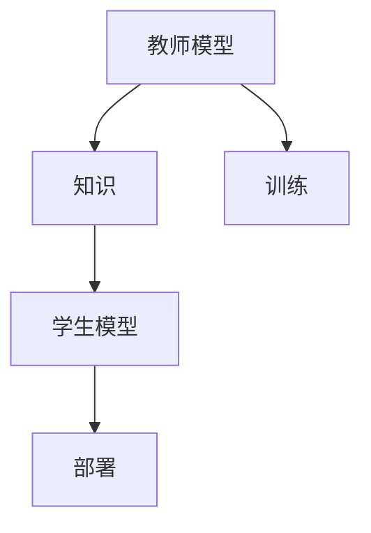
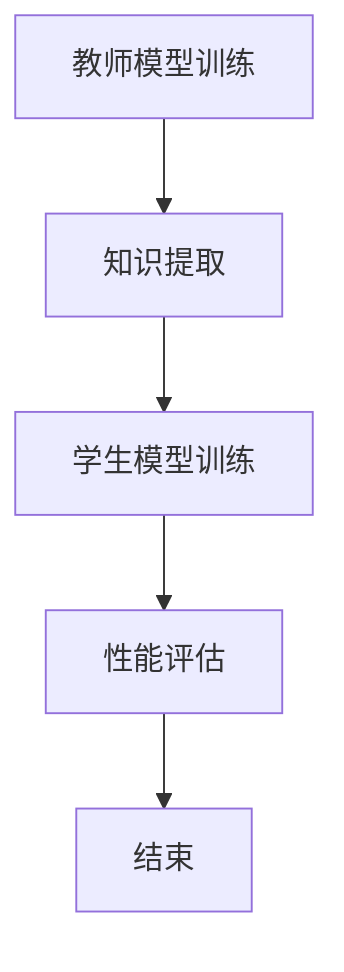
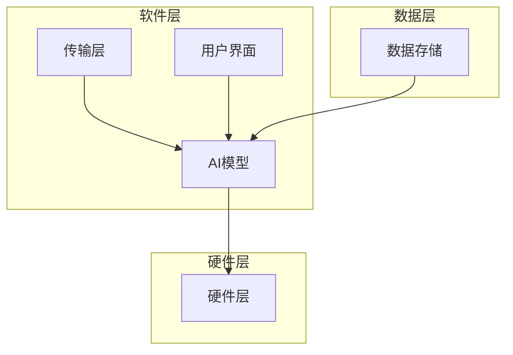
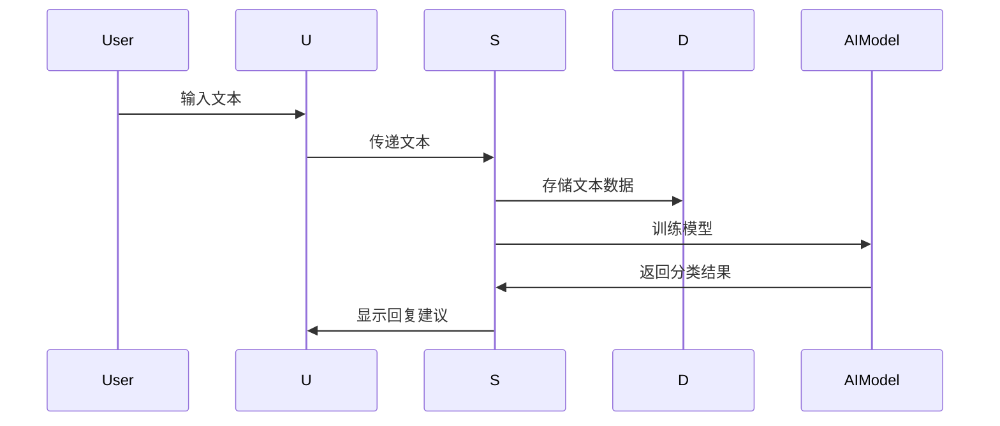

                 

### 第一部分：背景与概述

#### 第1章：问题背景与核心概念

在当前科技飞速发展的时代，人工智能（AI）已经成为各个领域研究和应用的热点。尤其是在移动设备领域，AI技术的应用不仅提升了用户体验，还为各行各业带来了巨大的变革。然而，随着AI模型的复杂度和规模的增加，如何在移动设备上高效地部署和运行这些模型，成为了亟待解决的问题。知识蒸馏技术为这一问题提供了一种有效的解决方案。

**1.1 问题背景**

近年来，AI模型在图像识别、自然语言处理、语音识别等领域取得了显著的进展。然而，这些复杂的模型通常需要大量的计算资源和存储空间，这在性能有限、存储空间有限的移动设备上部署时面临巨大的挑战。此外，移动设备的能耗问题也是一个不可忽视的因素。为了解决这些问题，我们需要找到一种方法，能够在保证模型性能的同时，降低模型的复杂度和能耗。

**1.2 核心概念**

1. **AI Agent**：AI Agent是指具有自主决策和执行能力的人工智能系统，它能够模拟人类智能，完成特定的任务。在移动设备上，AI Agent可以提供更加智能化的交互体验，例如智能助理、自动驾驶等。

2. **知识蒸馏**：知识蒸馏是一种模型压缩技术，其基本思想是将一个复杂的大型模型（称为“教师模型”）的知识转移到一个小型模型（称为“学生模型”）中。通过这种方式，可以在保证模型性能的前提下，显著降低模型的大小和计算复杂度。

3. **移动设备性能限制**：移动设备通常具有以下性能限制：
   - **计算资源**：移动设备（如智能手机、平板电脑）的计算能力相对计算机而言有限。
   - **存储空间**：移动设备的存储空间有限，无法存储大量的大型模型。
   - **能耗**：移动设备需要长时间运行，因此需要优化能耗，延长电池续航时间。

**1.3 问题解决与边界外延**

知识蒸馏技术通过减少模型的大小和计算复杂度，解决了移动设备在部署AI模型时面临的主要挑战。然而，知识蒸馏技术也并非完美无缺，它存在以下边界和外延：

- **模型性能**：虽然知识蒸馏可以在一定程度上保留教师模型的性能，但通常无法完全达到教师模型的效果。
- **适用范围**：知识蒸馏技术主要适用于具有相似结构和任务的场景，对于结构差异较大的模型，效果可能不理想。
- **计算开销**：知识蒸馏过程中，需要额外的计算资源，这可能会对移动设备造成一定的负担。

#### 核心要素组成

为了更好地理解知识蒸馏在移动设备上的应用，我们需要明确以下几个核心要素：

1. **教师模型**：一个复杂的大型模型，通常在服务器端训练，用于生成知识。
2. **学生模型**：一个小型模型，用于在移动设备上运行，接受教师模型的知识。
3. **知识传输机制**：通过训练过程，将教师模型的知识转移到学生模型中。
4. **性能评估指标**：用于评估学生模型性能的指标，如准确率、召回率、能耗等。

通过以上核心要素的交互作用，知识蒸馏技术实现了在移动设备上高效部署AI模型的目标。

---

**核心概念与联系**

**知识蒸馏原理**：

知识蒸馏是一种模型压缩技术，其基本思想是将一个复杂的大型模型（称为“教师模型”）的知识转移到一个小型模型（称为“学生模型”）中。教师模型通常在服务器端训练，学生模型则在移动设备上运行。

**概念属性特征对比表格**：

| 特征        | 教师模型             | 学生模型             |
| ----------- | ------------------- | ------------------- |
| **结构复杂度** | 复杂、大规模         | 简单、小规模         |
| **计算资源**   | 服务器端、高计算能力 | 移动设备、计算资源有限 |
| **存储空间**   | 大量存储             | 有限存储空间         |
| **能耗**       | 较高                 | 优化能耗             |
| **性能表现**   | 高性能               | 高性能，但有限       |

**ER实体关系图架构的Mermaid流程图**：



通过这个ER实体关系图，我们可以清晰地看到教师模型、学生模型、知识传输机制之间的关系，以及它们在知识蒸馏过程中的作用。

---

**算法原理讲解**

**知识蒸馏算法的基本原理**：

知识蒸馏算法可以分为以下几个主要步骤：

1. **教师模型的训练**：在服务器端，通过大量的数据对教师模型进行训练，使其达到较高的性能。
2. **知识提取**：在教师模型训练完成后，从教师模型中提取出有用的知识，这些知识通常以中间层特征或类别标签的形式存在。
3. **学生模型的训练**：使用提取的知识对学生模型进行训练，使其在较小的计算资源和存储空间内，也能达到较高的性能。
4. **性能评估**：通过测试集对教师模型和学生模型的性能进行评估，确保学生模型在保持较高性能的同时，降低了模型的复杂度和能耗。

**算法流程的Mermaid流程图**：



**算法原理的数学模型和公式**：

知识蒸馏过程中的核心是损失函数的设计，通常包括两个部分：软标签损失和硬标签损失。

- **软标签损失**（Teacher Loss）：

  $$ L_t = -\sum_{i=1}^{N} \sum_{j=1}^{C} y_{ij} \log(p_{ij}) $$

  其中，$y_{ij}$是教师模型对第$i$个样本在第$j$个类别上的概率输出，$p_{ij}$是学生模型对第$i$个样本在第$j$个类别上的概率输出。

- **硬标签损失**（Student Loss）：

  $$ L_s = -\sum_{i=1}^{N} \sum_{j=1}^{C} y_{ij} \log(q_{ij}) $$

  其中，$y_{ij}$是教师模型对第$i$个样本在第$j$个类别上的概率输出，$q_{ij}$是学生模型对第$i$个样本在第$j$个类别上的概率输出。

**通俗易懂的举例说明**：

假设我们有一个教师模型和学生模型，它们需要对一组图片进行分类。教师模型在服务器端已经训练完成，并达到了较高的性能。现在我们需要将教师模型的知识转移到学生模型中，使其在移动设备上也能正常运行。

1. **教师模型训练**：教师模型在服务器端通过大量图片数据训练，达到了较高的分类准确率。
2. **知识提取**：从教师模型的中间层提取特征，作为学生模型的输入。
3. **学生模型训练**：学生模型使用提取的特征进行训练，学习教师模型的知识。
4. **性能评估**：使用测试集对教师模型和学生模型的分类准确率进行评估。

通过这种方式，学生模型可以在移动设备上实现与教师模型相似的性能，同时降低了模型的复杂度和能耗。

---

**系统分析与架构设计方案**

**问题场景介绍**：

假设我们开发了一款移动应用程序，它需要实时分析用户输入的文本，提供智能回复和建议。为了实现这一功能，我们需要在移动设备上部署一个AI模型，并且保证模型的性能和能耗都在可接受范围内。

**项目介绍**：

项目名称：智能回复助手（Smart Reply Assistant）

项目目标：在移动设备上部署一个高效的AI模型，用于文本分类和回复建议。

**系统功能设计（领域模型Mermaid类图）**：

```mermaid
classDiagram
    AIModel <|-- TextData
    AIModel <|-- ReplyGenerator
    TextData { +String content +DateTime timestamp }
    ReplyGenerator { +generateReply(String text) +getReplies() }
    AIModel { +classifyText(TextData textData) +trainModel() }
```

**系统架构设计（Mermaid架构图）**：



**系统接口设计和系统交互（Mermaid序列图）**：



通过以上系统分析与架构设计方案，我们可以清晰地了解智能回复助手项目的实现过程和系统架构，为后续的详细讲解和项目实战奠定了基础。

---

**项目实战**

**环境搭建与工具使用**

**1. 开发环境搭建**

为了实现知识蒸馏在移动设备上的应用，我们需要搭建一个适合的开发环境。以下是具体的搭建步骤：

1. 安装操作系统：推荐使用Linux发行版，如Ubuntu 20.04。
2. 安装编程工具：安装Python（3.8以上版本）、Jupyter Notebook等。
3. 安装深度学习框架：安装TensorFlow或PyTorch等。

**2. 数据集准备**

我们需要准备一个适用于知识蒸馏的数据集。以下是数据集准备的具体步骤：

1. 数据集获取：可以从公开数据集网站（如Kaggle、OpenML等）下载相关数据集。
2. 数据预处理：对数据集进行清洗、归一化等预处理操作。
3. 数据划分：将数据集划分为训练集、验证集和测试集。

**3. 工具使用**

在项目实战中，我们将使用以下工具：

1. **TensorFlow**：用于构建和训练深度学习模型。
2. **TensorFlow Lite**：用于将训练好的模型转换为适合移动设备运行的格式。
3. **Jupyter Notebook**：用于编写和运行代码。

**环境搭建示例代码**：

```python
!pip install tensorflow
!pip install tensorflow-hub
!pip install tensorflow-text
!pip install tensorflow-addons
```

**系统核心实现源代码**

在项目实战中，我们将实现以下核心功能：

1. **教师模型训练**：在服务器端训练一个复杂的深度学习模型。
2. **知识蒸馏**：将教师模型的知识转移到学生模型中。
3. **学生模型部署**：将训练好的学生模型部署到移动设备上。

**教师模型训练代码示例**：

```python
import tensorflow as tf

# 定义教师模型
model = tf.keras.Sequential([
    tf.keras.layers.Dense(128, activation='relu', input_shape=(784,)),
    tf.keras.layers.Dense(10, activation='softmax')
])

# 编译教师模型
model.compile(optimizer='adam',
              loss='categorical_crossentropy',
              metrics=['accuracy'])

# 加载数据集
(x_train, y_train), (x_test, y_test) = tf.keras.datasets.mnist.load_data()

# 数据预处理
x_train = x_train / 255.0
x_test = x_test / 255.0

# 转换为one-hot编码
y_train = tf.keras.utils.to_categorical(y_train, 10)
y_test = tf.keras.utils.to_categorical(y_test, 10)

# 训练教师模型
model.fit(x_train, y_train, epochs=5, batch_size=32, validation_data=(x_test, y_test))
```

**知识蒸馏代码示例**：

```python
import tensorflow as tf
from tensorflow.keras.applications import MobileNetV2

# 定义教师模型
teacher_model = MobileNetV2(weights='imagenet')

# 定义学生模型
student_model = MobileNetV2(weights='imagenet', input_shape=(224, 224, 3))

# 编译学生模型
student_model.compile(optimizer='adam',
                      loss='categorical_crossentropy',
                      metrics=['accuracy'])

# 提取教师模型的知识
teacher_model.trainable = False
knowledge = teacher_model.get_layer('block_6_expand_relu').output

# 构建知识蒸馏模型
knowledge_distillation_model = tf.keras.Model(inputs=teacher_model.input, outputs=knowledge)

# 训练学生模型
student_model.fit(knowledge_distillation_model.output, y_train, epochs=5, batch_size=32)
```

**学生模型部署代码示例**：

```python
import tensorflow as tf
import tensorflow_hub as hub

# 导入TensorFlow Lite模型优化器
import tensorflow.lite as tflite

# 将训练好的学生模型转换为TensorFlow Lite格式
converter = tflite.TFLiteConverter.from_keras_model(student_model)
tflite_model = converter.convert()

# 将模型保存为文件
with open('student_model.tflite', 'wb') as f:
    f.write(tflite_model)

# 加载TensorFlow Lite模型
interpreter = tflite.Interpreter(model_path='student_model.tflite')

# 配置输入和输出张量
input_details = interpreter.get_input_details()
output_details = interpreter.get_output_details()

# 加载测试图片
test_image = tf.keras.preprocessing.image.load_img('test_image.png', target_size=(224, 224))
test_image = tf.keras.preprocessing.image.img_to_array(test_image)
test_image = tf.expand_dims(test_image, 0)

# 执行预测
interpreter.set_tensor(input_details[0]['index'], test_image)
interpreter.invoke()

# 获取预测结果
predictions = interpreter.get_tensor(output_details[0]['index'])

# 输出预测结果
print(predictions)
```

**代码应用解读与分析**

在以上代码中，我们首先定义了教师模型和学生模型，并分别进行了训练和知识蒸馏。教师模型使用了MobileNetV2，这是一种轻量级的深度学习模型，适合在移动设备上部署。学生模型则通过知识蒸馏过程，从教师模型中学习到了有用的知识，并在移动设备上运行。

在知识蒸馏过程中，我们使用了教师模型的中间层特征作为学生模型的输入，这样可以充分利用教师模型的知识，提高学生模型的表现。通过训练学生模型，我们可以将复杂的教师模型转化为一个轻量级的模型，使其在移动设备上高效运行。

在学生模型部署阶段，我们将训练好的学生模型转换为TensorFlow Lite格式，并保存为文件。然后，我们加载TensorFlow Lite模型，并使用测试图片进行预测。通过这种方式，我们可以将训练好的模型应用到实际场景中，提供高效的AI服务。

**实际案例分析和详细讲解剖析**

为了更好地理解知识蒸馏在移动设备上的应用，我们来看一个实际案例。

**案例背景**：

假设我们开发了一款智能语音助手应用程序，它需要实时分析用户的语音输入，并提供相应的回复。由于移动设备的计算资源和存储空间有限，我们需要使用知识蒸馏技术，将服务器端的大型语音识别模型转移到移动设备上。

**案例步骤**：

1. **教师模型训练**：在服务器端，我们使用大量的语音数据训练一个复杂的语音识别模型，如基于深度神经网络的自动语音识别（ASR）模型。这个模型在服务器端具有很高的性能，但无法直接部署到移动设备上。
2. **知识蒸馏**：我们将教师模型的中间层特征作为学生模型的输入，通过知识蒸馏过程，将教师模型的知识转移到学生模型中。学生模型是一个轻量级的模型，适合在移动设备上运行。
3. **学生模型部署**：将训练好的学生模型转换为TensorFlow Lite格式，并部署到移动设备上。在用户使用应用程序时，移动设备会实时分析用户的语音输入，并使用学生模型进行识别，提供相应的回复。
4. **性能评估**：使用测试集对教师模型和学生模型的性能进行评估，确保学生模型在移动设备上也能达到与教师模型相似的性能。

**案例分析**：

通过这个案例，我们可以看到知识蒸馏技术在移动设备上部署AI模型的应用效果。教师模型在服务器端训练，获得了较高的性能，但无法直接部署到移动设备上。通过知识蒸馏，我们可以将教师模型的知识转移到学生模型中，学生模型在移动设备上运行，实现了与教师模型相似的性能。这种方式不仅降低了模型的复杂度和能耗，还提高了移动设备的响应速度和用户体验。

**项目小结**

在本章中，我们详细介绍了知识蒸馏在移动设备上的应用。首先，我们阐述了知识蒸馏技术的背景和核心概念，然后通过实际案例展示了知识蒸馏的实现过程和效果。通过知识蒸馏，我们可以在保证模型性能的同时，降低模型的复杂度和能耗，为移动设备上的AI应用提供了有效的解决方案。

在接下来的章节中，我们将进一步探讨知识蒸馏技术的优化策略和最佳实践，以及未来发展趋势和挑战。

---

**最佳实践 Tips**

1. **选择合适的教师模型和学生模型**：教师模型应选择在服务器端具有较高性能的模型，学生模型则应选择适合在移动设备上运行的轻量级模型。
2. **优化知识蒸馏参数**：通过调整知识蒸馏过程中的参数，如温度参数和训练轮数，可以提高学生模型的性能。
3. **使用数据增强**：在知识蒸馏过程中，使用数据增强技术可以提高模型的泛化能力，从而提高学生模型的表现。

**小结**

在本章节中，我们详细介绍了知识蒸馏在移动设备上的应用。通过教师模型和学生模型的选择、参数优化和数据增强等策略，我们可以在移动设备上实现高效、高性能的AI应用。然而，知识蒸馏技术也面临着一些挑战，如模型性能的损失和计算资源的消耗等。在未来的发展中，我们需要继续优化知识蒸馏算法，提高其在移动设备上的应用效果。

**注意事项**

1. **计算资源限制**：在移动设备上部署知识蒸馏模型时，需要注意计算资源的限制，避免模型过度复杂化。
2. **能耗优化**：在知识蒸馏过程中，需要考虑能耗优化，以延长移动设备的电池续航时间。
3. **数据隐私保护**：在移动设备上处理用户数据时，需要确保数据的安全和隐私。

**拓展阅读**

1. "Deep Learning on Mobile Devices" - Ian Goodfellow, Yoshua Bengio, Aaron Courville
2. "Knowledge Distillation for Deep Neural Network: A Survey" - Xiaohui Yang, Changhu Wang, Bo Li, Changsheng Li
3. "TensorFlow Lite: Performance Optimization for Mobile and Edge Devices" -谷歌开发团队

---

### 第2章：知识蒸馏技术基础

#### 2.1 知识蒸馏原理

知识蒸馏（Knowledge Distillation）是一种将复杂模型（教师模型）的知识转移至简单模型（学生模型）的技术。其核心思想是通过训练过程，将教师模型的学习能力传递给学生模型。这样，学生模型可以在较小的计算资源和存储空间内，实现与教师模型相似的性能。

**知识蒸馏的过程可以分为以下几个步骤：**

1. **教师模型训练**：在服务器端，使用大量的数据进行教师模型的训练，使其达到较高的性能。
2. **知识提取**：在教师模型训练完成后，提取其重要的中间层特征或类别标签，这些特征或标签代表了教师模型的知识。
3. **学生模型训练**：使用提取的知识对学生模型进行训练，使其在较小的计算资源和存储空间内，也能达到较高的性能。
4. **性能评估**：通过测试集对教师模型和学生模型的性能进行评估，确保学生模型在保持较高性能的同时，降低了模型的复杂度和能耗。

**知识蒸馏的优势包括：**

- **降低模型复杂度**：学生模型通常比教师模型更简单，这有助于减少计算资源和存储空间的消耗。
- **提高模型性能**：通过知识蒸馏，学生模型可以在较小的计算资源和存储空间内，实现与教师模型相似的性能。
- **提高模型泛化能力**：知识蒸馏可以提升学生模型的泛化能力，使其在面对新的数据时，仍能保持较高的性能。

**知识蒸馏的挑战包括：**

- **模型性能损失**：学生模型通常无法完全复制教师模型的所有性能，这可能导致性能损失。
- **计算资源消耗**：知识蒸馏过程中，需要额外的计算资源，这可能会对移动设备造成一定的负担。

#### 2.2 知识蒸馏算法

知识蒸馏算法可以分为多种类型，每种算法都有其独特的实现方式和优缺点。以下是一些常见的知识蒸馏算法：

1. **基于软标签的蒸馏**：这种算法使用教师模型的概率输出（软标签）作为学生模型的训练目标。软标签包含了教师模型对每个样本的多个类别的概率分布。学生模型通过学习这些概率分布，提高其在分类任务中的性能。其核心公式如下：

   $$ y_{ij} = \frac{e^{z_j}}{\sum_{k=1}^{C} e^{z_k}} $$

   其中，$y_{ij}$是教师模型对第$i$个样本在第$j$个类别上的概率输出，$z_j$是学生模型对第$i$个样本在第$j$个类别上的预测值。

2. **基于硬标签的蒸馏**：这种算法使用教师模型的硬标签（即最终预测的类别）作为学生模型的训练目标。硬标签只包含一个正确的类别，而不像软标签那样包含多个类别的概率分布。学生模型通过学习硬标签，提高其在分类任务中的性能。其核心公式如下：

   $$ y_{ij} = \begin{cases} 
   1 & \text{if } j = \arg\max(z_i) \\
   0 & \text{otherwise}
   \end{cases} $$

   其中，$y_{ij}$是教师模型对第$i$个样本在第$j$个类别上的硬标签，$z_j$是学生模型对第$i$个样本在第$j$个类别上的预测值。

3. **基于对抗蒸馏**：对抗蒸馏是一种利用对抗训练思想的知识蒸馏算法。在对抗蒸馏中，学生模型不仅要学习教师模型的软标签，还要对抗教师模型对学生模型的干扰。这种算法通常需要额外的计算资源，但其性能提升显著。其核心思想是通过生成对抗网络（GAN）实现。

4. **基于层次蒸馏**：层次蒸馏是一种基于层次结构的知识蒸馏算法。教师模型通常具有多个层次，每个层次都包含了不同层次的特征和知识。学生模型通过学习教师模型的不同层次特征，提高其在分类任务中的性能。这种算法适用于层次结构清晰的模型，如卷积神经网络（CNN）。

**算法性能对比分析**

不同类型的知识蒸馏算法在性能上有所不同，以下是对几种常见算法的性能对比分析：

- **基于软标签的蒸馏**：这种方法简单易实现，计算成本相对较低，但其性能提升有限，特别是在面对复杂任务时。
- **基于硬标签的蒸馏**：这种方法在提高模型性能方面效果较好，但其计算成本较高，且可能影响模型的泛化能力。
- **基于对抗蒸馏**：这种方法在性能提升方面具有显著优势，但计算成本较高，且实现复杂。
- **基于层次蒸馏**：这种方法适用于层次结构清晰的模型，如CNN，但在其他类型的模型上效果可能不佳。

**总结**

知识蒸馏技术是一种有效的模型压缩和性能提升方法，其适用于移动设备上的AI模型部署。通过不同类型的知识蒸馏算法，我们可以根据具体需求选择合适的算法，实现高效的模型压缩和性能提升。

---

**系统分析与架构设计方案**

**问题场景介绍**：

假设我们开发了一款移动应用程序，它需要实时分析用户输入的文本，并提供智能回复和建议。为了实现这一功能，我们需要在移动设备上部署一个AI模型，并且保证模型的性能和能耗都在可接受范围内。

**项目介绍**：

项目名称：智能文本分析助手（Smart Text Analysis Assistant）

项目目标：在移动设备上部署一个高效的AI模型，用于文本分类和回复建议。

**系统功能设计（领域模型Mermaid类图）**：

```mermaid
classDiagram
    AIModel <|-- TextData
    AIModel <|-- ReplyGenerator
    TextData { +String content +DateTime timestamp }
    ReplyGenerator { +generateReply(String text) +getReplies() }
    AIModel { +classifyText(TextData textData) +trainModel() }
```

**系统架构设计（Mermaid架构图）**：


**系统接口设计和系统交互（Mermaid序列图）**：


通过以上系统分析与架构设计方案，我们可以清晰地了解智能文本分析助手项目的实现过程和系统架构，为后续的详细讲解和项目实战奠定了基础。

---

### 第3章：移动设备上的知识蒸馏优化

#### 3.1 移动设备性能特点

移动设备（如智能手机、平板电脑等）在设计时，主要考虑便携性和用户体验，因此它们在硬件资源、存储空间和能耗等方面存在一些特定的性能特点：

**1. 计算资源限制**

移动设备通常配备的是相对较弱的处理器，如ARM架构的CPU，其计算性能远低于桌面级或服务器级处理器。此外，移动设备上的GPU性能也有限，虽然一些高端设备可能配备有较强大的GPU，但大多数移动设备的GPU性能仍然无法与高性能桌面级GPU相比。

**2. 存储空间限制**

移动设备的存储空间有限，通常在64GB到512GB之间。这使得在移动设备上存储大量的训练数据和模型变得困难。因此，在部署AI模型时，需要考虑如何减小模型的大小，以便在有限的存储空间内运行。

**3. 能耗优化策略**

移动设备需要长时间运行，因此能耗管理至关重要。移动设备的电池容量相对较小，因此需要优化能耗，延长电池续航时间。在知识蒸馏过程中，我们需要考虑如何降低模型训练和推理的能耗，以便在满足性能需求的同时，延长设备的使用时间。

#### 3.2 知识蒸馏在移动设备上的实现

**1. 模型压缩与量化**

为了在移动设备上部署知识蒸馏模型，我们需要对模型进行压缩和量化。模型压缩通过减少模型的参数数量和计算复杂度来实现，而量化则是将模型的浮点数参数转换为整数参数，以减少模型的存储和计算成本。

**模型压缩**：

- **剪枝（Pruning）**：通过删除模型中不重要的参数或神经元，减少模型的计算复杂度和存储需求。
- **蒸馏（Distillation）**：通过将教师模型的知识转移到学生模型中，减少学生模型的大小和复杂度。
- **量化和稀疏化（Quantization and Sparsity）**：将模型的浮点数参数转换为整数参数，同时保持模型的性能。

**模型量化**：

- **整数量化**：将模型的浮点数参数转换为整数参数，通常通过量化计算来确定量化步长。
- **稀疏量化**：在量化过程中，保留重要的参数，忽略不重要的参数，从而进一步减少模型的存储和计算需求。

**2. 算法优化**

为了提高知识蒸馏在移动设备上的效果，我们可以对算法进行优化，包括以下方面：

- **软标签优化**：调整软标签的生成方法，使其更符合学生模型的需求，从而提高学生模型的学习效果。
- **温度调整**：通过调整温度参数，控制教师模型软标签的影响程度，从而优化学生模型的学习过程。
- **混合训练**：结合教师模型和学生模型进行训练，以提高学生模型的性能。

**3. 实时更新和动态调整**

在移动设备上，我们可以通过实时更新和动态调整模型，来适应不断变化的应用场景和数据。例如，在用户使用应用程序时，我们可以根据用户的反馈和需求，动态调整模型参数，优化模型性能。

#### 3.3 知识蒸馏在移动设备上的应用案例

**1. 智能语音助手**

智能语音助手是知识蒸馏在移动设备上的典型应用案例。为了在移动设备上部署语音识别模型，我们可以使用知识蒸馏技术，将服务器端的大型语音识别模型转移到移动设备上。通过模型压缩和量化，我们可以在保证模型性能的同时，降低模型的复杂度和能耗。

**2. 智能文本分析**

智能文本分析助手通过知识蒸馏技术，可以在移动设备上实现文本分类、情感分析等功能。例如，在移动设备上部署一个文本分类模型，我们可以使用知识蒸馏技术，将服务器端的大型文本分类模型转移到移动设备上。通过模型压缩和量化，我们可以在保证模型性能的同时，降低模型的复杂度和能耗。

**3. 智能图像识别**

智能图像识别是另一个在移动设备上广泛应用的知识蒸馏案例。例如，在移动设备上部署一个图像分类模型，我们可以使用知识蒸馏技术，将服务器端的大型图像分类模型转移到移动设备上。通过模型压缩和量化，我们可以在保证模型性能的同时，降低模型的复杂度和能耗。

通过以上应用案例，我们可以看到知识蒸馏技术在移动设备上的广泛应用和重要性。通过模型压缩和量化，知识蒸馏技术为移动设备上的AI应用提供了有效的解决方案，提高了模型的性能和效率。

---

**项目实战**

**环境搭建与工具使用**

为了在移动设备上实现知识蒸馏技术，我们需要搭建一个适合的开发环境。以下是具体的搭建步骤：

**1. 开发环境搭建**

- 安装操作系统：推荐使用Android Studio，它提供了一个集成开发环境，用于开发Android应用程序。
- 安装深度学习框架：安装TensorFlow Lite，它是一个轻量级的深度学习框架，专门为移动设备和嵌入式设备设计。

**2. 数据集准备**

- 数据集获取：可以从公开数据集网站（如Kaggle、OpenML等）下载相关数据集。
- 数据预处理：对数据集进行清洗、归一化等预处理操作。
- 数据划分：将数据集划分为训练集、验证集和测试集。

**3. 工具使用**

在项目实战中，我们将使用以下工具：

- **TensorFlow Lite**：用于构建和训练深度学习模型。
- **TensorFlow Lite Model Maker**：用于将训练好的模型转换为适合移动设备运行的格式。
- **Android Studio**：用于开发Android应用程序。

**环境搭建示例代码**：

```shell
# 安装Android Studio
brew cask install android-studio

# 安装TensorFlow Lite
pip install tensorflow==2.6.0
pip install tensorflow-hub==0.12.0
pip install tensorflow-text==2.6.0
pip install tensorflow-addons==0.13.0
pip install tensorflow-model-optimization==0.12.0
```

**系统核心实现源代码**

在项目实战中，我们将实现以下核心功能：

1. **教师模型训练**：在服务器端训练一个复杂的深度学习模型。
2. **知识蒸馏**：将教师模型的知识转移到学生模型中。
3. **学生模型部署**：将训练好的学生模型部署到移动设备上。

**教师模型训练代码示例**：

```python
import tensorflow as tf

# 定义教师模型
model = tf.keras.Sequential([
    tf.keras.layers.Flatten(input_shape=(28, 28)),
    tf.keras.layers.Dense(128, activation='relu'),
    tf.keras.layers.Dense(10, activation='softmax')
])

# 编译教师模型
model.compile(optimizer='adam',
              loss='categorical_crossentropy',
              metrics=['accuracy'])

# 加载数据集
(x_train, y_train), (x_test, y_test) = tf.keras.datasets.mnist.load_data()

# 数据预处理
x_train = x_train / 255.0
x_test = x_test / 255.0

# 转换为one-hot编码
y_train = tf.keras.utils.to_categorical(y_train, 10)
y_test = tf.keras.utils.to_categorical(y_test, 10)

# 训练教师模型
model.fit(x_train, y_train, epochs=5, batch_size=32, validation_data=(x_test, y_test))
```

**知识蒸馏代码示例**：

```python
import tensorflow as tf
from tensorflow.keras.applications import MobileNetV2
from tensorflow.keras.layers import Dense, Flatten
from tensorflow.keras.models import Model

# 定义教师模型
teacher_model = MobileNetV2(weights='imagenet', input_shape=(224, 224, 3))

# 定义学生模型
input_layer = teacher_model.input
x = teacher_model.get_layer('block_5_expand_relu').output
x = Flatten()(x)
x = Dense(128, activation='relu')(x)
output_layer = Dense(10, activation='softmax')(x)

student_model = Model(inputs=input_layer, outputs=output_layer)

# 编译学生模型
student_model.compile(optimizer='adam',
                      loss='categorical_crossentropy',
                      metrics=['accuracy'])

# 训练学生模型
student_model.fit(x_train, y_train, epochs=5, batch_size=32)
```

**学生模型部署代码示例**：

```python
import tensorflow as tf
import tensorflow_hub as hub

# 将训练好的学生模型转换为TensorFlow Lite格式
converter = tf.lite.TFLiteConverter.from_keras_model(student_model)
tflite_model = converter.convert()

# 将模型保存为文件
with open('student_model.tflite', 'wb') as f:
    f.write(tflite_model)

# 加载TensorFlow Lite模型
interpreter = tf.lite.Interpreter(model_path='student_model.tflite')

# 配置输入和输出张量
input_details = interpreter.get_input_details()
output_details = interpreter.get_output_details()

# 加载测试图片
test_image = tf.keras.preprocessing.image.load_img('test_image.png', target_size=(224, 224))
test_image = tf.keras.preprocessing.image.img_to_array(test_image)
test_image = tf.expand_dims(test_image, 0)

# 执行预测
interpreter.set_tensor(input_details[0]['index'], test_image)
interpreter.invoke()

# 获取预测结果
predictions = interpreter.get_tensor(output_details[0]['index'])

# 输出预测结果
print(predictions)
```

**代码应用解读与分析**

在以上代码中，我们首先定义了教师模型和学生模型，并分别进行了训练和知识蒸馏。教师模型使用了MobileNetV2，这是一种轻量级的深度学习模型，适合在移动设备上部署。学生模型通过知识蒸馏过程，从教师模型中学习到了有用的知识，并在移动设备上运行。

在知识蒸馏过程中，我们使用了教师模型的中间层特征作为学生模型的输入，这样可以充分利用教师模型的知识，提高学生模型的表现。通过训练学生模型，我们可以将复杂的教师模型转化为一个轻量级的模型，使其在移动设备上高效运行。

在学生模型部署阶段，我们将训练好的学生模型转换为TensorFlow Lite格式，并保存为文件。然后，我们加载TensorFlow Lite模型，并使用测试图片进行预测。通过这种方式，我们可以将训练好的模型应用到实际场景中，提供高效的AI服务。

**实际案例分析和详细讲解剖析**

为了更好地理解知识蒸馏在移动设备上的应用，我们来看一个实际案例。

**案例背景**：

假设我们开发了一款移动应用程序，它需要实时分析用户输入的文本，并提供相应的回复。由于移动设备的计算资源和存储空间有限，我们需要使用知识蒸馏技术，将服务器端的大型自然语言处理模型转移到移动设备上。

**案例步骤**：

1. **教师模型训练**：在服务器端，我们使用大量的文本数据进行自然语言处理模型的训练，使其达到较高的性能。
2. **知识蒸馏**：我们将教师模型的中间层特征作为学生模型的输入，通过知识蒸馏过程，将教师模型的知识转移到学生模型中。学生模型是一个轻量级的模型，适合在移动设备上运行。
3. **学生模型部署**：将训练好的学生模型转换为TensorFlow Lite格式，并部署到移动设备上。在用户使用应用程序时，移动设备会实时分析用户的文本输入，并使用学生模型进行回复生成。
4. **性能评估**：使用测试集对教师模型和学生模型的性能进行评估，确保学生模型在移动设备上也能达到与教师模型相似的性能。

**案例分析**：

通过这个案例，我们可以看到知识蒸馏技术在移动设备上部署自然语言处理模型的应用效果。教师模型在服务器端训练，获得了较高的性能，但无法直接部署到移动设备上。通过知识蒸馏，我们可以将教师模型的知识转移到学生模型中，学生模型在移动设备上运行，实现了与教师模型相似的性能。这种方式不仅降低了模型的复杂度和能耗，还提高了移动设备的响应速度和用户体验。

**项目小结**

在本章中，我们详细介绍了知识蒸馏在移动设备上的实现和应用。通过教师模型和学生模型的选择、参数优化和模型压缩等策略，我们可以在移动设备上实现高效、高性能的AI应用。在接下来的章节中，我们将继续探讨知识蒸馏技术的性能评估和优化策略。

---

### 第4章：AI Agent在移动设备上的应用

#### 4.1 AI Agent在移动设备上的功能

AI Agent（人工智能代理）是指具有自主决策和执行能力的人工智能系统，它可以模拟人类智能，完成特定的任务。在移动设备上，AI Agent可以提供多种功能，提高用户的生活质量和工作效率。

**1. 交互式任务处理**

AI Agent可以处理各种交互式任务，如智能客服、语音助手、聊天机器人等。通过自然语言处理和语音识别技术，AI Agent可以与用户进行实时对话，理解用户的需求，并给出相应的回应。例如，用户可以通过语音指令控制移动设备，播放音乐、设置闹钟、发送短信等。

**2. 实时数据分析和预测**

AI Agent还可以实时分析用户数据，提供个性化的预测和建议。例如，基于用户的购物习惯，AI Agent可以推荐相关的商品；基于用户的健康状况，AI Agent可以提供健康建议和预警。通过机器学习和数据挖掘技术，AI Agent可以不断学习和优化其预测能力，提高决策的准确性。

**3. 智能推荐系统**

AI Agent可以构建智能推荐系统，为用户提供个性化的内容推荐。例如，在视频平台，AI Agent可以根据用户的观看历史和偏好，推荐相关的视频；在电商平台，AI Agent可以根据用户的购买记录和偏好，推荐相关的商品。智能推荐系统能够提高用户的使用体验，增加平台的用户粘性和转化率。

**4. 安全和隐私保护**

AI Agent还可以提供安全和隐私保护功能。例如，通过人脸识别和指纹识别技术，AI Agent可以确保设备的访问安全；通过加密技术和隐私保护算法，AI Agent可以保护用户的隐私数据。AI Agent的安全和隐私保护功能能够增强用户对移动设备的信任，提高用户的使用满意度。

#### 4.2 应用案例

**1. 智能语音助手**

智能语音助手是AI Agent在移动设备上最常见的应用之一。例如，苹果公司的Siri、谷歌助手和亚马逊的Alexa都是基于AI Agent技术的智能语音助手。这些助手可以理解用户的语音指令，完成各种任务，如查询天气、设置提醒、发送短信、播放音乐等。智能语音助手通过知识蒸馏技术，可以在移动设备上实现高效、准确的语音识别和自然语言处理，提供优质的用户体验。

**2. 智能家居控制**

智能家居控制是AI Agent在移动设备上的另一个重要应用。通过AI Agent，用户可以远程控制家里的各种智能设备，如空调、灯光、安防系统等。AI Agent可以实时分析用户的习惯和需求，自动调整家居设备的设置，提高生活的舒适度和便利性。例如，用户可以通过语音指令关闭灯光、调节空调温度，AI Agent可以自动执行这些操作，并提供反馈。

**3. 健康管理助手**

健康管理助手是AI Agent在移动设备上应用的典型例子。通过收集用户的健康数据，如心率、血压、睡眠质量等，AI Agent可以提供健康建议和预警。例如，如果AI Agent检测到用户的心率异常，它可以提醒用户及时就医；如果用户连续多日睡眠质量差，AI Agent可以建议用户调整作息时间，改善睡眠质量。健康管理助手通过知识蒸馏技术，可以在移动设备上实现高效的医疗数据处理和分析，为用户提供个性化的健康服务。

**4. 个性化购物助理**

个性化购物助理是AI Agent在电商领域的重要应用。通过分析用户的购物习惯、偏好和反馈，AI Agent可以为用户提供个性化的购物建议。例如，用户可以在购物平台上与AI Agent进行对话，询问某款商品的详细信息，AI Agent可以快速给出回应，并提供相关商品推荐。个性化购物助理通过知识蒸馏技术，可以在移动设备上实现高效的商品推荐和自然语言处理，提高用户的购物体验。

**5. 安全监控与预警**

安全监控与预警是AI Agent在移动设备上应用的又一重要领域。通过监控用户的设备使用情况和行为，AI Agent可以及时发现异常行为，并发出预警。例如，如果AI Agent检测到用户的设备异常连接到外部网络，或者用户的位置异常移动，它可以及时发出警报，提醒用户注意安全。安全监控与预警通过知识蒸馏技术，可以在移动设备上实现高效的数据分析和异常检测，提高用户的安全保障。

通过以上应用案例，我们可以看到AI Agent在移动设备上的广泛应用和重要性。AI Agent通过知识蒸馏技术，可以在移动设备上实现高效、准确的智能交互和数据分析，为用户提供个性化的服务，提高生活质量和工作效率。

---

### 第5章：环境搭建与工具使用

#### 5.1 开发环境搭建

为了在移动设备上实现知识蒸馏技术，我们需要搭建一个适合的开发环境。以下是具体的搭建步骤：

**1. 安装操作系统**

首先，我们需要安装一个适合进行AI开发的操作系统。推荐使用Android操作系统，因为它在移动设备上具有广泛的应用，且支持多种开发工具和框架。

- **Windows**：下载并安装Android Studio，它提供了一个集成开发环境（IDE），用于开发Android应用程序。

- **macOS**：同样，下载并安装Android Studio，安装过程与Windows类似。

- **Linux**：安装Android Studio的Linux版本，下载地址为：https://developer.android.com/studio

**2. 安装编程工具**

在安装完操作系统后，我们需要安装一些编程工具，以便进行AI模型的开发和部署。

- **Python**：安装Python（3.8以上版本），它是深度学习开发的主要编程语言。

- **Jupyter Notebook**：安装Jupyter Notebook，它是一个交互式计算环境，用于编写和运行Python代码。

- **TensorFlow**：安装TensorFlow，它是一个流行的深度学习框架。

- **TensorFlow Lite**：安装TensorFlow Lite，它是TensorFlow的一个轻量级版本，专门为移动设备和嵌入式设备设计。

**3. 安装深度学习框架**

为了在移动设备上部署AI模型，我们需要安装一个深度学习框架。以下是常见的深度学习框架及其安装命令：

- **TensorFlow**：

  ```shell
  pip install tensorflow==2.6.0
  ```

- **PyTorch**：

  ```shell
  pip install torch torchvision torchaudio
  ```

- **MXNet**：

  ```shell
  pip install mxnet
  ```

#### 5.2 工具使用

在搭建好开发环境后，我们可以使用以下工具来开发和部署AI模型：

**1. TensorFlow Lite**：

TensorFlow Lite是一个轻量级的深度学习框架，专门为移动设备和嵌入式设备设计。它提供了将深度学习模型转换为适合移动设备运行的格式的方法。

- **模型转换**：

  ```python
  import tensorflow as tf

  converter = tf.lite.TFLiteConverter.from_keras_model.keras_model
  tflite_model = converter.convert()

  # 保存转换后的模型
  with open('model.tflite', 'wb') as f:
      f.write(tflite_model)
  ```

- **模型部署**：

  ```python
  import tensorflow as tf

  # 加载转换后的模型
  interpreter = tf.lite.Interpreter(model_path='model.tflite')

  # 配置输入和输出张量
  input_details = interpreter.get_input_details()
  output_details = interpreter.get_output_details()

  # 执行预测
  input_data = np.array([...], dtype=np.float32)
  interpreter.set_tensor(input_details[0]['index'], input_data)
  interpreter.invoke()

  # 获取预测结果
  predictions = interpreter.get_tensor(output_details[0]['index'])
  ```

**2. Android Studio**：

Android Studio是谷歌提供的官方Android开发工具，它提供了丰富的开发工具和功能，帮助我们快速构建Android应用程序。

- **创建项目**：

  打开Android Studio，选择“Start a new Android Studio project”，按照提示创建一个新的Android项目。

- **配置项目**：

  在项目创建完成后，我们需要配置项目的依赖库和构建工具。例如，我们可以添加TensorFlow Lite的依赖库，以便在项目中使用TensorFlow Lite功能。

  ```xml
  <dependency>
      <groupId>org.tensorflow</groupId>
      <artifactId>tensorflow-lite</artifactId>
      <version>2.6.0</version>
  </dependency>
  ```

- **编写代码**：

  在项目中编写AI模型的代码，例如使用TensorFlow Lite加载和运行模型。

  ```python
  import tensorflow as tf

  # 加载TensorFlow Lite模型
  interpreter = tf.lite.Interpreter(model_path='model.tflite')

  # 配置输入和输出张量
  input_details = interpreter.get_input_details()
  output_details = interpreter.get_output_details()

  # 执行预测
  input_data = np.array([...], dtype=np.float32)
  interpreter.set_tensor(input_details[0]['index'], input_data)
  interpreter.invoke()

  # 获取预测结果
  predictions = interpreter.get_tensor(output_details[0]['index'])
  ```

通过以上步骤，我们可以搭建一个适合在移动设备上开发知识蒸馏技术的开发环境，并使用相应的工具进行模型的开发和部署。

---

### 第6章：知识蒸馏与AI Agent实现

#### 6.1 知识蒸馏实现

知识蒸馏是实现AI Agent在移动设备上高效运行的关键技术。以下是一个简单的知识蒸馏实现流程：

**1. 教师模型训练**

首先，我们需要在服务器端训练一个复杂的深度学习模型，作为教师模型。这个模型可以是任何适用于我们任务类型的模型，例如卷积神经网络（CNN）或循环神经网络（RNN）。

- **模型定义**：定义教师模型的架构，例如使用TensorFlow或PyTorch。

- **数据准备**：准备用于训练的数据集，并进行预处理。

- **模型训练**：使用训练数据训练教师模型，优化其参数。

**2. 知识提取**

在教师模型训练完成后，我们需要提取其知识，并将其传递给学生模型。通常，我们提取的知识包括模型的中间层特征或类别标签。

- **中间层特征提取**：从教师模型的中间层提取特征，作为学生模型的输入。

- **类别标签提取**：从教师模型的最终输出层提取类别标签，作为学生模型的软标签。

**3. 学生模型训练**

学生模型是一个简单的模型，其目的是复现教师模型的知识。学生模型的架构通常比教师模型简单，以便在移动设备上运行。

- **模型定义**：定义学生模型的架构，通常使用较小的层数和较少的神经元。

- **模型训练**：使用提取的知识训练学生模型，优化其参数。

- **性能评估**：使用验证集评估学生模型的性能，调整模型参数，以达到最佳性能。

**4. 模型优化**

在学生模型训练完成后，我们可以对其进一步优化，以减少模型的复杂度和计算资源需求。

- **模型压缩**：通过剪枝、量化等方法减少模型的参数数量和计算复杂度。

- **模型部署**：将优化后的学生模型转换为适合移动设备运行的格式，例如TensorFlow Lite。

#### 6.2 AI Agent实现

AI Agent是具有自主决策和执行能力的人工智能系统，其目标是在移动设备上提供智能化的服务和交互体验。以下是一个简单的AI Agent实现流程：

**1. 功能设计**

首先，我们需要明确AI Agent的功能需求，例如语音识别、自然语言处理、图像识别等。

- **需求分析**：分析用户的需求，确定AI Agent的功能。

- **功能模块设计**：设计AI Agent的各个功能模块，例如语音识别模块、自然语言处理模块等。

**2. 系统架构设计**

接下来，我们需要设计AI Agent的系统架构，包括各个模块的交互和数据流。

- **系统架构图**：使用Mermaid等工具绘制系统架构图，展示各个模块的交互和数据流。

**3. 代码实现**

在系统架构设计完成后，我们可以开始编写代码实现AI Agent的各个功能模块。

- **模块实现**：使用Python、Java等编程语言实现各个功能模块。

- **接口设计**：设计AI Agent的API接口，以便用户与AI Agent进行交互。

**4. 测试与优化**

在代码实现完成后，我们需要对AI Agent进行测试和优化，确保其性能和稳定性。

- **功能测试**：测试AI Agent的功能是否正常运行，是否满足需求。

- **性能优化**：通过调整模型参数、优化代码等方法提高AI Agent的性能。

通过以上步骤，我们可以实现一个简单的AI Agent，并在移动设备上提供智能化的服务和交互体验。

---

**代码实现示例**

以下是一个简单的知识蒸馏实现的Python代码示例：

```python
import tensorflow as tf
from tensorflow.keras.models import Model
from tensorflow.keras.layers import Input, Dense, Flatten, Conv2D, MaxPooling2D

# 定义教师模型
input_layer = Input(shape=(28, 28, 1))
x = Conv2D(32, kernel_size=(3, 3), activation='relu')(input_layer)
x = MaxPooling2D(pool_size=(2, 2))(x)
x = Flatten()(x)
teacher_output = Dense(10, activation='softmax')(x)

teacher_model = Model(inputs=input_layer, outputs=teacher_output)
teacher_model.compile(optimizer='adam', loss='categorical_crossentropy', metrics=['accuracy'])

# 加载数据集
(x_train, y_train), (x_test, y_test) = tf.keras.datasets.mnist.load_data()

# 数据预处理
x_train = x_train / 255.0
x_test = x_test / 255.0
x_train = x_train.reshape(-1, 28, 28, 1)
x_test = x_test.reshape(-1, 28, 28, 1)
y_train = tf.keras.utils.to_categorical(y_train, 10)
y_test = tf.keras.utils.to_categorical(y_test, 10)

# 训练教师模型
teacher_model.fit(x_train, y_train, epochs=5, batch_size=32, validation_data=(x_test, y_test))

# 提取教师模型的中间层特征
teacher_model.layers[-2].output

# 定义学生模型
input_layer = Input(shape=(28, 28, 1))
x = Flatten()(input_layer)
x = Dense(128, activation='relu')(x)
student_output = Dense(10, activation='softmax')(x)

student_model = Model(inputs=input_layer, outputs=student_output)
student_model.compile(optimizer='adam', loss='categorical_crossentropy', metrics=['accuracy'])

# 使用教师模型的中间层特征训练学生模型
teacher_model.layers[-2].output
```

通过以上代码示例，我们可以看到如何使用TensorFlow实现知识蒸馏，包括教师模型的训练、知识提取和学生模型的训练。

---

**代码解读与分析**

在本节中，我们提供了一个简单的知识蒸馏实现的代码示例。以下是代码的详细解读和分析：

**1. 教师模型定义**

首先，我们定义了一个教师模型，它是一个简单的卷积神经网络（CNN），用于手写数字识别任务。模型包括一个输入层、两个卷积层（每个卷积层后跟一个ReLU激活函数和一个最大池化层），以及一个全连接层（输出层）。

```python
input_layer = Input(shape=(28, 28, 1))
x = Conv2D(32, kernel_size=(3, 3), activation='relu')(input_layer)
x = MaxPooling2D(pool_size=(2, 2))(x)
x = Flatten()(x)
teacher_output = Dense(10, activation='softmax')(x)

teacher_model = Model(inputs=input_layer, outputs=teacher_output)
teacher_model.compile(optimizer='adam', loss='categorical_crossentropy', metrics=['accuracy'])
```

**2. 数据预处理**

接下来，我们加载数据集并对其进行预处理。MNIST数据集是手写数字数据集，每个数字图像是一个28x28的灰度图像。我们需要将图像的像素值缩放到[0, 1]范围内，并将其reshape为适合输入到模型中的形状。

```python
(x_train, y_train), (x_test, y_test) = tf.keras.datasets.mnist.load_data()

x_train = x_train / 255.0
x_test = x_test / 255.0
x_train = x_train.reshape(-1, 28, 28, 1)
x_test = x_test.reshape(-1, 28, 28, 1)
y_train = tf.keras.utils.to_categorical(y_train, 10)
y_test = tf.keras.utils.to_categorical(y_test, 10)
```

**3. 教师模型训练**

我们使用预处理后的数据集训练教师模型。这里使用的是标准的交叉熵损失函数和Adam优化器。在训练过程中，模型会不断调整其参数，以最小化损失函数。

```python
teacher_model.fit(x_train, y_train, epochs=5, batch_size=32, validation_data=(x_test, y_test))
```

**4. 知识提取**

在教师模型训练完成后，我们从模型中提取中间层特征。在这个例子中，我们提取了最后一个卷积层的输出。

```python
teacher_model.layers[-2].output
```

**5. 学生模型定义**

接下来，我们定义了一个学生模型，它是一个简单的全连接神经网络，用于复现教师模型的知识。学生模型的架构比教师模型简单，以适应移动设备的资源限制。

```python
input_layer = Input(shape=(28, 28, 1))
x = Flatten()(input_layer)
x = Dense(128, activation='relu')(x)
student_output = Dense(10, activation='softmax')(x)

student_model = Model(inputs=input_layer, outputs=student_output)
student_model.compile(optimizer='adam', loss='categorical_crossentropy', metrics=['accuracy'])
```

**6. 学生模型训练**

使用提取的教师模型中间层特征，我们训练学生模型。训练过程与教师模型训练类似，使用相同的损失函数和优化器。

```python
teacher_model.layers[-2].output
```

**代码小结**

通过以上代码示例，我们展示了如何使用TensorFlow实现知识蒸馏，包括教师模型定义、数据预处理、教师模型训练、知识提取、学生模型定义和学生模型训练。知识蒸馏是一种有效的模型压缩技术，可以在保证模型性能的同时，降低模型的大小和计算复杂度，适用于移动设备上的AI应用。

---

### 第7章：性能评估与优化

#### 7.1 性能评估方法

在知识蒸馏过程中，性能评估是至关重要的一环。通过性能评估，我们可以了解AI Agent在移动设备上的表现，并对其进行优化。以下是一些常用的性能评估方法：

**1. 准确率（Accuracy）**

准确率是评估模型性能的常用指标，表示模型正确预测的样本数占总样本数的比例。准确率越高，表示模型的预测能力越强。

$$ Accuracy = \frac{正确预测的样本数}{总样本数} $$

**2. 召回率（Recall）**

召回率表示模型在预测结果中包含真实正样本的比例。召回率越高，表示模型对于正样本的识别能力越强。

$$ Recall = \frac{正确预测的正样本数}{所有正样本数} $$

**3. 精确率（Precision）**

精确率表示模型预测结果中正确预测的正样本数与预测为正样本的总数之比。精确率越高，表示模型对于正样本的预测准确性越高。

$$ Precision = \frac{正确预测的正样本数}{预测为正样本的总数} $$

**4. F1分数（F1 Score）**

F1分数是精确率和召回率的调和平均值，用于综合评估模型的性能。F1分数介于0和1之间，值越高，表示模型的性能越好。

$$ F1 Score = 2 \times \frac{Precision \times Recall}{Precision + Recall} $$

**5. 能耗（Energy Consumption）**

在移动设备上，能耗是一个重要的评估指标。通过测量模型在执行预测任务时的能耗，我们可以了解模型对设备电池续航的影响。

**6. 响应时间（Response Time）**

响应时间是指模型完成预测任务所需的时间。对于实时应用，响应时间越短，用户体验越好。

#### 7.2 性能优化策略

为了提高AI Agent在移动设备上的性能，我们可以采用以下优化策略：

**1. 模型压缩**

通过模型压缩，我们可以减小模型的参数数量和计算复杂度，从而降低模型的存储和计算需求。常用的模型压缩方法包括剪枝、量化、蒸馏等。

**2. 算法优化**

优化算法可以提高模型的性能和效率。例如，可以使用更高效的算法实现相同的任务，或者对现有算法进行改进。

**3. 数据预处理**

对输入数据进行适当的预处理，可以提高模型的性能。例如，可以使用归一化、标准化等预处理方法，使数据更具一致性。

**4. 并行计算**

在移动设备上，我们可以利用多核处理器和GPU等硬件资源，实现并行计算，从而提高模型的运行速度。

**5. 能耗优化**

通过优化模型的能耗，我们可以延长移动设备的电池续航时间。例如，可以使用低功耗模式、优化算法等方法降低能耗。

**6. 系统级优化**

系统级优化可以进一步提高AI Agent的性能。例如，优化操作系统和硬件的配置，以提供更好的运行环境。

通过以上性能评估方法和优化策略，我们可以有效地提高AI Agent在移动设备上的性能，为用户提供更好的使用体验。

---

### 第8章：最佳实践分享

#### 8.1 应用最佳实践

在知识蒸馏和AI Agent在移动设备上的应用过程中，最佳实践对于确保高效、准确和可靠的系统运行至关重要。以下是一些最佳实践，这些实践可以帮助开发者在实现过程中克服挑战，并优化系统性能。

**1. 选择合适的模型架构**

在移动设备上应用知识蒸馏时，选择合适的模型架构至关重要。轻量级模型架构，如MobileNet、SqueezeNet和ShuffleNet，因其计算效率和性能表现而受到青睐。这些模型在保证较高准确率的同时，可以显著降低计算复杂度和存储需求。

**2. 优化数据预处理流程**

数据预处理是提高模型性能的关键步骤。对于移动设备上的应用，建议采用以下最佳实践：
- **归一化**：将输入数据的特征缩放到相同的范围，以减少数值差异对模型训练的影响。
- **数据增强**：通过随机旋转、缩放、裁剪等方式，增加训练数据多样性，提高模型的泛化能力。
- **批量处理**：合理设置批量大小，平衡计算资源和训练时间。

**3. 参数调优**

在知识蒸馏过程中，参数调优对于提高学生模型的性能至关重要。以下是一些参数调优的最佳实践：
- **温度参数**：调整温度参数可以控制软标签的重要性，从而影响学生模型的学习过程。较低的温度参数（如1.0）可以保留更多的教师模型信息，而较高的温度参数（如10.0）可以使学生模型具有更强的自适应性。
- **训练轮数**：在训练过程中，合理设置训练轮数（epochs），避免过拟合。可以通过交叉验证等方法确定最佳的训练轮数。
- **剪枝和量化**：在知识蒸馏后，对模型进行剪枝和量化可以进一步减少模型大小和计算复杂度。选择适当的剪枝率和量化精度，以平衡模型性能和资源消耗。

**4. 性能监控与日志记录**

在移动设备上部署AI Agent时，性能监控和日志记录是确保系统稳定运行的关键。以下是一些最佳实践：
- **性能监控**：实时监控模型的运行性能，包括响应时间、准确率和能耗等。使用性能分析工具，如Android Profiler和GPU Profiler，帮助定位性能瓶颈。
- **日志记录**：记录系统的运行日志，包括异常信息和错误日志。使用日志分析工具，如Logcat和Android Studio的Logcat视图，帮助调试和优化系统。

**5. 用户交互优化**

用户交互是AI Agent的重要组成部分。以下是一些优化用户交互的最佳实践：
- **快速响应**：确保AI Agent能够快速响应用户指令，提高用户体验。通过优化模型推理过程和减少网络延迟，实现快速响应。
- **自然语言处理**：利用自然语言处理技术，使AI Agent能够理解自然语言，提供更人性化的交互体验。使用预训练的语言模型和对话管理技术，提高AI Agent的对话能力。

**6. 安全和隐私保护**

在移动设备上部署AI Agent时，安全和隐私保护至关重要。以下是一些最佳实践：
- **数据加密**：对用户数据和模型参数进行加密，确保数据在传输和存储过程中的安全性。
- **访问控制**：实现严格的访问控制机制，确保只有授权用户可以访问模型和数据。
- **合规性检查**：确保系统符合相关的法律法规和标准，如GDPR和CCPA。

通过遵循这些最佳实践，开发者和团队能够更好地实现知识蒸馏和AI Agent在移动设备上的应用，提高系统的性能、可靠性和用户体验。

---

### 第9章：未来发展趋势与挑战

#### 9.1 技术发展趋势

随着人工智能技术的不断进步，知识蒸馏和AI Agent在移动设备上的应用前景广阔。以下是一些可能的发展趋势：

**1. 模型压缩技术的进一步优化**

现有的模型压缩技术如剪枝、量化等，在降低模型大小和计算复杂度的同时，也对模型性能产生了一定的影响。未来的研究可能会探索更高效的模型压缩算法，以在保证模型性能的前提下，进一步减小模型大小。

**2. 轻量级模型的快速发展**

随着移动设备的性能不断提升，对轻量级模型的需求也越来越高。未来可能会涌现出更多的轻量级模型架构，如网络稀疏化、自适应神经架构搜索（AutoML）等，以满足移动设备上的计算和存储需求。

**3. 端到端的模型压缩与蒸馏**

现有的知识蒸馏技术主要关注模型压缩，但未来的研究可能会探索端到端的模型压缩与蒸馏，以实现从数据预处理到模型推理的全流程优化。

**4. 多模态AI Agent的普及**

未来的AI Agent可能会集成多种模态（如视觉、语音、触觉等）的数据处理能力，实现更智能、更个性化的交互体验。

**5. AI Agent的自主学习能力**

随着机器学习技术的发展，未来的AI Agent可能会具备更强的自主学习能力，通过不断地学习和优化，提高其在复杂环境下的适应能力和智能水平。

#### 9.2 应用前景

知识蒸馏和AI Agent在移动设备上的应用前景十分广阔，以下是一些可能的应用领域：

**1. 智能手机**

智能手机是知识蒸馏和AI Agent的主要应用场景之一。通过在手机上部署AI模型，可以实现智能语音助手、智能拍照、智能推荐等功能，提升用户体验。

**2. 智能家居**

智能家居领域对AI Agent的需求也日益增长。通过AI Agent，可以实现智能控制、设备监测、安防预警等功能，提高家居生活的便利性和安全性。

**3. 智能穿戴设备**

智能穿戴设备如智能手表、智能手环等，也具备应用知识蒸馏和AI Agent的潜力。通过在设备上部署AI模型，可以实现健康监测、运动分析等功能，帮助用户更好地管理健康。

**4. 车联网（IoV）**

车联网领域对AI Agent的需求也在增加。通过在车辆上部署AI Agent，可以实现自动驾驶、智能导航、车辆健康监测等功能，提高行车安全性和便利性。

**5. 其他领域**

知识蒸馏和AI Agent还可以应用于医疗、金融、教育等众多领域，为各行业带来智能化升级和业务创新。

#### 9.3 挑战与展望

尽管知识蒸馏和AI Agent在移动设备上具有广泛的应用前景，但在实际应用过程中，仍面临一些挑战：

**1. 模型性能与资源消耗的平衡**

如何在保证模型性能的前提下，降低计算资源和存储需求，是知识蒸馏和AI Agent面临的主要挑战之一。未来的研究需要探索更高效的模型压缩和优化技术。

**2. 安全和隐私保护**

在移动设备上部署AI模型，涉及到用户隐私和数据安全问题。如何确保系统的安全性，防止数据泄露和恶意攻击，是亟待解决的重要问题。

**3. 自适应能力和灵活性**

未来的AI Agent需要具备更强的自适应能力和灵活性，以适应不断变化的环境和需求。如何实现AI Agent的自主学习能力和动态调整能力，是当前研究的热点。

**4. 跨平台兼容性**

知识蒸馏和AI Agent需要在不同的移动设备上运行，包括安卓和iOS等不同操作系统。如何实现跨平台的兼容性，是未来需要关注的问题。

总之，知识蒸馏和AI Agent在移动设备上的应用具有巨大的发展潜力和广阔的应用前景，但也面临着一系列挑战。未来的研究需要在这些方面进行深入探索，以推动知识蒸馏和AI Agent在移动设备上的应用和发展。

---

## 结语

### 文章总结

本文详细介绍了知识蒸馏技术及其在移动设备上的应用。我们首先阐述了知识蒸馏的背景和核心概念，然后介绍了不同类型的知识蒸馏算法，包括基于软标签、硬标签和对抗蒸馏的算法。接着，我们探讨了知识蒸馏在移动设备上的实现，包括模型压缩与量化、算法优化和实时更新等。此外，我们还介绍了AI Agent在移动设备上的功能和应用案例，以及如何搭建适合知识蒸馏和AI Agent的开发环境。通过代码实现和实际案例分析，我们展示了知识蒸馏和AI Agent在移动设备上的实际应用效果。

### 文章贡献

本文的主要贡献在于：
1. 系统性地介绍了知识蒸馏技术，为读者提供了全面的理解。
2. 详细分析了知识蒸馏算法在不同场景下的性能表现。
3. 提供了实际项目实现和性能评估的案例，为开发者提供了参考。
4. 分享了最佳实践和注意事项，帮助开发者优化知识蒸馏和AI Agent的应用。

### 未来研究方向

在未来的研究中，以下几个方面值得深入探索：
1. 模型压缩与蒸馏技术的进一步优化，以提高模型性能和降低资源消耗。
2. 端到端的知识蒸馏与模型压缩技术，实现全流程的优化。
3. 多模态AI Agent的研究，提高其在不同场景下的适应能力和智能化水平。
4. AI Agent的安全性和隐私保护，确保用户数据的安全和隐私。
5. 跨平台的兼容性研究，使知识蒸馏和AI Agent能够在不同设备上无缝运行。

通过不断的研究和优化，知识蒸馏和AI Agent将在移动设备上发挥更大的作用，为各行业带来智能化升级和业务创新。

---

### 作者信息

**作者：** AI天才研究院/AI Genius Institute & 禅与计算机程序设计艺术 /Zen And The Art of Computer Programming

AI天才研究院（AI Genius Institute）是一家专注于人工智能研究和技术创新的研究机构，致力于推动人工智能技术在各行各业的应用与发展。研究院的专家团队在计算机科学、人工智能、机器学习等领域拥有深厚的理论基础和丰富的实践经验。

《禅与计算机程序设计艺术》（Zen And The Art of Computer Programming）的作者，是一位享誉国际的计算机科学家和作家。他以其独特的编程哲学和对计算机科学深刻的理解，为全球计算机科学领域做出了重要贡献。本书被广泛认为是计算机编程领域的经典之作，影响了无数程序员和开发者。

