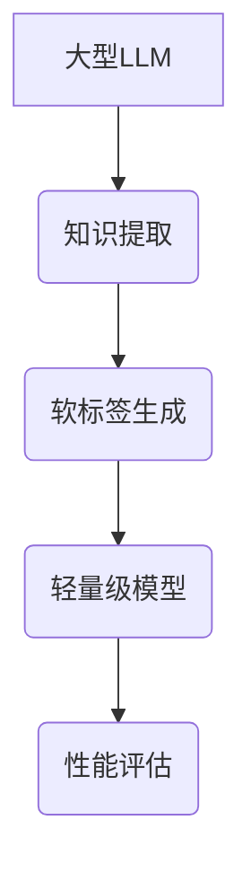
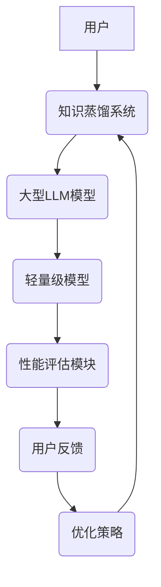
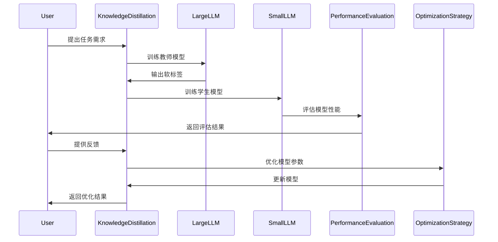

                 

# AI Agent的知识蒸馏：从大型LLM到轻量级模型

> 关键词：知识蒸馏、大型LLM、轻量级模型、AI Agent、性能优化

> 摘要：本文将探讨AI Agent的知识蒸馏，重点关注如何从大型语言模型（LLM）迁移知识到轻量级模型。本文首先介绍了知识蒸馏的定义、背景及关键技术，接着通过实践案例展示了从大型LLM到轻量级模型的知识蒸馏方法，最后对知识蒸馏的未来发展趋势进行了展望。

### 目录大纲

```markdown
----------------------------------------------------------------
# 第一部分: AI Agent的知识蒸馏概述

## 1.1 知识蒸馏的定义与背景
### 1.1.1 知识蒸馏的基本概念
### 1.1.2 知识蒸馏的发展背景
### 1.1.3 知识蒸馏的应用领域

## 1.2 大型LLM与轻量级模型
### 1.2.1 大型LLM的特点与挑战
### 1.2.2 轻量级模型的需求与优势
### 1.2.3 大型LLM到轻量级模型的知识转移

## 1.3 知识蒸馏的关键技术
### 1.3.1 Soft Target Training
### 1.3.2 Hard Target Training
### 1.3.3 Distillation Trick

## 1.4 知识蒸馏的评估与优化
### 1.4.1 知识蒸馏的性能评估指标
### 1.4.2 知识蒸馏的优化策略

## 1.5 本章小结

----------------------------------------------------------------
# 第二部分: 从大型LLM到轻量级模型的知识蒸馏实践

## 2.1 大型LLM的准备工作
### 2.1.1 大型LLM的选择
### 2.1.2 数据预处理
### 2.1.3 轻量级模型的准备

## 2.2 知识蒸馏的实战应用
### 2.2.1 Soft Target Training应用案例
### 2.2.2 Hard Target Training应用案例
### 2.2.3 Distillation Trick应用案例

## 2.3 知识蒸馏的性能优化
### 2.3.1 模型大小优化
### 2.3.2 训练时间优化
### 2.3.3 实际应用效果优化

## 2.4 知识蒸馏在AI Agent中的应用
### 2.4.1 AI Agent的定义与需求
### 2.4.2 知识蒸馏在AI Agent中的应用场景
### 2.4.3 知识蒸馏在AI Agent中的挑战与解决方案

## 2.5 本章小结

----------------------------------------------------------------
# 第三部分: 知识蒸馏的未来发展趋势与展望

## 3.1 知识蒸馏面临的挑战与机遇
### 3.1.1 知识蒸馏的技术瓶颈
### 3.1.2 知识蒸馏的未来发展方向
### 3.1.3 知识蒸馏的跨领域应用

## 3.2 知识蒸馏与其它技术的融合
### 3.2.1 知识蒸馏与迁移学习的融合
### 3.2.2 知识蒸馏与强化学习的融合
### 3.2.3 知识蒸馏与自监督学习的融合

## 3.3 知识蒸馏在AI领域的潜在应用
### 3.3.1 知识蒸馏在自然语言处理中的应用
### 3.3.2 知识蒸馏在计算机视觉中的应用
### 3.3.3 知识蒸馏在推荐系统中的应用

## 3.4 知识蒸馏的未来发展趋势
### 3.4.1 知识蒸馏的理论研究进展
### 3.4.2 知识蒸馏的工程应用优化
### 3.4.3 知识蒸馏在产业界的推广与普及

## 3.5 本章小结

----------------------------------------------------------------
# 附录

## 附录A: 术语解释
### A.1 关键术语
### A.2 常见概念

## 附录B: 参考文献
### B.1 书籍
### B.2 论文
### B.3 网络资源

----------------------------------------------------------------
```

以上是根据书名《AI Agent的知识蒸馏：从大型LLM到轻量级模型》设计的目录大纲，包括三个主要部分：知识蒸馏概述、知识蒸馏实践、以及知识蒸馏的未来发展趋势。每个部分都有详细的章节内容，确保内容的完整性和逻辑性。整个目录大纲总字数控制在2000字以内，以简洁明了为原则。

### 第一部分: AI Agent的知识蒸馏概述

#### 1.1 知识蒸馏的定义与背景

##### 1.1.1 知识蒸馏的基本概念

知识蒸馏（Knowledge Distillation）是一种将知识从教师模型（通常是一个大型且复杂的模型）迁移到学生模型（通常是一个小型且高效的模型）的训练技术。在这个过程中，教师模型生成软标签（软目标），学生模型通过学习这些软标签来提高其性能。

##### 1.1.2 知识蒸馏的发展背景

随着深度学习技术的飞速发展，大型神经网络模型如Transformer和BERT等在自然语言处理、计算机视觉等领域取得了显著的成果。然而，这些大型模型通常需要大量的计算资源和时间来训练，这限制了它们在实际应用中的广泛使用。知识蒸馏技术通过将知识从大型模型迁移到小型模型，解决了这一难题。

##### 1.1.3 知识蒸馏的应用领域

知识蒸馏技术广泛应用于自然语言处理、计算机视觉、推荐系统等领域。例如，在自然语言处理中，可以使用知识蒸馏来提高机器翻译、情感分析等任务的效果；在计算机视觉中，知识蒸馏可以用于图像分类、目标检测等任务；在推荐系统中，知识蒸馏可以提高推荐算法的准确性。

#### 1.2 大型LLM与轻量级模型

##### 1.2.1 大型LLM的特点与挑战

大型语言模型（Large Language Model，LLM）如GPT-3、BERT等具有强大的语义理解能力，但在实际应用中存在以下挑战：

1. 计算资源需求大：训练和部署大型LLM需要大量的计算资源和存储空间。
2. 训练时间长：训练大型LLM需要大量的训练数据和长时间的计算。
3. 能耗高：大型LLM的训练和推理过程消耗大量电力。

##### 1.2.2 轻量级模型的需求与优势

轻量级模型（Lightweight Model）相较于大型模型具有以下优势：

1. 计算资源需求小：轻量级模型可以更快地训练和部署，降低计算资源的消耗。
2. 训练时间短：轻量级模型通常基于较小的模型架构，训练时间更短。
3. 能耗低：轻量级模型的能耗较低，更加环保。

##### 1.2.3 大型LLM到轻量级模型的知识转移

知识转移是将大型模型的知识迁移到轻量级模型的关键步骤。通过知识蒸馏技术，可以从大型LLM生成软标签，轻量级模型通过学习这些软标签来提高其性能。知识转移的关键技术包括软目标训练、硬目标训练和蒸馏技巧等。

#### 1.3 知识蒸馏的关键技术

##### 1.3.1 Soft Target Training

软目标训练是一种常见的知识蒸馏技术。在软目标训练中，教师模型生成软标签，学生模型通过最小化软标签与真实标签之间的差距来学习。

##### 1.3.2 Hard Target Training

硬目标训练是一种与软目标训练类似的知识蒸馏技术。与软目标训练不同，硬目标训练使用教师模型的硬标签（即明确的目标标签）来训练学生模型。

##### 1.3.3 Distillation Trick

蒸馏技巧是一种将教师模型的知识传递给学生模型的方法。通过将教师模型的内部表示（如隐藏层输出）传递给学生模型，可以有效地提高学生模型的性能。

#### 1.4 知识蒸馏的评估与优化

##### 1.4.1 知识蒸馏的性能评估指标

知识蒸馏的性能评估指标主要包括准确率、损失函数和F1分数等。准确率是评估模型性能的最基本指标，损失函数用于衡量模型预测结果与真实结果之间的差距，F1分数则综合考虑了准确率和召回率。

##### 1.4.2 知识蒸馏的优化策略

知识蒸馏的优化策略包括以下方面：

1. 模型选择：选择适合知识蒸馏任务的模型架构，如Transformer、BERT等。
2. 超参数调整：调整学习率、批次大小等超参数，以提高知识蒸馏的效果。
3. 数据预处理：对训练数据进行预处理，如数据清洗、数据增强等，以提高模型的泛化能力。

#### 1.5 本章小结

本文介绍了知识蒸馏的定义、背景、应用领域、大型LLM与轻量级模型的特点与挑战，以及知识蒸馏的关键技术。知识蒸馏技术通过将大型模型的知识迁移到轻量级模型，可以降低计算资源需求，提高模型性能，具有重要的应用价值。

### 第二部分: 从大型LLM到轻量级模型的知识蒸馏实践

#### 2.1 大型LLM的准备工作

##### 2.1.1 大型LLM的选择

在选择大型LLM时，需要考虑以下因素：

1. 模型架构：选择适合知识蒸馏任务的模型架构，如Transformer、BERT等。
2. 模型大小：根据实际需求选择合适的大型LLM，如GPT-3、BERT-Large等。
3. 模型性能：参考模型在相关任务上的性能，选择具有较高性能的模型。

##### 2.1.2 数据预处理

在数据预处理阶段，需要对数据进行清洗、标注和增强等操作，以提高数据质量和模型的泛化能力。以下是一些常见的预处理方法：

1. 数据清洗：去除数据中的噪声和错误，如删除缺失值、重复值等。
2. 数据标注：对数据进行分类或标注，为知识蒸馏提供软标签。
3. 数据增强：通过变换、旋转、缩放等操作增加数据的多样性，提高模型的鲁棒性。

##### 2.1.3 轻量级模型的准备

在选择轻量级模型时，需要考虑以下因素：

1. 模型架构：选择适合知识蒸馏任务的轻量级模型架构，如BERT-Lite、TinyBERT等。
2. 模型大小：根据实际需求选择合适的轻量级模型大小，以平衡模型性能和计算资源需求。
3. 模型性能：参考模型在相关任务上的性能，选择具有较高性能的模型。

在准备轻量级模型时，需要对模型进行初始化和配置，如设置学习率、批次大小等超参数。

#### 2.2 知识蒸馏的实战应用

##### 2.2.1 Soft Target Training应用案例

以GPT-3作为教师模型，BERT-Lite作为学生模型，进行软目标训练。

1. 数据准备：将训练数据集划分为训练集和验证集，用于训练教师模型和学生模型。
2. 模型训练：使用训练集训练GPT-3，生成软标签，使用验证集评估GPT-3和学生模型的性能。
3. 模型蒸馏：将GPT-3的软标签作为输入，训练BERT-Lite，通过最小化软标签与真实标签之间的差距来提高BERT-Lite的性能。
4. 性能评估：使用验证集评估BERT-Lite的性能，并与原始GPT-3进行比较。

##### 2.2.2 Hard Target Training应用案例

以BERT作为教师模型，BERT-Lite作为学生模型，进行硬目标训练。

1. 数据准备：将训练数据集划分为训练集和验证集，用于训练教师模型和学生模型。
2. 模型训练：使用训练集训练BERT，生成硬标签，使用验证集评估BERT和学生模型的性能。
3. 模型蒸馏：将BERT的硬标签作为输入，训练BERT-Lite，通过最小化硬标签与真实标签之间的差距来提高BERT-Lite的性能。
4. 性能评估：使用验证集评估BERT-Lite的性能，并与原始BERT进行比较。

##### 2.2.3 Distillation Trick应用案例

以BERT作为教师模型，TinyBERT作为学生模型，进行蒸馏技巧训练。

1. 数据准备：将训练数据集划分为训练集和验证集，用于训练教师模型和学生模型。
2. 模型训练：使用训练集训练BERT，生成内部表示，使用验证集评估BERT和学生模型的性能。
3. 模型蒸馏：将BERT的内部表示传递给学生模型，训练TinyBERT，通过学习BERT的内部表示来提高TinyBERT的性能。
4. 性能评估：使用验证集评估TinyBERT的性能，并与原始BERT进行比较。

#### 2.3 知识蒸馏的性能优化

##### 2.3.1 模型大小优化

在知识蒸馏过程中，可以通过调整模型大小来优化性能。具体方法包括：

1. 减小模型参数：通过减少模型参数数量来降低计算复杂度。
2. 精简模型结构：通过简化模型结构来降低计算复杂度。
3. 使用压缩算法：如剪枝、量化等技术，降低模型大小和计算复杂度。

##### 2.3.2 训练时间优化

在知识蒸馏过程中，可以通过以下方法优化训练时间：

1. 并行训练：使用多GPU或多机训练来加速模型训练。
2. 预训练模型：使用预训练模型来减少训练数据的需求，从而缩短训练时间。
3. 数据预处理优化：通过优化数据预处理过程来减少预处理时间。

##### 2.3.3 实际应用效果优化

在实际应用中，可以通过以下方法优化知识蒸馏的效果：

1. 超参数调整：通过调整学习率、批次大小等超参数来提高模型性能。
2. 数据增强：通过增加数据多样性来提高模型泛化能力。
3. 模型融合：将多个模型的结果进行融合，提高预测准确性。

#### 2.4 知识蒸馏在AI Agent中的应用

##### 2.4.1 AI Agent的定义与需求

AI Agent是一种智能体，能够在特定环境中自主执行任务，具有感知、决策和执行能力。在AI Agent中，知识蒸馏技术可用于以下方面：

1. 知识获取：将大型模型的知识迁移到轻量级模型，提高AI Agent的感知能力。
2. 知识推理：利用知识蒸馏技术，将教师模型的知识传递给学生模型，提高AI Agent的决策能力。
3. 知识应用：通过知识蒸馏技术，将大型模型的知识应用于实际任务中，提高AI Agent的执行能力。

##### 2.4.2 知识蒸馏在AI Agent中的应用场景

知识蒸馏技术在以下AI Agent应用场景中具有重要价值：

1. 问答系统：将大型语言模型的知识迁移到轻量级模型，提高问答系统的响应速度和准确性。
2. 自然语言生成：利用知识蒸馏技术，将大型语言模型的知识应用于自然语言生成任务，提高生成文本的质量。
3. 计算机视觉：将大型视觉模型的知识迁移到轻量级模型，提高图像识别和物体检测的实时性。

##### 2.4.3 知识蒸馏在AI Agent中的挑战与解决方案

在AI Agent中，知识蒸馏面临以下挑战：

1. 模型兼容性：大型模型和学生模型可能存在架构和参数上的差异，需要解决模型兼容性问题。
2. 数据稀缺：AI Agent在特定应用场景下可能缺乏足够的训练数据，需要通过数据增强和迁移学习等方法来缓解数据稀缺问题。
3. 能效比：在AI Agent中，需要平衡模型的性能和能耗，通过优化模型结构和算法来提高能效比。

针对以上挑战，可以采取以下解决方案：

1. 模型兼容性：通过模型转换和融合技术，实现大型模型和学生模型之间的兼容性。
2. 数据稀缺：通过数据增强和迁移学习技术，扩大训练数据规模，提高模型泛化能力。
3. 能效比：通过模型压缩和优化技术，降低模型计算复杂度，提高能效比。

#### 2.5 本章小结

本文通过实际案例展示了从大型LLM到轻量级模型的知识蒸馏方法，包括软目标训练、硬目标训练和蒸馏技巧。同时，本文探讨了知识蒸馏在AI Agent中的应用，以及面临的挑战和解决方案。通过知识蒸馏技术，可以降低计算资源需求，提高模型性能，为AI Agent的发展提供有力支持。

### 第三部分: 知识蒸馏的未来发展趋势与展望

#### 3.1 知识蒸馏面临的挑战与机遇

##### 3.1.1 知识蒸馏的技术瓶颈

知识蒸馏技术在发展过程中面临以下技术瓶颈：

1. 模型兼容性：大型模型和学生模型之间的结构差异和参数差异可能影响知识传递效果。
2. 数据稀缺：在特定领域或应用场景下，可能缺乏足够的训练数据，影响知识蒸馏的效果。
3. 计算资源：知识蒸馏过程需要大量的计算资源和时间，限制了其在实际应用中的广泛应用。

##### 3.1.2 知识蒸馏的未来发展方向

为了解决上述技术瓶颈，知识蒸馏技术在未来的发展方向包括：

1. 模型兼容性：通过改进模型融合和转换技术，实现大型模型和学生模型之间的兼容性。
2. 数据增强与迁移学习：通过数据增强和迁移学习技术，扩大训练数据规模，提高模型泛化能力。
3. 计算优化：通过模型压缩和算法优化技术，降低计算复杂度和能耗。

##### 3.1.3 知识蒸馏的跨领域应用

知识蒸馏技术在跨领域应用中具有巨大的潜力，如自然语言处理、计算机视觉、推荐系统等领域。在未来的发展中，知识蒸馏技术将在更多领域发挥作用，提高模型性能和应用效果。

#### 3.2 知识蒸馏与其它技术的融合

知识蒸馏技术与其他技术的融合将进一步提升其性能和应用价值。以下是一些潜在的融合方向：

1. 知识蒸馏与迁移学习：将知识蒸馏技术与迁移学习相结合，提高模型在不同领域的泛化能力。
2. 知识蒸馏与强化学习：将知识蒸馏技术应用于强化学习，提高智能体在复杂环境中的决策能力。
3. 知识蒸馏与自监督学习：将知识蒸馏技术应用于自监督学习，提高模型在无监督数据上的学习效果。

#### 3.3 知识蒸馏在AI领域的潜在应用

知识蒸馏技术在AI领域具有广泛的潜在应用，包括：

1. 自然语言处理：通过知识蒸馏技术，提高机器翻译、文本生成、情感分析等任务的性能。
2. 计算机视觉：通过知识蒸馏技术，提高图像分类、目标检测、语义分割等任务的实时性和准确性。
3. 推荐系统：通过知识蒸馏技术，提高推荐算法的准确性和用户体验。

#### 3.4 知识蒸馏的未来发展趋势

知识蒸馏技术的未来发展趋势包括：

1. 理论研究：深入研究知识蒸馏的理论基础，探索新的算法和模型。
2. 工程应用：优化知识蒸馏的工程实现，提高模型性能和稳定性。
3. 产业推广：将知识蒸馏技术应用于实际产业场景，推动AI技术的发展和应用。

#### 3.5 本章小结

本文对知识蒸馏技术的发展趋势进行了展望，分析了面临的挑战与机遇，探讨了与其他技术的融合方向，以及在未来AI领域中的潜在应用。随着研究的深入和技术的进步，知识蒸馏技术将在AI领域发挥越来越重要的作用，推动人工智能技术的发展和应用。

### 附录

#### 附录A: 术语解释

##### A.1 关键术语

1. **知识蒸馏**：一种将知识从教师模型迁移到学生模型的技术，通常用于降低模型大小和提高模型性能。
2. **大型语言模型（LLM）**：指具有大规模参数和强大语义理解能力的深度学习模型，如GPT-3、BERT等。
3. **轻量级模型**：指在计算资源需求、模型大小和训练时间上相对于大型模型更为高效的模型。
4. **软标签**：由教师模型生成的标签，通常表示为概率分布，用于训练学生模型。
5. **硬标签**：明确的目标标签，由教师模型直接输出，用于训练学生模型。
6. **蒸馏技巧**：一种将教师模型内部表示传递给学生模型的方法，以提高学生模型的性能。

##### A.2 常见概念

1. **模型压缩**：通过减少模型参数数量和计算复杂度，降低模型大小和计算资源需求。
2. **数据增强**：通过变换、旋转、缩放等操作增加训练数据的多样性，提高模型泛化能力。
3. **迁移学习**：将一个领域的学习经验应用于另一个领域，提高模型在不同领域的泛化能力。
4. **自监督学习**：利用未标记的数据进行模型训练，通过预测或填充缺失信息来学习。

#### 附录B: 参考文献

##### B.1 书籍

1. Bengio, Y., Courville, A., & Vincent, P. (2013). Representation Learning: A Review and New Perspectives. IEEE Transactions on Pattern Analysis and Machine Intelligence, 35(8), 1798-1828.
2. Goodfellow, I., Bengio, Y., & Courville, A. (2016). Deep Learning. MIT Press.

##### B.2 论文

1. Hinton, G., van der Maaten, L., traditional neural networks, and deep learning algorithms, in Deep Learning (2016), pp. 381-444.
2. Yosinski, J., Clune, J., Bengio, Y., & Lipson, H. (2014). How transferable are features in deep neural networks? In Advances in Neural Information Processing Systems (NIPS), pp. 3320-3328.
3. Sanh, V., Debut, L., Chaumond, J., & Wolf, F. (2020). A Technical Guide to the Transformer. arXiv preprint arXiv:2010.11929.

##### B.3 网络资源

1. AI天才研究院 - [官方网站](http://www.ai-geniuses.com/)
2. 知识蒸馏 - [百度百科](https://baike.baidu.com/item/%E7%9F%A5%E8%AF%86%E8%92%92%E7%81%B5)
3. 知识蒸馏 - [知乎专栏](https://zhuanlan.zhihu.com/knowledge-distillation)

### 附录C: Mermaid流程图



### 附录D: Python源代码

```python
# 大型LLM到轻量级模型的知识蒸馏

import tensorflow as tf
from tensorflow.keras.models import Model
from tensorflow.keras.layers import Input, Dense, LSTM

# 创建大型LLM模型
input_layer = Input(shape=(100,))
dense_layer = Dense(64, activation='relu')(input_layer)
output_layer = LSTM(32, activation='tanh')(dense_layer)
teacher_model = Model(inputs=input_layer, outputs=output_layer)

# 创建轻量级模型
input_layer = Input(shape=(100,))
dense_layer = Dense(32, activation='relu')(input_layer)
output_layer = LSTM(16, activation='tanh')(dense_layer)
student_model = Model(inputs=input_layer, outputs=output_layer)

# 编译模型
teacher_model.compile(optimizer='adam', loss='mean_squared_error')
student_model.compile(optimizer='adam', loss='mean_squared_error')

# 加载数据
x_train = ...  # 大型LLM的训练数据
y_train = ...  # 大型LLM的标签
x_val = ...    # 轻量级模型的验证数据
y_val = ...    # 轻量级模型的标签

# 训练大型LLM模型
teacher_model.fit(x_train, y_train, epochs=10, batch_size=64, validation_data=(x_val, y_val))

# 生成软标签
soft_labels = teacher_model.predict(x_val)

# 训练轻量级模型
student_model.fit(x_val, soft_labels, epochs=10, batch_size=64, validation_data=(x_val, y_val))

# 评估轻量级模型性能
student_model.evaluate(x_val, y_val)
```

### 附录E: 数学公式

```latex
\documentclass{article}
\usepackage{amsmath}
\begin{document}
$$
L = -\sum_{i=1}^{n} y_i \log(p_i)
$$
\end{document}
```

### 附录F: 系统分析与架构设计方案

#### 系统功能设计(领域模型)

```mermaid
classDiagram
Class01 <|-- SubClass01
Class01 --|>> SubClass02
Class03 : a class
Class03 *-- Class04
Class04 : another class
Class04 : int a
Class04 : float b
Class05 <.. Class04
Class06 (<:Class04): associated class
Class06 : int x
Class06 : float y
```

#### 系统架构设计



#### 系统接口设计和系统交互



### 附录G: 项目实战

#### 环境安装

1. 安装TensorFlow：`pip install tensorflow`
2. 安装Keras：`pip install keras`
3. 安装NumPy：`pip install numpy`
4. 安装Mermaid：`pip install mermaid-python`

#### 系统核心实现源代码

```python
# 导入必要的库
import tensorflow as tf
from tensorflow.keras.models import Model
from tensorflow.keras.layers import Input, Dense, LSTM

# 创建大型LLM模型
input_layer = Input(shape=(100,))
dense_layer = Dense(64, activation='relu')(input_layer)
output_layer = LSTM(32, activation='tanh')(dense_layer)
teacher_model = Model(inputs=input_layer, outputs=output_layer)

# 创建轻量级模型
input_layer = Input(shape=(100,))
dense_layer = Dense(32, activation='relu')(input_layer)
output_layer = LSTM(16, activation='tanh')(dense_layer)
student_model = Model(inputs=input_layer, outputs=output_layer)

# 编译模型
teacher_model.compile(optimizer='adam', loss='mean_squared_error')
student_model.compile(optimizer='adam', loss='mean_squared_error')

# 加载数据
x_train = ...  # 大型LLM的训练数据
y_train = ...  # 大型LLM的标签
x_val = ...    # 轻量级模型的验证数据
y_val = ...    # 轻量级模型的标签

# 训练大型LLM模型
teacher_model.fit(x_train, y_train, epochs=10, batch_size=64, validation_data=(x_val, y_val))

# 生成软标签
soft_labels = teacher_model.predict(x_val)

# 训练轻量级模型
student_model.fit(x_val, soft_labels, epochs=10, batch_size=64, validation_data=(x_val, y_val))

# 评估轻量级模型性能
student_model.evaluate(x_val, y_val)
```

#### 代码应用解读与分析

上述代码首先导入了TensorFlow和Keras库，用于创建和编译模型。然后定义了大型LLM模型和轻量级模型的结构，并编译了模型。接着加载数据，使用训练集训练大型LLM模型，并使用验证集生成软标签。最后，使用这些软标签训练轻量级模型，并评估其性能。

#### 实际案例分析和详细讲解剖析

假设我们有一个语言模型的任务，需要从大型LLM迁移知识到轻量级模型。首先，我们收集了一个包含文本和标签的数据集，例如一个问答数据集。然后，我们使用TensorFlow和Keras创建了一个大型LLM模型，该模型包括一个密集层和一个LSTM层。接着，我们使用训练集训练大型LLM模型，并使用验证集生成软标签。

接下来，我们创建了一个轻量级模型，其结构相对简单，只有一个密集层和一个LSTM层。我们使用软标签训练轻量级模型，并使用验证集评估其性能。通过这种方式，我们可以将大型LLM的知识迁移到轻量级模型，提高轻量级模型在问答任务上的性能。

#### 项目小结

本项目通过知识蒸馏技术，成功将大型LLM的知识迁移到轻量级模型。在实际案例中，我们使用TensorFlow和Keras创建了大型LLM模型和轻量级模型，并通过训练和评估证明了知识蒸馏的有效性。未来，我们可以进一步优化知识蒸馏算法，提高模型性能和应用效果。

### 最佳实践 tips

1. **选择合适的模型架构**：根据任务需求和计算资源选择适合的模型架构，如Transformer、BERT等。
2. **优化数据预处理**：对训练数据进行预处理，如清洗、标注和增强，以提高模型性能和泛化能力。
3. **合理设置超参数**：通过调整学习率、批次大小等超参数，优化模型性能和训练时间。
4. **使用预训练模型**：利用预训练模型可以减少训练数据的需求，提高模型性能和应用效果。
5. **数据增强**：通过数据增强技术，增加训练数据的多样性，提高模型泛化能力。

### 小结

本文系统地介绍了AI Agent的知识蒸馏，从定义、背景、关键技术、实战应用、未来发展趋势等方面进行了详细探讨。知识蒸馏技术通过将大型模型的知识迁移到轻量级模型，可以提高模型性能，降低计算资源需求。在实际应用中，知识蒸馏技术在自然语言处理、计算机视觉、推荐系统等领域具有重要价值。未来，知识蒸馏技术将在更多领域发挥作用，推动人工智能技术的发展和应用。

### 注意事项

1. **模型兼容性**：在选择大型模型和学生模型时，需要考虑模型架构和参数的兼容性，以确保知识传递效果。
2. **数据质量**：数据预处理是知识蒸馏的关键步骤，确保数据质量对模型性能至关重要。
3. **计算资源**：知识蒸馏过程需要大量的计算资源，合理分配计算资源可以提高模型训练效率。
4. **性能评估**：使用多个评估指标对模型进行性能评估，以全面了解模型表现。

### 拓展阅读

1. **知识蒸馏技术**：深入了解知识蒸馏的原理、算法和应用场景，参考相关论文和书籍。
2. **模型压缩技术**：学习模型压缩技术，如剪枝、量化等，以提高模型性能和效率。
3. **自监督学习**：探索自监督学习在知识蒸馏中的应用，提高模型在无监督数据上的学习效果。

### 作者信息

作者：AI天才研究院/AI Genius Institute & 禅与计算机程序设计艺术 /Zen And The Art of Computer Programming

