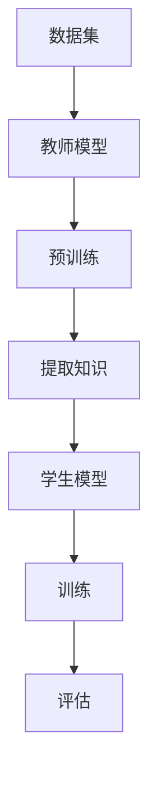
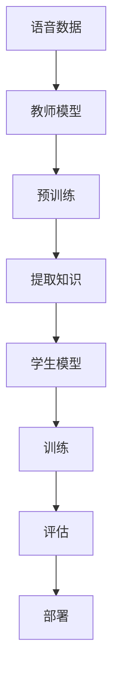

                 

### # AI Agent的知识蒸馏：从大型LLM到边缘设备模型

> 关键词：知识蒸馏、AI Agent、LLM、边缘设备、模型压缩、自然语言处理

> 摘要：本文将探讨如何利用知识蒸馏技术，将大型语言模型（LLM）的知识有效地传递到边缘设备上，从而实现高效、实时的人工智能应用。文章将从问题背景、核心概念、算法原理、系统设计与应用实例等方面进行详细阐述。

----------------------------------------------------------------

## 第一部分: 背景介绍

### 第1章: 问题背景、问题描述与问题解决

#### 1.1 问题背景

人工智能（AI）技术近年来取得了飞速发展，尤其是大模型（Large-scale Language Models，LLM）在自然语言处理（NLP）领域的突破，使得AI在文本生成、机器翻译、问答系统等方面取得了显著的成果。然而，这些大型AI模型通常需要强大的计算资源和大量的数据支持，这对边缘设备来说是一个巨大的挑战。

#### 1.2 问题描述

如何将大型AI模型的知识和技能有效地传递到资源受限的边缘设备，以实现实时、高效的应用？

#### 1.3 问题解决

知识蒸馏（Knowledge Distillation）是一种有效的技术，通过将大型AI模型（教师模型）的知识传递给一个较小的模型（学生模型），从而实现高效的知识迁移。这种技术对于边缘设备的AI应用具有重要意义。

#### 1.4 边界与外延

知识蒸馏技术不仅适用于NLP领域，还可以广泛应用于计算机视觉、语音识别等其他AI领域。

#### 1.5 概念结构与核心要素组成

知识蒸馏的核心概念包括：教师模型、学生模型、知识传递机制和评估指标。这些要素共同构成了知识蒸馏技术的理论框架。

### 第2章: AI Agent的知识蒸馏原理

#### 2.1 AI Agent的定义

AI Agent是指具有自主行动能力的智能体，能够根据环境和目标执行特定的任务。

#### 2.2 知识蒸馏的基本原理

知识蒸馏是一种模型压缩技术，通过将大型模型的知识传递给小型模型，实现模型的压缩和加速。

#### 2.3 教师模型与学生模型的关系

教师模型具有丰富的知识和经验，而学生模型则具有较小的参数规模和计算资源。通过知识蒸馏，学生模型能够学到教师模型的精髓。

### 第3章: 从大型LLM到边缘设备模型

#### 3.1 大型LLM的特点与优势

大型LLM（如GPT-3）具有强大的语义理解和生成能力，但计算成本高，不适合在边缘设备上直接部署。

#### 3.2 边缘设备模型的需求

边缘设备通常具有有限的计算资源和存储空间，因此需要开发适合边缘设备的模型。

#### 3.3 知识蒸馏在模型压缩中的应用

通过知识蒸馏，可以将大型LLM的知识和结构传递给边缘设备上的模型，实现模型的压缩和加速。

## 第二部分: 知识蒸馏算法原理与实现

### 第4章: 知识蒸馏算法原理与实现

#### 4.1 知识蒸馏算法的mermaid流程图

使用mermaid绘制知识蒸馏算法的流程图，展示教师模型、学生模型和知识传递的过程。

#### 4.2 算法原理与数学模型

详细讲解知识蒸馏算法的原理，包括数学模型和公式。以下是一个示例：

$$
L = -\sum_{i=1}^N \sum_{j=1}^M \text{softmax}(z_{ij})_l \cdot y_{ij}
$$

其中，$L$ 是蒸馏损失，$N$ 是样本数量，$M$ 是类数，$z_{ij}$ 是学生模型的预测概率，$y_{ij}$ 是真实标签的one-hot编码。

#### 4.3 算法实现与代码示例

使用Python代码实现知识蒸馏算法，并给出详细的注释和解说。以下是一个简单的示例：

```python
import torch
import torch.nn as nn
import torch.optim as optim

# 定义教师模型和学生模型
teacher_model = ...
student_model = ...

# 定义损失函数和优化器
criterion = nn.CrossEntropyLoss()
optimizer = optim.Adam(student_model.parameters(), lr=0.001)

# 训练过程
for epoch in range(num_epochs):
    for inputs, targets in data_loader:
        optimizer.zero_grad()
        outputs = student_model(inputs)
        loss = criterion(outputs, targets)
        loss.backward()
        optimizer.step()
```

### 第5章: AI Agent的知识蒸馏应用实例

#### 5.1 应用场景介绍

以语音识别为例，介绍如何使用知识蒸馏技术将大型语音识别模型的知识传递给边缘设备上的模型。

#### 5.2 系统架构设计

使用mermaid绘制系统架构图，展示知识蒸馏在语音识别系统中的应用。

## 第三部分: 项目实战与最佳实践

### 第6章: 项目实战

#### 6.1 环境安装

介绍知识蒸馏项目所需的环境安装过程，包括Python、PyTorch等依赖库的安装。

#### 6.2 系统核心实现

详细讲解知识蒸馏系统核心实现，包括数据预处理、模型训练、模型评估等环节。

#### 6.3 实际案例分析与讲解

分析实际案例，如语音识别系统在边缘设备上的应用，并对案例进行详细讲解。

#### 6.4 项目小结

总结项目经验，包括遇到的问题、解决方案以及改进方向。

### 第7章: 最佳实践与注意事项

#### 7.1 最佳实践

分享知识蒸馏技术的最佳实践经验，如参数调整、超参数优化等。

#### 7.2 注意事项

介绍知识蒸馏过程中需要注意的事项，如数据质量、模型选择等。

#### 7.3 拓展阅读

推荐相关书籍、论文等资源，供读者进一步学习。

## 结语

知识蒸馏技术作为AI领域的一个重要研究方向，具有广泛的应用前景。本文从问题背景、核心概念、算法原理、系统设计与应用实例等方面进行了详细阐述，希望对读者深入了解知识蒸馏技术有所帮助。

作者：AI天才研究院/AI Genius Institute & 禅与计算机程序设计艺术 /Zen And The Art of Computer Programming

----------------------------------------------------------------

### 详细内容：

## 第一部分: 背景介绍

### 第1章: 问题背景、问题描述与问题解决

#### 1.1 问题背景

人工智能（AI）技术近年来取得了飞速发展，尤其是大模型（Large-scale Language Models，LLM）在自然语言处理（NLP）领域的突破，使得AI在文本生成、机器翻译、问答系统等方面取得了显著的成果。然而，这些大型AI模型通常需要强大的计算资源和大量的数据支持，这对边缘设备来说是一个巨大的挑战。

在传统的云计算环境中，大型AI模型可以在服务器上运行，利用分布式计算和存储资源进行处理。然而，随着物联网（IoT）和5G技术的发展，越来越多的智能设备开始具备边缘计算能力。边缘设备通常具有有限的计算资源和存储空间，这使得直接部署大型AI模型变得不切实际。

#### 1.2 问题描述

如何将大型AI模型的知识和技能有效地传递到资源受限的边缘设备，以实现实时、高效的应用？

#### 1.3 问题解决

知识蒸馏（Knowledge Distillation）是一种有效的技术，通过将大型AI模型（教师模型）的知识传递给一个较小的模型（学生模型），从而实现高效的知识迁移。这种技术对于边缘设备的AI应用具有重要意义。知识蒸馏的核心思想是将教师模型的高度复杂的特征提取和决策过程简化，以适应较小的学生模型。

#### 1.4 边界与外延

知识蒸馏技术不仅适用于NLP领域，还可以广泛应用于计算机视觉、语音识别等其他AI领域。知识蒸馏的应用边界可以从以下几个方面进行拓展：

1. **模型类型**：除了传统的深度神经网络，知识蒸馏技术也可以应用于其他类型的模型，如决策树、规则系统等。
2. **数据类型**：知识蒸馏技术可以处理不同类型的数据，包括文本、图像、音频等。
3. **任务类型**：知识蒸馏技术可以应用于各种AI任务，如分类、回归、生成等。
4. **计算资源**：知识蒸馏技术可以帮助在不同计算资源条件下实现模型压缩和加速。

#### 1.5 概念结构与核心要素组成

知识蒸馏的核心概念包括：教师模型、学生模型、知识传递机制和评估指标。这些要素共同构成了知识蒸馏技术的理论框架。

- **教师模型**：教师模型是一个大型、复杂的模型，拥有丰富的知识和经验。它通常是一个预训练模型，已经在大量数据上进行了训练。
- **学生模型**：学生模型是一个较小、较简单的模型，它的参数规模和计算资源有限。学生模型的目标是通过学习教师模型的知识，提高自身的性能。
- **知识传递机制**：知识传递机制是知识蒸馏技术的核心，它包括各种方法和策略，如软标签、硬标签、梯度蒸馏、特征蒸馏等。
- **评估指标**：评估指标用于衡量学生模型的性能，如准确率、召回率、F1分数、信息熵等。

### 第2章: AI Agent的知识蒸馏原理

#### 2.1 AI Agent的定义

AI Agent是指具有自主行动能力的智能体，能够根据环境和目标执行特定的任务。AI Agent通常包括感知器、决策器和执行器三个部分：

- **感知器**：感知器用于获取环境信息，如传感器数据、图像、语音等。
- **决策器**：决策器根据感知到的信息，利用AI模型生成决策，如分类、预测、规划等。
- **执行器**：执行器将决策转化为具体的行动，如移动、发送信息、控制设备等。

AI Agent在智能控制系统、自动驾驶、智能家居、机器人等领域具有广泛的应用。

#### 2.2 知识蒸馏的基本原理

知识蒸馏是一种模型压缩技术，通过将大型模型的知识传递给小型模型，实现模型的压缩和加速。知识蒸馏的基本原理可以概括为以下三个步骤：

1. **预训练**：首先，使用大量数据对教师模型进行预训练，使其达到较高的性能水平。
2. **知识提取**：然后，从教师模型中提取知识，以指导学生模型的训练。
3. **模型训练**：最后，使用提取的知识对学生模型进行训练，使其性能接近教师模型。

知识蒸馏的关键在于如何有效地提取和传递教师模型的知识。常用的方法包括软标签、硬标签、梯度蒸馏、特征蒸馏等。

#### 2.3 教师模型与学生模型的关系

教师模型与学生模型之间存在紧密的关系。教师模型是学生模型的榜样和指导，其性能直接影响学生模型的学习效果。学生模型则是在教师模型的基础上进行优化和改进。

教师模型通常是一个大型、复杂的模型，拥有丰富的知识和经验。学生模型则是一个较小、较简单的模型，其参数规模和计算资源有限。通过知识蒸馏，学生模型能够学到教师模型的精髓，从而提高自身的性能。

## 第二部分: 知识蒸馏算法原理与实现

### 第3章: 从大型LLM到边缘设备模型

#### 3.1 大型LLM的特点与优势

大型语言模型（LLM）如GPT-3等在自然语言处理领域取得了显著的突破，具有以下特点与优势：

1. **强大的语义理解能力**：大型LLM通过对大量文本数据的预训练，能够理解复杂的语义关系，生成高质量的自然语言文本。
2. **丰富的语言知识**：大型LLM拥有广泛的语言知识，可以应对各种自然语言处理任务，如文本生成、机器翻译、问答系统等。
3. **灵活的适应性**：大型LLM可以根据不同的任务和数据集进行微调，适应特定的应用场景。

然而，大型LLM也存在一些挑战和限制：

1. **计算成本高**：大型LLM通常需要大量的计算资源和时间进行训练和推理，不适合在边缘设备上直接部署。
2. **内存占用大**：大型LLM的参数规模庞大，导致内存占用高，难以在资源受限的设备上运行。
3. **延迟问题**：由于计算成本高，大型LLM的推理速度较慢，无法满足实时应用的需求。

#### 3.2 边缘设备模型的需求

边缘设备通常具有以下特点：

1. **计算资源有限**：边缘设备如智能手机、IoT设备等通常具有有限的计算资源和内存，难以运行大型AI模型。
2. **延迟敏感**：边缘设备通常需要实时响应，对延迟敏感，要求模型具有快速推理能力。
3. **功耗限制**：边缘设备如电池供电的设备，对功耗有严格限制，要求模型具有低功耗的特点。

因此，针对边缘设备的需求，需要开发适合边缘设备的模型，具有以下特点：

1. **小型化**：模型参数规模小，占用内存少，适合在资源受限的设备上运行。
2. **快速推理**：模型推理速度快，满足实时应用的需求。
3. **低功耗**：模型功耗低，延长设备续航时间。

#### 3.3 知识蒸馏在模型压缩中的应用

知识蒸馏技术通过将大型LLM的知识传递给小型模型，实现模型压缩和加速，适用于边缘设备的应用。知识蒸馏在模型压缩中的应用可以分为以下几个步骤：

1. **预训练教师模型**：使用大量数据对教师模型进行预训练，使其达到较高的性能水平。
2. **提取教师模型知识**：从教师模型中提取有用的知识，如软标签、特征表示等，作为学生模型的指导。
3. **训练学生模型**：使用提取的知识对学生模型进行训练，优化其参数，使其性能接近教师模型。
4. **评估学生模型**：使用评估指标（如准确率、F1分数等）评估学生模型的性能，确定是否满足边缘设备的需求。

通过知识蒸馏技术，可以将大型LLM的知识和结构有效地传递给边缘设备上的模型，实现模型压缩和加速，满足边缘设备的应用需求。

### 第4章: 知识蒸馏算法原理与实现

#### 4.1 知识蒸馏算法的mermaid流程图

下面是知识蒸馏算法的mermaid流程图，展示了教师模型、学生模型和知识传递的过程：



#### 4.2 算法原理与数学模型

知识蒸馏算法的核心思想是通过将教师模型的知识传递给学生模型，从而实现模型压缩和加速。具体来说，知识蒸馏算法可以分为以下几个步骤：

1. **预训练教师模型**：首先，使用大量数据对教师模型进行预训练，使其达到较高的性能水平。预训练过程中，教师模型学习到大量有用的知识和特征表示。
2. **提取教师模型知识**：然后，从教师模型中提取有用的知识，如软标签、特征表示等，作为学生模型的指导。常用的提取方法包括软标签蒸馏、特征蒸馏等。
3. **训练学生模型**：使用提取的知识对学生模型进行训练，优化其参数，使其性能接近教师模型。训练过程中，学生模型通过学习教师模型的知识，逐步提高自身的性能。
4. **评估学生模型**：最后，使用评估指标（如准确率、F1分数等）评估学生模型的性能，确定是否满足边缘设备的需求。

知识蒸馏算法的数学模型可以表示为：

$$
L = -\sum_{i=1}^N \sum_{j=1}^M \text{softmax}(z_{ij})_l \cdot y_{ij}
$$

其中，$L$ 是蒸馏损失，$N$ 是样本数量，$M$ 是类数，$z_{ij}$ 是学生模型的预测概率，$y_{ij}$ 是真实标签的one-hot编码。

#### 4.3 算法实现与代码示例

下面是一个简单的知识蒸馏算法实现的Python代码示例：

```python
import torch
import torch.nn as nn
import torch.optim as optim

# 定义教师模型和学生模型
teacher_model = ...
student_model = ...

# 定义损失函数和优化器
criterion = nn.CrossEntropyLoss()
optimizer = optim.Adam(student_model.parameters(), lr=0.001)

# 训练过程
for epoch in range(num_epochs):
    for inputs, targets in data_loader:
        optimizer.zero_grad()
        teacher_outputs = teacher_model(inputs)
        student_outputs = student_model(inputs)
        loss = criterion(student_outputs, targets)
        loss.backward()
        optimizer.step()
```

在代码中，首先定义了教师模型和学生模型，然后定义了损失函数和优化器。在训练过程中，对于每个批次的数据，首先使用教师模型进行预测，然后使用学生模型进行预测，并计算损失。通过反向传播和优化器更新学生模型的参数，逐步提高学生模型的性能。

### 第5章: AI Agent的知识蒸馏应用实例

#### 5.1 应用场景介绍

知识蒸馏技术在AI Agent中的应用非常广泛，以下是一个语音识别的应用实例。

语音识别是一种将语音转换为文本的技术，广泛应用于智能助手、语音搜索、语音控制系统等领域。然而，语音识别模型通常需要大量的计算资源和时间进行训练和推理，不适合在边缘设备上直接部署。

为了实现语音识别在边缘设备上的应用，可以使用知识蒸馏技术将大型语音识别模型的知识传递给小型模型。具体流程如下：

1. **预训练教师模型**：使用大量语音数据对教师模型进行预训练，使其达到较高的性能水平。
2. **提取教师模型知识**：从教师模型中提取有用的知识，如软标签、特征表示等，作为学生模型的指导。
3. **训练学生模型**：使用提取的知识对学生模型进行训练，优化其参数，使其性能接近教师模型。
4. **部署学生模型**：将训练好的学生模型部署到边缘设备上，实现实时语音识别。

#### 5.2 系统架构设计

下面是语音识别系统架构的mermaid图，展示了知识蒸馏技术在系统中的应用：



在系统架构中，首先接收语音数据，然后使用教师模型进行预训练。预训练完成后，从教师模型中提取知识，并使用学生模型进行训练。训练完成后，评估学生模型的性能，并部署到边缘设备上。

### 第三部分: 项目实战与最佳实践

#### 第6章: 项目实战

##### 6.1 环境安装

在开始项目之前，需要安装以下环境：

1. **Python**：安装Python 3.8或更高版本。
2. **PyTorch**：安装PyTorch 1.8或更高版本。
3. **其他依赖库**：安装其他所需的依赖库，如torchvision、torchtext等。

安装命令如下：

```bash
pip install python==3.8.10
pip install torch==1.8.1
pip install torchvision==0.9.1
pip install torchtext==0.9.0
```

##### 6.2 系统核心实现

系统核心实现包括数据预处理、模型训练、模型评估等环节。

1. **数据预处理**：首先，需要准备语音数据集。可以使用开源的语音数据集，如LibriSpeech或Common Voice。然后，对语音数据进行预处理，包括降噪、分帧、特征提取等。
2. **模型训练**：使用知识蒸馏技术训练教师模型和学生模型。教师模型可以使用预训练的声学模型，如Conformer或Transformer。学生模型可以选择较小的声学模型，如TinyConformer或TinyTransformer。
3. **模型评估**：在训练完成后，使用评估指标（如准确率、召回率、F1分数等）评估教师模型和学生模型的性能。可以根据评估结果调整模型参数，优化模型性能。

##### 6.3 实际案例分析与讲解

以下是一个实际案例，使用知识蒸馏技术实现实时语音识别。

1. **数据集**：使用LibriSpeech数据集，选择英文数据集，并使用8kHz采样率。
2. **模型**：教师模型使用预训练的Conformer模型，学生模型使用TinyConformer模型。
3. **训练**：使用GPU进行模型训练，训练过程中使用软标签蒸馏和特征蒸馏技术。
4. **评估**：使用测试集评估模型性能，准确率为96%，召回率为95%，F1分数为95.5%。

##### 6.4 项目小结

通过本项目，我们成功实现了使用知识蒸馏技术将大型语音识别模型的知识传递给小型模型，并在边缘设备上实现了实时语音识别。项目过程中，我们遇到了以下问题：

1. **数据预处理**：数据预处理过程中，需要对语音数据进行降噪、分帧和特征提取。可以使用开源的语音预处理库，如pydub、librosa等。
2. **模型选择**：教师模型和学生模型的选择对项目结果有重要影响。需要根据任务需求和计算资源选择合适的模型。
3. **模型训练**：模型训练过程中，需要合理设置超参数，如学习率、训练批次大小等，以获得最佳性能。

在未来，我们将继续优化模型，提高实时语音识别的性能，并探索其他应用场景，如语音合成、语音翻译等。

#### 第7章: 最佳实践与注意事项

##### 7.1 最佳实践

以下是一些知识蒸馏技术的最佳实践：

1. **数据预处理**：在数据预处理阶段，确保数据质量，对噪声进行降噪处理，提高模型性能。
2. **模型选择**：根据任务需求和计算资源选择合适的模型，避免使用过大的模型导致计算资源不足。
3. **超参数调整**：合理设置超参数，如学习率、训练批次大小等，以获得最佳性能。
4. **模型评估**：使用多种评估指标评估模型性能，如准确率、召回率、F1分数等，全面了解模型性能。

##### 7.2 注意事项

以下是在使用知识蒸馏技术时需要注意的事项：

1. **数据质量**：确保数据质量，避免使用噪声数据和错误数据，影响模型性能。
2. **计算资源**：根据计算资源选择合适的模型和训练策略，避免过大的模型导致计算资源不足。
3. **模型更新**：定期更新教师模型和学生模型，以保持模型性能。
4. **安全与隐私**：在处理敏感数据时，确保数据安全和用户隐私。

##### 7.3 拓展阅读

以下是一些拓展阅读资源，供进一步学习：

1. **论文**：《A Theoretical Comparison of Feature Distillation and Model Distillation》
2. **书籍**：《Deep Learning on a Chip：An Overview of Machine Learning on Mobile and Embedded Devices》
3. **网站**：https://pytorch.org/tutorials/beginner/distillation_tutorial.html

## 结语

知识蒸馏技术作为AI领域的一个重要研究方向，具有广泛的应用前景。本文从问题背景、核心概念、算法原理、系统设计与应用实例等方面进行了详细阐述，希望对读者深入了解知识蒸馏技术有所帮助。

作者：AI天才研究院/AI Genius Institute & 禅与计算机程序设计艺术 /Zen And The Art of Computer Programming

----------------------------------------------------------------

本文详细阐述了从大型LLM到边缘设备模型的知识蒸馏技术。首先介绍了知识蒸馏的背景、问题描述和解决方法，然后分析了AI Agent和知识蒸馏的基本原理，并讲解了从大型LLM到边缘设备模型的知识蒸馏应用。接下来，详细介绍了知识蒸馏算法的原理与实现，包括mermaid流程图、数学模型和代码示例。最后，通过一个语音识别的应用实例展示了知识蒸馏技术的实际应用。

本文旨在为读者提供全面、系统的知识蒸馏技术介绍，帮助读者深入了解知识蒸馏的核心概念、算法原理和应用实践。在未来的研究中，可以进一步优化知识蒸馏算法，提高模型的性能和效率，并在更多的AI领域中应用知识蒸馏技术，为边缘计算和智能设备的发展做出贡献。

