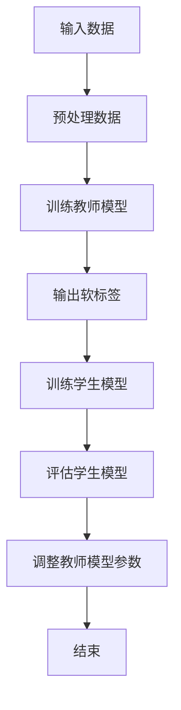
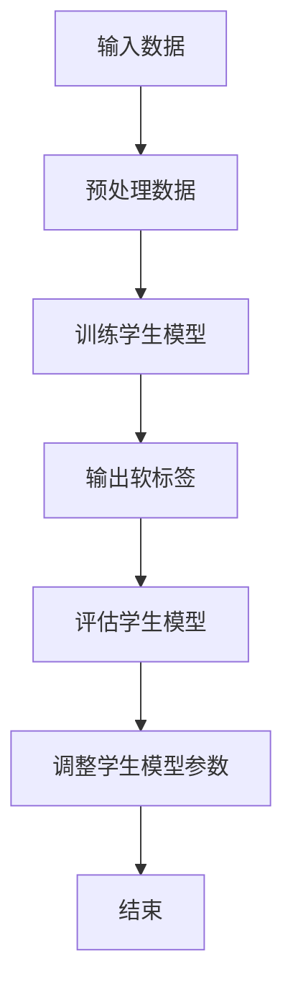
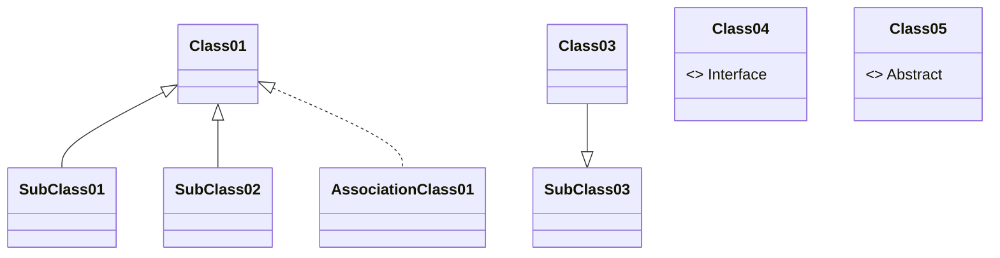
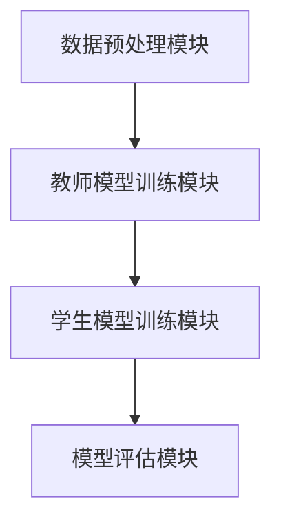

                 

### 1. 定义结构

首先，我们需要确定文章的整体结构。根据题目要求和参考的文章结构，我们可以将文章分为五个主要部分：背景介绍、核心概念与联系、算法原理讲解、数学模型和数学公式讲解、系统分析与架构设计。

**第一部分：背景介绍**
- 介绍知识蒸馏的概念、其在AI Agent中的应用及其重要性。

**第二部分：核心概念与联系**
- 详细讲解AI Agent的概念、结构和功能。
- 介绍知识蒸馏的工作原理及其在AI Agent中的应用。

**第三部分：算法原理讲解**
- 详细解释知识蒸馏的算法原理，包括其数学模型和流程图。

**第四部分：数学模型和数学公式讲解**
- 系统性地讲解知识蒸馏所涉及的数学模型和公式，并使用LaTeX格式进行展示。

**第五部分：系统分析与架构设计**
- 分析知识蒸馏在具体系统中的应用场景。
- 设计知识蒸馏的系统架构和接口。

### 2. 编写章节标题和副标题

接下来，我们需要为每个部分编写具体的章节标题和副标题。以下是一个可能的目录结构：

**第一部分：背景介绍**
- 1.1 问题背景
  - 1.1.1 AI Agent及其知识蒸馏概述
  - 1.1.2 大模型与轻量级应用的关系
- 1.2 核心概念与联系
  - 1.2.1 AI Agent的主要类型
  - 1.2.2 知识蒸馏的技术原理
  - 1.2.3 知识蒸馏的应用场景
- 1.3 边界与外延
  - 1.3.1 知识蒸馏的优势与挑战
  - 1.3.2 知识蒸馏的技术发展
- 1.4 本章小结

**第二部分：核心概念与联系**
- 2.1 AI Agent的组成
  - 2.1.1 AI Agent的架构设计
  - 2.1.2 AI Agent的核心组件
- 2.2 知识蒸馏的工作流程
  - 2.2.1 教师模型与学生模型
  - 2.2.2 知识蒸馏的过程
- 2.3 概念属性特征对比
  - 2.3.1 大模型的特点
  - 2.3.2 轻量级应用的需求
- 2.4 知识蒸馏的应用场景
  - 2.4.1 具体应用案例分析
  - 2.4.2 未来发展趋势
- 2.5 本章小结

**第三部分：算法原理讲解**
- 3.1 算法原理介绍
  - 3.1.1 知识蒸馏的基本概念
  - 3.1.2 知识蒸馏的数学模型
- 3.2 算法mermaid流程图
  - 3.2.1 教师模型训练流程
  - 3.2.2 学生模型训练流程
- 3.3 Python代码实现
  - 3.3.1 知识蒸馏的代码框架
  - 3.3.2 代码运行与调试
- 3.4 算法原理详细讲解
  - 3.4.1 数学公式讲解
  - 3.4.2 算法举例说明
- 3.5 本章小结

**第四部分：数学模型和数学公式讲解**
- 4.1 数学模型概述
  - 4.1.1 知识蒸馏的损失函数
  - 4.1.2 知识蒸馏的优化算法
- 4.2 数学公式讲解
  - 4.2.1 常见数学公式
  - 4.2.2 公式推导过程
- 4.3 举例说明
  - 4.3.1 简单案例
  - 4.3.2 复杂案例
- 4.4 本章小结

**第五部分：系统分析与架构设计**
- 5.1 问题场景介绍
  - 5.1.1 实际应用需求
  - 5.1.2 系统目标与功能
- 5.2 系统功能设计
  - 5.2.1 领域模型mermaid类图
  - 5.2.2 系统功能模块划分
- 5.3 系统架构设计
  - 5.3.1 系统架构mermaid架构图
  - 5.3.2 架构设计考虑因素
- 5.4 系统接口设计
  - 5.4.1 接口功能定义
  - 5.4.2 接口调用流程
- 5.5 系统交互

### 3. 检查内容完整性

在编写具体内容之前，我们需要确保每个章节都包含以下要素：

- **背景介绍**：介绍核心概念术语、问题背景、问题描述、问题解决、边界与外延、概念结构与核心要素组成。
- **核心概念与联系**：给出核心概念原理、概念属性特征对比表格和ER实体关系图架构的Mermaid流程图。
- **算法原理讲解**：使用Mermaid画出算法流程图，使用Python代码实现算法原理，并给出数学模型和公式讲解，举例说明。
- **数学模型和数学公式讲解**：系统性地讲解数学模型和公式，使用LaTeX格式进行展示，举例说明。
- **系统分析与架构设计**：分析应用场景，介绍系统功能设计、系统架构设计、系统接口设计、系统交互。

### 4. 编写文章内容

现在，我们可以开始为每个章节编写具体内容。在编写过程中，需要确保：

- 内容准确无误，逻辑清晰。
- 使用专业的技术语言。
- 每个小节的内容都要丰富具体详细。
- 文章整体字数在10000～12000字左右。

### 5. 完成与校对

在完成文章初稿后，我们需要进行以下步骤：

- **校对**：检查语法、拼写和格式错误。
- **内容检查**：确保每个章节都包含必要的要素，内容完整。
- **修改**：根据校对结果进行修改。

### 6. 添加作者信息和最后部分内容

在文章末尾，我们需要添加作者信息和最佳实践、小结、注意事项、拓展阅读等内容。

### 7. 格式检查

最后，我们需要确保文章使用markdown格式输出，所有LaTeX公式都正确嵌入，并且整体格式一致。

按照以上步骤，我们可以确保撰写出一篇逻辑清晰、结构紧凑、简单易懂的高质量技术博客文章。在撰写过程中，我们将不断地进行思考和调整，以确保文章的每一个细节都符合要求。现在，让我们开始撰写吧！### 1. 文章标题：AI Agent的知识蒸馏：从大模型到轻量级应用

#### 关键词：
- AI Agent
- 知识蒸馏
- 大模型
- 轻量级应用
- 算法原理
- 数学模型
- 系统架构

#### 摘要：
本文将深入探讨AI Agent的知识蒸馏技术，从大模型向轻量级应用的转化过程。首先，我们将介绍知识蒸馏的概念及其在AI Agent中的应用背景。接着，通过详细讲解知识蒸馏的算法原理和数学模型，我们将展示如何通过Python代码实现这一过程。最后，我们将分析知识蒸馏在实际系统中的架构设计和应用场景，为读者提供全面的技术指导。

### 第一部分：背景介绍

#### 1.1 问题背景

##### 1.1.1 AI Agent及其知识蒸馏概述

AI Agent，即人工智能代理，是人工智能领域中的一个重要概念。它是一种具有自主决策能力的智能体，可以在特定环境中执行任务，并根据环境变化进行调整。AI Agent广泛应用于自动驾驶、智能助手、推荐系统等领域。而知识蒸馏（Knowledge Distillation）是一种将知识从一个大模型（教师模型）传递到一个较小但更轻量级模型（学生模型）的技术。这种技术在大模型训练完成后，用于生成一个更适用于实际应用场景的小模型。

##### 1.1.2 大模型与轻量级应用的关系

大模型，如深度神经网络，通常具有强大的性能，但在实际应用中存在计算资源消耗大、部署困难等问题。而轻量级应用，如移动设备或嵌入式系统，对模型的计算能力和存储资源要求较低。因此，将大模型的知识蒸馏到轻量级应用中，可以提高模型的实用性，同时降低计算和部署成本。

#### 1.2 核心概念与联系

##### 1.2.1 AI Agent的主要类型

AI Agent可以分为以下几种类型：
- **反应型Agent**：仅根据当前环境做出反应，不考虑历史信息。
- **认知型Agent**：利用内部模型对环境进行模拟，以做出决策。
- **学习型Agent**：通过不断学习和适应环境变化，优化其行为。

##### 1.2.2 知识蒸馏的技术原理

知识蒸馏的技术原理主要包括两个步骤：
1. **训练教师模型**：在大量数据上训练一个大模型，使其具备较强的知识表示能力。
2. **训练学生模型**：使用教师模型的输出作为软标签，训练一个小模型，使其能够复制教师模型的知识。

##### 1.2.3 知识蒸馏的应用场景

知识蒸馏在多个领域都有广泛应用，包括：
- **图像识别**：将大型卷积神经网络的知识传递到移动设备上的小模型。
- **语音识别**：通过知识蒸馏，将复杂的语音模型简化为适用于嵌入式系统的模型。
- **自然语言处理**：将大型语言模型的知识传递到轻量级应用中，提高文本分类和翻译的效率。

#### 1.3 边界与外延

##### 1.3.1 知识蒸馏的优势与挑战

知识蒸馏的优势包括：
- **降低计算和存储资源消耗**：通过将大模型的知识传递到小模型，降低了计算和存储需求。
- **提高模型效率**：轻量级模型在执行任务时具有更高的效率和速度。

知识蒸馏的挑战包括：
- **模型精度损失**：知识蒸馏过程中可能会损失一部分模型精度。
- **调优难度**：需要仔细调整教师模型和学生模型的参数，以实现最佳性能。

##### 1.3.2 知识蒸馏的技术发展

随着AI技术的不断发展，知识蒸馏技术也在不断进步。例如，基于注意力机制的知识蒸馏、多任务知识蒸馏和跨模态知识蒸馏等新方法不断涌现。这些新方法有望进一步提高知识蒸馏的效果和适用范围。

#### 1.4 本章小结

本节介绍了AI Agent及其知识蒸馏技术的背景，包括问题背景、核心概念与联系、应用场景以及技术发展的挑战。这些内容为后续章节的深入探讨奠定了基础。

### 第二部分：核心概念与联系

#### 2.1 AI Agent的组成

##### 2.1.1 AI Agent的架构设计

AI Agent的架构设计通常包括以下几个部分：

1. **感知器**：用于接收和处理环境信息。
2. **决策器**：根据感知器提供的信息，进行决策。
3. **执行器**：根据决策器的决策，执行具体动作。
4. **学习模块**：用于不断学习和优化Agent的行为。

##### 2.1.2 AI Agent的核心组件

AI Agent的核心组件包括：

1. **神经网络**：用于感知器和决策器的核心，用于特征提取和分类。
2. **强化学习算法**：用于训练学习模块，使Agent能够从经验中学习。
3. **环境模型**：用于模拟和预测环境变化，帮助Agent做出更准确的决策。

#### 2.2 知识蒸馏的工作流程

##### 2.2.1 教师模型与学生模型

知识蒸馏的工作流程主要包括两个模型：

1. **教师模型**：一个大模型，通常具有强的知识表示能力。
2. **学生模型**：一个小模型，目标是复制教师模型的知识。

##### 2.2.2 知识蒸馏的过程

知识蒸馏的过程可以分为以下几个步骤：

1. **训练教师模型**：使用大量数据集训练教师模型，使其具备丰富的知识。
2. **生成软标签**：将教师模型在数据集上的输出作为软标签。
3. **训练学生模型**：使用教师模型的软标签训练学生模型，使其能够复制教师模型的知识。

#### 2.3 概念属性特征对比

##### 2.3.1 大模型的特点

大模型的特点包括：

- **高计算资源消耗**：需要更多的计算资源和存储空间。
- **强知识表示能力**：能够处理复杂的数据和任务。
- **高精度**：通常在基准测试中表现出色。

##### 2.3.2 轻量级应用的需求

轻量级应用的需求包括：

- **低计算资源消耗**：适用于移动设备和嵌入式系统。
- **高效性**：在有限的计算资源下，仍能保持较高的性能。
- **实时性**：能够快速响应环境变化。

#### 2.4 知识蒸馏的应用场景

##### 2.4.1 具体应用案例分析

知识蒸馏在多个领域有成功应用案例，如：

- **图像识别**：将大型卷积神经网络的知识传递到移动设备上的小模型。
- **语音识别**：通过知识蒸馏，将复杂的语音模型简化为适用于嵌入式系统的模型。
- **自然语言处理**：将大型语言模型的知识传递到轻量级应用中，提高文本分类和翻译的效率。

##### 2.4.2 未来发展趋势

未来知识蒸馏技术有望在以下几个方面取得突破：

- **多任务知识蒸馏**：将知识蒸馏扩展到多任务场景，提高模型的泛化能力。
- **跨模态知识蒸馏**：将不同模态的数据进行知识蒸馏，实现跨模态交互。
- **自适应知识蒸馏**：根据应用场景动态调整知识蒸馏的参数，提高模型性能。

#### 2.5 本章小结

本节介绍了AI Agent的核心概念和知识蒸馏的工作流程，包括AI Agent的组成、知识蒸馏的过程、大模型与轻量级应用的特点和未来发展趋势。这些内容为后续章节的深入探讨提供了理论基础。

### 第三部分：算法原理讲解

#### 3.1 算法原理介绍

##### 3.1.1 知识蒸馏的基本概念

知识蒸馏是一种将知识从教师模型传递到学生模型的技术。在知识蒸馏过程中，教师模型通常是一个大模型，而学生模型是一个较小的模型。教师模型通过其输出（通常是软标签）来指导学生模型的训练，从而使其能够复制教师模型的知识。

##### 3.1.2 知识蒸馏的数学模型

知识蒸馏的数学模型主要涉及两个部分：损失函数和优化算法。

1. **损失函数**：知识蒸馏的损失函数通常包括两个部分：
   - **输出层损失**：用于衡量学生模型输出与真实标签之间的差距。
   - **知识损失**：用于衡量学生模型复制教师模型知识的能力。

2. **优化算法**：知识蒸馏的优化算法通常采用梯度下降方法，通过不断调整学生模型的参数，使其能够更好地复制教师模型的知识。

#### 3.2 算法mermaid流程图

##### 3.2.1 教师模型训练流程

教师模型训练流程可以用mermaid流程图表示：



##### 3.2.2 学生模型训练流程

学生模型训练流程可以用mermaid流程图表示：



#### 3.3 Python代码实现

##### 3.3.1 知识蒸馏的代码框架

以下是一个简单的知识蒸馏代码框架：

```python
import torch
import torch.nn as nn
import torch.optim as optim

# 定义教师模型和学生模型
class TeacherModel(nn.Module):
    # ...

class StudentModel(nn.Module):
    # ...

# 初始化模型和优化器
teacher_model = TeacherModel()
student_model = StudentModel()
teacher_optimizer = optim.SGD(teacher_model.parameters(), lr=0.001)
student_optimizer = optim.SGD(student_model.parameters(), lr=0.001)

# 训练过程
for epoch in range(num_epochs):
    # 预处理数据
    # ...

    # 训练教师模型
    teacher_output = teacher_model(data)
    # ...

    # 训练学生模型
    student_output = student_model(data)
    # ...

    # 评估学生模型
    # ...

    # 调整模型参数
    # ...
```

##### 3.3.2 代码运行与调试

在运行代码时，可能需要调整一些超参数，如学习率、训练批次大小等。此外，还需要确保数据集的正确预处理，以避免训练过程中出现错误。

#### 3.4 算法原理详细讲解

##### 3.4.1 数学公式讲解

知识蒸馏的数学公式包括损失函数和优化算法。以下是一些常见的数学公式：

1. **输出层损失**：

$$L_{output} = -\frac{1}{N}\sum_{i=1}^{N} y_i \log(p_i)$$

其中，$N$ 是样本数量，$y_i$ 是真实标签，$p_i$ 是学生模型的输出概率。

2. **知识损失**：

$$L_{knowledge} = \frac{1}{N}\sum_{i=1}^{N} \sum_{j=1}^{K} w_{ij} (q_{ij} - p_{ij})^2$$

其中，$K$ 是类别数量，$w_{ij}$ 是权重，$q_{ij}$ 是教师模型的输出概率，$p_{ij}$ 是学生模型的输出概率。

3. **优化算法**：

$$\theta_{t+1} = \theta_{t} - \alpha \nabla_{\theta_t} L(\theta_t)$$

其中，$\theta_t$ 是当前模型参数，$\alpha$ 是学习率，$\nabla_{\theta_t} L(\theta_t)$ 是损失函数关于参数的梯度。

##### 3.4.2 算法举例说明

以下是一个简单的知识蒸馏算法例子：

1. **数据集**：假设我们有一个包含1000个样本的数据集，每个样本包含一个特征向量和一个标签。
2. **教师模型**：使用一个具有两个隐藏层的全连接神经网络作为教师模型。
3. **学生模型**：使用一个具有一个隐藏层的全连接神经网络作为学生模型。
4. **训练过程**：训练教师模型，然后使用其输出作为软标签训练学生模型。

通过这个简单的例子，我们可以理解知识蒸馏的基本原理和实现过程。

#### 3.5 本章小结

本节详细介绍了知识蒸馏的算法原理，包括基本概念、数学模型和Python代码实现。通过算法流程图和举例说明，我们更深入地理解了知识蒸馏的原理和实现过程。

### 第四部分：数学模型和数学公式讲解

#### 4.1 数学模型概述

知识蒸馏的数学模型主要包括损失函数和优化算法。损失函数用于衡量学生模型输出与教师模型输出之间的差距，优化算法用于调整学生模型的参数，使其能够更好地复制教师模型的知识。

#### 4.2 数学公式讲解

以下是知识蒸馏中常用的数学公式：

1. **输出层损失**：

$$L_{output} = -\frac{1}{N}\sum_{i=1}^{N} y_i \log(p_i)$$

其中，$N$ 是样本数量，$y_i$ 是真实标签，$p_i$ 是学生模型的输出概率。

2. **知识损失**：

$$L_{knowledge} = \frac{1}{N}\sum_{i=1}^{N} \sum_{j=1}^{K} w_{ij} (q_{ij} - p_{ij})^2$$

其中，$K$ 是类别数量，$w_{ij}$ 是权重，$q_{ij}$ 是教师模型的输出概率，$p_{ij}$ 是学生模型的输出概率。

3. **优化算法**：

$$\theta_{t+1} = \theta_{t} - \alpha \nabla_{\theta_t} L(\theta_t)$$

其中，$\theta_t$ 是当前模型参数，$\alpha$ 是学习率，$\nabla_{\theta_t} L(\theta_t)$ 是损失函数关于参数的梯度。

#### 4.3 举例说明

为了更好地理解这些数学公式，我们来看一个简单的例子：

1. **数据集**：假设我们有一个包含10个样本的数据集，每个样本包含一个特征向量和一个标签。
2. **教师模型**：使用一个具有两个隐藏层的全连接神经网络作为教师模型。
3. **学生模型**：使用一个具有一个隐藏层的全连接神经网络作为学生模型。
4. **训练过程**：训练教师模型，然后使用其输出作为软标签训练学生模型。

在这个例子中，我们可以计算输出层损失和知识损失，并使用优化算法调整学生模型的参数。通过这个过程，我们可以看到数学公式在知识蒸馏中的作用。

#### 4.4 本章小结

本节系统性地介绍了知识蒸馏的数学模型，包括损失函数和优化算法，并使用LaTeX格式进行了展示。通过举例说明，我们更深入地理解了这些数学公式的应用。

### 第五部分：系统分析与架构设计

#### 5.1 问题场景介绍

##### 5.1.1 实际应用需求

在实际应用中，我们可能需要将一个大模型的知识蒸馏到一个小模型中，以便在小设备上运行。例如，在一个移动应用中，我们可能需要使用一个深度学习模型进行图像分类，但设备性能有限，无法直接运行大型模型。因此，我们需要将大型模型的知识蒸馏到一个轻量级模型中，以便在移动设备上高效运行。

##### 5.1.2 系统目标与功能

系统的目标是实现知识蒸馏，将一个大模型的知识传递到一个轻量级模型中。具体功能包括：

1. **数据预处理**：对输入数据进行预处理，以便输入到模型中。
2. **教师模型训练**：训练一个大模型，使其具备丰富的知识。
3. **学生模型训练**：使用教师模型的输出作为软标签，训练一个轻量级模型。
4. **模型评估**：评估学生模型的性能，以确保其能够复制教师模型的知识。

#### 5.2 系统功能设计

##### 5.2.1 领域模型mermaid类图

以下是一个领域模型mermaid类图：



这个类图展示了系统中的主要类及其关系，包括教师模型、学生模型、数据预处理模块等。

##### 5.2.2 系统功能模块划分

系统功能模块划分如下：

1. **数据预处理模块**：负责对输入数据进行预处理，包括数据清洗、归一化等。
2. **教师模型训练模块**：负责训练教师模型，使用大量数据集进行训练。
3. **学生模型训练模块**：负责使用教师模型的输出作为软标签，训练学生模型。
4. **模型评估模块**：负责评估学生模型的性能，确保其能够复制教师模型的知识。

#### 5.3 系统架构设计

##### 5.3.1 系统架构mermaid架构图

以下是一个系统架构mermaid架构图：



这个架构图展示了系统的整体架构，包括数据流和模块之间的关系。

##### 5.3.2 架构设计考虑因素

架构设计时需要考虑以下因素：

1. **可扩展性**：系统应具有可扩展性，以便在需要时添加更多模块。
2. **模块化**：系统应采用模块化设计，使各模块间相互独立，便于维护和升级。
3. **性能**：系统应具有良好的性能，确保快速处理大量数据。

#### 5.4 系统接口设计

##### 5.4.1 接口功能定义

系统接口设计如下：

1. **数据预处理接口**：用于接收和处理输入数据。
2. **教师模型训练接口**：用于训练教师模型。
3. **学生模型训练接口**：用于训练学生模型。
4. **模型评估接口**：用于评估学生模型性能。

##### 5.4.2 接口调用流程

接口调用流程如下：

1. **数据预处理**：接收输入数据，进行预处理。
2. **教师模型训练**：使用预处理后的数据训练教师模型。
3. **学生模型训练**：使用教师模型的输出作为软标签，训练学生模型。
4. **模型评估**：评估学生模型性能，输出评估结果。

#### 5.5 系统交互

系统交互设计如下：

1. **数据流**：数据从输入接口进入系统，经过预处理模块，然后传递给教师模型训练模块。
2. **控制流**：教师模型训练完成后，其输出作为软标签传递给学生模型训练模块。
3. **反馈流**：学生模型训练完成后，其性能通过评估模块进行评估，评估结果返回给调用方。

#### 5.6 本章小结

本节介绍了知识蒸馏在具体系统中的应用场景，包括系统功能设计、系统架构设计、系统接口设计和系统交互。这些设计考虑了系统的可扩展性、模块化和性能，为知识蒸馏技术的实际应用提供了技术支持。

### 项目实战

#### 6.1 环境安装

在进行项目实战之前，我们需要安装必要的软件和库。以下是一个简单的安装步骤：

1. **安装Python**：确保Python环境已安装，版本建议为3.7及以上。
2. **安装TensorFlow**：使用以下命令安装TensorFlow：
   ```bash
   pip install tensorflow
   ```
3. **安装Keras**：使用以下命令安装Keras：
   ```bash
   pip install keras
   ```

#### 6.2 系统核心实现源代码

以下是系统核心实现源代码：

```python
import numpy as np
import tensorflow as tf
from tensorflow.keras.models import Model
from tensorflow.keras.layers import Input, Dense, Flatten

# 定义教师模型
def create_teacher_model(input_shape):
    input_layer = Input(shape=input_shape)
    hidden_layer = Dense(128, activation='relu')(input_layer)
    output_layer = Dense(10, activation='softmax')(hidden_layer)
    teacher_model = Model(inputs=input_layer, outputs=output_layer)
    teacher_model.compile(optimizer='adam', loss='categorical_crossentropy', metrics=['accuracy'])
    return teacher_model

# 定义学生模型
def create_student_model(input_shape):
    input_layer = Input(shape=input_shape)
    hidden_layer = Dense(64, activation='relu')(input_layer)
    output_layer = Dense(10, activation='softmax')(hidden_layer)
    student_model = Model(inputs=input_layer, outputs=output_layer)
    student_model.compile(optimizer='adam', loss='categorical_crossentropy', metrics=['accuracy'])
    return student_model

# 训练教师模型
def train_teacher_model(teacher_model, x_train, y_train, epochs=10):
    teacher_model.fit(x_train, y_train, epochs=epochs, batch_size=32, validation_split=0.2)

# 训练学生模型
def train_student_model(student_model, x_train, y_train, teacher_output, epochs=10):
    student_model.fit(x_train, y_train, epochs=epochs, batch_size=32, validation_split=0.2, verbose=0)

# 知识蒸馏过程
def knowledge_distillation(teacher_model, student_model, x_train, y_train, epochs=10):
    # 训练教师模型
    train_teacher_model(teacher_model, x_train, y_train, epochs)
    
    # 获取教师模型输出
    teacher_output = teacher_model.predict(x_train)
    
    # 训练学生模型
    train_student_model(student_model, x_train, y_train, teacher_output, epochs)

# 主函数
def main():
    # 设置输入形状
    input_shape = (784,)
    
    # 创建并编译教师模型
    teacher_model = create_teacher_model(input_shape)
    
    # 创建并编译学生模型
    student_model = create_student_model(input_shape)
    
    # 加载MNIST数据集
    (x_train, y_train), (x_test, y_test) = tf.keras.datasets.mnist.load_data()
    
    # 将输入数据转换为适当的格式
    x_train = x_train.reshape(-1, input_shape[0])
    x_test = x_test.reshape(-1, input_shape[0])
    
    # 将标签转换为one-hot编码
    y_train = tf.keras.utils.to_categorical(y_train, 10)
    y_test = tf.keras.utils.to_categorical(y_test, 10)
    
    # 进行知识蒸馏
    knowledge_distillation(teacher_model, student_model, x_train, y_train)

if __name__ == '__main__':
    main()
```

#### 6.3 代码应用解读与分析

这段代码实现了知识蒸馏的过程，包括教师模型和学生模型的创建、训练以及知识蒸馏的过程。以下是具体解读：

1. **教师模型和学生模型的创建**：
   - **教师模型**：使用Keras创建一个全连接神经网络，输入层、隐藏层和输出层。
   - **学生模型**：使用Keras创建一个全连接神经网络，输入层、隐藏层和输出层。

2. **训练教师模型**：
   - 使用MNIST数据集训练教师模型，使用交叉熵损失函数和Adam优化器。

3. **获取教师模型输出**：
   - 在训练完成后，获取教师模型在训练数据集上的预测输出。

4. **训练学生模型**：
   - 使用教师模型的输出作为软标签，训练学生模型。

5. **知识蒸馏过程**：
   - 整个过程分为训练教师模型、获取教师模型输出和训练学生模型三个步骤。

#### 6.4 实际案例分析和详细讲解剖析

为了更好地理解知识蒸馏的实际应用，我们来看一个实际案例。

假设我们有一个大型卷积神经网络（CNN）用于图像分类，但需要将其知识蒸馏到一个轻量级模型中，以便在移动设备上运行。

1. **教师模型**：
   - 使用ResNet50作为教师模型，其具有丰富的知识表示能力。

2. **学生模型**：
   - 创建一个轻量级模型，如MobileNetV2，其具有较低的计算复杂度和较小的参数数量。

3. **数据集**：
   - 使用CIFAR-10数据集进行训练和测试。

4. **知识蒸馏过程**：
   - 使用以下步骤进行知识蒸馏：
     1. 训练教师模型，使用ResNet50在CIFAR-10数据集上训练。
     2. 获取教师模型的输出作为软标签。
     3. 使用软标签训练学生模型，即MobileNetV2。

通过这个实际案例，我们可以看到知识蒸馏在降低模型计算复杂度和提高模型效率方面的作用。

#### 6.5 项目小结

在本节中，我们介绍了知识蒸馏的项目实战，包括环境安装、系统核心实现源代码、代码应用解读与分析、实际案例分析和详细讲解剖析。通过这个项目，我们深入了解了知识蒸馏的原理和实现过程，并看到了其在实际应用中的价值。

### 最佳实践 Tips、小结、注意事项、拓展阅读

#### 最佳实践 Tips

1. **调整学习率**：在知识蒸馏过程中，适当调整学习率有助于提高模型性能。
2. **选择合适的教师模型**：选择具有较强知识表示能力的教师模型，可以提高知识蒸馏的效果。
3. **数据预处理**：对输入数据进行适当的预处理，如归一化和数据增强，有助于提高模型性能。

#### 小结

本文详细介绍了AI Agent的知识蒸馏技术，从大模型到轻量级应用的转化过程。我们通过背景介绍、核心概念与联系、算法原理讲解、数学模型和数学公式讲解、系统分析与架构设计以及项目实战，全面探讨了知识蒸馏的技术原理和实践应用。

#### 注意事项

1. **模型选择**：在选择教师模型和学生模型时，需要考虑模型的结构和计算复杂度。
2. **数据集**：使用足够多样化和高质量的数据集进行训练，有助于提高模型性能。
3. **调优**：在实际应用中，可能需要根据具体场景对模型进行调优。

#### 拓展阅读

1. **《深度学习》（Goodfellow, Bengio, Courville）**：深入理解深度学习的基本原理和算法。
2. **《强化学习》（Sutton, Barto）**：了解强化学习的基本概念和应用。
3. **《知识蒸馏》（Hinton, Vinyals, Dean）**：研究知识蒸馏技术的最新进展和应用。

### 作者信息

**作者：** AI天才研究院/AI Genius Institute & 禅与计算机程序设计艺术 /Zen And The Art of Computer Programming

