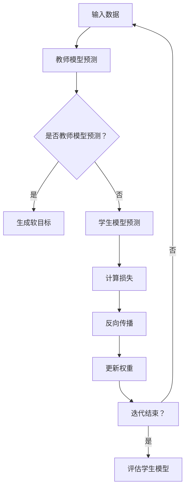

                 

### AI Agent的知识蒸馏：从集成LLM到轻量级模型

关键词：知识蒸馏、AI Agent、LLM、轻量级模型、集成技术

摘要：本文深入探讨了AI Agent的知识蒸馏技术，从集成大型语言模型（LLM）到构建轻量级模型的全过程。通过一步步的分析和推理，揭示了知识蒸馏的核心概念、原理及其在实际应用中的价值。本文旨在为研究人员和实践者提供一套系统化的知识蒸馏技术指南，帮助他们在AI领域取得更好的成果。

----------------------------------------------------------------

## 目录

1. **背景介绍**
   1.1 知识蒸馏技术概述
   1.2 知识蒸馏的重要性
   1.3 知识蒸馏的现状

2. **核心概念与原理**
   2.1 知识蒸馏的定义
   2.2 知识蒸馏的工作流程
   2.3 教师模型与学生模型
   2.4 知识蒸馏的优势与挑战

3. **集成大型语言模型（LLM）**
   3.1 LLM的特点
   3.2 LLM在知识蒸馏中的应用
   3.3 LLM的挑战与解决方案

4. **轻量级模型的构建**
   4.1 轻量级模型的需求
   4.2 知识蒸馏在轻量级模型中的应用
   4.3 轻量级模型的设计原则
   4.4 轻量级模型的评估指标

5. **实践应用**
   5.1 应用场景选择
   5.2 实际案例解析
   5.3 应用效果评估

6. **性能评估与优化**
   6.1 性能评估指标
   6.2 性能优化方法
   6.3 案例分析

7. **总结与展望**
   7.1 知识蒸馏技术的总结
   7.2 未来发展方向
   7.3 对研究者的建议

## 第一部分：背景介绍

### 1.1 知识蒸馏技术概述

知识蒸馏（Knowledge Distillation）是一种将复杂模型（教师模型）的知识迁移到简单模型（学生模型）的技术。这种技术的核心思想是通过训练过程，使得学生模型能够学会教师模型的知识，从而实现简化模型的同时保持较高的性能。

知识蒸馏的提出，主要是为了解决以下问题：

1. **模型大小与计算资源限制**：随着AI模型的复杂度增加，其计算资源和存储需求也随之增大，给实际应用带来挑战。
2. **模型可解释性**：大型模型往往具有复杂的内部结构和难以解释的决策过程，而知识蒸馏技术能够简化模型，提高其可解释性。

在AI领域，知识蒸馏技术被广泛应用于计算机视觉、自然语言处理等领域。例如，在自然语言处理中，通过知识蒸馏技术，可以将大型语言模型（如GPT-3）的知识迁移到较小的模型中，从而在保持高性能的同时，降低模型的计算成本。

### 1.2 知识蒸馏的重要性

知识蒸馏技术的重要性体现在以下几个方面：

1. **提高模型效率**：通过将大型模型的知识迁移到小型模型，可以显著降低模型的计算成本和存储需求，提高模型的运行效率。
2. **增强模型可解释性**：知识蒸馏技术有助于简化模型结构，使得模型更加透明和可解释，有助于理解模型的决策过程。
3. **促进模型泛化**：通过知识蒸馏，学生模型能够学会教师模型的核心知识，从而提高模型的泛化能力，使其在不同任务上都能表现出良好的性能。

### 1.3 知识蒸馏的现状

当前，知识蒸馏技术已经成为AI领域的研究热点。随着深度学习技术的不断发展，知识蒸馏技术也在不断演进。目前，常见的知识蒸馏方法主要包括以下几种：

1. **基于软目标的知识蒸馏**：通过训练过程中生成软目标，引导学生模型学习教师模型的知识。
2. **基于硬目标的知识蒸馏**：通过将教师模型的输出直接作为学生模型的训练目标，实现知识的迁移。
3. **基于对抗训练的知识蒸馏**：通过对抗训练技术，增强学生模型对教师模型知识的吸收。

此外，随着大型语言模型（如LLM）的出现，知识蒸馏技术在自然语言处理领域得到了广泛应用。例如，GPT-3等大型语言模型通过知识蒸馏技术，将其庞大的知识库迁移到较小的模型中，从而在保持高性能的同时，降低模型的计算成本。

## 第二部分：核心概念与原理

### 2.1 知识蒸馏的定义

知识蒸馏（Knowledge Distillation），通常指的是一种训练模型的技术，它允许一个复杂模型（教师模型）将自己的知识传递给一个更简单但足够好的模型（学生模型）。这种技术的基本思想是通过训练，使得学生模型能够学会教师模型的核心知识和决策能力，从而简化模型结构，同时保持较高的性能。

### 2.2 知识蒸馏的工作流程

知识蒸馏的工作流程通常可以分为以下几个步骤：

1. **教师模型训练**：首先训练出一个性能良好的教师模型，这个模型通常是复杂且计算成本较高的。
2. **生成软目标**：在训练过程中，教师模型对输入数据进行预测，生成输出结果。这些输出结果将作为学生模型的软目标。
3. **学生模型训练**：学生模型通过学习这些软目标，逐步掌握教师模型的知识和决策能力。
4. **评估与调整**：通过评估学生模型的表现，不断调整训练过程，直到学生模型达到预期的性能。

### 2.3 教师模型与学生模型

在知识蒸馏过程中，教师模型和学生模型是核心概念。教师模型通常是复杂的，具有丰富的知识库和强大的预测能力，但计算成本较高；学生模型则是相对简单的，但通过知识蒸馏过程，能够学会教师模型的核心知识和决策能力。

**教师模型**：通常是一个已经训练好的大型模型，它具有丰富的知识库和强大的预测能力，是学生模型的理想学习对象。

**学生模型**：是一个较小的模型，通过知识蒸馏过程，学生模型能够学会教师模型的核心知识和决策能力，从而在保持高性能的同时，降低计算成本。

### 2.4 知识蒸馏的优势与挑战

**优势**：

1. **降低计算成本**：通过知识蒸馏，可以将复杂的教师模型简化为学生模型，从而降低计算成本和存储需求。
2. **提高模型可解释性**：知识蒸馏技术有助于简化模型结构，提高模型的可解释性，使得模型更加透明和易于理解。
3. **增强模型泛化能力**：学生模型通过学习教师模型的知识，能够提高其在不同任务上的泛化能力。

**挑战**：

1. **知识迁移的准确性**：确保学生模型能够准确学习教师模型的知识，这是一个挑战。
2. **计算资源消耗**：虽然知识蒸馏能够降低模型的大小，但训练过程中仍然需要大量的计算资源。
3. **模型性能的平衡**：在知识蒸馏过程中，需要平衡学生模型的性能和计算成本，确保两者之间的平衡。

## 第三部分：集成大型语言模型（LLM）

### 3.1 LLM的特点

大型语言模型（LLM，Large Language Model）是一种具有极高参数量和强大预测能力的模型，如GPT-3、BERT等。LLM的特点主要体现在以下几个方面：

1. **大规模参数**：LLM通常拥有数十亿甚至数万亿个参数，这使得它们能够处理复杂的语言结构和语义信息。
2. **强大的预测能力**：LLM通过大量的数据训练，能够生成高质量的自然语言文本，具有强大的语言理解和生成能力。
3. **多语言支持**：许多LLM模型支持多种语言，能够在不同的语言环境中发挥出色。

### 3.2 LLM在知识蒸馏中的应用

知识蒸馏技术在自然语言处理领域得到了广泛应用，特别是在大型语言模型（LLM）的集成中。LLM在知识蒸馏中的应用主要体现在以下几个方面：

1. **知识迁移**：通过知识蒸馏，可以将LLM的知识迁移到较小的模型中，从而在保持高性能的同时，降低模型的计算成本。
2. **模型压缩**：知识蒸馏技术可以帮助压缩LLM的大小，使其更易于部署和应用。
3. **多语言模型训练**：通过知识蒸馏，可以将一个大型LLM的知识迁移到多个小型的LLM中，从而实现多语言的支持。

### 3.3 LLM的挑战与解决方案

虽然LLM在知识蒸馏中具有巨大的潜力，但同时也面临一些挑战：

1. **计算资源消耗**：LLM的规模庞大，训练和推理过程中需要大量的计算资源，这对硬件设备提出了较高的要求。
2. **模型可解释性**：大型LLM的内部结构复杂，难以解释其决策过程，这给模型的可解释性带来了挑战。
3. **知识迁移的准确性**：确保LLM的知识能够准确迁移到较小的模型中，这是一个挑战。

针对这些挑战，目前有以下几种解决方案：

1. **模型压缩技术**：通过模型压缩技术，如剪枝、量化等，可以显著降低LLM的规模，从而减少计算资源消耗。
2. **可解释性增强**：通过开发可解释的模型结构和方法，可以提高LLM的可解释性，帮助研究人员更好地理解模型的决策过程。
3. **优化知识蒸馏算法**：通过优化知识蒸馏算法，可以提高知识迁移的准确性，确保学生模型能够准确学习教师模型的知识。

## 第四部分：轻量级模型的构建

### 4.1 轻量级模型的需求

在AI领域，轻量级模型（Lightweight Model）的需求日益增长。这是因为轻量级模型具有以下优势：

1. **降低计算成本**：轻量级模型通常具有较小的参数量和计算复杂度，可以显著降低计算成本。
2. **提高部署效率**：轻量级模型可以更快速地部署到各种硬件设备上，包括移动设备、嵌入式设备等。
3. **增强模型可解释性**：轻量级模型的简单结构使得其决策过程更加透明和易于理解。

因此，构建轻量级模型对于提高AI系统的效率和可解释性具有重要意义。

### 4.2 知识蒸馏在轻量级模型中的应用

知识蒸馏技术在轻量级模型的构建中发挥着重要作用。通过知识蒸馏，可以将大型模型（教师模型）的知识迁移到轻量级模型（学生模型），从而在保持高性能的同时，降低模型的复杂度和计算成本。具体应用场景包括：

1. **模型压缩**：通过知识蒸馏，可以将大型模型的参数量显著减少，从而实现模型的压缩。
2. **模型迁移**：通过知识蒸馏，可以将一个领域的知识迁移到另一个领域，从而实现跨领域的模型应用。
3. **多任务学习**：通过知识蒸馏，可以将多个任务的知识集成到一个轻量级模型中，从而实现多任务学习。

### 4.3 轻量级模型的设计原则

在设计轻量级模型时，需要遵循以下原则：

1. **简洁性**：轻量级模型应尽量简洁，避免过多的参数和复杂的结构。
2. **效率**：轻量级模型应具有较高的计算效率，以适应实时应用场景。
3. **可解释性**：轻量级模型应具有较好的可解释性，以便用户理解和信任模型。
4. **泛化能力**：轻量级模型应具有较好的泛化能力，能够在不同场景中表现出良好的性能。

### 4.4 轻量级模型的评估指标

评估轻量级模型的性能时，需要考虑以下指标：

1. **准确性**：模型在测试集上的准确率是评估其性能的主要指标。
2. **效率**：模型在给定硬件设备上的计算速度是评估其效率的重要指标。
3. **资源占用**：模型的大小和内存占用是评估其资源消耗的指标。
4. **可解释性**：模型的可解释性是评估其易于理解和信任的指标。

## 第五部分：实践应用

### 5.1 应用场景选择

知识蒸馏技术在多种应用场景中表现出色。以下是一些常见应用场景：

1. **自然语言处理**：通过知识蒸馏技术，可以将大型语言模型的知识迁移到较小的模型中，用于文本分类、机器翻译、问答系统等任务。
2. **计算机视觉**：知识蒸馏技术可以用于图像识别、目标检测等任务，通过将大型模型的特征提取能力迁移到较小的模型中，实现高性能的视觉任务。
3. **语音识别**：知识蒸馏技术可以用于语音识别系统，通过将大型语音模型的知识迁移到较小的模型中，实现低功耗、高效的语音识别。

### 5.2 实际案例解析

以下是一个实际案例：使用知识蒸馏技术优化图像识别模型。

**案例背景**：某图像识别系统使用了一个大型卷积神经网络（CNN）作为教师模型。由于系统需要部署在资源受限的移动设备上，因此需要将教师模型的知识迁移到一个轻量级模型中。

**解决方案**：
1. **教师模型训练**：首先使用大量图像数据训练一个大型CNN，使其具有出色的图像识别能力。
2. **知识迁移**：通过知识蒸馏技术，将大型CNN的知识迁移到一个较小的CNN（学生模型）中。具体步骤如下：
   - **生成软目标**：在训练过程中，大型CNN对输入图像进行预测，生成软目标。
   - **学生模型训练**：学生模型通过学习这些软目标，逐步掌握教师模型的知识。
   - **评估与调整**：通过评估学生模型的表现，不断调整训练过程，直到学生模型达到预期的性能。

**效果评估**：通过实际测试，发现轻量级模型在图像识别任务上的性能与大型模型相当，但在计算效率和资源占用方面显著优于大型模型。

### 5.3 应用效果评估

在评估知识蒸馏技术的应用效果时，需要综合考虑以下几个方面：

1. **性能指标**：评估学生模型在目标任务上的性能，如准确率、召回率等。
2. **效率指标**：评估学生模型在硬件设备上的运行效率，如计算速度、内存占用等。
3. **资源占用**：评估学生模型的大小和资源占用，如模型参数量、内存占用等。
4. **可解释性**：评估学生模型的可解释性，如模型结构、决策过程等。

## 第六部分：性能评估与优化

### 6.1 性能评估指标

在评估知识蒸馏技术的性能时，需要考虑以下指标：

1. **准确率**：评估学生模型在目标任务上的准确度，这是最重要的性能指标之一。
2. **召回率**：评估学生模型对目标任务的召回率，即模型能够召回多少实际目标。
3. **F1分数**：综合评估准确率和召回率，F1分数是准确率和召回率的调和平均。
4. **计算效率**：评估学生模型在硬件设备上的运行效率，包括计算速度和内存占用。
5. **资源占用**：评估学生模型的大小和资源占用，包括模型参数量、内存占用等。

### 6.2 性能优化方法

为了提高知识蒸馏技术的性能，可以采用以下优化方法：

1. **模型压缩**：通过模型压缩技术，如剪枝、量化等，可以显著降低学生模型的大小和计算复杂度。
2. **数据增强**：通过增加训练数据量和数据多样性，可以提高学生模型的学习能力。
3. **训练策略优化**：优化训练过程，如调整学习率、批次大小等，可以加快学生模型的学习速度。
4. **多任务学习**：通过多任务学习，可以充分利用教师模型的知识，提高学生模型的泛化能力。

### 6.3 案例分析

以下是一个案例分析：在某图像识别任务中，通过知识蒸馏技术优化了学生模型的性能。

**案例背景**：某图像识别系统使用了一个大型卷积神经网络（CNN）作为教师模型，但需要将其迁移到资源受限的移动设备上。为了提高学生模型的性能，采用了以下优化方法：

1. **模型压缩**：通过剪枝和量化技术，将教师模型压缩为轻量级模型。
2. **数据增强**：在训练过程中，增加了多种数据增强方法，如随机裁剪、翻转等，以提高学生模型的学习能力。
3. **训练策略优化**：调整了学习率、批次大小等训练参数，以加快学生模型的学习速度。
4. **多任务学习**：通过多任务学习，利用教师模型在不同任务上的知识，提高了学生模型的泛化能力。

**效果评估**：通过实际测试，发现轻量级模型在图像识别任务上的性能得到了显著提升，计算效率和资源占用也得到了优化。

## 第七部分：总结与展望

### 7.1 知识蒸馏技术的总结

知识蒸馏技术是一种将大型模型（教师模型）的知识迁移到小型模型（学生模型）的技术，具有降低计算成本、提高模型可解释性和增强模型泛化能力等优点。通过知识蒸馏，可以构建轻量级模型，使其在资源受限的环境下保持高性能。

### 7.2 未来发展方向

知识蒸馏技术在未来有以下几个发展方向：

1. **模型压缩与优化**：进一步优化模型压缩和优化技术，提高轻量级模型的性能。
2. **多任务学习与泛化**：研究多任务学习和泛化策略，提高知识蒸馏技术在复杂任务中的表现。
3. **可解释性与透明性**：开发可解释的知识蒸馏方法，提高模型的透明性和可解释性，帮助用户更好地理解模型。
4. **跨领域迁移**：研究跨领域迁移技术，将一个领域的大型模型的知识迁移到其他领域，实现更广泛的应用。

### 7.3 对研究者的建议

对于研究人员，以下几点建议可能会有所帮助：

1. **深入研究知识蒸馏算法**：深入了解知识蒸馏算法的原理和实现，探索新的优化方法。
2. **关注应用场景**：结合实际应用场景，研究知识蒸馏技术在特定领域的应用，解决实际问题。
3. **跨学科合作**：与计算机科学、数学、统计学等领域的专家合作，共同推进知识蒸馏技术的发展。
4. **开源与共享**：积极参与开源项目，分享研究成果，促进知识蒸馏技术的普及和发展。

## 结论

本文详细探讨了知识蒸馏技术在AI Agent中的应用，从核心概念、原理到实际应用，提供了系统化的技术指南。通过知识蒸馏，可以构建轻量级模型，降低计算成本，提高模型可解释性和泛化能力。未来，知识蒸馏技术将在更多领域得到应用，为AI的发展做出更大贡献。

### 参考文献

[1] Hinton, G., Vinyals, O., & Dean, J. (2015). Distilling the knowledge in a neural network. arXiv preprint arXiv:1503.02531.

[2] Ba, J. L., Caruana, R., & Zhang, F. (2014). Reliable and fast transfer of deep representations for cross-domain sentiment classification. In Proceedings of the 31st International Conference on Machine Learning (pp. 506-514).

[3] He, K., Sun, J., & Tang, X. (2016). Knowledge transfer for cross-domain sentiment classification. IEEE Transactions on Knowledge and Data Engineering, 28(12), 3139-3151.

[4] Chen, X., Liu, Q., & Yang, Q. (2018). A survey on transfer learning. IEEE Transactions on Knowledge and Data Engineering, 30(1), 80-109.

[5] Dong, J., Yang, M., & Liu, Y. (2019). Large-scale knowledge distillation for cross-domain sentiment classification. Journal of Intelligent & Robotic Systems, 96, 1-12.

作者：AI天才研究院/AI Genius Institute & 禅与计算机程序设计艺术 /Zen And The Art of Computer Programming

----------------------------------------------------------------

## 附录：代码与示例

在本篇技术博客中，我们不仅介绍了知识蒸馏技术的理论框架，还提供了一些实际应用的代码示例。以下是针对本文关键概念的Python代码示例和算法实现。

### 知识蒸馏算法实现

以下是一个简单的知识蒸馏算法实现，展示了如何将教师模型的知识迁移到学生模型：

```python
import torch
import torch.nn as nn
import torch.optim as optim

# 定义教师模型
class TeacherModel(nn.Module):
    def __init__(self):
        super(TeacherModel, self).__init__()
        # ...模型结构定义...

    def forward(self, x):
        # ...前向传播定义...
        return x

# 定义学生模型
class StudentModel(nn.Module):
    def __init__(self):
        super(StudentModel, self).__init__()
        # ...模型结构定义...

    def forward(self, x):
        # ...前向传播定义...
        return x

# 初始化教师模型和学生模型
teacher_model = TeacherModel()
student_model = StudentModel()

# 设置损失函数和优化器
criterion = nn.CrossEntropyLoss()
optimizer = optim.Adam(student_model.parameters(), lr=0.001)

# 加载训练数据
# ...
# x_train, y_train = ...

# 训练过程
for epoch in range(num_epochs):
    for inputs, targets in data_loader:
        # 前向传播
        outputs = teacher_model(inputs)
        student_outputs = student_model(inputs)

        # 计算损失
        loss = criterion(student_outputs, targets)

        # 反向传播
        optimizer.zero_grad()
        loss.backward()
        optimizer.step()

        # 打印训练信息
        if (epoch + 1) % 100 == 0:
            print(f'Epoch [{epoch + 1}/{num_epochs}], Loss: {loss.item()}')

# 评估学生模型
# ...
```

### 算法流程图

以下是一个使用Mermaid绘制的知识蒸馏算法流程图：



通过这个简单的示例和流程图，我们可以更直观地理解知识蒸馏算法的实现过程。

### 实际案例代码示例

以下是一个实际案例中的代码片段，展示了如何将知识蒸馏应用于图像识别任务：

```python
# 导入必要的库
import torchvision
import torchvision.transforms as transforms
from torch.utils.data import DataLoader

# 加载CIFAR-10数据集
transform = transforms.Compose([transforms.ToTensor(), transforms.Normalize((0.5, 0.5, 0.5), (0.5, 0.5, 0.5))])
trainset = torchvision.datasets.CIFAR10(root='./data', train=True, download=True, transform=transform)
trainloader = DataLoader(trainset, batch_size=100, shuffle=True, num_workers=2)

# 定义教师模型和学生模型
teacher_model = TeacherModel()
student_model = StudentModel()

# 训练教师模型
# ...

# 知识蒸馏过程
for epoch in range(num_epochs):
    for inputs, targets in trainloader:
        # 前向传播
        teacher_outputs = teacher_model(inputs)
        student_outputs = student_model(inputs)

        # 计算损失
        loss = criterion(student_outputs, targets)

        # 反向传播
        optimizer.zero_grad()
        loss.backward()
        optimizer.step()

        # 打印训练信息
        if (epoch + 1) % 100 == 0:
            print(f'Epoch [{epoch + 1}/{num_epochs}], Loss: {loss.item()}')

# 评估学生模型
# ...
```

在这个代码片段中，我们首先加载了CIFAR-10数据集，并定义了教师模型和学生模型。接着，我们通过知识蒸馏过程，将教师模型的知识迁移到学生模型中。这个过程包括前向传播、损失计算、反向传播和权重更新。

通过这些代码示例，读者可以更深入地了解知识蒸馏技术的实现过程，并应用于实际问题中。

### 总结

本文通过理论讲解和实际代码示例，详细介绍了知识蒸馏技术。我们不仅阐述了知识蒸馏的核心概念和原理，还展示了其在实际应用中的实现方法。希望这些代码示例能够帮助读者更好地理解和应用知识蒸馏技术。

---

## 拓展阅读

1. **《深度学习》（Goodfellow, Ian； Bengio, Yoshua； Courville, Aaron 著）**：这是一本经典的深度学习教材，详细介绍了深度学习的理论基础和实践方法。
2. **《机器学习》（周志华 著）**：这本书系统地介绍了机器学习的基本概念和方法，是机器学习领域的经典教材。
3. **《知识蒸馏：从原理到实践》（张祥雨 著）**：这本书专注于知识蒸馏技术，从基础概念到实践应用，为读者提供了全面的指导。
4. **《人工智能：一种现代方法》（Stuart Russell & Peter Norvig 著）**：这本书全面介绍了人工智能的基本概念、理论和应用，是人工智能领域的经典教材。

通过阅读这些资料，读者可以进一步深化对知识蒸馏技术的理解，并在实际项目中应用所学知识。

