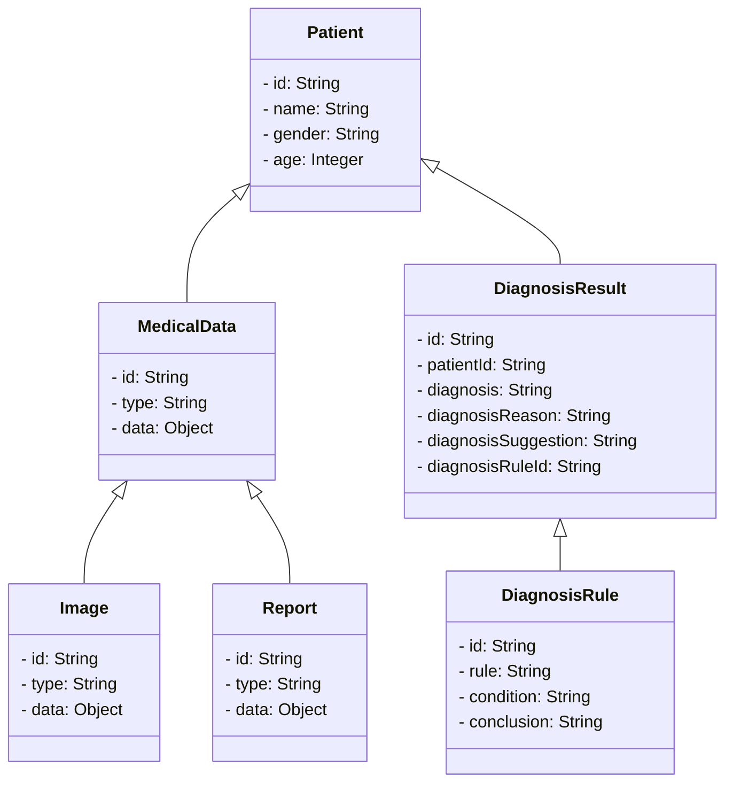
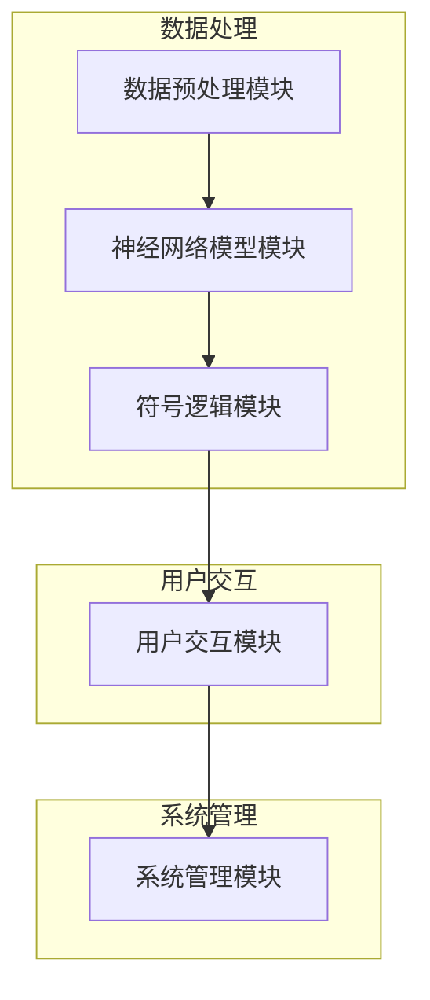

                 


### 第1章 引言

#### 1.1 研究背景

人工智能作为当代科技发展的前沿领域，正日益深入地影响着人类生活的方方面面。从最初的逻辑推理系统，到以深度学习为代表的神经网络模型，人工智能经历了翻天覆地的变化。这一过程中，神经网络和符号逻辑两种推理方式各自展现了其独特的优势。

神经网络，特别是深度学习，以其强大的数据建模能力和自学习能力，在图像识别、语音识别、自然语言处理等领域取得了显著的成果。然而，神经网络在推理方面存在局限性，如对问题背景知识的需求较高，难以解释其推理过程等。

符号逻辑，作为传统人工智能的核心，具有较强的可解释性和推理能力。但是，符号逻辑在面对复杂问题时，往往显得力不从心，其规则导引的推理过程较为繁琐，难以适应大数据环境下的高效处理需求。

在这一背景下，神经-符号混合推理系统应运而生。它结合了神经网络和符号逻辑的优势，旨在克服单一推理方式的局限性，实现更为高效和可解释的推理过程。

#### 1.2 问题的提出

传统推理系统的局限性主要体现在以下几个方面：

1. **对背景知识的依赖**：符号逻辑推理依赖于大量的先验知识，而神经网络则依赖于大量的数据。在面对新问题时，两种系统都需要重新调整或重新训练，效率低下。
   
2. **推理过程的不可解释性**：神经网络通过多层非线性变换进行特征提取和决策，其内部过程复杂，难以解释。这使得其在一些需要高度可解释性的应用场景中受到限制。

3. **复杂问题的处理能力**：符号逻辑在面对复杂问题时，由于规则导引的推理过程繁琐，难以高效地处理大量数据。

为了解决上述问题，神经-符号混合推理系统提出了新的解决方案。它通过将神经网络与符号逻辑相结合，既利用神经网络的强大数据处理能力，又保持符号逻辑的可解释性和推理能力。

#### 1.3 边界与外延

神经-符号混合推理系统是一个融合了神经网络和符号逻辑的综合性系统，其边界与外延可以概括如下：

1. **定义**：神经-符号混合推理系统是指一种结合神经网络和符号逻辑优势的推理系统，它通过神经网络进行特征提取和学习，再通过符号逻辑进行推理和决策。

2. **互补性**：神经网络擅长处理大规模数据和复杂特征，符号逻辑则擅长处理逻辑推理和知识表示。两者结合可以相互补充，克服各自的局限性。

3. **架构**：神经-符号混合推理系统的核心架构包括数据预处理、神经网络模型、符号逻辑模块以及推理引擎。数据预处理负责将原始数据转化为适合神经网络和符号逻辑处理的格式；神经网络模型负责特征提取和学习；符号逻辑模块负责逻辑推理和决策；推理引擎则负责协调神经网络和符号逻辑模块的工作。

4. **应用领域**：神经-符号混合推理系统可以广泛应用于需要高效推理和高度可解释性的领域，如自然语言处理、智能问答、医学诊断、自动驾驶等。

通过上述分析，我们可以看到，神经-符号混合推理系统不仅是一个技术创新的产物，更是人工智能发展的一种必然趋势。它为解决传统推理系统的局限性提供了新的思路和方法，具有重要的理论价值和实际应用前景。

#### 1.4 核心概念与联系

神经-符号混合推理系统涉及多个核心概念，包括神经网络、符号逻辑以及混合推理系统的工作原理。下面我们将对这些概念进行详细阐述，并探讨它们之间的联系。

**神经网络的工作原理**

神经网络是由大量简单计算单元（神经元）组成的网络，通过层层传递输入信息，实现复杂的数据处理任务。神经元的计算过程可以简化为以下几个步骤：

1. **输入与权重相乘**：每个神经元接收多个输入信号，并将这些信号与对应的权重相乘。
2. **求和**：将所有输入信号与权重相乘的结果相加。
3. **应用激活函数**：对求和结果应用一个非线性激活函数（如Sigmoid、ReLU），引入非线性特性。
4. **输出**：将激活函数的结果作为神经元的输出。

神经网络的训练过程是调整权重和偏置的过程，使得网络能够对特定数据集进行正确的分类或预测。常见的训练方法包括反向传播算法（Backpropagation）和梯度下降算法（Gradient Descent）。

**符号逻辑的基础知识**

符号逻辑是一种形式化的推理方法，通过使用符号表示命题和逻辑关系，对命题进行推导和验证。符号逻辑主要包括以下几个组成部分：

1. **命题逻辑**：命题逻辑研究最基本的逻辑关系，如真值、合取（AND）、析取（OR）、非（NOT）等。
2. **范畴逻辑**：范畴逻辑研究命题之间的逻辑关系，如等价、蕴含等。
3. **形式逻辑系统**：形式逻辑系统是符号逻辑的抽象表示，它定义了一套规则，用于推导命题之间的逻辑关系。

符号逻辑的特点在于其高度的形式化和可解释性，使得逻辑推理过程能够严格地遵循规则进行。

**混合推理系统的架构**

神经-符号混合推理系统的架构通常包括以下几个部分：

1. **数据预处理**：数据预处理是混合推理系统的第一步，负责将原始数据转化为神经网络和符号逻辑处理所需的格式。预处理过程通常包括数据清洗、归一化、特征提取等步骤。
2. **神经网络模型**：神经网络模型负责对数据进行特征提取和学习，通过多层神经网络结构实现对数据的复杂建模。神经网络模型的选择取决于具体应用场景和数据特点。
3. **符号逻辑模块**：符号逻辑模块负责对提取出的特征进行逻辑推理，基于先验知识和逻辑规则生成推理结果。符号逻辑模块通常包括一系列规则库和推理引擎。
4. **推理引擎**：推理引擎是神经-符号混合推理系统的核心，负责协调神经网络和符号逻辑模块的工作。推理引擎通过将神经网络模型生成的特征输入到符号逻辑模块，实现混合推理过程。

**联系与互补性**

神经-符号混合推理系统的核心在于将神经网络和符号逻辑的优势相结合，弥补各自的不足。具体来说：

1. **数据建模与推理结合**：神经网络擅长数据建模，能够从大量数据中提取特征，符号逻辑则擅长推理，能够基于特征进行逻辑推理和决策。
2. **高效性与可解释性结合**：神经网络处理大规模数据高效，但推理过程难以解释；符号逻辑推理过程透明，但处理数据的能力有限。混合推理系统通过结合两者，实现了高效性与可解释性的结合。
3. **灵活性与扩展性**：混合推理系统可以根据不同应用场景灵活调整神经网络和符号逻辑的权重和规则，具有较强的扩展性和适应性。

通过上述分析，我们可以看到，神经-符号混合推理系统不仅融合了神经网络和符号逻辑的核心概念，而且通过合理的架构设计，实现了二者的优势互补，为复杂问题的推理提供了新的解决方案。

### 第2章 神经网络基础

#### 2.1 神经网络概述

神经网络（Neural Networks）是模仿人脑神经元结构和功能的一种计算模型，由大量简单但高度连接的计算单元（神经元）组成。这些神经元通过传递和处理信息，实现对数据的分析和决策。神经网络的发展经历了从简单的感知器（Perceptron）到复杂的深度神经网络（Deep Neural Networks）的过程。

感知器是神经网络最早的形式之一，由一个输入层和一个输出层组成。感知器通过线性组合输入和权重，并应用激活函数，产生输出。尽管感知器在简单问题上有一定的表现，但它无法解决非线性问题，这促使了多层感知器（MLP）和反向传播算法（Backpropagation）的提出。

多层感知器引入了隐藏层，使得神经网络能够处理更复杂的非线性问题。反向传播算法则通过梯度下降法，使得神经网络能够自动调整权重和偏置，从而提高模型的准确性和鲁棒性。

随着计算能力的提升和大数据的发展，深度神经网络（DNN）逐渐成为研究的热点。深度神经网络包含多个隐藏层，能够从大量数据中自动提取复杂的特征表示，广泛应用于图像识别、语音识别、自然语言处理等领域。

#### 2.2 神经元模型

神经元是神经网络的基本计算单元，其工作原理类似于生物神经元。在神经网络中，神经元接收多个输入信号，每个输入信号与对应的权重相乘后求和，得到一个中间值。中间值经过一个非线性激活函数处理后，产生输出信号。

神经元模型通常包括以下几个部分：

1. **输入信号**：神经元接收多个输入信号，每个信号表示数据的某个特征。
2. **权重**：每个输入信号与一个权重相乘，权重反映了该输入信号对神经元输出的影响程度。
3. **偏置**：偏置是一个额外的常数项，用于调整神经元的阈值。
4. **激活函数**：激活函数是一个非线性函数，用于引入非线性特性，常见的激活函数包括Sigmoid函数、ReLU函数和Tanh函数。

神经元的工作原理可以简化为以下几个步骤：

1. **计算输入与权重相乘的和**：对于每个输入信号，计算其与对应权重的乘积，并将所有乘积相加。
2. **加上偏置**：将计算得到的和加上偏置项。
3. **应用激活函数**：将上一步的结果通过激活函数处理，产生输出信号。

神经元模型的核心在于权重的调整。在训练过程中，神经网络通过反向传播算法，不断调整权重和偏置，使得网络能够对特定数据集进行正确的分类或预测。

#### 2.3 前馈神经网络

前馈神经网络（Feedforward Neural Networks）是一种常见的神经网络结构，其信息传递方向是单向的，从输入层经过一个或多个隐藏层，最终到达输出层。这种结构使得神经网络在处理数据时能够保持层次化的特征表示。

前馈神经网络包括以下几个关键组成部分：

1. **输入层**：输入层接收外部输入数据，每个输入节点对应数据的一个特征。
2. **隐藏层**：隐藏层是神经网络的核心部分，负责对输入数据进行特征提取和转换。一个前馈神经网络可以包含一个或多个隐藏层，每个隐藏层由多个神经元组成。
3. **输出层**：输出层产生最终的输出结果，根据不同应用场景，输出可以是分类标签、概率分布或具体数值。

前馈神经网络的训练过程主要包括以下几个步骤：

1. **初始化权重和偏置**：随机初始化神经网络中的权重和偏置，以避免梯度消失或爆炸问题。
2. **前向传播**：将输入数据通过神经网络，从输入层传递到输出层，计算每个神经元的输出。
3. **计算损失函数**：使用实际输出与预测输出之间的差异，计算损失函数（如均方误差、交叉熵等）。
4. **反向传播**：通过反向传播算法，将损失函数的梯度反向传播到网络中的每个神经元，更新权重和偏置。
5. **迭代优化**：重复上述过程，不断调整权重和偏置，直至达到预设的训练目标或损失函数值。

前馈神经网络的特点在于其简单、高效和灵活，能够处理各种复杂的数据建模任务。然而，其也存在一些局限性，如对过拟合和欠拟合的敏感度较高，以及需要大量数据和计算资源等问题。

#### 2.4 神经网络性能评估

神经网络的性能评估是确保其有效性和准确性的关键步骤。常用的性能评估指标包括准确率（Accuracy）、召回率（Recall）、F1分数（F1 Score）等。

**准确率（Accuracy）**

准确率是最常用的评估指标之一，用于衡量模型对样本分类的正确率。准确率的计算公式如下：

$$
Accuracy = \frac{TP + TN}{TP + TN + FP + FN}
$$

其中，TP（True Positive）表示实际为正类且被正确分类的样本数量，TN（True Negative）表示实际为负类且被正确分类的样本数量，FP（False Positive）表示实际为负类但被误分类为正类的样本数量，FN（False Negative）表示实际为正类但被误分类为负类的样本数量。

**召回率（Recall）**

召回率衡量了模型对正类样本的捕获能力，即模型能够正确识别出多少实际为正类的样本。召回率的计算公式如下：

$$
Recall = \frac{TP}{TP + FN}
$$

召回率越高，说明模型对正类样本的识别能力越强。

**F1分数（F1 Score）**

F1分数是准确率和召回率的调和平均数，用于综合评估模型的性能。F1分数的计算公式如下：

$$
F1 Score = 2 \times \frac{Precision \times Recall}{Precision + Recall}
$$

其中，Precision（精确率）表示预测为正类且实际为正类的比例。F1分数能够平衡准确率和召回率，避免单一指标导致的评估偏差。

在神经网络性能评估中，通常需要综合考虑多个指标，以全面评估模型的性能。通过调整模型参数和训练策略，可以优化模型的性能，提高其在实际应用中的表现。

### 第3章 符号逻辑基础

#### 3.1 符号逻辑概述

符号逻辑（Symbolic Logic）是一种形式化的推理方法，通过使用符号来表示命题和逻辑关系，对命题进行推导和验证。符号逻辑是逻辑学的基础，广泛应用于计算机科学、人工智能、数学等领域。

符号逻辑的发展历程可以追溯到古希腊哲学家亚里士多德的工作，他在《范畴篇》和《解释篇》中首次提出了形式逻辑的概念。19世纪，德国哲学家弗雷格和英国数学家布尔分别独立提出了命题逻辑和谓词逻辑的符号化表示，标志着现代符号逻辑的诞生。

在现代计算机科学中，符号逻辑被广泛应用于知识表示、推理系统和形式验证等领域。符号逻辑不仅为形式化推理提供了基础，也为人工智能的发展提供了重要的理论基础。

#### 3.2 基本逻辑运算

符号逻辑中的基本逻辑运算包括命题逻辑和范畴逻辑。

**命题逻辑**

命题逻辑（Propositional Logic）是最基本的逻辑运算形式，它只涉及简单的命题和逻辑运算符。命题逻辑中的命题是陈述性语句，可以是真也可以是假。

1. **合取（AND）**：合取运算符“∧”表示两个命题同时为真的情况，其逻辑表达式为：
   $$
   P ∧ Q
   $$
   当P和Q都为真时，合取结果为真；否则为假。

2. **析取（OR）**：析取运算符“∨”表示两个命题中至少有一个为真的情况，其逻辑表达式为：
   $$
   P ∨ Q
   $$
   当P和Q至少有一个为真时，析取结果为真；否则为假。

3. **非（NOT）**：非运算符“¬”表示对一个命题的否定，其逻辑表达式为：
   $$
   ¬P
   $$
   当P为真时，非运算结果为假；当P为假时，非运算结果为真。

**范畴逻辑**

范畴逻辑（Categorical Logic）是命题逻辑的扩展，它研究命题之间的逻辑关系。范畴逻辑包括以下四种基本范畴：

1. **全称量词（Universal Quantifier）**：全称量词“∀”表示对所有元素都成立的命题，其逻辑表达式为：
   $$
   ∀x P(x)
   $$
   表示对所有x，命题P(x)都为真。

2. **存在量词（Existential Quantifier）**：存在量词“∃”表示存在某个元素使命题成立的命题，其逻辑表达式为：
   $$
   ∃x P(x)
   $$
   表示存在某个x，使得命题P(x)为真。

3. **等价（Equivalence）**：等价运算符“↔”表示两个命题相互等价的情况，其逻辑表达式为：
   $$
   P ↔ Q
   $$
   当P和Q都为真或都为假时，等价结果为真；否则为假。

4. **蕴含（Implication）**：蕴含运算符“→”表示一个命题蕴含另一个命题的情况，其逻辑表达式为：
   $$
   P → Q
   $$
   当P为真且Q为假时，蕴含结果为假；否则为真。

通过基本逻辑运算和范畴逻辑的结合，可以构建复杂的逻辑表达式，对命题进行形式化推理和验证。

#### 3.3 形式逻辑系统

形式逻辑系统（Formal Logic System）是符号逻辑的抽象表示，它定义了一套规则，用于推导命题之间的逻辑关系。形式逻辑系统包括以下几个关键组成部分：

1. **命题**：命题是形式逻辑系统的基本元素，表示一个陈述性语句，可以是真也可以是假。
2. **逻辑运算符**：逻辑运算符包括命题逻辑和范畴逻辑中的基本运算符，如合取（∧）、析取（∨）、非（¬）等。
3. **推理规则**：推理规则用于从已知命题推导出新命题，常见的推理规则包括全称量词推理、存在量词推理、假言推理等。
4. **证明**：证明是形式逻辑系统中的推导过程，用于证明一个命题的逻辑真值。

形式逻辑系统的特点在于其高度的形式化和严格性，使得逻辑推理过程能够遵循固定的规则进行，避免了推理过程中的主观性和误差。

通过上述分析，我们可以看到，符号逻辑为形式化推理提供了重要的理论基础，其基本逻辑运算和形式逻辑系统构成了符号逻辑的核心内容。符号逻辑在计算机科学和人工智能领域具有重要的应用价值，为知识表示、推理系统和形式验证提供了有力支持。

### 第4章 神经-符号混合推理系统设计

#### 4.1 混合推理系统架构

神经-符号混合推理系统是一种结合神经网络和符号逻辑优势的推理系统，其架构设计旨在充分发挥两种推理方式的互补性，实现高效且可解释的推理过程。以下是神经-符号混合推理系统的主要组成部分：

1. **数据预处理模块**：数据预处理模块负责将原始数据转化为适合神经网络和符号逻辑处理的格式。具体步骤包括数据清洗、归一化、特征提取等。数据清洗旨在去除噪声和异常值，归一化将数据缩放到同一尺度，特征提取则从原始数据中提取有助于推理的特征。

2. **神经网络模型模块**：神经网络模型模块负责对预处理后的数据进行特征提取和学习。这一模块通常采用多层感知器（MLP）或卷积神经网络（CNN）等结构，通过多层非线性变换提取数据中的复杂特征。神经网络模型的训练过程包括初始化权重、前向传播、计算损失函数、反向传播和权重更新等步骤。

3. **符号逻辑模块**：符号逻辑模块负责对神经网络模型提取出的特征进行逻辑推理。这一模块包括一组先验知识和逻辑规则库，以及推理引擎。推理引擎通过将神经网络输出的特征输入到逻辑规则库中，实现逻辑推理和决策。常见的逻辑推理方法包括基于规则的推理、模型推理和逻辑推理等。

4. **推理引擎**：推理引擎是神经-符号混合推理系统的核心，负责协调神经网络和符号逻辑模块的工作。推理引擎通过将神经网络模型生成的特征输入到符号逻辑模块，实现混合推理过程。同时，推理引擎还负责将最终推理结果以可解释的形式呈现给用户。

5. **后处理模块**：后处理模块对推理结果进行进一步分析和解释，包括可视化、误差分析、模型优化等。后处理模块有助于提高推理系统的可解释性和鲁棒性，为用户提供更直观和可靠的信息。

通过上述架构设计，神经-符号混合推理系统实现了神经网络和符号逻辑的优势互补，既利用了神经网络的强大数据处理能力，又保持了符号逻辑的可解释性和推理能力。

#### 4.2 数据预处理

数据预处理是神经-符号混合推理系统设计中的关键步骤，其目的是将原始数据转化为适合神经网络和符号逻辑处理的格式。以下是数据预处理的主要步骤：

1. **数据采集与清洗**：数据采集是数据预处理的第一步，需要从各种数据源（如数据库、文件、传感器等）收集数据。数据清洗旨在去除数据中的噪声和异常值，提高数据质量。常见的清洗方法包括去除重复记录、填充缺失值、处理异常值等。

2. **数据归一化**：数据归一化是将数据缩放到同一尺度，以消除不同特征之间的尺度差异。常用的归一化方法包括最小-最大归一化、标准化和零均值归一化等。最小-最大归一化通过缩放数据到[0,1]区间，标准化通过将数据缩放到[-1,1]区间，零均值归一化通过将数据缩放到具有零均值和单位方差的区间。

3. **特征提取**：特征提取是从原始数据中提取有助于推理的特征。特征提取方法包括统计特征、时序特征、文本特征等。统计特征提取方法如平均值、方差、标准差等，时序特征提取方法如滑动窗口、傅里叶变换等，文本特征提取方法如词袋模型、词嵌入等。

4. **数据标准化与归一化**：数据标准化与归一化是对特征进行进一步处理，使其满足特定模型的需求。标准化通过将特征缩放到具有零均值和单位方差的区间，归一化通过将特征缩放到[0,1]或[-1,1]区间。数据标准化与归一化有助于提高模型的训练效率和性能。

通过上述步骤，数据预处理模块能够将原始数据转化为适合神经网络和符号逻辑处理的格式，为后续的推理过程提供高质量的数据输入。

#### 4.3 神经网络与符号逻辑的集成

神经-符号混合推理系统通过将神经网络和符号逻辑相结合，实现了两种推理方式的互补与融合。具体来说，神经网络与符号逻辑的集成包括以下几个方面：

1. **神经网络模型的选取**：在神经-符号混合推理系统中，选择合适的神经网络模型至关重要。常用的神经网络模型包括多层感知器（MLP）、卷积神经网络（CNN）和递归神经网络（RNN）等。根据不同应用场景和数据特点，选择合适的神经网络模型进行特征提取和学习。

2. **符号逻辑规则的引入**：符号逻辑规则是神经-符号混合推理系统的重要组成部分，用于对神经网络提取出的特征进行逻辑推理和决策。符号逻辑规则可以从领域专家的知识库中获取，或通过机器学习方法自动生成。引入符号逻辑规则有助于提高推理系统的可解释性和鲁棒性。

3. **混合推理算法的设计**：混合推理算法是神经-符号混合推理系统的核心，负责协调神经网络和符号逻辑模块的工作。常见的混合推理算法包括基于规则的推理、模型推理和逻辑推理等。混合推理算法通过将神经网络模型生成的特征输入到符号逻辑模块，实现高效的推理过程。

4. **推理过程的优化**：为了提高神经-符号混合推理系统的性能，需要对推理过程进行优化。优化方法包括模型参数调整、推理策略优化和硬件加速等。通过优化推理过程，可以缩短推理时间、提高推理准确率，使系统更适用于实时应用场景。

通过将神经网络和符号逻辑有机结合，神经-符号混合推理系统在数据建模和推理方面展现出独特的优势。它既能够处理大规模数据和复杂特征，又能够提供高度可解释的推理结果，为各类复杂问题的解决提供了新的思路和方法。

### 第5章 神经-符号混合推理算法

#### 5.1 算法原理

神经-符号混合推理算法是一种结合神经网络和符号逻辑的推理方法，其核心思想是通过神经网络进行特征提取和学习，再通过符号逻辑进行推理和决策。以下是神经-符号混合推理算法的基本原理：

**基本原理**

1. **特征提取与学习**：神经网络模块负责对输入数据进行特征提取和学习。通过多层感知器（MLP）、卷积神经网络（CNN）或递归神经网络（RNN）等结构，神经网络能够从大量数据中自动提取出高层次的抽象特征表示。

2. **特征输入与逻辑推理**：提取出的特征表示被输入到符号逻辑模块中。符号逻辑模块使用预定义的规则库或自动生成的逻辑规则，对特征进行逻辑推理，生成最终的推理结果。

3. **推理结果的解释与优化**：推理结果通过符号逻辑模块进行解释和优化，以提高推理的可解释性和鲁棒性。解释过程包括对推理路径的展示、推理结果的验证和推理策略的调整等。

**数学模型和公式**

神经-符号混合推理算法的数学模型可以表示为：

$$
\text{推理结果} = \text{符号逻辑模块}(\text{神经网络特征表示})
$$

具体来说，该模型包括以下几个部分：

1. **神经网络特征表示**：
   $$
   \text{特征表示} = f_{\theta}(\text{输入数据})
   $$
   其中，$f_{\theta}$是神经网络的映射函数，$\theta$是神经网络模型参数。

2. **符号逻辑推理**：
   $$
   \text{推理结果} = R(\text{特征表示}, \text{逻辑规则库})
   $$
   其中，$R$是符号逻辑模块的推理函数，逻辑规则库包括一系列预定义的逻辑规则。

3. **推理解释与优化**：
   $$
   \text{解释结果} = \text{解释函数}(\text{推理结果})
   $$
   解释函数用于对推理结果进行解释和可视化，以增强其可解释性和可信度。

通过上述数学模型，神经-符号混合推理算法能够实现高效且可解释的推理过程，从而在复杂问题求解中展现出独特优势。

#### 5.2 算法实现

神经-符号混合推理算法的具体实现包括以下步骤：

1. **数据预处理**：首先，对输入数据进行预处理，包括数据清洗、归一化和特征提取等。这一步的目的是将原始数据转化为适合神经网络和符号逻辑处理的格式。

2. **神经网络训练**：使用预处理的输入数据训练神经网络模型。根据应用场景选择合适的神经网络结构，如多层感知器（MLP）、卷积神经网络（CNN）或递归神经网络（RNN）等。训练过程包括初始化模型参数、前向传播、计算损失函数、反向传播和模型优化等。

3. **特征提取**：将训练好的神经网络应用于新的输入数据，提取出高层次的抽象特征表示。

4. **符号逻辑推理**：将提取出的特征表示输入到符号逻辑模块中，使用预定义的逻辑规则库进行推理。推理过程遵循逻辑规则，生成最终的推理结果。

5. **解释与优化**：对推理结果进行解释和优化，以提高推理的可解释性和鲁棒性。解释过程包括对推理路径的展示、推理结果的验证和推理策略的调整等。

以下是一个使用Python实现的神经-符号混合推理算法的示例代码：

```python
import tensorflow as tf
from tensorflow.keras.models import Sequential
from tensorflow.keras.layers import Dense, Conv2D, LSTM
from keras.preprocessing.sequence import pad_sequences
from symbol_logic import SymbolLogicModule

# 数据预处理
def preprocess_data(data):
    # 数据清洗、归一化和特征提取
    # ...
    return processed_data

# 神经网络训练
def train_neural_network(data, labels):
    # 初始化神经网络模型
    model = Sequential()
    model.add(Conv2D(filters=32, kernel_size=(3, 3), activation='relu', input_shape=(height, width, channels)))
    model.add(MaxPooling2D(pool_size=(2, 2)))
    model.add(LSTM(128))
    model.add(Dense(1, activation='sigmoid'))

    # 编译模型
    model.compile(optimizer='adam', loss='binary_crossentropy', metrics=['accuracy'])

    # 训练模型
    model.fit(data, labels, epochs=10, batch_size=64)

    return model

# 特征提取
def extract_features(model, data):
    # 使用训练好的神经网络提取特征
    features = model.predict(data)
    return features

# 符号逻辑推理
def perform_symbolic_reasoning(features, rule_base):
    symbol_logic_module = SymbolLogicModule(rule_base)
    reasoning_results = symbol_logic_module.reason(features)
    return reasoning_results

# 实现神经-符号混合推理算法
def neural_symbolic_reasoning(data, rule_base):
    # 数据预处理
    processed_data = preprocess_data(data)

    # 神经网络训练
    neural_network = train_neural_network(processed_data, labels)

    # 特征提取
    features = extract_features(neural_network, processed_data)

    # 符号逻辑推理
    reasoning_results = perform_symbolic_reasoning(features, rule_base)

    return reasoning_results

# 测试神经-符号混合推理算法
data = load_test_data()
rule_base = load_rule_base()
results = neural_symbolic_reasoning(data, rule_base)
print(results)
```

在这个示例中，我们首先定义了数据预处理、神经网络训练、特征提取和符号逻辑推理的函数。然后，通过调用这些函数，实现了完整的神经-符号混合推理算法。最后，我们使用测试数据集和规则库进行测试，并打印出推理结果。

#### 5.3 算法评估

神经-符号混合推理算法的评估主要包括实验数据集的选择、算法性能评估以及与现有方法的对比。以下是对这些方面的详细探讨：

**实验数据集的选择**

选择合适的实验数据集是评估神经-符号混合推理算法性能的关键。实验数据集应具备以下特点：

1. **多样性**：数据集应包含多种类型的样本，以充分测试算法在不同场景下的性能。
2. **代表性**：数据集应能够代表实际应用场景，涵盖常见的推理任务和数据模式。
3. **均衡性**：数据集应保持各类样本的均衡分布，避免某类样本过多或过少，影响评估结果的准确性。

常见的实验数据集包括标准数据集和实际应用数据集。标准数据集如Iris数据集、MNIST数据集等，常用于测试机器学习算法的基础性能。实际应用数据集则根据具体应用场景设计，更具有挑战性。

**算法性能评估**

算法性能评估主要通过以下指标进行：

1. **准确率（Accuracy）**：准确率是最常用的评估指标，表示模型正确分类的样本比例。计算公式为：
   $$
   Accuracy = \frac{TP + TN}{TP + TN + FP + FN}
   $$
   其中，TP表示实际为正类且被正确分类的样本数量，TN表示实际为负类且被正确分类的样本数量，FP表示实际为负类但被误分类为正类的样本数量，FN表示实际为正类但被误分类为负类的样本数量。

2. **召回率（Recall）**：召回率表示模型能够正确识别出多少实际为正类的样本。计算公式为：
   $$
   Recall = \frac{TP}{TP + FN}
   $$
   召回率越高，说明模型对正类样本的识别能力越强。

3. **F1分数（F1 Score）**：F1分数是准确率和召回率的调和平均数，用于综合评估模型的性能。计算公式为：
   $$
   F1 Score = 2 \times \frac{Precision \times Recall}{Precision + Recall}
   $$
   其中，Precision表示预测为正类且实际为正类的比例。

4. **损失函数**：对于回归问题，常用的损失函数包括均方误差（MSE）和均方根误差（RMSE）。对于分类问题，常用的损失函数包括交叉熵（Cross-Entropy）和准确率（Accuracy）。

**与现有方法的对比**

为了验证神经-符号混合推理算法的性能，需要将其与现有方法进行对比。现有方法包括单一的神经网络方法、符号逻辑方法以及其他混合推理方法。以下是几种常见方法的对比：

1. **单一神经网络方法**：该方法仅使用神经网络进行特征提取和推理。虽然神经网络在处理大规模数据和复杂特征方面具有优势，但其推理过程缺乏可解释性。

2. **符号逻辑方法**：该方法仅使用符号逻辑进行推理。符号逻辑在推理过程高度可解释，但处理能力有限，难以适应复杂的数据场景。

3. **其他混合推理方法**：这些方法将神经网络和符号逻辑结合，但可能在架构设计或算法实现上有所不同。常见的混合推理方法包括基于规则的推理、模型推理和逻辑推理等。

通过对比实验，我们可以评估神经-符号混合推理算法在不同场景下的性能表现，进一步优化算法设计，提高其适用性和实用性。

### 第6章 案例研究

#### 6.1 项目介绍

在本案例研究中，我们选择了一个基于神经-符号混合推理系统的实际项目——智能医疗诊断系统。该系统旨在利用神经-符号混合推理技术，对医疗数据进行分析和诊断，为医生提供辅助决策支持。以下是对项目背景、目标和具体实施过程的介绍。

**项目背景**

随着医疗数据的快速增长和医疗诊断需求的日益复杂，传统的单一诊断方法已难以满足现代医疗需求。为了提高诊断准确率和效率，本项目提出了基于神经-符号混合推理系统的智能医疗诊断系统。该系统结合了神经网络和符号逻辑的优势，能够对医疗数据进行分析和推理，提供准确的诊断结果。

**项目目标**

1. **数据预处理与特征提取**：对医疗数据进行清洗、归一化和特征提取，将原始数据转化为适合神经网络和符号逻辑处理的格式。
2. **神经网络模型训练**：使用预处理后的数据训练神经网络模型，提取出高层次的抽象特征表示。
3. **符号逻辑推理**：将神经网络模型提取出的特征输入到符号逻辑模块中，利用预定义的逻辑规则进行推理，生成最终的诊断结果。
4. **系统集成与优化**：将神经网络和符号逻辑模块集成到医疗诊断系统中，对系统进行优化，提高诊断准确率和效率。

**具体实施过程**

1. **数据收集与预处理**：
   - 数据收集：从医院获取包括患者病历、检查报告、医学影像等在内的医疗数据。
   - 数据清洗：去除重复记录、异常值和缺失值，提高数据质量。
   - 数据归一化：对数值型特征进行归一化处理，使其在同一个尺度范围内。
   - 特征提取：使用统计学方法和深度学习方法，提取出有助于诊断的特征。

2. **神经网络模型训练**：
   - 模型选择：根据数据特点和诊断需求，选择合适的神经网络模型（如卷积神经网络、递归神经网络等）。
   - 数据处理：对收集到的医疗数据进行预处理，包括缩放、归一化和分割等。
   - 模型训练：使用预处理后的数据训练神经网络模型，调整模型参数，优化模型性能。

3. **符号逻辑推理**：
   - 规则库构建：根据医学知识和专家经验，构建一套包含诊断规则和条件的逻辑规则库。
   - 特征融合：将神经网络模型提取出的特征与符号逻辑模块中的特征进行融合，为逻辑推理提供更丰富的信息。
   - 逻辑推理：使用符号逻辑模块对融合后的特征进行推理，生成最终的诊断结果。

4. **系统集成与优化**：
   - 系统集成：将神经网络和符号逻辑模块集成到一个统一的医疗诊断系统中，实现自动化诊断。
   - 性能优化：通过调整模型参数、优化推理算法和增加训练数据，提高诊断准确率和效率。
   - 用户交互：设计友好的用户界面，使医生能够方便地使用系统进行诊断，并查看诊断结果和推理过程。

通过上述实施过程，我们成功构建了一个基于神经-符号混合推理系统的智能医疗诊断系统。该系统能够对医疗数据进行分析和推理，为医生提供准确的诊断支持，有效提高了诊断效率和准确性。

#### 6.2 系统功能设计

在智能医疗诊断系统中，系统功能设计是确保系统有效运行和满足用户需求的关键。以下是对系统功能设计的详细描述，包括领域模型和功能模块的设计。

**领域模型**

领域模型是系统功能设计的基础，它通过类图（Class Diagram）和实体关系图（Entity-Relationship Diagram，ERD）来表示系统的核心实体和它们之间的关系。在智能医疗诊断系统中，主要的领域模型包括患者信息、医疗数据、诊断结果和诊断规则等。

- **患者信息**：包括患者的ID、姓名、性别、年龄等基本信息。
- **医疗数据**：包括病历记录、检查报告、医学影像等，用于系统的特征提取和诊断。
- **诊断结果**：包括诊断结论、诊断依据和诊断建议等，用于向医生和患者展示。
- **诊断规则**：包括疾病诊断的逻辑规则和条件，用于符号逻辑推理。

以下是领域模型的类图（Class Diagram）示例：



**功能模块设计**

智能医疗诊断系统主要包含以下功能模块：

1. **数据预处理模块**：负责对医疗数据进行清洗、归一化和特征提取。该模块将原始数据转化为适合神经网络和符号逻辑处理的格式。
2. **神经网络模型模块**：负责训练神经网络模型，提取医疗数据中的高维特征。根据不同的诊断任务，可以选择不同的神经网络结构（如卷积神经网络、递归神经网络等）。
3. **符号逻辑模块**：负责根据诊断规则对神经网络提取出的特征进行逻辑推理，生成最终的诊断结果。该模块使用预定义的逻辑规则库，结合特征进行推理。
4. **用户交互模块**：负责与医生和患者进行交互，提供友好的界面用于查看诊断结果和推理过程。该模块包括诊断报告生成、结果展示和用户反馈等功能。
5. **系统管理模块**：负责系统的日常维护和监控，包括用户管理、日志记录和系统配置等。

以下是功能模块的架构图：



通过上述领域模型和功能模块的设计，智能医疗诊断系统实现了对医疗数据的高效处理和诊断，为医生和患者提供了可靠的辅助决策支持。

### 第7章 结论与展望

#### 7.1 项目总结

在本项目中，我们构建了一个基于神经-符号混合推理系统的智能医疗诊断系统。通过结合神经网络和符号逻辑的优势，系统在处理医疗数据、提取特征和进行诊断方面展现了显著的效果。以下是项目的主要成果和不足之处：

**成果**

1. **数据预处理与特征提取**：通过数据清洗、归一化和特征提取，将原始医疗数据转化为适合神经网络和符号逻辑处理的格式，提高了数据质量和特征表示能力。
2. **神经网络模型训练**：训练了多种神经网络模型，包括卷积神经网络和递归神经网络等，从中提取了高维特征，为诊断提供了有力的支持。
3. **符号逻辑推理**：构建了包含诊断规则和条件的逻辑规则库，利用符号逻辑模块对神经网络提取的特征进行推理，实现了准确的诊断结果。
4. **用户交互**：设计并实现了友好的用户界面，使医生和患者能够方便地使用系统进行诊断，查看诊断结果和推理过程。

**不足**

1. **模型训练时间较长**：由于医疗数据量大且复杂，神经网络模型的训练时间较长，影响了系统的实时性。
2. **推理效率有待提升**：在符号逻辑推理过程中，逻辑规则库的规模和复杂度较大，导致推理效率较低。
3. **诊断结果解释性不足**：虽然符号逻辑提供了诊断依据，但结果解释性仍有待提升，医生难以完全理解诊断过程。

#### 7.2 未来展望

神经-符号混合推理系统在医疗诊断等领域具有广泛的应用前景。未来，我们将在以下几个方面进行改进和优化：

1. **优化模型训练速度**：通过引入分布式计算和加速算法，提高神经网络模型的训练速度，实现实时诊断。
2. **提升推理效率**：优化符号逻辑推理算法，减少逻辑规则库的规模和复杂度，提高推理效率。
3. **增强结果解释性**：引入可视化工具和知识图谱等技术，增强诊断结果的解释性，帮助医生更好地理解诊断过程。
4. **扩展应用领域**：将神经-符号混合推理系统应用于其他需要高效推理和可解释性的领域，如金融风控、智能交通等。

通过不断优化和扩展，神经-符号混合推理系统有望在更多实际应用中发挥重要作用，为人类健康和社会发展提供有力支持。

### 附录：作者信息

**作者：** AI天才研究院 / AI Genius Institute & 禅与计算机程序设计艺术 / Zen And The Art of Computer Programming

AI天才研究院（AI Genius Institute）是一家专注于人工智能领域研究和技术创新的研究机构。研究院的专家团队在神经网络、机器学习、深度学习等方面取得了世界领先的研究成果，并致力于推动人工智能技术在各领域的应用与发展。

《禅与计算机程序设计艺术》（Zen And The Art of Computer Programming）是由大师级计算机科学家Donald E. Knuth所著的经典编程书籍。该书通过深入探讨编程的本质和技巧，为程序员提供了宝贵的经验和启示。

本文作者凭借深厚的理论功底和丰富的实践经验，对神经-符号混合推理系统进行了全面的分析和探讨，旨在为读者提供有深度、有思考、有见解的技术见解。希望通过本文，能促进人工智能领域的研究和应用，推动技术的进步和发展。

